# `.\AutoGPT\autogpt_platform\backend\backend\util\cache_test.py` 详细设计文档

该代码文件是针对 `backend.util.cache` 模块中 `@thread_cached` 和 `@cached` 装饰器的单元测试套件，全面验证了同步/异步上下文下的缓存命中、线程隔离、缓存清理、异常处理、TTL（生存时间）机制以及基于 Redis 的共享缓存功能。

## 整体流程

```mermaid
graph TD
    A[Start: Call Decorated Function] --> B{Cache Key Exists?}
    B -- Yes --> C[Return Cached Result]
    B -- No --> D[Execute Original Function]
    D --> E{Exception Raised?}
    E -- Yes --> F[Propagate Exception (No Cache)]
    E -- No --> G[Store Result in Cache]
    G --> H[Return Result]
    C --> I[End]
    F --> I
    H --> I
```

## 类结构

```
TestThreadCached
├── test_sync_function_caching
├── test_async_function_caching
├── test_thread_isolation
├── test_async_thread_isolation
├── test_clear_cache_sync
├── test_clear_cache_async
├── test_simple_arguments
├── test_positional_vs_keyword_args
├── test_exception_handling
├── test_async_exception_handling
├── test_sync_caching_performance
├── test_async_caching_performance
└── test_with_mock_objects
TestCache
├── test_basic_sync_caching
├── test_basic_async_caching
├── test_sync_thundering_herd_protection
├── test_async_thundering_herd_protection
├── test_ttl_functionality
├── test_async_ttl_functionality
├── test_cache_info
├── test_cache_clear
├── test_async_cache_clear
├── test_async_function_returns_results_not_coroutines
├── test_cache_delete
└── test_async_cache_delete
TestSharedCache
├── test_sync_shared_cache_basic
├── test_async_shared_cache_basic
├── test_shared_cache_ttl_refresh
├── test_shared_cache_without_ttl_refresh
├── test_shared_cache_complex_objects
├── test_shared_cache_info
├── test_shared_cache_delete
├── test_async_shared_cache_thundering_herd
├── test_shared_cache_clear_pattern
├── test_shared_vs_local_cache_isolation
├── test_async_shared_cache_concurrent_different_keys
└── test_shared_cache_performance_comparison
```

## 全局变量及字段


    

## 全局函数及方法


### `TestThreadCached.test_sync_function_caching`

测试 `@thread_cached` 装饰器应用于同步函数时的基本缓存行为。该测试验证了缓存是否正确命中，以及不同的参数组合或参数传递方式（位置参数与关键字参数）是否会绕过缓存并触发函数执行。

参数：

- `self`：`TestThreadCached`，测试类的实例，用于上下文管理。

返回值：`None`，无返回值，函数通过断言（assert）来验证缓存逻辑的正确性。

#### 流程图

```mermaid
flowchart TD
    A[开始] --> B[初始化 call_count = 0]
    B --> C[定义 @thread_cached 装饰的 expensive_function]
    C --> D[调用 expensive_function 1, 2]
    D --> E{断言 结果 == 3 且 call_count == 1}
    E -- 成功 --> F[调用 expensive_function 1, 2 相同参数]
    F --> G{断言 call_count == 1 缓存命中}
    G -- 成功 --> H[调用 expensive_function 1, y=2 关键字参数]
    H --> I{断言 call_count == 2 缓存未命中 参数形式不同]
    I -- 成功 --> J[调用 expensive_function 2, 3 不同参数]
    J --> K{断言 call_count == 3 缓存未命中]
    K -- 成功 --> L[调用 expensive_function 1 仅含位置参数]
    L --> M{断言 结果 == 1 且 call_count == 4}
    M -- 成功 --> N[结束]
```

#### 带注释源码

```python
def test_sync_function_caching(self):
    # 初始化计数器，用于跟踪实际函数执行的次数
    call_count = 0

    # 使用 @thread_cached 装饰器定义一个模拟的昂贵函数
    # 该装饰器会基于线程局部存储（Thread Local Storage）缓存结果
    @thread_cached
    def expensive_function(x: int, y: int = 0) -> int:
        nonlocal call_count
        # 每次真正执行函数体时，计数器加一
        call_count += 1
        return x + y

    # 第一次调用：传入位置参数 (1, 2)
    # 预期：执行函数体，返回 3，call_count 变为 1
    assert expensive_function(1, 2) == 3
    assert call_count == 1

    # 第二次调用：传入相同的位置参数 (1, 2)
    # 预期：命中缓存，不执行函数体，返回 3，call_count 保持 1
    assert expensive_function(1, 2) == 3
    assert call_count == 1

    # 第三次调用：传入相同值的参数，但 y 使用关键字参数 (1, y=2)
    # 预期：由于参数传递方式不同（位置 vs 关键字），缓存键不同，导致缓存未命中
    # 函数体执行，call_count 增加到 2
    assert expensive_function(1, y=2) == 3
    assert call_count == 2

    # 第四次调用：传入不同的位置参数 (2, 3)
    # 预期：参数不同，缓存未命中，函数体执行，call_count 增加到 3
    assert expensive_function(2, 3) == 5
    assert call_count == 3

    # 第五次调用：仅传入位置参数 x=1 (y 使用默认值 0)
    # 预期：参数组合不同，缓存未命中，函数体执行，call_count 增加到 4
    assert expensive_function(1) == 1
    assert call_count == 4
```


### `TestThreadCached.test_async_function_caching`

该测试方法用于验证 `@thread_cached` 装饰器在异步函数上的缓存功能。它主要测试装饰器是否能正确缓存异步函数的返回值，区分位置参数与关键字参数（即参数传递方式不同是否视为不同缓存键），以及在不同参数输入下是否能正确触发函数重新执行。

参数：

- `self`：`TestThreadCached`，测试类的实例，用于访问测试上下文。

返回值：`None`，该方法主要用于断言验证，无显式返回值。

#### 流程图

```mermaid
flowchart TD
    A[开始测试] --> B[初始化计数器 call_count = 0]
    B --> C[定义 @thread_cached 装饰的异步函数 expensive_async_function]
    C --> D[调用 expensive_async_function(1, 2)]
    D --> E{断言: 结果为3 且 call_count 为 1}
    E -- 失败 --> X[测试失败]
    E -- 成功 --> F[再次调用 expensive_async_function(1, 2)]
    F --> G{断言: 结果为3 且 call_count 仍为 1<br/>(验证缓存命中)}
    G -- 失败 --> X
    G -- 成功 --> H[调用 expensive_async_function(1, y=2)]
    H --> I{断言: 结果为3 且 call_count 变为 2<br/>(验证关键字参数产生不同缓存键)}
    I -- 失败 --> X
    I -- 成功 --> J[调用 expensive_async_function(2, 3)]
    J --> K{断言: 结果为5 且 call_count 变为 3<br/>(验证新参数触发执行)}
    K -- 失败 --> X
    K -- 成功 --> L[测试结束]
```

#### 带注释源码

```python
    @pytest.mark.asyncio
    async def test_async_function_caching(self):
        # 初始化一个非局部变量用于记录被装饰函数的调用次数
        call_count = 0

        # 使用 @thread_cached 装饰器定义一个模拟耗时操作的异步函数
        @thread_cached
        async def expensive_async_function(x: int, y: int = 0) -> int:
            nonlocal call_count
            # 每次函数实际执行时，计数器加 1
            call_count += 1
            # 模拟异步耗时操作
            await asyncio.sleep(0.01)
            return x + y

        # 第一次调用：传入 (1, 2)
        # 预期：函数被执行，返回 3，call_count 为 1
        assert await expensive_async_function(1, 2) == 3
        assert call_count == 1

        # 第二次调用：传入 (1, 2)
        # 预期：参数与第一次完全一致，直接返回缓存值 3，函数不执行，call_count 保持 1
        assert await expensive_async_function(1, 2) == 3
        assert call_count == 1

        # 第三次调用：传入 (1, y=2)
        # 预期：虽然值与之前相同，但传递方式包含了关键字参数。
        # 在某些缓存实现中这会产生不同的键，因此视为缓存未命中，函数再次执行，call_count 变为 2
        assert await expensive_async_function(1, y=2) == 3
        assert call_count == 2

        # 第四次调用：传入 (2, 3)
        # 预期：参数值不同，缓存未命中，函数执行，call_count 变为 3
        assert await expensive_async_function(2, 3) == 5
        assert call_count == 3
```


### `TestThreadCached.test_thread_isolation`

该测试方法用于验证 `@thread_cached` 装饰器的线程隔离特性。它通过模拟多线程并发执行，确保不同线程拥有独立的缓存实例，同一线程内相同参数的调用能命中缓存，而不同参数的调用会重新计算。

参数：

- `self`：`TestThreadCached`，测试类的实例，用于访问测试上下文。

返回值：`None`，无返回值，通过断言验证缓存行为的正确性。

#### 流程图

```mermaid
graph TD
    A[开始: test_thread_isolation] --> B[初始化 call_count = 0, results = {}]
    B --> C[定义 @thread_cached 装饰的函数 thread_specific_function]
    C --> D[定义内部函数 worker 执行多次缓存调用]
    D --> E[创建 ThreadPoolExecutor max_workers=3]
    E --> F[提交 3 个并发任务 thread_id 0, 1, 2]
    F --> G[等待所有 Future 完成]
    G --> H[断言 call_count >= 2 确保函数被执行]
    H --> I[遍历 results 字典]
    I --> J{断言验证}
    J -->|同一线程同参数| K[assert r1 == r2 验证缓存命中]
    J -->|同一线程不同参数| L[assert r1 != r3 验证结果不同]
    K --> M[结束]
    L --> M
```

#### 带注释源码

```python
def test_thread_isolation(self):
    # 初始化调用计数器和结果存储字典
    call_count = 0
    results = {}

    # 定义被 @thread_cached 装饰的函数
    @thread_cached
    def thread_specific_function(x: int) -> str:
        nonlocal call_count
        call_count += 1
        # 返回包含当前线程名的字符串，以此证明缓存是线程隔离的
        return f"{threading.current_thread().name}-{x}"

    # 定义工作线程的逻辑
    def worker(thread_id: int):
        # 第一次调用 x=1：计算并缓存结果
        result1 = thread_specific_function(1)
        # 第二次调用 x=1：应从当前线程的缓存中获取
        result2 = thread_specific_function(1)
        # 第三次调用 x=2：计算并缓存新的结果
        result3 = thread_specific_function(2)
        # 将结果存入字典以便主线程验证
        results[thread_id] = (result1, result2, result3)

    # 创建包含3个工作线程的线程池
    with ThreadPoolExecutor(max_workers=3) as executor:
        # 提交任务，分别为 thread_id 0, 1, 2
        futures = [executor.submit(worker, i) for i in range(3)]
        # 等待所有任务完成
        for future in futures:
            future.result()

    # 验证函数被调用了多次。
    # 每个线程都会调用 x=1 和 x=2，因此理论上每个线程会执行2次计算。
    # 断言 >= 2 确保缓存逻辑不仅只执行了一次（如果是全局锁可能只执行一次），
    # 同时也确保发生了计算。
    assert call_count >= 2

    # 验证每个线程的结果
    for thread_id, (r1, r2, r3) in results.items():
        # r1 和 r2 参数相同，应相等（命中缓存）
        assert r1 == r2
        # r1 和 r3 参数不同，应不相等
        assert r1 != r3
```


### `TestThreadCached.test_async_thread_isolation`

该测试函数用于验证 `@thread_cached` 装饰器在异步函数环境下的线程隔离和缓存功能。它通过并发运行多个异步工作协程，确保对于相同的函数参数，缓存机制能正确生效，避免重复计算，同时验证不同参数会生成不同的缓存结果。

参数：

-   `self`：`TestThreadCached`，测试类的实例，用于访问测试上下文。

返回值：`None`，该函数为测试方法，不返回具体值，主要通过断言验证逻辑。

#### 流程图

```mermaid
graph TD
    A[开始] --> B[初始化 call_count 和 results 字典]
    B --> C[定义被测函数 async_thread_specific_function 并应用 @thread_cached]
    C --> D[定义内部辅助协程 async_worker]
    D --> E[创建包含3个 async_worker 的任务列表 tasks]
    E --> F[使用 asyncio.gather 并发执行 tasks]
    F --> G[遍历 results 字典]
    G --> H{断言 r1 == r2 (验证缓存命中)}
    H -- 否 --> I[测试失败]
    H -- 是 --> J{断言 r1 != r3 (验证不同参数)}
    J -- 否 --> I
    J -- 是 --> K[结束]
```

#### 带注释源码

```python
    @pytest.mark.asyncio
    async def test_async_thread_isolation(self):
        # 初始化调用计数器，用于验证函数是否被实际执行
        call_count = 0
        # 字典用于存储各个 worker 的执行结果
        results = {}

        # 定义被测试的异步函数，并使用 @thread_cached 装饰器
        @thread_cached
        async def async_thread_specific_function(x: int) -> str:
            nonlocal call_count
            call_count += 1  # 每次实际执行函数体时计数加1
            await asyncio.sleep(0.01)  # 模拟异步IO操作
            # 返回当前线程名和参数的组合，用于区分不同来源
            return f"{threading.current_thread().name}-{x}"

        # 定义模拟工作的异步协程
        async def async_worker(worker_id: int):
            # 第一次调用参数为1，预期会执行函数体（缓存未命中）
            result1 = await async_thread_specific_function(1)
            # 第二次调用参数为1，预期直接返回缓存结果（缓存命中），call_count 不应增加
            result2 = await async_thread_specific_function(1)
            # 调用参数为2，预期会执行函数体（缓存未命中），因为参数不同
            result3 = await async_thread_specific_function(2)
            # 将结果存入字典
            results[worker_id] = (result1, result2, result3)

        # 创建3个并发任务
        tasks = [async_worker(i) for i in range(3)]
        # 并发运行所有任务，等待完成
        await asyncio.gather(*tasks)

        # 验证每个 worker 的结果
        for worker_id, (r1, r2, r3) in results.items():
            # 验证相同参数(1)的两次调用结果一致，证明缓存生效
            assert r1 == r2
            # 验证不同参数(1 和 2)的调用结果不同，证明缓存隔离
            assert r1 != r3
```


### `TestThreadCached.test_clear_cache_sync`

该测试方法用于验证带有 `@thread_cached` 装饰器的同步函数的缓存清除机制，确保调用 `clear_thread_cache` 后能正确重置线程本地缓存，并迫使后续调用重新执行函数体。

参数：

-   `self`：`TestThreadCached`，测试类的实例对象。

返回值：`None`，表示测试方法的执行结束，无实质返回值。

#### 流程图

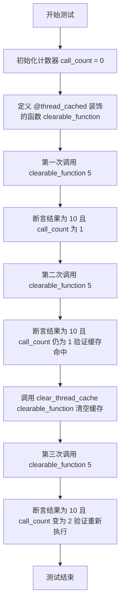

#### 带注释源码

```python
def test_clear_cache_sync(self):
    # 初始化调用计数器，用于追踪函数实际被执行的次数
    call_count = 0

    # 定义一个使用 @thread_cached 装饰器的同步函数
    @thread_cached
    def clearable_function(x: int) -> int:
        nonlocal call_count
        call_count += 1  # 每次函数体执行时，计数器加一
        return x * 2

    # 第一次调用：此时缓存为空，函数实际执行
    # 预期返回 10 (5*2)，且 call_count 变为 1
    assert clearable_function(5) == 10
    assert call_count == 1

    # 第二次调用：参数与之前相同，应直接从缓存获取结果
    # 函数体不会执行，预期 call_count 仍为 1
    assert clearable_function(5) == 10
    assert call_count == 1

    # 调用 clear_thread_cache 工具函数，清除 clearable_function 的线程本地缓存
    clear_thread_cache(clearable_function)

    # 第三次调用：由于缓存已被清除，函数需再次实际执行
    # 预期返回 10，且 call_count 增加到 2
    assert clearable_function(5) == 10
    assert call_count == 2
```


### `TestThreadCached.test_clear_cache_async`

测试 `@thread_cached` 装饰器在异步函数上的缓存清除功能。通过验证函数调用计数器，确认在手动清除缓存后，对异步函数的后续调用会重新执行函数体，而不是返回之前缓存的结果。

参数：

- `self`：`TestThreadCached`，测试类的实例，用于访问测试上下文。

返回值：`None`，该方法是测试用例，主要用于断言验证，不返回业务数据。

#### 流程图

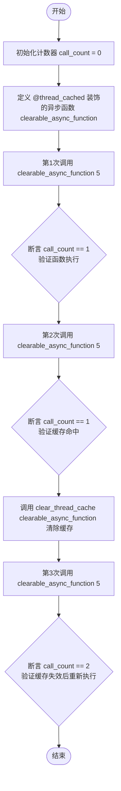

#### 带注释源码

```python
@pytest.mark.asyncio
async def test_clear_cache_async(self):
    # 初始化调用计数器，用于追踪函数实际执行次数
    call_count = 0

    # 使用 @thread_cached 装饰一个异步函数
    @thread_cached
    async def clearable_async_function(x: int) -> int:
        nonlocal call_count
        call_count += 1  # 每次实际执行时计数加 1
        await asyncio.sleep(0.01)  # 模拟异步 I/O 操作
        return x * 2

    # 第一次调用，应该执行函数体
    assert await clearable_async_function(5) == 10
    assert call_count == 1

    # 第二次调用，应该直接返回缓存结果，不执行函数体
    assert await clearable_async_function(5) == 10
    assert call_count == 1

    # 清除该函数的线程本地缓存
    clear_thread_cache(clearable_async_function)

    # 第三次调用，由于缓存已清除，应该重新执行函数体
    assert await clearable_async_function(5) == 10
    assert call_count == 2
```


### `TestThreadCached.test_simple_arguments`

该测试方法用于验证 `@thread_cached` 装饰器在处理不同参数传递方式时的缓存行为。具体测试了全位置参数的缓存命中、相同参数值但使用关键字传递时的缓存键差异（即视为不同调用）、以及参数值变化时的缓存更新。

参数：

-  `self`：`TestThreadCached`，测试类的实例，用于访问测试上下文。

返回值：`None`，无返回值，该方法通过断言验证行为。

#### 流程图

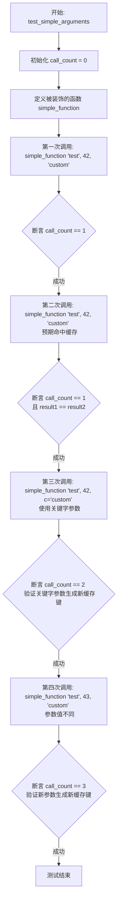

#### 带注释源码

```python
    def test_simple_arguments(self):
        # 初始化计数器，用于验证函数实际执行的次数
        call_count = 0

        # 使用 @thread_cached 装饰器定义一个简单的函数
        @thread_cached
        def simple_function(a: str, b: int, c: str = "default") -> str:
            nonlocal call_count
            # 每次函数体被执行时，计数器加一
            call_count += 1
            return f"{a}-{b}-{c}"

        # 第一次调用：使用全部位置参数 ("test", 42, "custom")
        # 此时缓存为空，函数体会被执行
        result1 = simple_function("test", 42, "custom")
        # 验证函数被执行了 1 次
        assert call_count == 1

        # 第二次调用：参数与第一次完全相同 (位置参数)
        # 此时预期应该直接命中缓存，函数体不会再次执行
        result2 = simple_function("test", 42, "custom")
        # 验证函数执行次数仍为 1，证明缓存生效
        assert call_count == 1
        # 验证缓存返回的结果与第一次一致
        assert result1 == result2

        # 第三次调用：参数值相同，但最后一个参数 c 使用了关键字参数传递 (c="custom")
        # 这测试了缓存机制是否区分位置参数和关键字参数的调用方式
        result3 = simple_function("test", 42, c="custom")
        # 验证函数执行次数变为 2，证明被视作一次新的调用（未命中之前的缓存）
        assert call_count == 2
        # 验证虽然缓存键不同，但计算结果逻辑上是一致的
        assert result1 == result3  # Same result, different cache entry

        # 第四次调用：修改了参数 b 的值 (从 42 改为 43)
        # 这测试了参数值变化导致缓存失效的常规情况
        result4 = simple_function("test", 43, "custom")
        # 验证函数执行次数变为 3
        assert call_count == 3
        # 验证结果因参数不同而改变
        assert result1 != result4
```


### `TestThreadCached.test_positional_vs_keyword_args`

该测试方法用于验证 `@thread_cached` 装饰器在处理函数调用时，能够区分位置参数和关键字参数。即使传递的参数值相同，如果传递方式不同（全位置参数 vs 混合参数），装饰器也应视为不同的缓存键（Cache Key），从而创建独立的缓存条目。

参数：

- `self`：`TestThreadCached`，测试类的实例，用于访问测试上下文。

返回值：`None`，该函数为测试方法，无返回值，通过断言验证行为。

#### 流程图

```mermaid
graph TD
    A[开始: test_positional_vs_keyword_args] --> B[初始化 call_count = 0]
    B --> C[定义 @thread_cached 装饰函数 func]
    C --> D[调用 func(1, 2) 全部使用位置参数]
    D --> E{断言 call_count == 1?}
    E -- 是 --> F[调用 func(1, b=2) 第二个参数使用关键字]
    F --> G{断言 call_count == 2?}
    G -- 是 --> H[再次调用 func(1, 2) 验证缓存命中]
    H --> I{断言 call_count 保持 2?}
    I -- 是 --> J[再次调用 func(1, b=2) 验证缓存命中]
    J --> K{断言 call_count 保持 2?}
    K -- 是 --> L[测试结束]
```

#### 带注释源码

```python
def test_positional_vs_keyword_args(self):
    """Test that positional and keyword arguments create different cache entries."""
    # 初始化计数器，用于追踪被装饰函数实际执行的次数
    call_count = 0

    @thread_cached
    def func(a: int, b: int = 10) -> str:
        nonlocal call_count
        # 每次函数实际执行时，计数器加 1
        call_count += 1
        return f"result-{a}-{b}"

    # 第 1 次调用：全部使用位置参数 (1, 2)
    result1 = func(1, 2)
    # 验证函数被执行了 1 次
    assert call_count == 1
    assert result1 == "result-1-2"

    # 第 2 次调用：参数值相同，但第二个参数改为关键字传递 (1, b=2)
    result2 = func(1, b=2)
    # 验证函数被执行了 2 次
    # 关键断言：证明了位置参数调用和关键字参数调用生成了不同的缓存键，导致缓存未命中
    assert call_count == 2  # Different cache key!
    assert result2 == "result-1-2"  # Same result

    # 验证第一次的调用方式已被缓存
    func(1, 2)  # Uses first cache entry
    # 计数器保持不变，说明命中了第一个缓存条目
    assert call_count == 2

    # 验证第二次的调用方式也已被缓存
    func(1, b=2)  # Uses second cache entry
    # 计数器保持不变，说明命中了第二个缓存条目
    assert call_count == 2
```


### `TestThreadCached.test_exception_handling`

该方法用于验证 `@thread_cached` 装饰器在同步函数抛出异常时的行为是否符合预期。它确保当函数执行引发异常时，该异常不会被缓存，这意味着针对相同参数的后续调用将再次执行函数体，而不是直接返回缓存的异常或之前成功的结果。

参数：

-  `self`：`TestThreadCached`，测试用例实例，由 pytest 框架自动注入，用于调用测试断言方法。

返回值：`None`，该方法主要用于验证逻辑和断言状态，不返回具体数值。

#### 流程图

```mermaid
flowchart TD
    Start([开始测试]) --> Init[初始化 call_count = 0]
    Init --> DefineFunc[定义 @thread_cached 装饰的 failing_function]
    
    DefineFunc --> CallSuccess1[调用 failing_function(5)]
    CallSuccess1 --> CheckSuccess1{断言 结果==10 \n call_count==1}
    CheckSuccess1 --> CallFail1[调用 failing_function(-1)]
    
    CallFail1 --> CheckRaise1{捕获 ValueError 异常}
    CheckRaise1 --> CheckCount1{断言 call_count==2}
    
    CheckCount1 --> CallFail2[再次调用 failing_function(-1)]
    CallFail2 --> CheckRaise2{捕获 ValueError 异常}
    CheckRaise2 --> CheckCount2{断言 call_count==3 \n 确认异常未被缓存}
    
    CheckCount2 --> CallSuccess2[再次调用 failing_function(5)]
    CallSuccess2 --> CheckCount3{断言 结果==10 \n call_count==3 \n 确认成功结果仍被缓存}
    
    CheckCount3 --> End([测试结束])
```

#### 带注释源码

```python
    def test_exception_handling(self):
        call_count = 0

        @thread_cached
        def failing_function(x: int) -> int:
            nonlocal call_count
            call_count += 1  # 每次函数体执行时递增计数器
            if x < 0:
                raise ValueError("Negative value")  # 当输入小于0时抛出异常
            return x * 2

        # 测试场景1: 正常调用，验证结果被缓存
        assert failing_function(5) == 10
        assert call_count == 1  # 验证函数被执行了一次

        # 测试场景2: 触发异常，验证函数被执行且异常未被捕获
        with pytest.raises(ValueError):
            failing_function(-1)
        assert call_count == 2  # 计数器增加，说明函数确实执行了

        # 测试场景3: 再次触发相同异常，验证异常结果未被缓存（否则函数不会再次执行）
        with pytest.raises(ValueError):
            failing_function(-1)
        assert call_count == 3  # 计数器再次增加，证明上次的异常结果未存入缓存

        # 测试场景4: 再次进行正常调用，验证之前的成功结果依然有效（处于缓存中）
        assert failing_function(5) == 10
        assert call_count == 3  # 计数器未增加，说明使用了步骤1中的缓存
```


### `TestThreadCached.test_async_exception_handling`

测试 `@thread_cached` 装饰器在异步函数上下文中的异常处理行为，验证异常结果不会被缓存，从而确保后续相同的错误调用会再次执行函数体。

参数：

-  `self`：`TestThreadCached`，测试类的实例，用于访问测试上下文。

返回值：`None`，该函数为测试用例，无显式返回值。

#### 流程图

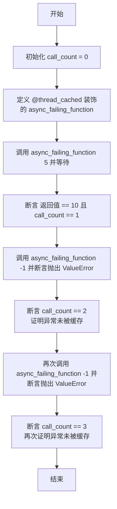

#### 带注释源码

```python
    @pytest.mark.asyncio
    async def test_async_exception_handling(self):
        # 初始化计数器，用于验证函数被实际调用的次数
        call_count = 0

        # 定义一个被 @thread_cached 装饰的异步函数
        @thread_cached
        async def async_failing_function(x: int) -> int:
            nonlocal call_count
            # 每次函数实际执行时增加计数
            call_count += 1
            # 模拟异步操作
            await asyncio.sleep(0.01)
            # 如果参数小于0，抛出异常
            if x < 0:
                raise ValueError("Negative value")
            # 否则返回计算结果
            return x * 2

        # 第一次调用：正常参数 (5)
        # 期望返回计算结果 10
        # 期望 call_count 为 1 (首次执行)
        assert await async_failing_function(5) == 10
        assert call_count == 1

        # 第二次调用：异常参数 (-1)
        # 期望抛出 ValueError
        # 期望 call_count 为 2 (说明再次执行了函数，异常未被缓存)
        with pytest.raises(ValueError):
            await async_failing_function(-1)
        assert call_count == 2

        # 第三次调用：相同的异常参数 (-1)
        # 期望抛出 ValueError
        # 期望 call_count 为 3 (说明又再次执行了函数，确认异常绝不缓存)
        with pytest.raises(ValueError):
            await async_failing_function(-1)
        assert call_count == 3
```


### `TestThreadCached.test_sync_caching_performance`

该测试方法用于验证同步函数在应用 `@thread_cached` 装饰器后的性能提升效果。它通过模拟一个耗时函数，测量第一次调用（执行实际计算）和第二次相同参数调用（从缓存读取）的执行时间，断言缓存机制显著减少了后续调用的耗时。

参数：

- `self`：`TestThreadCached`，测试类的实例，用于访问测试上下文。

返回值：`None`，该方法主要用于断言验证，不返回具体数值。

#### 流程图

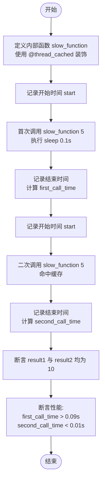

#### 带注释源码

```python
def test_sync_caching_performance(self):
    # 定义一个被 @thread_cached 装饰的内部函数，模拟耗时操作
    @thread_cached
    def slow_function(x: int) -> int:
        print(f"slow_function called with x={x}")
        time.sleep(0.1)  # 模拟 0.1 秒的计算延迟
        return x * 2

    # 记录第一次调用的时间（预期未命中缓存，包含 sleep 时间）
    start = time.time()
    result1 = slow_function(5)
    first_call_time = time.time() - start
    print(f"First call took {first_call_time:.4f} seconds")

    # 记录第二次调用的时间（预期命中缓存，几乎无延迟）
    start = time.time()
    result2 = slow_function(5)
    second_call_time = time.time() - start
    print(f"Second call took {second_call_time:.4f} seconds")

    # 验证两次调用的结果正确且相等
    assert result1 == result2 == 10
    # 验证第一次调用耗时确实包含模拟的延迟（>0.09s）
    assert first_call_time > 0.09
    # 验证第二次调用耗时极短，证明缓存生效（<0.01s）
    assert second_call_time < 0.01
```


### `TestThreadCached.test_async_caching_performance`

该方法旨在验证 `@thread_cached` 装饰器对异步函数的缓存性能优化效果。它通过模拟一个耗时的异步操作（使用 `await asyncio.sleep`），对比首次调用（缓存未命中）与第二次使用相同参数调用（缓存命中）的执行时间，断言缓存命中后的调用时间显著低于实际执行时间，从而证明缓存机制在异步场景下生效且能大幅提升性能。

参数：

- `self`：`TestThreadCached`，测试类的实例，用于访问测试上下文。

返回值：`None`，该方法是测试用例，主要用于断言验证，无显式返回值。

#### 流程图

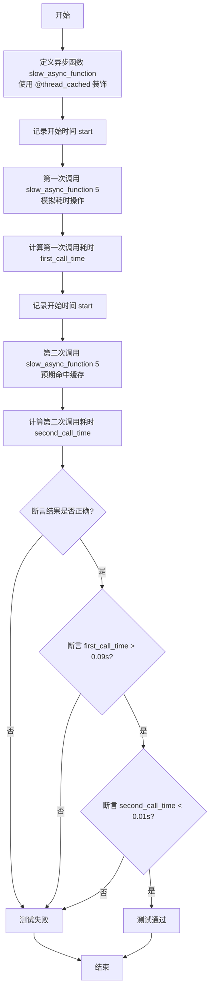

#### 带注释源码

```python
    @pytest.mark.asyncio
    async def test_async_caching_performance(self):
        # 定义一个被 @thread_cached 装饰的异步慢速函数
        @thread_cached
        async def slow_async_function(x: int) -> int:
            print(f"slow_async_function called with x={x}")
            # 模拟耗时操作 (0.1秒)
            await asyncio.sleep(0.1)
            return x * 2

        # 记录第一次调用开始时间
        start = time.time()
        result1 = await slow_async_function(5) # 预期执行实际逻辑
        first_call_time = time.time() - start
        print(f"First async call took {first_call_time:.4f} seconds")

        # 记录第二次调用开始时间
        start = time.time()
        result2 = await slow_async_function(5) # 预期从缓存读取
        second_call_time = time.time() - start
        print(f"Second async call took {second_call_time:.4f} seconds")

        # 验证两次调用的结果值正确
        assert result1 == result2 == 10
        
        # 验证第一次调用确实执行了耗时逻辑（耗时应大于0.09秒）
        assert first_call_time > 0.09
        
        # 验证第二次调用命中缓存（耗时应极短，小于0.01秒）
        assert second_call_time < 0.01
```


### `TestThreadCached.test_with_mock_objects`

该测试方法用于验证 `@thread_cached` 装饰器与 `unittest.mock.Mock` 对象的交互。它通过 Mock 对象的调用计数，确认在相同参数下被装饰函数的结果被正确缓存而未重复执行，以及在参数变化时能正常执行函数。

参数：

- `self`：`TestThreadCached`，测试类的实例，用于访问测试上下文。

返回值：`None`，无返回值。

#### 流程图

```mermaid
flowchart TD
    A[开始测试] --> B[创建Mock对象<br>设定返回值为42]
    B --> C[定义函数function_using_mock<br>并应用@thread_cached装饰器]
    C --> D[第一次调用function_using_mock(1)]
    D --> E{断言: 结果为42<br>且mock.call_count == 1}
    E -- 否 --> FAIL[测试失败]
    E -- 是 --> F[第二次调用function_using_mock(1)]
    F --> G{断言: 结果为42<br>且mock.call_count == 1<br>验证缓存命中]
    G -- 否 --> FAIL
    G -- 是 --> H[第三次调用function_using_mock(2)]
    H --> I{断言: 结果为42<br>且mock.call_count == 2<br>验证缓存未命中]
    I -- 否 --> FAIL
    I -- 是 --> SUCCESS[测试结束/通过]
```

#### 带注释源码

```python
    def test_with_mock_objects(self):
        # 创建一个 Mock 对象，模拟外部依赖或昂贵操作，预设返回值为 42
        mock = Mock(return_value=42)

        # 定义一个内部函数，使用 @thread_cached 进行装饰
        # 该函数接收一个整数参数，并调用 mock 对象
        @thread_cached
        def function_using_mock(x: int) -> int:
            return mock(x)

        # 第一次调用函数，参数为 1
        assert function_using_mock(1) == 42
        # 验证底层 mock 对象被调用了 1 次，说明函数体被执行
        assert mock.call_count == 1

        # 第二次调用函数，参数仍为 1
        assert function_using_mock(1) == 42
        # 验证 mock 对象调用次数仍为 1，说明第二次直接返回了缓存结果，未执行函数体
        assert mock.call_count == 1

        # 第三次调用函数，参数变为 2
        assert function_using_mock(2) == 42
        # 验证 mock 对象调用次数变为 2，说明参数不同导致缓存未命中，函数体再次执行
        assert mock.call_count == 2
```


### `TestCache.test_basic_sync_caching`

该方法用于测试基于 `@cached` 装饰器的同步函数的基本缓存功能。它验证了装饰器能够正确地缓存函数结果：当首次调用函数时执行实际逻辑，当参数相同时从缓存中读取结果而不增加调用计数，以及当参数不同时重新执行函数逻辑并增加调用计数。

参数：

- `self`：`TestCache`，测试类的实例。

返回值：`None`，无返回值。

#### 流程图

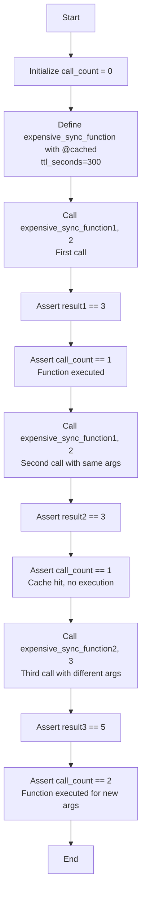

#### 带注释源码

```python
    def test_basic_sync_caching(self):
        """Test basic sync caching functionality."""
        # 初始化计数器，用于追踪被装饰函数的实际执行次数
        call_count = 0

        # 使用 @cached 装饰器定义一个同步函数，设置 TTL 为 300 秒
        @cached(ttl_seconds=300)
        def expensive_sync_function(x: int, y: int = 0) -> int:
            nonlocal call_count
            # 每次函数实际执行时，计数器加 1
            call_count += 1
            return x + y

        # 第一次调用：参数为 (1, 2)
        result1 = expensive_sync_function(1, 2)
        assert result1 == 3
        # 验证函数被执行了一次
        assert call_count == 1

        # 第二次调用：参数相同 (1, 2)
        # 预期：应该使用缓存，不执行函数体
        result2 = expensive_sync_function(1, 2)
        assert result2 == 3
        # 验证计数器未增加，确认命中了缓存
        assert call_count == 1

        # 第三次调用：参数不同 (2, 3)
        # 预期：缓存未命中，函数再次执行
        result3 = expensive_sync_function(2, 3)
        assert result3 == 5
        # 验证计数器增加，确认函数重新执行
        assert call_count == 2
```


### `TestCache.test_basic_async_caching`

该测试方法用于验证统一的 `@cached` 装饰器在异步函数场景下的基本缓存功能。它确保被装饰的异步函数在首次调用时执行并缓存结果，后续使用相同参数调用时直接返回缓存值（避免重复执行），而使用不同参数调用时能正确识别并重新执行函数逻辑。

参数：

-   `self`：`TestCache`，测试类的实例，用于访问测试上下文和断言方法。

返回值：`None`，该测试方法主要进行断言验证，无显式返回值。

#### 流程图

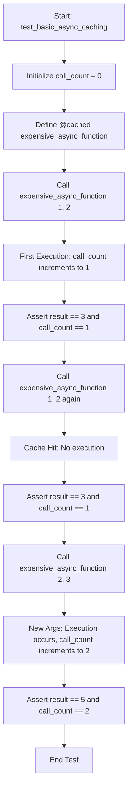

#### 带注释源码

```python
    @pytest.mark.asyncio
    async def test_basic_async_caching(self):
        """Test basic async caching functionality."""
        # 初始化计数器，用于跟踪函数体实际执行的次数
        call_count = 0

        # 定义一个带有 TTL 缓存装饰器的异步函数
        @cached(ttl_seconds=300)
        async def expensive_async_function(x: int, y: int = 0) -> int:
            nonlocal call_count
            # 每次函数体执行时，计数器加 1
            call_count += 1
            # 模拟异步耗时操作
            await asyncio.sleep(0.01)
            return x + y

        # 第一次调用 (1, 2)，预期结果为 3，且函数体被执行（call_count 变为 1）
        result1 = await expensive_async_function(1, 2)
        assert result1 == 3
        assert call_count == 1

        # 第二次调用 (1, 2)，参数相同，预期命中缓存。
        # 结果仍为 3，但 call_count 应保持为 1（未再次执行函数体）
        result2 = await expensive_async_function(1, 2)
        assert result2 == 3
        assert call_count == 1

        # 第三次调用 (2, 3)，参数不同，预期未命中缓存，触发新执行。
        # 结果为 5，call_count 增加到 2
        result3 = await expensive_async_function(2, 3)
        assert result3 == 5
        assert call_count == 2
```


### `TestCache.test_sync_thundering_herd_protection`

测试 `@cached` 装饰器在同步函数下是否能有效防止“惊群效应”。即验证在多个线程并发请求同一缓存键时，被装饰的函数只会被实际执行一次，其他并发请求会阻塞等待该次执行完成并复用结果。

参数：

-   `self`：`TestCache`，测试类的实例。

返回值：`None`，无返回值。

#### 流程图

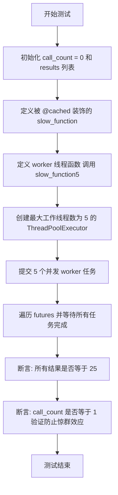

#### 带注释源码

```python
    def test_sync_thundering_herd_protection(self):
        """Test that concurrent sync calls don't cause thundering herd."""
        call_count = 0
        results = []

        # 定义一个使用缓存装饰器的慢函数，TTL设置为300秒
        @cached(ttl_seconds=300)
        def slow_function(x: int) -> int:
            nonlocal call_count
            call_count += 1  # 每次实际执行时增加计数
            time.sleep(0.1)  # 模拟一个耗时操作 (0.1秒)
            return x * x

        def worker():
            # 线程工作函数：调用慢函数并收集结果
            result = slow_function(5)
            results.append(result)

        # 启动多个并发线程模拟高并发场景
        with ThreadPoolExecutor(max_workers=5) as executor:
            futures = [executor.submit(worker) for _ in range(5)]
            for future in futures:
                future.result()  # 等待所有线程完成

        # 验证所有线程返回的结果一致
        assert all(result == 25 for result in results)
        # 验证核心逻辑：虽然并发调用了5次，但函数体实际上只执行了1次（防止了惊群效应）
        assert call_count == 1
```


### `TestCache.test_async_thundering_herd_protection`

验证并发异步调用被缓存的函数时，当参数相同时，系统仅执行一次函数体计算，从而防止“惊群效应”（即多个并发请求同时击穿缓存去执行耗时的计算）。

参数：

-   `self`：`TestCache`，测试类的实例。

返回值：`None`，无返回值。

#### 流程图

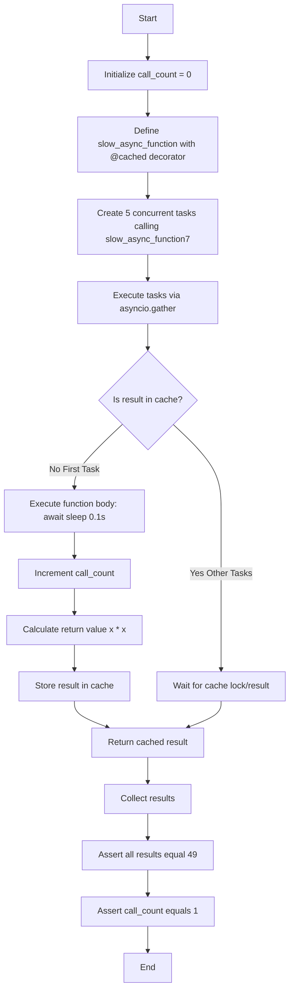

#### 带注释源码

```python
@pytest.mark.asyncio
async def test_async_thundering_herd_protection(self):
    """Test that concurrent async calls don't cause thundering herd."""
    # 初始化计数器，用于追踪函数实际执行次数
    call_count = 0

    # 定义一个带缓存的异步函数，TTL设置为300秒
    @cached(ttl_seconds=300)
    async def slow_async_function(x: int) -> int:
        nonlocal call_count
        # 每次函数体执行时，计数器加1
        call_count += 1
        # 模拟耗时操作（0.1秒）
        await asyncio.sleep(0.1)  # Simulate expensive operation
        # 返回计算结果
        return x * x

    # 创建5个并发任务，所有任务都使用相同的参数 x=7 调用函数
    tasks = [slow_async_function(7) for _ in range(5)]
    # 使用 asyncio.gather 并发运行所有任务
    results = await asyncio.gather(*tasks)

    # 断言：所有任务的结果都应该是 49 (7*7)
    # All results should be the same
    assert all(result == 49 for result in results)
    
    # 断言：函数体应该只被执行了一次，说明后续4个调用直接使用了缓存（或等待了第一个调用完成写入缓存）
    # Only one coroutine should have executed the expensive operation
    assert call_count == 1
```


### `TestCache.test_ttl_functionality`

测试带有 TTL（生存时间）功能的 `@cached` 装饰器在同步函数上的行为。该测试验证缓存项在 TTL 期间内有效，过期后会失效并在下次调用时重新执行函数。

参数：

- `self`：`TestCache`，测试类的实例，用于访问测试上下文。

返回值：`None`，该方法为测试函数，主要用于断言验证，不返回具体数值。

#### 流程图

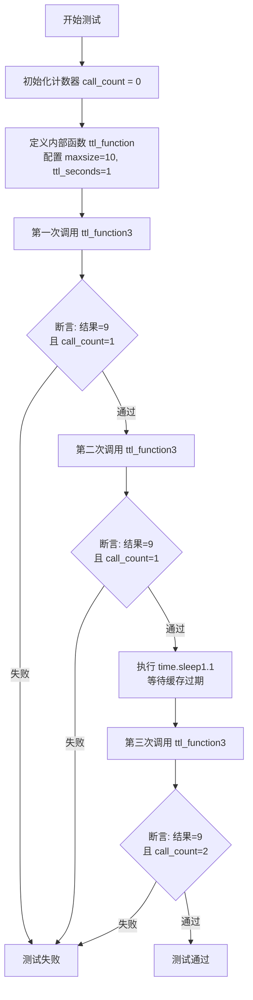

#### 带注释源码

```python
def test_ttl_functionality(self):
    """Test TTL functionality with sync function."""
    call_count = 0  # 初始化调用计数器

    @cached(maxsize=10, ttl_seconds=1)  # 使用装饰器，设置最大缓存为10，TTL为1秒
    def ttl_function(x: int) -> int:
        nonlocal call_count
        call_count += 1  # 每次执行函数体时计数器加1
        return x * 3

    # First call
    result1 = ttl_function(3)
    assert result1 == 9
    assert call_count == 1  # 验证函数体被执行了一次

    # Second call immediately - should use cache
    result2 = ttl_function(3)
    assert result2 == 9
    assert call_count == 1  # 验证使用了缓存，函数体未再次执行

    # Wait for TTL to expire
    time.sleep(1.1)  # 休眠超过TTL时间，使缓存失效

    # Third call after expiration - should call function again
    result3 = ttl_function(3)
    assert result3 == 9
    assert call_count == 2  # 验证因缓存过期，函数体被重新执行
```


### `TestCache.test_async_ttl_functionality`

该测试方法旨在验证异步函数在应用 `@cached` 装饰器时，其 TTL（Time To Live，生存时间）机制是否正常工作。具体测试点包括：缓存项在有效期内是否能正确命中从而避免函数执行，以及在超过设定的 TTL 时间后，缓存是否失效从而导致函数被重新执行。

参数：

-   `self`：`TestCache`，测试类实例，用于访问测试上下文。

返回值：`None`，无返回值，主要通过断言来验证缓存行为是否符合预期。

#### 流程图

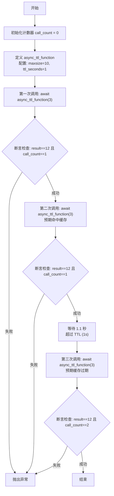

#### 带注释源码

```python
@pytest.mark.asyncio
async def test_async_ttl_functionality(self):
    """Test TTL functionality with async function."""
    # 初始化计数器，用于追踪被装饰函数的实际执行次数
    call_count = 0

    # 定义并装饰异步函数，设置最大缓存大小为10，TTL为1秒
    @cached(maxsize=10, ttl_seconds=1)  # Short TTL
    async def async_ttl_function(x: int) -> int:
        nonlocal call_count
        call_count += 1
        # 模拟异步IO操作
        await asyncio.sleep(0.01)
        return x * 4

    # 第一次调用：预期发生缓存未命中，函数执行，计数器加1
    result1 = await async_ttl_function(3)
    assert result1 == 12
    assert call_count == 1

    # 第二次调用（立即进行）：预期发生缓存命中，函数不执行，计数器不变
    result2 = await async_ttl_function(3)
    assert result2 == 12
    assert call_count == 1

    # 等待时间超过 TTL (1秒)，使缓存条目失效
    await asyncio.sleep(1.1)

    # 第三次调用（过期后）：预期缓存失效，函数重新执行，计数器加1
    result3 = await async_ttl_function(3)
    assert result3 == 12
    assert call_count == 2
```


### `TestCache.test_cache_info`

验证由 `@cached` 装饰器提供的 `cache_info` 方法的功能，确保其能正确报告缓存的配置信息（如最大大小和TTL）以及当前的缓存大小状态。

参数：

- `self`：`TestCache`，测试类实例

返回值：`None`，该方法为测试函数，无返回值

#### 流程图

```mermaid
graph TD
    A[开始: test_cache_info] --> B[定义内部函数 info_test_function<br/>使用 @cached(maxsize=10, ttl_seconds=60)]
    B --> C[调用 info_test_function.cache_info 获取初始状态]
    C --> D{断言检查}
    D --> |size == 0| E[继续]
    D --> |maxsize == 10| E[继续]
    D --> |ttl_seconds == 60| E[继续]
    E --> F[调用 info_test_function(1) 添加缓存条目]
    F --> G[再次调用 info_test_function.cache_info]
    G --> H{断言检查}
    H --> |size == 1| I[测试结束]
```

#### 带注释源码

```python
def test_cache_info(self):
    """Test cache info functionality."""

    # 定义一个被缓存的函数，设置最大缓存数量为10，TTL为60秒
    @cached(maxsize=10, ttl_seconds=60)
    def info_test_function(x: int) -> int:
        return x * 3

    # 获取初始缓存信息
    info = info_test_function.cache_info()
    # 验证初始缓存大小为0
    assert info["size"] == 0
    # 验证配置的最大缓存大小为10
    assert info["maxsize"] == 10
    # 验证配置的TTL为60秒
    assert info["ttl_seconds"] == 60

    # 调用函数，触发缓存写入
    info_test_function(1)
    # 再次获取缓存信息
    info = info_test_function.cache_info()
    # 验证缓存大小已更新为1
    assert info["size"] == 1
```


### `TestCache.test_cache_clear`

测试统一 `@cached` 装饰器的缓存清除功能。该方法通过验证在调用 `cache_clear()` 后，后续对装饰函数的调用是否重新执行底层逻辑而非返回缓存值，从而确保缓存清除机制正常工作。

参数：

-  `self`：`TestCache`，测试类的实例，用于访问测试上下文。

返回值：`None`，该方法为测试函数，不返回任何值。

#### 流程图

```mermaid
flowchart TD
    A[开始测试] --> B[初始化 call_count 为 0]
    B --> C[定义带 @cached 装饰的 clearable_function]
    C --> D[首次调用 clearable_function 2]
    D --> E[执行函数逻辑, call_count 增加为 1]
    E --> F[断言: 结果为 8 且 call_count 为 1]
    F --> G[第二次调用 clearable_function 2]
    G --> H[命中缓存, call_count 保持为 1]
    H --> I[断言: 结果为 8 且 call_count 为 1]
    I --> J[调用 clearable_function.cache_clear 清除缓存]
    J --> K[第三次调用 clearable_function 2]
    K --> L[缓存已清除, 重新执行逻辑, call_count 增加为 2]
    L --> M[断言: 结果为 8 且 call_count 为 2]
    M --> N[测试结束]
```

#### 带注释源码

```python
def test_cache_clear(self):
    """Test cache clearing functionality."""
    call_count = 0

    # 定义一个带缓存的函数，TTL为300秒
    @cached(ttl_seconds=300)
    def clearable_function(x: int) -> int:
        nonlocal call_count
        call_count += 1  # 每次实际执行时计数器加1
        return x * 4

    # 第一次调用：未命中缓存，执行函数体
    result1 = clearable_function(2)
    assert result1 == 8
    assert call_count == 1  # 验证函数已执行

    # 第二次调用：参数相同，命中缓存，不执行函数体
    result2 = clearable_function(2)
    assert result2 == 8
    assert call_count == 1  # 验证函数未再次执行

    # 清除缓存
    clearable_function.cache_clear()

    # 第三次调用：缓存已被清除，重新执行函数体
    result3 = clearable_function(2)
    assert result3 == 8
    assert call_count == 2  # 验证函数再次执行，计数器增加
```


### `TestCache.test_async_cache_clear`

该测试方法用于验证统一缓存装饰器 `@cached` 应用于异步函数时的缓存清除功能。测试通过定义一个被装饰的异步函数，执行两次以确认缓存生效（执行次数不增加），随后调用 `cache_clear()` 方法清除缓存，第三次调用时验证函数体被重新执行（执行次数增加），从而确保缓存清除机制在异步上下文中正常工作。

参数：

- `self`：`TestCache`，测试类的实例引用。

返回值：`None`，该方法为单元测试，无显式返回值，通过断言验证结果。

#### 流程图

```mermaid
flowchart TD
    A[开始测试] --> B[初始化 call_count = 0]
    B --> C[定义 async_clearable_function<br/>使用 @cached(ttl_seconds=300) 装饰]
    C --> D[第1次调用: await async_clearable_function2]
    D --> E[断言: 结果为 10<br/>call_count 为 1]
    E --> F[第2次调用: await async_clearable_function2]
    F --> G[断言: 结果为 10<br/>call_count 仍为 1 (缓存命中)]
    G --> H[调用 async_clearable_function.cache_clear]
    H --> I[第3次调用: await async_clearable_function2]
    I --> J[断言: 结果为 10<br/>call_count 为 2 (缓存已清除)]
    J --> K[测试结束]
```

#### 带注释源码

```python
    @pytest.mark.asyncio
    async def test_async_cache_clear(self):
        """Test cache clearing functionality with async function."""
        call_count = 0

        # 定义一个带有TTL的异步缓存函数
        @cached(ttl_seconds=300)
        async def async_clearable_function(x: int) -> int:
            nonlocal call_count
            call_count += 1  # 每次实际执行时增加计数
            await asyncio.sleep(0.01)
            return x * 5

        # 第一次调用，函数应被执行
        result1 = await async_clearable_function(2)
        assert result1 == 10
        assert call_count == 1

        # 第二次调用，参数相同，应从缓存中获取，不执行函数体
        result2 = await async_clearable_function(2)
        assert result2 == 10
        assert call_count == 1

        # 调用缓存清除方法，清空该函数的缓存条目
        async_clearable_function.cache_clear()

        # 第三次调用，由于缓存已清空，函数应再次被执行
        result3 = await async_clearable_function(2)
        assert result3 == 10
        assert call_count == 2
```


### `TestCache.test_async_function_returns_results_not_coroutines`

该方法是一个单元测试，旨在验证 `@cached` 装饰器应用于异步函数时的行为。具体而言，它确保装饰后的函数在被调用时返回的是 await 操作后的实际结果（即解包后的值），而不是 coroutine 对象。此外，该测试还检查了缓存机制是否正确触发，即多次调用相同参数时不会重复执行函数体，且返回的对象引用保持一致。

参数：

- `self`：`TestCache`，测试类的实例，用于访问测试上下文。

返回值：`None`，该方法没有返回值，通过断言来验证预期的行为。

#### 流程图

```mermaid
graph TD
    A[Start: test_async_function_returns_results_not_coroutines] --> B[Initialize call_count to 0]
    B --> C[Define async_result_function decorated with @cached]
    C --> D[First Call: await async_result_function(1)]
    D --> E[Assertion: result1 == 'result_1']
    E --> F[Assertion: isinstance(result1, str) - Ensure not Coroutine]
    F --> G[Assertion: call_count == 1 - Verify function executed]
    G --> H[Second Call: await async_result_function(1)]
    H --> I[Assertion: result2 == 'result_1']
    I --> J[Assertion: isinstance(result2, str) - Ensure not Coroutine]
    J --> K[Assertion: call_count == 1 - Verify cache hit]
    K --> L[Assertion: result1 is result2 - Verify object identity]
    L --> M[End]
```

#### 带注释源码

```python
    @pytest.mark.asyncio
    async def test_async_function_returns_results_not_coroutines(self):
        """Test that cached async functions return actual results, not coroutines."""
        # 初始化计数器，用于跟踪被装饰函数的实际执行次数
        call_count = 0

        # 定义一个被 @cached 装饰的异步函数
        @cached(ttl_seconds=300)
        async def async_result_function(x: int) -> str:
            nonlocal call_count
            call_count += 1
            await asyncio.sleep(0.01)  # 模拟异步IO操作
            return f"result_{x}"

        # 第一次调用函数
        result1 = await async_result_function(1)
        # 验证返回值的正确性
        assert result1 == "result_1"
        # 验证返回值类型是 str，而不是 coroutine 对象
        assert isinstance(result1, str)  # Should be string, not coroutine
        # 验证函数体被执行了一次
        assert call_count == 1

        # 第二次调用函数（参数相同）
        result2 = await async_result_function(1)
        # 验证返回值的正确性
        assert result2 == "result_1"
        # 再次验证返回值类型，确保从缓存取出的也是结果值而非 coroutine
        assert isinstance(result2, str)  # Should be string, not coroutine
        # 验证函数体没有再次执行（缓存命中）
        assert call_count == 1  # Function should not be called again

        # 验证两次调用返回的是同一个对象引用（强一致性）
        assert result1 is result2  # Should be same cached object
```


### `TestCache.test_cache_delete`

该函数用于测试 `@cached` 装饰器提供的 `cache_delete` 方法的选择性缓存删除功能。它验证了是否能够成功删除特定参数对应的缓存条目，强制下次调用时重新执行函数，同时确保其他缓存条目不受影响，以及删除不存在的条目时能正确返回 False。

参数：

-  `self`：`TestCache`，测试类的实例，用于访问测试上下文和断言方法。

返回值：`None`，该函数为测试方法，主要执行断言逻辑，没有显式的返回值。

#### 流程图

```mermaid
graph TD
    A[开始测试] --> B[初始化计数器 call_count]
    B --> C[定义并装饰 deletable_function]
    C --> D[调用 deletable_function(1) 并断言结果与计数]
    D --> E[调用 deletable_function(2) 并断言结果与计数]
    E --> F[再次调用 deletable_function(1, 2) 验证缓存命中]
    F --> G[调用 cache_delete(1) 删除 x=1 的缓存]
    G --> H[断言删除操作返回 True]
    H --> I[再次调用 deletable_function(1) 验证重新执行]
    I --> J[断言 call_count 增加以证明未使用缓存]
    J --> K[调用 deletable_function(2) 验证其他缓存保留]
    K --> L[调用 cache_delete(99) 尝试删除不存在的键]
    L --> M[断言删除操作返回 False]
    M --> N[测试结束]
```

#### 带注释源码

```python
def test_cache_delete(self):
    """Test selective cache deletion functionality."""
    # 初始化一个计数器用于记录函数实际被调用的次数
    call_count = 0

    # 定义一个带缓存装饰器的函数，设置 TTL 为 300 秒
    @cached(ttl_seconds=300)
    def deletable_function(x: int) -> int:
        nonlocal call_count
        call_count += 1  # 每次函数体执行时计数器加 1
        return x * 6

    # 第一次调用 x=1，预期会执行函数体
    result1 = deletable_function(1)
    assert result1 == 6
    assert call_count == 1  # 验证函数已执行

    # 第一次调用 x=2，预期会执行函数体
    result2 = deletable_function(2)
    assert result2 == 12
    assert call_count == 2  # 验证函数已执行

    # 第二次调用 x=1 和 x=2，预期从缓存读取
    assert deletable_function(1) == 6
    assert deletable_function(2) == 12
    assert call_count == 2  # 计数器不变，确认使用了缓存

    # 删除参数 x=1 对应的缓存条目
    was_deleted = deletable_function.cache_delete(1)
    assert was_deleted is True  # 验证删除操作返回成功

    # 第三次调用 x=1，由于缓存已删，预期会重新执行函数体
    result3 = deletable_function(1)
    assert result3 == 6
    assert call_count == 3  # 计数器增加，确认函数重新执行

    # 再次调用 x=2，预期依然使用之前的缓存
    assert deletable_function(2) == 12
    assert call_count == 3  # 计数器不变，确认缓存未受影响

    # 尝试删除不存在的缓存条目 (x=99)
    was_deleted = deletable_function.cache_delete(99)
    assert was_deleted is False  # 验证操作返回 False
```


### `TestCache.test_async_cache_delete`

测试异步函数的缓存选择性删除功能，验证 `cache_delete` 方法能否正确移除特定参数对应的缓存条目，同时不影响其他缓存条目，以及处理删除不存在条目的情况。

参数：

- `self`：`TestCache`，测试类的实例。

返回值：`None`，无显式返回值。

#### 流程图

```mermaid
graph TD
    A[开始测试] --> B[初始化计数器 call_count = 0]
    B --> C[定义被 @cached 装饰的异步函数 async_deletable_function]
    C --> D[首次调用函数参数 x=1]
    D --> E{call_count 是否为 1?}
    E -- 是 --> F[首次调用函数参数 x=2]
    F --> G{call_count 是否为 2?}
    G -- 是 --> H[再次调用 x=1 和 x=2 验证缓存生效]
    H --> I{call_count 是否仍为 2?}
    I -- 是 --> J[调用 cache_delete(1) 删除 x=1 的缓存]
    J --> K{返回值是否为 True?}
    K -- 是 --> L[再次调用函数参数 x=1]
    L --> M{call_count 是否增加到 3?}
    M -- 是 --> N[再次调用函数参数 x=2]
    N --> O{call_count 是否仍为 3?}
    O -- 是 --> P[调用 cache_delete(99) 尝试删除不存在的缓存]
    P --> Q{返回值是否为 False?}
    Q -- 是 --> R[测试结束]
```

#### 带注释源码

```python
@pytest.mark.asyncio
async def test_async_cache_delete(self):
    """Test selective cache deletion functionality with async function."""
    # 初始化调用计数器，用于验证函数是否被执行
    call_count = 0

    # 定义带TTL缓存的异步函数
    @cached(ttl_seconds=300)
    async def async_deletable_function(x: int) -> int:
        nonlocal call_count
        call_count += 1  # 每次执行函数体时计数器加1
        await asyncio.sleep(0.01)  # 模拟异步操作
        return x * 7

    # 第一次调用 x=1，预期执行函数体
    result1 = await async_deletable_function(1)
    assert result1 == 7
    assert call_count == 1

    # 第一次调用 x=2，预期执行函数体
    result2 = await async_deletable_function(2)
    assert result2 == 14
    assert call_count == 2

    # 第二次调用 x=1 和 x=2，预期直接命中缓存，不执行函数体
    assert await async_deletable_function(1) == 7
    assert await async_deletable_function(2) == 14
    assert call_count == 2

    # 删除 x=1 的特定缓存条目
    was_deleted = async_deletable_function.cache_delete(1)
    assert was_deleted is True  # 验证删除操作返回成功

    # 再次调用 x=1，缓存已失效，预期重新执行函数体
    result3 = await async_deletable_function(1)
    assert result3 == 7
    assert call_count == 3  # 计数器增加

    # 调用 x=2，缓存仍在，预期命中缓存
    assert await async_deletable_function(2) == 14
    assert call_count == 3  # 计数器不变

    # 尝试删除不存在的缓存条目 x=99
    was_deleted = async_deletable_function.cache_delete(99)
    assert was_deleted is False  # 验证删除操作返回失败
```


### `TestSharedCache.test_sync_shared_cache_basic`

该方法用于测试基于同步函数的共享缓存（Redis-backed shared cache）的基本功能。它验证了在使用 `@cached` 装饰器并启用 `shared_cache=True` 时，函数是否能正确地缓存结果、在后续调用中命中缓存而不执行函数体，以及在参数变更时是否能正确地重新计算。

参数：

-   `self`：`TestSharedCache`，测试类的实例，用于访问测试上下文。

返回值：`None`，该方法为单元测试函数，无返回值，通过断言验证逻辑正确性。

#### 流程图

```mermaid
flowchart TD
    A[开始: test_sync_shared_cache_basic] --> B[初始化 call_count = 0]
    B --> C[定义 shared_sync_function<br/>使用 @cached(ttl_seconds=30, shared_cache=True)]
    C --> D[调用 shared_sync_function.cache_clear<br/>清理旧缓存]
    D --> E[第一次调用 shared_sync_function(10, 20)]
    E --> F{断言: 结果 == 30}
    F -- 否 --> G[测试失败]
    F -- 是 --> H{断言: call_count == 1<br/>验证函数已执行}
    H -- 否 --> G
    H -- 是 --> I[第二次调用 shared_sync_function(10, 20)]
    I --> J{断言: 结果 == 30}
    J -- 否 --> G
    J -- 是 --> K{断言: call_count == 1<br/>验证命中缓存未执行}
    K -- 否 --> G
    K -- 是 --> L[第三次调用 shared_sync_function(15, 25)<br/>使用不同参数]
    L --> M{断言: 结果 == 40}
    M -- 否 --> G
    M -- 是 --> N{断言: call_count == 2<br/>验证参数不同触发重新计算}
    N -- 否 --> G
    N -- 是 --> O[调用 shared_sync_function.cache_clear<br/>清理缓存]
    O --> P[结束: 测试通过]
```

#### 带注释源码

```python
    def test_sync_shared_cache_basic(self):
        """Test basic shared cache functionality with sync function."""
        # 初始化计数器，用于追踪被装饰函数的实际执行次数
        call_count = 0

        # 定义一个同步函数并应用 @cached 装饰器
        # ttl_seconds=30: 设置缓存过期时间为30秒
        # shared_cache=True: 启用共享缓存（通常指使用 Redis 等后端存储）
        @cached(ttl_seconds=30, shared_cache=True)
        def shared_sync_function(x: int, y: int = 0) -> int:
            nonlocal call_count
            # 每次函数体执行时，计数器加1
            call_count += 1
            return x + y

        # 清除任何可能存在的旧缓存，确保测试环境干净
        shared_sync_function.cache_clear()

        # 第一次调用：参数 (10, 20)
        # 预期：缓存未命中，函数体执行，返回 30，call_count 变为 1
        result1 = shared_sync_function(10, 20)
        assert result1 == 30
        assert call_count == 1

        # 第二次调用：参数 (10, 20)
        # 预期：缓存命中，函数体不执行，直接返回缓存结果 30，call_count 保持 1
        result2 = shared_sync_function(10, 20)
        assert result2 == 30
        assert call_count == 1

        # 第三次调用：参数 (15, 25)
        # 预期：参数不同导致缓存键不同，缓存未命中，函数体执行，返回 40，call_count 变为 2
        result3 = shared_sync_function(15, 25)
        assert result3 == 40
        assert call_count == 2

        # 清理：清除测试生成的缓存数据
        shared_sync_function.cache_clear()
```


### `TestSharedCache.test_async_shared_cache_basic`

该异步测试方法用于验证基于共享缓存（Redis）装饰器的异步函数的基本功能。测试检查了带缓存装饰器的异步函数是否在首次调用时执行，在参数相同的后续调用中返回缓存结果，并在参数不同时重新执行。同时，它也验证了缓存清理功能的有效性。

参数：

- `self`：`TestSharedCache`，测试类的实例引用，用于访问测试框架上下文。

返回值：`None`，该方法为测试函数，主要用于断言验证，不返回具体数值。

#### 流程图

```mermaid
graph TD
    A[开始: test_async_shared_cache_basic] --> B[初始化计数器 call_count = 0]
    B --> C[定义共享缓存异步函数 shared_async_function]
    C --> D[调用 cache_clear 清理现有缓存]
    D --> E[首次调用 shared_async_function 10, 20]
    E --> F{断言 call_count == 1?}
    F -- 否 --> G[测试失败]
    F -- 是 --> H[第二次调用 shared_async_function 10, 20]
    H --> I{断言 call_count == 1? (验证缓存命中)]
    I -- 否 --> G
    I -- 是 --> J[第三次调用 shared_async_function 15, 25 (不同参数)]
    J --> K{断言 call_count == 2? (验证缓存未命中)]
    K -- 否 --> G
    K -- 是 --> L[调用 cache_clear 清理缓存]
    L --> M[测试结束]
```

#### 带注释源码

```python
    @pytest.mark.asyncio
    async def test_async_shared_cache_basic(self):
        """Test basic shared cache functionality with async function."""
        # 初始化调用计数器，用于验证函数是否被实际执行
        call_count = 0

        # 定义一个使用共享缓存装饰器的异步函数
        # ttl_seconds=30: 缓存有效期30秒
        # shared_cache=True: 启用共享缓存（通常指Redis）
        @cached(ttl_seconds=30, shared_cache=True)
        async def shared_async_function(x: int, y: int = 0) -> int:
            nonlocal call_count
            # 每次函数执行时计数器加1
            call_count += 1
            # 模拟异步IO操作
            await asyncio.sleep(0.01)
            return x + y

        # 清理任何可能存在的旧缓存，确保测试环境干净
        shared_async_function.cache_clear()

        # --- 测试场景1：首次调用 ---
        # 预期：函数实际执行，结果被缓存
        result1 = await shared_async_function(10, 20)
        assert result1 == 30
        assert call_count == 1  # 验证函数被执行了一次

        # --- 测试场景2：相同参数再次调用 ---
        # 预期：从缓存读取结果，函数不执行
        result2 = await shared_async_function(10, 20)
        assert result2 == 30
        assert call_count == 1  # 验证计数器未增加，证明使用了缓存

        # --- 测试场景3：不同参数调用 ---
        # 预期：参数不同，缓存未命中，函数再次执行
        result3 = await shared_async_function(15, 25)
        assert result3 == 40
        assert call_count == 2  # 验证计数器增加

        # --- 清理 ---
        # 清理测试产生的缓存数据
        shared_async_function.cache_clear()
```


### `TestSharedCache.test_shared_cache_ttl_refresh`

测试在共享缓存中获取缓存项时刷新其生存时间（TTL）的功能，验证在TTL窗口内访问可以防止缓存项过期。

参数：

- `self`：`TestSharedCache`，测试类的实例上下文。

返回值：`None`，无返回值。

#### 流程图

```mermaid
flowchart TD
    Start([开始]) --> InitDecor[定义被装饰函数: TTL=2s, shared=True, refresh=True]
    InitDecor --> ClearCache[清空缓存]
    ClearCache --> Call1[第1次调用: 执行函数, count=1, 设置过期时间]
    Call1 --> Sleep1[休眠 1秒]
    Sleep1 --> Call2[第2次调用: 命中缓存, count不变, 刷新过期时间至当前+2s]
    Call2 --> Sleep15[休眠 1.5秒]
    Sleep15 --> Call3[第3次调用: 检查过期时间<br/>因上次刷新未过期, 命中缓存, count不变]
    Call3 --> Sleep21[休眠 2.1秒]
    Sleep21 --> Call4[第4次调用: 距上次刷新超过2s, 缓存失效<br/>执行函数, count=2]
    Call4 --> Assert[断言 call_count == 2]
    Assert --> FinalClean[清空缓存]
    FinalClean --> End([结束])
```

#### 带注释源码

```python
    def test_shared_cache_ttl_refresh(self):
        """Test TTL refresh functionality with shared cache."""
        call_count = 0

        # 定义一个带TTL的共享缓存装饰器函数，并开启refresh_ttl_on_get选项
        # ttl_seconds=2: 缓存有效期为2秒
        # refresh_ttl_on_get=True: 每次获取缓存时刷新TTL
        @cached(ttl_seconds=2, shared_cache=True, refresh_ttl_on_get=True)
        def ttl_refresh_function(x: int) -> int:
            nonlocal call_count
            call_count += 1
            return x * 10

        # 清除可能存在的旧缓存数据
        ttl_refresh_function.cache_clear()

        # 第一次调用：缓存未命中，执行函数，设置初始TTL
        result1 = ttl_refresh_function(3)
        assert result1 == 30
        assert call_count == 1

        # 等待1秒（剩余TTL约1秒）
        time.sleep(1)

        # 第二次调用：缓存命中，且由于refresh_ttl_on_get=True，TTL被重置为新的2秒
        result2 = ttl_refresh_function(3)
        assert result2 == 30
        assert call_count == 1  # 函数未再次执行

        # 再等待1.5秒（距初始调用2.5秒，但距上次刷新仅1.5秒）
        # 由于上次访问刷新了TTL，此时缓存仍未过期
        time.sleep(1.5)

        # 第三次调用：缓存依然有效（距上次刷新未超过2秒），再次刷新TTL
        result3 = ttl_refresh_function(3)
        assert result3 == 30
        assert call_count == 1  # 函数仍未再次执行

        # 再等待2.1秒（距上次刷新超过2秒）
        # 此时TTL已耗尽，缓存失效
        time.sleep(2.1)

        # 第四次调用：缓存失效，函数被执行，TTL重新设置
        result4 = ttl_refresh_function(3)
        assert result4 == 30
        assert call_count == 2  # 函数执行次数增加

        # 清理缓存
        ttl_refresh_function.cache_clear()
```


### `TestSharedCache.test_shared_cache_without_ttl_refresh`

测试在禁用 `refresh_ttl_on_get` 的情况下，共享缓存是否在访问时不刷新 TTL，从而确保缓存严格按照初始创建时间过期。

参数：

-  `self`：`TestSharedCache`，测试类实例。

返回值：`None`，无返回值。

#### 流程图

```mermaid
graph TD
    Start((开始)) --> Init[初始化计数器 call_count = 0]
    Init --> DefineFunc[定义装饰函数 @cached refresh_ttl_on_get=False, ttl_seconds=2]
    DefineFunc --> Clear[清除缓存 cache_clear]
    
    Clear --> Call1[第1次调用函数 no_ttl_refresh_function4]
    Call1 --> Check1[断言: 结果=40, 计数=1]
    
    Check1 --> Sleep1[休眠 1 秒]
    Sleep1 --> Call2[第2次调用函数 no_ttl_refresh_function4]
    Call2 --> Check2[断言: 结果=40, 计数=1 缓存命中]
    
    Check2 --> Sleep2[休眠 1.1 秒]
    Sleep2 --> Call3[第3次调用函数 no_ttl_refresh_function4]
    Call3 --> Check3[断言: 结果=40, 计数=2 缓存已过期]
    
    Check3 --> Clean[清除缓存 cache_clear]
    Clean --> End((结束))
```

#### 带注释源码

```python
    def test_shared_cache_without_ttl_refresh(self):
        """Test that TTL doesn't refresh when refresh_ttl_on_get=False."""
        call_count = 0

        # 定义一个使用共享缓存的函数，设置 TTL 为 2 秒，并禁止在获取时刷新 TTL
        @cached(ttl_seconds=2, shared_cache=True, refresh_ttl_on_get=False)
        def no_ttl_refresh_function(x: int) -> int:
            nonlocal call_count
            call_count += 1
            return x * 10

        # 清除任何可能存在的旧缓存
        no_ttl_refresh_function.cache_clear()

        # 第一次调用：执行函数并缓存结果，TTL 计时开始 (T=0s)
        result1 = no_ttl_refresh_function(4)
        assert result1 == 40
        assert call_count == 1

        # 等待 1 秒 (T=1s)
        time.sleep(1)

        # 第二次调用：命中缓存，返回结果。
        # 由于 refresh_ttl_on_get=False，缓存的过期时间仍然是最初的 T+2s，
        # 而不是当前的 T+3s。
        result2 = no_ttl_refresh_function(4)
        assert result2 == 40
        assert call_count == 1

        # 再等待 1.1 秒 (总耗时 2.1s，超过了初始设定的 2s TTL)
        time.sleep(1.1)

        # 第三次调用：因为原始 TTL 已经过期，缓存失效，函数再次执行。
        result3 = no_ttl_refresh_function(4)
        assert result3 == 40
        assert call_count == 2

        # 清理缓存
        no_ttl_refresh_function.cache_clear()
```


### `TestSharedCache.test_shared_cache_complex_objects`

测试使用共享缓存（Redis-backed）缓存复杂对象的功能，验证通过序列化和反序列化处理嵌套字典、列表、元组等结构时的数据完整性。

参数：

-  `self`：`TestSharedCache`，测试类实例，用于提供测试上下文。

返回值：`None`，无返回值。

#### 流程图

```mermaid
flowchart TD
    A[Start] --> B[Initialize call_count = 0]
    B --> C[Define complex_object_function with @cached shared_cache=True]
    C --> D[Clear existing cache via cache_clear]
    D --> E[First Call: complex_object_function 5]
    E --> F[Store result1]
    F --> G[Assert result1 content is correct]
    G --> H[Assert call_count == 1]
    H --> I[Second Call: complex_object_function 5]
    I --> J[Store result2]
    J --> K[Assert result2 == result1]
    K --> L[Assert call_count == 1]
    L --> M[Cleanup: Call cache_clear]
    M --> N[End]
```

#### 带注释源码

```python
def test_shared_cache_complex_objects(self):
    """Test caching complex objects with shared cache (pickle serialization)."""
    # 初始化计数器，用于验证函数是否真的被调用
    call_count = 0

    # 定义一个被 @cached 装饰器修饰的函数，开启共享缓存，TTL为30秒
    @cached(ttl_seconds=30, shared_cache=True)
    def complex_object_function(x: int) -> dict:
        nonlocal call_count
        call_count += 1
        # 返回一个包含多种嵌套类型的复杂字典，用于测试序列化/反序列化
        return {
            "number": x,
            "squared": x**2,
            "nested": {"list": [1, 2, x], "tuple": (x, x * 2)},
            "string": f"value_{x}",
        }

    # 清除可能存在的缓存，确保测试环境干净
    complex_object_function.cache_clear()

    # 第一次调用，应该执行函数体
    result1 = complex_object_function(5)
    # 验证返回结果的各个字段是否正确，确保反序列化后的数据结构无误
    assert result1["number"] == 5
    assert result1["squared"] == 25
    assert result1["nested"]["list"] == [1, 2, 5]
    # 验证函数确实被执行了一次
    assert call_count == 1

    # 第二次调用，参数相同，应该直接命中共享缓存
    result2 = complex_object_function(5)
    # 验证缓存返回的对象与第一次一致（内容相同）
    assert result2 == result1
    # 验证函数没有被再次执行（即命中了缓存）
    assert call_count == 1

    # 清理缓存
    complex_object_function.cache_clear()
```


### `TestSharedCache.test_shared_cache_info`

该测试方法用于验证基于Redis的共享缓存（`shared_cache`）的`cache_info`功能。它检查缓存元数据（如大小、最大容量和TTL）是否正确反映初始状态，并在通过函数调用填充缓存后，验证缓存大小统计是否按预期更新。

参数：

- `self`：`TestSharedCache`，测试类的实例，用于访问测试上下文和断言方法。

返回值：`None`，该方法执行断言逻辑以验证缓存行为，不返回任何值。

#### 流程图

```mermaid
graph TD
    A[开始测试] --> B[定义 @cached 装饰函数 info_shared_function]
    B --> C[调用 info_shared_function.cache_clear 重置缓存]
    C --> D[调用 info_shared_function.cache_info 获取初始状态]
    D --> E{断言初始元数据}
    E -->|验证 size==0, maxsize==None, ttl==30| F[调用函数添加条目: 1, 2, 3]
    F --> G[再次调用 cache_info 获取更新状态]
    G --> H{断言缓存大小}
    H -->|验证 size==3| I[调用 cache_clear 清理环境]
    I --> J[测试结束]
```

#### 带注释源码

```python
def test_shared_cache_info(self):
    """Test cache_info for shared cache."""

    # 定义一个使用共享缓存且TTL为30秒的测试函数
    @cached(ttl_seconds=30, shared_cache=True)
    def info_shared_function(x: int) -> int:
        return x * 2

    # 清除可能存在的旧缓存，确保测试从干净的状态开始
    info_shared_function.cache_clear()

    # 获取初始缓存状态信息
    info = info_shared_function.cache_info()
    # 验证初始缓存大小为0
    assert info["size"] == 0
    # 验证 maxsize 为 None，因为 Redis 作为后端时由其自身管理内存，本地限制通常不适用或为 None
    assert info["maxsize"] is None
    # 验证 TTL 配置正确，应为 30 秒
    assert info["ttl_seconds"] == 30

    # 调用函数三次，传入不同的参数 (1, 2, 3)，以生成并缓存结果
    info_shared_function(1)
    info_shared_function(2)
    info_shared_function(3)

    # 再次获取缓存状态信息
    info = info_shared_function.cache_info()
    # 验证缓存大小已更新为 3，表明之前的调用已成功缓存
    assert info["size"] == 3

    # 清理缓存，移除测试产生的数据
    info_shared_function.cache_clear()
```


### `TestSharedCache.test_shared_cache_delete`

验证共享缓存（基于Redis）的选择性删除功能是否正常工作。测试用例通过填充缓存、删除特定键值、验证被删除键重新计算以及验证其他键值保持缓存状态，确保 `cache_delete` 方法仅影响指定的缓存条目。

参数：

-  `self`：`TestSharedCache`，测试类的实例，用于访问测试上下文。

返回值：`None`，无返回值，该函数主要用于通过断言验证缓存逻辑的正确性。

#### 流程图

```mermaid
graph TD
    Start(开始) --> Init[初始化 call_count = 0]
    Init --> DefineFunc[定义装饰函数 @cached shared_cache=True]
    DefineFunc --> Clear1[清除现有缓存]
    Clear1 --> Populate[调用函数 x=1, x=2, x=3]
    Populate --> AssertCount3[断言 call_count == 3]
    AssertCount3 --> VerifyCache[再次调用 x=1, x=2 验证缓存]
    VerifyCache --> AssertCount3_2[断言 call_count == 3]
    AssertCount3_2 --> DeleteOp[执行 delete_shared_function.cache_delete 2]
    DeleteOp --> AssertDeleteTrue[断言返回值为 True]
    AssertDeleteTrue --> RecallKey2[调用函数 x=2]
    RecallKey2 --> AssertCount4[断言 call_count == 4 缓存失效重新计算]
    AssertCount4 --> RecallOthers[调用函数 x=1, x=3]
    RecallOthers --> AssertCount4_2[断言 call_count == 4 其他键未受影响]
    AssertCount4_2 --> DeleteNonExist[执行 cache_delete 99]
    DeleteNonExist --> AssertDeleteFalse[断言返回值为 False]
    AssertDeleteFalse --> Clear2[清除缓存]
    Clear2 --> End(结束)
```

#### 带注释源码

```python
def test_shared_cache_delete(self):
    """Test selective deletion with shared cache."""
    call_count = 0  # 初始化调用计数器，用于验证函数执行次数

    @cached(ttl_seconds=30, shared_cache=True)  # 定义使用共享缓存（Redis）的装饰函数
    def delete_shared_function(x: int) -> int:
        nonlocal call_count  # 声明使用外部变量 call_count
        call_count += 1      # 每次函数实际执行时计数加一
        return x * 3

    # 清除任何可能存在的遗留缓存，确保测试环境干净
    delete_shared_function.cache_clear()

    # 添加缓存条目：分别传入参数 1, 2, 3
    delete_shared_function(1)
    delete_shared_function(2)
    delete_shared_function(3)
    assert call_count == 3  # 验证函数被执行了3次

    # 验证缓存命中：再次传入参数 1, 2，应直接从缓存读取
    delete_shared_function(1)
    delete_shared_function(2)
    assert call_count == 3  # 验证调用计数未增加，说明使用了缓存

    # 删除特定条目：删除参数为 2 的缓存记录
    was_deleted = delete_shared_function.cache_delete(2)
    assert was_deleted is True  # 验证删除操作返回成功

    # 验证被删除条目失效：再次传入参数 2，应重新执行函数
    delete_shared_function(2)
    assert call_count == 4  # 验证调用计数增加，说明缓存已被删除并重新计算

    # 验证其他条目未受影响：传入参数 1, 3，应继续使用缓存
    delete_shared_function(1)
    delete_shared_function(3)
    assert call_count == 4  # 验证调用计数未增加，说明其他缓存依然有效

    # 验证删除不存在的条目：尝试删除参数为 99 的记录（不存在）
    was_deleted = delete_shared_function.cache_delete(99)
    assert was_deleted is False  # 验证删除操作返回 False

    # 清理缓存
    delete_shared_function.cache_clear()
```


### `TestSharedCache.test_async_shared_cache_thundering_herd`

该测试方法旨在验证异步函数在使用共享缓存时能够有效防止“惊群效应”（Thundering Herd）；通过模拟多个并发任务同时请求同一计算密集型操作的场景，确保即使有10个并发请求，被缓存的底层逻辑也仅被执行一次，从而保证系统在高并发下的资源利用效率和响应稳定性。

参数：

-  `self`：`TestSharedCache`，测试类的实例，用于访问测试上下文。

返回值：`None`，无返回值。

#### 流程图

```mermaid
flowchart TD
    Start([开始]) --> InitCounter[初始化计数器 call_count = 0]
    InitCounter --> DefineFunc[定义共享缓存函数 shared_slow_function<br/>使用 @cached(ttl_seconds=30, shared_cache=True)]
    DefineFunc --> SimulateWork[函数内部模拟耗时操作<br/>await asyncio.sleep 0.1秒]
    SimulateWork --> ClearCache[调用 shared_slow_function.cache_clear 清空缓存]
    ClearCache --> CreateTasks[创建10个并发任务列表<br/>均调用 shared_slow_function(8)]
    CreateTasks --> GatherTasks[使用 asyncio.gather 并发执行所有任务]
    GatherTasks --> CheckResults[断言检查所有结果是否等于 64]
    CheckResults --> CheckCallCount[断言检查 call_count 是否等于 1<br/>防止惊群效应的关键验证]
    CheckCallCount --> FinalCleanup[调用 shared_slow_function.cache_clear 清理环境]
    FinalCleanup --> End([结束])
```

#### 带注释源码

```python
    @pytest.mark.asyncio
    async def test_async_shared_cache_thundering_herd(self):
        """Test that shared cache prevents thundering herd for async functions."""
        # 初始化计数器，用于记录函数实际执行的次数
        call_count = 0

        # 定义一个带共享缓存装饰器的异步函数
        @cached(ttl_seconds=30, shared_cache=True)
        async def shared_slow_function(x: int) -> int:
            nonlocal call_count
            # 每次函数实际执行时，计数器加1
            call_count += 1
            # 模拟一个耗时的异步I/O操作（0.1秒）
            await asyncio.sleep(0.1)
            return x * x

        # 清空已有的缓存，确保测试环境干净
        shared_slow_function.cache_clear()

        # 创建10个并发任务，所有任务都调用同一个函数，参数相同（x=8）
        tasks = [shared_slow_function(8) for _ in range(10)]
        # 并发执行所有任务并等待结果
        results = await asyncio.gather(*tasks)

        # 验证所有任务返回的结果都正确（8的平方是64）
        assert all(r == 64 for r in results)
        # 验证“惊群效应”已被阻止：虽然有10个并发请求，但函数实际只应执行1次
        assert call_count == 1

        # 清理缓存，结束测试
        shared_slow_function.cache_clear()
```


### `TestSharedCache.test_shared_cache_clear_pattern`

测试基于模式的共享缓存清除功能（通常用于Redis等后端）。该方法验证了带有`shared_cache=True`装饰器的函数能够正确缓存数据，并且可以通过`cache_clear`方法有效地清空缓存。

参数：

-  `self`：`TestSharedCache`，测试类的实例，用于访问测试上下文。

返回值：`None`，该方法为测试函数，主要用于断言验证，无显式返回值。

#### 流程图

```mermaid
flowchart TD
    A[开始] --> B[定义 pattern_function 使用 @cached 装饰器]
    B --> C[调用 pattern_function.cache_clear 初始化状态]
    C --> D[调用 pattern_function 'fruit', 1]
    D --> E[调用 pattern_function 'fruit', 2]
    E --> F[调用 pattern_function 'vegetable', 1]
    F --> G[调用 pattern_function 'vegetable', 2]
    G --> H[获取 cache_info]
    H --> I{断言 size == 4}
    I -->|成功| J[调用 pattern_function.cache_clear 清空缓存]
    J --> K[获取 cache_info]
    K --> L{断言 size == 0}
    L -->|成功| M[结束]
    I -->|失败| N[抛出异常]
    L -->|失败| N
```

#### 带注释源码

```python
def test_shared_cache_clear_pattern(self):
    """Test pattern-based cache clearing (Redis feature)."""

    # 定义一个带有缓存装饰器的内部函数，启用共享缓存，TTL为30秒
    @cached(ttl_seconds=30, shared_cache=True)
    def pattern_function(category: str, item: int) -> str:
        return f"{category}_{item}"

    # 清除该函数现有的所有缓存，确保测试环境干净
    pattern_function.cache_clear()

    # 添加多个缓存条目
    pattern_function("fruit", 1)
    pattern_function("fruit", 2)
    pattern_function("vegetable", 1)
    pattern_function("vegetable", 2)

    # 获取缓存信息
    info = pattern_function.cache_info()
    # 断言缓存中当前有4个条目
    assert info["size"] == 4

    # 注意：使用通配符的模式清除需要特定的 Redis 扫描实现。
    # 当前的代码按模式清除，但需要调整以进行部分匹配。目前测试完全清除。
    # 调用清除缓存方法
    pattern_function.cache_clear()

    # 再次获取缓存信息
    info = pattern_function.cache_info()
    # 断言缓存大小已变为0，验证清除成功
    assert info["size"] == 0
```


### `TestSharedCache.test_shared_vs_local_cache_isolation`

该方法旨在验证共享缓存（Redis支持）与本地缓存（内存支持）之间的隔离性。通过对比两个装饰后的函数在不同缓存清除策略下的行为，确保共享缓存的操作不会影响本地缓存的状态，反之亦然。

参数：

-   `self`：`TestSharedCache`，测试类实例，由 pytest 框架自动注入。

返回值：`None`，该方法无显式返回值，主要通过断言验证逻辑正确性。

#### 流程图

```mermaid
graph TD
    A[开始: test_shared_vs_local_cache_isolation] --> B[初始化计数器 shared_count 与 local_count]
    B --> C[定义 shared_function, shared_cache=True]
    B --> D[定义 local_function, shared_cache=False]
    C --> E[清除 shared_function 与 local_function 缓存]
    D --> E
    E --> F[首次调用 shared_function5 与 local_function5]
    F --> G{断言检查}
    G -->|结果为10 且 计数均为1| H[第二次调用 shared_function5 与 local_function5]
    H --> I{断言检查}
    I -->|计数仍为1 缓存命中| J[仅清除 shared_function 缓存]
    J --> K[第三次调用 shared_function5 与 local_function5]
    K --> L{断言检查隔离性}
    L -->|shared_count=2 重新计算| M[测试通过]
    L -->|local_count=1 保持缓存| M
    M --> N[最终清除缓存]
    N --> O[结束]
```

#### 带注释源码

```python
def test_shared_vs_local_cache_isolation(self):
    """Test that shared and local caches are isolated."""
    # 初始化两个计数器，分别追踪共享缓存和本地缓存函数的执行次数
    shared_count = 0
    local_count = 0

    # 定义使用共享缓存的函数 (通常基于 Redis)
    @cached(ttl_seconds=30, shared_cache=True)
    def shared_function(x: int) -> int:
        nonlocal shared_count
        shared_count += 1
        return x * 2

    # 定义使用本地缓存的函数 (基于进程内存)
    @cached(ttl_seconds=30, shared_cache=False)
    def local_function(x: int) -> int:
        nonlocal local_count
        local_count += 1
        return x * 2

    # 清除两个函数的现有缓存，确保测试环境干净
    shared_function.cache_clear()
    local_function.cache_clear()

    # 第一次调用：两个函数都应该执行实际逻辑
    shared_result = shared_function(5)
    local_result = local_function(5)

    # 验证结果正确且计数器均为 1
    assert shared_result == local_result == 10
    assert shared_count == 1
    assert local_count == 1

    # 第二次调用：两个函数应该都从各自的缓存中获取结果
    shared_function(5)
    local_function(5)
    assert shared_count == 1  # 未增加，说明命中缓存
    assert local_count == 1   # 未增加，说明命中缓存

    # 仅清除共享缓存的缓存
    shared_function.cache_clear()

    # 第三次调用：
    # 共享缓存函数因被清除，需要重新执行，计数增加
    # 本地缓存函数缓存仍在，直接使用缓存，计数不变
    shared_function(5)
    local_function(5)
    assert shared_count == 2  # 增加了，说明重新计算
    assert local_count == 1   # 未增加，说明仍使用缓存

    # 清理工作
    shared_function.cache_clear()
    local_function.cache_clear()
```


### `TestSharedCache.test_async_shared_cache_concurrent_different_keys`

该测试方法验证了在并发场景下，使用共享缓存装饰器处理不同键时的行为。它确保在多个异步任务同时调用带有不同参数的缓存函数时，缓存机制能够正确地防止针对每个唯一键的重复计算，同时保证不同键之间结果的隔离性。

参数：

-   `self`：`TestSharedCache`，测试类的实例，由 pytest 框架自动传入。

返回值：`None`，该方法是一个测试用例，通过断言验证逻辑，不返回具体数值。

#### 流程图

```mermaid
flowchart TD
    A[开始] --> B[初始化调用计数字典 call_counts]
    B --> C[定义带 shared_cache 装饰器的异步函数 multi_key_function]
    C --> D[清除 multi_key_function 的缓存]
    D --> E[定义键列表 keys = ['a', 'b', 'c', 'd', 'e']]
    E --> F{遍历 keys 列表}
    F --> G[为每个 key 创建 3 个并发任务]
    G --> F
    F --> H[所有任务创建完毕] 
    H --> I[使用 asyncio.gather 并发执行所有任务]
    I --> J[验证结果内容是否正确]
    J --> K[验证每个 key 的调用计数是否为 1]
    K --> L[清除缓存]
    L --> M[结束]
```

#### 带注释源码

```python
@pytest.mark.asyncio
async def test_async_shared_cache_concurrent_different_keys(self):
    """Test that concurrent calls with different keys work correctly."""
    # 用于记录每个键对应的函数被调用次数的字典
    call_counts = {}

    @cached(ttl_seconds=30, shared_cache=True)
    async def multi_key_function(key: str) -> str:
        # 初始化计数器
        if key not in call_counts:
            call_counts[key] = 0
        # 增加调用次数
        call_counts[key] += 1
        # 模拟耗时操作
        await asyncio.sleep(0.05)
        return f"result_{key}"

    # 清除可能存在的旧缓存，确保测试环境干净
    multi_key_function.cache_clear()

    # 准备测试用的键列表
    keys = ["a", "b", "c", "d", "e"]
    tasks = []
    
    # 为每个键生成多个并发任务
    for key in keys:
        # 每个键被调用 3 次
        tasks.extend([multi_key_function(key) for _ in range(3)])

    # 并发执行所有任务
    results = await asyncio.gather(*tasks)

    # 验证返回结果的正确性
    for i, key in enumerate(keys):
        expected = f"result_{key}"
        # 每个键在结果列表中应该出现 3 次
        key_results = results[i * 3 : (i + 1) * 3]
        assert all(r == expected for r in key_results)

    # 验证缓存生效情况：尽管每个键发起了 3 次调用，
    # 但由于并发和缓存机制，函数体应该只被执行了一次
    for key in keys:
        assert call_counts[key] == 1

    # 清理缓存
    multi_key_function.cache_clear()
```


### `TestSharedCache.test_shared_cache_performance_comparison`

该测试方法旨在比较共享缓存（基于Redis）和本地缓存在缓存命中场景下的性能差异，验证本地缓存由于避免了网络往返延迟，在读取速度上应显著快于共享缓存。

参数：

-   `self`：`TestSharedCache`，测试类的实例，用于访问测试上下文和断言方法。

返回值：`None`，该方法为测试函数，主要执行断言逻辑，无返回值。

#### 流程图

```mermaid
flowchart TD
    A[开始] --> B[导入 statistics 模块]
    B --> C[定义 shared_perf_function 并启用 shared_cache]
    C --> D[定义 local_perf_function 并禁用 shared_cache]
    D --> E[清空 shared 和 local 缓存]
    E --> F[预热阶段: 循环调用两个函数各5次]
    F --> G[初始化测量循环 range 5]
    G --> H[记录开始时间]
    H --> I[调用 shared_perf_function 缓存命中]
    I --> J[记录结束时间并计算耗时]
    J --> K[将耗时存入 shared_times]
    K --> L[记录开始时间]
    L --> M[调用 local_perf_function 缓存命中]
    M --> N[记录结束时间并计算耗时]
    N --> O[将耗时存入 local_times]
    O --> P{循环是否结束?}
    P -- 否 --> G
    P -- 是 --> Q[计算 shared_times 和 local_times 的平均值]
    Q --> R[打印平均耗时信息]
    R --> S[断言 avg_local < avg_shared]
    S --> T[清空 shared 和 local 缓存]
    T --> U[结束]
```

#### 带注释源码

```python
    def test_shared_cache_performance_comparison(self):
        """Compare performance of shared vs local cache."""
        import statistics

        # 用于存储每次缓存命中的耗时列表
        shared_times = []
        local_times = []

        # 定义使用共享缓存(Redis)的函数，模拟0.01秒的工作负载
        @cached(ttl_seconds=30, shared_cache=True)
        def shared_perf_function(x: int) -> int:
            time.sleep(0.01)  # Simulate work
            return x * 2

        # 定义使用本地缓存(内存)的函数，模拟0.01秒的工作负载
        @cached(ttl_seconds=30, shared_cache=False)
        def local_perf_function(x: int) -> int:
            time.sleep(0.01)  # Simulate work
            return x * 2

        # 清空两个函数的缓存，确保测试环境干净
        shared_perf_function.cache_clear()
        local_perf_function.cache_clear()

        # 预热阶段：预先填充缓存，确保后续测试的是缓存命中性能
        for i in range(5):
            shared_perf_function(i)
            local_perf_function(i)

        # 测量阶段：执行多次缓存命中操作并记录时间
        for i in range(5):
            # 测量共享缓存命中耗时
            start = time.time()
            shared_perf_function(i)
            shared_times.append(time.time() - start)

            # 测量本地缓存命中耗时
            start = time.time()
            local_perf_function(i)
            local_times.append(time.time() - start)

        # 计算两种缓存的平均命中耗时
        avg_shared = statistics.mean(shared_times)
        avg_local = statistics.mean(local_times)

        # 打印统计结果
        print(f"Avg shared cache hit time: {avg_shared:.6f}s")
        print(f"Avg local cache hit time: {avg_local:.6f}s")

        # 断言：本地缓存应该比共享缓存快，因为Redis有网络延迟
        assert avg_local < avg_shared

        # 清理：清空缓存
        shared_perf_function.cache_clear()
        local_perf_function.cache_clear()
```


## 关键组件


### Thread-Local Caching Component
提供基于线程本地存储（Thread-Local Storage, TLS）的缓存机制，确保每个线程拥有独立的缓存实例，支持同步和异步函数的调用，并支持手动清除指定函数的线程缓存。

### Unified Cache Decorator Component
提供通用的 `@cached` 装饰器，支持同步和异步函数，具备 TTL（生存时间）管理、最大容量限制、缓存信息统计、全局清除及基于 Key 的选择性删除功能。

### Shared Cache (Redis Backend) Component
提供基于 Redis 的分布式共享缓存支持，允许跨进程共享缓存数据，支持复杂对象的 Pickle 序列化，并包含 TTL 自动刷新及模式匹配清除策略。

### Thundering Herd Protection Component
内置并发控制机制，防止“惊群效应”，确保在高并发场景下（多线程或异步协程），针对相同的未缓存 Key，底层计算函数仅被执行一次。

### Argument Handling Component
实现了严格区分位置参数与关键字参数的缓存键生成策略，即 `func(1, 2)` 与 `func(1, b=2)` 会生成不同的缓存条目。

### Exception Non-Caching Component
实现了异常处理逻辑，确保被装饰函数抛出异常时，该异常结果不会被缓存，从而允许后续调用重试执行函数。


## 问题及建议


### 已知问题

-   **参数键的不一致性**：在 `test_positional_vs_keyword_args` 中，测试表明 `func(1, 2)` 和 `func(1, b=2)` 会产生不同的缓存条目并导致函数被调用两次。虽然在 Python 参数绑定机制中这是技术上的正确行为，但在缓存场景下，这会导致缓存命中率降低和内存浪费，属于设计上的非预期副作用。
-   **性能测试的不稳定性**：`test_sync_caching_performance` 和 `test_async_caching_performance` 以及 `test_shared_cache_performance_comparison` 等测试依赖于严格的时间阈值（如 `> 0.09` 或 `< 0.01`）。在高负载的 CI/CD 环境或硬件性能差异较大的机器上，这些测试极易因为上下文切换或系统负载而失败。
-   **Redis 模式清除功能的缺失**：在 `test_shared_cache_clear_pattern` 的注释中明确指出，当前代码虽然支持按模式清除，但缺乏对通配符/部分匹配（如 Redis SCAN）的正确实现，目前只能执行完全清除或需要手动调整。
-   **序列化安全性风险**：测试 `test_shared_cache_complex_objects` 暗示 `shared_cache` 使用了序列化（通常是 Pickle）来处理复杂对象。Pickle 在处理不受信任的数据时存在已知的安全漏洞（RCE），且在不同 Python 版本间兼容性较差。

### 优化建议

-   **统一参数键生成策略**：建议修改缓存装饰器的键生成逻辑，利用 `inspect.signature` 或类似机制，将位置参数和关键字参数标准化为统一的参数字典后再生成 Hash 键，确保 `func(1, 2)` 和 `func(1, b=2)` 命中同一个缓存。
-   **引入 Mock 时间机制**：在涉及 TTL 和性能的测试中，应替换 `time.sleep()` 和直接的时间戳比对，转而使用 `unittest.mock` 注入时间函数（如 `freezegun` 库）。这将使测试确定性地运行，大大加快测试速度并消除不稳定性。
-   **增强序列化方案**：对于 `shared_cache`，建议评估使用更安全、更高效的序列化格式（如 JSON、MessagePack 或 Protobuf）替代 Pickle。如果必须支持任意 Python 对象，应考虑使用更安全的序列化库（如 `dill` 的安全模式）或明确文档化安全约束。
-   **实现细粒度的锁机制**：虽然测试验证了并发安全性，但在实现 `@cached` 装饰器的防击穿逻辑时，建议确保锁是针对“缓存键”级别而非“函数”级别的。这能保证在同一时刻处理不同参数的并发请求时不会互相阻塞，从而提高系统吞吐量。
-   **完善通配符删除功能**：针对 `TestSharedCache` 中的模式清除测试，建议利用 Redis 的 `SCAN` 和 `MATCH` 命令实现真正的基于前缀或通配符的缓存删除，而不是依赖全量清除或绕过该测试场景。


## 其它


### 设计目标与约束

**设计目标**
1.  **性能优化**：通过缓存机制减少重复计算的开销，特别是针对耗时操作（如I/O、复杂运算）。
2.  **同步/异步兼容**：提供统一的装饰器接口（`@cached` 和 `@thread_cached`），同时支持普通同步函数和 `async` 异步函数，并能正确处理协程对象与直接返回结果的差异。
3.  **线程隔离**：`@thread_cached` 装饰器旨在实现线程级别的缓存隔离，确保每个线程拥有独立的缓存实例，避免多线程竞争。
4.  **防止惊群效应**：在高并发场景下，当多个线程/协程同时请求缓存中不存在的数据时，确保底层函数仅被执行一次，其余请求等待该执行结果。
5.  **跨进程共享**：`@cached` 装饰器支持通过 Redis 实现跨进程/实例的缓存共享（`shared_cache=True`），适用于分布式环境。

**设计约束**
1.  **参数可哈希性**：被装饰函数的参数必须是可哈希的，以便作为缓存键使用。
2.  **参数敏感性**：缓存键严格区分位置参数和关键字参数。例如，`func(1, 2)` 和 `func(1, b=2)` 被视为不同的缓存键（如 `test_positional_vs_keyword_args` 所示）。
3.  **异常不缓存**：函数执行抛出异常时，异常结果不会被缓存，每次调用都会重新执行函数。
4.  **TTL 精度**：依赖系统时间或 Redis 的时间机制来实现 TTL（生存时间）过期。
5.  **依赖环境**：共享缓存功能强制依赖 Redis 服务的可用性。

### 错误处理与异常设计

**异常处理原则**
系统采用了“异常穿透”策略，即缓存层不捕获也不存储业务逻辑抛出的异常。

1.  **执行异常**：
    *   当被装饰的函数在执行过程中抛出异常（如 `ValueError`），该异常会直接向上抛出给调用者。
    *   **不缓存异常**：异常对象及其相关信息不会存入缓存。这意味着对于相同的参数，如果第一次调用失败，下一次调用仍会尝试执行函数，而不是直接返回之前的错误。
    *   **代码依据**：`test_exception_handling` 和 `test_async_exception_handling` 验证了对于会抛出异常的输入，每次调用 `call_count` 都会增加，证明每次都重新执行了函数体。

2.  **并发处理异常**：
    *   在防止惊群效应的锁机制中，如果持有锁的线程/协程执行失败并抛出异常，等待的请求应当能够感知到异常或后续获取锁重试，具体实现需确保死锁不会发生。

3.  **依赖项异常**：
    *   如果使用 `shared_cache=True`，底层 Redis 连接失败或超时应当有明确的错误处理机制（虽未在测试代码中显式测试错误分支，但在设计中应包含），通常表现为抛出连接错误或降级处理。

### 数据流与状态机

**数据流**
1.  **请求输入**：调用者执行被装饰函数，传入参数。
2.  **键生成**：装饰器根据函数名、模块名及传入的参数（区分位置和关键字）生成唯一的缓存键。
3.  **缓存查询**：
    *   本地缓存：查找线程本地存储或内存字典。
    *   共享缓存：向 Redis 发送 GET 请求。
4.  **命中判断**：
    *   **命中**：检查是否过期（对于 TTL）。
        *   若未过期，根据 `refresh_ttl_on_get` 配置决定是否刷新 TTL，并直接返回缓存结果。
        *   若已过期，视为未命中。
    *   **未命中**：
        *   获取锁（防止惊群效应）。
        *   执行被装饰的函数体。
        *   **成功**：将结果序列化（如果是共享缓存）并存入缓存，设置 TTL，释放锁，返回结果。
        *   **失败**：抛出异常，释放锁，不写入缓存。

**状态机**
对于特定的缓存键，其生命周期状态流转如下：

```mermaid
stateDiagram-v2
    [*] --> Empty: 初始化
    Empty --> Computing: 首次请求/缓存过期
    Computing --> Cached: 执行成功返回结果
    Computing --> Empty: 执行抛出异常
    Cached --> Cached: 重复请求 (TTL未过期/refresh_ttl_on_get)
    Cached --> Computing: TTL过期且有新请求
    Cached --> Deleted: 手动调用 cache_delete
    Deleted --> Empty: 键不存在
```

### 外部依赖与接口契约

**外部依赖**
1.  **标准库**：
    *   `threading`：用于 `thread_cached` 实现线程本地隔离。
    *   `asyncio`：用于支持异步函数的睡眠和并发控制。
    *   `concurrent.futures.ThreadPoolExecutor`：用于模拟多线程测试环境。
    *   `time`：用于 TTL 相关的等待和性能测试。
    *   `unittest.mock`：用于 Mock 测试。
2.  **第三方库**：
    *   `pytest`：测试框架，提供 `@pytest.mark.asyncio` 等支持。
    *   `redis` (隐含)：`shared_cache=True` 时依赖 Redis 客户端库进行网络通信和数据持久化。
3.  **内部模块**：
    *   `backend.util.cache`：包含 `cached`, `thread_cached`, `clear_thread_cache` 等核心实现。

**接口契约**
1.  **装饰器接口**：
    *   `@thread_cached`：无参数。
    *   `@cached(ttl_seconds: int, maxsize: int, shared_cache: bool, refresh_ttl_on_get: bool)`：提供配置选项。
2.  **方法接口**：
    *   `func.cache_clear()`：无参数，无返回值（或隐含返回操作成功状态），清空该函数对应的所有缓存条目。
    *   `func.cache_delete(key)`：参数为具体的缓存键，返回布尔值表示是否成功删除。
    *   `func.cache_info()`：返回字典，包含 `size`（当前条目数）、`maxsize`（最大容量）、`ttl_seconds`（生存时间）等元信息。
3.  **类型契约**：
    *   装饰后的异步函数必须返回 `Awaitable`，但在使用 `await` 调用后，必须返回与原函数签名一致的类型，且不能返回 Coroutine 对象本身（测试 `test_async_function_returns_results_not_coroutines` 验证了这一点）。

### 并发模型与锁机制

1.  **线程本地模型 (`@thread_cached`)**：
    *   利用 `threading.local()` 存储缓存字典。
    *   不同线程之间完全隔离，互不干扰。`test_thread_isolation` 验证了不同线程对相同参数的调用是独立计算和缓存的。

2.  **并发控制与防惊群 (`@cached`)**：
    *   **同步环境**：测试用例 `test_sync_thundering_herd_protection` 暗示了使用了锁机制（Lock 或 Semaphore）。当多个线程同时请求未缓存的数据时，第一个线程获取锁并执行计算，其他线程等待。计算完成后，所有线程读取同一个结果。
    *   **异步环境**：测试用例 `test_async_thundering_herd_protection` 表明在异步环境下也实现了类似的同步原语（可能是 `asyncio.Lock`），确保同一时刻只有一个协程在执行昂贵的操作。

3.  **共享缓存并发**：
    *   Redis 本身是单线程模型的，但在分布式环境下，多个进程/实例同时请求未命中的 Key 时，需要通过 Redis 的分布式锁（如 `SETNX`）或 Redlock 算法来保证只有一个实例去回源数据库或执行计算，测试用例 `test_async_shared_cache_thundering_herd` 覆盖了此场景。

### 缓存策略与失效机制

1.  **失效策略**：
    *   **TTL (Time To Live)**：所有缓存条目在写入时设置生存时间。超过该时间后，下次访问将视为未命中。
    *   **TTL 刷新**：当 `refresh_ttl_on_get=True` 时，每次缓存命中都会重置该条目的 TTL，使热点数据保持活跃。测试用例 `test_shared_cache_ttl_refresh` 验证了在 TTL 有效期内访问会延长过期时间。

2.  **淘汰策略**：
    *   **容量限制**：虽然测试代码中主要关注 TTL，但接口中包含 `maxsize` 参数，暗示了在本地内存缓存中可能实现了 LRU (Least Recently Used) 或类似的淘汰策略，当条目数量超过 `maxsize` 时移除最久未使用的条目。
    *   **手动淘汰**：提供了 `cache_clear()`（全部清除）和 `cache_delete(key)`（精确删除）接口。

3.  **键策略**：
    *   **精确匹配**：键是基于完整的参数列表生成的。位置参数和关键字参数的顺序及类型会影响键的生成。
    *   **区分对待**：`test_positional_vs_keyword_args` 明确指出 `f(1, 2)` 和 `f(1, b=2)` 生成不同的键，意味着缓存系统不会自动规范化参数调用方式。

4.  **序列化策略**：
    *   **本地缓存**：直接存储对象引用。
    *   **共享缓存**：测试用例 `test_shared_cache_complex_objects` 涉及了字典、列表、元组等复杂对象，表明共享缓存使用了序列化机制（通常是 `pickle`）将对象转化为字节流存储在 Redis 中，读取时再反序列化。

    