# `.\AutoGPT\autogpt_platform\backend\backend\util\clients.py` 详细设计文档

该代码模块作为后端系统的集中式服务客户端工厂，利用装饰器实现了线程级和进程级的客户端实例缓存。它负责初始化和提供各种基础设施服务的客户端，包括数据库管理器、任务调度器、消息队列、事件总线以及第三方API（如OpenAI和Supabase），同时支持同步和异步两种调用模式。

## 整体流程

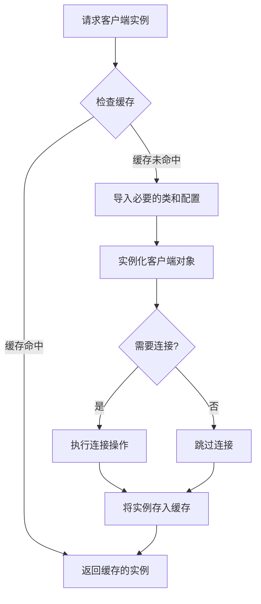

## 类结构

```
Service Clients (Logical Components)
├── Database & Executor
│   ├── DatabaseManagerClient
│   └── SchedulerClient
├── Execution & Messaging
│   ├── RedisExecutionEventBus
│   └── RabbitMQ (Execution & Notification)
├── Storage & Integrations
│   ├── Supabase
│   └── IntegrationCredentialsStore
└── External Services
    ├── OpenAI
    └── NotificationManager
```

## 全局变量及字段


### `settings`
    
The centralized application configuration instance used to access environment variables and secrets.

类型：`Settings`
    


    

## 全局函数及方法


### `get_database_manager_client`

获取一个启用了请求重试的线程缓存 DatabaseManagerClient。

参数：

-   无

返回值：`DatabaseManagerClient`，一个配置了请求重试功能的数据库管理客户端实例，且在当前线程内缓存。

#### 流程图

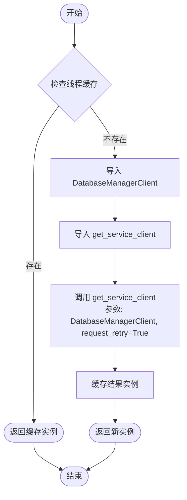

#### 带注释源码

```python
@thread_cached
def get_database_manager_client() -> "DatabaseManagerClient":
    """Get a thread-cached DatabaseManagerClient with request retry enabled."""
    # 局部导入以避免循环依赖或不必要的启动开销
    from backend.executor import DatabaseManagerClient
    from backend.util.service import get_service_client

    # 获取服务客户端实例，并启用请求重试机制
    return get_service_client(DatabaseManagerClient, request_retry=True)
```


### `get_database_manager_async_client`

获取一个线程缓存的、具有请求重试功能的异步数据库管理器客户端。

参数：

-  `should_retry`：`bool`，指示是否为客户端实例启用请求重试机制，默认为 True。

返回值：`DatabaseManagerAsyncClient`，返回一个线程缓存的 `DatabaseManagerAsyncClient` 实例。

#### 流程图

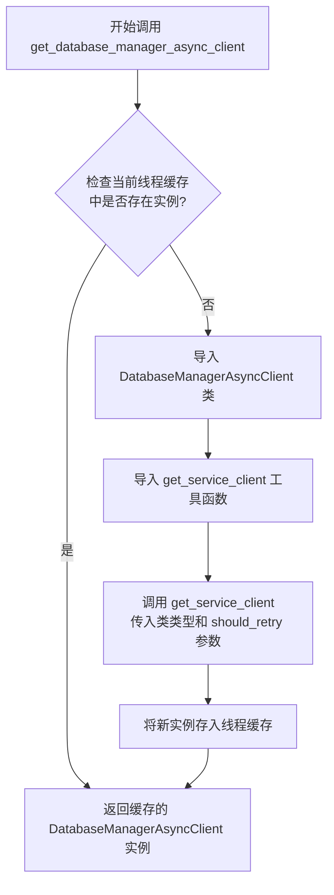

#### 带注释源码

```python
@thread_cached  # 使用装饰器实现线程级缓存，确保同一线程内只初始化一次
def get_database_manager_async_client(
    should_retry: bool = True,  # 参数：布尔值，决定是否开启请求重试，默认为开启
) -> "DatabaseManagerAsyncClient":  # 返回类型注解，字符串形式用于避免循环导入
    """Get a thread-cached DatabaseManagerAsyncClient with request retry enabled."""
    
    # 延迟导入：在函数内部导入模块，避免模块加载时的循环依赖问题
    from backend.executor import DatabaseManagerAsyncClient
    from backend.util.service import get_service_client

    # 调用服务获取工具函数，传入目标类和重试配置，实例化并返回客户端
    return get_service_client(DatabaseManagerAsyncClient, request_retry=should_retry)
```


### `get_scheduler_client`

获取一个线程缓存的 SchedulerClient。

参数：

- 无参数

返回值：`SchedulerClient`，一个线程缓存的 SchedulerClient 实例。

#### 流程图

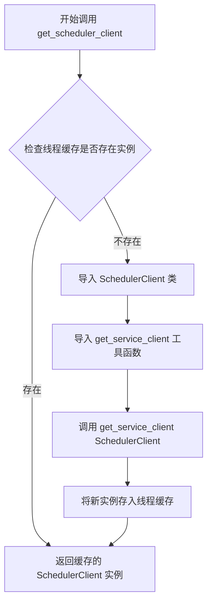

#### 带注释源码

```python
@thread_cached  # 使用线程缓存装饰器，确保在同一线程中该实例只被创建一次
def get_scheduler_client() -> "SchedulerClient":
    """Get a thread-cached SchedulerClient."""
    # 延迟导入：在函数内部导入，避免模块初始化时的循环依赖问题
    from backend.executor.scheduler import SchedulerClient
    from backend.util.service import get_service_client

    # 调用通用服务获取函数，传入 SchedulerClient 类以获取其实例
    return get_service_client(SchedulerClient)
```


### `get_notification_manager_client`

获取一个线程缓存的 `NotificationManagerClient` 实例。该函数利用 `get_service_client` 辅助函数来初始化客户端，并通过 `@thread_cached` 装饰器确保每个线程只创建一个实例。

参数：

-   无参数

返回值：`NotificationManagerClient`，返回一个线程级缓存的 NotificationManagerClient 实例。

#### 流程图

```mermaid
flowchart TD
    Start([开始调用]) --> CheckCache{检查线程缓存<br/>@thread_cached}
    CheckCache -->|缓存命中| ReturnCached[返回缓存的 Client 实例]
    CheckCache -->|缓存未命中| Import[导入 NotificationManagerClient<br/>导入 get_service_client]
    Import --> CreateClient[调用 get_service_client<br/>传入 Client 类]
    CreateClient --> UpdateCache[将实例存入线程缓存]
    UpdateCache --> ReturnNew[返回新创建的 Client 实例]
```

#### 带注释源码

```python
@thread_cached  # 使用线程缓存装饰器，确保同一线程内多次调用返回同一实例
def get_notification_manager_client() -> "NotificationManagerClient":
    """Get a thread-cached NotificationManagerClient."""
    # 延迟导入：避免模块加载时的循环依赖，减少启动时的导入开销
    from backend.notifications.notifications import NotificationManagerClient
    from backend.util.service import get_service_client

    # 调用通用服务客户端获取函数，传入具体的 Client 类，并启用了请求重试（默认）
    return get_service_client(NotificationManagerClient)
```


### `get_execution_event_bus`

获取一个线程缓存的 `RedisExecutionEventBus` 实例。

参数：

-  无

返回值：`RedisExecutionEventBus`，返回一个 Redis 执行事件总线实例。

#### 流程图

```mermaid
graph TD
    A[开始: 调用 get_execution_event_bus] --> B{检查当前线程缓存<br/>(@thread_cached装饰器)}
    B -- 缓存命中 --> C[返回已缓存的实例]
    B -- 缓存未命中 --> D[导入 RedisExecutionEventBus 类]
    D --> E[实例化 RedisExecutionEventBus]
    E --> F[将实例存入线程缓存]
    F --> C
```

#### 带注释源码

```python
@thread_cached  # 使用装饰器实现线程级别的缓存，确保同一线程内只实例化一次
def get_execution_event_bus() -> "RedisExecutionEventBus":
    """获取一个线程缓存的 RedisExecutionEventBus。"""
    # 局部导入，避免循环依赖或在模块加载时立即加载
    from backend.data.execution import RedisExecutionEventBus

    # 创建并返回 RedisExecutionEventBus 的新实例
    # 由于装饰器的存在，后续调用将直接返回该实例
    return RedisExecutionEventBus()
```


### `get_async_execution_event_bus`

获取一个线程缓存的异步Redis执行事件总线实例，用于在异步环境中处理和广播执行事件。

参数：

无

返回值：`AsyncRedisExecutionEventBus`，一个线程缓存的长生命周期异步Redis事件总线实例。

#### 流程图

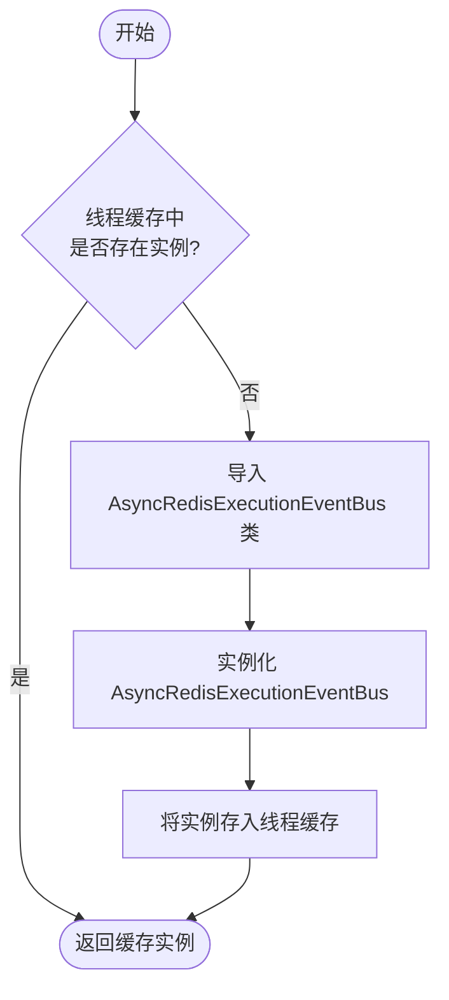

#### 带注释源码

```python
@thread_cached  # 使用装饰器实现线程级缓存，确保在同一线程上下文中该实例只被创建一次
def get_async_execution_event_bus() -> "AsyncRedisExecutionEventBus":
    """Get a thread-cached AsyncRedisExecutionEventBus."""
    # 延迟导入：仅在函数被调用时导入模块，有助于减少启动时间和潜在的循环依赖
    from backend.data.execution import AsyncRedisExecutionEventBus

    # 创建 AsyncRedisExecutionEventBus 的新实例并返回
    # 由于 @thread_cached 的存在，同一线程内的后续调用将直接返回此实例，不会重复执行
    return AsyncRedisExecutionEventBus()
```


### `get_execution_queue`

获取一个带有线程缓存的同步 RabbitMQ 执行队列客户端 (SyncRabbitMQ)。

参数：

无

返回值：`SyncRabbitMQ`，已初始化并建立连接的同步 RabbitMQ 执行队列客户端实例。

#### 流程图

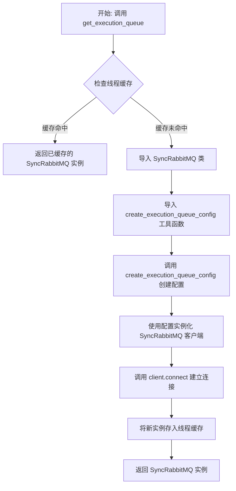

#### 带注释源码

```python
@thread_cached  # 使用装饰器实现线程级别的缓存，确保同一线程内只初始化一次
def get_execution_queue() -> "SyncRabbitMQ":
    """Get a thread-cached SyncRabbitMQ execution queue client."""
    # 延迟导入，避免循环依赖或启动时的不必要开销
    from backend.data.rabbitmq import SyncRabbitMQ
    from backend.executor.utils import create_execution_queue_config

    # 使用工具函数创建队列配置，并实例化客户端
    client = SyncRabbitMQ(create_execution_queue_config())
    
    # 建立网络连接
    client.connect()
    
    # 返回客户端实例（此时已被 @thread_cached 缓存）
    return client
```


### `get_async_execution_queue`

获取一个线程缓存的 AsyncRabbitMQ 执行队列客户端。

参数：

无

返回值：`AsyncRabbitMQ`，已连接的 AsyncRabbitMQ 执行队列客户端实例。

#### 流程图

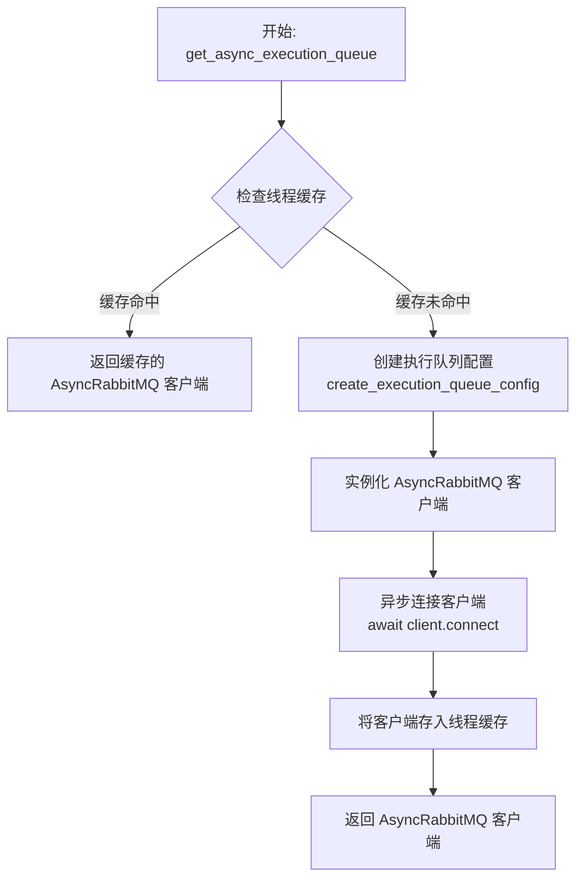

#### 带注释源码

```python
@thread_cached
async def get_async_execution_queue() -> "AsyncRabbitMQ":
    """Get a thread-cached AsyncRabbitMQ execution queue client."""
    # 导入必要的依赖类
    # AsyncRabbitMQ: 异步 RabbitMQ 客户端类
    from backend.data.rabbitmq import AsyncRabbitMQ
    # create_execution_queue_config: 用于创建执行队列配置的工具函数
    from backend.executor.utils import create_execution_queue_config

    # 根据配置创建 AsyncRabbitMQ 客户端实例
    client = AsyncRabbitMQ(create_execution_queue_config())
    
    # 建立异步连接
    await client.connect()
    
    # 返回连接好的客户端实例
    # 注意：由于 @thread_cached 装饰器的存在，该实例在同一线程中只会被创建和连接一次
    return client
```


### `get_integration_credentials_store`

获取一个线程缓存的 IntegrationCredentialsStore 实例。该函数使用 `@thread_cached` 装饰器，确保在同一个线程内多次调用时返回同一个实例，避免了重复初始化的开销。

参数：

无

返回值：`IntegrationCredentialsStore`，IntegrationCredentialsStore 的实例对象。

#### 流程图

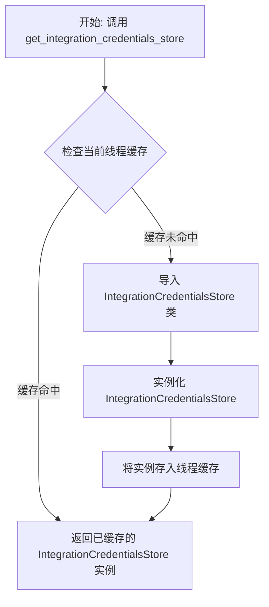

#### 带注释源码

```python
@thread_cached
def get_integration_credentials_store() -> "IntegrationCredentialsStore":
    """Get a thread-cached IntegrationCredentialsStore."""
    # 从 backend.integrations.credentials_store 模块导入凭证存储类
    from backend.integrations.credentials_store import IntegrationCredentialsStore

    # 实例化并返回 IntegrationCredentialsStore 对象
    # 由于使用了 @thread_cached 装饰器，该对象在当前线程的生命周期内会被复用
    return IntegrationCredentialsStore()
```


### `get_supabase`

获取一个进程级缓存的同步 Supabase 客户端实例。

参数：

无

返回值：`Client`，已初始化的 Supabase 客户端实例。

#### 流程图

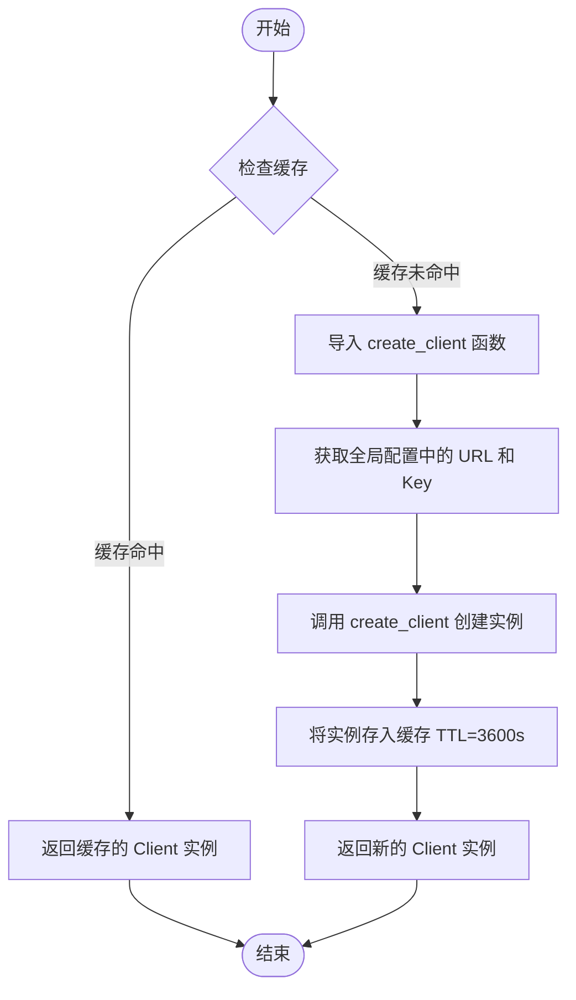

#### 带注释源码

```python
@cached(ttl_seconds=3600)  # 使用缓存装饰器，将结果缓存 3600 秒（1小时），避免频繁创建连接
def get_supabase() -> "Client":
    """Get a process-cached synchronous Supabase client instance."""
    from supabase import create_client  # 局部导入 Supabase 的客户端创建工厂函数

    # 调用工厂函数，传入配置中的 URL 和 Service Role Key，返回同步客户端实例
    return create_client(
        settings.secrets.supabase_url, settings.secrets.supabase_service_role_key
    )
```


### `get_async_supabase`

获取一个带有进程缓存（TTL为3600秒）的异步 Supabase 客户端实例。

参数：

无

返回值：`AClient`，异步 Supabase 客户端实例，用于与 Supabase 服务进行异步交互。

#### 流程图

```mermaid
flowchart TD
    A[开始调用 get_async_supabase] --> B{检查缓存<br>@cached 装饰器逻辑}
    B -- 缓存命中且未过期 --> C[返回缓存的 AClient 实例]
    B -- 缓存未命中或已过期 --> D[执行函数体]
    D --> E[导入 create_async_client 函数]
    E --> F[从 settings 获取 supabase_url]
    F --> G[从 settings 获取 supabase_service_role_key]
    G --> H[调用 create_async_client 创建客户端]
    H --> I[等待客户端创建完成 await]
    I --> J[缓存结果 并更新 TTL]
    J --> C
```

#### 带注释源码

```python
    @cached(ttl_seconds=3600)  # 使用缓存装饰器，设置缓存存活时间为3600秒（1小时）
    async def get_async_supabase() -> "AClient":  # 定义异步函数，返回类型注解为 AClient
        """Get a process-cached asynchronous Supabase client instance."""
        from supabase import create_async_client  # 延迟导入，仅在首次调用时加载

        # 调用 create_async_client 异步创建客户端实例
        # 使用全局配置 settings 中的 URL 和 Service Role Key 进行初始化
        return await create_async_client(
            settings.secrets.supabase_url, settings.secrets.supabase_service_role_key
        )
```


### `get_openai_client`

获取一个用于嵌入（embeddings）的过程级缓存异步 OpenAI 客户端。如果未配置 API 密钥，则返回 None。

参数：

-  无

返回值：`AsyncOpenAI | None`，如果配置了 OpenAI API 密钥，则返回 `AsyncOpenAI` 客户端实例；否则返回 `None`。

#### 流程图

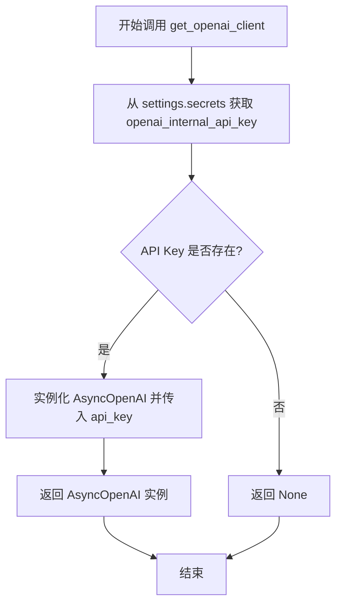

#### 带注释源码

```python
@cached(ttl_seconds=3600)  # 使用缓存装饰器，设置缓存有效期为3600秒（1小时）
def get_openai_client() -> "AsyncOpenAI | None":
    """
    Get a process-cached async OpenAI client for embeddings.

    Returns None if API key is not configured.
    """
    from openai import AsyncOpenAI  # 导入 OpenAI 的异步客户端类

    # 从全局设置对象中获取内部 OpenAI API 密钥
    api_key = settings.secrets.openai_internal_api_key
    
    # 检查 API 密钥是否存在或为空
    if not api_key:
        return None  # 如果未配置密钥，返回 None
    
    # 使用获取到的 API 密钥初始化并返回 AsyncOpenAI 客户端
    return AsyncOpenAI(api_key=api_key)
```


### `get_notification_queue`

获取一个线程缓存的同步 RabbitMQ 通知队列客户端。

参数：

无

返回值：`SyncRabbitMQ`，已连接的同步 RabbitMQ 客户端实例，用于处理通知队列。

#### 流程图

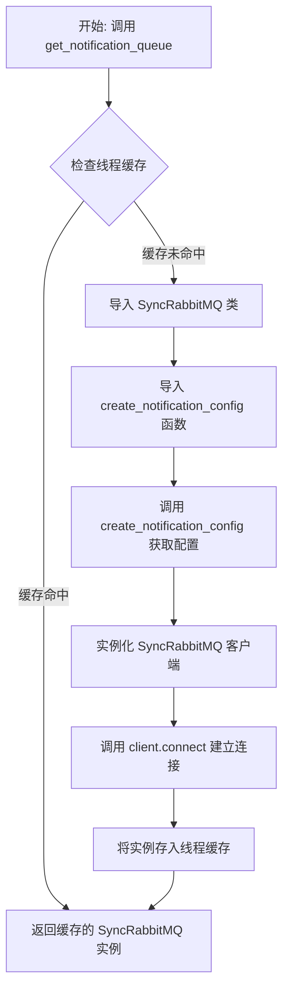

#### 带注释源码

```python
@thread_cached
def get_notification_queue() -> "SyncRabbitMQ":
    """Get a thread-cached SyncRabbitMQ notification queue client."""
    # 导入 RabbitMQ 同步客户端类
    from backend.data.rabbitmq import SyncRabbitMQ
    # 导入用于创建通知队列配置的工具函数
    from backend.notifications.notifications import create_notification_config

    # 使用配置初始化 SyncRabbitMQ 客户端
    client = SyncRabbitMQ(create_notification_config())
    # 建立客户端连接
    client.connect()
    # 返回客户端实例（由 @thread_cached 装饰器处理缓存逻辑）
    return client
```


### `get_async_notification_queue`

获取一个线程缓存的 AsyncRabbitMQ 通知队列客户端实例。该函数确保在每个线程中只初始化并连接一次客户端，后续调用返回缓存的实例。

参数：


返回值：`AsyncRabbitMQ`，已连接的异步 RabbitMQ 通知队列客户端实例。

#### 流程图

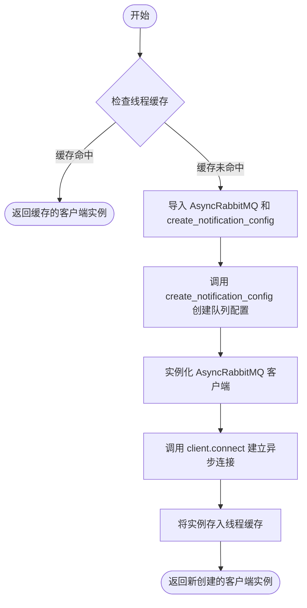

#### 带注释源码

```python
@thread_cached  # 装饰器：确保该函数在同一线程内只执行一次，后续调用直接返回缓存结果
async def get_async_notification_queue() -> "AsyncRabbitMQ":
    """Get a thread-cached AsyncRabbitMQ notification queue client."""
    # 延迟导入：仅在函数被调用时导入模块，避免循环依赖或启动时的开销
    from backend.data.rabbitmq import AsyncRabbitMQ
    from backend.notifications.notifications import create_notification_config

    # 使用特定的通知配置创建 AsyncRabbitMQ 客户端实例
    client = AsyncRabbitMQ(create_notification_config())
    
    # 异步建立与消息队列服务器的连接
    await client.connect()
    
    # 返回已连接的客户端实例（该实例将被缓存以供后续使用）
    return client
```


## 关键组件


### Thread-Local Service Client Caching
利用 `@thread_cached` 装饰器实现线程局部缓存，确保每个线程拥有独立的客户端实例，避免多线程竞争并懒加载 DatabaseManager、Scheduler 等核心服务客户端。

### Process-Level External Client Caching
利用 `@cached` 装饰器实现进程级缓存和 TTL（生存时间）管理，用于在进程范围内共享和复用 Supabase 和 OpenAI 等外部 API 客户端实例，以减少连接开销。

### Database Manager Access Layer
封装获取同步和异步 DatabaseManagerClient 的逻辑，统一数据库服务客户端的创建入口，并支持配置请求重试机制。

### Message Queue Integration
集成 RabbitMQ 消息队列，提供同步和异步的执行队列及通知队列客户端，负责创建队列配置、建立连接并返回客户端实例。

### Event Bus Integration
集成 Redis 事件总线，提供同步和异步的 RedisExecutionEventBus 实例，用于系统中执行事件的发布与订阅。

### Notification System
封装 NotificationManagerClient 和相关的通知队列客户端，提供统一的通知服务访问接口和底层消息队列连接支持。


## 问题及建议


### 已知问题

-   **RabbitMQ 连接缺乏容错机制**：`SyncRabbitMQ` 和 `AsyncRabbitMQ` 客户端在首次调用时建立连接（`client.connect()`）并被缓存。如果连接在网络波动或服务端重启后中断，缓存的客户端实例将保持失效状态，导致后续请求持续失败，直到应用重启。
-   **异步缓存上下文潜在冲突**：代码对 `async` 函数使用了 `@thread_cached` 装饰器。在异步运行时（如 uvicorn/gunicorn）中，多个协程通常在同一线程中运行。如果 `@thread_cached` 依赖 `threading.local` 而非 `contextvars`，可能会导致缓存状态在协程间错误共享，或者如果底层客户端实例不是并发安全的，会导致竞态条件。
-   **资源清理缺失**：代码中提供了获取客户端的方法，但缺乏对应的清理或关闭方法。应用关闭或重载时，RabbitMQ 连接、Supabase 客户端和 OpenAI 客户端可能无法正确释放，导致资源泄漏或端口占用。
-   **硬编码的配置参数**：Supabase 和 OpenAI 客户端的缓存 TTL（生存时间）被硬编码为 `3600` 秒，缺乏灵活性，无法在不修改代码的情况下适应不同的部署环境需求。
-   **异常状态可能被缓存**：如果客户端初始化（如连接数据库）过程中抛出异常，且缓存装饰器未处理异常情况，该异常可能会被缓存，导致随后的调用直接获取失败结果，无法自动重试恢复。

### 优化建议

-   **引入连接健康检查与重连机制**：在返回缓存的客户端（特别是 RabbitMQ 和数据库连接）之前，检查连接状态。如果连接已断开，应自动销毁旧实例并尝试建立新连接，确保服务的高可用性。
-   **使用 Contextvars 优化异步缓存**：检查并重构 `@thread_cached` 装饰器的实现，确保在异步环境中使用 `contextvars` 上下文变量进行存储，而不是线程本地存储，以适应异步编程模型并避免并发安全问题。
-   **实现生命周期管理**：增加一个全局的清理函数（如 `close_all_clients()`），在应用关闭信号（如 shutdown event）触发时，显式调用所有缓存客户端的 `close()` 或清理方法，优雅释放资源。
-   **配置化 TTL 参数**：将缓存 TTL 等魔术数字提取到 `Settings` 配置文件中，允许运维人员根据实际环境调整缓存策略。
-   **延迟连接初始化**：考虑将 `client.connect()` 的调用从客户端获取函数中移除，改为在首次使用客户端时才触发连接（Lazy Connection），或者仅在应用启动健康检查通过后进行连接，以避免因依赖服务不可用导致应用启动失败。


## 其它


### 设计目标与约束

该模块旨在提供一个集中式、线程安全且高效的服务客户端访问层。设计目标包括：
1.  **资源优化与性能**：通过使用 `@thread_cached` 和 `@cached` 装饰器，实现客户端实例的延迟初始化（Lazy Initialization）和复用，避免在每次请求时重建昂贵的连接（如数据库、RabbitMQ、Redis 连接），从而降低系统开销并提升响应速度。
2.  **解耦与依赖管理**：通过工厂函数封装客户端创建逻辑，隔离了复杂的初始化代码（如配置加载、连接建立）。使用了本地导入（Local Imports）和 `TYPE_CHECKING` 来防止循环导入问题，仅在函数运行时加载实际模块。
3.  **生命周期管理**：区分了线程级缓存（适用于有状态或非线程安全的客户端，如连接对象）和进程级缓存（适用于无状态或可全局共享的客户端，如 API Key 配置）。

**约束**：
-   **线程安全**：`@thread_cached` 依赖于线程本地存储，确保每个线程拥有独立的客户端实例，防止多线程并发访问同一连接对象导致的竞态条件。
-   **TTL 限制**：对于 `@cached` 装饰器（如 Supabase 和 OpenAI 客户端），实例的生命周期受硬编码的 TTL（3600秒）限制。
-   **环境依赖**：所有客户端均强依赖于全局 `Settings` 对象的正确配置，缺少必要的配置（如 URL 或 API Key）会导致客户端返回 `None` 或抛出异常。

### 外部依赖与接口契约

该模块依赖外部库和内部服务模块，其接口契约如下：

1.  **基础设施库**：
    -   **Supabase (`supabase`)**: 依赖 `create_client` 和 `create_async_client` 工厂函数。契约要求传入有效的 `url` 和 `service_role_key`。
    -   **OpenAI (`openai`)**: 依赖 `AsyncOpenAI` 类。契约要求 `api_key`，若缺失则允许返回 `None`。
2.  **内部服务模块 (`backend.*`)**:
    -   **DatabaseManager, Scheduler, NotificationManager**: 依赖 `backend.util.service.get_service_client`。该通用工厂契约要求传入客户端类和 `request_retry` 布尔参数。
    -   **RabbitMQ (`backend.data.rabbitmq`)**: 依赖 `SyncRabbitMQ` 和 `AsyncRabbitMQ` 类，它们必须接受配置字典并实现 `connect()` 方法。
    -   **Redis/EventBus**: 依赖 `RedisExecutionEventBus` 类的无参构造函数。
3.  **配置系统 (`backend.util.settings`)**:
    -   **Settings**: 单例模式，必须提供 `secrets` 属性，包含 `supabase_url`, `supabase_service_role_key`, `openai_internal_api_key` 等字段。

### 错误处理与异常设计

该模块的错误处理策略主要区分“致命错误”与“配置缺失”：

1.  **连接初始化失败**：
    -   对于强依赖服务（如 RabbitMQ, Redis, Database），如果在首次调用 `client.connect()` 或初始化时发生网络错误或认证失败，异常将直接向上抛出至调用方，由上层逻辑处理重试或熔断。
    -   缓存机制本身不捕获异常：如果初始化失败，后续在同一线程/进程内的调用通常会再次触发初始化并抛出相同的异常（取决于装饰器实现，通常缓存的是成功的结果）。
2.  **软失败**：
    -   在 `get_openai_client` 函数中，采用了防御性编程。如果 `settings.secrets.openai_internal_api_key` 未配置，函数返回 `None` 而非抛出异常。调用方必须处理客户端为 `None` 的空指针情况。
3.  **类型安全**：
    -   使用 `TYPE_CHECKING` 块来避免运行时的循环导入错误，这是静态类型检查阶段的契约约定，不涉及运行时异常。

### 并发模型与线程安全

该模块针对不同的并发场景设计了不同的缓存策略：

1.  **线程级缓存 (`@thread_cached`)**：
    -   **适用场景**：主要用于同步客户端（如 `DatabaseManagerClient`, `SyncRabbitMQ`, `RedisExecutionEventBus`）。
    -   **机制**：利用线程本地存储，确保每个工作线程维护自己独立的客户端实例。
    -   **必要性**：许多底层的数据库驱动或网络客户端库不是线程安全的，或者连接对象不能在线程间共享。此设计保证了在多线程环境（如 Python 的 `threading` 或 WSGI 容器）下的数据安全。
2.  **进程级缓存 (`@cached` with TTL)**：
    -   **适用场景**：主要用于异步客户端（如 `AsyncOpenAI`）或无状态的轻量级客户端。
    -   **机制**：在整个进程范围内共享同一个实例，直到 TTL 过期。
    -   **异步支持**：对于 `AsyncRabbitMQ` 和 `AsyncSupabase`，提供了异步获取函数，支持在 `asyncio` 事件循环中运行。虽然使用了 `@thread_cached`，但在 `asyncio` 单线程模型中，这通常意味着单个事件循环内共享一个实例。
3.  **生命周期边界**：
    -   客户端实例在首次请求时创建，并随着线程的销毁（对于 `@thread_cached`）或缓存过期（对于 `@cached`）而失效。这意味着长时间运行的服务可能需要考虑连接的存活时间或重连机制（部分客户端如 `DatabaseManagerClient` 开启了 `request_retry`）。

    