# `.\AutoGPT\autogpt_platform\backend\backend\util\cloud_storage.py` 详细设计文档

The code implements a cloud storage utility module designed to handle asynchronous file operations for Google Cloud Storage (GCS) with an abstraction layer for future providers (AWS, Azure). It features a `CloudStorageHandler` class for managing storage sessions, file upload/download, signed URL generation, and access control based on user or execution context. Additionally, it includes lifecycle management for expired files and global singleton handling with thread-safe locks.

## 整体流程

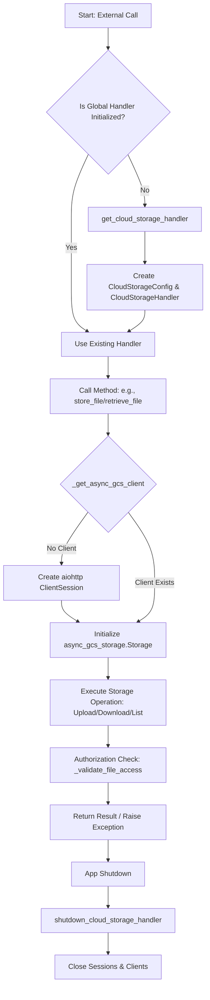

## 类结构

```
CloudStorageConfig
├── CloudStorageHandler
```

## 全局变量及字段


### `logger`
    
用于记录模块运行时信息的日志记录器实例。

类型：`logging.Logger`
    


### `_cloud_storage_handler`
    
全局唯一的云存储处理器实例，采用单例模式管理。

类型：`CloudStorageHandler | None`
    


### `_handler_lock`
    
异步锁，用于确保全局云存储处理器初始化过程的线程安全。

类型：`asyncio.Lock`
    


### `_cleanup_lock`
    
异步锁，用于防止并发执行清理过期文件的操作。

类型：`asyncio.Lock`
    


### `CloudStorageConfig.gcs_bucket_name`
    
Google Cloud Storage 的存储桶名称，从配置中读取。

类型：`str`
    


### `CloudStorageHandler.config`
    
云存储配置对象，包含连接和操作云存储所需的配置信息。

类型：`CloudStorageConfig`
    


### `CloudStorageHandler._async_gcs_client`
    
异步 GCS 客户端实例，用于执行异步的文件上传下载操作。

类型：`async_gcs_storage.Storage | None`
    


### `CloudStorageHandler._sync_gcs_client`
    
同步 GCS 客户端实例，专门用于生成带签名的访问 URL。

类型：`gcs_storage.Client | None`
    


### `CloudStorageHandler._session`
    
HTTP 客户端会话，用于维护异步 GCS 客户端的连接池。

类型：`aiohttp.ClientSession | None`
    
    

## 全局函数及方法


### `get_cloud_storage_handler`

获取全局云存储处理程序实例的辅助函数，使用双重检查锁定模式（Double-Checked Locking）确保在异步环境下的线程安全和单例特性。

参数：

*   (无参数)

返回值：`CloudStorageHandler`，全局唯一的云存储处理程序实例。

#### 流程图

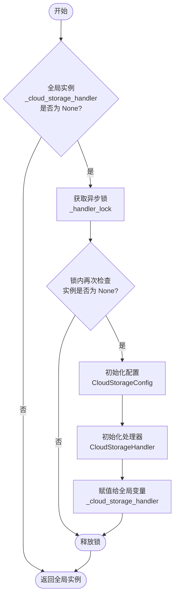

#### 带注释源码

```python
async def get_cloud_storage_handler() -> CloudStorageHandler:
    """Get the global cloud storage handler instance with proper locking."""
    global _cloud_storage_handler

    # 第一次检查：如果实例已存在，直接返回，避免获取锁带来的性能开销
    if _cloud_storage_handler is None:
        # 获取异步锁，确保只有一个协程能执行初始化
        async with _handler_lock:
            # 第二次检查：双重检查锁定模式 (Double-Checked Locking)
            # 防止在等待锁期间，其他协程已经完成了实例初始化
            if _cloud_storage_handler is None:
                # 初始化云存储配置
                config = CloudStorageConfig()
                # 创建 CloudStorageHandler 实例并赋值给全局变量
                _cloud_storage_handler = CloudStorageHandler(config)

    return _cloud_storage_handler
```


### `shutdown_cloud_storage_handler`

优雅地关闭全局云存储处理程序实例，释放其持有的HTTP会话和GCS客户端等资源。

参数：

-   无

返回值：`None`，表示该过程不返回值。

#### 流程图

```mermaid
graph TD
    A[开始执行 shutdown_cloud_storage_handler] --> B{全局变量 _cloud_storage_handler 是否为 None?}
    B -- 是 --> G[结束]
    B -- 否 --> C[获取异步锁 _handler_lock]
    C --> D{双重检查: _cloud_storage_handler 是否为 None?}
    D -- 是 --> F[释放锁]
    F --> G
    D -- 否 --> E[调用 close() 关闭客户端和会话]
    E --> H[将 _cloud_storage_handler 置为 None]
    H --> F
```

#### 带注释源码

```python
async def shutdown_cloud_storage_handler():
    """Properly shutdown the global cloud storage handler."""
    # 声明使用全局变量，以便修改它
    global _cloud_storage_handler

    # 第一次检查：如果实例不存在，直接返回，避免不必要的锁竞争
    if _cloud_storage_handler is not None:
        # 获取全局锁，确保在多线程/多协程环境下的线程安全
        async with _handler_lock:
            # 双重检查锁定模式：在持有锁的情况下再次检查
            # 防止在等待锁的过程中，其他协程已经将实例关闭并置空
            if _cloud_storage_handler is not None:
                # 调用实例的 close 方法，关闭底层的 aiohttp session 和 GCS 客户端
                await _cloud_storage_handler.close()
                # 将全局变量置为 None，表示实例已被销毁
                _cloud_storage_handler = None
```


### `cleanup_expired_files_async`

异步清理云存储中的过期文件。该函数使用全局锁来防止并发清理操作，通过获取全局存储处理器实例并调用其删除方法来完成清理，同时记录操作日志和处理潜在异常。

参数：

-   无

返回值：`int`，成功删除的过期文件数量；若清理过程中发生错误，则返回 0。

#### 流程图

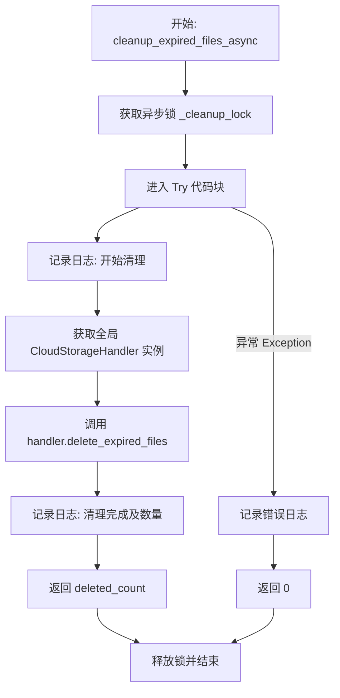

#### 带注释源码

```python
async def cleanup_expired_files_async() -> int:
    """
    Clean up expired files from cloud storage.

    This function uses a lock to prevent concurrent cleanup operations.

    Returns:
        Number of files deleted
    """
    # 使用清理锁来防止并发清理操作，确保同一时间只有一个清理任务在运行
    async with _cleanup_lock:
        try:
            # 记录开始清理的日志信息
            logger.info(
                "[CloudStorage] Starting cleanup of expired cloud storage files"
            )
            # 获取全局云存储处理器实例
            handler = await get_cloud_storage_handler()
            # 调用处理器的方法删除过期文件
            deleted_count = await handler.delete_expired_files()
            # 记录清理完成的日志信息，包含删除的文件数量
            logger.info(
                f"[CloudStorage] Cleaned up {deleted_count} expired files from cloud storage"
            )
            # 返回删除的文件数量
            return deleted_count
        except Exception as e:
            # 捕获清理过程中的任何异常，记录错误日志
            logger.error(f"[CloudStorage] Error during cloud storage cleanup: {e}")
            # 发生错误时返回 0
            return 0
```


### `CloudStorageConfig.__init__`

初始化云存储配置对象，从全局设置中加载 Google Cloud Storage (GCS) 的存储桶名称。

参数：

-  `self`：`CloudStorageConfig`，类实例自身

返回值：`None`，构造函数不返回值，仅初始化实例属性

#### 流程图

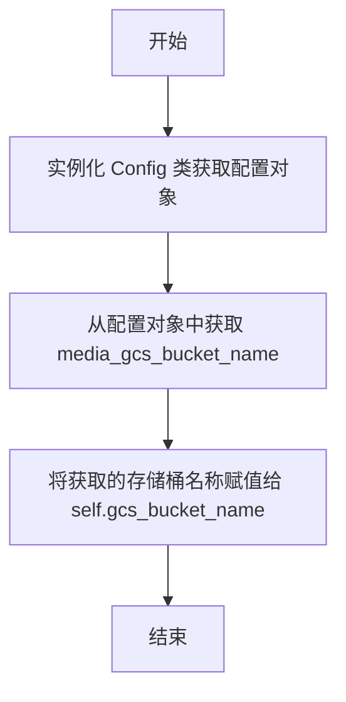

#### 带注释源码

```python
def __init__(self):
    # 加载全局配置
    config = Config()

    # GCS configuration from settings - uses Application Default Credentials
    # 从设置中获取 GCS 存储桶名称，并赋值给实例变量
    self.gcs_bucket_name = config.media_gcs_bucket_name

    # Future providers can be added here
    # 预留位置：未来可以在此添加其他云存储提供商（如 AWS、Azure）的配置
    # self.aws_bucket_name = config.aws_bucket_name
    # self.azure_container_name = config.azure_container_name
```


### `CloudStorageHandler.__init__`

该方法是 `CloudStorageHandler` 类的构造函数，用于初始化云存储处理程序的实例。它接收一个配置对象，并将内部使用的异步 GCS 客户端、同步 GCS 客户端以及 HTTP 会话初始化为 `None`，采用延迟加载策略在后续需要时才创建这些资源。

参数：

-  `config`：`CloudStorageConfig`，云存储配置对象，包含诸如 GCS 存储桶名称等必要设置。

返回值：`None`，构造函数不返回任何值。

#### 流程图

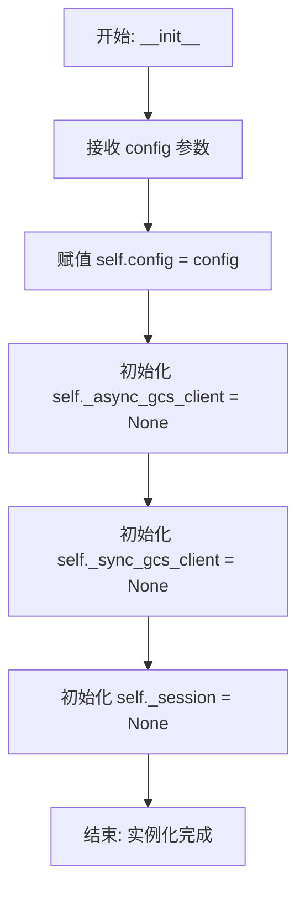

#### 带注释源码

```python
    def __init__(self, config: CloudStorageConfig):
        # 存储传入的配置对象，该对象包含云服务提供商的配置信息（如 bucket 名称）
        self.config = config
        
        # 初始化异步 GCS 客户端为 None，采用延迟加载策略，
        # 只有在调用 _get_async_gcs_client 时才会实际创建
        self._async_gcs_client = None
        
        # 初始化同步 GCS 客户端为 None，同样延迟加载，
        # 该客户端专门用于生成签名 URL
        self._sync_gcs_client = None  # Only for signed URLs
        
        # 初始化 aiohttp 会话为 None，用于异步客户端的 HTTP 通信
        self._session = None
```


### `CloudStorageHandler._get_async_gcs_client`

获取或创建异步 GCS 客户端，确保在正确的异步上下文中创建。该方法采用单例模式管理客户端实例的生命周期，并根据当前是否处于 `asyncio` 任务上下文中，动态选择创建临时客户端（适用于非任务环境）或复用长连接会话（适用于常规异步任务）。

参数：

-  无

返回值：`async_gcs_storage.Storage`，用于与 Google Cloud Storage 进行异步交互的客户端对象。

#### 流程图

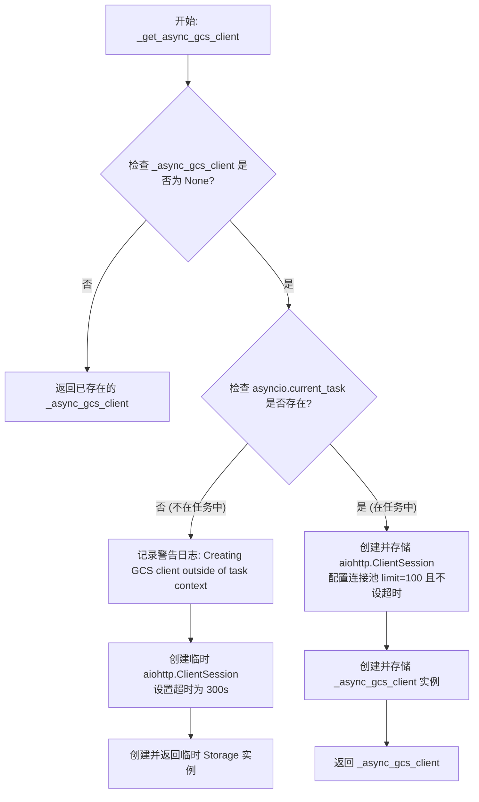

#### 带注释源码

```python
    async def _get_async_gcs_client(self):
        """Get or create async GCS client, ensuring it's created in proper async context."""
        # Check if we already have a client
        # 检查是否已经有缓存的客户端实例，如果有则直接返回，避免重复创建
        if self._async_gcs_client is not None:
            return self._async_gcs_client

        current_task = asyncio.current_task()
        if not current_task:
            # If we're not in a task, create a temporary client
            # 如果当前不在异步任务上下文中（例如在同步代码调用或脚本初始化阶段），创建一个临时客户端
            logger.warning(
                "[CloudStorage] Creating GCS client outside of task context - using temporary client"
            )
            timeout = aiohttp.ClientTimeout(total=300)
            session = aiohttp.ClientSession(
                timeout=timeout,
                connector=aiohttp.TCPConnector(limit=100, force_close=False),
            )
            # 返回临时创建的客户端，不将其赋值给 self._async_gcs_client，以避免在非预期上下文中持有状态
            return async_gcs_storage.Storage(session=session)

        # Create a reusable session with proper configuration
        # 如果处于正常的异步任务中，创建一个可复用的 session
        # Key fix: Don't set timeout on session, let gcloud-aio handle it
        # 关键修复：不在 session 层面设置超时，而是让底层的 gcloud-aio 库自行处理超时逻辑
        self._session = aiohttp.ClientSession(
            connector=aiohttp.TCPConnector(
                limit=100,  # Connection pool limit (连接池最大连接数)
                force_close=False,  # Reuse connections (复用底层 TCP 连接)
            )
        )

        # Create the GCS client with our session
        # 使用配置好的 session 创建 GCS 客户端，并将其缓存到实例变量中供后续复用
        # The key is NOT setting timeout on the session but letting the library handle it
        self._async_gcs_client = async_gcs_storage.Storage(session=self._session)

        return self._async_gcs_client
```


### `CloudStorageHandler.close`

该方法用于正确关闭所有云存储相关的客户端连接和底层会话，释放资源。

参数：

*   无

返回值：`None`，该方法不返回任何值。

#### 流程图

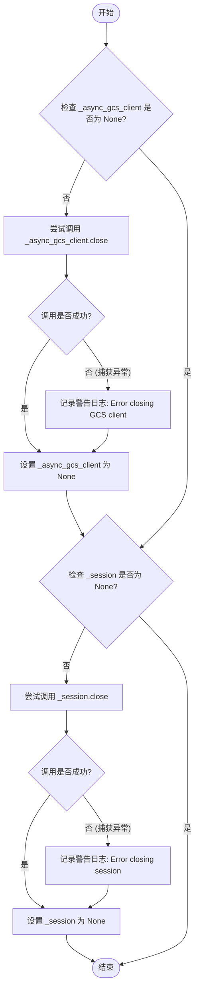

#### 带注释源码

```python
async def close(self):
    """Close all client connections properly."""
    # 检查异步 GCS 客户端是否存在
    if self._async_gcs_client is not None:
        try:
            # 尝试关闭 GCS 客户端连接
            await self._async_gcs_client.close()
        except Exception as e:
            # 如果关闭过程中发生异常，记录警告日志但不中断程序
            logger.warning(f"[CloudStorage] Error closing GCS client: {e}")
        # 无论是否发生异常，都将客户端引用置为 None，标记为已关闭
        self._async_gcs_client = None

    # 检查 aiohttp 会话是否存在
    if self._session is not None:
        try:
            # 尝试关闭 aiohttp 会话
            await self._session.close()
        except Exception as e:
            # 如果关闭过程中发生异常，记录警告日志
            logger.warning(f"[CloudStorage] Error closing session: {e}")
        # 将会话引用置为 None
        self._session = None
```


### `CloudStorageHandler.__aenter__`

异步上下文管理器的入口方法，使 `CloudStorageHandler` 实例能够用于 `async with` 语句中。

参数：

-  `self`：`CloudStorageHandler`，类实例本身

返回值：`CloudStorageHandler`，返回当前实例，以便在上下文管理器的作用域内调用其方法。

#### 流程图

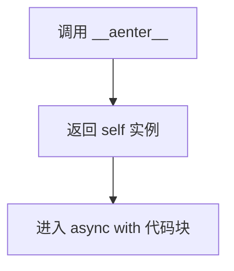

#### 带注释源码

```python
    async def __aenter__(self):
        """Async context manager entry."""
        # 返回自身，允许调用者使用 'async with handler as h:' 语法
        return self
```


### `CloudStorageHandler.__aexit__`

异步上下文管理器的退出方法，用于在离开 `async with` 代码块时清理资源，具体操作是关闭云存储客户端连接和底层的 HTTP 会话。

参数：

- `exc_type`：`Optional[Type[BaseException]]`，在上下文中引发的异常类型（如果没有异常则为 None）。
- `exc_val`：`Optional[BaseException]`，在上下文中引发的异常实例（如果没有异常则为 None）。
- `exc_tb`：`Optional[TracebackType]`，异常对应的回溯对象（如果没有异常则为 None）。

返回值：`Optional[bool]`，通常返回 `None`，表示不会抑制上下文中发生的异常，异常将正常传播。

#### 流程图

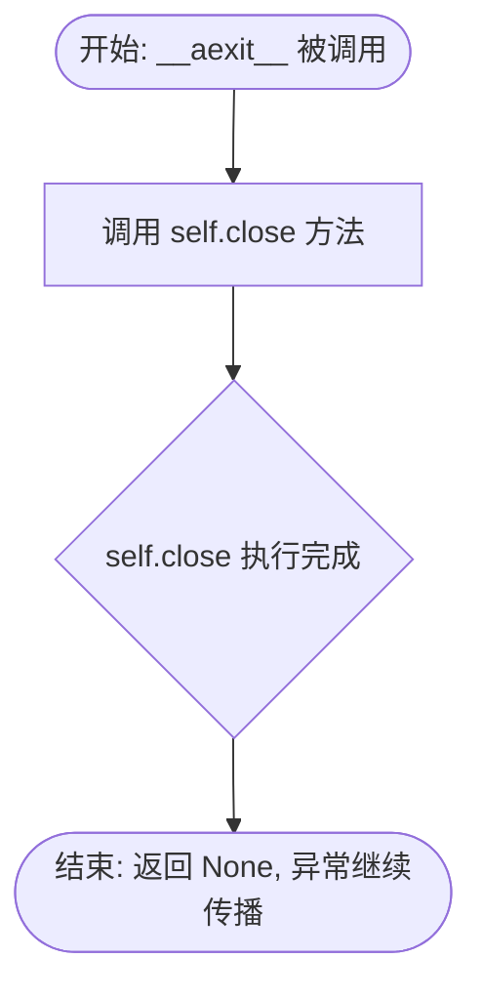

#### 带注释源码

```python
    async def __aexit__(self, exc_type, exc_val, exc_tb):
        """Async context manager exit."""
        # 调用 close 方法清理资源
        # 该方法会关闭 _async_gcs_client 和 _session
        await self.close()
```


### `CloudStorageHandler._get_sync_gcs_client`

该方法是 `CloudStorageHandler` 类的内部方法，用于延迟初始化（Lazy Initialization）同步 Google Cloud Storage (GCS) 客户端。该方法主要旨在生成签名 URL 的场景中使用，利用 Application Default Credentials (ADC) 进行身份验证，并确保仅在需要时才创建客户端实例以节省资源。

参数：

-  `无`

返回值：`gcs_storage.Client`，初始化后的同步 GCS 客户端实例。

#### 流程图

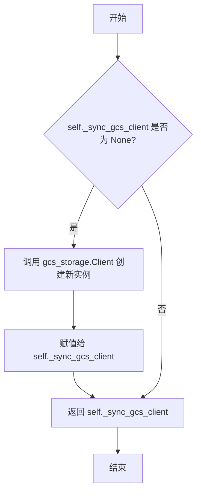

#### 带注释源码

```python
    def _get_sync_gcs_client(self):
        """Lazy initialization of sync GCS client (only for signed URLs)."""
        # 检查同步客户端是否尚未初始化
        if self._sync_gcs_client is None:
            # 使用 Application Default Credentials (ADC) 创建新的同步 GCS 客户端
            # 这与 media.py 中的凭据策略保持一致
            self._sync_gcs_client = gcs_storage.Client()
        # 返回已存在的或新创建的客户端实例
        return self._sync_gcs_client
```


### `CloudStorageHandler.parse_cloud_path`

解析云存储路径字符串，提取存储提供商和实际的存储路径。

参数：

- `path`：`str`，云存储路径（例如 "gcs://bucket/path/to/file"）。

返回值：`Tuple[str, str]`，包含提供商标识符和去掉前缀后的实际路径的元组。

#### 流程图

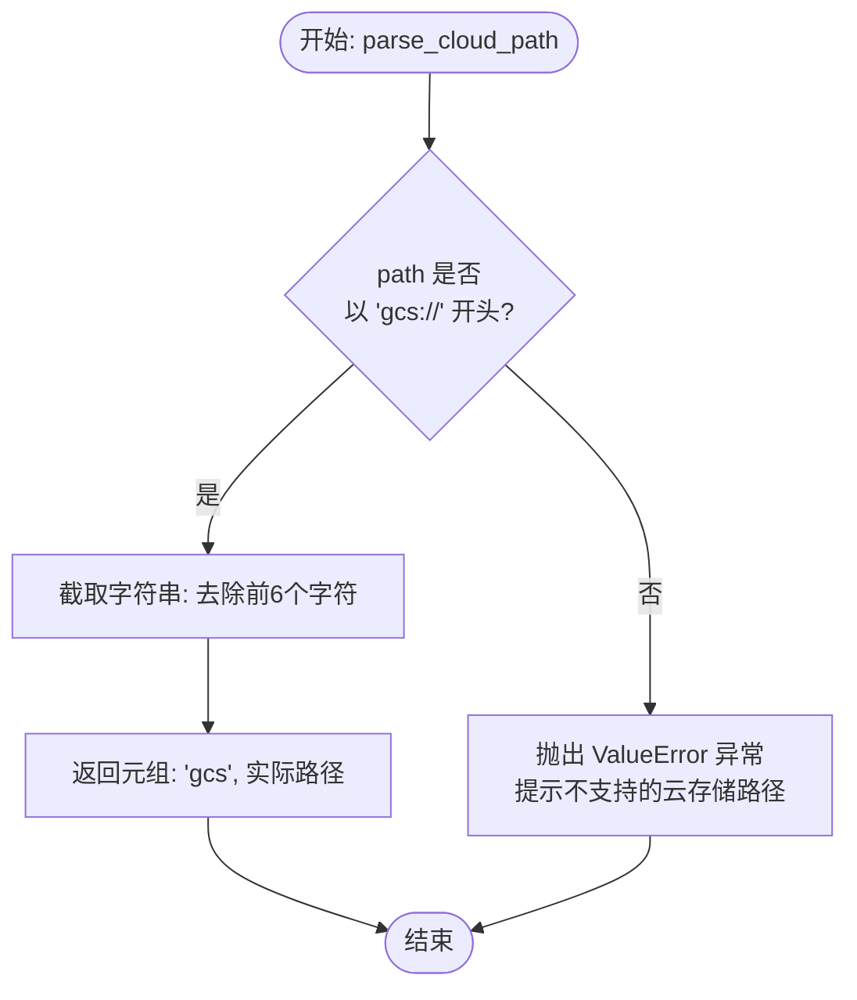

#### 带注释源码

```python
    def parse_cloud_path(self, path: str) -> Tuple[str, str]:
        """
        Parse a cloud storage path and return provider and actual path.

        Args:
            path: Cloud storage path (e.g., "gcs://bucket/path/to/file")

        Returns:
            Tuple of (provider, actual_path)
        """
        # 检查路径是否以 GCS 协议头 "gcs://" 开头
        if path.startswith("gcs://"):
            # 返回提供商标识 "gcs" 和去除前缀后的实际路径（切片操作 path[6:]）
            return "gcs", path[6:]  # Remove "gcs://" prefix
        
        # 预留其他提供商（如 S3, Azure）的扩展逻辑
        # Future providers:
        # elif path.startswith("s3://"):
        #     return "s3", path[5:]
        # elif path.startswith("azure://"):
        #     return "azure", path[8:]
        else:
            # 如果不匹配任何已知协议，抛出数值错误异常
            raise ValueError(f"Unsupported cloud storage path: {path}")
```


### `CloudStorageHandler.is_cloud_path`

该函数用于判断输入的路径字符串是否属于云存储路径，通过检测其是否以 gcs://、s3:// 或 azure:// 等支持的云存储协议前缀开头来返回布尔值。

参数：

- `path`：`str`，待检查的路径字符串。

返回值：`bool`，如果路径以支持的云存储前缀开头则为 True，否则为 False。

#### 流程图

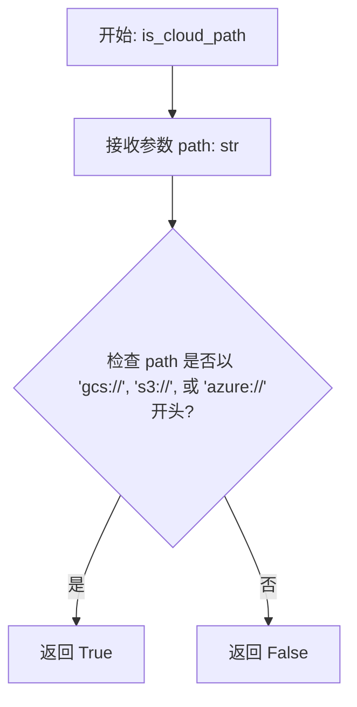

#### 带注释源码

```python
def is_cloud_path(self, path: str) -> bool:
    """Check if a path is a cloud storage path."""
    # 检查路径字符串是否以预定义的云存储协议头开头
    # 支持的协议包括: gcs:// (Google Cloud Storage), s3:// (AWS S3), azure:// (Azure Storage)
    return path.startswith(("gcs://", "s3://", "azure://"))
```


### `CloudStorageHandler.store_file`

Store file content in cloud storage.

参数：

- `content`：`bytes`，File content as bytes
- `filename`：`str`，Desired filename
- `provider`：`str`，Cloud storage provider ("gcs", "s3", "azure")
- `expiration_hours`：`int`，Hours until expiration (1-48, default: 48)
- `user_id`：`str | None`，User ID for user-scoped files (optional)
- `graph_exec_id`：`str | None`，Graph execution ID for execution-scoped files (optional)

返回值：`str`，Cloud storage path (e.g., "gcs://bucket/path/to/file")

#### 流程图

```mermaid
flowchart TD
    A([开始: store_file]) --> B[接收参数: content, filename, provider, expiration_hours, user_id, graph_exec_id]
    B --> C{判断 provider 类型}
    C -- provider == "gcs" --> D[调用 _store_file_gcs 方法]
    D --> E[返回 GCS 存储路径]
    C -- 其他 provider --> F[抛出 ValueError 异常: Unsupported cloud storage provider]
    E --> G([结束])
    F --> G
```

#### 带注释源码

```python
    async def store_file(
        self,
        content: bytes,
        filename: str,
        provider: str = "gcs",
        expiration_hours: int = 48,
        user_id: str | None = None,
        graph_exec_id: str | None = None,
    ) -> str:
        """
        Store file content in cloud storage.

        Args:
            content: File content as bytes
            filename: Desired filename
            provider: Cloud storage provider ("gcs", "s3", "azure")
            expiration_hours: Hours until expiration (1-48, default: 48)
            user_id: User ID for user-scoped files (optional)
            graph_exec_id: Graph execution ID for execution-scoped files (optional)

        Note:
            Provide either user_id OR graph_exec_id, not both. If neither is provided,
            files will be stored as system uploads.

        Returns:
            Cloud storage path (e.g., "gcs://bucket/path/to/file")
        """
        # 检查提供商是否为 GCS
        if provider == "gcs":
            # 调用 GCS 专用的存储方法
            return await self._store_file_gcs(
                content, filename, expiration_hours, user_id, graph_exec_id
            )
        else:
            # 如果提供商不支持，抛出数值错误
            raise ValueError(f"Unsupported cloud storage provider: {provider}")
```


### `CloudStorageHandler._store_file_gcs`

该方法负责将文件内容异步上传至 Google Cloud Storage (GCS)，根据用户 ID 或执行 ID 生成唯一的存储路径，并附加包含上传时间和过期时间的元数据。

参数：

- `content`：`bytes`，要存储的文件内容字节流。
- `filename`：`str`，存储文件时使用的文件名。
- `expiration_hours`：`int`，文件过期的小时数。
- `user_id`：`str | None`，用户 ID，用于构建用户专属的存储路径（可选）。
- `graph_exec_id`：`str | None`，图执行 ID，用于构建执行任务专属的存储路径（可选）。

返回值：`str`，格式化后的云存储路径（例如 "gcs://bucket/path/to/file"）。

#### 流程图

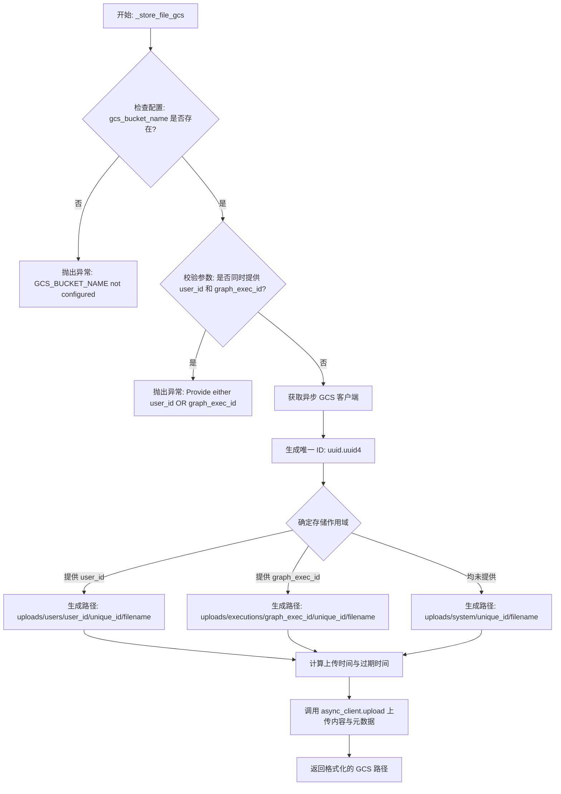

#### 带注释源码

```python
async def _store_file_gcs(
    self,
    content: bytes,
    filename: str,
    expiration_hours: int,
    user_id: str | None = None,
    graph_exec_id: str | None = None,
) -> str:
    """Store file in Google Cloud Storage."""
    # 检查必要的配置项是否存在
    if not self.config.gcs_bucket_name:
        raise ValueError("GCS_BUCKET_NAME not configured")

    # 校验逻辑：user_id 和 graph_exec_id 不能同时提供，确保存储路径的唯一性和清晰性
    if user_id and graph_exec_id:
        raise ValueError("Provide either user_id OR graph_exec_id, not both")

    # 获取异步 GCS 客户端实例
    async_client = await self._get_async_gcs_client()

    # 生成 UUID 以确保文件名的唯一性
    unique_id = str(uuid.uuid4())

    # 根据提供的参数确定文件的存储作用域并构建 blob_name (对象路径)
    if user_id:
        # 用户作用域上传：路径包含用户 ID
        blob_name = f"uploads/users/{user_id}/{unique_id}/{filename}"
    elif graph_exec_id:
        # 执行任务作用域上传：路径包含执行 ID
        blob_name = f"uploads/executions/{graph_exec_id}/{unique_id}/{filename}"
    else:
        # 系统默认上传（向后兼容）
        blob_name = f"uploads/system/{unique_id}/{filename}"

    # 计算时间元数据
    upload_time = datetime.now(timezone.utc)
    expiration_time = upload_time + timedelta(hours=expiration_hours)

    # 执行异步上传操作，并附带时间元数据
    await async_client.upload(
        self.config.gcs_bucket_name,
        blob_name,
        content,
        metadata={
            "uploaded_at": upload_time.isoformat(),
            "expires_at": expiration_time.isoformat(),
            "expiration_hours": str(expiration_hours),
        },
    )

    # 返回完整的云存储路径字符串
    return f"gcs://{self.config.gcs_bucket_name}/{blob_name}"
```


### `CloudStorageHandler.retrieve_file`

根据提供的云存储路径从云存储提供商（当前支持 GCS）检索文件内容，并将授权和下载逻辑委托给特定于提供商的实现方法。

参数：

- `cloud_path`：`str`，云存储路径（例如，"gcs://bucket/path/to/file"）
- `user_id`：`str | None`，用于授权用户范围文件的 用户 ID（可选）
- `graph_exec_id`：`str | None`，用于授权执行范围文件的 图执行 ID（可选）

返回值：`bytes`，文件内容

#### 流程图

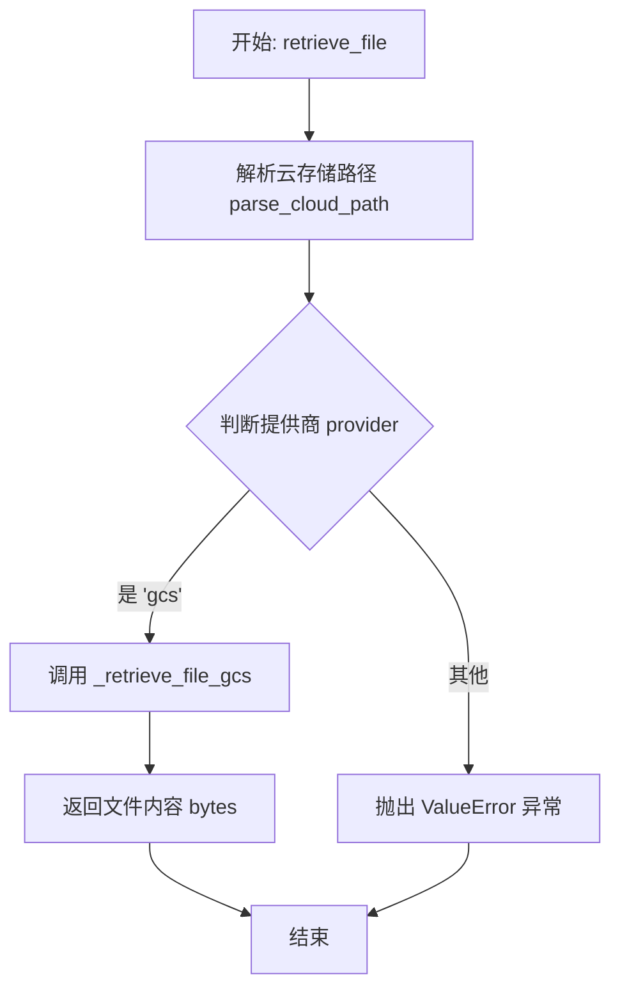

#### 带注释源码

```python
async def retrieve_file(
    self,
    cloud_path: str,
    user_id: str | None = None,
    graph_exec_id: str | None = None,
) -> bytes:
    """
    Retrieve file content from cloud storage.

    Args:
        cloud_path: Cloud storage path (e.g., "gcs://bucket/path/to/file")
        user_id: User ID for authorization of user-scoped files (optional)
        graph_exec_id: Graph execution ID for authorization of execution-scoped files (optional)

    Returns:
        File content as bytes

    Raises:
        PermissionError: If user tries to access files they don't own
    """
    # 解析路径以确定存储提供商（如 gcs）和实际的资源路径
    provider, path = self.parse_cloud_path(cloud_path)

    # 根据提供商类型调用对应的内部实现方法
    if provider == "gcs":
        # 如果是 GCS，调用内部的 GCS 检索逻辑并返回结果
        return await self._retrieve_file_gcs(path, user_id, graph_exec_id)
    else:
        # 如果遇到暂不支持的存储提供商，抛出值错误
        raise ValueError(f"Unsupported cloud storage provider: {provider}")
```


### `CloudStorageHandler._retrieve_file_gcs`

从 Google Cloud Storage (GCS) 检索文件内容，该函数不仅负责下载数据，还执行路径解析和基于用户 ID 或图执行 ID 的严格授权验证，确保文件访问的安全性。

参数：

- `path`：`str`，GCS 对象的路径字符串（不包含 "gcs://" 前缀），格式通常为 "bucket-name/blob-path"。
- `user_id`：`str | None`，发起请求用户的 ID，用于验证用户是否有权访问特定于用户的文件。
- `graph_exec_id`：`str | None`，图执行的 ID，用于验证是否有权访问特定于执行的文件。

返回值：`bytes`，从 GCS 下载的文件原始二进制内容。

#### 流程图

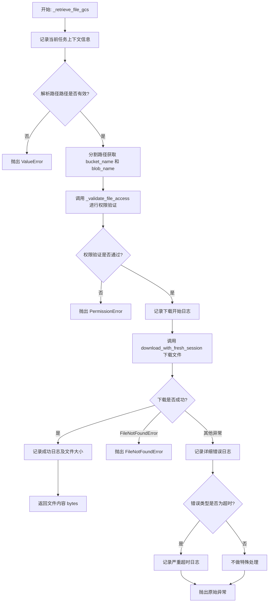

#### 带注释源码

```python
async def _retrieve_file_gcs(
    self, path: str, user_id: str | None = None, graph_exec_id: str | None = None
) -> bytes:
    """Retrieve file from Google Cloud Storage with authorization."""
    # 记录调试信息，检查当前是否在异步任务上下文中
    current_task = asyncio.current_task()
    logger.info(
        f"[CloudStorage]"
        f"_retrieve_file_gcs called - "
        f"current_task: {current_task}, "
        f"in_task: {current_task is not None}"
    )

    # 将路径解析为 bucket 名称和 blob 名称
    # 注意：传入的 path 已经去掉了 "gcs://" 前缀
    parts = path.split("/", 1)
    if len(parts) != 2:
        raise ValueError(f"Invalid GCS path: {path}")

    bucket_name, blob_name = parts

    # 执行权限验证，确保请求者有权访问该文件
    self._validate_file_access(blob_name, user_id, graph_exec_id)

    logger.info(
        f"[CloudStorage] About to download from GCS - bucket: {bucket_name}, blob: {blob_name}"
    )

    try:
        # 使用工具函数下载文件，该函数通常处理创建新的会话以避免连接问题
        content = await download_with_fresh_session(bucket_name, blob_name)
        logger.info(
            f"[CloudStorage] GCS download successful - size: {len(content)} bytes"
        )
        return content
    except FileNotFoundError:
        # 如果文件未找到，直接抛出异常
        raise
    except Exception as e:
        # 记录详细的错误信息用于调试，注意隐藏 blob 信息以保护隐私
        logger.error(
            f"[CloudStorage] GCS download failed - error: {str(e)}, "
            f"error_type: {type(e).__name__}, "
            f"bucket: {bucket_name}, blob: redacted for privacy"
        )

        # 特殊处理超时错误，通常这暗示了底层 aiohttp 或 GCS 连接的问题
        if "Timeout context manager" in str(e):
            logger.critical(
                f"[CloudStorage] TIMEOUT ERROR in GCS download! "
                f"current_task: {current_task}, "
                f"bucket: {bucket_name}, blob: redacted for privacy"
            )
        raise
```


### `CloudStorageHandler._validate_file_access`

验证用户是否具有访问特定文件路径的权限，主要通过检查路径格式、防止路径遍历攻击，以及根据路径作用域（系统、用户、执行）验证请求者身份。

参数：

-  `blob_name`：`str`，GCS 中的 blob 路径。
-  `user_id`：`str | None`，发起请求的用户 ID，用于访问用户特定的文件。
-  `graph_exec_id`：`str | None`，发起请求的图执行 ID，用于访问执行特定的文件。

返回值：`None`，如果验证通过无返回值；如果验证失败则引发 `PermissionError`。

#### 流程图

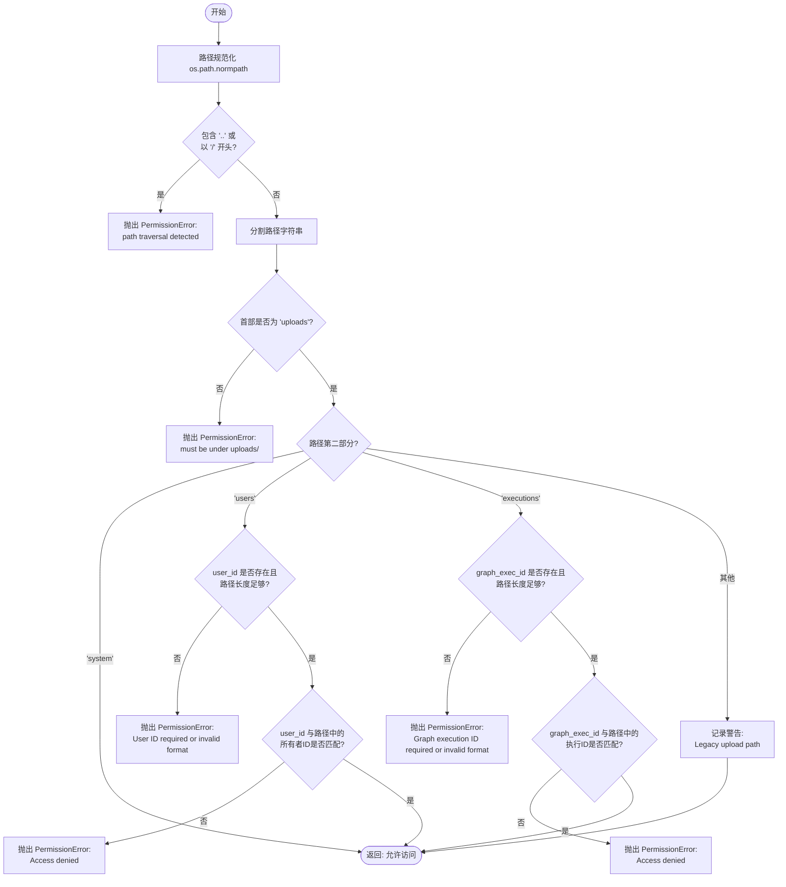

#### 带注释源码

```python
    def _validate_file_access(
        self,
        blob_name: str,
        user_id: str | None = None,
        graph_exec_id: str | None = None,
    ) -> None:
        """
        Validate that a user can access a specific file path.

        Args:
            blob_name: The blob path in GCS
            user_id: The requesting user ID (optional)
            graph_exec_id: The requesting graph execution ID (optional)

        Raises:
            PermissionError: If access is denied
        """

        # 1. 安全性检查：规范化路径以防止路径遍历攻击（例如 ../）
        normalized_path = os.path.normpath(blob_name)

        # 2. 确保规范化后的路径不包含任何路径遍历尝试
        if ".." in normalized_path or normalized_path.startswith("/"):
            raise PermissionError("Invalid file path: path traversal detected")

        # 3. 将路径拆分为组件以进行结构验证
        path_parts = normalized_path.split("/")

        # 4. 结构验证：路径必须以 "uploads/" 开头
        if not path_parts or path_parts[0] != "uploads":
            raise PermissionError("Invalid file path: must be under uploads/")

        # 5. 作用域验证：系统上传
        # 路径格式: uploads/system/*
        # 为了向后兼容，任何人都可以访问系统上传的文件
        if len(path_parts) >= 2 and path_parts[1] == "system":
            return

        # 6. 作用域验证：用户特定上传
        # 路径格式: uploads/users/{user_id}/*
        # 需要匹配的 user_id
        if len(path_parts) >= 2 and path_parts[1] == "users":
            # 检查是否提供了 user_id 且路径长度足够
            if not user_id or len(path_parts) < 3:
                raise PermissionError(
                    "User ID required to access user files"
                    if not user_id
                    else "Invalid user file path format"
                )

            file_owner_id = path_parts[2]
            # 基础格式验证（之前已经检查过 ".."，这里不再重复）
            if not file_owner_id or "/" in file_owner_id:
                raise PermissionError("Invalid user ID in path")

            # 核心权限检查：请求的用户 ID 必须与文件所有者 ID 匹配
            if file_owner_id != user_id:
                raise PermissionError(
                    f"Access denied: file belongs to user {file_owner_id}"
                )
            return

        # 7. 作用域验证：执行特定上传
        # 路径格式: uploads/executions/{graph_exec_id}/*
        # 需要匹配的 graph_exec_id
        if len(path_parts) >= 2 and path_parts[1] == "executions":
            # 检查是否提供了 graph_exec_id 且路径长度足够
            if not graph_exec_id or len(path_parts) < 3:
                raise PermissionError(
                    "Graph execution ID required to access execution files"
                    if not graph_exec_id
                    else "Invalid execution file path format"
                )

            file_exec_id = path_parts[2]
            # 基础格式验证
            if not file_exec_id or "/" in file_exec_id:
                raise PermissionError("Invalid execution ID in path")

            # 核心权限检查：请求的执行 ID 必须与文件所属执行 ID 匹配
            if file_exec_id != graph_exec_id:
                raise PermissionError(
                    f"Access denied: file belongs to execution {file_exec_id}"
                )
            return

        # 8. 向后兼容：旧的上传目录
        # 路径格式: uploads/*
        # 注意：由于上面已经验证了以 "uploads/" 开头，因此这里保证会匹配
        logger.warning(f"[CloudStorage] Accessing legacy upload path: {blob_name}")
        return
```


### `CloudStorageHandler.generate_signed_url`

为云存储文件生成具有临时访问权限的签名 URL，并在生成前对用户权限进行验证。

参数：

- `cloud_path`：`str`，云存储路径（例如 "gcs://bucket/path/to/file"）
- `expiration_hours`：`int`，URL 过期时间（小时），默认为 1
- `user_id`：`str | None`，用于授权的用户 ID（访问用户文件必需）
- `graph_exec_id`：`str | None`，用于授权的图执行 ID（访问执行文件必需）

返回值：`str`，生成的签名 URL 字符串

#### 流程图

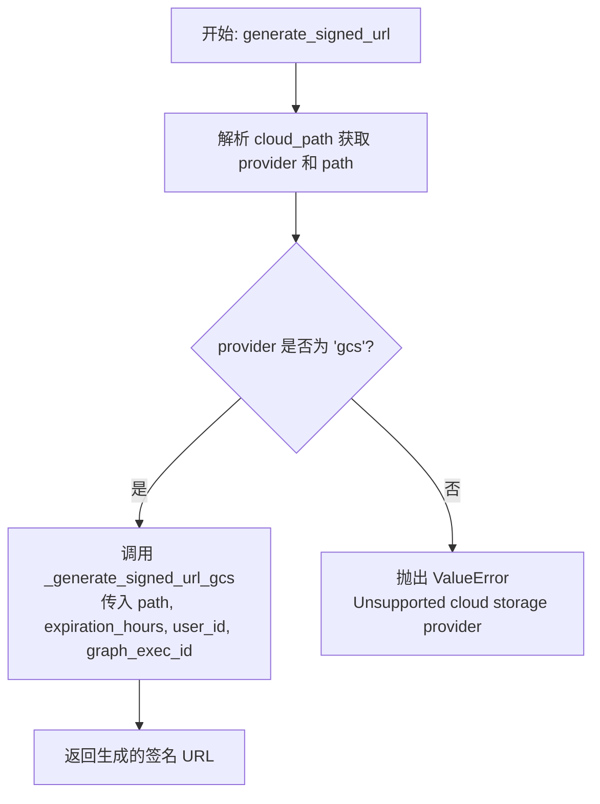

#### 带注释源码

```python
async def generate_signed_url(
    self,
    cloud_path: str,
    expiration_hours: int = 1,
    user_id: str | None = None,
    graph_exec_id: str | None = None,
) -> str:
    """
    Generate a signed URL for temporary access to a cloud storage file.

    Args:
        cloud_path: Cloud storage path
        expiration_hours: URL expiration in hours
        user_id: User ID for authorization (required for user files)
        graph_exec_id: Graph execution ID for authorization (required for execution files)

    Returns:
        Signed URL string

    Raises:
        PermissionError: If user tries to access files they don't own
    """
    # 解析云存储路径，分离出提供商（provider）和具体路径
    provider, path = self.parse_cloud_path(cloud_path)

    # 根据提供商类型进行路由分发
    if provider == "gcs":
        # 如果是 GCS，调用内部辅助方法生成签名 URL
        return await self._generate_signed_url_gcs(
            path, expiration_hours, user_id, graph_exec_id
        )
    else:
        # 如果是不支持的存储提供商，抛出值错误
        raise ValueError(f"Unsupported cloud storage provider: {provider}")
```


### `CloudStorageHandler._generate_signed_url_gcs`

该方法用于为 Google Cloud Storage (GCS) 中的特定文件生成一个带签名的 URL，该 URL 允许临时访问文件。在生成 URL 之前，它会解析路径并对用户或执行上下文进行严格的权限验证。

参数：

- `path`：`str`，GCS 文件路径（不包含 `gcs://` 前缀），格式通常为 `bucket_name/blob_name`。
- `expiration_hours`：`int`，签名 URL 的有效期，单位为小时。
- `user_id`：`str | None`，请求访问的用户 ID，用于验证用户是否有权访问该文件。
- `graph_exec_id`：`str | None`，图执行 ID，用于验证特定执行过程是否有权访问该文件。

返回值：`str`，生成的签名 URL 字符串。

#### 流程图

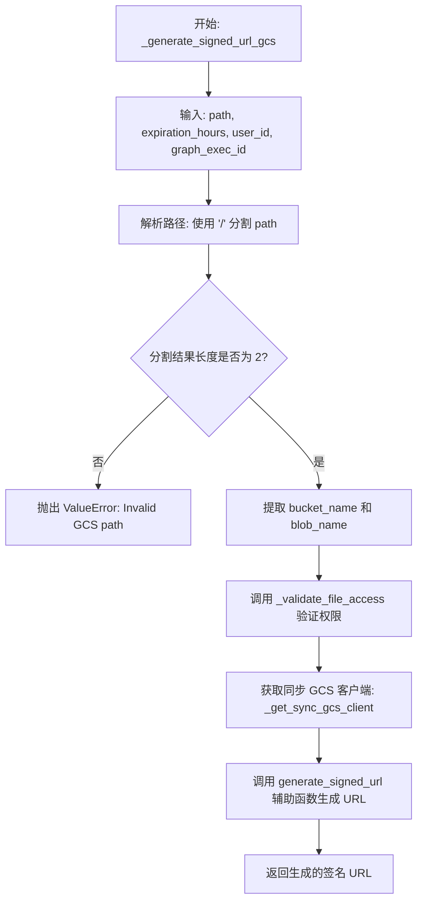

#### 带注释源码

```python
async def _generate_signed_url_gcs(
    self,
    path: str,
    expiration_hours: int,
    user_id: str | None = None,
    graph_exec_id: str | None = None,
) -> str:
    """Generate signed URL for GCS with authorization."""
    # 解析 bucket 和 blob 名称（路径已经移除了 gcs:// 前缀）
    parts = path.split("/", 1)
    if len(parts) != 2:
        raise ValueError(f"Invalid GCS path: {path}")

    bucket_name, blob_name = parts

    # 执行权限检查，确保请求者有权访问该文件
    self._validate_file_access(blob_name, user_id, graph_exec_id)

    # 获取同步 GCS 客户端（因为生成签名 URL 通常在同步库中支持较好或依赖特定实现）
    sync_client = self._get_sync_gcs_client()
    
    # 调用辅助函数生成实际的签名 URL，将小时转换为秒
    return await generate_signed_url(
        sync_client, bucket_name, blob_name, expiration_hours * 3600
    )
```


### `CloudStorageHandler.delete_expired_files`

从云存储中删除已过期的文件。该方法根据指定的存储提供商（当前仅支持 GCS），将删除操作委托给特定于提供商的实现逻辑。

参数：

-  `provider`：`str`，云存储提供商的标识符，默认为 "gcs"

返回值：`int`，被删除的文件数量

#### 流程图

```mermaid
flowchart TD
    Start([开始]) --> CheckProvider{判断 provider 类型}
    CheckProvider -->|provider == "gcs"| CallGCS[调用 _delete_expired_files_gcs]
    CheckProvider -->|provider != "gcs"| RaiseError[抛出 ValueError 异常]
    CallGCS --> ReturnCount([返回删除计数])
    RaiseError --> End([结束])
    ReturnCount --> End
```

#### 带注释源码

```python
    async def delete_expired_files(self, provider: str = "gcs") -> int:
        """
        Delete files that have passed their expiration time.

        Args:
            provider: Cloud storage provider

        Returns:
            Number of files deleted
        """
        # 检查 provider 是否为 "gcs"
        if provider == "gcs":
            # 调用 GCS 专用的异步删除方法
            return await self._delete_expired_files_gcs()
        else:
            # 如果是不支持的存储提供商，抛出数值错误
            raise ValueError(f"Unsupported cloud storage provider: {provider}")
```


### `CloudStorageHandler._delete_expired_files_gcs`

从 Google Cloud Storage (GCS) 中删除已过期的文件。该函数通过列出特定前缀下的所有对象，获取其元数据，并根据预设的 `expires_at` 字段判断是否过期。为了提高效率，它使用异步并发和信号量机制来批量处理文件的检查与删除。

参数：

- `self`: `CloudStorageHandler`, 类实例本身

返回值：`int`，成功删除的文件数量。

#### 流程图

```mermaid
flowchart TD
    A[开始: _delete_expired_files_gcs] --> B{检查 GCS Bucket 配置}
    B -- 未配置 --> R1[抛出 ValueError]
    B -- 已配置 --> C[获取异步 GCS 客户端]
    C --> D[获取当前 UTC 时间]
    D --> E[列出 'uploads/' 前缀下的所有对象]
    E --> F[获取对象列表 items]
    F --> G{列表是否为空?}
    G -- 是 --> H[返回 0]
    G -- 否 --> I[初始化并发计数器 deleted_count = 0]
    I --> J[创建并发信号量 Semaphore 10]
    J --> K[遍历 items 并发执行 delete_if_expired]
    
    subgraph K [并发处理块]
        direction TB
        K1[获取信号量锁] --> K2[获取 Blob 元数据]
        K2 --> K3{元数据存在且<br>包含 expires_at?}
        K3 -- 否 --> K8[释放锁, 返回 0]
        K3 -- 是 --> K4[解析过期时间]
        K4 --> K5{当前时间 > 过期时间?}
        K5 -- 否 --> K8
        K5 -- 是 --> K6[调用 GCS 删除接口]
        K6 --> K7[释放锁, 返回 1]
    end

    K --> L[汇总删除结果]
    L --> M[返回 deleted_count]
```

#### 带注释源码

```python
    async def _delete_expired_files_gcs(self) -> int:
        """Delete expired files from GCS based on metadata."""
        # 1. 检查配置是否存在 Bucket 名称
        if not self.config.gcs_bucket_name:
            raise ValueError("GCS_BUCKET_NAME not configured")

        # 2. 获取异步 GCS 客户端
        async_client = await self._get_async_gcs_client()
        # 获取当前 UTC 时间用于比较
        current_time = datetime.now(timezone.utc)

        try:
            # 3. 列出 uploads 目录下的所有对象
            list_response = await async_client.list_objects(
                self.config.gcs_bucket_name, params={"prefix": "uploads/"}
            )

            items = list_response.get("items", [])
            deleted_count = 0

            # 4. 设置信号量，限制最大并发删除数为 10，防止触发限流或资源耗尽
            semaphore = asyncio.Semaphore(10)

            async def delete_if_expired(blob_info):
                """内部辅助函数：检查单个 blob 并在过期时删除"""
                async with semaphore:
                    blob_name = blob_info.get("name", "")
                    try:
                        if not blob_name:
                            return 0

                        # 5. 获取特定 Blob 的元数据
                        metadata_response = await async_client.download_metadata(
                            self.config.gcs_bucket_name, blob_name
                        )
                        metadata = metadata_response.get("metadata", {})

                        # 6. 检查元数据中是否包含过期时间
                        if metadata and "expires_at" in metadata:
                            # 解析 ISO 格式的过期时间
                            expires_at = datetime.fromisoformat(metadata["expires_at"])
                            # 7. 如果当前时间晚于过期时间，则删除文件
                            if current_time > expires_at:
                                await async_client.delete(
                                    self.config.gcs_bucket_name, blob_name
                                )
                                return 1  # 返回 1 表示删除成功
                    except Exception as e:
                        # 记录处理单个文件时的错误（如权限问题、网络抖动），但不中断整个清理任务
                        logger.warning(
                            f"[CloudStorage] Failed to process file {blob_name} during cleanup: {e}"
                        )
                        pass
                    return 0 # 未删除

            # 8. 并发执行所有检查任务
            if items:
                results = await asyncio.gather(
                    *[delete_if_expired(blob) for blob in items]
                )
                # 9. 统计成功删除的总数
                deleted_count = sum(results)

            return deleted_count

        except Exception as e:
            # 捕获整体流程的严重错误
            logger.error(f"[CloudStorage] Cleanup operation failed: {e}")
            # 返回 0 表示本次清理未完成或无删除
            return 0
```


### `CloudStorageHandler.check_file_expired`

Checks if a file at the specified cloud storage path has expired based on its stored metadata.

参数：

- `cloud_path`：`str`，Cloud storage path (e.g., "gcs://bucket/path/to/file")

返回值：`bool`，True if file has expired, False otherwise

#### 流程图

```mermaid
flowchart TD
    A([开始]) --> B[解析 cloud_path<br/>获取 provider 和 path]
    B --> C{provider 是否为 'gcs'?}
    C -- 是 --> D[调用 _check_file_expired_gcs path]
    D --> E([返回检查结果])
    C -- 否 --> F[抛出 ValueError<br/>Unsupported cloud storage provider]
    F --> G([结束])
```

#### 带注释源码

```python
async def check_file_expired(self, cloud_path: str) -> bool:
    """
    Check if a file has expired based on its metadata.

    Args:
        cloud_path: Cloud storage path

    Returns:
        True if file has expired, False otherwise
    """
    # 步骤 1: 解析云存储路径，分离出存储提供商和具体的路径
    provider, path = self.parse_cloud_path(cloud_path)

    # 步骤 2: 检查存储提供商是否为 Google Cloud Storage (GCS)
    if provider == "gcs":
        # 如果是 GCS，调用内部私有方法进行具体的过期检查
        return await self._check_file_expired_gcs(path)
    else:
        # 步骤 3: 如果不支持该提供商，抛出数值错误
        raise ValueError(f"Unsupported cloud storage provider: {provider}")
```


### `CloudStorageHandler._check_file_expired_gcs`

检查 Google Cloud Storage (GCS) 中的文件是否已过期。该方法通过获取文件的元数据，比较其中存储的过期时间与当前 UTC 时间来判断文件是否过期。

参数：

-   `path`：`str`，GCS 文件路径，格式为 "bucket-name/blob-name"（不包含 "gcs://" 前缀）。

返回值：`bool`，如果文件已过期、不存在或路径无效则返回 `True`；如果文件未过期或无法确定状态（非 404 错误）则返回 `False`。

#### 流程图

```mermaid
flowchart TD
    A[开始: _check_file_expired_gcs] --> B[解析 path<br>分割为 bucket_name 和 blob_name]
    B --> C{路径有效?}
    C -- 否 --> D[抛出 ValueError]
    C -- 是 --> E[获取 Async GCS Client]
    E --> F[尝试下载元数据 download_metadata]
    F --> G{下载成功?}
    G -- 否 --> H{错误包含 '404' 或 'Not Found'?}
    H -- 是 --> I[记录警告: 文件未找到] --> J[返回 True]
    H -- 否 --> K[记录警告: 检查失败] --> L[返回 False]
    G -- 是 --> M[获取 metadata 字典]
    M --> N{metadata 包含 'expires_at'?}
    N -- 否 --> O[返回 False]
    N -- 是 --> P[解析 expires_at 为 datetime 对象]
    P --> Q{当前时间 > expires_at?}
    Q -- 是 --> R[返回 True]
    Q -- 否 --> S[返回 False]
```

#### 带注释源码

```python
    async def _check_file_expired_gcs(self, path: str) -> bool:
        """Check if a GCS file has expired."""
        # 将路径分割为 bucket 名称和 blob 名称
        parts = path.split("/", 1)
        if len(parts) != 2:
            raise ValueError(f"Invalid GCS path: {path}")

        bucket_name, blob_name = parts

        # 获取异步 GCS 客户端实例
        async_client = await self._get_async_gcs_client()

        try:
            # 使用异步客户端获取对象的元数据
            metadata_info = await async_client.download_metadata(bucket_name, blob_name)
            metadata = metadata_info.get("metadata", {})

            # 检查元数据中是否存在过期时间字段
            if metadata and "expires_at" in metadata:
                # 将字符串格式的过期时间解析为 datetime 对象
                expires_at = datetime.fromisoformat(metadata["expires_at"])
                # 比较当前 UTC 时间与过期时间
                return datetime.now(timezone.utc) > expires_at

        except Exception as e:
            # 异常处理：如果文件不存在（404），视作已过期
            if "404" in str(e) or "Not Found" in str(e):
                logger.warning(
                    f"[CloudStorage] File not found during expiration check: {blob_name}"
                )
                return True  # File doesn't exist, consider it expired

            # 记录其他类型的错误，但返回 False（保守策略）
            logger.warning(
                f"[CloudStorage] Failed to check expiration for {blob_name}: {e}"
            )
            # If we can't read metadata for other reasons, assume not expired
            return False

        # 如果没有元数据或 expires_at 字段，默认视为未过期
        return False
```


## 关键组件


### CloudStorageConfig
配置管理类，封装了云存储提供商（如GCS）的配置信息，包括存储桶名称等关键参数。

### CloudStorageHandler
核心处理类，提供统一的接口处理多种云存储提供商的文件上传、下载、删除及签名URL生成等操作，并封装了底层客户端细节。

### 异步客户端生命周期管理
负责异步上下文下的HTTP会话（aiohttp）和GCS客户端的创建、复用及销毁，通过连接池和上下文管理器确保资源高效利用并避免连接泄漏。

### 访问控制与路径验证
基于用户ID或执行ID的文件访问权限验证机制，包含路径规范化、路径遍历攻击防护以及文件归属权校验，确保数据安全。

### 文件路径解析
用于解析标准化的云存储路径（如 `gcs://` 协议），从中提取存储提供商类型和实际的资源路径，支持未来扩展至其他云厂商。

### 存储生命周期与过期管理
基于文件元数据（如 `expires_at`）自动检测并批量清理过期文件的机制，通过并发控制维护存储空间的合规性与整洁。

### 全局单例管理
通过异步锁机制确保全局范围内只有一个 `CloudStorageHandler` 实例被初始化和使用，提供线程安全的全局访问接口及优雅的关闭方法。


## 问题及建议


### 已知问题

-   **资源泄漏风险**：在 `_get_async_gcs_client` 方法中，当检测到不在 `asyncio.Task` 上下文中时，会创建一个临时的 `async_gcs_storage.Storage` 客户端并返回。然而，该客户端没有被赋值给 `self._async_gcs_client`，导致在调用 `close()` 方法时，该临时客户端及其对应的 `aiohttp.ClientSession` 无法被正确关闭，从而造成连接泄漏。
-   **低效的过期文件清理**：`_delete_expired_files_gcs` 方法首先列出所有前缀为 `uploads/` 的文件，然后并发获取每个文件的元数据以检查过期时间。这种“列出所有+逐个检查”的模式在文件数量较大时非常低效，会导致大量的 API 调用（延迟和成本高），且容易受到超时或速率限制的影响。
-   **同步与异步客户端混用**：代码在 `CloudStorageHandler` 中同时维护了 `gcloud.aio.storage`（异步）和 `google.cloud.storage`（同步）两个客户端。同步客户端仅用于生成签名 URL，这不仅增加了依赖复杂度，如果在异步事件循环中调用同步代码，还可能导致事件循环阻塞。
-   **全局单例模式降低可测试性**：使用全局变量 `_cloud_storage_handler` 和锁机制来管理单例，使得在进行单元测试时难以隔离状态，测试之间可能会产生相互干扰，且难以 Mock 或替换实现。
-   **硬编码的路径验证逻辑**：`_validate_file_access` 方法中的权限校验逻辑依赖于固定的文件路径格式（如 `uploads/users/...`）。这种字符串分割和比对的方式较为脆弱，一旦存储路径结构发生变化，容易导致安全漏洞或功能失效。

### 优化建议

-   **利用云存储原生生命周期管理**：建议评估是否可以利用 GCS 的 Bucket Lifecycle 策略来处理过期文件。如果业务允许基于文件创建时间（Age）进行删除，应优先使用云厂商提供的原生规则，这比代码遍历删除更高效且成本更低。如果必须使用自定义的元数据过期时间，建议将过期检查逻辑转移到独立的后台Worker服务中，避免阻塞主服务。
-   **引入存储提供者抽象层**：定义统一的 Storage Provider 接口（Abstract Base Class 或 Protocol），并将具体的 GCS 实现与接口分离。通过工厂模式或依赖注入来初始化具体的 Handler，从而消除代码中大量的 `if provider == "gcs"` 判断，便于未来扩展 S3 或 Azure 等其他云存储。
-   **统一异步处理或优化签名逻辑**：调查 `gcloud.aio.storage` 是否支持生成签名 URL，如果支持，应移除对同步客户端 `google.cloud.storage` 的依赖，完全统一为异步调用路径，简化依赖管理和上下文处理。
-   **实现依赖注入**：重构 `CloudStorageHandler`，允许从外部传入 `aiohttp.ClientSession` 和配置对象，而不是在内部自行创建。这样可以大幅提升代码的可测试性，使得测试时可以注入 Mock 的 Session 和 Config。
-   **增加重试机制**：在 `_retrieve_file_gcs` 和 `_store_file_gcs` 等涉及网络 IO 的方法中，引入重试机制（如 Tenacity 库），针对网络抖动或服务暂时不可用（5xx错误）的情况进行指数退避重试，提高系统的健壮性。
-   **修复临时客户端的生命周期管理**：修复 `_get_async_gcs_client` 中临时客户端的泄漏问题。建议在非任务上下文中抛出明确的异常，强制调用者在正确的异步上下文中使用；或者将临时客户端注册到某种清理机制中，确保其最终能被关闭。


## 其它


### 设计目标与约束

**设计目标：**
1.  **异步非阻塞 I/O**：核心设计采用 `asyncio` 和 `aiohttp`，确保在高并发场景下（如大规模文件上传下载）不会阻塞主事件循环，提升系统吞吐量。
2.  **多云存储抽象**：通过 `CloudStorageHandler` 提供统一的接口，旨在支持 Google Cloud Storage (GCS)、AWS S3 和 Azure Blob Storage 等多种提供商，当前主要实现为 GCS。
3.  **资源生命周期管理**：通过 `aiohttp.ClientSession` 的复用和上下文管理器（`__aenter__`/`__aexit__`），有效管理连接池，防止连接泄露。
4.  **数据隔离与访问控制**：通过文件路径结构（`uploads/users/`, `uploads/executions/`）实现基于用户 ID 和执行 ID 的逻辑隔离。

**约束：**
1.  **异步上下文依赖**：虽然提供了非 Task 上下文的兜底方案，但最佳实践要求在活跃的 asyncio Task 中运行，以便复用 Client Session。
2.  **配置依赖**：依赖于 `Config` 对象提供正确的 Bucket 名称，否则无法初始化。
3.  **元数据依赖**：文件过期检查功能强依赖于存储在对象元数据中的 `expires_at` 字段，需配合上传时的元数据写入逻辑。

### 错误处理与异常设计

**异常策略：**
1.  **权限异常**：在 `_validate_file_access` 中，如果检测到路径遍历攻击（`..`）、用户 ID 不匹配或路径格式非法，抛出 `PermissionError`，立即中断请求。
2.  **参数验证异常**：对于不支持的存储提供商、无效的 GCS 路径格式、缺失配置或互斥参数（如同时提供 `user_id` 和 `graph_exec_id`），抛出 `ValueError`。
3.  **运行时异常处理**：
    *   **下载阶段**：捕获 `FileNotFoundError` 并向上传递。对于其他 GCS 下载异常（特别是超时），记录详细的错误日志（包含上下文信息），然后重新抛出异常供上层处理。
    *   **清理阶段**：在删除过期文件时，采用“尽力而为”策略。单个文件的删除失败（如元读取失败、权限问题）会被捕获并记录为 `WARNING`，不会中断整个批处理流程。
4.  **资源释放异常**：在 `close` 方法中，关闭客户端或 Session 时发生的异常被捕获并记录为 `WARNING`，确保即使清理失败也不会导致程序崩溃。

### 数据流与状态机

**数据流：**
1.  **上传流**：
    *   输入：二进制内容 (`bytes`)、文件名、作用域 ID (`user_id` 或 `graph_exec_id`)。
    *   处理：生成唯一 UUID -> 构建标准化路径 (`uploads/{scope}/{id}/{uuid}/{filename}`) -> 添加时间戳和过期时间元数据 -> 调用 GCS 异步上传 API。
    *   输出：完整的云存储路径字符串。
2.  **下载流**：
    *   输入：云存储路径、作用域 ID。
    *   处理：解析路径获取 Provider 和 Blob 名 -> **权限校验**（验证 ID 匹配及路径合法性） -> 调用 GCS 异步下载 API。
    *   输出：文件二进制内容 (`bytes`)。
3.  **清理流**：
    *   触发：定时任务或手动调用。
    *   处理：列出 `uploads/` 前缀下的所有对象 -> 并发获取元数据 -> 检查 `expires_at` -> 过期则删除 -> 返回删除计数。

**状态机（以 CloudStorageHandler 对象为例）：**
*   **Idle (初始状态)**：对象已实例化，`_async_gcs_client` 和 `_session` 为 `None`。
*   **Active (活跃状态)**：首次调用 API（如 `store_file`）触发 `_get_async_gcs_client`，Session 和 Client 初始化完成，连接池建立。
*   **Closing (关闭中)**：调用 `close()` 或上下文管理器退出，尝试关闭底层连接。
*   **Closed (已关闭)**：连接资源已释放，引用置为 `None`。

### 外部依赖与接口契约

**外部依赖库：**
1.  `aiohttp`：用于提供底层的异步 HTTP ClientSession 和连接池管理。
2.  `gcloud.aio.storage`：用于提供纯异步的 GCS 操作接口（上传、下载、列表、删除）。
3.  `google.cloud.storage`：用于提供同步的 GCS 客户端，专门用于生成签名 URL（因为 `gcloud.aio` 的签名功能可能受限或为了稳定性）。
4.  `backend.util.gcs_utils`：内部工具模块，依赖其提供 `download_with_fresh_session`（处理特定下载逻辑）和 `generate_signed_url`（处理签名逻辑）。

**接口契约：**
1.  **Config 配置契约**：`Config` 对象必须包含 `media_gcs_bucket_name` 属性，且值为非空字符串。
2.  **路径格式契约**：云存储路径必须遵循 `{provider}://{bucket_name}/{blob_path}` 的格式。
3.  **元数据契约**：上传文件时，系统会强制写入 `uploaded_at`、`expires_at` 和 `expiration_hours` 三个自定义元数据字段，下游逻辑依赖这些字段进行生命周期管理。

### 并发控制与资源管理

**并发控制：**
1.  **单例模式锁 (`_handler_lock`)**：全局 `get_cloud_storage_handler` 函数使用 `asyncio.Lock` 确保在多协程环境下，全局 CloudStorageHandler 实例只被初始化一次（Double-Check Locking 模式）。
2.  **清理互斥锁 (`_cleanup_lock`)**：`cleanup_expired_files_async` 使用独立的锁，防止多个清理任务同时运行导致资源竞争或重复删除。
3.  **并发限流**：在批量删除过期文件时，使用 `asyncio.Semaphore(10)` 限制最多 10 个并发删除操作，避免瞬间产生过多 GCS API 请求触发速率限制或耗尽连接池。

**资源管理：**
1.  **连接池复用**：`_get_async_gcs_client` 创建的 `aiohttp.ClientSession` 配置了 `limit=100` 的连接池，并启用 `force_close=False` 以复用 TCP 连接。
2.  **上下文管理**：`CloudStorageHandler` 实现了异步上下文管理器协议，支持 `async with` 语法，确保在代码块结束后自动清理资源。
3.  **懒加载**：同步和异步的 GCS 客户端均采用懒加载策略，仅在首次使用时初始化，减少启动开销。

### 安全性与访问控制设计

**路径安全：**
*   **路径遍历防护**：`_validate_file_access` 使用 `os.path.normpath` 规范化路径，并显式检查是否包含 `..` 或以 `/` 开头，防止攻击者访问上传目录之外的文件。
*   **白名单机制**：仅允许访问以 `uploads/` 开头的路径。

**访问控制模型 (ACL)：**
*   **用户隔离**：路径模式 `uploads/users/{user_id}/...`。请求必须提供匹配的 `user_id`，否则拒绝访问。
*   **执行隔离**：路径模式 `uploads/executions/{graph_exec_id}/...`。请求必须提供匹配的 `graph_exec_id`，否则拒绝访问。
*   **公共/系统文件**：路径模式 `uploads/system/...` 或遗留路径。允许不带 ID 的访问，用于向后兼容。
*   **ID 格式校验**：对从路径中提取的 `user_id` 和 `graph_exec_id` 进行基础格式校验（防止包含斜杠等分隔符）。

    