# `.\AutoGPT\autogpt_platform\backend\backend\util\cloud_storage_test.py` 详细设计文档

该测试文件针对 CloudStorageHandler 类进行全面的功能验证，覆盖了云存储路径解析、文件存储与检索、签名URL生成、过期文件清理以及基于用户和执行ID的访问权限控制等核心功能，确保云存储工具在各种场景下的稳定性和安全性。

## 整体流程

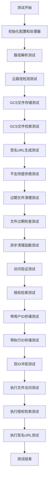

## 类结构

```
TestCloudStorageHandler (测试类)
├── config (fixture)
├── handler (fixture)
├── test_parse_cloud_path_gcs (方法)
├── test_parse_cloud_path_invalid (方法)
├── test_is_cloud_path (方法)
├── test_store_file_gcs (方法)
├── test_retrieve_file_gcs (方法)
├── test_retrieve_file_not_found (方法)
├── test_generate_signed_url_gcs (方法)
├── test_unsupported_provider (方法)
├── test_delete_expired_files_gcs (方法)
├── test_check_file_expired_gcs (方法)
├── test_cleanup_expired_files_async (方法)
├── test_cleanup_expired_files_async_error (方法)
├── test_validate_file_access_system_files (方法)
├── test_validate_file_access_user_files_success (方法)
├── test_validate_file_access_user_files_no_user_id (方法)
├── test_validate_file_access_user_files_wrong_user (方法)
├── test_validate_file_access_legacy_files (方法)
├── test_validate_file_access_invalid_path (方法)
├── test_retrieve_file_with_authorization (方法)
├── test_store_file_with_user_id (方法)
├── test_store_file_with_graph_exec_id (方法)
├── test_store_file_with_both_user_and_exec_id (方法)
├── test_validate_file_access_execution_files_success (方法)
├── test_validate_file_access_execution_files_no_exec_id (方法)
├── test_validate_file_access_execution_files_wrong_exec_id (方法)
├── test_retrieve_file_with_exec_authorization (方法)
└── test_generate_signed_url_with_exec_authorization (方法)
```

## 全局变量及字段


    

## 全局函数及方法


### `TestCloudStorageHandler.config`

这是一个 pytest fixture 方法，用于创建并返回一个初始化了特定参数的 `CloudStorageConfig` 实例，主要用于在测试用例中提供模拟的云存储配置。

参数：

-  `self`：`TestCloudStorageHandler`，测试类的实例引用。

返回值：`CloudStorageConfig`，返回一个配置了 GCS 存储桶名称为 "test-bucket" 的云存储配置对象。

#### 流程图

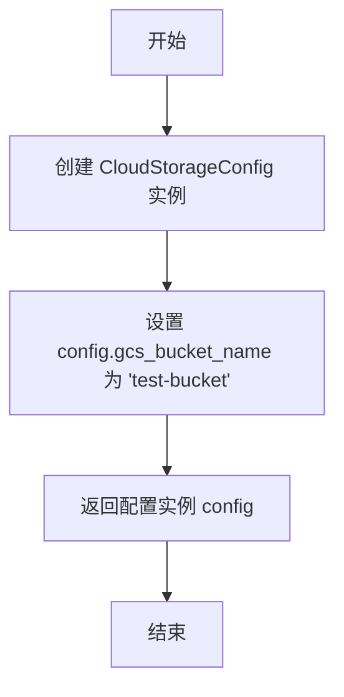

#### 带注释源码

```python
    @pytest.fixture
    def config(self):
        """Create a test configuration."""
        # 实例化云存储配置对象
        config = CloudStorageConfig()
        # 设置 GCS 存储桶名称为 "test-bucket"，供测试使用
        config.gcs_bucket_name = "test-bucket"
        # 返回配置好的对象
        return config
```


### `TestCloudStorageHandler.handler`

该方法是 `TestCloudStorageHandler` 类中的一个 Pytest fixture，用于为测试用例创建并返回一个已配置的 `CloudStorageHandler` 实例。它通过依赖注入接收一个配置对象，确保每个测试方法都能获得一个初始化好的处理器。

参数：

-   `config`：`CloudStorageConfig`，从 `config` fixture 注入的配置对象，包含了测试所需的存储桶名称等配置信息。

返回值：`CloudStorageHandler`，返回一个初始化完成的云存储处理器实例，供测试方法调用。

#### 流程图

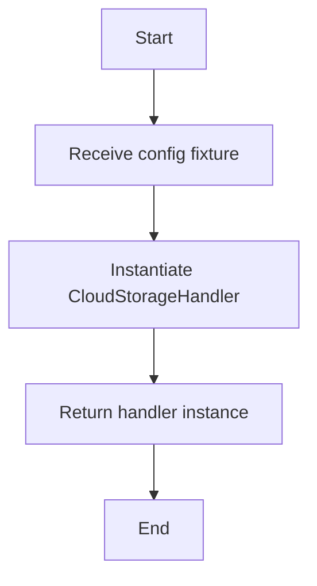

#### 带注释源码

```python
    @pytest.fixture
    def handler(self, config):
        """Create a test handler."""
        # 使用传入的 config 对象实例化 CloudStorageHandler 并返回
        return CloudStorageHandler(config)
```


### `TestCloudStorageHandler.test_parse_cloud_path_gcs`

测试 `CloudStorageHandler` 解析 Google Cloud Storage (GCS) 路径字符串的功能，验证其能否正确提取云存储提供商标识和具体的对象路径。

参数：

-   `self`：`TestCloudStorageHandler`，测试类的实例。
-   `handler`：`CloudStorageHandler`，通过 pytest fixture 注入的被测处理器实例。

返回值：`None`，测试方法无返回值，通过断言验证预期行为。

#### 流程图

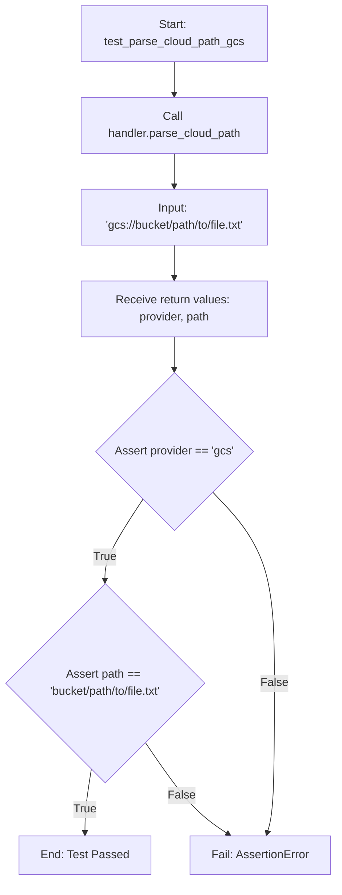

#### 带注释源码

```python
def test_parse_cloud_path_gcs(self, handler):
    """Test parsing GCS paths."""
    # 调用被测对象的解析方法，传入标准的 GCS URI 格式字符串
    provider, path = handler.parse_cloud_path("gcs://bucket/path/to/file.txt")
    # 验证提取出的 provider 标识是否为 "gcs"
    assert provider == "gcs"
    # 验证提取出的 path 是否正确去掉了协议前缀，并保留了桶名和对象路径
    assert path == "bucket/path/to/file.txt"
```


### `TestCloudStorageHandler.test_parse_cloud_path_invalid`

该测试用例旨在验证 `CloudStorageHandler.parse_cloud_path` 方法在接收到无效的云存储路径格式（即不支持的协议前缀）时，能够正确地抛出 `ValueError` 异常，并携带指定的错误提示信息。

参数：

- `self`：`TestCloudStorageHandler`，测试类的实例，由 pytest 框架隐式传递。
- `handler`：`CloudStorageHandler`，通过 pytest fixture `handler` 注入的云存储处理器实例，用于调用实际的解析方法。

返回值：`None`，该测试方法无显式返回值，通过断言是否抛出预期异常来判断测试结果。

#### 流程图

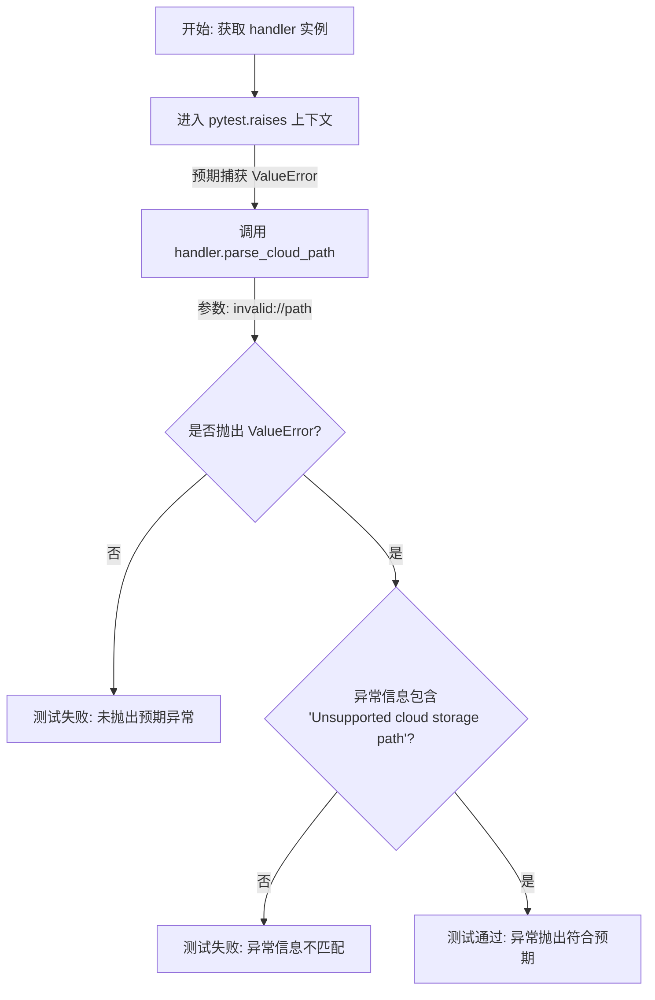

#### 带注释源码

```python
    def test_parse_cloud_path_invalid(self, handler):
        """Test parsing invalid cloud paths."""
        # 使用 pytest.raises 上下文管理器来验证代码块内是否抛出了指定的异常
        # 这里预期抛出 ValueError，且异常消息需要匹配 "Unsupported cloud storage path"
        with pytest.raises(ValueError, match="Unsupported cloud storage path"):
            # 调用 handler 的 parse_cloud_path 方法，传入一个无效的路径前缀 "invalid://"
            # 预期该方法内部无法识别此协议并抛出异常
            handler.parse_cloud_path("invalid://path")
```


### `TestCloudStorageHandler.test_is_cloud_path`

该方法用于测试 `CloudStorageHandler.is_cloud_path` 方法是否能正确识别云存储路径。它通过断言验证以 gcs://、s3:// 和 azure:// 开头的字符串能被正确识别为云路径，而 http 链接、本地文件路径和 Data URI 则不能被识别为云路径。

参数：

-  `handler`：`CloudStorageHandler`，通过 fixture 注入的 `CloudStorageHandler` 实例，用于调用 `is_cloud_path` 方法进行测试。

返回值：`None`，该方法是测试函数，不返回具体值，通过内部的断言来验证逻辑正确性。

#### 流程图

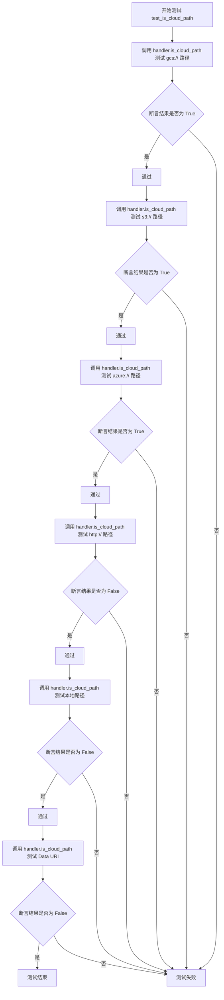

#### 带注释源码

```python
def test_is_cloud_path(self, handler):
    """Test cloud path detection."""
    # 验证 GCS (Google Cloud Storage) 路径格式能被正确识别
    assert handler.is_cloud_path("gcs://bucket/file.txt")
    # 验证 S3 (Amazon S3) 路径格式能被正确识别
    assert handler.is_cloud_path("s3://bucket/file.txt")
    # 验证 Azure Blob Storage 路径格式能被正确识别
    assert handler.is_cloud_path("azure://container/file.txt")
    # 验证普通 HTTP URL 不被识别为云存储路径
    assert not handler.is_cloud_path("http://example.com/file.txt")
    # 验证本地文件系统路径不被识别为云存储路径
    assert not handler.is_cloud_path("/local/path/file.txt")
    # 验证 Data URI 不被识别为云存储路径
    assert not handler.is_cloud_path("data:text/plain;base64,SGVsbG8=")
```


### `TestCloudStorageHandler.test_store_file_gcs`

该测试函数用于验证 `CloudStorageHandler` 将文件存储到 Google Cloud Storage (GCS) 的功能。它通过模拟异步 GCS 客户端和上传方法，确保 `handler.store_file` 方法能够被正确调用，并传递了正确的参数（如 bucket 名称、blob 路径、文件内容和元数据），同时验证返回的 URI 格式符合预期。

参数：

- `self`：`TestCloudStorageHandler`，测试类的实例。
- `mock_get_async_client`：`unittest.mock.MagicMock`，通过 `@patch.object` 装饰器注入的模拟对象，用于替代 `CloudStorageHandler._get_async_gcs_client` 方法。
- `handler`：`CloudStorageHandler`，通过 `@pytest.fixture` 注入的配置好的处理器实例，用于执行测试。

返回值：`None`，该方法作为测试用例，主要用于断言验证，不返回具体数值。

#### 流程图

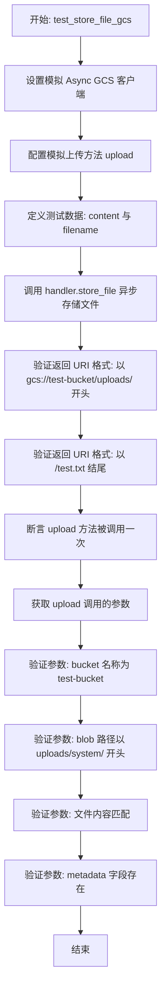

#### 带注释源码

```python
    @patch.object(CloudStorageHandler, "_get_async_gcs_client") # 使用模拟对象替换内部方法 _get_async_gcs_client
    @pytest.mark.asyncio # 标记该测试方法为异步测试
    async def test_store_file_gcs(self, mock_get_async_client, handler):
        """Test storing file in GCS."""
        # 创建一个模拟的异步 GCS 客户端对象
        mock_async_client = AsyncMock()
        # 设置模拟的获取客户端方法返回上述创建的模拟客户端
        mock_get_async_client.return_value = mock_async_client

        # 模拟客户端的 upload 方法，避免实际进行上传操作
        mock_async_client.upload = AsyncMock()

        # 准备测试用的文件内容和文件名
        content = b"test file content"
        filename = "test.txt"

        # 调用被测试的方法：存储文件到 GCS，设置过期时间为 24 小时
        result = await handler.store_file(content, filename, "gcs", expiration_hours=24)

        # 验证：断言返回的 URI 以 "gcs://test-bucket/uploads/" 开头
        assert result.startswith("gcs://test-bucket/uploads/")
        # 验证：断言返回的 URI 以 "/test.txt" 结尾
        assert result.endswith("/test.txt")

        # 验证：断言底层的 upload 方法仅被调用了一次
        mock_async_client.upload.assert_called_once()
        # 获取 upload 方法的调用参数
        call_args = mock_async_client.upload.call_args
        
        # 验证：检查调用时的第一个位置参数（bucket name）是否为 "test-bucket"
        assert call_args[0][0] == "test-bucket"  # bucket name
        # 验证：检查调用时的第二个位置参数（blob name）路径前缀是否正确
        assert call_args[0][1].startswith("uploads/system/")  # blob name
        # 验证：检查调用时的第三个位置参数（file content）是否与输入一致
        assert call_args[0][2] == content  # file content
        # 验证：检查调用时的关键字参数中是否包含 "metadata"
        assert "metadata" in call_args[1]  # metadata argument
```


### `TestCloudStorageHandler.test_retrieve_file_gcs`

一个单元测试方法，用于验证 `CloudStorageHandler` 从 Google Cloud Storage (GCS) 检索文件的功能。该测试通过模拟底层的异步存储客户端，避免了真实的网络调用，并验证了处理程序能否正确解析路径、调用下载方法并返回预期的文件内容。

参数：

- `self`：`TestCloudStorageHandler`，测试类的实例，隐式传递。
- `mock_storage_class`：`unittest.mock.MagicMock`，由 `@patch` 装饰器注入的模拟类，用于替代 `backend.util.cloud_storage.async_gcs_storage.Storage`，以便在不连接真实 GCS 的情况下进行测试。
- `handler`：`CloudStorageHandler`，由 `@pytest.fixture` 注入的处理器实例，配置了测试用的 GCS 存储桶配置。

返回值：`None`，该方法作为测试用例，不返回业务数据，而是通过断言来验证行为是否符合预期。

#### 流程图

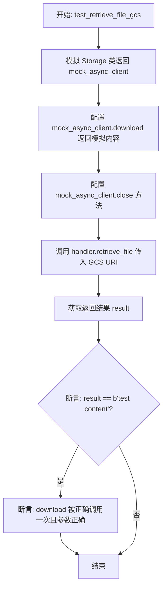

#### 带注释源码

```python
    @patch("backend.util.cloud_storage.async_gcs_storage.Storage")
    @pytest.mark.asyncio
    async def test_retrieve_file_gcs(self, mock_storage_class, handler):
        """Test retrieving file from GCS."""
        # 模拟异步 GCS 客户端实例
        # 这里我们不需要真实的 Storage 连接，而是创建一个 AsyncMock 对象来替代它
        mock_async_client = AsyncMock()
        # 当 Storage 类被实例化时，返回我们的模拟客户端
        mock_storage_class.return_value = mock_async_client

        # 模拟下载和关闭方法
        # 设定 download 方法被调用时返回字节串 b"test content"
        mock_async_client.download = AsyncMock(return_value=b"test content")
        # 设定 close 方法为异步模拟方法，避免资源清理报错
        mock_async_client.close = AsyncMock()

        # 调用实际被测试的方法：retrieve_file
        # 传入一个模拟的 GCS 路径
        result = await handler.retrieve_file(
            "gcs://test-bucket/uploads/system/uuid123/file.txt"
        )

        # 验证结果：检查返回的文件内容是否与模拟设定一致
        assert result == b"test content"
        # 验证交互：确保底层客户端的 download 方法被正确调用了一次
        # 并且传入的参数是正确的 bucket 名称和文件路径（不包含 gcs:// 前缀）
        mock_async_client.download.assert_called_once_with(
            "test-bucket", "uploads/system/uuid123/file.txt"
        )
```


### `TestCloudStorageHandler.test_retrieve_file_not_found`

该测试方法用于验证当尝试从 Google Cloud Storage (GCS) 检索一个不存在的文件时，`CloudStorageHandler` 能够正确处理错误情况。它通过模拟底层存储客户端抛出异常，确保上层逻辑能够将其转换为标准的 `FileNotFoundError`。

参数：

-   `self`：`TestCloudStorageHandler`，测试类的实例，用于访问测试上下文。
-   `mock_storage_class`：`MagicMock`，通过 `@patch` 装饰器注入的模拟对象，用于替代 `backend.util.cloud_storage.async_gcs_storage.Storage` 类，从而控制客户端行为。
-   `handler`：`CloudStorageHandler`，通过 pytest fixture 提供的被测试对象实例。

返回值：`None`，该方法为单元测试，通过断言验证行为，无返回值。

#### 流程图

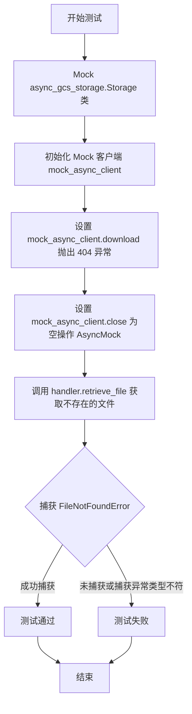

#### 带注释源码

```python
    @patch("backend.util.cloud_storage.async_gcs_storage.Storage")
    @pytest.mark.asyncio
    async def test_retrieve_file_not_found(self, mock_storage_class, handler):
        """Test retrieving non-existent file from GCS."""
        # 创建一个异步客户端的 Mock 对象
        mock_async_client = AsyncMock()
        # 设置 Mock 类的返回值为创建的 Mock 客户端
        mock_storage_class.return_value = mock_async_client

        # 模拟 download 方法抛出包含 "404 Not Found" 信息的异常
        # 这用于模拟文件在云存储中不存在的情况
        mock_async_client.download = AsyncMock(side_effect=Exception("404 Not Found"))
        # 模拟 close 方法，确保资源可以被正确释放
        mock_async_client.close = AsyncMock()

        # 使用 pytest.raises 检查代码块是否抛出了 FileNotFoundError
        # 这里验证 handler.retrieve_file 能够将底层异常正确转换
        with pytest.raises(FileNotFoundError):
            await handler.retrieve_file(
                "gcs://test-bucket/uploads/system/uuid123/nonexistent.txt"
            )
```


### `TestCloudStorageHandler.test_generate_signed_url_gcs`

测试 `CloudStorageHandler` 生成 Google Cloud Storage (GCS) 预签名 URL 的功能。该方法通过模拟同步 GCS 客户端及其依赖的 Bucket 和 Blob 对象，验证了处理器能否正确调用底层库生成 URL 并返回结果。

参数：

- `mock_get_sync_client`：`MagicMock`，通过 `@patch.object` 装饰器注入的模拟对象，用于替代 `CloudStorageHandler._get_sync_gcs_client` 方法，控制 GCS 客户端的返回行为。
- `handler`：`CloudStorageHandler`，通过 `@pytest.fixture` 注入的被测处理器实例。
- `self`：`TestCloudStorageHandler`，测试类实例自身。

返回值：`None`，该方法为单元测试，通过断言验证逻辑，不返回业务数据。

#### 流程图

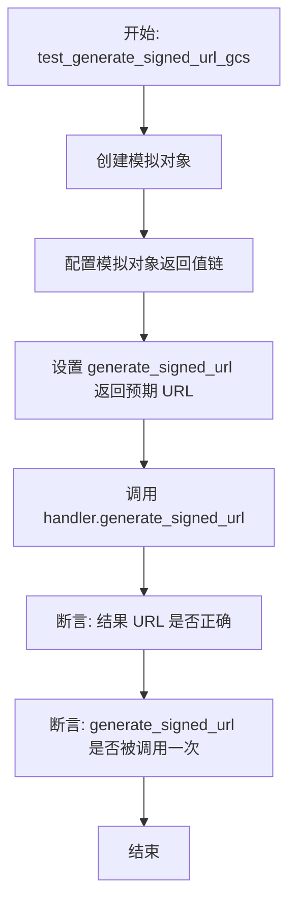

#### 带注释源码

```python
    @patch.object(CloudStorageHandler, "_get_sync_gcs_client")
    @pytest.mark.asyncio
    async def test_generate_signed_url_gcs(self, mock_get_sync_client, handler):
        """Test generating signed URL for GCS."""
        # Mock sync GCS client for signed URLs
        # 模拟同步 GCS 客户端相关的对象链：Client -> Bucket -> Blob
        mock_sync_client = MagicMock()
        mock_bucket = MagicMock()
        mock_blob = MagicMock()

        # 设置 mock 链的返回关系
        mock_get_sync_client.return_value = mock_sync_client
        mock_sync_client.bucket.return_value = mock_bucket
        mock_bucket.blob.return_value = mock_blob
        
        # 设置最终 generate_signed_url 方法的返回值
        mock_blob.generate_signed_url.return_value = "https://signed-url.example.com"

        # 调用实际被测方法
        result = await handler.generate_signed_url(
            "gcs://test-bucket/uploads/system/uuid123/file.txt", 1
        )

        # 验证返回的 URL 是否符合预期
        assert result == "https://signed-url.example.com"
        # 验证 blob 对象上的生成签名 URL 方法是否被确切调用了一次
        mock_blob.generate_signed_url.assert_called_once()
```


### `TestCloudStorageHandler.test_unsupported_provider`

该方法是 `TestCloudStorageHandler` 类中的一个异步测试用例，用于验证 `CloudStorageHandler` 在处理不支持的云存储提供商或无效路径格式时，能够正确抛出 `ValueError` 异常。它分别测试了文件存储、文件检索和签名 URL 生成这三种场景。

参数：

-  `self`：`TestCloudStorageHandler`，测试类实例本身。
-  `handler`：`CloudStorageHandler`，通过 pytest fixture 注入的云存储处理器实例，用于执行测试操作。

返回值：`None`，该方法为单元测试，不返回业务数据，主要通过断言验证异常抛出情况。

#### 流程图

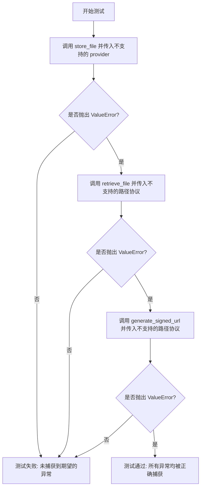

#### 带注释源码

```python
    @pytest.mark.asyncio
    async def test_unsupported_provider(self, handler):
        """Test unsupported provider error."""
        # 测试场景 1: 验证当尝试存储文件并指定一个不支持的 provider 时，
        # store_file 方法应抛出包含 "Unsupported cloud storage provider" 的 ValueError。
        with pytest.raises(ValueError, match="Unsupported cloud storage provider"):
            await handler.store_file(b"content", "file.txt", "unsupported")

        # 测试场景 2: 验证当尝试从未知的路径协议（如 "unsupported://"）检索文件时，
        # retrieve_file 方法应抛出包含 "Unsupported cloud storage path" 的 ValueError。
        with pytest.raises(ValueError, match="Unsupported cloud storage path"):
            await handler.retrieve_file("unsupported://bucket/file.txt")

        # 测试场景 3: 验证当尝试为未知的路径协议生成签名 URL 时，
        # generate_signed_url 方法应抛出包含 "Unsupported cloud storage path" 的 ValueError。
        with pytest.raises(ValueError, match="Unsupported cloud storage path"):
            await handler.generate_signed_url("unsupported://bucket/file.txt")
```


### `TestCloudStorageHandler.test_delete_expired_files_gcs`

该测试用例验证了 `CloudStorageHandler` 在 GCS 环境下能够正确识别过期文件并将其删除，同时保留未过期的文件。

参数：

-  `self`：`TestCloudStorageHandler`，测试类的实例。
-  `mock_get_async_client`：`MagicMock`，通过 `@patch.object` 注入的模拟对象，用于模拟 `_get_async_gcs_client` 方法。
-  `handler`：`CloudStorageHandler`，通过 `pytest.fixture` 注入的被测处理器实例。

返回值：`None`，该函数为测试方法，无返回值，主要进行断言验证。

#### 流程图

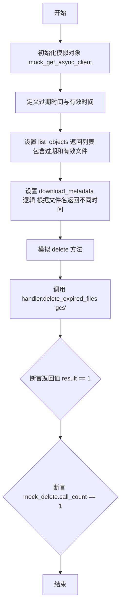

#### 带注释源码

```python
    @patch.object(CloudStorageHandler, "_get_async_gcs_client")
    @pytest.mark.asyncio
    async def test_delete_expired_files_gcs(self, mock_get_async_client, handler):
        """Test deleting expired files from GCS."""
        from datetime import datetime, timedelta, timezone

        # Mock async GCS client
        # 获取模拟的异步 GCS 客户端对象
        mock_async_client = AsyncMock()
        mock_get_async_client.return_value = mock_async_client

        # Mock list_objects response with expired and valid files
        # 定义过期时间和有效时间（基于当前 UTC 时间）
        expired_time = (datetime.now(timezone.utc) - timedelta(hours=1)).isoformat()
        valid_time = (datetime.now(timezone.utc) + timedelta(hours=1)).isoformat()

        # 模拟 list_objects 的响应，包含一个过期文件和一个有效文件
        mock_list_response = {
            "items": [
                {"name": "uploads/expired-file.txt"},
                {"name": "uploads/valid-file.txt"},
            ]
        }
        mock_async_client.list_objects = AsyncMock(return_value=mock_list_response)

        # Mock download_metadata responses
        # 定义模拟的 download_metadata 逻辑，根据文件名返回对应的元数据时间
        async def mock_download_metadata(bucket, blob_name):
            if "expired-file" in blob_name:
                return {"metadata": {"expires_at": expired_time}}
            else:
                return {"metadata": {"expires_at": valid_time}}

        mock_async_client.download_metadata = AsyncMock(
            side_effect=mock_download_metadata
        )
        # 模拟删除操作
        mock_async_client.delete = AsyncMock()

        # 调用被测方法：删除 GCS 上的过期文件
        result = await handler.delete_expired_files("gcs")

        # 验证结果：应该只删除了一个文件
        assert result == 1  # Only one file should be deleted
        # 验证 delete 方法仅被调用一次（针对过期文件）
        assert mock_async_client.delete.call_count == 1
```


### `TestCloudStorageHandler.test_check_file_expired_gcs`

该测试方法验证了 `CloudStorageHandler` 检查 Google Cloud Storage (GCS) 中的文件是否过期的功能。通过模拟异步 GCS 客户端及其元数据下载行为，测试了两种场景：一种是文件已过期（过期时间在过去），另一种是文件仍然有效（过期时间在未来），以确保逻辑正确处理这两种情况。

参数：

- `self`：`TestCloudStorageHandler`，测试类实例，用于访问测试上下文和断言方法。
- `mock_get_async_client`：`unittest.mock.MagicMock`，通过 `@patch.object` 装饰器注入的模拟对象，用于模拟获取异步 GCS 客户端的方法。
- `handler`：`CloudStorageHandler`，通过 `@pytest.fixture` 注入的处理器实例，这是被测试的主要对象。

返回值：`None`，该方法为单元测试函数，不直接返回业务数据，主要通过断言验证行为。

#### 流程图

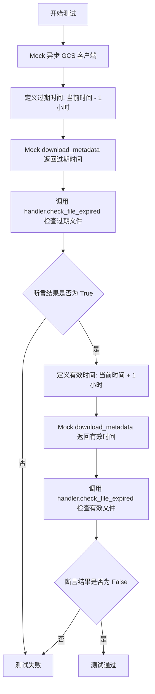

#### 带注释源码

```python
    @patch.object(CloudStorageHandler, "_get_async_gcs_client")
    @pytest.mark.asyncio
    async def test_check_file_expired_gcs(self, mock_get_async_client, handler):
        """Test checking if a file has expired."""
        from datetime import datetime, timedelta, timezone

        # Mock async GCS client
        # 模拟异步 GCS 客户端对象
        mock_async_client = AsyncMock()
        mock_get_async_client.return_value = mock_async_client

        # Test with expired file
        # 测试场景：文件已过期
        # 计算过去的时间点（1小时前）
        expired_time = (datetime.now(timezone.utc) - timedelta(hours=1)).isoformat()
        # 模拟 download_metadata 方法返回包含过期时间的元数据
        mock_async_client.download_metadata = AsyncMock(
            return_value={"metadata": {"expires_at": expired_time}}
        )

        # 调用被测试方法检查文件是否过期
        result = await handler.check_file_expired("gcs://test-bucket/expired-file.txt")
        # 断言结果为 True，因为文件已过期
        assert result is True

        # Test with valid file
        # 测试场景：文件有效
        # 计算未来的时间点（1小时后）
        valid_time = (datetime.now(timezone.utc) + timedelta(hours=1)).isoformat()
        # 更新 mock 逻辑，返回未来的过期时间
        mock_async_client.download_metadata = AsyncMock(
            return_value={"metadata": {"expires_at": valid_time}}
        )

        # 再次调用被测试方法检查文件是否过期
        result = await handler.check_file_expired("gcs://test-bucket/valid-file.txt")
        # 断言结果为 False，因为文件尚未过期
        assert result is False
```


### `TestCloudStorageHandler.test_cleanup_expired_files_async`

该测试方法用于验证异步清理函数 `cleanup_expired_files_async` 的正确性，确保其能成功获取存储处理程序实例，调用删除过期文件的方法，并返回正确的删除数量。

参数：

- `self`：`TestCloudStorageHandler`，测试类的实例，用于访问测试夹具和其他测试方法。
- `mock_get_handler`：`MagicMock`，由 `@patch` 装饰器注入的模拟对象，模拟 `backend.util.cloud_storage.get_cloud_storage_handler` 函数的行为。

返回值：`None`，该方法是测试用例，主要用于断言验证，不直接返回业务数据。

#### 流程图

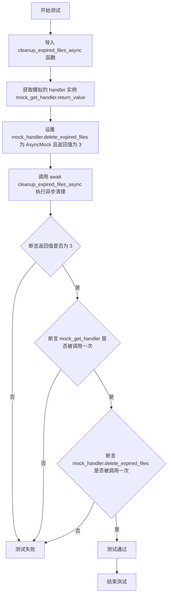

#### 带注释源码

```python
    @patch("backend.util.cloud_storage.get_cloud_storage_handler")
    @pytest.mark.asyncio
    async def test_cleanup_expired_files_async(self, mock_get_handler):
        """Test the async cleanup function."""
        # 导入需要测试的实际功能函数
        from backend.util.cloud_storage import cleanup_expired_files_async

        # 获取 mock 对象返回的模拟 handler 实例
        mock_handler = mock_get_handler.return_value
        # 设置 handler 的 delete_expired_files 方法为异步模拟对象，并预设返回值为 3
        mock_handler.delete_expired_files = AsyncMock(return_value=3)

        # 调用异步清理函数并等待结果
        result = await cleanup_expired_files_async()

        # 验证清理函数返回的删除数量是否正确
        assert result == 3
        # 验证获取 handler 的函数是否被调用了一次
        mock_get_handler.assert_called_once()
        # 验证 handler 上的删除方法是否被调用了一次
        mock_handler.delete_expired_files.assert_called_once()
```


### `TestCloudStorageHandler.test_cleanup_expired_files_async_error`

测试异步清理函数在底层操作抛出异常时的错误处理行为，确保函数优雅地返回0而不是抛出错误。

参数：

- `mock_get_handler`：`MagicMock`，`get_cloud_storage_handler` 函数的模拟对象，用于返回模拟的处理器实例。

返回值：`None`，测试方法无显式返回值，主要通过断言验证行为。

#### 流程图

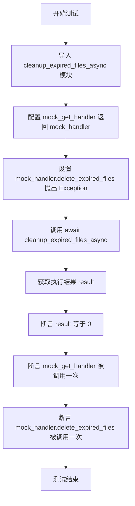

#### 带注释源码

```python
    @patch("backend.util.cloud_storage.get_cloud_storage_handler")
    @pytest.mark.asyncio
    async def test_cleanup_expired_files_async_error(self, mock_get_handler):
        """Test the async cleanup function with error."""
        # 导入待测试的异步清理函数
        from backend.util.cloud_storage import cleanup_expired_files_async

        # Mock the handler to raise an exception
        # 获取mock对象的返回值，即模拟的handler实例
        mock_handler = mock_get_handler.return_value
        # 设置delete_expired_files方法在被调用时抛出异常
        mock_handler.delete_expired_files = AsyncMock(
            side_effect=Exception("GCS error")
        )

        # 调用清理函数
        result = await cleanup_expired_files_async()

        # 验证结果是否为0，即错误发生时的预期返回值
        assert result == 0  # Should return 0 on error
        # 验证get_cloud_storage_handler是否被调用过一次
        mock_get_handler.assert_called_once()
        # 验证delete_expired_files是否被调用过一次
        mock_handler.delete_expired_files.assert_called_once()
```


### `TestCloudStorageHandler.test_validate_file_access_system_files`

该测试方法验证了`CloudStorageHandler`对系统文件（位于`uploads/system/`路径下）的访问控制逻辑，确保无论是否提供用户ID，系统文件均允许被访问，即不应抛出权限异常。

参数：

-  `self`：`TestCloudStorageHandler`，测试类实例本身。
-  `handler`：`CloudStorageHandler`，通过pytest fixture注入的被测云存储处理程序实例。

返回值：`None`，该方法为单元测试，无显式返回值。

#### 流程图

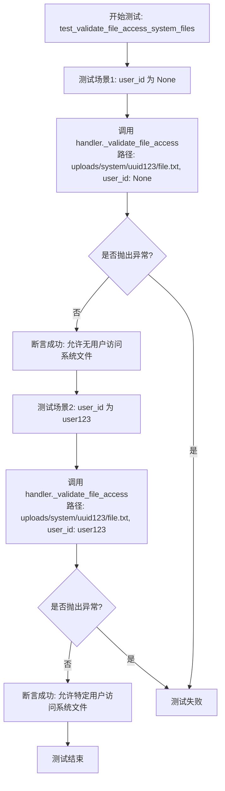

#### 带注释源码

```python
    def test_validate_file_access_system_files(self, handler):
        """Test access validation for system files."""
        # System files should be accessible by anyone
        # 场景1：尝试在不提供 user_id 的情况下访问系统文件
        # 预期行为：不应抛出异常，因为系统文件通常对所有人开放
        handler._validate_file_access("uploads/system/uuid123/file.txt", None)

        # 场景2：尝试在提供特定 user_id 的情况下访问系统文件
        # 预期行为：不应抛出异常，拥有特定用户身份也应能访问系统文件
        handler._validate_file_access("uploads/system/uuid123/file.txt", "user123")
```


### `TestCloudStorageHandler.test_validate_file_access_user_files_success`

Test case verifying that a user can successfully access files located within their specific user directory in the cloud storage.

参数：

- `self`：`TestCloudStorageHandler`，测试类的实例，由 pytest 框架隐式传递。
- `handler`：`CloudStorageHandler`，通过 pytest fixture 注入的被测处理器实例。

返回值：`None`，该方法主要用于验证逻辑是否按预期执行（不抛出异常），无显式返回值。

#### 流程图

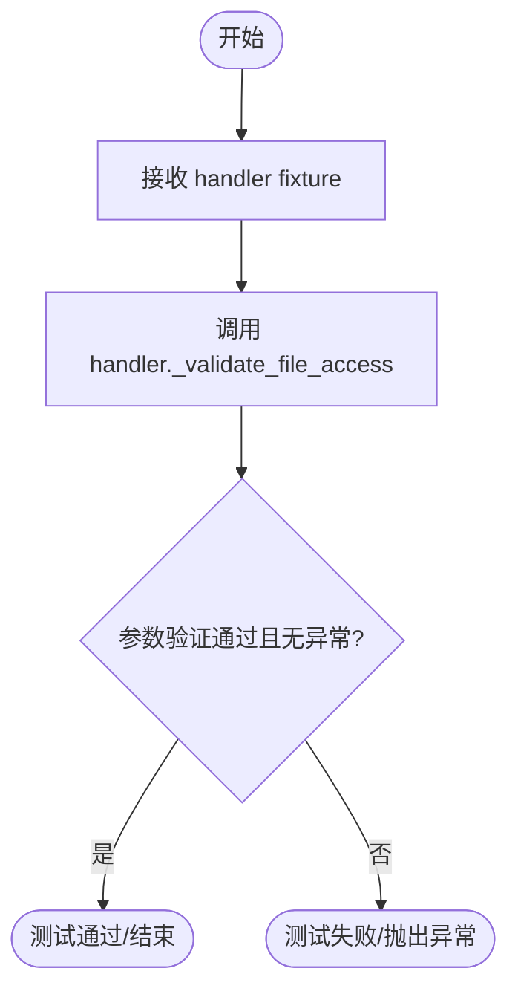

#### 带注释源码

```python
    def test_validate_file_access_user_files_success(self, handler):
        """Test successful access validation for user files."""
        # 用户应该能够访问他们自己的文件
        # 调用 handler 的 _validate_file_access 方法
        # 传入用户文件的路径: "uploads/users/user123/uuid456/file.txt"
        # 传入对应的用户 ID: "user123"
        # 预期：该方法执行正常，不抛出 PermissionError 或其他异常
        handler._validate_file_access(
            "uploads/users/user123/uuid456/file.txt", "user123"
        )
```


### `TestCloudStorageHandler.test_validate_file_access_user_files_no_user_id`

该测试用例用于验证当尝试访问用户专属文件路径（`uploads/users/...`）但未提供用户ID（`user_id` 为 `None`）时，`CloudStorageHandler` 的 `_validate_file_access` 方法是否能正确抛出 `PermissionError` 异常，从而确保系统的访问控制安全性。

参数：

-   `self`：`TestCloudStorageHandler`，测试类的实例，由 pytest 框架隐式传入。
-   `handler`：`CloudStorageHandler`，云存储处理器的实例，通过 `handler` fixture 注入，用于调用其内部方法进行测试。

返回值：`None`，该函数为测试方法，无直接返回值，通过是否抛出预期异常来判断测试是否通过。

#### 流程图

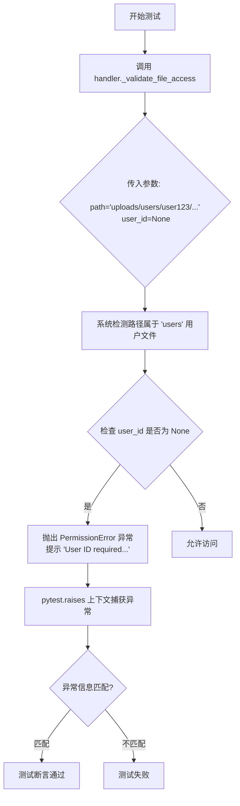

#### 带注释源码

```python
    def test_validate_file_access_user_files_no_user_id(self, handler):
        """Test access validation failure when no user_id provided for user files."""
        # 使用 pytest.raises 捕获预期的 PermissionError 异常
        with pytest.raises(
            PermissionError, match="User ID required to access user files"
        ):
            # 调用被测方法，传入用户文件路径和 None 作为 user_id
            # 预期逻辑：由于路径是 'uploads/users/...' 开头但 user_id 为空，应拒绝访问
            handler._validate_file_access(
                "uploads/users/user123/uuid456/file.txt", None
            )
```


### `TestCloudStorageHandler.test_validate_file_access_user_files_wrong_user`

测试当尝试访问另一个用户的文件时，访问验证逻辑是否正确抛出权限拒绝异常。

参数：

- `self`：`TestCloudStorageHandler`，测试类的实例，由 pytest 框架自动注入。
- `handler`：`CloudStorageHandler`，云存储处理程序实例，通过 `handler` fixture 注入，用于调用实际的验证逻辑。

返回值：`None`，该函数为测试用例，无显式返回值，通过断言来验证行为。

#### 流程图

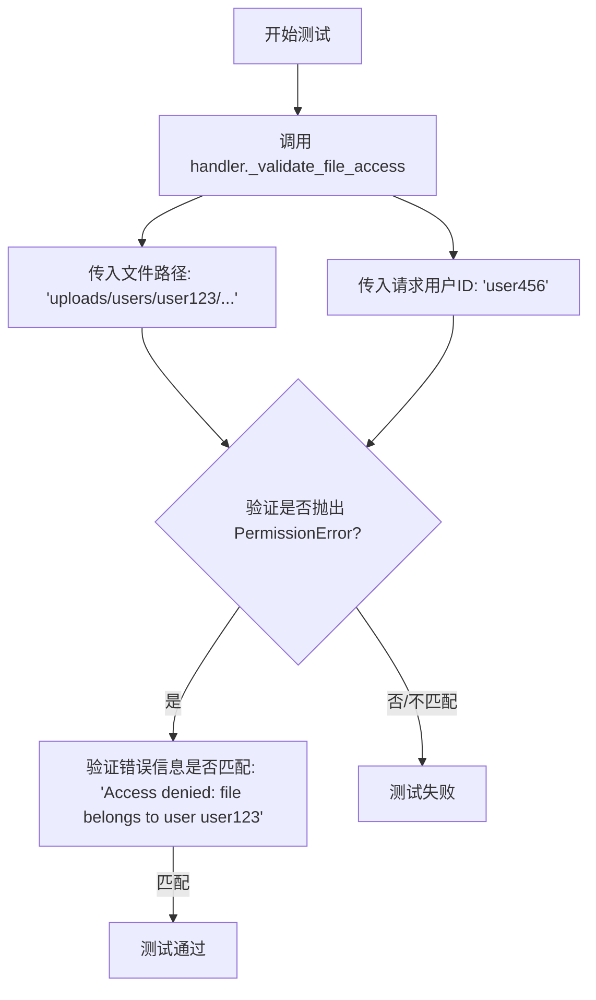

#### 带注释源码

```python
def test_validate_file_access_user_files_wrong_user(self, handler):
    """Test access validation failure when accessing another user's files."""
    # 使用 pytest.raises 上下文管理器，预期代码块会抛出 PermissionError
    # 并验证异常消息包含 "Access denied: file belongs to user user123"
    with pytest.raises(
        PermissionError, match="Access denied: file belongs to user user123"
    ):
        # 调用验证方法：
        # 传入的文件路径属于 user123 ('uploads/users/user123/uuid456/file.txt')
        # 但传入的当前用户ID是 user456
        # 预期逻辑应检测到用户不匹配并抛出异常
        handler._validate_file_access(
            "uploads/users/user123/uuid456/file.txt", "user456"
        )
```


### `TestCloudStorageHandler.test_validate_file_access_legacy_files`

该方法用于测试遗留文件路径的访问验证逻辑，验证无论是否提供用户ID，系统对遗留文件路径的访问是否均被允许（通常意味着不应抛出权限异常）。

参数：

- `self`：`TestCloudStorageHandler`，测试类的实例。
- `handler`：`CloudStorageHandler`，通过 pytest fixture 注入的云存储处理器实例，用于调用实际的验证逻辑。

返回值：`None`，该方法不返回值，主要用于验证逻辑是否会抛出异常。

#### 流程图

```mermaid
graph TD
    A[开始: test_validate_file_access_legacy_files] --> B[调用 handler._validate_file_access]
    B --> C{场景1: 无用户ID访问}
    C --> D[参数: path='uploads/uuid789/file.txt', user_id=None]
    D --> E[调用 handler._validate_file_access]
    E --> F{场景2: 有用户ID访问}
    F --> G[参数: path='uploads/uuid789/file.txt', user_id='user123']
    G --> H[结束: 测试通过 (无异常抛出)]
```

#### 带注释源码

```python
def test_validate_file_access_legacy_files(self, handler):
    """Test access validation for legacy files."""
    # Legacy files should be accessible with a warning
    # 调用验证逻辑，测试遗留文件路径在未提供用户ID时的访问情况
    handler._validate_file_access("uploads/uuid789/file.txt", None)
    
    # 调用验证逻辑，测试遗留文件路径在提供了特定用户ID时的访问情况
    handler._validate_file_access("uploads/uuid789/file.txt", "user123")
```


### `TestCloudStorageHandler.test_validate_file_access_invalid_path`

测试当提供的文件路径无效（不在 uploads/ 目录下）时，`_validate_file_access` 方法是否能正确抛出 `PermissionError`。

参数：

-  `self`：`TestCloudStorageHandler`，测试类实例，由 pytest 框架自动传入。
-  `handler`：`CloudStorageHandler`，通过 fixture 注入的云存储处理器实例，用于调用被测方法。

返回值：`None`，该函数为测试方法，不返回具体值，主要验证是否抛出预期异常。

#### 流程图

```mermaid
graph TD
    A[开始执行测试] --> B[设置 pytest.raises 上下文<br>捕获 PermissionError]
    B --> C[调用 handler._validate_file_access<br>传入无效路径 'invalid/path/file.txt']
    C --> D{方法是否抛出 PermissionError?}
    D -- 是 --> E[检查异常消息是否匹配<br>'Invalid file path: must be under uploads/']
    E -- 匹配 --> F[测试通过]
    E -- 不匹配 --> G[测试失败]
    D -- 否 --> G[测试失败]
```

#### 带注释源码

```python
    def test_validate_file_access_invalid_path(self, handler):
        """Test access validation failure for invalid paths."""
        # 使用 pytest.raises 上下文管理器验证是否会抛出 PermissionError
        # 并检查异常消息是否包含指定的错误提示
        with pytest.raises(PermissionError, match="Invalid file path: must be under uploads/"):
            # 调用处理器的验证方法，传入一个不在 'uploads/' 目录下的无效路径
            # 预期该方法会拒绝访问并抛出异常
            handler._validate_file_access("invalid/path/file.txt", "user123")
```


### `TestCloudStorageHandler.test_retrieve_file_with_authorization`

验证 `CloudStorageHandler.retrieve_file` 方法在访问用户特定文件时正确执行授权检查的测试方法。它通过模拟 Google Cloud Storage (GCS) 客户端，确保用户只能检索存储在其特定用户路径（`uploads/users/{user_id}`）中的文件，并在尝试访问属于其他用户的文件时正确抛出权限错误。

参数：

-  `self`：`TestCloudStorageHandler`，测试类的实例，用于访问测试上下文和其他辅助方法。
-  `mock_storage_class`：`MagicMock`，由 `@patch` 装饰器注入的 `backend.util.cloud_storage.async_gcs_storage.Storage` 类的模拟对象，用于模拟底层存储客户端的实例化行为。
-  `handler`：`CloudStorageHandler`，由 `pytest.fixture` 提供的已配置的云存储处理程序实例，用于执行实际的文件检索操作。

返回值：`None`，该测试方法不返回任何值，主要通过断言（assert）来验证行为是否符合预期。

#### 流程图

```mermaid
flowchart TD
    A[开始测试] --> B[初始化 Mock 对象]
    B --> C[配置 Mock 客户端行为<br/>设置 download 返回模拟内容]
    C --> D[测试场景 1: 用户下载自己的文件<br/>调用 retrieve_file(user123)]
    D --> E[断言: 验证返回内容是否正确]
    E --> F[断言: 验证 download 方法<br/>是否被正确参数调用]
    F --> G[测试场景 2: 用户下载他人文件<br/>调用 retrieve_file(user456)]
    G --> H[断言: 验证是否抛出 PermissionError]
    H --> I[测试结束]
```

#### 带注释源码

```python
    @patch("backend.util.cloud_storage.async_gcs_storage.Storage")
    @pytest.mark.asyncio
    async def test_retrieve_file_with_authorization(self, mock_storage_class, handler):
        """Test file retrieval with authorization."""
        # 1. 准备 Mock 对象：模拟 async_gcs_storage.Storage 类的实例化
        mock_client = AsyncMock()
        mock_storage_class.return_value = mock_client
        
        # 2. 配置 Mock 行为：模拟下载方法返回特定字节内容，并模拟关闭连接
        mock_client.download = AsyncMock(return_value=b"test content")
        mock_client.close = AsyncMock()

        # 3. 测试成功场景：用户 user123 下载属于自己的文件
        result = await handler.retrieve_file(
            "gcs://test-bucket/uploads/users/user123/uuid456/file.txt",
            user_id="user123",
        )
        # 验证下载到的文件内容是否正确
        assert result == b"test content"
        # 验证底层 GCS 客户端是否使用了正确的 bucket 名称和 blob 路径进行下载
        mock_client.download.assert_called_once_with(
            "test-bucket", "uploads/users/user123/uuid456/file.txt"
        )

        # 4. 测试失败场景：用户 user456 尝试下载属于 user123 的文件
        with pytest.raises(PermissionError):
            await handler.retrieve_file(
                "gcs://test-bucket/uploads/users/user123/uuid456/file.txt",
                user_id="user456",
            )
```


### `TestCloudStorageHandler.test_store_file_with_user_id`

该测试方法验证了 `CloudStorageHandler` 在存储文件时能够根据是否提供 `user_id` 来正确构建文件路径。当提供 `user_id` 时，文件应存储在用户专属目录下；当 `user_id` 为 `None` 时，文件应存储在系统目录下。

参数：

-   `self`：`TestCloudStorageHandler`，测试类的实例。
-   `mock_get_client`：`AsyncMock`，模拟的 `_get_async_gcs_client` 方法对象，用于注入模拟的异步客户端。
-   `handler`：`CloudStorageHandler`，被测试的云存储处理程序实例，通过 fixture 注入。

返回值：`None`，该方法为单元测试用例，无显式返回值。

#### 流程图

```mermaid
graph TD
    A[开始] --> B[模拟 Async GCS Client 和 Upload 方法]
    B --> C[定义测试内容 content 和文件名 filename]
    C --> D[调用 handler.store_file 并传入 user_id]
    D --> E{断言结果路径}
    E -- 包含 uploads/users/user123/ --> F[断言 mock_client.upload 被调用]
    F --> G[调用 handler.store_file 并传入 user_id=None]
    G --> H{断言结果路径}
    H -- 包含 uploads/system/ --> I[断言 mock_client.upload 总共被调用2次]
    I --> J[结束]
```

#### 带注释源码

```python
    @patch.object(CloudStorageHandler, "_get_async_gcs_client")
    @pytest.mark.asyncio
    async def test_store_file_with_user_id(self, mock_get_client, handler):
        """Test file storage with user ID."""
        # 设置模拟的异步 GCS 客户端
        mock_client = AsyncMock()
        mock_get_client.return_value = mock_client
        # 模拟 upload 方法，防止实际执行存储操作
        mock_client.upload = AsyncMock()

        content = b"test file content"
        filename = "test.txt"

        # 测试场景1：提供 user_id (模拟用户上传)
        result = await handler.store_file(
            content, filename, "gcs", expiration_hours=24, user_id="user123"
        )

        # 验证返回的路径格式包含用户特定的目录
        assert result.startswith("gcs://test-bucket/uploads/users/user123/")
        assert result.endswith("/test.txt")
        # 验证 upload 方法确实被调用了
        mock_client.upload.assert_called()

        # 测试场景2：不提供 user_id (模拟系统上传)
        result = await handler.store_file(
            content, filename, "gcs", expiration_hours=24, user_id=None
        )

        # 验证返回的路径格式包含系统特定的目录
        assert result.startswith("gcs://test-bucket/uploads/system/")
        assert result.endswith("/test.txt")
        # 验证 upload 方法总共被调用了两次 (对应两次 store_file 调用)
        assert mock_client.upload.call_count == 2
```


### `TestCloudStorageHandler.test_store_file_with_graph_exec_id`

该测试函数用于验证在提供图执行ID（graph_exec_id）的情况下，云存储处理器能否正确地将文件存储在包含该ID的特定路径下。

参数：

-  `self`：`TestCloudStorageHandler`，测试类实例，由 pytest 框架自动传入。
-  `mock_get_async_client`：`AsyncMock`，通过 `patch.object` 装饰器注入的模拟对象，用于模拟 `CloudStorageHandler` 的内部 `_get_async_gcs_client` 方法。
-  `handler`：`CloudStorageHandler`，通过 fixture 注入的被测处理器实例。

返回值：`None`，该函数为异步测试用例，不返回任何值，通过断言验证行为。

#### 流程图

```mermaid
graph TD
    A[开始测试] --> B[设置 _get_async_gcs_client 模拟返回值]
    B --> C[设置 upload 模拟方法]
    C --> D[准备测试数据: content, filename]
    D --> E[调用 handler.store_file 并传入 graph_exec_id='exec123']
    E --> F[断言: 验证返回路径前缀包含 'uploads/executions/exec123/']
    F --> G[断言: 验证返回路径后缀为 '/test.txt']
    G --> H[测试结束]
```

#### 带注释源码

```python
    @patch.object(CloudStorageHandler, "_get_async_gcs_client")
    @pytest.mark.asyncio
    async def test_store_file_with_graph_exec_id(self, mock_get_async_client, handler):
        """Test file storage with graph execution ID."""
        # Mock async GCS client
        # 创建一个模拟的异步 GCS 客户端对象
        mock_async_client = AsyncMock()
        # 设置模拟的 _get_async_gcs_client 方法返回上述模拟客户端
        mock_get_async_client.return_value = mock_async_client

        # Mock the upload method
        # 将模拟客户端的 upload 方法设置为模拟的异步方法
        mock_async_client.upload = AsyncMock()

        # 定义测试用的文件内容和文件名
        content = b"test file content"
        filename = "test.txt"

        # Test with graph_exec_id
        # 调用 store_file 方法，传入 graph_exec_id 参数
        result = await handler.store_file(
            content, filename, "gcs", expiration_hours=24, graph_exec_id="exec123"
        )

        # Verify the result format includes execution path
        # 验证返回的 URI 路径是否包含 'uploads/executions/exec123/' 目录结构
        assert result.startswith("gcs://test-bucket/uploads/executions/exec123/")
        # 验证返回的 URI 路径是否以正确的文件名结尾
        assert result.endswith("/test.txt")
```


### `TestCloudStorageHandler.test_store_file_with_both_user_and_exec_id`

该测试方法用于验证当同时提供 `user_id` 和 `graph_exec_id` 参数时，`store_file` 方法是否能正确地抛出 `ValueError` 异常，以确保系统设计中的互斥约束（即文件只能关联用户或关联执行ID，不能同时关联）得以执行。

参数：

- `self`：`TestCloudStorageHandler`，测试类实例本身。
- `handler`：`CloudStorageHandler`，通过 pytest fixture 注入的被测对象，用于处理云存储操作。

返回值：`None`，该方法为测试用例，不返回业务数据，仅通过断言验证行为。

#### 流程图

```mermaid
flowchart TD
    A["开始测试"] --> B["初始化测试数据 content 和 filename"]
    B --> C["调用 handler.store_file<br/>同时传入 user_id='user123' 和 graph_exec_id='exec123'"]
    C --> D{是否抛出 ValueError?}
    D -- 否 --> E["测试失败: 未按预期抛出异常"]
    D -- 是 --> F{异常信息是否包含<br/>'Provide either user_id OR graph_exec_id, not both'?}
    F -- 否 --> G["测试失败: 异常信息不匹配"]
    F -- 是 --> H["测试通过: 成功捕获预期异常"]
```

#### 带注释源码

```python
    @pytest.mark.asyncio
    async def test_store_file_with_both_user_and_exec_id(self, handler):
        """Test file storage fails when both user_id and graph_exec_id are provided."""
        # 准备测试用的文件内容
        content = b"test file content"
        # 准备测试用的文件名
        filename = "test.txt"

        # 使用 pytest.raises 上下文管理器验证代码块是否抛出特定的 ValueError
        with pytest.raises(
            ValueError, match="Provide either user_id OR graph_exec_id, not both"
        ):
            # 尝试存储文件，同时提供 user_id 和 graph_exec_id
            # 预期此操作会失败，因为这两个参数在设计上是互斥的
            await handler.store_file(
                content,
                filename,
                "gcs",
                expiration_hours=24,
                user_id="user123",
                graph_exec_id="exec123",
            )
```


### `TestCloudStorageHandler.test_validate_file_access_execution_files_success`

该测试方法验证了当提供的 `graph_exec_id` 与文件路径中包含的执行 ID 一致时，`CloudStorageHandler` 能够成功验证对执行文件（位于 `uploads/executions/` 路径下）的访问权限。它确保在 ID 匹配的情况下，验证逻辑能够正确通过且不抛出任何异常。

参数：

- `self`：`TestCloudStorageHandler`，测试类的实例，用于访问测试上下文。
- `handler`：`CloudStorageHandler`，通过 pytest fixture 注入的云存储处理程序实例，作为被测对象。

返回值：`None`，该方法为测试用例，无显式返回值，但验证了内部逻辑不会抛出 `PermissionError`。

#### 流程图

```mermaid
graph TD
    A[Start Test] --> B[Input file path: uploads/executions/exec123/uuid456/file.txt]
    B --> C[Input graph_exec_id: exec123]
    C --> D[Call handler._validate_file_access]
    D --> E{Internal Check: Path starts with uploads/executions?}
    E -- Yes --> F[Extract ID from path: exec123]
    F --> G{Compare IDs: exec123 == exec123?}
    G -- Match --> H[Validation Passes]
    H --> I[No Exception Raised]
    I --> J[Test Completes Successfully]
```

#### 带注释源码

```python
def test_validate_file_access_execution_files_success(self, handler):
    """Test successful access validation for execution files."""
    # 测试场景：图执行应该能够访问其自己的文件
    # 操作：调用 _validate_file_access 方法
    # 参数1：模拟的文件路径，包含执行ID 'exec123'
    # 参数2：与路径匹配的 graph_exec_id
    handler._validate_file_access(
        "uploads/executions/exec123/uuid456/file.txt", graph_exec_id="exec123"
    )
    # 断言：如果代码执行到此处且未抛出 PermissionError，则测试通过
```


### `TestCloudStorageHandler.test_validate_file_access_execution_files_no_exec_id`

该测试方法用于验证当尝试访问属于特定图执行（execution）的文件路径，但未提供必要的 `graph_exec_id`（而是提供了 `user_id`）时，`CloudStorageHandler` 的 `_validate_file_access` 方法是否能正确抛出 `PermissionError` 异常。

参数：

-   `self`：`TestCloudStorageHandler`，测试类实例，由 pytest 框架自动传入。
-   `handler`：`CloudStorageHandler`，云存储处理程序实例，通过 `@pytest.fixture` 装饰的 fixture 方法注入。

返回值：`None`，该方法为单元测试函数，无直接返回值，通过断言异常来验证逻辑正确性。

#### 流程图

```mermaid
graph TD
    A[开始测试] --> B[调用 handler._validate_file_access]
    B --> C{传入参数: 执行文件路径<br>user_id='user123'<br>graph_exec_id=None}
    C --> D[内部逻辑检测路径属于 uploads/executions/]
    D --> E{检查是否提供 graph_exec_id}
    E -->|否| F[抛出 PermissionError]
    F --> G[pytest.raises 捕获异常]
    G --> H[验证异常信息匹配]
    H --> I[测试通过]
```

#### 带注释源码

```python
    def test_validate_file_access_execution_files_no_exec_id(self, handler):
        """Test access validation failure when no graph_exec_id provided for execution files."""
        # 使用 pytest.raises 上下文管理器，预期会抛出 PermissionError
        # 并且异常信息应匹配 "Graph execution ID required to access execution files"
        with pytest.raises(
            PermissionError,
            match="Graph execution ID required to access execution files",
        ):
            # 尝试验证文件访问权限：
            # 路径 "uploads/executions/exec123/uuid456/file.txt" 表明这是一个执行文件
            # 但参数中只提供了 user_id="user123"，没有提供 graph_exec_id
            # 预期行为：拒绝访问并抛出异常
            handler._validate_file_access(
                "uploads/executions/exec123/uuid456/file.txt", user_id="user123"
            )
```


### `TestCloudStorageHandler.test_validate_file_access_execution_files_wrong_exec_id`

测试当尝试使用错误的执行ID（graph_exec_id）访问另一个执行路径下的文件时，系统是否正确抛出权限异常。

参数：

- `self`：`TestCloudStorageHandler`，测试类的实例。
- `handler`：`CloudStorageHandler`，通过 pytest fixture 注入的云存储处理器实例。

返回值：`None`，无返回值（测试方法通过断言或捕获异常来验证逻辑）。

#### 流程图

```mermaid
graph TD
    A[开始测试: test_validate_file_access_execution_files_wrong_exec_id] --> B[准备测试路径与错误的 graph_exec_id]
    B --> C[调用 handler._validate_file_access]
    C --> D{是否抛出 PermissionError?}
    D -- 是 --> E[验证异常信息是否匹配 "Access denied..."]
    E --> F[测试断言通过]
    D -- 否 --> G[测试失败]
    F --> H[测试结束]
```

#### 带注释源码

```python
def test_validate_file_access_execution_files_wrong_exec_id(self, handler):
    """Test access validation failure when accessing another execution's files."""
    # 使用 pytest.raises 上下文管理器验证是否抛出了预期的 PermissionError
    # 预期异常消息应匹配 "Access denied: file belongs to execution exec123"
    with pytest.raises(
        PermissionError, match="Access denied: file belongs to execution exec123"
    ):
        # 调用处理器的内部验证方法
        # 传入的文件路径包含执行 ID "exec123"，但参数 graph_exec_id 传入的是 "exec456"
        # 这种 ID 不匹配的情况应触发权限拒绝异常
        handler._validate_file_access(
            "uploads/executions/exec123/uuid456/file.txt", graph_exec_id="exec456"
        )
```


### `TestCloudStorageHandler.test_retrieve_file_with_exec_authorization`

测试通过图执行ID（graph execution ID）从云存储检索文件的功能，验证当执行ID匹配时检索成功，不匹配时抛出权限异常。

参数：

-  `self`：`TestCloudStorageHandler`，测试类实例。
-  `mock_storage_class`：`MagicMock`，通过 `@patch` 装饰器注入的模拟云存储客户端类。
-  `handler`：`CloudStorageHandler`，通过 `pytest.fixture` 注入的被测处理器实例。

返回值：`None`，该方法为测试方法，无返回值，主要通过断言验证行为。

#### 流程图

```mermaid
flowchart TD
    A[开始] --> B[模拟 async_gcs_storage.Storage 类]
    B --> C[配置 Mock 客户端: download 返回内容, close 为空]
    C --> D[场景 1: 使用匹配的 graph_exec_id 'exec123' 检索文件]
    D --> E[调用 handler.retrieve_file]
    E --> F[断言: 验证返回内容正确]
    F --> G[场景 2: 使用不匹配的 graph_exec_id 'exec456' 检索文件]
    G --> H[调用 handler.retrieve_file]
    H --> I[断言: 验证抛出 PermissionError]
    I --> J[结束]
```

#### 带注释源码

```python
    @patch("backend.util.cloud_storage.async_gcs_storage.Storage")
    @pytest.mark.asyncio
    async def test_retrieve_file_with_exec_authorization(
        self, mock_storage_class, handler
    ):
        """Test file retrieval with execution authorization."""
        # 模拟 async GCS 客户端实例
        mock_async_client = AsyncMock()
        # 设置 patch 对象的返回值为模拟客户端
        mock_storage_class.return_value = mock_async_client

        # 模拟下载和关闭方法
        mock_async_client.download = AsyncMock(return_value=b"test content")
        mock_async_client.close = AsyncMock()

        # 测试成功检索属于该执行ID的文件
        result = await handler.retrieve_file(
            "gcs://test-bucket/uploads/executions/exec123/uuid456/file.txt",
            graph_exec_id="exec123",
        )
        # 验证下载到的内容是否正确
        assert result == b"test content"

        # 测试授权失败的情况（执行ID不匹配）
        with pytest.raises(PermissionError):
            await handler.retrieve_file(
                "gcs://test-bucket/uploads/executions/exec123/uuid456/file.txt",
                graph_exec_id="exec456",
            )
```


### `TestCloudStorageHandler.test_generate_signed_url_with_exec_authorization`

测试在执行授权场景下生成 GCS 签名 URL 的功能，验证了当提供的 graph_exec_id 与文件路径匹配时能成功生成 URL，以及当 ID 不匹配时正确抛出权限异常的情况。

参数：

- `self`：`TestCloudStorageHandler`，测试类的实例。
- `mock_get_sync_client`：`MagicMock`，通过 `@patch.object` 注入的 Mock 对象，用于模拟 `CloudStorageHandler` 内部的 `_get_sync_gcs_client` 方法。
- `handler`：`CloudStorageHandler`，通过 `@pytest.fixture` 注入的被测处理器实例。

返回值：`None`，该测试方法没有显式返回值，通过 `assert` 和 `pytest.raises` 来验证行为是否符合预期。

#### 流程图

```mermaid
graph TD
    A[开始] --> B[Mock 设置: 模拟 sync_client, bucket, blob]
    B --> C[配置 Mock 链: 设定 generate_signed_url 返回值]
    C --> D[测试用例 1: 匹配的 graph_exec_id]
    D --> E[调用 handler.generate_signed_url graph_exec_id=exec123]
    E --> F[断言: 返回结果为预期 URL]
    F --> G[测试用例 2: 不匹配的 graph_exec_id]
    G --> H[调用 handler.generate_signed_url graph_exec_id=exec456]
    H --> I[断言: 抛出 PermissionError]
    I --> J[结束]
```

#### 带注释源码

```python
    @patch.object(CloudStorageHandler, "_get_sync_gcs_client")
    @pytest.mark.asyncio
    async def test_generate_signed_url_with_exec_authorization(
        self, mock_get_sync_client, handler
    ):
        """Test signed URL generation with execution authorization."""
        # Mock sync GCS client for signed URLs
        # 创建模拟的 GCS 同步客户端、Bucket 和 Blob 对象
        mock_sync_client = MagicMock()
        mock_bucket = MagicMock()
        mock_blob = MagicMock()

        # 设置 Mock 的调用链：_get_sync_gcs_client -> client -> bucket -> blob
        mock_get_sync_client.return_value = mock_sync_client
        mock_sync_client.bucket.return_value = mock_bucket
        mock_bucket.blob.return_value = mock_blob
        
        # 预设 generate_signed_url 方法的返回值
        mock_blob.generate_signed_url.return_value = "https://signed-url.example.com"

        # Test successful signed URL generation for execution's own file
        # 测试场景：成功生成签名 URL（graph_exec_id 匹配文件路径中的 ID）
        result = await handler.generate_signed_url(
            "gcs://test-bucket/uploads/executions/exec123/uuid456/file.txt",
            1,
            graph_exec_id="exec123",
        )
        # 验证返回的 URL 是否正确
        assert result == "https://signed-url.example.com"

        # Test authorization failure
        # 测试场景：授权失败（graph_exec_id 不匹配文件路径中的 ID）
        with pytest.raises(PermissionError):
            await handler.generate_signed_url(
                "gcs://test-bucket/uploads/executions/exec123/uuid456/file.txt",
                1,
                graph_exec_id="exec456", # 尝试访问 exec123 的文件但 ID 为 exec456
            )
```


## 关键组件


### 云路径解析器
用于识别和解析云存储 URI（如 GCS、S3、Azure）的逻辑，能够从路径字符串中提取存储桶名称和对象路径，并区分云路径与其他类型的路径。

### 访问控制验证器
根据文件路径的层级结构（系统文件、用户文件或图执行文件）验证请求者权限的机制，确保只有文件所有者或授权的系统进程才能访问特定资源。

### 多上下文文件存储
处理将文件内容异步上传到云存储的功能，支持根据上下文（系统、特定用户 ID 或图执行 ID）动态构建存储路径和分配元数据。

### 生命周期管理与清理
负责维护存储卫生的组件，通过扫描云存储列表来识别过期文件，并根据元数据中的时间戳自动将其删除。

### 授权文件检索
管理从云存储下载数据的服务，在执行实际的文件下载操作前，严格强制执行基于用户 ID 或图执行 ID 的所有权检查。

### 签名 URL 生成服务
用于为云存储中的文件生成具有有限过期时间的临时访问链接的接口，在生成链接前验证请求者对目标文件的访问权限。


## 问题及建议


### 已知问题

-   **脆弱的错误处理机制**：代码通过匹配异常消息字符串（如 `Exception("404 Not Found")`）来判断文件是否存在。这种依赖字符串内容的错误处理方式非常脆弱，一旦底层 SDK 的错误消息格式发生变化，逻辑就会失效。
-   **硬编码的路径解析逻辑**：文件路径结构（如 `uploads/system/`、`uploads/users/`）和验证逻辑散落在测试用例的断言及被测函数的假设中。这种隐式的约定缺乏统一的常量定义或路径管理类，增加了维护成本和重构时的出错风险。
-   **缺乏多云实现的完整测试覆盖**：虽然 `is_cloud_path` 和 `parse_cloud_path` 涵盖了 GCS、S3 和 Azure，但核心的文件操作（上传、下载、删除、签名 URL）仅有针对 GCS 的测试用例。这暗示 S3 和 Azure 的具体实现逻辑可能未被充分验证，存在潜在的未发现 Bug。
-   **时间敏感的测试逻辑**：`test_delete_expired_files_gcs` 等测试用例依赖 `datetime.now()` 来构造过期时间。尽管使用了 UTC，但在系统时钟发生变化或极端边界情况下，仍可能导致测试不稳定。

### 优化建议

-   **引入特定的异常类型映射**：重构错误捕获逻辑，捕获底层 SDK 抛出的特定异常类型（如 `google.cloud.exceptions.NotFound`），或定义统一的存储异常层，而不是通过字符串解析通用 Exception。
-   **封装文件路径与权限模型**：创建一个 `FileLocation` 或 `ResourcePath` 类来封装路径拼接、解析和权限校验逻辑，避免在各处直接进行字符串切片和 `startswith` 判断，提高代码的内聚性和可读性。
-   **利用存储桶生命周期策略**：对于文件过期删除的需求，建议评估利用云厂商提供的 Bucket Lifecycle Management（生命周期管理）规则来自动清理过期文件，而不是应用层定期轮询和删除，以提高效率和可靠性。
-   **提取公共 Mock Fixtures**：测试代码中存在大量重复的 Mock 客户端初始化逻辑（如 `mock_async_client`, `mock_bucket`, `mock_blob`）。建议提取为共享的 Pytest Fixture，简化测试代码并提高可维护性。
-   **补充集成测试**：建议补充基于 LocalStack、MinIO 或 GCS Emulator 的集成测试，以验证代码在真实类存储环境下的行为，特别是 SDK 调用参数和权限控制逻辑。


## 其它


### 设计目标与约束

**设计目标**
1.  **多云存储抽象**：提供一个统一的接口层，用于处理不同云存储提供商（如 GCS, S3, Azure）的文件操作，屏蔽底层实现的差异。
2.  **文件生命周期管理**：支持文件上传时的过期时间设置（`expiration_hours`），并提供自动清理过期文件的机制。
3.  **多租户与上下文隔离**：设计严格的路径层级结构，以区分系统级文件、用户级文件和图执行级文件，确保数据逻辑隔离。
4.  **安全性**：实施基于路径和上下文 ID（`user_id` 或 `graph_exec_id`）的访问控制策略，防止越权访问。

**设计约束**
1.  **路径格式约束**：所有云存储路径必须遵循 `provider://bucket/path/to/file` 的格式，且文件路径必须位于 `uploads/` 目录下。
2.  **互斥性约束**：在文件存储操作中，`user_id` 和 `graph_exec_id` 不能同时提供，必须明确指定文件归属上下文。
3.  **异步约束**：文件的上传、下载、删除及清理操作均设计为异步方法，以适应高并发 I/O 场景。
4.  **元数据约束**：文件上传时必须包含特定的元数据（如 `expires_at`），以便系统进行过期检查。

### 错误处理与异常设计

系统采用明确的异常类型来区分不同类型的错误，便于上层调用方进行捕获和处理。

1.  **输入验证错误 (`ValueError`)**：
    *   **场景**：当提供的云存储路径格式无效、不支持的存储提供商、或者在存储文件时同时提供了 `user_id` 和 `graph_exec_id` 时抛出。
    *   **处理策略**：测试中预期此类异常会中断当前操作流，并提示用户修正输入。

2.  **资源不存在错误 (`FileNotFoundError`)**：
    *   **场景**：当尝试检索（`retrieve_file`）一个云端不存在的文件，或底层存储服务返回 404 错误时抛出。
    *   **处理策略**：模拟的客户端会将通用的 "404 Not Found" 异常转换为标准的 `FileNotFoundError`。

3.  **权限与授权错误 (`PermissionError`)**：
    *   **场景**：当访问验证逻辑（`_validate_file_access`）检测到越权访问时抛出。具体包括：
        *   访问用户文件但未提供 `user_id`。
        *   试图访问属于其他用户或其他图执行任务的文件。
        *   文件路径不合法（不在 `uploads/` 下）。
    *   **处理策略**：严格拒绝访问，阻止对底层存储的请求。

4.  **后台任务容错**：
    *   **场景**：在清理过期文件（`cleanup_expired_files_async`）过程中发生未知错误。
    *   **处理策略**：不抛出异常，而是返回 0 表示处理失败，确保后台任务的稳定性。

### 数据流与状态机

**数据流**

1.  **文件上传流程**：
    *   **输入**：文件内容、文件名、提供商、`user_id`/`graph_exec_id`。
    *   **处理**：根据上下文 ID 生成唯一的存储路径（`uploads/system/...`, `uploads/users/{id}/...`, 或 `uploads/executions/{id}/...`） -> 获取异步客户端 -> 调用上传接口写入元数据和内容。
    *   **输出**：完整的云端资源 URI。

2.  **文件下载流程**：
    *   **输入**：云端 URI、`user_id`/`graph_exec_id`（可选）。
    *   **处理**：解析 URI 获取 Provider 和路径 -> 调用 `_validate_file_access` 校验路径归属权限 -> 获取异步客户端 -> 执行下载。
    *   **输出**：文件二进制内容。

3.  **授权校验流程**：
    *   **逻辑**：解析路径前缀 -> 判断是 System/User/Execution 类型 -> 检查提供的 ID 是否匹配路径中的 ID -> 抛出异常或通过。

**状态机 (文件生命周期)**

*   **初始状态**：文件被上传，元数据中写入 `expires_at` 时间戳。
*   **有效状态**：当前时间 < `expires_at`，文件可被正常检索和访问。
*   **过期状态**：当前时间 > `expires_at`，`check_file_expired` 返回 `True`。
*   **终止状态**：清理任务扫描到处于过期状态的文件，调用 `delete` 方法将其从存储中移除。

### 外部依赖与接口契约

**外部依赖**

1.  **测试框架**：`pytest` 和 `pytest.mark.asyncio` 用于支持异步测试用例。
2.  **Mock 库**：`unittest.mock` (AsyncMock, MagicMock, patch) 用于模拟云存储客户端的行为，隔离网络依赖。
3.  **业务模块**：
    *   `backend.util.cloud_storage`：包含被测的核心类 `CloudStorageHandler` 和配置 `CloudStorageConfig`。
    *   `backend.util.cloud_storage.async_gcs_storage`：底层的异步 GCS 存储客户端封装（测试中被 Mock）。

**接口契约**

1.  **存储契约 (`store_file`)**：
    *   **前置条件**：`provider` 必须受支持；`user_id` 和 `graph_exec_id` 互斥。
    *   **后置条件**：返回的 URI 必须以正确的 `provider://bucket/` 开头，且包含指定的上下文路径段；云存储中必须存在对应的文件和元数据。

2.  **访问控制契约 (`_validate_file_access`)**：
    *   **输入**：`file_path` (字符串), `user_id` (字符串|None), `graph_exec_id` (字符串|None)。
    *   **规则**：
        *   路径包含 `/system/`：忽略 ID 校验。
        *   路径包含 `/users/{uid}/`：必须提供匹配的 `user_id`。
        *   路径包含 `/executions/{eid}/`：必须提供匹配的 `graph_exec_id`。
    *   **异常**：违反规则时抛出 `PermissionError`。

3.  **清理契约 (`cleanup_expired_files_async`)**：
    *   **行为**：遍历存储桶中的文件，检查元数据中的 `expires_at`，删除已过期的文件。
    *   **返回值**：返回成功删除的文件数量（整数），出错时返回 0。

### 安全模型与权限控制

基于路径的访问控制模型是系统的核心安全机制。

1.  **层级隔离**：
    *   **System Level (`uploads/system/`)**：用于存放不特定于任何用户或执行的公共文件。任何具有 Handler 实例的上下文均可访问，无需 ID 校验。
    *   **User Level (`uploads/users/{user_id}/`)**：用于存放用户私有数据。访问此类文件必须显式提供对应的 `user_id`，系统会严格比对路径中的 ID 与提供的 ID。
    *   **Execution Level (`uploads/executions/{graph_exec_id}/`)**：用于存放特定工作流执行过程中的数据。访问必须提供匹配的 `graph_exec_id`。

2.  **旧版兼容 (`uploads/{uuid}/`)**：
    *   对于不符合新层级结构的旧路径（直接在 `uploads/` 下的 UUID），模型允许访问但保留未来迁移或限制的可能性。

3.  **防御性编程**：
    *   所有涉及读取或生成签名的操作（`retrieve_file`, `generate_signed_url`）均强制调用权限校验逻辑，确保即使绕过前端验证，后端也能阻断越权访问。

    