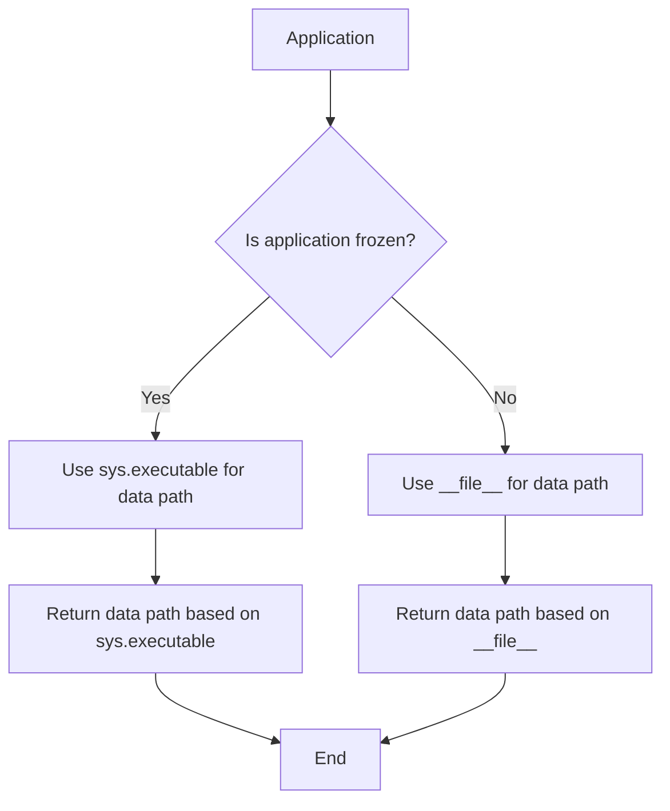
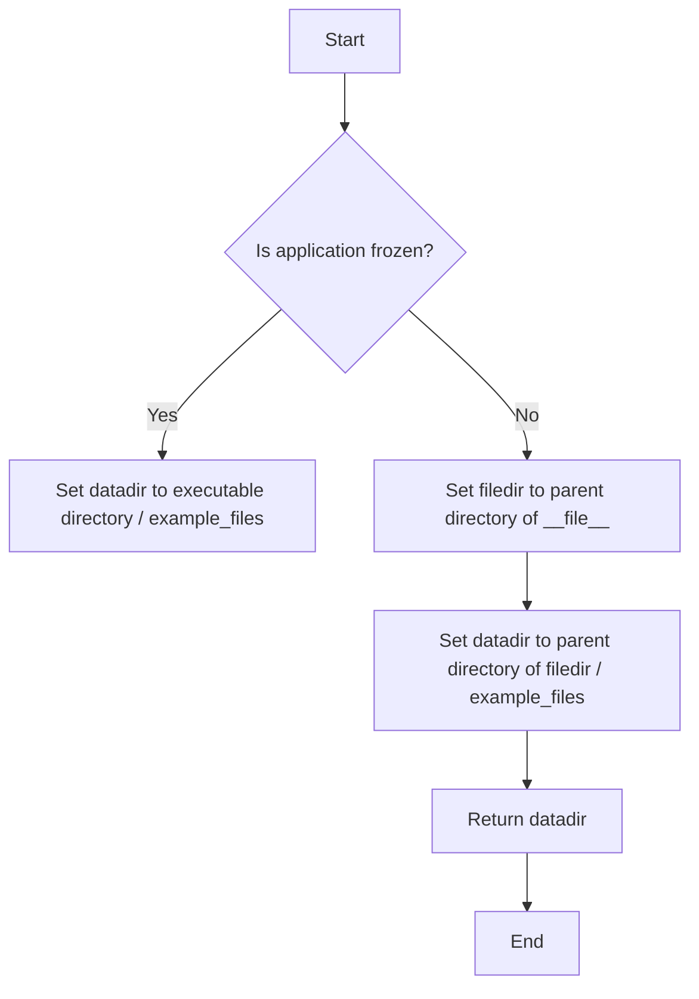
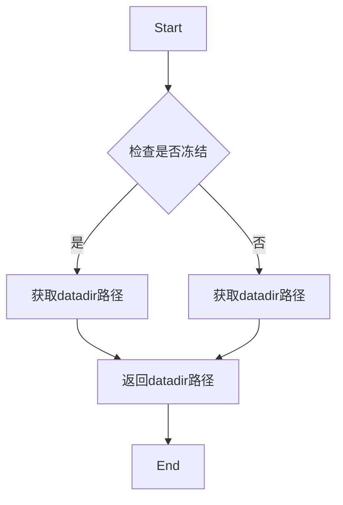

# `.\AutoGPT\autogpt_platform\backend\backend\util\data.py` 详细设计文档

This code provides utility functions to retrieve the data path based on whether the application is frozen or not.

## 整体流程



## 类结构

```
UtilityFunctions
```

## 全局变量及字段


### `sys`
    
The built-in module 'sys' provides access to some variables used or maintained by the interpreter and to functions that interact strongly with the interpreter. It is always available.

类型：`module`
    


### `os`
    
The built-in module 'os' provides a portable way of using operating system dependent functionality.

类型：`module`
    


### `pathlib`
    
The 'pathlib' module offers an object-oriented interface for working with file system paths.

类型：`module`
    


### `pathlib.Path`
    
The 'Path' class is a part of the 'pathlib' module and is used to represent file system paths. It provides methods for manipulating paths and accessing file system attributes.

类型：`class`
    


    

## 全局函数及方法


### get_frontend_path()

This function returns the path to the frontend files based on whether the application is frozen or not.

参数：

- 无参数

返回值：`pathlib.Path`，The path to the frontend files

#### 流程图



#### 带注释源码

```
def get_frontend_path() -> pathlib.Path:
    if getattr(sys, "frozen", False):
        # The application is frozen
        datadir = pathlib.Path(os.path.dirname(sys.executable)) / "example_files"
    else:
        # The application is not frozen
        # Change this bit to match where you store your data files:
        filedir = os.path.dirname(__file__)
        datadir = pathlib.Path(filedir).parent.parent.parent / "example_files"
    return pathlib.Path(datadir)
```


### get_data_path

获取数据文件的路径。

参数：

- 无

返回值：`pathlib.Path`，返回数据文件的路径。

#### 流程图



#### 带注释源码

```python
def get_data_path() -> pathlib.Path:
    if getattr(sys, "frozen", False):
        # The application is frozen
        datadir = os.path.dirname(sys.executable)
    else:
        # The application is not frozen
        # Change this bit to match where you store your data files:
        filedir = os.path.dirname(__file__)
        datadir = pathlib.Path(filedir).parent.parent
    return pathlib.Path(datadir)
```


### UtilityFunctions.get_frontend_path

This function returns the path to the frontend files based on whether the application is frozen or not.

参数：

- 无参数

返回值：`pathlib.Path`，The path to the frontend files

#### 流程图


#### 带注释源码

```
def get_frontend_path() -> pathlib.Path:
    if getattr(sys, "frozen", False):
        # The application is frozen
        datadir = pathlib.Path(os.path.dirname(sys.executable)) / "example_files"
    else:
        # The application is not frozen
        # Change this bit to match where you store your data files:
        filedir = os.path.dirname(__file__)
        datadir = pathlib.Path(filedir).parent.parent.parent / "example_files"
    return pathlib.Path(datadir)
``` 


### get_data_path()

获取数据文件的路径。

参数：

- 无

返回值：`pathlib.Path`，返回数据文件的路径。

#### 流程图


#### 带注释源码

```python
def get_data_path() -> pathlib.Path:
    if getattr(sys, "frozen", False):
        # The application is frozen
        datadir = os.path.dirname(sys.executable)
    else:
        # The application is not frozen
        # Change this bit to match where you store your data files:
        filedir = os.path.dirname(__file__)
        datadir = pathlib.Path(filedir).parent.parent
    return pathlib.Path(datadir)
```


## 关键组件


### get_frontend_path

获取前端文件路径的函数。

### get_data_path

获取数据文件路径的函数。


## 问题及建议


### 已知问题

-   {问题1}：代码中存在重复的路径获取逻辑，`get_frontend_path` 和 `get_data_path` 函数都根据是否冻结的应用来设置数据目录，但路径拼接的方式相似，存在代码重复。
-   {问题2}：函数 `get_data_path` 在非冻结状态下没有指定数据文件的具体位置，这可能导致在不同环境中路径不一致的问题。

### 优化建议

-   {建议1}：将路径获取逻辑抽象为一个单独的函数，减少代码重复，并提高代码的可维护性。
-   {建议2}：在非冻结状态下明确指定数据文件的具体位置，确保在不同环境中路径的一致性。
-   {建议3}：考虑使用配置文件或环境变量来管理路径，这样可以在不修改代码的情况下适应不同的部署环境。
-   {建议4}：对于 `get_data_path` 函数，如果数据文件总是位于 `example_files` 目录下，可以考虑直接在函数中硬编码这个路径，以简化逻辑。


## 其它


### 设计目标与约束

- 设计目标：确保代码能够在不同的运行环境中正确地定位数据文件路径。
- 约束：代码应尽可能简洁，避免使用外部依赖，同时确保跨平台兼容性。

### 错误处理与异常设计

- 错误处理：代码中未包含显式的错误处理机制，但应确保在文件路径不存在时能够优雅地处理异常。
- 异常设计：应捕获并处理`FileNotFoundError`和`AttributeError`等潜在异常。

### 数据流与状态机

- 数据流：函数`get_frontend_path`和`get_data_path`根据应用是否冻结来决定数据路径的获取方式。
- 状态机：无状态机设计，函数直接返回路径。

### 外部依赖与接口契约

- 外部依赖：代码依赖于`os`和`pathlib`模块。
- 接口契约：函数`get_frontend_path`和`get_data_path`提供统一的接口来获取数据路径，返回类型为`pathlib.Path`。

### 测试用例

- 测试用例：应编写测试用例来验证在不同运行环境（冻结和非冻结）下函数的返回值是否正确。

### 性能考量

- 性能考量：函数执行时间应尽可能短，避免不必要的文件系统操作。

### 安全考量

- 安全考量：确保文件路径的获取不会导致安全漏洞，如路径遍历攻击。

### 维护与扩展性

- 维护：代码应易于维护，易于理解。
- 扩展性：未来可能需要支持更多的数据文件路径，代码应易于扩展。


    