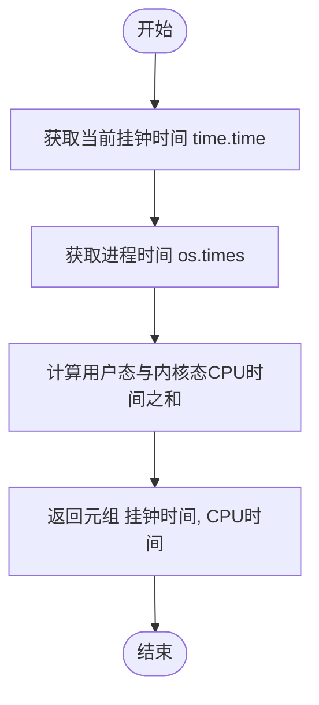
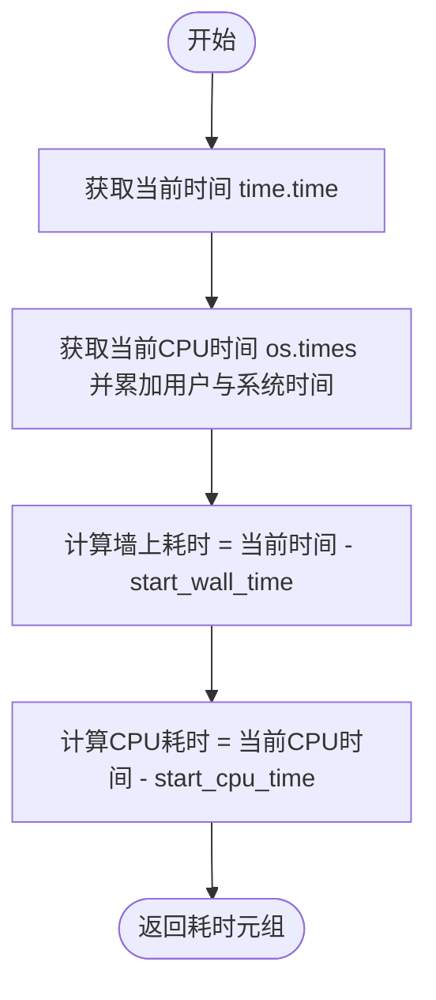
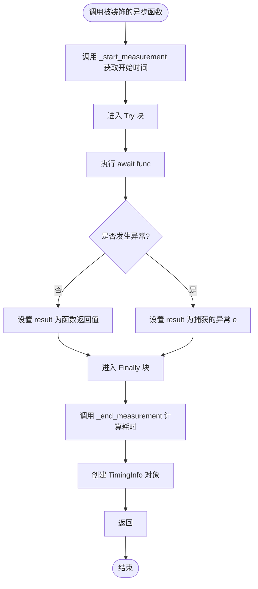
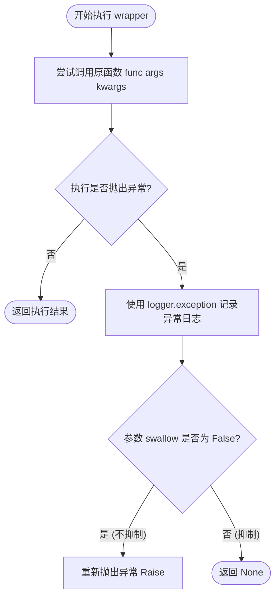
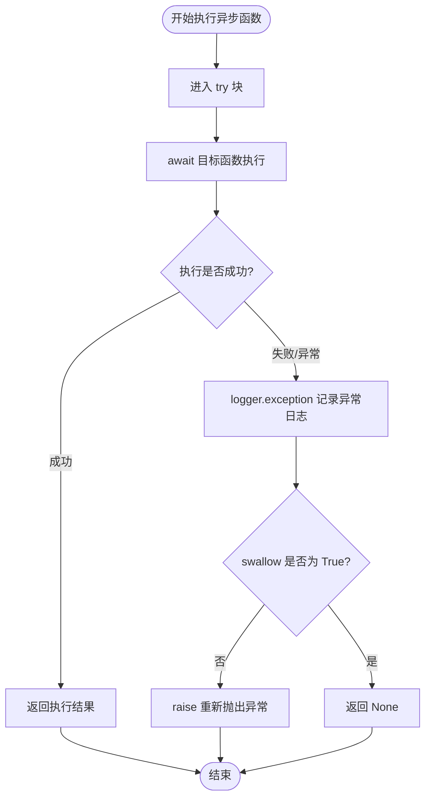

# `.\AutoGPT\autogpt_platform\backend\backend\util\decorator.py` 详细设计文档

该代码模块提供了一套用于性能监控和异常处理的工具集，主要包括基于装饰器的时间测量功能（同步与异步）和错误日志记录功能（同步与异步），并定义了用于存储时间数据的 Pydantic 模型 `TimingInfo`。

## 整体流程

```mermaid
graph TD
    A[开始: 调用被装饰的函数] --> B{装饰器类型判断}
    B -- 测量型 @time_measured --> C[调用 _start_measurement 获取起始时间]
    B -- 错误捕获型 @error_logged --> D[进入 Try 块]
    C --> E[执行原函数 func(*args, **kwargs)]
    D --> E
    E --> F{执行是否抛出异常?}
    F -- 否 --> G[获取正常返回值 result]
    F -- 是 --> H[捕获 BaseException e]
    G --> I{装饰器后续逻辑}
    H --> I
    I -- 测量型 --> J[调用 _end_measurement 计算耗时]
    J --> K[构建 TimingInfo 对象]
    K --> L[返回 (TimingInfo, result/e)]
    I -- 错误捕获型 --> M[调用 logger.exception 记录错误]
    M --> N{swallow 参数判断}
    N -- True (默认) --> O[返回 None]
    N -- False --> P[raise 重新抛出异常]
```

## 类结构

```
TimingInfo (pydantic.BaseModel)
```

## 全局变量及字段


### `logger`
    
用于记录日志的截断式记录器实例，初始化为当前模块的日志记录器。

类型：`TruncatedLogger`
    


### `P`
    
表示可调用对象参数规范的变量，用于在装饰器中保留参数类型信息。

类型：`ParamSpec`
    


### `T`
    
泛型类型变量，用于表示可调用对象的返回类型。

类型：`TypeVar`
    


### `TimingInfo.cpu_time`
    
记录函数执行所消耗的 CPU 时间。

类型：`float`
    


### `TimingInfo.wall_time`
    
记录函数执行所消耗的挂钟时间（即真实流逝时间）。

类型：`float`
    
    

## 全局函数及方法


### `_start_measurement`

用于开始性能测量，捕获当前的挂钟时间和CPU时间（用户态与内核态之和）。

参数：

无

返回值：`Tuple[float, float]`，包含当前挂钟时间（秒）和当前累计CPU时间（秒）的元组。

#### 流程图



#### 带注释源码

```python
def _start_measurement() -> Tuple[float, float]:
    # time.time(): 返回当前时间的时间戳（自纪元以来的秒数），用于测量挂钟时间
    # os.times(): 返回一个浮点数元组，包含进程时间
    # 索引0是用户态时间 (user time)
    # 索引1是系统态时间 (system time)
    # 两者相加得到总CPU时间
    return time.time(), os.times()[0] + os.times()[1]
```


### `_end_measurement`

根据传入的开始时间点，计算并返回经过的墙上时钟时间和 CPU 时间。

参数：

-  `start_wall_time`：`float`，记录的开始时刻的墙上时钟时间。
-  `start_cpu_time`：`float`，记录的开始时刻的 CPU 时间（用户态和内核态之和）。

返回值：`Tuple[float, float]`，包含两个浮点数的元组，分别代表经过的墙上时钟时间和 CPU 时间。

#### 流程图



#### 带注释源码

```python
def _end_measurement(
    start_wall_time: float, start_cpu_time: float
) -> Tuple[float, float]:
    # 获取结束时的墙上时钟时间（自纪元以来的秒数）
    end_wall_time = time.time()
    # 获取结束时的 CPU 时间
    # os.times() 返回包含 (user, system, children_user, children_system, elapsed) 的元组
    # 这里计算 user + system，即当前进程的用户态和内核态时间总和
    end_cpu_time = os.times()[0] + os.times()[1]
    # 返回 (墙上时钟耗时, CPU 耗时)
    return end_wall_time - start_wall_time, end_cpu_time - start_cpu_time
```


### `time_measured`

该装饰器用于测量同步函数的执行时间，包括 CPU 时间和墙上时钟时间（Wall-clock time），并返回包含计时信息和函数执行结果（或捕获的异常）的元组。

参数：

-   `func`：`Callable[P, T]`，待计时的同步函数对象。

返回值：`Callable[P, Tuple[TimingInfo, T | BaseException]]`，包装后的函数，调用后返回一个元组，包含计时信息（`TimingInfo`）和原函数的执行结果（如果成功）或捕获的异常对象（如果失败）。

#### 流程图

```mermaid
graph TD
    A[开始执行包装函数 wrapper] --> B[调用 _start_measurement 获取起始时间]
    B --> C[进入 try 块执行被装饰函数 func]
    C --> D{执行是否抛出异常?}
    D -- 否 --> E[保存函数返回值到 result]
    D -- 是 --> F[捕获 BaseException 到 e]
    F --> G[将异常 e 赋值给 result]
    E --> H[进入 finally 块]
    G --> H
    H --> I[调用 _end_measurement 计算耗时]
    I --> J[实例化 TimingInfo 对象 timing_info]
    J --> K[返回元组 (timing_info, result)]
```

#### 带注释源码

```python
def time_measured(
    func: Callable[P, T],
) -> Callable[P, Tuple[TimingInfo, T | BaseException]]:
    """
    Decorator to measure the time taken by a synchronous function to execute.
    """

    @functools.wraps(func)
    def wrapper(
        *args: P.args, **kwargs: P.kwargs
    ) -> Tuple[TimingInfo, T | BaseException]:
        # 1. 开始计时，记录当前墙上时钟时间和 CPU 时间
        start_wall_time, start_cpu_time = _start_measurement()
        try:
            # 2. 执行被装饰的同步函数，获取返回值
            result = func(*args, **kwargs)
        except BaseException as e:
            # 3. 如果执行过程中发生任何异常，将异常对象赋值给 result
            result = e
        finally:
            # 4. 无论是否发生异常，均结束计时并计算持续时间
            wall_duration, cpu_duration = _end_measurement(
                start_wall_time, start_cpu_time
            )
            # 5. 构建包含 CPU 时间和墙上时间的 TimingInfo 对象
            timing_info = TimingInfo(cpu_time=cpu_duration, wall_time=wall_duration)
        # 6. 返回计时信息以及函数结果或异常对象
        return timing_info, result

    return wrapper
```


### `async_time_measured`

这是一个用于测量异步函数执行时间的装饰器工厂。它会包装一个异步函数，计算并返回该函数执行期间的 CPU 时间和墙上时钟时间，同时保留原函数的返回结果或捕获的异常对象。

参数：

-   `func`：`Callable[P, Awaitable[T]]`，需要被测量执行时间的异步函数对象。

返回值：`Callable[P, Awaitable[Tuple[TimingInfo, T | BaseException]]]`，返回一个包装后的异步函数，该函数执行后会返回一个元组，其中包含执行计时信息对象 (`TimingInfo`) 和原函数的执行结果或捕获的异常对象。

#### 流程图



#### 带注释源码

```python
def async_time_measured(
    func: Callable[P, Awaitable[T]],
) -> Callable[P, Awaitable[Tuple[TimingInfo, T | BaseException]]]:
    """
    Decorator to measure the time taken by an async function to execute.
    """

    @functools.wraps(func) # 保留原函数的元数据（如 __name__, __doc__ 等）
    async def async_wrapper(
        *args: P.args, **kwargs: P.kwargs
    ) -> Tuple[TimingInfo, T | BaseException]:
        # 1. 开始计时，获取起始的墙上时钟时间和 CPU 时间
        start_wall_time, start_cpu_time = _start_measurement()
        try:
            # 2. 执行被装饰的异步函数并等待其完成
            result = await func(*args, **kwargs)
        except BaseException as e:
            # 3. 如果执行过程中抛出任何异常，捕获该异常并将其作为 result
            # 注意：这里不会重新抛出异常，而是将其作为返回值的一部分
            result = e
        finally:
            # 4. 无论是否发生异常，都结束计时并计算持续时间
            wall_duration, cpu_duration = _end_measurement(
                start_wall_time, start_cpu_time
            )
            # 5. 封装计时信息到 TimingInfo 对象中
            timing_info = TimingInfo(cpu_time=cpu_duration, wall_time=wall_duration)
        # 6. 返回计时信息和执行结果（或异常对象）的元组
        return timing_info, result

    return async_wrapper
```


### `error_logged`

这是一个用于捕获并记录函数执行期间抛出的异常的装饰器工厂。它允许配置是否在记录异常后抑制该异常（返回None），或者将其重新抛出给调用者，从而确保错误信息不会丢失。

参数：

-   `swallow`：`bool`，指定是否抑制异常。如果为 `True`，异常被记录后返回 `None`；如果为 `False`，异常被记录后继续抛出。默认值为 `True`。

返回值：`Callable[[Callable[P, T]], Callable[P, T | None]] | Callable[[Callable[P, T]], Callable[P, T]]`，返回一个装饰器函数，该装饰器应用于目标函数后，会根据 `swallow` 参数改变目标函数的返回类型签名（可能返回 `None`）或异常行为。

#### 流程图



#### 带注释源码

```python
def error_logged(
    *, swallow: bool = True
) -> (
    Callable[[Callable[P, T]], Callable[P, T | None]]
    | Callable[[Callable[P, T]], Callable[P, T]]
):
    """
    Decorator to log any exceptions raised by a function, with optional suppression.

    Args:
        swallow: Whether to suppress the exception (True) or re-raise it (False). Default is True.

    Usage:
        @error_logged()  # Default behavior (swallow errors)
        @error_logged(swallow=False)  # Log and re-raise errors
    """

    # 内部装饰器函数，接收被装饰的函数 f
    def decorator(f: Callable[P, T]) -> Callable[P, T | None]:
        @functools.wraps(f)
        # 包装函数，保持原函数的参数签名
        def wrapper(*args: P.args, **kwargs: P.kwargs) -> T | None:
            try:
                # 尝试执行原函数逻辑
                return f(*args, **kwargs)
            except BaseException as e:
                # 捕获所有异常（包括 KeyboardInterrupt 和 SystemExit）
                # 使用 logger.exception 记录详细的堆栈跟踪信息
                logger.exception(
                    f"Error when calling function {f.__name__} with arguments {args} {kwargs}: {e}"
                )
                # 如果 swallow 参数为 False（即不抑制异常），则重新抛出
                if not swallow:
                    raise
                # 如果 swallow 参数为 True（默认），则吞掉异常并返回 None
                return None

        return wrapper

    return decorator
```


### `async_error_logged`

该函数是一个装饰器工厂，用于包装异步函数，捕获其执行过程中抛出的任何异常，将其记录到日志中，并根据参数决定是抑制异常（返回None）还是重新抛出异常。

参数：

- `swallow`：`bool`，是否抑制捕获的异常。如果为 True，则异常被吞掉，函数返回 None；如果为 False，则异常被记录后重新抛出。默认为 True。

返回值：`Callable[[Callable[P, Coroutine[Any, Any, T]]], Callable[P, Coroutine[Any, Any, T | None]]] | Callable[[Callable[P, Coroutine[Any, Any, T]]], Callable[P, Coroutine[Any, Any, T]]]`，返回一个装饰器函数，该装饰器应用于异步函数后，会返回一个包装后的异步函数。

#### 流程图



#### 带注释源码

```python
def async_error_logged(*, swallow: bool = True) -> (
    Callable[
        [Callable[P, Coroutine[Any, Any, T]]],
        Callable[P, Coroutine[Any, Any, T | None]],
    ]
    | Callable[
        [Callable[P, Coroutine[Any, Any, T]]], Callable[P, Coroutine[Any, Any, T]]
    ]
):
    """
    Decorator to log any exceptions raised by an async function, with optional suppression.

    Args:
        swallow: Whether to suppress the exception (True) or re-raise it (False). Default is True.

    Usage:
        @async_error_logged()  # Default behavior (swallow errors)
        @async_error_logged(swallow=False)  # Log and re-raise errors
    """

    def decorator(
        f: Callable[P, Coroutine[Any, Any, T]],
    ) -> Callable[P, Coroutine[Any, Any, T | None]]:
        @functools.wraps(f)
        async def wrapper(*args: P.args, **kwargs: P.kwargs) -> T | None:
            try:
                # 尝试执行原始异步函数并等待结果
                return await f(*args, **kwargs)
            except BaseException as e:
                # 捕获到异常，记录详细的错误信息（包括函数名、参数和异常对象）
                logger.exception(
                    f"Error when calling async function {f.__name__} with arguments {args} {kwargs}: {e}"
                )
                # 如果 swallow 参数为 False，则重新抛出捕获到的异常
                if not swallow:
                    raise
                # 如果 swallow 参数为 True，则抑制异常，返回 None
                return None

        return wrapper

    return decorator
```


## 关键组件


### TimingInfo
基于 Pydantic 的数据模型，用于封装和存储 CPU 时间与墙钟时间。

### time_measured
用于同步函数的装饰器，用于测量函数执行耗时，并返回包含 TimingInfo 和执行结果（或异常）的元组。

### async_time_measured
用于异步函数的装饰器，用于测量协程执行耗时，并返回包含 TimingInfo 和执行结果（或异常）的元组。

### error_logged
用于同步函数的装饰器，用于捕获函数执行过程中的异常，记录日志，并根据配置决定是否吞没异常或重新抛出。

### async_error_logged
用于异步函数的装饰器，用于捕获协程执行过程中的异常，记录日志，并根据配置决定是否吞没异常或重新抛出。

### _start_measurement
辅助函数，用于记录开始测量的初始墙钟时间和 CPU 时间。

### _end_measurement
辅助函数，用于根据传入的初始时间计算并返回经过的墙钟时间和 CPU 时间。


## 问题及建议


### 已知问题

-   **异常流转方式不当**：`time_measured` 和 `async_time_measured` 捕获所有异常并将其作为返回值的一部分（`Tuple[TimingInfo, T | BaseException]`）返回。这破坏了 Python 的标准异常处理机制，导致调用方必须手动检查返回值是否为异常对象，增加了代码复杂性和出错概率。
-   **默认吞没异常的风险**：`error_logged` 和 `async_error_logged` 的默认参数 `swallow=True`。这会默认吞掉异常并返回 `None`，容易掩盖严重的运行时错误，导致程序处于未定义状态且难以调试。
-   **CPU 时间计算的线程干扰**：使用 `os.times()` 累加用户态和内核态时间时，返回的是整个进程及其所有子线程的累计 CPU 时间。如果被装饰的函数内部使用了多线程，测得的 CPU 时间将显著高于函数本身的执行开销，导致性能分析数据失真。

### 优化建议

-   **使用 `time.process_time()` 替代 `os.times()`**：建议使用 Python 3.3+ 引入的 `time.process_time()` 来获取 CPU 时间。该函数专门用于测量进程（不包含 sleep）的 CPU 时间，且 API 更简洁，跨平台表现一致，更适合高精度计时需求。
-   **调整异常处理的默认策略**：将 `error_logged` 和 `async_error_logged` 的 `swallow` 参数默认值改为 `False`。遵循“显式优于隐式”的原则，默认应抛出异常以保证错误能被上层感知，仅在明确需要容错（如清理任务）时才设置 `swallow=True`。
-   **改进计时装饰器的异常处理**：`time_measured` 应当在发生异常时记录日志并重新抛出异常，而不是将其作为返回值传递。或者，如果必须保留异常捕获逻辑，建议将异常结果封装在一个明确的 `Result` 对象中，而不是使用联合类型 `T | BaseException`，以提高类型安全性。
-   **轻量化数据结构**：`TimingInfo` 类目前继承自 `pydantic.BaseModel`。如果该模块主要用于底层工具库，且不需要序列化/验证功能，建议改用 Python 标准库的 `dataclasses.dataclass` 或 `typing.NamedTuple`，以减少对第三方库的依赖并降低初始化开销。


## 其它


### 设计目标与约束

该模块旨在通过装饰器模式实现对同步及异步函数执行过程的非侵入式监控。设计目标包括：1. 提供高精度的 CPU 时间和 Wall Clock 时间统计，辅助性能分析；2. 提供统一的异常捕获与日志记录机制，简化错误处理流程。设计约束如下：1. 必须保留原函数的元数据（如 `__name__`, `__doc__`），利用 `functools.wraps` 实现透明包装；2. 装饰器本身应引入极小的运行时开销，避免显著影响被测量函数的性能；3. 需严格区分同步与异步场景，确保类型提示的准确性。

### 错误处理与异常设计

本模块采用了差异化的异常处理策略：

1.  **时间测量装饰器 (`time_measured`, `async_time_measured`)**：
    *   **捕获范围**：捕获所有继承自 `BaseException` 的错误。
    *   **处理策略**：不吞没异常，也不中断程序流。捕获的异常对象会被作为返回元组的第二个元素返回，而正常的函数结果也会作为第二个元素返回。这意味着调用方必须检查返回结果的类型来判断执行是否成功。
    *   **资源释放**：使用 `try...finally` 结构，确保无论是否发生异常，结束时间的测量和 `TimingInfo` 对象的构建都会被执行。

2.  **错误日志装饰器 (`error_logged`, `async_error_logged`)**：
    *   **捕获范围**：同样捕获所有 `BaseException`。
    *   **处理策略**：使用 `logger.exception` 记录详细的堆栈跟踪信息和参数上下文。
    *   **控制流**：根据 `swallow` 参数决定异常的命运。若 `swallow=True`（默认），异常被吞没，函数返回 `None`；若 `swallow=False`，捕获的异常会被重新抛出，保持原有的异常传播行为。

### 数据流与状态机

1.  **数据流**：
    *   **输入流**：外部调用传入函数参数 `*args`, `**kwargs`。
    *   **处理流**：
        *   进入装饰器上下文 -> 记录起始时间戳 (`start_wall_time`, `start_cpu_time`)。
        *   执行原函数逻辑 -> 获取返回值或捕获异常。
        *   记录结束时间戳 -> 计算时间差 -> 实例化 `TimingInfo` 对象。
        *   若为错误日志装饰器，则在捕获异常分支写入日志。
    *   **输出流**：
        *   测量装饰器输出：`(TimingInfo, Result | Exception)`。
        *   日志装饰器输出：`Result | None`。

2.  **状态机**：
    *   虽然函数是无状态的，但单次调用经历以下状态：
    *   `IDLE` (空闲)：函数未调用。
    *   `MONITORING` (监控中)：计时器已启动，原函数正在执行或等待中。
    *   `COMPLETED` (完成)：计时器停止，结果或异常已封装，上下文清理完毕，准备返回。

### 外部依赖与接口契约

1.  **外部依赖**：
    *   `pydantic.BaseModel`：用于定义 `TimingInfo` 数据结构，提供数据校验能力。
    *   `backend.util.logging.TruncatedLogger`：项目内部的日志工具，用于执行具体的日志输出操作，可能包含截断长字符串等特殊逻辑。
    *   Python 标准库：`time`, `os` (用于获取系统时间), `logging`, `functools`。

2.  **接口契约**：
    *   **`TimingInfo` 类**：必须包含 `cpu_time: float` 和 `wall_time: float` 两个字段，均为浮点数类型，单位为秒。
    *   **`time_measured`**：强制将原函数签名 `Callable[P, T]` 修改为 `Callable[P, Tuple[TimingInfo, T | BaseException]]`。
    *   **`async_time_measured`**：强制将原函数签名修改为 `Callable[P, Awaitable[Tuple[TimingInfo, T | BaseException]]]`。
    *   **`error_logged`**：根据 `swallow` 参数，返回类型为 `Callable[P, T | None]` 或 `Callable[P, T]`。

### 线程安全与并发模型

*   **局部变量隔离**：装饰器内部的计时逻辑仅依赖局部变量（`start_*`, `end_*`），不涉及共享状态的修改，因此在多线程环境下是线程安全的。
*   **异步兼容性**：专门提供了 `async_time_measured` 和 `async_error_logged`，使用 `async/await` 语法，确保不会阻塞事件循环。在异步上下文中，CPU 时间 (`os.times`) 的测量包含当前进程所有线程的累计时间，这是 `os` 模块本身的特性。
*   **日志记录**：依赖的 `TruncatedLogger` 和底层的 `logging` 模块通常是线程安全的，因此并发写入日志不会导致数据错乱。

### 扩展性与未来规划

*   **自定义上下文**：目前日志格式是硬编码的，未来可扩展为支持格式化字符串或自定义回调函数来处理错误日志内容。
*   **阈值报警**：在 `time_measured` 基础上，可增加 `timeout` 或 `max_duration` 参数，当执行时间超过阈值时自动触发警告或抛出特定异常。
*   **指标上报**：目前仅返回数据，未来可集成 Metrics 上报功能（如 Prometheus），将计时数据自动推送到监控系统。

    