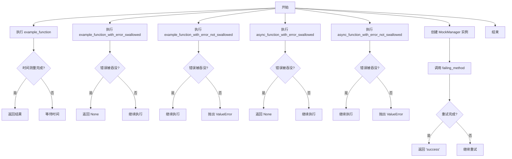
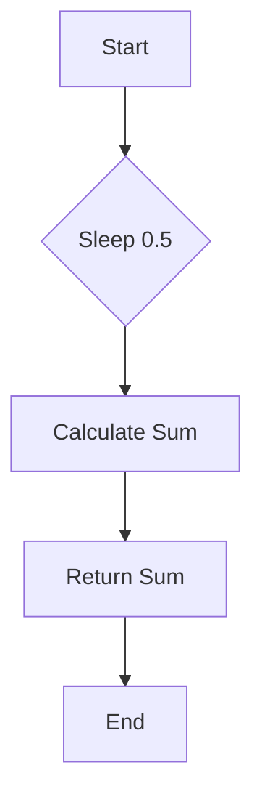
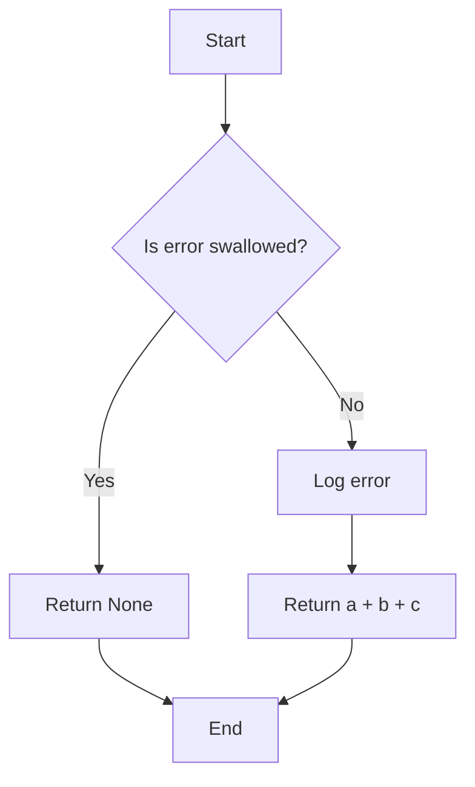
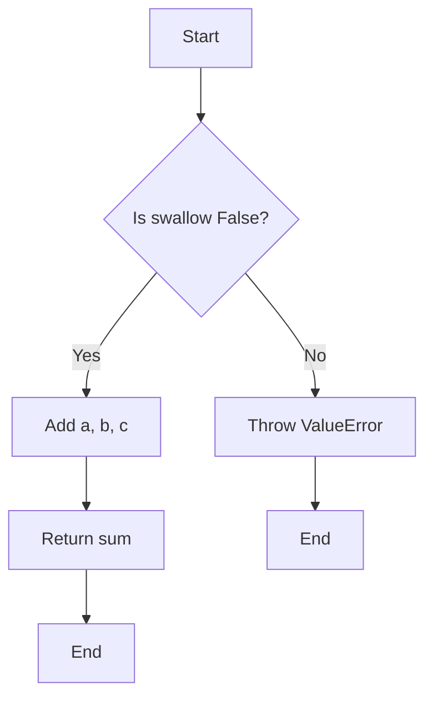
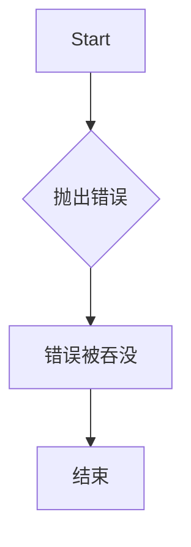
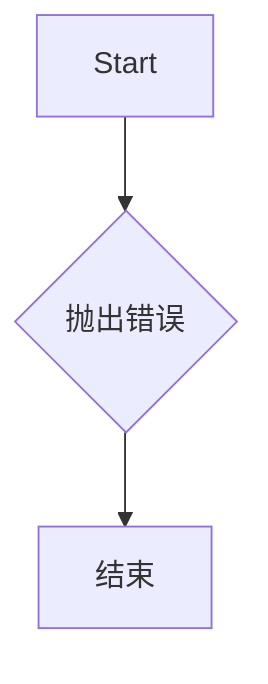
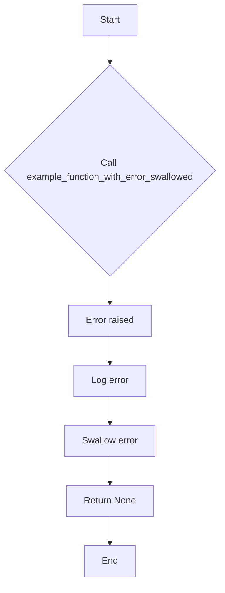
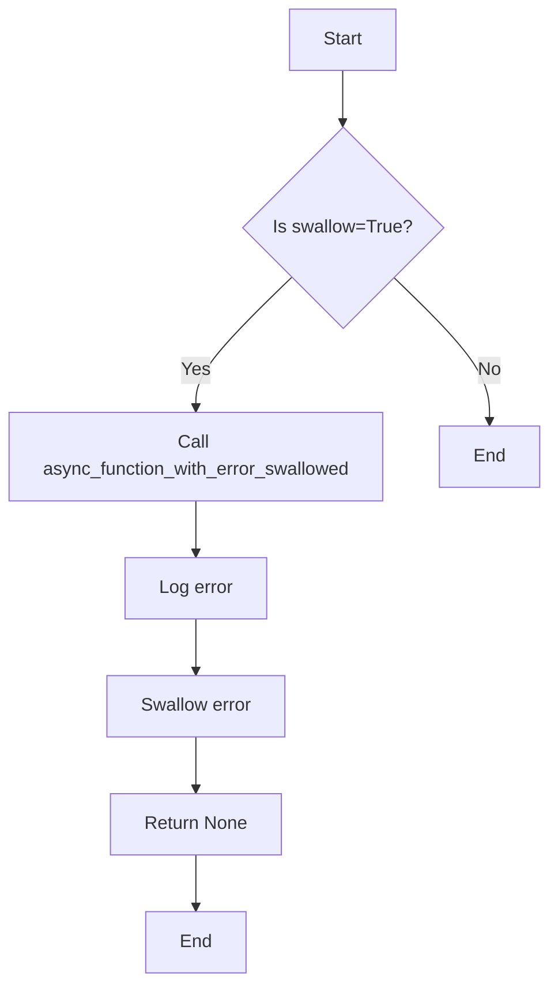
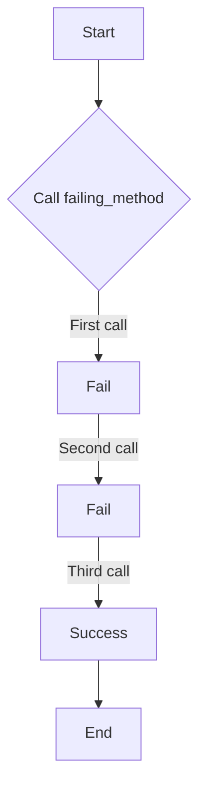

# `.\AutoGPT\autogpt_platform\backend\backend\util\decorator_test.py` 详细设计文档

This code provides utility functions for measuring execution time, handling errors with logging, and retrying operations on failure. It includes synchronous and asynchronous functions with decorators for these purposes, as well as tests for these functionalities.

## 整体流程



## 类结构

```
MockManager (类)
├── failing_method (方法)
```

## 全局变量及字段


### `time`
    
The built-in time module for time-related functions.

类型：`module`
    


### `pytest`
    
The pytest module for testing purposes.

类型：`module`
    


### `async_error_logged`
    
Decorator for logging async errors.

类型：`function`
    


### `error_logged`
    
Decorator for logging errors.

类型：`function`
    


### `time_measured`
    
Decorator for measuring execution time.

类型：`function`
    


### `continuous_retry`
    
Decorator for retrying a function on exception.

类型：`function`
    


### `MockManager`
    
Mock class for testing purposes.

类型：`class`
    


    

## 全局函数及方法


### example_function

计算三个整数的和。

参数：

- a：`int`，第一个整数
- b：`int`，第二个整数
- c：`int`，第三个整数

返回值：`int`，三个整数的和

#### 流程图



#### 带注释源码

```python
@time_measured
def example_function(a: int, b: int, c: int) -> int:
    time.sleep(0.5)  # 模拟耗时操作
    return a + b + c  # 计算和并返回
```


### example_function_with_error_swallowed

This function raises a ValueError and has the error logged and swallowed due to the `@error_logged(swallow=True)` decorator.

参数：

- a：`int`，The first integer parameter.
- b：`int`，The second integer parameter.
- c：`int`，The third integer parameter.

返回值：`int`，None if the error is swallowed, otherwise the sum of a, b, and c.

#### 流程图



#### 带注释源码

```python
@error_logged(swallow=True)
def example_function_with_error_swallowed(a: int, b: int, c: int) -> int:
    # This function raises a ValueError and has the error logged and swallowed.
    raise ValueError("This error should be swallowed")
```


### example_function_with_error_not_swallowed

This function adds three integers together and raises a ValueError if the swallow parameter is set to False.

参数：

- a：`int`，The first integer to add.
- b：`int`，The second integer to add.
- c：`int`，The third integer to add.

返回值：`int`，The sum of the three integers.

#### 流程图



#### 带注释源码

```python
@error_logged(swallow=False)
def example_function_with_error_not_swallowed(a: int, b: int, c: int) -> int:
    # Sleep to simulate a time-consuming operation
    time.sleep(0.5)
    # Check if the swallow parameter is False
    if not swallow:
        # Raise a ValueError if swallow is False
        raise ValueError("This error should NOT be swallowed")
    # Add the three integers together
    return a + b + c
```


### async_function_with_error_swallowed

异步函数，用于测试错误处理装饰器是否正确吞没错误。

参数：

- 无参数

返回值：`int`，无返回值，因为函数抛出错误并被装饰器处理。

#### 流程图



#### 带注释源码

```python
@async_error_logged(swallow=True)
async def async_function_with_error_swallowed() -> int:
    # 抛出错误
    raise ValueError("This async error should be swallowed")
```


### async_function_with_error_not_swallowed

异步函数，当抛出错误时不会吞咽错误。

参数：

- 无

返回值：`None`，当函数抛出错误时，不会返回任何值。

#### 流程图



#### 带注释源码

```python
@async_error_logged(swallow=False)
async def async_function_with_error_not_swallowed() -> int:
    # 抛出一个ValueError，该错误不会被吞咽
    raise ValueError("This async error should NOT be swallowed")
```


### test_timer_decorator

测试 `time_measured` 装饰器是否正确测量执行时间。

参数：

- `example_function`：`function`，一个接受三个整数参数并返回一个整数的函数
- `1`：`int`，第一个整数参数
- `2`：`int`，第二个整数参数
- `3`：`int`，第三个整数参数

返回值：`None`，无返回值

#### 流程图

```mermaid
graph TD
    A[Start] --> B[Call example_function(1, 2, 3)]
    B --> C[Measure time]
    C --> D[Assert cpu_time >= 0]
    D --> E[Assert wall_time >= 0.4]
    E --> F[Assert result == 6]
    F --> G[End]
```

#### 带注释源码

```python
def test_timer_decorator():
    """Test that the time_measured decorator correctly measures execution time."""
    info, res = example_function(1, 2, 3)
    assert info.cpu_time >= 0
    assert info.wall_time >= 0.4
    assert res == 6
```


### test_error_decorator_swallow_true

This function tests that the `error_logged` decorator with `swallow=True` logs and swallows errors.

参数：

- `example_function_with_error_swallowed`：`function`，The function to be tested with the `error_logged` decorator applied, which raises a `ValueError`.

返回值：`None`，The function returns `None` when the error is swallowed.

#### 流程图



#### 带注释源码

```python
def test_error_decorator_swallow_true():
    """Test that error_logged(swallow=True) logs and swallows errors."""
    res = example_function_with_error_swallowed(1, 2, 3)
    assert res is None
```


### test_error_decorator_swallow_false

This function tests that the `error_logged` decorator with `swallow=False` logs the error and re-raises it.

参数：

-  `self`：`pytest.fixture`，The test fixture for the test function.
-  `example_function_with_error_not_swallowed`：`function`，The function to be tested with the `error_logged` decorator applied.

返回值：`None`，The result of the `example_function_with_error_not_swallowed` function when the `error_logged` decorator is applied with `swallow=False`.

#### 流程图

```mermaid
graph TD
    A[Start] --> B{Call example_function_with_error_not_swallowed}
    B --> C{Apply error_logged(swallow=False)}
    C --> D[Error raised]
    D --> E{Check if ValueError is raised}
    E --> F[End]
```

#### 带注释源码

```python
def test_error_decorator_swallow_false():
    """Test that error_logged(swallow=False) logs errors but re-raises them."""
    with pytest.raises(ValueError, match="This error should NOT be swallowed"):
        example_function_with_error_not_swallowed(1, 2, 3)
``` 


### test_async_error_decorator_swallow_true

This function tests that the `async_error_logged` decorator with `swallow=True` logs and swallows errors in an asynchronous function.

参数：

- `run_test`：`async def`，A coroutine that calls the asynchronous function with the `async_error_logged` decorator and `swallow=True`.

返回值：`res`：`int`，The result of the asynchronous function call.

#### 流程图



#### 带注释源码

```python
def test_async_error_decorator_swallow_true():
    """Test that async_error_logged(swallow=True) logs and swallows errors."""
    import asyncio

    async def run_test():
        res = await async_function_with_error_swallowed()
        return res

    res = asyncio.run(run_test())
    assert res is None
```


### test_async_error_decorator_swallow_true

This function tests that the `async_error_logged` decorator with `swallow=True` logs and swallows errors in an asynchronous function.

参数：

- `run_test`：`async def`，A coroutine that calls the asynchronous function with `async_error_logged` decorator and `swallow=True`.

返回值：`res`：`int`，The result of the asynchronous function call.

#### 流程图


#### 带注释源码

```python
def test_async_error_decorator_swallow_true():
    """Test that async_error_logged(swallow=True) logs and swallows errors."""
    import asyncio

    async def run_test():
        res = await async_function_with_error_swallowed()
        return res

    res = asyncio.run(run_test())
    assert res is None
```


### test_continuous_retry_basic

测试 `continuous_retry` 装饰器在异常发生时是否能够正确重试。

参数：

- `MockManager`：`MockManager` 类的实例，用于模拟方法调用。

返回值：`None`，表示测试通过。

#### 流程图

```mermaid
graph TD
    A[Start] --> B{Is call_count <= 2?}
    B -- Yes --> C[Call failing_method]
    B -- No --> D[Call failing_method]
    C --> E[Is call_count <= 2?]
    D --> F[Is call_count <= 2?]
    E -- Yes --> C
    E -- No --> G[Return "success"]
    F -- Yes --> D
    F -- No --> G
```

#### 带注释源码

```python
def test_continuous_retry_basic():
    """Test that continuous_retry decorator retries on exception."""

    class MockManager:
        def __init__(self):
            self.call_count = 0

        @continuous_retry(retry_delay=0.01)
        def failing_method(self):
            self.call_count += 1
            if self.call_count <= 2:
                # Fail on first two calls
                raise RuntimeError("Simulated failure")
            return "success"

    mock_manager = MockManager()

    # Should retry and eventually succeed
    result = mock_manager.failing_method()
    assert result == "success"
    assert mock_manager.call_count == 3  # Failed twice, succeeded on third
``` 


### MockManager.failing_method

MockManager类中的failing_method方法用于模拟一个可能会失败的方法，它会在前两次调用时抛出异常，并在第三次调用时成功返回。

参数：

- 无

返回值：`str`，"success"

#### 流程图



#### 带注释源码

```python
class MockManager:
    def __init__(self):
        self.call_count = 0

    @continuous_retry(retry_delay=0.01)
    def failing_method(self):
        self.call_count += 1
        if self.call_count <= 2:
            # Fail on first two calls
            raise RuntimeError("Simulated failure")
        return "success"
```


## 关键组件


### 张量索引与惰性加载

张量索引与惰性加载是处理大型数据集时提高效率的关键技术，它允许在需要时才计算数据，从而减少内存消耗和提高处理速度。

### 反量化支持

反量化支持是优化代码性能的一种策略，它通过将某些操作转换为更高效的执行方式来减少计算量。

### 量化策略

量化策略是针对机器学习模型进行优化的一种方法，通过减少模型中使用的数值精度来降低模型的复杂性和计算需求。


## 问题及建议


### 已知问题

-   **代码重复**：`example_function` 和 `example_function_with_error_swallowed`/`example_function_with_error_not_swallowed`/`async_function_with_error_swallowed`/`async_function_with_error_not_swallowed` 函数具有相似的结构和功能，但实现略有不同。这种代码重复可能导致维护困难。
-   **测试代码与生产代码混合**：测试函数（如 `test_timer_decorator`、`test_error_decorator_swallow_true` 等）与生产代码（如 `example_function`）混合在同一文件中，这可能会影响代码的可读性和可维护性。
-   **异常处理**：虽然使用了装饰器来处理错误，但异常处理的方式可能不够灵活，例如，`error_logged` 和 `async_error_logged` 装饰器中的 `swallow` 参数可能需要更细粒度的控制。

### 优化建议

-   **重构代码以减少重复**：将共享的逻辑提取到单独的函数或类中，以减少代码重复。
-   **分离测试代码**：将测试代码移动到单独的测试文件中，以提高代码的可读性和可维护性。
-   **增强异常处理**：考虑使用更灵活的异常处理策略，例如，允许装饰器返回自定义的错误信息或执行特定的错误处理逻辑。
-   **使用更高级的测试框架功能**：例如，使用 `pytest` 的 `mock` 功能来模拟 `time.sleep` 和 `failing_method` 的行为，而不是实际调用它们。
-   **代码注释**：为代码添加适当的注释，特别是对于装饰器和测试函数，以帮助其他开发者理解其用途和预期行为。


## 其它


### 设计目标与约束

- 设计目标：
  - 实现一个可重试的装饰器，用于自动重试方法调用。
  - 实现一个错误日志装饰器，用于记录和可选地吞没错误。
  - 实现一个异步错误日志装饰器，用于异步环境中记录和可选地吞没错误。
  - 提供单元测试以确保装饰器的正确性和功能。
- 约束：
  - 装饰器应不修改原始函数的签名。
  - 异步装饰器应与异步函数兼容。
  - 装饰器应提供足够的配置选项以满足不同场景的需求。

### 错误处理与异常设计

- 错误处理：
  - `error_logged` 和 `async_error_logged` 装饰器允许通过 `swallow` 参数控制是否吞没错误。
  - `continuous_retry` 装饰器在捕获到异常时会自动重试，直到成功或达到最大重试次数。
- 异常设计：
  - 所有装饰器都应捕获并处理特定的异常，确保程序的健壮性。
  - 异常信息应包含足够的信息，以便于调试和问题追踪。

### 数据流与状态机

- 数据流：
  - 函数调用通过装饰器进行，装饰器处理函数执行过程中的错误和计时。
  - 异步函数通过异步装饰器进行，装饰器处理异步执行过程中的错误和计时。
- 状态机：
  - 无状态机设计，装饰器仅处理函数执行过程中的特定事件。

### 外部依赖与接口契约

- 外部依赖：
  - `pytest` 用于单元测试。
  - `time` 用于计时。
  - `asyncio` 用于异步操作。
- 接口契约：
  - 装饰器接口简单，易于使用和理解。
  - 装饰器应提供明确的文档说明其行为和参数。


    