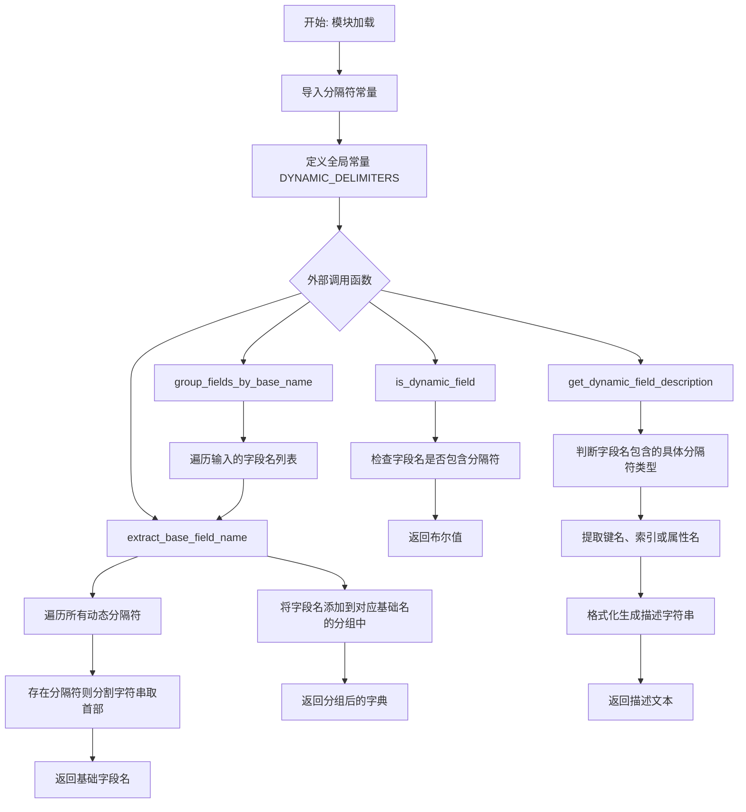
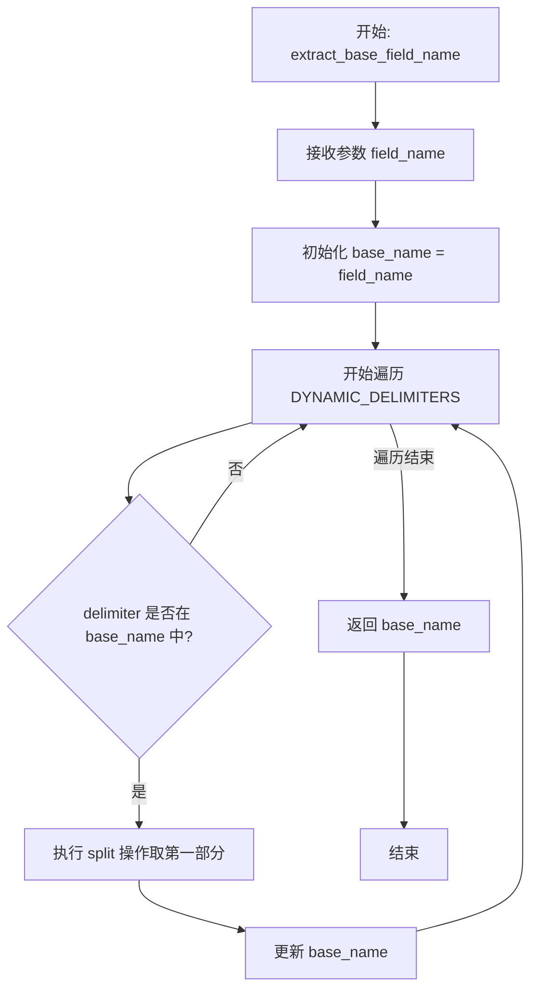
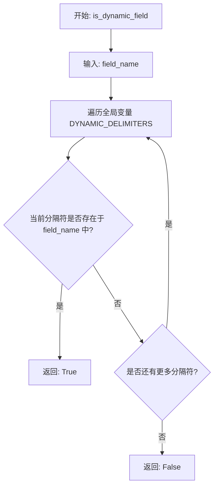

# `.\AutoGPT\autogpt_platform\backend\backend\util\dynamic_fields.py` 详细设计文档

该模块为 AutoGPT 平台提供了一系列用于处理动态字段名的实用工具函数，旨在支持通过特定分隔符（如 `_#_`、`_$_`、`@_`）来解析和操作复杂数据结构中的字典键、列表索引和对象属性。主要功能包括提取基础字段名、判断字段是否为动态字段、生成动态字段的描述文本以及按基础字段名对字段列表进行分组。

## 整体流程



## 类结构

```
Module: dynamic_fields_utils.py
├── Constants
│   └── DYNAMIC_DELIMITERS
└── Functions
    ├── extract_base_field_name
    ├── is_dynamic_field
    ├── get_dynamic_field_description
    └── group_fields_by_base_name
```

## 全局变量及字段


### `DYNAMIC_DELIMITERS`
    
包含所有支持的动态字段定界符（字典键、列表索引、对象属性）的元组

类型：`tuple`
    


    

## 全局函数及方法


### `extract_base_field_name`

该函数的核心功能是从一个可能包含动态定界符（如 `_#_`、`_$_`、`_@_`）的复杂字段名中提取出基础字段名称，剥离掉用于表示字典键、列表索引或对象属性的后缀部分。

参数：

-  `field_name`：`str`，可能包含动态定界符的字段名（例如 "values_#_name"）

返回值：`str`，移除了所有动态后缀后的基础字段名（例如 "values"）

#### 流程图



#### 带注释源码

```python
def extract_base_field_name(field_name: str) -> str:
    """
    Extract the base field name from a dynamic field name.

    Examples:
        extract_base_field_name("values_#_name") → "values"
        extract_base_field_name("items_$_0") → "items"
        extract_base_field_name("obj_@_attr") → "obj"
        extract_base_field_name("regular_field") → "regular_field"

    Args:
        field_name: The field name that may contain dynamic delimiters

    Returns:
        The base field name without any dynamic suffixes
    """
    # 1. 初始化 base_name 为输入的完整字段名
    base_name = field_name
    
    # 2. 遍历所有预定义的动态定界符 (DICT_SPLIT, LIST_SPLIT, OBJC_SPLIT)
    for delimiter in DYNAMIC_DELIMITERS:
        # 3. 检查当前 base_name 中是否存在该定界符
        if delimiter in base_name:
            # 4. 如果存在，使用 split 方法按定界符分割字符串，并取第一个元素（即定界符之前的部分）
            # 这有效地剥离了动态后缀（如 _#_name）
            base_name = base_name.split(delimiter)[0]
            
    # 5. 返回处理后的基础名称
    return base_name
```


### `is_dynamic_field`

检查给定的字段名是否包含任何用于字典键、列表索引或对象属性访问的动态分隔符。

参数：

-  `field_name`：`str`，需要检查的字段名

返回值：`bool`，如果字段名包含任何动态分隔符（`_#_`, `_$_`, `@_`）则返回 True，否则返回 False

#### 流程图



#### 带注释源码

```python
def is_dynamic_field(field_name: str) -> bool:
    """
    Check if a field name contains dynamic delimiters.

    Args:
        field_name: The field name to check

    Returns:
        True if the field contains any dynamic delimiters, False otherwise
    """
    # 使用 any() 函数检查 field_name 中是否包含 DYNAMIC_DELIMITERS 中的任意一个分隔符
    # DYNAMIC_DELIMITERS 包含: DICT_SPLIT, LIST_SPLIT, OBJC_SPLIT
    return any(delimiter in field_name for delimiter in DYNAMIC_DELIMITERS)
```


### `get_dynamic_field_description`

根据基础字段名和完整的动态字段名生成描述字符串，解析字段结构（字典、列表或对象）并提取具体的键、索引或属性信息以构建可读描述。

参数：

-  `base_field_name`：`str`，基础字段名（例如 "values"）
-  `original_field_name`：`str`，包含动态分隔符的完整字段名（例如 "values_#_name"）

返回值：`str`，解释该动态字段所代表内容的描述字符串（例如 "Dictionary value for values['name']"）

#### 流程图

```mermaid
flowchart TD
    A([开始]) --> B{original_field_name 包含 DICT_SPLIT?}
    B -- 是 --> C[提取键部分 key_part]
    C --> D[返回<br/>Dictionary value for base_field_name['key_part']]
    B -- 否 --> E{original_field_name 包含 LIST_SPLIT?}
    E -- 是 --> F[提取索引部分 index_part]
    F --> G[返回<br/>List item for base_field_name[index_part]]
    E -- 否 --> H{original_field_name 包含 OBJC_SPLIT?}
    H -- 是 --> I[提取属性部分 attr_part]
    I --> J[返回<br/>Object attribute for base_field_name.attr_part]
    H -- 否 --> K[返回<br/>Dynamic value for base_field_name]
```

#### 带注释源码

```python
def get_dynamic_field_description(
    base_field_name: str, original_field_name: str
) -> str:
    """
    Generate a description for a dynamic field based on its base field and structure.

    Args:
        base_field_name: The base field name (e.g., "values")
        original_field_name: The full dynamic field name (e.g., "values_#_name")

    Returns:
        A descriptive string explaining what this dynamic field represents
    """
    # 检查是否包含字典分隔符 (如 "_#_")
    if DICT_SPLIT in original_field_name:
        # 分割字符串获取键部分：例如 "values_#_name" -> "name"
        # 逻辑：先按完整分隔符分割取后半部分，再按分隔符首字符分割取前半部分（通常是为了处理嵌套或确保干净提取）
        key_part = (
            original_field_name.split(DICT_SPLIT, 1)[1].split(DICT_SPLIT[0])[0]
            if DICT_SPLIT in original_field_name
            else "key"
        )
        return f"Dictionary value for {base_field_name}['{key_part}']"
    # 检查是否包含列表分隔符 (如 "_$_")
    elif LIST_SPLIT in original_field_name:
        # 分割字符串获取索引部分：例如 "items_$_0" -> "0"
        index_part = (
            original_field_name.split(LIST_SPLIT, 1)[1].split(LIST_SPLIT[0])[0]
            if LIST_SPLIT in original_field_name
            else "index"
        )
        return f"List item for {base_field_name}[{index_part}]"
    # 检查是否包含对象属性分隔符 (如 "_@_")
    elif OBJC_SPLIT in original_field_name:
        # 分割字符串获取属性部分：例如 "obj_@_attr" -> "attr"
        attr_part = (
            original_field_name.split(OBJC_SPLIT, 1)[1].split(OBJC_SPLIT[0])[0]
            if OBJC_SPLIT in original_field_name
            else "attr"
        )
        return f"Object attribute for {base_field_name}.{attr_part}"
    else:
        # 默认返回兜底描述
        return f"Dynamic value for {base_field_name}"
```


### `group_fields_by_base_name`

该函数用于将一个可能包含动态分隔符的字段名列表按其基础名称进行分组，返回一个字典，其中键是提取的基础字段名，值是对应的原始字段名列表。

参数：

-   `field_names`：`list[str]`，包含可能包含动态分隔符（例如 `values_#_name`）的字段名的列表。

返回值：`dict[str, list[str]]`，一个字典，映射基础字段名到属于该基础名称的原始字段名列表。

#### 流程图

```mermaid
flowchart TD
    A([开始]) --> B[初始化空字典 grouped]
    B --> C{遍历 field_names 列表}
    C --> D[获取当前 field_name]
    D --> E[调用 extract_base_field_name 获取 base_name]
    E --> F{base_name 是否已存在于 grouped 中?}
    F -- 否 --> G[在 grouped 中为 base_name 初始化空列表]
    F -- 是 --> H[保持当前列表不变]
    G --> I[将 field_name 追加到 grouped[base_name] 列表]
    H --> I
    I --> C
    C -- 遍历结束 --> J([返回 grouped])
    J --> K([结束])
```

#### 带注释源码

```python
def group_fields_by_base_name(field_names: list[str]) -> dict[str, list[str]]:
    """
    Group a list of field names by their base field names.

    Args:
        field_names: List of field names that may contain dynamic delimiters

    Returns:
        Dictionary mapping base field names to lists of original field names

    Example:
        group_fields_by_base_name([
            "values_#_name",
            "values_#_age",
            "items_$_0",
            "regular_field"
        ])
        → {
            "values": ["values_#_name", "values_#_age"],
            "items": ["items_$_0"],
            "regular_field": ["regular_field"]
        }
    """
    # 初始化一个空字典，用于存储分组后的结果
    grouped = {}
    
    # 遍历输入的每一个字段名
    for field_name in field_names:
        # 提取当前字段名的基础名称（去除动态后缀部分）
        base_name = extract_base_field_name(field_name)
        
        # 如果该基础名称在字典中尚不存在，则初始化一个空列表
        if base_name not in grouped:
            grouped[base_name] = []
        
        # 将原始字段名追加到对应基础名称的列表中
        grouped[base_name].append(field_name)
        
    # 返回包含分组结果的字典
    return grouped
```


## 关键组件


### Dynamic Delimiters Definition
定义了一组常量，用于在字段名中区分字典键、列表索引和对象属性访问的特殊分隔符。

### Base Field Name Extraction
提供从包含动态后缀的字段名中剥离路径信息，从而提取出基础字段名称的核心逻辑。

### Dynamic Field Validation
用于检测给定字段名是否包含任何预定义动态分隔符，从而判断其是否为动态字段的验证机制。

### Field Description Generation
根据字段名中的分隔符类型（字典、列表或对象），自动生成具有语义的人类可读描述字符串。

### Field Grouping Strategy
将包含不同动态后缀的字段名归类到同一基础字段名下的聚合逻辑，便于统一处理相关字段。


## 问题及建议


### 已知问题

-   **键名提取逻辑错误导致截断**：在 `get_dynamic_field_description` 函数中，提取字典键、列表索引或对象属性时使用了 `.split(DICT_SPLIT[0])[0]` 的逻辑。由于分隔符（如 `_#_`）的第一个字符通常是 `_`，这意味着如果键/属性本身包含下划线（例如 `values_#_first_name`），提取出的部分只会是 `first` 而非完整的 `first_name`，导致生成的描述信息不准确。
-   **冗余的条件判断**：`get_dynamic_field_description` 函数中的 `if/elif` 结构内部，再次检查了 `if DICT_SPLIT in original_field_name`。由于外层已经是 `if/elif` 分支，该内层判断完全是冗余的。
-   **基础名称提取的循环逻辑低效且晦涩**：`extract_base_field_name` 通过循环遍历所有分隔符并反复截断字符串来获取基础名称。虽然逻辑在当前场景下大致正确，但这种写法依赖于字符串的副作用修改，代码可读性较差，且在极端情况下（如字段名包含部分分隔符序列）可能产生非预期的行为。
-   **缺乏空值或非字符串输入的防御性检查**：函数参数虽标注了类型，但未处理 `None` 或空字符串的情况。如果传入空字符串，`split` 操作虽不会报错，但可能返回无意义的结果，导致下游逻辑混乱。

### 优化建议

-   **采用正则表达式统一解析逻辑**：建议引入 `re` 模块，利用正则表达式一次性匹配所有分隔符。例如，使用 `re.split(r"(_#_|_\$_|@_)", field_name)` 来分割字段名。这不仅能提高代码的执行效率，还能更准确地定位基础名称和动态部分，避免循环截断带来的潜在风险。
-   **修复并规范化字段描述的提取逻辑**：修正 `get_dynamic_field_description` 中的截断 Bug。应直接取分隔符后的剩余部分作为键/索引/属性（或者取直到下一个分隔符的部分），而不是简单地按分隔符的首字符分割。建议使用正则捕获组来精确提取动态部分的内容。
-   **引入 `defaultdict` 优化分组性能**：在 `group_fields_by_base_name` 函数中，使用 `collections.defaultdict(list)` 替代手动检查键是否存在并初始化列表的逻辑。这样可以减少代码行数，提高代码的可读性和运行效率。
-   **添加常量定义与本地化**：代码中直接返回了英文的描述字符串（如 "Dictionary value for..."）。建议将这些字符串提取为模块常量，并结合国际化（i18n）方案（如 `gettext`）进行管理，以支持多语言环境。
-   **增强输入验证与错误处理**：在函数入口处增加对输入参数的校验，确保 `field_name` 是非空字符串。对于非法输入，应抛出明确的异常（如 `ValueError`）或返回特定的错误状态，而不是静默返回错误结果。


## 其它


### 设计目标与约束

**设计目标：**
该模块旨在提供轻量级、高性能的字符串解析工具，用于支持 AutoGPT Platform 中的动态字段引用机制。其核心目标是在不引入完整 JSONPath 或类似复杂解析库的前提下，实现对嵌套数据结构（字典、列表、对象）的扁平化访问。

**设计约束：**
1.  **分隔符唯一性**：依赖特定的硬编码分隔符（`_#_`, `_$_`, `@_`），这些字符组合不能出现在合法的基础字段名称中，否则会导致解析歧义。
2.  **字符串处理限制**：模块仅执行字符串层面的切片操作，不进行实际的运行时数据访问或类型验证，确保解析逻辑的纯净性和无副作用。
3.  **无状态性**：所有函数均为纯函数，不维护内部状态，便于并发调用和单元测试。
4.  **Python 类型提示**：严格遵循 Python 类型注解规范，确保接口契约的清晰度。

### 错误处理与异常设计

**设计原则：**
模块采用“防御性编程”策略，优先保证系统的稳定运行而非抛出异常。对于格式错误的输入或边界情况，通常返回默认值或退化处理，而不是阻断程序流程。

**具体策略：**
1.  **空值或非字符串输入**：虽然类型注解规定了 `str`，但在运行时如果传入 `None` 或空字符串，`extract_base_field_name` 将返回空字符串，不会抛出 `AttributeError`。
2.  **格式不完整**：在 `get_dynamic_field_description` 中，如果提供的 `original_field_name` 缺少预期的分隔符或后续部分（例如只有 `prefix_#_` 而没有 key），字符串分割操作可能会导致索引越界风险。当前代码通过返回默认占位符（如 "key", "index"）来兜底，但在极端 malformed 输入下仍可能隐含风险。
3.  **无显式异常抛出**：当前设计下，模块内部函数不主动抛出业务异常，调用者无需通过 `try-catch` 捕获模块特定的逻辑错误。

### 数据流与状态机

**数据流：**
1.  **输入阶段**：接收原始的动态字段字符串（如 `"user_#_id"`）或字段列表。
2.  **解析/清洗阶段**：
    *   通过 `DYNAMIC_DELIMITERS` 进行字符串匹配。
    *   使用 `split` 操作剥离分隔符及后缀，提取 Base Name。
    *   根据分隔符类型生成语义化描述。
3.  **聚合阶段**（针对 `group_fields_by_base_name`）：构建哈希映射（字典），将具有相同 Base Name 的原始字段归类。
4.  **输出阶段**：返回清洗后的基础字符串、分组字典或描述性文本。

**状态机：**
本模块不涉及复杂的状态机。所有组件均为**无状态（Stateless）**的。处理逻辑是基于输入数据的即时计算，不存在状态的转换或持久化。

### 外部依赖与接口契约

**外部依赖：**
*   **模块依赖**：`backend.data.dynamic_fields`
    *   **具体引用**：`DICT_SPLIT`, `LIST_SPLIT`, `OBJC_SPLIT`
    *   **依赖性质**：常量引用。模块依赖这些常量定义了分隔符的具体值（如 `_#_`）。

**接口契约：**
1.  **输入契约**：
    *   `field_name` 参数必须为可迭代的字符串对象。
    *   字段名称中不能包含除定义外的动态分隔符组合，否则结果未定义。
2.  **输出契约**：
    *   `extract_base_field_name`: 总是返回字符串，若输入不包含分隔符则返回原字符串。
    *   `group_fields_by_base_name`: 返回的字典键为提取出的基础名称，值为包含原始字段名的列表。列表的顺序遵循输入列表的原始相对顺序。
    *   `is_dynamic_field`: 返回布尔值，仅当包含至少一个定义的分隔符时为 `True`。
3.  **不变性**：所有函数承诺不修改输入参数（如传入的 List 或 Dict 对象本身），尽管 Python 列表是可变的，但本模块仅对其进行读取操作。


    