# `.\AutoGPT\autogpt_platform\backend\backend\util\dynamic_fields_test.py` 详细设计文档

该文件是一个 Python 单元测试模块，旨在验证动态字段处理工具的功能，包括提取基础字段名、识别动态字段、生成字段描述以及按基础名对字段进行分组。

## 整体流程

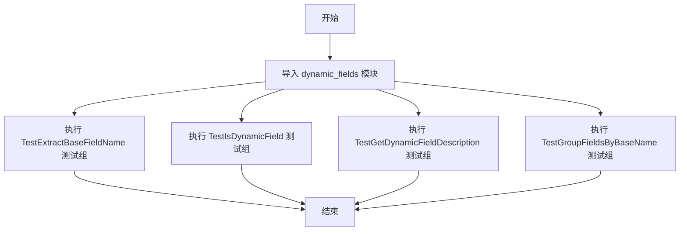

## 类结构

```
TestExtractBaseFieldName (类)
├── test_extract_dict_field (方法)
├── test_extract_list_field (方法)
├── test_extract_object_field (方法)
├── test_extract_mixed_fields (方法)
├── test_extract_regular_field (方法)
└── test_extract_field_with_underscores (方法)
TestIsDynamicField (类)
├── test_is_dynamic_dict_field (方法)
├── test_is_dynamic_list_field (方法)
├── test_is_dynamic_object_field (方法)
├── test_is_dynamic_mixed_field (方法)
└── test_is_not_dynamic_field (方法)
TestGetDynamicFieldDescription (类)
├── test_dict_field_description (方法)
├── test_list_field_description (方法)
├── test_object_field_description (方法)
└── test_fallback_description (方法)
TestGroupFieldsByBaseName (类)
├── test_group_mixed_fields (方法)
├── test_group_empty_list (方法)
├── test_group_single_field (方法)
├── test_group_complex_dynamic_fields (方法)
└── test_preserve_order (方法)
```

## 全局变量及字段


    

## 全局函数及方法


### `TestExtractBaseFieldName.test_extract_dict_field`

该测试方法用于验证从包含字典类型动态分隔符（`_#_`）的字段名称中正确提取基础字段名称的功能。

参数：

-   `self`：`TestExtractBaseFieldName`，测试类的实例，用于访问测试上下文。

返回值：`None`，无返回值。如果断言失败，则抛出 `AssertionError` 异常。

#### 流程图

```mermaid
flowchart TD
    Start([开始]) --> Step1[调用 extract_base_field_name<br/>输入: "values_#_name"]
    Step1 --> Check1{结果 == "values"?}
    Check1 -- 否 --> Fail1([抛出 AssertionError])
    Check1 -- 是 --> Step2[调用 extract_base_field_name<br/>输入: "data_#_key1_#_key2"]
    Step2 --> Check2{结果 == "data"?}
    Check2 -- 否 --> Fail2([抛出 AssertionError])
    Check2 -- 是 --> Step3[调用 extract_base_field_name<br/>输入: "config_#_database_#_host"]
    Step3 --> Check3{结果 == "config"?}
    Check3 -- 否 --> Fail3([抛出 AssertionError])
    Check3 -- 是 --> End([结束/测试通过])
```

#### 带注释源码

```python
def test_extract_dict_field(self):
    """Test extracting base name from dictionary fields."""
    # 测试用例 1：验证单层字典字段名的提取
    # 预期结果 "values"，去除 "_#_name" 后缀
    assert extract_base_field_name("values_#_name") == "values"

    # 测试用例 2：验证多层嵌套字典字段名的提取
    # 预期结果 "data"，去除 "_#_key1_#_key2" 后缀
    assert extract_base_field_name("data_#_key1_#_key2") == "data"

    # 测试用例 3：验证配置类字典字段名的提取
    # 预期结果 "config"，去除 "_#_database_#_host" 后缀
    assert extract_base_field_name("config_#_database_#_host") == "config"
```


### `TestExtractBaseFieldName.test_extract_list_field`

该方法用于测试从包含列表索引标识符（`_$`）的动态字段名称中提取基础字段名称的功能。

参数：

- `self`：`TestExtractBaseFieldName`，测试类实例，用于访问测试上下文。

返回值：`None`，无返回值，主要通过断言验证函数逻辑的正确性。

#### 流程图

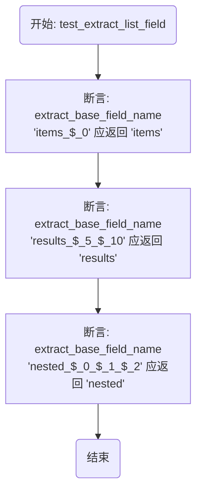

#### 带注释源码

```python
def test_extract_list_field(self):
    """Test extracting base name from list fields."""
    # 测试用例1：验证带有单个列表索引标记的字段字符串能正确提取出基础名 "items"
    assert extract_base_field_name("items_$_0") == "items"
    # 测试用例2：验证带有两个列表索引标记的字段字符串能正确提取出基础名 "results"
    assert extract_base_field_name("results_$_5_$_10") == "results"
    # 测试用例3：验证带有多个嵌套列表索引标记的字段字符串能正确提取出基础名 "nested"
    assert extract_base_field_name("nested_$_0_$_1_$_2") == "nested"
```


### `TestExtractBaseFieldName.test_extract_object_field`

该方法用于测试从包含对象属性访问标记（`@`）的动态字段名称中提取基础名称的功能。它验证了 `extract_base_field_name` 函数能否正确识别并剥离表示对象属性的后缀，返回根对象名称。

参数：

- `self`：`TestExtractBaseFieldName`，测试类的实例，用于访问测试上下文。

返回值：`None`，该方法为单元测试，主要用于执行断言验证逻辑，无显式返回值。

#### 流程图

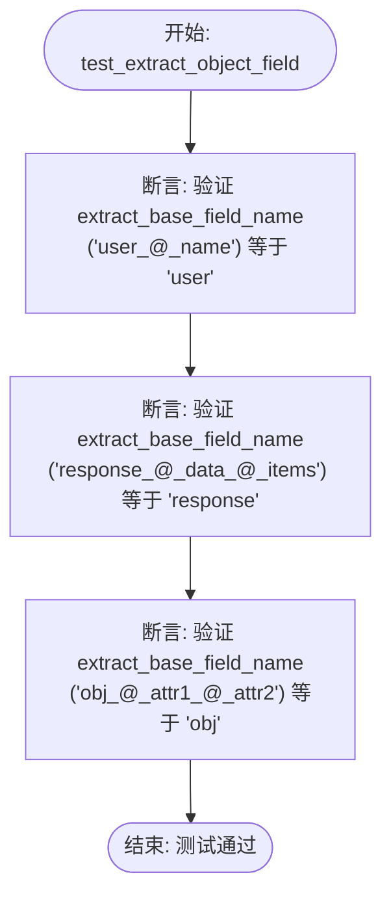

#### 带注释源码

```python
def test_extract_object_field(self):
    """Test extracting base name from object fields."""
    # 验证单层对象字段提取：从 "user_@_name" 提取 "user"
    assert extract_base_field_name("user_@_name") == "user"
    # 验证多层对象字段提取：从 "response_@_data_@_items" 提取 "response"
    assert extract_base_field_name("response_@_data_@_items") == "response"
    # 验证多层属性对象字段提取：从 "obj_@_attr1_@_attr2" 提取 "obj"
    assert extract_base_field_name("obj_@_attr1_@_attr2") == "obj"
```


### `TestExtractBaseFieldName.test_extract_mixed_fields`

该测试方法用于验证从混合类型的动态字段名称（包含列表、字典和对象访问标记组合）中提取基本字段名称的功能，确保在复杂嵌套场景下能正确识别根名称。

参数：

-  `self`：`TestExtractBaseFieldName`，测试类的实例，用于访问测试上下文。

返回值：`None`，该方法是单元测试函数，主要用于执行断言，无显式返回值。

#### 流程图

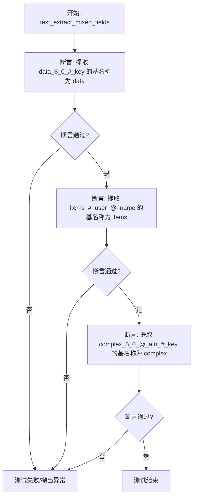

#### 带注释源码

```python
def test_extract_mixed_fields(self):
    """Test extracting base name from mixed dynamic fields."""
    # 测试用例1：验证包含列表索引($_)和字典键(#_)的混合字段名能否正确提取出基名 'data'
    assert extract_base_field_name("data_$_0_#_key") == "data"
    
    # 测试用例2：验证包含字典键(#_)和对象属性(@_)的混合字段名能否正确提取出基名 'items'
    assert extract_base_field_name("items_#_user_@_name") == "items"
    
    # 测试用例3：验证包含列表索引($_)、对象属性(@_)和字典键(#_)的复杂混合字段名能否正确提取出基名 'complex'
    assert extract_base_field_name("complex_$_0_@_attr_#_key") == "complex"
```


### `TestExtractBaseFieldName.test_extract_regular_field`

该测试方法用于验证 `extract_base_field_name` 函数在处理常规（非动态）字段名时的逻辑。它确保当输入字符串不包含特定的动态字段分隔符（如 `#`、`$`、`@`）时，函数能够原样返回该字符串，不执行任何提取操作，同时也包含了对空字符串处理的边界测试。

参数：

-   `self`：`TestExtractBaseFieldName`，测试类的实例，提供测试上下文。

返回值：`None`，该方法主要用于断言验证，无显式返回值。

#### 流程图

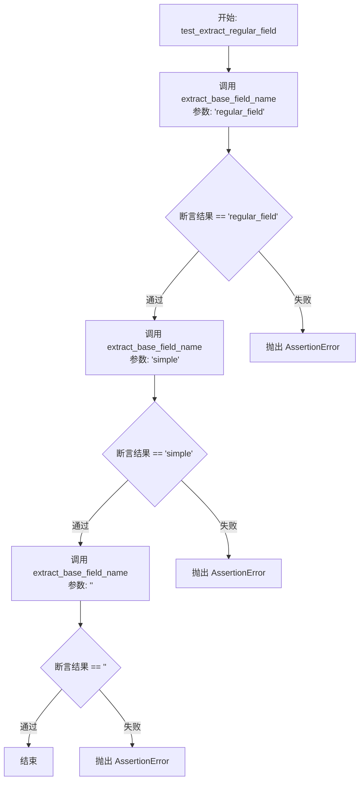

#### 带注释源码

```python
def test_extract_regular_field(self):
    """Test extracting base name from regular (non-dynamic) fields."""
    
    # 验证：对于标准的常规字段名（不包含动态分隔符），
    # 函数应当原样返回输入字符串。
    assert extract_base_field_name("regular_field") == "regular_field"
    
    # 验证：对于简单的字段名，函数应当原样返回。
    assert extract_base_field_name("simple") == "simple"
    
    # 验证：对于空字符串，函数应当返回空字符串。
    assert extract_base_field_name("") == ""
```


### `TestExtractBaseFieldName.test_extract_field_with_underscores`

该测试方法用于验证从包含常规下划线的字段名中提取基础名称的逻辑，确保系统能够正确区分常规下划线与动态分隔符（如 `_#_`）。

参数：

-   `self`：`TestExtractBaseFieldName`，测试类的实例引用。

返回值：`None`，无返回值，仅执行断言检查。

#### 流程图

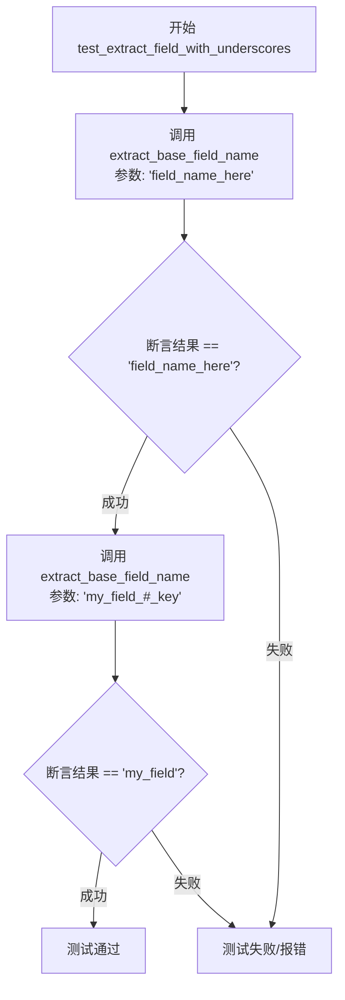

#### 带注释源码

```python
def test_extract_field_with_underscores(self):
    """Test fields with regular underscores (not dynamic delimiters)."""
    # 测试用例 1: 验证只包含常规下划线且不含动态分隔符的字段名
    # 预期行为: 函数应返回原始字符串，因为这不是动态字段
    assert extract_base_field_name("field_name_here") == "field_name_here"
    
    # 测试用例 2: 验证包含常规下划线且后接动态分隔符的字段名
    # 预期行为: 函数应提取第一个动态分隔符之前的部分作为基础名称
    assert extract_base_field_name("my_field_#_key") == "my_field"
```


### `TestIsDynamicField.test_is_dynamic_dict_field`

该方法用于测试 `is_dynamic_field` 函数是否能正确识别字典类型的动态字段，具体验证包含字典键分隔符（'#'）的字符串是否能被判定为动态字段。

参数：

-  `self`：`TestIsDynamicField`，测试类的实例，用于访问测试上下文。

返回值：`None`，该方法不返回值，主要用于断言验证；若断言失败则抛出 `AssertionError` 异常。

#### 流程图

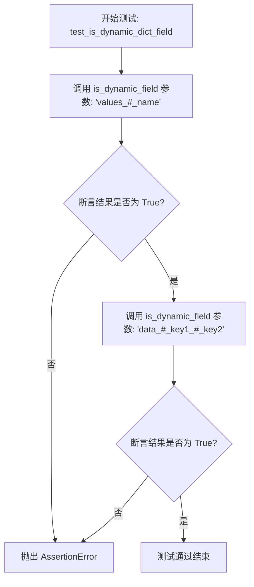

#### 带注释源码

```python
def test_is_dynamic_dict_field(self):
    """Test identifying dictionary dynamic fields."""
    # 验证包含单层字典键标记的字段 "values_#_name" 应被识别为动态字段
    assert is_dynamic_field("values_#_name") is True
    # 验证包含多层字典键标记的字段 "data_#_key1_#_key2" 应被识别为动态字段
    assert is_dynamic_field("data_#_key1_#_key2") is True
```


### `TestIsDynamicField.test_is_dynamic_list_field`

该测试方法旨在验证 `is_dynamic_field` 工具函数能否正确识别列表类型的动态字段（即字段名中包含 `$_` 列表索引标记的情况），确保对于单层和多维列表索引的字段名能准确返回 `True`。

参数：

-  `self`：`TestIsDynamicField`，测试类的实例，用于访问测试上下文。

返回值：`None`，无返回值，通过断言验证被测函数的行为是否符合预期。

#### 流程图

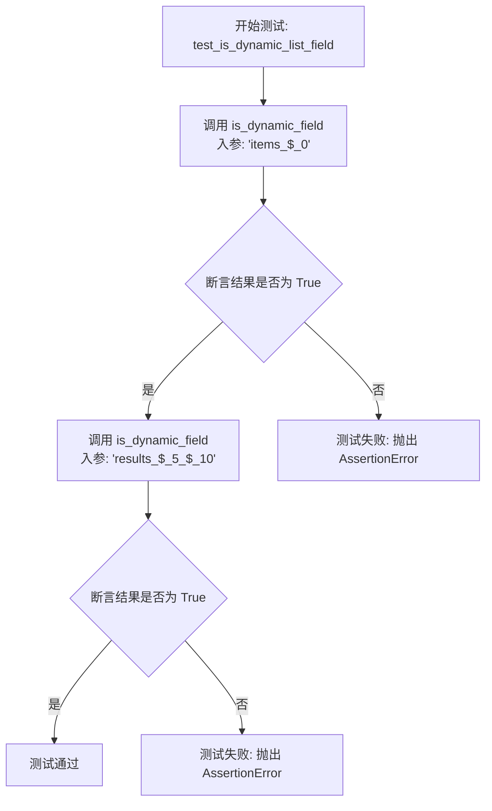

#### 带注释源码

```python
def test_is_dynamic_list_field(self):
    """Test identifying list dynamic fields."""
    # 验证包含单层列表索引标记 "$_0" 的字段名能被识别为动态字段
    assert is_dynamic_field("items_$_0") is True
    
    # 验证包含多层列表索引标记 "$_5_$_10" 的字段名能被识别为动态字段
    assert is_dynamic_field("results_$_5_$_10") is True
```


### `TestIsDynamicField.test_is_dynamic_object_field`

该方法是 `TestIsDynamicField` 测试类中的一个单元测试，旨在验证 `is_dynamic_field` 函数能否正确识别包含对象动态字段语法的字符串（即包含 `_@_` 分隔符的字段名）。

参数：

- `self`：`TestIsDynamicField`，测试类的实例，用于访问测试上下文和断言方法。

返回值：`None`，该方法为单元测试函数，主要用于断言验证，无显式返回值。

#### 流程图

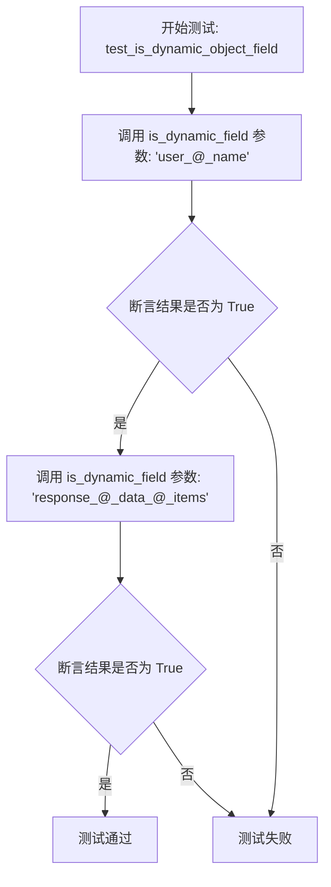

#### 带注释源码

```python
    def test_is_dynamic_object_field(self):
        """Test identifying object dynamic fields."""
        # 断言 "user_@_name" 被识别为动态字段（对象类型），预期返回 True
        assert is_dynamic_field("user_@_name") is True
        
        # 断言 "response_@_data_@_items" 被识别为动态字段（嵌套对象类型），预期返回 True
        assert is_dynamic_field("response_@_data_@_items") is True
```


### `TestIsDynamicField.test_is_dynamic_mixed_field`

该方法用于测试 `is_dynamic_field` 函数是否能正确识别包含多种动态类型标记（如列表索引 `$_`、字典键 `#_` 和对象属性 `@_`）混合的字段名。具体验证了同时包含列表与字典标记、以及字典与对象标记的字段串是否能被判定为动态字段。

参数：

- `self`：`TestIsDynamicField`，测试类的实例，用于访问测试上下文。

返回值：`None`，无显式返回值（该方法通过断言验证逻辑的正确性）。

#### 流程图

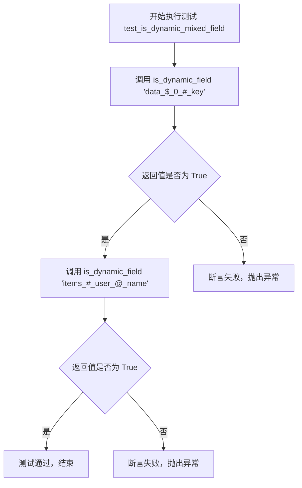

#### 带注释源码

```python
def test_is_dynamic_mixed_field(self):
    """Test identifying mixed dynamic fields."""
    # 测试包含列表索引($)和字典键(#)混合标记的字段是否被识别为动态字段
    assert is_dynamic_field("data_$_0_#_key") is True
    # 测试包含字典键(#)和对象属性(@)混合标记的字段是否被识别为动态字段
    assert is_dynamic_field("items_#_user_@_name") is True
```


### `TestIsDynamicField.test_is_not_dynamic_field`

该方法用于验证 `is_dynamic_field` 函数在处理常规字段、包含下划线的字段、简单字段以及空字符串时，能够正确识别它们并非动态字段（即返回 False）。

参数：

-   `self`：`TestIsDynamicField`，测试类的实例，用于访问测试上下文。

返回值：`None`，该测试方法无显式返回值，主要用于断言验证；若断言失败则抛出 `AssertionError`。

#### 流程图

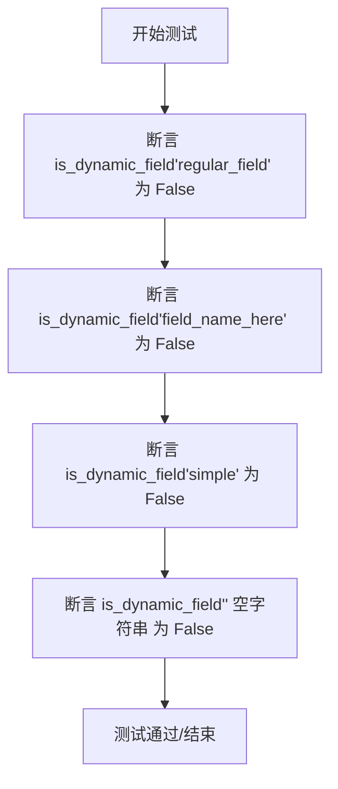

#### 带注释源码

```python
def test_is_not_dynamic_field(self):
    """Test identifying non-dynamic fields."""
    # 验证普通的不包含特殊分隔符的字段返回 False
    assert is_dynamic_field("regular_field") is False
    # 验证带有常规下划线的字段返回 False
    assert is_dynamic_field("field_name_here") is False
    # 验证简单单词字段返回 False
    assert is_dynamic_field("simple") is False
    # 验证空字符串字段返回 False
    assert is_dynamic_field("") is False
```


### `TestGetDynamicFieldDescription.test_dict_field_description`

该测试方法用于验证为字典类型的动态字段（Dynamic Fields）生成描述的功能。它检查 `get_dynamic_field_description` 函数能否根据基础字段名和带字典下标（`#`）的动态字段名，正确生成格式为 "Dictionary value for base_field['key']" 的描述字符串。

参数：

-  `self`：`TestGetDynamicFieldDescription`，测试类实例。

返回值：`None`，无返回值（该方法通过断言验证逻辑正确性）。

#### 流程图

```mermaid
flowchart TD
    A[开始: test_dict_field_description] --> B[调用 get_dynamic_field_description]
    B --> B1[参数: base_name='values', field_name='values_#_name']
    B1 --> C[断言描述等于 'Dictionary value for values[\'name\']']
    C --> D[调用 get_dynamic_field_description]
    D --> D1[参数: base_name='config', field_name='config_#_database']
    D1 --> E[断言描述等于 'Dictionary value for config[\'database\']']
    E --> F[结束]
```

#### 带注释源码

```python
    def test_dict_field_description(self):
        """Test descriptions for dictionary fields."""
        # 调用 get_dynamic_field_description 获取基础字段 "values" 的动态字段 "values_#_name" 的描述
        desc = get_dynamic_field_description("values", "values_#_name")
        # 断言生成的描述字符串是否符合预期格式："Dictionary value for values['name']"
        assert "Dictionary value for values['name']" == desc

        # 调用 get_dynamic_field_description 获取基础字段 "config" 的动态字段 "config_#_database" 的描述
        desc = get_dynamic_field_description("config", "config_#_database")
        # 断言生成的描述字符串是否符合预期格式："Dictionary value for config['database']"
        assert "Dictionary value for config['database']" == desc
```


### `TestGetDynamicFieldDescription.test_list_field_description`

该测试方法用于验证生成列表类型动态字段描述的功能。它通过调用 `get_dynamic_field_description` 函数并传入基准名称和动态字段名称，检查返回的描述字符串是否符合预期的格式（例如 "List item for items[0]"），从而确保系统能正确识别和格式化列表字段的索引信息。

参数：

- `self`：`TestGetDynamicFieldDescription`，测试类的实例，用于访问测试上下文。

返回值：`None`，该方法主要用于验证逻辑，无显式返回值，依靠断言判断测试是否通过。

#### 流程图

```mermaid
graph TD
    A[开始: test_list_field_description] --> B[调用 get_dynamic_field_description<br/>参数: 'items', 'items_$_0']
    B --> C[断言: 结果是否等于<br/>'List item for items[0]']
    C --> D[调用 get_dynamic_field_description<br/>参数: 'results', 'results_$_5']
    D --> E[断言: 结果是否等于<br/>'List item for results[5]']
    E --> F[测试结束]
```

#### 带注释源码

```python
def test_list_field_description(self):
    """Test descriptions for list fields."""
    # 测试生成索引为0的列表字段描述
    desc = get_dynamic_field_description("items", "items_$_0")
    # 验证描述字符串是否包含正确的基准名和索引格式
    assert "List item for items[0]" == desc

    # 测试生成索引为5的列表字段描述
    desc = get_dynamic_field_description("results", "results_$_5")
    # 验证描述字符串是否包含正确的基准名和索引格式
    assert "List item for results[5]" == desc
```


### `TestGetDynamicFieldDescription.test_object_field_description`

测试 `get_dynamic_field_description` 函数在输入包含对象属性标记（`_@_`）时，是否能正确生成对应的描述字符串，验证其对对象字段的解析逻辑。

参数：

- `self`：`TestGetDynamicFieldDescription`，测试类的实例，隐含参数。

返回值：`None`，测试方法无显式返回值，通过断言验证逻辑正确性。

#### 流程图

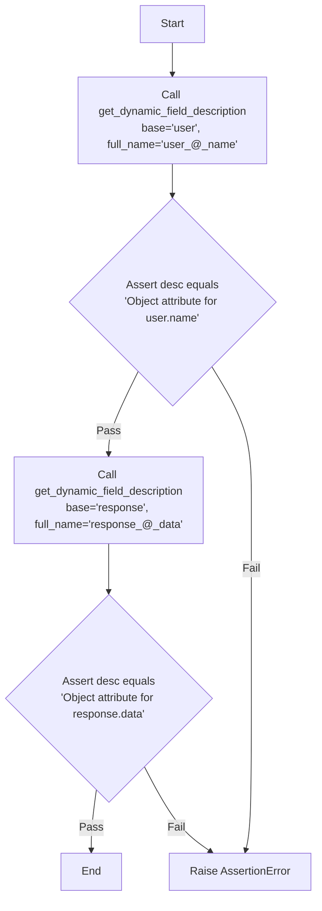

#### 带注释源码

```python
def test_object_field_description(self):
    """Test descriptions for object fields."""
    # 测试用例1: 验证基础对象字段 'user_@_name' 的描述生成
    # 期望生成的描述为 "Object attribute for user.name"
    desc = get_dynamic_field_description("user", "user_@_name")
    assert "Object attribute for user.name" == desc

    # 测试用例2: 验证另一对象字段 'response_@_data' 的描述生成
    # 期望生成的描述为 "Object attribute for response.data"
    desc = get_dynamic_field_description("response", "response_@_data")
    assert "Object attribute for response.data" == desc
```


### `TestGetDynamicFieldDescription.test_fallback_description`

验证当为非动态字段提供相同的基础字段名和完整字段名时，`get_dynamic_field_description` 函数能正确返回默认的后备描述字符串。

参数：

- `self`：`TestGetDynamicFieldDescription`，测试类的实例，用于访问测试上下文和断言方法。

返回值：`None`，该方法为单元测试函数，主要执行断言逻辑，无显式返回值。

#### 流程图

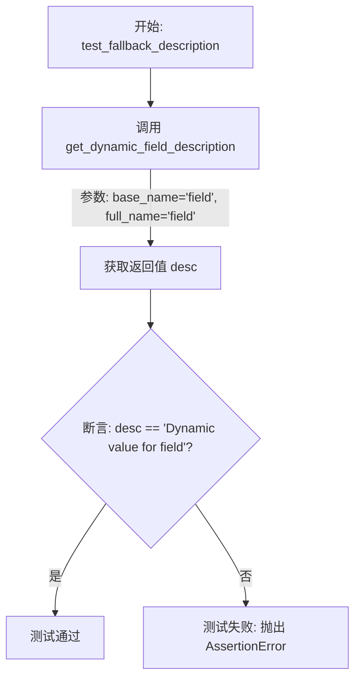

#### 带注释源码

```python
def test_fallback_description(self):
    """Test fallback description for non-dynamic fields."""
    # 调用工具函数获取字段描述，传入相同的字段名 'field'
    # 这模拟了非动态字段（即基础名称与完整名称一致）的情况
    desc = get_dynamic_field_description("field", "field")
    
    # 断言函数返回的描述字符串是预期的后备（fallback）描述文本
    assert "Dynamic value for field" == desc
```


### `TestGroupFieldsByBaseName.test_group_mixed_fields`

该方法用于测试 `group_fields_by_base_name` 函数处理混合类型字段的能力。它验证了当输入列表中包含字典动态字段（_#_）、列表动态字段（_$_）、对象动态字段（_@_）以及常规字段时，函数能否正确提取基名称并将对应的字段名归类到列表中。

参数：

- `self`：`TestGroupFieldsByBaseName`，测试类实例的隐式引用。

返回值：`None`，该方法为测试用例，无显式返回值，主要依赖断言验证逻辑。

#### 流程图

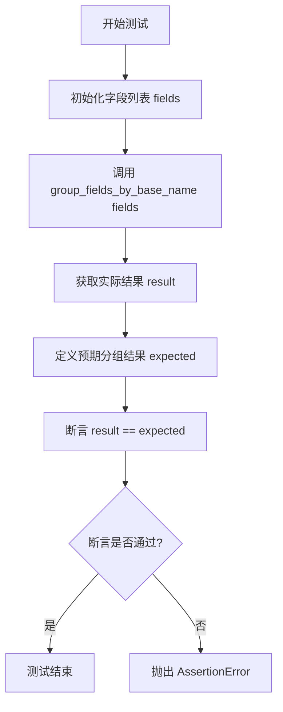

#### 带注释源码

```python
def test_group_mixed_fields(self):
    """Test grouping a mix of dynamic and regular fields."""
    # 1. 准备测试数据：包含多种类型的动态字段和普通字段
    fields = [
        "values_#_name",      # 字典动态字段
        "values_#_age",       # 字典动态字段，同属 'values' 基名
        "items_$_0",          # 列表动态字段
        "items_$_1",          # 列表动态字段，同属 'items' 基名
        "user_@_email",       # 对象动态字段
        "regular_field",      # 普通字段
        "another_field",      # 普通字段
    ]

    # 2. 调用目标函数 group_fields_by_base_name 执行分组逻辑
    result = group_fields_by_base_name(fields)

    # 3. 定义预期的输出结果结构
    expected = {
        "values": ["values_#_name", "values_#_age"],
        "items": ["items_$_0", "items_$_1"],
        "user": ["user_@_email"],
        "regular_field": ["regular_field"], # 普通字段基名为自身
        "another_field": ["another_field"], # 普通字段基名为自身
    }

    # 4. 验证实际分组结果是否与预期一致
    assert result == expected
```


### `TestGroupFieldsByBaseName.test_group_empty_list`

测试当输入为空列表时，`group_fields_by_base_name` 函数是否正确返回一个空字典，确保函数能优雅地处理空输入情况。

参数：

-  `self`：`TestGroupFieldsByBaseName`，测试类实例，用于承载测试方法上下文。

返回值：`None`，该方法作为单元测试函数，主要用于验证行为，本身无显式返回值（通过断言检查结果）。

#### 流程图

```mermaid
graph TD
    Start([开始: test_group_empty_list]) --> CallFunc[调用函数: group_fields_by_base_name<br>传入参数: []]
    CallFunc --> AssignResult[将返回值赋给变量 result]
    AssignResult --> CheckAssertion{断言判断:<br>result == {}}
    CheckAssertion -- True --> Pass([测试通过])
    CheckAssertion -- False --> Fail([测试失败])
```

#### 带注释源码

```python
    def test_group_empty_list(self):
        """Test grouping an empty list."""
        # 调用待测函数 group_fields_by_base_name，传入一个空列表
        result = group_fields_by_base_name([])
        # 断言返回值 result 必须等于空字典 {}
        assert result == {}
```


### `TestGroupFieldsByBaseName.test_group_single_field`

该方法用于验证 `group_fields_by_base_name` 函数在处理仅包含单个动态字段名称的列表时的正确性。它确保函数能够正确解析基础名称（Base Name）并将该字段归类到对应的键下，同时返回预期的字典结构。

参数：

-   `self`：`TestGroupFieldsByBaseName`，测试类的实例引用，用于访问测试上下文或断言方法。

返回值：`None`，该测试方法没有显式返回值，旨在通过断言验证被测函数的行为是否符合预期。

#### 流程图

```mermaid
graph TD
    A[开始执行测试 test_group_single_field] --> B[准备输入参数: 列表包含单个字符串 'values_#_name']
    B --> C[调用 group_fields_by_base_name 函数]
    C --> D[接收函数返回值并存储于变量 result]
    D --> E{断言检查: result 是否等于 {'values': ['values_#_name']} }
    E -- 匹配成功 --> F[测试通过]
    E -- 匹配失败 --> G[抛出 AssertionError]
```

#### 带注释源码

```python
def test_group_single_field(self):
    """Test grouping a single field."""
    # 1. 调用被测函数 group_fields_by_base_name
    # 传入一个仅包含一个动态字段 "values_#_name" 的列表
    result = group_fields_by_base_name(["values_#_name"])
    
    # 2. 验证结果
    # 断言返回的字典中，键 "values" 对应的值列表包含原始字段 "values_#_name"
    # 这也隐式验证了提取基础名称的逻辑是否正确（即提取出 "values"）
    assert result == {"values": ["values_#_name"]}
```


### `TestGroupFieldsByBaseName.test_group_complex_dynamic_fields`

该方法用于测试 `group_fields_by_base_name` 函数处理复杂嵌套动态字段的能力。它验证了当字段名包含混合的动态标识符（如列表索引和字典键的组合）时，系统能否正确提取基础名称并将这些字段归类到同一组中。

参数：

-  `self`：`TestGroupFieldsByBaseName`，测试类的实例，用于访问测试上下文或断言方法。

返回值：`None`，该方法为单元测试，不返回显式结果，通过断言验证逻辑正确性。

#### 流程图

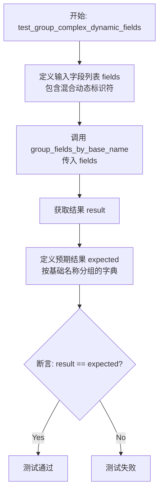

#### 带注释源码

```python
    def test_group_complex_dynamic_fields(self):
        """Test grouping complex nested dynamic fields."""
        # 1. 准备测试数据：包含复杂嵌套结构的动态字段列表
        # "data_$_0_#_key1" 表示 data[0]['key1']，混合了列表索引($)和字典键(#)
        fields = [
            "data_$_0_#_key1",
            "data_$_0_#_key2",
            "data_$_1_#_key1",
            "other_@_attr",
        ]

        # 2. 执行被测函数：根据基础名称对字段列表进行分组
        result = group_fields_by_base_name(fields)

        # 3. 定义预期结果：
        # "data" 类的字段应归为一组，"other" 类的字段归为一组
        expected = {
            "data": ["data_$_0_#_key1", "data_$_0_#_key2", "data_$_1_#_key1"],
            "other": ["other_@_attr"],
        }

        # 4. 断言：验证实际分组结果是否符合预期
        assert result == expected
```


### `TestGroupFieldsByBaseName.test_preserve_order`

该测试方法用于验证 `group_fields_by_base_name` 函数在处理字段列表时是否能够保留字段在原始列表中的出现顺序。它通过传入一个后缀非字母顺序排列的字段列表，断言分组后的结果依然维持原始的输入顺序，从而确保逻辑符合预期。

参数：

- `self`：`TestGroupFieldsByBaseName`，测试类的实例引用。

返回值：`None`，该方法为单元测试，无显式返回值，通过断言验证结果。

#### 流程图

```mermaid
graph TD
    A[开始测试] --> B[定义测试数据 fields<br>列表含 values_#_c, values_#_a, values_#_b]
    B --> C[调用 group_fields_by_base_name fields]
    C --> D[获取返回结果 result]
    D --> E[断言 result['values'] 的顺序]
    E --> F{顺序是否为 c, a, b?}
    F -- 是 --> G[测试通过]
    F -- 否 --> H[测试失败: 抛出 AssertionError]
```

#### 带注释源码

```python
def test_preserve_order(self):
    """Test that field order is preserved within groups."""
    # 定义输入字段列表，包含同一基础字段的不同动态变体
    # 这里的顺序特意设置为 c, a, b，以验证是否会被重排序（如字母序）
    fields = ["values_#_c", "values_#_a", "values_#_b"]
    
    # 调用被测函数 group_fields_by_base_name 进行分组处理
    result = group_fields_by_base_name(fields)

    # 断言：验证基础名称为 "values" 的组内字段顺序是否与输入一致
    # 预期结果应为 ["values_#_c", "values_#_a", "values_#_b"]
    assert result["values"] == ["values_#_c", "values_#_a", "values_#_b"]
```


## 关键组件


### 动态字段基础名称提取

负责从包含字典、列表或对象标记的字段名称中提取根字段名称的逻辑。

### 动态字段识别

用于判断字段字符串是否包含动态结构标记（如 `_#_`, `_$_`, `_@_`）的检测逻辑。

### 动态字段描述生成

根据字段类型生成相应的可读性描述字符串的逻辑，涵盖字典键、列表索引及对象属性。

### 字段分组策略

将混合的动态字段和常规字段按照基础名称进行聚合归类的逻辑。


## 问题及建议


### 已知问题

-   **分隔符命名冲突风险**：使用 `_#_`、`_$_`、`_@_` 作为特定标记存在与常规字段名冲突的风险。如果业务数据中存在包含这些特定子串的合法字段名（例如 `version_#_1`），系统可能会将其错误地识别为动态字段，导致数据处理逻辑错误。
-   **字符串解析的鲁棒性不足**：虽然测试覆盖了常规下划线的情况，但基于字符串分割的逻辑通常难以处理复杂的边缘情况，例如连续的分隔符（如 `field_#_#_key`）或字段末尾包含分隔符的情况，可能导致解析出的 Base Name 不准确或程序抛出异常。
-   **缺乏对深层嵌套性能的考量**：测试用例包含了 `complex_$_0_@_attr_#_key` 这样的深层嵌套结构。如果底层实现采用递归解析或多次遍历，在处理超长或极深层的动态字段名时，可能会导致性能下降或栈溢出。

### 优化建议

-   **使用预编译的正则表达式**：建议将现有的字符串分割逻辑重构为基于预编译正则表达式的匹配。正则表达式能更准确地定义动态字段的模式（如确保分隔符前后为下划线），并能更高效地提取分组信息，提升执行效率。
-   **引入常量管理分隔符**：将 `_#_`、`_$_`、`_@_` 等分隔符定义为模块级别的常量（例如 `DICT_DELIMITER = '_#_'`），避免在代码中散布“魔法字符串”，便于未来修改分隔符规则和统一维护。
-   **添加类型注解（Type Hints）**：为所有被测试的函数（如 `extract_base_field_name` 等）及其参数和返回值添加标准的 Python 类型注解。这将提高代码的可读性，并利用静态类型检查工具（如 mypy）在开发阶段发现潜在的类型错误。
-   **实现解析结果缓存**：由于 `group_fields_by_base_name` 需要对列表中的每个字段调用解析逻辑，建议对 `extract_base_field_name` 或 `is_dynamic_field` 等纯函数引入缓存机制（如 `functools.lru_cache`），避免对重复出现的字段名进行重复解析计算。
-   **增强异常处理与输入校验**：建议在底层实现中增加对输入字符串格式的严格校验。对于不符合动态字段命名规范的畸形输入，应抛出明确的自定义异常（如 `InvalidDynamicFieldNameError`），而不是静默失败或返回无意义的结果，以便快速定位上游数据问题。


## 其它


### 设计目标与约束

**设计目标**：
1.  **动态模式解析**：提供一种灵活的机制来解析和处理带有动态后缀的字段名（如字典键、列表索引或对象属性），以适应非固定的数据结构。
2.  **通用性与兼容性**：能够处理混合类型的动态字段（如同时包含字典和列表嵌套），并能正确识别常规字段作为回退。
3.  **顺序保持**：在字段分组操作中，确保不改变原始字段在列表中的相对顺序，这对于保持数据的语义完整性至关重要。
4.  **无侵入式验证**：提供辅助函数（如 `is_dynamic_field`）以便在不修改原始字符串的情况下快速判断字段类型。

**约束条件**：
1.  **分隔符约定**：严格遵循特定的分隔符协议——字典使用 `_#_`，列表使用 `_$_`，对象使用 `@_`。这些分隔符在字段名中具有特殊含义。
2.  **纯函数约束**：核心工具函数应保持纯函数特性，即相同的输入总是产生相同的输出，不依赖外部状态，也不产生副作用。
3.  **输入类型限制**：主要处理字符串类型的输入，对于非字符串输入的行为未定义（或在调用端需做预处理）。

### 错误处理与异常设计

**错误处理策略**：
1.  **宽容解析模式**：代码采用“Best Effort”策略。如果输入的字符串不符合任何动态字段的模式（如 `regular_field`），函数不会抛出异常，而是将其视为常规字段处理并原样返回。
2.  **空值处理**：对于空字符串输入，提取函数应能优雅处理并返回空字符串，避免引发空指针异常或索引越界。
3.  **格式回退**：在生成描述时，如果无法识别具体的动态结构，系统会提供一个通用的回退描述（如 `"Dynamic value for field"`），确保调用方始终能获得一个可用的字符串。

**异常设计**：
1.  **无异常抛出**：设计上，核心逻辑旨在不抛出业务异常。所有的格式不匹配情况都通过逻辑分支处理，转化为常规数据流。
2.  **断言验证**：在测试层面，使用断言来验证逻辑的正确性，但在生产环境的核心库中，应避免使用断言处理业务逻辑错误。

### 数据流与状态机

**数据流**：
1.  **输入阶段**：接收原始的字符串列表或单个字段名字符串。
2.  **识别阶段**：通过正则匹配或字符串查找（`is_dynamic_field`），确定字段是否包含动态标记。
3.  **转换阶段**：
    *   如果是动态字段，根据特定的分隔符截取基础名称（`extract_base_field_name`）。
    *   根据类型生成对应的语义化描述（`get_dynamic_field_description`）。
4.  **聚合阶段**：遍历字段列表，根据提取的基础名称将字段归类到对应的桶中（`group_fields_by_base_name`），同时维持原始顺序。

**状态机**：
*   由于该模块主要由无状态的工具函数组成，不存在复杂的内部状态机。每个函数的执行仅依赖于输入参数，执行完毕后状态即终止。

### 外部依赖与接口契约

**外部依赖**：
1.  **`backend.util.dynamic_fields`**：被测模块，包含核心业务逻辑。测试代码严重依赖该模块导出的四个主要函数。
2.  **标准库**：依赖 Python 内置的 `assert` 语句进行逻辑验证。

**接口契约**：
1.  **`extract_base_field_name(field_name: str) -> str`**：
    *   契约：输入任意合法字符串，输出其基础名称。如果字符串不包含动态标记，返回原字符串。
2.  **`is_dynamic_field(field_name: str) -> bool`**：
    *   契约：输入字符串，返回布尔值。仅当字符串包含 `_#_`、`_$_` 或 `@_` 时返回 True。
3.  **`get_dynamic_field_description(base_name: str, full_name: str) -> str`**：
    *   契约：输入基础名称和完整字段名，返回人类可读的描述字符串。描述格式需遵循特定的模版。
4.  **`group_fields_by_base_name(fields: List[str]) -> Dict[str, List[str]]`**：
    *   契约：输入字段名列表，返回字典。字典的键为基础名称，值为对应基础名称的字段名列表，且列表顺序必须与输入顺序一致。

### 测试策略与覆盖

**测试策略**：
1.  **分类测试**：将测试用例按照动态字段类型（字典、列表、对象）进行分类，确保每种类型的解析逻辑都被覆盖。
2.  **边界值测试**：包含对空字符串、常规字段（非动态）、包含特殊字符字段的测试，验证代码的鲁棒性。
3.  **混合与嵌套测试**：测试包含多种分隔符的复杂字段名（如 `data_$_0_#_key`），确保解析器能正确处理嵌套逻辑。
4.  **行为验证**：不仅验证输出的正确性，还验证特定的行为约束，如 `test_preserve_order` 专门用于验证顺序保持功能。

**覆盖范围**：
*   覆盖了所有公开的公共 API。
*   覆盖了主要的分支逻辑（动态 vs 非动态，不同分隔符）。
*   包含了空输入和单元素输入的边缘场景。

### 并发与线程安全

**并发分析**：
*   **无状态性**：所有涉及的工具函数均为纯函数，不操作共享内存、全局变量或文件系统。
*   **线程安全**：由于不依赖任何可变的外部状态，这些函数在多线程或多进程环境下是天然线程安全的。
*   **不可变性**：输入的字符串在 Python 中是不可变对象，且函数返回新的数据结构（如新建的字典），不会修改输入参数，因此不存在数据竞争风险。

**注意事项**：
*   虽然 `group_fields_by_base_name` 创建了新的字典和列表，但在极其高并发的场景下，如果调用方持有对返回结果的引用并进行修改，需要注意外部并发控制。但在函数调用层面本身是安全的。


    