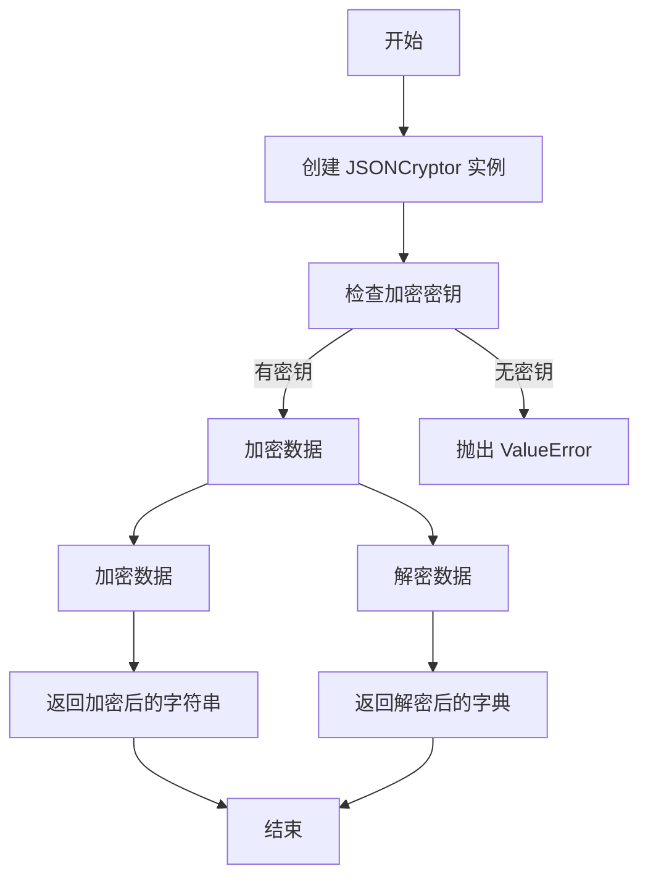
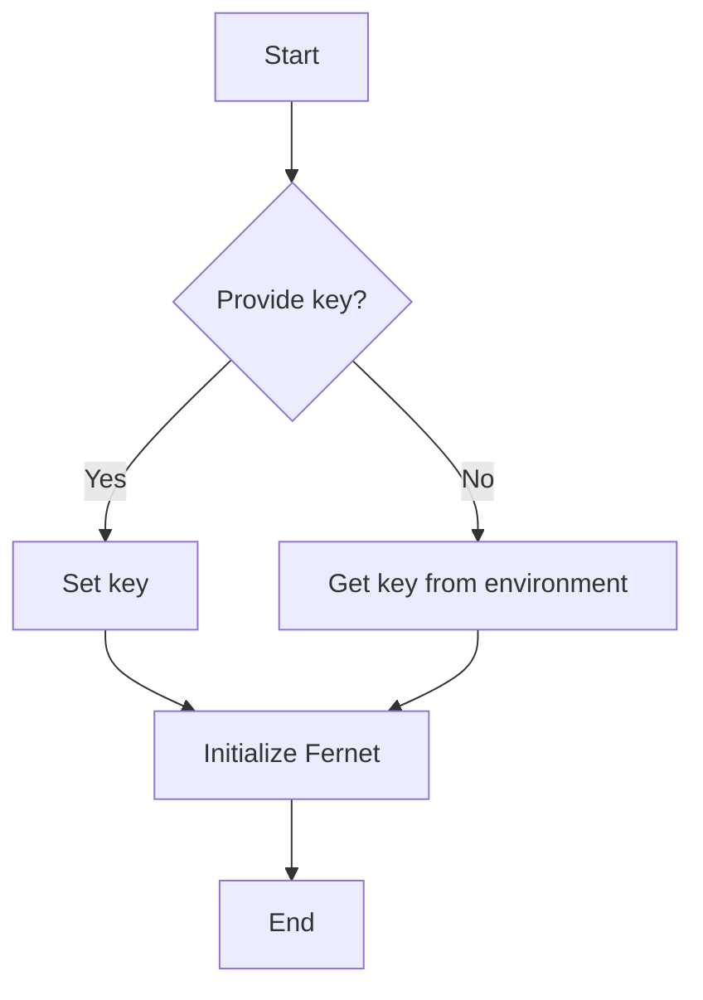
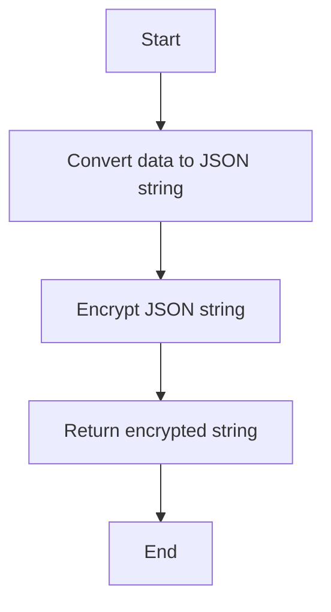
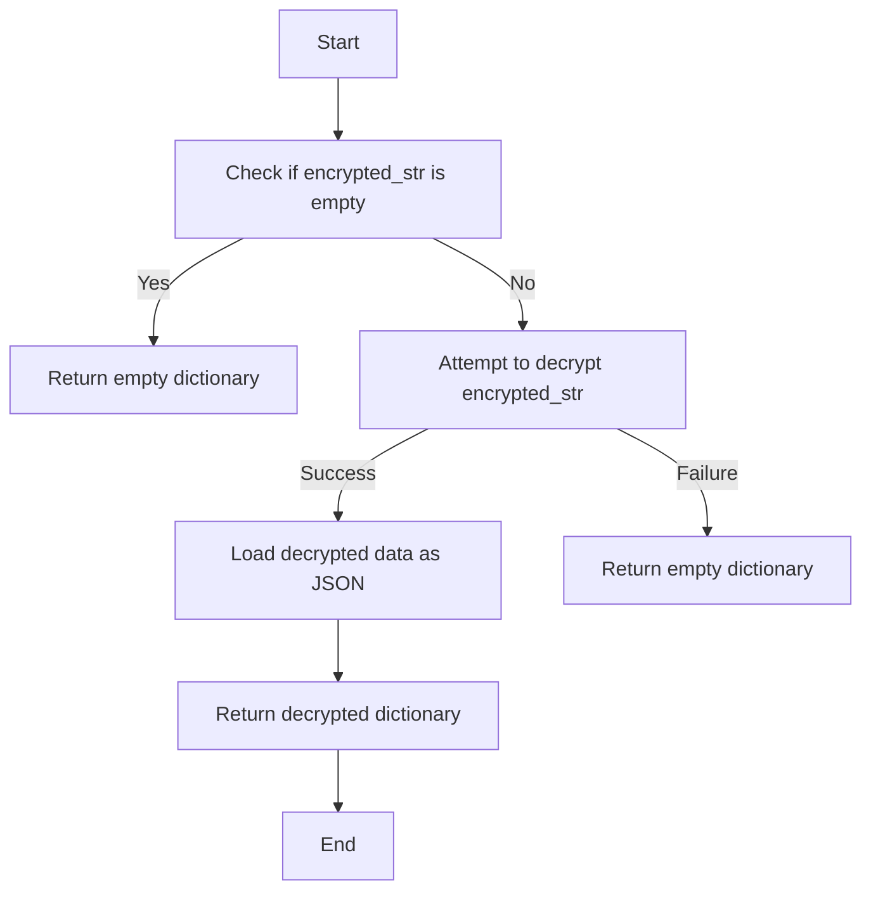

# `.\AutoGPT\autogpt_platform\backend\backend\util\encryption.py` 详细设计文档

The code provides a JSONCryptor class that handles encryption and decryption of JSON data using Fernet symmetric encryption from the cryptography library.

## 整体流程



## 类结构

```
JSONCryptor (类)
```

## 全局变量及字段


### `ENCRYPTION_KEY`
    
The encryption key used for encrypting and decrypting data. It is retrieved from the environment variable 'secrets.encryption_key' or provided as an argument to the JSONCryptor class.

类型：`str`
    


### `JSONCryptor.key`
    
The encryption key used by the JSONCryptor instance. If not provided, it defaults to the value of the global variable ENCRYPTION_KEY.

类型：`str`
    


### `JSONCryptor.fernet`
    
The Fernet object used for encrypting and decrypting data. It is initialized with the key provided to the JSONCryptor instance or the global variable ENCRYPTION_KEY.

类型：`Fernet`
    
    

## 全局函数及方法


### JSONCryptor.__init__

This method initializes the `JSONCryptor` class by setting the encryption key for the Fernet object.

参数：

- `key`：`Optional[str]`，An optional encryption key. If not provided, it will use the `ENCRYPTION_KEY` from the environment settings.

返回值：无

#### 流程图



#### 带注释源码

```
def __init__(self, key: Optional[str] = None):
    # Use provided key or get from environment
    self.key = key or ENCRYPTION_KEY
    if not self.key:
        raise ValueError(
            "Encryption key must be provided or set in ENCRYPTION_KEY environment variable"
        )
    self.fernet = Fernet(
        self.key.encode() if isinstance(self.key, str) else self.key
    )
```


### JSONCryptor.encrypt

Encrypts a dictionary data to a string.

参数：

- `data`：`dict`，The dictionary data to be encrypted.

返回值：`str`，The encrypted string representation of the dictionary data.

#### 流程图



#### 带注释源码

```python
def encrypt(self, data: dict) -> str:
    """Encrypt dictionary data to string"""
    json_str = json.dumps(data)  # Convert dictionary to JSON string
    encrypted = self.fernet.encrypt(json_str.encode())  # Encrypt JSON string
    return encrypted.decode()  # Return encrypted string
```


### JSONCryptor.decrypt(self, encrypted_str: str) -> dict

Decrypts a string that has been encrypted using Fernet symmetric encryption and returns the original dictionary.

参数：

- `encrypted_str`：`str`，The encrypted string that needs to be decrypted.
  - This is the string that was previously encrypted using the `encrypt` method of the `JSONCryptor` class.

返回值：`dict`，The original dictionary that was encrypted.
  - This is the dictionary that was originally encrypted and is now decrypted back to its original form.

#### 流程图



#### 带注释源码

```
def decrypt(self, encrypted_str: str) -> dict:
    """Decrypt string to dictionary"""
    if not encrypted_str:
        return {}
    try:
        decrypted = self.fernet.decrypt(encrypted_str.encode())
        return json.loads(decrypted.decode())
    except Exception:
        return {}
```


## 关键组件


### 张量索引与惰性加载

张量索引与惰性加载是深度学习框架中用于高效处理大型数据集的技术，它允许在需要时才加载数据，从而减少内存消耗和提高处理速度。

### 反量化支持

反量化支持是深度学习模型优化中的一种技术，它允许模型在量化过程中保持较高的精度，通过在量化后进行反量化操作来恢复原始的浮点数精度。

### 量化策略

量化策略是深度学习模型压缩中的一种方法，它通过将模型的权重和激活值从浮点数转换为低精度整数来减少模型的大小和计算量。


## 问题及建议


### 已知问题

-   **环境变量依赖**: 代码依赖于环境变量 `ENCRYPTION_KEY` 来获取加密密钥，这可能导致在部署时难以管理和跟踪密钥。
-   **异常处理**: `decrypt` 方法中的 `try-except` 块捕获了所有异常，但没有提供具体的错误信息，这可能会使得调试困难。
-   **密钥管理**: 代码没有提供密钥管理的功能，如密钥的生成、存储和轮换，这可能导致密钥泄露或过时。
-   **类型注解**: `encrypt` 和 `decrypt` 方法中的 `data` 和 `encrypted_str` 参数类型注解为 `dict` 和 `str`，但没有指定具体的 JSON 格式，这可能导致类型错误。

### 优化建议

-   **密钥管理**: 实现一个密钥管理模块，用于生成、存储和轮换密钥，确保密钥的安全性。
-   **详细的异常处理**: 在 `decrypt` 方法中，捕获具体的异常类型，并提供详细的错误信息，以便于调试。
-   **类型注解**: 为 `encrypt` 和 `decrypt` 方法中的参数提供更具体的类型注解，例如使用 `Json` 类型注解来指定 JSON 格式。
-   **环境变量配置**: 提供一个配置文件或命令行参数来设置密钥，而不是完全依赖环境变量。
-   **单元测试**: 编写单元测试来确保加密和解密过程的正确性，并覆盖各种边界情况。
-   **文档**: 为类和方法提供详细的文档说明，包括参数、返回值和异常情况。


## 其它


### 设计目标与约束

- 设计目标：实现一个简单的JSON数据加密和解密工具，确保数据在传输和存储过程中的安全性。
- 约束条件：使用Fernet对称加密算法，确保加密和解密过程高效且安全。

### 错误处理与异常设计

- 错误处理：在初始化时，如果加密密钥未提供且环境变量中未设置，将抛出`ValueError`。
- 异常设计：在解密过程中，如果输入字符串为空或解密失败，将返回一个空字典。

### 数据流与状态机

- 数据流：用户输入JSON数据，通过`encrypt`方法进行加密，得到加密后的字符串；用户输入加密字符串，通过`decrypt`方法进行解密，得到原始JSON数据。
- 状态机：无状态机，数据流直接从输入到输出。

### 外部依赖与接口契约

- 外部依赖：`cryptography`库的`Fernet`类用于加密和解密。
- 接口契约：`JSONCryptor`类提供`encrypt`和`decrypt`方法，用于加密和解密JSON数据。


    