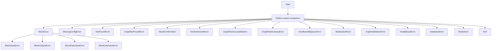
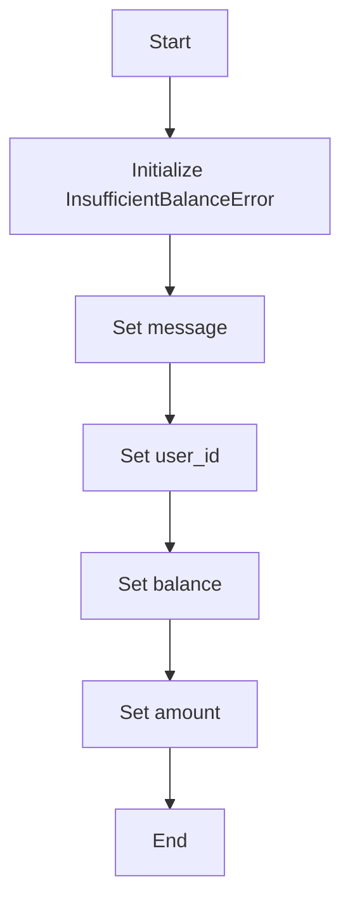
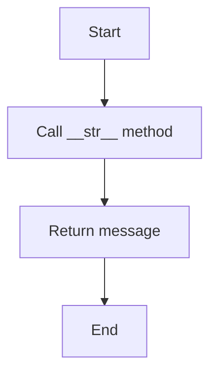
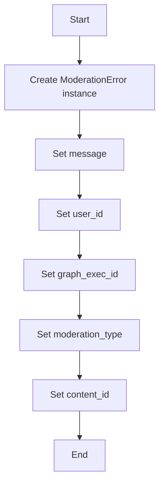
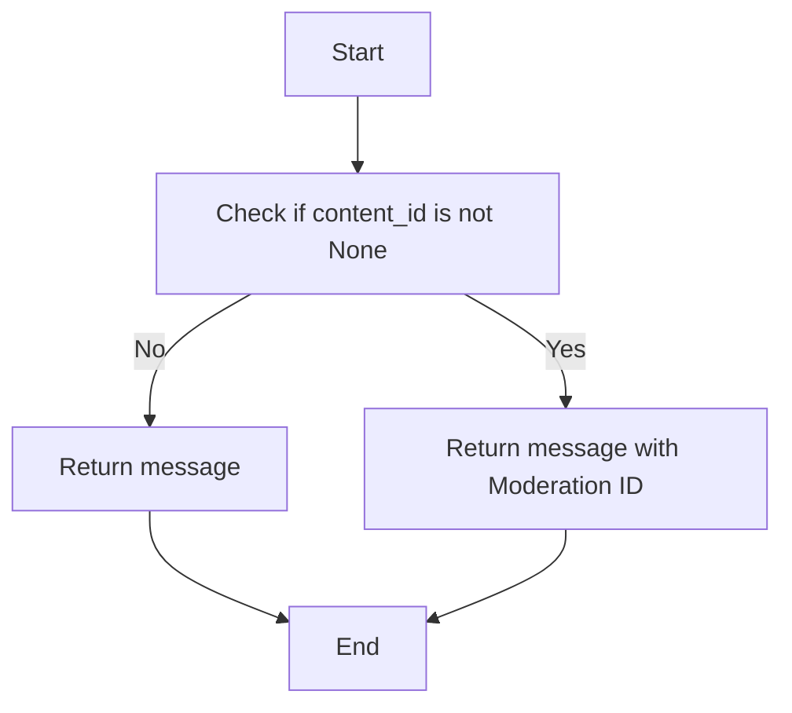
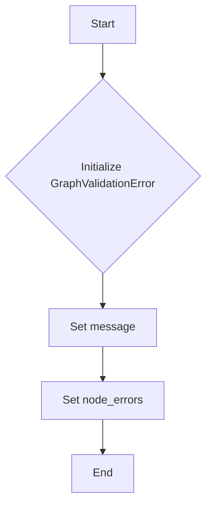
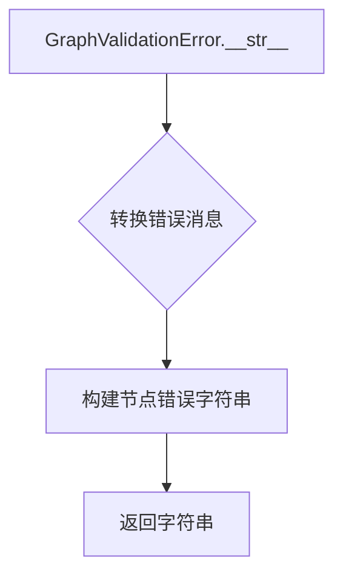

# `.\AutoGPT\autogpt_platform\backend\backend\util\exceptions.py` 详细设计文档

This code defines a set of custom exceptions for various error conditions that may occur during the execution of a block or interaction with a graph or database.

## 整体流程



## 类结构

```
BlockError (基类)
├── BlockInputError (输入错误)
├── BlockOutputError (输出错误)
├── BlockExecutionError (执行错误)
├── BlockUnknownError (未知错误)
├── MissingConfigError (配置错误)
├── NotFoundError (未找到错误)
├── GraphNotFoundError (图未找到错误)
├── NeedConfirmation (需要确认)
├── NotAuthorizedError (未授权错误)
├── GraphNotAccessibleError (图不可访问错误)
├── GraphNotInLibraryError (图不在库中错误)
├── InsufficientBalanceError (余额不足错误)
├── ModerationError (内容审查错误)
├── GraphValidationError (图验证错误)
├── InvalidInputError (无效输入错误)
└── DatabaseError (数据库错误)
└── RedisError (Redis错误)
```

## 全局变量及字段


### `user_id`
    
Unique identifier for the user.

类型：`str`
    


### `message`
    
Error message describing the issue.

类型：`str`
    


### `balance`
    
Current balance of the user.

类型：`float`
    


### `amount`
    
Amount that is insufficient.

类型：`float`
    


### `graph_exec_id`
    
Unique identifier for the graph execution.

类型：`str`
    


### `moderation_type`
    
Type of content moderation failure.

类型：`str`
    


### `content_id`
    
Identifier for the content that failed moderation, if applicable.

类型：`str`
    


### `node_errors`
    
Mapping of node identifiers to error details for graph validation failures.

类型：`Mapping[str, Mapping[str, str]]`
    


### `InsufficientBalanceError.user_id`
    
Unique identifier for the user.

类型：`str`
    


### `InsufficientBalanceError.message`
    
Error message describing the issue.

类型：`str`
    


### `InsufficientBalanceError.balance`
    
Current balance of the user.

类型：`float`
    


### `InsufficientBalanceError.amount`
    
Amount that is insufficient.

类型：`float`
    


### `ModerationError.user_id`
    
Unique identifier for the user.

类型：`str`
    


### `ModerationError.message`
    
Error message describing the issue.

类型：`str`
    


### `ModerationError.graph_exec_id`
    
Unique identifier for the graph execution.

类型：`str`
    


### `ModerationError.moderation_type`
    
Type of content moderation failure.

类型：`str`
    


### `ModerationError.content_id`
    
Identifier for the content that failed moderation, if applicable.

类型：`str`
    


### `GraphValidationError.message`
    
Error message describing the validation failure.

类型：`str`
    


### `GraphValidationError.node_errors`
    
Mapping of node identifiers to error details for graph validation failures.

类型：`Mapping[str, Mapping[str, str]]`
    
    

## 全局函数及方法


### InsufficientBalanceError.__init__

This method initializes an instance of the `InsufficientBalanceError` class, setting the error message, user ID, current balance, and the amount that was attempted to be withdrawn.

参数：

- `message`：`str`，The error message describing the insufficient balance situation.
- `user_id`：`str`，The identifier of the user who has insufficient balance.
- `balance`：`float`，The current balance of the user.
- `amount`：`float`，The amount that was attempted to be withdrawn.

返回值：`None`，This method does not return any value.

#### 流程图



#### 带注释源码

```python
class InsufficientBalanceError(ValueError):
    user_id: str
    message: str
    balance: float
    amount: float

    def __init__(self, message: str, user_id: str, balance: float, amount: float):
        super().__init__(message)
        self.args = (message, user_id, balance, amount)
        self.message = message
        self.user_id = user_id
        self.balance = balance
        self.amount = amount
```


### InsufficientBalanceError.__str__

This method is used to provide a string representation of the `InsufficientBalanceError` object, which is used to display the error message in the frontend when sending the execution update.

参数：

- `self`：`InsufficientBalanceError`，The instance of the `InsufficientBalanceError` class itself.

返回值：`str`，The string representation of the error message.

#### 流程图



#### 带注释源码

```python
def __str__(self):
    """Used to display the error message in the frontend, because we str() the error when sending the execution update"""
    return self.message
```


### ModerationError.__init__

ModerationError is a custom exception class that represents a content moderation failure during execution.

参数：

- `message`：`str`，The error message describing the content moderation failure.
- `user_id`：`str`，The identifier of the user who triggered the moderation.
- `graph_exec_id`：`str`，The identifier of the graph execution that encountered the moderation failure.
- `moderation_type`：`str`，The type of content moderation that failed (default is "content").
- `content_id`：`str | None`，The identifier of the content that failed moderation, if applicable.

返回值：`None`，This method does not return a value.

#### 流程图



#### 带注释源码

```python
class ModerationError(ValueError):
    """Content moderation failure during execution"""

    user_id: str
    message: str
    graph_exec_id: str
    moderation_type: str
    content_id: str | None

    def __init__(
        self,
        message: str,
        user_id: str,
        graph_exec_id: str,
        moderation_type: str = "content",
        content_id: str | None = None,
    ):
        super().__init__(message)
        self.args = (message, user_id, graph_exec_id, moderation_type, content_id)
        self.message = message
        self.user_id = user_id
        self.graph_exec_id = graph_exec_id
        self.moderation_type = moderation_type
        self.content_id = content_id
``` 


### ModerationError.__str__

This method is used to provide a string representation of the `ModerationError` object, which is used to display the error message in the frontend when sending the execution update.

参数：

- `self`：`ModerationError`，The instance of the `ModerationError` class.
- `*args`：`tuple`，The arguments passed to the `__init__` method of the `ModerationError` class.

返回值：`str`，The string representation of the `ModerationError` object.

#### 流程图



#### 带注释源码

```python
class ModerationError(ValueError):
    """Content moderation failure during execution"""

    user_id: str
    message: str
    graph_exec_id: str
    moderation_type: str
    content_id: str | None

    def __init__(
        self,
        message: str,
        user_id: str,
        graph_exec_id: str,
        moderation_type: str = "content",
        content_id: str | None = None,
    ):
        super().__init__(message)
        self.args = (message, user_id, graph_exec_id, moderation_type, content_id)
        self.message = message
        self.user_id = user_id
        self.graph_exec_id = graph_exec_id
        self.moderation_type = moderation_type
        self.content_id = content_id

    def __str__(self):
        """Used to display the error message in the frontend, because we str() the error when sending the execution update"""
        if self.content_id:
            return f"{self.message} (Moderation ID: {self.content_id})"
        return self.message
```


### GraphValidationError.__init__

GraphValidationError 类的构造函数用于初始化一个图验证错误。

参数：

- `message`：`str`，错误消息的描述。
- `node_errors`：`Mapping[str, Mapping[str, str]]`，可选，节点错误信息，包含节点ID和错误描述的映射。

返回值：无

#### 流程图



#### 带注释源码

```python
class GraphValidationError(ValueError):
    """Structured validation error for graph validation failures"""

    def __init__(
        self, message: str, node_errors: Mapping[str, Mapping[str, str]] | None = None
    ):
        super().__init__(message)
        self.message = message
        self.node_errors = node_errors or {}
```


### GraphValidationError.__str__

GraphValidationError 类的 `__str__` 方法用于将 GraphValidationError 对象转换为字符串表示形式。

参数：

- 无

返回值：`str`，返回一个包含错误消息和节点错误的详细字符串描述。

#### 流程图



#### 带注释源码

```python
class GraphValidationError(ValueError):
    """Structured validation error for graph validation failures"""

    def __init__(
        self, message: str, node_errors: Mapping[str, Mapping[str, str]] | None = None
    ):
        super().__init__(message)
        self.message = message
        self.node_errors = node_errors or {}

    def __str__(self):
        return self.message + "".join(
            [
                f"\n  {node_id}:"
                + "".join([f"\n    {k}: {e}" for k, e in errors.items()])
                for node_id, errors in self.node_errors.items()
            ]
        )
```


## 关键组件


### 张量索引与惰性加载

张量索引与惰性加载是代码中处理数据结构的核心组件，用于高效地访问和操作大型数据集，同时减少内存消耗。

### 反量化支持

反量化支持是代码中用于处理数学表达式的组件，允许代码在运行时动态调整量化参数，以适应不同的计算需求。

### 量化策略

量化策略是代码中用于优化计算性能的组件，通过减少数据类型的大小来降低内存使用和加速计算过程。


## 问题及建议


### 已知问题

-   **异常类继承结构**：代码中定义了多个异常类，它们继承自多个基类（如`BlockError`继承自`Exception`和`ValueError`）。这种继承结构可能导致异常处理时需要检查多个基类，增加了异常处理的复杂性。
-   **异常信息重复**：多个异常类（如`InsufficientBalanceError`和`ModerationError`）包含重复的字段，如`user_id`、`message`等。这种重复可能导致代码维护困难，并且增加了异常类的复杂性。
-   **异常描述不够具体**：一些异常类（如`BlockExecutionError`和`BlockUnknownError`）的描述不够具体，使得开发者难以理解异常的具体含义和原因。

### 优化建议

-   **简化异常继承结构**：考虑将所有异常类继承自一个共同的基类，以简化异常处理流程。
-   **合并重复字段**：对于包含重复字段的异常类，考虑将它们合并为一个类，并使用字典或类似的数据结构来存储这些字段。
-   **增强异常描述**：为每个异常类提供更详细的描述，以便开发者能够快速理解异常的具体含义和原因。
-   **使用枚举或常量**：对于一些具有固定值的字段（如`moderation_type`），考虑使用枚举或常量来替代字符串，以提高代码的可读性和可维护性。
-   **异常处理策略**：考虑实现一个统一的异常处理策略，以便在全局范围内处理异常，减少代码重复。


## 其它


### 设计目标与约束

- 设计目标：
  - 提供一套异常处理机制，以处理在执行代码块时可能发生的各种错误。
  - 确保异常信息足够详细，以便于调试和错误追踪。
  - 确保异常类型与错误情况相对应，以便于代码的异常处理。
- 约束：
  - 异常类应遵循PEP 8编码规范。
  - 异常类应提供必要的构造函数参数，以便于创建具有详细信息的异常实例。

### 错误处理与异常设计

- 错误处理策略：
  - 使用自定义异常类来处理特定类型的错误。
  - 在代码中捕获并处理异常，以避免程序崩溃。
  - 异常信息应包含足够的信息，如错误消息、相关标识符等。
- 异常设计：
  - `BlockError`：基础异常类，用于处理所有与代码块相关的错误。
  - `BlockInputError`：处理代码块输入错误。
  - `BlockOutputError`：处理代码块输出错误。
  - `BlockExecutionError`：处理代码块执行错误。
  - `BlockUnknownError`：处理未知错误。
  - `MissingConfigError`：处理配置缺失错误。
  - `NotFoundError`：处理请求的记录未找到错误。
  - `GraphNotFoundError`：处理请求的Agent Graph未找到错误。
  - `NeedConfirmation`：处理需要用户确认的操作。
  - `NotAuthorizedError`：处理未授权操作错误。
  - `GraphNotAccessibleError`：处理无法访问的Graph错误。
  - `GraphNotInLibraryError`：处理不在用户库中的Graph错误。
  - `InsufficientBalanceError`：处理余额不足错误。
  - `ModerationError`：处理内容审查失败错误。
  - `GraphValidationError`：处理图验证错误。
  - `InvalidInputError`：处理无效输入错误。
  - `DatabaseError`：处理数据库交互错误。
  - `RedisError`：处理Redis交互错误。

### 数据流与状态机

- 数据流：
  - 数据流从用户输入开始，经过处理，最终输出结果。
  - 异常处理在数据流中扮演重要角色，确保在错误发生时能够正确处理。
- 状态机：
  - 状态机描述了程序在不同状态之间的转换。
  - 异常处理可能触发状态机的转换，例如从正常状态转换为错误状态。

### 外部依赖与接口契约

- 外部依赖：
  - 数据库和Redis等外部服务。
- 接口契约：
  - 异常类应提供清晰的接口，以便于其他代码能够正确使用它们。
  - 异常类应遵循一定的命名约定，以便于识别和处理。


    