# `.\AutoGPT\autogpt_platform\backend\backend\util\exceptions_test.py` 详细设计文档

This code defines a series of test cases for custom exception classes that are used to handle errors in a block execution context. It tests the formatting of error messages, inheritance, and handling of None or empty messages.

## 整体流程

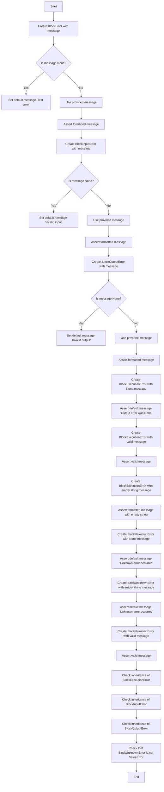

## 类结构

```
TestBlockError (测试 BlockError 和其子类)
├── test_block_error_message_format (测试 BlockError 的消息格式)
├── test_block_input_error_inherits_format (测试 BlockInputError 继承父类格式)
├── test_block_output_error_inherits_format (测试 BlockOutputError 继承父类格式)
TestBlockExecutionErrorNoneHandling (测试 BlockExecutionError 处理 None 消息)
├── test_execution_error_with_none_message (测试 None 消息)
├── test_execution_error_with_valid_message (测试有效消息)
├── test_execution_error_with_empty_string (测试空字符串消息)
TestBlockUnknownErrorNoneHandling (测试 BlockUnknownError 处理 None/空消息)
├── test_unknown_error_with_none_message (测试 None 消息)
├── test_unknown_error_with_empty_string (测试空字符串消息)
├── test_unknown_error_with_valid_message (测试有效消息)
TestBlockErrorInheritance (测试异常继承)
├── test_block_execution_error_is_value_error (测试 BlockExecutionError 是 ValueError)
├── test_block_input_error_is_value_error (测试 BlockInputError 是 ValueError)
├── test_block_output_error_is_value_error (测试 BlockOutputError 是 ValueError)
├── test_block_unknown_error_is_not_value_error (测试 BlockUnknownError 不是 ValueError)
```

## 全局变量及字段


### `TestBlockError.BlockError`
    
Base class for all block-related errors.

类型：`class`
    


### `TestBlockError.BlockExecutionError`
    
Error raised when an execution error occurs in a block.

类型：`class`
    


### `TestBlockError.BlockInputError`
    
Error raised when an input error occurs in a block.

类型：`class`
    


### `TestBlockError.BlockOutputError`
    
Error raised when an output error occurs in a block.

类型：`class`
    


### `TestBlockError.BlockUnknownError`
    
Error raised when an unknown error occurs in a block.

类型：`class`
    


### `TestBlockError.message`
    
The error message.

类型：`str`
    


### `TestBlockError.block_name`
    
The name of the block where the error occurred.

类型：`str`
    


### `TestBlockError.block_id`
    
The ID of the block where the error occurred.

类型：`str`
    
    

## 全局函数及方法


### TestBlockError.test_block_error_message_format

This function tests that the `BlockError` class formats the error message correctly.

参数：

- `error`：`BlockError`，A `BlockError` instance to test the message formatting.

返回值：`None`，No return value, the function uses assertions to verify the message format.

#### 流程图

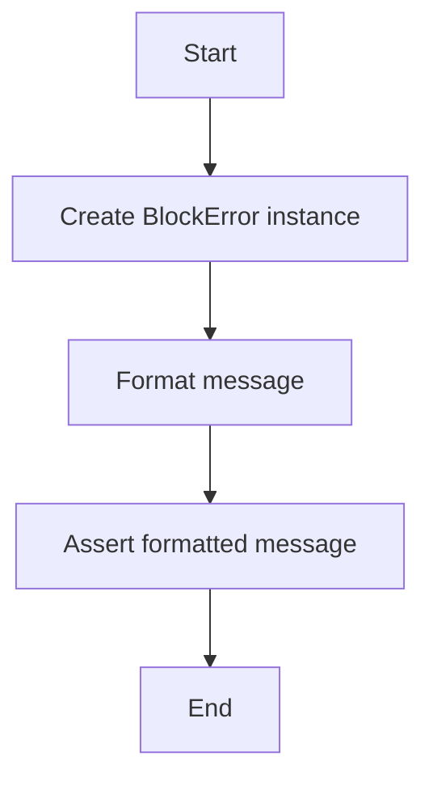

#### 带注释源码

```python
from backend.util.exceptions import BlockError

class TestBlockError:
    """Tests for BlockError and its subclasses."""

    def test_block_error_message_format(self):
        """Test that BlockError formats the message correctly."""
        error = BlockError(
            message="Test error", block_name="TestBlock", block_id="test-123"
        )
        assert (
            str(error)
            == "raised by TestBlock with message: Test error. block_id: test-123"
        )
``` 


### TestBlockError.test_block_input_error_inherits_format

This function tests that `BlockInputError` uses the message format inherited from its parent class `BlockError`.

参数：

- `message`：`str`，The error message to be set for the `BlockInputError` instance.
- `block_name`：`str`，The name of the block that raised the error.
- `block_id`：`str`，The identifier of the block that raised the error.

返回值：`None`，This function does not return any value.

#### 流程图

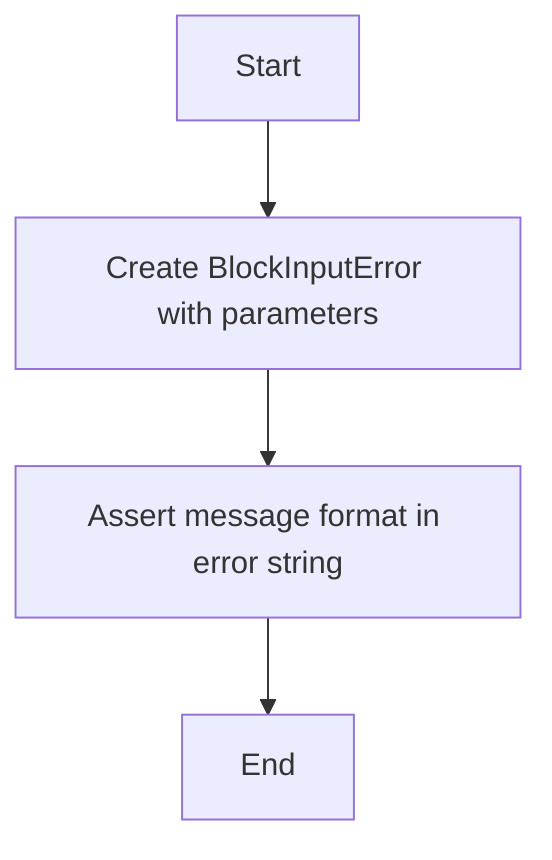

#### 带注释源码

```python
def test_block_input_error_inherits_format(self):
    """Test that BlockInputError uses parent's message format."""
    error = BlockInputError(
        message="Invalid input", block_name="TestBlock", block_id="test-123"
    )
    assert "raised by TestBlock with message: Invalid input" in str(error)
```


### TestBlockError.test_block_output_error_inherits_format

This function tests that `BlockOutputError` inherits the message format from its parent class `BlockError`.

参数：

- `message`：`str`，The error message to be set for the `BlockOutputError` instance.
- `block_name`：`str`，The name of the block that raised the error.
- `block_id`：`str`，The identifier of the block that raised the error.

返回值：`None`，This function does not return any value.

#### 流程图

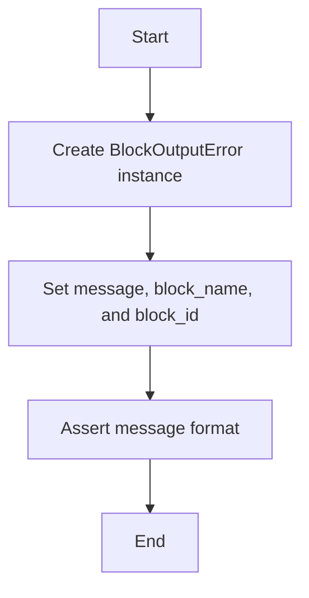

#### 带注释源码

```python
def test_block_output_error_inherits_format(self):
    """Test that BlockOutputError uses parent's message format."""
    error = BlockOutputError(
        message="Invalid output", block_name="TestBlock", block_id="test-123"
    )
    assert "raised by TestBlock with message: Invalid output" in str(error)
``` 


### TestBlockExecutionErrorNoneHandling.test_execution_error_with_none_message

This method tests the behavior of `BlockExecutionError` when a `None` message is provided.

参数：

- `message`：`None`，The error message to be set for the `BlockExecutionError`. If `None`, a descriptive text is used instead.
- `block_name`：`str`，The name of the block that raised the error.
- `block_id`：`str`，The identifier of the block that raised the error.

返回值：`None`，This method does not return any value.

#### 流程图

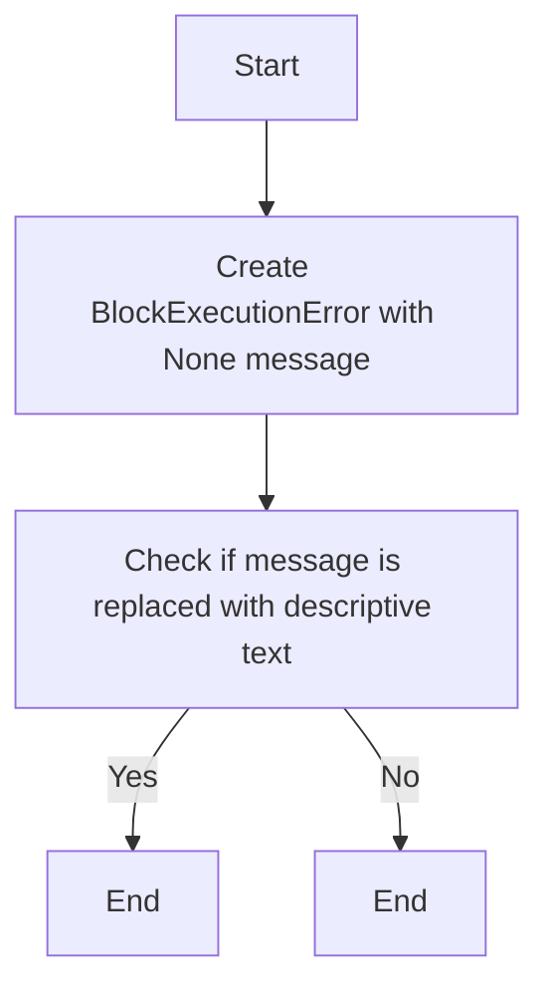

#### 带注释源码

```python
def test_execution_error_with_none_message(self):
    """Test that None message is replaced with descriptive text."""
    error = BlockExecutionError(
        message=None, block_name="TestBlock", block_id="test-123"
    )
    assert "Output error was None" in str(error)
    assert "raised by TestBlock with message: Output error was None" in str(error)
```


### TestBlockExecutionErrorNoneHandling.test_execution_error_with_valid_message

This method tests that a valid message is preserved when creating a `BlockExecutionError` instance.

参数：

- `message`：`str`，The error message to be set for the `BlockExecutionError` instance.
- `block_name`：`str`，The name of the block that raised the error.
- `block_id`：`str`，The identifier of the block that raised the error.

返回值：`None`，This method does not return any value.

#### 流程图

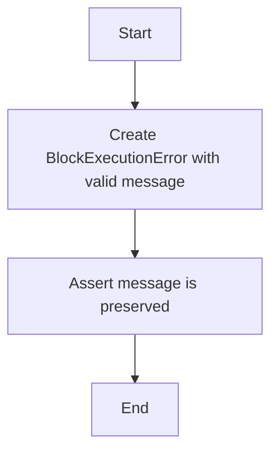

#### 带注释源码

```python
def test_execution_error_with_valid_message(self):
    """Test that valid messages are preserved."""
    error = BlockExecutionError(
        message="Actual error", block_name="TestBlock", block_id="test-123"
    )
    assert "Actual error" in str(error)
    assert "Output error was None" not in str(error)
```


### test_execution_error_with_empty_string

This method tests that an empty string message for a `BlockExecutionError` is not replaced with descriptive text, unlike a `None` message.

参数：

- `message`：`str`，The error message to be tested. It should be an empty string.
- `block_name`：`str`，The name of the block that raised the error.
- `block_id`：`str`，The ID of the block that raised the error.

返回值：`None`，This method does not return any value.

#### 流程图

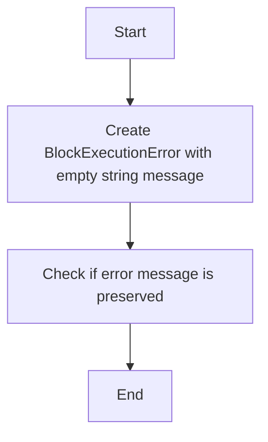

#### 带注释源码

```python
def test_execution_error_with_empty_string(self):
    """Test that empty string message is NOT replaced (only None is)."""
    error = BlockExecutionError(
        message="", block_name="TestBlock", block_id="test-123"
    )
    # Empty string is falsy but not None, so it's preserved
    assert "raised by TestBlock with message: . block_id:" in str(error)
```


### TestBlockUnknownErrorNoneHandling.test_unknown_error_with_none_message

This function tests the handling of `None` messages for `BlockUnknownError`.

参数：

- `message`：`Optional[str]`，The error message. If `None`, a descriptive text is used.
- `block_name`：`str`，The name of the block that raised the error.
- `block_id`：`str`，The ID of the block that raised the error.

返回值：`None`，This function does not return a value.

#### 流程图

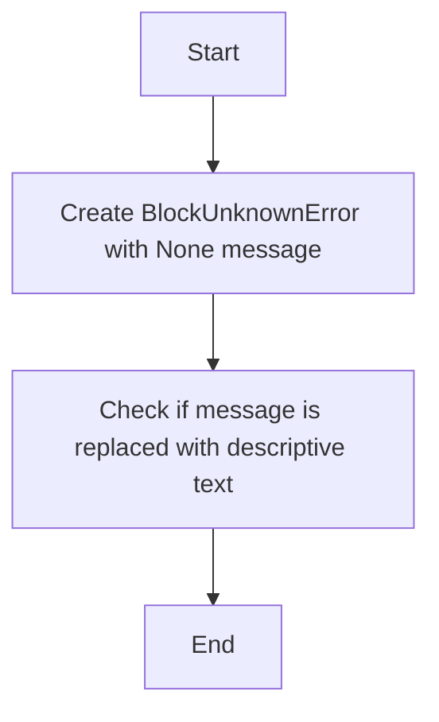

#### 带注释源码

```python
def test_unknown_error_with_none_message(self):
    """Test that None message is replaced with descriptive text."""
    error = BlockUnknownError(
        message=None, block_name="TestBlock", block_id="test-123"
    )
    assert "Unknown error occurred" in str(error)
```


### TestBlockUnknownErrorNoneHandling.test_unknown_error_with_empty_string

This function tests that an empty string message for a `BlockUnknownError` is replaced with descriptive text.

参数：

- `message`：`str`，The error message to be tested. It should be an empty string.
- `block_name`：`str`，The name of the block that raised the error.
- `block_id`：`str`，The ID of the block that raised the error.

返回值：`None`，This function does not return any value.

#### 流程图

```mermaid
graph TD
    A[Start] --> B[Create BlockUnknownError with empty string]
    B --> C[Check if message is replaced with "Unknown error occurred"]
    C --> D[End]
```

#### 带注释源码

```python
def test_unknown_error_with_empty_string(self):
    """Test that empty string is replaced with descriptive text."""
    error = BlockUnknownError(
        message="", block_name="TestBlock", block_id="test-123"
    )
    assert "Unknown error occurred" in str(error)
```


### TestBlockUnknownErrorNoneHandling.test_unknown_error_with_none_message

This test method checks that when a `BlockUnknownError` is raised with a `None` message, it is replaced with a descriptive text.

参数：

- `message`：`None`，The error message to be tested. It should be `None` to trigger the replacement with descriptive text.
- `block_name`：`str`，The name of the block that raised the error.
- `block_id`：`str`，The ID of the block that raised the error.

返回值：`None`，This method does not return any value.

#### 流程图


#### 带注释源码

```python
def test_unknown_error_with_none_message(self):
    """Test that None message is replaced with descriptive text."""
    error = BlockUnknownError(
        message=None, block_name="TestBlock", block_id="test-123"
    )
    assert "Unknown error occurred" in str(error)
```


### test_block_execution_error_is_value_error

This function tests whether the `BlockExecutionError` is a subclass of `ValueError`.

参数：

- `error`：`BlockExecutionError`，The error instance to be tested.

返回值：`None`，This function does not return any value.

#### 流程图

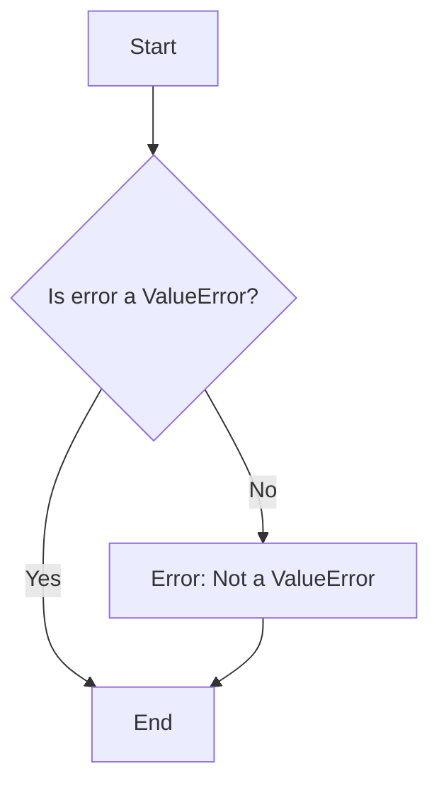

#### 带注释源码

```python
def test_block_execution_error_is_value_error(self):
    """Test that BlockExecutionError is a ValueError."""
    error = BlockExecutionError(
        message="test", block_name="TestBlock", block_id="test-123"
    )
    assert isinstance(error, ValueError)
    assert isinstance(error, BlockError)
```


### test_block_execution_error_is_value_error

This function tests whether the `BlockExecutionError` is an instance of `ValueError`.

参数：

- `error`：`BlockExecutionError`，The error object to be tested.

返回值：`None`，This function does not return a value.

#### 流程图

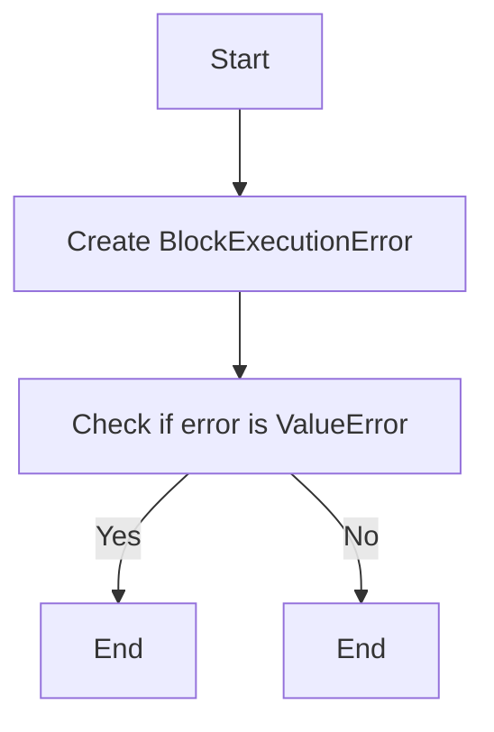

#### 带注释源码

```python
def test_block_execution_error_is_value_error(self):
    """Test that BlockExecutionError is a ValueError."""
    error = BlockExecutionError(
        message="test", block_name="TestBlock", block_id="test-123"
    )
    assert isinstance(error, ValueError)
    assert isinstance(error, BlockError)
```

### test_block_input_error_is_value_error

This function tests whether the `BlockInputError` is an instance of `ValueError`.

参数：

- `error`：`BlockInputError`，The error object to be tested.

返回值：`None`，This function does not return a value.

#### 流程图

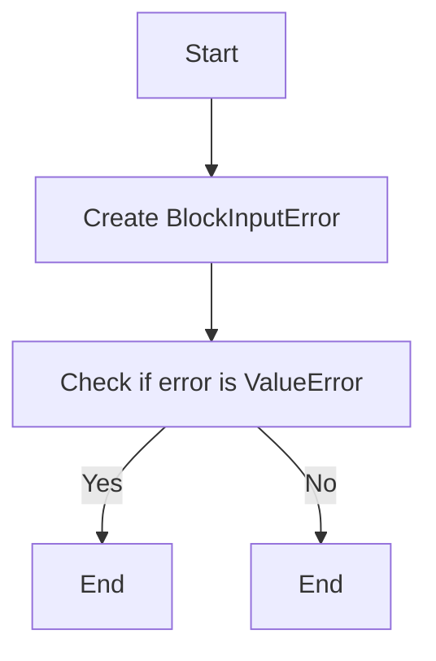

#### 带注释源码

```python
def test_block_input_error_is_value_error(self):
    """Test that BlockInputError is a ValueError."""
    error = BlockInputError(
        message="test", block_name="TestBlock", block_id="test-123"
    )
    assert isinstance(error, ValueError)
    assert isinstance(error, BlockError)
```

### test_block_output_error_is_value_error

This function tests whether the `BlockOutputError` is an instance of `ValueError`.

参数：

- `error`：`BlockOutputError`，The error object to be tested.

返回值：`None`，This function does not return a value.

#### 流程图

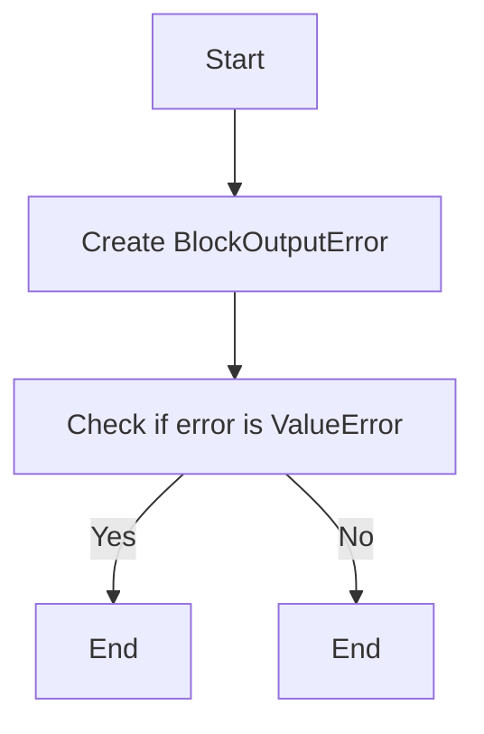

#### 带注释源码

```python
def test_block_output_error_is_value_error(self):
    """Test that BlockOutputError is a ValueError."""
    error = BlockOutputError(
        message="test", block_name="TestBlock", block_id="test-123"
    )
    assert isinstance(error, ValueError)
    assert isinstance(error, BlockError)
```

### test_block_unknown_error_is_not_value_error

This function tests whether the `BlockUnknownError` is not an instance of `ValueError`.

参数：

- `error`：`BlockUnknownError`，The error object to be tested.

返回值：`None`，This function does not return a value.

#### 流程图

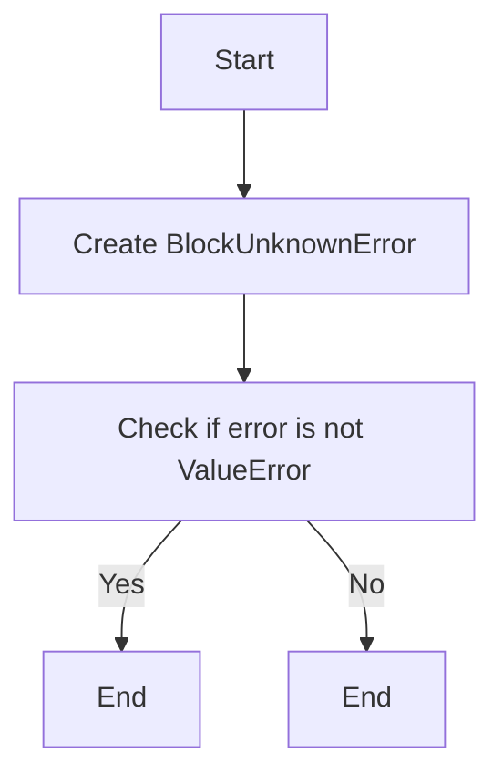

#### 带注释源码

```python
def test_block_unknown_error_is_not_value_error(self):
    """Test that BlockUnknownError is NOT a ValueError."""
    error = BlockUnknownError(
        message="test", block_name="TestBlock", block_id="test-123"
    )
    assert not isinstance(error, ValueError)
    assert isinstance(error, BlockError)
```


### test_block_output_error_is_value_error

This function tests whether BlockOutputError is a subclass of ValueError.

参数：

- `error`：`BlockOutputError`，A BlockOutputError instance to test for ValueError inheritance.

返回值：`None`，No explicit return value, the assertion is the return value.

#### 流程图

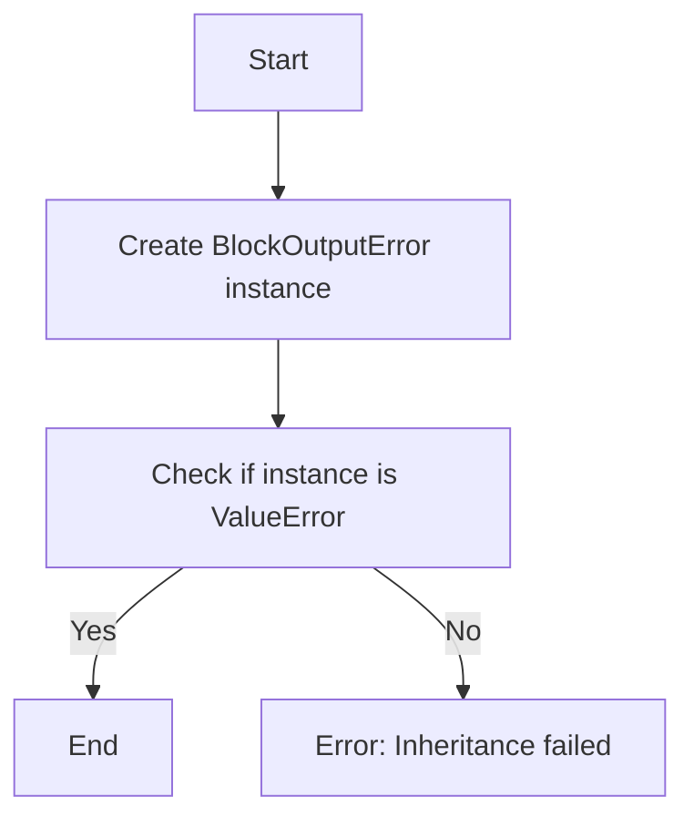

#### 带注释源码

```python
def test_block_output_error_is_value_error(self):
    """Test that BlockOutputError is a ValueError."""
    error = BlockOutputError(
        message="test", block_name="TestBlock", block_id="test-123"
    )
    assert isinstance(error, ValueError)
    assert isinstance(error, BlockError)
```


### test_block_unknown_error_is_not_value_error

This function tests whether BlockUnknownError is not a ValueError.

参数：

- `error`：`BlockUnknownError`，A BlockUnknownError instance to test.

返回值：`None`，No return value.

#### 流程图

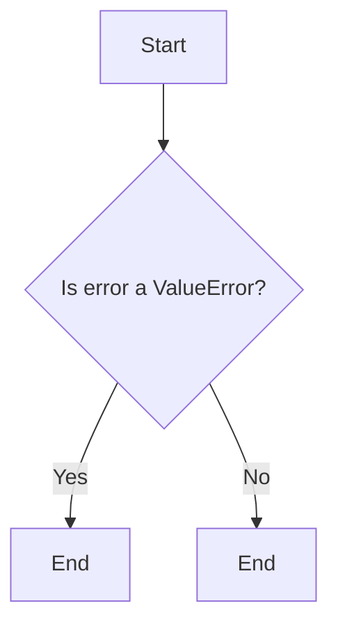

#### 带注释源码

```python
def test_block_unknown_error_is_not_value_error(self):
    """Test that BlockUnknownError is NOT a ValueError."""
    error = BlockUnknownError(
        message="test", block_name="TestBlock", block_id="test-123"
    )
    assert not isinstance(error, ValueError)
    assert isinstance(error, BlockError)
```


## 关键组件


### 张量索引与惰性加载

用于高效地处理张量数据，通过延迟计算直到实际需要时来减少资源消耗。

### 反量化支持

提供对量化策略的支持，允许在模型训练和推理过程中进行量化操作。

### 量化策略

定义了量化操作的规则和方法，以优化模型的性能和资源使用。


## 问题及建议


### 已知问题

-   **错误消息格式化的一致性**：虽然代码中测试了错误消息的格式化，但没有明确说明所有子类是否都应遵循相同的消息格式。如果子类有不同的格式要求，这可能导致维护问题。
-   **异常继承的明确性**：虽然测试了异常的继承关系，但没有明确说明为什么`BlockUnknownError`不应继承自`ValueError`。如果这个决定是基于特定的设计决策，应该有文档说明。
-   **测试覆盖率**：测试主要集中在消息格式和异常继承上，但没有测试异常的实际抛出和使用场景。应该增加测试来确保异常在代码中被正确抛出和处理。

### 优化建议

-   **文档化错误消息格式**：为所有错误类提供一个明确的文档，说明消息格式的要求和预期。
-   **明确异常继承决策**：在代码注释或设计文档中明确说明为什么`BlockUnknownError`不继承自`ValueError`，以及这种设计决策的影响。
-   **增加测试用例**：增加测试用例来模拟异常的实际抛出和使用场景，确保异常在代码中按预期工作。
-   **考虑异常链**：如果可能，考虑使用异常链来记录原始异常，这有助于调试和问题追踪。
-   **代码重构**：如果测试表明某些异常类过于相似，可以考虑将它们合并，以减少代码冗余和提高可维护性。


## 其它


### 设计目标与约束

- 设计目标：
  - 确保异常信息清晰、易于理解。
  - 确保异常能够正确地继承并传递必要的信息。
  - 确保异常处理逻辑一致且易于维护。

- 约束条件：
  - 异常类必须遵循PEP 8编码规范。
  - 异常类必须提供足够的信息来帮助开发者诊断问题。

### 错误处理与异常设计

- 错误处理：
  - 使用自定义异常类来处理特定类型的错误。
  - 异常类应提供足够的信息，包括错误消息、块名称和块ID。

- 异常设计：
  - `BlockError` 是基类，所有块相关的错误都继承自它。
  - `BlockExecutionError`、`BlockInputError`、`BlockOutputError` 和 `BlockUnknownError` 是 `BlockError` 的子类，分别用于处理不同的错误情况。

### 数据流与状态机

- 数据流：
  - 异常信息通过异常对象传递。
  - 异常对象包含错误消息、块名称和块ID。

- 状态机：
  - 无状态机，因为异常处理是线性的。

### 外部依赖与接口契约

- 外部依赖：
  - `backend.util.exceptions` 模块。

- 接口契约：
  - 异常类应提供统一的接口，以便在代码中抛出和处理异常。
  - 异常类应遵循PEP 8编码规范，确保代码的可读性和一致性。

    