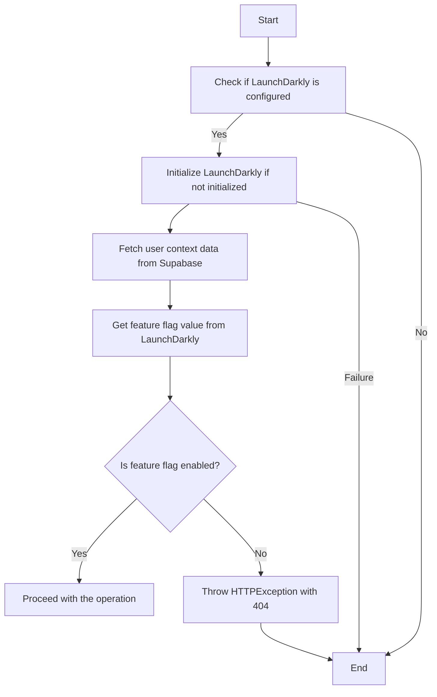
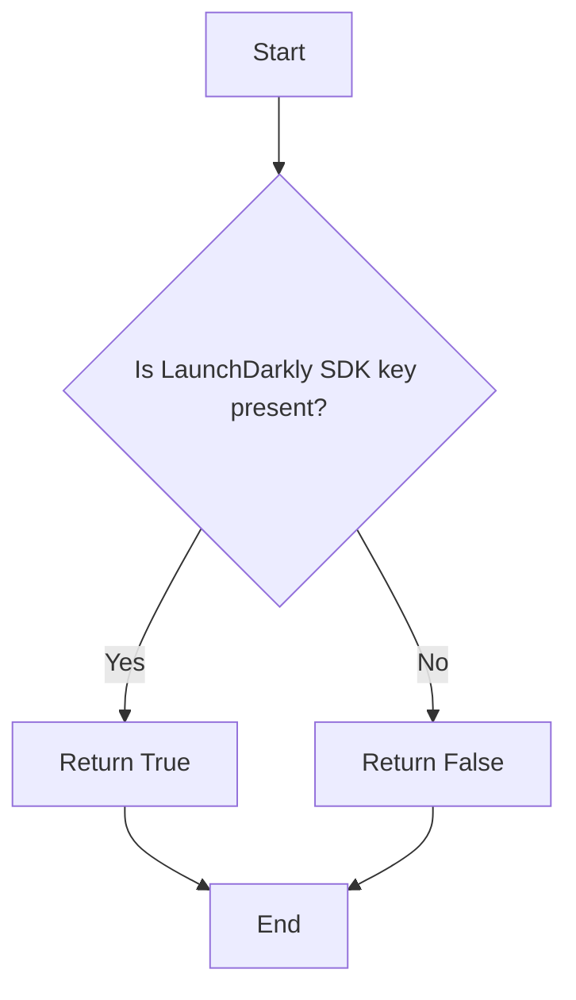
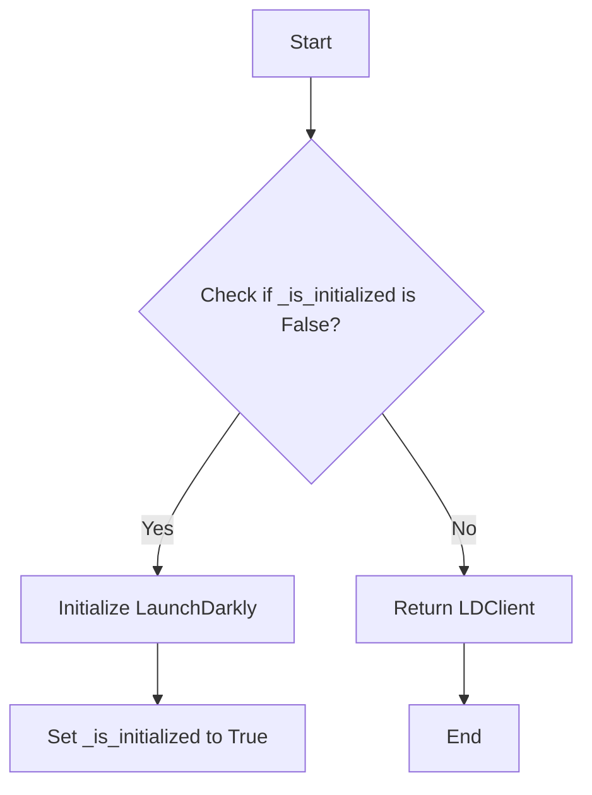
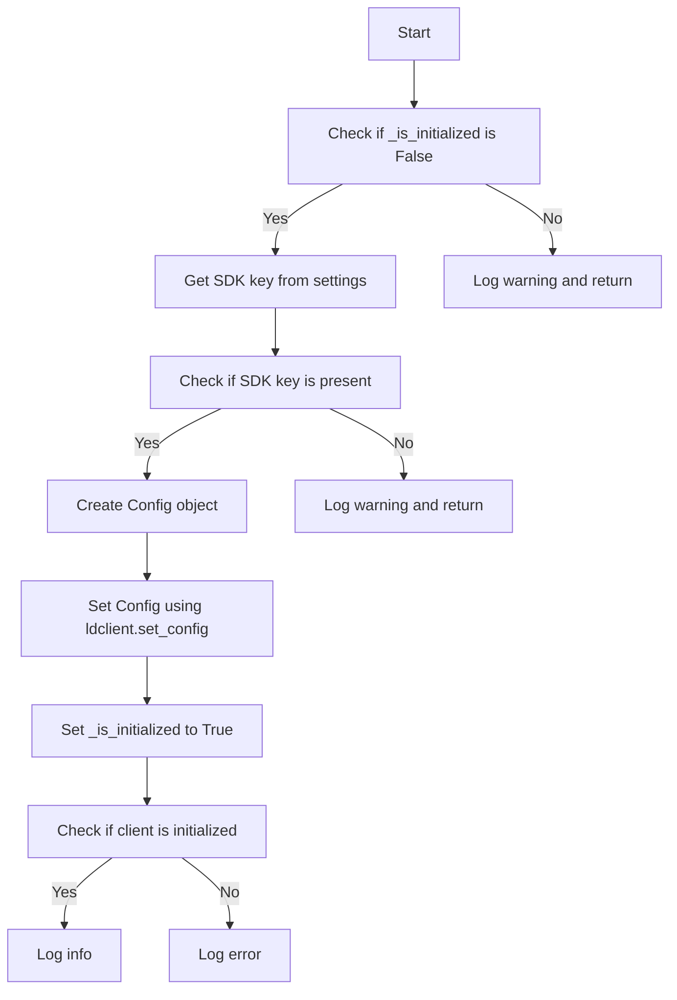
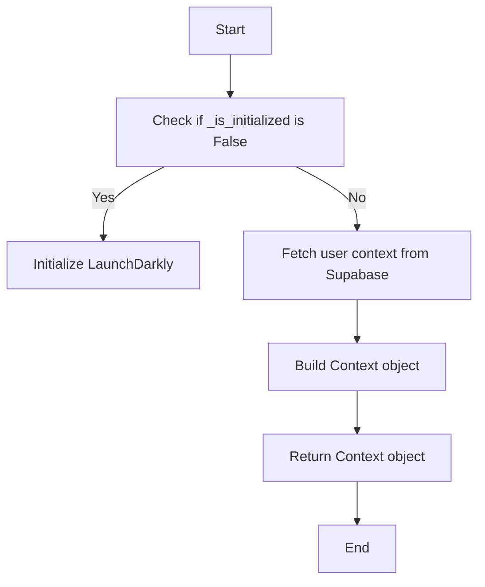
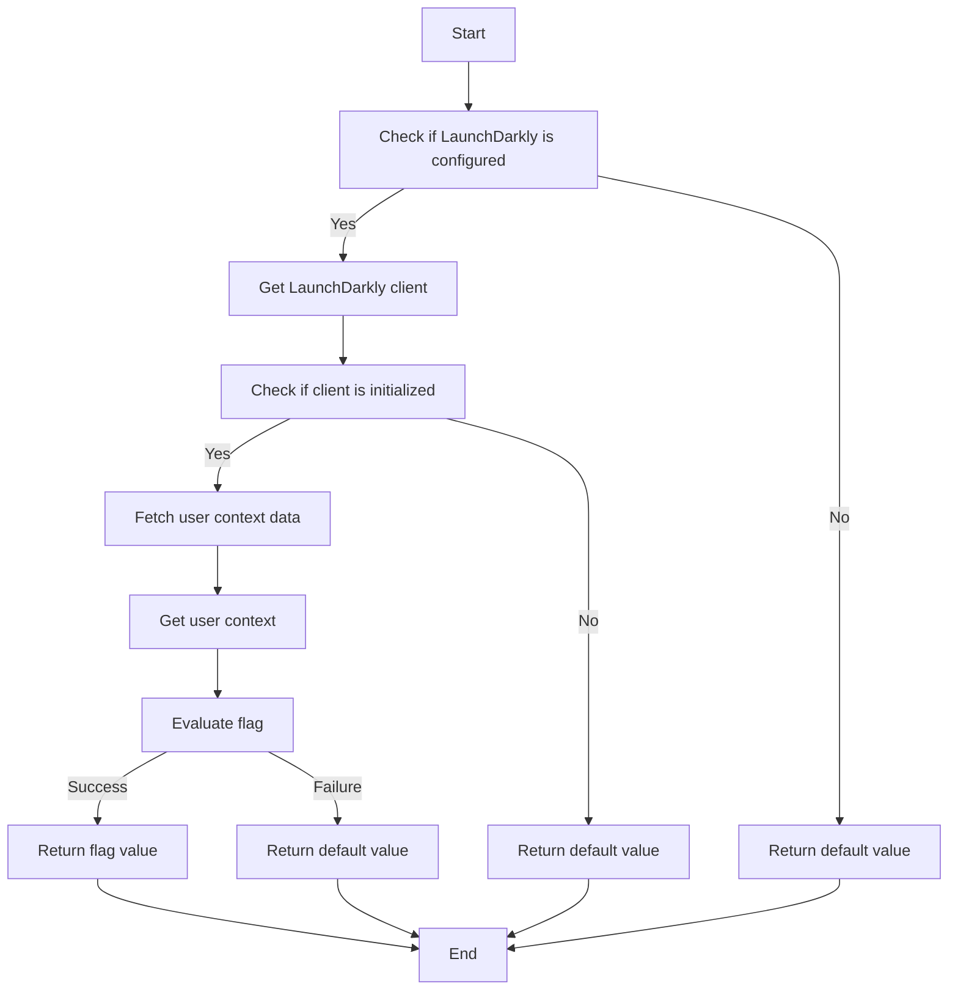
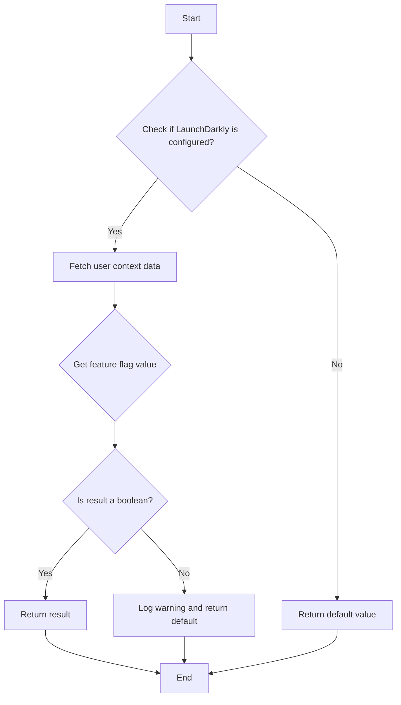
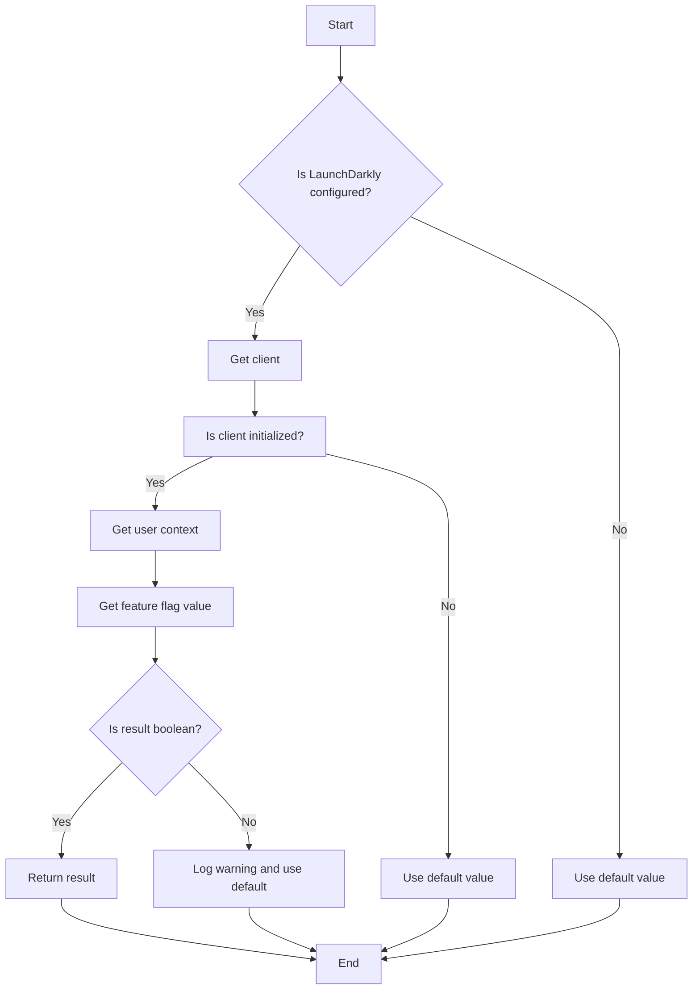
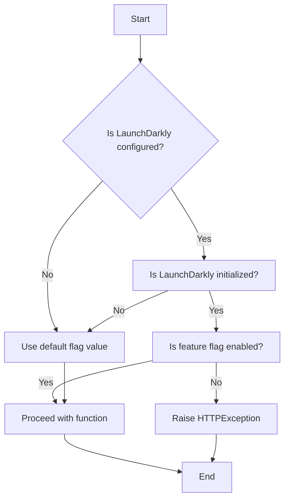
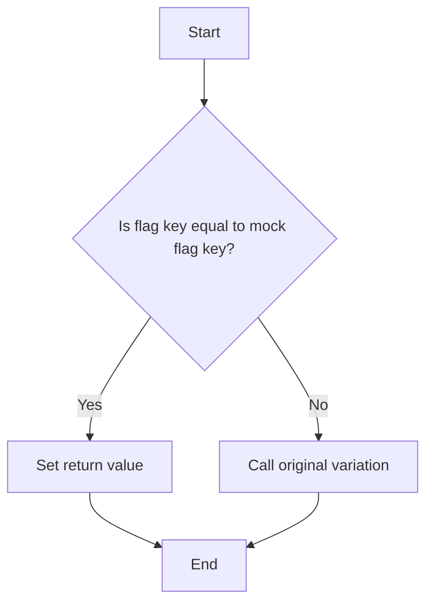

# `.\AutoGPT\autogpt_platform\backend\backend\util\feature_flag.py` 详细设计文档

This code manages feature flags for an application using LaunchDarkly, providing functionality to check feature flags, initialize and shutdown the LaunchDarkly client, and create dependencies for FastAPI endpoints.

## 整体流程



## 类结构

```
Flag (Enum)
├── is_configured() (Function)
├── get_client() (Function)
├── initialize_launchdarkly() (Function)
├── shutdown_launchdarkly() (Function)
├── _fetch_user_context_data() (Async Function)
├── get_feature_flag_value() (Async Function)
├── is_feature_enabled() (Async Function)
├── feature_flag() (Decorator)
├── create_feature_flag_dependency() (Function)
└── mock_flag_variation() (Context Manager)
```

## 全局变量及字段


### `settings`
    
Module-level settings object containing configuration information.

类型：`Settings`
    


### `_is_initialized`
    
Flag indicating whether the LaunchDarkly client has been initialized.

类型：`bool`
    


### `logger`
    
Logger instance for logging messages.

类型：`logging.Logger`
    


### `Flag.AUTOMOD`
    
Enum value representing the 'AutoMod' feature flag.

类型：`str`
    


### `Flag.AI_ACTIVITY_STATUS`
    
Enum value representing the 'ai-agent-execution-summary' feature flag.

类型：`str`
    


### `Flag.BETA_BLOCKS`
    
Enum value representing the 'beta-blocks' feature flag.

类型：`str`
    


### `Flag.AGENT_ACTIVITY`
    
Enum value representing the 'agent-activity' feature flag.

类型：`str`
    


### `Flag.ENABLE_PLATFORM_PAYMENT`
    
Enum value representing the 'enable-platform-payment' feature flag.

类型：`str`
    


### `Flag.CHAT`
    
Enum value representing the 'chat' feature flag.

类型：`str`
    


### `Settings.settings`
    
Module-level settings object containing configuration information.

类型：`Settings`
    


### `None._is_initialized`
    
Flag indicating whether the LaunchDarkly client has been initialized.

类型：`bool`
    


### `None.logger`
    
Logger instance for logging messages.

类型：`logging.Logger`
    


### `Flag.AUTOMOD`
    
Enum value representing the 'AutoMod' feature flag.

类型：`str`
    


### `Flag.AI_ACTIVITY_STATUS`
    
Enum value representing the 'ai-agent-execution-summary' feature flag.

类型：`str`
    


### `Flag.BETA_BLOCKS`
    
Enum value representing the 'beta-blocks' feature flag.

类型：`str`
    


### `Flag.AGENT_ACTIVITY`
    
Enum value representing the 'agent-activity' feature flag.

类型：`str`
    


### `Flag.ENABLE_PLATFORM_PAYMENT`
    
Enum value representing the 'enable-platform-payment' feature flag.

类型：`str`
    


### `Flag.CHAT`
    
Enum value representing the 'chat' feature flag.

类型：`str`
    
    

## 全局函数及方法


### is_configured()

Check if LaunchDarkly is configured with an SDK key.

参数：

- 无

返回值：`bool`，Indicates whether LaunchDarkly is configured with an SDK key.

#### 流程图



#### 带注释源码

```python
def is_configured() -> bool:
    """Check if LaunchDarkly is configured with an SDK key."""
    return bool(settings.secrets.launch_darkly_sdk_key)
```


### get_client()

Get the LaunchDarkly client singleton.

参数：

- 无

返回值：`LDClient`，The LaunchDarkly client singleton.

#### 流程图



#### 带注释源码

```python
def get_client() -> LDClient:
    """Get the LaunchDarkly client singleton."""
    if not _is_initialized:
        initialize_launchdarkly()
    return ldclient.get()
```


### initialize_launchdarkly()

Initialize the LaunchDarkly client with the provided SDK key.

参数：

- 无

返回值：`None`，No return value, the function is used to set up the client.

#### 流程图



#### 带注释源码

```python
def initialize_launchdarkly() -> None:
    sdk_key = settings.secrets.launch_darkly_sdk_key
    logger.debug(
        f"Initializing LaunchDarkly with SDK key: {'present' if sdk_key else 'missing'}"
    )

    if not sdk_key:
        logger.warning("LaunchDarkly SDK key not configured")
        return

    config = Config(sdk_key)
    ldclient.set_config(config)

    global _is_initialized
    _is_initialized = True
    if ldclient.get().is_initialized():
        logger.info("LaunchDarkly client initialized successfully")
    else:
        logger.error("LaunchDarkly client failed to initialize")
```


### shutdown_launchdarkly()

Shutdown the LaunchDarkly client.

参数：

- 无

返回值：`None`，无返回值

#### 流程图

```mermaid
graph TD
    A[Start] --> B[Check if LDClient is initialized]
    B -->|Yes| C[Close LDClient]
    B -->|No| D[Do nothing]
    C --> E[Log "LaunchDarkly client closed successfully"]
    D --> E
```

#### 带注释源码

```python
def shutdown_launchdarkly() -> None:
    """Shutdown the LaunchDarkly client."""
    if ldclient.get().is_initialized():
        ldclient.get().close()
        logger.info("LaunchDarkly client closed successfully")
    else:
        # No need to do anything if the client is not initialized
        pass
```


### `_fetch_user_context_data()`

Fetch user context for LaunchDarkly from Supabase.

参数：

- `user_id`：`str`，The user ID to fetch data for

返回值：`Context`，LaunchDarkly Context object

#### 流程图



#### 带注释源码

```python
@cached(maxsize=1000, ttl_seconds=86400)  # 1000 entries, 24 hours TTL
async def _fetch_user_context_data(user_id: str) -> Context:
    """
    Fetch user context for LaunchDarkly from Supabase.

    Args:
        user_id: The user ID to fetch data for

    Returns:
        LaunchDarkly Context object
    """
    builder = Context.builder(user_id).kind("user").anonymous(True)

    try:
        from backend.util.clients import get_supabase

        # If we have user data, update context
        response = get_supabase().auth.admin.get_user_by_id(user_id)
        if response and response.user:
            user = response.user
            builder.anonymous(False)
            if user.role:
                builder.set("role", user.role)
                # It's weird, I know, but it is what it is.
                builder.set("custom", {"role": user.role})
            if user.email:
                builder.set("email", user.email)
                builder.set("email_domain", user.email.split("@")[-1])

    except Exception as e:
        logger.warning(f"Failed to fetch user context for {user_id}: {e}")

    return builder.build()
```


### get_feature_flag_value()

Get the raw value of a feature flag for a user.

参数：

- `flag_key`：`str`，The LaunchDarkly feature flag key
- `user_id`：`str`，The user ID to evaluate the flag for
- `default`：`Any`，Default value if LaunchDarkly is unavailable or flag evaluation fails

返回值：`Any`，The flag value from LaunchDarkly

#### 流程图



#### 带注释源码

```python
async def get_feature_flag_value(
    flag_key: str,
    user_id: str,
    default: Any = None,
) -> Any:
    """
    Get the raw value of a feature flag for a user.

    Args:
        flag_key: The LaunchDarkly feature flag key
        user_id: The user ID to evaluate the flag for
        default: Default value if LaunchDarkly is unavailable or flag evaluation fails

    Returns:
        The flag value from LaunchDarkly
    """
    try:
        client = get_client()

        # Check if client is initialized
        if not client.is_initialized():
            logger.debug(
                f"LaunchDarkly not initialized, using default={default} for {flag_key}"
            )
            return default

        # Get user context from Supabase
        context = await _fetch_user_context_data(user_id)

        # Evaluate flag
        result = client.variation(flag_key, context, default)

        logger.debug(
            f"Feature flag {flag_key} for user {user_id}: {result} (type: {type(result).__name__})"
        )
        return result

    except Exception as e:
        logger.warning(
            f"LaunchDarkly flag evaluation failed for {flag_key}: {e}, using default={default}"
        )
        return default
```


### is_feature_enabled()

Check if a feature flag is enabled for a user.

参数：

- `flag_key`：`Flag`，The Flag enum value
- `user_id`：`str`，The user ID to evaluate the flag for
- `default`：`bool`，Default value if LaunchDarkly is unavailable or flag evaluation fails

返回值：`bool`，True if feature is enabled, False otherwise

#### 流程图



#### 带注释源码

```python
async def is_feature_enabled(
    flag_key: Flag,
    user_id: str,
    default: bool = False,
) -> bool:
    """
    Check if a feature flag is enabled for a user.

    Args:
        flag_key: The Flag enum value
        user_id: The user ID to evaluate the flag for
        default: Default value if LaunchDarkly is unavailable or flag evaluation fails

    Returns:
        True if feature is enabled, False otherwise
    """
    result = await get_feature_flag_value(flag_key.value, user_id, default)

    # If the result is already a boolean, return it
    if isinstance(result, bool):
        return result

    # Log a warning if the flag is not returning a boolean
    logger.warning(
        f"Feature flag {flag_key} returned non-boolean value: {result} (type: {type(result).__name__}). "
        f"This flag should be configured as a boolean in LaunchDarkly. Using default={default}"
    )

    # Return the default if we get a non-boolean value
    # This prevents objects from being incorrectly treated as True
    return default
```


### `is_feature_enabled`

Check if a feature flag is enabled for a user.

参数：

- `flag_key`：`Flag`，The Flag enum value
- `user_id`：`str`，The user ID to evaluate the flag for
- `default`：`bool`，Default value if LaunchDarkly is unavailable or flag evaluation fails

返回值：`bool`，True if feature is enabled, False otherwise

#### 流程图



#### 带注释源码

```python
async def is_feature_enabled(
    flag_key: Flag,
    user_id: str,
    default: bool = False,
) -> bool:
    """
    Check if a feature flag is enabled for a user.

    Args:
        flag_key: The Flag enum value
        user_id: The user ID to evaluate the flag for
        default: Default value if LaunchDarkly is unavailable or flag evaluation fails

    Returns:
        True if feature is enabled, False otherwise
    """
    result = await get_feature_flag_value(flag_key.value, user_id, default)

    # If the result is already a boolean, return it
    if isinstance(result, bool):
        return result

    # Log a warning if the flag is not returning a boolean
    logger.warning(
        f"Feature flag {flag_key} returned non-boolean value: {result} (type: {type(result).__name__}). "
        f"This flag should be configured as a boolean in LaunchDarkly. Using default={default}"
    )

    # Return the default if we get a non-boolean value
    # This prevents objects from being incorrectly treated as True
    return default
```


### create_feature_flag_dependency(Flag, default)

Create a FastAPI dependency that checks a feature flag.

参数：

- `flag_key`：`Flag`，The Flag enum value to check
- `default`：`bool`，Default value if flag evaluation fails

返回值：`Callable[[str | None], Awaitable[None]]`，An async dependency function that raises HTTPException if flag is disabled

#### 流程图



#### 带注释源码

```python
def create_feature_flag_dependency(
    flag_key: Flag,
    default: bool = False,
) -> Callable[[str | None], Awaitable[None]]:
    """
    Create a FastAPI dependency that checks a feature flag.

    This dependency automatically extracts the user_id from the JWT token
    (if present) for proper LaunchDarkly user targeting, while still
    supporting anonymous access.

    Args:
        flag_key: The Flag enum value to check
        default: Default value if flag evaluation fails

    Returns:
        An async dependency function that raises HTTPException if flag is disabled
    """

    async def check_feature_flag(
        user_id: str | None = Security(get_optional_user_id),
    ) -> None:
        """Check if feature flag is enabled for the user.

        The user_id is automatically injected from JWT authentication if present,
        or None for anonymous access.
        """
        # For routes that don't require authentication, use anonymous context
        check_user_id = user_id or "anonymous"

        if not is_configured():
            logger.debug(
                f"LaunchDarkly not configured, using default {flag_key.value}={default}"
            )
            if not default:
                raise HTTPException(status_code=404, detail="Feature not available")
            return

        try:
            client = get_client()
            if not client.is_initialized():
                logger.debug(
                    f"LaunchDarkly not initialized, using default {flag_key.value}={default}"
                )
                if not default:
                    raise HTTPException(status_code=404, detail="Feature not available")
                return

            is_enabled = await is_feature_enabled(flag_key, check_user_id, default)

            if not is_enabled:
                raise HTTPException(status_code=404, detail="Feature not available")
        except Exception as e:
            logger.warning(
                f"LaunchDarkly error for flag {flag_key.value}: {e}, using default={default}"
            )
            raise HTTPException(status_code=500, detail="Failed to check feature flag")

    return check_feature_flag
```


### mock_flag_variation(flag_key: str, return_value: Any)

This function is a context manager that allows mocking the variation of a feature flag for testing purposes.

参数：

- `flag_key`：`str`，The key of the feature flag to mock.
- `return_value`：`Any`，The value to return when the mocked flag key is evaluated.

返回值：`None`，This function does not return a value.

#### 流程图



#### 带注释源码

```python
@contextlib.contextmanager
def mock_flag_variation(flag_key: str, return_value: Any):
    """Context manager for testing feature flags."""
    original_variation = get_client().variation  # A

    def mock_variation(key, context, default):  # B
        return return_value if key == flag_key else original_variation(key, context, default)

    get_client().variation = mock_variation  # C
    try:
        yield  # D
    finally:
        get_client().variation = original_variation  # E
``` 


## 关键组件


### 张量索引与惰性加载

张量索引与惰性加载是代码中用于高效处理大型数据集的关键组件。它允许在需要时才加载数据，从而减少内存消耗并提高性能。

### 反量化支持

反量化支持是代码中用于处理量化数据的关键组件。它允许将量化数据转换回原始数据格式，以便进行进一步处理。

### 量化策略

量化策略是代码中用于优化数据存储和计算效率的关键组件。它通过减少数据精度来减少内存和计算资源的使用。


## 问题及建议


### 已知问题

-   **全局变量和函数的初始化**：代码中存在全局变量 `_is_initialized` 和全局函数 `get_client()`，这些在模块级别进行初始化和配置。这种做法可能会导致在多线程环境中出现竞态条件，特别是在 `initialize_launchdarkly()` 和 `shutdown_launchdarkly()` 函数中。
-   **异常处理**：代码中存在多处使用 `logger.warning()` 和 `logger.error()` 来记录异常信息，但没有明确的异常处理逻辑来确保系统的稳定性和健壮性。
-   **依赖注入**：代码中存在硬编码的依赖，如 `ldclient.get()` 和 `get_supabase()`，这可能导致代码难以测试和维护。
-   **代码重复**：`get_feature_flag_value()` 和 `is_feature_enabled()` 函数中存在重复的代码，这可以通过提取公共逻辑来优化。

### 优化建议

-   **线程安全**：使用线程锁（例如 `threading.Lock`）来确保全局变量和函数的线程安全。
-   **异常处理**：实现更详细的异常处理逻辑，确保在发生异常时能够优雅地处理并恢复。
-   **依赖注入**：使用依赖注入框架或模式来管理依赖，以便于测试和替换。
-   **代码重构**：重构重复的代码，例如创建一个通用的函数来获取特征标志值。
-   **单元测试**：编写单元测试来覆盖关键功能，确保代码的稳定性和可靠性。
-   **代码风格**：遵循一致的代码风格指南，以提高代码的可读性和可维护性。


## 其它


### 设计目标与约束

- 设计目标：
  - 提供一个模块化的特征标志管理解决方案，允许异步函数根据特征标志的启用状态进行条件访问。
  - 确保特征标志的配置和评估过程安全可靠，避免敏感数据泄露。
  - 提供灵活的配置选项，允许在不同环境中调整特征标志的行为。

- 约束：
  - 必须使用LaunchDarkly SDK进行特征标志的配置和评估。
  - 特征标志的配置必须遵循LaunchDarkly的规范和最佳实践。
  - 代码必须兼容FastAPI框架。

### 错误处理与异常设计

- 错误处理：
  - 在特征标志评估过程中，如果发生异常（如网络问题、配置错误等），将记录警告日志并返回默认值。
  - 如果特征标志评估失败，将返回默认值并记录警告日志。
  - 如果特征标志的值不是布尔值，将记录警告日志并使用默认值。

- 异常设计：
  - 使用HTTPException来处理特征标志未启用的情况，返回404状态码。
  - 使用HTTPException来处理内部错误，返回500状态码。

### 数据流与状态机

- 数据流：
  - 用户请求异步函数时，首先检查特征标志是否启用。
  - 如果特征标志启用，则执行函数。
  - 如果特征标志未启用，则返回404状态码。

- 状态机：
  - 特征标志的状态可以是启用或禁用。
  - 状态由LaunchDarkly SDK根据配置和用户上下文动态评估。

### 外部依赖与接口契约

- 外部依赖：
  - LaunchDarkly SDK
  - FastAPI框架
  - Supabase（用于获取用户上下文）

- 接口契约：
  - `get_feature_flag_value`：获取特征标志的值。
  - `is_feature_enabled`：检查特征标志是否启用。
  - `feature_flag`：装饰器，用于保护异步函数。
  - `create_feature_flag_dependency`：创建FastAPI依赖项，用于检查特征标志。
  - `mock_flag_variation`：上下文管理器，用于测试特征标志。


    