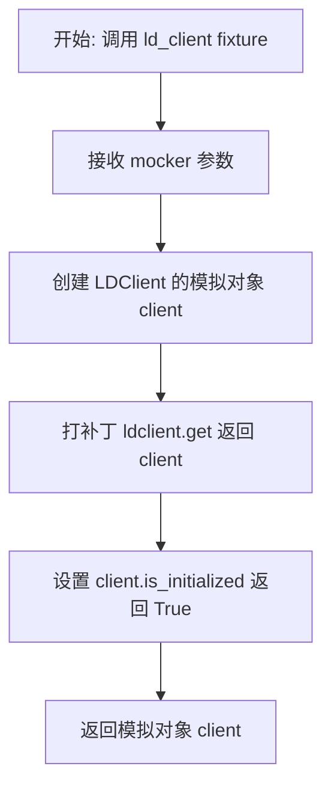
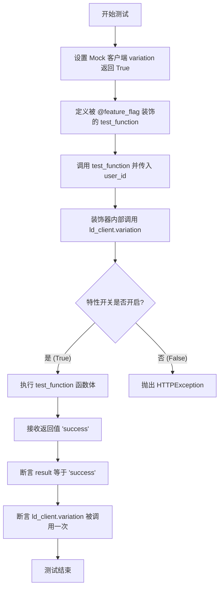
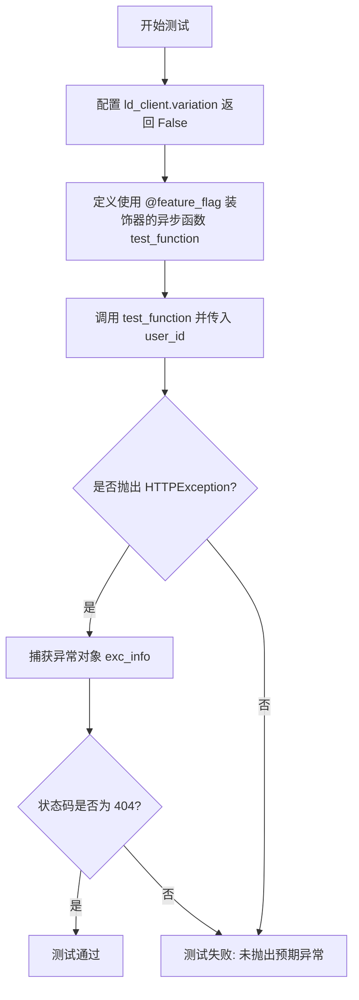
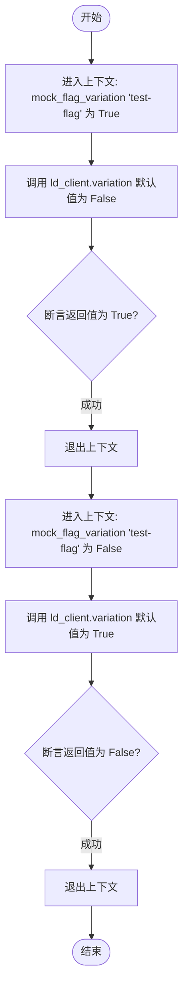
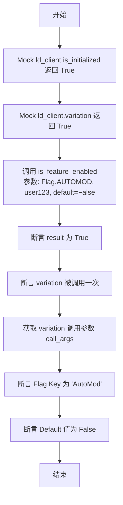
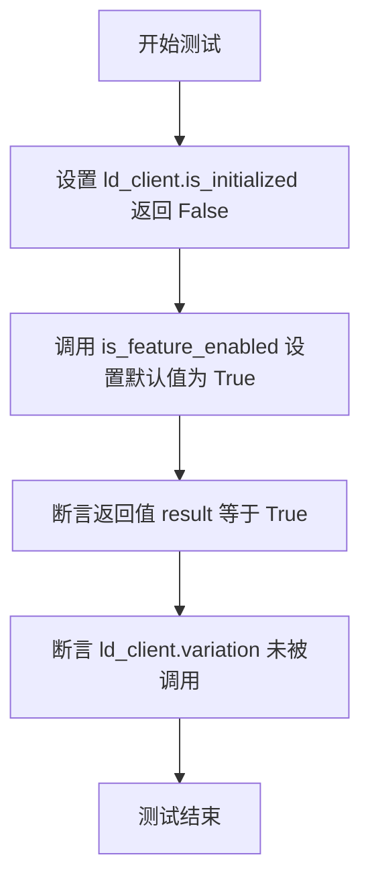
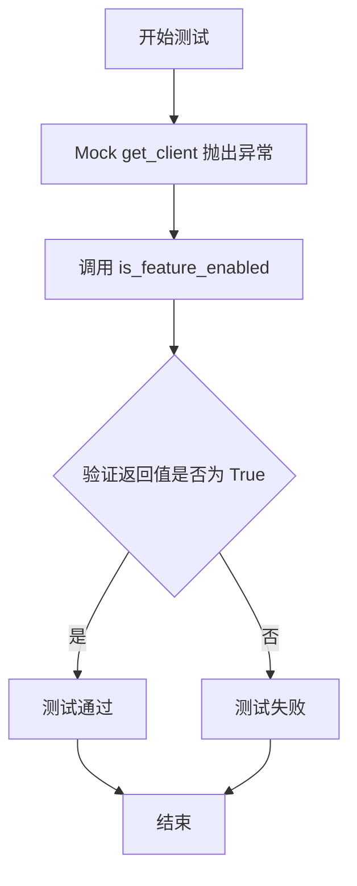
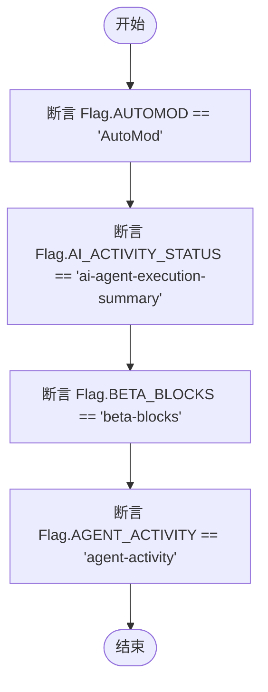
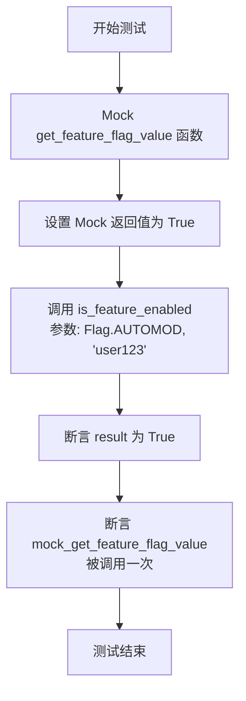

# `.\AutoGPT\autogpt_platform\backend\backend\util\feature_flag_test.py` 详细设计文档

该文件是一套基于 pytest 的单元测试集合，旨在验证 LaunchDarkly 功能标志系统的集成逻辑。它覆盖了功能开关装饰器的行为（启用/未授权响应）、辅助函数的多种状态（正常、未初始化、异常）、模拟机制的上下文管理器以及枚举值的正确性。

## 整体流程

```mermaid
graph TD
    A[开始测试] --> B[Fixture: 初始化 Mock LDClient]
    B --> C{测试装饰器行为}
    C --> D[测试: 功能开启]
    C --> E[测试: 功能关闭 (预期 404)]
    D & E --> F{测试辅助函数}
    F --> G[测试: 正常启用逻辑]
    F --> H[测试: 客户端未初始化]
    F --> I[测试: 获取客户端异常]
    G & H & I --> J{测试 Mock 与 枚举}
    J --> K[测试: 模拟变体上下文]
    J --> L[测试: 枚举值校验]
    J --> M[测试: 枚举参数传递]
    K & L & M --> N[结束测试]
    style D fill:#d1fae5,stroke:#10b981
    style E fill:#fee2e2,stroke:#ef4444
    style G fill:#d1fae5,stroke:#10b981
    style H fill:#fef3c7,stroke:#f59e0b
    style I fill:#fef3c7,stroke:#f59e0b
```

## 类结构

```
Test Module: Feature Flag Tests
├── Fixtures
│   └── ld_client (LDClient Mock)
├── Decorator Logic Tests
│   ├── test_feature_flag_enabled
│   └── test_feature_flag_unauthorized_response
├── Helper Function Tests
│   ├── test_is_feature_enabled
│   ├── test_is_feature_enabled_not_initialized
│   ├── test_is_feature_enabled_exception
│   └── test_is_feature_enabled_with_flag_enum
└── Utility & Integration Tests
    ├── test_mock_flag_variation
    └── test_flag_enum_values
```

## 全局变量及字段


    

## 全局函数及方法


### `ld_client`

这是一段 pytest fixture，用于模拟 LaunchDarkly 客户端。它创建一个配置好的 Mock 对象，通过打补丁替换全局客户端获取逻辑，并将客户端状态设置为已初始化，以便在单元测试中隔离测试功能开关逻辑。

参数：

-  `moker`：`pytest_mock.MockerFixture`，pytest-mock 提供的 fixture，用于创建模拟对象和打补丁。

返回值：`unittest.mock.MagicMock`，模拟的 LaunchDarkly 客户端实例，其行为被预设为已初始化状态。

#### 流程图



#### 带注释源码

```python
@pytest.fixture
def ld_client(mocker):
    # 创建一个符合 LDClient 接口的 Mock 对象
    client = mocker.Mock(spec=LDClient)
    
    # 将 ldclient.get 函数打补丁，使其在任何调用时都返回上面创建的 mock client
    # 这样在测试代码中获取 LaunchDarkly 客户端时，会得到这个模拟对象
    mocker.patch("ldclient.get", return_value=client)
    
    # 预设模拟客户端的 is_initialized 方法返回 True
    # 模拟客户端已成功连接和初始化的状态
    client.is_initialized.return_value = True
    
    # 返回配置好的 mock 对象供测试使用
    return client
```


### `test_feature_flag_enabled`

该测试函数用于验证当特性开关（Feature Flag）在 LaunchDarkly 中被启用（返回 True）时，使用 `@feature_flag` 装饰器装饰的异步函数能够正常执行并返回预期的成功结果，同时确认底层客户端正确调用了特性开关查询接口。

参数：

-   `ld_client`：`MagicMock`，通过 pytest fixture 注入的模拟 LaunchDarkly 客户端对象。

返回值：`None`，该函数为测试用例，无显式返回值，主要通过断言验证行为。

#### 流程图



#### 带注释源码

```python
@pytest.mark.asyncio
async def test_feature_flag_enabled(ld_client):
    # 模拟 LaunchDarkly 客户端的 variation 方法返回 True，
    # 表示名为 "test-flag" 的特性开关对当前用户是开启状态。
    ld_client.variation.return_value = True

    # 使用 feature_flag 装饰器定义一个测试函数，指定开关 key 为 "test-flag"
    @feature_flag("test-flag")
    async def test_function(user_id: str):
        return "success"

    # 调用被装饰的异步函数，模拟用户请求
    result = await test_function(user_id="test-user")
    
    # 断言：验证函数成功执行并返回了预期的字符串 "success"
    assert result == "success"
    
    # 断言：验证 LaunchDarkly 客户端的 variation 方法确实被调用了一次，
    # 确保特性开关检查逻辑已执行。
    ld_client.variation.assert_called_once()
```


### `test_feature_flag_unauthorized_response`

该测试函数用于验证当功能标志被禁用时（即 LaunchDarkly 客户端返回 False），使用 `feature_flag` 装饰器修饰的异步函数是否会正确抛出状态码为 404 的 HTTPException，从而模拟未授权或功能不可访问的场景。

参数：

- `ld_client`：`mocker.Mock`，通过 pytest fixture 注入的 LaunchDarkly 客户端模拟对象，用于控制功能标志的返回值。

返回值：`None`，该函数为测试函数，没有返回值。

#### 流程图



#### 带注释源码

```python
@pytest.mark.asyncio  # 标记该测试函数为异步测试
async def test_feature_flag_unauthorized_response(ld_client):
    # 设置模拟的 LaunchDarkly 客户端 variation 方法返回 False
    # 这表示当前功能标志对用户是关闭的
    ld_client.variation.return_value = False

    # 定义一个内部异步函数，并使用 feature_flag 装饰器进行保护
    @feature_flag("test-flag")
    async def test_function(user_id: str):
        return "success"

    # 验证调用被装饰的函数时是否抛出 HTTPException
    # 因为标志返回 False，预期装饰器会阻止执行并抛出异常
    with pytest.raises(HTTPException) as exc_info:
        await test_function(user_id="test-user")
    
    # 断言抛出的异常状态码为 404，表示未找到或未授权访问该功能
    assert exc_info.value.status_code == 404
```


### `test_mock_flag_variation`

验证 `mock_flag_variation` 上下文管理器功能，确保在测试用例中能够强制覆盖 LaunchDarkly 特性标志的返回值（无论默认值如何），以控制测试环境中的特性开关状态。

参数：

-   `ld_client`：`Mock`，模拟的 LaunchDarkly 客户端实例，由 fixture 注入。

返回值：`None`，无返回值。

#### 流程图



#### 带注释源码

```python
def test_mock_flag_variation(ld_client):
    # 使用 mock_flag_variation 上下文管理器将 'test-flag' 强制设为 True
    with mock_flag_variation("test-flag", True):
        # 调用 ld_client.variation，即使传入默认值为 False，由于 mock 作用，应返回 True
        assert ld_client.variation("test-flag", None, False) is True

    # 使用 mock_flag_variation 上下文管理器将 'test-flag' 强制设为 False
    with mock_flag_variation("test-flag", False):
        # 调用 ld_client.variation，即使传入默认值为 True，由于 mock 作用，应返回 False
        assert ld_client.variation("test-flag", None, True) is False
```


### `test_is_feature_enabled`

测试 `is_feature_enabled` 辅助函数在 LaunchDarkly 客户端已初始化并返回启用状态时的行为是否正确。

参数：

-   `ld_client`：`LDClient | Mock`，由 pytest fixture 提供的 LaunchDarkly 客户端的模拟实例。

返回值：`None`，该函数为测试用例，无返回值，主要通过断言验证逻辑。

#### 流程图



#### 带注释源码

```python
@pytest.mark.asyncio
async def test_is_feature_enabled(ld_client):
    """Test the is_feature_enabled helper function."""
    # 模拟 LaunchDarkly 客户端已成功初始化
    ld_client.is_initialized.return_value = True
    # 模拟功能标志变体返回值为 True (即功能开启)
    ld_client.variation.return_value = True

    # 调用目标函数 is_feature_enabled
    # 传入 Flag 枚举中的 AUTOMOD，用户 ID "user123"，默认值 False
    result = await is_feature_enabled(Flag.AUTOMOD, "user123", default=False)
    
    # 断言函数返回结果为 True
    assert result is True

    # 验证 LD 客户端的 variation 方法确实被调用了一次
    ld_client.variation.assert_called_once()
    
    # 获取 variation 方法的调用参数
    call_args = ld_client.variation.call_args
    
    # 断言调用时的第一个参数（flag_key）等于 "AutoMod"
    assert call_args[0][0] == "AutoMod"  # flag_key
    # 断言调用时的第三个参数（默认值）等于 False
    assert call_args[0][2] is False  # default value
```


### `test_is_feature_enabled_not_initialized`

测试当 LaunchDarkly 客户端未初始化时，`is_feature_enabled` 辅助函数是否能正确返回默认值，并且不调用客户端的具体变体查询方法。

参数：

-  `ld_client`：`Mock`，LaunchDarkly 客户端的模拟对象，用于控制测试环境和验证调用。

返回值：`None`，无返回值，主要用于执行断言逻辑。

#### 流程图



#### 带注释源码

```python
@pytest.mark.asyncio
async def test_is_feature_enabled_not_initialized(ld_client):
    """Test is_feature_enabled when LaunchDarkly is not initialized."""
    # 模拟 LaunchDarkly 客户端未完成初始化的状态
    ld_client.is_initialized.return_value = False

    # 调用 is_feature_enabled 函数，传入标志位、用户ID和默认值 True
    result = await is_feature_enabled(Flag.AGENT_ACTIVITY, "user123", default=True)
    
    # 验证结果是否为默认值 True，因为在未初始化时应回退到默认值
    assert result is True  # Should return default

    # 验证客户端的 variation 方法未被调用，确保未初始化时没有进行实际的远程查询
    ld_client.variation.assert_not_called()
```


### `test_is_feature_enabled_exception`

该函数是一个异步测试用例，用于验证当获取 LaunchDarkly 客户端（`get_client`）发生异常时，`is_feature_enabled` 函数能否正确处理错误并返回指定的默认值。

参数：

-  `moker`：`pytest_mock.MockerFixture`，pytest-mock 提供的 fixture，用于模拟和修补对象及函数行为。

返回值：`None`，该函数为测试用例，无返回值，主要通过断言验证逻辑正确性。

#### 流程图



#### 带注释源码

```python
@pytest.mark.asyncio
async def test_is_feature_enabled_exception(mocker):
    """Test is_feature_enabled when get_client() raises an exception."""
    # 模拟 backend.util.feature_flag.get_client 方法，使其抛出异常，模拟客户端获取失败的场景
    mocker.patch(
        "backend.util.feature_flag.get_client",
        side_effect=Exception("Client error"),
    )

    # 调用 is_feature_enabled 函数
    # 预期：由于 get_client 抛出异常，函数应捕获异常并返回传入的默认值 True
    result = await is_feature_enabled(Flag.AGENT_ACTIVITY, "user123", default=True)
    
    # 断言返回结果为 True，验证在异常情况下的降级逻辑是否正常工作
    assert result is True  # Should return default
```


### `test_flag_enum_values`

该函数是一个单元测试，用于验证 `Flag` 枚举类中的各个成员变量是否映射到了预期的字符串键值，确保代码中使用的标识符与 LaunchDarkly 或其他特性标志服务中的实际 Key 保持一致。

参数：

无

返回值：`None`，该函数不返回值，仅执行断言逻辑。

#### 流程图



#### 带注释源码

```python
def test_flag_enum_values():
    """Test that Flag enum has expected values."""
    # 验证 Flag 枚举中的 AUTOMOD 成员值是否等于字符串 "AutoMod"
    assert Flag.AUTOMOD == "AutoMod"
    # 验证 Flag 枚举中的 AI_ACTIVITY_STATUS 成员值是否等于字符串 "ai-agent-execution-summary"
    assert Flag.AI_ACTIVITY_STATUS == "ai-agent-execution-summary"
    # 验证 Flag 枚举中的 BETA_BLOCKS 成员值是否等于字符串 "beta-blocks"
    assert Flag.BETA_BLOCKS == "beta-blocks"
    # 验证 Flag 枚举中的 AGENT_ACTIVITY 成员值是否等于字符串 "agent-activity"
    assert Flag.AGENT_ACTIVITY == "agent-activity"
```


### `test_is_feature_enabled_with_flag_enum`

该测试函数旨在验证 `is_feature_enabled` 辅助函数在接收 `Flag` 枚举类型作为参数时的行为是否正确。它通过模拟底层的 `get_feature_flag_value` 方法，确保 `is_feature_enabled` 能够正确处理枚举输入、返回预期的布尔值，并调用了正确的内部逻辑。

参数：

- `mocker`：`pytest_mock.MockerFixture`，pytest 提供的模拟对象 fixture，用于 patch 和模拟函数或对象的行为。

返回值：`None`，该函数为测试用例，无显式返回值。

#### 流程图



#### 带注释源码

```python
@pytest.mark.asyncio
async def test_is_feature_enabled_with_flag_enum(mocker):
    """Test is_feature_enabled function with Flag enum."""
    # 模拟 backend.util.feature_flag 模块中的 get_feature_flag_value 函数
    mock_get_feature_flag_value = mocker.patch(
        "backend.util.feature_flag.get_feature_flag_value"
    )
    # 配置模拟函数的返回值为 True
    mock_get_feature_flag_value.return_value = True

    # 调用待测函数 is_feature_enabled，传入 Flag 枚举成员 AUTOMOD 和用户 ID
    result = await is_feature_enabled(Flag.AUTOMOD, "user123")

    # 断言函数返回结果为 True
    assert result is True
    # 断言底层的 get_feature_flag_value 函数被调用了一次
    # Should call with the flag's string value
    mock_get_feature_flag_value.assert_called_once()
```


## 关键组件


### Feature Flag Decorator

通过装饰器实现的访问控制机制，用于根据 LaunchDarkly 的配置状态决定是否执行异步函数，在功能未开启时直接抛出 404 HTTPException。

### Feature Flag Checker

一个异步辅助函数（`is_feature_enabled`），用于查询特定功能标志的状态，具备异常捕获和初始化状态检查逻辑，确保在服务不可用时返回安全的默认值。

### Mock Context Manager

用于测试的上下文管理器（`mock_flag_variation`），允许在特定作用域内临时覆盖 LaunchDarkly 客户端的返回值，以便于模拟不同的功能开关场景。

### Flag Enumeration

定义了系统中所有功能标志键的枚举类（`Flag`），提供了类型安全的常量映射（如 AUTOMOD, AGENT_ACTIVITY），用于规范标志的引用。

### LaunchDarkly Client Integration

基于 LaunchDarkly SDK（`LDClient`）的外部集成层，负责连接远程配置服务、获取变体数据以及管理客户端的初始化生命周期。


## 问题及建议


### 已知问题

-   异常处理掩盖配置错误风险。代码测试显示当 `get_client()` 抛出异常或客户端未初始化时，函数会静默返回默认值。这种“Fail Closed/Open”策略虽然保证了服务可用性，但会掩盖 LaunchDarkly 的配置错误或网络故障，导致功能开关的实际状态不可预期且难以排查。
-   全局单例依赖影响解耦。测试中通过 `mocker.patch("ldclient.get", ...)` 来模拟客户端，暗示被测代码依赖全局客户端实例（Global Singleton）。这种设计使得依赖注入变得困难，降低了代码的可测试性和模块化程度。
-   异步包装潜在的阻塞问题。测试用例使用了 `@pytest.mark.asyncio` 标记，表明相关接口设计为异步。然而，LaunchDarkly 的标准 Python 客户端 (`ldclient`) 是同步的。如果在 FastAPI 等异步框架中直接调用同步 SDK 方法，可能会阻塞事件循环，从而显著降低应用的并发吞吐量。

### 优化建议

-   增强可观测性（日志记录）。在捕获异常并返回默认值时，必须增加结构化日志记录（例如 Warning 或 Error 级别），输出具体的异常信息和 Flag Key。这样可以在出现服务降级时，让运维和开发人员迅速感知 Feature Flag 服务的异常状态。
-   引入本地缓存机制。Feature Flag 的数据通常不会在毫秒级频繁变化。建议在内存中引入缓存层（例如结合 LRU 策略），对 Flag 的判定结果进行短时间缓存。这样可以大幅减少对远程 LaunchDarkly 服务的网络请求，降低延迟并提升系统性能。
-   使用线程池隔离阻塞调用。鉴于标准 SDK 是同步的，建议使用 `run_in_executor` 将 Feature Flag 的查询操作放入单独的线程池中执行，避免阻塞主事件循环，从而保证 FastAPI 应用的异步性能不受影响。
-   细化降级策略。目前的降级策略是统一返回默认值。建议针对不同的错误类型（如网络超时、权限错误、客户端未初始化）制定更细化的降级策略。例如，对于网络超时可以返回缓存中的旧值，而不是直接返回硬编码的默认值。


## 其它


### 设计目标与约束

**设计目标：**
1.  **功能开关控制**：实现对后端功能（如 AutoMod, Agent Activity）的动态开启与关闭，无需重新部署代码即可控制不同用户对特定功能的访问权限。
2.  **故障安全机制**：确保当外部功能标志服务不可用或未初始化时，系统能够优雅降级，避免因功能标志服务异常导致核心业务流程中断。
3.  **低侵入性集成**：通过装饰器模式提供功能开关能力，尽可能减少对业务逻辑代码的侵入和修改。

**约束条件：**
1.  **外部依赖**：强依赖 LaunchDarkly 的 `LDClient`，必须保证客户端的单例模式正确初始化。
2.  **异步兼容性**：被装饰的业务函数主要为异步函数 (`async def`)，功能检查逻辑必须支持 FastAPI 的异步上下文。
3.  **隐藏策略**：当功能关闭时，系统应返回 404 Not Found，模拟资源不存在的状态，而非 403 Forbidden，以隐藏功能入口。

### 错误处理与异常设计

1.  **功能禁用异常 (HTTPException 404)**：
    *   **触发场景**：当 `feature_flag` 装饰器检测到 LaunchDarkly 返回的标志值为 `False` 时。
    *   **处理逻辑**：立即抛出 `HTTPException`，状态码设为 404，阻止后续业务逻辑执行，向客户端隐藏该功能的存在。

2.  **服务未初始化或连接异常**：
    *   **触发场景**：调用 `is_feature_enabled` 时，`LDClient` 未初始化 (`is_initialized` 为 False) 或 `get_client()` 抛出异常。
    *   **处理逻辑**：捕获异常并忽略，不抛出错误，直接返回传入的 `default` 参数值。这保证了即使配置中心挂掉，系统仍能按照默认配置运行（通常是旧版行为或安全模式）。

3.  **Mock 上下文覆盖**：
    *   **机制**：在测试环境中，通过 `mock_flag_variation` 上下文管理器强制覆盖标志值，仅在该上下文内生效，退出后自动恢复，不影响全局状态。

### 外部依赖与接口契约

**外部依赖：**
1.  **LaunchDarkly SDK (`ldclient`)**：
    *   **组件**：`LDClient`
    *   **描述**：用于从 LaunchDarkly 服务端获取实时功能标志配置。

**接口契约：**
1.  **`LDClient.variation(key, user, default)`**：
    *   **输入**：标志键 (字符串)、用户上下文对象、默认值。
    *   **输出**：布尔值 (True/False) 或特定类型值。
    *   **契约要求**：如果客户端未初始化或请求超时，SDK 应返回默认值而非抛出阻塞异常。代码逻辑假定该方法遵循此契约。

2.  **`backend.util.feature_flag.get_client()`**：
    *   **描述**：内部封装的获取 `LDClient` 单例的函数。
    *   **契约要求**：返回一个可用的 `LDClient` 实例或在发生严重错误时抛出异常（由 `is_feature_enabled` 捕获）。

### 数据流与状态机

**数据流：**
1.  **请求入口**：HTTP 请求到达 FastAPI 端点，该端点被 `@feature_flag("flag-key")` 装饰。
2.  **标志解析**：装饰器调用 `is_feature_enabled`。
3.  **状态检查**：
    *   检查 `LDClient` 是否初始化。
    *   若未初始化，回退到 `default` 状态。
    *   若已初始化，调用 `client.variation()` 获取远程状态。
4.  **决策分支**：
    *   **分支 A (Enabled)**：标志为 `True`，执行被装饰的异步函数，返回业务数据。
    *   **分支 B (Disabled)**：标志为 `False`，触发 `HTTPException(404)`，中断请求。
    *   **分支 C (Error)**：发生网络或 SDK 异常，返回 `default` 值（通常为 False，触发 404，或根据配置决定）。

**状态机：**
*   **状态 1: Uninitialized (未初始化)** -> 动作：检查 `is_initialized()` -> 结果：False -> 转至 **Default Fallback (默认回退)**。
*   **状态 2: Evaluating (评估中)** -> 动作：请求 `LDClient.variation()` -> 结果：成功/异常。
    *   成功且为 True -> 转至 **Function Execution (函数执行)**。
    *   成功且为 False -> 转至 **Access Denied (拒绝访问)**。
    *   异常 -> 转至 **Default Fallback (默认回退)**。

### 测试策略与覆盖率

1.  **Mock 策略**：
    *   使用 `pytest-mock` 模拟 `LDClient`，避免在单元测试中发起真实的网络请求，确保测试的独立性和速度。
    *   `mocker.patch("ldclient.get")` 确保获取到的是模拟对象而非真实客户端。

2.  **核心测试场景**：
    *   **正常路径**：标志开启时验证函数成功执行并返回预期结果。
    *   **拒绝路径**：标志关闭时验证抛出 `HTTPException` 且状态码为 404。
    *   **边界条件**：模拟客户端未初始化 (`is_initialized=False`)，验证逻辑是否安全回退到默认值。
    *   **异常注入**：模拟 `get_client()` 抛出通用异常，验证异常捕获机制及默认值返回逻辑。

3.  **枚举完整性测试**：
    *   验证 `Flag` 枚举类中的字符串键值与 LaunchDarkly 控制台配置的键值严格一致，防止因字符串拼写错误导致功能开关失效。

4.  **异步测试**：
    *   所有测试用例均使用 `@pytest.mark.asyncio`，确保装饰器和辅助函数在 FastAPI 的异步事件循环中表现正常。

    