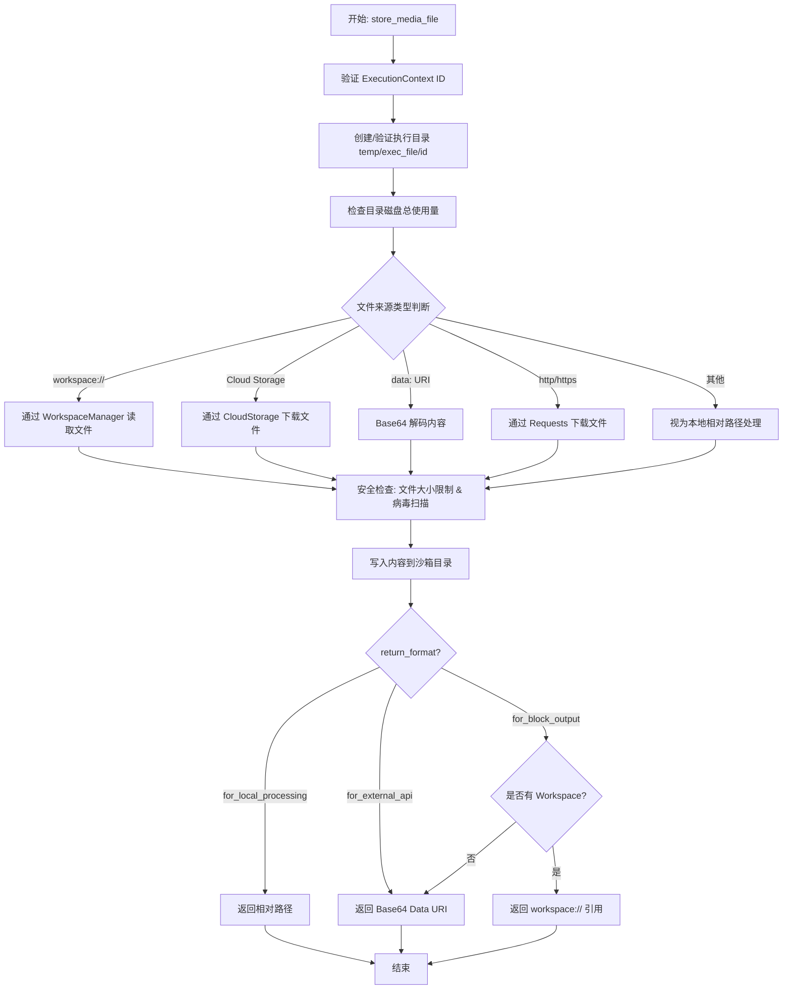
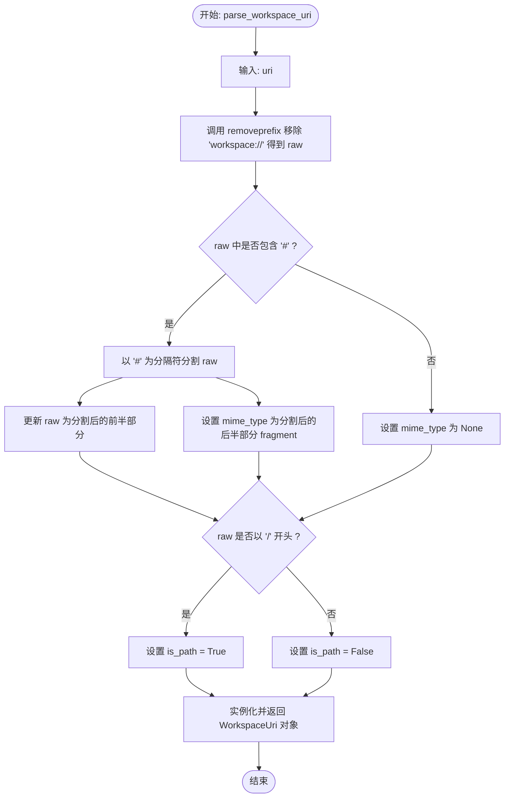
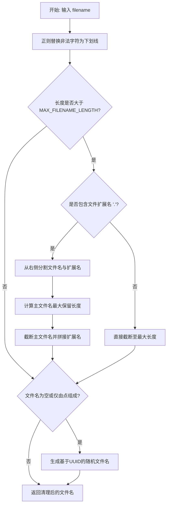
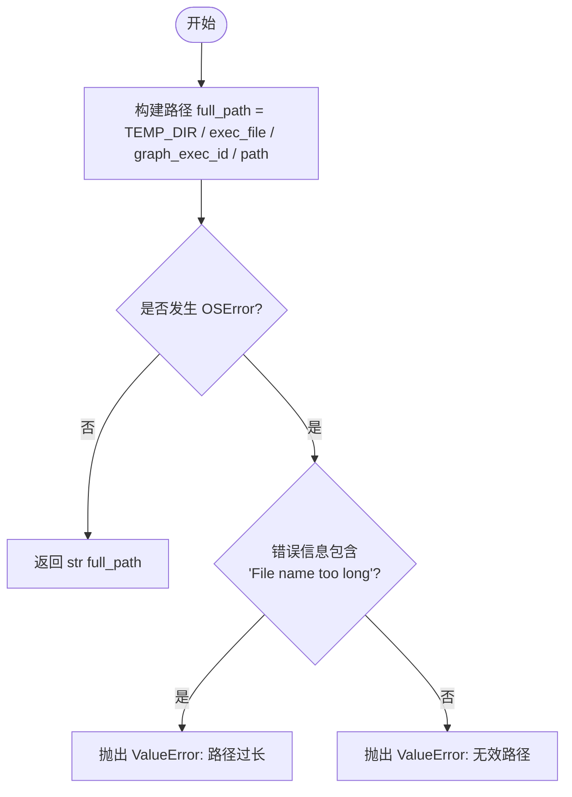
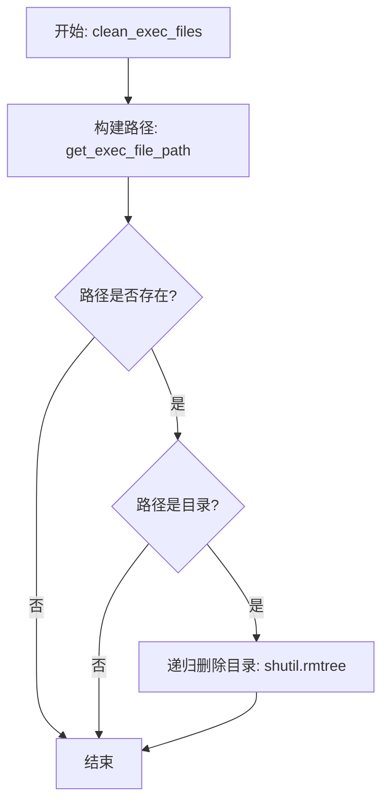
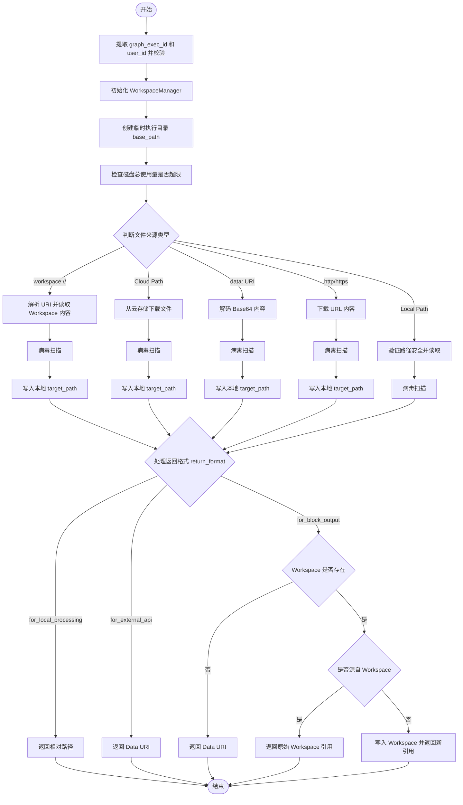
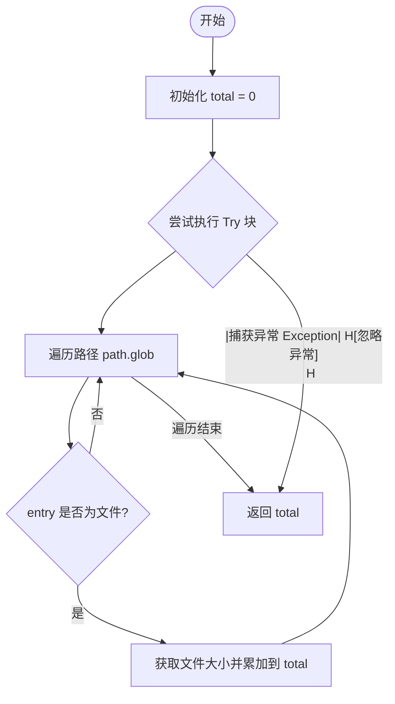
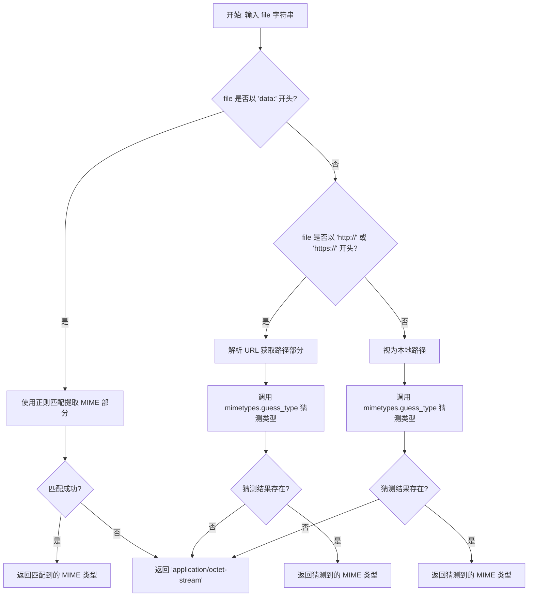

# `.\AutoGPT\autogpt_platform\backend\backend\util\file.py` 详细设计文档

该代码模块提供了在图执行上下文中安全处理媒体文件的核心功能，支持从Data URI、URL、工作区引用及本地路径等多种来源摄取文件，进行病毒扫描、文件大小限制检查及路径沙箱化处理，并根据需求将文件转换为本地路径、Base64 Data URI或工作区引用格式返回。

## 整体流程



## 类结构

```
WorkspaceUri (Pydantic Model)
├── file_ref: str
├── mime_type: str | None
└── is_path: bool
```

## 全局变量及字段


### `TEMP_DIR`
    
系统临时目录的绝对路径对象，用于存储执行过程中的临时文件

类型：`Path`
    


### `MAX_FILENAME_LENGTH`
    
文件名的最大长度限制，用于防止大多数文件系统因文件名过长而产生的错误

类型：`int`
    


### `MediaReturnFormat`
    
定义 store_media_file 函数支持的返回格式类型的字面量，包括本地处理路径、外部API数据URI和区块输出格式

类型：`Literal`
    


### `WorkspaceUri.file_ref`
    
文件ID或文件路径（例如 "abc123" 或 "/path/to/file.txt"）

类型：`str`
    


### `WorkspaceUri.mime_type`
    
从URI片段中解析出的MIME类型（例如 "video/mp4"），如果未指定则为None

类型：`str | None`
    


### `WorkspaceUri.is_path`
    
标志位，指示 file_ref 字段是否为路径格式（即以 "/" 开头）

类型：`bool`
    
    

## 全局函数及方法


### `parse_workspace_uri`

该函数用于解析特定格式的 `workspace://` URI，将其分解为文件引用（ID 或路径）、MIME 类型以及路径标识等组件，并返回一个结构化的 `WorkspaceUri` 对象。

参数：

- `uri`：`str`，待解析的 workspace URI 字符串（例如 "workspace://abc123#video/mp4"）。

返回值：`WorkspaceUri`，包含解析后的 file_ref（文件ID或路径）、mime_type（MIME类型）和 is_path（是否为路径）的 Pydantic 模型对象。

#### 流程图



#### 带注释源码

```python
def parse_workspace_uri(uri: str) -> WorkspaceUri:
    """Parse a workspace:// URI into its components.

    Examples:
        "workspace://abc123"            → WorkspaceUri(file_ref="abc123", mime_type=None, is_path=False)
        "workspace://abc123#video/mp4"  → WorkspaceUri(file_ref="abc123", mime_type="video/mp4", is_path=False)
        "workspace:///path/to/file.txt" → WorkspaceUri(file_ref="/path/to/file.txt", mime_type=None, is_path=True)
    """
    # 移除 URI 前缀 "workspace://"，获取核心部分
    raw = uri.removeprefix("workspace://")
    
    # 初始化 MIME 类型为 None
    mime_type: str | None = None
    
    # 检查是否存在 Fragment (即 MIME 类型部分，通常以 # 分隔)
    if "#" in raw:
        # 将字符串分为文件引用和 MIME 类型两部分
        raw, fragment = raw.split("#", 1)
        # 如果 fragment 不为空，则赋值给 mime_type，否则为 None
        mime_type = fragment or None
        
    # 返回解析后的对象，并根据 raw 是否以 '/' 开头来判断是否为路径
    return WorkspaceUri(
        file_ref=raw,
        mime_type=mime_type,
        is_path=raw.startswith("/"),
    )
```


### `sanitize_filename`

Sanitize and truncate filename to prevent filesystem errors.

参数：

-  `filename`：`str`，需要清理和截断的原始文件名字符串。

返回值：`str`，经过处理后的安全文件名字符串。

#### 流程图



#### 带注释源码

```python
def sanitize_filename(filename: str) -> str:
    """
    Sanitize and truncate filename to prevent filesystem errors.
    """
    # 移除或替换非法字符 (<>:"/\\|?*\n\r\t) 为下划线
    sanitized = re.sub(r'[<>:"/\\|?*\n\r\t]', "_", filename)

    # 如果文件名过长，则进行截断
    if len(sanitized) > MAX_FILENAME_LENGTH:
        # 尽可能保留文件扩展名
        if "." in sanitized:
            # 从右侧分割主文件名和扩展名
            name, ext = sanitized.rsplit(".", 1)
            # 计算主文件名的最大允许长度
            max_name_length = MAX_FILENAME_LENGTH - len(ext) - 1
            # 截断主文件名并重新拼接扩展名
            sanitized = name[:max_name_length] + "." + ext
        else:
            # 没有扩展名则直接截断
            sanitized = sanitized[:MAX_FILENAME_LENGTH]

    # 确保文件名不为空或仅仅由点号组成
    if not sanitized or sanitized.strip(".") == "":
        # 如果无效，生成一个随机的文件名 (file_ + 8位随机十六进制字符)
        sanitized = f"file_{uuid.uuid4().hex[:8]}"

    return sanitized
```


### `get_exec_file_path`

Utility to build an absolute path in the {temp}/exec_file/{exec_id}/... folder.

参数：

- `graph_exec_id`：`str`，The unique identifier for the graph execution, used to isolate files.
- `path`：`str`，The relative file path or filename within the execution directory.

返回值：`str`，The constructed absolute file path as a string.

#### 流程图



#### 带注释源码

```python
def get_exec_file_path(graph_exec_id: str, path: str) -> str:
    """
    Utility to build an absolute path in the {temp}/exec_file/{exec_id}/... folder.
    """
    try:
        # 拼接临时目录、固定子目录'exec_file'、执行ID和传入路径，构建完整路径
        full_path = TEMP_DIR / "exec_file" / graph_exec_id / path
        # 将路径对象转换为字符串返回
        return str(full_path)
    except OSError as e:
        # 捕获操作系统错误，检查是否为文件名过长导致的错误
        if "File name too long" in str(e):
            raise ValueError(
                f"File path too long: {len(path)} characters. Maximum path length exceeded."
            ) from e
        # 处理其他无效路径错误
        raise ValueError(f"Invalid file path: {e}") from e
```


### `clean_exec_files`

用于移除指定执行ID对应的临时文件目录及其内容的工具函数。

参数：

-  `graph_exec_id`：`str`，图的执行ID，用于定位临时文件目录。
-  `file`：`str`，可选参数，默认为空字符串。指定要删除的相对路径。如果为空，则清理整个执行目录。

返回值：`None`，无返回值。

#### 流程图



#### 带注释源码

```python
def clean_exec_files(graph_exec_id: str, file: str = "") -> None:
    """
    Utility to remove the {temp}/exec_file/{exec_id} folder and its contents.
    """
    # 根据执行ID和文件路径构建完整的绝对路径对象
    exec_path = Path(get_exec_file_path(graph_exec_id, file))
    # 检查路径是否存在，并且确保它是一个目录
    if exec_path.exists() and exec_path.is_dir():
        # 使用 shutil.rmtree 递归删除整个目录树及其内容
        shutil.rmtree(exec_path)
```


### `store_media_file`

安全处理来自不同来源的媒体文件（Data URI、URL、workspace 引用或本地路径），将其下载或验证后存储在临时的执行目录中，并按照指定的格式（本地路径、Data URI 或 workspace 引用）返回处理后的文件结果。

参数：

-  `file`：`MediaFileType`，输入文件，可以是 Data URI、URL、workspace:// 引用或本地相对路径。
-  `execution_context`：`"ExecutionContext"`，执行上下文对象，包含 user_id、graph_exec_id、workspace_id 等信息。
-  `return_format`：`MediaReturnFormat`，期望的返回格式，可选值为 "for_local_processing"（本地处理路径）、"for_external_api"（Data URI）或 "for_block_output"（最佳输出格式）。

返回值：`MediaFileType`，根据 `return_format` 参数返回相应的文件表示形式（如相对路径、base64 字符串或 workspace URI）。

#### 流程图



#### 带注释源码

```python
async def store_media_file(
    file: MediaFileType,
    execution_context: "ExecutionContext",
    *,
    return_format: MediaReturnFormat,
) -> MediaFileType:
    """
    Safely handle 'file' (a data URI, a URL, a workspace:// reference, or a local path
    relative to {temp}/exec_file/{exec_id}), placing or verifying it under:
        {tempdir}/exec_file/{exec_id}/...

    For each MediaFileType input:
    - Data URI: decode and store locally
    - URL: download and store locally
    - workspace:// reference: read from workspace, store locally
    - Local path: verify it exists in exec_file directory

    Return format options:
    - "for_local_processing": Returns local file path - use with ffmpeg, MoviePy, PIL, etc.
    - "for_external_api": Returns data URI (base64) - use when sending to external APIs
    - "for_block_output": Returns best format for output - workspace:// in CoPilot, data URI in graphs

    :param file:               Data URI, URL, workspace://, or local (relative) path.
    :param execution_context:  ExecutionContext with user_id, graph_exec_id, workspace_id.
    :param return_format:      What to return: "for_local_processing", "for_external_api", or "for_block_output".
    :return:                   The requested result based on return_format.
    """
    # 从执行上下文中提取必要参数
    graph_exec_id = execution_context.graph_exec_id
    user_id = execution_context.user_id

    if not graph_exec_id:
        raise ValueError("execution_context.graph_exec_id is required")
    if not user_id:
        raise ValueError("execution_context.user_id is required")

    # 如果存在 workspace_id，初始化 WorkspaceManager (延迟导入避免循环依赖)
    # Import here to avoid circular import (file.py → workspace.py → data → blocks → file.py)
    from backend.util.workspace import WorkspaceManager

    workspace_manager: WorkspaceManager | None = None
    if execution_context.workspace_id:
        workspace_manager = WorkspaceManager(
            user_id, execution_context.workspace_id, execution_context.session_id
        )
    # 构建基础存储路径
    base_path = Path(get_exec_file_path(graph_exec_id, ""))
    base_path.mkdir(parents=True, exist_ok=True)

    # 安全修复：添加磁盘空间限制以防止 DoS 攻击
    MAX_FILE_SIZE_BYTES = Config().max_file_size_mb * 1024 * 1024
    MAX_TOTAL_DISK_USAGE = 1024 * 1024 * 1024  # 每个执行目录总限制 1GB

    # 检查基础路径的当前磁盘使用量
    if base_path.exists():
        current_usage = get_dir_size(base_path)
        if current_usage > MAX_TOTAL_DISK_USAGE:
            raise ValueError(
                f"Disk usage limit exceeded: {current_usage} bytes > {MAX_TOTAL_DISK_USAGE} bytes"
            )

    # 内部辅助函数
    def _extension_from_mime(mime: str) -> str:
        ext = mimetypes.guess_extension(mime, strict=False)
        return ext if ext else ".bin"

    def _file_to_data_uri(path: Path) -> str:
        mime_type = get_mime_type(str(path))
        b64 = base64.b64encode(path.read_bytes()).decode("utf-8")
        return f"data:{mime_type};base64,{b64}"

    def _ensure_inside_base(path_candidate: Path, base: Path) -> Path:
        """
        解析符号链接并确保结果路径仍在 base 目录下，防止路径遍历攻击。
        """
        real_candidate = path_candidate.resolve()
        real_base = base.resolve()

        if not real_candidate.is_relative_to(real_base):
            raise ValueError(
                "Local file path is outside the temp_base directory. Access denied."
            )
        return real_candidate

    def _strip_base_prefix(absolute_path: Path, base: Path) -> str:
        """
        去除 base 前缀并标准化路径。
        """
        return str(absolute_path.relative_to(base))

    # 获取云存储处理器用于检查云路径
    cloud_storage = await get_cloud_storage_handler()

    # 标记输入是否来自 Workspace (避免重复保存)
    is_from_workspace = file.startswith("workspace://")

    # 检查是否为 Workspace 文件引用
    if is_from_workspace:
        if workspace_manager is None:
            raise ValueError(
                "Workspace file reference requires workspace context. "
                "This file type is only available in CoPilot sessions."
            )

        # 解析 workspace 引用 (从文件 ID 中剥离 #mimeType 片段)
        ws = parse_workspace_uri(file)

        if ws.is_path:
            # 路径引用: workspace:///path/to/file.txt
            workspace_content = await workspace_manager.read_file(ws.file_ref)
            file_info = await workspace_manager.get_file_info_by_path(ws.file_ref)
            filename = sanitize_filename(
                file_info.name if file_info else f"{uuid.uuid4()}.bin"
            )
        else:
            # ID 引用: workspace://abc123 or workspace://abc123#video/mp4
            workspace_content = await workspace_manager.read_file_by_id(ws.file_ref)
            file_info = await workspace_manager.get_file_info(ws.file_ref)
            filename = sanitize_filename(
                file_info.name if file_info else f"{uuid.uuid4()}.bin"
            )

        try:
            target_path = _ensure_inside_base(base_path / filename, base_path)
        except OSError as e:
            raise ValueError(f"Invalid file path '{filename}': {e}") from e

        # 检查文件大小限制
        if len(workspace_content) > MAX_FILE_SIZE_BYTES:
            raise ValueError(
                f"File too large: {len(workspace_content)} bytes > {MAX_FILE_SIZE_BYTES} bytes"
            )

        # 写入本地前进行病毒扫描
        await scan_content_safe(workspace_content, filename=filename)
        target_path.write_bytes(workspace_content)

    # 检查是否为云存储路径
    elif cloud_storage.is_cloud_path(file):
        # 从云存储下载并存储到本地
        cloud_content = await cloud_storage.retrieve_file(
            file, user_id=user_id, graph_exec_id=graph_exec_id
        )

        # 从云路径生成文件名
        _, path_part = cloud_storage.parse_cloud_path(file)
        filename = sanitize_filename(Path(path_part).name or f"{uuid.uuid4()}.bin")
        try:
            target_path = _ensure_inside_base(base_path / filename, base_path)
        except OSError as e:
            raise ValueError(f"Invalid file path '{filename}': {e}") from e

        # 检查文件大小限制
        if len(cloud_content) > MAX_FILE_SIZE_BYTES:
            raise ValueError(
                f"File too large: {len(cloud_content)} bytes > {MAX_FILE_SIZE_BYTES} bytes"
            )

        # 写入本地前进行病毒扫描
        await scan_content_safe(cloud_content, filename=filename)
        target_path.write_bytes(cloud_content)

    # 处理 Data URI
    elif file.startswith("data:"):
        # Data URI
        match = re.match(r"^data:([^;]+);base64,(.*)$", file, re.DOTALL)
        if not match:
            raise ValueError(
                "Invalid data URI format. Expected data:<mime>;base64,<data>"
            )
        mime_type = match.group(1).strip().lower()
        b64_content = match.group(2).strip()

        # 生成文件名并解码
        extension = _extension_from_mime(mime_type)
        filename = f"{uuid.uuid4()}{extension}"
        try:
            target_path = _ensure_inside_base(base_path / filename, base_path)
        except OSError as e:
            raise ValueError(f"Invalid file path '{filename}': {e}") from e
        content = base64.b64decode(b64_content)

        # 检查文件大小限制
        if len(content) > MAX_FILE_SIZE_BYTES:
            raise ValueError(
                f"File too large: {len(content)} bytes > {MAX_FILE_SIZE_BYTES} bytes"
            )

        # 写入前进行病毒扫描
        await scan_content_safe(content, filename=filename)
        target_path.write_bytes(content)

    elif file.startswith(("http://", "https://")):
        # URL - 先下载以获取 Content-Type 头
        resp = await Requests().get(file)

        # 检查文件大小限制
        if len(resp.content) > MAX_FILE_SIZE_BYTES:
            raise ValueError(
                f"File too large: {len(resp.content)} bytes > {MAX_FILE_SIZE_BYTES} bytes"
            )

        # 从 URL 路径提取文件名
        parsed_url = urlparse(file)
        filename = sanitize_filename(Path(parsed_url.path).name or f"{uuid.uuid4()}")

        # 如果文件名缺少扩展名，从 Content-Type 头添加
        if "." not in filename:
            content_type = resp.headers.get("Content-Type", "").split(";")[0].strip()
            if content_type:
                ext = _extension_from_mime(content_type)
                filename = f"{filename}{ext}"

        try:
            target_path = _ensure_inside_base(base_path / filename, base_path)
        except OSError as e:
            raise ValueError(f"Invalid file path '{filename}': {e}") from e

        # 写入前进行病毒扫描
        await scan_content_safe(resp.content, filename=filename)
        target_path.write_bytes(resp.content)

    else:
        # 本地路径 - 清理文件名部分以防止长文件名错误
        sanitized_file = sanitize_filename(file)
        try:
            target_path = _ensure_inside_base(base_path / sanitized_file, base_path)
        except OSError as e:
            raise ValueError(f"Invalid file path '{sanitized_file}': {e}") from e
        if not target_path.is_file():
            raise ValueError(f"Local file does not exist: {target_path}")

        # 在进一步处理前对本地文件进行病毒扫描
        local_content = target_path.read_bytes()
        if len(local_content) > MAX_FILE_SIZE_BYTES:
            raise ValueError(
                f"File too large: {len(local_content)} bytes > {MAX_FILE_SIZE_BYTES} bytes"
            )
        await scan_content_safe(local_content, filename=sanitized_file)

    # 根据请求的格式返回结果
    if return_format == "for_local_processing":
        # 使用本地处理工具 (ffmpeg, MoviePy, PIL) 时使用
        # 返回: exec_file 目录中的相对路径 (e.g., "image.png")
        return MediaFileType(_strip_base_prefix(target_path, base_path))

    elif return_format == "for_external_api":
        # 发送给需要 base64 的外部 API 时使用
        # 返回: data URI (e.g., "data:image/png;base64,iVBORw0...")
        return MediaFileType(_file_to_data_uri(target_path))

    elif return_format == "for_block_output":
        # 从 block 返回输出给用户/下一个 block 时使用
        # 返回: workspace:// 引用 (CoPilot 中) 或 data URI (图表执行中)
        if workspace_manager is None:
            # 没有 workspace 可用 (没有 CoPilot 的图表执行)
            # 回退到 data URI 以便内容仍可被使用/显示
            return MediaFileType(_file_to_data_uri(target_path))

        # 如果输入源自 workspace，不要重新保存
        if is_from_workspace:
            # 返回原始 workspace 引用，确保包含 MIME 类型片段
            ws = parse_workspace_uri(file)
            if not ws.mime_type:
                # 如果缺失 MIME 类型片段 (旧版引用)，则添加
                try:
                    if ws.is_path:
                        info = await workspace_manager.get_file_info_by_path(
                            ws.file_ref
                        )
                    else:
                        info = await workspace_manager.get_file_info(ws.file_ref)
                    if info:
                        return MediaFileType(f"{file}#{info.mimeType}")
                except Exception:
                    pass
            return MediaFileType(file)

        # 将新内容保存到 workspace
        content = target_path.read_bytes()
        filename = target_path.name

        file_record = await workspace_manager.write_file(
            content=content,
            filename=filename,
            overwrite=True,
        )
        return MediaFileType(f"workspace://{file_record.id}#{file_record.mimeType}")

    else:
        raise ValueError(f"Invalid return_format: {return_format}")
```


### `get_dir_size`

计算指定目录路径下所有文件的总大小（递归计算）。

参数：

- `path`：`Path`，需要计算大小的目录路径。

返回值：`int`，目录中所有文件的总字节数。如果发生异常，返回0。

#### 流程图



#### 带注释源码

```python
def get_dir_size(path: Path) -> int:
    """Get total size of directory."""
    # 初始化总大小计数器
    total = 0
    try:
        # 使用 glob 递归查找目录下的所有条目
        for entry in path.glob("**/*"):
            # 检查条目是否为文件（排除目录本身）
            if entry.is_file():
                # 获取文件状态信息中的大小并累加
                total += entry.stat().st_size
    except Exception:
        # 如果在遍历过程中发生任何异常（如权限问题），则忽略并返回当前已计算的总数
        pass
    # 返回计算得到的总大小
    return total
```


### `get_mime_type`

该函数用于推断给定文件引用字符串的 MIME 类型。它支持三种输入格式：Data URI（通过正则提取头部）、URL（通过解析路径并猜测扩展名）以及本地文件路径（通过标准库猜测扩展名），若无法识别则默认返回 'application/octet-stream'。

参数：

- `file`：`str`，代表文件引用的字符串，可以是 data URI、URL 或本地文件路径。

返回值：`str`，推断出的 MIME 类型字符串（例如 "image/png"），若无法识别则回退为 "application/octet-stream"。

#### 流程图



#### 带注释源码

```python
def get_mime_type(file: str) -> str:
    """
    Get the MIME type of a file, whether it's a data URI, URL, or local path.
    """
    # 场景 1: 处理 Data URI (例如 "data:image/png;base64,...")
    if file.startswith("data:"):
        # 使用正则提取 data: 和 ;base64 之间的 MIME 类型字符串
        match = re.match(r"^data:([^;]+);base64,", file)
        # 如果匹配成功返回提取的类型，否则返回默认的二进制流类型
        return match.group(1) if match else "application/octet-stream"

    # 场景 2: 处理 HTTP/HTTPS URL
    elif file.startswith(("http://", "https://")):
        # 解析 URL 对象以获取路径部分 (例如 "/image.png")
        parsed_url = urlparse(file)
        # 根据文件路径后缀猜测 MIME 类型
        mime_type, _ = mimetypes.guess_type(parsed_url.path)
        # 如果猜测出类型则返回，否则返回默认类型
        return mime_type or "application/octet-stream"

    # 场景 3: 处理本地文件路径
    else:
        # 直接根据文件路径字符串猜测 MIME 类型
        mime_type, _ = mimetypes.guess_type(file)
        # 如果猜测出类型则返回，否则返回默认类型
        return mime_type or "application/octet-stream"
```


## 关键组件


### Workspace URI Parser
解析自定义的 `workspace://` URI，提取文件引用、MIME 类型及路径标识，用于区分 ID 引用和路径引用。

### Unified Media File Storage
核心媒体处理组件，负责从数据 URI、HTTP/HTTPS URL、工作空间引用、云存储路径或本地路径统一获取文件，并将其安全地存储在临时的执行目录中。

### File System Utilities
提供文件系统操作工具，包括构建安全的执行文件路径、清理非法字符以防止文件系统错误以及管理执行文件的清理（删除临时目录）。

### Security & Validation Layer
安全验证层，在文件处理过程中执行路径遍历防护（防止越权访问）、文件大小限制检查、总磁盘使用量配额控制以及集成病毒扫描功能。

### Media Return Format Adapter
媒体输出格式适配器，根据不同的使用场景（本地处理、外部 API 调用或块输出）将文件转换为相对路径、Base64 数据 URI 或工作空间引用。


## 问题及建议


### 已知问题

-   **内存占用过高**：在处理大文件时（接近 `MAX_FILE_SIZE_BYTES`），代码倾向于将整个文件内容加载到内存中（例如 `resp.content`、`base64.b64decode`、`workspace_content`），然后在检查大小和病毒扫描后才写入磁盘。这会导致内存峰值，可能引发 OOM（内存溢出）错误，尤其是在并发处理多个文件时。
-   **阻塞事件循环**：代码虽然在异步函数（`async def`）中运行，但使用了大量的同步 I/O 操作，如 `Path.glob`、`Path.read_bytes()`、`Path.write_bytes()` 以及 `shutil.rmtree`。在 `get_dir_size` 函数中递归遍历目录可能会耗时较长，从而阻塞整个事件循环，影响系统的并发吞吐量。
-   **磁盘使用计算低效且不精确**：`get_dir_size` 函数在每次文件存储时都会递归遍历整个执行目录以计算总大小。随着文件数量增加，该操作的性能会线性下降（O(N)）。此外，该函数内部的 `try...except: pass` 会捕获所有异常并静默忽略，可能导致磁盘使用情况统计不准确。
-   **代码重复严重**：在 `store_media_file` 函数中，针对不同来源（Workspace、Cloud、Data URI、URL、Local）的处理逻辑里，文件大小检查、病毒扫描、路径验证和文件写入的代码模式高度重复，增加了维护成本和出错风险。
-   **硬编码的魔法值**：`MAX_TOTAL_DISK_USAGE`（1GB）和 `MAX_FILENAME_LENGTH`（200）等常量被硬编码在函数内部，而不是从配置文件（如 `Config` 类）中读取，降低了配置的灵活性。
-   **竞态条件风险**：在检查总磁盘使用量（`get_dir_size`）和实际写入文件之间存在时间窗口。在高并发场景下，多个协程可能同时通过检查，导致写入后的总磁盘空间超过限制（虽然后端有磁盘限制，但这可能导致任务部分失败）。

### 优化建议

-   **引入流式处理**：对于 URL 下载和 Data URI 解码，建议使用流式处理（例如 `aiohttp` 的流式读取或流式 Base64 解码），边下载/解码边写入临时文件，而非一次性加载到内存。仅在必要时（如病毒扫描需要）才按块读取文件。
-   **使用异步文件库或线程池**：将同步的文件系统操作（如 `get_dir_size`、`write_bytes`、`scan_content_safe` 如果是同步的）迁移到异步库（如 `aiofiles`），或者使用 `loop.run_in_executor` 将这些阻塞操作卸载到单独的线程池中，以释放事件循环。
-   **优化磁盘空间统计机制**：建议在 `ExecutionContext` 或缓存（如 Redis）中维护每个 `graph_exec_id` 的已使用空间计数器。文件写入成功后增加计数，删除或清理时减少计数。这将检查操作从 O(N) 降低为 O(1)。
-   **抽取公共逻辑**：将文件验证、病毒扫描和保存的逻辑抽取为一个独立的内部辅助函数（如 `_validate_scan_and_write`），接收内容和目标路径，统一处理错误和异常，减少代码重复。
-   **配置外部化**：将 `MAX_TOTAL_DISK_USAGE`、`MAX_FILENAME_LENGTH` 等限制参数移至 `backend.util.settings.Config` 类中，以便在不修改代码的情况下进行调整。
-   **增强错误处理与日志**：在 `get_dir_size` 等工具函数中，移除宽泛的 `pass` 异常捕获，改为记录具体的错误日志，以便在出现文件系统问题时能够追踪。
-   **实施文件写入锁**：在涉及目录级别资源（总磁盘空间）检查时，可以考虑为特定的 `graph_exec_id` 引入轻量级的异步锁，确保检查与写入操作的原子性，防止并发写入导致的超限。


## 其它


### 设计目标与约束

**设计目标：**
1.  **多源文件统一处理**：提供一个统一的接口 (`store_media_file`) 来处理来自不同来源（Workspace URI、云存储路径、HTTP/HTTPS URL、Data URI、本地相对路径）的媒体文件。
2.  **安全性保障**：通过病毒扫描、文件大小限制、磁盘总使用量限制以及严格的路径解析（防止目录遍历攻击）来确保系统安全。
3.  **格式灵活性**：根据不同的使用场景（本地处理、外部API调用、块输出）返回不同格式的文件引用（本地路径、Data URI、Workspace URI）。
4.  **临时隔离**：将所有处理的文件存储在基于执行ID的隔离临时目录中，便于生命周期管理和清理。

**约束条件：**
1.  **文件大小限制**：单个文件大小不能超过配置文件中定义的 `Config().max_file_size_mb`。
2.  **磁盘配额限制**：每个执行目录 (`{temp}/exec_file/{graph_exec_id}`) 的总磁盘使用量限制为 1GB (`MAX_TOTAL_DISK_USAGE`)。
3.  **文件名长度限制**：文件名（包含扩展名）长度限制为 200 个字符 (`MAX_FILENAME_LENGTH`)，以防止文件系统错误。
4.  **路径安全性**：所有本地文件操作必须在允许的基础路径 (`base_path`) 之内，禁止通过符号链接或相对路径逃逸 (`_ensure_inside_base`)。

### 错误处理与异常设计

**异常处理策略：**
本模块采用主动校验和快速失败策略，主要抛出 `ValueError` 来指示业务逻辑或输入验证错误。

**主要错误场景：**
1.  **上下文缺失**：如果 `execution_context` 中缺少必要的 `graph_exec_id` 或 `user_id`，抛出 `ValueError`。
2.  **资源限制**：
    *   单个文件超过 `MAX_FILE_SIZE_BYTES` 时抛出 `ValueError`。
    *   执行目录总大小超过 `MAX_TOTAL_DISK_USAGE` 时抛出 `ValueError`。
3.  **路径安全**：
    *   当解析出的本地文件路径不在允许的基础目录下时（路径遍历攻击），抛出 `ValueError`。
    *   路径过长或无效时抛出 `ValueError` 或 `OSError`（转换为 `ValueError`）。
4.  **文件不存在**：当输入为本地相对路径但目标文件不存在时，抛出 `ValueError`。
5.  **格式错误**：Data URI 格式不匹配正则表达式时抛出 `ValueError`。
6.  **依赖服务错误**：病毒扫描 (`scan_content_safe`)、网络请求 (`Requests`) 或 Workspace/Cloud 存储操作失败时，异常直接向上传播，不在此层捕获，由上层处理具体的网络或服务异常。
7.  **无效参数**：当 `return_format` 参数不在预定义的 `MediaReturnFormat` 范围内时，抛出 `ValueError`。

### 数据流与状态机

**数据流 (Data Flow):**
1.  **输入阶段**：`store_media_file` 接收原始文件输入（字符串，可能是 URI、URL 或路径）和执行上下文。
2.  **解析与分发**：
    *   检查前缀确定输入类型：`workspace://`、云存储路径、`data:`、`http/https` 或本地路径。
    *   如果是 `workspace://`，调用 `WorkspaceManager` 读取文件内容。
    *   如果是 URL，调用 `Requests` 下载内容。
    *   如果是 Data URI，解码 Base64 内容。
    *   如果是云路径，调用云存储接口下载。
3.  **安全校验阶段**：
    *   **文件名净化**：使用 `sanitize_filename` 确保生成的本地文件名合法。
    *   **路径验证**：使用 `_ensure_inside_base` 确保最终路径在沙盒内。
    *   **大小检查**：校验文件字节数是否超过单文件上限。
    *   **病毒扫描**：调用 `scan_content_safe` 对二进制内容进行安全扫描。
4.  **持久化阶段**：将经过校验的内容写入 `{temp}/exec_file/{graph_exec_id}/` 目录下的目标文件。
5.  **输出转换阶段**：
    *   根据 `return_format` 参数，读取本地文件并转换为所需格式（相对路径字符串、Data URI 字符串或带 MIME 类型的 Workspace URI）。

**状态机 (State Machine):**
由于该模块主要是无状态的工具函数和流式处理逻辑，没有复杂的内部状态机。核心函数 `store_media_file` 的处理流程可视为一个线性的处理管道状态：
`Input` -> `Validating` -> `Scanning` -> `Stored` -> `Formatted Output`。
任何步骤失败都会导致流程中断并抛出异常，不会进入后续状态。

### 外部依赖与接口契约

**外部依赖：**
1.  **`backend.util.settings.Config`**
    *   **契约**：提供 `max_file_size_mb` 属性，用于获取系统配置的最大允许文件大小（MB）。
2.  **`backend.util.virus_scanner.scan_content_safe`**
    *   **契约**：异步函数。接收 `content: bytes` 和 `filename: str`。如果内容包含恶意软件，抛出异常；否则静默返回。
3.  **`backend.util.workspace.WorkspaceManager`**
    *   **契约**：
        *   `__init__(user_id, workspace_id, session_id)`：初始化管理器。
        *   `read_file(path)` / `read_file_by_id(id)`：异步读取文件内容，返回 `bytes`。
        *   `get_file_info` / `get_file_info_by_path`：异步获取文件元数据。
        *   `write_file(content, filename, overwrite)`：异步写入文件并返回文件记录对象（需包含 `id` 和 `mimeType` 属性）。
4.  **`backend.util.cloud_storage.get_cloud_storage_handler`**
    *   **契约**：
        *   `is_cloud_path(path)`：判断字符串是否为云存储路径。
        *   `retrieve_file(path, ...)`：异步下载文件内容，返回 `bytes`。
        *   `parse_cloud_path(path)`：解析路径，返回元组。
5.  **`backend.util.request.Requests`**
    *   **契约**：
        *   `get(url)`：异步发起 HTTP GET 请求，返回响应对象（需包含 `content` 和 `headers` 属性）。
6.  **`backend.data.execution.ExecutionContext`**
    *   **契约**：数据对象。必须包含 `graph_exec_id` (str), `user_id` (str), `workspace_id` (str | None), `session_id` (str | None) 属性。

    