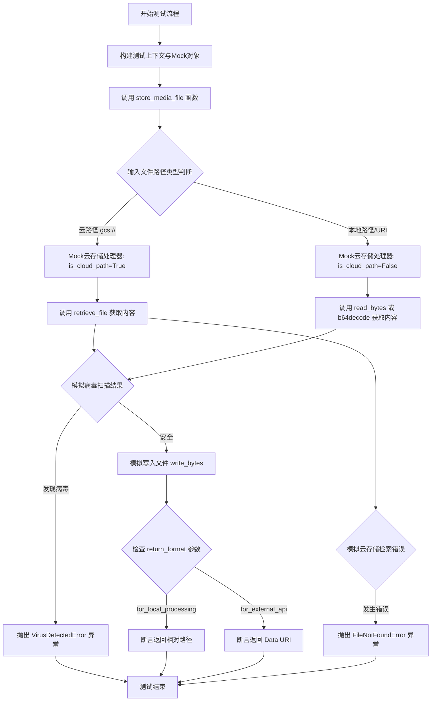
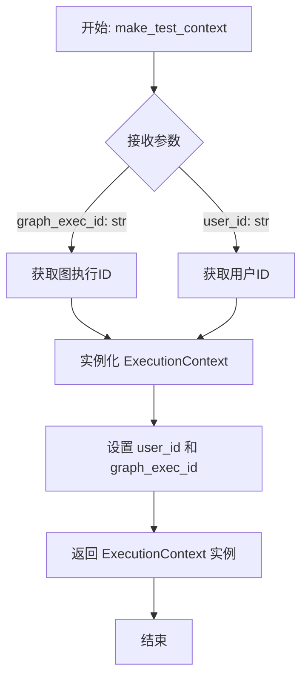
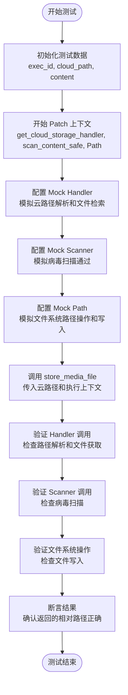
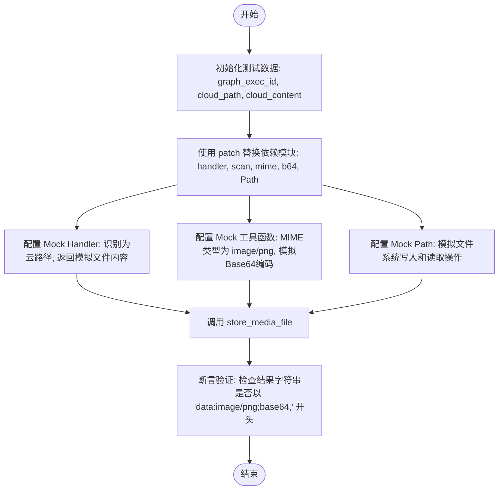
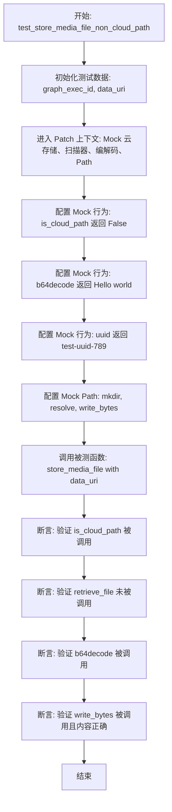
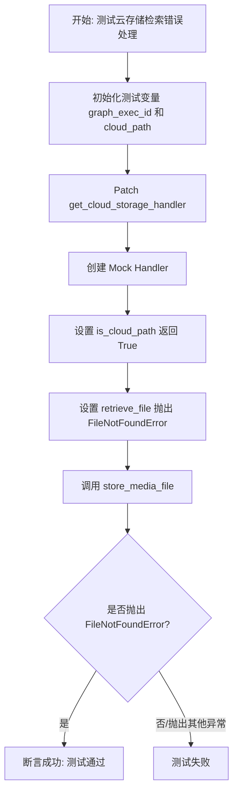
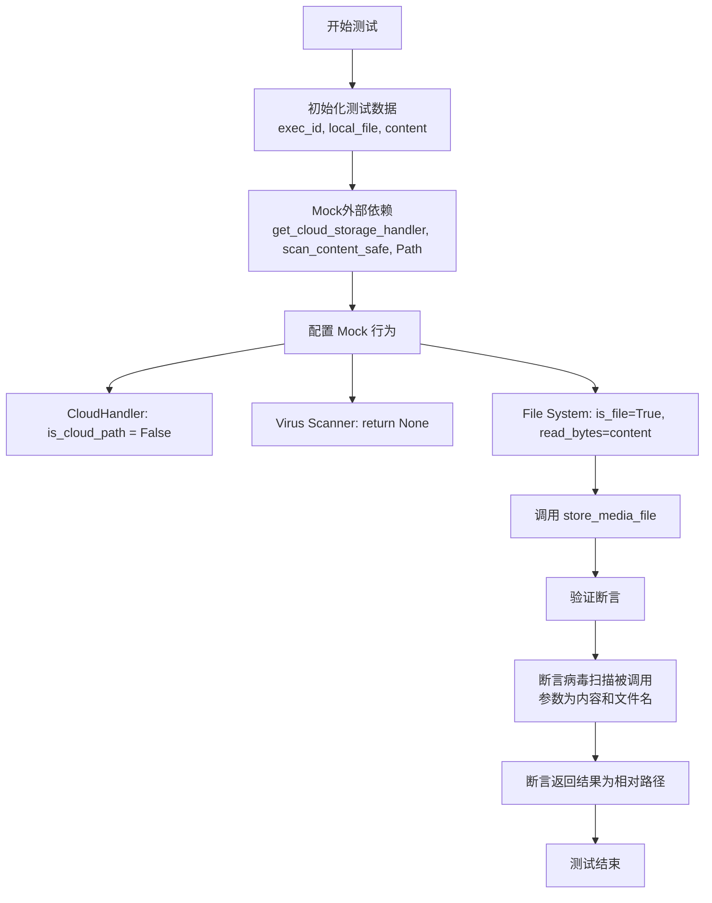
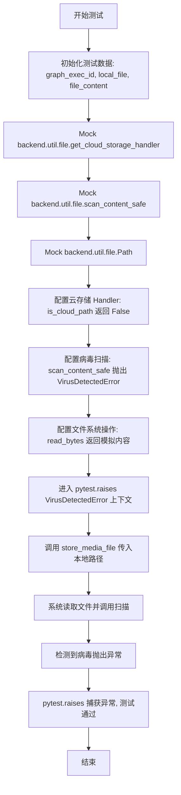

# `.\AutoGPT\autogpt_platform\backend\backend\util\file_test.py` 详细设计文档

该文件包含针对文件工具中云存储集成的单元测试，验证了 `store_media_file` 函数在处理云存储路径、本地文件路径、不同返回格式、病毒扫描以及错误场景下的功能正确性。

## 整体流程



## 类结构

```
make_test_context (全局辅助函数)
TestFileCloudIntegration (测试类)
├── test_store_media_file_cloud_path
├── test_store_media_file_cloud_path_return_content
├── test_store_media_file_non_cloud_path
├── test_store_media_file_cloud_retrieval_error
├── test_store_media_file_local_path_scanned
└── test_store_media_file_local_path_virus_detected
```

## 全局变量及字段


    

## 全局函数及方法


### `make_test_context`

用于创建测试用例所需的 `ExecutionContext` 实例的辅助函数，提供了图执行ID和用户ID的默认值，以简化测试代码的编写。

参数：

- `graph_exec_id`：`str`，图执行的ID标识，默认值为 "test-exec-123"。
- `user_id`：`str`，执行操作的用户ID标识，默认值为 "test-user-123"。

返回值：`ExecutionContext`，根据提供的ID参数初始化生成的执行上下文对象。

#### 流程图



#### 带注释源码

```python
def make_test_context(
    graph_exec_id: str = "test-exec-123", # 定义图执行ID参数，类型为字符串，提供默认测试值
    user_id: str = "test-user-123",       # 定义用户ID参数，类型为字符串，提供默认测试值
) -> ExecutionContext:                    # 声明返回类型为 ExecutionContext
    """Helper to create test ExecutionContext.""" # 文档字符串：说明这是一个用于创建测试上下文的辅助函数
    return ExecutionContext(
        user_id=user_id,                  # 初始化上下文，传入用户ID
        graph_exec_id=graph_exec_id,      # 初始化上下文，传入图执行ID
    )
```


### `TestFileCloudIntegration.test_store_media_file_cloud_path`

该测试方法旨在验证从云存储路径（如 `gcs://`）存储媒体文件的完整流程。它通过模拟云存储处理程序、病毒扫描器和文件系统操作，确保 `store_media_file` 函数能够正确识别云路径、获取文件内容、进行安全扫描并将其保存到本地，最后返回正确的相对路径。

参数：

- `self`：`TestFileCloudIntegration`，测试类的实例，用于访问测试上下文和断言方法。

返回值：`None`，该函数为测试用例，不返回业务数据，通过内部断言验证逻辑正确性。

#### 流程图



#### 带注释源码

```python
@pytest.mark.asyncio
async def test_store_media_file_cloud_path(self):
    """Test storing a file from cloud storage path."""
    # 1. 初始化测试数据，包括执行ID、模拟的云路径和文件内容
    graph_exec_id = "test-exec-123"
    cloud_path = "gcs://test-bucket/uploads/456/source.txt"
    cloud_content = b"cloud file content"

    # 2. 使用 patch 装饰器上下文替换实际的依赖实现
    with patch(
        "backend.util.file.get_cloud_storage_handler"
    ) as mock_handler_getter, patch(
        "backend.util.file.scan_content_safe"
    ) as mock_scan, patch(
        "backend.util.file.Path"
    ) as mock_path_class:

        # 3. 配置云存储处理程序的 Mock 对象
        mock_handler = MagicMock()
        # 模拟判定是云路径
        mock_handler.is_cloud_path.return_value = True
        # 模拟解析云路径
        mock_handler.parse_cloud_path.return_value = (
            "gcs",
            "test-bucket/uploads/456/source.txt",
        )
        # 模拟异步从云端获取文件内容
        mock_handler.retrieve_file = AsyncMock(return_value=cloud_content)
        mock_handler_getter.return_value = mock_handler

        # 4. 配置病毒扫描器的 Mock 对象（返回 None 表示未检测到病毒）
        mock_scan.return_value = None

        # 5. 配置文件系统 Path 的 Mock 对象链，用于模拟本地文件写入和路径操作
        mock_base_path = MagicMock()
        mock_target_path = MagicMock()
        mock_resolved_path = MagicMock()

        # 模拟 Path() 构造函数返回基础路径
        mock_path_class.return_value = mock_base_path
        # 模拟创建目录操作
        mock_base_path.mkdir = MagicMock()
        # 模拟路径拼接操作 (__truediv__ 对应 / 操作符)
        mock_base_path.__truediv__ = MagicMock(return_value=mock_target_path)
        # 模拟路径解析
        mock_target_path.resolve.return_value = mock_resolved_path
        # 模拟路径安全检查（确认路径在允许的范围内）
        mock_resolved_path.is_relative_to.return_value = True
        # 模拟写入字节流到文件
        mock_resolved_path.write_bytes = MagicMock()
        # 模拟获取相对路径操作
        mock_resolved_path.relative_to.return_value = Path("source.txt")

        # 配置 Path 构造函数的副作用，以便在不同调用时返回不同的 Mock 对象（用于提取文件名）
        mock_path_for_filename = MagicMock()
        mock_path_for_filename.name = "source.txt"

        def path_constructor(*args, **kwargs):
            if len(args) == 1 and "source.txt" in str(args[0]):
                return mock_path_for_filename
            else:
                return mock_base_path

        mock_path_class.side_effect = path_constructor

        # 6. 执行被测函数 store_media_file
        result = await store_media_file(
            file=MediaFileType(cloud_path),
            execution_context=make_test_context(graph_exec_id=graph_exec_id),
            return_format="for_local_processing",
        )

        # 7. 验证阶段：检查 Mock 对象的方法是否按预期被调用
        
        # 验证是否正确识别了云路径
        mock_handler.is_cloud_path.assert_called_once_with(cloud_path)
        # 验证是否正确解析了云路径
        mock_handler.parse_cloud_path.assert_called_once_with(cloud_path)
        # 验证是否使用正确的参数从云端检索了文件
        mock_handler.retrieve_file.assert_called_once_with(
            cloud_path, user_id="test-user-123", graph_exec_id=graph_exec_id
        )

        # 验证是否对下载的内容进行了病毒扫描
        mock_scan.assert_called_once_with(cloud_content, filename="source.txt")

        # 验证是否将内容写入了本地文件系统
        mock_resolved_path.write_bytes.assert_called_once_with(cloud_content)

        # 验证函数返回值是否为预期的相对路径
        assert str(result) == "source.txt"
```


### `TestFileCloudIntegration.test_store_media_file_cloud_path_return_content`

该测试方法用于验证当从云存储路径获取文件并要求返回外部 API 格式时，系统是否能够正确处理文件检索、安全扫描、MIME 类型检测以及 Base64 编码，最终返回符合 Data URI 格式的字符串。

参数：

- `self`：`TestFileCloudIntegration`，测试类的实例，由 pytest 框架注入，用于访问测试上下文。

返回值：`None`，该方法作为测试用例，不直接返回业务数据，而是通过断言验证内部逻辑的正确性。

#### 流程图



#### 带注释源码

```python
    @pytest.mark.asyncio
    async def test_store_media_file_cloud_path_return_content(self):
        """Test storing a file from cloud storage and returning content."""
        # 1. 准备测试数据：执行ID、云存储路径和模拟的文件内容（PNG头部）
        graph_exec_id = "test-exec-123"
        cloud_path = "gcs://test-bucket/uploads/456/image.png"
        cloud_content = b"\\x89PNG\\r\\n\\x1a\\n\\x00\\x00\\x00\\rIHDR"  # PNG header

        # 2. 使用 patch 装饰器上下文模拟外部依赖
        with patch(
            "backend.util.file.get_cloud_storage_handler"
        ) as mock_handler_getter, patch(
            "backend.util.file.scan_content_safe"
        ) as mock_scan, patch(
            "backend.util.file.get_mime_type"
        ) as mock_mime, patch(
            "backend.util.file.base64.b64encode"
        ) as mock_b64, patch(
            "backend.util.file.Path"
        ) as mock_path_class:

            # 3. 配置云存储处理器的 Mock 行为
            mock_handler = MagicMock()
            # 模拟识别该路径为云路径
            mock_handler.is_cloud_path.return_value = True
            # 模拟解析云路径
            mock_handler.parse_cloud_path.return_value = (
                "gcs",
                "test-bucket/uploads/456/image.png",
            )
            # 模拟异步从云端获取文件内容
            mock_handler.retrieve_file = AsyncMock(return_value=cloud_content)
            mock_handler_getter.return_value = mock_handler

            # 4. 配置其他工具函数的 Mock 行为
            mock_scan.return_value = None  # 模拟病毒扫描通过
            mock_mime.return_value = "image/png"  # 模拟获取 MIME 类型
            # 模拟 Base64 编码后的字符串解码结果（模拟 base64.b64encode(...).decode('utf-8') 的调用链）
            mock_b64.return_value.decode.return_value = "iVBORw0KGgoAAAANSUhEUgA="

            # 5. 配置文件系统操作 的 Mock 行为
            mock_base_path = MagicMock()
            mock_target_path = MagicMock()
            mock_resolved_path = MagicMock()

            # 模拟 Path() 构造函数返回基础路径
            mock_path_class.return_value = mock_base_path
            mock_base_path.mkdir = MagicMock() # 模拟创建目录
            # 模拟路径拼接操作 (/)
            mock_base_path.__truediv__ = MagicMock(return_value=mock_target_path)
            # 模拟路径解析
            mock_target_path.resolve.return_value = mock_resolved_path
            # 模拟路径安全检查
            mock_resolved_path.is_relative_to.return_value = True
            # 模拟写入文件
            mock_resolved_path.write_bytes = MagicMock()
            # 模拟从文件读取内容（用于生成 Data URI）
            mock_resolved_path.read_bytes.return_value = cloud_content

            # 6. 针对 Path 构造函数的特殊 Mock，用于提取文件名 "image.png"
            mock_path_obj = MagicMock()
            mock_path_obj.name = "image.png"
            with patch("backend.util.file.Path", return_value=mock_path_obj):
                # 7. 调用被测函数 store_media_file
                # 参数包括云路径、执行上下文以及要求的返回格式 "for_external_api"
                result = await store_media_file(
                    file=MediaFileType(cloud_path),
                    execution_context=make_test_context(graph_exec_id=graph_exec_id),
                    return_format="for_external_api",
                )

            # 8. 验证结果：检查返回的结果字符串是否符合 Data URI 格式
            # 期望格式为: data:<mime_type>;base64,<encoded_content>
            assert str(result).startswith("data:image/png;base64,")
```


### `TestFileCloudIntegration.test_store_media_file_non_cloud_path`

该测试函数用于验证当输入文件路径为非云存储路径（具体为 Data URI）时，`store_media_file` 函数能够正确识别路径类型，跳过云存储检索逻辑，转而执行标准的 Base64 解码、病毒扫描和本地文件存储流程。

参数：

-  `self`：`TestFileCloudIntegration`，测试类的实例引用。

返回值：`None`，无返回值，该函数主要通过断言验证被测代码的行为。

#### 流程图



#### 带注释源码

```python
    @pytest.mark.asyncio
    async def test_store_media_file_non_cloud_path(self):
        """Test that non-cloud paths are handled normally."""
        # 初始化测试用的执行ID和一个Data URI格式的文件数据
        graph_exec_id = "test-exec-123"
        data_uri = "data:text/plain;base64,SGVsbG8gd29ybGQ="

        # 开始模拟外部依赖
        with patch(
            "backend.util.file.get_cloud_storage_handler"
        ) as mock_handler_getter, patch(
            "backend.util.file.scan_content_safe"
        ) as mock_scan, patch(
            "backend.util.file.base64.b64decode"
        ) as mock_b64decode, patch(
            "backend.util.file.uuid.uuid4"
        ) as mock_uuid, patch(
            "backend.util.file.Path"
        ) as mock_path_class:

            # 配置云存储处理程序的 Mock
            mock_handler = MagicMock()
            # 关键点：设置 is_cloud_path 返回 False，模拟非云路径场景
            mock_handler.is_cloud_path.return_value = False
            # 虽然 retrieve_file 不会被调用，但为了防止 AttributeError 还是加上 Mock
            mock_handler.retrieve_file = (
                AsyncMock()
            )  # Add this even though it won't be called
            mock_handler_getter.return_value = mock_handler

            # 模拟病毒扫描器返回 None（表示安全）
            mock_scan.return_value = None
            # 模拟 base64 解码操作，返回解码后的字节
            mock_b64decode.return_value = b"Hello world"
            # 模拟 UUID 生成，固定返回值以便验证文件名
            mock_uuid.return_value = "test-uuid-789"

            # 模拟文件系统操作 (Path)
            mock_base_path = MagicMock()
            mock_target_path = MagicMock()
            mock_resolved_path = MagicMock()

            # 配置 Path 构造函数返回基础路径 Mock
            mock_path_class.return_value = mock_base_path
            mock_base_path.mkdir = MagicMock()
            # 模拟路径拼接操作 (/)
            mock_base_path.__truediv__ = MagicMock(return_value=mock_target_path)
            # 模拟路径解析
            mock_target_path.resolve.return_value = mock_resolved_path
            # 模拟路径安全检查
            mock_resolved_path.is_relative_to.return_value = True
            # 模拟文件写入操作，这里将验证写入的内容是否正确
            mock_resolved_path.write_bytes = MagicMock()
            # 模拟获取相对路径，用于返回结果
            mock_resolved_path.relative_to.return_value = Path("test-uuid-789.txt")

            # 执行被测函数：传入 Data URI，要求返回本地处理格式
            await store_media_file(
                file=MediaFileType(data_uri),
                execution_context=make_test_context(graph_exec_id=graph_exec_id),
                return_format="for_local_processing",
            )

            # --- 验证阶段 ---

            # 验证云存储处理程序确实被检查了路径类型
            mock_handler.is_cloud_path.assert_called_once_with(data_uri)
            # 验证云存储的文件检索功能没有被调用（因为是 Data URI）
            mock_handler.retrieve_file.assert_not_called()

            # 验证常规 Data URI 处理流程被执行
            mock_b64decode.assert_called_once()
            # 验证解码后的内容被正确写入了磁盘
            mock_resolved_path.write_bytes.assert_called_once_with(b"Hello world")
```


### `TestFileCloudIntegration.test_store_media_file_cloud_retrieval_error`

测试当云存储文件检索失败时的错误处理逻辑。该方法通过模拟云存储处理器抛出 `FileNotFoundError`，验证 `store_media_file` 函数能够正确地传播该异常，确保系统在遇到文件丢失等错误时的健壮性。

参数：

-  `self`：`TestFileCloudIntegration`，测试类实例，用于访问测试上下文和 pytest 的断言方法。

返回值：`None`，该方法主要用于验证异常抛出，无直接返回值。

#### 流程图



#### 带注释源码

```python
    @pytest.mark.asyncio
    async def test_store_media_file_cloud_retrieval_error(self):
        """Test error handling when cloud retrieval fails."""
        # 初始化测试用的执行ID和模拟的云路径
        graph_exec_id = "test-exec-123"
        cloud_path = "gcs://test-bucket/nonexistent.txt"

        # Patch 云存储处理器的获取函数
        with patch(
            "backend.util.file.get_cloud_storage_handler"
        ) as mock_handler_getter:

            # Mock 云存储处理器
            mock_handler = AsyncMock()
            # 模拟路径被识别为云路径
            mock_handler.is_cloud_path.return_value = True
            # 模拟文件检索时抛出 FileNotFoundError 异常
            mock_handler.retrieve_file.side_effect = FileNotFoundError(
                "File not found in cloud storage"
            )
            mock_handler_getter.return_value = mock_handler

            # 验证在调用 store_media_file 时确实抛出了预期的 FileNotFoundError
            with pytest.raises(
                FileNotFoundError, match="File not found in cloud storage"
            ):
                await store_media_file(
                    file=MediaFileType(cloud_path),
                    execution_context=make_test_context(graph_exec_id=graph_exec_id),
                    return_format="for_local_processing",
                )
```


### `TestFileCloudIntegration.test_store_media_file_local_path_scanned`

该测试用例用于验证当处理本地文件路径时，系统能够正确读取文件内容，并对文件内容进行病毒扫描，最终返回相对路径。测试重点在于确认本地文件处理流程中安全扫描（`scan_content_safe`）被正确触发。

参数：

- `self`：`TestFileCloudIntegration`，测试类实例，用于访问测试上下文和断言方法。

返回值：`None`，无返回值，通过断言验证行为。

#### 流程图



#### 带注释源码

```python
@pytest.mark.asyncio
async def test_store_media_file_local_path_scanned(self):
    """Test that local file paths are scanned for viruses."""
    # 1. 准备测试数据
    graph_exec_id = "test-exec-123"
    local_file = "test_video.mp4"
    file_content = b"fake video content"

    # 2. 使用 patch 模拟外部依赖项
    with patch(
        "backend.util.file.get_cloud_storage_handler"
    ) as mock_handler_getter, patch(
        "backend.util.file.scan_content_safe"
    ) as mock_scan, patch(
        "backend.util.file.Path"
    ) as mock_path_class:

        # 3. 配置云存储处理器 Mock
        # 模拟这不是一个云路径，走本地处理逻辑
        mock_handler = MagicMock()
        mock_handler.is_cloud_path.return_value = False
        mock_handler_getter.return_value = mock_handler

        # 4. 配置病毒扫描器 Mock
        # 模拟扫描通过，无异常
        mock_scan.return_value = None

        # 5. 配置文件系统路径操作 Mock
        mock_base_path = MagicMock()
        mock_target_path = MagicMock()
        mock_resolved_path = MagicMock()

        # 设置 Path 构造函数返回值
        mock_path_class.return_value = mock_base_path
        
        # 模拟目录创建
        mock_base_path.mkdir = MagicMock()
        # 模拟路径拼接
        mock_base_path.__truediv__ = MagicMock(return_value=mock_target_path)
        # 模拟路径解析
        mock_target_path.resolve.return_value = mock_resolved_path
        
        # 模拟安全检查：路径在允许的目录内
        mock_resolved_path.is_relative_to.return_value = True
        # 模拟这是一个文件（而不是目录）
        mock_resolved_path.is_file.return_value = True
        # 模拟读取文件字节内容
        mock_resolved_path.read_bytes.return_value = file_content
        # 模拟获取相对路径
        mock_resolved_path.relative_to.return_value = Path(local_file)
        mock_resolved_path.name = local_file

        # 6. 执行被测函数 store_media_file
        result = await store_media_file(
            file=MediaFileType(local_file),
            execution_context=make_test_context(graph_exec_id=graph_exec_id),
            return_format="for_local_processing",
        )

        # 7. 验证核心行为
        # 确保病毒扫描器被调用，且参数正确（内容和文件名）
        mock_scan.assert_called_once_with(file_content, filename=local_file)

        # 8. 验证返回结果
        # 结果应该是本地文件的相对路径
        assert str(result) == local_file
```


### `TestFileCloudIntegration.test_store_media_file_local_path_virus_detected`

该测试方法用于验证当尝试存储一个本地文件，且病毒扫描仪检测到病毒时，系统是否会正确抛出 `VirusDetectedError` 异常。

参数：

- `self`：`TestFileCloudIntegration`，测试类的实例，用于访问测试上下文和 pytest 固件。

返回值：`None`，无返回值，该函数主要行为是验证异常抛出。

#### 流程图



#### 带注释源码

```python
    async def test_store_media_file_local_path_virus_detected(self):
        """Test that infected local files raise VirusDetectedError."""
        # 导入特定的异常类，用于验证抛出的错误类型
        from backend.api.features.store.exceptions import VirusDetectedError

        # 准备测试数据
        graph_exec_id = "test-exec-123"
        local_file = "infected.exe"
        file_content = b"malicious content"

        # 开始 Mock 外部依赖
        with patch(
            "backend.util.file.get_cloud_storage_handler"
        ) as mock_handler_getter, patch(
            "backend.util.file.scan_content_safe"
        ) as mock_scan, patch(
            "backend.util.file.Path"
        ) as mock_path_class:

            # 配置云存储 Handler 的 Mock 行为
            # 模拟该路径不是云路径，从而走本地文件处理逻辑
            mock_handler = MagicMock()
            mock_handler.is_cloud_path.return_value = False
            mock_handler_getter.return_value = mock_handler

            # 配置病毒扫描器的 Mock 行为
            # 模拟扫描时发现了病毒，抛出 VirusDetectedError 异常
            mock_scan.side_effect = VirusDetectedError(
                "EICAR-Test-File", "File rejected due to virus detection"
            )

            # 配置文件系统相关的 Mock 行为
            mock_base_path = MagicMock()
            mock_target_path = MagicMock()
            mock_resolved_path = MagicMock()

            mock_path_class.return_value = mock_base_path
            mock_base_path.mkdir = MagicMock()
            # 模拟路径拼接
            mock_base_path.__truediv__ = MagicMock(return_value=mock_target_path)
            # 模拟路径解析
            mock_target_path.resolve.return_value = mock_resolved_path
            # 模拟路径安全检查通过
            mock_resolved_path.is_relative_to.return_value = True
            # 模拟这是一个文件
            mock_resolved_path.is_file.return_value = True
            # 模拟读取文件内容，内容为准备好的恶意字节数据
            mock_resolved_path.read_bytes.return_value = file_content

            # 验证逻辑：使用 pytest.raises 确保调用 store_media_file 时抛出了 VirusDetectedError
            with pytest.raises(VirusDetectedError):
                await store_media_file(
                    file=MediaFileType(local_file),
                    execution_context=make_test_context(graph_exec_id=graph_exec_id),
                    return_format="for_local_processing",
                )
```


## 关键组件


### Media File Storage Service
Core component responsible for ingesting media files from diverse sources (cloud URIs, local paths, data URIs), coordinating security scans, and managing local storage persistence.

### Cloud Storage Integration Handler
Interface or service abstracting specific cloud storage provider logic to identify, parse, and asynchronously retrieve files based on cloud URIs (e.g., GCS).

### Security Scanning Service
Utility component dedicated to inspecting file byte content for viruses or malware during the ingestion process to ensure system security.

### Execution Context
Context object that carries essential metadata, such as `user_id` and `graph_exec_id`, to scope and authorize file operations within a specific execution environment.

### File Type Resolver
Logic component that parses input strings to determine file origin (cloud, local, or inline data) and resolves the corresponding handling strategy.


## 问题及建议


### 已知问题

-   **安全测试缺失（路径遍历漏洞）**：所有测试用例中都将 `mock_resolved_path.is_relative_to.return_value` 强制设置为 `True`。这意味着测试代码绕过了用于防止路径遍历攻击（如 `../../../etc/passwd`）的关键安全校验逻辑。如果实际实现逻辑有误，测试将无法捕获此类严重的安全漏洞。
-   **模拟逻辑脆弱且耦合度高**：在 `test_store_media_file_cloud_path` 中，`Path` 的 `side_effect` 逻辑依赖于字符串参数的内容（例如检查是否包含 `"source.txt"`）来决定返回哪个 Mock 对象。这种模拟方式与具体的字符串字面量强耦合，一旦被测函数内部实现路径拼接逻辑发生微小变化，测试极易失败。
-   **Mock 设置冲突与混乱**：在 `test_store_media_file_cloud_path_return_content` 测试中，存在对 `backend.util.file.Path` 的嵌套 Patch 操作（外层 `patch` 和 `with patch`）。这种嵌套修补会导致上下文管理混乱，外层 Mock 设置的 `side_effect` 和 `return_value` 可能被内层覆盖或忽略，使得测试意图难以阅读且容易产生不可预测的行为。

### 优化建议

-   **引入 Pytest Fixture 减少重复**：目前每个测试方法都重复构建了大量相似的 Mock 对象（如 `mock_base_path`, `mock_target_path`, `mock_resolved_path` 等）。建议将这些通用的 Mock 对象提取到 `pytest.fixture` 中，以提高代码的可维护性和可读性。
-   **使用参数化测试简化用例**：测试用例 `test_store_media_file_cloud_path` 和 `test_store_media_file_cloud_path_return_content` 的主要区别在于 `return_format` 参数。建议使用 `@pytest.mark.parametrize` 装饰器将这两个测试合并，只需维护一套测试逻辑，传入不同的参数即可覆盖两种场景。
-   **为 Mock 对象添加 `spec` 参数**：在创建 `MagicMock` 时，建议添加 `spec` 参数（例如 `spec=Path`）。这将确保 Mock 对象只能调用实际类中存在的方法，有助于在开发阶段发现因方法名拼写错误或 API 变更导致的问题。
-   **增加路径遍历安全测试**：新增一个测试用例，配置 `mock_resolved_path.is_relative_to.return_value = False`，验证系统是否能正确拒绝不安全的路径请求并抛出相应的异常，确保安全逻辑的有效性。


## 其它


### 设计目标与约束

1.  **多源文件兼容性**：系统设计目标之一是统一处理来自不同来源的文件输入，包括本地文件路径、Base64 编码的 Data URI 以及云存储路径（如 `gcs://`）。`store_media_file` 函数需根据输入类型自动路由到不同的处理逻辑，同时对外保持接口的一致性。
2.  **安全性约束**：所有类型的文件输入（无论是从云端获取、本地读取还是解码生成）在落地存储或进一步处理前，**必须**经过病毒扫描（`scan_content_safe`）。这是不可绕过的安全约束。
3.  **路径安全校验**：文件落地存储时，必须进行路径解析和校验（`resolve()` 和 `is_relative_to()`），防止目录遍历攻击，确保文件最终写入预期的允许目录内。
4.  **异步处理兼容**：考虑到云端文件检索（`retrieve_file`）可能涉及网络 I/O，设计上必须支持异步操作流，以避免阻塞主线程或事件循环。

### 错误处理与异常设计

1.  **云端获取异常传播**：当从云存储检索文件时（如文件不存在或网络错误），云端处理器抛出的异常（如 `FileNotFoundError`）应直接向上传播，由上层调用者处理，中间层不应吞噬此类 I/O 错误。
2.  **安全威胁阻断**：病毒扫描模块（`scan_content_safe`）若检测到恶意内容，必须抛出特定的安全异常（如 `VirusDetectedError`）。此异常应立即终止文件存储流程，并阻止文件写入磁盘。
3.  **路径校验失败**：虽然测试中主要模拟了成功场景，但在实际设计中，如果解析后的目标路径不在允许的基础目录下（`is_relative_to` 返回 `False`），系统应抛出路径越界相关的异常（如 `ValueError` 或自定义安全异常），以防止非法文件写入。
4.  **Mock 驱动的测试隔离**：在测试环境中，利用 `unittest.mock` 模拟文件系统和云服务行为，确保测试仅关注 `store_media_file` 的逻辑流，而非外部服务的稳定性。

### 数据流与状态机

1.  **数据处理流水线**：
    *   **输入阶段**：接收 `MediaFileType`（可能包含云路径、本地路径或 Data URI）和 `ExecutionContext`。
    *   **类型识别阶段**：调用云存储处理器判断输入是否为云路径。
    *   **获取阶段**：
        *   *如果是云路径*：解析路径（获取 Bucket 和 Key），异步下载文件内容。
        *   *如果是 Data URI*：解码 Base64 数据。
        *   *如果是本地路径*：读取文件字节流。
    *   **安全检查阶段**：将获取到的字节流送入病毒扫描器。若通过，进入下一阶段；若失败，抛出异常并终止。
    *   **持久化阶段**：计算目标存储路径，执行安全校验，将字节流写入本地磁盘。
    *   **输出阶段**：根据 `return_format` 参数，返回本地相对路径或重新编码的 Data URI 字符串。

2.  **状态流转**：
    文件处理过程并未涉及复杂的循环状态机，而是一个线性的事务流转：
    `Pending` (等待处理) -> `Fetching` (获取内容/云端下载) -> `Scanning` (安全扫描) -> `Writing` (磁盘写入) -> `Completed` (完成返回) 或 `Failed` (异常终止)。

### 外部依赖与接口契约

1.  **云存储处理器接口 (`get_cloud_storage_handler`)**：
    *   **契约**：返回一个对象，必须实现以下方法：
        *   `is_cloud_path(path: str) -> bool`：判断给定路径字符串是否属于云存储协议。
        *   `parse_cloud_path(path: str) -> Tuple[str, str]`：解析云路径，返回协议类型（如 'gcs'）和实际路径。
        *   `retrieve_file(path: str, user_id: str, graph_exec_id: str) -> Awaitable[bytes]`：异步获取文件字节数据。
2.  **安全扫描接口 (`scan_content_safe`)**：
    *   **契约**：接收文件字节流和文件名。若检测到病毒，抛出 `VirusDetectedError`；否则返回 `None`。这是文件写入的前置条件。
3.  **执行上下文 (`ExecutionContext`)**：
    *   **契约**：提供用户 ID (`user_id`) 和 图执行 ID (`graph_exec_id`)，这些标识符用于云存储权限控制和审计追踪。
4.  **文件系统接口 (`pathlib.Path`)**：
    *   **契约**：用于文件系统的交互。测试中模拟了 `mkdir` (创建目录), `__truediv__` (路径拼接), `resolve` (解析绝对路径), `write_bytes` (写入二进制), `is_relative_to` (路径包含关系检查) 等标准行为。

    