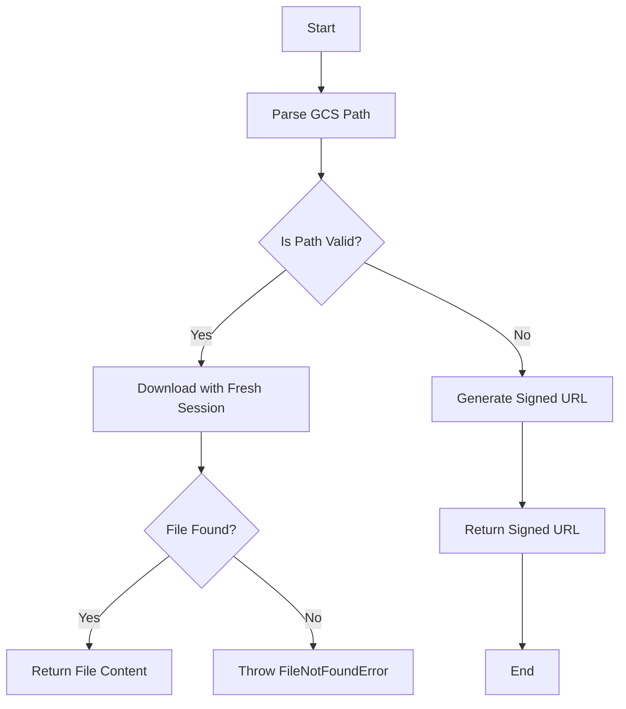
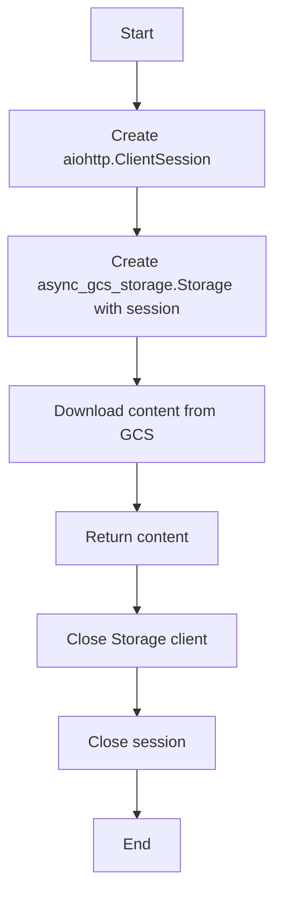
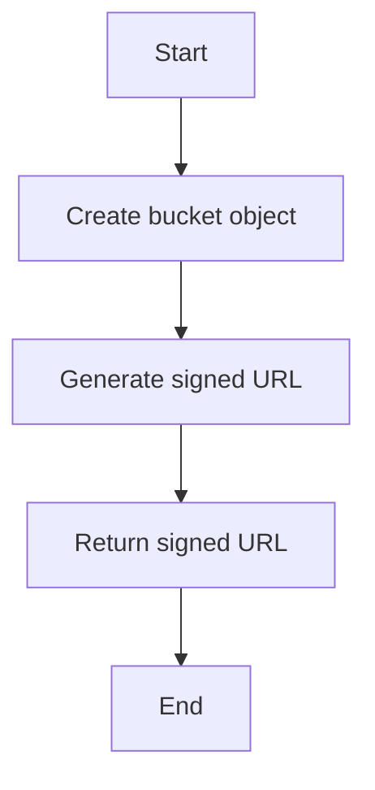

# `.\AutoGPT\autogpt_platform\backend\backend\util\gcs_utils.py` 详细设计文档

This module provides utilities for working with Google Cloud Storage, including path parsing, client management, and signed URL generation.

## 整体流程



## 类结构

```
SharedGCSUtilities (模块)
├── parse_gcs_path (函数)
│   ├── path (参数)
│   └── ...
├── download_with_fresh_session (异步函数)
│   ├── bucket (参数)
│   ├── blob (参数)
│   └── ...
└── generate_signed_url (异步函数)
   ├── sync_client (参数)
   ├── bucket_name (参数)
   ├── blob_name (参数)
   └── ...
└── logger (全局变量)
```

## 全局变量及字段


### `logger`
    
Logger instance for logging messages within the module.

类型：`logging.Logger`
    


### `SharedGCSUtilities.logger`
    
Logger instance for logging messages within the module.

类型：`logging.Logger`
    
    

## 全局函数及方法


### parse_gcs_path

Parse a GCS path in the format 'gcs://bucket/blob' to (bucket, blob).

参数：

- `path`：`str`，GCS路径字符串（例如，"gcs://my-bucket/path/to/file")

返回值：`tuple[str, str]`，包含（bucket_name, blob_name）

#### 流程图

```mermaid
graph LR
A[Start] --> B{Check prefix "gcs://"}
B -- Yes --> C[Split path]
B -- No --> D[Error]
C --> E{Split by "/"}
E -- Two parts --> F[Return (bucket, blob)]
E -- More/less parts --> G[Error]
D --> H[End]
F --> I[End]
G --> J[End]
```

#### 带注释源码

```python
def parse_gcs_path(path: str) -> tuple[str, str]:
    """
    Parse a GCS path in the format 'gcs://bucket/blob' to (bucket, blob).

    Args:
        path: GCS path string (e.g., "gcs://my-bucket/path/to/file")

    Returns:
        Tuple of (bucket_name, blob_name)

    Raises:
        ValueError: If the path format is invalid
    """
    if not path.startswith("gcs://"):
        raise ValueError(f"Invalid GCS path: {path}")

    path_without_prefix = path[6:]  # Remove "gcs://"
    parts = path_without_prefix.split("/", 1)
    if len(parts) != 2:
        raise ValueError(f"Invalid GCS path format: {path}")

    return parts[0], parts[1]
```


### download_with_fresh_session

Download file content using a fresh session to avoid event loop issues.

参数：

- `bucket`：`str`，GCS bucket name
- `blob`：`str`，Blob path within the bucket

返回值：`bytes`，File content

#### 流程图



#### 带注释源码

```python
async def download_with_fresh_session(bucket: str, blob: str) -> bytes:
    """
    Download file content using a fresh session.

    Args:
        bucket: GCS bucket name
        blob: Blob path within the bucket

    Returns:
        File content as bytes

    Raises:
        FileNotFoundError: If the file doesn't exist
    """
    session = aiohttp.ClientSession(
        connector=aiohttp.TCPConnector(limit=10, force_close=True)
    )
    client: async_gcs_storage.Storage | None = None
    try:
        client = async_gcs_storage.Storage(session=session)
        content = await client.download(bucket, blob)
        return content
    except Exception as e:
        if "404" in str(e) or "Not Found" in str(e):
            raise FileNotFoundError(f"File not found: gcs://{bucket}/{blob}")
        raise
    finally:
        if client:
            try:
                await client.close()
            except Exception:
                pass  # Best-effort cleanup
        await session.close()
```


### generate_signed_url

Generate a signed URL for temporary access to a GCS file.

参数：

- `sync_client`：`gcs_storage.Client`，The sync GCS client with service account credentials
- `bucket_name`：`str`，The GCS bucket name
- `blob_name`：`str`，The Blob path within the bucket
- `expires_in`：`int`，The URL expiration time in seconds

返回值：`str`，The signed URL string

#### 流程图



#### 带注释源码

```python
async def generate_signed_url(
    sync_client: gcs_storage.Client,
    bucket_name: str,
    blob_name: str,
    expires_in: int,
) -> str:
    """
    Generate a signed URL for temporary access to a GCS file.

    Args:
        sync_client: Sync GCS client with service account credentials
        bucket_name: GCS bucket name
        blob_name: Blob path within the bucket
        expires_in: URL expiration time in seconds

    Returns:
        Signed URL string
    """
    bucket = sync_client.bucket(bucket_name)
    blob = bucket.blob(blob_name)
    return await asyncio.to_thread(
        blob.generate_signed_url,
        version="v4",
        expiration=datetime.now(timezone.utc) + timedelta(seconds=expires_in),
        method="GET",
    )
```


### parse_gcs_path

Parse a GCS path in the format 'gcs://bucket/blob' to (bucket, blob).

参数：

- `path`：`str`，GCS路径字符串（例如，"gcs://my-bucket/path/to/file")

返回值：`tuple[str, str]`，包含（bucket_name, blob_name）

#### 流程图

```mermaid
graph LR
A[Start] --> B{Check prefix "gcs://"}
B -- Yes --> C[Split path]
B -- No --> D[Error]
C --> E{Split by "/"}
E -- Two parts --> F[Return (bucket, blob)]
E -- More/less parts --> G[Error]
D --> H[End]
F --> I[End]
G --> J[End]
```

#### 带注释源码

```python
def parse_gcs_path(path: str) -> tuple[str, str]:
    """
    Parse a GCS path in the format 'gcs://bucket/blob' to (bucket, blob).

    Args:
        path: GCS path string (e.g., "gcs://my-bucket/path/to/file")

    Returns:
        Tuple of (bucket_name, blob_name)

    Raises:
        ValueError: If the path format is invalid
    """
    if not path.startswith("gcs://"):
        raise ValueError(f"Invalid GCS path: {path}")

    path_without_prefix = path[6:]  # Remove "gcs://"
    parts = path_without_prefix.split("/", 1)
    if len(parts) != 2:
        raise ValueError(f"Invalid GCS path format: {path}")

    return parts[0], parts[1]
```


### download_with_fresh_session

Download file content using a fresh session to avoid event loop issues.

参数：

- `bucket`：`str`，GCS bucket name
- `blob`：`str`，Blob path within the bucket

返回值：`bytes`，File content

#### 流程图


#### 带注释源码

```python
async def download_with_fresh_session(bucket: str, blob: str) -> bytes:
    """
    Download file content using a fresh session.

    Args:
        bucket: GCS bucket name
        blob: Blob path within the bucket

    Returns:
        File content as bytes

    Raises:
        FileNotFoundError: If the file doesn't exist
    """
    session = aiohttp.ClientSession(
        connector=aiohttp.TCPConnector(limit=10, force_close=True)
    )
    client: async_gcs_storage.Storage | None = None
    try:
        client = async_gcs_storage.Storage(session=session)
        content = await client.download(bucket, blob)
        return content
    except Exception as e:
        if "404" in str(e) or "Not Found" in str(e):
            raise FileNotFoundError(f"File not found: gcs://{bucket}/{blob}")
        raise
    finally:
        if client:
            try:
                await client.close()
            except Exception:
                pass  # Best-effort cleanup
        await session.close()
```


### generate_signed_url

Generate a signed URL for temporary access to a GCS file.

参数：

- `sync_client`：`gcs_storage.Client`，The sync GCS client with service account credentials
- `bucket_name`：`str`，The GCS bucket name
- `blob_name`：`str`，The Blob path within the bucket
- `expires_in`：`int`，The URL expiration time in seconds

返回值：`str`，The signed URL string

#### 流程图


#### 带注释源码

```python
async def generate_signed_url(
    sync_client: gcs_storage.Client,
    bucket_name: str,
    blob_name: str,
    expires_in: int,
) -> str:
    """
    Generate a signed URL for temporary access to a GCS file.

    Args:
        sync_client: Sync GCS client with service account credentials
        bucket_name: GCS bucket name
        blob_name: Blob path within the bucket
        expires_in: URL expiration time in seconds

    Returns:
        Signed URL string
    """
    bucket = sync_client.bucket(bucket_name)
    blob = bucket.blob(blob_name)
    return await asyncio.to_thread(
        blob.generate_signed_url,
        version="v4",
        expiration=datetime.now(timezone.utc) + timedelta(seconds=expires_in),
        method="GET",
    )
```


## 关键组件


### 张量索引与惰性加载

张量索引与惰性加载是处理大型数据集时常用的技术，它允许在需要时才加载数据的一部分，从而减少内存消耗和提高效率。

### 反量化支持

反量化支持是指系统能够处理和转换不同量化级别的数据，例如从浮点数到整数的转换，以及从低精度到高精度的转换。

### 量化策略

量化策略是指如何将浮点数数据转换为固定点数表示的方法，包括选择量化位宽、量化范围等，以优化计算效率和存储空间。


## 问题及建议


### 已知问题

-   **全局变量和函数的分离**: 代码中定义了全局变量 `logger`，但在 `generate_signed_url` 函数中使用了 `asyncio.to_thread()` 来在异步环境中执行同步操作。这种做法可能会导致全局变量在异步和同步环境中不一致，需要确保全局变量的线程安全性。
-   **异常处理**: 代码中在 `download_with_fresh_session` 函数中捕获了所有异常，并抛出了 `FileNotFoundError`。这种做法可能会导致一些非预期的异常被忽略，建议根据异常类型进行更细致的异常处理。
-   **资源管理**: 在 `download_with_fresh_session` 函数中，虽然尝试关闭了 `client` 和 `session`，但在关闭 `client` 时可能会抛出异常，这需要更好的异常处理来确保资源被正确释放。
-   **代码重复**: `parse_gcs_path` 和 `generate_signed_url` 函数中都涉及到对路径字符串的处理，可以考虑将这部分逻辑抽象成一个单独的函数来减少代码重复。

### 优化建议

-   **全局变量管理**: 将全局变量 `logger` 的定义移到模块级别，并确保在异步和同步环境中使用相同的实例。
-   **异常处理**: 在 `download_with_fresh_session` 函数中，根据不同的异常类型进行不同的处理，例如对于网络异常可以重试下载。
-   **资源管理**: 使用 `try...finally` 结构确保即使在发生异常时也能关闭资源，例如使用上下文管理器来管理 `aiohttp.ClientSession` 和 `async_gcs_storage.Storage`。
-   **代码重构**: 将路径解析逻辑抽象成一个单独的函数，并在需要的地方调用该函数，以减少代码重复。
-   **性能优化**: 在 `download_with_fresh_session` 函数中，可以考虑使用连接池来管理 `aiohttp.ClientSession`，以提高性能。
-   **代码测试**: 增加单元测试来覆盖代码中的各种路径，确保代码的健壮性。


## 其它


### 设计目标与约束

- 设计目标：
  - 提供与Google Cloud Storage交互的通用功能。
  - 确保异步操作不会阻塞事件循环。
  - 提供错误处理机制，以便在文件不存在或路径格式错误时提供清晰的反馈。
  - 确保代码的可维护性和可扩展性。

- 约束：
  - 必须使用Google Cloud Storage的异步和同步客户端。
  - 代码必须兼容Python 3.7及以上版本。
  - 代码必须遵循Google Cloud Storage的API限制和最佳实践。

### 错误处理与异常设计

- 错误处理：
  - 使用`ValueError`来处理无效的GCS路径格式。
  - 使用`FileNotFoundError`来处理文件不存在的情况。
  - 使用通用异常来处理其他潜在的错误，并在日志中记录。

- 异常设计：
  - 异常被捕获并相应地处理，确保资源（如会话和客户端）被正确关闭。
  - 异常信息被记录，以便于问题追踪和调试。

### 数据流与状态机

- 数据流：
  - 输入：GCS路径字符串。
  - 处理：解析路径、下载文件内容、生成签名URL。
  - 输出：文件内容（字节）、签名URL。

- 状态机：
  - 无状态设计，所有操作都是按需执行的。

### 外部依赖与接口契约

- 外部依赖：
  - `aiohttp`：用于异步HTTP客户端。
  - `google.cloud.storage`：用于同步GCS客户端。
  - `gcloud.aio.storage`：用于异步GCS客户端。
  - `logging`：用于日志记录。

- 接口契约：
  - `parse_gcs_path`：解析GCS路径并返回桶名和对象名。
  - `download_with_fresh_session`：下载文件内容并返回字节。
  - `generate_signed_url`：生成签名URL以临时访问GCS文件。

    