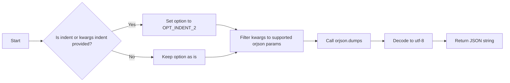
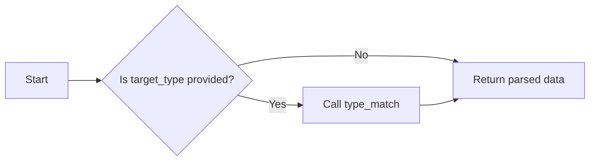
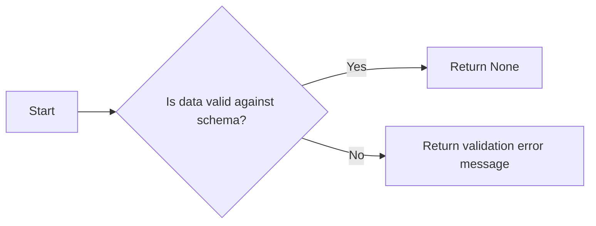
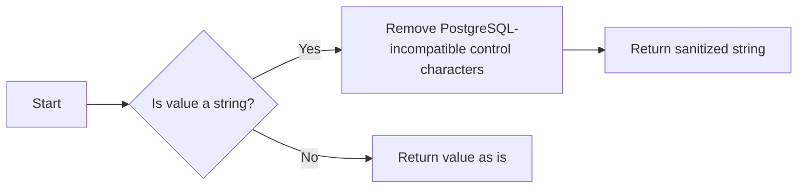
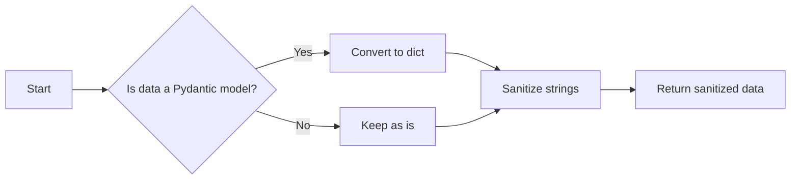
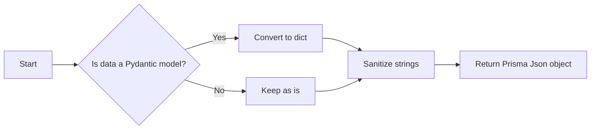
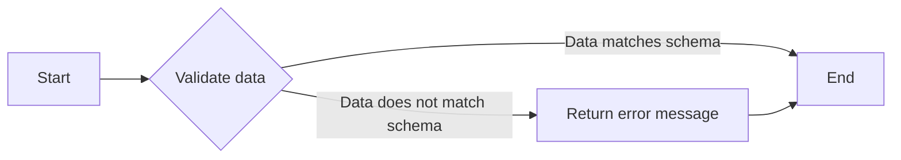
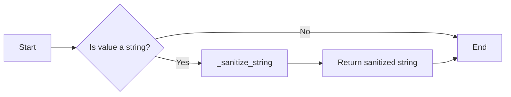
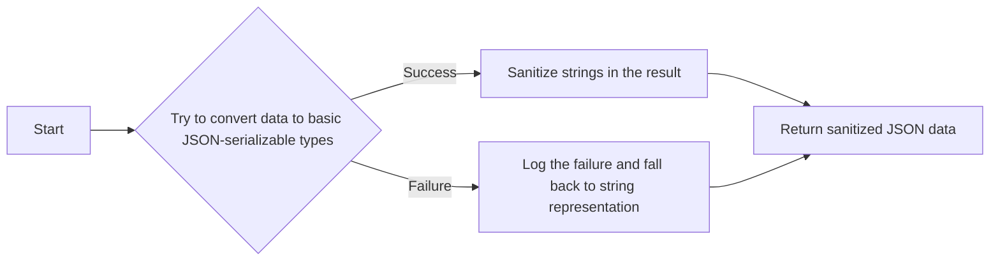
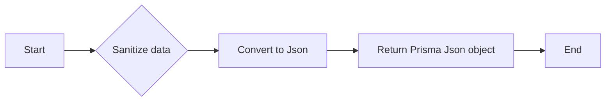

# `.\AutoGPT\autogpt_platform\backend\backend\util\json.py` 详细设计文档

This code provides a set of utilities for safely serializing and deserializing JSON data, including handling Pydantic models, sanitizing strings to prevent PostgreSQL control character issues, and validating JSON data against a schema.

## 整体流程

```mermaid
graph TD
    A[开始] --> B[解析 JSON 数据]
    B --> C{数据类型是否为 Pydantic 模型?}
    C -- 是 --> D[转换为字典]
    C -- 否 --> E[直接使用 orjson 解析]
    D --> F[清理字符串中的控制字符]
    E --> F
    F --> G[返回清理后的数据]
    G --> H[验证 JSON 数据 (可选)]
    H --> I{验证通过?}
    I -- 是 --> J[返回数据]
    I -- 否 --> K[返回错误信息]
    J --> L[结束]
    K --> L
```

## 类结构

```
SafeJson (类)
├── __init__(data: Any)
```

## 全局变量及字段


### `logger`
    
Logger instance for logging messages.

类型：`logging.Logger`
    


### `POSTGRES_CONTROL_CHARS`
    
Precompiled regex to remove PostgreSQL-incompatible control characters.

类型：`re.Pattern`
    


### `orjson`
    
Module for the orjson library, which is used for JSON serialization and deserialization.

类型：`module`
    


### `{'name': 'SafeJson', 'fields': ['data'], 'methods': ['__init__']}.data`
    
Data field of the SafeJson class instance, which holds the sanitized and converted data.

类型：`Any`
    


### `logging.Logger.logger`
    
Logger instance for logging messages.

类型：`logging.Logger`
    


### `re.Pattern.POSTGRES_CONTROL_CHARS`
    
Precompiled regex to remove PostgreSQL-incompatible control characters.

类型：`re.Pattern`
    


### `module.orjson`
    
Module for the orjson library, which is used for JSON serialization and deserialization.

类型：`module`
    


### `SafeJson.data`
    
Data field of the SafeJson class instance, which holds the sanitized and converted data.

类型：`Any`
    
    

## 全局函数及方法


### `dumps`

Serialize data to JSON string with automatic conversion of Pydantic models and complex types.

参数：

- `data`：`Any`，The data to serialize. Can be any type including Pydantic models, dicts, lists, etc.
- `*args`：`Any`，Additional positional arguments
- `indent`：`int | None`，If not None, pretty-print with indentation
- `option`：`int`，orjson option flags (default: 0)
- `**kwargs`：`Any`，Additional keyword arguments. Supported: default, ensure_ascii, separators, indent

返回值：`str`，JSON string representation of the data

#### 流程图



#### 带注释源码

```python
def dumps(
    data: Any, *args: Any, indent: int | None = None, option: int = 0, **kwargs: Any
) -> str:
    serializable_data = to_dict(data)

    # Handle indent parameter
    if indent is not None or kwargs.get("indent") is not None:
        option |= orjson.OPT_INDENT_2

    # orjson only accepts specific parameters, filter out stdlib json params
    # ensure_ascii: orjson always produces UTF-8 (better than ASCII)
    # separators: orjson uses compact separators by default
    supported_orjson_params = {"default"}
    orjson_kwargs = {k: v for k, v in kwargs.items() if k in supported_orjson_params}

    return orjson.dumps(serializable_data, option=option, **orjson_kwargs).decode(
        "utf-8"
    )
```

### `loads`

Deserialize JSON data to the specified type or to the original data type if no type is specified.

参数：

- `data`：`str | bytes`，The JSON data to deserialize.
- `*args`：`Any`，Additional positional arguments
- `target_type`：`Type[T] | None`，The type to which the data should be deserialized.
- `**kwargs`：`Any`，Additional keyword arguments.

返回值：`Any`，Deserialized data or the original data if no type is specified.

#### 流程图



#### 带注释源码

```python
@overload
def loads(data: str | bytes, *args, target_type: Type[T], **kwargs) -> T: ...

@overload
def loads(data: str | bytes, *args, **kwargs) -> Any: ...

def loads(
    data: str | bytes, *args, target_type: Type[T] | None = None, **kwargs
) -> Any:
    parsed = orjson.loads(data)

    if target_type:
        return type_match(parsed, target_type)
    return parsed
```

### `validate_with_jsonschema`

Validate the data against the schema.

参数：

- `schema`：`dict[str, Any]`，The schema to validate against.
- `data`：`dict[str, Any]`，The data to validate.

返回值：`str | None`，The validation error message if the data does not match the schema, or `None` if the data is valid.

#### 流程图



#### 带注释源码

```python
def validate_with_jsonschema(
    schema: dict[str, Any], data: dict[str, Any]
) -> str | None:
    try:
        jsonschema.validate(data, schema)
        return None
    except jsonschema.ValidationError as e:
        return str(e)
```

### `_sanitize_string`

Remove PostgreSQL-incompatible control characters from string.

参数：

- `value`：`str`，The string to sanitize.

返回值：`str`，The sanitized string.

#### 流程图



#### 带注释源码

```python
def _sanitize_string(value: str) -> str:
    """Remove PostgreSQL-incompatible control characters from string."""
    return POSTGRES_CONTROL_CHARS.sub("", value)
```

### `sanitize_json`

Sanitize JSON data by removing PostgreSQL-incompatible control characters.

参数：

- `data`：`Any`，The data to sanitize.

返回值：`Any`，The sanitized data.

#### 流程图



#### 带注释源码

```python
def sanitize_json(data: Any) -> Any:
    try:
        # Use two-pass approach for consistent string sanitization:
        # 1. First convert to basic JSON-serializable types (handles Pydantic models)
        # 2. Then sanitize strings in the result
        basic_result = to_dict(data)
        return to_dict(basic_result, custom_encoder={str: _sanitize_string})
    except Exception as e:
        # Log the failure and fall back to string representation
        logger.error(
            "SafeJson fallback to string representation due to serialization error: %s (%s). "
            "Data type: %s, Data preview: %s",
            type(e).__name__,
            truncate(str(e), 200),
            type(data).__name__,
            truncate(str(data), 100),
        )

        # Ultimate fallback: convert to string representation and sanitize
        return _sanitize_string(str(data))
```

### `SafeJson`

Safely serialize data and return Prisma's Json type.

参数：

- `data`：`Any`，Input data to sanitize and convert to Json.

返回值：`Prisma Json object`，Prisma Json object with control characters removed.

#### 流程图



#### 带注释源码

```python
class SafeJson(Json):
    """
    Safely serialize data and return Prisma's Json type.
    Sanitizes control characters to prevent PostgreSQL 22P05 errors.

    This function:
    1. Converts Pydantic models to dicts (recursively using to_dict)
    2. Recursively removes PostgreSQL-incompatible control characters from strings
    3. Returns a Prisma Json object safe for database storage

    Uses to_dict (jsonable_encoder) with a custom encoder to handle both Pydantic
    conversion and control character sanitization in a two-pass approach.

    Args:
        data: Input data to sanitize and convert to Json

    Returns:
        Prisma Json object with control characters removed
    """

    def __init__(self, data: Any):
        super().__init__(sanitize_json(data))
```


### loads

This function parses a JSON string or bytes and optionally converts it to a specified target type.

参数：

- `data`：`str | bytes`，The JSON string or bytes to parse.
- `target_type`：`Type[T] | None`，The type to convert the parsed data to. If not provided, the data is returned as is.
- `*args`：Additional positional arguments.
- `**kwargs`：Additional keyword arguments.

返回值：`Any`，The parsed data or the converted data of the specified type.

#### 流程图

```mermaid
graph LR
A[loads] --> B{data is str|bytes?}
B -- Yes --> C[Parse data with orjson.loads]
B -- No --> D[Return data as is]
C --> E{target_type is provided?}
E -- Yes --> F[Convert data to target_type]
E -- No --> G[Return parsed data]
F --> H[Return converted data]
D --> H
```

#### 带注释源码

```python
def loads(
    data: str | bytes, *args, target_type: Type[T] | None = None, **kwargs
) -> Any:
    parsed = orjson.loads(data)

    if target_type:
        return type_match(parsed, target_type)
    return parsed
```


### validate_with_jsonschema

Validate the data against the schema.

参数：

- `schema`：`dict[str, Any]`，The JSON schema to validate the data against.
- `data`：`dict[str, Any]`，The data to validate.

返回值：`str | None`，If the data matches the schema, returns `None`. Otherwise, returns the validation error message.

#### 流程图



#### 带注释源码

```python
def validate_with_jsonschema(
    schema: dict[str, Any], data: dict[str, Any]
) -> str | None:
    """
    Validate the data against the schema.
    Returns the validation error message if the data does not match the schema.
    """
    try:
        jsonschema.validate(data, schema)
        return None
    except jsonschema.ValidationError as e:
        return str(e)
```


### `_sanitize_string`

Remove PostgreSQL-incompatible control characters from string.

参数：

- `value`：`str`，The string to be sanitized.

返回值：`str`，The sanitized string with PostgreSQL-incompatible control characters removed.

#### 流程图



#### 带注释源码

```python
def _sanitize_string(value: str) -> str:
    """Remove PostgreSQL-incompatible control characters from string."""
    return POSTGRES_CONTROL_CHARS.sub("", value)
```


### sanitize_json

This function serializes data to a JSON string, ensuring that PostgreSQL-incompatible control characters are removed from strings within the data.

参数：

- `data`：`Any`，The data to serialize. Can be any type including Pydantic models, dicts, lists, etc.

返回值：`Any`，The sanitized JSON data.

#### 流程图



#### 带注释源码

```python
def sanitize_json(data: Any) -> Any:
    try:
        # Use two-pass approach for consistent string sanitization:
        # 1. First convert to basic JSON-serializable types (handles Pydantic models)
        # 2. Then sanitize strings in the result
        basic_result = to_dict(data)
        return to_dict(basic_result, custom_encoder={str: _sanitize_string})
    except Exception as e:
        # Log the failure and fall back to string representation
        logger.error(
            "SafeJson fallback to string representation due to serialization error: %s (%s). "
            "Data type: %s, Data preview: %s",
            type(e).__name__,
            truncate(str(e), 200),
            type(data).__name__,
            truncate(str(data), 100),
        )

        # Ultimate fallback: convert to string representation and sanitize
        return _sanitize_string(str(data))
``` 


### SafeJson.__init__

This method initializes a `SafeJson` object by taking an input data and sanitizing it to prevent PostgreSQL 22P05 errors.

参数：

- `data`：`Any`，Input data to sanitize and convert to Json

返回值：None

#### 流程图



#### 带注释源码

```python
class SafeJson(Json):
    """
    Safely serialize data and return Prisma's Json type.
    Sanitizes control characters to prevent PostgreSQL 22P05 errors.

    This function:
    1. Converts Pydantic models to dicts (recursively using to_dict)
    2. Recursively removes PostgreSQL-incompatible control characters from strings
    3. Returns a Prisma Json object safe for database storage

    Uses to_dict (jsonable_encoder) with a custom encoder to handle both Pydantic
    conversion and control character sanitization in a two-pass approach.

    Args:
        data: Input data to sanitize and convert to Json

    Returns:
        Prisma Json object with control characters removed
    """

    def __init__(self, data: Any):
        super().__init__(sanitize_json(data))
```


## 关键组件


### 张量索引与惰性加载

张量索引与惰性加载是代码中处理数据结构的核心组件，它允许对大型数据集进行高效访问，同时减少内存消耗。

### 反量化支持

反量化支持是代码中用于处理数学运算的核心组件，它允许代码在运行时动态调整量化参数，以适应不同的计算需求。

### 量化策略

量化策略是代码中用于优化性能的核心组件，它通过减少数据类型的大小来降低内存使用和加速计算。


## 问题及建议


### 已知问题

-   **全局变量和函数的复用性**：`sanitize_json` 函数被 `SafeJson` 类内部调用，但也可以在其他地方复用。将其定义为全局函数可能会提高代码的可复用性。
-   **异常处理**：`sanitize_json` 函数中的异常处理较为简单，仅记录错误并返回字符串表示。可以考虑更详细的错误处理策略，例如返回错误代码或抛出自定义异常。
-   **日志记录**：日志记录可能需要更详细的错误信息，包括错误类型、数据类型和预览等，以便于问题追踪和调试。
-   **性能优化**：`sanitize_json` 函数中使用了两次 `to_dict` 调用，这可能会影响性能。可以考虑优化这部分逻辑，减少不必要的转换。

### 优化建议

-   **提取全局函数**：将 `sanitize_json` 函数提取为全局函数，以便在其他地方复用。
-   **改进异常处理**：在 `sanitize_json` 函数中实现更详细的异常处理逻辑，例如返回错误代码或抛出自定义异常。
-   **优化日志记录**：在日志记录中包含更多详细信息，如错误类型、数据类型和预览等。
-   **性能优化**：优化 `sanitize_json` 函数中的逻辑，减少不必要的 `to_dict` 调用，以提高性能。


## 其它


### 设计目标与约束

- 设计目标：
  - 确保数据在序列化和反序列化过程中保持一致性和安全性。
  - 提供一个易于使用的接口来处理JSON数据，同时保持代码的可维护性和可扩展性。
  - 支持Pydantic模型和复杂类型的序列化和反序列化。
  - 遵循Prisma的Json类型规范，确保数据在数据库存储中的安全性。

- 约束：
  - 必须处理PostgreSQL不兼容的控制字符，以避免数据库错误。
  - 需要支持多种数据类型，包括Pydantic模型、字典、列表等。
  - 应该避免使用外部库，除非它们是必需的。

### 错误处理与异常设计

- 错误处理：
  - 在序列化和反序列化过程中，如果发生异常，应记录错误并返回适当的错误信息。
  - 对于JSON模式验证，如果数据不符合模式，应返回详细的验证错误信息。

- 异常设计：
  - 使用try-except块来捕获和处理可能发生的异常。
  - 对于不可恢复的错误，应记录错误并抛出异常。

### 数据流与状态机

- 数据流：
  - 数据从输入到序列化，然后存储或传输，最后可能被反序列化。
  - 在序列化过程中，数据首先被转换为字典，然后进行字符串化。
  - 在反序列化过程中，数据首先被解析为字典，然后根据需要转换为特定类型。

- 状态机：
  - 该系统没有明确的状态机，但数据流遵循一系列步骤，包括验证、转换和序列化/反序列化。

### 外部依赖与接口契约

- 外部依赖：
  - `jsonschema`：用于验证JSON数据。
  - `orjson`：用于更快的JSON序列化和反序列化。
  - `fastapi.encoders.jsonable_encoder`：用于将Pydantic模型转换为字典。

- 接口契约：
  - `dumps`函数接受任何类型的数据，并返回一个JSON字符串。
  - `loads`函数接受一个JSON字符串或字节，并返回相应的数据。
  - `validate_with_jsonschema`函数接受一个JSON模式和要验证的数据，并返回验证结果。
  - `sanitize_json`函数接受任何类型的数据，并返回一个清理后的数据版本。
  - `SafeJson`类接受任何类型的数据，并返回一个Prisma Json对象。


    