# `.\AutoGPT\autogpt_platform\backend\backend\util\logging.py` 详细设计文档

This code configures logging settings, checks if structured logging is enabled, and provides a custom logger with truncation and metadata features.

## 整体流程

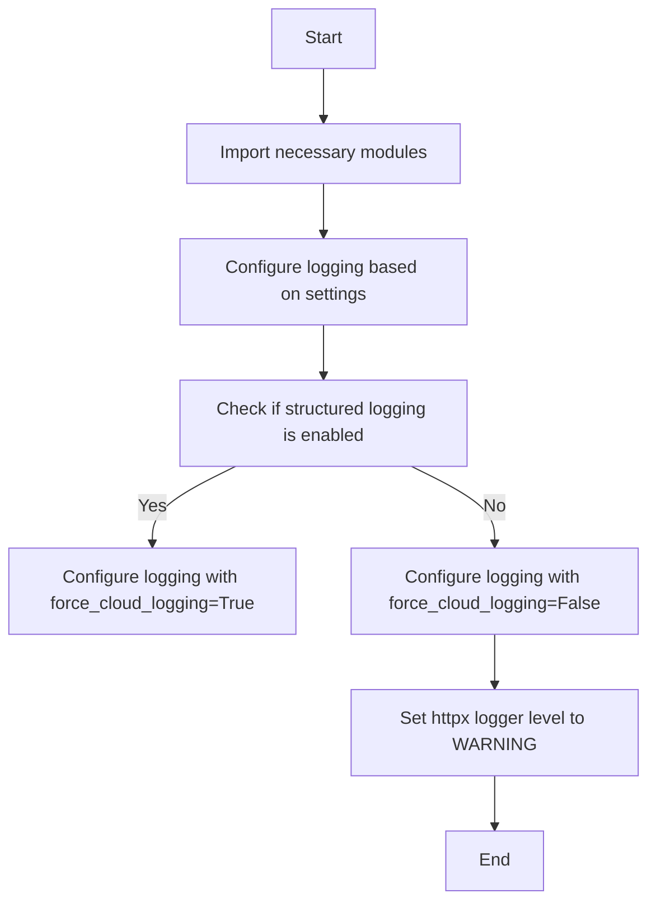

## 类结构

```
logging_config (模块)
├── configure_logging (函数)
│   ├── is_structured_logging_enabled (函数)
│   ├── Settings (类)
│   ├── BehaveAs (枚举)
│   ├── AppEnvironment (枚举)
│   └── PrefixFilter (类)
└── TruncatedLogger (类)
```

## 全局变量及字段


### `settings`
    
Global settings object that holds configuration for the application.

类型：`Settings`
    


### `logging`
    
Global logging object used for logging messages throughout the application.

类型：`logging.Logger`
    


### `Settings.config`
    
Configuration object for the application settings.

类型：`SettingsConfig`
    


### `PrefixFilter.prefix`
    
Prefix string to be added to log messages.

类型：`str`
    


### `TruncatedLogger.logger`
    
Logger instance to which messages will be logged.

类型：`logging.Logger`
    


### `TruncatedLogger.metadata`
    
Additional metadata to be included in log messages.

类型：`dict`
    


### `TruncatedLogger.max_length`
    
Maximum length of the log message before truncation.

类型：`int`
    


### `TruncatedLogger.prefix`
    
Prefix string to be added to log messages.

类型：`str`
    
    

## 全局函数及方法


### configure_logging()

This function configures the logging settings based on whether structured logging (cloud logging) is enabled or not.

参数：

- 无

返回值：`无`，该函数不返回任何值，它直接配置日志设置。

#### 流程图

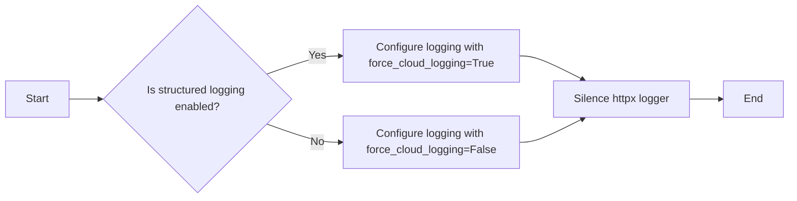

#### 带注释源码

```python
def configure_logging():
    import autogpt_libs.logging.config

    if not is_structured_logging_enabled():
        autogpt_libs.logging.config.configure_logging(force_cloud_logging=False)
    else:
        autogpt_libs.logging.config.configure_logging(force_cloud_logging=True)

    # Silence httpx logger
    logging.getLogger("httpx").setLevel(logging.WARNING)
```


### is_structured_logging_enabled()

Check if structured logging (cloud logging) is enabled.

参数：

-  `None`：`None`，No parameters are passed directly to this function. It relies on the internal state of the `Settings` class and the `BehaveAs` and `AppEnvironment` enums.

返回值：`bool`，Indicates whether structured logging is enabled or not.

#### 流程图

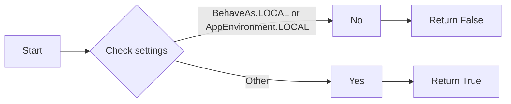

#### 带注释源码

```python
def is_structured_logging_enabled() -> bool:
    """Check if structured logging (cloud logging) is enabled."""
    return not (
        settings.config.behave_as == BehaveAs.LOCAL
        or settings.config.app_env == AppEnvironment.LOCAL
    )
```


### Settings.__init__

初始化Settings类，设置配置参数。

参数：

- `self`：`Settings`对象，当前类的实例。

返回值：无

#### 流程图

```mermaid
classDiagram
    class Settings {
        config AppEnvironment app_env
        config BehaveAs behave_as
    }
    Settings :>> AppEnvironment : has
    Settings :>> BehaveAs : has
    Settings :__init__(self)
    Settings :+ config(app_env: AppEnvironment)
    Settings :+ config(behave_as: BehaveAs)
}
```

#### 带注释源码

```python
class Settings:
    def __init__(self):
        # 设置配置参数
        self.config = {
            'app_env': AppEnvironment,
            'behave_as': BehaveAs
        }
```


### configure_logging()

配置日志记录器。

参数：

- 无

返回值：无

#### 流程图

```mermaid
graph LR
A[Start] --> B{Check is_structured_logging_enabled()}
B -- Yes --> C[Configure logging with force_cloud_logging=True]
B -- No --> D[Configure logging with force_cloud_logging=False]
C --> E[Silence httpx logger]
D --> E
E --> F[End]
```

#### 带注释源码

```python
def configure_logging():
    import autogpt_libs.logging.config

    if not is_structured_logging_enabled():
        autogpt_libs.logging.config.configure_logging(force_cloud_logging=False)
    else:
        autogpt_libs.logging.config.configure_logging(force_cloud_logging=True)

    # Silence httpx logger
    logging.getLogger("httpx").setLevel(logging.WARNING)
```

### is_structured_logging_enabled()

检查是否启用了结构化日志（云日志）。

参数：

- 无

返回值：`bool`，如果启用了结构化日志，则返回 `True`，否则返回 `False`

#### 流程图

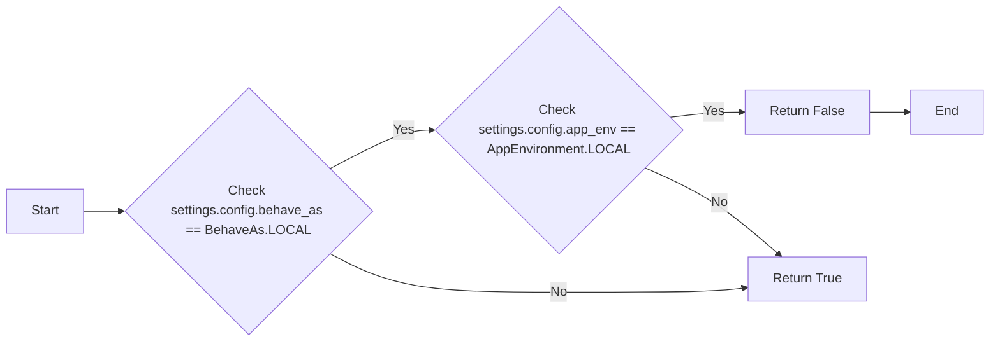

#### 带注释源码

```python
def is_structured_logging_enabled() -> bool:
    """Check if structured logging (cloud logging) is enabled."""
    return not (
        settings.config.behave_as == BehaveAs.LOCAL
        or settings.config.app_env == AppEnvironment.LOCAL
    )
```

### TruncatedLogger.info()

记录信息级别的日志。

参数：

- `msg`：`str`，要记录的消息
- `**extra`：`dict`，额外的日志记录信息

返回值：无

#### 流程图

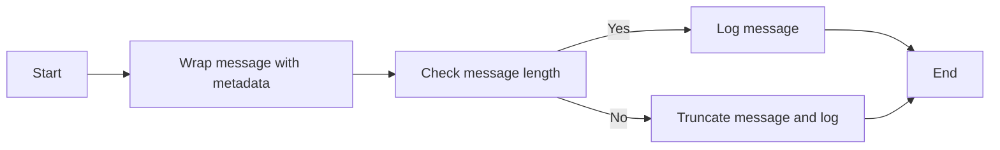

#### 带注释源码

```python
def info(self, msg: str, **extra):
    msg = self._wrap(msg, **extra)
    self.logger.info(msg, extra=self._get_metadata(**extra))
```

### PrefixFilter.filter()

为日志记录添加前缀。

参数：

- `record`：`logging.LogRecord`，日志记录对象

返回值：`bool`，如果记录应该被过滤，则返回 `True`，否则返回 `False`

#### 流程图

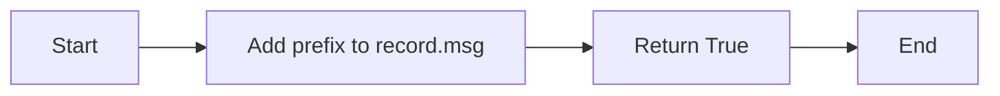

#### 带注释源码

```python
def filter(self, record):
    record.msg = f"{self.prefix} {record.msg}"
    return True
```


### BehaveAs.__init__

BehaveAs 类的初始化方法，用于设置行为模式。

参数：

- `self`：`BehaveAs` 类的实例，用于访问类的属性和方法。
- `behave_as`：`BehaveAs`，指定应用程序的行为模式，可以是 `BehaveAs.LOCAL` 或 `BehaveAs.CLOUD`。

返回值：无

#### 流程图

```mermaid
classDiagram
    BehaveAs <|-- AppEnvironment
    BehaveAs {
        +behave_as BehaveAs
    }
    AppEnvironment {
        +LOCAL AppEnvironment
        +CLOUD AppEnvironment
    }
```

#### 带注释源码

```python
class BehaveAs:
    # 定义行为模式枚举
    LOCAL = 'local'
    CLOUD = 'cloud'

    def __init__(self, behave_as: BehaveAs):
        # 设置行为模式
        self.behave_as = behave_as
```


### `configure_logging`

Configure the logging settings based on the application environment and behavior.

参数：

- `force_cloud_logging`: `bool`，Determines whether to force cloud logging.
- `is_structured_logging_enabled()`: `bool`，Indicates if structured logging is enabled.

返回值：`None`，No return value.

#### 流程图

```mermaid
graph LR
A[Start] --> B{Check is_structured_logging_enabled()}
B -- Yes --> C[Configure logging with force_cloud_logging = True]
B -- No --> D[Configure logging with force_cloud_logging = False]
C --> E[Silence httpx logger]
D --> E
E --> F[End]
```

#### 带注释源码

```python
def configure_logging():
    import autogpt_libs.logging.config

    if not is_structured_logging_enabled():
        autogpt_libs.logging.config.configure_logging(force_cloud_logging=False)
    else:
        autogpt_libs.logging.config.configure_logging(force_cloud_logging=True)

    # Silence httpx logger
    logging.getLogger("httpx").setLevel(logging.WARNING)
```

### `is_structured_logging_enabled`

Check if structured logging (cloud logging) is enabled.

参数：

- `settings.config.behave_as`: `BehaveAs`，The behavior setting of the application.
- `settings.config.app_env`: `AppEnvironment`，The application environment setting.

返回值：`bool`，Indicates whether structured logging is enabled.

#### 流程图


#### 带注释源码

```python
def is_structured_logging_enabled() -> bool:
    """Check if structured logging (cloud logging) is enabled."""
    return not (
        settings.config.behave_as == BehaveAs.LOCAL
        or settings.config.app_env == AppEnvironment.LOCAL
    )
```

### `TruncatedLogger`

A logger that truncates messages if they exceed a certain length.

参数：

- `logger`: `logging.Logger`，The logger to wrap.
- `prefix`: `str`，The prefix to add to the log messages.
- `metadata`: `dict | None`，Additional metadata to include in the log messages.
- `max_length`: `int`，The maximum length of the log messages.

返回值：`None`，No return value.

#### 流程图

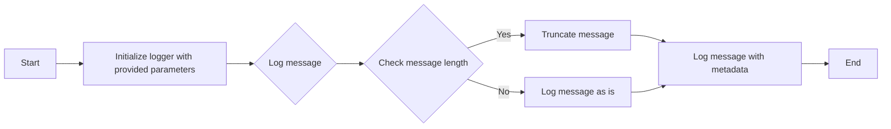

#### 带注释源码

```python
class TruncatedLogger:
    def __init__(
        self,
        logger: logging.Logger,
        prefix: str = "",
        metadata: dict | None = None,
        max_length: int = 1000,
    ):
        self.logger = logger
        self.metadata = metadata or {}
        self.max_length = max_length
        self.prefix = prefix

    def info(self, msg: str, **extra):
        msg = self._wrap(msg, **extra)
        self.logger.info(msg, extra=self._get_metadata(**extra))

    def warning(self, msg: str, **extra):
        msg = self._wrap(msg, **extra)
        self.logger.warning(msg, extra=self._get_metadata(**extra))

    def error(self, msg: str, **extra):
        msg = self._wrap(msg, **extra)
        self.logger.error(msg, extra=self._get_metadata(**extra))

    def debug(self, msg: str, **extra):
        msg = self._wrap(msg, **extra)
        self.logger.debug(msg, extra=self._get_metadata(**extra))

    def exception(self, msg: str, **extra):
        msg = self._wrap(msg, **extra)
        self.logger.exception(msg, extra=self._get_metadata(**extra))

    def _get_metadata(self, **extra):
        metadata = {**self.metadata, **extra}
        return {"json_fields": metadata} if metadata else {}

    def _wrap(self, msg: str, **extra):
        extra_msg = str(extra or "")
        text = f"{self.prefix} {msg} {extra_msg}"
        if len(text) > self.max_length:
            half = (self.max_length - 3) // 2
            text = text[:half] + "..." + text[-half:]
        return text
```

### `PrefixFilter`

A logging filter that adds a prefix to log messages.

参数：

- `prefix`: `str`，The prefix to add to the log messages.

返回值：`bool`，Indicates whether the log record should be logged.

#### 流程图

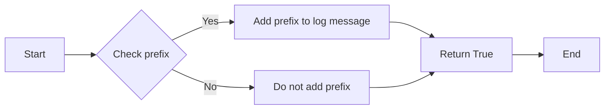

#### 带注释源码

```python
class PrefixFilter(logging.Filter):
    def __init__(self, prefix: str):
        super().__init__()
        self.prefix = prefix

    def filter(self, record):
        record.msg = f"{self.prefix} {record.msg}"
        return True
```


### AppEnvironment.__init__

AppEnvironment 类的初始化方法，用于设置应用程序的环境配置。

参数：

- `self`：`AppEnvironment` 类的实例，表示当前对象
- `settings`：`Settings` 类的实例，包含应用程序的配置信息

返回值：无

#### 流程图

```mermaid
classDiagram
    AppEnvironment <|-- Settings
    AppEnvironment {
        __init__(self, settings: Settings)
    }
```

#### 带注释源码

```python
class AppEnvironment:
    def __init__(self, settings: Settings):
        # 初始化 AppEnvironment 类
        # settings: Settings 类的实例，包含应用程序的配置信息
        pass
```


### configure_logging()

配置日志记录器，根据环境设置选择是否启用结构化日志记录。

参数：

- `force_cloud_logging`: `bool`，强制启用云日志记录，默认为 `False`。

返回值：无

#### 流程图

```mermaid
graph LR
A[Start] --> B{Check is_structured_logging_enabled()}
B -- Yes --> C[Configure logging with force_cloud_logging = True]
B -- No --> D[Configure logging with force_cloud_logging = False]
C --> E[Silence httpx logger]
D --> E
E --> F[End]
```

#### 带注释源码

```python
def configure_logging():
    import autogpt_libs.logging.config

    if not is_structured_logging_enabled():
        autogpt_libs.logging.config.configure_logging(force_cloud_logging=False)
    else:
        autogpt_libs.logging.config.configure_logging(force_cloud_logging=True)

    # Silence httpx logger
    logging.getLogger("httpx").setLevel(logging.WARNING)
```

### is_structured_logging_enabled()

检查是否启用了结构化日志记录（云日志记录）。

参数：无

返回值：`bool`，如果启用了结构化日志记录，则返回 `True`，否则返回 `False`。

#### 流程图

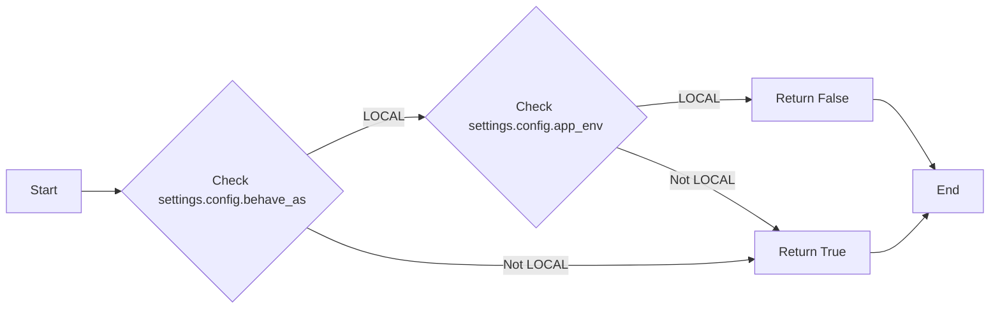

#### 带注释源码

```python
def is_structured_logging_enabled() -> bool:
    """Check if structured logging (cloud logging) is enabled."""
    return not (
        settings.config.behave_as == BehaveAs.LOCAL
        or settings.config.app_env == AppEnvironment.LOCAL
    )
```

### TruncatedLogger.info()

向日志记录器发送信息消息，如果消息长度超过最大长度，则截断。

参数：

- `msg`: `str`，要记录的消息。
- `**extra`: `dict`，额外的日志记录信息。

返回值：无

#### 流程图

```mermaid
graph LR
A[Start] --> B{Check if msg length > max_length}
B -- Yes --> C[Truncate msg]
B -- No --> C
C --> D[Log msg with logger.info()]
D --> E[End]
```

#### 带注释源码

```python
def info(self, msg: str, **extra):
    msg = self._wrap(msg, **extra)
    self.logger.info(msg, extra=self._get_metadata(**extra))
```

### PrefixFilter.filter()

为日志记录器添加前缀。

参数：

- `record`: `logging.LogRecord`，日志记录对象。

返回值：`bool`，如果记录应该被过滤，则返回 `True`。

#### 流程图

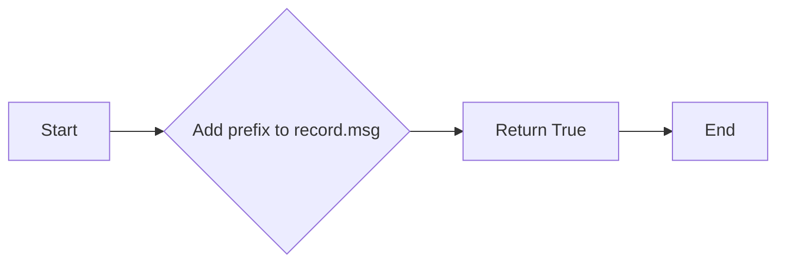

#### 带注释源码

```python
def filter(self, record):
    record.msg = f"{self.prefix} {record.msg}"
    return True
```


### PrefixFilter.__init__

PrefixFilter 类的构造函数，用于初始化 PrefixFilter 实例。

参数：

- `prefix`：`str`，表示要添加到日志消息前缀的字符串。

返回值：无

#### 流程图

```mermaid
classDiagram
    class PrefixFilter {
        str prefix
    }
    PrefixFilter :+--(has) PrefixFilter()
    PrefixFilter :+--(has) str prefix
}
```

#### 带注释源码

```python
class PrefixFilter(logging.Filter):
    def __init__(self, prefix: str):
        super().__init__()
        self.prefix = prefix  # 初始化 prefix 字段，用于存储前缀字符串
```


### PrefixFilter.filter

This method is a filter for the logging module that prefixes the log message with a specified prefix.

参数：

- `record`：`logging.LogRecord`，The log record to be filtered.

返回值：`bool`，Indicates whether the log record should be logged or not.

#### 流程图

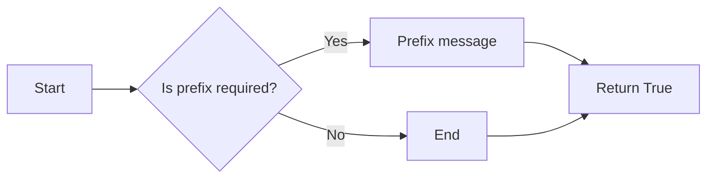

#### 带注释源码

```python
class PrefixFilter(logging.Filter):
    def __init__(self, prefix: str):
        super().__init__()
        self.prefix = prefix

    def filter(self, record):
        # Prefix the log message with the specified prefix
        record.msg = f"{self.prefix} {record.msg}"
        # Return True to indicate that the log record should be logged
        return True
``` 


### TruncatedLogger.__init__

TruncatedLogger 类的初始化方法，用于创建一个 TruncatedLogger 实例，该实例可以截断日志消息长度，并添加前缀和元数据。

参数：

- `logger`：`logging.Logger`，日志记录器对象，用于记录日志信息。
- `prefix`：`str`，可选，日志消息的前缀。
- `metadata`：`dict | None`，可选，额外的元数据字典。
- `max_length`：`int`，可选，日志消息的最大长度。

返回值：无

#### 流程图

```mermaid
classDiagram
    TruncatedLogger <|-- logger: logging.Logger
    TruncatedLogger <|-- prefix: str
    TruncatedLogger <|-- metadata: dict | None
    TruncatedLogger <|-- max_length: int
```

#### 带注释源码

```python
class TruncatedLogger:
    def __init__(
        self,
        logger: logging.Logger,
        prefix: str = "",
        metadata: dict | None = None,
        max_length: int = 1000,
    ):
        # 初始化 TruncatedLogger 实例
        self.logger = logger  # 日志记录器对象
        self.metadata = metadata or {}  # 默认为空字典
        self.max_length = max_length  # 日志消息的最大长度
        self.prefix = prefix  # 日志消息的前缀
```


### TruncatedLogger.info

This method is used to log informational messages with optional additional metadata. It wraps the message and metadata before logging it, ensuring that the message does not exceed a specified maximum length.

参数：

- `msg`：`str`，The message to be logged.
- `**extra``：`dict`，Additional keyword arguments that are added to the log record.

返回值：`None`，This method does not return a value.

#### 流程图

```mermaid
graph LR
A[Start] --> B{Check max_length}
B -->|Yes| C[Truncate message if necessary]
B -->|No| C
C --> D[Wrap message with metadata]
D --> E[Log message with extra metadata]
E --> F[End]
```

#### 带注释源码

```python
def info(self, msg: str, **extra):
    msg = self._wrap(msg, **extra)
    self.logger.info(msg, extra=self._get_metadata(**extra))
```


### TruncatedLogger.warning

This method is used to log a warning message with optional extra information, with the message truncated if it exceeds a specified maximum length.

参数：

- `msg`：`str`，The warning message to be logged.
- `**extra``：`dict`，Optional extra information to be included in the log record.

返回值：`None`，This method does not return a value.

#### 流程图

```mermaid
graph LR
A[Start] --> B{Check max_length}
B -- Yes --> C[Truncate message if necessary]
B -- No --> C
C --> D[Log warning message]
D --> E[End]
```

#### 带注释源码

```python
def warning(self, msg: str, **extra):
    msg = self._wrap(msg, **extra)
    self.logger.warning(msg, extra=self._get_metadata(**extra))
```


### TruncatedLogger.error

TruncatedLogger.error is a method of the TruncatedLogger class that logs an error message with optional additional metadata. It wraps the message and metadata before logging it, ensuring that the message does not exceed a specified maximum length.

参数：

- `msg`：`str`，The error message to be logged.
- `**extra`：`dict`，Additional keyword arguments that are added to the log record.

返回值：`None`，This method does not return a value.

#### 流程图

```mermaid
graph LR
A[Start] --> B{Check max_length}
B -->|Yes| C[Truncate message if necessary]
B -->|No| C
C --> D[Log message with metadata]
D --> E[End]
```

#### 带注释源码

```python
def error(self, msg: str, **extra):
    msg = self._wrap(msg, **extra)
    self.logger.error(msg, extra=self._get_metadata(**extra))
```


### TruncatedLogger.debug

TruncatedLogger.debug is a method of the TruncatedLogger class that logs debug messages with optional additional metadata. It wraps the original message and metadata to ensure that the output is truncated if it exceeds a specified maximum length.

参数：

- `msg`：`str`，The message to be logged. This is the main content of the log message.
- `**extra`：`dict`，Additional keyword arguments that are added to the log record. These can include metadata such as timestamps, user IDs, or other relevant information.

返回值：`None`，This method does not return a value. It logs the message and metadata to the configured logger.

#### 流程图

```mermaid
graph LR
A[Start] --> B{Check max_length}
B -->|Yes| C[Truncate message if necessary]
B -->|No| C
C --> D[Log message with metadata]
D --> E[End]
```

#### 带注释源码

```python
def debug(self, msg: str, **extra):
    msg = self._wrap(msg, **extra)
    self.logger.debug(msg, extra=self._get_metadata(**extra))
```


### TruncatedLogger.exception

TruncatedLogger.exception is a method of the TruncatedLogger class that logs an exception with additional metadata and a prefix, while also truncating the message if it exceeds a specified maximum length.

参数：

- `msg`：`str`，The message to log. This is the exception message that will be logged.
- `**extra`：`dict`，Additional keyword arguments that will be added to the log record.

返回值：`None`，This method does not return a value.

#### 流程图

```mermaid
graph LR
A[Start] --> B{Is msg truncated?}
B -- Yes --> C[Log message with metadata]
B -- No --> D[Truncate message]
D --> C
C --> E[End]
```

#### 带注释源码

```python
def exception(self, msg: str, **extra):
    msg = self._wrap(msg, **extra)
    self.logger.exception(msg, extra=self._get_metadata(**extra))
```


### TruncatedLogger._get_metadata

This method is responsible for constructing and returning metadata for logging purposes, which is then attached to log messages.

参数：

- `**extra`：`dict`，Additional keyword arguments that are passed to the logging method. These arguments are merged with the instance's metadata.

返回值：`dict`，A dictionary containing the metadata to be attached to the log message.

#### 流程图

```mermaid
graph LR
A[Start] --> B{Is metadata empty?}
B -- Yes --> C[Return empty dictionary]
B -- No --> D[Merge metadata with extra]
D --> E[Return merged metadata]
E --> F[End]
```

#### 带注释源码

```python
def _get_metadata(self, **extra):
    metadata = {**self.metadata, **extra}
    return {"json_fields": metadata} if metadata else {}
```


### TruncatedLogger._wrap

This method is responsible for wrapping the log message with additional information and ensuring it does not exceed a specified maximum length.

参数：

- `msg`：`str`，The original log message to be wrapped.
- `**extra``：`dict`，Additional information to be included in the log message.

返回值：`str`，The wrapped log message.

#### 流程图

```mermaid
graph LR
A[Start] --> B{Check length}
B -->|Yes| C[Truncate message]
B -->|No| C
C --> D[Return wrapped message]
D --> E[End]
```

#### 带注释源码

```python
def _wrap(self, msg: str, **extra):
    extra_msg = str(extra or "")
    text = f"{self.prefix} {msg} {extra_msg}"
    if len(text) > self.max_length:
        half = (self.max_length - 3) // 2
        text = text[:half] + "..." + text[-half:]
    return text
```


## 关键组件


### 张量索引与惰性加载

支持对张量的索引操作，并在需要时才加载张量数据，以优化内存使用和性能。

### 反量化支持

提供对反量化操作的支持，允许在量化过程中进行逆量化，以便进行精确的数值计算。

### 量化策略

实现多种量化策略，包括全局量化、局部量化等，以适应不同的应用场景和性能需求。


## 问题及建议


### 已知问题

-   **全局变量和函数的依赖性**：代码中使用了全局变量 `settings` 和全局函数 `is_structured_logging_enabled()`，这可能导致代码的可测试性和可维护性降低。全局状态和函数的使用应该尽量避免，除非有充分的理由。
-   **日志配置的复杂性**：`configure_logging` 函数中包含了条件逻辑来决定是否启用结构化日志，这增加了配置的复杂性。如果配置逻辑变得更加复杂，可能会影响代码的可读性和可维护性。
-   **日志记录的重复性**：`PrefixFilter` 类可能会在日志消息中添加重复的前缀，如果 `TruncatedLogger` 和 `PrefixFilter` 同时使用，可能会导致日志消息中的前缀重复。

### 优化建议

-   **减少全局变量的使用**：考虑将 `settings` 变量移至类中，并通过构造函数或配置文件进行初始化，以提高代码的可测试性和可维护性。
-   **简化日志配置**：如果可能，尝试简化 `configure_logging` 函数中的条件逻辑，或者将配置逻辑移至配置文件中，以便于管理和维护。
-   **避免日志记录的重复性**：在 `TruncatedLogger` 和 `PrefixFilter` 的使用上，确保不会添加重复的前缀，可以通过在 `TruncatedLogger` 中检查是否已经添加了前缀来实现。
-   **代码复用**：如果 `TruncatedLogger` 和 `PrefixFilter` 的功能在其他项目中也有需求，考虑将其封装成可重用的库或模块。
-   **异常处理**：在 `TruncatedLogger` 的方法中，应该添加异常处理逻辑，以确保在日志记录过程中出现的任何异常都能被妥善处理。
-   **代码注释**：增加必要的代码注释，以提高代码的可读性和可维护性。


## 其它


### 设计目标与约束

- 设计目标：
  - 提供灵活的日志配置和过滤功能。
  - 支持本地和云端的日志记录。
  - 确保日志信息的完整性和可读性。

- 约束：
  - 必须兼容现有的日志库。
  - 代码应保持简洁，易于维护。
  - 应避免引入不必要的性能开销。

### 错误处理与异常设计

- 错误处理：
  - 使用标准的Python异常处理机制。
  - 对于可能出现的配置错误，提供明确的错误信息。

- 异常设计：
  - 定义自定义异常类，用于处理特定的错误情况。
  - 异常类应提供清晰的错误描述和上下文信息。

### 数据流与状态机

- 数据流：
  - 日志消息从应用程序流向日志记录器。
  - 日志记录器根据配置和过滤器处理日志消息。

- 状态机：
  - 日志记录器根据不同的环境（本地或云端）调整其行为。

### 外部依赖与接口契约

- 外部依赖：
  - 依赖于`logging`模块进行日志记录。
  - 依赖于`settings`模块获取配置信息。

- 接口契约：
  - `TruncatedLogger`类提供了一个统一的接口，用于记录不同级别的日志。
  - `PrefixFilter`类实现了`logging.Filter`接口，用于过滤日志消息。


    