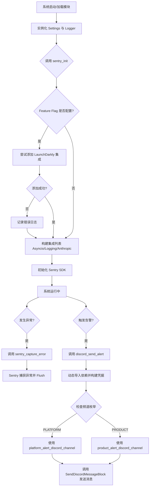
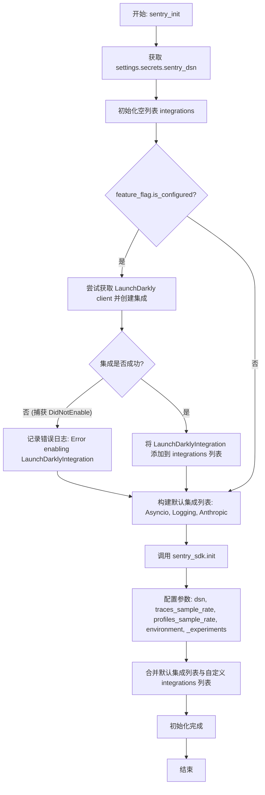
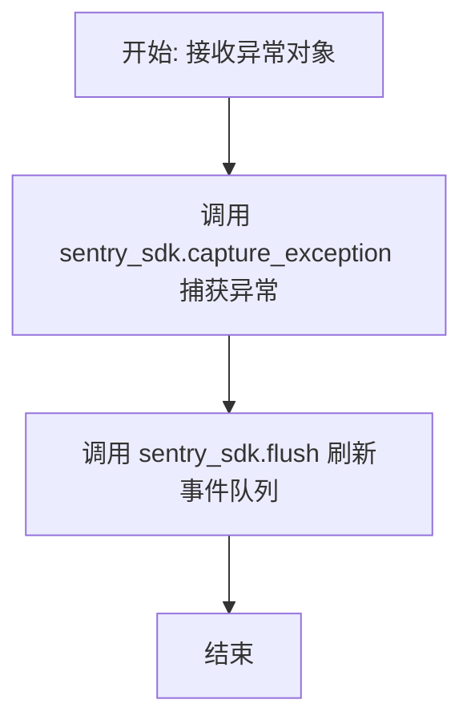

# `.\AutoGPT\autogpt_platform\backend\backend\util\metrics.py` 详细设计文档

该代码主要负责系统的可观测性集成与告警通知，核心功能包括初始化并配置 Sentry SDK 以进行错误追踪和性能监控（集成了 LaunchDarkly、Anthropic 等组件），提供捕获异常的工具函数，以及通过异步方式根据不同业务场景（PLATFORM 或 PRODUCT）向指定的 Discord 频道发送告警消息。

## 整体流程



## 类结构

```
DiscordChannel (str, Enum)
├── PLATFORM
└── PRODUCT
```

## 全局变量及字段


### `settings`
    
应用程序设置的全局实例，用于访问配置参数和机密密钥。

类型：`Settings`
    


### `logger`
    
配置好的日志记录器实例，用于记录模块信息和错误消息。

类型：`logging.Logger`
    


### `DiscordChannel.PLATFORM`
    
代表 Discord 频道的枚举值，用于平台或系统级警报。

类型：`str`
    


### `DiscordChannel.PRODUCT`
    
代表 Discord 频道的枚举值，用于产品级警报（如余额问题）。

类型：`str`
    
    

## 全局函数及方法


### `sentry_init`

该函数负责初始化 Sentry SDK，用于应用程序的监控和错误追踪。它配置了数据源名称 (DSN)、追踪和性能分析的采样率、运行环境，并集成了 AsyncIO、日志记录、Anthropic 以及可选的 LaunchDarkly 等组件。

参数：

- 无

返回值：`None`，该函数不返回任何值，主要用于执行 Sentry SDK 的初始化配置。

#### 流程图



#### 带注释源码

```python
def sentry_init():
    # 从全局设置中获取 Sentry 的数据源名称 (DSN)
    sentry_dsn = settings.secrets.sentry_dsn
    integrations = []
    
    # 检查 Feature Flag 客户端是否已配置
    if feature_flag.is_configured():
        try:
            # 尝试添加 LaunchDarkly 集成，用于追踪特性标志状态
            integrations.append(LaunchDarklyIntegration(feature_flag.get_client()))
        except DidNotEnable as e:
            # 如果集成启用失败（例如配置问题），记录错误日志但不中断程序
            logger.error(f"Error enabling LaunchDarklyIntegration for Sentry: {e}")
            
    # 调用 Sentry SDK 初始化方法
    sentry_sdk.init(
        dsn=sentry_dsn,  # 设置 Sentry DSN
        traces_sample_rate=1.0,  # 设置分布式追踪采样率为 100% (全量采样)
        profiles_sample_rate=1.0,  # 设置性能分析采样率为 100% (全量采样)
        # 构建环境字符串，包含应用运行环境和模拟行为标识
        environment=f"app:{settings.config.app_env.value}-behave:{settings.config.behave_as.value}",
        _experiments={"enable_logs": True},  # 开启日志收集的实验性功能
        # 配置集成列表：包含默认的异步、日志、Anthropic 集成以及条件添加的 LaunchDarkly
        integrations=[
            AsyncioIntegration(),  # 支持 asyncio 异步框架的自动追踪
            LoggingIntegration(sentry_logs_level=logging.INFO),  # 将 INFO 级别及以上的日志发送到 Sentry
            AnthropicIntegration(
                include_prompts=False,  # 集成 Anthropic AI 调用追踪，但不包含敏感的提示词内容
            ),
        ]
        + integrations,  # 追加上述条件性添加的集成
    )
```


### `sentry_capture_error`

该函数的核心功能是将捕获到的 Python 异常对象发送到 Sentry 监控平台，并立即刷新传输队列以确保错误被即时上报。

参数：

-  `error`：`BaseException`，需要被捕获并上报给 Sentry 的异常实例对象

返回值：`None`，该函数主要用于执行副作用（发送错误数据），不返回任何值

#### 流程图



#### 带注释源码

```python
def sentry_capture_error(error: BaseException):
    # 将捕获到的异常对象发送给 Sentry，生成错误事件
    sentry_sdk.capture_exception(error)
    # 强制刷新 Sentry 的传输队列，确保事件立即发送到服务器，避免程序退出导致丢失
    sentry_sdk.flush()
```


### `discord_send_alert`

异步发送告警消息到指定的 Discord 频道。该函数根据传入的频道枚举类型（PLATFORM 或 PRODUCT）从配置中获取目标频道名称，并使用预配置的 Bot Token 凭证通过 `SendDiscordMessageBlock` 执行消息发送逻辑。

参数：

- `content`：`str`，要发送到 Discord 的消息内容。
- `channel`：`DiscordChannel`，目标频道类型，默认为 `DiscordChannel.PLATFORM`。用于确定从系统配置中读取哪个具体的频道名称。

返回值：`Any`（具体类型取决于 `SendDiscordMessageBlock().run_once` 的实现），返回 Discord 消息发送块的执行结果，通常包含发送状态或响应数据。

#### 流程图

```mermaid
flowchart TD
    A[开始: discord_send_alert] --> B[导入内部模块]
    B --> C[构建 APIKeyCredentials<br>使用 settings.secrets.discord_bot_token]
    C --> D{判断 channel 参数}
    D -->|DiscordChannel.PLATFORM| E[获取 platform_alert_discord_channel]
    D -->|DiscordChannel.PRODUCT| F[获取 product_alert_discord_channel]
    D -->|其他| G[获取 platform_alert_discord_channel (默认)]
    E --> H[构建 SendDiscordMessageBlock.Input]
    F --> H
    G --> H
    H --> I[执行 SendDiscordMessageBlock().run_once<br>传入凭证、内容和频道名]
    I --> J[返回执行结果]
    J --> K[结束]
```

#### 带注释源码

```python
async def discord_send_alert(
    content: str, channel: DiscordChannel = DiscordChannel.PLATFORM
):
    # 导入必要的模块：Discord发送块和相关的数据模型
    from backend.blocks.discord.bot_blocks import SendDiscordMessageBlock
    from backend.data.model import APIKeyCredentials, CredentialsMetaInput, ProviderName

    # 创建 Discord API 凭证对象
    creds = APIKeyCredentials(
        provider="discord",
        # 从系统设置中获取 Discord Bot Token，并包装为 SecretStr 以保证安全
        api_key=SecretStr(settings.secrets.discord_bot_token),
        title="Provide Discord Bot Token for the platform alert",
        expires_at=None,
    )

    # 根据传入的 channel 枚举参数选择目标频道名称
    if channel == DiscordChannel.PLATFORM:
        # 如果是平台类型，获取平台告警频道配置
        channel_name = settings.config.platform_alert_discord_channel
    elif channel == DiscordChannel.PRODUCT:
        # 如果是产品类型，获取产品告警频道配置
        channel_name = settings.config.product_alert_discord_channel
    else:
        # 默认情况（兜底），使用平台告警频道配置
        channel_name = settings.config.platform_alert_discord_channel

    # 调用 SendDiscordMessageBlock 的 run_once 方法执行发送
    return await SendDiscordMessageBlock().run_once(
        # 构造输入参数，包含凭证元数据、消息内容和频道名称
        SendDiscordMessageBlock.Input(
            credentials=CredentialsMetaInput(
                id=creds.id,
                title=creds.title,
                type=creds.type,
                provider=ProviderName.DISCORD,
            ),
            message_content=content,
            channel_name=channel_name,
        ),
        "status",
        credentials=creds,
    )
```


## 关键组件


### Sentry 监控初始化
负责配置并初始化 Sentry SDK，集成 Asyncio、Logging、Anthropic 及 LaunchDarkly 等组件，设置环境变量与采样率，以实现对应用错误追踪、性能采样及日志记录的全面监控。

### 异常捕获与上报
提供捕获运行时异常并将其上报至 Sentry 的功能，通过调用 SDK 接口记录错误详情，并执行缓冲区刷新以确保数据即时传输。

### Discord 告警服务
提供基于 Discord 的异步消息通知能力，根据传入的频道枚举（平台或产品）动态从配置中获取目标频道，并利用封装的 Bot Block 和凭证信息执行消息发送逻辑。

### 告警频道枚举
定义系统支持的 Discord 告警渠道类型，区分平台系统级告警（PLATFORM）与产品业务级告警（PRODUCT，如余额不足）。


## 问题及建议


### 已知问题

-   **Sentry 采样率硬编码风险**：`sentry_init` 函数中 `traces_sample_rate` 和 `profiles_sample_rate` 被硬编码为 `1.0` (100%)。在生产环境中，这会导致海量的监控数据上传，显著增加 Sentry 计费成本，并可能对应用性能造成负面影响。
-   **潜在的循环导入设计缺陷**：在 `discord_send_alert` 函数内部导入了 `backend.blocks.discord.bot_blocks` 和 `backend.data.model`。这种写法通常用于规避模块级别的循环导入错误，表明项目模块间可能存在不合理的依赖关系，影响了代码的可维护性和启动性能。
-   **资源重复创建**：每次调用 `discord_send_alert` 时都会重新实例化 `SendDiscordMessageBlock` 类以及构建新的 `APIKeyCredentials` 对象。对于高频调用的场景，这会产生不必要的内存分配和初始化开销。

### 优化建议

-   **配置化监控采样率**：建议将 `traces_sample_rate` 和 `profiles_sample_rate` 移至 `Settings` 配置文件中，以便根据不同环境（开发、测试、生产）灵活调整采样率，在生产环境降低至合理范围（如 0.1 或更低）。
-   **重构模块依赖结构**：解决循环导入问题，将 `discord_send_alert` 的相关依赖提升至文件顶部或通过依赖注入的方式传入，明确模块职责边界，提升代码可读性。
-   **引入单例或缓存机制**：对于 `SendDiscordMessageBlock` 和固定的 `APIKeyCredentials`，建议将其初始化为模块级变量或使用单例模式，避免每次发送警报时重复创建对象。
-   **增强 Discord 发送异常处理**：当前 `discord_send_alert` 直接抛出异常，可能导致主业务流程因发送警报失败而中断。建议在函数内部捕获异常并记录日志，确保警报发送失败不会影响主程序的稳定性。
-   **添加 Sentry DSN 校验**：在 `sentry_init` 中添加对 `sentry_dsn` 是否为空的判断，当 DSN 未配置时直接跳过初始化，避免 SDK 报出不必要的警告或错误日志。


## 其它


### 设计目标与约束

**设计目标**：
1.  **全链路可观测性**：通过集成 Sentry SDK，实现应用程序的日志记录、性能追踪、错误捕获以及性能剖析，确保开发与运维团队能够实时监控应用健康状况。
2.  **关键事件告警**：建立基于 Discord 的即时通知通道，区分平台级（如系统故障）和产品级（如余额不足）告警，确保业务异常能被及时感知。
3.  **动态配置与扩展**：集成 LaunchDarkly 功能开关，允许动态控制监控与告警的行为，增强系统的灵活性。

**约束条件**：
1.  **初始化顺序**：`sentry_init` 必须在应用启动早期且 `Settings` 初始化完成后调用，以确保配置正确加载。
2.  **异步环境兼容**：代码运行在异步环境中，必须使用 `AsyncioIntegration` 且 `discord_send_alert` 必须声明为 `async` 函数。
3.  **依赖可用性**：Discord 告警功能依赖于 `backend.blocks.discord` 和 `backend.data.model` 模块，且必须拥有有效的 Discord Bot Token 和 Sentry DSN。
4.  **采样率配置**：当前强制设置了追踪和剖析的 100% 采样率 (`1.0`)，在生产高并发环境下可能会带来性能开销。

### 错误处理与异常设计

1.  **集成初始化异常**：
    *   在 `sentry_init` 中，针对 `LaunchDarklyIntegration` 的初始化进行了显式的 `try-except` 捕获。
    *   如果功能开关客户端未正确配置或初始化失败（抛出 `DidNotEnable` 异常），系统会记录错误日志但**不会中断 Sentry 的主流程**，确保基础监控功能依然可用。

2.  **异常上报机制**：
    *   `sentry_capture_error` 提供了统一的异常捕获入口。它不仅调用 `capture_exception` 将错误发送至 Sentry，还显式调用 `flush()`。这是一个关键的设计，用于在进程崩溃或退出前确保事件缓冲区中的数据被强制发送，防止重要错误信息丢失。

3.  **告警降级处理**：
    *   在 `discord_send_alert` 中，对于 `DiscordChannel` 枚举值的判断采用了防御性编程。如果传入的枚举值不在预期范围内（`PLATFORM` 或 `PRODUCT`），代码会默认回退到 `PLATFORM` 频道，避免因参数错误导致程序崩溃或告静默。

### 数据流与状态机

**数据流**：

1.  **监控数据流**：
    `Settings` (环境变量) -> `sentry_init` (配置加载) -> `sentry_sdk.init` (SDK初始化) -> 应用运行时产生 Log/Trace/Profile -> Sentry Backend (云端)。

2.  **告警数据流**：
    业务逻辑触发 -> `discord_send_alert` (内容与频道枚举) -> `APIKeyCredentials` (动态构建凭据) -> `SendDiscordMessageBlock` (内部消息块) -> Discord API。

**状态机**：

该模块主要处于**无状态** 模式，但涉及以下状态转换：

*   **Sentry 状态**：`Uninitialized` -> `Initialized` (在 `sentry_init` 调用后)。一旦初始化，状态保持不变。
*   **告警状态**：`Idle` -> `Sending` (调用 `discord_send_alert` 时) -> `Idle` (等待异步返回)。

### 外部依赖与接口契约

**外部依赖库**：
1.  `sentry_sdk`：核心监控 SDK。
2.  `pydantic`：用于数据模型验证和敏感字符串 (`SecretStr`) 处理。
3.  `logging`：Python 标准日志库。

**内部模块依赖**：
1.  `backend.util.feature_flag`：提供功能开关客户端。
2.  `backend.util.settings.Settings`：提供配置管理（环境变量解析）。
3.  `backend.blocks.discord.bot_blocks`：提供发送 Discord 消息的具体实现块。
4.  `backend.data.model`：提供凭据模型定义。

**接口契约**：

1.  **环境配置契约**：
    *   `settings.secrets.sentry_dsn`：必须为有效的 Sentry Data Source Name 字符串。
    *   `settings.secrets.discord_bot_token`：必须为有效的 Discord Bot Token，且对应的 Bot 需拥有发送消息的权限。
    *   `settings.config.platform_alert_discord_channel` / `product_alert_discord_channel`：必须是配置中存在的有效频道名称。

2.  **函数接口契约**：
    *   `sentry_capture_error(error: BaseException)`：接受任何继承自 `BaseException` 的对象，无返回值，副作用为发送网络请求。
    *   `discord_send_alert(content: str, channel: DiscordChannel)`：接受非空字符串内容和枚举类型频道，返回异步执行结果（通常为消息发送状态）。

### 安全性设计

1.  **敏感数据保护**：
    *   使用 `pydantic.SecretStr` 类型封装 `discord_bot_token` 和 `sentry_dsn`。在日志打印或字符串表示时，这些敏感信息会被自动隐藏（显示为 `**********`），防止凭据泄露。
    *   在 Sentry 集成中，`AnthropicIntegration` 配置了 `include_prompts=False`。这确保了发送给大模型的 Prompt 内容不会被完整上传至 Sentry，从而避免用户隐私数据泄露。

2.  **凭据生命周期管理**：
    *   `discord_send_alert` 函数中每次调用都会动态创建临时的 `APIKeyCredentials` 对象，且设置了 `expires_at=None`。这意味着告警功能使用的是长期有效的平台级凭据，该凭据仅在内存中构建，不持久化存储到数据库，减少了凭据被长期窃取的风险面。

3.  **代码隔离**：
    *   Discord 告警相关的导入（`from backend.blocks...`）被放置在函数内部。这不仅是处理循环依赖的常见手段，也在一定程度上限制了该模块对底层 Blocks 模块的直接静态依赖，增强了模块的边界性。

    