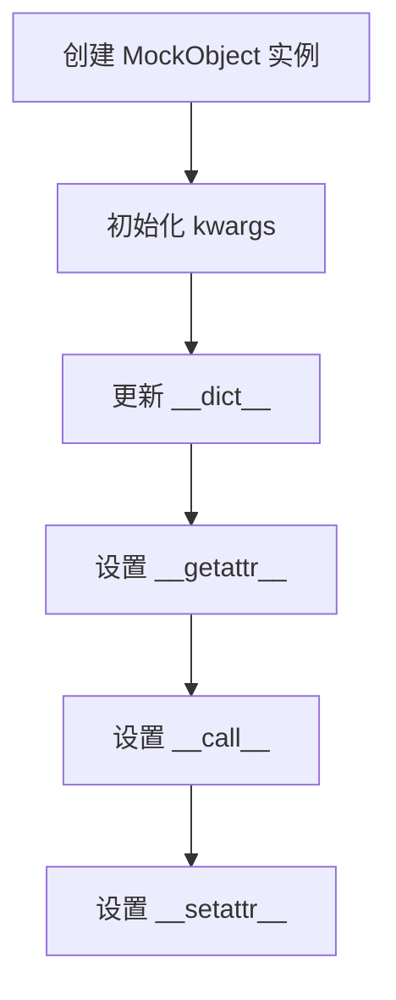
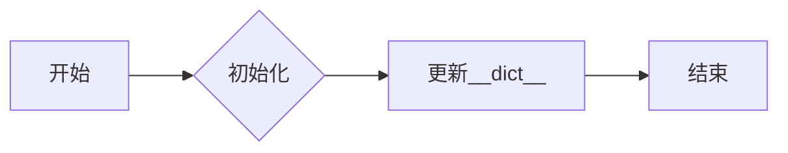
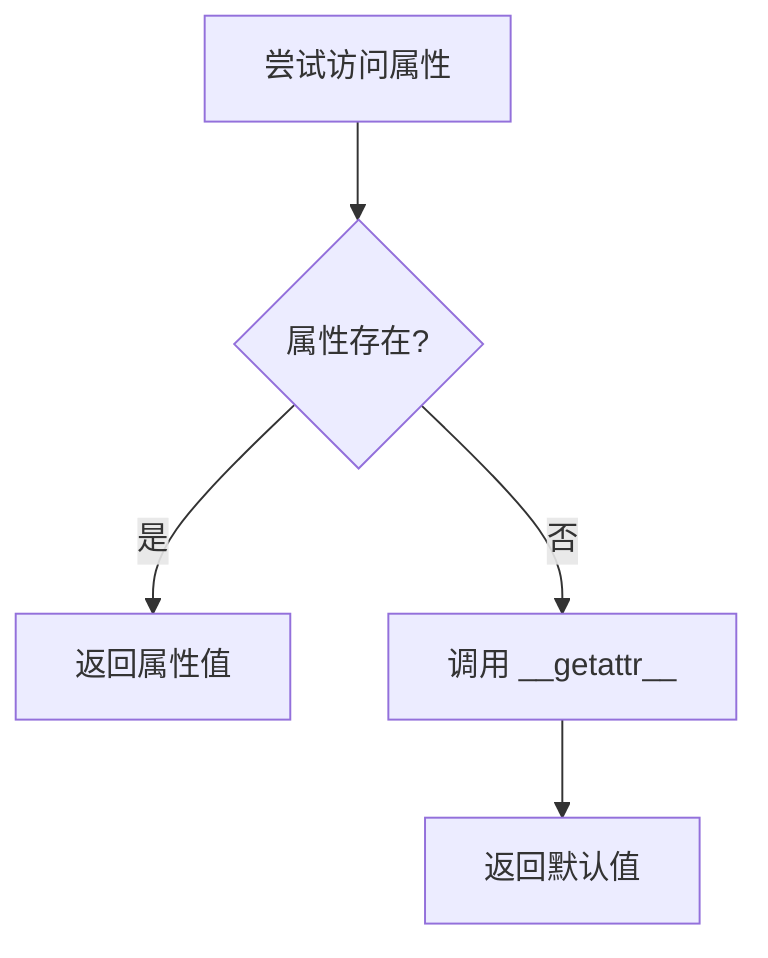
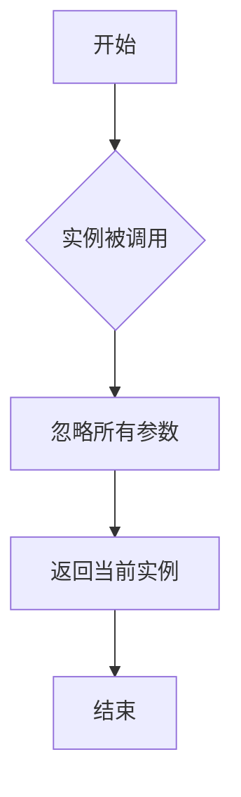
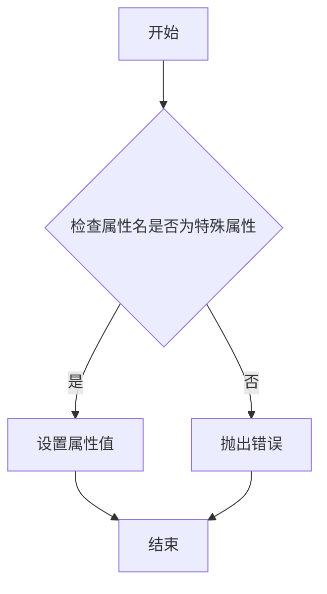

# `.\AutoGPT\autogpt_platform\backend\backend\util\mock.py` 详细设计文档

The code provides a MockObject class that acts as a mock object for testing purposes, allowing the creation of objects with arbitrary attributes and methods without the need for a real implementation.

## 整体流程



## 类结构

```
MockObject (类)
```

## 全局变量及字段


### `kwargs`
    
Keyword arguments for initializing the object.

类型：`dict`
    


### `name`
    
Name of the class.

类型：`str`
    


### `fields`
    
List of field names in the class.

类型：`list`
    


### `methods`
    
List of method names in the class.

类型：`list`
    


### `__dict__`
    
Internal dictionary to store object attributes.

类型：`dict`
    


### `MockObject.__dict__`
    
Internal dictionary to store object attributes, allowing dynamic attribute access and assignment.

类型：`dict`
    
    

## 全局函数及方法


### MockObject.__init__

MockObject类的构造函数，用于初始化MockObject实例，允许通过关键字参数动态设置实例属性。

参数：

- `**kwargs`：`dict`，关键字参数，用于动态设置实例属性。

返回值：`None`，构造函数不返回任何值。

#### 流程图



#### 带注释源码

```python
class MockObject:
    def __init__(self, **kwargs):
        # 初始化函数，接受任意数量的关键字参数
        self.__dict__.update(kwargs)  # 使用update方法更新实例的__dict__，将kwargs中的键值对添加到实例属性中
```


### MockObject.__getattr__

MockObject类的`__getattr__`方法用于在尝试访问对象属性时，如果属性不存在，则返回一个默认值。

参数：

- `name`：`str`，属性名称，当尝试访问不存在的属性时，该参数被传递给`__getattr__`。

返回值：`Any`，返回值类型取决于尝试访问的属性值。

#### 流程图



#### 带注释源码

```python
class MockObject:
    def __init__(self, **kwargs):
        self.__dict__.update(kwargs)

    def __getattr__(self, name):
        # 当尝试访问不存在的属性时，返回self.__dict__.get(name)
        return self.__dict__.get(name)

    def __call__(self, *args, **kwargs):
        return self

    def __setattr__(self, name, value):
        # 设置属性值
        self.__dict__[name] = value
```


### MockObject.__call__

MockObject 类的 __call__ 方法允许实例像函数一样被调用。

参数：

- `*args`：`tuple`，任意数量的位置参数，这些参数将被忽略。
- `**kwargs`：`dict`，任意数量的关键字参数，这些参数也将被忽略。

返回值：`MockObject`，返回当前 MockObject 实例。

#### 流程图



#### 带注释源码

```python
class MockObject:
    def __init__(self, **kwargs):
        self.__dict__.update(kwargs)

    def __getattr__(self, name):
        return self.__dict__.get(name)

    def __call__(self, *args, **kwargs):
        # 忽略所有传入的参数，直接返回当前实例
        return self

    def __setattr__(self, name, value):
        self.__dict__[name] = value
```


### MockObject.__setattr__

MockObject类的`__setattr__`方法用于设置对象的属性。

参数：

- `name`：`str`，属性名称，用于指定要设置的属性名。
- `value`：`any`，属性值，用于指定要设置的属性值。

返回值：`None`，该方法不返回任何值。

#### 流程图



#### 带注释源码

```python
class MockObject:
    def __init__(self, **kwargs):
        self.__dict__.update(kwargs)

    def __getattr__(self, name):
        return self.__dict__.get(name)

    def __call__(self, *args, **kwargs):
        return self

    def __setattr__(self, name, value):
        # 设置属性值
        self.__dict__[name] = value
```


## 关键组件


### MockObject

MockObject 类是一个简单的对象模拟器，它允许用户动态地创建一个对象，该对象的行为类似于任何其他Python对象，但它的属性和方法可以在运行时动态地添加或修改。


## 问题及建议


### 已知问题

-   **性能问题**：`__getattr__` 和 `__setattr__` 方法在每次访问或设置属性时都会遍历整个 `__dict__`，这在处理大量属性时可能会导致性能问题。
-   **安全性问题**：由于 `__getattr__` 和 `__setattr__` 方法允许动态访问和修改属性，这可能导致潜在的安全风险，特别是当这些属性被用于执行敏感操作时。
-   **代码可读性**：使用 `__getattr__` 和 `__setattr__` 方法使得代码难以理解，因为它改变了Python中属性访问的默认行为。

### 优化建议

-   **使用属性装饰器**：使用 `property` 装饰器来定义属性，这样可以提供更好的封装和类型检查。
-   **限制属性访问**：通过定义一个白名单或黑名单来限制哪些属性可以被访问或修改，从而提高安全性。
-   **优化性能**：如果性能成为问题，可以考虑使用缓存或其他数据结构来减少对 `__dict__` 的访问次数。
-   **文档化**：为代码添加详细的文档，解释为什么需要这样的行为，以及如何正确使用它。


## 其它


### 设计目标与约束

- 设计目标：实现一个简单的模拟对象，用于替代真实对象，以便在测试或模拟环境中使用。
- 约束条件：模拟对象应具有与真实对象相同的方法和属性，且不依赖于真实对象的实现细节。

### 错误处理与异常设计

- 错误处理：当尝试访问不存在的属性时，应抛出`AttributeError`。
- 异常设计：模拟对象应捕获并处理可能出现的异常，确保程序的稳定性。

### 数据流与状态机

- 数据流：模拟对象的数据流简单，通过`__getattr__`和`__setattr__`方法访问和修改属性。
- 状态机：模拟对象没有复杂的状态转换，其状态仅由属性值决定。

### 外部依赖与接口契约

- 外部依赖：模拟对象不依赖于外部库或服务。
- 接口契约：模拟对象提供统一的接口，允许用户通过属性和方法与对象交互。

### 测试用例

- 测试用例1：创建一个模拟对象，并验证其属性和方法。
- 测试用例2：尝试访问不存在的属性，验证是否抛出`AttributeError`。


    