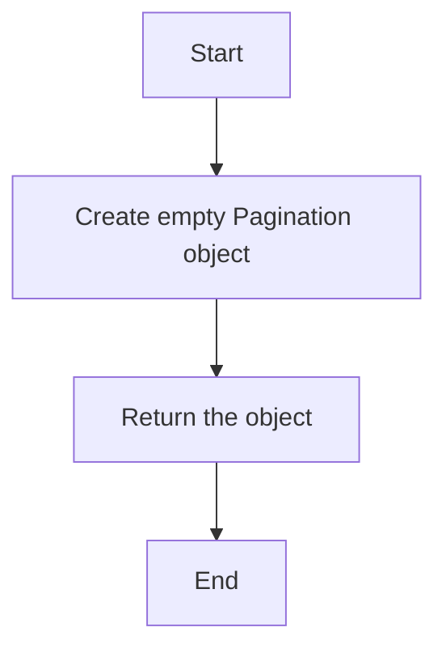

# `.\AutoGPT\autogpt_platform\backend\backend\util\models.py` 详细设计文档

This file defines a Pydantic model for pagination, which is used across the backend to standardize pagination data structures.

## 整体流程

```mermaid
graph TD
    A[开始] --> B[创建 Pagination 对象]
    B --> C{调用 Pagination.empty() }
    C --> D[返回 Pagination 对象]
    D --> E[结束]
```

## 类结构

```
Pagination (Pydantic Model)
```

## 全局变量及字段


### `total_items`
    
Total number of items.

类型：`int`
    


### `total_pages`
    
Total number of pages.

类型：`int`
    


### `current_page`
    
Current page number.

类型：`int`
    


### `page_size`
    
Number of items per page.

类型：`int`
    


### `Pagination.total_items`
    
Total number of items.

类型：`int`
    


### `Pagination.total_pages`
    
Total number of pages.

类型：`int`
    


### `Pagination.current_page`
    
Current page number.

类型：`int`
    


### `Pagination.page_size`
    
Number of items per page.

类型：`int`
    
    

## 全局函数及方法


### Pagination.empty()

返回一个空的`Pagination`对象。

参数：

- 无

返回值：`Pagination`，一个包含所有字段都为0的`Pagination`对象。

#### 流程图



#### 带注释源码

```
@staticmethod
    def empty() -> "Pagination":
        return Pagination(
            total_items=0,
            total_pages=0,
            current_page=0,
            page_size=0,
        )
```


## 关键组件


### 张量索引与惰性加载

张量索引与惰性加载是用于高效处理大型数据集的机制，它允许在需要时才加载数据，从而减少内存消耗和提高性能。

### 反量化支持

反量化支持是模型中的一种特性，它允许模型在运行时动态调整其参数，以适应不同的输入数据。

### 量化策略

量化策略是用于优化模型性能的一种技术，它通过减少模型参数的精度来减少模型的大小和计算量。


## 问题及建议


### 已知问题

-   **全局状态管理**：`Pagination` 类中的 `empty` 静态方法返回一个包含固定值的实例，这可能导致全局状态的管理问题，特别是在多线程或分布式系统中。
-   **类型安全**：虽然使用了 Pydantic 来保证类型安全，但 `empty` 方法返回的实例不包含任何实际数据，这可能使得类型安全检查变得不那么严格。

### 优化建议

-   **引入状态管理**：考虑引入一个状态管理机制，例如使用线程局部存储（ThreadLocal）或依赖注入，以确保 `Pagination` 实例的状态在多线程环境中保持一致。
-   **增强类型安全**：在 `empty` 方法中返回一个包含默认值的实例，而不是完全空的实例，这样可以保持 Pydantic 的类型安全检查。
-   **参数验证**：在 `Pagination` 类中添加构造函数，并在其中进行参数验证，以确保所有实例都符合预期的格式。
-   **文档和示例**：提供更详细的文档和示例，说明如何正确使用 `Pagination` 类，包括如何处理空状态和默认值。


## 其它


### 设计目标与约束

- 设计目标：确保后端服务中避免循环导入，提供统一的分页模型。
- 约束条件：使用 Pydantic 库进行数据验证，保证数据的一致性和有效性。

### 错误处理与异常设计

- 错误处理：在数据验证过程中，如果输入数据不符合预期，将抛出 Pydantic 的验证错误。
- 异常设计：通过自定义异常类，可以捕获和处理特定的错误情况。

### 数据流与状态机

- 数据流：数据通过 Pydantic 模型进行验证和转换，然后用于分页逻辑。
- 状态机：该模型不涉及状态机逻辑，仅作为数据结构使用。

### 外部依赖与接口契约

- 外部依赖：依赖于 Pydantic 库进行数据验证。
- 接口契约：通过 Pydantic 模型定义了输入数据的接口契约，确保数据格式正确。


    