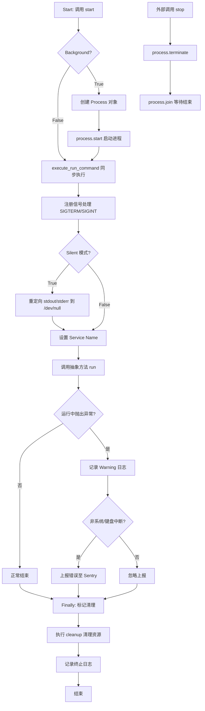
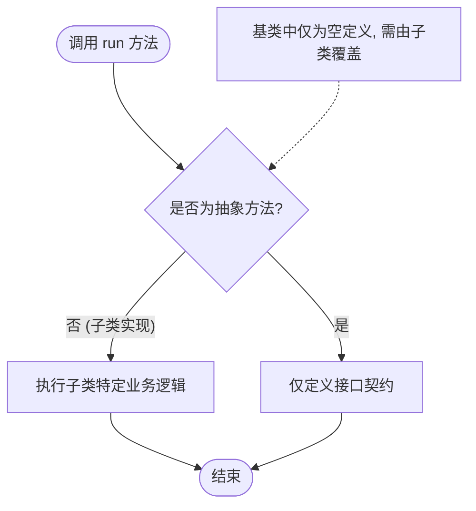
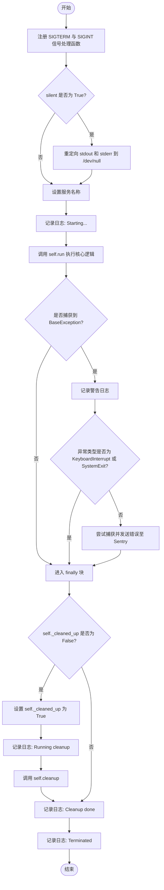
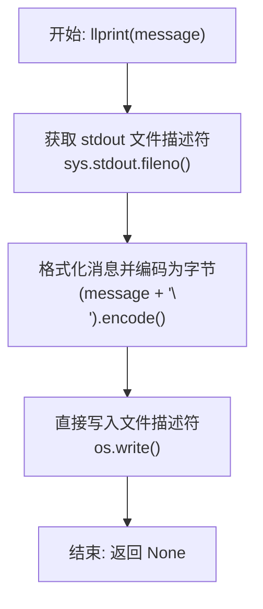
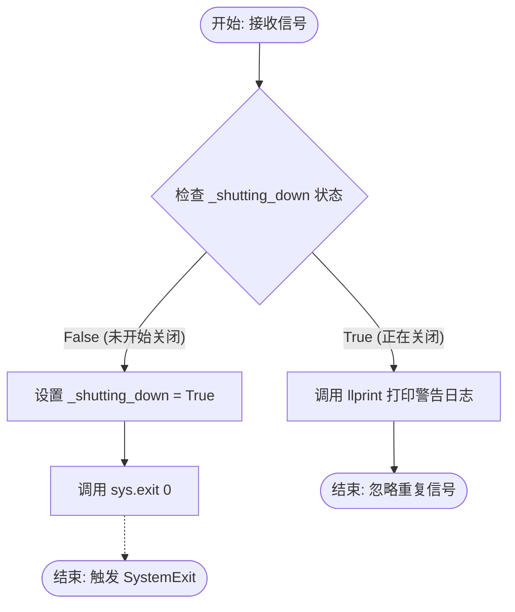
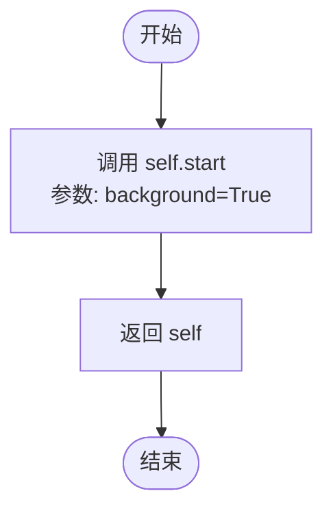
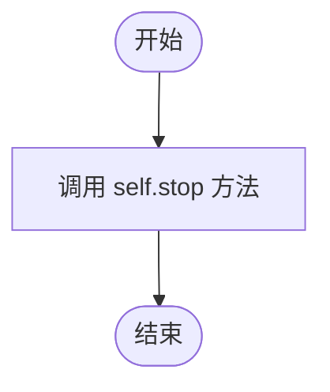
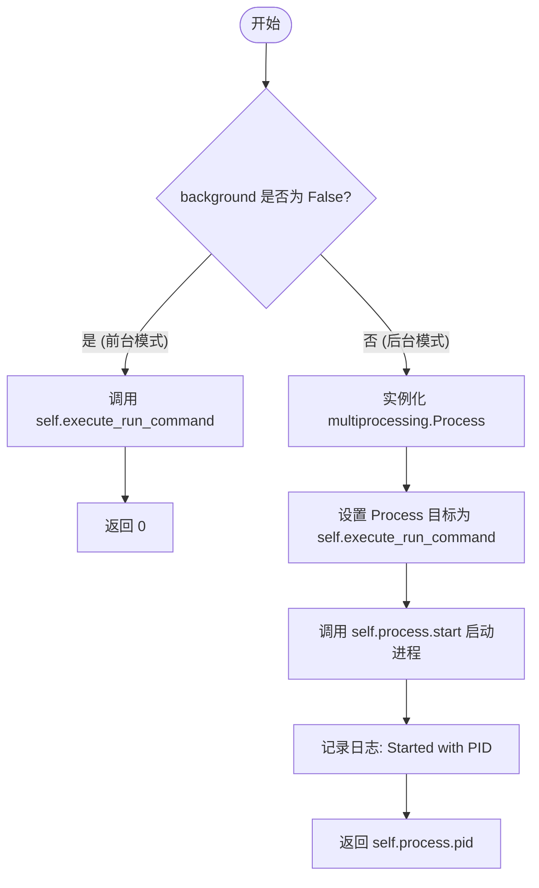
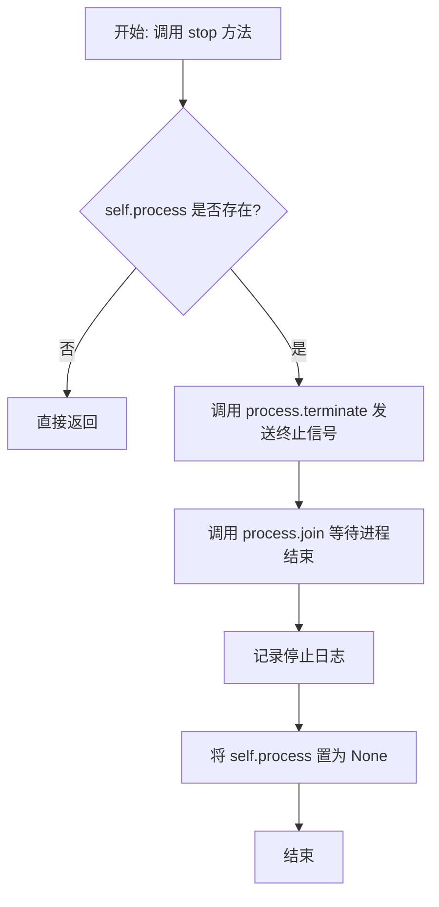

# `.\AutoGPT\autogpt_platform\backend\backend\util\process.py` 详细设计文档

该代码定义了一个抽象基类 AppProcess，用于封装后台进程的启动、运行、监控和停止逻辑，集成了信号处理（SIGTERM/SIGINT）、日志配置、Sentry 错误上报以及上下文管理器支持，旨在简化将特定业务逻辑作为独立后台进程运行的实现。

## 整体流程



## 类结构

```
AppProcess (抽象基类)
├── Fields (字段)
│   ├── process
│   ├── _shutting_down
│   └── _cleaned_up
└── Methods (方法)
    ├── run (抽象方法)
    ├── cleanup
    ├── execute_run_command
    ├── _self_terminate
    ├── llprint (静态方法)
    ├── service_name (属性)
    ├── start
    ├── stop
    ├── __enter__
    └── __exit__
```

## 全局变量及字段


### `logger`
    
The logger instance for the module, used for recording runtime information and errors.

类型：`logging.Logger`
    


### `AppProcess.process`
    
The background process instance that runs the application logic, or None if not started.

类型：`Optional[Process]`
    


### `AppProcess._shutting_down`
    
A flag indicating whether the shutdown process has been initiated to handle signals gracefully.

类型：`bool`
    


### `AppProcess._cleaned_up`
    
A flag indicating whether the cleanup procedures have been executed to ensure resources are released once.

类型：`bool`
    
    

## 全局函数及方法


### `AppProcess.run`

该方法是在后台进程中执行的核心逻辑入口，定义为抽象方法，强制要求子类必须实现具体的业务逻辑。

参数：

- 无参数

返回值：`None`，无显式返回值。

#### 流程图



#### 带注释源码

```python
    @abstractmethod
    def run(self):
        """
        The method that will be executed in the process.
        """
        pass  # 抽象方法不包含具体实现，具体逻辑需在子类中编写
```


### `AppProcess.service_name`

属性方法，用于获取当前服务对象的类名称。该名称常用于日志输出、监控指标标记以及进程命名，以区分不同的后台服务实例。

参数：

*   无

返回值：`str`，返回当前实例所属类的名称（如 `AppProcess` 或其子类名）。

#### 流程图


#### 带注释源码

```python
@property
def service_name(self) -> str:
    # 获取当前对象所属类的名称，并将其作为服务的唯一标识名称
    return self.__class__.__name__
```


### `AppProcess.cleanup`

该方法是设计用于被子类重写的钩子方法，旨在执行进程执行完毕后的清理逻辑（例如断开数据库连接或终止子进程）。基类中的默认实现不执行任何操作。

参数：

-   无

返回值：`None`，无返回值。

#### 流程图


#### 带注释源码

```python
def cleanup(self):
    """
    Implement this method on a subclass to do post-execution cleanup,
    e.g. disconnecting from a database or terminating child processes.
    """
    pass  # 基类中为空操作，具体逻辑由子类实现
```


### `AppProcess.execute_run_command`

该方法用于在子进程内部执行核心逻辑，负责配置信号处理、可选地屏蔽标准输出/错误、设置服务名称、调用主运行方法、捕获异常并发送至监控平台，以及确保执行最终的清理操作。

参数：

-  `silent`：`bool`，一个标志位，用于决定是否将标准输出和标准错误重定向到 /dev/null，即静默运行模式。

返回值：`None`，该方法没有返回值。

#### 流程图



#### 带注释源码

```python
    def execute_run_command(self, silent):
        # 注册信号处理函数，用于捕获终止信号（SIGTERM）和中断信号（SIGINT）
        # 当收到这些信号时，调用 _self_terminate 方法
        signal.signal(signal.SIGTERM, self._self_terminate)
        signal.signal(signal.SIGINT, self._self_terminate)

        try:
            # 如果 silent 为 True，则将标准输出和标准错误重定向到空设备
            # 用于抑制子进程的打印输出
            if silent:
                sys.stdout = open(os.devnull, "w")
                sys.stderr = open(os.devnull, "w")

            # 设置当前进程的服务名称
            set_service_name(self.service_name)
            # 记录启动日志
            logger.info(f"[{self.service_name}] Starting...")
            # 调用抽象方法 run，执行用户定义的核心逻辑
            self.run()
        except BaseException as e:
            # 捕获所有异常，记录终止原因
            logger.warning(
                f"[{self.service_name}] 🛑 Terminating because of {type(e).__name__}: {e}",  # noqa
                exc_info=e if not isinstance(e, SystemExit) else None,
            )
            # 如果异常不是键盘中断或系统退出，则将错误信息发送至 Sentry
            if not isinstance(e, (KeyboardInterrupt, SystemExit)):
                try:
                    from backend.util.metrics import sentry_capture_error

                    sentry_capture_error(e)
                except Exception:
                    pass  # 如果 Sentry 不可用，静默忽略发送错误时的异常
        finally:
            # 确保清理逻辑只执行一次
            if not self._cleaned_up:
                self._cleaned_up = True
                logger.info(f"[{self.service_name}] 🧹 Running cleanup")
                # 调用清理方法
                self.cleanup()
                logger.info(f"[{self.service_name}] ✅ Cleanup done")
            # 记录进程终止日志
            logger.info(f"[{self.service_name}] 🛑 Terminated")
```


### `AppProcess.llprint`

这是一个静态方法，专为在信号处理程序中安全地输出日志而设计。在异步信号处理程序中，常规的 `print` 或 `logging` 调用是不安全的，因为它们可能涉及非重入的系统调用或锁操作，从而导致死锁。该方法通过 `os.write` 直接写入标准输出文件描述符，确保在信号上下文中的调用安全性。

参数：

-   `message`：`str`，需要输出到标准输出的消息字符串。

返回值：`None`，该方法不返回任何值。

#### 流程图



#### 带注释源码

```python
    @staticmethod
    def llprint(message: str):
        """
        Low-level print/log helper function for use in signal handlers.
        Regular log/print statements are not allowed in signal handlers.
        """
        # 直接使用系统调用 os.write 写入标准输出文件描述符。
        # 这种方式避免了 Python 高层打印函数（如 print 或 logging）中可能存在的锁机制，
        # 从而防止在信号处理程序中发生死锁，确保异步信号安全。
        os.write(sys.stdout.fileno(), (message + "\n").encode())
```


### `AppProcess._self_terminate`

该方法是类内部的静态信号处理函数（Signal Handler），用于响应 `SIGTERM` 和 `SIGINT` 信号。其核心功能是确保进程能够优雅地终止。它通过检查 `_shutting_down` 标志位来防止在清理过程中重复执行退出逻辑。如果首次接收到信号，它会设置标志位并调用 `sys.exit(0)`，这将触发 `execute_run_command` 方法中的 `finally` 块以执行资源清理；如果已经在清理中，则使用低级别输出打印日志。

参数：

- `signum`：`int`，接收到的信号编号（例如 `signal.SIGTERM` 或 `signal.SIGINT`）。
- `frame`：`frame`，当前堆栈帧对象（Python 信号处理回调的标准参数，代表被中断时的代码执行位置）。

返回值：`None`，该函数无显式返回值，它会直接调用 `sys.exit` 终止进程。

#### 流程图



#### 带注释源码

```python
    def _self_terminate(self, signum: int, frame):
        # 检查类变量 _shutting_down，判断进程是否已经处于关闭流程中
        if not self._shutting_down:
            # 如果未开始关闭，将标志位设为 True，防止重复触发
            self._shutting_down = True
            # 调用 sys.exit(0) 正常退出进程。
            # 这会抛出 SystemExit 异常，从而被 execute_run_command 中的 finally 块捕获，
            # 进而执行 self.cleanup() 进行资源清理。
            sys.exit(0)
        else:
            # 如果已经处于关闭流程中（重复收到信号），则调用 llprint 输出日志。
            # 注意：此处不能使用标准的 logging 或 print，因为信号处理器的执行上下文是受限的，
            # 可能会导致死锁。llprint 使用 os.write 直接写入文件描述符，是线程/信号安全的。
            self.llprint(
                f"[{self.service_name}] Received exit signal {signum}, but cleanup is already underway."
            )
```


### `AppProcess.__enter__`

上下文管理器的入口方法，用于支持 `with` 语句。该方法通过调用 `start` 方法并以 `background=True` 模式启动后台进程，最后返回自身实例以便于上下文变量绑定。

参数：

- `self`：`AppProcess`，类的实例本身。

返回值：`AppProcess`，返回当前类的实例，以便在 `with` 语句中使用 `as` 关键字赋值。

#### 流程图



#### 带注释源码

```python
def __enter__(self):
    # 调用 start 方法启动进程，background=True 表示在后台运行
    self.start(background=True)
    # 返回实例自身，支持 with ... as ... 语法
    return self
```


### `AppProcess.__exit__`

这是 Python 上下文管理器协议的一部分，当退出 `with` 语句块时自动调用。该方法的主要功能是确保由 `AppProcess` 管理的后台进程被正确停止。

参数：

- `args`：`tuple`，接收上下文管理器协议传入的位置参数（通常包含异常类型、异常值和 traceback 对象），尽管在当前实现中未直接使用。
- `kwargs`：`dict`，接收上下文管理器协议传入的关键字参数。

返回值：`None`，不抑制异常。如果 `with` 代码块中发生异常，它将被正常传播；如果返回 `True`，则会抑制该异常，此处返回 `None` 表示不干预异常处理流程。

#### 流程图



#### 带注释源码

```python
def __exit__(self, *args, **kwargs):
    # 当退出 with 代码块时，调用 stop 方法来终止后台进程
    self.stop()
```


### `AppProcess.start`

启动应用程序进程，支持前台（同步）或后台（异步）运行模式。根据参数决定是直接执行运行命令还是生成一个新的子进程来执行。

参数：

-  `background`：`bool`，指定是否在后台启动进程。如果为 False，则在当前进程中同步执行。
-  `silent`：`bool`，指定是否禁用 stdout 和 stderr 输出。该参数会传递给执行命令。
-  `proc_args`：`dict`，传递给底层 `multiprocessing.Process` 对象的额外关键字参数。

返回值：`int`，如果是在后台启动，则返回子进程的 PID (进程 ID)；如果是在前台执行，则返回 0。

#### 流程图



#### 带注释源码

```python
def start(self, background: bool = False, silent: bool = False, **proc_args) -> int:
    """
    Start the background process.
    Args:
        background: Whether to run the process in the background.
        silent: Whether to disable stdout and stderr.
        proc_args: Additional arguments to pass to the process.
    Returns:
        the process id or 0 if the process is not running in the background.
    """
    # 如果非后台模式（即前台同步执行）
    if not background:
        # 直接在当前进程中调用执行命令
        self.execute_run_command(silent)
        # 前台执行返回 0
        return 0

    # 后台模式：创建一个新的 multiprocessing.Process 对象
    self.process = Process(
        name=self.__class__.__name__,
        target=self.execute_run_command,  # 设置进程执行的目标函数
        args=(silent,),                    # 传递参数给目标函数
        **proc_args,                       # 传递额外的进程参数
    )
    # 启动子进程
    self.process.start()
    # 记录启动日志，包含子进程 PID
    logger.info(f"[{self.service_name}] started with PID {self.process.pid}")

    # 返回子进程的 PID，如果 PID 为空则返回 0
    return self.process.pid or 0
```


### `AppProcess.stop`

该方法用于停止后台运行进程。它会向子进程发送终止信号，等待进程结束清理资源，记录停止日志，并最终清除进程对象的引用。

参数：

返回值：`None`，表示无返回值。

#### 流程图



#### 带注释源码

```python
    def stop(self):
        """
        Stop the background process.
        """
        # 检查进程对象是否存在，如果不存在则直接返回
        if not self.process:
            return

        # 向子进程发送终止信号（SIGTERM）
        self.process.terminate()
        # 阻塞等待子进程结束
        self.process.join()

        # 记录进程已停止的日志信息
        logger.info(f"[{self.service_name}] with PID {self.process.pid} stopped")
        # 清空进程对象引用
        self.process = None
```


## 关键组件


### 进程启动策略管理

负责配置多进程启动方法（优先 'forkserver'，回退 'spawn'）并初始化子进程的全局日志和监控服务（Sentry）。

### 信号处理机制

实现了对终止信号（SIGTERM, SIGINT）的捕获，以触发优雅关机流程，并防止在清理进行中时重复处理信号。

### 抽象进程生命周期管理

定义了进程执行的蓝图，包括核心的 `run` 方法、异常捕获、将错误上报至监控平台以及执行资源释放的 `cleanup` 流程。

### 上下文管理器接口

支持 `with` 语句语法，以自动管理后台进程的启动和停止，确保进程在退出上下文时被正确清理。


## 问题及建议


### 已知问题

-   **类体中存在副作用**：`configure_logging()` 和 `sentry_init()` 在类体定义级别直接执行，这意味着每次模块被导入时都会触发全局副作用，违反了模块化设计的职责分离原则，可能导致循环依赖或意外的配置覆盖。
-   **全局多进程启动方法的强制性设置**：在类体中直接调用 `set_start_method` 强制设置了全局的进程启动方式。由于该方法在 Python 解释器生命周期中只能调用一次，这限制了该类的复用性，若主程序或其他依赖库设置了不同的启动方法，将引发 `RuntimeError`。
-   **信号处理中的安全性隐患**：在信号处理函数 `_self_terminate` 中直接调用 `sys.exit(0)` 并非完全安全。如果信号在主线程持有锁或进行非重入内存操作时到达，可能会导致资源未释放或状态不一致。
-   **文件资源管理不当**：当 `silent` 参数为 `True` 时，代码将 `sys.stdout` 和 `sys.stderr` 重定向到 `os.devnull`，但未显式关闭打开的文件对象。虽然进程退出时操作系统会回收，但在设计上缺乏对文件句柄生命周期的显式管理。
-   **实例序列化风险**：`multiprocessing.Process` 在启动子进程时会对 `self` 实例进行 Pickle 序列化。如果子类包含了不可序列化的对象（如数据库连接、线程锁、打开的文件流等），`start` 方法将在运行时抛出序列化异常。

### 优化建议

-   **重构初始化逻辑**：将日志配置、Sentry 初始化和多进程启动方法设置移出类定义，放置在应用程序的入口点（如 `main` 函数）或专门的配置初始化阶段，由应用生命周期统一管理，避免模块导入时的副作用。
-   **使用上下文管理器重定向输出**：建议使用 `contextlib.redirect_stdout` 和 `contextlib.redirect_stderr` 来替代直接赋值 `sys.stdout/stderr`，这样能利用上下文管理器协议更安全、规范地处理 IO 重定向和资源恢复。
-   **采用标志位优化信号处理**：避免在信号处理函数中执行 `sys.exit`。推荐的做法是仅设置一个原子标志位（如 `threading.Event`），并在主循环或业务逻辑中定期检查该标志位以触发优雅退出，从而提高异步信号处理的健壮性。
-   **增强序列化安全性与文档**：在 `start` 方法中增加对 `self` 是否可序列化的预检查，或者在文档中明确约束子类必须确保其状态是可序列化的，防止因包含不可序列化属性导致的运行时崩溃。
-   **提升启动方法的灵活性**：移除硬编码的 `forkserver` 或 `spawn` 设置，改为允许通过构造函数参数或配置项传入启动方法，由调用方决定合适的进程启动模式，以提高组件的通用性。


## 其它


### 设计目标与约束

1.  **进程隔离与鲁棒性**：核心目标是提供一个健壮的后台进程执行框架。通过使用 `multiprocessing` 而非 `threading`，确保子进程的崩溃（如内存溢出或未处理的异常）不会直接导致主进程崩溃，从而提高系统的整体稳定性。
2.  **跨平台兼容性约束**：代码设计需适配不同操作系统下的多进程启动机制。首选 `forkserver` 模式以避免潜在的多线程状态下 `fork` 导致的死锁问题，并利用其更清洁的进程环境；若系统不支持（如 Windows 或某些配置下的 Linux），则回退到 `spawn` 模式。
3.  **优雅关闭与资源清理**：强制要求在进程退出前执行清理操作（如断开数据库连接、关闭文件句柄）。通过信号捕获（`SIGTERM`, `SIGINT`）和 `try...finally` 块确保即使发生异常或收到终止信号，`cleanup` 方法也能被调用。
4.  **可观测性集成**：约束所有子进程必须集成日志系统（`configure_logging`）和监控告警（`sentry_init`），确保后台运行的行为可追踪、错误可上报。

### 错误处理与异常设计

1.  **全局异常捕获**：在 `execute_run_command` 方法中，使用 `try...except BaseException` 结构捕获所有可能的异常，包括 `KeyboardInterrupt` 和 `SystemExit`。这防止了子进程因未捕获异常而静默死亡。
2.  **错误上报机制**：对于非用户中断类异常（排除 `KeyboardInterrupt` 和 `SystemExit`），系统会尝试调用 `sentry_capture_error` 将错误堆栈发送至 Sentry，以便进行线上问题追踪。若上报失败（如网络问题或 Sentry 未配置），则静默忽略，避免影响主清理流程。
3.  **信号处理逻辑**：
    *   **双重保护**：注册 `_self_terminate` 处理 `SIGTERM` 和 `SIGINT`。
    *   **幂等性处理**：通过 `_shutting_down` 标志位防止重复的退出操作。如果清理正在进行中再次收到信号，仅通过低级打印（`llprint`）记录日志，不执行重复操作。
4.  **静默模式下的错误抑制**：当 `silent=True` 时，标准输出和错误输出被重定向到 `/dev/null`，此时错误依赖日志系统（文件）记录，而非控制台输出。

### 数据流与状态机

1.  **状态定义**：
    *   **Idle (空闲)**：进程对象已创建，但 `start` 未被调用。此时 `process` 为 `None`。
    *   **Running (运行中)**：`start` 被调用，子进程已启动并执行 `run` 方法。此时 `process` 不为空，`_shutting_down` 为 `False`。
    *   **Shutting Down (正在关闭)**：收到退出信号或 `run` 方法执行完毕/抛错，进入终止阶段。此时 `_shutting_down` 设为 `True`。
    *   **Cleaning (清理中)**：进入 `finally` 块，执行 `cleanup` 方法。此时 `_cleaned_up` 设为 `True`。
    *   **Terminated (已终止)**：清理完成，进程退出。

2.  **状态流转**：
    *   **正常流程**：Idle -> Running -> (Run 完成/异常) -> Shutting Down -> Cleaning -> Terminated。
    *   **外部干预流程**：Running -> (调用 `stop` 或 收到信号) -> Shutting Down -> Cleaning -> Terminated。

3.  **数据流转**：
    *   **配置流向**：父进程将 `silent` 参数和 `proc_args` 传递给子进程。
    *   **状态反馈**：子进程内部的状态（如日志、Sentry 错误）单向流向外部系统；父进程通过 `process.pid` 和 `process.is_alive()` 获取子进程状态信息。

### 外部依赖与接口契约

1.  **外部库依赖**：
    *   **标准库**：`logging`, `os`, `signal`, `sys`, `multiprocessing`, `typing`, `abc`。
    *   **内部模块**：
        *   `backend.util.logging.configure_logging`：初始化日志配置。
        *   `backend.util.metrics.sentry_init`：初始化 Sentry 监控。
        *   `backend.util.metrics.sentry_capture_error`：发送错误信息。
        *   `backend.util.settings.set_service_name`：设置服务名称标识。

2.  **抽象接口契约**：
    *   **`run(self)`**：
        *   **契约**：子类必须实现的抽象方法。包含进程的核心业务逻辑。
        *   **约束**：此方法在子进程中执行，不应执行耗时过长的阻塞操作而不检查退出状态，否则可能导致进程无法响应 `SIGTERM` 信号（除非使用信号处理机制）。
    *   **`cleanup(self)`**：
        *   **契约**：子类可选择重写的方法。用于释放资源（如关闭 socket、数据库连接）。
        *   **约束**：必须快速且幂等，因为即使主流程崩溃也会在 `finally` 中被调用，且不应再次抛出异常以免掩盖原始错误。

### 部署与运行时环境

1.  **多进程启动方法**：代码在类加载级别通过 `get_all_start_methods()` 检查环境并调用 `set_start_method`。这意味着一旦导入了该模块，全局的多进程启动方式即被确定。这要求在部署时需确保宿主环境支持相应的启动方式，且不能在同一个程序中混合使用不同的启动方式。
2.  **日志与监控环境**：依赖后端基础设施（如日志服务器、Sentry 服务端）的可用性。虽然 Sentry 上报失败会被忽略，但日志系统通常需要正确的文件写入权限或网络配置。
3.  **文件描述符限制**：在 `silent` 模式下，会打开 `os.devnull`。在高并发创建大量短期进程的场景下，需注意文件描述符的消耗，虽然标准输出重定向通常由操作系统高效处理。
4.  **僵尸进程处理**：`stop()` 方法中调用了 `process.join()`，这是防止产生僵尸进程的关键。部署时需确保主进程有逻辑正确调用 `stop` 或使用上下文管理器（`with` 语句），否则主进程退出时可能遗留孤立的子进程。

    