# `.\AutoGPT\autogpt_platform\backend\backend\util\prompt.py` 详细设计文档

该代码实现了大语言模型（LLM）对话上下文的统一压缩策略，通过集成精确的 Token 计数、LLM 驱动的历史摘要以及智能的内容截断与消息删除机制，旨在确保对话历史适应模型的上下文窗口限制，同时优先保留系统指令和工具交互的关键信息。

## 整体流程

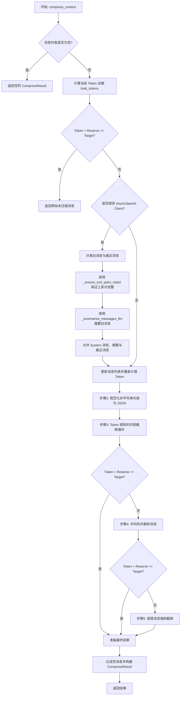

## 类结构

```
CompressResult (数据类)
```

## 全局变量及字段


### `MAIN_OBJECTIVE_PREFIX`
    
Message prefix used to identify important system messages that should be protected during compression.

类型：`str`
    


### `DEFAULT_TOKEN_THRESHOLD`
    
Default hard limit for the total number of tokens allowed in the context.

类型：`int`
    


### `DEFAULT_KEEP_RECENT`
    
Default number of recent messages to preserve during the summarization phase.

类型：`int`
    


### `CompressResult.messages`
    
The list of chat messages after compression.

类型：`list[dict]`
    


### `CompressResult.token_count`
    
The total token count of the compressed messages.

类型：`int`
    


### `CompressResult.was_compacted`
    
Indicates whether the message list was modified during the compression process.

类型：`bool`
    


### `CompressResult.error`
    
Contains an error message if compression failed to meet the target, otherwise null.

类型：`str | None`
    


### `CompressResult.original_token_count`
    
The total token count of the messages before compression was applied.

类型：`int`
    


### `CompressResult.messages_summarized`
    
The number of messages that were summarized into a single context message.

类型：`int`
    


### `CompressResult.messages_dropped`
    
The number of messages removed entirely during compression.

类型：`int`
    
    

## 全局函数及方法


### `_tok_len`

计算给定文本在特定分词器下的 token 长度，不计入任何消息包装开销。

参数：

-  `text`：`str`，需要计算 token 长度的文本内容。
-  `enc`：`tiktoken.Encoding`，tiktoken 编码器实例，用于对文本进行分词。

返回值：`int`，文本编码后的 token 数量。

#### 流程图

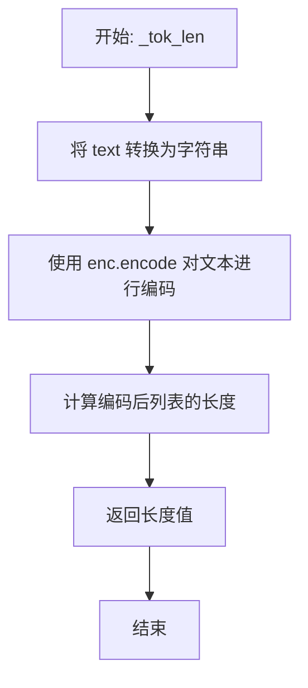

#### 带注释源码

```python
def _tok_len(text: str, enc) -> int:
    """True token length of *text* in tokenizer *enc* (no wrapper cost)."""
    # 将输入 text 确保转换为字符串类型，使用编码器 enc 进行分词编码
    # 返回编码后 token 列表的长度，即实际的 token 数量
    return len(enc.encode(str(text)))
```


### `_msg_tokens`

计算单个聊天消息对象（字典格式）的精确Token数量。该函数遵循OpenAI的计费规则，包含消息包装器Token（wrapper tokens）、内容文本Token以及工具调用相关的Token，同时兼容OpenAI格式（`tool_calls` 字段）和Anthropic格式（`content` 数组中的 `tool_use` 或 `tool_result`）。

参数：

-  `msg`：`dict`，表示单条聊天消息的字典对象，通常包含 role、content、tool_calls 等字段。
-  `enc`：`Encoding`，Tiktoken 编码器实例，用于将文本转换为 Token ID 以计算长度。

返回值：`int`，该消息的总 Token 数。

#### 流程图

```mermaid
flowchart TD
    A[开始: _msg_tokens] --> B[计算 Wrapper Tokens: 3 + 1 if name]
    B --> C[初始化 content_tokens: 获取 content 字段并编码]
    C --> D[初始化 tool_call_tokens = 0]
    D --> E{检查 OpenAI 格式: 是否存在 tool_calls?}
    E -- 是 --> F[遍历 tool_calls 列表]
    F --> G[累加 id, type, function.name, function.arguments 的 Tokens]
    G --> H{检查 Anthropic 格式: content 是否为 list?}
    E -- 否 --> H
    H -- 否 --> I[保持 content_tokens 原值]
    H -- 是 --> J[遍历 content 列表]
    J --> K{item 类型判断}
    K -- tool_use --> L[累加 id, name, input(json) 的 Tokens]
    K -- tool_result --> M[累加 tool_use_id, content 的 Tokens]
    K -- 其他含 content --> N[累加 item content 的 Tokens]
    L --> O[继续遍历]
    M --> O
    N --> O
    O --> P{遍历结束?}
    P -- 否 --> K
    P -- 是 --> Q[重置 content_tokens = 0]
    Q --> R[返回 Wrapper + content_tokens + tool_call_tokens]
    I --> R
```

#### 带注释源码

```python
def _msg_tokens(msg: dict, enc) -> int:
    """
    OpenAI counts ≈3 wrapper tokens per chat message, plus 1 if "name"
    is present, plus the tokenised content length.
    For tool calls, we need to count tokens in tool_calls and content fields.
    """
    # 计算基础包装器开销：每条消息固定约3个Token，如果有name字段则额外+1个
    WRAPPER = 3 + (1 if "name" in msg else 0)

    # 计算消息主要内容的Token数
    # 如果 msg 中没有 content 字段，则默认为空字符串
    content_tokens = _tok_len(msg.get("content") or "", enc)

    # 初始化工具调用相关的Token计数器
    tool_call_tokens = 0

    # --- 处理 OpenAI 格式的工具调用 ---
    # OpenAI 格式在消息顶层有一个 tool_calls 数组
    if "tool_calls" in msg and isinstance(msg["tool_calls"], list):
        for tool_call in msg["tool_calls"]:
            # 累加工具调用结构中的各个字段
            tool_call_tokens += _tok_len(tool_call.get("id", ""), enc)
            tool_call_tokens += _tok_len(tool_call.get("type", ""), enc)
            if "function" in tool_call:
                # 函数名称和参数字符串
                tool_call_tokens += _tok_len(tool_call["function"].get("name", ""), enc)
                tool_call_tokens += _tok_len(
                    tool_call["function"].get("arguments", ""), enc
                )

    # --- 处理 Anthropic 格式的内容 ---
    # Anthropic 格式通常将 tool_use 或 tool_result 放在 content 数组中
    content = msg.get("content")
    if isinstance(content, list):
        for item in content:
            if isinstance(item, dict) and item.get("type") == "tool_use":
                # Anthropic tool_use 块：包含 id, name 和 input (通常是一个对象，需转为 JSON 字符串)
                tool_call_tokens += _tok_len(item.get("id", ""), enc)
                tool_call_tokens += _tok_len(item.get("name", ""), enc)
                tool_call_tokens += _tok_len(json.dumps(item.get("input", {})), enc)
            elif isinstance(item, dict) and item.get("type") == "tool_result":
                # Anthropic tool_result 块：包含 tool_use_id 和 content
                tool_call_tokens += _tok_len(item.get("tool_use_id", ""), enc)
                tool_call_tokens += _tok_len(item.get("content", ""), enc)
            elif isinstance(item, dict) and "content" in item:
                # 其他内容块（如 text 块嵌套）
                tool_call_tokens += _tok_len(item.get("content", ""), enc)
        
        # 如果 content 是列表格式，说明内容已经在上面循环中被详细计算过了
        # 因此需要将之前基于字符串计算的 content_tokens 重置为 0，避免重复计算
        content_tokens = 0

    # 返回总计：包装器 + 内容 + 工具调用
    return WRAPPER + content_tokens + tool_call_tokens
```


### `_is_tool_message`

检查消息是否包含应受保护的工具调用或结果。

参数：

- `msg`：`dict`，待检查的消息对象

返回值：`bool`，包含工具相关内容返回 True，否则返回 False

#### 流程图

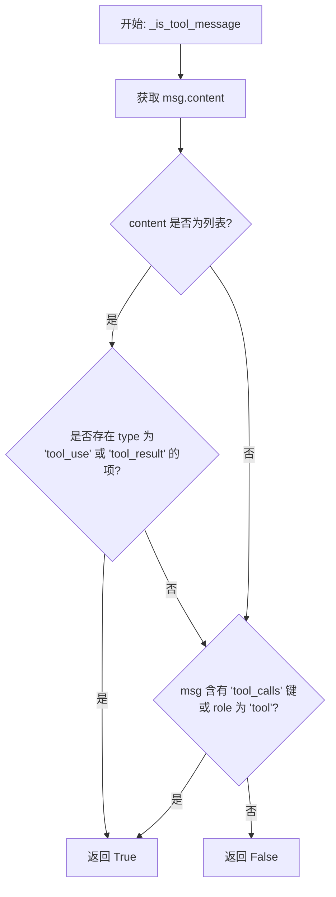

#### 带注释源码

```python
def _is_tool_message(msg: dict) -> bool:
    """Check if a message contains tool calls or results that should be protected."""
    # 获取消息的 content 字段
    content = msg.get("content")

    # 检查 Anthropic 风格的工具消息
    # Anthropic 格式下，content 通常是一个列表，其中包含 type 为 "tool_use" 或 "tool_result" 的对象
    if isinstance(content, list) and any(
        isinstance(item, dict) and item.get("type") in ("tool_use", "tool_result")
        for item in content
    ):
        return True

    # 检查 OpenAI 风格的工具调用
    # OpenAI 格式下，消息中可能包含 "tool_calls" 字段，或者消息的角色 (role) 为 "tool"
    if "tool_calls" in msg or msg.get("role") == "tool":
        return True

    # 如果以上两种格式均不匹配，则判定为非工具消息
    return False
```


### `_is_objective_message`

检查给定的消息是否包含应受到绝对保护的目标/系统提示词。

参数：

-  `msg`：`dict`，待检查的消息对象字典。

返回值：`bool`，如果消息内容以主目标前缀开头则为 True，否则为 False。

#### 流程图

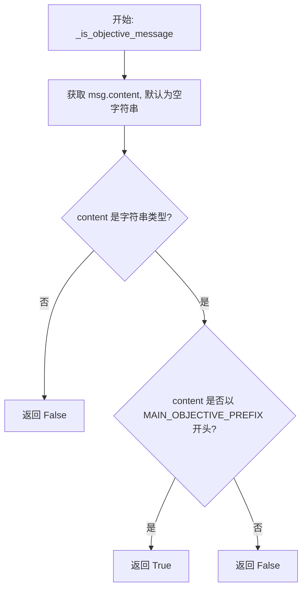

#### 带注释源码

```python
def _is_objective_message(msg: dict) -> bool:
    """Check if a message contains objective/system prompts that should be absolutely protected."""
    # 获取消息的 content 字段，如果不存在则默认为空字符串
    content = msg.get("content", "")
    
    # 检查 content 是否为字符串类型
    if isinstance(content, str):
        # Protect any message with the main objective prefix
        # 如果是字符串，检查它是否以主目标前缀（MAIN_OBJECTIVE_PREFIX）开头
        return content.startswith(MAIN_OBJECTIVE_PREFIX)
    
    # 如果 content 不是字符串，则返回 False
    return False
```


### `_truncate_tool_message_content`

仔细截断工具消息的内容，同时保留工具结构。处理 Anthropic 风格（列表内容）和 OpenAI 风格（字符串内容）的工具消息。

参数：

-  `msg`：`dict`，包含工具调用结果并需要截断的消息字典。
-  `enc`：`tiktoken.Encoding`，用于计算 Token 长度的分词器实例。
-  `max_tokens`：`int`，内容字段允许的最大 Token 数量。

返回值：`None`，该函数直接修改传入的 `msg` 字典，无返回值。

#### 流程图

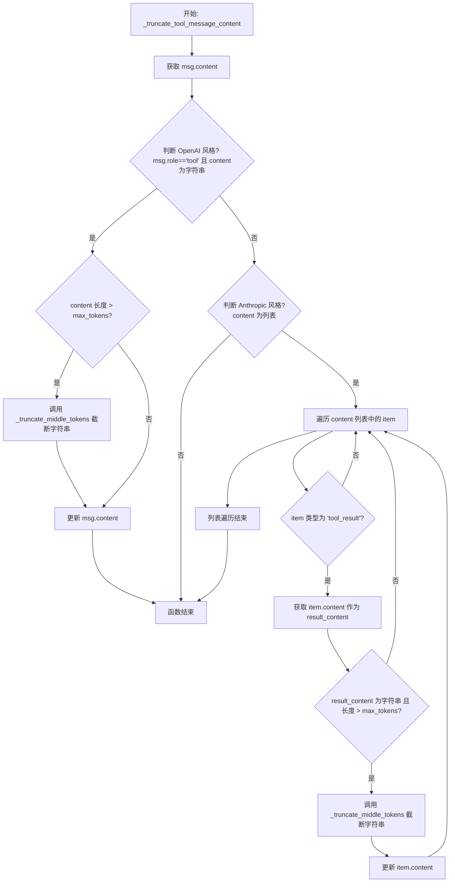

#### 带注释源码

```python
def _truncate_tool_message_content(msg: dict, enc, max_tokens: int) -> None:
    """
    Carefully truncate tool message content while preserving tool structure.
    Handles both Anthropic-style (list content) and OpenAI-style (string content) tool messages.
    """
    # 获取消息内容
    content = msg.get("content")

    # 处理 OpenAI 风格的工具消息
    # 特征: role 为 "tool" 且 content 是字符串
    if msg.get("role") == "tool" and isinstance(content, str):
        # 检查 Token 长度是否超过限制
        if _tok_len(content, enc) > max_tokens:
            # 使用中间截断策略（保留头尾，中间省略）来截断内容
            msg["content"] = _truncate_middle_tokens(content, enc, max_tokens)
        return

    # 处理 Anthropic 风格的工具消息
    # 如果 content 不是列表，则不是 Anthropic 的块结构格式，直接返回
    if not isinstance(content, list):
        return

    # 遍历 content 列表中的每个块
    for item in content:
        # 只处理类型为 "tool_result" 的块，保留 "tool_use" 块完全不变
        if not (isinstance(item, dict) and item.get("type") == "tool_result"):
            continue

        # 获取工具结果的具体内容
        result_content = item.get("content", "")
        
        # 检查结果内容是否为字符串且超过 Token 限制
        if (
            isinstance(result_content, str)
            and _tok_len(result_content, enc) > max_tokens
        ):
            # 使用中间截断策略截断工具结果内容
            item["content"] = _truncate_middle_tokens(result_content, enc, max_tokens)
```


### `_truncate_middle_tokens`

通过保留输入文本的首部和尾部，并在中间插入省略号 token，将文本缩短至约等于指定最大 token 数的长度。

参数：

- `text`：`str`，需要被截断的原始输入文本。
- `enc`：`Any` (tiktoken.Encoding)，用于文本编码和解码的 Tokenizer 对象。
- `max_tok`：`int`，截断后目标文本的大致最大 token 数量限制。

返回值：`str`，包含文本开头、省略号和文本结尾的截断字符串。

#### 流程图

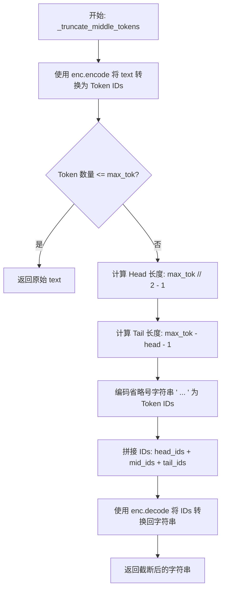

#### 带注释源码

```python
def _truncate_middle_tokens(text: str, enc, max_tok: int) -> str:
    """
    Return *text* shortened to ≈max_tok tokens by keeping the head & tail
    and inserting an ellipsis token in the middle.
    """
    # 将输入文本转换为 token ID 列表
    ids = enc.encode(str(text))
    
    # 如果当前 token 数量未超过限制，直接返回原文本
    if len(ids) <= max_tok:
        return text  # nothing to do

    # 分配 token 配额：将允许的 token 数量分配给首尾两端
    head = max_tok // 2 - 1  # 头部保留的 token 数（减1是为了给省略号留位置）
    tail = max_tok - head - 1 # 尾部保留的 token 数（减1是减去省略号本身）
    
    # 编码省略号字符串（注意：这里原文是 " … "，包含空格）
    mid = enc.encode(" … ")
    
    # 拼接头部 token、省略号 token 和尾部 token，然后解码为字符串返回
    return enc.decode(ids[:head] + mid + ids[-tail:])
```


### `estimate_token_count`

该函数用于计算给定消息列表（messages）在特定模型（model）编码下的真实 Token 数量。它通过规范化模型名称获取对应的 Token 编码器，并累加每条消息的 Token 数（包括消息包装器、内容、名称及工具调用等产生的开销），从而提供准确的上下文长度估算。

参数：

-  `messages`：`list[dict]`，需要计算 Token 数量的完整聊天历史记录列表。
-  `model`：`str`，模型名称（默认为 "gpt-4o"），用于传递给 tiktoken 以选择正确的 Token 分词器。

返回值：`int`，消息列表的总 Token 计数。

#### 流程图

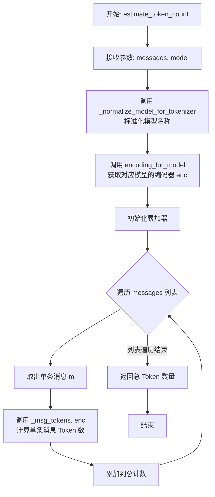

#### 带注释源码

```python
def estimate_token_count(
    messages: list[dict],
    *,
    model: str = "gpt-4o",
) -> int:
    """
    Return the true token count of *messages* when encoded for *model*.

    Parameters
    ----------
    messages    Complete chat history.
    model       Model name; passed to tiktoken to pick the right
                tokenizer (gpt-4o → 'o200k_base', others fallback).

    Returns
    -------
    int  – Token count.
    """
    # 1. 规范化模型名称，处理路径分隔符或非GPT模型（如Claude）的兼容性
    token_model = _normalize_model_for_tokenizer(model)
    
    # 2. 根据模型名称加载对应的 tiktoken 编码器
    enc = encoding_for_model(token_model)
    
    # 3. 遍历消息列表，使用 _msg_tokens 计算每条消息的 token 数并求和
    return sum(_msg_tokens(m, enc) for m in messages)
```


### `estimate_token_count_str`

返回给定文本在使用指定模型编码后的真实 token 计数。如果输入不是字符串，函数会先将其序列化为 JSON 字符串，然后再进行计算。

参数：

-  `text`：`Any`，输入的文本内容或可被 JSON 序列化的对象。
-  `model`：`str`，模型名称，用于通过 tiktoken 选择正确的分词器（默认为 "gpt-4o"）。

返回值：`int`，输入文本对应的 token 数量。

#### 流程图

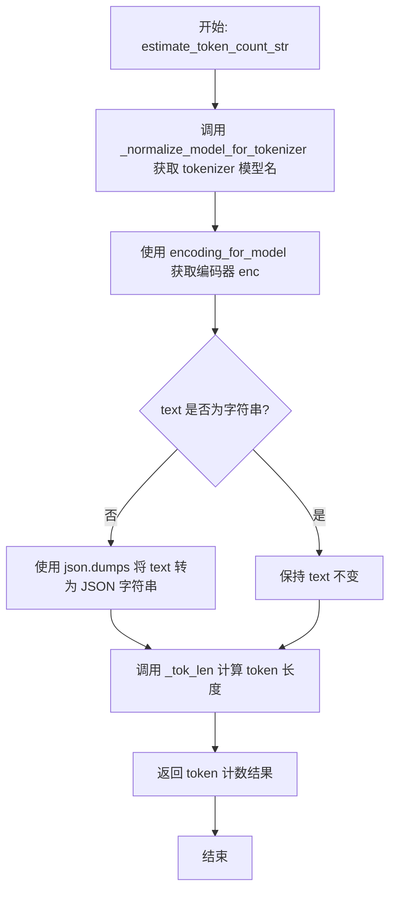

#### 带注释源码

```python
def estimate_token_count_str(
    text: Any,
    *,
    model: str = "gpt-4o",
) -> int:
    """
    Return the true token count of *text* when encoded for *model*.

    Parameters
    ----------
    text    Input text.
    model   Model name; passed to tiktoken to pick the right
            tokenizer (gpt-4o → 'o200k_base', others fallback).

    Returns
    -------
    int  – Token count.
    """
    # 规范化模型名称以适配 tiktoken 的要求
    token_model = _normalize_model_for_tokenizer(model)
    # 获取对应的编码器实例
    enc = encoding_for_model(token_model)
    
    # 如果输入不是字符串（例如字典或列表），先将其序列化为 JSON 字符串
    # 否则直接使用原字符串
    text = json.dumps(text) if not isinstance(text, str) else text
    
    # 计算并返回 token 长度
    return _tok_len(text, enc)
```


### `_normalize_model_for_tokenizer`

该函数用于规范化模型名称，以确保其与 `tiktoken` 库的模型选择逻辑兼容。它处理包含路径分隔符的模型名称（如 "openai/gpt-4o"），并将非 OpenAI 模型（如 Claude）或未知模型映射到默认的 "gpt-4o" 分词器。

参数：

- `model`：`str`，需要规范化的原始模型名称字符串。

返回值：`str`，规范化后的模型名称，适用于 `tiktoken.encoding_for_model`；如果是 Claude 或未知模型，则返回 "gpt-4o"。

#### 流程图

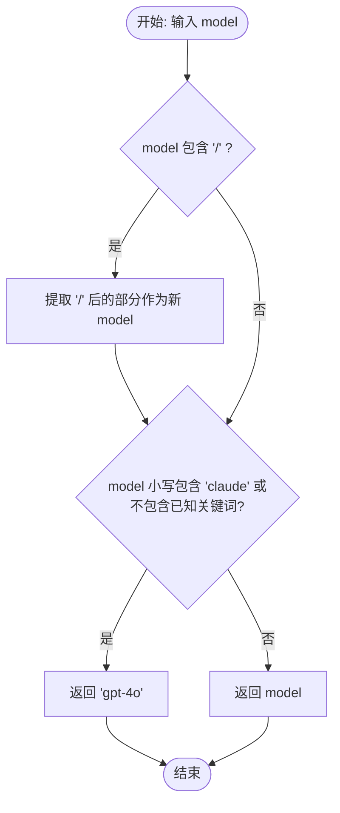

#### 带注释源码

```python
def _normalize_model_for_tokenizer(model: str) -> str:
    """Normalize model name for tiktoken tokenizer selection."""
    # 检查模型名称中是否包含路径分隔符（例如 "openai/gpt-4o"）
    if "/" in model:
        # 如果包含，则取最后一部分作为实际模型名
        model = model.split("/")[-1]
    
    # 检查是否为 Claude 模型，或者是否不属于已知的 OpenAI 模型系列
    # 已知关键词包括: "gpt", "o1", "chatgpt", "text-"
    if "claude" in model.lower() or not any(
        known in model.lower() for known in ["gpt", "o1", "chatgpt", "text-"]
    ):
        # 如果是 Claude 或未知模型，统一使用 "gpt-4o" 的 tokenizer 作为近似或回退
        return "gpt-4o"
    
    # 否则，返回（已处理过的）原始模型名称
    return model
```


### `_extract_tool_call_ids_from_message`

从助理消息中提取工具调用 ID，支持 OpenAI 和 Anthropic 两种消息格式。

参数：

-  `msg`：`dict`，代表消息数据的字典。

返回值：`set[str]`，在消息中找到的工具调用 ID 的集合。

#### 流程图

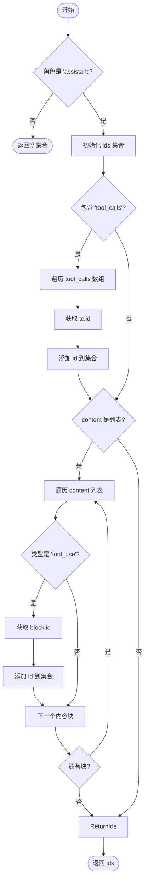

#### 带注释源码

```python
def _extract_tool_call_ids_from_message(msg: dict) -> set[str]:
    """
    Extract tool_call IDs from an assistant message.

    Supports both formats:
    - OpenAI: {"role": "assistant", "tool_calls": [{"id": "..."}]}
    - Anthropic: {"role": "assistant", "content": [{"type": "tool_use", "id": ...}]}

    Returns:
        Set of tool_call IDs found in the message.
    """
    # 初始化一个空集合用于存储 ID
    ids: set[str] = set()
    
    # 只有 assistant 角色的消息包含工具调用
    if msg.get("role") != "assistant":
        return ids

    # 处理 OpenAI 格式：消息根目录下的 tool_calls 数组
    if msg.get("tool_calls"):
        for tc in msg["tool_calls"]:
            tc_id = tc.get("id")
            if tc_id:
                ids.add(tc_id)

    # 处理 Anthropic 格式：content 列表中的 tool_use 块
    content = msg.get("content")
    if isinstance(content, list):
        for block in content:
            # 检查是否为 tool_use 类型的块
            if isinstance(block, dict) and block.get("type") == "tool_use":
                tc_id = block.get("id")
                if tc_id:
                    ids.add(tc_id)

    return ids
```


### `_extract_tool_response_ids_from_message`

提取该消息正在响应的 tool_call ID。支持 OpenAI (role="tool") 和 Anthropic (content 包含 tool_result) 两种格式。

参数：

- `msg`：`dict`，包含消息数据的字典，用于提取 tool response ID。

返回值：`set[str]`，该消息所响应的 tool_call ID 的集合。

#### 流程图

```mermaid
flowchart TD
    A[开始: _extract_tool_response_ids_from_message] --> B[初始化空的 ID 集合 ids]
    B --> C{检查消息角色<br/>msg.get('role') == 'tool'}
    C -->|是 (OpenAI格式)| D[获取 tool_call_id 字段]
    D --> E{ID 是否存在?}
    E -->|是| F[将 ID 添加到 ids 集合]
    E -->|否| G[继续处理]
    C -->|否| G
    F --> G{检查 content 是否为列表}
    G -->|是| H[遍历 content 列表中的块]
    H --> I{块类型是否为 'tool_result'?}
    I -->|是 (Anthropic格式)| J[获取 tool_use_id 字段]
    J --> K{ID 是否存在?}
    K -->|是| L[将 ID 添加到 ids 集合]
    K -->|否| M[继续下一个块]
    I -->|否| M
    L --> M[还有更多块吗?]
    M -->|是| H
    M -->|否| N[结束遍历]
    G -->|否| N
    N --> O[返回 ids 集合]
```

#### 带注释源码

```python
def _extract_tool_response_ids_from_message(msg: dict) -> set[str]:
    """
    Extract tool_call IDs that this message is responding to.

    Supports both formats:
    - OpenAI: {"role": "tool", "tool_call_id": "..."}
    - Anthropic: {"role": "user", "content": [{"type": "tool_result", "tool_use_id": "..."}]}

    Returns:
        Set of tool_call IDs this message responds to.
    """
    # 初始化一个集合用于存储提取到的 ID
    ids: set[str] = set()

    # OpenAI 格式检查：如果角色是 "tool"
    # 这种格式下，tool_call_id 直接位于消息的根级别
    if msg.get("role") == "tool":
        tc_id = msg.get("tool_call_id")
        if tc_id:
            ids.add(tc_id)

    # Anthropic 格式检查：content 通常是一个列表
    # 工具结果作为列表中的特定块存在
    content = msg.get("content")
    if isinstance(content, list):
        for block in content:
            # 检查是否为 tool_result 类型的块
            if isinstance(block, dict) and block.get("type") == "tool_result":
                # 在 Anthropic 格式中，ID 字段名为 tool_use_id
                tc_id = block.get("tool_use_id")
                if tc_id:
                    ids.add(tc_id)

    return ids
```


### `_is_tool_response_message`

检查给定的消息对象是否为工具响应消息。该函数支持识别 OpenAI 格式（role 为 "tool"）和 Anthropic 格式（content 列表中包含 type 为 "tool_result" 的块）的消息。

参数：

-  `msg`：`dict`，待检查的消息对象，通常包含 role 和 content 字段。

返回值：`bool`，如果消息是工具响应消息返回 True，否则返回 False。

#### 流程图

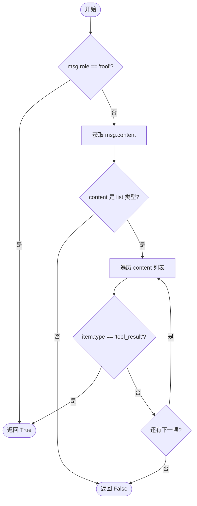

#### 带注释源码

```python
def _is_tool_response_message(msg: dict) -> bool:
    """Check if message is a tool response (OpenAI or Anthropic format)."""
    # 1. 检查 OpenAI 格式：如果消息的 role 字段为 'tool'，则判定为工具响应
    if msg.get("role") == "tool":
        return True

    # 2. 检查 Anthropic 格式：content 字段通常是一个列表，包含不同类型的块
    content = msg.get("content")
    if isinstance(content, list):
        # 遍历 content 列表中的每个块
        for block in content:
            # 如果发现类型为 'tool_result' 的块，则判定为工具响应
            if isinstance(block, dict) and block.get("type") == "tool_result":
                return True

    # 3. 如果既不是 OpenAI 的 tool role，也不包含 Anthropic 的 tool_result 块，则返回 False
    return False
```


### `_remove_orphan_tool_responses`

Remove tool response messages/blocks that reference orphan tool_call IDs. Supports both OpenAI and Anthropic formats. For Anthropic messages with mixed valid/orphan tool_result blocks, filters out only the orphan blocks instead of dropping the entire message.

参数：

- `messages`：`list[dict]`，需要过滤处理的消息列表，包含OpenAI或Anthropic格式的对话数据。
- `orphan_ids`：`set[str]`，被视为孤立的工具调用ID集合，引用这些ID的响应需要被移除。

返回值：`list[dict]`，清理后的消息列表，其中引用了孤立ID的工具响应已被移除或过滤。

#### 流程图

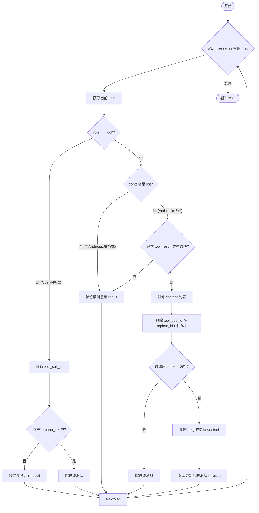

#### 带注释源码

```python
def _remove_orphan_tool_responses(
    messages: list[dict], orphan_ids: set[str]
) -> list[dict]:
    """
    Remove tool response messages/blocks that reference orphan tool_call IDs.

    Supports both OpenAI and Anthropic formats.
    For Anthropic messages with mixed valid/orphan tool_result blocks,
    filters out only the orphan blocks instead of dropping the entire message.
    """
    result = []
    for msg in messages:
        # OpenAI format: role=tool - drop entire message if orphan
        # 处理OpenAI格式的工具响应消息，该格式下整个消息仅对应一个tool_call_id
        if msg.get("role") == "tool":
            tc_id = msg.get("tool_call_id")
            # 如果该消息的tool_call_id在孤立集合中，则跳过（丢弃）该消息
            if tc_id and tc_id in orphan_ids:
                continue
            result.append(msg)
            continue

        # Anthropic format: content list may have mixed tool_result blocks
        # 处理Anthropic格式，content可能是一个列表，包含文本块和工具结果块混合的情况
        content = msg.get("content")
        if isinstance(content, list):
            # 检查content列表中是否包含tool_result类型的块
            has_tool_results = any(
                isinstance(b, dict) and b.get("type") == "tool_result" for b in content
            )
            if has_tool_results:
                # Filter out orphan tool_result blocks, keep valid ones
                # 过滤content列表：移除那些type为tool_result且tool_use_id在孤立集合中的块
                # 保留非tool_result块和有效的tool_result块
                filtered_content = [
                    block
                    for block in content
                    if not (
                        isinstance(block, dict)
                        and block.get("type") == "tool_result"
                        and block.get("tool_use_id") in orphan_ids
                    )
                ]
                # Only keep message if it has remaining content
                # 如果过滤后content不为空，则更新消息的content并保留
                if filtered_content:
                    msg = msg.copy()
                    msg["content"] = filtered_content
                    result.append(msg)
                # 如果过滤后content为空，则跳过该消息（不添加到result）
                continue

        # 其他情况（非工具响应消息），直接保留
        result.append(msg)
    return result
```


### `_ensure_tool_pairs_intact`

确保在切片消息列表后，tool_call 与 tool_response 的配对保持完整。该函数通过检测切片中是否存在孤立的工具响应（即缺少对应的助手调用请求），并向后回溯完整消息历史以补全缺失的助手消息，从而避免因数据不完整导致的 API 验证错误。

参数：

- `recent_messages`：`list[dict]`，需要验证和修复的切片消息列表。
- `all_messages`：`list[dict]`，完整的原始消息列表，用于查找缺失的助手消息。
- `start_index`：`int`，`recent_messages` 在 `all_messages` 中的起始索引。

返回值：`list[dict]`，修复后的消息列表，确保工具调用和响应成对出现。

#### 流程图

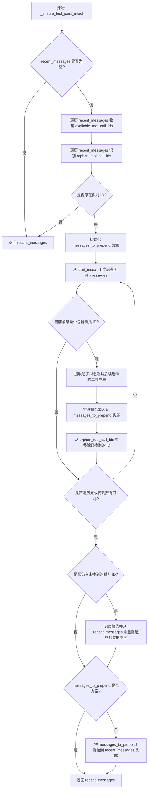

#### 带注释源码

```python
def _ensure_tool_pairs_intact(
    recent_messages: list[dict],
    all_messages: list[dict],
    start_index: int,
) -> list[dict]:
    """
    Ensure tool_call/tool_response pairs stay together after slicing.

    When slicing messages for context compaction, a naive slice can separate
    an assistant message containing tool_calls from its corresponding tool
    response messages. This causes API validation errors (e.g., Anthropic's
    "unexpected tool_use_id found in tool_result blocks").

    This function checks for orphan tool responses in the slice and extends
    backwards to include their corresponding assistant messages.

    Supports both formats:
    - OpenAI: tool_calls array + role="tool" responses
    - Anthropic: tool_use blocks + tool_result blocks

    Args:
        recent_messages: The sliced messages to validate
        all_messages: The complete message list (for looking up missing assistants)
        start_index: The index in all_messages where recent_messages begins

    Returns:
        A potentially extended list of messages with tool pairs intact
    """
    if not recent_messages:
        return recent_messages

    # Collect all tool_call_ids from assistant messages in the slice
    available_tool_call_ids: set[str] = set()
    for msg in recent_messages:
        available_tool_call_ids |= _extract_tool_call_ids_from_message(msg)

    # Find orphan tool responses (responses whose tool_call_id is missing)
    orphan_tool_call_ids: set[str] = set()
    for msg in recent_messages:
        response_ids = _extract_tool_response_ids_from_message(msg)
        for tc_id in response_ids:
            if tc_id not in available_tool_call_ids:
                orphan_tool_call_ids.add(tc_id)

    if not orphan_tool_call_ids:
        # No orphans, slice is valid
        return recent_messages

    # Find the assistant messages that contain the orphan tool_call_ids
    # Search backwards from start_index in all_messages
    messages_to_prepend: list[dict] = []
    for i in range(start_index - 1, -1, -1):
        msg = all_messages[i]
        msg_tool_ids = _extract_tool_call_ids_from_message(msg)
        if msg_tool_ids & orphan_tool_call_ids:
            # This assistant message has tool_calls we need
            # Also collect its contiguous tool responses that follow it
            assistant_and_responses: list[dict] = [msg]

            # Scan forward from this assistant to collect tool responses
            for j in range(i + 1, start_index):
                following_msg = all_messages[j]
                following_response_ids = _extract_tool_response_ids_from_message(
                    following_msg
                )
                if following_response_ids and following_response_ids & msg_tool_ids:
                    assistant_and_responses.append(following_msg)
                elif not _is_tool_response_message(following_msg):
                    # Stop at first non-tool-response message
                    break

            # Prepend the assistant and its tool responses (maintain order)
            messages_to_prepend = assistant_and_responses + messages_to_prepend
            # Mark these as found
            orphan_tool_call_ids -= msg_tool_ids
            # Also add this assistant's tool_call_ids to available set
            available_tool_call_ids |= msg_tool_ids

        if not orphan_tool_call_ids:
            # Found all missing assistants
            break

    if orphan_tool_call_ids:
        # Some tool_call_ids couldn't be resolved - remove those tool responses
        # This shouldn't happen in normal operation but handles edge cases
        logger.warning(
            f"Could not find assistant messages for tool_call_ids: {orphan_tool_call_ids}. "
            "Removing orphan tool responses."
        )
        recent_messages = _remove_orphan_tool_responses(
            recent_messages, orphan_tool_call_ids
        )

    if messages_to_prepend:
        logger.info(
            f"Extended recent messages by {len(messages_to_prepend)} to preserve "
            f"tool_call/tool_response pairs"
        )
        return messages_to_prepend + recent_messages

    return recent_messages
```


### `_summarize_messages_llm`

该函数通过调用大语言模型（LLM）对给定的消息列表进行异步汇总，生成包含关键信息（如用户意图、技术细节、错误处理等）的结构化摘要文本，以便在后续对话中作为上下文使用。

参数：

-  `messages`：`list[dict]`，需要进行汇总的聊天消息列表，包含角色和内容等字段。
-  `client`：`AsyncOpenAI`，用于发起异步请求的 OpenAI 客户端实例。
-  `model`：`str`，指定用于执行摘要任务的语言模型名称。
-  `timeout`：`float`，API 请求的超时时间（秒），默认为 30.0。

返回值：`str`，生成的对话摘要文本；如果未生成内容则返回 "No summary available."，如果输入为空则返回 "No conversation history available."。

#### 流程图

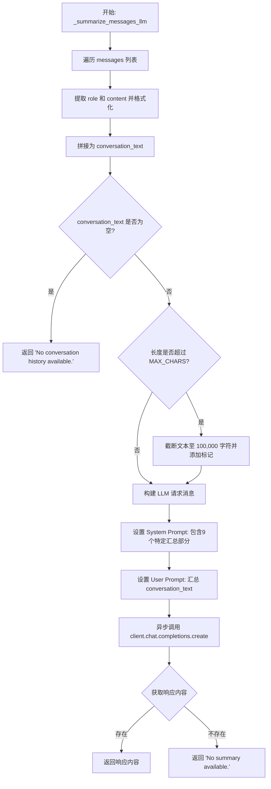

#### 带注释源码

```python
async def _summarize_messages_llm(
    messages: list[dict],
    client: AsyncOpenAI,
    model: str,
    timeout: float = 30.0,
) -> str:
    """Summarize messages using an LLM."""
    # 初始化对话列表，用于拼接格式化后的消息
    conversation = []
    for msg in messages:
        # 获取角色和内容
        role = msg.get("role", "")
        content = msg.get("content", "")
        # 仅处理 user, assistant, tool 角色且有内容的消息
        if content and role in ("user", "assistant", "tool"):
            # 将消息格式化为 "ROLE: content" 的形式
            conversation.append(f"{role.upper()}: {content}")

    # 将格式化后的消息列表用双换行符拼接成字符串
    conversation_text = "\n\n".join(conversation)

    # 如果没有有效的对话内容，直接返回默认提示
    if not conversation_text:
        return "No conversation history available."

    # 安全限制：防止输入文本过长，截断至 100,000 字符
    MAX_CHARS = 100_000
    if len(conversation_text) > MAX_CHARS:
        conversation_text = conversation_text[:MAX_CHARS] + "\n\n[truncated]"

    # 调用 LLM API 生成摘要
    response = await client.with_options(timeout=timeout).chat.completions.create(
        model=model,
        messages=[
            {
                "role": "system",
                "content": (
                    "Create a detailed summary of the conversation so far. "
                    "This summary will be used as context when continuing the conversation.\n\n"
                    "Before writing the summary, analyze each message chronologically to identify:\n"
                    "- User requests and their explicit goals\n"
                    "- Your approach and key decisions made\n"
                    "- Technical specifics (file names, tool outputs, function signatures)\n"
                    "- Errors encountered and resolutions applied\n\n"
                    "You MUST include ALL of the following sections:\n\n"
                    "## 1. Primary Request and Intent\n"
                    "The user's explicit goals and what they are trying to accomplish.\n\n"
                    "## 2. Key Technical Concepts\n"
                    "Technologies, frameworks, tools, and patterns being used or discussed.\n\n"
                    "## 3. Files and Resources Involved\n"
                    "Specific files examined or modified, with relevant snippets and identifiers.\n\n"
                    "## 4. Errors and Fixes\n"
                    "Problems encountered, error messages, and their resolutions. "
                    "Include any user feedback on fixes.\n\n"
                    "## 5. Problem Solving\n"
                    "Issues that have been resolved and how they were addressed.\n\n"
                    "## 6. All User Messages\n"
                    "A complete list of all user inputs (excluding tool outputs) to preserve their exact requests.\n\n"
                    "## 7. Pending Tasks\n"
                    "Work items the user explicitly requested that have not yet been completed.\n\n"
                    "## 8. Current Work\n"
                    "Precise description of what was being worked on most recently, including relevant context.\n\n"
                    "## 9. Next Steps\n"
                    "What should happen next, aligned with the user's most recent requests. "
                    "Include verbatim quotes of recent instructions if relevant."
                ),
            },
            # 将处理后的对话文本作为用户消息发送
            {"role": "user", "content": f"Summarize:\n\n{conversation_text}"},
        ],
        max_tokens=1500,  # 限制摘要生成的最大 token 数
        temperature=0.3,  # 设置较低的温度以获得更确定的摘要
    )

    # 返回生成的摘要内容，如果不存在则返回默认文本
    return response.choices[0].message.content or "No summary available."
```


### `compress_context`

统一上下文压缩函数，结合了摘要和截断策略来减少聊天历史的 token 数量。其核心策略按优先级依次为：1. 如果提供了 LLM 客户端，对旧消息进行摘要并保留最近消息；2. 逐步截断单个消息内容（特别是中间部分）；3. 从中间向外删除整个消息；4. 作为最后手段修剪首尾消息。该过程确保工具调用/响应对和关键系统提示保持完整。

参数：

-  `messages`：`list[dict]`，完整的聊天历史记录（将会被深拷贝）。
-  `target_tokens`：`int`，提示词大小的硬性上限。
-  `model`：`str`，用于分词和摘要的模型名称。
-  `client`：`AsyncOpenAI | None`，异步 OpenAI 客户端。如果提供，则启用 LLM 摘要作为首选策略。
-  `keep_recent`：`int`，在摘要期间保留的最近消息数量。
-  `reserve`：`int`，为模型响应保留的 token 数量。
-  `start_cap`：`int`，初始的每消息截断上限。
-  `floor_cap`：`int`，降至该上限后转而使用消息删除策略。

返回值：`CompressResult`，包含压缩后的消息列表、最终 token 计数、是否压缩标志、错误信息及元数据的对象。

#### 流程图

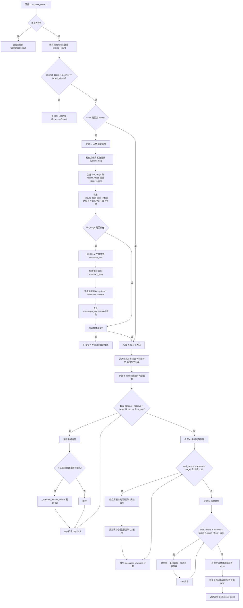

#### 带注释源码

```python
async def compress_context(
    messages: list[dict],
    target_tokens: int = DEFAULT_TOKEN_THRESHOLD,
    *,
    model: str = "gpt-4o",
    client: AsyncOpenAI | None = None,
    keep_recent: int = DEFAULT_KEEP_RECENT,
    reserve: int = 2_048,
    start_cap: int = 8_192,
    floor_cap: int = 128,
) -> CompressResult:
    """
    Unified context compression that combines summarization and truncation strategies.
    统一上下文压缩，结合了摘要和截断策略。
    """
    # Guard clause for empty messages
    # 守卫子句：处理空消息情况
    if not messages:
        return CompressResult(
            messages=[],
            token_count=0,
            was_compacted=False,
            original_token_count=0,
        )

    # Initialize tokenizer
    # 初始化分词器
    token_model = _normalize_model_for_tokenizer(model)
    enc = encoding_for_model(token_model)
    msgs = deepcopy(messages) # 深拷贝以避免修改原数据

    def total_tokens() -> int:
        # Helper to calculate current total tokens
        # 辅助函数：计算当前总 token 数
        return sum(_msg_tokens(m, enc) for m in msgs)

    original_count = total_tokens()

    # Already under limit check
    # 检查是否已经在限制之下（无需压缩）
    if original_count + reserve <= target_tokens:
        return CompressResult(
            messages=msgs,
            token_count=original_count,
            was_compacted=False,
            original_token_count=original_count,
        )

    messages_summarized = 0
    messages_dropped = 0

    # ---- STEP 1: LLM summarization (if client provided) -------------------
    # ---- 步骤 1: LLM 摘要 (如果提供了 client) -------------------
    # Primary strategy for chat service: Summarize old messages, keep recent ones intact.
    # 聊天服务的主要策略：摘要旧消息，保持最近消息完整。
    if client is not None:
        # Identify system message if present
        # 识别是否存在系统消息
        has_system = len(msgs) > 0 and msgs[0].get("role") == "system"
        system_msg = msgs[0] if has_system else None

        # Calculate old vs recent messages split
        # 计算旧消息与最近消息的分割
        if has_system:
            if len(msgs) > keep_recent + 1:
                old_msgs = msgs[1:-keep_recent]
                recent_msgs = msgs[-keep_recent:]
            else:
                old_msgs = []
                recent_msgs = msgs[1:] if len(msgs) > 1 else []
        else:
            if len(msgs) > keep_recent:
                old_msgs = msgs[:-keep_recent]
                recent_msgs = msgs[-keep_recent:]
            else:
                old_msgs = []
                recent_msgs = msgs

        # Ensure tool pairs stay intact in the recent slice
        # 确保 recent 切片中的工具调用/响应对保持完整，防止出现孤立的工具响应
        slice_start = max(0, len(msgs) - keep_recent)
        recent_msgs = _ensure_tool_pairs_intact(recent_msgs, msgs, slice_start)

        if old_msgs:
            try:
                # Generate summary via LLM
                # 通过 LLM 生成摘要
                summary_text = await _summarize_messages_llm(old_msgs, client, model)
                summary_msg = {
                    "role": "assistant",
                    "content": f"[Previous conversation summary — for context only]: {summary_text}",
                }
                messages_summarized = len(old_msgs)

                # Reconstruct message list: [System] + [Summary] + [Recent]
                # 重组消息列表
                if has_system:
                    msgs = [system_msg, summary_msg] + recent_msgs
                else:
                    msgs = [summary_msg] + recent_msgs

                logger.info(
                    f"Context summarized: {original_count} -> {total_tokens()} tokens, "
                    f"summarized {messages_summarized} messages"
                )
            except Exception as e:
                # Fallback to truncation if summarization fails
                # 如果摘要失败，回退到截断策略
                logger.warning(f"Summarization failed, continuing with truncation: {e}")
                # Fall through to content truncation

    # ---- STEP 2: Normalize content ----------------------------------------
    # ---- 步骤 2: 规范化内容 ----------------------------------------
    # Convert non-string payloads to strings for consistent token counting.
    # 将非字符串负载转换为字符串，以确保一致的 token 计数。
    # Always run before truncation.
    # 务必在截断之前运行。
    for i, m in enumerate(msgs):
        if not isinstance(m.get("content"), str) and m.get("content") is not None:
            # Skip tool messages and first/last messages usually
            # 跳过工具消息以及通常的首尾消息
            if _is_tool_message(m):
                continue
            if i == 0 or i == len(msgs) - 1:
                continue
            content_str = json.dumps(m["content"], separators=(",", ":"))
            # Pre-truncate extremely large JSON strings
            # 预截断极大的 JSON 字符串
            if len(content_str) > 20_000:
                content_str = _truncate_middle_tokens(content_str, enc, 20_000)
            m["content"] = content_str

    # ---- STEP 3: Token-aware content truncation ---------------------------
    # ---- 步骤 3: Token 感知的内容截断 ---------------------------
    # Progressively halve the per-message cap and truncate content from the middle.
    # 逐步减半每条消息的上限，并从中间截断内容。
    # Preserves message structure, shortens content.
    # 保留消息结构，缩短内容。
    cap = start_cap
    while total_tokens() + reserve > target_tokens and cap >= floor_cap:
        for m in msgs[1:-1]: # Skip first and last message initially
            # Do not truncate tool messages or objective messages
            // 不截断工具消息或目标消息
            if _is_tool_message(m):
                _truncate_tool_message_content(m, enc, cap)
                continue
            if _is_objective_message(m):
                continue
            content = m.get("content") or ""
            if _tok_len(content, enc) > cap:
                m["content"] = _truncate_middle_tokens(content, enc, cap)
        cap //= 2

    # ---- STEP 4: Middle-out deletion --------------------------------------
    # ---- 步骤 4: 中间向外删除 --------------------------------------
    # Delete whole messages one at a time, starting from the center.
    // 一次删除整个消息，从中心开始。
    # Skips protected messages (tools, objectives).
    // 跳过受保护的消息（工具、目标）。
    while total_tokens() + reserve > target_tokens and len(msgs) > 2:
        deletable: list[int] = []
        for i in range(1, len(msgs) - 1):
            msg = msgs[i]
            if (
                msg is not None
                and not _is_tool_message(msg)
                and not _is_objective_message(msg)
            ):
                deletable.append(i)
        if not deletable:
            break
        # Find the message closest to the center
        // 找到最接近中心的消息
        centre = len(msgs) // 2
        to_delete = min(deletable, key=lambda i: abs(i - centre))
        del msgs[to_delete]
        messages_dropped += 1

    # ---- STEP 5: Final trim on first/last ---------------------------------
    # ---- 步骤 5: 最后修剪首尾 ---------------------------------
    # As a last resort, truncate content of the very first and last messages.
    // 作为最后手段，截断第一条和最后一条消息的内容。
    cap = start_cap
    while total_tokens() + reserve > target_tokens and cap >= floor_cap:
        for idx in (0, -1):
            msg = msgs[idx]
            if msg is None:
                continue
            if _is_tool_message(msg):
                _truncate_tool_message_content(msg, enc, cap)
                continue
            text = msg.get("content") or ""
            if _tok_len(text, enc) > cap:
                msg["content"] = _truncate_middle_tokens(text, enc, cap)
        cap //= 2

    # Filter out None values and finalize result
    // 过滤掉 None 值并最终确定结果
    final_msgs: list[dict] = [m for m in msgs if m is not None]
    final_count = sum(_msg_tokens(m, enc) for m in final_msgs)
    error = None
    if final_count + reserve > target_tokens:
        error = f"Could not compress below target ({final_count + reserve} > {target_tokens})"
        logger.warning(error)

    return CompressResult(
        messages=final_msgs,
        token_count=final_count,
        was_compacted=True,
        error=error,
        original_token_count=original_count,
        messages_summarized=messages_summarized,
        messages_dropped=messages_dropped,
    )
```


## 关键组件


### 多格式 Token 估算引擎

支持 OpenAI 和 Anthropic 消息格式的精确 token 计数，能够准确计算包括工具调用、工具结果及元数据包装器在内的复杂消息结构的 token 成本，以确保严格遵循模型的上下文窗口限制。

### 统一上下文压缩流水线

采用分层的多阶段策略，结合 LLM 摘要、渐进式内容截断（Middle-out）、中心向外消息删除及首尾紧急修剪等手段，将聊天历史压缩至目标 token 限制内，最大化保留语义信息。

### 工具对话完整性保证

一种验证与修复机制，确保在切片或压缩消息列表时，工具调用与其对应的响应保持配对，通过自动回溯补充缺失的 Assistant 消息并清理孤立的工具结果，防止因对话结构破坏导致的 API 验证错误。

### 选择性内容保护机制

基于特定前缀（如 `[Main Objective Prompt]:`）和角色类型识别关键系统指令及工具消息的逻辑，在压缩流程中强制豁免这些核心内容的删除或过度截断，以维持对话的初始目标和上下文连贯性。


## 问题及建议


### 已知问题

-   **性能瓶颈**：`compress_context` 函数在循环策略中（特别是 Step 3 和 Step 4）频繁调用 `total_tokens()`，该函数每次都会遍历整个消息列表以计算 Token 总和。在消息列表较长时，这会导致较高的时间复杂度 ($O(N \times \text{Iterations})$)，显著影响压缩性能。
-   **不必要的内存开销**：代码在验证是否需要压缩之前就执行了 `deepcopy(messages)`。如果原始上下文未超过 Token 阈值，深拷贝操作将浪费 CPU 和内存资源。
-   **硬编码的业务逻辑**：`_summarize_messages_llm` 函数中的 System Prompt 强制规定了特定的摘要格式（9 个章节），且 `MAX_CHARS` 等常量被硬编码。这降低了代码的通用性，难以适配不同的模型指令或业务需求。
-   **格式兼容性维护成本高**：`_msg_tokens`、`_truncate_tool_message_content` 以及工具配对逻辑中混杂了 OpenAI 和 Anthropic 两种格式的处理代码。这种双重逻辑使代码变得复杂且脆弱，增加后续维护和扩展新格式的难度。
-   **缺乏中间状态的监控**：压缩过程主要依赖日志输出，`CompressResult` 中未包含中间步骤的具体指标（例如：在截断阶段实际移除了多少 Token，或不同策略生效的详细信息），不利于精细化的性能分析和问题排查。

### 优化建议

-   **实施延迟深拷贝**：调整 `compress_context` 的执行顺序，先基于原始消息列表计算 `original_count`，仅当确认需要进行压缩（`original_count > target_tokens`）时，才对消息列表执行 `deepcopy`。
-   **采用增量 Token 计数**：引入 `current_total_tokens` 变量来维护当前的 Token 总量。在循环中修改消息内容（如 `_truncate_middle_tokens`）或删除消息时，根据变化量增减 `current_total_tokens`，替代每次全量遍历计算的逻辑。
-   **参数化配置**：将摘要生成的 Prompt 模板、截断策略的起始阈值（`start_cap`）、下限阈值（`floor_cap`）以及字符限制（`MAX_CHARS`）等提取为函数参数或配置对象，允许调用方根据实际场景进行定制。
-   **重构多格式支持逻辑**：使用策略模式或适配器模式，将 OpenAI 和 Anthropic 特有的 Token 计算及工具消息处理逻辑封装到独立的处理类中。通过统一的接口调用，简化核心压缩逻辑，提高代码的可读性和可扩展性。
-   **优化工具配对查找算法**：在 `_ensure_tool_pairs_intact` 函数中，为了避免最坏情况下的 $O(N^2)$ 搜索，可以在消息处理阶段预先构建 ID 到消息索引的映射，从而加速对孤儿工具响应对应 Assistant 消息的查找。


## 其它


### 设计目标与约束

**设计目标：**
1.  **上下文适配性：** 核心目标是将长对话历史压缩至指定模型的 Token 限制（Context Window）内，确保不会因超出限制导致 API 调用失败。
2.  **语义保留：** 在压缩过程中尽可能保留关键语义信息，优先保护系统提示词、主要目标、最近的消息以及工具调用（Tool Calls）相关的上下文。
3.  **多模型兼容性：** 同时支持 OpenAI 和 Anthropic 格式的消息结构，能够处理不同的 Token 计数方式（如 wrapper tokens）和工具调用格式。
4.  **策略分层：** 结合 LLM 摘要、内容截断和消息删除等多种策略，从粗粒度到细粒度逐步减少 Token 数量，平衡信息保留与压缩效率。

**约束：**
1.  **结构完整性：** 必须维护消息列表的格式有效性，特别是必须保持 `tool_call_id` 与对应的工具响应消息成对出现，避免 API 验证错误。
2.  **性能开销：** Token 计算和消息处理应在内存中完成，且应尽量减少不必要的 LLM 调用（仅在必要时进行摘要）。
3.  **不可变性：** 输入的原始消息列表不应被修改，处理应在深拷贝上进行。

### 错误处理与异常设计

**错误处理策略：**
1.  **优雅降级：** 在 `compress_context` 函数中，如果 LLM 摘要步骤（Step 1）失败（如网络超时或 API 错误），代码捕获异常并记录警告，随后自动回退到截断和删除策略，确保流程继续运行而不中断主程序。
2.  **最佳努力压缩：** 即使所有策略执行后仍无法满足目标 Token 限制，系统不会抛出异常导致崩溃，而是返回带有 `error` 字段的 `CompressResult` 对象，并记录警告日志。
3.  **数据安全：** 在处理工具调用对时，如果找不到对应的 Assistant 消息，系统会移除孤立的工具响应（`_remove_orphan_tool_responses`）以防止破坏结构完整性，并记录日志。

**异常设计：**
*   **LLM 调用异常：** 在 `_summarize_messages_llm` 中捕获通用的 `Exception`，避免因 LLM 服务不可用导致整个压缩流程挂起。
*   **日志记录：** 使用 `logging` 模块记录关键步骤（如摘要成功、工具对修复）和非致命错误（如摘要失败、无法找到工具 ID）。

### 数据流与状态机

**数据流：**
1.  **输入阶段：** 接收原始消息列表 `messages` 及配置参数（`target_tokens`, `model`, `client` 等）。
2.  **预处理阶段：** 对消息进行深拷贝，计算当前总 Token 数。若已满足要求则直接返回。
3.  **执行阶段（流水线处理）：**
    *   *LLM 摘要态：* 若提供 Client，分离历史消息，调用 LLM 生成摘要，替换旧消息。
    *   *归一化态：* 将非字符串内容转换为 JSON 字符串，确保 Token 计算一致性。
    *   *截断态：* 逐步降低单消息 Token 上限，从中间截断过长的消息内容。
    *   *删除态：* 从列表中间向外删除非关键消息，保护首尾和工具消息。
    *   *最终修剪态：* 对首尾消息进行强制截断以达标。
4.  **输出阶段：** 生成包含压缩后消息、Token 统计及元数据的 `CompressResult` 对象。

**状态转换：**
过程主要由顺序逻辑控制，没有复杂的循环状态机，但包含“保护模式”逻辑：当切片导致工具调用断裂时，触发 `_ensure_tool_pairs_intact` 逻辑，回溯并补充缺失的 Assistant 消息，恢复至结构完整状态。

### 外部依赖与接口契约

**外部依赖：**
1.  **tiktoken：** 用于精确计算 OpenAI 模型的 Token 数量，这是实现 Token 预算控制的基础。
2.  **openai (AsyncOpenAI)：** 可选依赖。仅在需要进行 LLM 智能摘要时使用，用于调用 Chat Completions API。
3.  **backend.util.json：** 内部工具库，用于高性能的 JSON 序列化处理。
4.  **dataclasses & typing：** Python 标准库，用于定义数据结构（`CompressResult`）和类型注解。

**接口契约：**
1.  **输入消息格式 (`messages: list[dict]`)：** 必须符合 OpenAI Chat Completion 或 Anthropic Messages API 的通用格式。字典必须包含 `role` 键，`content` 可以是字符串或对象列表（针对 Anthropic 的工具调用）。
2.  **模型名称 (`model: str`)：** 传递给 `tiktoken` 用于选择编码器。代码内部对模型名称进行了归一化处理（`_normalize_model_for_tokenizer`），支持别名处理。
3.  **异步客户端 (`client: AsyncOpenAI | None`)：** 如果传入，必须是一个已初始化的异步 OpenAI 客户端实例，且必须支持 `chat.completions.create` 方法。
4.  **返回对象 (`CompressResult`)：** 这是一个严格的 Dataclass，包含 `messages` (处理后的列表)、`token_count` (整数)、`was_compacted` (布尔值) 以及可选的错误信息和统计字段。

    