# `.\AutoGPT\autogpt_platform\backend\backend\util\prompt_test.py` 详细设计文档

This file provides a comprehensive test suite for prompt utility functions, focusing on validating token counting accuracy for various message formats, context compression logic, model name normalization, and the integrity preservation of tool call/response pairs across different LLM providers such as OpenAI and Anthropic.

## 整体流程

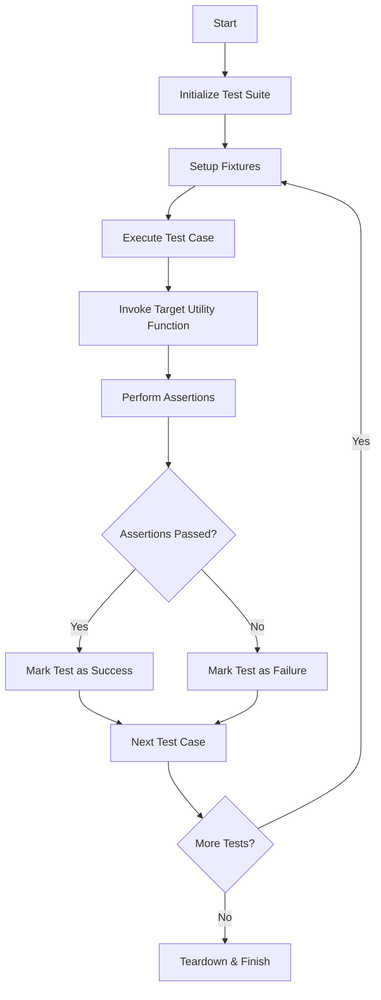

## 类结构

```
Test Classes
├── TestMsgTokens
├── TestEstimateTokenCount
├── TestNormalizeModelForTokenizer
├── TestTruncateToolMessageContent
├── TestTruncateMiddleTokens
├── TestEnsureToolPairsIntact
├── TestCompressContext
├── TestRemoveOrphanToolResponses
└── TestCompressResultDataclass
```

## 全局变量及字段


    

## 全局函数及方法


### `TestMsgTokens.enc`

这是一个 Pytest fixture 方法，用于初始化并返回 "gpt-4o" 模型的 tiktoken 编码对象，供类中的其他测试方法使用。

参数：

-   `self`：`TestMsgTokens`，测试类实例引用（由 Pytest 框架隐式传递）。

返回值：`Encoding`，"gpt-4o" 模型的 tiktoken 编码对象实例。

#### 流程图

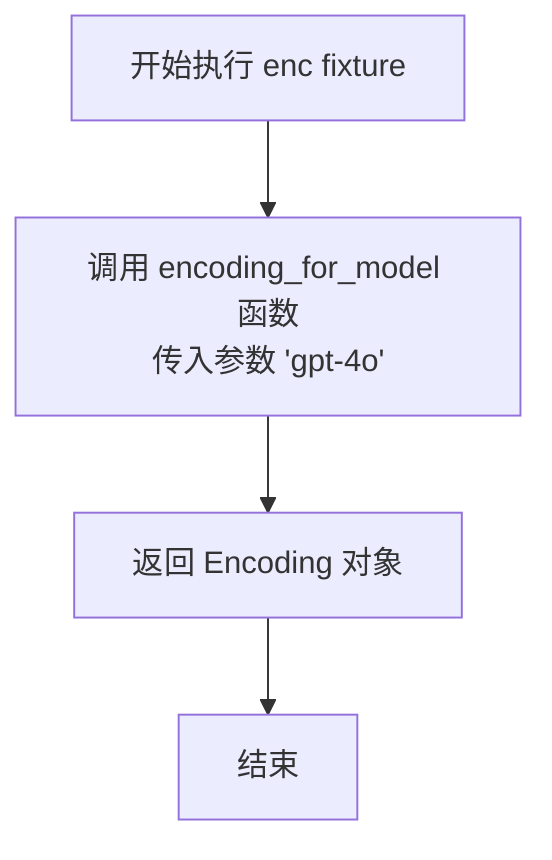

#### 带注释源码

```python
    @pytest.fixture
    def enc(self):
        """Get the encoding for gpt-4o model."""
        # 调用 tiktoken 库的 encoding_for_model 函数
        # 传入模型名称 "gpt-4o" 获取对应的编码器
        return encoding_for_model("gpt-4o")
```


### `TestMsgTokens.test_regular_message_token_counting`

该方法旨在测试 `_msg_tokens` 工具函数对于标准文本消息的 token 计数是否准确（向后兼容性测试）。它验证了函数是否正确计算了消息包装所需的固定 token 数（通常为 3 个）加上消息内容实际编码后的 token 数总和。

参数：

-  `self`：`TestMsgTokens`，测试类实例，由 pytest 框架自动传递。
-  `enc`：`tiktoken.Encoding`，tiktoken 编码器实例，通过 `@pytest.fixture` 注入，通常为 "gpt-4o" 模型的编码器，用于编码文本内容。

返回值：`None`，该方法是单元测试函数，通过断言验证逻辑，无返回值。

#### 流程图

```mermaid
graph TD
    A[开始] --> B[构建标准用户消息 msg]
    B --> C[调用 _msg_tokens(msg, enc) 获取 tokens]
    C --> D[计算预期值 expected = 3 + content_tokens]
    D --> E{断言 tokens == expected}
    E -- 失败 --> F[测试失败]
    E -- 成功 --> G{断言 tokens > 3}
    G -- 失败 --> F
    G -- 成功 --> H[测试通过/结束]
```

#### 带注释源码

```python
    def test_regular_message_token_counting(self, enc):
        """Test that regular messages are counted correctly (backward compatibility)."""
        # 构造一个简单的用户消息对象，包含角色和文本内容
        msg = {"role": "user", "content": "What's the weather like in San Francisco?"}

        # 调用被测函数 _msg_tokens，传入消息对象和编码器，计算实际 token 数
        tokens = _msg_tokens(msg, enc)

        # 计算预期的 token 数量：
        # 3 代表消息的包装 tokens (如 role 标记等)
        # len(enc.encode(msg["content"])) 代表消息内容编码后的 tokens
        expected = 3 + len(enc.encode(msg["content"]))
        
        # 断言：实际计算的 tokens 必须等于预期值
        assert tokens == expected
        # 断言：tokens 数量必须大于 3，以确保内容部分确实被计算在内
        assert tokens > 3  # Has content
```


### `TestMsgTokens.test_regular_message_with_name`

该方法用于测试 `_msg_tokens` 函数在处理包含 `name` 字段的常规消息时，是否能正确计算 token 数量。其核心目的是验证当消息中存在 `name` 字段时，除了基础的消息包装 token 和内容 token 外，是否正确计入了额外的名称 token。

参数：

-   `enc`：`tiktoken.Encoding`，通过 pytest fixture 提供的 GPT-4O 模型的编码器对象，用于编码文本和计算 token 长度。

返回值：`None`，该测试方法不返回值，主要通过断言验证逻辑正确性。

#### 流程图

```mermaid
graph TD
    A[开始] --> B[构造测试消息 msg<br>包含 role, name, content]
    B --> C[调用 _msg_tokens(msg, enc)<br>获取计算后的 tokens]
    C --> D[计算期望值 expected<br>4 + len(enc.encode(content))]
    D --> E{断言 tokens == expected}
    E -- 匹配 --> F[测试通过]
    E -- 不匹配 --> G[测试失败: 抛出 AssertionError]
```

#### 带注释源码

```python
    def test_regular_message_with_name(self, enc):
        """Test that messages with name field get extra wrapper token."""
        # 构造一个包含 name 字段的标准用户消息
        msg = {"role": "user", "name": "test_user", "content": "Hello!"}

        # 调用待测函数 _msg_tokens 计算该消息的 token 数量
        tokens = _msg_tokens(msg, enc)

        # 预期值计算逻辑：
        # 基础 wrapper 占 3 个 token
        # name 字段额外占 1 个 token
        # 内容占 len(enc.encode(msg["content"])) 个 token
        expected = 4 + len(enc.encode(msg["content"]))
        
        # 断言实际计算结果与预期一致
        assert tokens == expected
```


### `TestMsgTokens.test_openai_tool_call_token_counting`

测试 OpenAI 格式工具调用消息的 token 计数逻辑，确保 `_msg_tokens` 函数能正确计算包括包装 token、工具调用 ID、函数类型、函数名称以及函数参数字符串在内的所有 token 总数。

参数：

-  `self`：`TestMsgTokens`，测试类实例，由 pytest 框架自动传入。
-  `enc`：`Encoding`，Tiktoken 编码器实例，由 `enc` fixture 提供（通常为 `gpt-4o` 模型的编码器），用于将文本转换为 token。

返回值：`None`，无返回值，该方法通过 assert 语句验证逻辑正确性。

#### 流程图

```mermaid
flowchart TD
    A[开始] --> B[构造 OpenAI 格式消息对象<br>role: assistant, tool_calls: [...]]
    B --> C[调用 _msg_tokens(msg, enc)<br>获取实际 token 数]
    C --> D[手动计算预期 token 数<br>enc.encode各字段长度求和 + 3个包装token]
    D --> E{实际 tokens == 预期 tokens ?}
    E -- 是 --> F{实际 tokens > 8 ?}
    F -- 是 --> G[测试通过]
    E -- 否 --> H[测试失败: 数量不匹配]
    F -- 否 --> I[测试失败: 数量异常低]
```

#### 带注释源码

```python
    def test_openai_tool_call_token_counting(self, enc):
        """Test OpenAI format tool call token counting."""
        # 1. 定义一个包含 OpenAI 格式工具调用的模拟消息
        msg = {
            "role": "assistant",
            "content": None,
            "tool_calls": [
                {
                    "id": "call_abc123",
                    "type": "function",
                    "function": {
                        "name": "get_weather",
                        "arguments": '{"location": "San Francisco", "unit": "celsius"}',
                    },
                }
            ],
        }

        # 2. 调用待测函数 _msg_tokens 计算该消息的 token 数
        tokens = _msg_tokens(msg, enc)

        # 3. 手动计算预期的 token 数量：
        #    - 编码工具调用 ID ("call_abc123")
        #    - 编码类型 ("function")
        #    - 编码函数名 ("get_weather")
        #    - 编码函数参数 (JSON 字符串)
        expected_tool_tokens = (
            len(enc.encode("call_abc123"))
            + len(enc.encode("function"))
            + len(enc.encode("get_weather"))
            + len(enc.encode('{"location": "San Francisco", "unit": "celsius"}'))
        )
        # 4. 预期总数 = 3 (消息包装 token) + 工具调用相关 token
        expected = 3 + expected_tool_tokens  # wrapper + tool tokens

        # 5. 验证计算结果是否与预期一致
        assert tokens == expected
        # 6. 验证 token 数量显著大于仅包装 token 的数量（确保内容被计数）
        assert tokens > 8  # Should be significantly more than just wrapper
```


### `TestMsgTokens.test_openai_multiple_tool_calls`

该方法用于测试 `_msg_tokens` 函数在处理包含多个工具调用的 OpenAI 格式消息时的 token 计数准确性。它验证了当消息中的 `tool_calls` 列表包含多个函数调用对象时，计算出的总 token 数量是否正确地反映了所有工具调用的累加值。

参数：

- `self`：`TestMsgTokens`，测试类的实例。
- `enc`：`Encoding`，由 `@pytest.fixture` 提供的 tiktoken 编码器实例（此处为 gpt-4o 编码），用于将文本转换为 token。

返回值：`None`，该方法不返回值，主要用于断言验证。

#### 流程图

```mermaid
graph TD
    A[开始] --> B[构建测试消息 msg<br>包含 role 为 assistant 和多个 tool_calls]
    B --> C[调用 _msg_tokens(msg, enc)<br>计算消息的 token 总数]
    C --> D[断言 tokens > 20<br>验证多个工具调用已计入总 token 数]
    D --> E[测试结束]
```

#### 带注释源码

```python
    def test_openai_multiple_tool_calls(self, enc):
        """Test OpenAI format with multiple tool calls."""
        # 构造包含多个 tool_calls 的消息对象，模拟 Assistant 一次性调用多个工具的场景
        msg = {
            "role": "assistant",
            "content": None,
            "tool_calls": [
                {
                    "id": "call_1",
                    "type": "function",
                    "function": {"name": "func1", "arguments": '{"arg": "value1"}'},
                },
                {
                    "id": "call_2",
                    "type": "function",
                    "function": {"name": "func2", "arguments": '{"arg": "value2"}'},
                },
            ],
        }

        # 调用 _msg_tokens 计算该消息的 token 数量
        tokens = _msg_tokens(msg, enc)

        # 验证 token 数量显著大于单一工具调用的情况，确保所有工具调用都被统计
        # Should count all tool calls
        assert tokens > 20  # Should be more than single tool call
```


### `TestMsgTokens.test_anthropic_tool_use_token_counting`

该测试方法用于验证 `_msg_tokens` 函数是否能够准确计算 Anthropic 格式下包含 `tool_use` 内容块的消息的 token 数量。它检查了包装 token、工具 ID、函数名称以及序列化后的输入参数是否都被正确计入。

参数：

-   `self`：`TestMsgTokens`，测试类的实例。
-   `enc`：`Encoding`，由 `pytest` fixture 提供的 tiktoken 编码器对象（此处为 "gpt-4o" 模型的编码）。

返回值：`None`，此方法为单元测试，通过执行断言来验证逻辑，不返回任何值。

#### 流程图

```mermaid
graph TD
    A[开始: test_anthropic_tool_use_token_counting] --> B[定义 Anthropic 格式消息体<br/>含 tool_use 块]
    B --> C[调用 _msg_tokens 方法计算 tokens]
    C --> D[手动计算预期 token 数<br/>(wrapper + id + name + json_input)]
    D --> E{断言: tokens == expected}
    E -- false --> F[测试失败]
    E -- true --> G{断言: tokens > 8}
    G -- false --> F
    G -- true --> H[测试通过]
```

#### 带注释源码

```python
    def test_anthropic_tool_use_token_counting(self, enc):
        """Test Anthropic format tool use token counting."""
        # 1. 准备测试数据：构造一个包含 tool_use 内容块的 Assistant 消息
        msg = {
            "role": "assistant",
            "content": [
                {
                    "type": "tool_use",
                    "id": "toolu_xyz456",
                    "name": "get_weather",
                    "input": {"location": "San Francisco", "unit": "celsius"},
                }
            ],
        }

        # 2. 执行测试：调用 _msg_tokens 函数获取计算出的 token 数
        tokens = _msg_tokens(msg, enc)

        # 3. 构造预期结果：手动计算各部分 token 之和
        # 包括 wrapper token (3个) + tool_id + function_name + json_string(input)
        expected_tool_tokens = (
            len(enc.encode("toolu_xyz456"))
            + len(enc.encode("get_weather"))
            + len(
                enc.encode(json.dumps({"location": "San Francisco", "unit": "celsius"}))
            )
        )
        expected = 3 + expected_tool_tokens  # wrapper + tool tokens

        # 4. 断言验证：检查实际 token 数是否等于预期值
        assert tokens == expected
        # 5. 边界检查：确保 token 数量大于基础值（不仅包含 wrapper）
        assert tokens > 8  # Should be significantly more than just wrapper
```


### `TestMsgTokens.test_anthropic_tool_result_token_counting`

该方法用于验证 `_msg_tokens` 函数在处理 Anthropic 格式 `tool_result` 消息时的 Token 计数准确性。它确保函数能正确计算包含工具使用 ID 和工具返回内容的消息所消耗的 Tokens，包括基础消息包装 Tokens 和具体内容 Tokens 的总和。

参数：

-  `self`：`TestMsgTokens`，测试类的实例，用于访问测试上下文。
-  `enc`：`tiktoken.Encoding`，由 `pytest.fixture` 提供的编码器实例，用于将文本转换为 Tokens 以便进行计算和比对。

返回值：`None`，该函数为单元测试方法，不返回具体数值，主要通过断言验证逻辑正确性。

#### 流程图

```mermaid
flowchart TD
    A[开始] --> B[构造测试消息 msg<br>包含 Anthropic 格式的 tool_result]
    B --> C[调用 _msg_tokens(msg, enc) 获取实际 Token 数]
    C --> D[计算预期的 Tool Tokens<br>分别编码 tool_use_id 和 content 字段]
    D --> E[计算总预期值 expected<br>3 (包装符) + Tool Tokens]
    E --> F{断言 实际 Tokens == 预期 Tokens}
    F -- 通过 --> G{断言 实际 Tokens > 8}
    G -- 通过 --> H[测试结束/通过]
    F -- 失败 --> I[测试失败/抛出 AssertionError]
    G -- 失败 --> I
```

#### 带注释源码

```python
def test_anthropic_tool_result_token_counting(self, enc):
    """Test Anthropic format tool result token counting."""
    # 构造一个模拟 Anthropic 格式的 tool_result 消息
    # role 为 user，content 是一个包含 tool_result 类型的列表
    msg = {
        "role": "user",
        "content": [
            {
                "type": "tool_result",
                "tool_use_id": "toolu_xyz456",
                "content": "The weather in San Francisco is 22°C and sunny.",
            }
        ],
    }

    # 调用被测试函数 _msg_tokens 计算该消息的 token 数量
    tokens = _msg_tokens(msg, enc)

    # 手动计算预期的 token 数量以进行验证
    # 预期值 = tool_use_id 的 token 数 + content 文本的 token 数
    expected_tool_tokens = len(enc.encode("toolu_xyz456")) + len(
        enc.encode("The weather in San Francisco is 22°C and sunny.")
    )
    # 总预期值 = 消息包装符 (通常为 3 个 token) + tool 内容的 token 数
    expected = 3 + expected_tool_tokens  # wrapper + tool tokens

    # 断言：函数计算出的 tokens 应该等于手动计算的预期值
    assert tokens == expected
    # 断言：token 总数应该显著大于仅包装符的数量 (3)，确保内容被正确计入
    assert tokens > 8  # Should be significantly more than just wrapper
```


### `TestMsgTokens.test_anthropic_mixed_content`

测试 `_msg_tokens` 函数对包含混合内容类型（如文本块和工具使用块）的 Anthropic 格式消息进行 Token 计数的准确性。

参数：

- `self`：`TestMsgTokens`，测试类的实例。
- `enc`：`tiktoken.Encoding`，由 `enc` fixture 提供的 Token 编码器实例。

返回值：`None`，该方法为测试方法，无返回值，通过断言验证逻辑。

#### 流程图

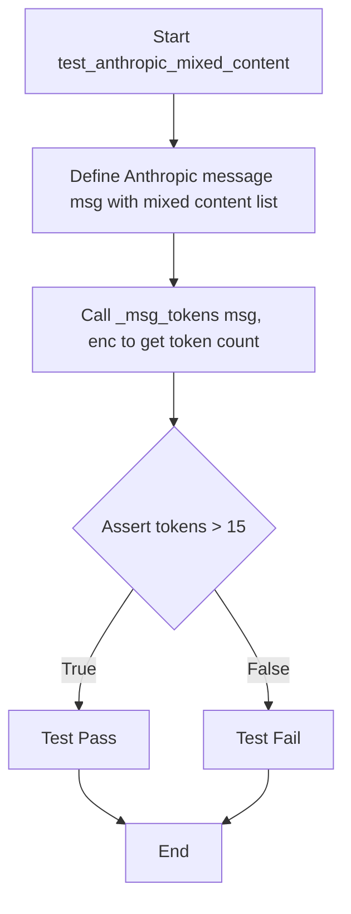

#### 带注释源码

```python
def test_anthropic_mixed_content(self, enc):
    """Test Anthropic format with mixed content types."""
    # 定义一个 Anthropic 格式的消息，其中 content 为列表，包含文本和工具调用两种类型
    msg = {
        "role": "assistant",
        "content": [
            {"type": "text", "content": "I'll check the weather for you."},
            {
                "type": "tool_use",
                "id": "toolu_123",
                "name": "get_weather",
                "input": {"location": "SF"},
            },
        ],
    }

    # 调用 _msg_tokens 函数计算该消息的 Token 数量
    tokens = _msg_tokens(msg, enc)

    # 断言 Token 数量大于 15，以确保文本和工具使用块都被正确计数
    # Should count all content items
    assert tokens > 15  # Should count both text and tool use
```


### `TestMsgTokens.test_empty_content`

该方法用于测试当消息内容为 `None` 或空字符串 `""` 时，内部函数 `_msg_tokens` 能否正确计算 token 数量。预期结果是只计算消息的基础包装 token，数量为 3。

参数：

-   `enc`：`tiktoken.Encoding`，通过 fixture 注入的 gpt-4o 模型编码器，用于对文本进行编码和 token 计数。

返回值：`None`，该方法为单元测试，无返回值，通过断言验证逻辑。

#### 流程图

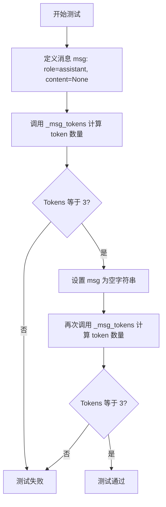

#### 带注释源码

```python
def test_empty_content(self, enc):
    """Test message with empty or None content."""
    # 定义一个消息，内容为 None
    msg = {"role": "assistant", "content": None}

    # 计算该消息的 token 数量
    tokens = _msg_tokens(msg, enc)
    # 断言 token 数量应为 3（仅包含消息包装的 token，无内容 token）
    assert tokens == 3  # Just wrapper tokens

    # 将消息内容更新为空字符串
    msg["content"] = ""
    # 重新计算 token 数量
    tokens = _msg_tokens(msg, enc)
    # 断言 token 数量仍应为 3（空字符串不产生内容 token）
    assert tokens == 3  # Just wrapper tokens
```


### `TestMsgTokens.test_string_content_with_tool_calls`

该测试用例验证了在 OpenAI 格式的消息中，当一条消息同时包含文本字符串内容和工具调用（tool_calls）时，系统是否能够正确计算总 token 数量。它确保了文本内容 tokens、工具调用相关 tokens（如 ID、类型、函数名、参数）以及消息包装 wrapper tokens 均被准确累加。

参数：

-  `self`：`TestMsgTokens`，测试类的实例，用于访问测试上下文。
-  `enc`：`tiktoken.core.Encoding`，由 `pytest.fixture` 提供的编码器对象，这里指定为 "gpt-4o" 模型的编码器，用于执行具体的 token 编码计算。

返回值：`None`，该方法不返回任何值，主要通过断言验证逻辑的正确性。

#### 流程图

```mermaid
graph TD
    A[开始] --> B[构造包含 content 和 tool_calls 的 msg]
    B --> C[调用 _msg_tokens(msg, enc) 获取 tokens]
    C --> D[计算 content_tokens]
    C --> E[计算 tool_tokens: id, type, name, args]
    E --> F[计算 expected: 3 + content_tokens + tool_tokens]
    F --> G[断言 tokens == expected]
    G --> H[测试结束]
```

#### 带注释源码

```python
    def test_string_content_with_tool_calls(self, enc):
        """Test OpenAI format where content is string but tool_calls exist."""
        # 构造一个同时包含文本内容和工具调用的助手消息
        msg = {
            "role": "assistant",
            "content": "Let me check that for you.",
            "tool_calls": [
                {
                    "id": "call_123",
                    "type": "function",
                    "function": {"name": "test_func", "arguments": "{}"},
                }
            ],
        }

        # 调用待测函数计算该消息的 token 数
        tokens = _msg_tokens(msg, enc)

        # 手动计算预期的文本内容 token 数
        content_tokens = len(enc.encode("Let me check that for you."))
        
        # 手动计算预期的工具调用相关 token 数
        # 包括: id, type, function name, arguments
        tool_tokens = (
            len(enc.encode("call_123"))
            + len(enc.encode("function"))
            + len(enc.encode("test_func"))
            + len(enc.encode("{}"))
        )
        
        # 计算总预期值: 3 (wrapper tokens) + content tokens + tool tokens
        expected = 3 + content_tokens + tool_tokens

        # 验证计算结果是否符合预期
        assert tokens == expected
```


### `TestEstimateTokenCount.test_conversation_with_tool_calls`

测试包含工具调用（Tool Calls）的完整对话流程的 Token 计数准确性。该方法模拟了一个包含用户提问、助手发起工具调用、工具返回结果以及助手最终回复的对话场景，通过调用 `estimate_token_count` 计算总 Token 数，并将其与手动累加每个独立消息的 Token 数进行对比验证，以确保在涉及工具调用的复杂交互中，系统的计费逻辑与底层的 `_msg_tokens` 计算保持一致。

参数：

- `self`：`TestEstimateTokenCount`，测试类实例，由 pytest 框架自动注入。

返回值：`None`，该方法为单元测试，无返回值，通过断言验证结果。

#### 流程图

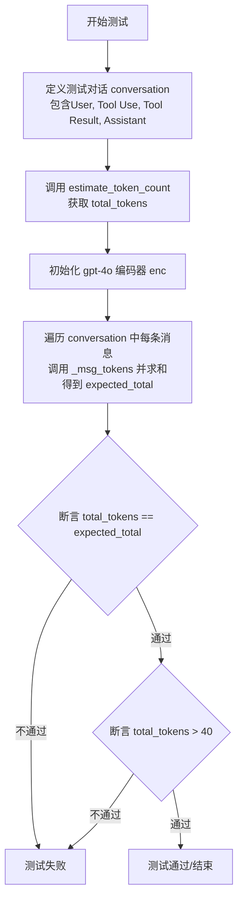

#### 带注释源码

```python
def test_conversation_with_tool_calls(self):
    """Test token counting for a complete conversation with tool calls."""
    # 1. 构造一个包含工具调用交互的测试对话列表
    conversation = [
        {"role": "user", "content": "What's the weather like in San Francisco?"},
        {
            "role": "assistant",
            "content": [
                {
                    "type": "tool_use",
                    "id": "toolu_123",
                    "name": "get_weather",
                    "input": {"location": "San Francisco"},
                }
            ],
        },
        {
            "role": "user",
            "content": [
                {
                    "type": "tool_result",
                    "tool_use_id": "toolu_123",
                    "content": "22°C and sunny",
                }
            ],
        },
        {
            "role": "assistant",
            "content": "The weather in San Francisco is 22°C and sunny.",
        },
    ]

    # 2. 调用待测的 estimate_token_count 函数计算整个对话的总 Token 数
    total_tokens = estimate_token_count(conversation)

    # 3. 验证：总数应等于各部分之和
    # 获取 gpt-4o 模型的编码器
    enc = encoding_for_model("gpt-4o")
    # 手动计算预期的总 Token 数：对对话中每条消息调用 _msg_tokens 并累加
    expected_total = sum(_msg_tokens(msg, enc) for msg in conversation)

    # 断言：函数返回的总数必须等于手动计算的预期总数
    assert total_tokens == expected_total
    # 断言：Token 数量应当大于一个较小的经验值（40），确保计算逻辑有效
    assert total_tokens > 40  # Should be substantial for this conversation
```


### `TestEstimateTokenCount.test_openai_conversation`

Test token counting for OpenAI format conversation, verifying that the `estimate_token_count` function correctly calculates tokens for a dialogue containing tool calls by comparing it against the sum of individual message tokens using a specific tokenizer.

参数：

- `self`：`TestEstimateTokenCount`，The instance of the test class.

返回值：`None`，The method performs assertions to validate behavior and does not return a value.

#### 流程图

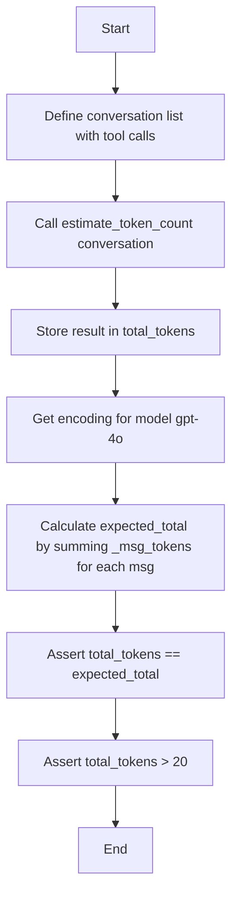

#### 带注释源码

```python
def test_openai_conversation(self):
    """Test token counting for OpenAI format conversation."""
    # 1. 构造一个包含工具调用的典型 OpenAI 格式对话列表
    conversation = [
        {"role": "user", "content": "Calculate 2 + 2"},
        {
            "role": "assistant",
            "tool_calls": [
                {
                    "id": "call_calc",
                    "type": "function",
                    "function": {
                        "name": "calculate",
                        "arguments": '{"expression": "2 + 2"}',
                    },
                }
            ],
        },
        {"role": "tool", "tool_call_id": "call_calc", "content": "4"},
        {"role": "assistant", "content": "The result is 4."},
    ]

    # 2. 调用 estimate_token_count 函数计算整个对话的总 token 数
    total_tokens = estimate_token_count(conversation)

    # 3. 验证：使用 gpt-4o 的编码器逐条计算消息 token 并求和，得到预期值
    enc = encoding_for_model("gpt-4o")
    expected_total = sum(_msg_tokens(msg, enc) for msg in conversation)

    # 4. 断言：函数计算的总数应等于逐条计算的预期总数
    assert total_tokens == expected_total
    # 5. 断言：总数应大于一个合理的阈值（20），确保计算不是零或极小值
    assert total_tokens > 20  # Should be substantial
```


### `TestNormalizeModelForTokenizer.test_openai_models_unchanged`

该测试方法用于验证 `_normalize_model_for_tokenizer` 函数在处理标准的 OpenAI 模型名称（如 "gpt-4o", "gpt-4", "gpt-3.5-turbo"）时，能够正确识别并原样返回，确保这些核心模型标识符在规范化过程中保持不变。

参数：

- `self`：`TestNormalizeModelForTokenizer`，测试类实例，用于访问测试上下文和方法。

返回值：`None`，无返回值，通过断言语句验证被测函数的逻辑正确性。

#### 流程图

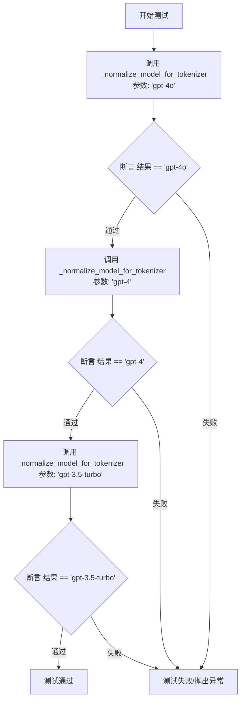

#### 带注释源码

```python
    def test_openai_models_unchanged(self):
        """Test that OpenAI models are returned as-is."""
        # 验证标准 OpenAI 模型 "gpt-4o" 在规范化后保持不变
        assert _normalize_model_for_tokenizer("gpt-4o") == "gpt-4o"
        
        # 验证标准 OpenAI 模型 "gpt-4" 在规范化后保持不变
        assert _normalize_model_for_tokenizer("gpt-4") == "gpt-4"
        
        # 验证标准 OpenAI 模型 "gpt-3.5-turbo" 在规范化后保持不变
        assert _normalize_model_for_tokenizer("gpt-3.5-turbo") == "gpt-3.5-turbo"
```


### `TestNormalizeModelForTokenizer.test_claude_models_normalized`

该测试方法用于验证针对不同型号的Claude模型（包括带路径前缀的模型名）调用标准化函数时，是否都能正确统一转换为 `gpt-4o`，以确保后续使用 `tiktoken` 进行Token计算时的兼容性。

参数：

- `self`：`TestNormalizeModelForTokenizer`，测试类的实例，用于访问测试上下文。

返回值：`None`，无返回值，通过断言验证逻辑正确性，若断言失败则抛出异常。

#### 流程图

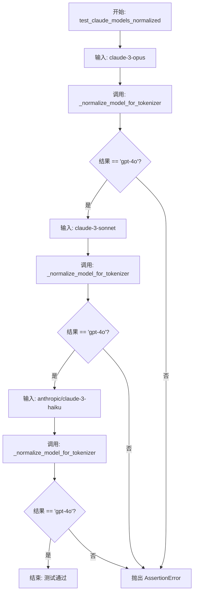

#### 带注释源码

```python
def test_claude_models_normalized(self):
    """Test that Claude models are normalized to gpt-4o."""
    
    # 验证 "claude-3-opus" 被标准化为 "gpt-4o"
    assert _normalize_model_for_tokenizer("claude-3-opus") == "gpt-4o"
    
    # 验证 "claude-3-sonnet" 被标准化为 "gpt-4o"
    assert _normalize_model_for_tokenizer("claude-3-sonnet") == "gpt-4o"
    
    # 验证带厂商前缀的 "anthropic/claude-3-haiku" 被标准化为 "gpt-4o"
    assert _normalize_model_for_tokenizer("anthropic/claude-3-haiku") == "gpt-4o"
```


### `TestNormalizeModelForTokenizer.test_openrouter_paths_extracted`

该测试方法用于验证 `_normalize_model_for_tokenizer` 函数能否正确处理 OpenRouter 格式的模型路径（即包含提供商前缀的模型字符串，如 "openai/gpt-4o"），将其提取并标准化为基础的模型名称或归一化为默认的 tokenizer 兼容模型。

参数：

-  `self`：`TestNormalizeModelForTokenizer`，测试类的实例引用。

返回值：`None`，该方法为单元测试，通过断言验证逻辑，不返回具体数值。

#### 流程图

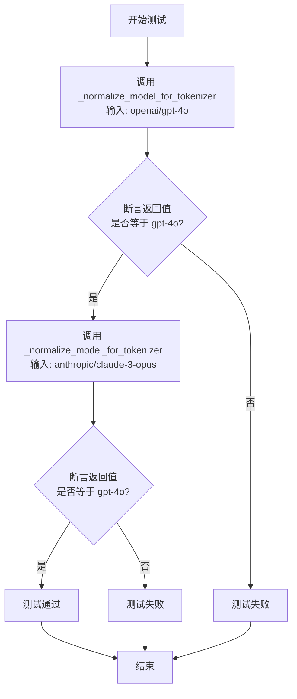

#### 带注释源码

```python
def test_openrouter_paths_extracted(self):
    """Test that OpenRouter model paths are handled."""
    # 测试 OpenRouter 路径中的 OpenAI 模型能否正确提取为 gpt-4o
    assert _normalize_model_for_tokenizer("openai/gpt-4o") == "gpt-4o"
    
    # 测试 OpenRouter 路径中的 Anthropic 模型（如 claude-3-opus）能否被正确归一化
    # 根据项目逻辑，非 OpenAI 原生模型通常归一化为 gpt-4o 用于 token 计算
    assert _normalize_model_for_tokenizer("anthropic/claude-3-opus") == "gpt-4o"
```


### `TestNormalizeModelForTokenizer.test_unknown_models_default_to_gpt4o`

验证 `_normalize_model_for_tokenizer` 函数的健壮性，确保未识别的模型名称（如 'some-random-model' 或 'llama-3-70b'）会自动标准化为 'gpt-4o'，以便分词器兼容。

参数：

-  `self`：`TestNormalizeModelForTokenizer`，测试类的实例，用于访问测试上下文。

返回值：`None`，无返回值，主要目的是通过断言验证函数逻辑的正确性。

#### 流程图

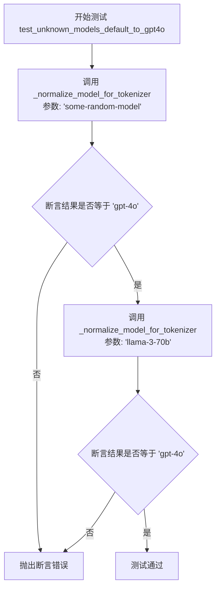

#### 带注释源码

```python
def test_unknown_models_default_to_gpt4o(self):
    """Test that unknown models default to gpt-4o."""
    # 验证当输入未知的随机模型名称时，函数默认返回 'gpt-4o'
    assert _normalize_model_for_tokenizer("some-random-model") == "gpt-4o"
    
    # 验证当输入非 OpenAI/Anthropic 生态的其他模型（如 LLaMA）时，函数默认返回 'gpt-4o'
    assert _normalize_model_for_tokenizer("llama-3-70b") == "gpt-4o"
```


### `TestTruncateToolMessageContent.enc`

这是一个 Pytest 测试夹具方法，属于 `TestTruncateToolMessageContent` 测试类。它负责初始化并返回针对 "gpt-4o" 模型的分词器编码对象。该对象被注入到该类的各个测试方法中，用于在测试工具消息内容截断功能时进行准确的 Token 计算。

参数：

- `self`：`TestTruncateToolMessageContent`，测试类的实例，用于在测试上下文中访问此方法。

返回值：`Encoding`，`tiktoken` 库中的编码对象实例，配置为 "gpt-4o" 模型规范。

#### 流程图

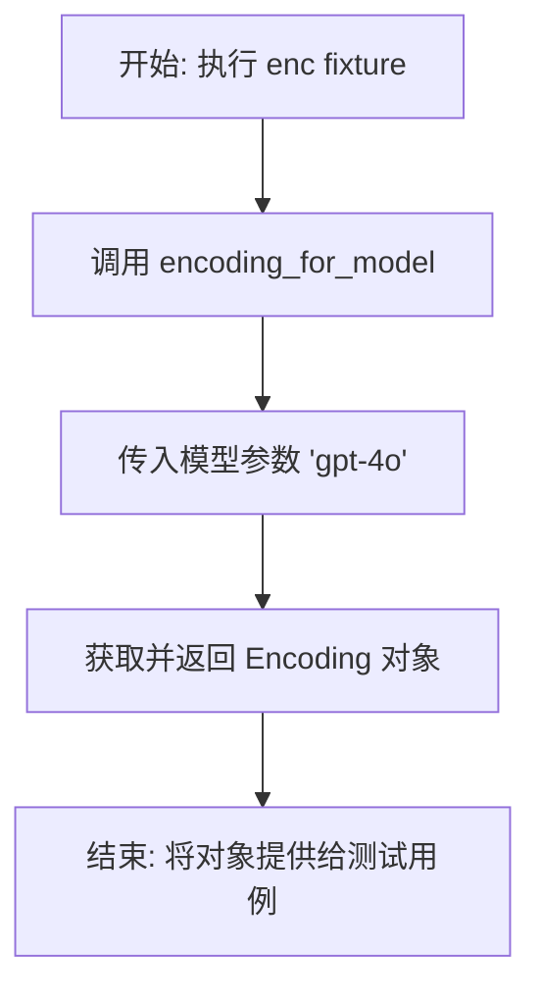

#### 带注释源码

```python
    @pytest.fixture
    def enc(self):
        # 使用 tiktoken 库获取 "gpt-4o" 模型的编码器实例
        # 这个编码器将被用于后续测试方法中计算 Token 数量
        return encoding_for_model("gpt-4o")
```


### `TestTruncateToolMessageContent.test_truncate_openai_tool_message`

该测试方法用于验证截断 OpenAI 格式工具消息的功能。它通过构造一个包含超长字符串内容的工具消息，并调用截断函数限制其最大 token 数，来检查消息内容是否被正确缩短以及是否包含了表示截断的省略号标记。

参数：

- `self`：`TestTruncateToolMessageContent`，测试类实例。
- `enc`：`tiktoken.Encoding`，用于计算 token 数量的编码器对象（通过 pytest fixture 提供）。

返回值：`None`，该函数作为测试用例，执行断言验证逻辑而不返回数值。

#### 流程图

```mermaid
flowchart TD
    A[开始: test_truncate_openai_tool_message] --> B[准备测试数据: 创建10000个'x'的长字符串]
    B --> C[构造OpenAI工具消息字典<br/>role: tool, tool_call_id: call_123, content: long_content]
    C --> D[调用 _truncate_tool_message_content<br/>参数: msg, enc, max_tokens=100]
    D --> E{断言验证}
    E --> F[检查 msg['content'] 长度是否小于原始长度]
    F --> G[检查 msg['content'] 中是否包含省略号 '…']
    G --> H[测试结束]
```

#### 带注释源码

```python
def test_truncate_openai_tool_message(self, enc):
    """Test truncation of OpenAI-style tool message with string content."""
    # 1. 准备测试数据：创建一个包含10000个字符的长字符串，用于模拟超长内容
    long_content = "x" * 10000
    
    # 2. 构造一个符合 OpenAI 格式的工具消息对象
    msg = {"role": "tool", "tool_call_id": "call_123", "content": long_content}

    # 3. 调用待测试的截断函数 _truncate_tool_message_content
    #    传入消息对象、编码器对象，并设置最大 token 限制为 100
    _truncate_tool_message_content(msg, enc, max_tokens=100)

    # 4. 验证步骤：截断后的消息内容长度应当小于原始长度
    assert len(msg["content"]) < len(long_content)
    
    # 5. 验证步骤：截断后的内容中应当包含省略号标记 "…"，表明中间部分已被移除
    assert "…" in msg["content"]
```


### `TestTruncateToolMessageContent.test_truncate_anthropic_tool_result`

这是一个单元测试方法，用于验证当Anthropic风格的`tool_result`消息内容超过指定Token限制时，截断功能是否能够正常工作。

参数：

- `self`：`TestTruncateToolMessageContent`，测试类的实例，用于访问测试上下文和断言方法。
- `enc`：`Encoding`，由`tiktoken`库提供的编码器实例（通常通过fixture注入，这里使用的是gpt-4o的编码），用于计算Token数量。

返回值：`None`，该方法主要用于执行断言逻辑，不返回具体数值。

#### 流程图

```mermaid
graph TD
    A[开始: test_truncate_anthropic_tool_result] --> B[生成长字符串内容: "y" * 10000]
    B --> C[构造Anthropic风格消息对象<br/>role: user, content: tool_result]
    C --> D[调用 _truncate_tool_message_content<br/>参数: msg, enc, max_tokens=100]
    D --> E[从消息对象中提取截断后的内容 result_content]
    E --> F{断言: len(result_content) < len(long_content)?}
    F -- 是 --> G{断言: "…" 存在于 result_content 中?}
    F -- 否 --> H[测试失败: 内容未被截断]
    G -- 是 --> I[测试通过]
    G -- 否 --> J[测试失败: 缺少截断标记]
    H --> K[结束]
    J --> K
    I --> K
```

#### 带注释源码

```python
def test_truncate_anthropic_tool_result(self, enc):
    """Test truncation of Anthropic-style tool_result."""
    # 1. 准备测试数据：创建一个包含10000个字符的长字符串，模拟过大的工具输出
    long_content = "y" * 10000

    # 2. 构造符合Anthropic格式的消息对象，包含tool_result类型的content块
    msg = {
        "role": "user",
        "content": [
            {
                "type": "tool_result",          # 指定内容类型为工具结果
                "tool_use_id": "toolu_123",     # 模拟的工具调用ID
                "content": long_content,        # 填入过长的内容
            }
        ],
    }

    # 3. 调用被测函数 _truncate_tool_message_content，尝试将内容截断至最多100个token
    # 注意：该函数会直接修改传入的 msg 对象
    _truncate_tool_message_content(msg, enc, max_tokens=100)

    # 4. 从消息对象中获取经过处理后的内容
    result_content = msg["content"][0]["content"]

    # 5. 断言验证：处理后的内容长度应该小于原始长度（确保发生了截断）
    assert len(result_content) < len(long_content)

    # 6. 断言验证：截断后的内容中应包含省略号标记 "…"，表明这是截断后的内容
    assert "…" in result_content
```


### `TestTruncateToolMessageContent.test_preserve_tool_use_blocks`

该测试方法旨在验证当消息包含 `tool_use` 类型的工具调用块时，即使其内容很大且设置了较低的最大 token 限制，截断函数 `_truncate_tool_message_content` 也应当保留这些块的完整内容，而不对其进行任何截断操作。

参数：

-   `self`：`TestTruncateToolMessageContent`，测试类的实例，用于访问测试上下文。
-   `enc`：`tiktoken.Encoding`，由 `pytest.fixture` 提供的分词器编码对象，用于计算 token 数量。

返回值：`None`，该方法为测试用例，无返回值，通过断言验证逻辑正确性。

#### 流程图

```mermaid
graph TD
    A[开始] --> B[构建包含 tool_use 的消息字典]
    B --> C[设置 tool_use 的 input 为超大内容]
    C --> D[序列化 input 内容保存为 original]
    D --> E[调用 _truncate_tool_message_content]
    E --> F[参数: msg, enc, max_tokens=10]
    F --> G[断言: msg 中的 input 内容应与 original 一致]
    G --> H{断言是否通过?}
    H -- 是 --> I[测试通过: tool_use 块未被截断]
    H -- 否 --> J[测试失败: tool_use 块被意外截断]
    I --> K[结束]
    J --> K
```

#### 带注释源码

```python
    def test_preserve_tool_use_blocks(self, enc):
        """Test that tool_use blocks are not truncated."""
        # 构建一个包含 assistant 角色和 content 列表的消息字典
        msg = {
            "role": "assistant",
            "content": [
                {
                    "type": "tool_use",  # 定义内容类型为 tool_use (Anthropic 格式)
                    "id": "toolu_123",
                    "name": "some_function",
                    "input": {"key": "value" * 1000},  # 故意设置一个非常大的 input 数据
                }
            ],
        }

        # 序列化原始的 input 数据，保存为基准字符串 'original'
        original = json.dumps(msg["content"][0]["input"])
        
        # 调用被测函数 _truncate_tool_message_content
        # 传入消息、编码器和极小的 max_tokens 限制 (10)
        # 如果逻辑错误，这么大的 input 可能会被截断
        _truncate_tool_message_content(msg, enc, max_tokens=10)

        # 验证断言：消息中的 input 数据必须与原始数据完全一致
        # 确保 tool_use 块的内容没有被修改或截断
        assert json.dumps(msg["content"][0]["input"]) == original
```


### `TestTruncateToolMessageContent.test_no_truncation_when_under_limit`

该测试方法用于验证当工具消息内容的Token数量低于指定的限制时，`_truncate_tool_message_content` 函数不会对消息内容进行任何修改，确保了在无需截断时数据的完整性。

参数：

-  `self`：`TestTruncateToolMessageContent`，测试类的实例，用于访问测试上下文。
-  `enc`：`Encoding`，由 pytest fixture 提供的 tiktoken 编码器实例，用于模拟 gpt-4o 模型的 Token 计数逻辑。

返回值：`None`，该方法为测试函数，不返回具体值，通过断言验证行为是否符合预期。

#### 流程图

```mermaid
graph TD
    A[开始测试] --> B[构建短内容工具消息]
    B --> C[保存原始消息内容]
    C --> D[调用 _truncate_tool_message_content]
    D --> E[设置 max_tokens 为 1000]
    E --> F[断言: msg['content'] == original]
    F -->|相等| G[测试通过: 未发生截断]
    F -->|不相等| H[测试失败]
```

#### 带注释源码

```python
def test_no_truncation_when_under_limit(self, enc):
    """Test that short content is not modified."""
    # 构建一个模拟的 OpenAI 格式工具消息，内容为短字符串 "Short content"
    msg = {"role": "tool", "tool_call_id": "call_123", "content": "Short content"}

    # 保存消息的原始内容，用于后续验证是否发生了变更
    original = msg["content"]

    # 调用被测函数 _truncate_tool_message_content
    # 传入消息对象、编码器以及设置为 1000 的最大 Token 限制
    # 预期行为是：因为内容很短，不会触发截断逻辑
    _truncate_tool_message_content(msg, enc, max_tokens=1000)

    # 断言消息的当前内容与原始内容完全一致
    # 验证在低于 Token 限制时，函数确实没有修改消息内容
    assert msg["content"] == original
```


### `TestTruncateMiddleTokens.enc`

该方法是 Pytest 测试中的一个 fixture，用于初始化并返回 "gpt-4o" 模型的 tiktoken 编码对象，供测试用例中使用。

参数：

无参数。

返回值：`Encoding`，返回 gpt-4o 模型的 tiktoken 编码对象实例。

#### 流程图

```mermaid
flowchart TD
    A([开始]) --> B[调用 encoding_for_model 函数]
    B --> C[传入模型名称 'gpt-4o']
    C --> D[获取并返回 Encoding 对象]
    D --> E([结束])
```

#### 带注释源码

```python
    @pytest.fixture
    def enc(self):
        """Get the encoding for gpt-4o model."""
        # 使用 tiktoken 库获取 gpt-4o 模型的编码器
        return encoding_for_model("gpt-4o")
```


### `TestTruncateMiddleTokens.test_truncates_long_text`

测试 `_truncate_middle_tokens` 函数是否能够正确地将长文本截断到指定的 token 限制内，具体做法是移除文本中间的部分并在中间插入省略号，同时保留文本的开头和结尾部分。

参数：

-   `self`：`TestTruncateMiddleTokens`，测试类的实例。
-   `enc`：`tiktoken.Encoding`，通过 fixture 注入的编码器实例，用于计算 token 数量。

返回值：`None`，该函数为测试方法，不返回具体值，主要通过断言验证行为。

#### 流程图

```mermaid
graph TD
    A[开始测试: test_truncates_long_text] --> B[准备测试数据: 生成包含1000个 'word ' 的长文本]
    B --> C[调用目标函数: _truncate_middle_tokens, 设置最大 token 为 50]
    C --> D[验证 Token 长度: 结果编码长度是否 <= 52]
    D --> E[验证截断标记: 结果是否包含 '…']
    E --> F[验证头部保留: 结果是否以 'word' 开头]
    F --> G[验证尾部保留: 结果是否以 'word ' 结尾]
    G --> H[测试结束]
```

#### 带注释源码

```python
    def test_truncates_long_text(self, enc):
        """Test that long text is truncated with ellipsis in middle."""
        # 1. 构造一段较长的文本用于测试，内容为 "word " 重复 1000 次
        long_text = "word " * 1000

        # 2. 调用 _truncate_middle_tokens 函数进行截断，设定最大 token 数为 50
        result = _truncate_middle_tokens(long_text, enc, max_tok=50)

        # 3. 断言截断后的文本 token 数量在允许范围内（留出2个 token 的余量给省略号或计算误差）
        assert len(enc.encode(result)) <= 52  # Allow some slack for ellipsis

        # 4. 断言结果中包含省略号字符，确认中间部分已被移除
        assert "…" in result

        # 5. 断言结果保留了原始文本的开头部分
        assert result.startswith("word")  # Head preserved

        # 6. 断言结果保留了原始文本的结尾部分
        assert result.endswith("word ")  # Tail preserved
```


### `TestTruncateMiddleTokens.test_preserves_short_text`

该测试方法验证了当待处理的文本长度低于指定的最大 token 限制时，`_truncate_middle_tokens` 函数能够保持文本原样不变，不进行任何截断操作。

参数：

- `self`：`TestTruncateMiddleTokens`，测试类的实例引用。
- `enc`：`Encoding`，由 pytest fixture 提供的分词器编码器实例，用于计算 token 数量。

返回值：`None`，该方法为单元测试，无返回值，通过断言验证逻辑。

#### 流程图

```mermaid
flowchart TD
    A["开始: test_preserves_short_text"] --> B["定义短文本变量 short_text = 'Hello world'"]
    B --> C["调用 _truncate_middle_tokens<br>参数: short_text, enc, max_tok=100"]
    C --> D["获取返回结果 result"]
    D --> E{断言: result == short_text ?}
    E -- 是 --> F["测试通过"]
    E -- 否 --> G["测试失败"]
    F --> H["结束"]
    G --> H
```

#### 带注释源码

```python
    def test_preserves_short_text(self, enc):
        """Test that short text is not modified."""
        # 定义一段较短的测试文本
        short_text = "Hello world"
        
        # 调用被测函数，设置最大 token 数为 100（远大于短文本的 token 数）
        result = _truncate_middle_tokens(short_text, enc, max_tok=100)

        # 断言处理后的结果与原始文本完全一致，验证短文本未被修改
        assert result == short_text
```


### `TestEnsureToolPairsIntact.test_openai_adds_missing_tool_call`

该测试用例用于验证 `_ensure_tool_pairs_intact` 函数在处理 OpenAI 格式消息时的逻辑，确保当传入的最近消息列表（`recent`）以一个孤立的工具响应（`tool` 角色，缺少对应的工具调用请求）开头时，该函数能够根据起始索引（`start_index`）回溯查找完整的消息列表（`all_msgs`），并将缺失的助手工具调用消息（包含 `tool_calls` 的 `assistant` 消息）正确地添加到结果列表的开头，从而保证工具调用与响应的成对完整性。

参数：

-   `self`：`TestEnsureToolPairsIntact`，测试类的实例引用，用于访问测试上下文或 fixtures（虽然此方法未显式使用，但为标准测试方法签名）。

返回值：`None`，该方法为单元测试函数，不返回业务数据，通过断言验证逻辑正确性。

#### 流程图

```mermaid
flowchart TD
    A[开始测试] --> B[构建完整消息列表 all_msgs<br>包含 System, Assistant(tool_call), Tool, User]
    B --> C[构建最近消息列表 recent<br>仅包含 Tool, User 消息]
    C --> D[设置 start_index = 2]
    D --> E[调用 _ensure_tool_pairs_intact<br>传入 recent, all_msgs, start_index]
    E --> F[获取结果 result]
    F --> G{断言: result 长度是否为 3?}
    G -- 是 --> H{断言: result[0] 角色是否为 assistant?}
    H -- 是 --> I{断言: result[0] 是否包含 tool_calls?}
    I -- 是 --> J[测试通过]
    G -- 否 --> K[测试失败: 长度不符合预期]
    H -- 否 --> K
    I -- 否 --> K
```

#### 带注释源码

```python
    def test_openai_adds_missing_tool_call(self):
        """Test that orphaned OpenAI tool_response gets its tool_call prepended."""
        # 准备完整的消息历史数据
        # 包含：系统提示、助手发起的工具调用、工具执行结果、用户后续回复
        all_msgs = [
            {"role": "system", "content": "You are helpful."},
            {
                "role": "assistant",
                "tool_calls": [
                    {"id": "call_1", "type": "function", "function": {"name": "f1"}}
                ],
            },
            {"role": "tool", "tool_call_id": "call_1", "content": "result"},
            {"role": "user", "content": "Thanks!"},
        ]
        # 模拟截取的“最近”消息列表
        # 这里故意截断了 Assistant 的 tool_call，只保留了 Tool 响应和 User 消息
        # Recent messages start at index 2 (the tool response)
        recent = [all_msgs[2], all_msgs[3]]
        # 记录 recent 在 all_msgs 中的起始索引，用于回溯查找
        start_index = 2

        # 调用目标函数，期望它能自动补全缺失的 tool_call 消息
        result = _ensure_tool_pairs_intact(recent, all_msgs, start_index)

        # 断言验证：结果列表的长度应为 3（原 2 条消息 + 补全的 1 条 assistant 消息）
        assert len(result) == 3
        # 断言验证：补全的第一条消息角色必须是 assistant
        assert result[0]["role"] == "assistant"
        # 断言验证：该 assistant 消息必须包含 tool_calls 字段
        assert "tool_calls" in result[0]
```


### `TestEnsureToolPairsIntact.test_openai_keeps_complete_pairs`

该测试方法用于验证当传入的消息片段（`recent`）中已经包含完整的 OpenAI 格式工具调用（tool_calls）与工具响应（tool response）对时，`_ensure_tool_pairs_intact` 函数能够识别出配对完整，因此不会向结果列表中添加任何额外的消息。这确保了该辅助函数仅在发现“孤儿”工具响应（缺少对应的调用请求）时才进行补全操作，对于完整的历史记录不做修改。

参数：

-  `self`：`TestEnsureToolPairsIntact`，测试类的实例，用于 pytest 测试上下文。

返回值：`None`，无返回值，该方法主要用于断言验证逻辑正确性。

#### 流程图

```mermaid
graph TD
    A[开始: test_openai_keeps_complete_pairs] --> B[初始化 all_msgs 列表]
    B --> C[定义 recent 为 all_msgs 的切片: 包含 assistant 和 tool 消息]
    C --> D[设置 start_index 为 1]
    D --> E[调用 _ensure_tool_pairs_intact: 传入 recent, all_msgs, start_index]
    E --> F[获取返回结果 result]
    F --> G{断言: len result 等于 2?}
    G -- 是 --> H[测试通过: 验证未添加新消息]
    G -- 否 --> I[测试失败]
    H --> J[结束]
    I --> J
```

#### 带注释源码

```python
def test_openai_keeps_complete_pairs(self):
    """Test that complete OpenAI pairs are unchanged."""
    # 1. 构造完整的消息历史，包含系统消息、携带 tool_calls 的助手消息和工具响应消息
    all_msgs = [
        {"role": "system", "content": "System"},
        {
            "role": "assistant",
            "tool_calls": [
                {"id": "call_1", "type": "function", "function": {"name": "f1"}}
            ],
        },
        {"role": "tool", "tool_call_id": "call_1", "content": "result"},
    ]
    # 2. 定义 recent 切片，从索引 1 开始，包含了完整的 tool_calls 和 tool 响应对
    recent = all_msgs[1:]  # Include both tool_call and response
    start_index = 1

    # 3. 调用被测函数，尝试确保工具对完整
    result = _ensure_tool_pairs_intact(recent, all_msgs, start_index)

    # 4. 断言结果长度仍为 2，证明函数没有添加任何额外的消息（如前置的 tool_call）
    assert len(result) == 2  # No messages added
```


### `TestEnsureToolPairsIntact.test_openai_multiple_tool_calls`

该单元测试方法用于验证 `_ensure_tool_pairs_intact` 函数在处理 OpenAI 格式的对话历史时，当切片后的“最近消息”中包含工具响应但缺失对应的工具调用请求时，能否正确地从完整的历史消息中找回并补全包含多条工具调用的助手消息，确保工具调用的完整性。

参数：

- `self`：`TestEnsureToolPairsIntact`，测试类实例，用于访问测试上下文和断言方法。

返回值：`None`，无返回值。该方法主要通过断言（assert）验证函数行为是否符合预期。

#### 流程图

```mermaid
graph TD
    A[开始: test_openai_multiple_tool_calls] --> B[构建完整消息列表 all_msgs<br/>包含System, Assistant(含2个ToolCalls),<br/>Tool Res 1, Tool Res 2, User]
    B --> C[设置起始索引 start_index = 2]
    C --> D[切片获取最近消息 recent<br/>包含 Tool Res 1, Tool Res 2, User]
    D --> E[调用 _ensure_tool_pairs_intact<br/>传入 recent, all_msgs, start_index]
    E --> F[执行断言 1: 检查返回消息列表长度是否为 4]
    F --> G{长度是否为 4?}
    G -- 否 --> H[测试失败]
    G -- 是 --> I[执行断言 2: 检查首条消息角色是否为 assistant]
    I --> J[执行断言 3: 检查首条消息包含的 tool_calls 数量是否为 2]
    J --> K[测试通过]
```

#### 带注释源码

```python
    def test_openai_multiple_tool_calls(self):
        """Test multiple OpenAI tool calls in one assistant message."""
        # 1. 准备完整的消息上下文
        # 包含：系统消息、助手消息（带有2个工具调用）、两个工具响应、用户消息
        all_msgs = [
            {"role": "system", "content": "System"},
            {
                "role": "assistant",
                "tool_calls": [
                    {"id": "call_1", "type": "function", "function": {"name": "f1"}},
                    {"id": "call_2", "type": "function", "function": {"name": "f2"}},
                ],
            },
            {"role": "tool", "tool_call_id": "call_1", "content": "result1"},
            {"role": "tool", "tool_call_id": "call_2", "content": "result2"},
            {"role": "user", "content": "Thanks!"},
        ]
        # 2. 模拟截取上下文的场景：只保留从第2个索引（即第一个工具响应）开始的消息
        # Recent messages start at index 2 (first tool response)
        recent = [all_msgs[2], all_msgs[3], all_msgs[4]]
        start_index = 2

        # 3. 调用被测函数，尝试补全工具调用对
        result = _ensure_tool_pairs_intact(recent, all_msgs, start_index)

        # 4. 验证结果：
        # 预期长度应为4，因为函数应该回溯并插入缺失的助手消息（含2个tool_calls）
        assert len(result) == 4
        # 检查插入的第一条消息是否为助手消息
        assert result[0]["role"] == "assistant"
        # 检查该助手消息是否包含了原始的两个工具调用
        assert len(result[0]["tool_calls"]) == 2
```


### `TestEnsureToolPairsIntact.test_anthropic_adds_missing_tool_use`

验证当对话历史中出现“孤立”的Anthropic格式工具结果（`tool_result`）时，`_ensure_tool_pairs_intact` 函数能够自动从完整历史记录中找回并前置缺失的工具调用（`tool_use`）消息，确保工具调用对（pair）的完整性。

参数：

- `self`：`TestEnsureToolPairsIntact`，测试类的实例。

返回值：`None`，无返回值，通过断言（assert）验证逻辑正确性。

#### 流程图

```mermaid
graph TD
    A[开始: test_anthropic_adds_missing_tool_use] --> B[构造完整消息列表 all_msgs<br/>包含 system, tool_use, tool_result 等]
    B --> C[构造 recent 列表<br/>仅从 tool_result 消息开始截取]
    C --> D[设置 start_index = 2]
    D --> E[调用 _ensure_tool_pairs_intact<br/>传入 recent, all_msgs, start_index]
    E --> F[获取返回结果 result]
    F --> G[断言: len(result) == 3<br/>验证补全了消息]
    G --> H[断言: result[0].role == 'assistant'<br/>验证首条消息类型]
    H --> I[断言: result[0].content[0].type == 'tool_use'<br/>验证包含工具调用块]
    I --> J[测试结束]
```

#### 带注释源码

```python
def test_anthropic_adds_missing_tool_use(self):
    """Test that orphaned Anthropic tool_result gets its tool_use prepended."""
    # 1. 准备完整的对话历史数据。
    # 包含：系统提示 -> 助手发起 tool_use -> 用户返回 tool_result -> 用户继续对话
    all_msgs = [
        {"role": "system", "content": "You are helpful."},
        {
            "role": "assistant",
            "content": [
                {
                    "type": "tool_use",
                    "id": "toolu_123",
                    "name": "get_weather",
                    "input": {"location": "SF"},
                }
            ],
        },
        {
            "role": "user",
            "content": [
                {
                    "type": "tool_result",
                    "tool_use_id": "toolu_123",
                    "content": "22°C and sunny",
                }
            ],
        },
        {"role": "user", "content": "Thanks!"},
    ]
    # 2. 模拟上下文截断后的“最近消息”。
    # 假设因为窗口限制，只保留了 tool_result 及之后的消息，导致 tool_use 缺失。
    # Recent messages start at index 2 (the tool_result)
    recent = [all_msgs[2], all_msgs[3]]
    start_index = 2

    # 3. 执行测试目标函数。
    # 期望函数能检测到 recent 中有 orphan 的 tool_result，并从 all_msgs 中找回对应的 tool_use
    result = _ensure_tool_pairs_intact(recent, all_msgs, start_index)

    # 4. 验证结果。
    # 应该在 recent 列表头部补回 tool_use 消息，因此长度变为 3 (tool_use + tool_result + Thanks)
    # Should prepend the tool_use message
    assert len(result) == 3
    
    # 验证补回的消息确实是 assistant 发出的 tool_use
    assert result[0]["role"] == "assistant"
    assert result[0]["content"][0]["type"] == "tool_use"
```


### `TestEnsureToolPairsIntact.test_anthropic_keeps_complete_pairs`

测试 `_ensure_tool_pairs_intact` 函数在处理 Anthropic 格式消息时，如果 tool_use（工具调用）和 tool_result（工具结果）已经成对出现在 recent 消息列表中，则不进行任何修改，保持原有消息列表不变。

参数：

-   `self`：`TestEnsureToolPairsIntact`，测试类的实例，用于访问测试框架和上下文。

返回值：`None`，该方法为单元测试，不返回数值，通过断言验证结果。

#### 流程图

```mermaid
flowchart TD
    A[Start Test] --> B[Initialize all_msgs<br/>System, Assistant(tool_use), User(tool_result)]
    B --> C[Slice messages: recent = all_msgs[1:]]
    C --> D[Define start_index = 1]
    D --> E[Call _ensure_tool_pairs_intact<br/>recent, all_msgs, start_index]
    E --> F{Check result length}
    F --> |result == 2| G[Assert Pass: No messages added]
    F --> |result != 2| H[Assert Fail: Pair not preserved]
    G --> I[End Test]
```

#### 带注释源码

```python
    def test_anthropic_keeps_complete_pairs(self):
        """Test that complete Anthropic pairs are unchanged."""
        # 构造完整的消息历史数据，包含系统消息、包含 tool_use 的助手消息和包含 tool_result 的用户消息
        all_msgs = [
            {"role": "system", "content": "System"},
            {
                "role": "assistant",
                "content": [
                    {
                        "type": "tool_use",
                        "id": "toolu_456",
                        "name": "calculator",
                        "input": {"expr": "2+2"},
                    }
                ],
            },
            {
                "role": "user",
                "content": [
                    {
                        "type": "tool_result",
                        "tool_use_id": "toolu_456",
                        "content": "4",
                    }
                ],
            },
        ]
        # 定义待处理的 recent 消息列表，从索引1开始截取（即包含 assistant 的 tool_use 和 user 的 tool_result）
        recent = all_msgs[1:]  # Include both tool_use and result
        start_index = 1

        # 调用被测函数，确保工具调用对完整
        result = _ensure_tool_pairs_intact(recent, all_msgs, start_index)

        # 断言结果列表长度为2，说明没有从历史消息中追加（prepend）任何消息，
        # 证明该工具调用对（tool_use 和 tool_result）在 recent 中已经是完整的
        assert len(result) == 2  # No messages added
```


### `TestEnsureToolPairsIntact.test_anthropic_multiple_tool_uses`

该方法用于验证在处理 Anthropic 格式的消息上下文时，如果截取的上下文片段（`recent`）从多条工具调用结果（`tool_result`）开始，`_ensure_tool_pairs_intact` 函数能否正确识别并补全包含所有这些工具调用的前置助手消息。这确保了即使一条助手消息包含多个工具调用，其完整性也能被保持。

参数：

- `self`：`TestEnsureToolPairsIntact`，测试类实例，用于访问测试上下文和断言方法。

返回值：`None`，该方法为单元测试，不返回具体值，主要通过断言验证逻辑。

#### 流程图

```mermaid
flowchart TD
    A[Start] --> B[Construct all_msgs<br/>System + Assistant(Text+2 ToolUse) + User(2 ToolResult) + User]
    B --> C[Define recent messages<br/>Slice from index 2: User(ToolResults)]
    C --> D[Call _ensure_tool_pairs_intact<br/>Pass recent, all_msgs, start_index]
    D --> E[Assert result length is 3]
    E --> F[Assert result[0] role is 'assistant']
    F --> G[Count 'tool_use' blocks in result[0] content]
    G --> H[Assert tool_use count is 2]
    H --> I[End]
```

#### 带注释源码

```python
    def test_anthropic_multiple_tool_uses(self):
        """Test multiple Anthropic tool_use blocks in one message."""
        # 构造完整的上下文消息列表
        # 包含一个系统消息
        # 一个助手消息，包含文本内容以及两个 tool_use 块 (toolu_1 和 toolu_2)
        # 一个用户消息，包含对应的两个 tool_result 块
        # 最后一个用户消息
        all_msgs = [
            {"role": "system", "content": "System"},
            {
                "role": "assistant",
                "content": [
                    {"type": "text", "text": "Let me check both..."},
                    {
                        "type": "tool_use",
                        "id": "toolu_1",
                        "name": "get_weather",
                        "input": {"city": "NYC"},
                    },
                    {
                        "type": "tool_use",
                        "id": "toolu_2",
                        "name": "get_weather",
                        "input": {"city": "LA"},
                    },
                ],
            },
            {
                "role": "user",
                "content": [
                    {
                        "type": "tool_result",
                        "tool_use_id": "toolu_1",
                        "content": "Cold",
                    },
                    {
                        "type": "tool_result",
                        "tool_use_id": "toolu_2",
                        "content": "Warm",
                    },
                ],
            },
            {"role": "user", "content": "Thanks!"},
        ]
        # 定义需要检查的最近消息切片，从索引 2 开始（即包含 tool_result 的消息）
        # 这模拟了上下文截断，导致原本成对的 tool_use (在索引1) 可能不在 recent 列表中
        recent = [all_msgs[2], all_msgs[3]]
        start_index = 2

        # 调用被测函数 _ensure_tool_pairs_intact
        # 期望它能检测到 recent 中的 tool_result 缺少对应的 tool_use 消息，并从 all_msgs 中找回
        result = _ensure_tool_pairs_intact(recent, all_msgs, start_index)

        # 验证结果长度应为 3
        # 说明补回了 1 条消息（original assistant with tool_uses）
        assert len(result) == 3
        # 验证补回的第一条消息是 assistant
        assert result[0]["role"] == "assistant"
        # 验证该 assistant 消息中包含了 2 个 tool_use 块
        tool_use_count = sum(
            1 for b in result[0]["content"] if b.get("type") == "tool_use"
        )
        assert tool_use_count == 2
```


### `TestEnsureToolPairsIntact.test_anthropic_with_type_message_field`

测试 `_ensure_tool_pairs_intact` 函数处理带有额外 'type': 'message' 字段的 Anthropic 格式消息的能力。该场景模拟了 `smart_decision_maker` 等组件生成的特殊消息结构，验证即使包含该额外字段，逻辑也能正确识别孤儿 `tool_result` 消息并补全其对应的 `tool_use` 消息。

参数：

- `self`：`TestEnsureToolPairsIntact`，测试类实例的隐式参数，用于访问测试上下文。

返回值：`None`，该方法为单元测试，通过断言验证逻辑，无显式返回值。

#### 流程图

```mermaid
graph TD
    A[开始测试] --> B[构建模拟消息列表 all_msgs]
    B --> C[包含 system, assistant/tool_use, user/tool_result, user 消息]
    C --> D[定义 recent 切片]
    D --> E[从 index 2 开始截取包含 tool_result 的部分]
    E --> F[设置 start_index 为 2]
    F --> G[调用 _ensure_tool_pairs_intact 函数]
    G --> H[获取返回结果 result]
    H --> I{断言: result 长度是否为 3?}
    I -- 否 --> Z[测试失败]
    I -- 是 --> J{断言: 第一条消息角色是否为 assistant?}
    J -- 否 --> Z
    J -- 是 --> K{断言: 第一条消息的首个内容块类型是否为 tool_use?}
    K -- 否 --> Z
    K -- 是 --> Y[测试通过/结束]
```

#### 带注释源码

```python
def test_anthropic_with_type_message_field(self):
    """Test Anthropic format with 'type': 'message' field (smart_decision_maker style)."""
    
    # 1. 准备完整的模拟对话历史
    all_msgs = [
        {"role": "system", "content": "You are helpful."},
        {
            "role": "assistant",
            "content": [
                {
                    "type": "tool_use",
                    "id": "toolu_abc",
                    "name": "search",
                    "input": {"q": "test"},
                }
            ],
        },
        {
            # 这是一个包含 tool_result 的 user 消息
            # 关键点：它包含 "type": "message" 字段，这是某些特定组件（如 smart_decision_maker）产生的格式
            "role": "user",
            "type": "message",  # Extra field from smart_decision_maker
            "content": [
                {
                    "type": "tool_result",
                    "tool_use_id": "toolu_abc", # 对应上面的 tool_use id
                    "content": "Found results",
                }
            ],
        },
        {"role": "user", "content": "Thanks!"},
    ]
    
    # 2. 定义需要处理的最近消息切片
    # 假设上下文截断后，我们从 index 2 开始保留消息
    # 这意味着 tool_use (index 1) 被截断了，只剩下 tool_result (index 2) 及其后的消息
    recent = [all_msgs[2], all_msgs[3]]
    start_index = 2

    # 3. 调用被测函数
    # 期望该函数能检测到 index 2 是一个孤儿 tool_result，并根据 tool_use_id 去历史记录中找回对应的 tool_use
    result = _ensure_tool_pairs_intact(recent, all_msgs, start_index)

    # 4. 验证结果
    # 预期结果应包含找回的 tool_use，加上原有的 2 条消息，共 3 条
    assert len(result) == 3
    
    # 验证找回的第一条消息是 assistant 发送的 tool_use
    assert result[0]["role"] == "assistant"
    assert result[0]["content"][0]["type"] == "tool_use"
``` 


### `TestEnsureToolPairsIntact.test_handles_no_tool_messages`

该测试方法用于验证在处理不包含任何工具调用（Tool Calls）消息列表时，`_ensure_tool_pairs_intact` 函数的行为。它确保当传入的对话仅包含普通文本消息（如用户和助手的对话）时，该函数能够正确识别并返回原始消息列表，而不进行任何修改或添加操作，以确保不会误判为孤立的工具响应。

参数：

-   `self`：`TestEnsureToolPairsIntact`，测试类的实例，用于访问测试上下文和断言方法。

返回值：`None`，该方法是一个单元测试用例，不返回具体的业务数据，通过断言验证结果。

#### 流程图

```mermaid
graph TD
    A[开始] --> B[初始化 all_msgs<br>包含普通 user/assistant 消息]
    B --> C[设置 recent = all_msgs]
    C --> D[设置 start_index = 0]
    D --> E[调用 _ensure_tool_pairs_intact<br>传入 recent, all_msgs, start_index]
    E --> F[获取返回结果 result]
    F --> G[断言 result == all_msgs<br>验证列表未被修改]
    G --> H[结束]
```

#### 带注释源码

```python
def test_handles_no_tool_messages(self):
    """Test messages without tool calls."""
    # 1. 准备不包含任何工具调用信息的普通对话消息列表
    all_msgs = [
        {"role": "user", "content": "Hello"},
        {"role": "assistant", "content": "Hi there!"},
    ]
    # 2. 设置待处理的 recent 消息为全部消息
    recent = all_msgs
    # 3. 设置起始索引为 0
    start_index = 0

    # 4. 调用核心函数 _ensure_tool_pairs_intact
    # 此时函数应当检测到消息中没有工具调用，因此不需要补全任何上下文
    result = _ensure_tool_pairs_intact(recent, all_msgs, start_index)

    # 5. 断言：验证返回的结果与原始 all_msgs 完全一致
    # 确保函数在没有工具调用时不会意外添加或删除消息
    assert result == all_msgs
```


### `TestEnsureToolPairsIntact.test_handles_empty_messages`

该测试用于验证当传入空的消息列表时，`_ensure_tool_pairs_intact` 函数能否正确处理并返回空列表。

参数：

- `self`：`TestEnsureToolPairsIntact`，测试类的实例。

返回值：`None`，无返回值。

#### 流程图

```mermaid
graph TD
    A[开始测试] --> B[调用 _ensure_tool_pairs_intact]
    B --> C[传入参数: recent=[], all_msgs=[], start_index=0]
    C --> D[获取返回结果 result]
    D --> E{断言 result 是否为空列表}
    E -- 是 --> F[测试通过]
    E -- 否 --> G[测试失败]
    F --> H[结束]
    G --> H
```

#### 带注释源码

```python
def test_handles_empty_messages(self):
    """Test empty message list."""
    # 调用 _ensure_tool_pairs_intact 函数，传入三个空列表和起始索引0
    # 模拟没有任何消息的场景
    result = _ensure_tool_pairs_intact([], [], 0)
    
    # 断言返回结果应当为一个空列表
    assert result == []
```


### `TestEnsureToolPairsIntact.test_mixed_text_and_tool_content`

该方法用于测试 `_ensure_tool_pairs_intact` 函数在处理包含混合内容（文本与工具调用）时的行为。具体验证当截取的消息片段起始位置包含工具结果（tool_result）时，是否能正确地回溯并补全前置的包含文本和工具使用（tool_use）块的助手消息，确保混合内容的完整性。

参数：

- `self`：`TestEnsureToolPairsIntact`，测试类实例，用于访问测试上下文和断言方法。

返回值：`None`，无返回值，通过断言验证逻辑正确性。

#### 流程图

```mermaid
graph TD
    A[开始测试] --> B[构造包含混合内容的完整消息列表 all_msgs]
    B --> C[设置 recent 列表和 start_index 模拟截断]
    C --> D[调用 _ensure_tool_pairs_intact 函数]
    D --> E[断言返回结果长度是否为 3]
    E --> F{断言首条消息是否包含 text 类型块}
    F -- 是 --> G{断言首条消息是否包含 tool_use 类型块}
    G -- 是 --> H[测试通过]
    F -- 否 --> I[测试失败]
    G -- 否 --> I
```

#### 带注释源码

```python
def test_mixed_text_and_tool_content(self):
    """Test Anthropic message with mixed text and tool_use content."""
    # 构造完整的消息历史，包含一个带有文本和 tool_use 的 assistant 消息
    all_msgs = [
        {
            "role": "assistant",
            "content": [
                {"type": "text", "text": "I'll help you with that."},
                {
                    "type": "tool_use",
                    "id": "toolu_mixed",
                    "name": "search",
                    "input": {"q": "test"},
                },
            ],
        },
        {
            "role": "user",
            "content": [
                {
                    "type": "tool_result",
                    "tool_use_id": "toolu_mixed",
                    "content": "Found results",
                }
            ],
        },
        {"role": "assistant", "content": "Here are the results..."},
    ]
    # 模拟只获取了从 tool_result 开始的最近消息
    recent = [all_msgs[1], all_msgs[2]]
    start_index = 1

    # 调用被测函数，尝试补全工具对
    result = _ensure_tool_pairs_intact(recent, all_msgs, start_index)

    # 验证结果应该补全了前置的 assistant 消息，长度变为 3
    assert len(result) == 3
    # 验证补全的消息保留了原始的文本内容
    assert result[0]["content"][0]["type"] == "text"
    # 验证补全的消息保留了原始的工具使用内容
    assert result[0]["content"][1]["type"] == "tool_use"
```


### `TestCompressContext.test_no_compression_needed`

该测试方法用于验证当传入的消息列表的总 token 数未超过设定的目标限制时，`compress_context` 函数不会执行压缩操作，并正确返回包含原始消息的结果对象。

参数：

- `self`：`TestCompressContext`，测试类的实例，用于访问测试上下文和 fixtures。

返回值：`None`，该函数为异步测试函数，不返回具体值，通过断言验证逻辑。

#### 流程图

```mermaid
flowchart TD
    A[开始测试: test_no_compression_needed] --> B[初始化包含短文本的消息列表 messages]
    B --> C[调用 compress_context 函数<br>设置 target_tokens=100000]
    C --> D[获取返回结果 result]
    D --> E[断言: result 类型为 CompressResult]
    D --> F[断言: result.was_compacted 为 False]
    D --> G[断言: result.messages 长度为 2]
    D --> H[断言: result.error 为 None]
    E --> I[测试通过]
    F --> I
    G --> I
    H --> I
```

#### 带注释源码

```python
    async def test_no_compression_needed(self):
        """Test messages under limit return without compression."""
        # 1. 准备测试数据：构造一个包含 system 和 user 角色的短消息列表
        messages = [
            {"role": "system", "content": "You are helpful."},
            {"role": "user", "content": "Hello!"},
        ]

        # 2. 调用 compress_context 异步函数
        # 设置 target_tokens 为 100000，远大于当前消息的 token 数
        result = await compress_context(messages, target_tokens=100000)

        # 3. 验证返回结果的类型是否为 CompressResult
        assert isinstance(result, CompressResult)
        
        # 4. 验证 was_compacted 标志为 False，表示未发生压缩
        assert result.was_compacted is False
        
        # 5. 验证返回的消息列表长度与输入一致，未被截断或合并
        assert len(result.messages) == 2
        
        # 6. 验证 error 字段为 None，表示处理过程中未发生错误
        assert result.error is None
```


### `TestCompressContext.test_truncation_without_client`

该测试方法验证了在没有提供 LLM 客户端的情况下，`compress_context` 函数能否正确处理超长消息列表。它通过构造一个远超目标 token 限制的上下文，确认系统能够通过截断机制而非摘要机制来压缩上下文，并返回正确的压缩状态标志。

参数：

-  `self`：`TestCompressContext`，测试类实例，用于访问测试框架和上下文。

返回值：`None`，该方法为单元测试，无返回值，主要通过断言验证行为。

#### 流程图

```mermaid
flowchart TD
    A[开始测试] --> B[构造长文本内容<br/>50000个'x']
    B --> C[构造消息列表<br/>System, User[长内容], Assistant]
    C --> D[调用 compress_context<br/>target_tokens=1000, client=None]
    D --> E{压缩结果检查}
    E --> F[断言 result.was_compacted 为 True<br/>验证发生了压缩]
    E --> G[断言 result.messages_summarized 为 0<br/>验证未使用LLM摘要]
    F --> H[测试结束]
    G --> H
```

#### 带注释源码

```python
    @pytest.mark.asyncio
    async def test_truncation_without_client(self):
        """Test that truncation works without LLM client."""
        # 构造一个超长字符串，模拟超大Token占用的消息内容
        long_content = "x" * 50000
        messages = [
            {"role": "system", "content": "System"},
            {"role": "user", "content": long_content},
            {"role": "assistant", "content": "Response"},
        ]

        # 调用 compress_context 函数
        # target_tokens 设置为 1000，远小于实际内容长度
        # client 设置为 None，强制使用截断而非LLM摘要策略
        # reserve 设置为 100，预留部分Token空间
        result = await compress_context(
            messages, target_tokens=1000, client=None, reserve=100
        )

        # 验证结果状态：确认进行了压缩操作
        assert result.was_compacted is True
        # 验证压缩方式：确认没有消息被摘要处理（即使用了截断策略）
        # Should have truncated without summarization
        assert result.messages_summarized == 0
```


### `TestCompressContext.test_with_mocked_llm_client`

测试 `compress_context` 函数在提供了模拟的 LLM 客户端且对话历史超过目标 token 限制时的行为，验证其是否正确调用了摘要功能并标记结果为已压缩。

参数：

-  `self`：`TestCompressContext`，测试类的实例。

返回值：`None`，该函数为测试方法，不返回数值，通过断言验证逻辑正确性。

#### 流程图

```mermaid
graph TD
    A[Start] --> B[Create message list: 1 system + 60 user/assistant messages]
    B --> C[Initialize mock_client as AsyncMock]
    C --> D[Setup mock_response: content = 'Summary of conversation']
    D --> E[Call compress_context with target_tokens=5000 and mock_client]
    E --> F[Get result from compress_context]
    F --> G{Assert result.was_compacted is True}
    G --> H{Assert mock_client called OR messages_summarized > 0}
    H --> I[End Test]
```

#### 带注释源码

```python
    @pytest.mark.asyncio
    async def test_with_mocked_llm_client(self):
        """Test summarization with mocked LLM client."""
        # 1. 创建大量消息以触发摘要机制（包含一条系统提示和30对用户/助手消息）
        messages = [{"role": "system", "content": "System prompt"}]
        for i in range(30):
            messages.append({"role": "user", "content": f"User message {i} " * 100})
            messages.append(
                {"role": "assistant", "content": f"Assistant response {i} " * 100}
            )

        # 2. 模拟 AsyncOpenAI 客户端
        mock_client = AsyncMock()
        mock_response = MagicMock()
        mock_response.choices = [MagicMock()]
        # 设置模拟的响应内容为摘要文本
        mock_response.choices[0].message.content = "Summary of conversation"
        # 配置 mock 客户端调用链返回上述模拟响应
        mock_client.with_options.return_value.chat.completions.create = AsyncMock(
            return_value=mock_response
        )

        # 3. 调用 compress_context，传入 mock 客户端，限制目标 token 为 5000
        result = await compress_context(
            messages,
            target_tokens=5000,
            client=mock_client,
            keep_recent=5,
            reserve=500,
        )

        # 4. 断言验证结果对象标记为已压缩
        assert result.was_compacted is True
        # 5. 断言验证确实尝试了摘要（通过检查 mock 客户端是否被调用或摘要消息数大于0）
        assert mock_client.with_options.called or result.messages_summarized > 0
```


### `TestCompressContext.test_preserves_tool_pairs`

验证在上下文压缩过程中，工具调用（assistant message with tool_calls）与其对应的工具响应（tool message）始终保持配对，确保即使在触发压缩逻辑时，对话的逻辑结构也不会被破坏。

参数：

- `self`：`TestCompressContext`，测试类的实例，用于访问测试上下文。

返回值：`None`，该方法为单元测试，通过断言验证结果，不返回实际业务数据。

#### 流程图

```mermaid
flowchart TD
    A([开始]) --> B[构造测试消息列表<br/>包含system, user, assistant(含tool_calls), tool, assistant]
    B --> C[调用 compress_context<br/>目标token=500, client=None]
    C --> D[初始化 tool_call_ids 和 tool_response_ids 集合]
    D --> E[遍历 result.messages]
    E --> F{消息包含 tool_calls?}
    F -- 是 --> G[提取 ID 并加入 tool_call_ids]
    F -- 否 --> H{消息角色是 tool?}
    H -- 是 --> I[提取 tool_call_id 并加入 tool_response_ids]
    H -- 否 --> J[继续下一条]
    G --> J
    I --> J
    J --> E
    E -- 结束循环 --> K[断言 tool_response_ids 是 tool_call_ids 的子集]
    K --> L([结束])
```

#### 带注释源码

```python
    @pytest.mark.asyncio
    async def test_preserves_tool_pairs(self):
        """Test that tool call/response pairs stay together."""
        # 1. 准备包含工具调用和响应的测试消息列表
        #    其中 tool 消息的内容非常长，以触发压缩截断逻辑
        messages = [
            {"role": "system", "content": "System"},
            {"role": "user", "content": "Do something"},
            {
                "role": "assistant",
                "tool_calls": [
                    {"id": "call_1", "type": "function", "function": {"name": "func"}}
                ],
            },
            {"role": "tool", "tool_call_id": "call_1", "content": "Result " * 1000},
            {"role": "assistant", "content": "Done!"},
        ]

        # 2. 调用 compress_context 函数进行压缩
        #    目标 token 数限制为 500，不提供 LLM 客户端（意味着只能截断，不能总结）
        result = await compress_context(
            messages, target_tokens=500, client=None, reserve=50
        )

        # 3. 收集压缩后结果中的所有工具调用 ID 和工具响应 ID
        tool_call_ids = set()
        tool_response_ids = set()
        for msg in result.messages:
            # 如果消息包含 tool_calls，记录调用 ID
            if "tool_calls" in msg:
                for tc in msg["tool_calls"]:
                    tool_call_ids.add(tc["id"])
            # 如果消息角色是 tool，记录响应对应的调用 ID
            if msg.get("role") == "tool":
                tool_response_ids.add(msg.get("tool_call_id"))

        # 4. 断言：验证所有存在的工具响应 ID 都能找到对应的工具调用 ID
        #    即验证 tool_response_ids 是 tool_call_ids 的子集
        #    这确保了压缩过程没有剥离工具调用，造成“孤儿”工具响应
        assert tool_response_ids <= tool_call_ids
```


### `TestCompressContext.test_returns_error_when_cannot_compress`

测试当消息内容过大且无法被压缩到目标 Token 数量以下时，`compress_context` 函数能正确返回错误并标记已尝试压缩状态。

参数：

- `self`：`TestCompressContext`，测试类实例，用于访问测试上下文和方法。

返回值：`None`，无返回值（通过断言验证逻辑正确性）。

#### 流程图

```mermaid
flowchart TD
    A[开始测试] --> B[准备超大消息内容<br>content: 'x' * 100000]
    B --> C[调用 compress_context<br>target_tokens: 100, client: None, reserve: 50]
    C --> D{检查返回结果}
    D --> E[断言 result.error 不为 None]
    D --> F[断言 result.was_compacted 为 True]
    E --> G[测试结束]
    F --> G
```

#### 带注释源码

```python
@pytest.mark.asyncio
async def test_returns_error_when_cannot_compress(self):
    """Test that error is returned when compression fails."""
    # 准备一条包含超长内容的单条消息，模拟无法压缩的情况
    messages = [
        {"role": "user", "content": "x" * 100000},
    ]

    # 调用 compress_context 函数，目标 tokens 设为 100，预留 50，不使用 LLM 客户端
    result = await compress_context(
        messages, target_tokens=100, client=None, reserve=50
    )

    # 断言：因为无法将 100000 个字符压缩到 100 个 token 以内，所以应该有错误返回
    assert result.error is not None
    # 断言：确认函数尝试了压缩操作
    assert result.was_compacted is True
```


### `TestCompressContext.test_empty_messages`

该方法是 `TestCompressContext` 测试类中的一个异步测试用例，用于验证当传入空的消息列表时，`compress_context` 函数能否正确处理，返回空结果且不触发压缩逻辑或报错。

参数：

-   `self`：`TestCompressContext`，测试类的实例，由 pytest 框架自动注入。

返回值：`None`，该方法主要用于执行断言验证，不返回具体数值。

#### 流程图

```mermaid
flowchart TD
    A["开始: test_empty_messages"] --> B["调用 compress_context<br/>参数: messages=[], target_tokens=1000"]
    B --> C["等待异步操作完成<br/>获取 result"]
    C --> D["断言 1: result.messages == []"]
    D --> E{断言 1 通过?}
    E -- 否 --> F["测试失败: 消息列表非空"]
    E -- 是 --> G["断言 2: result.token_count == 0"]
    G --> H{断言 2 通过?}
    H -- 否 --> I["测试失败: Token 计数不为 0"]
    H -- 是 --> J["断言 3: result.was_compacted is False"]
    J --> K{断言 3 通过?}
    K -- 否 --> L["测试失败: 错误标记为已压缩"]
    K -- 是 --> M["断言 4: result.error is None"]
    M --> N{断言 4 通过?}
    N -- 否 --> O["测试失败: 存在错误信息"]
    N -- 是 --> P["测试通过"]
    F --> P
    I --> P
    L --> P
    O --> P
```

#### 带注释源码

```python
    @pytest.mark.asyncio
    async def test_empty_messages(self):
        """Test that empty messages list returns early without error."""
        # 调用 compress_context 函数，传入空的消息列表和目标 token 数 1000
        # 期望函数能处理此边界情况，不抛出异常
        result = await compress_context([], target_tokens=1000)

        # 验证返回的消息列表确实为空
        assert result.messages == []
        # 验证返回的 token 计数为 0
        assert result.token_count == 0
        # 验证 was_compacted 标志为 False，表示未进行压缩操作
        assert result.was_compacted is False
        # 验证 error 字段为 None，表示处理过程中没有发生错误
        assert result.error is None
```


### `TestRemoveOrphanToolResponses.test_removes_openai_orphan`

该测试函数旨在验证 `_remove_orphan_tool_responses` 工具函数能够正确地从消息列表中移除孤立的 OpenAI 格式 tool 响应消息，并保留非孤立的消息。

参数：

- `self`：`TestRemoveOrphanToolResponses`，测试类实例，由 pytest 框架自动注入。

返回值：`None`，该函数不返回计算结果，而是通过断言验证逻辑正确性。

#### 流程图

```mermaid
graph TD
    A[开始: test_removes_openai_orphan] --> B[导入 _remove_orphan_tool_responses 函数]
    B --> C[构造测试数据 messages 包含 tool 和 user 消息]
    C --> D[定义孤立 ID 集合 orphan_ids]
    D --> E[调用 _remove_orphan_tool_responses 处理消息]
    E --> F{断言: 结果列表长度是否为 1?}
    F -- 是 --> G{断言: 剩余消息角色是否为 user?}
    G -- 是 --> H[测试通过]
    G -- 否 --> I[抛出断言异常]
    F -- 否 --> I
```

#### 带注释源码

```python
    def test_removes_openai_orphan(self):
        """Test removal of orphan OpenAI tool response."""
        # 导入需要测试的内部工具函数
        from backend.util.prompt import _remove_orphan_tool_responses

        # 构造输入消息列表：包含一个 tool 响应（孤立）和一个普通 user 消息
        messages = [
            {"role": "tool", "tool_call_id": "call_orphan", "content": "result"},
            {"role": "user", "content": "Hello"},
        ]
        # 定义孤立的 tool_call_id 集合，包含上述 tool 消息的 ID
        orphan_ids = {"call_orphan"}

        # 执行函数，期望能够过滤掉 tool_call_id 在 orphan_ids 中的消息
        result = _remove_orphan_tool_responses(messages, orphan_ids)

        # 断言：验证结果列表中只剩下一条消息（即 user 消息）
        assert len(result) == 1
        # 断言：验证剩余的消息角色是 user，确保 tool 消息已被移除
        assert result[0]["role"] == "user"
```


### `TestRemoveOrphanToolResponses.test_keeps_valid_openai_tool`

该测试方法验证 `_remove_orphan_tool_responses` 函数在处理 OpenAI 格式消息时的行为，确保当工具响应的 ID 不在孤立 ID 集合中时，该工具响应会被正确保留。

参数：

- `self`：`TestRemoveOrphanToolResponses`，测试类的实例，由 pytest 框架自动注入。

返回值：`None`，该方法为单元测试，无返回值，通过断言验证结果。

#### 流程图

```mermaid
graph TD
    A[开始测试] --> B[初始化消息列表<br/>包含 tool_call_id 为 call_valid 的工具响应]
    B --> C[初始化 orphan_ids 集合<br/>包含 call_other]
    C --> D[调用 _remove_orphan_tool_responses<br/>传入消息列表和孤立ID集合]
    D --> E[断言: 结果列表长度是否为 1?]
    E -- 否 --> F[测试失败]
    E -- 是 --> G[断言: 剩余消息的 tool_call_id 是否为 call_valid?]
    G -- 否 --> F
    G -- 是 --> H[测试通过]
```

#### 带注释源码

```python
    def test_keeps_valid_openai_tool(self):
        """Test that valid OpenAI tool responses are kept."""
        # 从后端工具模块导入待测试的辅助函数
        from backend.util.prompt import _remove_orphan_tool_responses

        # 定义包含一个有效 OpenAI 工具响应的消息列表
        # tool_call_id 为 'call_valid'
        messages = [
            {"role": "tool", "tool_call_id": "call_valid", "content": "result"},
        ]
        # 定义孤立的 ID 集合
        # 注意：'call_valid' 不在此集合中，因此它不应被视为孤立
        orphan_ids = {"call_other"}

        # 调用函数执行移除操作
        result = _remove_orphan_tool_responses(messages, orphan_ids)

        # 断言 1：验证结果列表中只包含一条消息（有效消息未被移除）
        assert len(result) == 1
        # 断言 2：验证保留的消息确实是 ID 为 'call_valid' 的那一条
        assert result[0]["tool_call_id"] == "call_valid"
```


### `TestRemoveOrphanToolResponses.test_filters_anthropic_mixed_blocks`

该方法用于测试 `_remove_orphan_tool_responses` 函数在处理 Anthropic 格式消息时的行为，特别是当消息内容中混合了有效的工具结果（tool_result）和孤立的工具结果时，函数能否正确过滤掉孤立块而保留有效块。

参数：

- `self`：`TestRemoveOrphanToolResponses`，测试类的实例，用于访问测试上下文和断言方法。

返回值：`None`，该方法是一个单元测试，不返回具体值，主要通过断言验证逻辑。

#### 流程图

```mermaid
graph TD
    A[Start Test] --> B[Import _remove_orphan_tool_responses]
    B --> C[Define messages list with mixed tool_results]
    C --> D[Create orphan_ids set containing toolu_orphan]
    D --> E[Call _remove_orphan_tool_responses messages, orphan_ids]
    E --> F[Assert result length is 1]
    F --> G[Assert result[0] content length is 1]
    G --> H[Assert remaining tool_use_id is toolu_valid]
    H --> I[Test End]
```

#### 带注释源码

```python
def test_filters_anthropic_mixed_blocks(self):
    """Test filtering individual orphan blocks from Anthropic message with mixed valid/orphan."""
    # 导入需要测试的工具函数
    from backend.util.prompt import _remove_orphan_tool_responses

    # 构造测试用的消息列表，包含一个 user 角色的消息
    # 该消息 content 包含两个 tool_result 块：一个是有效的，一个是孤立的
    messages = [
        {
            "role": "user",
            "content": [
                {
                    "type": "tool_result",
                    "tool_use_id": "toolu_valid",  # 有效的工具调用 ID
                    "content": "valid result",
                },
                {
                    "type": "tool_result",
                    "tool_use_id": "toolu_orphan", # 孤立的工具调用 ID
                    "content": "orphan result",
                },
            ],
        },
    ]
    # 定义需要被移除的孤立 ID 集合
    orphan_ids = {"toolu_orphan"}

    # 调用函数进行过滤处理
    result = _remove_orphan_tool_responses(messages, orphan_ids)

    # 断言结果列表长度为 1，说明消息主体被保留了
    assert len(result) == 1
    # 断言消息 content 列表中只剩下 1 个元素
    # Should only have the valid tool_result, orphan filtered out
    assert len(result[0]["content"]) == 1
    # 断言剩余的元素是有效的 tool_result (toolu_valid)
    assert result[0]["content"][0]["tool_use_id"] == "toolu_valid"
```


### `TestRemoveOrphanToolResponses.test_removes_anthropic_all_orphan`

该方法用于测试当 Anthropic 格式的消息中所有的 `tool_result` 块都属于“孤立”状态（即其 ID 存在于待移除的 ID 集合中）时，该消息是否会被完全从列表中移除。

参数：

-  `self`：`TestRemoveOrphanToolResponses`，测试类的实例，引用当前测试上下文。

返回值：`None`，该方法为单元测试函数，通过断言验证结果，无显式返回值。

#### 流程图

```mermaid
flowchart TD
    A[开始] --> B[定义测试消息 messages<br>包含两个 tool_result 块]
    B --> C[定义孤立 ID 集合 orphan_ids<br>包含消息中所有的 tool_use_id]
    C --> D[调用 _remove_orphan_tool_responses<br>传入 messages 和 orphan_ids]
    D --> E[获取返回结果 result]
    E --> F{断言 result 长度是否为 0}
    F -- 是 --> G[测试通过: 消息已完全移除]
    F -- 否 --> H[测试失败: 消息未被完全移除]
    G --> I[结束]
    H --> I
```

#### 带注释源码

```python
def test_removes_anthropic_all_orphan(self):
    """Test removal of Anthropic message when all tool_results are orphans."""
    # 导入待测试的工具函数
    from backend.util.prompt import _remove_orphan_tool_responses

    # 构造输入消息列表：包含一条用户消息，内容为两个 tool_result 块
    messages = [
        {
            "role": "user",
            "content": [
                {
                    "type": "tool_result",
                    "tool_use_id": "toolu_orphan1",
                    "content": "result1",
                },
                {
                    "type": "tool_result",
                    "tool_use_id": "toolu_orphan2",
                    "content": "result2",
                },
            ],
        },
    ]
    # 定义需要移除的孤立工具响应 ID 集合，包含了上述消息中的所有 ID
    orphan_ids = {"toolu_orphan1", "toolu_orphan2"}

    # 调用函数处理消息
    result = _remove_orphan_tool_responses(messages, orphan_ids)

    # 断言：由于消息中的所有 tool_result 都是孤立的，该消息应被完全移除，结果列表长度应为 0
    assert len(result) == 0
```


### `TestRemoveOrphanToolResponses.test_preserves_non_tool_messages`

测试当消息列表中仅包含非工具类消息（如 user 或 assistant 消息）时，即使提供了 `orphan_ids`（孤立工具调用ID），`_remove_orphan_tool_responses` 函数也能正确保留所有原始消息而不做任何删除操作。

参数：

- `self`：`TestRemoveOrphanToolResponses`，测试类的实例引用。

返回值：`None`，该函数为测试方法，不返回具体数值，通过断言验证逻辑正确性。

#### 流程图

```mermaid
graph TD
    A[开始: test_preserves_non_tool_messages] --> B[定义 messages 列表<br>包含 user 和 assistant 消息]
    B --> C[定义 orphan_ids 集合<br>包含 'some_id']
    C --> D[调用 _remove_orphan_tool_responses<br>传入 messages 和 orphan_ids]
    D --> E[获取 result 结果]
    E --> F{断言: result 是否等于 messages}
    F -- 是 --> G[测试通过: 非工具消息被保留]
    F -- 否 --> H[测试失败]
    G --> I[结束]
    H --> I
```

#### 带注释源码

```python
def test_preserves_non_tool_messages(self):
    """Test that non-tool messages are preserved."""
    # 导入待测试的辅助函数
    from backend.util.prompt import _remove_orphan_tool_responses

    # 准备测试数据：仅包含普通对话消息（user 和 assistant），不包含 tool 类型的消息
    messages = [
        {"role": "user", "content": "Hello"},
        {"role": "assistant", "content": "Hi there!"},
    ]
    # 准备测试数据：定义一组孤立的工具调用 ID
    orphan_ids = {"some_id"}

    # 调用目标函数，尝试移除工具响应
    result = _remove_orphan_tool_responses(messages, orphan_ids)

    # 断言：由于 messages 中没有 tool 类型的消息，函数应返回原始列表，不做任何修改
    assert result == messages
```


### `TestCompressResultDataclass.test_default_values`

验证 `CompressResult` 数据类在初始化时对于未显式提供的字段能正确设置默认值。具体检查 `error`、`original_token_count`、`messages_summarized` 和 `messages_dropped` 字段的默认状态。

参数：

- `self`：`TestCompressResultDataclass`，测试类实例，由 pytest 框架自动注入。

返回值：`None`，该方法为单元测试，通过断言验证结果，不返回具体数值。

#### 流程图

```mermaid
graph TD
    A[开始] --> B[实例化 CompressResult 对象]
    B --> C[仅传入 messages, token_count, was_compacted]
    C --> D[断言 result.error 是否为 None]
    D --> E{断言通过?}
    E -- 是 --> F[断言 result.original_token_count 是否为 0]
    E -- 否 --> G[测试失败]
    F --> H{断言通过?}
    H -- 是 --> I[断言 result.messages_summarized 是否为 0]
    H -- 否 --> G
    I --> J{断言通过?}
    J -- 是 --> K[断言 result.messages_dropped 是否为 0]
    J -- 否 --> G
    K --> L{断言通过?}
    L -- 是 --> M[测试通过/结束]
    L -- 否 --> G
```

#### 带注释源码

```python
def test_default_values(self):
    """Test default values are set correctly."""
    # 初始化 CompressResult 对象，仅显式传入 messages, token_count 和 was_compacted
    result = CompressResult(
        messages=[{"role": "user", "content": "test"}],
        token_count=10,
        was_compacted=False,
    )

    # 验证 error 字段默认为 None
    assert result.error is None
    # 验证 original_token_count 字段默认为 0 (而不是 None)
    assert result.original_token_count == 0
    # 验证 messages_summarized 字段默认为 0
    assert result.messages_summarized == 0
    # 验证 messages_dropped 字段默认为 0
    assert result.messages_dropped == 0
```


### `TestCompressResultDataclass.test_all_fields`

验证 `CompressResult` 数据类的所有字段是否能够正确赋值和访问。

参数：

-  `self`：`TestCompressResultDataclass`，测试类实例本身。

返回值：`None`，测试方法无返回值。

#### 流程图

```mermaid
graph TD
    A[Start test_all_fields] --> B[Instantiate CompressResult with all parameters]
    B --> C[Assert token_count equals 100]
    C --> D[Assert was_compacted is True]
    D --> E[Assert error equals 'Some error']
    E --> F[Assert original_token_count equals 500]
    F --> G[Assert messages_summarized equals 10]
    G --> H[Assert messages_dropped equals 5]
    H --> I[End Test]
```

#### 带注释源码

```python
def test_all_fields(self):
    """Test all fields can be set."""
    # 使用指定参数实例化 CompressResult 对象
    result = CompressResult(
        messages=[{"role": "user", "content": "test"}],
        token_count=100,
        was_compacted=True,
        error="Some error",
        original_token_count=500,
        messages_summarized=10,
        messages_dropped=5,
    )

    # 断言验证 token_count 字段值是否正确
    assert result.token_count == 100
    # 断言验证 was_compacted 字段值是否正确
    assert result.was_compacted is True
    # 断言验证 error 字段值是否正确
    assert result.error == "Some error"
    # 断言验证 original_token_count 字段值是否正确
    assert result.original_token_count == 500
    # 断言验证 messages_summarized 字段值是否正确
    assert result.messages_summarized == 10
    # 断言验证 messages_dropped 字段值是否正确
    assert result.messages_dropped == 5
```


## 关键组件


### _msg_tokens (多格式 Token 计算器)

一个支持多种消息格式（OpenAI 和 Anthropic）的 token 计数引擎，能够精确计算常规文本、工具调用（tool_calls/tool_use）和工具结果（tool/tool_result）的 token 消耗，包括包装 token 和特定字段的计数。

### estimate_token_count (对话 Token 估算器)

计算整个对话历史累计 token 数量的函数，通过遍历消息列表并累加单条消息的 token 值，支持包含复杂工具调用的对话场景。

### _normalize_model_for_tokenizer (模型 Tokenizer 规范化器)

将各种非标准或特定提供商的模型名称（如 Claude 系列、OpenRouter 路径、自定义模型）统一映射为标准 tokenizer 兼容的标识符（通常默认为 gpt-4o），确保 token 计数的可用性。

### _truncate_middle_tokens (中间文本截断器)

实现文本截断策略的函数，通过移除长文本字符串中间部分的 token 来减少长度，同时保留文本的开头和尾部上下文，并在截断处添加省略号标记。

### _truncate_tool_message_content (工具内容截断器)

专门用于截断工具响应内容的函数，针对 OpenAI 的 `tool` 角色消息和 Anthropic 的 `tool_result` 内容块进行长度限制，同时确保不修改工具调用定义本身。

### _ensure_tool_pairs_intact (工具对完整性保证器)

维护对话逻辑一致性的核心组件，确保在上下文处理过程中，任何保留的工具响应消息都与其对应的工具调用消息成对出现，防止产生无上下文的孤立工具响应。

### compress_context (上下文压缩编排器)

管理对话上下文压缩流程的主要异步函数，根据目标 token 限制协调截断或 LLM 驱动的摘要操作，处理工具对保留、空消息检查及错误状态，并返回压缩结果元数据。

### _remove_orphan_tool_responses (孤立工具响应清理器)

用于清理对话数据的辅助函数，识别并移除那些在上下文截断或处理过程中失去了关联工具调用ID的工具响应消息，支持 OpenAI 和 Anthropic 的混合内容格式。

### CompressResult (压缩结果数据类)

封装上下文压缩操作结果的数据结构，包含处理后的消息列表、最终 token 计数、压缩状态标志、原始 token 计数、摘要/丢弃的消息数量以及潜在的错误信息。


## 问题及建议


### 已知问题

-   **非 OpenAI 模型的分词不准确**：代码将所有非 OpenAI 模型（如 Claude-3, Llama 等）强制映射为 `gpt-4o` 的编码器进行 token 估算。由于不同模型的分词算法差异显著（例如 Claude 通常对相同文本使用的 token 数更少），这种近似方法会导致上下文窗口管理不准确，可能出现过早截断或超出模型限制的错误。
-   **工具对逻辑的索引管理脆弱性**：`_ensure_tool_pairs_intact` 函数依赖于调用者手动维护 `all_msgs`、`recent` 列表切片以及 `start_index` 的一致性。这种设计引入了紧耦合，如果在异步或复杂的历史记录处理中索引计算出现偏差，会导致错误的工具调用被回溯插入，破坏对话逻辑。
-   **多字节字符截断的潜在风险**：`_truncate_middle_tokens` 等函数在处理长文本时，若底层实现先基于字节或字符进行切片再计算 token，可能在多字节字符（如中文、Emoji）边界处产生乱码，尽管测试中包含了 token 长度校验，但在极端边缘情况下仍存在字符损坏的风险。

### 优化建议

-   **实现多模型分词器适配器**：架构应支持针对特定模型的分词策略。建议引入 `anthropic` SDK 或 `transformers` 库来处理 Claude 及开源模型的精确 token 计算，而不是统一回退到 `tiktoken`，以提高上下文管理的精确度。
-   **引入语义感知截断**：当前的截断逻辑主要基于 token 数量进行机械切除。建议优化算法，使其优先识别句子或段落边界进行截断，或者保留文本的开头和关键结论，以最大程度保持上下文的语义连贯性。
-   **优化压缩过程中的工具调用处理**：在 `compress_context` 进行 LLM 摘要时，建议增加专门的结构化处理策略。对于包含工具调用的历史片段，应避免 LLM 直接平铺工具输入/输出的原始文本，而是将其封装为特殊的结构化标签（如 `<tool_result>`），以防止摘要过程丢失关键的结构信息或导致格式混乱。


## 其它


### 设计目标与约束

*   **设计目标**：
    *   **Token 精确计算**：提供对 OpenAI 和 Anthropic 格式消息的精确 Token 计数，包括复杂的工具调用和混合内容场景，以便准确控制 LLM 上下文窗口的使用。
    *   **上下文压缩**：在超过 Token 限制时，通过截断（保留头尾或中间截断）或 LLM 摘要的方式压缩对话历史，确保关键信息（尤其是最近的交互和系统提示）尽可能保留。
    *   **结构完整性**：在截断或处理消息时，严格维护消息的逻辑结构，特别是确保 `tool_call`（请求）与 `tool`（响应）成对出现，防止破坏对话流导致 LLM 解析错误。
    *   **多模型兼容性**：通过模型名称标准化，支持对多种 LLM（OpenAI 系列、Claude 系列、OpenRouter 路径等）进行统一的 Token 估算。
*   **约束**：
    *   **硬性 Token 限制**：系统必须遵守 `target_tokens` 参数设定的上限。
    *   **非阻塞设计**：压缩逻辑（特别是涉及网络请求的摘要部分）必须支持异步执行，避免阻塞主线程。
    *   **格式兼容**：输入输出需兼容 OpenAI 和 Anthropic 两种主要的消息格式标准。

### 错误处理与异常设计

*   **错误处理策略**：
    *   采用“返回结果对象”而非“抛出异常”的策略。所有核心操作（如 `compress_context`）均返回 `CompressResult` 对象，其中包含 `error` 字段。调用者需检查该字段以判断是否成功。
    *   **优雅降级**：当摘要所需的 LLM Client 未提供或调用失败时，系统自动回退到纯截断模式，而非直接报错。
*   **异常场景**：
    *   **无法压缩**：当单条消息（如巨大的工具响应）本身超过了目标 Token 限制且无法被截断处理时，系统将停止尝试并返回错误信息，并返回当前已处理的状态。
    *   **格式异常**：遇到未知或畸形的数据结构时，通常尝试保留原样或进行基本清理，避免因单条消息错误导致整个处理流程崩溃。
    *   **模型未知**：当输入无法识别的模型名称时，默认回退到 `gpt-4o` 的编码器进行估算，并记录警告（隐含行为），保证流程继续。

### 数据流与状态机

*   **整体数据流**：
    1.  **输入**：原始的 `messages` 列表（包含历史对话）及配置参数（`target_tokens`, `client` 等）。
    2.  **预处理与计数**：使用 `_normalize_model_for_tokenizer` 确定编码器，通过 `estimate_token_count` 计算当前总 Token 数。
    3.  **决策分支**：
        *   **未超限**：直接返回原消息。
        *   **超限**：进入压缩流程。
    4.  **压缩执行**：
        *   **阶段一**：尝试移除孤立的工具响应或非关键消息。
        *   **阶段二**：执行截断（`_truncate_middle_tokens`），优先保留最近的消息。
        *   **阶段三**：如果 Client 存在且仍需压缩，调用 LLM 对旧消息进行摘要。
    5.  **后处理**：调用 `_ensure_tool_pairs_intact` 检查并修补因截断导致的工具调用对缺失问题，确保逻辑完整。
    6.  **输出**：返回 `CompressResult`，包含处理后的消息列表、最终 Token 数及状态标记。
*   **状态机逻辑（以压缩过程为例）**：
    *   `Idle` -> `Checking` (计算 Token)
    *   `Checking` -> `Compressing` (Token > Target)
    *   `Compressing` -> `Truncating` (执行截断逻辑)
    *   `Compressing` -> `Summarizing` (Client 可用且截断不足)
    *   `Truncating`/`Summarizing` -> `Repairing` (修复工具对)
    *   `Repairing` -> `Finished` (返回结果)

### 外部依赖与接口契约

*   **外部依赖**：
    *   **tiktoken**：用于 OpenAI 模型的精确 BPE Token 计算。作为核心依赖，决定了计数的准确性。
    *   **openai (AsyncClient)**：可选依赖。仅在需要基于 LLM 的智能摘要时使用，用于异步调用 Chat Completion API。
    *   **json / pydantic**：用于数据的序列化、反序列化及结果对象的结构化定义。
*   **接口契约**：
    *   **输入接口 (`compress_context`)**：
        *   `messages`: `List[Dict]`，遵循 Chat Completion 消息格式（包含 `role`, `content`, `tool_calls` 等字段）。
        *   `target_tokens`: `int`，允许的最大 Token 数量。
        *   `client`: `Optional[AsyncOpenAI]`，用于摘要的外部客户端。
    *   **输出接口 (`CompressResult`)**：
        *   必须包含 `messages` (处理后的列表), `token_count` (int), `was_compacted` (bool), `error` (Optional[str])。
        *   若 `error` 不为空，表示压缩失败，但 `messages` 字段仍应包含尽力而为后的结果。

### 扩展性与未来考量

*   **多模态支持**：当前实现主要针对文本和 JSON 结构的工具调用。未来若需支持图片、音频等多模态内容，需扩展 `_msg_tokens` 逻辑以计算不同模态的 Token 成本。
*   **自定义截断策略**：目前截断主要基于“保留最近消息”和“中间截断”。未来可扩展为允许传入自定义的策略函数（例如：基于消息重要性评分的智能截断）。
*   **更精细的 Token 控制**：目前 `estimate_token_count` 对非 OpenAI 模型使用 `gpt-4o` 编码器作为近似。未来可以考虑集成特定模型（如 Claude 3 官方计数器）的 SDK 以提供更精准的成本和限制控制。
*   **缓存机制**：对于频繁重复的上下文压缩操作，可以引入缓存机制，存储 `hash(messages)` -> `CompressResult`，以避免重复计算 Token 和调用 LLM 摘要。


    