# `.\AutoGPT\autogpt_platform\backend\backend\util\request.py` 详细设计文档

该代码实现了一个基于 aiohttp 的安全异步 HTTP 客户端封装，核心功能是防止服务端请求伪造（SSRF）攻击。它通过严格的 URL 验证、解析主机名、阻止内网和私有 IP 地址访问、以及使用自定义 DNS 解析器进行 IP 固定来确保请求的安全性。此外，该模块还集成了自动重试机制、不安全头部清理、自定义异常处理以及对文件上传的支持，并提供了一个缓冲式的 Response 对象以简化调用。

## 整体流程

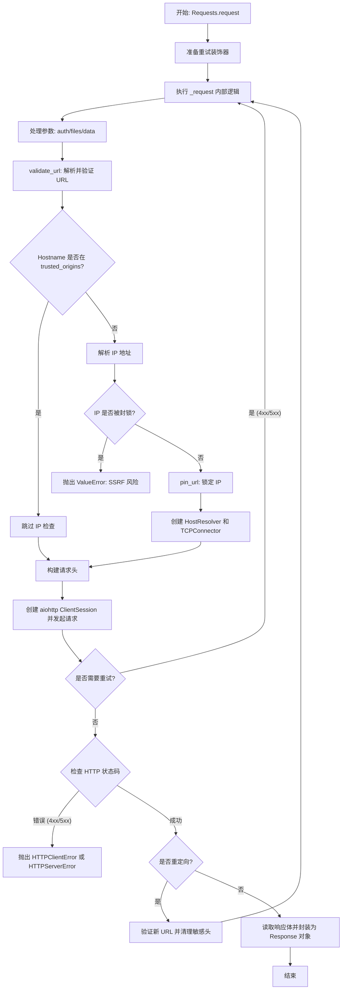

## 类结构

```
Exception
├── HTTPClientError
└── HTTPServerError
abc.AbstractResolver
└── HostResolver
Response
Requests
```

## 全局变量及字段


### `DEFAULT_USER_AGENT`
    
The default User-Agent header string used for all HTTP requests.

类型：`str`
    


### `THROTTLE_RETRY_STATUS_CODES`
    
A set of HTTP status codes that trigger automatic request retries.

类型：`set[int]`
    


### `BLOCKED_IP_NETWORKS`
    
A list of IP networks (e.g., private, loopback) that are blocked to prevent SSRF attacks.

类型：`list[ipaddress.IPv4Network | ipaddress.IPv6Network]`
    


### `ALLOWED_SCHEMES`
    
A list of allowed URL schemes (e.g., 'http', 'https').

类型：`list[str]`
    


### `HOSTNAME_REGEX`
    
A regular expression pattern for validating DNS-safe hostnames.

类型：`re.Pattern`
    


### `ClientResponse`
    
Type alias for the aiohttp ClientResponse class.

类型：`aiohttp.ClientResponse`
    


### `ClientResponseError`
    
Type alias for the aiohttp ClientResponseError class.

类型：`aiohttp.ClientResponseError`
    


### `HTTPClientError.status_code`
    
The HTTP status code associated with the client error.

类型：`int`
    


### `HTTPServerError.status_code`
    
The HTTP status code associated with the server error.

类型：`int`
    


### `HostResolver.ssl_hostname`
    
The hostname used for TLS Server Name Indication (SNI).

类型：`str`
    


### `HostResolver.ip_addresses`
    
A list of IP addresses to which the hostname should be resolved.

类型：`list[str]`
    


### `HostResolver._default`
    
The default asynchronous resolver used for hosts not matching ssl_hostname.

类型：`aiohttp.AsyncResolver`
    


### `Response.status`
    
The HTTP status code of the response.

类型：`int`
    


### `Response.headers`
    
The HTTP response headers.

类型：`aiohttp.CIMultiDictProxy`
    


### `Response.reason`
    
The HTTP reason phrase (e.g., 'OK', 'Not Found').

类型：`str | None`
    


### `Response.request_info`
    
Information about the request that generated the response.

类型：`aiohttp.RequestInfo`
    


### `Response.url`
    
The URL of the final response.

类型：`str`
    


### `Response.content`
    
The raw body content of the response as bytes.

类型：`bytes`
    


### `Requests.trusted_origins`
    
A list of hostnames that are exempt from IP blocking checks.

类型：`list[str]`
    


### `Requests.raise_for_status`
    
Whether to automatically raise an exception for HTTP 4xx/5xx responses.

类型：`bool`
    


### `Requests.extra_url_validator`
    
An optional custom function to validate or transform URLs.

类型：`Callable[[URL], URL] | None`
    


### `Requests.extra_headers`
    
Additional headers to include with every request.

类型：`dict[str, str] | None`
    


### `Requests.retry_max_wait`
    
The maximum wait time in seconds between retry attempts.

类型：`float`
    


### `Requests.retry_max_attempts`
    
The maximum number of retry attempts for a request.

类型：`int | None`
    
    

## 全局函数及方法


### `_is_ip_blocked`

检查给定的 IP 地址是否属于被阻止的网络范围（如私有网络、回环地址等）。

参数：

-   `ip`：`str`，待检查的 IP 地址字符串（支持 IPv4 或 IPv6 格式）。

返回值：`bool`，如果 IP 地址位于定义的 `BLOCKED_IP_NETWORKS` 列表中的任何一个网络范围内，则返回 `True`，否则返回 `False`。

#### 流程图

```mermaid
graph TD
    A[开始: 输入 IP 字符串] --> B[将字符串转换为 IP 地址对象]
    B --> C{遍历 BLOCKED_IP_NETWORKS}
    C --> D{当前 IP 是否在 network 范围内?}
    D -- 是 --> E[返回 True (IP 被阻塞)]
    D -- 否 --> C
    C -- 列表遍历完毕 --> F[返回 False (IP 合法)]
```

#### 带注释源码

```python
def _is_ip_blocked(ip: str) -> bool:
    """
    Checks if the IP address is in a blocked network.
    """
    # 将输入的字符串转换为 ipaddress 对象（自动识别 IPv4 或 IPv6）
    # 如果格式无效，这里会抛出 ValueError
    ip_addr = ipaddress.ip_address(ip)

    # 检查转换后的 IP 对象是否存在于全局定义的 BLOCKED_IP_NETWORKS 列表中的任意一个网络范围内
    # any() 函数会在找到第一个匹配项时返回 True，否则返回 False
    return any(ip_addr in network for network in BLOCKED_IP_NETWORKS)
```


### `_remove_insecure_headers`

当请求发生重定向时，如果新旧 URL 的协议、主机名或端口发生改变，该函数负责移除请求头中的敏感信息（如 Authorization、Proxy-Authorization 和 Cookie），以防止凭据泄露到不受信任的域。

参数：

-  `headers`：`dict`，包含 HTTP 请求头的字典。
-  `old_url`：`URL`，原始请求的 URL 对象。
-  `new_url`：`URL`，重定向后的目标 URL 对象。

返回值：`dict`，处理后的请求头字典。

#### 流程图

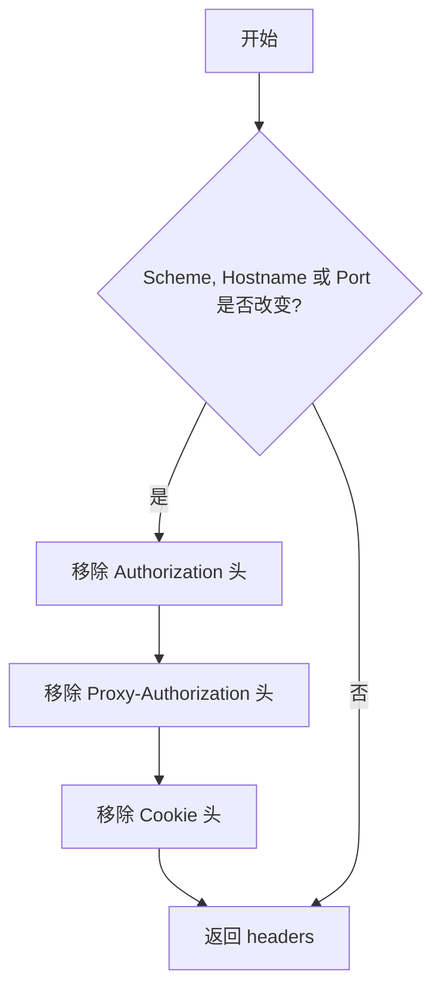

#### 带注释源码

```python
def _remove_insecure_headers(headers: dict, old_url: URL, new_url: URL) -> dict:
    """
    Removes sensitive headers (Authorization, Proxy-Authorization, Cookie)
    if the scheme/host/port of new_url differ from old_url.
    """
    # 检查协议、主机名或端口是否发生变化
    if (
        (old_url.scheme != new_url.scheme)
        or (old_url.hostname != new_url.hostname)
        or (old_url.port != new_url.port)
    ):
        # 如果目标发生变化，移除认证相关头部，防止敏感信息泄露
        headers.pop("Authorization", None)
        headers.pop("Proxy-Authorization", None)
        headers.pop("Cookie", None)
    return headers
```


### `_resolve_host`

Resolves the given hostname to a list of IP addresses, prioritizing IPv4 addresses over IPv6.

参数：

-  `hostname`：`str`，The hostname to be resolved (e.g., "example.com").

返回值：`list[str]`，A list of resolved IP address strings, sorted with IPv4 addresses first followed by IPv6 addresses.

#### 流程图

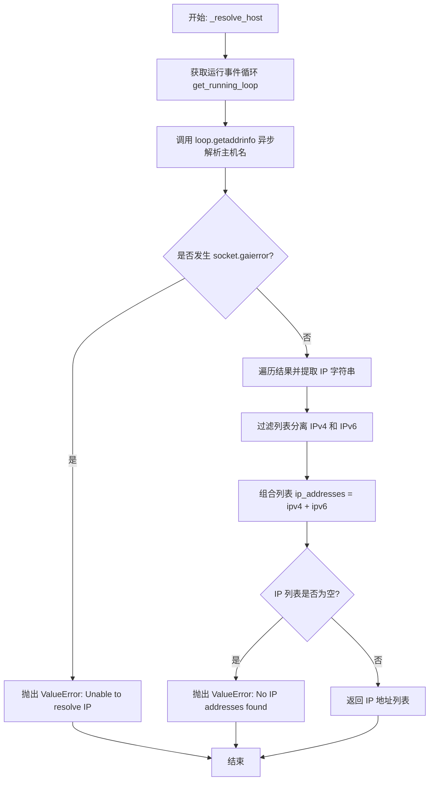

#### 带注释源码

```python
async def _resolve_host(hostname: str) -> list[str]:
    """
    Resolves the hostname to a list of IP addresses (IPv4 first, then IPv6).
    """
    # 获取当前运行的异步事件循环
    loop = asyncio.get_running_loop()
    try:
        # 调用底层的 getaddrinfo 进行 DNS 查询，不指定端口
        infos = await loop.getaddrinfo(hostname, None)
    except socket.gaierror:
        # 如果 DNS 查询失败（如域名不存在），抛出 ValueError
        raise ValueError(f"Unable to resolve IP address for hostname {hostname}")

    # 从 getaddrinfo 返回的结构中提取 IP 地址 (结构为 (family, type, proto, canonname, sockaddr))
    # sockaddr 通常是 (ip, port) 元组，此处取 [4][0] 获取 IP
    ip_list = [info[4][0] for info in infos]
    
    # 区分 IPv4 和 IPv6：IPv6 地址包含冒号
    ipv4 = [ip for ip in ip_list if ":" not in ip]
    ipv6 = [ip for ip in ip_list if ":" in ip]
    
    # 合并列表，确保 IPv4 地址排在前面
    ip_addresses = ipv4 + ipv6

    # 如果最终结果为空，说明未解析到任何地址，抛出异常
    if not ip_addresses:
        raise ValueError(f"No IP addresses found for {hostname}")
    return ip_addresses
```


### `validate_url`

该函数用于异步验证 URL 以防止服务端请求伪造（SSRF）攻击。它检查 URL 的协议（仅允许 HTTP/HTTPS）、规范化主机名（使用 IDNA 编码），并解析主机的 IP 地址以确保其不属于内网或被屏蔽的 IP 范围（除非该主机名明确在受信任列表中）。

参数：

-  `url`：`str`，待验证和解析的 URL 字符串。
-  `trusted_origins`：`list[str]`，受信任的主机名列表，如果主机名在此列表中，则跳过 IP 地址的安全检查。

返回值：`tuple[URL, bool, list[str]]`，包含三个元素的元组：第一个是经过规范化和解析后的 `ParseResult` (URL) 对象；第二个是布尔值，表示主机名是否受信任；第三个是解析出的 IP 地址列表（如果受信任则为空列表）。

#### 流程图

```mermaid
flowchart TD
    A[开始: validate_url] --> B[解析 URL]
    B --> C{协议是否为 http/https?}
    C -- 否 --> E[抛出 ValueError: 不允许的协议]
    C -- 是 --> D{主机名是否存在?}
    D -- 否 --> F[抛出 ValueError: 无效的 URL]
    D -- 是 --> G[尝试 IDNA 编码主机名]
    G --> H{编码是否成功?}
    H -- 否 --> I[抛出 ValueError: 主机名包含非法字符]
    H -- 是 --> J{主机名是否匹配正则规则?}
    J -- 否 --> I
    J -- 是 --> K{主机名是否在 trusted_origins 中?}
    K -- 是 --> L[标记 is_trusted = True, ip_addresses = []]
    K -- 否 --> M[标记 is_trusted = False]
    M --> N[调用 _resolve_host 解析 IP 地址]
    N --> O{解析是否成功?}
    O -- 否 --> P[抛出 ValueError: 无法解析 IP]
    O -- 是 --> Q[遍历所有解析出的 IP]
    Q --> R{IP 是否属于屏蔽范围?}
    R -- 是 --> S[抛出 ValueError: 访问被屏蔽的私有 IP]
    R -- 否 --> T[继续检查下一个 IP]
    T --> R
    Q -- 循环结束 --> U[保存解析出的 IP 地址列表]
    L --> V[重建 netloc 部分]
    U --> V
    V --> W[返回 解析后的URL, is_trusted, ip_addresses]
```

#### 带注释源码

```python
async def validate_url(
    url: str, trusted_origins: list[str]
) -> tuple[URL, bool, list[str]]:
    """
    Validates the URL to prevent SSRF attacks by ensuring it does not point
    to a private, link-local, or otherwise blocked IP address — unless
    the hostname is explicitly trusted.

    Returns:
        str: The validated, canonicalized, parsed URL
        is_trusted: Boolean indicating if the hostname is in trusted_origins
        ip_addresses: List of IP addresses for the host; empty if the host is trusted
    """
    parsed = parse_url(url)

    # 检查协议是否合法，仅允许 http 或 https
    if parsed.scheme not in ALLOWED_SCHEMES:
        raise ValueError(
            f"Scheme '{parsed.scheme}' is not allowed. Only HTTP/HTTPS are supported."
        )

    # 验证主机名是否存在
    if not parsed.hostname:
        raise ValueError("Invalid URL: No hostname found.")

    # 使用 IDNA 编码处理国际化域名，防止 Unicode 域名攻击
    try:
        ascii_hostname = idna.encode(parsed.hostname).decode("ascii")
    except idna.IDNAError:
        raise ValueError("Invalid hostname with unsupported characters.")

    # 使用正则表达式检查主机名字符是否合法
    if not HOSTNAME_REGEX.match(ascii_hostname):
        raise ValueError("Hostname contains invalid characters.")

    # 检查主机名是否在受信任列表中
    is_trusted = ascii_hostname in trusted_origins

    # 如果不受信任，则需要进行 IP 地址的详细检查
    ip_addresses: list[str] = []
    if not is_trusted:
        # 异步解析主机名对应的所有 IP 地址
        ip_addresses = await _resolve_host(ascii_hostname)

        # 检查解析出的每个 IP 是否属于被屏蔽的网络段（如内网、回环地址等）
        for ip_str in ip_addresses:
            if _is_ip_blocked(ip_str):
                raise ValueError(
                    f"Access to blocked or private IP address {ip_str} "
                    f"for hostname {ascii_hostname} is not allowed."
                )

    # 重建 netloc 部分，使用 IDNA 编码后的主机名并保留端口号
    netloc = ascii_hostname
    if parsed.port:
        netloc = f"{ascii_hostname}:{parsed.port}"

    return (
        URL(
            parsed.scheme,
            netloc,
            quote(parsed.path, safe="/%:@"),  # 对路径进行安全编码
            parsed.params,
            parsed.query,
            parsed.fragment,
        ),
        is_trusted,
        ip_addresses,
    )
```


### `parse_url`

该函数用于对输入的 URL 字符串进行规范化处理和解析。它会清理 URL 中的多余字符，统一路径分隔符，并在缺少协议头时默认添加 `http://`，最终返回解析后的 URL 对象。

参数：

- `url`：`str`，需要进行解析和规范化的原始 URL 字符串。

返回值：`URL` (即 `urllib.parse.ParseResult`)，解析并规范化后的 URL 对象。

#### 流程图

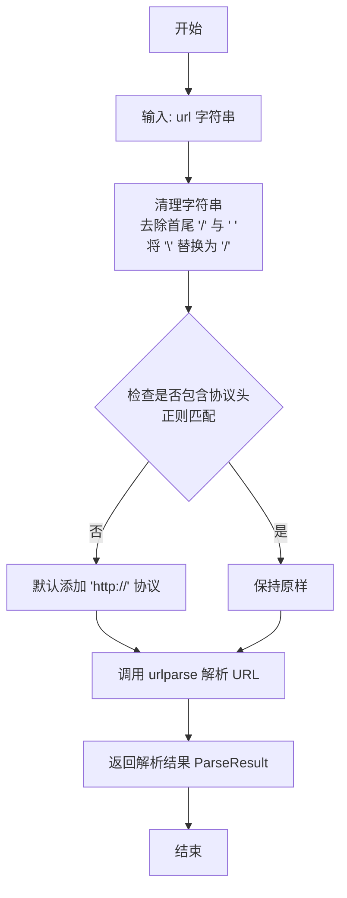

#### 带注释源码

```python
def parse_url(url: str) -> URL:
    """Canonicalizes and parses a URL string."""
    # 去除字符串首尾的斜杠和空格，并将所有的反斜杠替换为正斜杠，以标准化路径格式
    url = url.strip("/ ").replace("\\", "/")

    # 检查 URL 是否符合 scheme:// 的格式（如 http://）
    # 如果不包含协议头，则默认添加 http:// 以确保解析正确
    if not re.match(r"[a-z0-9+.\-]+://", url):
        url = f"http://{url}"

    # 使用标准库 urlparse 解析处理后的 URL 字符串并返回结果
    return urlparse(url)
```


### `pin_url`

该函数通过将URL中的主机名替换为指定的IP地址，来防止DNS重绑定攻击。它会处理IPv4和IPv6的格式差异，并保留原始URL中的端口号。

参数：

-  `url`：`URL`，需要被固定的原始URL对象（来自urllib.parse）。
-  `ip_addresses`：`Optional[list[str]]`，对应URL主机的IP地址列表。如果为None，函数内部将其置为空列表（注意：逻辑上后续依赖列表非空）。

返回值：`URL`，主机名已被替换为指定IP地址的新URL对象。

#### 流程图

```mermaid
graph TD
    A[开始: pin_url] --> B{检查 url.hostname 是否存在?}
    B -- 否 --> C[抛出 ValueError 异常]
    B -- 是 --> D{检查 ip_addresses 是否存在?}
    D -- 否/空 --> E[将 ip_addresses 初始化为空列表]
    D -- 是 --> F[选取列表第一个 IP: pinned_ip]
    E --> F
    F --> G{判断是否为 IPv6?}
    G -- 是 (包含 ':') --> H[设置 pinned_netloc 为 [pinned_ip]]
    G -- 否 --> I[设置 pinned_netloc 为 pinned_ip]
    H --> J{检查 url.port 是否存在?}
    I --> J
    J -- 是 --> K[在 pinned_netloc 后追加 :端口]
    J -- 否 --> L[保持 pinned_netloc 不变]
    K --> M[构建并返回新的 URL 对象]
    L --> M
```

#### 带注释源码

```python
def pin_url(url: URL, ip_addresses: Optional[list[str]] = None) -> URL:
    """
    Pins a URL to a specific IP address to prevent DNS rebinding attacks.

    Args:
        url: The original URL
        ip_addresses: List of IP addresses corresponding to the URL's host

    Returns:
        pinned_url: The URL with hostname replaced with IP address
    """
    # 检查URL是否包含主机名，如果没有则抛出异常
    if not url.hostname:
        raise ValueError(f"URL has no hostname: {url}")

    # 如果没有提供IP地址列表，初始化为空列表
    # 注意：这里逻辑上如果为空，后续访问索引[0]会引发错误，预期调用方应传入已解析的列表
    if not ip_addresses:
        # Resolve all IP addresses for the hostname
        # (This call is blocking; ensure to call async _resolve_host before if possible)
        ip_addresses = []
        # You may choose to raise or call synchronous resolve here; for simplicity, leave empty.

    # 选择列表中的第一个IP作为固定IP，用于SSRF防御
    pinned_ip = ip_addresses[0]

    # 如果是IPv6地址（包含冒号），则需要用方括号括起来
    if ":" in pinned_ip:
        pinned_netloc = f"[{pinned_ip}]"
    else:
        pinned_netloc = pinned_ip

    # 如果原始URL包含端口号，将其追加到新的网络位置字符串中
    if url.port:
        pinned_netloc += f":{url.port}"

    # 返回一个新的URL对象，替换了网络位置部分，保留路径、参数等
    return URL(
        url.scheme,
        pinned_netloc,
        url.path,
        url.params,
        url.query,
        url.fragment,
    )
```


### `_return_last_result`

确保在重试停止时返回最后一次尝试的结果。该函数通常作为重试机制（如 tenacity）的回调函数，用于在重试次数耗尽或其他停止条件触发时，返回最后一次执行产生的响应对象或抛出最后一次执行的异常。

参数：

- `retry_state`：`RetryCallState`，tenacity 库维护的重试状态对象，包含了关于重试历史和最后一次尝试结果（Future 对象）的信息。

返回值：`Response`，最后一次 HTTP 请求尝试所返回的响应对象（如果最后一次尝试成功）。

#### 流程图

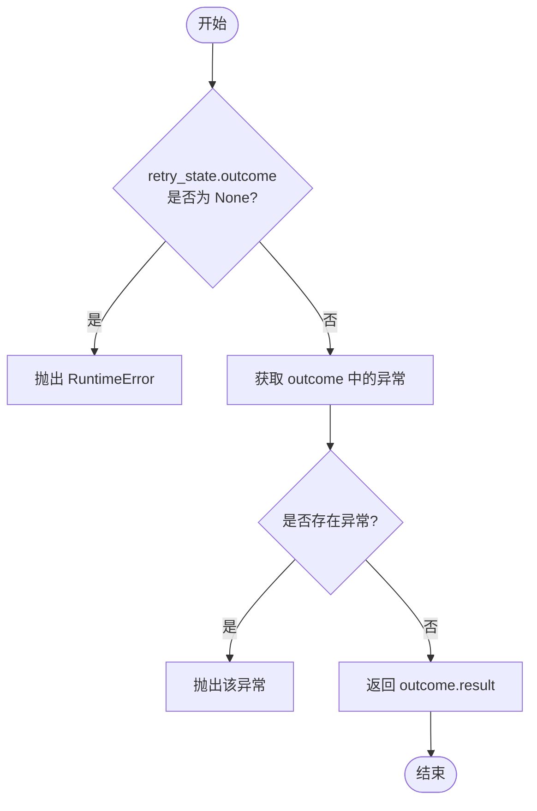

#### 带注释源码

```python
def _return_last_result(retry_state: RetryCallState) -> "Response":
    """
    Ensure the final attempt's response is returned when retrying stops.
    确保当重试停止时（例如达到最大重试次数），返回最后一次尝试的响应结果。
    """
    # 检查重试状态中的 outcome 是否存在，如果不存在说明状态异常
    if retry_state.outcome is None:
        raise RuntimeError("Retry state is missing an outcome.")

    # 尝试从 outcome 中获取异常对象
    exception = retry_state.outcome.exception()
    
    # 如果最后一次尝试抛出了异常，则重新抛出该异常
    if exception is not None:
        raise exception

    # 如果没有异常，说明最后一次尝试成功，返回其结果（Response 对象）
    return retry_state.outcome.result()
```


### `HTTPClientError.__init__`

初始化 `HTTPClientError` 异常对象，用于处理 HTTP 4xx 客户端错误。该方法接收错误消息和状态码，并将其存储在实例中以便后续处理。

参数：

-  `message`：`str`，描述错误的详细消息字符串。
-  `status_code`：`int`，导致该错误的 HTTP 状态码（范围 400-499）。

返回值：`None`，构造函数不返回任何值。

#### 流程图

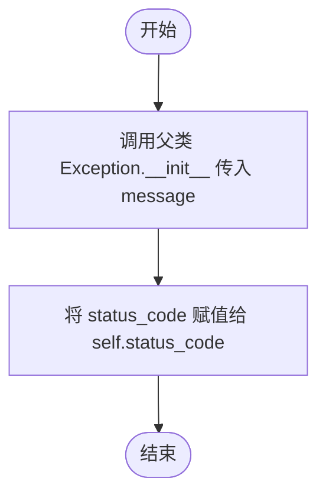

#### 带注释源码

```python
def __init__(self, message: str, status_code: int):
    # 调用父类 Exception 的初始化方法，设置基本的错误消息
    super().__init__(message)
    # 将 HTTP 状态码保存为实例属性，以便捕获异常时可以访问具体的状态码
    self.status_code = status_code
```


### `HTTPServerError.__init__`

该方法是 `HTTPServerError` 异常类的构造函数，用于初始化一个代表 HTTP 5xx 服务器错误的异常实例。它接收错误消息和状态码，将消息传递给父类 `Exception` 处理，并将状态码存储在实例属性中以便后续逻辑使用。

参数：

- `self`：`HTTPServerError`，表示异常实例本身。
- `message`：`str`，描述错误原因或详情的字符串消息。
- `status_code`：`int`，表示具体服务器错误的 HTTP 状态码（通常在 500-599 范围内）。

返回值：`None`，该构造函数没有返回值。

#### 流程图

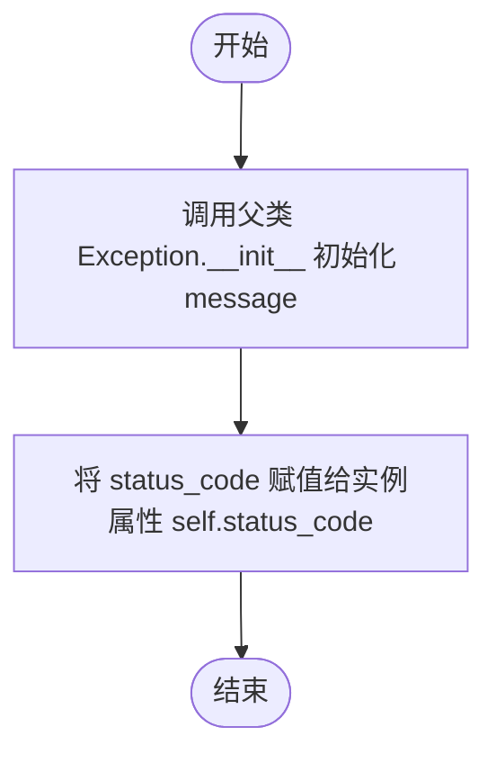

#### 带注释源码

```python
def __init__(self, message: str, status_code: int):
    # 调用父类 Exception 的构造函数，传入错误消息以完成基础异常初始化
    super().__init__(message)
    # 将传入的 HTTP 状态码保存为实例变量，方便捕获异常时获取具体的错误码
    self.status_code = status_code
```


### `HostResolver.resolve`

自定义的异步主机解析方法，继承自 `aiohttp.abc.AbstractResolver`。当请求解析的主机名与初始化时指定的 SSL 主机名一致时，该方法直接返回预置的 IP 地址列表，从而绕过标准的 DNS 查询流程。这实现了在保持 TLS SNI（服务器名称指示）匹配原始主机名的同时，强制将连接指向特定的 IP 地址，有助于防止 DNS 重绑定攻击或 SSRF。如果主机名不匹配，则委托给默认的 `aiohttp.AsyncResolver` 进行处理。

参数：

- `host`：`str`，需要解析的目标主机名。
- `port`：`int`，端口号，默认为 0。
- `family`：`socket.AddressFamily`，地址族（例如 `socket.AF_INET` 代表 IPv4），默认为 `socket.AF_INET`。

返回值：`list[dict[str, Any]]`，包含解析结果信息的字典列表。每个字典包含 `hostname`（解析的主机名）、`host`（IP地址）、`port`、`family`、`proto`（协议）、`flags`（标志位）等键值。

#### 流程图

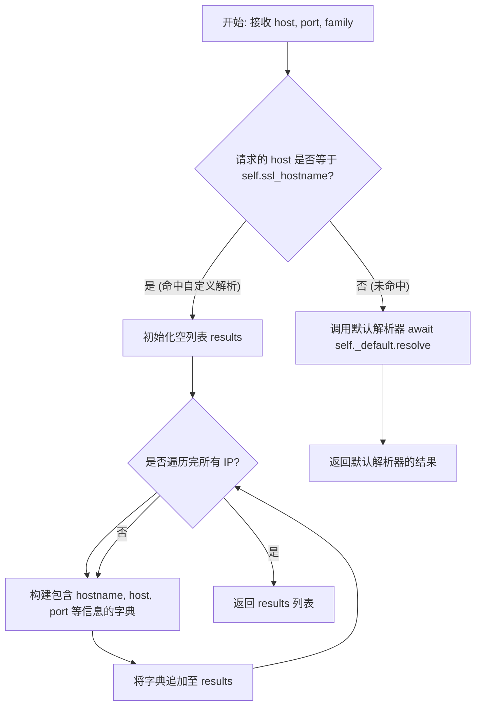

#### 带注释源码

```python
    async def resolve(self, host, port=0, family=socket.AF_INET):
        # 检查当前请求解析的主机名是否为我们在构造函数中指定的 SSL 主机名
        if host == self.ssl_hostname:
            # 如果是，初始化一个空列表用于存放解析结果
            results = []
            # 遍历初始化时传入的 IP 地址列表
            for ip in self.ip_addresses:
                # 为每个 IP 构建一个符合 aiohttp 期望的解析结果字典
                results.append(
                    {
                        "hostname": self.ssl_hostname, # 原始主机名（用于 SNI）
                        "host": ip,                     # 实际连接的 IP 地址
                        "port": port,                   # 端口
                        "family": family,               # 地址族
                        "proto": 0,                     # 协议（0 表示任意）
                        "flags": socket.AI_NUMERICHOST, # 标志：表明 host 是数字地址（IP），防止再次 DNS 查询
                    }
                )
            # 返回构造的自定义解析结果列表
            return results
        
        # 如果请求的主机名不是我们要处理的目标，则使用默认的异步解析器进行标准 DNS 解析
        return await self._default.resolve(host, port, family)
```


### `HostResolver.close`

关闭 `HostResolver` 实例内部持有的默认 aiohttp 异步解析器，释放相关系统资源。

参数：

- 无

返回值：`None`，无返回值。

#### 流程图

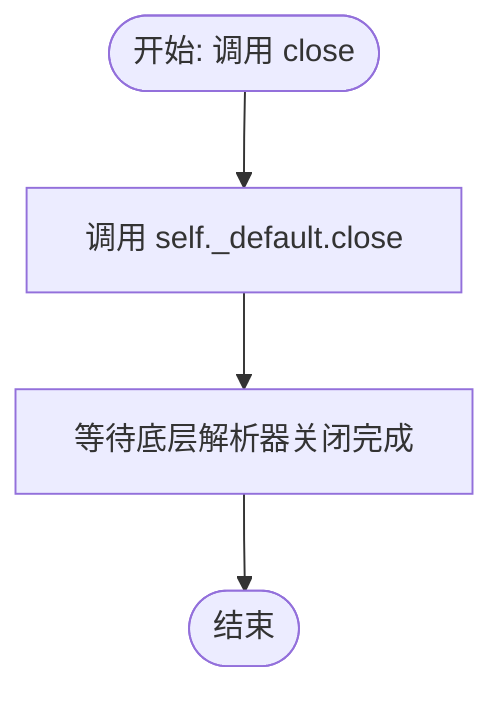

#### 带注释源码

```python
    async def close(self):
        # 调用 aiohttp 默认解析器的 close 方法
        # 用于清理连接和释放内部资源
        await self._default.close()
```


### `Response.json`

解析响应体内容并将其作为 JSON 对象返回。

参数：

- `encoding`：`str | None`，解码字节流时使用的字符编码，如果为 None 则默认使用 'utf-8'。
- `**kwargs`：`Any`，传递给底层 JSON 解析器的额外关键字参数。

返回值：`dict`，解析后的 Python 字典对象。

#### 流程图

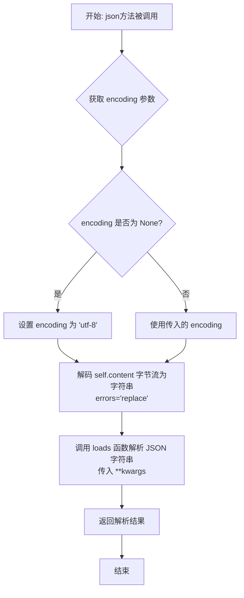

#### 带注释源码

```python
    def json(self, encoding: str | None = None, **kwargs) -> dict:
        """
        Parse the body as JSON and return the resulting Python object.
        """
        # 调用自定义的 loads 函数解析 JSON
        # self.content 是预先读取的原始字节数据 (bytes)
        # decode 方法将字节转换为字符串，如果未指定 encoding 则默认使用 "utf-8"
        # errors="replace" 表示遇到解码错误时用占位符替换，而不是抛出异常
        return loads(
            self.content.decode(encoding or "utf-8", errors="replace"), **kwargs
        )
```


### `Response.text`

将响应体的字节数据解码为字符串。如果未指定编码，则尝试从Content-Type响应头中推断字符集；如果未找到字符集，则默认使用utf-8编码。

参数：

-  `encoding`：`str | None`，用于解码内容的字符集编码。如果为None，则尝试从headers自动检测。

返回值：`str`，解码后的文本内容。

#### 流程图

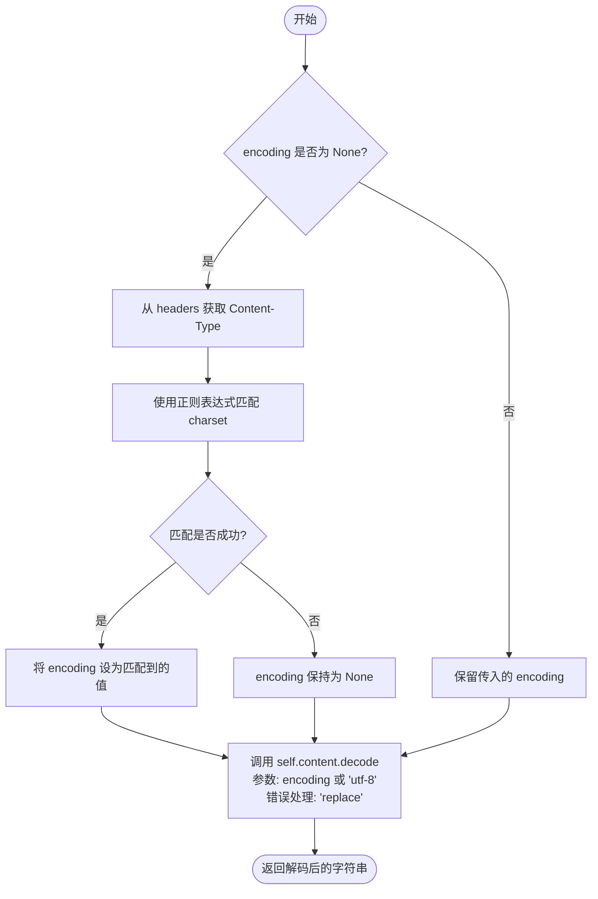

#### 带注释源码

```python
    def text(self, encoding: str | None = None) -> str:
        """
        Decode the body to a string.  Encoding is guessed from the
        Content-Type header if not supplied.
        """
        # 如果未指定编码参数
        if encoding is None:
            # 尝试从响应头获取 Content-Type 字段
            ctype = self.headers.get("content-type", "")
            # 使用正则表达式查找 charset=... 的模式（不区分大小写）
            match = re.search(r"charset=([^\s;]+)", ctype, flags=re.I)
            # 如果找到，使用匹配到的编码；否则保持 None
            encoding = match.group(1) if match else None
        
        # 对字节内容 self.content 进行解码
        # 如果 encoding 为 None，默认使用 'utf-8'
        # errors='replace' 意味着遇到解码错误时用替换字符（通常为 �）代替，而不是抛出异常
        return self.content.decode(encoding or "utf-8", errors="replace")
```


### `Response.ok`

该属性用于检查HTTP响应的状态码是否表示成功，即状态码是否在200到299之间。

参数：

- `self`：`Response`，当前Response类的实例对象。

返回值：`bool`，如果状态码在200-299范围内返回True，否则返回False。

#### 流程图

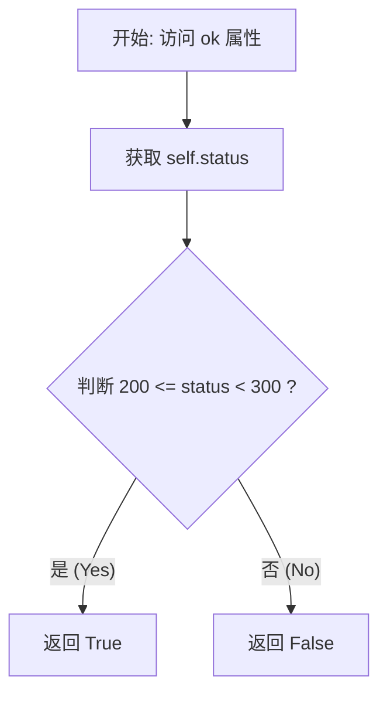

#### 带注释源码

```python
    @property
    def ok(self) -> bool:
        # 检查状态码是否在 2xx 范围内 (200-299)
        return 200 <= self.status < 300
```


### `Requests.__init__`

初始化Requests客户端实例，配置受信任的来源列表、重试策略、额外的URL验证器以及HTTP请求头，为防止SSRF攻击做准备。

参数：

-  `trusted_origins`：`list[str] | None`，允许绕过SSRF检查的主机名（URL）列表。
-  `raise_for_status`：`bool`，当响应状态码为4xx或5xx时是否自动抛出异常，默认为True。
-  `extra_url_validator`：`Callable[[URL], URL] | None`，用于在请求前对URL进行额外验证或修改的自定义回调函数。
-  `extra_headers`：`dict[str, str] | None`，所有请求中默认包含的额外HTTP头。
-  `retry_max_wait`：`float`，重试等待时间的最大上限（秒），默认为300.0秒。
-  `retry_max_attempts`：`int | None`，最大重试次数，设为None表示无限重试（取决于其他停止条件），若不为None则必须大于等于1。

返回值：`None`，该方法为构造函数，无返回值。

#### 流程图

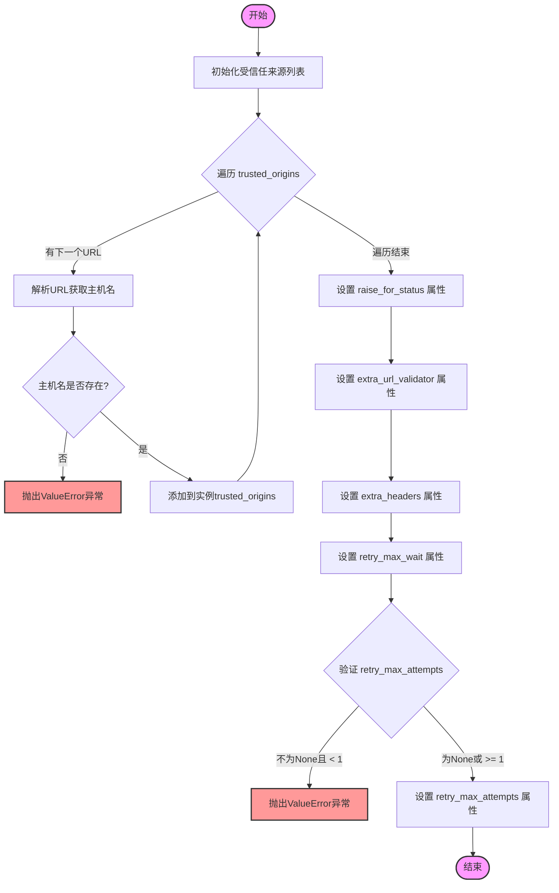

#### 带注释源码

```python
def __init__(
    self,
    trusted_origins: list[str] | None = None,
    raise_for_status: bool = True,
    extra_url_validator: Callable[[URL], URL] | None = None,
    extra_headers: dict[str, str] | None = None,
    retry_max_wait: float = 300.0,
    retry_max_attempts: int | None = None,
):
    # 初始化受信任的主机名列表
    self.trusted_origins = []
    for url in trusted_origins or []:
        # 从提供的URL中提取主机名部分
        hostname = urlparse(url).hostname
        # 确保提取到的主机名是有效的，否则抛出异常
        if not hostname:
            raise ValueError(f"Invalid URL: Unable to determine hostname of {url}")
        self.trusted_origins.append(hostname)

    # 存储是否自动检查状态码并抛出异常的标志
    self.raise_for_status = raise_for_status
    # 存储自定义的URL验证器回调函数
    self.extra_url_validator = extra_url_validator
    # 存储额外的HTTP请求头
    self.extra_headers = extra_headers
    # 存储重试的最大等待时间
    self.retry_max_wait = retry_max_wait
    
    # 验证重试次数的有效性（如果不为None，必须 >= 1）
    if retry_max_attempts is not None and retry_max_attempts < 1:
        raise ValueError("retry_max_attempts must be None or >= 1")
    # 存储最大重试次数
    self.retry_max_attempts = retry_max_attempts
```


### `Requests.request`

该方法是 `Requests` 类的核心请求入口，负责配置并执行带有重试机制的HTTP请求。它使用 `tenacity` 库对底层的 `_request` 方法进行包装，实现了基于状态码的自动重试（如遇到限流或服务器错误时），并支持指数退避策略。它处理了最大重试次数的限制，并在重试耗尽时返回最后一次尝试的结果。

参数：

-  `method`：`str`，HTTP 请求方法（如 "GET", "POST" 等）。
-  `url`：`str`，目标请求地址。
-  `headers`：`Optional[dict]`，请求头字典。
-  `files`：`list[tuple[str, tuple[str, BytesIO, str]]] | None`，要上传的文件列表，格式为 (字段名, (文件名, 文件流, 内容类型))。
-  `data`：`Any | None`，请求体数据，通常用于表单提交或原始字节。
-  `json`：`Any | None`，JSON 格式的请求体数据。
-  `allow_redirects`：`bool`，是否自动跟随重定向，默认为 True。
-  `max_redirects`：`int`，最大重定向次数，默认为 10。
-  `**kwargs`：`Any`，传递给底层 aiohttp 请求的其他额外关键字参数。

返回值：`Response`，封装了 HTTP 响应状态、头部和内容的自定义响应对象。

#### 流程图

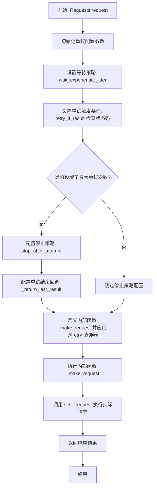

#### 带注释源码

```python
    async def request(
        self,
        method: str,
        url: str,
        *,
        headers: Optional[dict] = None,
        files: list[tuple[str, tuple[str, BytesIO, str]]] | None = None,
        data: Any | None = None,
        json: Any | None = None,
        allow_redirects: bool = True,
        max_redirects: int = 10,
        **kwargs,
    ) -> Response:
        # 配置重试机制的基础参数
        retry_kwargs: dict[str, Any] = {
            # 设置等待策略：指数退避并增加随机抖动，最大等待时间由 self.retry_max_wait 控制
            "wait": wait_exponential_jitter(max=self.retry_max_wait),
            # 设置重试触发条件：仅当返回的 Response 状态码在限流/错误列表中时才重试
            "retry": retry_if_result(lambda r: r.status in THROTTLE_RETRY_STATUS_CODES),
            # 发生异常时重新抛出，不吞并异常
            "reraise": True,
        }

        # 如果在构造函数中指定了最大重试次数
        if self.retry_max_attempts is not None:
            # 添加停止条件：达到最大尝试次数后停止
            retry_kwargs["stop"] = stop_after_attempt(self.retry_max_attempts)
            # 添加错误回调：确保即使重试停止，也返回最后一次请求的结果（无论是成功还是失败）
            retry_kwargs["retry_error_callback"] = _return_last_result

        # 定义内部函数并应用 tenacity 的 @retry 装饰器
        @retry(**retry_kwargs)
        async def _make_request() -> Response:
            # 实际的请求逻辑委托给 self._request 方法执行
            return await self._request(
                method=method,
                url=url,
                headers=headers,
                files=files,
                data=data,
                json=json,
                allow_redirects=allow_redirects,
                max_redirects=max_redirects,
                **kwargs,
            )

        # 执行带有重试逻辑的请求
        return await _make_request()
```


### `Requests._request`

执行底层的异步HTTP请求，处理文件上传、SSRF防护（IP钉扎）、请求头管理、手动重定向跟随以及错误状态检查。

参数：

-  `method`：`str`，HTTP请求方法（如 "GET", "POST" 等）。
-  `url`：`str`，请求的目标URL字符串。
-  `headers`：`Optional[dict]`，可选的请求头字典。
-  `files`：`list[tuple[str, tuple[str, BytesIO, str]]] | None`，可选的要上传的文件列表，格式为 (字段名, (文件名, 文件对象, 内容类型))。
-  `data`：`Any | None`，可选的请求体数据（通常用于表单数据或原始字节），如果提供了 `json` 则不能同时使用。
-  `json`：`Any | None`，可选的JSON序列化对象，用于作为请求体发送。
-  `allow_redirects`：`bool`，是否自动跟随HTTP重定向，默认为 True。
-  `max_redirects`：`int`，允许的最大重定向次数，默认为 10。
-  `**kwargs`：`Any`，传递给底层 `aiohttp` 请求的其他关键字参数（如 auth, timeout 等）。

返回值：`Response`，自定义的响应对象，包含状态码、头部、响应体内容等信息。

#### 流程图

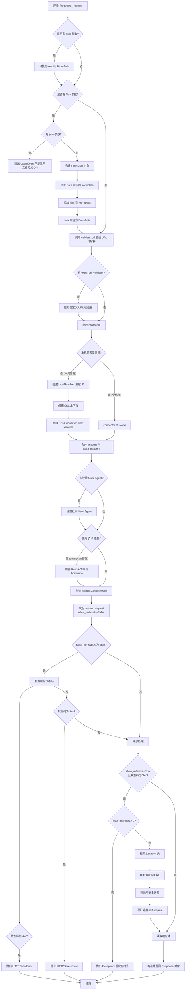

#### 带注释源码

```python
    async def _request(
        self,
        method: str,
        url: str,
        *,
        headers: Optional[dict] = None,
        files: list[tuple[str, tuple[str, BytesIO, str]]] | None = None,
        data: Any | None = None,
        json: Any | None = None,
        allow_redirects: bool = True,
        max_redirects: int = 10,
        **kwargs,
    ) -> Response:
        # 如果传入 auth 是元组，将其转换为 aiohttp.BasicAuth 对象
        if "auth" in kwargs and isinstance(kwargs["auth"], tuple):
            kwargs["auth"] = aiohttp.BasicAuth(*kwargs["auth"])

        # 处理文件上传逻辑
        if files is not None:
            # 禁止同时使用 json 和 files
            if json is not None:
                raise ValueError(
                    "Cannot mix file uploads with JSON body; "
                    "use 'data' for extra form fields instead."
                )

            # 创建 FormData 对象，不自动引用字段
            form = FormData(quote_fields=False)
            # 添加普通表单字段
            if isinstance(data, dict):
                for k, v in data.items():
                    form.add_field(k, str(v))
            elif data is not None:
                raise ValueError(
                    "When uploading files, 'data' must be a dict of form fields."
                )

            # 添加文件部分
            for field_name, (filename, fh, content_type) in files:
                form.add_field(
                    name=field_name,
                    value=fh,
                    filename=filename,
                    content_type=content_type or "application/octet-stream",
                )

            # 将 data 替换为构建好的 form 对象
            data = form

        # 验证 URL，解析主机名，检查是否受信任，并解析 IP 地址
        parsed_url, is_trusted, ip_addresses = await validate_url(
            url, self.trusted_origins
        )

        # 如果提供了自定义的 URL 验证器，应用它
        if self.extra_url_validator is not None:
            parsed_url = self.extra_url_validator(parsed_url)

        # 获取主机名
        hostname = parsed_url.hostname
        if hostname is None:
            raise ValueError(f"Invalid URL: Unable to determine hostname of {url}")

        original_url = parsed_url.geturl()
        connector: Optional[aiohttp.TCPConnector] = None
        
        # 如果主机不受信任，进行 IP 钉扎以防止 DNS 重绑定攻击
        if not is_trusted:
            # 使用自定义解析器，将连接指向 IP 但保留 SSL SNI 为原始主机名
            resolver = HostResolver(ssl_hostname=hostname, ip_addresses=ip_addresses)
            ssl_context = ssl.create_default_context()
            connector = aiohttp.TCPConnector(resolver=resolver, ssl=ssl_context)
            
        session_kwargs = {}
        if connector:
            session_kwargs["connector"] = connector

        # 合并请求头
        req_headers = dict(headers) if headers else {}
        if self.extra_headers is not None:
            req_headers.update(self.extra_headers)

        # 如果没有提供 User-Agent，设置默认值
        if "User-Agent" not in req_headers and "user-agent" not in req_headers:
            req_headers["User-Agent"] = DEFAULT_USER_AGENT

        # 如果使用了 IP 连接，手动设置 Host 头部为原始域名
        if connector:
            req_headers["Host"] = hostname

        # 设置 max_field_size 以处理长头部
        session_kwargs["max_field_size"] = 16384

        # 创建 aiohttp ClientSession 并发起请求
        async with aiohttp.ClientSession(**session_kwargs) as session:
            # allow_redirects=False 以便手动处理重定向
            async with session.request(
                method,
                parsed_url.geturl(),
                headers=req_headers,
                allow_redirects=False,
                data=data,
                json=json,
                **kwargs,
            ) as response:

                # 错误处理逻辑
                if self.raise_for_status:
                    try:
                        response.raise_for_status()
                    except ClientResponseError as e:
                        body = await response.read()
                        error_message = f"HTTP {response.status} Error: {response.reason}, Body: {body.decode(errors='replace')}"

                        # 根据状态码抛出特定异常
                        if 400 <= response.status <= 499:
                            raise HTTPClientError(error_message, response.status) from e
                        elif 500 <= response.status <= 599:
                            raise HTTPServerError(error_message, response.status) from e
                        else:
                            raise Exception(error_message) from e

                # 手动重定向逻辑
                if allow_redirects and response.status in (301, 302, 303, 307, 308):
                    if max_redirects <= 0:
                        raise Exception("Too many redirects.")

                    location = response.headers.get("Location")
                    if not location:
                        return Response(
                            response=response,
                            url=original_url,
                            body=await response.read(),
                        )

                    # 解析重定向的目标 URL
                    redirect_url = urlparse(urljoin(parsed_url.geturl(), location))
                    # 移除敏感的认证头部，防止泄露到第三方
                    new_headers = _remove_insecure_headers(
                        req_headers, parsed_url, redirect_url
                    )

                    # 递归调用 request 方法跟随重定向
                    return await self.request(
                        method,
                        redirect_url.geturl(),
                        headers=new_headers,
                        allow_redirects=allow_redirects,
                        max_redirects=max_redirects - 1,
                        files=files,
                        data=data,
                        json=json,
                        **kwargs,
                    )

                # 尝试将响应 URL 重置为原始主机名（方便调试）
                if parsed_url.hostname != hostname:
                    try:
                        response.url = original_url  # type: ignore
                    except Exception:
                        pass

                # 读取响应体并返回自定义 Response 对象
                return Response(
                    response=response,
                    url=original_url,
                    body=await response.read(),
                )
```


### `Requests.get`

该方法用于发起异步的 HTTP GET 请求。它是 `Requests` 类提供的辅助方法，内部通过调用通用的 `request` 方法，将 HTTP 方法固定为 "GET"，并将所有参数透传，最终返回包含响应数据的 `Response` 对象。

参数：

- `url`：`str`，目标请求地址。
- `args`：`Any`，可变位置参数，透传给 `self.request` 方法（通常为空）。
- `kwargs`：`Any`，可变关键字参数，透传给 `self.request` 方法，包括 headers、params、allow_redirects 等。

返回值：`Response`，封装了 HTTP 响应状态、头部和内容的对象。

#### 流程图

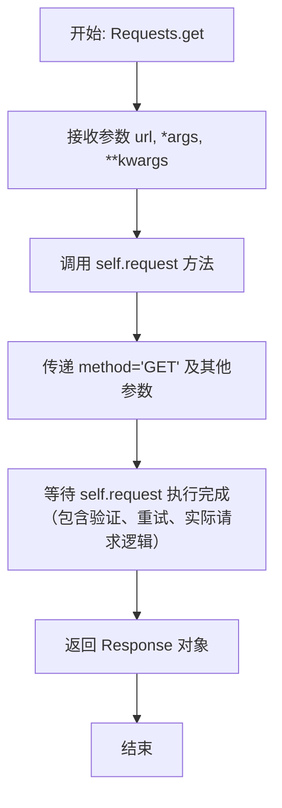

#### 带注释源码

```python
async def get(self, url: str, *args, **kwargs) -> Response:
    # 调用通用的 request 方法，将 HTTP 方法指定为 "GET"
    # *args 和 **kwargs 允许传递任意额外的参数给底层 request 方法
    return await self.request("GET", url, *args, **kwargs)
```


### `Requests.post`

异步发送 HTTP POST 请求。该方法作为通用 `request` 方法的包装器，将 HTTP 方法固定为 "POST"，并支持自动重试、SSRF 防护、URL 验证、IP 固定和安全头部处理等核心功能。

参数：

- `url`：`str`，请求的目标 URL 地址。
- `*args`：`Any`，传递给内部 `request` 方法的可变位置参数。
- `**kwargs`：`Any`，传递给内部 `request` 方法的可变关键字参数。常用参数包括：
    - `headers` (`dict | None`)：请求头字典。
    - `data` (`Any | None`)：请求体数据（如表单数据）。
    - `json` (`Any | None`)：JSON 格式的请求体数据。
    - `files` (`list[tuple[str, tuple[str, BytesIO, str]]] | None`)：要上传的文件列表。
    - `allow_redirects` (`bool`)：是否自动跟随重定向，默认为 True。
    - `max_redirects` (`int`)：最大重定向次数，默认为 10。

返回值：`Response`，包含响应状态码、头部和正文的响应对象。该对象封装了 `aiohttp.ClientResponse` 并提供了 `json()` 和 `text()` 等便捷方法用于读取内容。

#### 流程图

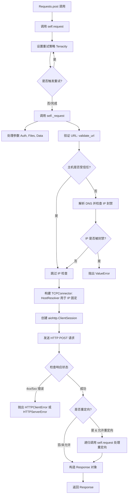

#### 带注释源码

```python
async def post(self, url: str, *args, **kwargs) -> Response:
    """
    发送 HTTP POST 请求的异步方法。
    
    Args:
        url (str): 请求的 URL。
        *args: 传递给 `request` 方法的额外位置参数。
        **kwargs: 传递给 `request` 方法的额外关键字参数，如 headers, data, json 等。

    Returns:
        Response: 包含响应数据的 Response 对象。
    """
    # 直接调用类内部的通用 request 方法，并将 HTTP 方法指定为 "POST"
    # 所有具体的请求逻辑（如重试、验证、实际发送）都在 request 方法中实现
    return await self.request("POST", url, *args, **kwargs)
```


### `Requests.put`

发送 HTTP PUT 请求到指定的 URL。该方法是一个便捷函数，内部通过调用通用的 `request` 方法来实现，并将 HTTP 方法指定为 "PUT"，所有额外的参数均透传给底层请求处理逻辑。

参数：

-   `url`: `str`，请求的目标 URL 地址。
-   `*args`: `Any`，传递给底层 `request` 方法的额外位置参数。
-   `**kwargs`: `Any`，传递给底层 `request` 方法的额外关键字参数（例如 headers, data, json, allow_redirects 等）。

返回值：`Response`，包含服务器响应信息的对象，包括状态码、响应头和响应体。

#### 流程图

```mermaid
flowchart TD
    Start([开始: Requests.put]) --> Input[接收参数: url, *args, **kwargs]
    Input --> Invoke[调用 self.request 方法<br>指定 method 参数为 'PUT']
    Invoke --> Await[等待异步请求完成]
    Await --> Result[获取 Response 对象]
    Result --> End([结束: 返回 Response])
```

#### 带注释源码

```python
    async def put(self, url: str, *args, **kwargs) -> Response:
        # 调用通用的 request 方法，将 HTTP 方法类型硬编码为 "PUT"
        # url 参数作为位置参数传递
        # 其他所有参数通过 *args 和 **kwargs 解包传递，保持接口灵活性
        return await self.request("PUT", url, *args, **kwargs)
```


### `Requests.delete`

发送异步 HTTP DELETE 请求。这是一个便捷方法，封装了通用的 `Requests.request` 方法，将 HTTP 方法指定为 "DELETE"。该方法支持通过参数传递请求头、数据体等配置，并继承了底层请求逻辑中的重试机制、SSRF 防护及 URL 验证功能。

参数：

- `url`：`str`，请求的目标 URL 地址。
- `*args`：`Any`，传递给底层 `request` 方法的可变位置参数。
- `**kwargs`：`Any`，传递给底层 `request` 方法的可变关键字参数（如 headers、json、timeout 等）。

返回值：`Response`，包含服务器响应状态、头部信息和响应体的自定义响应对象。

#### 流程图

```mermaid
flowchart TD
    Start([开始]) --> CallMethod[调用 self.request 方法<br/>传入 method='DELETE' 及其他参数]
    CallMethod --> HandleLogic[执行底层请求逻辑<br/>验证URL、重试、发送请求]
    HandleLogic --> ReturnResponse([返回 Response 对象])
    ReturnResponse --> End([结束])
```

#### 带注释源码

```python
async def delete(self, url: str, *args, **kwargs) -> Response:
    """
    发送 HTTP DELETE 请求的异步方法。

    :param url: 请求的 URL
    :param args: 传递给 request 方法的额外位置参数
    :param kwargs: 传递给 request 方法的额外关键字参数
    :return: Response 对象
    """
    # 调用通用的 request 方法，指定 HTTP 方法为 "DELETE"
    # 并透传 url 和其他所有参数
    return await self.request("DELETE", url, *args, **kwargs)
```


### `Requests.head`

异步发送 HTTP HEAD 请求到指定的 URL。该方法是对通用 `request` 方法的封装，将 HTTP 方法指定为 "HEAD"，并保留了所有底层的安全验证（SSRF 防护）、重试逻辑和错误处理机制。

参数：

-  `url`：`str`，请求的目标 URL 地址。
-  `*args`：`Any`，传递给底层 `self.request` 方法的额外位置参数（如 headers, allow_redirects 等）。
-  `**kwargs`：`Any`，传递给底层 `self.request` 方法的额外关键字参数。

返回值：`Response`，包含服务器响应状态、头部信息等内容的 `Response` 对象。

#### 流程图

```mermaid
flowchart TD
    A[开始: Requests.head] --> B[调用 self.request 方法]
    B -- 传入参数: method="HEAD", url, *args, **kwargs --> C[执行底层请求逻辑<br>1. 验证 URL 与安全性<br>2. 处理重试策略<br>3. 发送实际 HTTP 请求]
    C --> D{请求完成}
    D -- 成功 --> E[获取 Response 对象]
    D -- 失败/重试耗尽 --> F[抛出异常]
    E --> G[返回 Response]
    G --> H[结束]
```

#### 带注释源码

```python
    async def head(self, url: str, *args, **kwargs) -> Response:
        # 调用通用的 request 方法，强制指定 HTTP 方法为 "HEAD"
        # *args 和 **kwargs 允许传递额外的参数，例如 headers, timeout, allow_redirects 等
        return await self.request("HEAD", url, *args, **kwargs)
```


### `Requests.options`

该方法用于向指定的 URL 发送 HTTP OPTIONS 请求，主要目的是获取目标资源所支持的通信选项（如允许的 HTTP 方法、CORS 相关头信息等）。它是 `Requests` 类提供的便捷方法，内部通过调用通用的 `self.request` 方法实现，并将 HTTP 动词固定为 "OPTIONS"。

参数：

-  `url`：`str`，请求的目标 URL 地址。
-  `headers`：`Optional[dict]`，可选参数，随请求发送的 HTTP 头部字典。
-  `allow_redirects`：`bool`，可选参数，是否自动跟随重定向，默认为 True。
-  `max_redirects`：`int`，可选参数，允许的最大重定向次数，默认为 10。
-  `data`：`Any | None`，可选参数，请求体内容，可以是字典、字节流等。
-  `json`：`Any | None`，可选参数，Python 对象，将被自动序列化为 JSON 格式作为请求体。
-  `files`：`list[tuple[str, tuple[str, BytesIO, str]]] | None`，可选参数，用于 multipart/form-data 文件上传的文件列表。
-  `**kwargs`：`Any`，其他关键字参数，将直接传递给底层的 `aiohttp` 请求逻辑（例如 `auth`, `timeout`, `ssl` 等）。

返回值：`Response`，包含 HTTP 响应状态码、头部信息及响应内容的自定义 Response 对象。

#### 流程图

```mermaid
graph TD
    A[开始: 调用 Requests.options] --> B[传入参数: url, *args, **kwargs]
    B --> C[调用内部方法 self.request]
    C --> D[设置 method 参数为 'OPTIONS']
    D --> E[执行请求逻辑: 验证URL, 重试处理, 发送请求]
    E --> F[返回 Response 对象]
    F --> G[结束]
```

#### 带注释源码

```python
    async def options(self, url: str, *args, **kwargs) -> Response:
        """
        发送 HTTP OPTIONS 请求以获取目标 URL 的通信选项。

        Args:
            url (str): 请求的目标 URL。
            *args: 传递给 self.request 的位置参数。
            **kwargs: 传递给 self.request 的关键字参数（如 headers, data, json 等）。

        Returns:
            Response: 封装后的响应对象，包含状态码、头部和内容。
        """
        # 调用通用的 request 方法，将 HTTP 方法指定为 "OPTIONS"
        # 所有的额外参数（*args, **kwargs）都被透传给 request 方法
        return await self.request("OPTIONS", url, *args, **kwargs)
```


### `Requests.patch`

该方法是 `Requests` 类提供的便捷方法，用于发起 HTTP PATCH 请求。它内部将请求方法硬编码为 "PATCH" 并委托给通用的 `request` 方法处理，从而简化了部分资源的更新操作。

参数：

- `url`：`str`，目标 URL 地址。
- `*args`：`Any`，传递给底层 `request` 方法的位置参数。
- `**kwargs`：`Any`，传递给底层 `request` 方法的关键字参数（例如 `headers`, `json`, `data` 等）。

返回值：`Response`，包含服务器响应数据的自定义 Response 对象。

#### 流程图

```mermaid
graph TD
    A[开始: 调用 Requests.patch] --> B[传入 url, *args, **kwargs]
    B --> C[调用 self.request 方法]
    C -->|传入 method='PATCH'| D[执行请求验证与发送逻辑]
    D --> E[接收返回的 Response 对象]
    E --> F[返回 Response 对象]
    F --> G[结束]
```

#### 带注释源码

```python
    async def patch(self, url: str, *args, **kwargs) -> Response:
        # 调用通用的 request 方法，指定 HTTP 方法为 "PATCH"
        # *args 和 **kwargs 允许传递任何 request 方法支持的额外参数（如 headers, json 等）
        return await self.request("PATCH", url, *args, **kwargs)
```


## 关键组件


### SSRF 防护与 URL 校验

通过解析主机名对应的 IP 地址并检查其是否位于受限网络（如内网、回环地址、链路本地地址）范围内，有效防止服务端请求伪造（SSRF）攻击，同时支持对可信域名进行白名单豁免。

### DNS Pinning (DNS 固定)

利用自定义的 `HostResolver` 将 TCP 连接强制绑定到解析出的特定 IP 地址，同时在 SSL/TLS 握手中保留原始主机名作为 SNI（服务器名称指示），从而防御 DNS 重绑定攻击。

### 请求重试策略

基于 `tenacity` 库实现了智能重试机制，针对特定的 HTTP 状态码（如 429, 500, 502, 503, 504, 408）自动进行重试，采用指数退避（Exponential Backoff）配合随机抖动算法，以平衡请求成功率与服务器负载。

### 响应封装与缓冲

封装 `aiohttp.ClientResponse` 为自定义 `Response` 对象，自动管理底层连接的生命周期（读取并关闭连接），提供预读取的响应体（body），并简化了 JSON 解析和文本解码的操作流程。


## 问题及建议


### 已知问题

-   **文件上传重试时的流指针未重置**：在使用 `files` 参数上传文件时，如果请求失败触发重试机制，代码未将 `BytesIO` 对象的指针重置到起始位置（`seek(0)`）。这会导致后续的重试请求发送空文件，因为流指针已位于末尾。
-   **死代码**：模块中定义了 `pin_url` 函数，但在 `Requests` 类的请求流程中并未调用该函数。当前的实现通过 `HostResolver` 来实现 IP 固定，而不是通过修改 URL 结构，因此 `pin_url` 属于未使用的遗留代码。
-   **受信任来源的 URL 解析严格限制**：在 `Requests.__init__` 中，`trusted_origins` 列表中的元素必须是包含 Scheme 的完整 URL（如 `http://example.com`）。如果用户仅提供域名（如 `example.com`），`urlparse` 将无法解析出 `hostname`，导致抛出 `ValueError`。这与内部 `parse_url` 函数自动补充 `http://` 的行为不一致，降低了易用性。

### 优化建议

-   **复用 `aiohttp.ClientSession` 以提升性能**：当前实现中，`aiohttp.ClientSession` 在每次请求（`_request` 方法）时都被创建并在结束后立即关闭。这导致无法利用 HTTP 连接池，每次请求都会重新进行 TCP 握手和 SSL/TLS 协商，严重影响高并发场景下的性能。建议在 `Requests` 类的生命周期内维护一个或复用 `ClientSession` 实例。
-   **移除冗余的 Host 头设置**：在 `_request` 方法中，当使用 `HostResolver` 进行 IP 固定连接时，代码手动设置了 `req_headers["Host"] = hostname`。实际上，由于传递给 `session.request` 的 `parsed_url` 仍然包含原始的 `hostname`，`aiohttp` 会自动根据 URL 生成正确的 `Host` 请求头。手动设置是冗余的，应予以移除。
-   **重定向处理由递归改为迭代**：当前的重定向逻辑通过递归调用 `self.request` 实现。虽然默认最大重定向次数（10次）限制了递归深度，但在极端情况下仍存在栈溢出风险，且递归调用的资源开销略高于循环。建议使用 `while` 循环和状态变量将重定向逻辑改为迭代模式。
-   **优化重试装饰器的应用位置**：`@retry` 装饰器目前应用在 `request` 方法内部定义的局部函数 `_make_request` 上。这意味着每次调用 `request` 都会重新解析装饰器配置，造成不必要的微小的性能开销。建议将重试逻辑提取为类方法或使用更高阶的函数包装，避免重复创建装饰器实例。


## 其它


### 设计目标与约束

**设计目标**：
1.  **安全性（SSRF 防护）**：核心目标是防止服务器端请求伪造（SSRF）攻击。通过严格验证输入的 URL，解析并阻止指向内网、回环地址或链路本地地址的 IP，同时实施 DNS 重绑定防御（IP Pinning）。
2.  **高可用性与弹性**：引入自动重试机制，处理由于限流（429）或服务器暂时不可用（5xx）导致的请求失败，使用指数退避算法优化重试间隔。
3.  **易用性**：提供类似于 `requests` 库的同步风格 API（如 `get`, `post` 方法），但在底层完全基于 `asyncio` 和 `aiohttp` 实现，简化异步调用的复杂度。
4.  **透明化处理**：自动处理连接管理、重定向逻辑（包括敏感头部清理）以及 SSL/TLS 上下文，对上层调用者隐藏底层细节。

**约束**：
1.  **运行环境**：必须在 Python 的异步事件循环中运行，所有 I/O 操作均为非阻塞。
2.  **协议限制**：仅支持 HTTP 和 HTTPS 协议，禁止其他 Scheme（如 file://, ftp://）。
3.  **访问控制**：默认禁止访问 `BLOCKED_IP_NETWORKS` 中定义的 IP 段，除非域名显式配置在 `trusted_origins` 列表中。
4.  **重试限制**：重试次数和最大等待时间受配置约束，防止无限重试导致资源耗尽。

### 错误处理与异常设计

**异常层级与定义**：
1.  **HTTPClientError**：继承自 `Exception`，用于封装 4xx 客户端错误。包含 `status_code` 属性，便于调用方根据状态码进行业务逻辑处理。
2.  **HTTPServerError**：继承自 `Exception`，用于封装 5xx 服务器错误。同样包含 `status_code` 属性，通常触发重试逻辑。
3.  **ValueError**：用于 URL 解析失败、DNS 解析失败、域名包含非法字符或尝试访问被阻止的 IP 地址时的预检查阶段报错。

**错误处理策略**：
1.  **重试机制**：利用 `tenacity` 库，针对状态码集合 `THROTTLE_RETRY_STATUS_CODES`（如 429, 500, 502, 503, 504）自动触发重试。重试结束且依然失败时，返回最后一次尝试的结果。
2.  **状态码检查**：当 `raise_for_status` 设置为 True 时，自动检查响应状态码。非 2xx 响应将抛出上述自定义异常或通用的 `Exception`。
3.  **重定向处理**：自动处理 3xx 重定向，但在跨域重定向时会清理敏感 Headers（Authorization, Cookie），防止凭证泄露。

### 数据流与状态机

**数据流**：
1.  **请求输入**：调用方传入 Method、URL、Headers、Body 等数据。
2.  **预处理（安全校验）**：
    *   URL 解析与规范化。
    *   域名 IDNA 编码与正则校验。
    *   DNS 解析与 IP 列表获取。
    *   IP 封锁检查（针对非受信任域名）。
3.  **连接建立**：
    *   若为非受信任域名，构建 `HostResolver` 将 IP 直接指向解析后的地址，同时保留 SNI 主机名。
    *   创建 `aiohttp.ClientSession`。
4.  **请求发送与响应**：
    *   发送 HTTP 请求。
    *   读取原始字节流。
5.  **后处理**：
    *   封装为 `Response` 对象。
    *   判断是否需要重试或重定向。
    *   若重定向，递归调用请求流程。
6.  **结果返回**：返回包含状态、头部和内容的 `Response` 对象。

**状态机（请求生命周期）**：
*   **Idle（空闲）**：初始化 `Requests` 对象。
*   **Validating（验证中）**：检查 URL 合法性及 SSRF 风险。若失败，抛出异常结束。
*   **Resolving（解析中）**：执行 DNS 查询。若失败，抛出异常结束。
*   **Connecting（连接中）**：建立 TCP 连接和 TLS 握手。
*   **Requesting（请求中）**：发送数据，等待响应。
*   **Redirecting（重定向中）**：收到 3xx 响应，处理 Location 头部，回到 Validating 状态。
*   **Retrying（重试中）**：收到可重试错误码（如 429），等待退避时间，回到 Connecting 状态。
*   **Completed（完成）**：返回 Response 对象或抛出最终异常，回到 Idle。

### 外部依赖与接口契约

**外部依赖**：
1.  **aiohttp**：核心异步 HTTP 客户端/服务端框架，用于建立连接、发送请求和管理连接器。
2.  **tenacity**：通用的重试库，用于配置重试策略（停止条件、等待策略）。
3.  **idna**：用于将 Unicode 域名转换为 ASCII 兼容编码（Punycode），防止 DNS 欺骗。
4.  **ipaddress**：Python 标准库，用于 IP 地址的网络范围计算和校验。

**接口契约**：
1.  **Requests 类接口**：
    *   输入：`method` (str), `url` (str), 可选的 `headers`, `data`, `json`, `files`。
    *   输出：`Response` 对象。
    *   副作用：发起网络 I/O，可能抛出 `HTTPClientError` 或 `HTTPServerError`。
2.  **Response 类接口**：
    *   属性：`status` (int), `headers` (dict), `url` (str), `content` (bytes)。
    *   方法：`json()` -> dict, `text()` -> str, `ok` -> bool。
    *   契约：确保 `content` 是完全读取的字节流，调用者无需处理连接释放。
3.  **验证函数接口**：
    *   `validate_url`：
        *   输入：`url` (str), `trusted_origins` (list[str])。
        *   输出：Tuple[URL, bool, list[str]]（解析后的 URL, 是否受信任, 解析出的 IP 列表）。
        *   契约：若 URL 不合法或指向被阻止的 IP，必须抛出 `ValueError`。

    