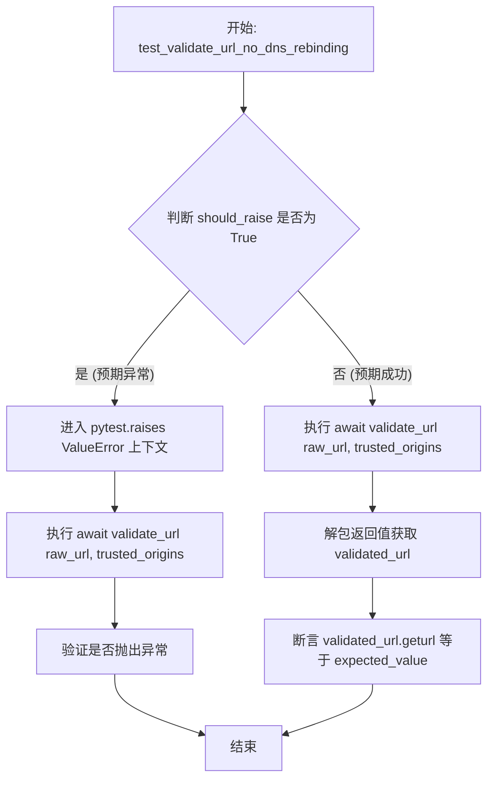
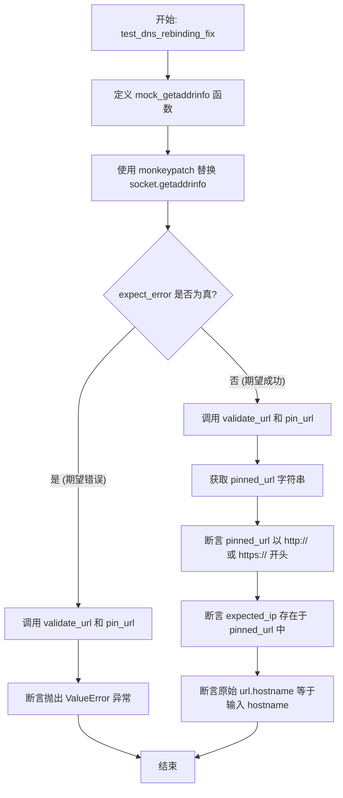
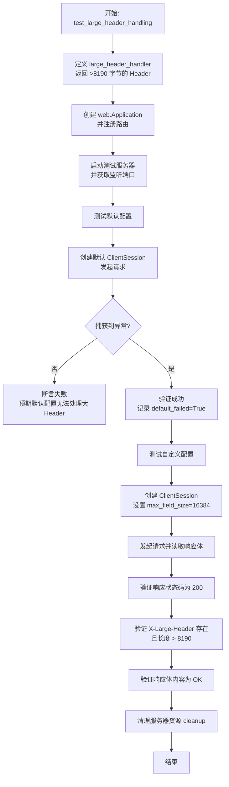

# `.\AutoGPT\autogpt_platform\backend\backend\util\request_test.py` 详细设计文档

该代码文件是一个基于 pytest 的异步测试套件，主要用于验证 URL 校验和请求处理模块的安全性与稳定性，核心功能包括测试针对 DNS 重绑定攻击的防护机制、IP 黑名单过滤、非 HTTP/HTTPS 协议拦截、Unicode 域名处理以及 aiohttp 客户端处理超大 HTTP Header 字段的能力。

## 整体流程

```mermaid
graph TD
    A[开始: 输入原始URL] --> B[校验URL格式与协议]
    B --> C{校验通过?}
    C -- 否 (如私有IP/非法协议) --> D[抛出 ValueError]
    C -- 是 --> E[解析主机名]
    E --> F{是否在可信来源列表?}
    F -- 是 --> H[通过校验]
    F -- 否 --> G[执行DNS解析 getaddrinfo]
    G --> I{遍历解析出的IP列表}
    I -- 发现内网/被禁IP --> D
    I -- 全为公网IP --> J[执行 URL Pinning (Host替换为IP)]
    J --> K[发起 HTTP 请求]
    K --> L{响应 Header 大小检查}
    L -- 超过默认8190字节 --> M[配置 max_field_size=16384]
    M --> N[成功读取响应内容]
```

## 类结构

```
No custom classes defined in this file.
```

## 全局变量及字段


    

## 全局函数及方法


### `test_validate_url_no_dns_rebinding`

该函数是一个参数化的异步测试用例，用于验证 `validate_url` 工具函数的正确性。它通过多组测试数据覆盖了包括拒绝私有 IP（防止 DNS 重绑定）、强制 HTTP/HTTPS 协议、处理国际域名、处理特殊字符以及验证受信任来源等多种场景，确保 URL 验证逻辑符合安全与功能预期。

参数：

-   `raw_url`：`str`，待测试的原始 URL 字符串。
-   `trusted_origins`：`list[str]`，被允许访问的受信任域名或 IP 地址列表。
-   `expected_value`：`str`，当验证通过时，预期的标准化 URL 字符串（包含默认 scheme）。
-   `should_raise`：`bool`，标志位，指示当前的输入是否应该导致 `validate_url` 抛出 `ValueError` 异常。

返回值：`None`，该函数为测试用例，不返回业务数据，通过断言验证逻辑。

#### 流程图



#### 带注释源码

```python
@pytest.mark.parametrize(
    "raw_url, trusted_origins, expected_value, should_raise",
    [
        # Rejected IP ranges (拒绝的 IP 地址段)
        ("localhost", [], None, True),
        ("192.168.1.1", [], None, True),
        ("127.0.0.1", [], None, True),
        ("0.0.0.0", [], None, True),
        # Normal URLs (should default to http:// if no scheme provided) (普通 URL，默认添加 http://)
        ("google.com/a?b=c", [], "http://google.com/a?b=c", False),
        ("github.com?key=!@!@", [], "http://github.com?key=!@!@", False),
        # Scheme Enforcement (协议强制，只允许 http/https)
        ("ftp://example.com", [], None, True),
        ("file://example.com", [], None, True),
        # International domain converting to punycode (allowed if public) (国际化域名)
        ("http://xn--exmple-cua.com", [], "http://xn--exmple-cua.com", False),
        # Invalid domain (IDNA failure) (无效域名)
        ("http://exa◌mple.com", [], None, True),
        # IPv6 addresses (loopback/blocked) (IPv6 回环地址)
        ("::1", [], None, True),
        ("http://[::1]", [], None, True),
        # Suspicious Characters in Hostname (主机名中的可疑字符)
        ("http://example_underscore.com", [], None, True),
        ("http://exa mple.com", [], None, True),
        # Malformed URLs (格式错误的 URL)
        ("http://", [], None, True),  # No hostname
        ("://missing-scheme", [], None, True),  # Missing proper scheme
        # Trusted Origins (受信任的源，即使是内网 IP 也可通过)
        (
            "internal-api.company.com",
            ["internal-api.company.com", "10.0.0.5"],
            "http://internal-api.company.com",
            False,
        ),
        ("10.0.0.5", ["10.0.0.5"], "http://10.0.0.5", False),
        # Special Characters in Path (路径中的特殊字符)
        (
            "example.com/path%20with%20spaces",
            [],
            "http://example.com/path%20with%20spaces",
            False,
        ),
        # Backslashes should be replaced with forward slashes (反斜杠替换为正斜杠)
        ("http://example.com\\backslash", [], "http://example.com/backslash", False),
        # Check default-scheme behavior for valid domains (检查默认 scheme 行为)
        ("example.com", [], "http://example.com", False),
        ("https://secure.com", [], "https://secure.com", False),
        # Non-ASCII Characters in Query/Fragment (查询参数中的非 ASCII 字符)
        ("example.com?param=äöü", [], "http://example.com?param=äöü", False),
    ],
)
async def test_validate_url_no_dns_rebinding(
    raw_url: str, trusted_origins: list[str], expected_value: str, should_raise: bool
):
    # 如果预期测试会抛出异常
    if should_raise:
        # 使用 pytest.raises 捕获 ValueError，确保 validate_url 按预期拒绝非法 URL
        with pytest.raises(ValueError):
            await validate_url(raw_url, trusted_origins)
    else:
        # 如果预期测试通过，调用 validate_url 并返回标准化后的 URL
        # 返回格式通常为 (ParseResult, original_input, ip_list) 或类似元组
        validated_url, _, _ = await validate_url(raw_url, trusted_origins)
        # 断言：验证生成的 URL 字符串与预期值完全一致
        assert validated_url.geturl() == expected_value
```


### `test_dns_rebinding_fix`

该函数用于测试 URL 验证逻辑中防止 DNS 重绑定攻击的修复方案。它通过模拟 DNS 解析返回多个 IP 地址的场景，验证 `validate_url` 和 `pin_url` 函数是否能正确地固定第一个有效的公网 IP 地址，并且当解析出的 IP 列表中包含被拦截的地址（如内网地址）时，能否成功拒绝该请求。

参数：

-  `monkeypatch`：`pytest.MonkeyPatch`，Pytest 提供的 fixture，用于在运行时动态替换（mock）系统函数或模块属性。
-  `hostname`：`str`，待测试验证的主机名或域名。
-  `resolved_ips`：`list[str]`，模拟 DNS 查询返回的 IP 地址列表。
-  `expect_error`：`bool`，标志位，指示在当前输入下是否期望函数抛出 `ValueError` 异常。
-  `expected_ip`：`str`，当不期望抛出异常时，预期的经过 IP 固定处理后的 IP 地址字符串。

返回值：`None`，该函数为测试用例，主要用于执行断言逻辑，无业务返回值。

#### 流程图



#### 带注释源码

```python
async def test_dns_rebinding_fix(
    monkeypatch,
    hostname: str,
    resolved_ips: list[str],
    expect_error: bool,
    expected_ip: str,
):
    """
    Tests that validate_url pins the first valid public IP address, and rejects
    the domain if any of the resolved IPs are blocked (i.e., DNS Rebinding scenario).
    """

    def mock_getaddrinfo(host, port, *args, **kwargs):
        # Simulate multiple IPs returned for the given hostname
        # 模拟给定的主机名返回多个 IP 地址，构造 getaddrinfo 的返回结构
        return [(None, None, None, None, (ip, port)) for ip in resolved_ips]

    # Patch socket.getaddrinfo so we control the DNS resolution in the test
    # 使用 monkeypatch 替换 socket.getaddrinfo，以便在测试中控制 DNS 解析结果
    monkeypatch.setattr("socket.getaddrinfo", mock_getaddrinfo)

    if expect_error:
        # If any IP is blocked, we expect a ValueError
        # 如果预期有错误（例如包含了被拦截的内网 IP），则调用 validate_url 和 pin_url
        # 并断言会抛出 ValueError
        with pytest.raises(ValueError):
            url, _, ip_addresses = await validate_url(hostname, [])
            pin_url(url, ip_addresses)
    else:
        # 正常流程：调用 validate_url 进行验证
        url, _, ip_addresses = await validate_url(hostname, [])
        # 调用 pin_url 将 URL 绑定到解析出的 IP 上，并获取字符串形式
        pinned_url = pin_url(url, ip_addresses).geturl()
        # The pinned_url should contain the first valid IP
        # 断言生成的 URL 使用了 http 或 https 协议
        assert pinned_url.startswith("http://") or pinned_url.startswith("https://")
        # 断言生成的 URL 中包含了预期的 IP 地址（即 IP 固定成功）
        assert expected_ip in pinned_url
        # The unpinned URL's hostname should match our original IDNA encoded hostname
        # 断言原始 URL 的 hostname 与输入参数 hostname 一致
        assert url.hostname == hostname
```


### `test_large_header_handling`

该测试函数用于验证 `aiohttp.ClientSession` 在处理大型 HTTP 响应头时的行为。具体而言，它创建了一个返回超大 Header（大于默认的 8190 字节）的模拟服务器，并验证默认配置下的请求会因限制而失败，而配置了 `max_field_size=16384` 的客户端能够成功读取该响应头和内容。

参数：

-  无

返回值：`None`，该函数作为单元测试使用，无实际返回值，通过断言验证逻辑。

#### 流程图



#### 带注释源码

```python
@pytest.mark.asyncio
async def test_large_header_handling():
    """Test that ClientSession with max_field_size=16384 can handle large headers (>8190 bytes)"""
    import aiohttp

    # 创建一个测试服务器处理函数，用于返回包含大型 Header 的响应
    async def large_header_handler(request):
        # 创建一个超过 aiohttp 默认 max_field_size (8190 bytes) 的 Header 值
        # 模拟很长的 CSP (Content Security Policy) 头或其他合法的大 Header
        large_value = "policy-" + "x" * 8500
        return web.Response(
            text="OK",
            headers={"X-Large-Header": large_value},
        )

    # 初始化 aiohttp 应用并添加路由
    app = web.Application()
    app.router.add_get("/large-header", large_header_handler)

    # 启动测试服务器
    runner = web.AppRunner(app)
    await runner.setup()
    site = web.TCPSite(runner, "127.0.0.1", 0) # 端口 0 表示随机分配可用端口
    await site.start()

    try:
        # 从服务器对象中获取实际绑定的端口号
        server = site._server
        assert server is not None
        sockets = getattr(server, "sockets", None)
        assert sockets is not None
        port = sockets[0].getsockname()[1]

        # --- 测试场景 1: 使用默认配置 ---
        # 默认的 max_field_size 应该无法处理大于 8190 字节的 Header
        default_failed = False
        try:
            async with aiohttp.ClientSession() as session:
                async with session.get(f"http://127.0.0.1:{port}/large-header") as resp:
                    await resp.read()
        except Exception:
            # 预期结果：当 Header > 8190 字节时，默认设置会抛出异常
            default_failed = True

        # 如果默认配置下没有报错，则测试不通过
        assert default_failed, "Expected error with default max_field_size"

        # --- 测试场景 2: 使用自定义配置 ---
        # 测试增加 max_field_size 后能够正常处理大 Header
        # 修复方案：设置 max_field_size=16384 允许最大 16KB 的 Header
        async with aiohttp.ClientSession(max_field_size=16384) as session:
            async with session.get(f"http://127.0.0.1:{port}/large-header") as resp:
                body = await resp.read()
                # 验证响应状态码为 200
                assert resp.status == 200
                # 验证大 Header 存在
                assert "X-Large-Header" in resp.headers
                # 验证接收到的 Header 值长度确实大于 8190
                assert len(resp.headers["X-Large-Header"]) > 8190
                # 验证响应体内容正确
                assert body == b"OK"

    finally:
        # 无论测试结果如何，最后都清理测试服务器资源
        await runner.cleanup()
```


## 关键组件


### URL 验证与规范化

验证用户输入的 URL 字符串，包括拒绝本地或私有 IP 地址（除非在受信任来源中）、强制执行允许的协议（http/https）、处理国际化域名（IDNA）转换以及规范化路径中的特殊字符。

### DNS 重绑定防护与 IP 固定

通过解析主机名对应的 IP 地址来防止 DNS 重绑定攻击，检查所有解析出的 IP 是否包含被阻止的地址（如链路本地地址），若安全则将 URL 锁定到第一个有效的公共 IP 地址。

### HTTP 大头部处理支持

配置 HTTP 客户端会话以支持超过默认大小限制（8190 字节）的 HTTP 头部，通过设置 `max_field_size` 为 16384 字节来处理包含大型头部的响应。


## 问题及建议


### 已知问题

-   `test_large_header_handling` 中使用 `except Exception` 捕获异常过于宽泛。这会掩盖除头部大小限制外的其他潜在错误（如网络连接问题、服务器启动失败等），导致无法准确判断测试是否真的因为头部过大而失败。
-   `test_large_header_handling` 中通过 `site._server.sockets` 获取端口号属于访问 `aiohttp` 库的受保护/私有成员（`_server`）。这种方式依赖于库的内部实现细节，当 `aiohttp` 版本更新导致内部结构变化时，测试代码极易中断。
-   测试代码中存在“魔法数字”，如 `8190`（默认限制）和 `16384`（测试设定的限制）。直接使用这些数字降低了代码的可读性，且如果业务逻辑对阈值的需求发生变化，修改起来较为分散。

### 优化建议

-   建议将测试中涉及的头部大小阈值（如 `8190`, `16384`）提取为模块级别的常量（例如 `DEFAULT_MAX_FIELD_SIZE`, `TEST_MAX_FIELD_SIZE`），以提高代码的可维护性和可读性。
-   优化 `test_large_header_handling` 中的端口获取逻辑。建议使用更稳健的方式获取绑定端口，例如利用 `runner.sockets`（如果 API 允许）或编写一个辅助函数来监听套接字信息，避免直接访问 `_server` 私有属性。
-   在 `test_large_header_handling` 的异常捕获部分，建议明确捕获预期的特定异常类型（例如 `aiohttp.ClientPayloadError` 或 `aiohttp.ServerDisconnectedError`，具体取决于 `aiohttp` 抛出的具体错误），或者检查异常消息内容，以确保测试失败的原因符合预期。


## 其它


### 测试策略与覆盖范围

本测试套件采用参数化测试 (`pytest.mark.parametrize`) 策略，针对 URL 验证、DNS 重绑定保护以及 HTTP 客户端大标头处理功能进行全覆盖测试。测试覆盖了以下几个关键维度：
1.  **URL 解析与规范化**：包括默认协议（http://）的自动补充、国际域名（Punycode）的转换、以及路径中反斜杠的修正。
2.  **安全拦截逻辑**：验证对内网 IP（如 192.168.x.x, 127.0.0.1, ::1）、私有地址段及受限协议的拦截能力。
3.  **DNS 重绑定防护**：通过模拟 DNS 解析返回多个 IP 的情况，验证系统是否会因任一 IP 为受禁地址而拒绝请求。
4.  **边界与兼容性**：测试特殊字符（空格、下划线）、非 ASCII 字符、以及 aiohttp 默认配置下的 Header 大小限制（8190 字节）及其扩容方案（16384 字节）。

### 模拟与隔离机制

为了消除对外部网络环境的依赖并模拟复杂的攻击场景，测试中实施了严格的隔离与 Mock 机制：
1.  **DNS 模拟**：使用 `monkeypatch` 替换了系统底层的 `socket.getaddrinfo` 函数，构造了一个模拟的 DNS 解析器。该模拟器可以根据预设的 IP 列表返回解析结果，从而在无需真实 DNS 服务器的情况下复现 DNS 重绑定攻击（即域名同时解析为公网 IP 和内网 IP）。
2.  **本地测试服务器**：利用 `aiohttp.web.Application` 和 `web.AppRunner` 动态构建并启动本地的 HTTP 测试服务。服务绑定到随机端口（`127.0.0.1:0`），用于发送包含超大 Header 的响应，以验证客户端在处理异常大报文时的行为，确保测试环境的完全可控。

### 安全防护场景验证

测试代码详细定义了系统应具备的安全防护边界，重点验证以下场景：
1.  **SSRF 防护**：明确拒绝了指向 localhost、回环地址（127.0.0.1, ::1）、链路本地地址（169.254.x.x）以及私有网段（192.168.x.x）的请求。
2.  **协议白名单**：强制限制 URL 协议仅允许 `http` 和 `https`，自动拦截 `ftp`、`file` 等潜在危险协议。
3.  **域名合法性校验**：拦截包含非法字符（如下划线、空格）的 Hostname，并拒绝 IDNA（国际化域名）转换失败的 URL。
4.  **DNS 重绑定防御**：确保 `pin_url` 和 `validate_url` 的组合逻辑在域名解析结果包含混合 IP 时具有“一票否决权”，即只要解析出的 IP 列表中存在一个被拦截的 IP，该请求即视为非法。

### 边界条件与性能测试

针对 HTTP 客户端配置与数据处理能力进行了边界压力测试：
1.  **Header 大小限制**：验证了 `aiohttp` 客户端默认的 `max_field_size`（8190 字节）限制。测试用例通过生成超过 8190 字节的 Header 值，模拟了如超长 CSP (Content Security Policy) 等真实场景，确认默认配置下会抛出异常。
2.  **配置调优验证**：验证了通过显式设置 `max_field_size=16384`（16KB）可以成功处理上述大 Header 请求，确保系统在处理合法但较大的 HTTP 头部时具备足够的缓冲空间，同时不破坏安全约束。

### 异常处理与断言设计

测试代码中采用了严格的异常捕获与断言逻辑来保证代码质量：
1.  **异常类型验证**：对于所有非法的 URL 输入或受禁的 IP 地址，统一预期抛出 `ValueError`，使用 `pytest.raises(ValueError)` 进行上下文包裹验证。
2.  **异常场景覆盖**：不仅测试了业务逻辑异常（如 URL 校验失败），还测试了底层库的配置异常（如默认配置下大 Header 导致的请求失败）。
3.  **状态与内容断言**：对于成功的请求，断言不仅限于状态码（200 OK），还深入验证了返回体的内容一致性（`assert body == b"OK"`）以及关键 Header 的存在性和长度，确保业务逻辑与网络传输层的双重正确性。

    