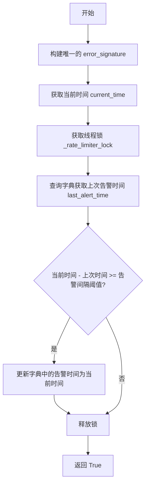
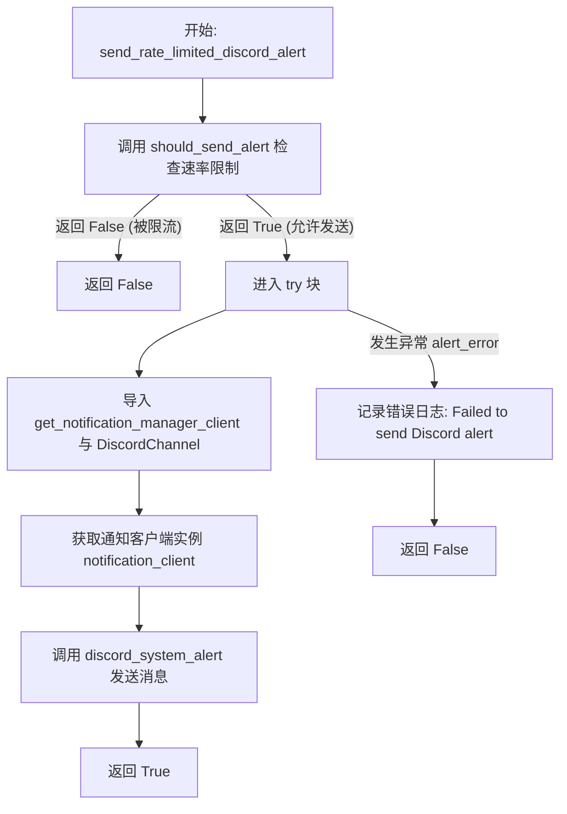
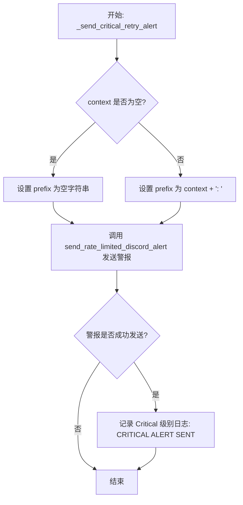
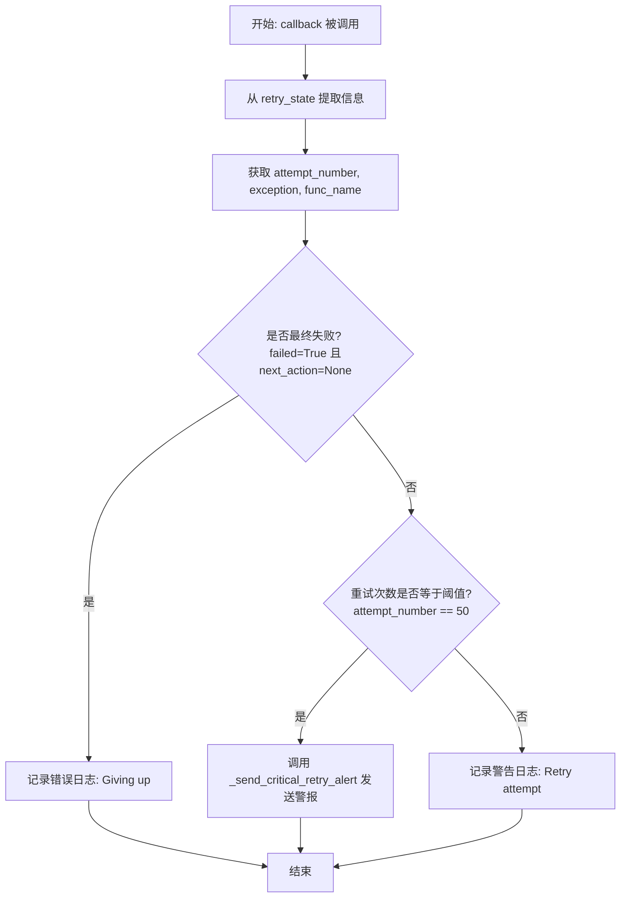
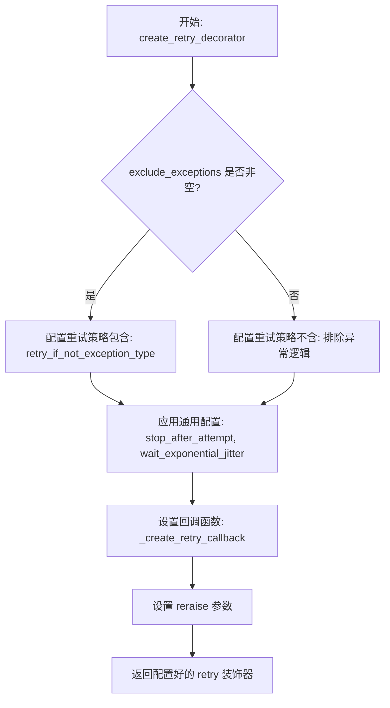
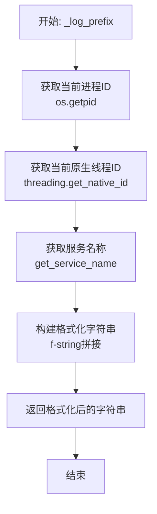
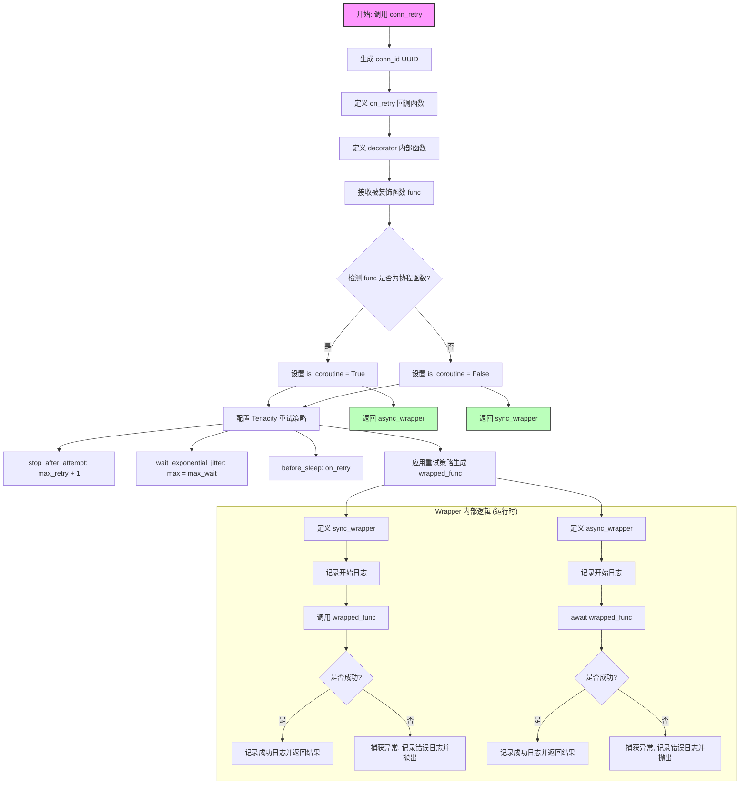
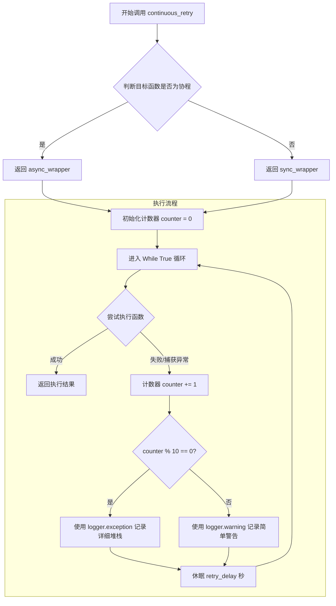

# `.\AutoGPT\autogpt_platform\backend\backend\util\retry.py` 详细设计文档

该代码模块提供了一套完善的异步/同步重试机制工具，集成了指数退避、速率限制告警及日志记录功能，旨在通过 tenacity 库增强基础设施连接和通用函数执行的鲁棒性与容错能力。

## 整体流程

```mermaid
graph TD
    A[开始执行被装饰函数] --> B{执行成功?}
    B -- 是 --> C[返回结果]
    B -- 否(抛出异常) --> D{是否属于排除异常?}
    D -- 是 --> E[抛出异常]
    D -- 否 --> F[增加重试计数]
    F --> G{是否达到最大尝试次数?}
    G -- 是 --> E
    G -- 否 --> H{是否达到告警阈值?}
    H -- 是 --> I[发送限流 Discord 告警]
    H -- 否 --> J[记录 Warning 日志]
    I --> K[等待(指数退避+抖动)]
    J --> K
    K --> A
```

## 类结构

```
graph TD
    Module[retry.py 模块] --> Globals[全局变量与常量]
    Module --> Alerting[告警工具函数]
    Module --> RetryFactories[重试装饰器工厂]
    Module --> Helpers[内部辅助函数]
    Alerting --> should_send_alert
    Alerting --> send_rate_limited_discord_alert
    Alerting --> _send_critical_retry_alert
    RetryFactories --> create_retry_decorator
    RetryFactories --> conn_retry
    RetryFactories --> continuous_retry
    RetryFactories --> func_retry
    Helpers --> _create_retry_callback
    Helpers --> _log_prefix
```

## 全局变量及字段


### `EXCESSIVE_RETRY_THRESHOLD`
    
触发过度重试警报的阈值，默认为50次尝试。

类型：`int`
    


### `_alert_rate_limiter`
    
存储每个函数与错误组合的最后告警时间戳，用于实现告警频率限制。

类型：`dict`
    


### `_rate_limiter_lock`
    
用于确保对 _alert_rate_limiter 字典进行线程安全访问的锁。

类型：`threading.Lock`
    


### `ALERT_RATE_LIMIT_SECONDS`
    
相同错误签名之间发送告警的最小时间间隔（秒），默认为300秒。

类型：`int`
    


### `func_retry`
    
为通用函数预配置的重试装饰器，默认最大尝试次数为5次。

类型：`Callable`
    


    

## 全局函数及方法


### `should_send_alert`

基于速率限制逻辑，检查当前错误是否满足发送告警的条件，以防止针对相同错误的重复通知。

参数：

-  `func_name`：`str`，发生异常的函数名称
-  `exception`：`Exception`，被捕获的异常对象
-  `context`：`str`，可选的上下文信息，用于区分不同的业务场景

返回值：`bool`，如果满足发送条件返回 `True`，否则返回 `False`。

#### 流程图



#### 带注释源码

```python
def should_send_alert(func_name: str, exception: Exception, context: str = "") -> bool:
    """Check if we should send an alert based on rate limiting."""
    # 创建唯一的错误签名，包含上下文、函数名、异常类型和异常信息的前100个字符
    # 这样可以区分不同位置发生的相似错误，或者同一位置不同上下文的错误
    error_signature = (
        f"{context}:{func_name}:{type(exception).__name__}:{str(exception)[:100]}"
    )
    current_time = time.time()

    # 使用线程锁确保对共享字典 _alert_rate_limiter 的操作是线程安全的
    with _rate_limiter_lock:
        # 获取该错误签名上次发送告警的时间，如果没有记录则默认为0
        last_alert_time = _alert_rate_limiter.get(error_signature, 0)
        
        # 判断距离上次告警是否已超过设定的时间间隔（默认300秒）
        if current_time - last_alert_time >= ALERT_RATE_LIMIT_SECONDS:
            # 如果超过间隔，更新最后一次告警时间为当前时间
            _alert_rate_limiter[error_signature] = current_time
            # 返回 True，表示允许发送告警
            return True
        
        # 如果未超过间隔，返回 False，表示受速率限制，不发送告警
        return False
```


### `send_rate_limited_discord_alert`

该函数负责向 Discord 发送带有速率限制机制的警报消息，旨在防止针对相同错误上下文的频繁重复通知，同时在发送失败时进行容错处理。

参数：

-  `func_name`：`str`，发生异常的函数名称，用于生成错误签名。
-  `exception`：`Exception`，捕获到的具体异常对象，用于生成错误签名。
-  `context`：`str`，上下文字符串（如服务名或模块名），用于区分不同场景下的相同错误。
-  `alert_msg`：`str`，需要发送到 Discord 的具体警告文本内容。
-  `channel`：`Optional[Any]`，目标 Discord 频道对象，若为 None 则使用默认的平台频道。

返回值：`bool`，如果警报成功发送返回 True，如果被限流或发送过程中出现异常返回 False。

#### 流程图



#### 带注释源码

```python
def send_rate_limited_discord_alert(
    func_name: str, exception: Exception, context: str, alert_msg: str, channel=None
) -> bool:
    """
    Send a Discord alert with rate limiting.

    Returns True if alert was sent, False if rate limited.
    """
    # 步骤 1: 检查速率限制。
    # 如果基于函数名、异常和上下文的组合在规定时间内（默认300秒）已发送过警报，则跳过。
    if not should_send_alert(func_name, exception, context):
        return False

    try:
        # 步骤 2: 动态导入依赖模块。
        # 将导入语句放在函数内部可以避免循环依赖，并减少启动时的开销。
        from backend.util.clients import get_notification_manager_client
        from backend.util.metrics import DiscordChannel

        # 步骤 3: 获取通知客户端实例。
        notification_client = get_notification_manager_client()
        
        # 步骤 4: 构建并发送 Discord 消息。
        # 如果未指定 channel 参数，则使用默认的 PLATFORM 频道。
        notification_client.discord_system_alert(
            alert_msg, channel or DiscordChannel.PLATFORM
        )
        return True

    except Exception as alert_error:
        # 步骤 5: 异常处理。
        # 如果发送警报本身失败（例如网络问题或客户端配置错误），
        # 记录错误日志但不抛出异常，以免影响主业务流程。
        logger.error(f"Failed to send Discord alert: {alert_error}")
        return False
```


### `_send_critical_retry_alert`

当函数接近重试失败阈值时发送警报。该函数负责构建包含详细错误信息和上下文的关键消息，并通过带速率限制的 Discord 警报机制发送通知，同时在本地日志中记录关键警报信息。

参数：

- `func_name`：`str`，触发重试的函数名称。
- `attempt_number`：`int`，当前的尝试次数。
- `exception`：`Exception`，导致失败的具体异常对象。
- `context`：`str`，可选的上下文字符串，用于标识特定的服务或模块（默认为空字符串）。

返回值：`None`，该函数不返回值，主要执行副作用（发送警报和记录日志）。

#### 流程图



#### 带注释源码

```python
def _send_critical_retry_alert(
    func_name: str, attempt_number: int, exception: Exception, context: str = ""
):
    """Send alert when a function is approaching the retry failure threshold."""

    # 构建日志前缀，如果提供了上下文信息则包含上下文，否则为空
    prefix = f"{context}: " if context else ""
    
    # 调用带速率限制的 Discord 警报发送函数
    # 传入函数名、异常、上下文以及格式化后的关键错误消息
    if send_rate_limited_discord_alert(
        func_name,
        exception,
        context,
        f"🚨 CRITICAL: Operation Approaching Failure Threshold: {prefix}'{func_name}'\n\n"
        f"Current attempt: {attempt_number}/{EXCESSIVE_RETRY_THRESHOLD}\n"
        f"Error: {type(exception).__name__}: {exception}\n\n"
        f"This operation is about to fail permanently. Investigate immediately.",
    ):
        # 如果 Discord 警报发送成功（未被限流且发送无误），则在本地记录一条关键日志
        logger.critical(
            f"CRITICAL ALERT SENT: Operation {func_name} at attempt {attempt_number}"
        )
```


### `_create_retry_callback`

创建一个用于 Tenacity 重试机制的回调函数工厂，该回调用于在重试期间记录日志，并在重试次数达到特定阈值时发送严重警报，以及在最终放弃时记录错误信息。

参数：

- `context`：`str`，可选的上下文字符串，用于在日志和警报中标识不同的调用场景或组件，默认为空字符串。

返回值：`Callable`，返回一个回调函数，该函数接受 `retry_state` 参数，用于在每次重试尝试之前或最终失败时执行特定的逻辑（如日志记录或发送警报）。

#### 流程图



#### 带注释源码

```python
def _create_retry_callback(context: str = ""):
    """Create a retry callback with optional context."""

    def callback(retry_state):
        # 从重试状态对象中获取当前尝试次数、抛出的异常和函数名
        attempt_number = retry_state.attempt_number
        exception = retry_state.outcome.exception()
        func_name = getattr(retry_state.fn, "__name__", "unknown")

        # 处理日志前缀，如果提供了 context 则添加
        prefix = f"{context}: " if context else ""

        # 检查是否为最终失败（即已经失败且没有下一步动作）
        if retry_state.outcome.failed and retry_state.next_action is None:
            # 最终失败 - 仅记录错误（警报已在达到阈值时发送过）
            logger.error(
                f"{prefix}Giving up after {attempt_number} attempts for '{func_name}': "
                f"{type(exception).__name__}: {exception}"
            )
        else:
            # 正在重试中
            # 检查重试次数是否达到警报阈值（默认为50）
            if attempt_number == EXCESSIVE_RETRY_THRESHOLD:
                # 达到阈值，发送关键警报（受速率限制保护）
                _send_critical_retry_alert(
                    func_name, attempt_number, exception, context
                )
            else:
                # 未达到阈值，仅记录常规警告日志
                logger.warning(
                    f"{prefix}Retry attempt {attempt_number} for '{func_name}': "
                    f"{type(exception).__name__}: {exception}"
                )

    return callback
```


### `create_retry_decorator`

创建一个具有默认配置的重试装饰器工厂函数，支持指数退避与抖动、自定义最大尝试次数、特定异常排除以及上下文日志记录。

参数：

-   `max_attempts`：`int`，最大重试尝试次数，默认为 5
-   `exclude_exceptions`：`tuple[type[BaseException], ...]`，指定不应触发重试的异常类型元组，默认为空元组
-   `max_wait`：`float`，重试之间的最大等待时间（秒），默认为 30.0
-   `context`：`str`，用于日志消息和告警的上下文字符串，默认为空字符串
-   `reraise`：`bool`，是否在最终尝试失败后重新抛出异常，默认为 True

返回值：`Callable`，配置好的 tenacity 重试装饰器

#### 流程图



#### 带注释源码

```python
def create_retry_decorator(
    max_attempts: int = 5,
    exclude_exceptions: tuple[type[BaseException], ...] = (),
    max_wait: float = 30.0,
    context: str = "",
    reraise: bool = True,
):
    """
    Create a preconfigured retry decorator with sensible defaults.

    Uses exponential backoff with jitter by default.

    Args:
        max_attempts: Maximum number of attempts (default: 5)
        exclude_exceptions: Tuple of exception types to not retry on
        max_wait: Maximum wait time in seconds (default: 30)
        context: Optional context string for log messages
        reraise: Whether to reraise the final exception (default: True)

    Returns:
        Configured retry decorator
    """
    # 检查是否提供了需要排除的异常类型
    if exclude_exceptions:
        # 如果存在排除异常，返回带有特定重试条件的装饰器
        # retry_if_not_exception_type: 只有当异常不在排除列表中时才重试
        return retry(
            stop=stop_after_attempt(max_attempts),      # 达到最大尝试次数后停止
            wait=wait_exponential_jitter(max=max_wait),  # 使用带抖动的指数退避策略
            before_sleep=_create_retry_callback(context), # 每次重试睡眠前执行回调（记录日志/发送告警）
            reraise=reraise,                             # 最终失败后是否重新抛出异常
            retry=retry_if_not_exception_type(exclude_exceptions), # 排除特定异常
        )
    else:
        # 如果没有排除异常，返回通用配置的装饰器
        return retry(
            stop=stop_after_attempt(max_attempts),      # 达到最大尝试次数后停止
            wait=wait_exponential_jitter(max=max_wait),  # 使用带抖动的指数退避策略
            before_sleep=_create_retry_callback(context), # 每次重试睡眠前执行回调
            reraise=reraise,                             # 最终失败后是否重新抛出异常
        )
```


### `_log_prefix`

生成包含当前进程 ID、线程 ID、服务名称以及特定资源连接信息的标准化日志前缀字符串，以便于日志追踪。

参数：

-  `resource_name`：`str`，资源或组件的名称。
-  `conn_id`：`str`，连接或操作的唯一标识符。

返回值：`str`，格式化后的日志前缀字符串。

#### 流程图



#### 带注释源码

```python
def _log_prefix(resource_name: str, conn_id: str):
    """
    Returns a prefix string for logging purposes.
    This needs to be called on the fly to get the current process ID & service name,
    not the parent process ID & service name.
    """
    # 获取当前进程的 PID，确保是当前执行进程而非父进程
    pid = os.getpid()
    # 获取当前原生线程 ID，用于多线程并发环境下的追踪
    thread_id = threading.get_native_id()
    # 从配置中获取服务名称，用于微服务架构下的区分
    service_name = get_service_name()
    # 将上述信息与传入的资源和连接 ID 组合成特定格式的日志前缀
    return f"[PID-{pid}|THREAD-{thread_id}|{service_name}|{resource_name}-{conn_id}]"
```


### `conn_retry`

这是一个用于创建重试机制的装饰器工厂，专门针对基础设施连接或操作场景设计。它封装了 `tenacity` 库的功能，为被装饰的同步或异步函数提供带有指数退避策略的重试逻辑。该装饰器在每次尝试失败时记录详细的日志，并在重试次数达到特定阈值（默认50次）时触发 Discord 告警。它同时支持同步和异步函数，并确保在包装后的函数执行前后记录操作状态。

参数：

-  `resource_name`：`str`，资源的名称（如数据库、API名称），用于生成日志前缀和告警上下文。
-  `action_name`：`str`，正在执行的操作描述（如 "connect", "fetch"），用于日志记录。
-  `max_retry`：`int`，最大重试次数，默认为 100。实际最大尝试次数为该值加 1（包含初始调用）。
-  `max_wait`：`float`，重试之间的最大等待时间（秒），默认为 30。使用了指数退避加抖动算法。

返回值：`Callable[[Callable], Callable]`，返回一个装饰器函数，该装饰器接收目标函数并返回包装后的同步或异步函数。

#### 流程图



#### 带注释源码

```python
def conn_retry(
    resource_name: str,
    action_name: str,
    max_retry: int = 100,
    max_wait: float = 30,
):
    # 生成唯一的连接ID，用于在并发环境中区分不同的重试实例
    conn_id = str(uuid4())

    # 定义重试回调函数，在每次重试（或最终失败）前被调用
    def on_retry(retry_state):
        # 获取日志前缀，包含进程ID、线程ID、服务名、资源名和连接ID
        prefix = _log_prefix(resource_name, conn_id)
        # 获取当前尝试抛出的异常
        exception = retry_state.outcome.exception()
        # 获取当前尝试次数
        attempt_number = retry_state.attempt_number
        # 获取被装饰函数的名称
        func_name = getattr(retry_state.fn, "__name__", "unknown")

        # 判断是否是最终失败（没有下一次重试动作了）
        if retry_state.outcome.failed and retry_state.next_action is None:
            # 记录最终失败日志
            logger.error(f"{prefix} {action_name} failed after retries: {exception}")
        else:
            # 检查是否达到严重重试警告阈值（默认50次）
            if attempt_number == EXCESSIVE_RETRY_THRESHOLD:
                # 发送限流的Discord告警，通知基础设施可能存在问题
                if send_rate_limited_discord_alert(
                    func_name,
                    exception,
                    f"{resource_name}_infrastructure",
                    f"🚨 **Critical Infrastructure Connection Issue**\n"
                    f"Resource: {resource_name}\n"
                    f"Action: {action_name}\n"
                    f"Function: {func_name}\n"
                    f"Current attempt: {attempt_number}/{max_retry + 1}\n"
                    f"Error: {type(exception).__name__}: {str(exception)[:200]}{'...' if len(str(exception)) > 200 else ''}\n\n"
                    f"Infrastructure component is approaching failure threshold. Investigate immediately.",
                ):
                    logger.critical(
                        f"INFRASTRUCTURE ALERT SENT: {resource_name} at {attempt_number} attempts"
                    )

            # 记录普通的重试警告日志
            logger.warning(
                f"{prefix} {action_name} failed: {exception}. Retrying now..."
            )

    # 定义实际的装饰器函数
    def decorator(func):
        # 检测被装饰的函数是否是异步函数（协程）
        is_coroutine = asyncio.iscoroutinefunction(func)
        
        # 静态配置 Tenacity 的重试装饰器
        # stop_after_attempt: 最大尝试次数（初始请求 + max_retry次重试）
        # wait_exponential_jitter: 指数退避策略，带有随机抖动，最大等待时间为 max_wait
        # before_sleep: 每次重试前（睡眠前）调用的回调
        # reraise: 如果是True，最后一次重试失败后重新抛出异常
        retry_decorator = retry(
            stop=stop_after_attempt(max_retry + 1),  # +1 for the initial attempt
            wait=wait_exponential_jitter(max=max_wait),
            before_sleep=on_retry,
            reraise=True,
        )
        # 应用重试逻辑到原始函数
        wrapped_func = retry_decorator(func)

        # 同步函数的包装器
        @wraps(func)
        def sync_wrapper(*args, **kwargs):
            prefix = _log_prefix(resource_name, conn_id)
            logger.info(f"{prefix} {action_name} started...")
            try:
                result = wrapped_func(*args, **kwargs)
                logger.info(f"{prefix} {action_name} completed successfully.")
                return result
            except Exception as e:
                logger.error(f"{prefix} {action_name} failed after retries: {e}")
                raise

        # 异步函数的包装器
        @wraps(func)
        async def async_wrapper(*args, **kwargs):
            prefix = _log_prefix(resource_name, conn_id)
            logger.info(f"{prefix} {action_name} started...")
            try:
                result = await wrapped_func(*args, **kwargs)
                logger.info(f"{prefix} {action_name} completed successfully.")
                return result
            except Exception as e:
                logger.error(f"{prefix} {action_name} failed after retries: {e}")
                raise

        # 根据函数类型返回对应的包装器
        return async_wrapper if is_coroutine else sync_wrapper

    return decorator
```


### `continuous_retry`

一个装饰器工厂，用于为同步或异步函数实现无限重试机制，确保函数持续执行直到成功。它在每次失败后记录错误，并根据重试计数频率调整日志级别（每 10 次失败记录一次详细异常），并在重试之间提供固定的休眠间隔。

参数：

-   `retry_delay`：`float`，重试间隔时间（以秒为单位），默认为 1.0。

返回值：`Callable`，包装后的装饰器函数，根据原函数类型（同步或异步）返回对应的包装器，实现无限重试逻辑。

#### 流程图



#### 带注释源码

```python
def continuous_retry(*, retry_delay: float = 1.0):
    """
    定义一个无限重试的装饰器工厂。
    :param retry_delay: 每次重试之间的等待时间（秒）
    :return: 装饰器函数
    """
    def decorator(func):
        # 检测被装饰的函数是否为协程函数，以决定使用异步还是同步包装器
        is_coroutine = asyncio.iscoroutinefunction(func)

        @wraps(func)
        def sync_wrapper(*args, **kwargs):
            counter = 0
            # 无限循环，直到函数成功执行并返回
            while True:
                try:
                    return func(*args, **kwargs)
                except Exception as exc:
                    counter += 1
                    # 为了避免日志刷屏，每 10 次失败记录一次异常堆栈
                    if counter % 10 == 0:
                        log = logger.exception
                    else:
                        log = logger.warning
                    # 记录错误信息，包含函数名、失败次数、错误详情和即将等待的时间
                    log(
                        "%s failed for the %s times, error: [%s] — retrying in %.2fs",
                        func.__name__,
                        counter,
                        str(exc) or type(exc).__name__,
                        retry_delay,
                    )
                    # 阻塞等待指定时间后重试
                    time.sleep(retry_delay)

        @wraps(func)
        async def async_wrapper(*args, **kwargs):
            counter = 0
            # 异步无限循环，直到函数成功执行并返回
            while True:
                try:
                    return await func(*args, **kwargs)
                except Exception as exc:
                    counter += 1
                    # 异步环境下的日志记录策略：每 10 次记录详细堆栈
                    if counter % 10 == 0:
                        log = logger.exception
                    else:
                        log = logger.warning
                    log(
                        "%s failed for the %s times, error: [%s] — retrying in %.2fs",
                        func.__name__,
                        counter,
                        str(exc) or type(exc).__name__,
                        retry_delay,
                    )
                    # 异步等待指定时间后重试
                    await asyncio.sleep(retry_delay)

        # 根据原函数类型返回对应的包装器
        return async_wrapper if is_coroutine else sync_wrapper

    return decorator
```


## 关键组件


### 告警限流机制

使用线程锁和时间戳记录错误签名，确保同一错误在设定的时间窗口内仅触发一次告警。

### 通用重试装饰器

封装 `tenacity` 库，提供支持指数退避抖动、异常类型过滤及自定义上下文日志的可配置重试装饰器。

### 基础设施连接重试

针对网络或数据库连接操作设计的专用重试装饰器，支持同步/异步函数，并提供包含 PID 和线程 ID 的详细日志记录。

### 连续无限重试

提供在异常发生时无限循环重试的机制，包含固定的重试延迟和周期性的日志记录，用于长期运行任务。

### 外部告警发送器

负责在重试次数达到警告阈值时，通过 Discord 客户端发送格式化的紧急通知，并处理发送失败的异常。


## 问题及建议


### 已知问题

-   **并发追踪标识冲突**：在 `conn_retry` 装饰器中，`conn_id` 是在装饰器定义阶段生成的（在 `decorator` 闭包外部），导致同一函数的所有并发调用共享同一个 `conn_id`，这使得通过日志追踪单个具体的并发请求变得困难。
-   **异步环境下的锁阻塞风险**：全局告警限流器使用了 `threading.Lock` 来保护字典访问。在异步（AsyncIO）环境中，如果在持有该锁时发生阻塞或操作耗时，可能会阻塞整个事件循环，影响并发性能。
-   **告警阈值逻辑缺陷**：`conn_retry` 依赖全局常量 `EXCESSIVE_RETRY_THRESHOLD` (50) 来触发告警，但允许通过参数 `max_retry` 指定最大重试次数。如果用户配置的 `max_retry` 小于 50（例如 10），告警逻辑将永远不会被触发，导致错误静默失败。
-   **代码重复与维护成本**：`conn_retry` 与 `create_retry_decorator` 存在大量重复的 `tenacity` 配置逻辑，增加了代码维护成本，且容易导致不同重试机制的行为不一致。

### 优化建议

-   **统一重试机制**：重构 `conn_retry`，使其内部复用 `create_retry_decorator` 或共享相同的重试配置逻辑，仅保留特定的日志和上下文包装逻辑，以减少冗余代码。
-   **动态生成追踪 ID**：将 `conn_id` 的生成逻辑移动到 `sync_wrapper` 或 `async_wrapper` 函数内部，确保每次函数调用都能获得唯一的连接标识，便于分布式追踪和日志排查。
-   **引入异步友好的并发控制**：将告警限流器的锁机制升级为支持异步上下文的锁（如 `asyncio.Lock`），或者使用线程安全且非阻塞的数据结构（如 `collections.deque` 配合过期清理），以适应高并发异步场景。
-   **参数化阈值配置**：将 `EXCESSIVE_RETRY_THRESHOLD` 从全局常量改为装饰器的参数（如 `alert_threshold`），允许根据不同业务场景灵活配置告警触发时机，并增加参数校验逻辑。
-   **增强无限重试的控制能力**：为 `continuous_retry` 装饰器增加一个 `stop_event` 或特定的异常类型参数，提供一种优雅停止无限重试循环的机制，防止服务无法正常退出。
-   **优化日志上下文**：在 `_log_prefix` 中直接获取 PID 和 TID 是好的，但应考虑引入 `Trace ID` 的概念（如果项目中有分布式追踪上下文），以便关联上下游日志。


## 其它


### 设计目标与约束

**设计目标：**
1.  **操作弹性**：通过自动重试机制增强系统的容错能力，确保在 transient failures（瞬时故障，如网络抖动或服务暂不可用）发生时，操作能够自动恢复，而不是立即失败。
2.  **可观测性**：提供结构化的日志记录（包含 PID、线程 ID、服务名、唯一 ID）以及关键故障的即时告警（集成 Discord），确保运维人员能快速定位和处理问题。
3.  **接口透明性**：设计通用的装饰器工厂，同时支持同步函数和异步协程，对现有代码逻辑的侵入性最小化。
4.  **防止告警风暴**：引入基于时间窗口的速率限制机制，避免在系统大规模故障时因重复发送告警而导致告警通道拥塞或运维人员疲劳。

**约束条件：**
1.  **重试次数限制**：虽然有无限重试的选项（`continuous_retry`），但标准重试（`func_retry`）和连接重试（`conn_retry`）都有明确的最大尝试次数限制，以防止无限阻塞。
2.  **退避策略**：必须使用带有随机抖动（Jitter）的指数退避算法，以防止在重试风暴中发生惊群效应。
3.  **资源隔离**：告警发送逻辑必须包含在独立的 try-catch 块中，防止告警系统自身的故障干扰主业务流程的执行。
4.  **线程安全**：由于 `_alert_rate_limiter` 是全局共享状态，其读写操作必须受锁保护，以适应多线程环境。

### 错误处理与异常设计

**重试机制设计：**
1.  **异常捕获与过滤**：利用 `tenacity` 库捕获标准 `Exception`。支持 `exclude_exceptions` 参数，允许开发者指定某些特定异常（如 `ValueError` 或 `AuthenticationError`）不进行重试，直接抛出。
2.  **重试状态回调**：在每次重试前（`before_sleep`）执行回调函数 `_create_retry_callback` 或 `on_retry`，用于记录日志和触发告警。
3.  **最终失败处理**：当达到最大重试次数后，如果配置了 `reraise=True`（默认），最后一次捕获的异常将重新抛出给调用者，确保调用方能感知到操作彻底失败。

**告警与阈值逻辑：**
1.  **阈值触发**：当重试次数达到 `EXCESSIVE_RETRY_THRESHOLD`（默认为 50）时，系统将此视为严重基础设施问题或即将发生的永久性失败，并发送 Critical 级别的 Discord 告警。
2.  **速率限制**：`should_send_alert` 函数基于错误签名（函数名 + 异常类 + 异常信息前缀）和时间戳来判断是否发送告警。相同错误的告警发送间隔不得少于 `ALERT_RATE_LIMIT_SECONDS`（300秒）。
3.  **告警失败容错**：在 `send_rate_limited_discord_alert` 中，发送告警本身可能抛出异常（如网络问题）。此类异常被捕获并仅记录到日志中，不会向上抛出，确保主业务逻辑不会被通知系统的故障所中断。

### 并发模型与线程安全

**并发支持：**
1.  **Sync/Async 双模式**：代码中的装饰器（`conn_retry`, `continuous_retry`, `create_retry_decorator`）均实现了双层包装逻辑。
    *   通过 `asyncio.iscoroutinefunction(func)` 检测被装饰函数的类型。
    *   如果是协程，返回 `async_wrapper`，内部使用 `await` 和 `asyncio.sleep`。
    *   如果是普通函数，返回 `sync_wrapper`，内部直接调用和 `time.sleep`。
    *   这确保了重试逻辑不会阻塞事件循环（在 Async 场景下）也不会丢失同步能力。

**线程安全：**
1.  **共享状态保护**：全局变量 `_alert_rate_limiter` 字典用于存储告警时间戳。由于多个线程可能同时触发重试逻辑，所有对该字典的访问（读取上次时间和写入当前时间）都通过 `threading.Lock`（`_rate_limiter_lock`）进行加锁保护。
2.  **上下文隔离**：`_log_prefix` 函数通过 `os.getpid()` 和 `threading.get_native_id()` 动态获取当前的进程和线程 ID，确保在多进程、多线程环境下，日志能够清晰区分不同的执行单元，避免日志混淆。

### 外部依赖与接口契约

**外部依赖：**
1.  **`tenacity`**：核心重试逻辑库，提供了 `retry`, `stop_after_attempt`, `wait_exponential_jitter`, `retry_if_not_exception_type` 等装饰器组件。
2.  **`backend.util.clients`**：内部依赖，提供 `get_notification_manager_client`，用于获取发送 Discord 消息的客户端实例。
3.  **`backend.util.metrics`**：内部依赖，提供枚举类型 `DiscordChannel`，用于指定告警发送的目标频道。
4.  **`backend.util.settings`**：内部依赖，提供 `get_service_name()`，用于在日志中标识当前服务名称。

**接口契约：**
*   **输入**：
    *   被装饰的函数或方法（可调用对象）。
    *   配置参数：`max_attempts`（整数），`exclude_exceptions`（异常类元组），`max_wait`（浮点数秒），`context`（字符串，用于日志上下文）。
*   **输出**：
    *   装饰后的函数，其返回值类型与原函数保持一致。
    *   行为上，表现为在失败时执行了多次延迟重试，最终返回成功结果或抛出原始异常。
*   **副作用**：
    *   **时间消耗**：除了函数本身的执行时间，还会引入因重试等待产生的额外延迟（指数级增长）。
    *   **I/O 操作**：产生日志输出；在达到阈值且未限流时，发起网络请求发送 Discord 告警。
    *   **状态变更**：修改全局的告警限流字典 `_alert_rate_limiter`。

### 数据流与处理状态

**整体生命周期：**

1.  **初始化阶段**：
    *   调用装饰器工厂（如 `conn_retry`），传入配置参数（资源名、动作名、最大重试次数等）。
    *   生成唯一的连接 ID（`uuid4`）和回调函数（如 `on_retry`）。
    *   返回具体的装饰器函数。

2.  **调用阶段**：
    *   业务代码调用被装饰的函数。
    *   包装器（`sync_wrapper` 或 `async_wrapper`）首先记录 "Started" 日志。

3.  **执行与重试循环**：
    *   `tenacity` 库接管执行流程，调用原始函数。
    *   **成功场景**：函数正常返回结果，包装器记录 "Completed" 日志，结果透传给调用方。
    *   **失败场景**：
        *   函数抛出异常。
        *   `tenacity` 捕获异常，判断是否达到停止条件。
        *   若未停止，调用 `before_sleep` 回调（即 `on_retry`）：
            *   计算当前尝试次数。
            *   **状态检查**：如果次数达到 `EXCESSIVE_RETRY_THRESHOLD`，触发告警逻辑（检查限流 -> 发送 Discord）。
            *   记录警告日志。
        *   执行等待策略（Exponential Jitter）。
        *   回到步骤 3 开始下一次尝试。
        *   若达到最大次数，标记为最终失败。

4.  **终止阶段**：
    *   若最终失败，包装器捕获异常，记录 "Failed" 错误日志。
    *   重新抛出异常，流程结束。

    