# `.\AutoGPT\autogpt_platform\backend\backend\util\retry_test.py` 详细设计文档

该文件是对后端重试机制模块的单元测试套件，旨在验证同步和异步函数的连接重试逻辑，并严格测试了严重错误告警的速率限制功能，涵盖了时间窗口控制、多线程并发安全以及不同错误场景下的告警策略。

## 整体流程

```mermaid
graph TD
    A[开始] --> B[导入依赖与模块]
    B --> C[测试同步重试函数]
    C --> C1[验证重试成功]
    C --> C2[验证重试失败]
    B --> D[测试异步重试函数]
    D --> D1[验证异步重试成功]
    D --> D2[验证异步重试失败]
    B --> E[初始化测试类 TestRetryRateLimiting]
    E --> F[setup_method 重置限流状态]
    F --> G[测试告警发送逻辑]
    G --> G1[首次发送允许]
    G --> G2[重复错误限制]
    G --> G3[不同错误/上下文/函数允许]
    G --> G4[时间窗口重置测试]
    G --> G5[多线程安全性测试]
    F --> H[测试告警发送集成]
    H --> H1[限流行为验证]
    H --> H2[通知失败处理验证]
    F --> I[测试边缘场景与真实案例]
    I --> I1[错误签名生成]
    I --> I2[模拟高频告警 Spam 场景]
    F --> J[测试重试装饰器阈值]
    C, D, G, H, I, J --> K[结束]
```

## 类结构

```
TestRetryRateLimiting (测试类)
├── setup_method
├── test_should_send_alert_allows_first_occurrence
├── test_should_send_alert_rate_limits_duplicate
├── test_should_send_alert_allows_different_errors
├── test_should_send_alert_allows_different_contexts
├── test_should_send_alert_allows_different_functions
├── test_should_send_alert_respects_time_window
├── test_should_send_alert_thread_safety
├── test_send_critical_retry_alert_rate_limiting
├── test_send_critical_retry_alert_handles_notification_failure
├── test_error_signature_generation
├── test_real_world_scenario_spend_credits_spam
└── test_retry_decorator_with_excessive_failures
```

## 全局变量及字段


    

## 全局函数及方法


### `test_conn_retry_sync_function`

该函数用于测试同步函数下的 `conn_retry` 装饰器功能。通过定义一个内部函数并根据外部变量 `retry_count` 模拟成功和失败的场景，验证了装饰器能够在重试机制下最终返回成功结果，以及在超过最大重试次数后正确抛出预期的异常。

参数：
- 无

返回值：`None`，该函数主要用于测试验证逻辑，无显式返回值。

#### 流程图

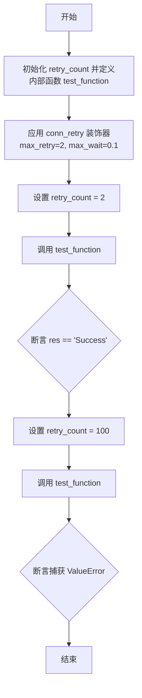

#### 带注释源码

```python
def test_conn_retry_sync_function():
    retry_count = 0

    # 使用 conn_retry 装饰器定义测试函数
    # 参数: "Test" (组件名), "Test function" (功能描述)
    # 配置: max_retry=2 (最大重试次数), max_wait=0.1 (最大等待时间)
    @conn_retry("Test", "Test function", max_retry=2, max_wait=0.1)
    def test_function():
        nonlocal retry_count  # 引用外部变量 retry_count
        retry_count -= 1      # 每次调用尝试，计数减 1
        if retry_count > 0:   # 如果计数仍大于 0，模拟抛出异常
            raise ValueError("Test error")
        return "Success"      # 否则返回成功字符串

    # 场景 1: 验证重试后能够成功
    retry_count = 2           # 初始化计数为 2，意味着前两次会失败，第三次会成功 (如果重试次数允许)
    res = test_function()     # 执行函数
    assert res == "Success"  # 断言最终结果为 "Success"

    # 场景 2: 验证超过重试次数后抛出异常
    retry_count = 100        # 初始化计数为 100，模拟持续失败
    with pytest.raises(ValueError) as e: # 上下文管理器，预期捕获 ValueError
        test_function()
        assert str(e.value) == "Test error" # 断言异常信息正确
```


### `test_conn_retry_async_function`

测试 `@conn_retry` 装饰器在异步函数场景下的行为，验证其在重试机制中的成功恢复逻辑以及超过最大重试次数后抛出异常的能力。

参数：

无

返回值：`None`，该函数为测试用例，无返回值。

#### 流程图

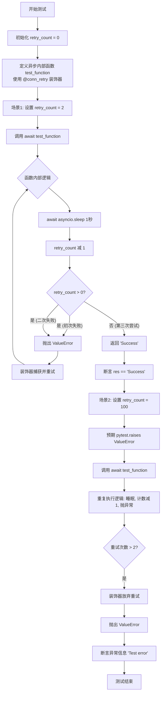

#### 带注释源码

```python
@pytest.mark.asyncio
async def test_conn_retry_async_function():
    # 初始化重试计数器
    retry_count = 0

    # 定义被测试的异步函数，应用 conn_retry 装饰器
    # 参数: 名称="Test", 描述="Test function", 最大重试次数=2, 最大等待时间=0.1秒
    @conn_retry("Test", "Test function", max_retry=2, max_wait=0.1)
    async def test_function():
        # 声明使用外部作用域的 retry_count 变量
        nonlocal retry_count
        # 模拟异步IO操作
        await asyncio.sleep(1)
        # 重试计数减 1
        retry_count -= 1
        # 如果计数大于0，模拟抛出异常
        if retry_count > 0:
            raise ValueError("Test error")
        # 否则返回成功结果
        return "Success"

    # --- 测试场景 1: 验证重试后成功 ---
    # 设置初始计数为 2 (意味着会失败 2 次，第 3 次成功，因为 max_retry=2)
    retry_count = 2
    # 调用异步函数
    res = await test_function()
    # 断言最终结果为成功
    assert res == "Success"

    # --- 测试场景 2: 验证超过重试次数后抛出异常 ---
    # 设置初始计数为 100 (意味着会一直失败，超过最大重试次数)
    retry_count = 100
    # 使用 pytest 检查是否抛出 ValueError
    with pytest.raises(ValueError) as e:
        await test_function()
        # 断言异常消息是否正确
        assert str(e.value) == "Test error"
```


### `TestRetryRateLimiting.setup_method`

在每个测试方法执行前重置速率限制器的状态，以确保测试之间的隔离性和一致性，防止前一个测试的状态影响后续测试。

参数：

- `self`：`TestRetryRateLimiting`，类的实例引用

返回值：`None`，无返回值

#### 流程图

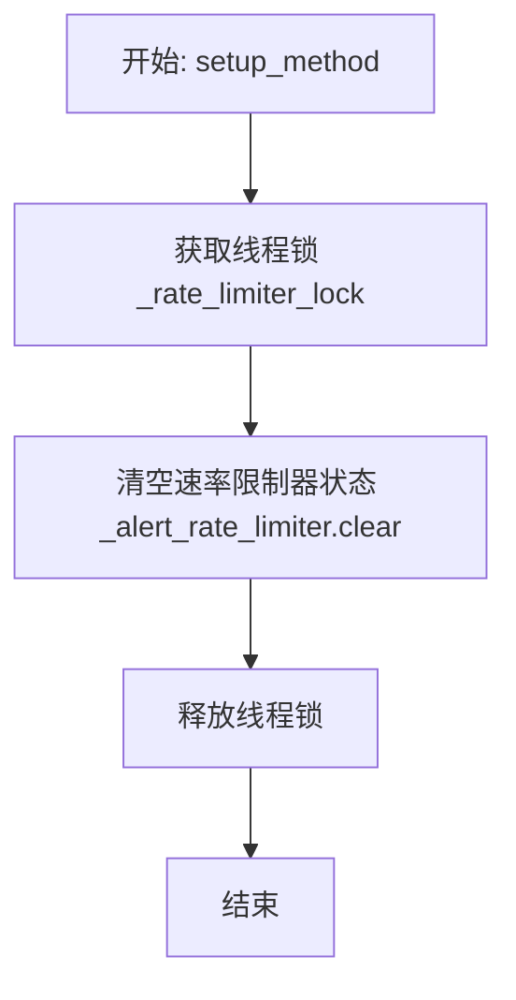

#### 带注释源码

```python
def setup_method(self):
    """Reset rate limiter state before each test."""
    with _rate_limiter_lock:  # 获取全局锁，确保在多线程环境下的操作安全
        _alert_rate_limiter.clear()  # 清空速率限制器字典，重置计数和状态
```


### `TestRetryRateLimiting.test_should_send_alert_allows_first_occurrence`

该方法是 `TestRetryRateLimiting` 测试类中的一个单元测试用例，用于验证在重试机制中，对于特定错误、函数和上下文的第一次出现，`should_send_alert` 函数能够正确返回 `True`，即允许发送警报，不受频率限制的约束。

参数：

- `self`：`TestRetryRateLimiting`，测试类的实例，用于访问测试上下文和共享状态。

返回值：`None`，该方法为测试用例，无返回值，通过断言验证逻辑正确性。

#### 流程图

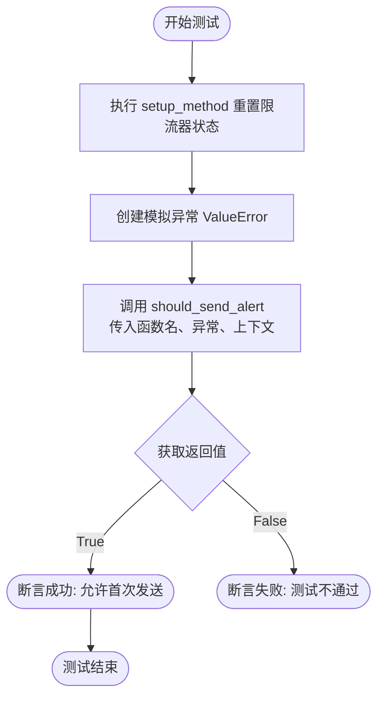

#### 带注释源码

```python
    def test_should_send_alert_allows_first_occurrence(self):
        """Test that the first occurrence of an error allows alert."""
        # 创建一个测试用的 ValueError 异常对象，模拟发生的错误
        exc = ValueError("test error")
        # 调用 should_send_alert 函数，验证在限流器状态为空（由 setup_method 保证）的情况下，
        # 针对特定的函数名("test_func")、异常对象和上下文("test_context")，
        # 系统是否判定为允许发送警报（预期返回 True）
        assert should_send_alert("test_func", exc, "test_context") is True
```


### `TestRetryRateLimiting.test_should_send_alert_rate_limits_duplicate`

测试当发生重复错误时，速率限制机制是否能正确阻止重复警报的发送。它验证了针对相同的函数、相同的异常对象和相同的上下文，第一次发送警报的请求被允许，但紧接着的后续请求会被限制并拒绝。

参数：

- `self`：`TestRetryRateLimiting`，测试类的实例，用于访问测试上下文和方法。

返回值：`None`，该函数不返回值，它通过断言验证 `should_send_alert` 函数在重复调用时的行为是否符合预期。

#### 流程图

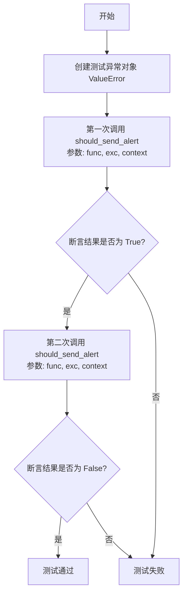

#### 带注释源码

```python
    def test_should_send_alert_rate_limits_duplicate(self):
        """Test that duplicate errors are rate limited."""
        # 初始化一个测试用的 ValueError 异常对象
        exc = ValueError("test error")

        # 第一次调用 should_send_alert，验证是否允许发送警报
        # 预期结果为 True，表示第一次发生的错误应该触发警报
        assert should_send_alert("test_func", exc, "test_context") is True

        # 第二次调用 should_send_alert，传入完全相同的参数
        # 预期结果为 False，表示重复的错误应该被速率限制机制拦截
        assert should_send_alert("test_func", exc, "test_context") is False
```


### `TestRetryRateLimiting.test_should_send_alert_allows_different_errors`

该测试用例验证了重试警报机制允许针对不同类型的错误发送警报，即使这些错误发生在同一个函数上下文中。这确保了限流逻辑是基于错误的具体内容进行区分，而不仅仅是基于函数名或上下文。

参数：

- `self`：`TestRetryRateLimiting`，测试类的实例，用于访问测试上下文和断言方法。

返回值：`None`，这是一个测试方法，没有显式的返回值，主要通过断言来验证行为。

#### 流程图

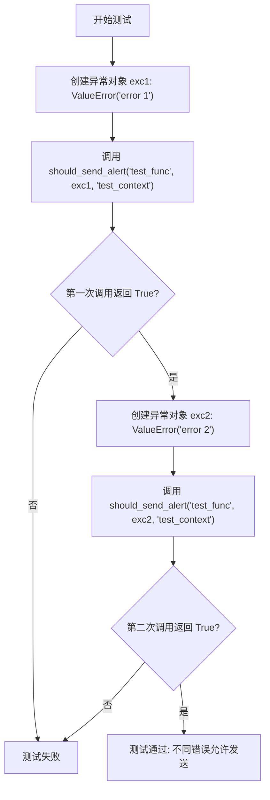

#### 带注释源码

```python
def test_should_send_alert_allows_different_errors(self):
    """Test that different errors are allowed even if same function."""
    # 创建第一个异常实例，错误信息为 "error 1"
    exc1 = ValueError("error 1")
    
    # 验证对于第一个错误，系统应该允许发送警报
    # 参数分别为: 函数名, 异常对象, 上下文
    assert should_send_alert("test_func", exc1, "test_context") is True

    # 创建第二个异常实例，错误信息为 "error 2"
    exc2 = ValueError("error 2")

    # 验证对于同一个函数中的不同错误，系统也应该允许发送警报
    # 这里测试限流器是否能够区分不同的错误内容，而不是简单地按函数名限流
    assert should_send_alert("test_func", exc2, "test_context") is True
```


### `TestRetryRateLimiting.test_should_send_alert_allows_different_contexts`

该方法用于验证告警速率限制机制对“上下文”（context）参数的敏感度。它确保即使函数名称和异常对象完全相同，只要传入的上下文参数不同，系统仍将其视为独立的告警事件，从而允许第二次告警通过，不被速率限制器拦截。

参数：

-   `self`：`TestRetryRateLimiting`，测试类的实例，用于访问测试环境及共享状态。

返回值：`None`，该方法是单元测试函数，无显式返回值，仅通过断言验证行为。

#### 流程图

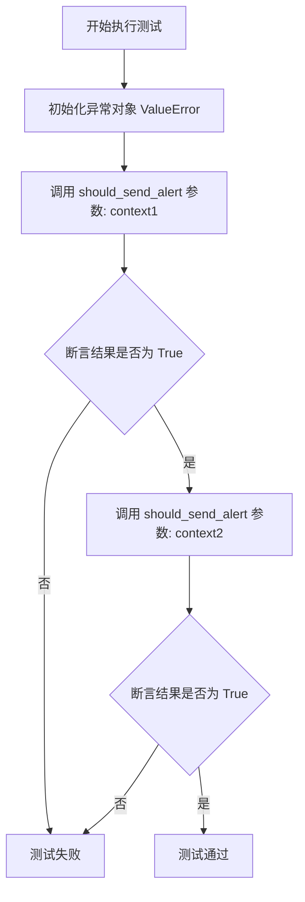

#### 带注释源码

```python
    def test_should_send_alert_allows_different_contexts(self):
        """Test that same error in different contexts is allowed."""
        # 创建一个测试用的异常实例
        exc = ValueError("test error")

        # 第一次调用：传入上下文 "context1"
        # 预期结果为 True，表示允许发送告警（因为是该上下文下的首次发生）
        assert should_send_alert("test_func", exc, "context1") is True

        # 第二次调用：传入上下文 "context2"（函数和异常与第一次相同）
        # 预期结果为 True，表示允许发送告警
        # 验证了不同的 context 参数被视为不同的限流维度
        assert should_send_alert("test_func", exc, "context2") is True
```


### `TestRetryRateLimiting.test_should_send_alert_allows_different_functions`

该方法用于验证重试警报的频率限制机制是否正确地将函数名称视为唯一键的一部分。它断言在相同的上下文（context）中发生的相同错误（exception），当出现在不同的函数中时，都会被允许发送警报（即不会被频率限制机制阻止）。这证明了频率限制是基于 "函数名 + 错误 + 上下文" 的组合来判定唯一性的，从而防止了不同函数的错误被错误地归并为同一个限制条目。

参数：

- `self`：`TestRetryRateLimiting`，测试类的实例，用于访问测试框架的上下文和共享资源。

返回值：`None`，该函数为单元测试方法，不返回具体数值，通过断言（assert）来验证行为是否符合预期。

#### 流程图

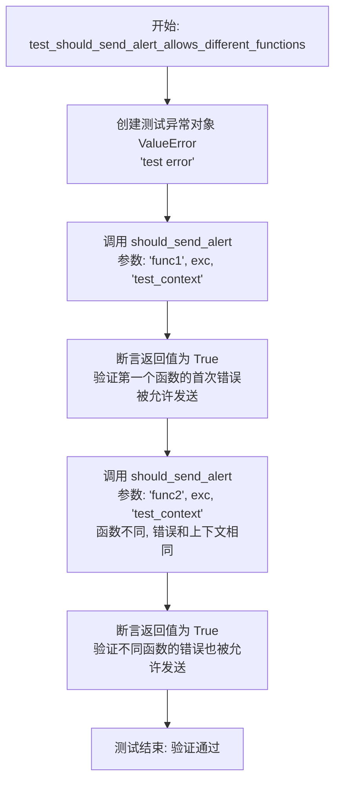

#### 带注释源码

```python
    def test_should_send_alert_allows_different_functions(self):
        """Test that same error in different functions is allowed."""
        # 创建一个模拟的异常对象
        exc = ValueError("test error")

        # 验证：对于第一个函数 'func1'，在给定上下文中发生该错误时，应该被允许发送警报
        # 预期结果: True (允许发送)
        assert should_send_alert("func1", exc, "test_context") is True

        # 验证：对于不同的函数 'func2'，即使错误对象和上下文完全相同，也应该被允许发送警报
        # 这确认了频率限制的 Key 包含函数名，因此不同函数被视为独立的警报源
        # 预期结果: True (允许发送)
        assert should_send_alert("func2", exc, "test_context") is True
```


### `TestRetryRateLimiting.test_should_send_alert_respects_time_window`

该测试验证当经过定义的时间窗口（`ALERT_RATE_LIMIT_SECONDS`）后，警报速率限制是否过期，从而允许为同一错误上下文再次发送警报。

参数：

- `self`：`TestRetryRateLimiting`，测试类的实例。

返回值：`None`，此方法不返回值，执行断言以验证行为。

#### 流程图

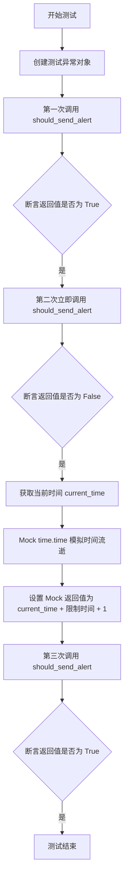

#### 带注释源码

```python
def test_should_send_alert_respects_time_window(self):
    """Test that alerts are allowed again after the rate limit window."""
    # 创建一个用于测试的异常对象
    exc = ValueError("test error")

    # 第一次调用，预期应允许发送警报（返回 True）
    assert should_send_alert("test_func", exc, "test_context") is True

    # 紧接着第二次调用，预期应被速率限制拦截（返回 False）
    assert should_send_alert("test_func", exc, "test_context") is False

    # Mock time to simulate passage of rate limit window
    # 记录当前实际时间
    current_time = time.time()
    # 使用 patch 替换 backend.util.retry 模块中的 time.time 函数
    with patch("backend.util.retry.time.time") as mock_time:
        # 模拟时间已经流逝了超过速率限制窗口的时间（限制时间 + 1秒）
        mock_time.return_value = current_time + ALERT_RATE_LIMIT_SECONDS + 1
        
        # 在模拟的新时间点再次调用，预期速率限制已重置，允许发送（返回 True）
        assert should_send_alert("test_func", exc, "test_context") is True
```


### `TestRetryRateLimiting.test_should_send_alert_thread_safety`

该测试方法通过模拟高并发场景，验证 `should_send_alert` 函数的速率限制机制是否是线程安全的。它创建多个线程同时尝试触发相同的警报，并断言在并发环境下，速率限制器依然能正确工作，只允许一个警报通过。

参数：

- `self`：`TestRetryRateLimiting`，测试类的实例，用于访问测试上下文和断言方法。

返回值：`None`，该方法不返回任何值，主要通过断言来验证行为是否符合预期。

#### 流程图

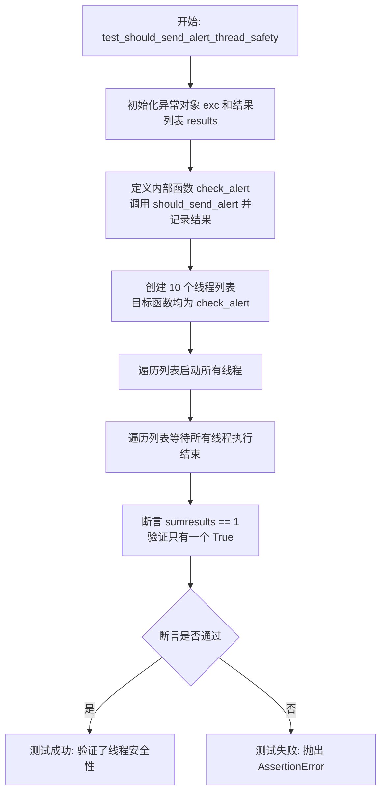

#### 带注释源码

```python
def test_should_send_alert_thread_safety(self):
    """Test that rate limiting is thread-safe."""
    # 初始化一个测试用的异常对象
    exc = ValueError("test error")
    # 用于存储各个线程调用结果的列表
    results = []

    def check_alert():
        # 调用待测试的 should_send_alert 函数，传入相同的函数名、异常和上下文
        result = should_send_alert("test_func", exc, "test_context")
        # 将判断结果（True 或 False）添加到结果列表中
        results.append(result)

    # 创建 10 个线程，每个线程都执行 check_alert 函数
    # 这模拟了并发场景下多个重试逻辑同时触发警报检查
    threads = [threading.Thread(target=check_alert) for _ in range(10)]

    # 启动所有线程
    for thread in threads:
        thread.start()

    # 使用 join 等待所有线程执行完毕
    for thread in threads:
        thread.join()

    # 验证并发安全性：
    # 1. 所有结果的总和应为 1
    # 2. 结果列表中 True 的数量应为 1（只有一次被允许发送）
    # 3. 结果列表中 False 的数量应为 9（其余均被限流）
    assert sum(results) == 1
    assert len([r for r in results if r is True]) == 1
    assert len([r for r in results if r is False]) == 9
```


### `TestRetryRateLimiting.test_send_critical_retry_alert_rate_limiting`

该测试方法用于验证关键重试警报机制中的速率限制功能是否按预期工作。通过模拟通知客户端，它确保在遇到重复错误时警报会被抑制（即发送一次后进行速率限制），而在遇到不同错误时警报能够正常发送，从而防止警报风暴并保证系统的稳定性。

参数：

-  `self`：`TestRetryRateLimiting`，测试类实例，用于提供测试上下文和访问类方法。
-  `mock_get_client`：`unittest.mock.Mock`，模拟对象，通过 `@patch` 装饰器注入，用于模拟 `get_notification_manager_client` 函数的行为，以便在不实际发送网络通知的情况下验证调用次数。

返回值：`None`，该函数为单元测试方法，不返回具体值，主要通过断言（assert）来验证逻辑的正确性。

#### 流程图

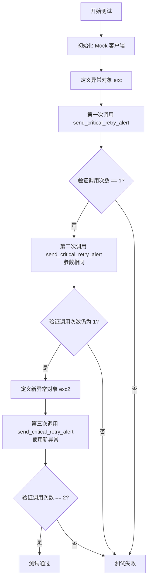

#### 带注释源码

```python
    @patch("backend.util.clients.get_notification_manager_client")
    def test_send_critical_retry_alert_rate_limiting(self, mock_get_client):
        """Test that _send_critical_retry_alert respects rate limiting."""
        # 设置模拟客户端对象，用于替代真实的通知服务
        mock_client = Mock()
        mock_get_client.return_value = mock_client

        # 定义一个模拟的异常对象，代表特定的API错误
        exc = ValueError("spend_credits API error")

        # 第一次调用警报发送函数，预期应该成功发送
        _send_critical_retry_alert("spend_credits", 50, exc, "Service communication")
        # 断言：验证 Discord 警报发送方法被调用了 1 次
        assert mock_client.discord_system_alert.call_count == 1

        # 第二次调用完全相同的警报（相同的函数、重试次数、异常和上下文）
        _send_critical_retry_alert("spend_credits", 50, exc, "Service communication")
        # 断言：验证调用次数仍为 1，证明重复警报被速率限制机制拦截
        assert mock_client.discord_system_alert.call_count == 1  # Still 1, not 2

        # 定义一个不同的异常对象，用于测试不同的错误场景
        exc2 = ValueError("different API error")
        # 使用新异常调用警报发送函数
        _send_critical_retry_alert("spend_credits", 50, exc2, "Service communication")
        # 断言：验证调用次数变为 2，证明不同的错误能够绕过速率限制并成功发送
        assert mock_client.discord_system_alert.call_count == 2
```


### `TestRetryRateLimiting.test_send_critical_retry_alert_handles_notification_failure`

该测试方法验证了即使在发送关键重试警报时通知服务发生异常（失败），系统也不会抛出未捕获的异常，并且速率限制器依然能够正常工作，防止重复的错误警报被发送。

参数：

- `self`：`TestRetryRateLimiting`，测试类实例，用于访问测试上下文和测试方法。
- `mock_get_client`：`Mock`，通过 `@patch` 装饰器注入的模拟对象，用于模拟 `get_notification_manager_client` 函数的行为。

返回值：`None`，该方法为测试用例，通过断言验证行为，无返回值。

#### 流程图

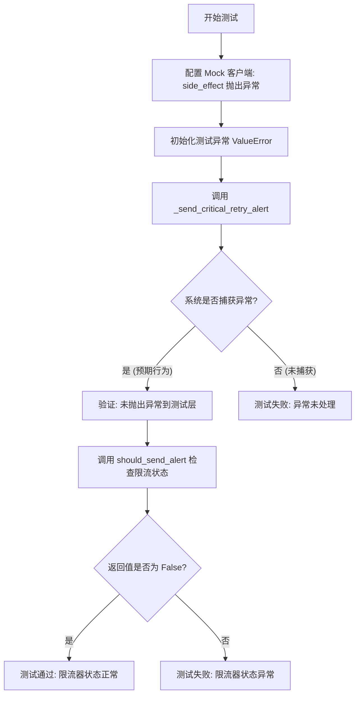

#### 带注释源码

```python
    @patch("backend.util.clients.get_notification_manager_client")
    def test_send_critical_retry_alert_handles_notification_failure(
        self, mock_get_client
    ):
        """Test that notification failures don't break the rate limiter."""
        # 创建模拟客户端对象
        mock_client = Mock()
        # 设置模拟客户端的 discord_system_alert 方法在调用时抛出异常
        # 模拟发送通知失败的场景
        mock_client.discord_system_alert.side_effect = Exception("Notification failed")
        # 设置 mock_get_client 返回我们配置好的模拟客户端
        mock_get_client.return_value = mock_client

        # 准备一个测试用的异常对象
        exc = ValueError("test error")

        # 调用目标函数 _send_critical_retry_alert
        # 预期行为: 即使内部通知发送抛出异常，该函数也不应向外抛出异常
        # 这验证了系统的健壮性，不会因为通知服务挂掉而导致主业务逻辑崩溃
        _send_critical_retry_alert("test_func", 50, exc, "test_context")

        # 验证速率限制器的状态
        # 因为上一步已经尝试发送过警报，即使失败了，速率限制器也应记录此次尝试
        # 因此再次检查相同错误时，应该返回 False (被限流)
        assert should_send_alert("test_func", exc, "test_context") is False
```


### `TestRetryRateLimiting.test_error_signature_generation`

该测试用例验证错误签名生成逻辑在处理长异常消息时的正确性，特别是测试了当异常消息长度超过限制（200字符）时，签名生成和限流逻辑是否能正常工作而不抛出异常。

参数：

-   `self`：`TestRetryRateLimiting`，测试类的实例

返回值：`None`，测试函数通常无返回值，通过断言验证结果

#### 流程图

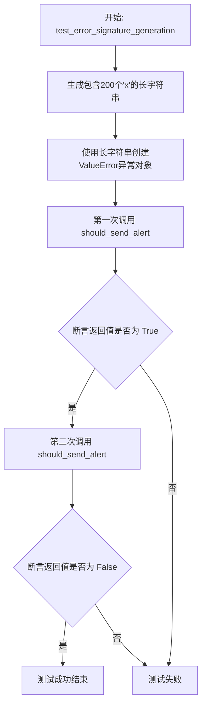

#### 带注释源码

```python
def test_error_signature_generation(self):
    """Test that error signatures are generated correctly for rate limiting."""
    # 构造一个长度为200字符的长消息
    # 测试目的是验证错误签名生成时会对长消息进行截断（例如截断到100字符）
    long_message = "x" * 200
    exc = ValueError(long_message)

    # 第一次调用 should_send_alert，预期应返回 True（允许发送）
    # 这同时也验证了生成签名的过程没有抛出异常
    assert should_send_alert("test_func", exc, "test_context") is True

    # 第二次调用，使用相同的参数
    # 预期应返回 False（被限流），说明签名生成一致，限流逻辑生效
    assert should_send_alert("test_func", exc, "test_context") is False
```


### `TestRetryRateLimiting.test_real_world_scenario_spend_credits_spam`

模拟现实中因特定 HTTP 500 错误（spend_credits 服务调用失败）反复发生而导致警报大量发送的场景。该测试验证了重试警报机制在首次触发后，是否正确地对后续重复的错误进行速率限制，从而防止在短时间内发送大量重复警报。

参数：

- `self`：`TestRetryRateLimiting`，测试类的实例引用，用于访问测试上下文。

返回值：`None`，无（测试方法通过断言验证行为，不返回值）。

#### 流程图

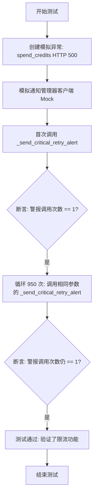

#### 带注释源码

```python
def test_real_world_scenario_spend_credits_spam(self):
    """Test the real-world scenario that was causing spam."""
    # 模拟导致问题的具体错误：spend_credits 接口的 500 错误
    exc = Exception(
        "HTTP 500: Server error '500 Internal Server Error' for url 'http://autogpt-database-manager.prod-agpt.svc.cluster.local:8005/spend_credits'"
    )

    # 使用 patch 模拟通知客户端，防止实际发送通知
    with patch(
        "backend.util.clients.get_notification_manager_client"
    ) as mock_get_client:
        mock_client = Mock()
        mock_get_client.return_value = mock_client

        # 前 50 次尝试达到阈值 - 应该发送一次警报
        _send_critical_retry_alert(
            "_call_method_sync", 50, exc, "Service communication"
        )
        # 验证此时只发送了一次警报
        assert mock_client.discord_system_alert.call_count == 1

        # 模拟接下来的 950 次失败，预期不应发送警报（被速率限制器拦截）
        for _ in range(950):
            _send_critical_retry_alert(
                "_call_method_sync", 50, exc, "Service communication"
            )

        # 验证总警报次数仍然为 1，证明速率限制有效
        assert mock_client.discord_system_alert.call_count == 1
```


### `TestRetryRateLimiting.test_retry_decorator_with_excessive_failures`

测试重试装饰器在遭遇持续失败并触发告警阈值时的行为。验证尽管重试次数超过阈值，但由于速率限制机制，关键告警仅发送一次。

参数：

-  `self`：`TestRetryRateLimiting`，测试类的实例，用于访问测试上下文和断言方法。
-  `mock_get_client`：`unittest.mock.MagicMock`，由 `@patch` 装饰器注入的模拟对象，用于替代真实的 `get_notification_manager_client`，以便验证告警发送逻辑。

返回值：`None`，该方法主要进行断言验证，不返回具体数值。

#### 流程图

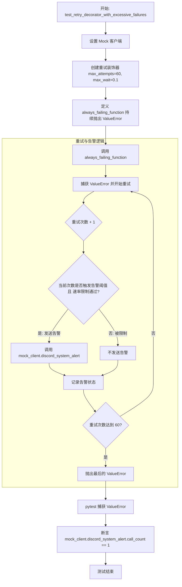

#### 带注释源码

```python
    @patch("backend.util.clients.get_notification_manager_client")
    def test_retry_decorator_with_excessive_failures(self, mock_get_client):
        """Test retry decorator behavior when it hits the alert threshold."""
        # 1. 初始化模拟客户端，用于替代真实的通知发送客户端
        mock_client = Mock()
        mock_get_client.return_value = mock_client

        # 2. 创建重试装饰器：设置最大尝试次数为60次（超过告警阈值），最大等待时间为0.1秒（加快测试速度）
        @create_retry_decorator(
            max_attempts=60, max_wait=0.1
        )  # More than EXCESSIVE_RETRY_THRESHOLD, but fast
        def always_failing_function():
            # 定义一个始终抛出异常的函数，模拟持续失败的场景
            raise ValueError("persistent failure")

        # 3. 执行函数，预期它会重试多次后抛出 ValueError
        with pytest.raises(ValueError):
            always_failing_function()

        # 4. 断言：尽管重试了很多次（60次），但告警只应该发送一次
        # 这验证了告警机制和速率限制（Rate Limiting）的共同作用
        assert mock_client.discord_system_alert.call_count == 1
```


## 关键组件


### 重试装饰器机制
提供同步和异步函数的自动重试能力，支持配置最大重试次数和等待时间，并在重试失败后抛出原始异常。

### 告警速率限制器
基于函数名、上下文和异常消息生成唯一签名，在设定的时间窗口内抑制重复的错误警报，防止通知服务过载。

### 关键重试通知服务
负责在检测到过度的重试行为时向外部服务（如 Discord）发送关键警报，并处理通知发送失败的情况以保证主流程不受影响。

### 并发状态保护
使用锁机制保护速率限制器的内部状态，确保多线程环境下对警报发送权限判断的准确性和线程安全性。


## 问题及建议


### 已知问题
-   全局可变状态依赖：测试代码中通过 `setup_method` 手动清空全局字典 `_alert_rate_limiter`，这表明底层实现严重依赖全局变量来管理限流状态。这种设计会导致测试隔离困难（需要手动清理状态），且在生产环境的并发或模块化场景下极易引发状态污染和数据竞争。
-   模块间耦合度过高：重试逻辑直接依赖 `backend.util.clients.get_notification_manager_client` 进行告警发送。这种强耦合导致重试机制与具体的通知实现（如Discord）绑定，违反了单一职责原则，不仅使得单元测试需要Mock复杂的客户端路径，也增加了未来更换通知渠道的维护成本。
-   硬编码的魔法值：测试中隐式引用了 `EXCESSIVE_RETRY_THRESHOLD`（通过设置 `max_attempts=60` 触发）以及错误签名截断长度（100字符）。这些阈值很可能硬编码在源码中，缺乏灵活性，无法针对不同环境或业务场景进行动态调整。
-   测试执行效率低下：`test_conn_retry_async_function` 等测试用例中使用了真实的 `await asyncio.sleep(1)`，这会导致测试执行累积等待时间过长，降低开发与CI流程的效率。

### 优化建议
-   引入依赖注入模式：将告警发送逻辑抽象为接口或回调函数参数传入 `create_retry_decorator` 或 `conn_retry`，而非直接调用具体客户端。这样可以彻底解耦重试逻辑与通知逻辑，提升代码的可测试性和可维护性。
-   重构状态管理机制：将速率限制器重构为独立的类实例，通过依赖注入的方式在重试逻辑中使用，取代当前的全局字典和锁。利用面向对象的方式管理生命周期，天然解决多实例隔离和状态清理问题。
-   优化测试中的时间控制：使用 `unittest.mock.patch` 替换 `time.time` 和 `asyncio.sleep`，或使用 `freezegun` 等库模拟时间流逝。避免在测试中进行真实的线程休眠，将异步测试的执行时间从秒级降低至毫秒级。
-   参数配置化：将最大重试次数、最大等待时间、速率限制窗口（`ALERT_RATE_LIMIT_SECONDS`）、错误签名截断长度等策略参数提取到配置文件或环境变量中，实现运行时可配置。
-   增强并发测试覆盖：当前的线程安全测试仅使用了10个线程，样本量较小。建议增加线程数量或使用协程并发测试，以更严格地验证在高并发场景下速率限制器的准确性及锁的竞争开销。


## 其它


### 设计目标与约束

**设计目标：**
1.  **提升系统鲁棒性**：通过自动重试机制（`conn_retry`），应对因网络抖动或瞬时服务不可用导致的调用失败，确保同步和异步函数的执行稳定性。
2.  **告警噪声控制**：防止在系统持续故障时产生“告警风暴”，通过速率限制（`should_send_alert`）确保相同类型的错误在特定时间窗口内仅触发一次告警通知。
3.  **可观测性**：在达到重试阈值时发送关键告警，帮助运维人员及时发现严重的系统性故障（如 `spend_credits` 接口持续 500 错误）。

**约束条件：**
1.  **异步兼容性**：重试机制必须同时支持同步函数和异步函数（`async def`），不能阻塞事件循环。
2.  **性能约束**：告警签名计算需高效，对于长异常消息必须截断（限制 100 字符），避免内存占用过高或哈希计算缓慢。
3.  **并发安全**：速率限制器必须线程安全（通过 `_rate_limiter_lock` 保护），在多线程环境下保证告警计数的准确性。
4.  **非阻塞容错**：告警发送失败绝不能影响主业务逻辑的执行，即通知系统的异常必须被内部消化。
5.  **时间窗口限制**：速率限制基于固定时间窗口（`ALERT_RATE_LIMIT_SECONDS`），强制限制告警发送的最小间隔。

### 错误处理与异常设计

**异常传播策略：**
1.  **业务异常透传**：被装饰的函数抛出的业务异常（如 `ValueError`）在达到最大重试次数后，必须原样向上抛出，确保调用方能感知原始错误。
2.  **告警异常隔离**：发送告警（调用 `discord_system_alert`）时发生的任何异常（如网络中断、客户端错误）必须在 `_send_critical_retry_alert` 内部捕获，严禁向外抛出，以免干扰业务重试流程。

**错误分级处理：**
1.  **临时性错误**：通过 `max_wait` 和 `max_retry` 参数控制重试策略，期望在有限时间内自我恢复。
2.  **持续性错误**：当重试次数达到阈值（如 50 次）时，系统将其视为严重故障，触发告警流程。告警的触发逻辑依赖于错误签名（函数名+上下文+异常信息），确保不同错误被区分处理，相同错误被归并处理。

### 数据流与状态机

**数据流：**
1.  **输入**：业务函数调用 -> 异常抛出。
2.  **重试计数**：异常捕获后，内部重试计数器累加。
3.  **阈值判定**：若重试次数达到设定阈值（如 50），提取函数名、上下文和异常信息生成唯一的错误签名。
4.  **速率限制检查**：
    *   查询全局 `_alert_rate_limiter`（字典）。
    *   若签名不存在或当前时间超过上次发送时间 + `ALERT_RATE_LIMIT_SECONDS`，允许发送。
    *   否则，拒绝发送。
5.  **告警动作**：若允许发送，调用通知客户端发送 Discord 消息，并更新 `_alert_rate_limiter` 中的时间戳。
6.  **输出**：继续重试或最终抛出异常。

**状态机：**
1.  **告警限流状态**：
    *   **Ready (就绪)**：初始状态，允许发送告警。发送后立即转移。
    *   **Limited (受限)**：在时间窗口内，相同错误签名的后续请求处于此状态，直接返回 False，不发送告警。
    *   **Reset (重置)**：时间窗口过期后，状态自动由 Limited 切换回 Ready。
2.  **重试执行状态**：
    *   **Running**：函数正在执行。
    *   **Waiting**：发生异常，处于 `max_wait` 的等待期。
    *   **Success**：执行成功，重置计数器。
    *   **Failed**：达到 `max_retry`，抛出异常，终止流程。

### 外部依赖与接口契约

**外部依赖：**
1.  **通知服务**：
    *   **组件**：`backend.util.clients.get_notification_manager_client`
    *   **契约**：必须返回一个具有 `discord_system_alert(message: str)` 方法的对象。该方法用于实际发送告警消息，测试中通过 Mock 模拟此行为。
2.  **系统时间**：
    *   **组件**：`time.time`
    *   **契约**：返回当前 Unix 时间戳（浮点数），用于计算速率限制的时间窗口。
3.  **并发原语**：
    *   **组件**：`threading.Lock`
    *   **契约**：提供 `acquire()` 和 `release()` 机制，用于保护全局字典 `_alert_rate_limiter` 的读写操作。

**内部接口契约：**
1.  **`conn_retry(component, name, max_retry, max_wait)`**：
    *   **输入**：组件名、描述、最大重试次数、最大等待时间。
    *   **输出**：装饰器函数。
    *   **行为**：返回的装饰器必须兼容同步和异步函数，并在内部处理重试循环。
2.  **`should_send_alert(func_name, exc, context)`**：
    *   **输入**：函数名字符串、异常对象、上下文字符串。
    *   **输出**：布尔值（True 表示允许发送，False 表示被限流）。
    *   **副作用**：若允许发送，会更新全局限流器状态。

    