# `.\AutoGPT\autogpt_platform\backend\backend\util\service.py` 详细设计文档

该代码实现了一个基于 FastAPI 的微服务框架，用于构建和通信分布式服务。它提供了 `AppService` 类用于创建带有自动路由注册、健康检查和监控集成的 RPC 服务器，以及 `get_service_client` 工厂用于生成动态的、类型感知的 HTTP 客户端。核心功能包括异步事件循环管理、连接池、重试逻辑、输入验证以及统一的服务间通信异常处理。

## 整体流程

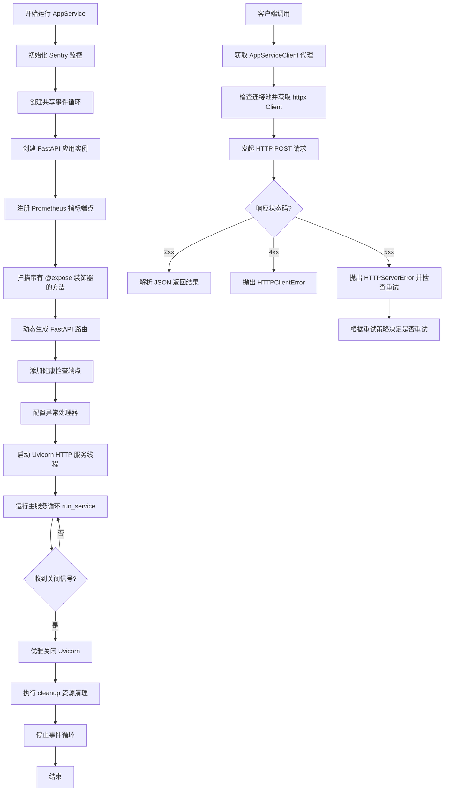

## 类结构

```
BaseAppService (抽象基类)
├── AppService
AppServiceClient (抽象基类)
RemoteCallError (Pydantic 模型)
UnhealthyServiceError (异常类)
HTTPClientError (异常类)
HTTPServerError (异常类)
DynamicClient (动态生成的内部类)
```

## 全局变量及字段


### `config`
    
全局配置对象实例

类型：`Config`
    


### `api_host`
    
Pyro 服务的主机地址

类型：`str`
    


### `api_comm_retry`
    
Pyro 客户端通信的最大重试次数

类型：`int`
    


### `api_comm_timeout`
    
Pyro 客户端通信超时时间

类型：`int`
    


### `api_call_timeout`
    
RPC 客户端调用的超时时间

类型：`int`
    


### `api_comm_max_wait`
    
Pyro 客户端通信的最大等待时间

类型：`int`
    


### `logger`
    
模块级别的日志记录器

类型：`logging.Logger`
    


### `T`
    
通用的类型变量

类型：`TypeVar`
    


### `C`
    
绑定到 Callable 的类型变量

类型：`TypeVar`
    


### `P`
    
参数规范类型变量

类型：`ParamSpec`
    


### `R`
    
返回类型的类型变量

类型：`TypeVar`
    


### `EXPOSED_FLAG`
    
用于标记服务暴露方法的属性名

类型：`str`
    


### `EXCEPTION_MAPPING`
    
将异常名称映射到异常类的字典

类型：`Dict[str, Type[Exception]]`
    


### `BaseAppService.shared_event_loop`
    
跨线程共享的异步事件循环

类型：`asyncio.AbstractEventLoop`
    


### `AppService.fastapi_app`
    
FastAPI 应用程序实例

类型：`FastAPI`
    


### `AppService.http_server`
    
托管 FastAPI 应用的 Uvicorn 服务器实例

类型：`uvicorn.Server | None`
    


### `AppService.log_level`
    
服务器的日志级别配置

类型：`str`
    


### `AppService._cleaned_up`
    
标记是否已完成清理的标志

类型：`bool`
    


### `AppService._shutting_down`
    
标记服务是否正在关闭的标志

类型：`bool`
    


### `RemoteCallError.type`
    
远程调用错误的类型名称

类型：`str`
    


### `RemoteCallError.args`
    
远程调用错误的参数列表

类型：`Optional[Tuple[Any, ...]]`
    


### `UnhealthyServiceError.message`
    
服务不可用时的错误消息

类型：`str`
    


### `HTTPClientError.status_code`
    
HTTP 客户端错误的状态码

类型：`int`
    


### `HTTPServerError.status_code`
    
HTTP 服务器错误的状态码

类型：`int`
    


### `DynamicClient.base_url`
    
服务通信的基础 URL

类型：`str`
    


### `DynamicClient._connection_failure_count`
    
记录连接失败次数的计数器

类型：`int`
    


### `DynamicClient._last_client_reset`
    
上次重置客户端连接的时间戳

类型：`float`
    


### `DynamicClient._async_clients`
    
异步 HTTP 客户端的缓存字典

类型：`Dict[Any, httpx.AsyncClient]`
    


### `DynamicClient._sync_clients`
    
同步 HTTP 客户端的缓存字典

类型：`Dict[str, httpx.Client]`
    
    

## 全局函数及方法


### `_validate_no_prisma_objects`

递归地验证服务方法返回的结果中不包含 Prisma 对象。该函数强制执行层级分离原则，确保只有应用模型（Application Models）跨越服务边界，防止数据库层模型（Prisma Objects）直接泄露到 API 响应中。

参数：

- `obj`：`Any`，待验证的目标对象，可以是任意类型的数据结构。
- `path`：`str`，用于错误日志的路径字符串，标识对象在数据结构中的位置（例如 "result[0]['user']"），默认值为 "result"。

返回值：`None`，无返回值。如果检测到 Prisma 对象，则抛出 `ValueError` 异常。

#### 流程图

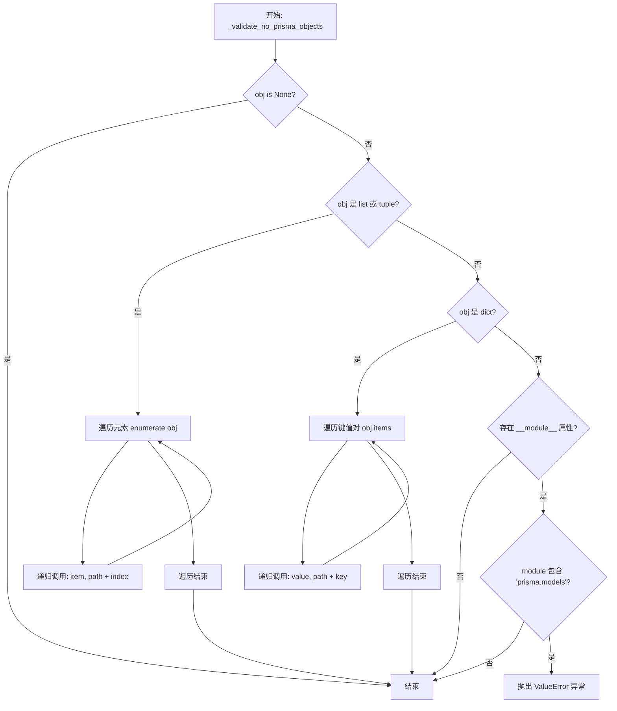

#### 带注释源码

```python
def _validate_no_prisma_objects(obj: Any, path: str = "result") -> None:
    """
    Recursively validate that no Prisma objects are being returned from service methods.
    This enforces proper separation of layers - only application models should cross service boundaries.
    """
    # 如果对象为空，直接返回，无需进一步检查
    if obj is None:
        return

    # 检查对象是否具有类属性和模块属性，以确定其来源
    if hasattr(obj, "__class__") and hasattr(obj.__class__, "__module__"):
        module_name = obj.__class__.__module__
        # 判断模块名是否包含 "prisma.models"，这是 Prisma 生成的数据库模型的特征
        if module_name and "prisma.models" in module_name:
            # 发现违规的 Prisma 对象，抛出异常并提示使用转换方法（如 from_db）
            raise ValueError(
                f"Prisma object {obj.__class__.__name__} found in {path}. "
                "Service methods must return application models, not Prisma objects. "
                f"Use {obj.__class__.__name__}.from_db() to convert to application model."
            )

    # 如果是列表或元组类型，递归检查其每个元素
    if isinstance(obj, (list, tuple)):
        for i, item in enumerate(obj):
            # 构造带有索引的路径信息，便于定位错误位置
            _validate_no_prisma_objects(item, f"{path}[{i}]")
    # 如果是字典类型，递归检查其每个值
    elif isinstance(obj, dict):
        for key, value in obj.items():
            # 构造带有键名的路径信息，便于定位错误位置
            _validate_no_prisma_objects(value, f"{path}['{key}']")
```


### `expose`

一个装饰器函数，用于标记函数或方法为“已暴露”，使其能够在 RPC 服务中被自动发现并注册为 API 端点。它通过在函数对象上设置特定的属性标志来实现这一功能。

参数：

-   `func`：`C`，要被标记暴露的函数或方法，其中 `C` 是绑定到 `Callable` 的类型变量。

返回值：`C`，被标记了 `__exposed__` 属性的原始函数对象。

#### 流程图

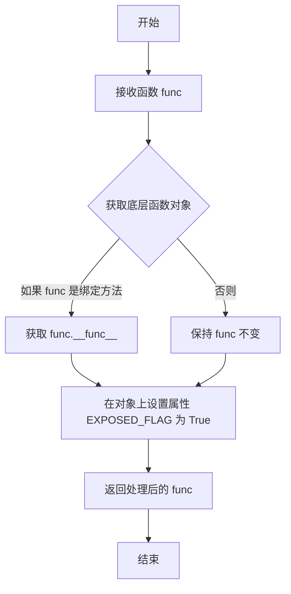

#### 带注释源码

```python
def expose(func: C) -> C:
    # 获取函数的底层实际对象。
    # 如果 func 是一个绑定方法（通过实例调用），这会提取其底层的 __func__。
    # 如果是普通函数，则返回原样。
    # 这样做是为了确保属性被设置在函数定义本身，而不是实例的包装器上。
    func = getattr(func, "__func__", func)
    
    # 设置 EXPOSED_FLAG ("__exposed__") 属性为 True。
    # AppService 在启动时会扫描类属性，通过此标志判断是否需要注册为 API 路由。
    setattr(func, EXPOSED_FLAG, True)
    
    # 返回原始函数对象（未改变其行为），符合装饰器的标准模式。
    return func
```


### `get_service_client`

该函数是一个工厂函数，用于为指定的 `AppServiceClient` 子类创建一个动态服务客户端实例。它内部定义了一个 `DynamicClient` 类，该类利用 httpx 库实现基于 HTTP 的 RPC 通信，自动处理同步/异步调用、连接池管理、错误映射以及根据配置进行请求重试。

参数：

-  `service_client_type`：`Type[ASC]`，客户端的类型（继承自 `AppServiceClient`），用于识别目标服务、获取服务地址（Host/Port）以及定义可调用的方法接口。
-  `call_timeout`：`int | None`，单个 HTTP 请求的超时时间（秒），默认使用全局配置 `api_call_timeout`。
-  `request_retry`：`bool`，是否启用请求失败时的自动重试机制，默认为 `False`。

返回值：`ASC`，返回一个实现了 `AppServiceClient` 接口的动态客户端实例，该实例通过魔术方法将调用转化为 HTTP 请求发送到远程服务。

#### 流程图

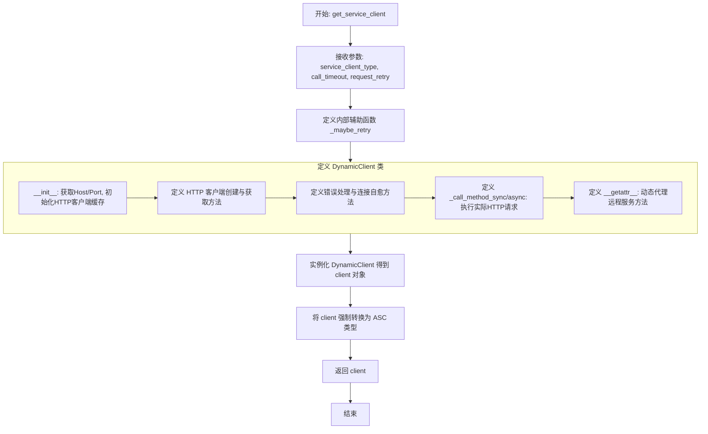

#### 带注释源码

```python
@conn_retry("AppService client", "Creating service client", max_retry=api_comm_retry)
def get_service_client(
    service_client_type: Type[ASC],
    call_timeout: int | None = api_call_timeout,
    request_retry: bool = False,
) -> ASC:

    def _maybe_retry(fn: Callable[..., R]) -> Callable[..., R]:
        """装饰器工厂：根据 request_retry 参数决定是否为方法添加重试逻辑。"""
        if not request_retry:
            return fn

        # 使用预配置的重试装饰器，排除客户端错误等不应重试的异常
        return create_retry_decorator(
            max_attempts=api_comm_retry,
            max_wait=api_comm_max_wait,
            context="Service communication",
            exclude_exceptions=(
                ValueError,  # 无效输入
                DataError,   # 数据完整性错误
                KeyError,
                TypeError,
                AttributeError,
                asyncio.CancelledError,
                concurrent.futures.CancelledError,
                HTTPClientError,  # HTTP 4xx 错误不重试
            ),
        )(fn)

    class DynamicClient:
        def __init__(self) -> None:
            # 从传入的客户端类型获取对应的服务类信息
            service_type = service_client_type.get_service_type()
            host = service_type.get_host()
            port = service_type.get_port()
            # 构建基础 URL
            self.base_url = f"http://{host}:{port}".rstrip("/")
            self._connection_failure_count = 0
            self._last_client_reset = 0
            # 存储异步客户端，key 为 event loop，None 为默认 key
            self._async_clients = {} 
            # 存储同步客户端
            self._sync_clients = {} 

        def _create_sync_client(self) -> httpx.Client:
            """创建配置好的同步 HTTP 客户端。"""
            return httpx.Client(
                base_url=self.base_url,
                timeout=call_timeout,
                limits=httpx.Limits(
                    max_keepalive_connections=200,
                    max_connections=500,
                    keepalive_expiry=30.0,
                ),
            )

        def _create_async_client(self) -> httpx.AsyncClient:
            """创建配置好的异步 HTTP 客户端。"""
            return httpx.AsyncClient(
                base_url=self.base_url,
                timeout=call_timeout,
                limits=httpx.Limits(
                    max_keepalive_connections=200,
                    max_connections=500,
                    keepalive_expiry=30.0,
                ),
            )

        @property
        def sync_client(self) -> httpx.Client:
            """获取或创建单例模式的同步客户端。"""
            service_name = service_client_type.get_service_type().__name__
            if client := self._sync_clients.get(service_name):
                return client
            return self._sync_clients.setdefault(
                service_name, self._create_sync_client()
            )

        @property
        def async_client(self) -> httpx.AsyncClient:
            """获取或创建与当前事件循环绑定的异步客户端。"""
            try:
                loop = asyncio.get_running_loop()
            except RuntimeError:
                loop = None

            if client := self._async_clients.get(loop):
                return client
            return self._async_clients.setdefault(loop, self._create_async_client())

        def _handle_connection_error(self, error: Exception) -> None:
            """处理连接错误，在连续失败多次后重建客户端以实现自愈。"""
            self._connection_failure_count += 1
            current_time = time.time()

            if (
                self._connection_failure_count >= 3
                and current_time - self._last_client_reset > 30
            ):
                logger.warning(
                    f"Connection failures detected ({self._connection_failure_count}), recreating HTTP clients"
                )
                self._sync_clients.clear()
                self._async_clients.clear()
                self._connection_failure_count = 0
                self._last_client_reset = current_time

        def _handle_call_method_response(
            self, *, response: httpx.Response, method_name: str
        ) -> Any:
            """处理 HTTP 响应，解析 JSON 并根据状态码映射到相应的 Python 异常。"""
            try:
                response.raise_for_status()
                self._connection_failure_count = 0
                return response.json()
            except httpx.HTTPStatusError as e:
                status_code = e.response.status_code
                error_response = None
                try:
                    # 尝试解析服务端返回的标准错误结构
                    error_response = RemoteCallError.model_validate(e.response.json())
                except Exception:
                    pass

                # 如果是已知错误类型，抛出具体异常
                if error_response and error_response.type in EXCEPTION_MAPPING:
                    exception_class = EXCEPTION_MAPPING[error_response.type]
                    args = error_response.args or [str(e)]
                    raise exception_class(*args)

                # 否则按 HTTP 状态码分类
                if 400 <= status_code < 500:
                    raise HTTPClientError(status_code, str(e))
                elif 500 <= status_code < 600:
                    raise HTTPServerError(status_code, str(e))
                else:
                    raise e

        @_maybe_retry
        def _call_method_sync(self, method_name: str, **kwargs: Any) -> Any:
            """执行同步的 RPC 调用。"""
            try:
                return self._handle_call_method_response(
                    method_name=method_name,
                    response=self.sync_client.post(method_name, json=to_dict(kwargs)),
                )
            except (httpx.ConnectError, httpx.ConnectTimeout) as e:
                self._handle_connection_error(e)
                raise

        @_maybe_retry
        async def _call_method_async(self, method_name: str, **kwargs: Any) -> Any:
            """执行异步的 RPC 调用。"""
            try:
                return self._handle_call_method_response(
                    method_name=method_name,
                    response=await self.async_client.post(
                        method_name, json=to_dict(kwargs)
                    ),
                )
            except (httpx.ConnectError, httpx.ConnectTimeout) as e:
                self._handle_connection_error(e)
                raise

        # ... (省略 close, __del__, __aenter__, __aexit__ 等资源清理代码) ...

        def _get_params(
            self, signature: inspect.Signature, *args: Any, **kwargs: Any
        ) -> dict[str, Any]:
            """将位置参数和关键字参数合并为字典。"""
            if args:
                arg_names = list(signature.parameters.keys())
                if arg_names and arg_names[0] in ("self", "cls"):
                    arg_names = arg_names[1:]
                kwargs.update(dict(zip(arg_names, args)))
            return kwargs

        def _get_return(self, expected_return: TypeAdapter | None, result: Any) -> Any:
            """使用 Pydantic 验证并转换返回值。"""
            if expected_return:
                return expected_return.validate_python(result)
            return result

        def __getattr__(self, name: str) -> Callable[..., Any]:
            """
            动态方法代理：当访问 client.method_name 时触发。
            根据原始方法的签名生成对应的调用函数（同步或异步）。
            """
            original_func = getattr(service_client_type, name, None)
            if original_func is None:
                raise AttributeError(
                    f"Method {name} not found in {service_client_type}"
                )

            rpc_name = original_func.__name__
            sig = inspect.signature(original_func)
            ret_ann = sig.return_annotation
            expected_return = (
                None if ret_ann is inspect.Signature.empty else TypeAdapter(ret_ann)
            )

            if inspect.iscoroutinefunction(original_func):
                # 生成异步调用包装器
                async def async_method(*args: P.args, **kwargs: P.kwargs):
                    params = self._get_params(sig, *args, **kwargs)
                    result = await self._call_method_async(rpc_name, **params)
                    return self._get_return(expected_return, result)

                return async_method
            else:
                # 生成同步调用包装器
                def sync_method(*args: P.args, **kwargs: P.kwargs):
                    params = self._get_params(sig, *args, **kwargs)
                    result = self._call_method_sync(rpc_name, **params)
                    return self._get_return(expected_return, result)

                return sync_method

    # 实例化动态客户端并将其类型转换为声明的客户端类型 ASC
    client = cast(ASC, DynamicClient())

    return client
```


### `endpoint_to_sync`

该函数用于生成一个在类型检查层面视为同步的存根函数，通过转换异步函数的签名，使得动态客户端代理能够将其识别为需要使用同步 HTTP 调用处理的接口。

参数：

-  `func`：`Callable[Concatenate[Any, P], Awaitable[R]]`，待转换的原始异步函数对象。

返回值：`Callable[Concatenate[Any, P], R]`，一个被转换后的同步函数存根，其返回类型不再包含 `Awaitable`。

#### 流程图

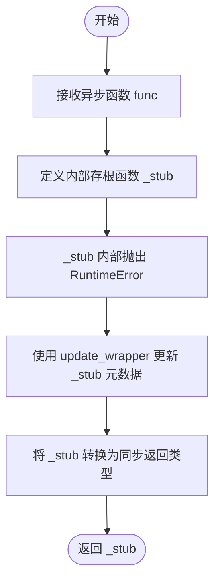

#### 带注释源码

```python
def endpoint_to_sync(
    func: Callable[Concatenate[Any, P], Awaitable[R]],
) -> Callable[Concatenate[Any, P], R]:
    """
    Produce a *typed* stub that **looks** synchronous to the type‑checker.
    生成一个在类型检查器看来是同步的*类型化*存根。
    """
    # 定义一个内部函数作为同步存根
    def _stub(*args: P.args, **kwargs: P.kwargs) -> R:  # pragma: no cover
        # 如果直接调用此存根（未被 __getattr__ 拦截），则抛出错误
        # 这表明该方法主要是一个用于类型提示和动态代理的占位符
        # 实际的调用逻辑由 AppServiceClient 的 __getattr__ 拦截并处理
        raise RuntimeError("should be intercepted by __getattr__")

    # 将原函数的元数据（如 __name__, __doc__ 等）复制到存根函数
    # 这样可以让存根函数在调试和反射时看起来和原函数一模一样
    # 唯一的区别是类型签名变成了同步返回
    update_wrapper(_stub, func)
    
    # 将存根强制转换为返回值类型为 R 的同步 Callable 类型
    # 这里利用 cast 告诉类型检查器将此函数视为同步函数
    return cast(Callable[Concatenate[Any, P], R], _stub)
```


### `endpoint_to_async`

该函数是一个装饰器或工厂函数，用于将一个原本同步的函数定义转换为一个返回协程的异步存根。它主要用于类型提示和代码结构对齐，使得在客户端调用时，能够以异步的方式定义方法，但实际执行逻辑会被动态客户端的 `__getattr__` 拦截并处理。

参数：

- `func`：`Callable[Concatenate[Any, P], R]`，被包装的原始同步函数对象，其中 `P` 是参数类型，`R` 是返回值类型。

返回值：`Callable[Concatenate[Any, P], Awaitable[R]]`，一个模拟异步函数签名的存根包装器，该包装器在实际调用时应被拦截逻辑捕获，否则会抛出异常。

#### 流程图

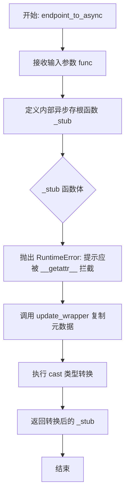

#### 带注释源码

```python
def endpoint_to_async(
    func: Callable[Concatenate[Any, P], R],
) -> Callable[Concatenate[Any, P], Awaitable[R]]:
    """
    The async mirror of `to_sync`.
    """

    # 定义一个异步存根函数，用于模拟异步接口。
    # 使用 pragma: no cover 忽略覆盖率，因为该函数体主要由拦截器逻辑处理，不应被直接执行。
    async def _stub(*args: P.args, **kwargs: P.kwargs) -> R:  # pragma: no cover
        # 如果这个函数被实际调用（意味着没有被预期的 __getattr__ 逻辑拦截），
        # 则抛出运行时错误，提示开发者出现了逻辑错误。
        raise RuntimeError("should be intercepted by __getattr__")

    # 将原始函数 func 的元数据（如 __name__, __doc__ 等）复制到 _stub 上，
    # 保持调试信息和文档字符串的一致性。
    update_wrapper(_stub, func)
    
    # 使用 cast 将返回值类型显式转换为期望的异步函数签名。
    # 这对于静态类型检查器非常重要，使其认为该函数返回一个 Awaitable。
    return cast(Callable[Concatenate[Any, P], Awaitable[R]], _stub)
```


### `BaseAppService.get_port`

这是一个抽象类方法，定义了获取服务运行端口的接口契约，强制子类必须实现该方法以返回具体的端口号。

参数：

- `cls`：`Type`，由 `@classmethod` 装饰器自动传入的类对象。

返回值：`int`，服务监听的网络端口号。

#### 流程图

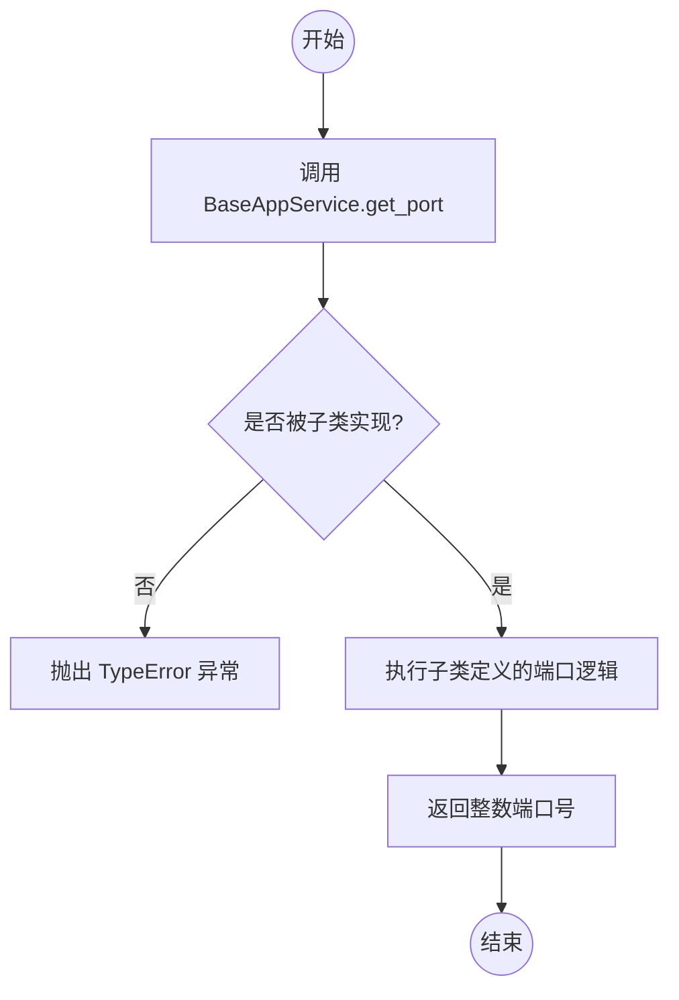

#### 带注释源码

```python
@classmethod
@abstractmethod
def get_port(cls) -> int:
    # 抽象方法定义，不包含具体实现逻辑
    # 使用 @abstractmethod 装饰器确保任何继承自 BaseAppService 的子类
    # 必须重写此方法，否则实例化时会报错。
    # 方法返回一个整数，表示服务绑定的端口。
    pass
```


### `BaseAppService.get_host`

获取服务的主机地址。该方法通过检查环境变量来确定源服务和目标服务的配置主机。如果检测到源服务与目标服务配置为相同的非默认主机，则强制返回默认 API 主机，以优化网络路由（例如使用 localhost 代替外部 IP）。

参数：

-   `cls`：`Type[BaseAppService]`，表示当前调用该方法的类对象，用于获取类名以构建环境变量键。

返回值：`str`，确定的服务主机地址字符串。

#### 流程图

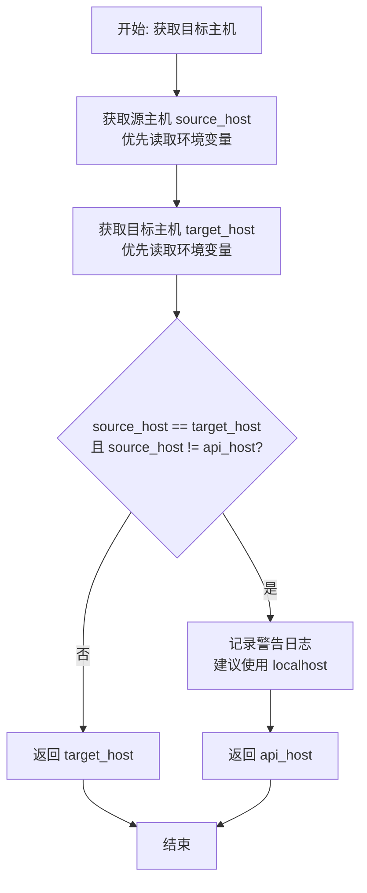

#### 带注释源码

```python
    @classmethod
    def get_host(cls) -> str:
        # 1. 尝试从环境变量中获取当前服务的源主机配置
        # 键格式为：{SERVICE_NAME}_HOST，如果不存在则使用全局默认的 api_host
        source_host = os.environ.get(f"{get_service_name().upper()}_HOST", api_host)
        
        # 2. 尝试从环境变量中获取目标服务（即当前 cls 对应的服务）的主机配置
        # 键格式为：{CLASS_NAME}_HOST，如果不存在则使用全局默认的 api_host
        target_host = os.environ.get(f"{cls.__name__.upper()}_HOST", api_host)

        # 3. 检查逻辑：如果源主机和目标主机相同，且它们都不是默认的 api_host
        # 这意味着两个服务部署在同一台外部机器上。为了避免绕一圈外部网络，
        # 系统建议直接使用默认主机（通常是本地回环地址或内部局域网地址）。
        if source_host == target_host and source_host != api_host:
            logger.warning(
                f"Service {cls.__name__} is the same host as the source service."
                f"Use the localhost of {api_host} instead."
            )
            # 返回默认配置的主机地址
            return api_host

        # 否则，返回目标服务特定的主机配置
        return target_host
```


### `BaseAppService.run_service`

该方法用于在单独的线程中启动并运行共享的异步事件循环，同时阻塞主线程以防止进程退出。此设计旨在绕过 Uvicorn 对信号的默认处理行为，从而允许服务自定义信号处理逻辑（如优雅关闭）。

参数：

-  `self`：`BaseAppService`，指向类实例本身的引用。

返回值：`None`，无返回值，该方法会阻塞直到共享事件循环停止。

#### 流程图

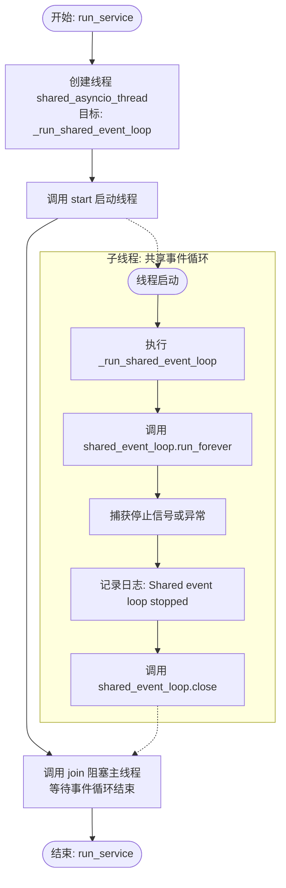

#### 带注释源码

```python
    def run_service(self) -> None:
        # HACK: 在主线程之外的线程中运行主事件循环，以禁用 Uvicorn 的
        # 内部信号处理器，因为没有配置选项可以直接禁用 :(
        shared_asyncio_thread = threading.Thread(
            target=self._run_shared_event_loop, # 线程执行的目标函数，用于运行 asyncio 事件循环
            daemon=True,                        # 设置为守护线程，当主程序退出时该线程也会随之退出
            name=f"{self.service_name}-shared-event-loop", # 设置线程名称以便于调试和日志追踪
        )
        shared_asyncio_thread.start() # 启动新线程，开始运行事件循环
        shared_asyncio_thread.join()  # 在主线程中等待子线程结束（阻塞），直到事件循环停止
```


### `BaseAppService._run_shared_event_loop`

该方法旨在独立的守护线程中运行共享的 asyncio 事件循环。它会无限期地运行该循环直到被显式停止（通常通过 `cleanup` 方法），并确保在循环停止后记录日志并关闭循环以释放资源。

参数：

-   无

返回值：`None`，无返回值。

#### 流程图

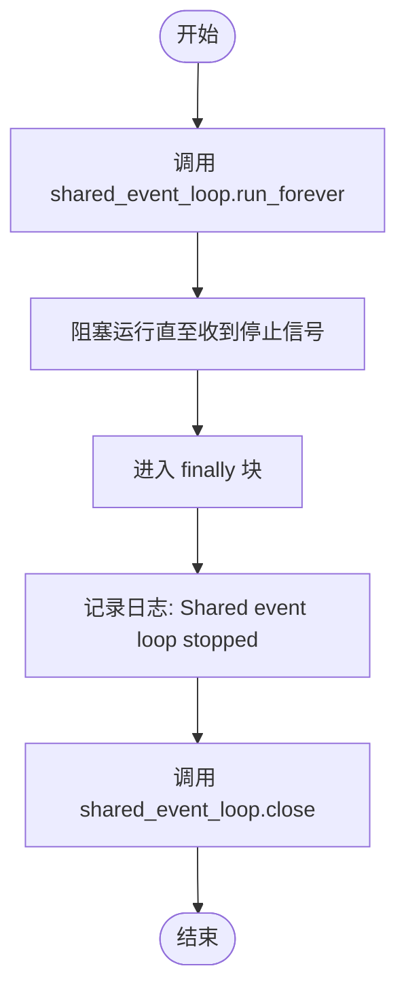

#### 带注释源码

```python
    def _run_shared_event_loop(self) -> None:
        try:
            # 启动事件循环，这将阻塞当前线程，直到 loop.stop() 被调用
            self.shared_event_loop.run_forever()
        finally:
            # 当循环停止后，记录停止日志
            logger.info(f"[{self.service_name}] 🛑 Shared event loop stopped")
            # 关闭事件循环，确保释放所有持有的资源
            self.shared_event_loop.close()  # ensure held resources are released
```


### `BaseAppService.run_and_wait`

该方法的本质是在非异步上下文中同步执行异步代码，通过将协程提交给共享的事件循环并阻塞等待结果，实现了跨线程的异步任务调度。

参数：

- `coro`：`Coroutine[Any, Any, T]`，需要被调度执行的异步协程对象。

返回值：`T`，协程执行完成后返回的结果类型。

#### 流程图

```mermaid
flowchart TD
    Start([开始]) --> Input[接收协程对象 coro]
    Input --> Schedule[调用 asyncio.run_coroutine_threadsafe<br/>将 coro 提交至 shared_event_loop]
    Schedule --> GetFuture[获取 Future 对象]
    GetFuture --> WaitResult[调用 Future.result()<br/>阻塞当前线程直至完成]
    WaitResult --> End([返回结果 T])
```

#### 带注释源码

```python
def run_and_wait(self, coro: Coroutine[Any, Any, T]) -> T:
    # 使用 asyncio.run_coroutine_threadsafe 将协程安全地调度到指定的事件循环中
    # 即使当前不在该事件循环所在的线程也能运行
    # .result() 方法会阻塞调用线程，直到协程执行完毕并返回结果
    return asyncio.run_coroutine_threadsafe(coro, self.shared_event_loop).result()
```


### `BaseAppService.run`

该方法用于初始化应用服务的基础异步运行时环境。它创建一个新的 `asyncio` 事件循环并将其设置为当前线程的默认事件循环，这是服务能够执行异步操作（如处理并发请求或后台任务）的前提条件。

参数：

-   （无显式参数，仅包含 `self`）

返回值：`None`，该方法主要执行初始化操作，不返回具体数值。

#### 流程图

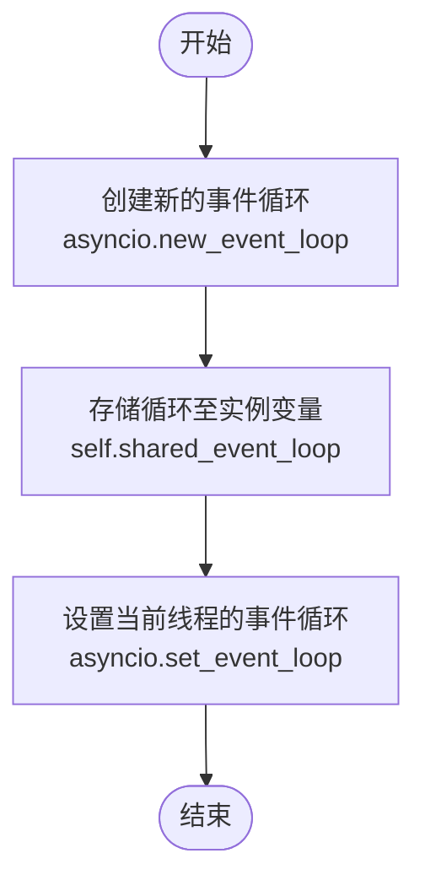

#### 带注释源码

```python
    def run(self):
        # 创建一个新的异步事件循环对象
        # 该循环将作为服务共享的事件循环，用于调度和管理异步任务
        self.shared_event_loop = asyncio.new_event_loop()
        # 将新创建的事件循环设置为当前线程的默认事件循环
        # 这确保了在当前线程中调用的 asyncio 库函数能够找到并使用这个循环
        asyncio.set_event_loop(self.shared_event_loop)
```


### `BaseAppService.cleanup`

该方法用于在服务执行完毕后执行清理操作，其主要功能是停止共享的事件循环以释放资源，并调用父类的清理方法以确保层级化的资源释放。

参数：

-  `self`：`BaseAppService`，类的实例对象本身。

返回值：`None`，无返回值。

#### 流程图

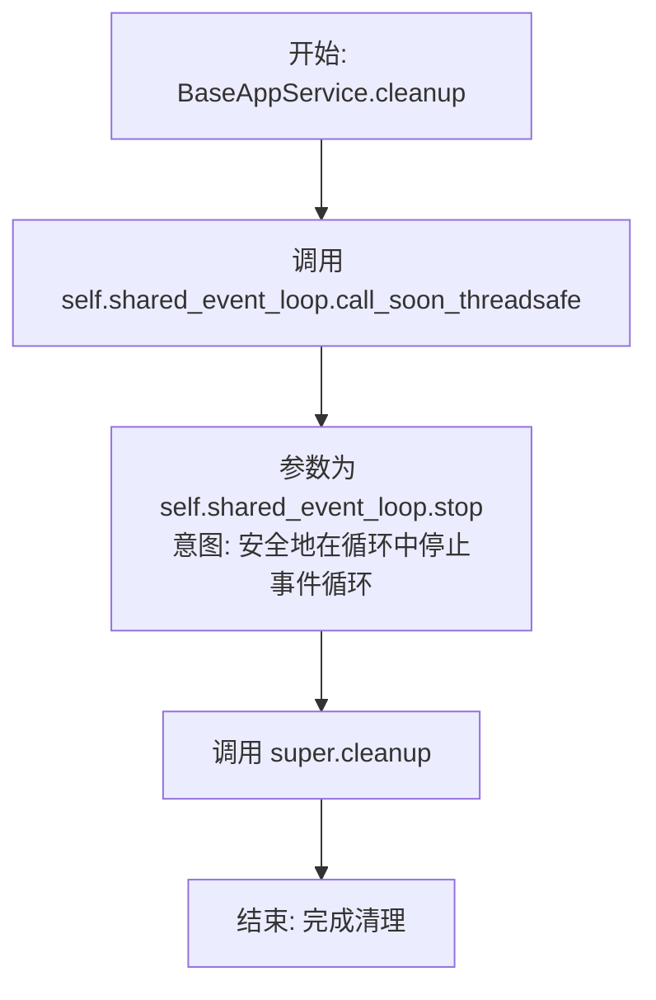

#### 带注释源码

```python
    def cleanup(self):
        """
        **💡 Overriding `AppService.lifespan` may be a more convenient option.**

        Implement this method on a subclass to do post-execution cleanup,
        e.g. disconnecting from a database or terminating child processes.

        **Note:** if you override this method in a subclass, it must call
        `super().cleanup()` *at the end*!
        """
        # 停止共享的事件循环以允许资源清理
        # call_soon_threadsafe 用于从另一个线程安全地向事件循环调度回调
        # 这里调度的是 stop() 方法，这会导致 run_forever() 退出，从而允许事件循环关闭
        self.shared_event_loop.call_soon_threadsafe(self.shared_event_loop.stop)

        # 调用父类 AppProcess 的 cleanup 方法
        # 确保继承链上的所有清理逻辑都能被执行
        super().cleanup()
```


### `AppService.set_log_level`

该方法用于设置 Uvicorn 服务器的日志级别，并返回实例自身以支持方法链式调用配置。

参数：

-  `log_level`：`str`，用于配置 Uvicorn 服务器日志详细程度的字符串，常见的值包括 "info", "debug", "warning", "error" 等。

返回值：`AppService`，返回 `AppService` 实例自身（`self`），以便进行链式调用。

#### 流程图

```mermaid
graph TD
    A[开始: 调用 set_log_level] --> B[接收参数 log_level: str]
    B --> C[将 self.log_level 赋值为 log_level]
    C --> D[返回 self (实例引用)]
    D --> E[结束]
```

#### 带注释源码

```python
    def set_log_level(self, log_level: str):
        """Set the uvicorn log level. Returns self for chaining."""
        # 将传入的 log_level 参数赋值给实例变量 self.log_level
        # 该变量后续会被用于配置 uvicorn.Config 的日志级别
        self.log_level = log_level
        # 返回 self 实例，支持链式调用（例如：service.set_log_level("debug").run()）
        return self
```


### `AppService._handle_internal_http_error`

这是一个静态方法工厂，用于生成 FastAPI 的异常处理器。该方法创建并返回一个处理函数，该函数负责捕获异常、根据配置记录错误日志，并返回标准化的 JSON 错误响应。

参数：

- `status_code`：`int`，指定 HTTP 响应的状态码（例如 400 表示客户端错误，500 表示服务器错误），默认为 500。
- `log_error`：`bool`，指示是否将错误信息记录到日志中，默认为 True。

返回值：`Callable[[Request, Exception], responses.JSONResponse]`，返回一个符合 FastAPI 规范的异常处理器函数，该函数接收 Request 和 Exception 对象，并返回 JSONResponse。

#### 流程图

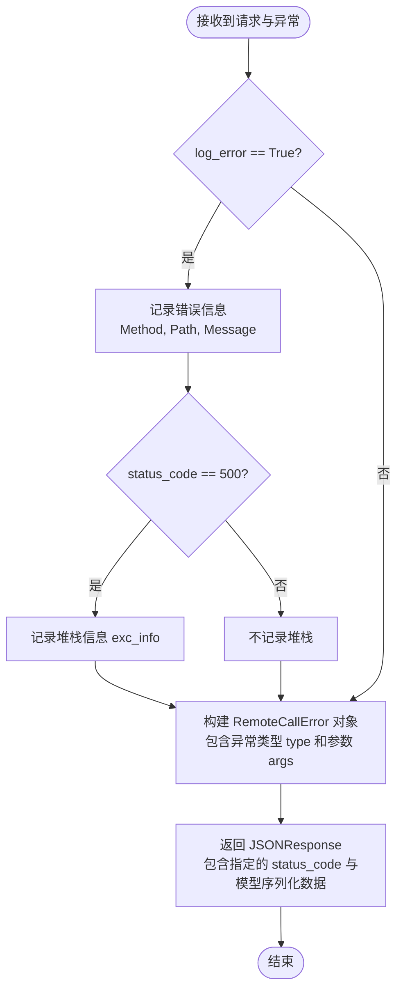

#### 带注释源码

```python
    @staticmethod
    def _handle_internal_http_error(status_code: int = 500, log_error: bool = True):
        def handler(request: Request, exc: Exception):
            # 如果需要记录日志
            if log_error:
                logger.error(
                    f"{request.method} {request.url.path} failed: {exc}",
                    # 仅在状态码为 500（服务器内部错误）时记录堆栈跟踪（exc_info），
                    # 避免因客户端参数错误（如 400）刷屏日志
                    exc_info=exc if status_code == 500 else None,
                )
            # 构造并返回标准化的 JSON 响应
            return responses.JSONResponse(
                status_code=status_code,
                content=RemoteCallError(
                    type=str(exc.__class__.__name__),  # 异常类名
                    args=exc.args or (str(exc),),      # 异常参数或消息字符串
                ).model_dump(), # 转换为字典
            )

        return handler
```


### `AppService._create_fastapi_endpoint`

该方法用于为给定的服务方法动态生成一个 FastAPI 端点包装器。它通过分析方法的签名动态构建 Pydantic 模型以处理请求体解析，同时兼容同步和异步方法的执行，并在返回结果前进行校验以确保架构分层（防止直接返回 Prisma 数据库对象）。

参数：

- `func`：`Callable`，需要被暴露为 API 端点的原始服务方法（可以是同步或异步、绑定或非绑定方法）。

返回值：`Callable`，生成的 FastAPI 兼容的端点函数，该函数能够接收请求体并返回处理后的结果。

#### 流程图

```mermaid
graph TD
    A[开始: _create_fastapi_endpoint] --> B[获取函数签名 inspect.signature]
    B --> C[初始化 fields 字典]
    C --> D{遍历参数列表}
    D --> E{参数名是 self 或 cls?}
    E -- 是 --> F[标记 is_bound_method=True]
    F --> G[跳过该参数]
    E -- 否 --> H[获取类型注解 annotation]
    H --> I[获取默认值 default]
    I --> J[将 (annotation, default) 存入 fields]
    J --> G
    G --> D
    D -- 遍历结束 --> K[动态创建 RequestBodyModel]
    K --> L{是否为绑定方法?}
    L -- 是 --> M[将 func 绑定到实例 self.__get__]
    L -- 否 --> N[保持 func 原样]
    M --> O{函数是否为协程?}
    N --> O
    O -- 是 (异步) --> P[定义 async_endpoint 包装器]
    P --> Q[从 body 提取参数]
    Q --> R[await 调用原始函数]
    R --> S[校验返回值无 Prisma 对象]
    S --> T[返回 async_endpoint]
    O -- 否 (同步) --> U[定义 sync_endpoint 包装器]
    U --> V[从 body 提取参数]
    V --> W[调用原始函数]
    W --> X[校验返回值无 Prisma 对象]
    X --> Y[返回 sync_endpoint]
```

#### 带注释源码

```python
    def _create_fastapi_endpoint(self, func: Callable) -> Callable:
        """
        Generates a FastAPI endpoint for the given function, handling default and optional parameters.

        :param func: The original function (sync/async, bound or unbound)
        :return: A FastAPI endpoint function.
        """
        # 获取函数的签名，用于分析参数
        sig = inspect.signature(func)
        fields = {}

        is_bound_method = False
        # 遍历函数参数，构建 Pydantic 模型的字段定义
        for name, param in sig.parameters.items():
            # 忽略 self 和 cls 参数，但标记是否为绑定方法
            if name in ("self", "cls"):
                is_bound_method = True
                continue

            # 获取参数的类型注解，如果没有则默认为 str
            annotation = (
                param.annotation if param.annotation != inspect.Parameter.empty else str
            )

            # 获取参数的默认值，如果没有则设为 ... (表示必填)
            default = param.default if param.default != inspect.Parameter.empty else ...

            # 将字段信息存入字典，格式为 {字段名: (类型, 默认值)}
            fields[name] = (annotation, default)

        # 根据提取的字段信息动态创建一个 Pydantic 模型类，用于验证请求体
        RequestBodyModel = create_model("RequestBodyModel", **fields)
        
        # 如果是绑定方法，则将函数绑定到当前实例 self 上
        f = func.__get__(self) if is_bound_method else func

        # 判断原始函数是否为异步函数
        if asyncio.iscoroutinefunction(f):

            # 定义异步端点包装器
            async def async_endpoint(body: RequestBodyModel):  # type: ignore #RequestBodyModel being variable
                # 从请求体模型中提取参数并调用原始异步函数
                result = await f(
                    **{name: getattr(body, name) for name in type(body).model_fields}
                )
                # 校验返回结果中不包含 Prisma 对象，确保分层清晰
                _validate_no_prisma_objects(result, f"{func.__name__} result")
                return result

            return async_endpoint
        else:

            # 定义同步端点包装器
            def sync_endpoint(body: RequestBodyModel):  # type: ignore #RequestBodyModel being variable
                # 从请求体模型中提取参数并调用原始同步函数
                result = f(
                    **{name: getattr(body, name) for name in type(body).model_fields}
                )
                # 校验返回结果中不包含 Prisma 对象，确保分层清晰
                _validate_no_prisma_objects(result, f"{func.__name__} result")
                return result

            return sync_endpoint
```


### `AppService.__start_fastapi`

此方法负责初始化并启动 Uvicorn 服务器，用于托管 FastAPI 应用。它会阻塞当前线程直到服务器停止运行，并在退出时执行必要的清理工作。

参数：

-  `self`：`AppService`，类的实例引用。

返回值：`None`，无返回值。

#### 流程图

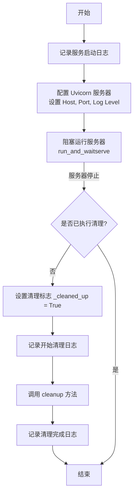

#### 带注释源码

```python
    @conn_retry("FastAPI server", "Running FastAPI server")
    def __start_fastapi(self):
        # 记录服务启动的日志信息，包含主机地址和端口
        logger.info(
            f"[{self.service_name}] Starting RPC server at http://{api_host}:{self.get_port()}"
        )

        # 初始化 Uvicorn 服务器实例
        # 配置包括 FastAPI 应用实例、监听地址、端口、日志配置和日志级别
        self.http_server = uvicorn.Server(
            uvicorn.Config(
                self.fastapi_app,
                host=api_host,
                port=self.get_port(),
                log_config=None,  # 显式设置为 None，防止 Uvicorn 覆盖现有的 logger
                log_level=self.log_level,
            )
        )
        
        # 在共享事件循环中运行服务器
        # 这是一个阻塞调用，直到服务器收到退出信号（如 SIGTERM）才会继续执行
        self.run_and_wait(self.http_server.serve())

        # 服务器退出后执行清理逻辑
        if not self._cleaned_up:
            # 标记已清理状态，防止重复执行
            self._cleaned_up = True
            logger.info(f"[{self.service_name}] 🧹 Running cleanup")
            
            # 调用清理方法（停止事件循环、释放资源等）
            self.cleanup()
            
            logger.info(f"[{self.service_name}] ✅ Cleanup done")
```


### `AppService._self_terminate`

该方法用于处理操作系统信号（如 SIGTERM），以实现 Uvicorn HTTP 服务器的优雅关闭。如果服务尚未关闭，它会通知 Uvicorn 停止接受新请求；如果在关闭过程中再次收到信号或服务器尚未初始化，则强制立即终止进程。

参数：

-  `signum`：`int`，接收到的信号编号（例如 `signal.SIGTERM`）。
-  `frame`：`Any`，当前的堆栈帧对象（标准信号处理程序参数）。

返回值：`None`，该方法不返回值，直接执行副作用（停止服务或退出进程）。

#### 流程图

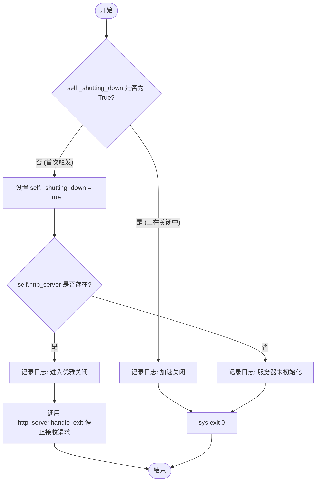

#### 带注释源码

```python
def _self_terminate(self, signum: int, frame):
    """Pass SIGTERM to Uvicorn so it can shut down gracefully"""
    # 获取信号名称以便记录日志
    signame = signal.Signals(signum).name
    
    # 检查是否已经处于关闭流程中
    if not self._shutting_down:
        # 标记服务正在关闭，防止重复处理
        self._shutting_down = True
        
        # 如果 HTTP 服务器实例已存在
        if self.http_server:
            logger.info(
                f"[{self.service_name}] 🛑 Received {signame} ({signum}) - "
                "Entering RPC server graceful shutdown"
            )
            # 通知 Uvicorn 停止接受新请求（优雅关闭的第一步）
            self.http_server.handle_exit(signum, frame)

            # 注意：实际的资源清理和进程停止由以下逻辑触发：
            # 1. __start_fastapi 方法末尾的 self.cleanup()
            # 2. BaseAppService.cleanup() 停止共享事件循环
        else:
            # 如果收到信号时服务器尚未初始化完成
            logger.warning(
                f"[{self.service_name}] {signame} received before HTTP server init."
                " Terminating..."
            )
            # 直接退出系统
            sys.exit(0)

    else:
        # 如果已经处于关闭流程中再次收到信号（例如连续的 SIGTERM）
        # 则立即强制退出，不再等待优雅关闭完成
        logger.info(
            f"[{self.service_name}] 🛑🛑 Received {signame} ({signum}), "
            "but shutdown is already underway. Terminating..."
        )
        sys.exit(0)
```


### `AppService.lifespan`

该方法是 FastAPI/Uvicorn 服务器的生命周期管理器，用于处理服务启动前的设置和关闭后的清理操作。它设计为可被子类扩展，以便在启动和关闭阶段执行特定的业务逻辑（如数据库连接管理）。

参数：

-  `self`：`AppService`，AppService 的实例，提供对服务配置（如 service_name）的访问。
-  `app`：`FastAPI`，FastAPI 应用实例，表示当前正在运行的服务应用对象。

返回值：`AsyncGenerator[None, None]`，一个异步上下文管理器，用于管理 FastAPI 应用的生命周期状态。

#### 流程图

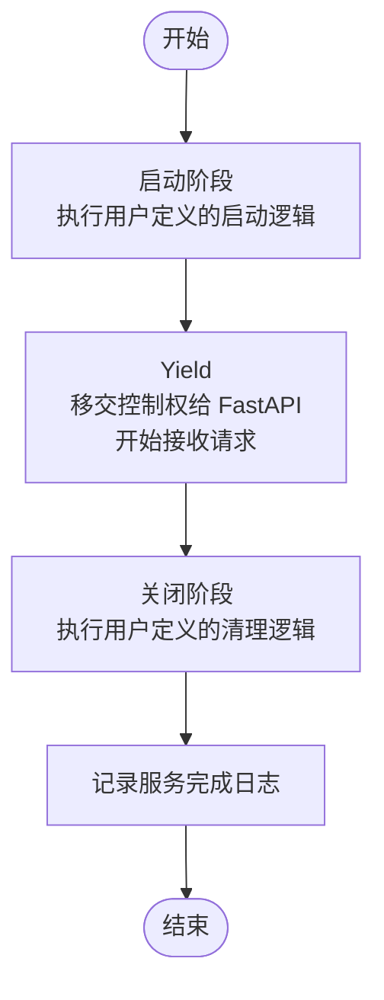

#### 带注释源码

```python
    @asynccontextmanager
    async def lifespan(self, app: FastAPI):
        """
        The FastAPI/Uvicorn server's lifespan manager, used for setup and shutdown.

        You can extend and use this in a subclass like:
        ```
        @asynccontextmanager
        async def lifespan(self, app: FastAPI):
            async with super().lifespan(app):
                await db.connect()
                yield
                await db.disconnect()
        ```
        """
        # Startup - this runs before Uvicorn starts accepting connections
        # 启动阶段 - 在 Uvicorn 开始接受连接之前运行
        # 目前为空，子类可以在此处添加初始化代码

        yield  # 暂停执行，将控制权交还给 FastAPI，直到应用关闭

        # Shutdown - this runs when FastAPI/Uvicorn shuts down
        # 关闭阶段 - 当 FastAPI/Uvicorn 关闭时运行
        logger.info(f"[{self.service_name}] ✅ FastAPI has finished")
```


### `AppService.health_check`

该方法是用于检查当前服务进程健康状态的异步端点处理函数，直接返回字符串 "OK" 表示服务正常。

参数：

-  `self`：`AppService`，类的实例引用。

返回值：`str`，表示服务健康状态的字符串，固定返回 "OK"。

#### 流程图

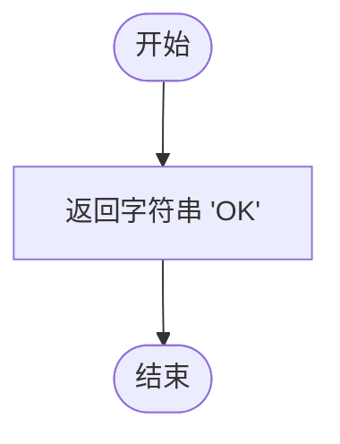

#### 带注释源码

```python
    async def health_check(self) -> str:
        """
        A method to check the health of the process.
        检查进程健康状态的方法。
        """
        # 直接返回 "OK" 字符串，表示服务当前健康且可用
        return "OK"
```


### `AppService.run`

该方法是应用服务的主入口点，负责初始化服务运行所需的环境。它设置共享事件循环，配置 FastAPI 应用（包括监控指标、路由注册和异常处理），并在独立线程中启动 HTTP 服务器，最后阻塞执行主服务逻辑。

参数：

- 无

返回值：`None`，无返回值

#### 流程图

```mermaid
flowchart TD
    Start([开始]) --> SentryInit[初始化 Sentry 监控]
    SentryInit --> SuperRun[调用父类 run 初始化事件循环]
    SuperRun --> CreateFastAPI[创建 FastAPI 应用实例]
    CreateFastAPI --> TryInstrument{尝试添加 Prometheus 监控}
    TryInstrument -->|成功| LoopRoutes[遍历类属性查找暴露方法]
    TryInstrument -->|失败| LoopRoutes[遍历类属性查找暴露方法]
    LoopRoutes --> CheckExpose{是否有 EXPOSED_FLAG?}
    CheckExpose -->|是| AddRoute[添加 POST API 路由]
    CheckExpose -->|否| CheckExpose
    AddRoute --> CheckExpose
    CheckExpose -.->|遍历结束| AddHealth[添加健康检查端点]
    AddHealth --> AddExceptions[添加全局异常处理器]
    AddExceptions --> CreateThread[创建 HTTP 服务器线程]
    CreateThread --> StartThread[启动线程]
    StartThread --> RunService[阻塞运行主服务循环 run_service]
    RunService --> End([结束])
```

#### 带注释源码

```python
    def run(self):
        # 初始化 Sentry 错误追踪
        sentry_init()
        # 调用父类 run 方法，初始化共享的事件循环
        super().run()

        # 创建 FastAPI 应用实例，绑定生命周期管理上下文
        self.fastapi_app = FastAPI(lifespan=self.lifespan)

        # 尝试为所有服务添加 Prometheus 指标监控
        try:
            instrument_fastapi(
                self.fastapi_app,
                service_name=self.service_name,
                expose_endpoint=True,
                endpoint="/metrics",
                include_in_schema=False,
            )
        except ImportError:
            logger.warning(
                f"Prometheus instrumentation not available for {self.service_name}"
            )
        except Exception as e:
            logger.error(
                f"Failed to instrument {self.service_name} with Prometheus: {e}"
            )

        # 遍历当前类的所有属性，注册被 @expose 装饰器标记的 API 路由
        for attr_name, attr in vars(type(self)).items():
            if getattr(attr, EXPOSED_FLAG, False):
                route_path = f"/{attr_name}"
                # 将方法转换为 FastAPI 端点并注册为 POST 请求
                self.fastapi_app.add_api_route(
                    route_path,
                    self._create_fastapi_endpoint(attr),
                    methods=["POST"],
                )
        
        # 注册健康检查端点
        self.fastapi_app.add_api_route(
            "/health_check", self.health_check, methods=["POST", "GET"]
        )
        self.fastapi_app.add_api_route(
            "/health_check_async", self.health_check, methods=["POST", "GET"]
        )
        
        # 注册全局异常处理器，处理 ValueError (400) 和通用 Exception (500)
        self.fastapi_app.add_exception_handler(
            ValueError, self._handle_internal_http_error(400)
        )
        self.fastapi_app.add_exception_handler(
            DataError, self._handle_internal_http_error(400)
        )
        self.fastapi_app.add_exception_handler(
            Exception, self._handle_internal_http_error(500)
        )

        # 在独立的守护线程中启动 FastAPI 服务器
        api_thread = threading.Thread(
            target=self.__start_fastapi,
            daemon=True,
            name=f"{self.service_name}-http-server",
        )
        api_thread.start()

        # 运行主服务循环（此处会阻塞，直到服务结束）
        self.run_service()
```


### `UnhealthyServiceError.__init__`

该方法用于初始化自定义异常类 `UnhealthyServiceError`。它主要用于在服务不健康或未准备好时抛出错误。该方法会将传入的消息格式化为包含当前服务名称的字符串，调用父类 `ValueError` 的初始化方法，并根据配置决定是否将该错误信息记录到日志中。

参数：

-  `message`：`str`，描述错误具体信息的字符串，默认值为 "Service is unhealthy or not ready"。
-  `log`：`bool`，控制是否需要将错误信息输出到日志系统的布尔值，默认值为 True。

返回值：`None`，无显式返回值，主要用于初始化异常实例。

#### 流程图

```mermaid
graph TD
    A[开始: __init__] --> B[格式化消息: f'[{get_service_name()}] - {message}']
    B --> C[调用父类初始化: super().__init__]
    C --> D[设置实例变量: self.message]
    D --> E{log 参数是否为 True?}
    E -- 是 --> F[记录错误日志: logger.error]
    E -- 否 --> G[结束]
    F --> G
```

#### 带注释源码

```python
def __init__(
    self, message: str = "Service is unhealthy or not ready", log: bool = True
):
    # 构造带有服务名称前缀的详细错误消息
    msg = f"[{get_service_name()}] - {message}"
    # 调用父类 ValueError 的构造函数，初始化异常基础状态
    super().__init__(msg)
    # 将处理后的消息保存到实例变量中，以便后续访问
    self.message = msg
    # 如果 log 参数为 True，则将错误消息记录到日志中
    if log:
        logger.error(self.message)
```


### `UnhealthyServiceError.__str__`

该方法用于返回 `UnhealthyServiceError` 异常实例的字符串表示形式，即格式化后的错误消息。

参数：

- `self`：`UnhealthyServiceError`，表示异常实例本身。

返回值：`str`，返回在初始化时构造并存储在 `self.message` 属性中的错误消息字符串。

#### 流程图

```mermaid
flowchart TD
    Start([开始]) --> Return[返回 self.message]
    Return --> End([结束])
```

#### 带注释源码

```python
def __str__(self):
    # 返回实例属性 message，该属性在 __init__ 中被赋值为格式化后的错误信息
    return self.message
```


### `HTTPClientError.__init__`

该方法用于初始化一个 `HTTPClientError` 异常实例。它接收 HTTP 状态码和错误消息，将状态码存储在实例变量中，并调用父类 `Exception` 的初始化方法生成格式化的错误信息。

参数：

-  `self`：`HTTPClientError`，类的实例本身
-  `status_code`：`int`，表示 HTTP 客户端错误的 4xx 状态码
-  `message`：`str`，描述错误的详细信息

返回值：`None`，构造函数返回 None，初始化实例状态

#### 流程图

```mermaid
graph TD
    A[开始: __init__] --> B{接收参数 status_code, message}
    B --> C[设置实例属性 self.status_code = status_code]
    C --> D[调用父类初始化 super().__init__]
    D --> E[格式化错误信息: f'HTTP {status_code}: {message}']
    E --> F[结束]
```

#### 带注释源码

```python
def __init__(self, status_code: int, message: str):
    # 将传入的状态码保存为实例属性，以便外部捕获异常时可以访问
    self.status_code = status_code
    # 调用父类 Exception 的初始化方法
    # 生成包含状态码和消息的格式化字符串作为异常信息
    super().__init__(f"HTTP {status_code}: {message}")
```


### `HTTPServerError.__init__`

用于初始化HTTP服务器错误异常的构造函数。该异常主要用于表示可以重试的5xx状态码错误，它将状态码存储在实例属性中，并格式化错误消息传递给父类。

参数：

-  `self`：`HTTPServerError`，当前类的实例对象。
-  `status_code`：`int`，表示HTTP服务器错误的状态码（如500, 503等）。
-  `message`：`str`，描述错误详情的字符串消息。

返回值：`None`，构造函数没有返回值。

#### 流程图

```mermaid
graph TD
    Start(开始初始化) --> Input[接收 status_code 和 message]
    Input --> Assign[将 status_code 赋值给 self.status_code]
    Assign --> Format[格式化错误消息字符串: f'HTTP {status_code}: {message}']
    Format --> SuperCall[调用父类 Exception.__init__]
    SuperCall --> End(结束)
```

#### 带注释源码

```python
def __init__(self, status_code: int, message: str):
    # 将传入的HTTP状态码保存为实例变量，方便外部读取
    self.status_code = status_code
    # 调用父类 Exception 的初始化方法
    # 将状态码和消息组合成标准格式 "HTTP {code}: {message}" 作为异常信息
    super().__init__(f"HTTP {status_code}: {message}")
```


### `AppServiceClient.get_service_type`

该方法是 `AppServiceClient` 抽象基类中定义的抽象类方法，用于获取与此客户端对应的 `AppService` 服务类型。子类必须实现此方法以指定其连接的具体服务实现类。

参数：

- `cls`：`Type[AppServiceClient]`，类方法的隐式参数，表示当前的客户端类。

返回值：`Type[AppService]`，返回一个继承自 `AppService` 的具体服务类的类型。

#### 流程图

```mermaid
flowchart TD
    A([开始]) --> B[声明抽象类方法]
    B --> C[定义返回类型为 Type[AppService]]
    C --> D[子类必须实现此方法]
    D --> E([结束])
```

#### 带注释源码

```python
    @classmethod
    @abstractmethod
    def get_service_type(cls) -> Type[AppService]:
        # 抽象方法，不包含具体实现逻辑
        # 目的是强制子类必须重写此方法，以明确该客户端具体连接的是哪一个 AppService 实现类
        pass
```


### `AppServiceClient.health_check`

该方法是 `AppServiceClient` 抽象基类中的健康检查桩实现。它本身不执行任何操作（仅包含 `pass` 语句），主要用于定义客户端的接口规范。在实际使用中，当通过 `get_service_client` 创建的动态客户端实例调用此方法时，调用会被 `DynamicClient` 的 `__getattr__` 机制拦截，并转化为向远程服务端点 `/health_check` 发送的 HTTP 请求，而不是执行此处的空代码。

参数：

- `self`：`AppServiceClient`，表示类实例本身。

返回值：`None`，无返回值。

#### 流程图

```mermaid
graph TD
    A[开始执行 health_check] --> B{检查方法实现}
    B --> C[执行 pass 语句 (无操作)]
    C --> D[结束]
```

#### 带注释源码

```python
    def health_check(self):
        # 这是一个桩方法，不包含实际逻辑。
        # 实际的健康检查逻辑由动态客户端 (DynamicClient) 通过 RPC 调用远程服务实现。
        pass
```


### `AppServiceClient.health_check_async`

该方法是 `AppServiceClient` 抽象基类中定义的异步健康检查方法。虽然其在基类中的实现仅为空存根（`pass`），但在实际运行时，通过 `get_service_client` 函数中的 `DynamicClient` 元类代理机制（`__getattr__`），该方法会被动态实现为向服务端的 `/health_check_async` 端点发送异步 HTTP POST 请求，并返回服务端的健康状态响应（通常为字符串 "OK"）。该调用包含连接错误处理和重试机制。

参数：

-   无（除了隐式的 `self`）

返回值：`Any`，通常为 `str`，表示服务端返回的健康检查结果（如 "OK"）。

#### 流程图

```mermaid
flowchart TD
    Start([调用 health_check_async]) --> Interceptor[DynamicClient.__getattr__ 拦截]
    Interceptor --> CheckFunc{检查原始函数}
    CheckFunc -->|是异步函数| GetParams[获取参数列表]
    CheckFunc -->|非异步函数| HandleSync[同步处理逻辑]
    
    GetParams --> RPC[调用 _call_method_async]
    RPC --> CheckRetry{是否启用重试?}
    CheckRetry -->|是| RetryWrapper[应用重试装饰器]
    CheckRetry -->|否| DirectCall[直接调用]
    
    RetryWrapper --> HTTPReq[AsyncClient.post 请求]
    DirectCall --> HTTPReq
    
    HTTPReq --> HandleResp[_handle_call_method_response]
    HandleResp --> CheckStatus{HTTP Status Code}
    
    CheckStatus -->|2xx Success| ResetCount[重置连接失败计数]
    ResetCount --> ReturnJSON[返回 JSON 响应]
    
    CheckStatus -->|4xx Client Error| ParseError[解析 RemoteCallError]
    ParseError --> IsMapped{是否映射异常?}
    IsMapped -->|是| RaiseMapped[抛出映射异常]
    IsMapped -->|否| Raise4xx[抛出 HTTPClientError]
    
    CheckStatus -->|5xx Server Error| Raise5xx[抛出 HTTPServerError]
    
    CheckStatus -->|Network Error| HandleConn[_handle_connection_error]
    HandleConn --> CheckFail{失败次数 >= 3?}
    CheckFail -->|是| ResetClient[清空并重建客户端连接池]
    CheckFail -->|否| Increment[增加失败计数]
    ResetClient --> RaiseNet[抛出连接异常]
    Increment --> RaiseNet
    
    RaiseMapped --> End([结束])
    Raise4xx --> End
    Raise5xx --> End
    RaiseNet --> End
    ReturnJSON --> End
```

#### 带注释源码

以下源码展示了 `AppServiceClient` 中的方法定义以及 `get_service_client` 内部通过 `__getattr__` 为其动态生成的实际运行逻辑：

```python
# 1. 类定义 (AppServiceClient)
class AppServiceClient(ABC):
    # ...
    async def health_check_async(self):
        # 基类中仅为存根，实际实现在下方的 DynamicClient 中
        pass

# 2. 动态实现逻辑 (get_service_client -> DynamicClient -> __getattr__)
# 当调用 client.health_check_async() 时，实际执行的是以下动态生成的逻辑：

def __getattr__(self, name: str) -> Callable[..., Any]:
    # 获取原始函数 (即上面的 health_check_async)
    original_func = getattr(service_client_type, name, None)
    if original_func is None:
        raise AttributeError(f"Method {name} not found...")
    
    rpc_name = original_func.__name__  # "health_check_async"
    sig = inspect.signature(original_func)
    
    # 检查是否为协程函数
    if inspect.iscoroutinefunction(original_func):
        async def async_method(*args: P.args, **kwargs: P.kwargs):
            # 准备参数
            # 由于 health_check_async 定义无参数，params 将为空字典 {}
            params = self._get_params(sig, *args, **kwargs)
            
            # 执行异步 RPC 调用
            # 内部会向 http://{host}:{port}/health_check_async 发送 POST 请求
            # 包含重试机制和连接错误处理
            result = await self._call_method_async(rpc_name, **params)
            
            # 处理返回值
            # 验证并返回结果
            return self._get_return(expected_return, result)

        return async_method
```


### `DynamicClient.close` (Concrete Implementation for `AppServiceClient`)

该方法用于同步关闭 `DynamicClient` 实例中维护的所有同步 HTTP 客户端连接，并清理连接缓存。由于 `AppServiceClient` 是一个抽象基类，其实例由 `get_service_client` 工厂函数创建，返回的 `DynamicClient` 对象实现了具体的 `close` 逻辑。注意，此同步方法不会关闭异步客户端，异步客户端需通过 `aclose` 方法或依赖垃圾回收清理。

参数：

-  `self`：`DynamicClient`，表示 `DynamicClient` 的实例。

返回值：`None`，无返回值。

#### 流程图

```mermaid
flowchart TD
    A[开始执行 close] --> B[遍历 self._sync_clients 字典中的所有客户端]
    B --> C[对每个客户端调用 client.close]
    C --> D[清空 self._sync_clients 缓存字典]
    D --> E[结束]
```

#### 带注释源码

```python
        def close(self) -> None:
            # 遍历并关闭所有同步 HTTP 客户端
            for client in self._sync_clients.values():
                client.close()
            
            # 清空同步客户端缓存字典，释放引用
            self._sync_clients.clear()
            
            # 注意：无法在此同步方法中安全地关闭异步客户端
            # 它们将由垃圾回收机制清理，或应显式调用 aclose()
            # Note: Cannot close async clients synchronously
            # They will be cleaned up by garbage collection
```


### `DynamicClient.__init__`

初始化 `DynamicClient` 实例，通过从外部作用域获取的服务类型信息构建基础 URL，并初始化连接故障计数器及客户端缓存字典。

参数：

-  `self`：`DynamicClient`，类的实例对象本身。

返回值：`None`，无返回值。

#### 流程图

```mermaid
graph TD
    A[开始初始化] --> B[从 service_client_type 获取 Service Type]
    B --> C[调用 get_host 和 get_port]
    C --> D[拼接生成 base_url]
    D --> E[初始化连接失败计数器 _connection_failure_count]
    E --> F[初始化上次重置时间 _last_client_reset]
    F --> G[初始化异步客户端字典 _async_clients]
    G --> H[初始化同步客户端字典 _sync_clients]
    H --> I[结束]
```

#### 带注释源码

```python
        def __init__(self) -> None:
            # 获取服务类型，service_client_type 来自外层函数 get_service_client 的闭包变量
            service_type = service_client_type.get_service_type()
            
            # 动态获取服务的主机地址和端口
            host = service_type.get_host()
            port = service_type.get_port()
            
            # 构建请求的基础 URL，并移除末尾可能存在的斜杠
            self.base_url = f"http://{host}:{port}".rstrip("/")
            
            # 初始化连接失败计数器，用于触发自愈机制
            self._connection_failure_count = 0
            
            # 记录上次重置客户端的时间戳
            self._last_client_reset = 0
            
            # 字典用于缓存异步 HTTP 客户端，key 为 event loop
            self._async_clients = {}  # None key for default async client
            
            # 字典用于缓存同步 HTTP 客户端
            self._sync_clients = {}  # For sync clients (no event loop concept)
```


### `DynamicClient._create_sync_client`

该方法用于实例化并返回一个配置好的同步 HTTP 客户端 (`httpx.Client`)。它利用类实例中的基础 URL (`base_url`) 和外部配置的调用超时时间 (`call_timeout`) 来初始化客户端。此外，该方法专门设置了较高的连接池限制，以支持高并发场景下的 HTTP 请求处理。

参数：

-   `无`

返回值：`httpx.Client`，配置了基础地址、超时时间和优化连接池限制的同步 HTTP 客户端实例。

#### 流程图

```mermaid
flowchart TD
    A[开始创建同步客户端] --> B[实例化 httpx.Client]
    B --> C[设置 base_url 属性为 self.base_url]
    C --> D[设置 timeout 属性为 call_timeout]
    D --> E[配置连接池 Limits 对象]
    E --> E1[设置 max_keepalive_connections 为 200]
    E --> E2[设置 max_connections 为 500]
    E --> E3[设置 keepalive_expiry 为 30.0]
    E1 & E2 & E3 --> F[返回构建好的 httpx.Client 实例]
    F --> G[结束]
```

#### 带注释源码

```python
def _create_sync_client(self) -> httpx.Client:
    return httpx.Client(
        # 设置请求的基础 URL，指向目标服务的地址
        base_url=self.base_url,
        # 设置请求的超时时间，防止长时间阻塞
        timeout=call_timeout,
        # 配置连接池限制，优化高并发下的性能表现
        limits=httpx.Limits(
            # 最大保活连接数，设置为默认值的 10 倍以支持异步并发调用
            max_keepalive_connections=200,
            # 最大连接数总数，设置较高的上限以处理流量突发
            max_connections=500,
            # 连接保持活跃的过期时间（秒），超过该时间连接将被关闭
            keepalive_expiry=30.0,
        ),
    )
```


### `DynamicClient._create_async_client`

创建并返回一个配置了服务基础 URL、调用超时和自定义连接限制的异步 HTTP 客户端，以处理高并发和连接复用。

参数：

-  `self`：`DynamicClient`，类实例自身，提供 `base_url` 属性。

返回值：`httpx.AsyncClient`，一个已配置的异步 HTTP 客户端实例。

#### 流程图

```mermaid
flowchart TD
    A[Start] --> B[Create httpx.AsyncClient Instance]
    B --> C[Set base_url to self.base_url]
    B --> D[Set timeout to call_timeout]
    B --> E[Set Limits: max_keepalive_connections=200]
    B --> F[Set Limits: max_connections=500]
    B --> G[Set Limits: keepalive_expiry=30.0]
    C --> H[Return Client Instance]
    D --> H
    E --> H
    F --> H
    G --> H
```

#### 带注释源码

```python
def _create_async_client(self) -> httpx.AsyncClient:
    return httpx.AsyncClient(
        base_url=self.base_url,  # 设置请求的基础 URL，目标服务的地址
        timeout=call_timeout,    # 设置请求超时时间，源自外部配置
        limits=httpx.Limits(
            max_keepalive_connections=200,  # 最大保活连接数，设为默认值的10倍以支持高并发
            max_connections=500,            # 最大连接数限制，提高上限以处理突发流量
            keepalive_expiry=30.0,          # 保活连接的过期时间，延长连接复用周期
        ),
    )
```


### `DynamicClient.sync_client`

获取或创建一个线程安全的同步 HTTP 客户端实例。该方法通过检查内部缓存字典 `_sync_clients`，确保每个服务名称对应一个唯一的同步客户端，实现了单例模式，避免重复创建连接。

参数：

- `self`：`DynamicClient`，当前动态客户端类的实例。

返回值：`httpx.Client`，用于发起同步 HTTP 请求的 `httpx` 客户端对象。

#### 流程图

```mermaid
flowchart TD
    A["开始: 访问 sync_client 属性"] --> B["获取服务类型名称<br/>service_client_type.get_service_type().__name__"]
    B --> C{"_sync_clients 缓存中<br/>是否已存在该 service_name 的客户端?"}
    C -- 是 --> D["返回缓存的 client"]
    C -- 否 --> E["调用 _create_sync_client() 创建新客户端"]
    E --> F["使用 setdefault 将新客户端存入缓存"]
    F --> D
```

#### 带注释源码

```python
@property
def sync_client(self) -> httpx.Client:
    """Get the sync client (thread-safe singleton)."""
    # 1. 获取服务类型名称，用作缓存字典的唯一键
    #    这样可以确保不同服务使用不同的客户端实例
    service_name = service_client_type.get_service_type().__name__
    
    # 2. 尝试从缓存字典 _sync_clients 中获取已存在的客户端
    if client := self._sync_clients.get(service_name):
        return client
    
    # 3. 如果缓存中没有，则创建一个新的同步客户端并存入缓存
    #    setdefault 方法确保了操作的原子性，有助于线程安全
    return self._sync_clients.setdefault(
        service_name, self._create_sync_client()
    )
```


### `DynamicClient.async_client`

获取适用于当前上下文的异步 HTTP 客户端实例。该属性实现了基于事件循环的客户端缓存机制，确保在异步上下文中使用特定于当前事件循环的客户端，在非异步上下文中使用默认客户端，从而避免跨事件循环的并发问题并复用连接。

参数：

- `self`：`DynamicClient`，类实例自身。

返回值：`httpx.AsyncClient`，配置好的异步 HTTP 客户端实例。

#### 流程图

```mermaid
graph TD
    A[开始获取 async_client] --> B{尝试获取当前运行中的事件循环}
    B -->|成功| C[loop = 事件循环对象]
    B -->|失败 RuntimeError| D[loop = None 作为默认键]
    C --> E{检查 _async_clients 缓存}
    D --> E
    E -->|命中缓存| F[返回缓存的 client]
    E -->|未命中| G[调用 _create_async_client]
    G --> H[setdefault: 存入 _async_clients]
    H --> F
```

#### 带注释源码

```python
@property
def async_client(self) -> httpx.AsyncClient:
    """Get the appropriate async client for the current context.

    Returns per-event-loop client when in async context,
    falls back to default client otherwise.
    """
    # 尝试获取当前正在运行的异步事件循环
    try:
        loop = asyncio.get_running_loop()
    except RuntimeError:
        # 如果没有运行中的事件循环（例如在同步上下文中调用），则使用 None 作为默认键
        loop = None

    # 检查缓存字典 _async_clients 中是否已存在对应 loop 的客户端
    if client := self._async_clients.get(loop):
        return client

    # 如果不存在，则创建一个新的异步客户端并存入缓存字典
    # setdefault 会先设置键值，然后返回该值
    return self._async_clients.setdefault(loop, self._create_async_client())
```


### `DynamicClient._handle_connection_error`

该方法负责处理连接错误并实现客户端的自愈机制。它会跟踪连接失败的次数，当失败累积达到一定阈值且距上次重置超过特定时间间隔时，通过清空缓存的 HTTP 客户端来强制重建连接，以应对潜在的连接池耗尽或网络状态异常问题。

参数：

-  `error`：`Exception`，触发处理逻辑的连接异常对象。

返回值：`None`，无返回值。

#### 流程图

```mermaid
flowchart TD
    A[开始: 处理连接错误] --> B[增加连接失败计数<br/>_connection_failure_count++]
    B --> C[获取当前时间戳<br/>current_time]
    C --> D{判断条件: <br/>失败次数 >= 3 且<br/>距上次重置 > 30秒?}
    D -- 否 --> E[结束处理]
    D -- 是 --> F[记录警告日志<br/>Connection failures detected]
    F --> G[清空同步客户端缓存<br/>_sync_clients.clear]
    G --> H[清空异步客户端缓存<br/>_async_clients.clear]
    H --> I[重置连接失败计数为 0]
    I --> J[更新上次重置时间<br/>_last_client_reset]
    J --> E
```

#### 带注释源码

```python
def _handle_connection_error(self, error: Exception) -> None:
    """Handle connection errors and implement self-healing"""
    # 增加连接失败的计数器
    self._connection_failure_count += 1
    # 获取当前时间戳
    current_time = time.time()

    # 如果我们经历了3次及以上的失败，并且距离上次重置已经超过30秒
    if (
        self._connection_failure_count >= 3
        and current_time - self._last_client_reset > 30
    ):

        # 记录警告日志，提示连接失败并正在重建客户端
        logger.warning(
            f"Connection failures detected ({self._connection_failure_count}), recreating HTTP clients"
        )

        # 清空缓存的客户端字典，强制在下次访问时重新创建
        # 仅在确实存在问题时才重建
        self._sync_clients.clear()
        self._async_clients.clear()

        # 重置计数器和最后重置时间
        self._connection_failure_count = 0
        self._last_client_reset = current_time
```


### `DynamicClient._handle_call_method_response`

该方法用于处理远程服务调用的 HTTP 响应。它负责检查 HTTP 状态码，在请求成功时解析 JSON 响应体，或在请求失败时根据状态码和响应内容将错误映射为特定的 Python 异常（如 `HTTPClientError`、`HTTPServerError` 或自定义业务异常）。

参数：

-  `response`：`httpx.Response`，HTTP 客户端接收到的原始响应对象。
-  `method_name`：`str`，被调用的方法名称（当前逻辑中未直接使用，保留用于日志或上下文）。

返回值：`Any`，如果 HTTP 响应状态码为 2xx，返回解析后的 JSON 数据（字典、列表等）；如果状态码表示错误，则抛出相应的异常。

#### 流程图

```mermaid
graph TD
    A[开始: 处理响应] --> B[尝试检查状态码 response.raise_for_status]
    B -->|成功| C[重置连接失败计数 _connection_failure_count = 0]
    C --> D[返回 response.json]
    B -->|HTTPStatusError| E[捕获异常 e]
    E --> F[解析错误体为 RemoteCallError]
    F --> G{是否解析成功且类型在映射中?}
    G -->|是| H[从 EXCEPTION_MAPPING 获取异常类并引发]
    G -->|否| I{检查状态码范围}
    I -->|400-499| J[引发 HTTPClientError]
    I -->|500-599| K[引发 HTTPServerError]
    I -->|其他| L[重新引发原始异常 e]
```

#### 带注释源码

```python
def _handle_call_method_response(
    self, *, response: httpx.Response, method_name: str
) -> Any:
    try:
        # 检查响应状态码，如果不是 2xx 则抛出 HTTPStatusError
        response.raise_for_status()
        # 请求成功，重置连接失败计数器
        self._connection_failure_count = 0
        # 返回解析后的 JSON 数据
        return response.json()
    except httpx.HTTPStatusError as e:
        status_code = e.response.status_code

        # 尝试将错误响应解析为 RemoteCallError 模型
        error_response = None
        try:
            error_response = RemoteCallError.model_validate(e.response.json())
        except Exception:
            pass

        # 如果成功解析且错误类型在预定义的映射表中，引发对应的业务异常
        if error_response and error_response.type in EXCEPTION_MAPPING:
            exception_class = EXCEPTION_MAPPING[error_response.type]
            args = error_response.args or [str(e)]
            raise exception_class(*args)

        # 如果不是特定的业务异常，根据 HTTP 状态码分类处理
        if 400 <= status_code < 500:
            # 客户端错误 (4xx)，包装为 HTTPClientError 以阻止重试
            raise HTTPClientError(status_code, str(e))
        elif 500 <= status_code < 600:
            # 服务端错误 (5xx)，包装为 HTTPServerError 允许重试
            raise HTTPServerError(status_code, str(e))
        else:
            # 其他状态码，重新抛出原始异常
            raise e
```


### `DynamicClient._call_method_sync`

该方法用于通过同步 HTTP POST 请求调用远程服务的指定方法，并处理响应或连接错误。它使用同步 HTTP 客户端发送请求，并将关键字参数转换为 JSON 格式。如果发生连接错误，会触发自我修复逻辑。

参数：

-   `method_name`：`str`，要调用的远程服务方法的名称（即 API 路由路径）。
-   `**kwargs`：`Any`，传递给远程服务方法的关键字参数，将被序列化为 JSON 请求体。

返回值：`Any`，远程服务调用返回的解析后的 JSON 数据，或者在失败时引发异常。

#### 流程图

```mermaid
flowchart TD
    A[开始调用 _call_method_sync] --> B[使用 sync_client 发起 POST 请求]
    B --> C[传递 method_name 作为 URL 路径]
    B --> D[使用 to_dict 将 kwargs 转为 JSON Body]
    C & D --> E[获取响应对象]
    E --> F[调用 _handle_call_method_response 处理响应]
    F --> G{是否成功或处理完毕?}
    G -- 是 --> H[返回处理结果]
    E --> I{捕获到 ConnectError 或 ConnectTimeout?}
    G -- 否 --> I
    I -- 是 --> J[调用 _handle_connection_error 记录并尝试修复]
    J --> K[重新抛出异常]
    I -- 否 --> K
```

#### 带注释源码

```python
        @_maybe_retry
        def _call_method_sync(self, method_name: str, **kwargs: Any) -> Any:
            try:
                # 调用内部响应处理方法，传入方法名和 HTTP 响应对象
                return self._handle_call_method_response(
                    method_name=method_name,
                    # 使用同步客户端发送 POST 请求
                    # method_name 作为 URL 路径
                    # kwargs 通过 to_dict 转换后作为 JSON 请求体
                    response=self.sync_client.post(method_name, json=to_dict(kwargs)),
                )
            # 捕获特定的连接错误（连接错误或连接超时）
            except (httpx.ConnectError, httpx.ConnectTimeout) as e:
                # 处理连接错误，例如增加失败计数，必要时重置客户端（自我修复逻辑）
                self._handle_connection_error(e)
                # 将异常重新抛出，以便由 @_maybe_retry 装饰器决定是否重试
                raise
```


### `DynamicClient._call_method_async`

该方法是 `DynamicClient` 类中用于异步执行远程过程调用（RPC）的核心内部方法。它通过 HTTP POST 请求将参数发送到指定的服务端点，处理网络连接错误（如连接超时或失败），并利用响应处理逻辑来解析返回结果或处理服务端异常。

参数：

-  `method_name`：`str`，代表要调用的远程方法名称，通常对应 HTTP 请求的 URL 路径。
-  `**kwargs`：`Any`，表示传递给远程方法的关键字参数，这些参数会被序列化为 JSON 格式作为请求体发送。

返回值：`Any`，远程调用执行后的返回结果，通常是经过 `_handle_call_method_response` 处理后的 JSON 反序列化对象。

#### 流程图

```mermaid
flowchart TD
    A[开始: _call_method_async] --> B{尝试执行请求}
    B --> C[调用 async_client.post 发送 POST 请求]
    C --> D[等待响应]
    D --> E[调用 _handle_call_method_response 处理响应]
    E --> F{是否有 HTTP 错误?}
    F -- 否 --> G[返回解析后的结果]
    F -- 是 --> H[抛出 HTTPStatusError 或自定义异常]
    
    B -- 捕获到连接异常 --> I[捕获 httpx.ConnectError 或 ConnectTimeout]
    I --> J[调用 _handle_connection_error 记录并处理故障]
    J --> K[重新抛出异常]
    
    G --> L[结束]
    H --> L
    K --> L
```

#### 带注释源码

```python
@_maybe_retry
async def _call_method_async(self, method_name: str, **kwargs: Any) -> Any:
    try:
        # 调用内部的响应处理方法
        # 在该方法内部，通过 self.async_client.post 发起异步 HTTP POST 请求
        # method_name 作为 URL 路径，kwargs 经过 to_dict 转换为 JSON 请求体
        return self._handle_call_method_response(
            method_name=method_name,
            response=await self.async_client.post(
                method_name, json=to_dict(kwargs)
            ),
        )
    except (httpx.ConnectError, httpx.ConnectTimeout) as e:
        # 捕获连接级别的错误（如连接被拒绝、超时等）
        # 调用连接错误处理器，用于统计失败次数并在必要时重置客户端
        self._handle_connection_error(e)
        # 重新抛出异常，由上层重试装饰器 (@_maybe_retry) 决定是否重试
        raise
```


### `DynamicClient.aclose`

该方法用于异步关闭并清理 `DynamicClient` 实例中管理的所有 HTTP 客户端（包括同步和异步客户端），释放网络连接资源并清空缓存。

参数：

-   `无`

返回值：`None`，无返回值。

#### 流程图

```mermaid
flowchart TD
    A[开始: aclose] --> B[遍历 self._sync_clients 字典]
    B --> C[调用 client.close 关闭同步客户端]
    C --> D{还有同步客户端?}
    D -- 是 --> B
    D -- 否 --> E[执行 self._sync_clients.clear 清空字典]
    E --> F[遍历 self._async_clients 字典]
    F --> G[await client.aclose 关闭异步客户端]
    G --> H{还有异步客户端?}
    H -- 是 --> F
    H -- 否 --> I[执行 self._async_clients.clear 清空字典]
    I --> J[结束]
```

#### 带注释源码

```python
        async def aclose(self) -> None:
            # 关闭所有同步客户端
            # 遍历并关闭每一个活跃的 httpx.Client 实例
            for client in self._sync_clients.values():
                client.close()
            # 清空同步客户端缓存字典，移除引用
            self._sync_clients.clear()

            # 关闭所有异步客户端（包括键为 None 的默认客户端）
            # 遍历并异步关闭每一个活跃的 httpx.AsyncClient 实例
            for client in self._async_clients.values():
                await client.aclose()
            # 清空异步客户端缓存字典，移除引用
            self._async_clients.clear()
```


### `DynamicClient.close`

该方法用于关闭 `DynamicClient` 实例中所有缓存的同步 HTTP 客户端，并清空同步客户端缓存。此方法是同步方法，仅处理 `httpx.Client` 的清理工作；由于无法在同步上下文中安全关闭异步客户端，该方法不对异步客户端执行操作，它们将由垃圾回收机制处理。

参数：

-  `self`：`DynamicClient`，表示 `DynamicClient` 类的实例，包含 `_sync_clients` 字典。

返回值：`None`，无返回值。

#### 流程图

```mermaid
graph TD
    A[开始执行 close] --> B[遍历 self._sync_clients 字典中的所有客户端]
    B --> C[对每个客户端调用 client.close 关闭连接]
    C --> D[调用 self._sync_clients.clear 清空字典]
    D --> E[结束]
```

#### 带注释源码

```python
def close(self) -> None:
    # Close all sync clients
    # 遍历所有缓存的同步 HTTP 客户端
    for client in self._sync_clients.values():
        client.close()
    # 清空同步客户端缓存字典，释放引用
    self._sync_clients.clear()
    # Note: Cannot close async clients synchronously
    # They will be cleaned up by garbage collection
    # 注意：无法在此同步方法中关闭异步客户端，将依赖垃圾回收进行清理
```


### `DynamicClient.__del__`

`DynamicClient` 类的析构函数。在对象被垃圾回收时自动调用，主要负责清理同步 HTTP 客户端资源以防止资源泄漏。由于无法在析构函数中安全地执行异步关闭操作，该方法会检测并警告未显式关闭的异步客户端。

参数：

-  `self`：`DynamicClient`，`DynamicClient` 类的实例引用。

返回值：`None`，不返回任何值。

#### 流程图

```mermaid
graph TD
    A[开始 __del__] --> B[进入 Try 块]
    B --> C[遍历 self._sync_clients]
    C --> D[调用 client.close 关闭同步客户端]
    D --> E{是否还有更多同步客户端?}
    E -- 是 --> C
    E -- 否 --> F{self._async_clients 是否非空?}
    F -- 是 --> G[发出 ResourceWarning 警告]
    F -- 否 --> H[Try 块正常结束]
    G --> H
    H --> I[结束]
    B -- 发生异常 --> J[静默忽略错误]
    J --> I
```

#### 带注释源码

```python
        def __del__(self):
            """Cleanup HTTP clients on garbage collection to prevent resource leaks."""
            try:
                # 关闭所有剩余的同步 HTTP 客户端，释放系统资源（如 sockets）
                for client in self._sync_clients.values():
                    client.close()

                # 检查是否还有未关闭的异步客户端
                if self._async_clients:
                    import warnings

                    # 发出资源警告，提示用户应该显式调用 aclose()
                    # 因为在 __del__ 中无法安全地运行异步代码（event loop 可能已停止）
                    warnings.warn(
                        "DynamicClient async clients not explicitly closed. "
                        "Call aclose() before destroying the client.",
                        ResourceWarning,
                        stacklevel=2,
                    )
            except Exception:
                # 静默忽略清理过程中发生的任何异常
                # Python 的 __del__ 方法不应抛出异常，否则可能导致程序崩溃或不可预测的行为
                pass
```


### `DynamicClient._get_params`

该方法用于将传递给动态客户端方法的位置参数转换为关键字参数，并结合传入的关键字参数返回一个统一的参数字典。它通过检查函数签名来确定参数名称，并自动过滤掉 `self` 和 `cls` 参数。

参数：

-  `signature`：`inspect.Signature`，表示目标方法签名的对象，用于获取参数的名称和顺序。
-  `*args`：`Any`，传递给目标方法的位置参数列表。
-  `**kwargs`：`Any`，传递给目标方法的关键字参数字典。

返回值：`dict[str, Any]`，包含合并后的关键字参数的字典，位置参数已被转换为关键字参数。

#### 流程图

```mermaid
graph TD
    A[开始: _get_params] --> B{是否存在位置参数 args?}
    B -- 否 --> F[直接返回 kwargs]
    B -- 是 --> C[从 signature 中获取参数名称列表]
    C --> D{第一个参数名是否为 self 或 cls?}
    D -- 是 --> E[移除第一个参数名]
    D -- 否 --> G[保留完整参数名列表]
    E --> G
    G --> H[使用 zip 将参数名与 args 值配对]
    H --> I[将配对后的键值对更新到 kwargs 中]
    I --> F
```

#### 带注释源码

```python
def _get_params(
    self, signature: inspect.Signature, *args: Any, **kwargs: Any
) -> dict[str, Any]:
    # 检查是否有位置参数传入
    if args:
        # 获取函数签名中定义的所有参数名称列表
        arg_names = list(signature.parameters.keys())
        
        # 如果参数列表不为空，且第一个参数是 'self' 或 'cls'
        # 则移除第一个参数名，因为这在远程调用中通常不需要传递
        if arg_names and arg_names[0] in ("self", "cls"):
            arg_names = arg_names[1:]
        
        # 将剩余的参数名称与传入的位置参数值一一对应，打包成字典
        # 并更新到 kwargs 字典中
        kwargs.update(dict(zip(arg_names, args)))
    
    # 返回合并后的关键字参数字典
    return kwargs
```


### `DynamicClient._get_return`

根据预期的返回类型适配器验证并转换远程调用的原始结果数据。

参数：

- `expected_return`：`TypeAdapter | None`，Pydantic 类型适配器，用于验证和解析结果，如果未指定返回类型则为 None。
- `result`：`Any`，从远程服务接收到的原始结果数据。

返回值：`Any`，如果提供了 `expected_return` 则返回经过验证和解析的 Python 对象，否则直接返回原始结果。

#### 流程图

```mermaid
graph TD
    A[开始: 接收 expected_return 和 result] --> B{expected_return 是否存在?}
    B -- 是 --> C[调用 expected_return.validate_python result]
    C --> D[返回验证后的对象]
    B -- 否 --> E[返回原始 result]
    D --> F[结束]
    E --> F
```

#### 带注释源码

```python
        def _get_return(self, expected_return: TypeAdapter | None, result: Any) -> Any:
            # 检查是否定义了预期的返回类型适配器
            if expected_return:
                # 如果存在，使用 Pydantic 的 validate_python 方法对原始结果进行验证和解析
                # 这确保了返回的数据符合预期的模型结构
                return expected_return.validate_python(result)
            # 如果没有定义返回类型，直接返回原始结果
            return result
```


### `DynamicClient.__getattr__`

该方法通过拦截属性访问，在运行时为 `DynamicClient` 实例动态创建远程过程调用（RPC）方法代理。它检查抽象服务类上是否存在请求的方法，然后根据原始方法是否为异步方法，生成相应的同步或异步包装函数。该包装函数负责处理参数、执行底层的 HTTP 调用，并对返回值进行类型适配。

参数：

-  `name`：`str`，被访问的方法或属性的名称。

返回值：`Callable[..., Any]`，一个可调用对象（同步函数或异步协程），用于执行实际的远程调用并返回处理后的结果。

#### 流程图

```mermaid
flowchart TD
    A[开始: __getattr__ 被调用] --> B[从 service_client_type 获取原始属性]
    B --> C{属性是否存在?}
    C -- 否 --> D[抛出 AttributeError 异常]
    C -- 是 --> E[获取方法签名与返回值注解]
    E --> F[根据返回值注解创建 TypeAdapter]
    F --> G{原始方法是否为协程函数?}
    G -- 是 --> H[定义异步包装函数 async_method]
    H --> H1[内部调用 _get_params 处理参数]
    H1 --> H2[await _call_method_async 执行远程调用]
    H2 --> H3[调用 _get_return 处理返回结果]
    H3 --> J[返回 async_method]
    G -- 否 --> I[定义同步包装函数 sync_method]
    I --> I1[内部调用 _get_params 处理参数]
    I1 --> I2[调用 _call_method_sync 执行远程调用]
    I2 --> I3[调用 _get_return 处理返回结果]
    I3 --> J[返回 sync_method]
```

#### 带注释源码

```python
def __getattr__(self, name: str) -> Callable[..., Any]:
    # 从外部作用域的 service_client_type 中查找原始方法定义
    original_func = getattr(service_client_type, name, None)
    if original_func is None:
        # 如果服务类中没有定义该方法，抛出属性错误
        raise AttributeError(
            f"Method {name} not found in {service_client_type}"
        )

    # 获取方法名称用于构建 RPC 请求路径
    rpc_name = original_func.__name__
    # 获取方法签名，用于处理参数
    sig = inspect.signature(original_func)
    # 获取返回值类型注解
    ret_ann = sig.return_annotation
    
    # 如果存在返回值注解，创建 TypeAdapter 用于后续验证返回数据
    expected_return = (
        None if ret_ann is inspect.Signature.empty else TypeAdapter(ret_ann)
    )

    # 检查原始方法是否是异步函数（async def），以此决定生成哪种代理
    if inspect.iscoroutinefunction(original_func):

        # 定义并返回一个异步方法代理
        async def async_method(*args: P.args, **kwargs: P.kwargs):
            # 将位置参数转换为关键字参数字典
            params = self._get_params(sig, *args, **kwargs)
            # 调用异步 HTTP 客户端发送请求
            result = await self._call_method_async(rpc_name, **params)
            # 验证并转换返回结果
            return self._get_return(expected_return, result)

        return async_method

    else:

        # 定义并返回一个同步方法代理
        def sync_method(*args: P.args, **kwargs: P.kwargs):
            # 将位置参数转换为关键字参数字典
            params = self._get_params(sig, *args, **kwargs)
            # 调用同步 HTTP 客户端发送请求
            result = self._call_method_sync(rpc_name, **params)
            # 验证并转换返回结果
            return self._get_return(expected_return, result)

        return sync_method
```


### `DynamicClient.__aenter__`

异步上下文管理器的入口方法，允许 `DynamicClient` 实例使用 `async with` 语法进行管理。该方法返回客户端实例本身，以便在上下文中调用远程服务方法，并确保在退出上下文时能自动触发 `__aexit__` 进行资源清理。

参数：

-  `self`：`DynamicClient`，表示动态客户端实例本身。

返回值：`DynamicClient`，返回客户端实例本身，用于在 `async with` 代码块中调用方法。

#### 流程图

```mermaid
graph TD
    Start([开始]) --> ReturnSelf[返回实例 self]
    ReturnSelf --> End([结束])
```

#### 带注释源码

```python
        async def __aenter__(self):
            """Async context manager entry."""
            # 返回当前实例，使其可以在 async with 代码块中被使用
            return self
```


### `DynamicClient.__aexit__`

异步上下文管理器的退出方法，用于在退出 `async with` 代码块时清理资源，确保关闭底层的 HTTP 客户端连接。

参数：

-  `exc_type`：`Optional[Type[BaseException]]`，引发的异常类型（如果未引发异常则为 None）。
-  `exc_val`：`Optional[BaseException]`，引发的异常实例（如果未引发异常则为 None）。
-  `exc_tb`：`Optional[TracebackType]`，异常的回溯对象（如果未引发异常则为 None）。

返回值：`None`，不抑制异常，允许它们在上下文管理器关闭后正常传播。

#### 流程图

```mermaid
flowchart TD
    Start([__aexit__ 进入]) --> CallAClose[调用 self.aclose 关闭连接]
    CallAClose --> End([返回 None 结束])
```

#### 带注释源码

```python
async def __aexit__(self, exc_type, exc_val, exc_tb):
    """Async context manager exit."""
    # 调用 aclose 方法来关闭所有维护的同步和异步 HTTP 客户端
    # 释放网络资源，防止连接泄漏
    await self.aclose()
```


## 关键组件


### RPC 服务端架构 (AppService)

基于 FastAPI 的服务端实现，通过 Uvicorn 在独立线程中运行 HTTP 服务器。它封装了异步事件循环管理，自动将带有 `@expose` 标记的方法注册为 POST 路由，并集成了 Prometheus 监控和生命周期管理。

### 动态客户端代理 (DynamicClient)

动态生成 RPC 客户端实例的组件，通过 `__getattr__` 拦截方法调用并转发到远程服务。它维护同步和异步（基于事件循环）的 `httpx` 连接池，实现了客户端的自动清理、超时控制以及基于连接失败计数的自我愈合机制。

### 弹性通信与重试机制

处理网络不稳定性的容错组件，结合了连接重试装饰器 (`conn_retry`) 和自定义重试策略。它智能区分可重试错误（如 5xx、连接超时）与不可重试错误（如 4xx、数据校验错误），并在检测到持续连接失败时重置 HTTP 客户端。

### 数据契约验证层

强制执行数据传输边界规则的组件，通过递归检查返回值 (`_validate_no_prisma_objects`) 确保服务不会直接返回 Prisma 数据库对象，而是返回应用层模型，从而防止底层 ORM 污染服务接口并保证数据可序列化。

### 异常标准化与映射

跨进程异常传播组件，定义了异常类型与字符串名称的映射关系 (`EXCEPTION_MAPPING`)。它捕获服务端异常并将其封装为标准化的 `RemoteCallError` JSON 响应，在客户端自动反序列化并还原为原始异常类型，实现了透明化的远程错误处理。


## 问题及建议


### 已知问题

-   **Pydantic 动态模型命名冲突风险**：在 `_create_fastapi_endpoint` 方法中，所有动态生成的请求体模型都使用了硬编码的名称 `"RequestBodyModel"`。Pydantic 内部通过类名缓存模型定义。如果不同的服务端点具有不同的字段结构，使用相同的名称可能导致后续定义的模型覆盖之前的定义，或者触发 Pydantic 的错误，破坏 API 的数据校验逻辑。
-   **递归验证导致的栈溢出风险**：`_validate_no_prisma_objects` 函数使用递归方式遍历返回结果以检查 Prisma 对象。如果服务返回的数据结构嵌套层级很深（超过 Python 默认递归深度限制，通常为 1000），将引发 `RecursionError`，导致服务崩溃。
-   **Uvicorn 启动与信号处理的 Hack 实现不稳定**：`BaseAppService` 和 `AppService` 中使用了复杂的线程和事件循环交互方式（在独立线程中运行 `shared_event_loop`，并通过 `run_and_wait` 将 Uvicorn 挂载到该循环上）。这被代码注释明确标记为 "HACK"，旨在绕过 Uvicorn 的信号处理机制。这种非标准的启动方式使得生命周期管理变得脆弱，难以调试，且可能在 Uvicorn 版本升级或信号处理逻辑变更时引入不可预知的错误。
-   **客户端资源清理依赖 `__del__`**：`DynamicClient` 类在 `__del__` 析构函数中尝试关闭 HTTP 客户端。Python 的 `__del__` 方法调用时机是不确定的，且在发生循环引用或异常时可能不会被调用。对于异步客户端，析构函数甚至无法安全地执行清理操作（无法运行 `aclose`），这极易导致连接泄漏和文件描述符耗尽。

### 优化建议

-   **优化 `get_service_client` 的重试策略**：当前 `@conn_retry` 装饰器应用在 `get_service_client` 工厂函数上。该函数仅负责实例化 `DynamicClient` 对象，本身不执行 I/O 操作，因此几乎不会触发需要重试的异常。建议移除此处的装饰器，保留并专注于内部方法（`_call_method_sync`/`_call_method_async`）上的重试逻辑，以减少不必要的性能开销。
-   **实现全局或长生命周期的客户端缓存**：`get_service_client` 每次被调用都会返回一个新的 `DynamicClient` 实例，每个实例都有独立的连接池和状态字典。如果在高频场景下频繁调用此函数，会导致大量的短生命周期连接创建，增加握手开销。建议在应用层实现客户端的单例模式或长生命周期缓存机制，复用 `DynamicClient` 实例。
-   **改进递归检查为迭代遍历**：建议将 `_validate_no_prisma_objects` 的递归逻辑改为基于栈或队列的迭代实现。这不仅能避免深度嵌套数据导致的栈溢出，通常在性能上也优于函数递归调用。
-   **增强异常映射的可扩展性**：`EXCEPTION_MAPPING` 字典在模块加载时静态生成，且硬编码了部分异常类。对于需要跨服务传输的复杂业务异常，建议使用注册机制或更动态的映射策略，避免每次新增异常类型都需要修改此处的底层代码。
-   **统一异步上下文管理**：`DynamicClient` 既提供了 `aclose`/`__aenter__`，又提供了 `close`。建议明确区分 Sync Client 和 Async Client 的使用边界，或者强制要求使用 Context Manager（上下文管理器）来管理客户端生命周期，防止用户忘记关闭连接。


## 其它


### 设计目标与约束

本系统旨在构建一个基于 FastAPI 和 HTTP 的标准化进程间通信（IPC）框架，以实现微服务或进程模块之间的解耦与高效调用。

**主要设计目标：**
1.  **透明化 RPC 调用**：通过 `AppServiceClient` 动态代理机制，使得远程服务调用像本地方法调用一样自然，支持同步和异步两种调用模式。
2.  **标准化服务架构**：提供统一的基类 `AppService`，封装服务启动、生命周期管理、健康检查和路由注册逻辑，减少样板代码。
3.  **高可用与自愈**：集成了连接重试机制（`tenacity`）和连接池自愈逻辑，确保在网络波动或服务重启时客户端能够自动恢复。

**设计约束：**
1.  **数据分层强制**：严格禁止在服务接口边界返回 Prisma ORM 对象。系统通过递归检查 (`_validate_no_prisma_objects`) 强制要求使用 Pydantic 模型或纯 Python 对象，以防止数据库内部结构泄露到 API 层。
2.  **通信协议**：服务间通信强制基于 HTTP/JSON 协议，使用 POST 方法进行调用，数据序列化由 Pydantic 和 JSON 处理。
3.  **环境隔离**：服务的主机和端口配置支持通过环境变量动态覆盖，以适应不同的部署环境（如开发、测试、生产）。

### 错误处理与异常设计

系统采用分层异常处理策略，确保服务端能够捕获并标准化异常，客户端能够还原或识别异常类型。

**服务端处理：**
1.  **异常映射**：定义了 `EXCEPTION_MAPPING` 字典，将标准异常（如 `ValueError`）和自定义异常（如 `UnhealthyServiceError`）映射为字符串名称。
2.  **统一错误响应**：通过 `_handle_internal_http_error` 中间件，所有未捕获的异常都会被转换为统一的 JSON 格式 (`RemoteCallError`)，包含异常类型和参数。
3.  **状态码区分**：
    *   4xx 错误（如 `ValueError`, `DataError`）：表示客户端请求参数错误，不进行重试。
    *   5xx 错误（如 `RuntimeError`）：表示服务端内部错误，客户端可能会触发重试。

**客户端处理：**
1.  **异常还原**：`_handle_call_method_response` 方法在收到错误响应后，尝试解析 `RemoteCallError`，并根据类型映射在客户端抛出相应的原始异常类。
2.  **自定义网络异常**：
    *   `HTTPClientError`：封装 4xx 错误，明确不可重试。
    *   `HTTPServerError`：封装 5xx 错误，允许重试。
3.  **重试策略**：使用装饰器 `_maybe_retry` 配合重试逻辑，明确排除 `ValueError`、`HTTPClientError` 等不应重试的异常，避免无效风暴。

### 数据流与状态机

**请求处理数据流：**
1.  **客户端请求**：业务代码调用客户端代理方法 -> `__getattr__` 拦截 -> 参数序列化 (`to_dict`) -> 发送 HTTP POST 请求。
2.  **服务端接收**：FastAPI 接收请求 -> 动态生成的 Pydantic 模型验证数据 -> 调用具体的服务方法（`@expose` 装饰的方法）。
3.  **业务逻辑与验证**：服务方法执行 -> 返回结果 -> 递归检查是否包含 Prisma 对象 -> 若通过则序列化为 JSON 返回。
4.  **客户端响应**：接收 HTTP 响应 -> 解析 JSON -> 还原类型（如果存在返回类型注解）或返回字典 -> 抛出异常或返回结果给业务代码。

```mermaid
sequenceDiagram
    participant ClientCode
    participant AppServiceClient
    participant Network
    participant FastAPI
    participant ServiceMethod
    
    ClientCode->>AppServiceClient: call_method(args)
    AppServiceClient->>AppServiceClient: Serialize Args (JSON)
    AppServiceClient->>Network: HTTP POST /method
    Network->>FastAPI: Receive Request
    FastAPI->>FastAPI: Validate with Dynamic Pydantic Model
    FastAPI->>ServiceMethod: Invoke
    ServiceMethod-->>FastAPI: Return Result
    FastAPI->>FastAPI: Validate No Prisma Objects
    FastAPI-->>Network: JSON Response
    Network-->>AppServiceClient: HTTP Response
    AppServiceClient->>AppServiceClient: Parse / Raise Error
    AppServiceClient-->>ClientCode: Result or Exception
```

**服务生命周期状态机：**
1.  **Init**: 实例化 `AppService`，初始化配置和 FastAPI 应用。
2.  **Starting**: 启动共享事件循环线程，启动 FastAPI Uvicorn 服务器线程。
3.  **Running**: 服务接受请求，健康检查返回 "OK"。
4.  **Shutting Down**: 接收到 SIGTERM 信号，Uvicorn 停止接受新请求，处理现有请求。
5.  **Cleanup**: Uvicorn 退出后，触发 `cleanup` 方法，停止共享事件循环，释放资源。
6.  **Stopped**: 线程结束，进程退出。

### 外部依赖与接口契约

**核心外部依赖：**
1.  **FastAPI & Uvicorn**: Web 框架和 ASGI 服务器，负责 HTTP 接口监听和处理。
2.  **Httpx**: 用于客户端的高性能异步/同步 HTTP 客户端，支持连接池。
3.  **Pydantic**: 负责请求体的动态模型生成和数据验证，以及响应的类型转换。
4.  **Prisma**: 虽然不直接暴露，但涉及数据库模型检查，依赖其模块结构进行数据隔离验证。
5.  **Prometheus (Opentelemetry)**: 用于监控指标采集 (`instrument_fastapi`)。
6.  **Sentry**: 用于错误日志追踪 (`sentry_init`)。

**接口契约：**
1.  **服务端契约**:
    *   任何通过 `@expose` 装饰的方法都会自动注册为 POST 接口，路径为 `/{method_name}`。
    *   请求体必须是一个 JSON 对象，字段名与方法参数名一致。
    *   响应体必须是 JSON 可序列化的对象。
    *   必须提供 `/health_check` (GET/POST) 接口用于存活探针。
2.  **客户端契约**:
    *   `get_service_client` 必须传入继承自 `AppServiceClient` 的类，且该类实现了 `get_service_type` 方法指向对应的服务端类。
    *   客户端调用时，如果原方法是异步的，客户端将返回协程；如果是同步的，返回阻塞结果。

### 并发与线程模型

本代码采用了一种独特的混合并发模型，以适应既有阻塞逻辑又有异步 IO 的需求。

**服务端:**
1.  **独立的事件循环线程** (`BaseAppService`):
    *   FastAPI/Uvicorn 通常需要在主线程运行以处理信号，但本架构为了解耦，创建了一个专门的守护线程 (`shared_asyncio_thread`) 来运行 `shared_event_loop`。
    *   这种设计允许 `run_service()` 方法在主线程执行（如果是阻塞的），同时异步的 HTTP 处理在另一个线程的事件循环中进行。
2.  **跨线程调用**:
    *   提供了 `run_and_wait(coro)` 方法，使用 `asyncio.run_coroutine_threadsafe` 从其他线程向共享事件循环提交任务并等待结果，实现了同步世界与异步世界的桥接。

**客户端:**
1.  **双模式客户端**:
    *   **Sync Client (`httpx.Client`)**: 用于同步上下文，线程安全。
    *   **Async Client (`httpx.AsyncClient`)**: 用于异步上下文，根据当前运行的事件循环 (`asyncio.get_running_loop()`) 进行隔离，确保不同 loop 之间的安全性。
2.  **连接池管理**:
    *   `DynamicClient` 内部维护了 `_sync_clients` 和 `_async_clients` 字典，按 Service 名称或 Loop ID 缓存客户端实例。
    *   设置了较高的连接限制 (`max_connections=500`) 和保活时间 (`keepalive_expiry=30`)，以支持高并发调用。
3.  **自愈机制**:
    *   `_handle_connection_error` 监控连接失败次数，如果连续失败 3 次且距离上次重置超过 30 秒，会清空客户端缓存，强制重建连接，以恢复断开的 TCP 连接。

### 配置管理与部署策略

**配置管理:**
1.  **配置源**: 优先使用环境变量，回退到 `Config` 对象中的默认值。
    *   Host: `{SERVICE_NAME}_HOST` or `pyro_host`。
    *   Port: 由子类 `get_port()` 定义。
    *   Timeout/Retry: `pyro_client_comm_timeout`, `rpc_client_call_timeout` 等控制通信行为。
2.  **日志级别**: 支持通过 `set_log_level` 动态调整 Uvicorn 的日志级别，默认为 "info"。

**部署策略:**
1.  **进程管理**: 服务设计为作为独立的子进程运行，继承自 `AppProcess`，支持优雅退出 (`SIGTERM` 处理)。
2.  **容器化与编排**:
    *   提供了标准的 `/metrics` 端点（Prometheus 格式），便于 Kubernetes 等编排工具进行监控和自动扩缩容。
    *   健康检查端点 `/health_check` 用于 K8s Liveness/Readiness Probe。
3.  **服务发现**:
    *   当前采用静态配置（环境变量指定 Host/Port）。
    *   `get_host()` 方法包含逻辑来处理本地回退，如果源服务和目标服务在同一 Host，则强制使用 `localhost` 或配置的基础地址，避免绕过网络栈的潜在问题。

### 安全性考虑

虽然代码主要关注架构，但包含了一些隐含的安全性设计：
1.  **输入验证**: 利用 Pydantic 模型自动对所有传入的 RPC 参数进行类型和格式验证，防止注入攻击或无效数据导致服务崩溃。
2.  **错误信息脱敏**: 虽然返回了 `RemoteCallError`，但在生产环境中，应确保 `exc_info` 不会暴露过于详细的堆栈信息给客户端（代码中 `exc_info=exc if status_code == 500 else None` 做了一定程度的区分，但在 500 错误时可能仍需注意敏感信息泄露）。
3.  **资源限制**: Httpx 客户端配置了 `Limits`，防止因连接数过多导致耗尽文件描述符。

### 扩展性设计

1.  **中间件支持**: FastAPI 的生态完全适用，可以在 `lifespan` 中添加自定义中间件。
2.  **动态路由**: 路由是根据类方法动态生成的，这意味着增加新的 RPC 接口只需在类中定义新方法并加上 `@expose`，无需修改路由注册代码。
3.  **继承扩展**: 开发者可以通过继承 `AppService` 并重写 `lifespan`、`get_port` 等方法来定制特定服务的启动逻辑（如数据库连接预热）。

### 潜在的技术债务与优化建议

虽然您提到已包含“问题及改进建议”，但在详细设计文档中，针对架构层面的建议如下：

1.  **服务发现机制**: 当前依赖环境变量硬编码 Host/Port，在动态扩缩容或云原生环境中不够灵活。**建议**：集成 Consul 或 Kubernetes DNS 服务发现。
2.  **序列化性能**: 使用 `json` 和 `to_dict` 可能成为高吞吐量下的瓶颈。**建议**：评估引入 MessagePack 或 Protobuf 作为序列化协议（需修改 HTTP Content-Type 协商）。
3.  **共享事件循环的风险**: 在独立线程中运行 Event Loop 且允许跨线程调用 (`run_coroutine_threadsafe`) 需要极度小心死锁风险。**建议**：增加更严格的调用超时控制，防止主线程永久阻塞。
4.  **Prisma 检查开销**: 每次返回都递归检查对象类型。**建议**：在生产环境可选关闭此检查，或者在开发阶段使用单元测试覆盖，减少运行时开销。

    