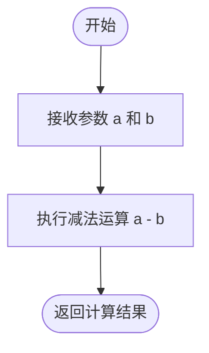

# `.\AutoGPT\autogpt_platform\backend\backend\util\service_test.py` 详细设计文档

该文件定义了一套集成测试和单元测试，用于验证基于 AppService 框架的 Python 服务基础架构，涵盖了服务创建、客户端生成、动态客户端连接的自愈逻辑、HTTP 错误处理与重试机制，以及服务的优雅关闭行为。

## 整体流程


## 类结构

```
AppService (External Dependency)
├── ServiceTest
└── TestGracefulShutdownService

AppServiceClient (External Dependency)
└── ServiceTestClient

object (Base Class)
├── TestDynamicClientConnectionHealing
│   └── TestClient (Inner Class)
├── TestConnectionHealingIntegration
└── TestHTTPErrorRetryBehavior
```

## 全局变量及字段


### `TEST_SERVICE_PORT`
    
The port number on which the test service runs.

类型：`int`
    


### `ServiceTest.fail_count`
    
A counter to track the number of intentional failures for testing retry logic.

类型：`int`
    


### `TestDynamicClientConnectionHealing.mock_service_type`
    
A mock object representing the service type configuration for testing purposes.

类型：`unittest.mock.Mock`
    


### `TestDynamicClientConnectionHealing.mock_service_client_type`
    
A mock object representing the service client type for testing purposes.

类型：`unittest.mock.Mock`
    


### `TestDynamicClientConnectionHealing.client`
    
An instance of the test client used to verify dynamic client connection healing logic.

类型：`TestClient`
    


### `TestClient (Defined in TestDynamicClientConnectionHealing).base_url`
    
The base URL for the service, constructed from host and port.

类型：`str`
    


### `TestClient (Defined in TestDynamicClientConnectionHealing)._connection_failure_count`
    
Counter tracking the number of consecutive connection failures.

类型：`int`
    


### `TestClient (Defined in TestDynamicClientConnectionHealing)._last_client_reset`
    
Timestamp of the last time the client was reset.

类型：`float`
    


### `TestClient (Defined in TestDynamicClientConnectionHealing).sync_client`
    
Cached synchronous HTTP client instance.

类型：`httpx.Client`
    


### `TestClient (Defined in TestDynamicClientConnectionHealing).async_client`
    
Cached asynchronous HTTP client instance.

类型：`httpx.AsyncClient`
    


### `TestGracefulShutdownService.request_log`
    
A list recording timestamps and events of requests for verification during tests.

类型：`list`
    


### `TestGracefulShutdownService.cleanup_called`
    
Flag indicating whether the cleanup method has been invoked.

类型：`bool`
    


### `TestGracefulShutdownService.cleanup_completed`
    
Flag indicating whether the cleanup process has finished.

类型：`bool`
    
    

## 全局函数及方法


### `test_service_creation`

该函数是一个异步单元测试，旨在验证服务（`ServiceTest`）及其客户端（`ServiceTestClient`）的创建与基本功能。通过上下文管理器启动服务，实例化客户端，并执行一系列同步与异步的方法调用，以断言服务端与客户端之间的通信及逻辑运算的正确性。

参数：

- `server`：`Fixture`，Pytest 测试夹具，通常用于提供测试所需的服务器环境或依赖（虽然函数体内未显式使用该参数，但它是测试框架注入的）。

返回值：`None`，无返回值，主要用于通过断言验证逻辑是否按预期工作。

#### 流程图


#### 带注释源码

```python
@pytest.mark.asyncio
async def test_service_creation(server):
    # 使用上下文管理器启动测试服务 ServiceTest
    with ServiceTest():
        # 获取服务对应的客户端实例
        client = get_service_client(ServiceTestClient)
        
        # 测试同步方法：加法
        assert client.add(5, 3) == 8
        
        # 测试同步方法：减法
        assert client.subtract(10, 4) == 6
        
        # 测试同步调用服务端内部包含异步逻辑的方法
        assert client.fun_with_async(5, 3) == 8
        
        # 测试异步客户端方法：加法
        assert await client.add_async(5, 3) == 8
        
        # 测试异步客户端方法：减法
        assert await client.subtract_async(10, 4) == 6
```


### `test_cached_property_behavior`

该测试函数旨在验证 `@cached_property` 装饰器的行为是否符合预期。它通过定义一个内部类并使用闭包变量来追踪属性被计算的次数，从而确认属性在首次访问时被计算、后续访问时直接返回缓存，以及在删除属性后能被重新计算。

参数：

-   无

返回值：`None`，该函数不返回值，主要通过断言验证逻辑。

#### 流程图


#### 带注释源码

```python
def test_cached_property_behavior():
    """Test that @cached_property works as expected for our use case"""
    # 使用闭包变量来追踪属性被创建（计算）的次数
    creation_count = 0

    class TestCachedProperty:
        @cached_property
        def expensive_resource(self):
            # 使用 nonlocal 修改外部作用域的计数器
            nonlocal creation_count
            creation_count += 1
            return f"resource-{creation_count}"

    obj = TestCachedProperty()

    # 第一次访问属性，应该触发计算
    resource1 = obj.expensive_resource
    assert creation_count == 1  # 验证计算已执行一次

    # 第二次访问属性，应该返回缓存值
    resource2 = obj.expensive_resource
    assert creation_count == 1  # 验证没有再次执行计算
    assert resource1 is resource2  # 验证返回的是同一个对象实例

    # 删除对象上的缓存属性
    delattr(obj, "expensive_resource")
    
    # 第三次访问属性，因为缓存已删除，应该重新计算
    resource3 = obj.expensive_resource
    assert creation_count == 2  # 验证计算再次执行
    assert resource1 != resource3  # 验证这是一个新创建的值
```


### `test_service_with_runtime_error_retries`

测试服务方法在抛出 RuntimeError 时，通过客户端的重试机制最终能够成功执行。

参数：

-   `server`：`Fixture`，测试服务器环境或上下文（虽然函数体内部直接启动了 ServiceTest，但该参数由 pytest 框架传入）。

返回值：`None`，测试函数无返回值，成功时不抛出异常。

#### 流程图


#### 带注释源码

```python
def test_service_with_runtime_error_retries(server):
    """Test a real service method that throws RuntimeError and gets retried"""
    # 进入 ServiceTest 上下文管理器，启动测试服务
    with ServiceTest():
        # 获取服务客户端，并启用 request_retry (请求重试) 选项
        client = get_service_client(ServiceTestClient, request_retry=True)

        # 调用 failing_add 方法，该方法在服务端逻辑中会模拟失败
        # 服务端逻辑设计为前两次调用抛出 RuntimeError，第三次调用成功
        # 由于开启了重试，客户端会自动捕获前两次错误并重试，直到成功
        result = client.failing_add(5, 3)
        
        # 断言最终返回的结果为 8 (5 + 3)，验证重试机制生效且最终逻辑正确
        assert result == 8
```


### `test_service_no_retry_when_disabled`

该函数用于验证当服务客户端的请求重试功能被显式禁用时，调用必然失败的服务方法是否会立即抛出异常，而不会进行重试尝试。

参数：

- `server`：`Any`，Pytest 的 fixture 对象，用于提供测试所需的服务器环境或上下文。

返回值：`None`，该函数为测试用例，无返回值，通过断言或抛出异常来验证逻辑正确性。

#### 流程图


#### 带注释源码

```python
def test_service_no_retry_when_disabled(server):
    """Test that retry doesn't happen when disabled"""
    # 启动测试服务上下文
    with ServiceTest():
        # 获取服务客户端实例，显式设置 request_retry=False 以禁用重试机制
        client = get_service_client(ServiceTestClient, request_retry=False)

        # 验证调用必定失败的方法时，会立即抛出 RuntimeError 且不进行重试
        with pytest.raises(RuntimeError, match="Intended error for testing"):
            # 调用 ServiceTest 中定义的 always_failing_add 方法
            # 该方法被设计为总是抛出 RuntimeError("Intended error for testing")
            client.always_failing_add(5, 3)
```


### `wait_until_service_ready`

一个异步辅助函数，用于通过定期轮询健康检查端点来等待服务启动并准备就绪。如果在指定的超时时间内服务未响应或健康检查未通过，则抛出异常。

参数：

- `base_url`：`str`，待检查服务的基础 URL 地址。
- `timeout`：`float`，等待服务准备就绪的超时时间（秒），默认为 10 秒。

返回值：`None`，当服务健康检查成功时返回，无显式返回值；若超时则抛出异常。

#### 流程图


#### 带注释源码

```python
async def wait_until_service_ready(base_url: str, timeout: float = 10):
    # 记录开始时间以计算超时
    start_time = time.time()
    
    # 循环检查直到超时
    while time.time() - start_time <= timeout:
        # 创建异步 HTTP 客户端
        async with httpx.AsyncClient(timeout=5) as client:
            # 抑制连接错误，允许在服务尚未完全启动时重试
            with contextlib.suppress(httpx.ConnectError):
                # 尝试请求健康检查端点
                response = await client.get(f"{base_url}/health_check", timeout=5)

                # 验证响应状态码和内容是否正确
                if response.status_code == 200 and response.json() == "OK":
                    # 健康检查通过，退出函数
                    return

        # 如果未就绪，等待 0.5 秒后重试
        await asyncio.sleep(0.5)

    # 超时后抛出运行时错误
    raise RuntimeError(f"Service at {base_url} not available after {timeout} seconds")
```


### `send_slow_request`

该函数是一个辅助函数，用于向测试服务发送一个耗时的 HTTP 请求。它主要用于在优雅关闭测试中验证正在进行的请求是否能够在服务关闭过程中完成。

参数：

-  `base_url`：`str`，目标测试服务的基础 URL（例如 "http://localhost:18999"）。

返回值：`dict`，来自慢速端点的 JSON 响应数据，包含执行状态、持续时间等信息。

#### 流程图

```mermaid
graph TD
    A[开始] --> B[创建 httpx.AsyncClient 设置超时30秒]
    B --> C[向 base_url/slow_endpoint 发送 POST 请求]
    C --> D[请求体: {duration: 5}]
    D --> E{断言状态码 == 200}
    E -- 否 --> F[抛出 AssertionError]
    E -- 是 --> G[解析响应体为 JSON]
    G --> H[返回字典数据]
    H --> I[结束]
```

#### 带注释源码

```python
async def send_slow_request(base_url: str) -> dict:
    """Send a slow request and return the result"""
    # 创建一个异步 HTTP 客户端，设置全局超时时间为 30 秒
    # 这是为了确保即使是慢速请求也有足够的时间完成
    async with httpx.AsyncClient(timeout=30) as client:
        # 向指定 URL 的 slow_endpoint 发送 POST 请求
        # 请求参数指定持续时间为 5 秒，模拟长耗时任务
        response = await client.post(f"{base_url}/slow_endpoint", json={"duration": 5})
        
        # 断言响应状态码为 200，确保请求成功
        assert response.status_code == 200
        
        # 返回响应体的 JSON 数据
        return response.json()
```


### `test_graceful_shutdown`

验证 AppService 在服务关闭过程中的优雅行为，确保正在处理的慢请求能够完成，而新发起的请求会被拒绝，同时服务进程能够正确终止。

参数：

- `test_service`：`tuple[TestGracefulShutdownService, str]`，由 pytest fixture 提供的测试服务实例及其监听的 URL。

返回值：`None`，该函数为异步测试函数，主要执行断言逻辑，无返回值。

#### 流程图


#### 带注释源码

```python
@pytest.mark.asyncio
async def test_graceful_shutdown(test_service):
    """Test that AppService handles graceful shutdown correctly"""
    # 解包 fixture 提供的服务对象和测试 URL
    service, test_service_url = test_service

    # 1. 启动一个耗时的请求任务 (预计耗时 5 秒)
    # 目的：模拟正在处理中的长连接请求
    slow_task = asyncio.create_task(send_slow_request(test_service_url))

    # 2. 等待 1 秒，确保慢请求已经在服务端开始处理
    await asyncio.sleep(1)

    # 3. 发送 SIGTERM 信号给服务进程，触发优雅关闭流程
    shutdown_start_time = time.time()
    service.process.terminate()  # This sends SIGTERM

    # 4. 稍作等待，让服务端开始进入关闭状态
    await asyncio.sleep(0.5)

    # 5. 尝试发送一个新的快速请求
    # 目的：验证服务在关闭过程中是否拒绝新连接
    try:
        async with httpx.AsyncClient(timeout=5) as client:
            response = await client.post(f"{test_service_url}/fast_endpoint", json={})
            # 期望收到 503 Service Unavailable，表示服务正在关闭
            assert response.status_code == 503
            assert "shutting down" in response.json()["detail"].lower()
    except httpx.ConnectError:
        # 连接被拒绝也是可接受的，说明服务已停止监听
        pass

    # 6. 等待之前的慢请求完成
    # 目的：验证优雅关闭机制会等待现有请求完成
    slow_result = await slow_task
    assert slow_result["message"] == "completed"
    assert 4.9 < slow_result["duration"] < 5.5  # 验证请求确实执行了约 5 秒

    # 7. 等待服务进程完全退出
    service.process.join(timeout=15)
    shutdown_end_time = time.time()

    # 8. 验证进程状态和关闭耗时
    assert not service.process.is_alive()

    # 计算总关闭时间：慢请求耗时(5s) - 预等待时间(1s) + 缓冲时间
    shutdown_duration = shutdown_end_time - shutdown_start_time
    assert 4 <= shutdown_duration <= 6  # 验证时间逻辑符合预期

    print(f"Shutdown took {shutdown_duration:.2f} seconds")
    print(f"Slow request completed in: {slow_result['duration']:.2f} seconds")
```


### `test_health_check_during_shutdown`

该测试函数用于验证服务在接收到关闭信号（SIGTERM）后的健康检查行为。它首先确认服务处于健康状态，随后发送终止信号，并验证在关闭过程中，健康检查端点应返回错误状态码（如 500 或 503）或直接拒绝连接，从而确保负载均衡器或调用方能够正确识别服务不可用。

参数：

-   `test_service`：`fixture`，一个异步 fixture，返回一个包含 `TestGracefulShutdownService` 实例和服务基础 URL 的元组 `(service, test_service_url)`。

返回值：`None`，该函数为测试用例，无返回值，通过断言验证行为。

#### 流程图

```mermaid
flowchart TD
    Start([开始]) --> InitFixture[初始化 test_service fixture<br>获取 service 与 url]
    InitFixture --> FirstCheck[发送 GET 请求 /health_check]
    FirstCheck --> Check200{状态码 == 200?}
    Check200 -- 否 --> Fail([测试失败])
    Check200 -- 是 --> Terminate[发送终止信号<br>service.process.terminate]
    Terminate --> Wait[等待 1 秒]
    Wait --> SecondCheck[尝试发送 GET 请求 /health_check]
    
    SecondCheck --> IsSuccess{请求成功建立连接?}
    
    IsSuccess -- 是 --> CheckStatus{状态码 in [500, 503]?}
    CheckStatus -- 否 --> Fail
    CheckStatus -- 是 --> End([结束测试])
    
    IsSuccess -- 否/异常 --> CatchError{捕获 ConnectError 或 ConnectTimeout?}
    CatchError -- 否 --> Fail
    CatchError -- 是 --> End
```

#### 带注释源码

```python
@pytest.mark.asyncio
async def test_health_check_during_shutdown(test_service):
    """Test that health checks behave correctly during shutdown"""
    # 从 fixture 获取正在运行的服务实例和其监听的 URL
    service, test_service_url = test_service

    # 步骤 1: 验证服务在关闭前是健康的
    async with httpx.AsyncClient(timeout=5) as client:
        response = await client.get(f"{test_service_url}/health_check")
        assert response.status_code == 200

    # 步骤 2: 向服务进程发送 SIGTERM 信号，触发优雅关闭流程
    service.process.terminate()

    # 步骤 3: 等待一小段时间，让关闭逻辑开始执行（例如停止接受新连接）
    await asyncio.sleep(1)

    # 步骤 4: 验证健康检查在关闭期间的表现
    try:
        async with httpx.AsyncClient(timeout=5) as client:
            # 尝试访问健康检查端点
            response = await client.get(f"{test_service_url}/health_check")
            # 如果连接成功，服务应返回 500 (内部错误) 或 503 (服务不可用) 等状态码
            # Could either get 503, 500 (unhealthy), or connection error
            assert response.status_code in [500, 503]
    except (httpx.ConnectError, httpx.ConnectTimeout):
        # 如果连接被拒绝或超时，这也是可接受的关闭行为，表明服务已停止监听
        # Connection refused/timeout is also acceptable - server stopped accepting
        pass
```


### `ServiceTest.__init__`

该方法是 `ServiceTest` 类的构造函数，用于初始化测试服务实例。它调用父类 `AppService` 的构造函数以继承基础服务框架的功能，并初始化一个内部计数器 `fail_count` 为 0，该计数器后续用于控制测试方法中的模拟失败行为。

参数：

-   无显式参数（仅包含 `self`）。

返回值：`None`，构造函数不返回任何值。

#### 流程图

```mermaid
flowchart TD
    A[开始初始化 ServiceTest] --> B[调用 super().__init__ 初始化父类 AppService]
    B --> C[初始化实例属性 self.fail_count 为 0]
    C --> D[初始化完成]
```

#### 带注释源码

```python
def __init__(self):
    super().__init__()      # 调用父类 AppService 的构造函数，完成基础服务的初始化
    self.fail_count = 0     # 初始化失败计数器，用于在测试中模拟特定的重试或失败逻辑
```


### `ServiceTest.get_port`

获取测试服务实例运行时监听的网络端口号。这是一个类方法，用于为服务提供一个固定的配置端口，以便在测试环境中建立客户端连接。

参数：

(无)

返回值：`int`，返回预定义的全局常量 `TEST_SERVICE_PORT` (当前值为 8765)，表示服务绑定的端口。

#### 流程图


#### 带注释源码

```python
    @classmethod
    def get_port(cls) -> int:
        # 返回模块级别定义的测试端口常量
        return TEST_SERVICE_PORT
```


### `ServiceTest.__enter__`

重写上下文管理器的进入方法，用于在服务启动后立即进行健康检查，确保在返回实例之前服务已完全可用。

参数：

-  `self`：`ServiceTest`，当前类的实例

返回值：`ServiceTest`，返回服务实例本身，通常用于 `with` 语句块中。

#### 流程图

```mermaid
flowchart TD
    A[Start: __enter__ called] --> B[Execute super().__enter__]
    B --> C[Start Service via Parent Class]
    C --> D[Execute self.wait_until_ready]
    D --> E[Perform Health Check with Retry]
    E --> F[Return result]
```

#### 带注释源码

```python
def __enter__(self):
    # Start the service
    # 调用父类的 __enter__ 方法启动服务
    result = super().__enter__()

    # Wait for the service to be ready
    # 阻塞当前线程，直到服务健康检查通过
    self.wait_until_ready()

    return result
```


### `ServiceTest.wait_until_ready`

Helper method to wait for a service to be ready using health check with retry.

参数：

-  `self`：`ServiceTest`，类实例本身
-  `timeout_seconds`：`int`，健康检查的超时时间（秒），默认为 5

返回值：`None`，无返回值

#### 流程图


#### 带注释源码

```python
    def wait_until_ready(self, timeout_seconds: int = 5):
        """Helper method to wait for a service to be ready using health check with retry."""
        # 获取服务客户端实例，启用请求重试机制并设置超时时间
        client = get_service_client(
            ServiceTestClient, call_timeout=timeout_seconds, request_retry=True
        )
        # 执行健康检查，由于开启了重试，此调用会阻塞直到服务响应就绪或达到超时限制
        client.health_check()  # This will retry until service is ready
```


### `ServiceTest.add`

该方法是 `ServiceTest` 类中的一个基础算术运算方法，被 `@expose` 装饰器标记为服务对外暴露的 API 端点。它接收两个整数作为输入，计算它们的和并返回，主要用于测试服务框架的基础通信功能。

参数：

- `a`：`int`，加法运算的第一个整数参数。
- `b`：`int`，加法运算的第二个整数参数。

返回值：`int`，参数 `a` 和 `b` 相加的结果。

#### 流程图


#### 带注释源码

```python
    @expose  # 装饰器：将此方法注册为服务的公共 HTTP/RPC 接口
    def add(self, a: int, b: int) -> int:
        return a + b  # 执行整数加法并返回结果
```


### `ServiceTest.subtract`

该方法作为远程调用服务的一部分被公开，用于接收两个整数参数并返回它们的差值。

参数：

- `a`：`int`，被减数
- `b`：`int`，减数

返回值：`int`，两个参数的差值结果

#### 流程图



#### 带注释源码

```python
    @expose
    def subtract(self, a: int, b: int) -> int:
        # 返回参数 a 减去参数 b 的结果
        return a - b
```


### `ServiceTest.fun_with_async`

演示了如何在同步的服务接口方法中封装并执行异步逻辑。该方法定义了一个内部异步函数来执行加法操作，并通过 `run_and_wait` 方法同步等待异步协程完成，从而对外提供同步调用体验。

参数：

-  `a`：`int`，待相加的第一个整数参数
-  `b`：`int`，待相加的第二个整数参数

返回值：`int`，两个整数参数相加后的计算结果

#### 流程图


#### 带注释源码

```python
    @expose
    def fun_with_async(self, a: int, b: int) -> int:
        # 定义一个内部异步函数，用于执行具体的加法逻辑
        async def add_async(a: int, b: int) -> int:
            return a + b

        # 调用父类或混入提供的 run_and_wait 方法，同步运行传入的协程并返回结果
        # 这使得在同步的 HTTP 接口中复用异步逻辑成为可能
        return self.run_and_wait(add_async(a, b))
```


### `ServiceTest.failing_add`

该方法旨在模拟间歇性故障以测试重试逻辑。在方法内部维护一个失败计数器，前两次调用会抛出 `RuntimeError` 异常，而从第三次调用开始，它会返回两个输入整数的和。

参数：

- `a`：`int`，第一个加数。
- `b`：`int`，第二个加数。

返回值：`int`，输入参数 `a` 和 `b` 的和（仅在重试成功后返回）。

#### 流程图


#### 带注释源码

```python
    @expose
    def failing_add(self, a: int, b: int) -> int:
        """Method that fails 2 times then succeeds - for testing retry logic"""
        # 每次调用时增加失败计数器
        self.fail_count += 1
        
        # 检查是否处于前两次调用范围内
        if self.fail_count <= 2:
            # 抛出运行时错误以模拟服务故障，用于测试客户端的重试机制
            raise RuntimeError(f"Intended error for testing {self.fail_count}/2")
            
        # 如果调用次数超过2次，则正常执行加法运算并返回结果
        return a + b
```


### `ServiceTest.always_failing_add`

这是一个用于测试目的的服务方法，旨在模拟一种始终无法成功执行且不会自动恢复的场景。该方法被设计为在调用时立即抛出运行时错误，通常用于验证客户端在禁用重试机制时的错误处理行为。

参数：

-  `a`：`int`，待相加的第一个整数（虽为加法操作的参数，但在本方法逻辑中实际未使用）。
-  `b`：`int`，待相加的第二个整数（虽为加法操作的参数，但在本方法逻辑中实际未使用）。

返回值：`int`，虽然函数签名定义返回整数，但实际上该方法总是抛出异常，不会返回任何值。

#### 流程图


#### 带注释源码

```python
    @expose
    def always_failing_add(self, a: int, b: int) -> int:
        """Method that always fails - for testing no retry when disabled"""
        # 抛出一个运行时错误，用于测试当禁用重试功能时客户端的表现
        raise RuntimeError("Intended error for testing")
```


### `ServiceTestClient.get_service_type`

该类方法用于指定当前客户端（`ServiceTestClient`）所连接的服务端点实现类型。通过返回 `ServiceTest` 类，客户端框架能够获知与之交互的具体服务定义，从而建立正确的映射关系。

参数：

-  `cls`：`type[ServiceTestClient]`，类方法隐式参数，代表当前客户端类本身。

返回值：`type[ServiceTest]`，返回服务类 `ServiceTest` 的类型对象，用于标识客户端绑定的具体服务实现。

#### 流程图


#### 带注释源码

```python
    @classmethod
    def get_service_type(cls):
        # 返回当前客户端绑定的服务实现类 ServiceTest
        return ServiceTest
```


### `ServiceTestClient.add`

该方法定义了一个加法运算的端点。在客户端类中，它引用了服务端 `ServiceTest` 的实现逻辑，用于接收两个整数参数并返回它们的和。它通过 `@expose` 装饰器暴露为可调用的服务接口。

参数：

-   `a`：`int`，参与加法运算的第一个整数
-   `b`：`int`，参与加法运算的第二个整数

返回值：`int`，两个参数 `a` 和 `b` 相加的结果

#### 流程图


#### 带注释源码

```python
    @expose
    def add(self, a: int, b: int) -> int:
        # 返回参数 a 和参数 b 的和
        return a + b
```


### `ServiceTestClient.subtract`

执行两个整数的减法运算，返回第一个参数减去第二个参数的结果。

参数：

-  `a`：`int`，被减数，即要从中减去的数值。
-  `b`：`int`，减数，即要减去的数值。

返回值：`int`，两个参数相减后的差值。

#### 流程图

```mermaid
flowchart TD
    Start([开始]) --> SubOp[执行减法运算 result = a - b]
    SubOp --> ReturnOp((返回 result))
    ReturnOp --> End([结束])
```

#### 带注释源码

```python
# 该方法定义于 ServiceTest 类，并通过赋值引用至 ServiceTestClient
@expose
def subtract(self, a: int, b: int) -> int:
    # 返回 a 减去 b 的计算结果
    return a - b
```


### `ServiceTestClient.fun_with_async`

该函数演示了在同步服务方法中集成异步逻辑的能力。它定义了一个内部的异步函数来执行加法运算，并通过框架提供的 `run_and_wait` 方法在同步上下文中调度并等待异步任务完成，最终返回结果。

参数：

- `a`：`int`，待相加的第一个整数
- `b`：`int`，待相加的第二个整数

返回值：`int`，两个整数相加的结果。

#### 流程图

```mermaid
graph TD
    A[开始] --> B[定义内部异步函数 add_async]
    B --> C[调用 add_asynca, b 生成协程对象]
    C --> D[调用 self.run_and_wait协程对象]
    D --> E[等待异步执行完成并获取结果]
    E --> F[返回结果]
    F --> G[结束]
```

#### 带注释源码

```python
    @expose
    def fun_with_async(self, a: int, b: int) -> int:
        # 定义一个内部异步函数，模拟异步操作（例如IO密集型任务）
        async def add_async(a: int, b: int) -> int:
            return a + b

        # 调用 AppService 基类提供的 run_and_wait 方法
        # 该方法接收一个协程对象，在事件循环中运行它并阻塞等待结果
        # 从而实现了在同步方法中调用异步逻辑的桥接
        return self.run_and_wait(add_async(a, b))
```


### `ServiceTestClient.failing_add`

该方法是一个测试用的端点，模拟间歇性故障行为。它在被调用时会首先增加内部的失败计数器，如果当前计数小于或等于2，则抛出 RuntimeError 异常；只有在通过两次失败后，第三次及以后的调用才会正常执行加法运算并返回结果。这通常用于测试客户端的重试逻辑。

参数：

- `a`：`int`，加法运算的第一个整数。
- `b`：`int`，加法运算的第二个整数。

返回值：`int`，整数 a 和 b 的和（仅在通过初始失败阶段后返回）。

#### 流程图

```mermaid
graph TD
    A[开始执行 failing_add] --> B[内部计数器 fail_count 自增]
    B --> C{判断 fail_count <= 2 ?}
    C -- 是 (前两次调用) --> D[抛出 RuntimeError 异常]
    C -- 否 (第三次及以后) --> E[计算并返回 a + b]
```

#### 带注释源码

```python
    @expose
    def failing_add(self, a: int, b: int) -> int:
        """Method that fails 2 times then succeeds - for testing retry logic"""
        self.fail_count += 1  # 增加失败尝试计数器
        # 检查是否还在允许失败的次数范围内（即前2次）
        if self.fail_count <= 2:
            # 抛出运行时错误以模拟服务故障
            raise RuntimeError(f"Intended error for testing {self.fail_count}/2")
        # 如果失败次数已用尽，执行正常的加法运算
        return a + b
```


### `ServiceTestClient.always_failing_add`

该方法是用于测试服务端异常处理的端点。在客户端（ServiceTestClient）中，它被引用自服务类（ServiceTest）的同名方法。该方法被设计为在调用时无条件抛出 `RuntimeError`，其主要目的是验证当请求重试机制被禁用时，客户端能够立即正确地捕获并抛出异常，而不会进行重试操作。

参数：

- `a`：`int`，加法运算的第一个整数参数（未实际使用）。
- `b`：`int`，加法运算的第二个整数参数（未实际使用）。

返回值：`int`，名义上返回两个参数的和，但在实际执行流程中总是抛出异常，因此永远不会返回该值。

#### 流程图

```mermaid
flowchart TD
    A[开始调用 always_failing_add] --> B[接收参数 a, b]
    B --> C[无条件抛出 RuntimeError]
    C --> D[异常信息: Intended error for testing]
    D --> E[方法异常终止]
```

#### 带注释源码

```python
    # 定义在 ServiceTest 类中，并在 ServiceTestClient 中被引用
    @expose
    def always_failing_add(self, a: int, b: int) -> int:
        """
        Method that always fails - for testing no retry when disabled
        方法总是失败 - 用于测试禁用重试时的行为
        """
        # 抛出运行时错误，模拟服务端不可恢复的错误
        raise RuntimeError("Intended error for testing")
```


### `ServiceTestClient.add_async`

该方法是 `ServiceTest` 服务中 `add` 方法的异步客户端版本。通过 `endpoint_to_async` 辅助函数生成，它允许客户端以非阻塞的异步方式调用远程服务的加法接口。

参数：

- `a`：`int`，加法运算的第一个整数参数。
- `b`：`int`，加法运算的第二个整数参数。

返回值：`Coroutine[int]`，返回一个协程对象，该协程在完成时解析为两个整数相加的结果。

#### 流程图

```mermaid
graph TD
    A[客户端调用 add_async] --> B{执行 endpoint_to_async 包装逻辑}
    B --> C[构造异步 HTTP 请求]
    C --> D[发送请求至 ServiceTest.add 端点]
    D --> E[服务端执行 a + b 运算]
    E --> F[返回运算结果]
    F --> G[客户端接收并解析结果]
    G --> H[返回结果给调用方]
```

#### 带注释源码

```python
    # 利用 endpoint_to_async 工具将服务端的同步方法 ServiceTest.add
    # 转换为客户端的异步调用方法。这使得客户端可以使用 await 进行非阻塞调用。
    add_async = endpoint_to_async(ServiceTest.add)
```


### `ServiceTestClient.subtract_async`

这是一个异步客户端方法，通过 `endpoint_to_async` 辅助函数将服务端的同步 `subtract` 方法转换为异步调用接口。它允许客户端以异步非阻塞的方式远程调用减法运算。

参数：

- `a`：`int`，被减数，参与减法运算的第一个整数。
- `b`：`int`，减数，参与减法运算的第二个整数。

返回值：`int`，返回 `a` 减去 `b` 的计算结果（通过异步协程返回）。

#### 流程图

```mermaid
flowchart TD
    A["开始: 调用 subtract_async"] --> B["准备 HTTP 请求参数"]
    B --> C["通过底层 HTTP 客户端发起异步 POST 请求"]
    C --> D["等待服务端响应"]
    D --> E{是否收到响应?}
    E -- 是 --> F["解析响应内容"]
    F --> G["返回计算结果"]
    E -- 否/超时 --> H["抛出网络或超时异常"]
    G --> I["结束"]
    H --> I
```

#### 带注释源码

```python
# 使用 endpoint_to_async 装饰器/工厂函数，将 ServiceTest.subtract 这个同步暴露的方法
# 转换为一个可以在客户端调用的异步方法。
# 这使得 client.subtract_async(a, b) 可以使用 await 语法进行调用，
# 并通过 HTTP 协议与服务端进行异步通信。
subtract_async = endpoint_to_async(ServiceTest.subtract)
```


### `TestDynamicClientConnectionHealing.setup_method`

`TestDynamicClientConnectionHealing` 测试类的初始化方法，用于在每个测试方法执行前设置必要的模拟对象和测试客户端实例，以隔离测试环境并准备连接愈合逻辑的测试条件。

参数：

- `self`：`TestDynamicClientConnectionHealing`，测试类的实例引用。

返回值：`None`，无返回值。

#### 流程图

```mermaid
graph TD
    A[开始执行 setup_method] --> B[初始化 mock_service_type 为 Mock 对象]
    B --> C[配置 mock_service_type.get_host 返回 'localhost']
    C --> D[配置 mock_service_type.get_port 返回 8000]
    D --> E[初始化 mock_service_client_type 为 Mock 对象]
    E --> F[配置 mock_service_client_type.get_service_type 返回 mock_service_type]
    F --> G[调用 self._create_test_client 创建测试客户端]
    G --> H[将创建的测试客户端赋值给 self.client]
    H --> I[结束]
```

#### 带注释源码

```python
    def setup_method(self):
        """Setup for each test method"""
        # 创建一个模拟的服务类型对象，用于替代真实的服务配置
        self.mock_service_type = Mock()
        # 配置模拟对象的 get_host 方法返回 "localhost"
        self.mock_service_type.get_host.return_value = "localhost"
        # 配置模拟对象的 get_port 方法返回 8000
        self.mock_service_type.get_port.return_value = 8000

        # 创建一个模拟的服务客户端类型对象
        self.mock_service_client_type = Mock()
        # 配置模拟客户端类型的 get_service_type 方法返回上面创建的模拟服务类型
        # 从而建立客户端与服务之间的关联
        self.mock_service_client_type.get_service_type.return_value = (
            self.mock_service_type
        )

        # 调用内部辅助方法创建测试客户端，并将其实例赋值给 self.client
        # 该客户端封装了真实的 DynamicClient 连接愈合逻辑
        self.client = self._create_test_client()
```


### `TestDynamicClientConnectionHealing._create_test_client`

该方法用于创建并返回一个测试客户端实例。该实例通过动态定义内部类 `TestClient` 来模拟真实的 `DynamicClient` 的核心行为，主要包含基于 `cached_property` 的 HTTP 客户端缓存机制，以及基于连接失败次数和时间窗口的连接自愈逻辑（即清除缓存并重置客户端）。

参数：

无

返回值：`TestClient`，一个配置了模拟服务类型、具备客户端缓存功能和连接错误自愈逻辑的测试客户端实例。

#### 流程图

```mermaid
graph TD
    A[开始执行] --> B[定义 TestClient 内部类]
    B --> C[定义 __init__ 方法]
    C --> D[定义 _create_sync_client/async_client 工厂方法]
    D --> E[定义 sync_client/async_client 为 cached_property]
    E --> F[定义 _handle_connection_error 错误处理逻辑]
    F --> G[实例化 TestClient 传入 self.mock_service_client_type]
    G --> H[执行初始化: 获取 Host/Port, 设置 base_url, 初始化计数器]
    H --> I[返回 TestClient 实例]
```

#### 带注释源码

```python
    def _create_test_client(self):
        """Create a test client that mimics the real DynamicClient"""

        class TestClient:
            def __init__(self, service_client_type):
                # 从 mock 对象中获取服务类型
                service_type = service_client_type.get_service_type()
                # 获取主机和端口
                host = service_type.get_host()
                port = service_type.get_port()
                # 构建基础 URL
                self.base_url = f"http://{host}:{port}".rstrip("/")
                # 初始化连接失败计数器
                self._connection_failure_count = 0
                # 初始化上次客户端重置的时间戳
                self._last_client_reset = 0

            def _create_sync_client(self) -> httpx.Client:
                # 创建并返回一个 Mock 的同步 HTTP 客户端
                return Mock(spec=httpx.Client)

            def _create_async_client(self) -> httpx.AsyncClient:
                # 创建并返回一个 Mock 的异步 HTTP 客户端
                return Mock(spec=httpx.AsyncClient)

            @cached_property
            def sync_client(self) -> httpx.Client:
                # 使用 cached_property 缓存同步客户端
                return self._create_sync_client()

            @cached_property
            def async_client(self) -> httpx.AsyncClient:
                # 使用 cached_property 缓存异步客户端
                return self._create_async_client()

            def _handle_connection_error(self, error: Exception) -> None:
                """Handle connection errors and implement self-healing"""
                # 增加连接失败计数
                self._connection_failure_count += 1
                current_time = time.time()

                # 检查是否满足自愈条件：失败次数 >= 3 且距离上次重置超过 30 秒
                if (
                    self._connection_failure_count >= 3
                    and current_time - self._last_client_reset > 30
                ):

                    # 如果存在缓存的同步客户端属性，将其删除以强制重新创建
                    if hasattr(self, "sync_client"):
                        delattr(self, "sync_client")
                    # 如果存在缓存的异步客户端属性，将其删除以强制重新创建
                    if hasattr(self, "async_client"):
                        delattr(self, "async_client")

                    # 重置失败计数器和上次重置时间
                    self._connection_failure_count = 0
                    self._last_client_reset = current_time

        # 使用类中预定义的 mock 服务客户端类型实例化 TestClient 并返回
        return TestClient(self.mock_service_client_type)
```


### `TestDynamicClientConnectionHealing.test_client_caching`

该测试方法用于验证客户端对象是否通过 `@cached_property` 装饰器被正确缓存。它通过多次获取同步客户端和异步客户端实例，并断言它们是否为同一个对象来确认缓存机制的有效性。

参数：

- `self`：`TestDynamicClientConnectionHealing`，测试类的实例，用于访问测试上下文和客户端对象。

返回值：`None`，无返回值，仅通过断言验证逻辑。

#### 流程图

```mermaid
graph TD
    A[开始] --> B[获取 sync_client 赋值给 sync1]
    B --> C[获取 sync_client 赋值给 sync2]
    C --> D{sync1 与 sync2 是否同一实例?}
    D -- 否 --> E[断言失败: Sync clients should be cached]
    D -- 是 --> F[获取 async_client 赋值给 async1]
    F --> G[获取 async_client 赋值给 async2]
    G --> H{async1 与 async2 是否同一实例?}
    H -- 否 --> I[断言失败: Async clients should be cached]
    H -- 是 --> J[测试通过]
    E --> K[结束]
    I --> K
    J --> K
```

#### 带注释源码

```python
def test_client_caching(self):
    """Test that clients are cached via @cached_property"""
    # Get clients multiple times
    # 多次获取同步客户端对象，验证缓存机制
    sync1 = self.client.sync_client
    sync2 = self.client.sync_client
    
    # 多次获取异步客户端对象，验证缓存机制
    async1 = self.client.async_client
    async2 = self.client.async_client

    # Should return same instances (cached)
    # 断言两次获取的同步客户端是同一个对象实例
    assert sync1 is sync2, "Sync clients should be cached"
    # 断言两次获取的异步客户端是同一个对象实例
    assert async1 is async2, "Async clients should be cached"
```


### `TestDynamicClientConnectionHealing.test_connection_error_counting`

测试连接错误是否被正确计数，确保在发生错误时计数器能够按预期递增。

参数：

- `self`：`TestDynamicClientConnectionHealing`，测试类实例，用于访问测试客户端和执行断言。

返回值：`None`，无返回值，主要用于验证逻辑行为。

#### 流程图

```mermaid
graph TD
    A[开始] --> B[获取当前连接失败计数 initial_count]
    B --> C[调用 client._handle_connection_error 模拟错误]
    C --> D[断言: 计数器是否为 initial_count + 1]
    D --> E[再次调用 client._handle_connection_error 模拟错误]
    E --> F[断言: 计数器是否为 initial_count + 2]
    F --> G[结束]
```

#### 带注释源码

```python
def test_connection_error_counting(self):
    """Test that connection errors are counted correctly"""
    # 获取测试客户端当前的连接失败计数器初始值
    initial_count = self.client._connection_failure_count

    # Simulate connection errors
    # 第一次模拟连接错误
    self.client._handle_connection_error(Exception("Connection failed"))
    # 断言验证：失败计数器应该增加了 1
    assert self.client._connection_failure_count == initial_count + 1

    # 第二次模拟连接错误
    self.client._handle_connection_error(Exception("Connection failed"))
    # 断言验证：失败计数器应该总共增加了 2
    assert self.client._connection_failure_count == initial_count + 2
```


### `TestDynamicClientConnectionHealing.test_no_reset_before_threshold`

测试在连接错误计数未达到重置阈值（3次）之前，客户端实例不应被重置或重新创建。

参数：

- `self`：`TestDynamicClientConnectionHealing`，测试类的实例，用于访问测试客户端实例。

返回值：`None`，该方法无返回值，主要通过断言验证逻辑正确性。

#### 流程图

```mermaid
flowchart TD
    A[开始测试] --> B[获取初始 sync_client]
    B --> C[获取初始 async_client]
    C --> D[模拟第1次连接错误<br>调用 _handle_connection_error]
    D --> E[模拟第2次连接错误<br>调用 _handle_connection_error]
    E --> F[获取当前 sync_client]
    F --> G[获取当前 async_client]
    G --> H{sync_before 与 sync_after<br>是否为同一对象?}
    H -- 否 --> I[测试失败]
    H -- 是 --> J{async_before 与 async_after<br>是否为同一对象?}
    J -- 否 --> I
    J -- 是 --> K{错误计数器<br>是否等于 2?}
    K -- 否 --> I
    K -- 是 --> L[测试通过]
```

#### 带注释源码

```python
def test_no_reset_before_threshold(self):
    """Test that clients are NOT reset before reaching failure threshold"""
    # 获取当前的同步客户端和异步客户端实例引用
    sync_before = self.client.sync_client
    async_before = self.client.async_client

    # 模拟 2 次连接失败（低于重置阈值 3）
    self.client._handle_connection_error(Exception("Connection failed"))
    self.client._handle_connection_error(Exception("Connection failed"))

    # 再次获取客户端实例引用
    sync_after = self.client.sync_client
    async_after = self.client.async_client

    # 断言：客户端实例应该是同一个对象，说明没有发生重置
    assert (
        sync_before is sync_after
    ), "Sync client should not be reset before threshold"
    assert (
        async_before is async_after
    ), "Async client should not be reset before threshold"
    
    # 断言：确认失败计数器记录了 2 次错误
    assert self.client._connection_failure_count == 2
```


### `TestDynamicClientConnectionHealing.test_no_reset_within_time_window`

该测试方法验证了连接愈合逻辑中的时间窗口约束。具体而言，它确保即使连接失败次数达到了重置阈值（3次），如果距离上次客户端重置的时间未超过规定的限制（30秒），客户端连接实例不会被重置，从而防止在短时间内频繁重建连接。

参数：

- `self`：`TestDynamicClientConnectionHealing`，测试类的实例，用于访问测试客户端实例和断言方法。

返回值：`None`，该方法为测试函数，通过断言验证行为，无返回值。

#### 流程图

```mermaid
flowchart TD
    A([开始]) --> B[获取初始客户端 sync_before 和 async_before]
    B --> C[设置 _last_client_reset 为 10秒前<br>模拟在30秒时间窗口内]
    C --> D{循环 3 次}
    D --> E[调用 _handle_connection_error<br>模拟连接失败]
    E --> D
    D -- 循环结束 --> F[获取当前客户端 sync_after 和 async_after]
    F --> G{断言 sync_before 与 sync_after<br>是否为同一对象?}
    G -- 否 --> H([测试失败])
    G -- 是 --> I{断言 async_before 与 async_after<br>是否为同一对象?}
    I -- 否 --> H
    I -- 是 --> J{断言 _connection_failure_count<br>是否等于 3?}
    J -- 否 --> H
    J -- 是 --> K([测试通过])
```

#### 带注释源码

```python
def test_no_reset_within_time_window(self):
    """Test that clients are NOT reset if within the 30-second window"""
    # 获取初始的客户端实例，作为后续对比的基准
    sync_before = self.client.sync_client
    async_before = self.client.async_client

    # 设置上次重置时间为10秒前
    # 这模拟了虽然发生了连接失败，但距离上次重置操作不足30秒（处于时间窗口内）
    self.client._last_client_reset = time.time() - 10  # 10 seconds ago

    # 模拟3次连接错误，达到触发重置的次数阈值（3次）
    for _ in range(3):
        self.client._handle_connection_error(Exception("Connection failed"))

    # 获取当前的客户端实例
    sync_after = self.client.sync_client
    async_after = self.client.async_client

    # 验证：Sync客户端不应被重置，对象引用应保持不变
    assert (
        sync_before is sync_after
    ), "Sync client should not be reset within time window"
    
    # 验证：Async客户端不应被重置，对象引用应保持不变
    assert (
        async_before is async_after
    ), "Async client should not be reset within time window"
    
    # 验证：失败计数应正确累加为3，表明错误确实被记录但未触发重置逻辑
    assert self.client._connection_failure_count == 3
```


### `TestDynamicClientConnectionHealing.test_reset_after_threshold_and_time`

该测试方法验证了动态客户端的连接自愈逻辑：当连接失败次数达到阈值（3次）且距离上次重置的时间超过预设窗口（30秒）时，缓存的同步和异步客户端应当被重置（销毁并重新创建），且失败计数器应当被清零。

参数：

- `self`：`TestDynamicClientConnectionHealing`，测试类的实例，用于访问测试客户端和断言方法。

返回值：`None`，无返回值。

#### 流程图

```mermaid
graph TD
    A[开始测试: test_reset_after_threshold_and_time] --> B[获取初始 sync_client 和 async_client]
    B --> C[设置 _last_client_reset 为当前时间减去 60秒<br/>(模拟超过30秒时间窗口)]
    C --> D[开始循环: 模拟3次连接失败]
    D --> E[调用 _handle_connection_error 模拟异常]
    E --> F{循环是否达到3次?}
    F -- 否 --> D
    F -- 是 --> G[获取重置后的 sync_client 和 async_client]
    G --> H[断言: sync_before 不是 sync_after]
    G --> I[断言: async_before 不是 async_after]
    H --> J[断言: _connection_failure_count 等于 0]
    I --> J
    J --> K[测试结束]
```

#### 带注释源码

```python
def test_reset_after_threshold_and_time(self):
    """Test that clients ARE reset after threshold failures and time window"""
    # 获取重置前的客户端快照，用于后续对比对象引用
    sync_before = self.client.sync_client
    async_before = self.client.async_client

    # 将上次重置时间回溯到60秒前
    # 这是为了满足触发重置的时间条件：当前时间 - 上次重置时间 > 30秒
    self.client._last_client_reset = time.time() - 60

    # 模拟3次连接错误，以达到触发重置的失败次数阈值（>=3）
    for _ in range(3):
        self.client._handle_connection_error(Exception("Connection failed"))

    # 获取新的客户端实例
    sync_after = self.client.sync_client
    async_after = self.client.async_client

    # 验证同步客户端对象已被替换（不是同一个对象实例）
    assert (
        sync_before is not sync_after
    ), "Sync client should be reset after threshold"
    
    # 验证异步客户端对象已被替换（不是同一个对象实例）
    assert (
        async_before is not async_after
    ), "Async client should be reset after threshold"
    
    # 验证失败计数器已在重置逻辑中被清零
    assert (
        self.client._connection_failure_count == 0
    ), "Failure count should be reset"
```


### `TestDynamicClientConnectionHealing.test_reset_counters_after_healing`

该测试方法用于验证动态客户端在满足连接愈合条件（即失败次数达到阈值且距离上次重置的时间超过规定窗口）后，连接失败计数器（`_connection_failure_count`）和上次重置时间戳（`_last_client_reset`）是否被正确重置。

参数：

-   `self`：`TestDynamicClientConnectionHealing`，测试类实例，提供访问测试客户端（`self.client`）的权限。

返回值：`None`，该函数为单元测试方法，不返回具体数值，通过断言验证内部状态变更。

#### 流程图

```mermaid
graph TD
    A[开始测试] --> B[模拟上次重置时间为 60 秒前]
    B --> C[设置连接失败计数为 5]
    C --> D[调用 _handle_connection_error 模拟连接错误]
    D --> E[内部逻辑: 增加失败计数]
    E --> F{判断条件: 计数 >= 3 且 距上次重置 > 30秒?}
    F -- 是 --> G[触发愈合机制: 删除缓存的客户端]
    G --> H[重置失败计数为 0]
    H --> I[更新上次重置时间为当前时间]
    I --> J[断言验证: _connection_failure_count 等于 0]
    J --> K[断言验证: _last_client_reset 为最近时间]
    K --> L[测试结束]
```

#### 带注释源码

```python
def test_reset_counters_after_healing(self):
    """Test that counters are properly reset after healing"""
    # 步骤 1: 设置场景模拟
    # 将上次重置时间设置为 60 秒前，以满足超过 30 秒时间窗口的条件
    self.client._last_client_reset = time.time() - 60
    
    # 将连接失败计数设置为 5，以满足超过阈值（3）的条件
    self.client._connection_failure_count = 5

    # 步骤 2: 触发错误处理
    # 调用内部错误处理方法，传入一个模拟的异常
    # 这将导致内部的失败计数增加，并触发重置逻辑
    self.client._handle_connection_error(Exception("Connection failed"))

    # 步骤 3: 验证结果
    # 断言连接失败计数已被重置为 0
    assert self.client._connection_failure_count == 0
    
    # 断言上次重置时间已被更新为当前时间附近（最近 5 秒内）
    # 这证明了重置操作确实刚刚发生
    assert self.client._last_client_reset > time.time() - 5  # Recently reset
```


### `TestClient (Defined in TestDynamicClientConnectionHealing).__init__`

初始化模拟动态客户端行为的测试客户端实例，通过服务客户端类型获取服务的主机和端口信息来构建基础 URL，并初始化用于连接愈合机制的失败计数器和时间戳。

参数：

- `service_client_type`：`Mock`，模拟的服务客户端类型对象，用于提供服务类型、主机和端口配置信息。

返回值：`None`，构造函数不返回任何值。

#### 流程图

```mermaid
flowchart TD
    A[开始 __init__] --> B[获取服务类型 service_type]
    B --> C[获取主机 host]
    C --> D[获取端口 port]
    D --> E[构建并清理 base_url]
    E --> F[初始化 _connection_failure_count = 0]
    F --> G[初始化 _last_client_reset = 0]
    G --> H[结束]
```

#### 带注释源码

```python
def __init__(self, service_client_type):
    # 从传入的服务客户端类型中获取实际的服务类型对象
    service_type = service_client_type.get_service_type()
    
    # 从服务类型中获取主机地址
    host = service_type.get_host()
    
    # 从服务类型中获取端口号
    port = service_type.get_port()
    
    # 拼接完整的基础 URL，并去除末尾可能存在的斜杠
    self.base_url = f"http://{host}:{port}".rstrip("/")
    
    # 初始化连接失败计数器，用于追踪连续连接失败的次数
    self._connection_failure_count = 0
    
    # 初始化上次客户端重置的时间戳，用于判断是否满足时间窗口条件
    self._last_client_reset = 0
```


### `TestClient._create_sync_client`

创建一个模拟的同步 HTTP 客户端实例，用于测试动态客户端连接自愈逻辑，避免实际建立网络连接。

参数：

-   `self`：`TestClient`，表示当前测试客户端实例

返回值：`httpx.Client`，返回一个模拟的 `httpx.Client` 对象，其规格符合 `httpx.Client` 接口。

#### 流程图

```mermaid
flowchart TD
    Start([开始]) --> CreateMock[创建 Mock 对象<br/>spec=httpx.Client]
    CreateMock --> Return[返回 Mock 对象]
    Return --> End([结束])
```

#### 带注释源码

```python
            def _create_sync_client(self) -> httpx.Client:
                # 返回一个 Mock 对象，模拟 httpx.Client 的行为
                # 这样可以在不进行实际 HTTP 请求的情况下测试客户端逻辑
                return Mock(spec=httpx.Client)
```


### `TestClient._create_async_client`

创建并返回一个模拟的异步 HTTP 客户端对象。该方法用于测试环境中，通过 Mock 对象模拟 `httpx.AsyncClient` 的行为，从而在验证客户端逻辑时避免发起实际的网络 I/O 请求。

参数：

-   无（除隐式实例参数 `self` 外）

返回值：`httpx.AsyncClient`，实际返回一个 `unittest.mock.Mock` 对象，其规格（spec）设置为 `httpx.AsyncClient`，以确保接口一致性。

#### 流程图

```mermaid
graph TD
    A[开始执行 _create_async_client] --> B[初始化 Mock 对象]
    B --> C[设置 Mock 的 spec 为 httpx.AsyncClient]
    C --> D[返回该 Mock 对象]
    D --> E[结束]
```

#### 带注释源码

```python
    def _create_async_client(self) -> httpx.AsyncClient:
        # 使用 unittest.mock.Mock 创建一个模拟对象
        # spec=httpx.AsyncClient 确保模拟对象具有 AsyncClient 的接口属性
        # 这样可以在测试中伪造异步客户端行为，而无需建立真实的网络连接
        return Mock(spec=httpx.AsyncClient)
```


### `TestClient.sync_client`

该属性是一个缓存属性，用于获取同步 HTTP 客户端。它利用 Python 的 `cached_property` 机制，确保客户端实例只在第一次被访问时通过调用 `_create_sync_client` 创建，并在随后的访问中复用该实例，以优化资源使用。

参数：

无

返回值：`httpx.Client`，返回一个同步 HTTP 客户端实例（在当前测试上下文中为 `httpx.Client` 规范的 Mock 对象）。

#### 流程图

```mermaid
graph TD
    A[访问 self.sync_client] --> B{检查缓存<br/>(实例字典中是否存在)}
    B -- 缓存未命中 --> C[调用 _create_sync_client 方法]
    C --> D[创建并返回新的 Client 对象]
    D --> E[将结果存入缓存]
    E --> F[返回 Client 对象]
    B -- 缓存命中 --> F
```

#### 带注释源码

```python
            @cached_property
            def sync_client(self) -> httpx.Client:
                # 调用内部方法创建同步客户端实例
                # 返回值会被 @cached_property 缓存，后续访问直接返回该实例
                return self._create_sync_client()
```


### `TestClient.async_client`

获取异步 HTTP 客户端实例。这是一个使用 `@cached_property` 装饰的属性，旨在延迟初始化并缓存客户端对象。首次访问时会通过工厂方法创建实例，后续访问将直接返回缓存的对象，直到该属性被显式删除（例如在连接自愈逻辑中）。

参数：

无参数

返回值：`httpx.AsyncClient`，返回一个异步 HTTP 客户端实例（在此测试上下文中返回的是 Mock 对象）。

#### 流程图

```mermaid
flowchart TD
    A[访问 async_client 属性] --> B{属性值是否已缓存?}
    B -- 否 --> C[调用 self._create_async_client]
    C --> D[创建 httpx.AsyncClient 实例]
    D --> E[缓存实例]
    E --> F[返回实例]
    B -- 是 --> F
```

#### 带注释源码

```python
    # 使用 cached_property 装饰器实现惰性初始化和缓存
    @cached_property
    def async_client(self) -> httpx.AsyncClient:
        # 调用内部工厂方法创建并返回一个新的异步客户端实例
        return self._create_async_client()
```


### `TestClient._handle_connection_error`

该方法用于处理连接错误并实现客户端的自我修复机制。每当发生连接错误时，它会增加失败计数；如果失败次数达到阈值（3次）且距离上次重置的时间超过30秒，则清除缓存的同步和异步客户端实例，强制在下次访问时重新创建，并重置计数器。

参数：

- `error`：`Exception`，捕获到的连接错误异常对象

返回值：`None`，该方法仅修改内部状态，不返回任何值

#### 流程图

```mermaid
flowchart TD
    Start([开始]) --> Increment[连接失败计数器 _connection_failure_count 加 1]
    Increment --> GetTime[获取当前时间 current_time]
    GetTime --> CheckCondition{失败次数 >= 3 且<br/>距离上次重置时间 > 30秒?}
    CheckCondition -- 否 --> End([结束])
    CheckCondition -- 是 --> DeleteSync{是否存在 sync_client?}
    DeleteSync -- 是 --> DelSync[删除 sync_client 属性]
    DeleteSync -- 否 --> DeleteAsync{是否存在 async_client?}
    DelSync --> DeleteAsync
    DeleteAsync -- 是 --> DelAsync[删除 async_client 属性]
    DeleteAsync -- 否 --> ResetCount[重置失败计数器为 0]
    DelAsync --> ResetCount
    ResetCount --> ResetTime[更新上次重置时间 _last_client_reset 为当前时间]
    ResetTime --> End
```

#### 带注释源码

```python
def _handle_connection_error(self, error: Exception) -> None:
    """Handle connection errors and implement self-healing"""
    # 增加连接失败的计数
    self._connection_failure_count += 1
    # 获取当前时间戳
    current_time = time.time()

    # 检查是否满足重置条件：
    # 1. 失败次数累计达到或超过 3 次
    # 2. 距离上次重置客户端的时间间隔超过 30 秒
    if (
        self._connection_failure_count >= 3
        and current_time - self._last_client_reset > 30
    ):

        # 清除缓存的同步客户端，强制下次使用时重新创建
        if hasattr(self, "sync_client"):
            delattr(self, "sync_client")
        
        # 清除缓存的异步客户端，强制下次使用时重新创建
        if hasattr(self, "async_client"):
            delattr(self, "async_client")

        # 重置失败计数器
        self._connection_failure_count = 0
        # 更新上次重置时间戳为当前时间
        self._last_client_reset = current_time
```


### `TestConnectionHealingIntegration.test_failure_count_reset_on_success`

该测试方法用于验证在处理成功响应时，连接失败计数器能够被正确重置。它通过定义一个模拟的内部类 `ClientWithSuccessHandling` 来复现真实客户端在 `_handle_call_method_response` 中的逻辑，即当请求成功时应将 `_connection_failure_count` 归零，从而确保系统在恢复正常后不会因为历史失败计数而触发不必要的连接重置。

参数：

-  `self`：`TestConnectionHealingIntegration`，测试类的实例，由 pytest 框架注入，用于访问测试上下文。

返回值：`None`，无返回值，该函数通过断言（assert）验证逻辑的正确性。

#### 流程图

```mermaid
flowchart TD
    Start([开始测试]) --> DefineClass[定义内部类 ClientWithSuccessHandling]
    DefineClass --> InitMethod[定义 __init__ 方法<br/>初始化 _connection_failure_count = 5]
    InitMethod --> HandleMethod[定义 _handle_successful_response 方法<br/>实现重置逻辑: count = 0]
    HandleMethod --> Instantiate[实例化 client 对象]
    Instantiate --> CallMethod[调用 client._handle_successful_response]
    CallMethod --> UpdateState[更新内部状态<br/>_connection_failure_count 变为 0]
    UpdateState --> Assert{断言验证<br/>count == 0}
    Assert -- True --> End([测试通过])
```

#### 带注释源码

```python
def test_failure_count_reset_on_success(self):
    """Test that failure count would be reset on successful requests"""

    # This simulates what happens in _handle_call_method_response
    # 定义一个模拟类，用于复现真实客户端中成功响应处理的行为
    class ClientWithSuccessHandling:
        def __init__(self):
            # 初始化连接失败计数器为 5，模拟之前已经积累了多次失败
            self._connection_failure_count = 5

        def _handle_successful_response(self):
            # This is what happens in the real _handle_call_method_response
            # 模拟成功响应处理逻辑：一旦请求成功，将失败计数器重置为 0
            # 这是为了防止偶发错误累积导致连接被错误地判定为需要治愈/重置
            self._connection_failure_count = 0

    # 实例化模拟客户端对象
    client = ClientWithSuccessHandling()
    # 调用处理成功响应的方法
    client._handle_successful_response()
    # 断言：验证失败计数器已被成功重置为 0
    assert client._connection_failure_count == 0
```


### `TestConnectionHealingIntegration.test_thirty_second_window_timing`

该测试方法验证了连接恢复逻辑中的30秒时间窗口机制。它通过模拟不同的上一次重置时间点，确保只有当故障次数达到阈值且距离上次重置超过30秒时，才会触发客户端重置逻辑。

参数：

- `self`：`TestConnectionHealingIntegration`，测试类实例，用于访问测试上下文。

返回值：`None`，该方法为测试用例，通过断言验证逻辑，无显式返回值。

#### 流程图

```mermaid
graph TD
    A[Start Test] --> B[Get Current Time]
    B --> C[Define Test Cases: last_reset_time, expected_reset]
    C --> D[Iterate Through Test Cases]
    D --> E[Set failure_count = 3]
    E --> F[Check Time Condition: current_time - last_reset_time > 30]
    F --> G[Calculate Trigger Condition: failure_count >= 3 AND time_condition]
    G --> H[Assert: Trigger Condition == Expected Result]
    H --> D
    D -->|End of Cases| I[End Test]
```

#### 带注释源码

```python
def test_thirty_second_window_timing(self):
    """Test that the 30-second window works as expected"""
    # 获取当前时间作为计算基准
    current_time = time.time()

    # 定义测试用例列表：包含上一次重置时间和预期的重置结果（False表示不应重置，True表示应重置）
    test_cases = [
        (current_time - 10, False),  # 10秒前 - 不应重置
        (current_time - 29, False),  # 29秒前 - 不应重置
        (current_time - 31, True),   # 31秒前 - 应重置
        (current_time - 60, True),   # 60秒前 - 应重置
    ]

    # 遍历每个测试用例进行验证
    for last_reset_time, should_reset in test_cases:
        failure_count = 3  # 设置当前失败计数达到阈值（3次）

        # 计算时间条件：当前时间减去上次重置时间是否大于30秒
        time_condition = current_time - last_reset_time > 30
        
        # 计算是否应该触发重置：失败次数 >= 3 且 时间条件满足
        should_trigger_reset = failure_count >= 3 and time_condition

        # 断言：实际计算的触发结果应与预期的测试结果一致
        assert (
            should_trigger_reset == should_reset
        ), f"Time window logic failed for {current_time - last_reset_time} seconds ago"
```


### `TestHTTPErrorRetryBehavior.test_http_client_error_not_retried`

测试 HTTP 4xx 客户端错误是否被正确包装为 HTTPClientError，并验证其不会被重试机制处理。

参数：

- `self`：`TestHTTPErrorRetryBehavior`，测试类的实例，用于访问测试上下文和断言方法。

返回值：`None`，该方法是单元测试函数，无显式返回值，通过断言验证逻辑正确性。

#### 流程图

```mermaid
flowchart TD
    A[开始] --> B[创建 Mock 响应对象 mock_response]
    B --> C[设置 HTTP 状态码为 404]
    C --> D[配置 mock_response.json 返回值]
    D --> E[设置 mock_response.raise_for_status 抛出 HTTPStatusError]
    E --> F[获取 ServiceTestClient 实例]
    F --> G[调用 dynamic_client._handle_call_method_response<br/>处理 Mock 响应]
    G --> H{是否抛出 HTTPClientError?}
    H -- 否 --> I[测试失败: 未抛出预期异常]
    H -- 是 --> J[捕获异常信息 exc_info]
    J --> K[断言 exc_info.value.status_code 等于 404]
    K --> L[断言异常消息中包含 '404']
    L --> M[测试通过/结束]
```

#### 带注释源码

```python
def test_http_client_error_not_retried(self):
    """Test that 4xx errors are wrapped as HTTPClientError and not retried."""
    # 创建一个模拟的 HTTP 响应对象
    mock_response = Mock()
    # 设置状态码为 404 Not Found (客户端错误)
    mock_response.status_code = 404
    # 配置响应体的 JSON 数据
    mock_response.json.return_value = {"message": "Not found"}
    # 配置当调用 raise_for_status 时抛出 httpx.HTTPStatusError
    mock_response.raise_for_status.side_effect = httpx.HTTPStatusError(
        "404 Not Found", request=Mock(), response=mock_response
    )

    # 初始化服务客户端实例
    client = get_service_client(ServiceTestClient)
    dynamic_client = client

    # 验证调用 _handle_call_method_response 时是否会抛出 HTTPClientError
    with pytest.raises(HTTPClientError) as exc_info:
        # 直接调用内部响应处理方法，传入模拟响应
        dynamic_client._handle_call_method_response(  # type: ignore[attr-defined]
            response=mock_response, method_name="test_method"
        )

    # 断言捕获的异常状态码为 404
    assert exc_info.value.status_code == 404
    # 断言异常信息中包含 "404" 字符串
    assert "404" in str(exc_info.value)
```


### `TestHTTPErrorRetryBehavior.test_http_server_error_can_be_retried`

该测试方法用于验证当服务端返回 HTTP 5xx 系列错误（例如 500 Internal Server Error）时，客户端的错误处理逻辑能够将其正确识别并包装为 `HTTPServerError` 异常抛出，这通常意味着该错误是可重试的。

参数：

-  `self`：`TestHTTPErrorRetryBehavior`，测试类的实例，用于访问测试上下文和断言方法。

返回值：`None`，无返回值，通过 pytest 的异常捕获和断言来验证行为。

#### 流程图

```mermaid
graph TD
    A[开始测试: test_http_server_error_can_be_retried] --> B[创建 Mock 响应对象]
    B --> C[设置响应状态码为 500]
    C --> D[配置响应 JSON 数据和 HTTPStatusError]
    D --> E[获取 ServiceTestClient 实例]
    E --> F[调用 _handle_call_method_response 处理响应]
    F --> G{捕获异常检查}
    G -- 抛出 HTTPServerError --> H[断言状态码等于 500]
    G -- 抛出其他异常 --> I[测试失败]
    H --> J[断言异常信息包含 '500']
    J --> K[测试结束]
```

#### 带注释源码

```python
    def test_http_server_error_can_be_retried(self):
        """Test that 5xx errors are wrapped as HTTPServerError and can be retried."""
        # 1. 创建一个模拟的 HTTP 响应对象
        mock_response = Mock()
        # 设置状态码为 500 (Internal Server Error)
        mock_response.status_code = 500
        # 模拟返回的 JSON 数据
        mock_response.json.return_value = {"message": "Internal server error"}
        # 模拟当调用 raise_for_status 时抛出 HTTPStatusError
        mock_response.raise_for_status.side_effect = httpx.HTTPStatusError(
            "500 Internal Server Error", request=Mock(), response=mock_response
        )

        # 2. 创建服务客户端实例
        client = get_service_client(ServiceTestClient)
        dynamic_client = client

        # 3. 直接测试内部的响应处理方法 _handle_call_method_response
        # 预期该方法会抛出 HTTPServerError 异常
        with pytest.raises(HTTPServerError) as exc_info:
            dynamic_client._handle_call_method_response(  # type: ignore[attr-defined]
                response=mock_response, method_name="test_method"
            )

        # 4. 验证捕获到的异常状态码确实是 500
        assert exc_info.value.status_code == 500
        # 5. 验证异常信息中包含 "500" 字符串
        assert "500" in str(exc_info.value)
```


### `TestHTTPErrorRetryBehavior.test_mapped_exception_preserves_original_type`

该测试方法用于验证当远程服务调用返回包含特定错误类型（如 `ValueError`）和参数的 HTTP 错误响应（例如 400 Bad Request）时，客户端的 `_handle_call_method_response` 方法能够正确重构并抛出原始类型的异常，而不是通用的 HTTP 客户端错误。

参数：

- `self`：`TestHTTPErrorRetryBehavior`，测试类的实例，由 pytest 框架自动注入。

返回值：`None`，该函数为测试方法，不返回具体数值，通过断言验证逻辑正确性。

#### 流程图

```mermaid
graph TD
    A[开始测试] --> B[构建 Mock 响应对象]
    B --> C[设置响应状态码为 400]
    C --> D[设置响应 JSON 包含 type: ValueError]
    D --> E[设置响应 raise_for_status 抛出 HTTPStatusError]
    E --> F[获取 ServiceTestClient 实例]
    F --> G[调用 _handle_call_method_response 处理 Mock 响应]
    G --> H{是否抛出 ValueError 异常?}
    H -- 否 --> I[测试失败]
    H -- 是 --> J{异常信息是否包含<br/>'Invalid parameter value'?}
    J -- 否 --> I
    J -- 是 --> K[测试通过]
```

#### 带注释源码

```python
def test_mapped_exception_preserves_original_type(self):
    """Test that mapped exceptions preserve their original type regardless of HTTP status."""
    # 创建一个模拟的 HTTP 响应对象
    mock_response = Mock()
    # 设置响应状态码为 400 (客户端错误)
    mock_response.status_code = 400
    # 模拟 JSON 响应体，其中包含原始异常的类型信息 "ValueError" 和参数
    mock_response.json.return_value = {
        "type": "ValueError",
        "args": ["Invalid parameter value"],
    }
    # 模拟当检查状态码时抛出 HTTPStatusError
    mock_response.raise_for_status.side_effect = httpx.HTTPStatusError(
        "400 Bad Request", request=Mock(), response=mock_response
    )

    # 获取服务客户端实例
    client = get_service_client(ServiceTestClient)
    dynamic_client = client

    # 测试 _handle_call_method_response 方法
    # 期望抛出 ValueError 而不是 HTTPClientError
    with pytest.raises(ValueError) as exc_info:
        # 忽略类型检查警告，直接测试内部方法
        dynamic_client._handle_call_method_response(  # type: ignore[attr-defined]
            response=mock_response, method_name="test_method"
        )

    # 验证捕获到的 ValueError 异常信息是否符合预期
    assert "Invalid parameter value" in str(exc_info.value)
```


### `TestHTTPErrorRetryBehavior.test_client_error_status_codes_coverage`

该方法旨在验证客户端（`AppServiceClient`）在处理 HTTP 响应时，能够正确识别一系列 4xx 客户端错误状态码（如 400, 401, 403 等），并将其统一封装为 `HTTPClientError` 异常抛出，而不是执行重试逻辑或抛出其他类型的异常。

参数：

-  `self`：`TestHTTPErrorRetryBehavior`，测试类的实例，由 pytest 框架自动注入。

返回值：`None`，该测试方法不返回任何值，其目的是通过断言验证代码逻辑的正确性。

#### 流程图

```mermaid
graph TD
    A[开始测试: test_client_error_status_codes_coverage] --> B[定义待测试的4xx状态码列表]
    B --> C[遍历列表中的每个状态码]
    C --> D[创建 Mock Response 对象<br/>设置 status_code 和 json 返回值]
    D --> E[配置 Mock raise_for_status<br/>抛出 httpx.HTTPStatusError]
    E --> F[获取 ServiceTestClient 实例]
    F --> G[调用 _handle_call_method_response<br/>处理 Mock Response]
    G --> H{是否抛出 HTTPClientError?}
    H -- 否 --> I[测试失败: 未抛出预期异常]
    H -- 是 --> J[断言异常状态码<br/>与当前测试状态码一致]
    J --> K{列表中是否还有状态码?}
    K -- 是 --> C
    K -- 否 --> L[测试结束]
```

#### 带注释源码

```python
    def test_client_error_status_codes_coverage(self):
        """Test that various 4xx status codes are all wrapped as HTTPClientError."""
        # 定义需要覆盖测试的客户端错误状态码列表
        client_error_codes = [400, 401, 403, 404, 405, 409, 422, 429]

        # 遍历每个状态码进行独立测试
        for status_code in client_error_codes:
            # 创建一个模拟的 HTTP 响应对象
            mock_response = Mock()
            mock_response.status_code = status_code
            # 模拟 JSON 响应体
            mock_response.json.return_value = {"message": f"Error {status_code}"}
            # 模拟调用 raise_for_status 时抛出 httpx.HTTPStatusError
            mock_response.raise_for_status.side_effect = httpx.HTTPStatusError(
                f"{status_code} Error", request=Mock(), response=mock_response
            )

            # 获取服务客户端实例
            client = get_service_client(ServiceTestClient)
            dynamic_client = client

            # 调用内部响应处理方法，并验证其抛出 HTTPClientError
            with pytest.raises(HTTPClientError) as exc_info:
                dynamic_client._handle_call_method_response(  # type: ignore
                    response=mock_response, method_name="test_method"
                )

            # 断言捕获到的异常状态码与当前循环的状态码一致
            assert exc_info.value.status_code == status_code
```


### `TestHTTPErrorRetryBehavior.test_server_error_status_codes_coverage`

测试各种 5xx HTTP 状态码是否均被正确封装为 HTTPServerError 异常。

参数：

- `self`：`TestHTTPErrorRetryBehavior`，测试类实例，用于访问测试上下文和断言方法。

返回值：`None`，该方法为单元测试，主要进行断言验证，无返回值。

#### 流程图

```mermaid
flowchart TD
    A[开始] --> B[定义服务器错误状态码列表 500-505]
    B --> C{遍历状态码列表}
    C --> D[创建 Mock 响应对象]
    D --> E[设置响应状态码与模拟 HTTPStatusError]
    E --> F[获取 ServiceTestClient 实例]
    F --> G[调用 _handle_call_method_response 处理响应]
    G --> H{是否抛出 HTTPServerError 异常?}
    H -- 否 --> I[测试失败]
    H -- 是 --> J[异常中的 status_code 是否匹配当前状态码?]
    J -- 否 --> I
    J -- 是 --> C
    C -- 循环结束 --> K[测试通过]
```

#### 带注释源码

```python
def test_server_error_status_codes_coverage(self):
    """Test that various 5xx status codes are all wrapped as HTTPServerError."""
    # 定义需要测试的服务器端错误状态码列表
    server_error_codes = [500, 501, 502, 503, 504, 505]

    # 遍历每一个状态码进行验证
    for status_code in server_error_codes:
        # 创建模拟的 HTTP 响应对象
        mock_response = Mock()
        mock_response.status_code = status_code
        # 模拟返回的 JSON 错误信息
        mock_response.json.return_value = {"message": f"Error {status_code}"}
        # 模拟调用 raise_for_status 时抛出 httpx.HTTPStatusError
        mock_response.raise_for_status.side_effect = httpx.HTTPStatusError(
            f"{status_code} Error", request=Mock(), response=mock_response
        )

        # 获取服务客户端实例
        client = get_service_client(ServiceTestClient)
        dynamic_client = client

        # 断言调用响应处理方法时会抛出 HTTPServerError
        with pytest.raises(HTTPServerError) as exc_info:
            dynamic_client._handle_call_method_response(  # type: ignore
                response=mock_response, method_name="test_method"
            )

        # 断言捕获的异常中包含正确的状态码
        assert exc_info.value.status_code == status_code
```


### `TestGracefulShutdownService.get_port`

该类方法用于指定测试服务运行时绑定的网络端口号。通过返回一个固定的特定端口（18999），确保测试环境与其他服务或默认端口配置隔离，防止端口冲突。

参数：

- `cls`：`type`，表示类本身，遵循类方法的约定。

返回值：`int`，测试服务专用的端口号 18999。

#### 流程图

```mermaid
flowchart TD
    Start([开始]) --> Return[返回整数 18999]
    Return --> End([结束])
```

#### 带注释源码

```python
    @classmethod
    def get_port(cls) -> int:
        # 返回硬编码的端口号 18999，用于特定的测试场景
        return 18999  # Use a specific test port
```


### `TestGracefulShutdownService.__init__`

初始化 `TestGracefulShutdownService` 实例，通过调用父类构造函数设置基础服务属性，并初始化用于在测试中追踪请求日志和服务清理状态的内部变量。

参数：

-  `self`：`TestGracefulShutdownService`，指向类实例本身的引用。

返回值：`None`，构造函数不返回任何值。

#### 流程图

```mermaid
graph TD
    A[Start: __init__] --> B[Call super().__init__]
    B --> C[Initialize self.request_log = []]
    C --> D[Initialize self.cleanup_called = False]
    D --> E[Initialize self.cleanup_completed = False]
    E --> F[End: Return None]
```

#### 带注释源码

```python
def __init__(self):
    # 调用父类 AppService 的构造函数，初始化基础服务相关属性
    super().__init__()
    # 初始化请求日志列表，用于记录服务运行期间的请求事件
    self.request_log = []
    # 初始化标志位，标记 cleanup 方法是否已被调用
    self.cleanup_called = False
    # 初始化标志位，标记清理过程是否已完成
    self.cleanup_completed = False
```


### `TestGracefulShutdownService.slow_endpoint`

模拟一个需要指定时间才能完成的异步端点。它记录开始和结束时间到内部日志中，并返回包含执行持续时间详细信息的字典。此端点主要用于测试优雅关闭场景，以确保服务等待进行中的请求完成。

参数：

- `duration`：`int`，端点执行所需休眠的持续时间（秒），默认为 5。

返回值：`dict`，包含执行结果的字典，键包括 `message`（状态消息）、`duration`（实际耗时）、`start_time`（开始时间戳）和 `end_time`（结束时间戳）。

#### 流程图

```mermaid
flowchart TD
    A[开始] --> B[获取当前时间作为 start_time]
    B --> C[记录开始日志至 request_log]
    C --> D[执行 await asyncio.sleep 暂停 duration 秒]
    D --> E[获取当前时间作为 end_time]
    E --> F[构造包含时间统计的 result 字典]
    F --> G[记录完成日志至 request_log]
    G --> H[返回 result 字典]
    H --> I[结束]
```

#### 带注释源码

```python
    @expose
    async def slow_endpoint(self, duration: int = 5) -> dict:
        """Endpoint that takes time to complete"""
        # 记录请求开始的时间戳
        start_time = time.time()
        # 将开始事件记录到 request_log 中，用于后续验证
        self.request_log.append(f"slow_endpoint started at {start_time}")

        # 异步休眠指定时长，模拟耗时操作
        await asyncio.sleep(duration)

        # 记录请求结束的时间戳
        end_time = time.time()
        # 构造返回的结果字典，包含状态和详细的时间统计信息
        result = {
            "message": "completed",
            "duration": end_time - start_time,
            "start_time": start_time,
            "end_time": end_time,
        }
        # 将完成事件记录到 request_log 中
        self.request_log.append(f"slow_endpoint completed at {end_time}")
        # 返回结果字典
        return result
```


### `TestGracefulShutdownService.fast_endpoint`

快速端点，用于记录请求时间戳并返回响应，主要用于测试在服务关闭期间对请求的拒绝行为。

参数：

(无)

返回值：`dict`，包含固定的消息字符串 "fast" 和当前时间戳的字典。

#### 流程图

```mermaid
flowchart TD
    Start([开始]) --> GetTime[获取当前时间戳 timestamp]
    GetTime --> LogRequest[记录请求信息到 self.request_log]
    LogRequest --> BuildResult[构造返回字典<br/>{'message': 'fast', 'timestamp': timestamp}]
    BuildResult --> End([返回结果])
```

#### 带注释源码

```python
    @expose
    def fast_endpoint(self) -> dict:
        """Fast endpoint for testing rejection during shutdown"""
        # 获取当前时间戳
        timestamp = time.time()
        # 将请求调用时间记录到日志列表中，用于后续验证
        self.request_log.append(f"fast_endpoint called at {timestamp}")
        # 返回包含消息和时间戳的字典
        return {"message": "fast", "timestamp": timestamp}
```


### `TestGracefulShutdownService.cleanup`

该方法重写了父类 `AppService` 的清理方法，主要用于在测试环境中跟踪清理过程的执行状态和时间戳。它通过设置标志位和记录日志来确认清理动作已被调用及完成，并调用父类的清理逻辑以确保资源的正确释放。

参数：

无

返回值：`None`，无返回值。

#### 流程图

```mermaid
flowchart TD
    A["开始 cleanup"] --> B["设置 self.cleanup_called = True"]
    B --> C["记录 'cleanup started' 时间戳到 request_log"]
    C --> D["调用 super().cleanup() 执行父类清理"]
    D --> E["设置 self.cleanup_completed = True"]
    E --> F["记录 'cleanup completed' 时间戳到 request_log"]
    F --> G["结束"]
```

#### 带注释源码

```python
def cleanup(self):
    """Override cleanup to track when it's called"""
    # 标记清理方法已被调用
    self.cleanup_called = True
    
    # 将清理开始的时间戳记录到请求日志中
    self.request_log.append(f"cleanup started at {time.time()}")

    # 调用父类的 cleanup 方法，执行实际的资源清理逻辑
    super().cleanup()

    # 标记清理过程已完成
    self.cleanup_completed = True
    
    # 将清理结束的时间戳记录到请求日志中
    self.request_log.append(f"cleanup completed at {time.time()}")
```


## 关键组件


### 服务定义与端点暴露

基于 `AppService` 的服务类实现，利用 `@expose` 装饰器将类方法注册为远程可调用的端点，支持同步与异步逻辑，并提供服务端口配置及初始化入口。

### 客户端代理生成

继承自 `AppServiceClient` 的客户端类，通过引用服务端方法或使用 `endpoint_to_async` 辅助函数，生成与服务端接口对应的同步及异步调用方法，封装了底层通信细节。

### 动态客户端连接自愈

实现了一种基于失败计数和时间窗口的客户端重建机制，当连接失败次数达到阈值且距离上次重置超过特定时间（如 30 秒）时，通过删除缓存属性强制重新创建 HTTP 客户端实例，以恢复连接健康。

### 错误分类与重试策略

针对不同类型的错误实施差异化处理：将 HTTP 4xx 错误封装为 `HTTPClientError` 且不触发重试，将 5xx 错误封装为 `HTTPServerError` 并允许重试；同时支持对运行时异常（如 `RuntimeError`）进行配置化的重试控制。

### 服务优雅停机

测试并验证服务进程在接收到终止信号时的生命周期管理，包括拒绝新请求（返回 503）、等待正在进行的慢速请求完成执行以及执行清理资源的操作。


## 问题及建议


### 已知问题

-   测试逻辑重复。在 `TestDynamicClientConnectionHealing` 内部的 `TestClient` 类中，重新实现了 `_handle_connection_error` 和客户端重置逻辑。这实际上是复制了被测代码的逻辑，而非测试真实的实现。如果真实的 `DynamicClient` 逻辑发生变更，此测试可能无法感知，导致测试通过但生产代码出错（虚假通过）。
-   硬编码端口号风险。代码中使用了 `TEST_SERVICE_PORT = 8765`、`18999` 和 `8000` 等硬编码端口。在并发执行测试或测试环境端口被占用时，这会导致绑定失败和测试不稳定。
-   测试中的竞态条件与魔法值。`test_graceful_shutdown` 等测试使用了 `await asyncio.sleep(1)` 或 `0.5` 等固定时间来等待服务启动或停机。这种基于时间的同步方式依赖于宿主机性能，在高负载环境下极易导致偶发性失败。
-   测试私有方法破坏封装。`TestHTTPErrorRetryBehavior` 类直接访问并测试了 `_handle_call_method_response` 私有方法，甚至使用了 `# type: ignore` 来抑制类型检查。这种做法使得内部重构变得困难，增加了维护成本。
-   `ServiceTest` 类的状态管理。虽然 `ServiceTest` 在 `__init__` 中重置了 `fail_count`，但如果测试框架复用实例或测试逻辑顺序执行出现偏差，状态可能会意外泄露。

### 优化建议

-   重构连接愈合测试策略。不要在测试中重新实现连接愈合逻辑。应将该逻辑提取为独立的组件或策略类，以便进行独立的单元测试；或者在集成测试中直接使用真实的 `AppServiceClient`，通过模拟网络故障（如使用代理或 mock httpx 传输层）来验证真实的愈合行为。
-   实现动态端口分配。使用 `pytest` 的 fixture 配合 `socket` 库（如 `pytest-socket` 或自定义 fixture）在运行时自动绑定空闲端口（`port=0`），并将端口注入到服务配置中，彻底解决端口冲突问题。
-   引入显式状态同步机制。在服务端点中添加状态标记（例如在内存中设置 `request_started` 事件），客户端测试中轮询该标记而非盲目等待。对于停机测试，应确保进程管理器返回确切的退出状态，而不是依赖固定的睡眠时间。
-   提取配置常量。将连接重试的阈值（如失败次数 `3`、时间窗口 `30` 秒）提取为模块级的常量或配置类。这不仅便于统一管理，还能让测试代码引用这些常量，保持逻辑的一致性。
-   提升测试覆盖的边界条件。目前的 HTTP 错误测试主要关注状态码映射，建议增加对网络超时、DNS 解析失败等传输层异常的测试覆盖，以确保重试逻辑在这些场景下的健壮性。
-   统一错误处理契约。在 `TestHTTPErrorRetryBehavior` 中，建议测试异常链是否完整保留，确保原始的堆栈信息不会在封装过程中丢失，便于排查线上问题。


## 其它


### 设计目标与约束

1.  **健壮性验证**：核心目标是验证 `AppService` 和 `AppServiceClient` 在网络不稳定、服务重启及异常情况下的自我恢复能力。
2.  **优雅关闭测试**：确保服务在收到终止信号（如 SIGTERM）时，能够完成当前正在处理的请求，拒绝新请求，并正确执行清理逻辑。
3.  **重试逻辑一致性**：验证自定义异常（如 `RuntimeError`）和 HTTP 错误（5xx）的重试机制符合预期，而客户端错误（4xx）不应触发重试。
4.  **端口与超时约束**：
    *   测试服务强制使用特定端口以避免冲突（`ServiceTest` 使用 8765，`TestGracefulShutdownService` 使用 18999）。
    *   健康检查默认超时为 5 秒，服务启动需在此时间内完成。
    *   连接自愈的时间窗口硬编码为 30 秒。

### 错误处理与异常设计

1.  **HTTP 状态码映射机制**：
    *   **4xx 错误（客户端错误）**：捕获 `httpx.HTTPStatusError` 并将其封装为 `HTTPClientError` 抛出，此类错误不应触发客户端重试逻辑。
    *   **5xx 错误（服务端错误）**：捕获 `httpx.HTTPStatusError` 并将其封装为 `HTTPServerError` 抛出，此类错误通常被视为可重试。
    *   **自定义异常保留**：如果 HTTP 响应体中包含原始异常类型（如 `ValueError`），客户端应将其反序列化并抛出原始异常类型，保留错误语义。
2.  **连接自愈策略**：
    *   **错误计数**：每当发生连接错误时，内部计数器 `_connection_failure_count` 递增。
    *   **触发条件**：当错误累计达到 3 次且距离上次重置时间超过 30 秒时，触发客户端重置。
    *   **恢复动作**：删除缓存的 `sync_client` 和 `async_client` 属性，强制下次访问时重新创建 HTTP 连接，并将计数器归零。
3.  **业务层重试模拟**：通过 `failing_add` 方法模拟前两次调用失败、第三次成功的情况，用于测试上层调用层的重试逻辑。

### 数据流与状态机

1.  **客户端连接生命周期状态机**：
    *   **初始状态**：客户端实例化，`_connection_failure_count` 为 0。
    *   **健康状态**：使用 `@cached_property` 缓存的 HTTP 客户端进行通信，调用成功后重置失败计数器（概念上）。
    *   **故障计数状态**：每次连接失败进入此状态，计数器 +1。
    *   **判断状态**：比较计数器（>=3）与时间窗口（>30s）。
    *   **重置状态**：若满足条件，清除缓存属性，客户端对象重建，状态回归初始状态。
2.  **服务优雅关闭状态机**：
    *   **运行中**：服务正常监听端口，处理所有传入请求（`/health_check`, `/slow_endpoint` 等）。
    *   **关闭中**：收到 `SIGTERM` 信号，停止接受新连接（新请求返回 503 或连接被拒绝）。
    *   **排空中**：正在进行的异步长任务（如 `slow_endpoint`）继续执行直至完成。
    *   **清理中**：所有请求处理完毕，执行 `cleanup()` 方法，标记 `cleanup_completed`。
    *   **已终止**：进程彻底退出。

### 并发与并行策略

1.  **异步 I/O (AsyncIO)**：
    *   测试框架使用 `@pytest.mark.asyncio` 支持异步测试用例。
    *   服务端内部通过 `run_and_wait` 方法桥接同步暴露方法与异步实现，允许在同步服务接口中执行 `async def` 逻辑。
    *   客户端通过 `endpoint_to_async` 动态生成异步调用方法。
2.  **进程隔离**：
    *   在 `TestGracefulShutdownService` 相关测试中，服务作为独立子进程运行。
    *   主测试进程通过 `httpx` 发送请求，并通过 `service.process.terminate()` 发送系统级信号来模拟真实的崩溃或关闭场景，确保测试了进程级别的生命周期管理。
3.  **资源缓存**：
    *   利用 `@cached_property` 确保在同一实例中 HTTP 客户端是单例的，避免频繁创建销毁连接带来的开销，直到触发自愈机制强制重建。

### 外部依赖与接口契约

1.  **外部库依赖**：
    *   **`httpx`**：用于底层 HTTP 通信，支持同步和异步客户端。
    *   **`pytest`**：测试运行器，提供 `fixture`、`mark` 和断言机制。
    *   **`unittest.mock`**：用于模拟 HTTP 响应和服务类型，实现单元测试隔离。
2.  **接口契约**：
    *   **`AppService` 基类**：要求子类实现 `get_port()` 方法以确定监听端口；必须包含 `@expose` 装饰的方法才能被远程调用；必须实现 `__enter__` 和 `cleanup` 以支持上下文管理。
    *   **`AppServiceClient` 基类**：要求子类实现 `get_service_type()` 返回对应的服务类；通过属性赋值（如 `add = ServiceTest.add`）建立与服务端方法的映射。
    *   **健康检查接口**：所有测试服务必须支持 `/health_check` 端点，返回 "OK" 状态码 200，用于服务就绪探测。

    