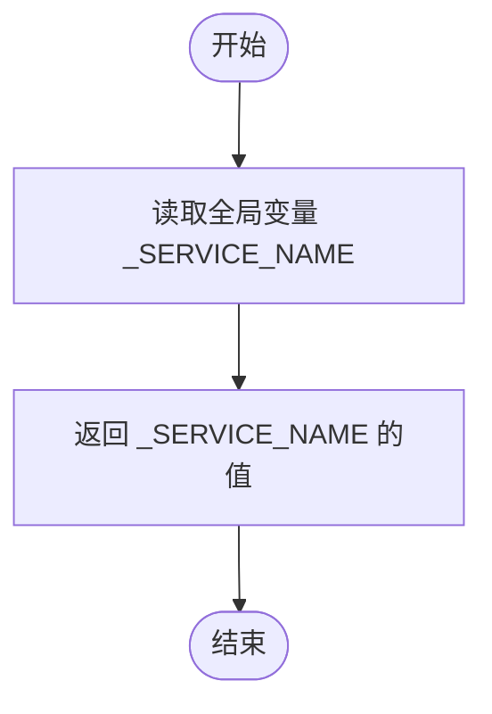

# `.\AutoGPT\autogpt_platform\backend\backend\util\settings.py` 详细设计文档

该代码定义了一个基于 Pydantic 的配置管理系统，负责加载、验证和更新应用程序的配置与敏感信息，支持变更追踪、动态保存以及针对不同运行环境的适配。

## 整体流程


## 类结构

```
BaseModel (Pydantic)
├── UpdateTrackingModel (Generic[T])
│   ├── Config (混合 BaseSettings)
│   └── Secrets (混合 BaseSettings)
└── Settings
Enum
├── AppEnvironment
└── BehaveAs
```

## 全局变量及字段


### `_SERVICE_NAME`
    
The global variable storing the name of the main process service.

类型：`str`
    


### `UpdateTrackingModel._updated_fields`
    
A private attribute tracking the names of fields that have been updated.

类型：`Set[str]`
    


### `Config.num_graph_workers`
    
Maximum number of workers to use for graph execution.

类型：`int`
    


### `Config.requeue_by_republishing`
    
Send rate-limited messages to back of queue by republishing instead of front requeue to prevent blocking other users.

类型：`bool`
    


### `Config.fastapi_thread_pool_size`
    
Thread pool size for FastAPI sync operations. All sync endpoints and dependencies automatically use this pool.

类型：`int`
    


### `Config.pyro_host`
    
The default hostname of the Pyro server.

类型：`str`
    


### `Config.pyro_client_comm_timeout`
    
The default timeout in seconds, for Pyro client connections.

类型：`float`
    


### `Config.pyro_client_comm_retry`
    
The default number of retries for Pyro client connections.

类型：`int`
    


### `Config.pyro_client_max_wait`
    
The maximum wait time in seconds for Pyro client retries.

类型：`float`
    


### `Config.rpc_client_call_timeout`
    
The default timeout in seconds, for RPC client calls.

类型：`int`
    


### `Config.enable_auth`
    
If authentication is enabled or not

类型：`bool`
    


### `Config.enable_credit`
    
If user credit system is enabled or not

类型：`bool`
    


### `Config.enable_beta_monthly_credit`
    
If beta monthly credits accounting is enabled or not

类型：`bool`
    


### `Config.num_user_credits_refill`
    
Number of credits to refill for each user

类型：`int`
    


### `Config.refund_credit_tolerance_threshold`
    
Maximum number of credits above the balance to be auto-approved.

类型：`int`
    


### `Config.low_balance_threshold`
    
Credit threshold for low balance notifications (100 = $1, default 500 = $5)

类型：`int`
    


### `Config.refund_notification_email`
    
Email address to send refund notifications to.

类型：`str`
    


### `Config.refund_request_time_key_format`
    
Time key format for refund requests.

类型：`str`
    


### `Config.execution_cost_count_threshold`
    
Number of executions after which the cost is calculated.

类型：`int`
    


### `Config.execution_cost_per_threshold`
    
Cost per execution in cents after each threshold.

类型：`int`
    


### `Config.execution_counter_expiration_time`
    
Time in seconds after which the execution counter is reset.

类型：`int`
    


### `Config.execution_late_notification_threshold_secs`
    
Time in seconds after which the execution stuck on QUEUED status is considered late.

类型：`int`
    


### `Config.cluster_lock_timeout`
    
Cluster lock timeout in seconds for graph execution coordination.

类型：`int`
    


### `Config.execution_late_notification_checkrange_secs`
    
Time in seconds for how far back to check for the late executions.

类型：`int`
    


### `Config.max_concurrent_graph_executions_per_user`
    
Maximum number of concurrent graph executions allowed per user per graph.

类型：`int`
    


### `Config.block_error_rate_threshold`
    
Error rate threshold (0.0-1.0) for triggering block error alerts.

类型：`float`
    


### `Config.block_error_rate_check_interval_secs`
    
Interval in seconds between block error rate checks.

类型：`int`
    


### `Config.block_error_include_top_blocks`
    
Number of top blocks with most errors to show when no blocks exceed threshold (0 to disable).

类型：`int`
    


### `Config.execution_accuracy_check_interval_hours`
    
Interval in hours between execution accuracy alert checks.

类型：`int`
    


### `Config.model_config`
    
Configuration settings for the Pydantic model, such as environment file location and extra fields allowance.

类型：`SettingsConfigDict`
    


### `Config.websocket_server_host`
    
The host for the websocket server to run on

类型：`str`
    


### `Config.websocket_server_port`
    
The port for the websocket server to run on

类型：`int`
    


### `Config.execution_manager_port`
    
The port for execution manager daemon to run on

类型：`int`
    


### `Config.execution_scheduler_port`
    
The port for execution scheduler daemon to run on

类型：`int`
    


### `Config.agent_server_port`
    
The port for agent server daemon to run on

类型：`int`
    


### `Config.database_api_port`
    
The port for database server API to run on

类型：`int`
    


### `Config.agent_api_host`
    
The host for agent server API to run on

类型：`str`
    


### `Config.agent_api_port`
    
The port for agent server API to run on

类型：`int`
    


### `Config.notification_service_port`
    
The port for notification service daemon to run on

类型：`int`
    


### `Config.otto_api_url`
    
The URL for the Otto API service

类型：`str`
    


### `Config.platform_base_url`
    
Must be set so the application knows where it's hosted at. This is necessary to make sure webhooks find their way.

类型：`str`
    


### `Config.frontend_base_url`
    
Can be used to explicitly set the base URL for the frontend. This value is then used to generate redirect URLs for OAuth flows.

类型：`str`
    


### `Config.media_gcs_bucket_name`
    
The name of the Google Cloud Storage bucket for media files

类型：`str`
    


### `Config.workspace_storage_dir`
    
Local directory for workspace file storage when GCS is not configured. If empty, defaults to {app_data}/workspaces.

类型：`str`
    


### `Config.reddit_user_agent`
    
The user agent for the Reddit API

类型：`str`
    


### `Config.scheduler_db_pool_size`
    
The pool size for the scheduler database connection pool

类型：`int`
    


### `Config.rabbitmq_host`
    
The host for the RabbitMQ server

类型：`str`
    


### `Config.rabbitmq_port`
    
The port for the RabbitMQ server

类型：`int`
    


### `Config.rabbitmq_vhost`
    
The vhost for the RabbitMQ server

类型：`str`
    


### `Config.redis_host`
    
The host for the Redis server

类型：`str`
    


### `Config.redis_port`
    
The port for the Redis server

类型：`int`
    


### `Config.redis_password`
    
The password for the Redis server (empty string if no password)

类型：`str`
    


### `Config.postmark_sender_email`
    
The email address to use for sending emails

类型：`str`
    


### `Config.use_agent_image_generation_v2`
    
Whether to use the new agent image generation service

类型：`bool`
    


### `Config.enable_agent_input_subtype_blocks`
    
Whether to enable the agent input subtype blocks

类型：`bool`
    


### `Config.platform_alert_discord_channel`
    
The Discord channel for the platform

类型：`str`
    


### `Config.product_alert_discord_channel`
    
The Discord channel for product alerts (low balance, zero balance, etc.)

类型：`str`
    


### `Config.clamav_service_host`
    
The host for the ClamAV daemon

类型：`str`
    


### `Config.clamav_service_port`
    
The port for the ClamAV daemon

类型：`int`
    


### `Config.clamav_service_timeout`
    
The timeout in seconds for the ClamAV daemon

类型：`int`
    


### `Config.clamav_service_enabled`
    
Whether virus scanning is enabled or not

类型：`bool`
    


### `Config.clamav_max_concurrency`
    
The maximum number of concurrent scans to perform

类型：`int`
    


### `Config.clamav_mark_failed_scans_as_clean`
    
Whether to mark failed scans as clean or not

类型：`bool`
    


### `Config.agentgenerator_host`
    
The host for the Agent Generator service (empty to use built-in)

类型：`str`
    


### `Config.agentgenerator_port`
    
The port for the Agent Generator service

类型：`int`
    


### `Config.agentgenerator_timeout`
    
The timeout in seconds for Agent Generator service requests (includes retries for rate limits)

类型：`int`
    


### `Config.enable_example_blocks`
    
Whether to enable example blocks in production

类型：`bool`
    


### `Config.cloud_storage_cleanup_interval_hours`
    
Hours between cloud storage cleanup runs (1-24 hours)

类型：`int`
    


### `Config.oauth_token_cleanup_interval_hours`
    
Hours between OAuth token cleanup runs (1-24 hours)

类型：`int`
    


### `Config.upload_file_size_limit_mb`
    
Maximum file size in MB for file uploads (1-1024 MB)

类型：`int`
    


### `Config.max_file_size_mb`
    
Maximum file size in MB for workspace files (1-1024 MB)

类型：`int`
    


### `Config.automod_enabled`
    
Whether AutoMod content moderation is enabled

类型：`bool`
    


### `Config.automod_api_url`
    
AutoMod API base URL - Make sure it ends in /api

类型：`str`
    


### `Config.automod_timeout`
    
Timeout in seconds for AutoMod API requests

类型：`int`
    


### `Config.automod_retry_attempts`
    
Number of retry attempts for AutoMod API requests

类型：`int`
    


### `Config.automod_retry_delay`
    
Delay between retries for AutoMod API requests in seconds

类型：`float`
    


### `Config.automod_fail_open`
    
If True, allow execution to continue if AutoMod fails

类型：`bool`
    


### `Config.app_env`
    
The name of the app environment: local or dev or prod

类型：`AppEnvironment`
    


### `Config.behave_as`
    
What environment to behave as: local or cloud

类型：`BehaveAs`
    


### `Config.execution_event_bus_name`
    
Name of the event bus

类型：`str`
    


### `Config.notification_event_bus_name`
    
Name of the websocket notification event bus

类型：`str`
    


### `Config.trust_endpoints_for_requests`
    
A whitelist of trusted internal endpoints for the backend to make requests to.

类型：`List[str]`
    


### `Config.max_message_size_limit`
    
Maximum message size limit for communication with the message bus

类型：`int`
    


### `Config.backend_cors_allow_origins`
    
Allowed Origins for CORS. Supports exact URLs (http/https) or entries prefixed with 'regex:' to match via regular expression.

类型：`List[str]`
    


### `Config.external_oauth_callback_origins`
    
Allowed callback URL origins for external OAuth flows. External apps (like Autopilot) must have their callback URLs start with one of these origins.

类型：`List[str]`
    


### `Secrets.supabase_url`
    
Supabase URL

类型：`str`
    


### `Secrets.supabase_service_role_key`
    
Supabase service role key

类型：`str`
    


### `Secrets.encryption_key`
    
Encryption key

类型：`str`
    


### `Secrets.rabbitmq_default_user`
    
RabbitMQ default user

类型：`str`
    


### `Secrets.rabbitmq_default_pass`
    
RabbitMQ default password

类型：`str`
    


### `Secrets.postmark_server_api_token`
    
Postmark server API token used for sending emails

类型：`str`
    


### `Secrets.postmark_webhook_token`
    
The token to use for the Postmark webhook

类型：`str`
    


### `Secrets.unsubscribe_secret_key`
    
The secret key to use for the unsubscribe user by token

类型：`str`
    


### `Secrets.github_client_id`
    
GitHub OAuth client ID

类型：`str`
    


### `Secrets.github_client_secret`
    
GitHub OAuth client secret

类型：`str`
    


### `Secrets.google_client_id`
    
Google OAuth client ID

类型：`str`
    


### `Secrets.google_client_secret`
    
Google OAuth client secret

类型：`str`
    


### `Secrets.notion_client_id`
    
Notion OAuth client ID

类型：`str`
    


### `Secrets.notion_client_secret`
    
Notion OAuth client secret

类型：`str`
    


### `Secrets.twitter_client_id`
    
Twitter/X OAuth client ID

类型：`str`
    


### `Secrets.twitter_client_secret`
    
Twitter/X OAuth client secret

类型：`str`
    


### `Secrets.discord_client_id`
    
Discord OAuth client ID

类型：`str`
    


### `Secrets.discord_client_secret`
    
Discord OAuth client secret

类型：`str`
    


### `Secrets.openai_api_key`
    
OpenAI API key

类型：`str`
    


### `Secrets.openai_internal_api_key`
    
OpenAI Internal API key

类型：`str`
    


### `Secrets.aiml_api_key`
    
'AI/ML API' key

类型：`str`
    


### `Secrets.anthropic_api_key`
    
Anthropic API key

类型：`str`
    


### `Secrets.groq_api_key`
    
Groq API key

类型：`str`
    


### `Secrets.open_router_api_key`
    
Open Router API Key

类型：`str`
    


### `Secrets.llama_api_key`
    
Llama API Key

类型：`str`
    


### `Secrets.v0_api_key`
    
v0 by Vercel API key

类型：`str`
    


### `Secrets.webshare_proxy_username`
    
Webshare Proxy Username

类型：`str`
    


### `Secrets.webshare_proxy_password`
    
Webshare Proxy Password

类型：`str`
    


### `Secrets.reddit_client_id`
    
Reddit client ID

类型：`str`
    


### `Secrets.reddit_client_secret`
    
Reddit client secret

类型：`str`
    


### `Secrets.openweathermap_api_key`
    
OpenWeatherMap API key

类型：`str`
    


### `Secrets.medium_api_key`
    
Medium API key

类型：`str`
    


### `Secrets.medium_author_id`
    
Medium author ID

类型：`str`
    


### `Secrets.did_api_key`
    
D-ID API Key

类型：`str`
    


### `Secrets.revid_api_key`
    
revid.ai API key

类型：`str`
    


### `Secrets.discord_bot_token`
    
Discord bot token

类型：`str`
    


### `Secrets.smtp_server`
    
SMTP server IP

类型：`str`
    


### `Secrets.smtp_port`
    
SMTP server port

类型：`str`
    


### `Secrets.smtp_username`
    
SMTP username

类型：`str`
    


### `Secrets.smtp_password`
    
SMTP password

类型：`str`
    


### `Secrets.sentry_dsn`
    
Sentry DSN

类型：`str`
    


### `Secrets.google_maps_api_key`
    
Google Maps API Key

类型：`str`
    


### `Secrets.replicate_api_key`
    
Replicate API Key

类型：`str`
    


### `Secrets.unreal_speech_api_key`
    
Unreal Speech API Key

类型：`str`
    


### `Secrets.ideogram_api_key`
    
Ideogram API Key

类型：`str`
    


### `Secrets.jina_api_key`
    
Jina API Key

类型：`str`
    


### `Secrets.fal_api_key`
    
FAL API key

类型：`str`
    


### `Secrets.exa_api_key`
    
Exa API key

类型：`str`
    


### `Secrets.e2b_api_key`
    
E2B API key

类型：`str`
    


### `Secrets.nvidia_api_key`
    
Nvidia API key

类型：`str`
    


### `Secrets.mem0_api_key`
    
Mem0 API key

类型：`str`
    


### `Secrets.elevenlabs_api_key`
    
ElevenLabs API key

类型：`str`
    


### `Secrets.linear_client_id`
    
Linear client ID

类型：`str`
    


### `Secrets.linear_client_secret`
    
Linear client secret

类型：`str`
    


### `Secrets.todoist_client_id`
    
Todoist client ID

类型：`str`
    


### `Secrets.todoist_client_secret`
    
Todoist client secret

类型：`str`
    


### `Secrets.stripe_api_key`
    
Stripe API Key

类型：`str`
    


### `Secrets.stripe_webhook_secret`
    
Stripe Webhook Secret

类型：`str`
    


### `Secrets.screenshotone_api_key`
    
ScreenshotOne API Key

类型：`str`
    


### `Secrets.apollo_api_key`
    
Apollo API Key

类型：`str`
    


### `Secrets.smartlead_api_key`
    
SmartLead API Key

类型：`str`
    


### `Secrets.zerobounce_api_key`
    
ZeroBounce API Key

类型：`str`
    


### `Secrets.enrichlayer_api_key`
    
Enrichlayer API Key

类型：`str`
    


### `Secrets.automod_api_key`
    
AutoMod API key

类型：`str`
    


### `Secrets.launch_darkly_sdk_key`
    
The LaunchDarkly SDK key for feature flag management

类型：`str`
    


### `Secrets.ayrshare_api_key`
    
Ayrshare API Key

类型：`str`
    


### `Secrets.ayrshare_jwt_key`
    
Ayrshare private Key

类型：`str`
    


### `Secrets.langfuse_public_key`
    
Langfuse public key

类型：`str`
    


### `Secrets.langfuse_secret_key`
    
Langfuse secret key

类型：`str`
    


### `Secrets.langfuse_host`
    
Langfuse host URL

类型：`str`
    


### `Secrets.posthog_api_key`
    
PostHog API key

类型：`str`
    


### `Secrets.posthog_host`
    
PostHog host URL

类型：`str`
    


### `Secrets.model_config`
    
Configuration settings for the Pydantic model, including environment file location and encoding.

类型：`SettingsConfigDict`
    


### `Settings.config`
    
The configuration object for the server.

类型：`Config`
    


### `Settings.secrets`
    
The secrets object for the server.

类型：`Secrets`
    
    

## 全局函数及方法


### `get_service_name`

用于获取全局变量 `_SERVICE_NAME` 的值，返回当前运行的服务名称。

参数：

-  无参数

返回值：`str`，当前的服务名称，默认值为 "MainProcess"。

#### 流程图



#### 带注释源码

```python
def get_service_name():
    # 直接返回预定义的全局变量 _SERVICE_NAME
    return _SERVICE_NAME
```


### `set_service_name`

设置全局服务名称的函数。

参数：

- `name`: `str`, 需要设置的服务名称字符串。

返回值：`None`, 无返回值。

#### 流程图


#### 带注释源码

```python
def set_service_name(name: str):
    global _SERVICE_NAME  # 声明引用全局变量 _SERVICE_NAME
    _SERVICE_NAME = name  # 将传入的 name 参数赋值给全局变量 _SERVICE_NAME
```


### `UpdateTrackingModel.__setattr__`

重写父类的属性设置方法，用于在设置模型属性时自动跟踪发生变更的字段名称。当设置的属性属于模型定义的字段时，将其记录到更新集合中，随后执行标准的属性赋值操作。

参数：

-  `name`：`str`，被设置的属性名称
-  `value`：`Any`，要赋给属性的值

返回值：`None`，无返回值

#### 流程图

```mermaid
flowchart TD
    A([开始: __setattr__]) --> B{检查 name 是否在 model_fields 中}
    B -- 是 --> C[将 name 添加到 _updated_fields]
    B -- 否 --> D
    C --> D[调用 super().__setattr__]
    D --> E([结束])
```

#### 带注释源码

```python
    def __setattr__(self, name: str, value) -> None:
        # 检查被设置的属性名是否在模型字段定义中
        if name in UpdateTrackingModel.model_fields:
            # 如果是，将该字段名添加到已更新字段集合中
            self._updated_fields.add(name)
        # 调用父类的 __setattr__ 方法完成实际的属性赋值
        super().__setattr__(name, value)
```


### `UpdateTrackingModel.mark_updated`

该方法用于手动将指定的模型字段标记为已更新状态。它会验证字段名是否存在于模型的字段定义中，如果存在，则将其添加到内部的已更新字段集合中。

参数：

-   `field_name`：`str`，需要标记为已更新的字段名称。

返回值：`None`，无返回值，仅修改内部状态。

#### 流程图


#### 带注释源码

```python
    def mark_updated(self, field_name: str) -> None:
        # 检查传入的字段名是否为模型定义中的有效字段
        if field_name in UpdateTrackingModel.model_fields:
            # 如果有效，则将该字段名添加到私有集合 _updated_fields 中，记录其已被修改
            self._updated_fields.add(field_name)
```


### `UpdateTrackingModel.clear_updates`

清空用于记录模型中已修改字段名称的内部集合。此方法通常用于在将更新持久化到存储或处理后，重置模型的更新状态，以便后续可以重新开始跟踪新的变更。

参数：

- 无显式参数

返回值：`None`，不返回任何内容。

#### 流程图


#### 带注释源码

```python
    def clear_updates(self) -> None:
        # 清空内部集合 _updated_fields
        # 该集合用于追踪自上次调用此方法或初始化以来被修改过的字段名
        # 调用此方法后，get_updates() 将返回空字典，直到有新字段被修改
        self._updated_fields.clear()
```


### `UpdateTrackingModel.get_updates`

获取自上次清除更新标记以来所有被修改字段的字典，其中键为字段名称，值为该字段在模型实例中的当前值。

参数：

- `self`: `UpdateTrackingModel`，指向类实例本身的隐式参数。

返回值：`Dict[str, Any]`，包含所有已更新字段名称及其对应当前值的字典。

#### 流程图


#### 带注释源码

```python
    def get_updates(self) -> Dict[str, Any]:
        # 使用字典推导式遍历内部集合 _updated_fields
        # getattr(self, field) 动态获取实例中该字段的当前值
        return {field: getattr(self, field) for field in self._updated_fields}
```


### `UpdateTrackingModel.updated_fields`

这是一个属性方法，用于获取并返回当前模型实例中所有已被修改过的字段名称的集合。

参数：

- `self`：`UpdateTrackingModel`，当前对象的实例引用。

返回值：`Set[str]`，包含所有已修改字段名称的集合。

#### 流程图


#### 带注释源码

```python
    @property
    def updated_fields(self):
        # 直接返回私有属性 _updated_fields
        # 该属性存储了所有被修改过的字段名称
        return self._updated_fields
```


### `Config.validate_platform_base_url`

该方法是一个 Pydantic 字段验证器，用于验证 `platform_base_url` 和 `frontend_base_url` 配置项。它确保如果提供了 URL 值，必须包含 `http://` 或 `https://` 协议头，并且会自动去除 URL 末尾的斜杠。

参数：

-  `v`：`str`，待验证的字段值（即 URL 字符串）。
-  `info`：`ValidationInfo`，Pydantic 提供的验证上下文信息，包含字段名称等元数据。

返回值：`str`，经过格式化和验证后的 URL 字符串（去除了尾部斜杠），如果输入为空则直接返回空字符串。

#### 流程图


#### 带注释源码

```python
    @field_validator("platform_base_url", "frontend_base_url")
    @classmethod
    def validate_platform_base_url(cls, v: str, info: ValidationInfo) -> str:
        # 如果值为空，则不做处理，直接返回
        if not v:
            return v
        # 检查 URL 是否以 http:// 或 https:// 开头
        if not v.startswith(("http://", "https://")):
            # 如果协议头不正确，抛出 ValueError 提示用户
            raise ValueError(
                f"{info.field_name} must be a full URL "
                "including a http:// or https:// schema"
            )
        # 检查 URL 是否以斜杠结尾
        if v.endswith("/"):
            # 去除尾部的斜杠并返回
            return v.rstrip("/")  # Remove trailing slash
        # 如果格式都正确且无尾部斜杠，直接返回原值
        return v
```


### `Config.validate_cors_allow_origins`

验证并规范化 CORS（跨域资源共享）允许的来源列表。该方法支持标准的 HTTP/HTTPS URL 以及以 "regex:" 为前缀的正则表达式模式。此外，它还会自动检测并补全 `localhost` 和 `127.0.0.1` 的对应端口配置，确保两者的一致性。

参数：

- `v`：`List[str]`，待验证的原始 CORS 来源字符串列表。

返回值：`List[str]`，经过验证、清理和规范化后的 CORS 来源列表。

#### 流程图

```mermaid
flowchart TD
    Start([开始]) --> Init[初始化 validated, localhost_ports, ip127_ports]
    Init --> Loop[遍历列表 v 中的每个 raw_origin]
    Loop --> Strip[去除首尾空白字符]
    Strip --> CheckRegex{是否以 'regex:' 开头?}

    CheckRegex -- 是 --> ExtractPattern[提取正则模式部分]
    ExtractPattern --> CheckPatternEmpty{模式是否为空?}
    CheckPatternEmpty -- 是 --> RaiseError1[抛出 ValueError: 模式不能为空]
    CheckPatternEmpty -- 否 --> TryCompile[尝试编译正则表达式]
    TryCompile --> CheckCompile{编译是否成功?}
    CheckCompile -- 否 --> RaiseError2[抛出 ValueError: 正则模式无效]
    CheckCompile -- 是 --> AppendRegex[追加 origin 到 validated]

    CheckRegex -- 否 --> CheckProtocol{是否以 http:// 或 https:// 开头?}
    CheckProtocol -- 否 --> RaiseError3[抛出 ValueError: 无效的 URL 或正则]
    
    CheckProtocol -- 是 --> CheckLocalhost{是否包含 'localhost'?}
    CheckLocalhost -- 是 --> ParseLocalPort[尝试解析端口号]
    ParseLocalPort --> CheckLocalPort{端口解析成功?}
    CheckLocalPort -- 否 --> RaiseError4[抛出 ValueError: localhost 必须包含显式端口]
    CheckLocalPort -- 是 --> AddLocalSet[添加端口到 localhost_ports 集合]

    CheckLocalhost -- 否 --> Check127{是否包含 '127.0.0.1'?}
    Check127 -- 是 --> Parse127Port[尝试解析端口号]
    Parse127Port --> Check127Port{端口解析成功?}
    Check127Port -- 否 --> RaiseError5[抛出 ValueError: 127.0.0.1 必须包含显式端口]
    Check127Port -- 是 --> Add127Set[添加端口到 ip127_ports 集合]

    AddLocalSet --> AppendValid[追加 origin 到 validated]
    Add127Set --> AppendValid
    Check127 -- 否 --> AppendValid

    AppendValid --> NextLoop{是否还有下一个元素?}
    NextLoop -- 是 --> Loop
    NextLoop -- 否 --> SyncProcess[开始同步 localhost 和 127.0.0.1]

    SyncProcess --> DiffLocal[获取在 ip127_ports 但不在 localhost_ports 的端口]
    DiffLocal --> AddLocal[为差异端口添加 http://localhost:{port} 到 validated]

    SyncProcess --> Diff127[获取在 localhost_ports 但不在 ip127_ports 的端口]
    Diff127 --> Add127[为差异端口添加 http://127.0.0.1:{port} 到 validated]

    AddLocal --> ReturnVal([返回 validated])
    Add127 --> ReturnVal
```

#### 带注释源码

```python
    @field_validator("backend_cors_allow_origins")
    @classmethod
    def validate_cors_allow_origins(cls, v: List[str]) -> List[str]:
        # 初始化存储验证结果的列表和两个用于存储端口的集合
        validated: List[str] = []
        localhost_ports: set[str] = set()
        ip127_ports: set[str] = set()

        for raw_origin in v:
            # 去除字符串首尾的空白字符
            origin = raw_origin.strip()
            
            # 处理正则表达式类型的来源
            if origin.startswith("regex:"):
                # 提取 "regex:" 后面的模式字符串
                pattern = origin[len("regex:") :]
                if not pattern:
                    raise ValueError("Invalid regex pattern: pattern cannot be empty")
                try:
                    # 尝试编译正则表达式以验证其有效性
                    re.compile(pattern)
                except re.error as exc:
                    raise ValueError(
                        f"Invalid regex pattern '{pattern}': {exc}"
                    ) from exc
                # 验证通过，添加到结果列表
                validated.append(origin)
                continue

            # 处理标准 URL 类型的来源
            if origin.startswith(("http://", "https://")):
                # 检查是否包含 localhost
                if "localhost" in origin:
                    try:
                        # 尝试通过分割字符串获取端口号 (格式为 http://localhost:port)
                        port = origin.split(":")[2]
                        localhost_ports.add(port)
                    except IndexError as exc:
                        raise ValueError(
                            "localhost origins must include an explicit port, e.g. http://localhost:3000"
                        ) from exc
                
                # 检查是否包含 127.0.0.1
                if "127.0.0.1" in origin:
                    try:
                        # 尝试获取端口号 (格式为 http://127.0.0.1:port)
                        port = origin.split(":")[2]
                        ip127_ports.add(port)
                    except IndexError as exc:
                        raise ValueError(
                            "127.0.0.1 origins must include an explicit port, e.g. http://127.0.0.1:3000"
                        ) from exc
                
                # 标准的 HTTP/HTTPS URL 添加到结果列表
                validated.append(origin)
                continue

            # 如果既不是正则也不是有效的 URL 协议开头，抛出错误
            raise ValueError(f"Invalid URL or regex origin: {origin}")

        # 同步逻辑：如果配置了 127.0.0.1 的某个端口但没配置 localhost，则自动补全 localhost
        for port in ip127_ports - localhost_ports:
            validated.append(f"http://localhost:{port}")
        
        # 同步逻辑：如果配置了 localhost 的某个端口但没配置 127.0.0.1，则自动补全 127.0.0.1
        for port in localhost_ports - ip127_ports:
            validated.append(f"http://127.0.0.1:{port}")

        return validated
```


### `Config.settings_customise_sources`

该方法是 Pydantic `BaseSettings` 的一个类方法钩子，用于自定义配置加载源的优先级顺序。它定义了系统环境变量、机密文件、.env 文件、JSON 配置文件以及初始化参数之间的覆盖关系，确保配置值按照预期的层级进行合并。

参数：

- `cls`：`Type[Config]`，表示当前配置类 `Config` 本身。
- `settings_cls`：`Type[BaseSettings]`，正在初始化的设置类类型。
- `init_settings`：`PydanticBaseSettingsSource`，包含在初始化配置对象时显式传入的参数（例如 `Config(key=value)`）。
- `env_settings`：`PydanticBaseSettingsSource`，包含从系统环境变量中读取的配置。
- `dotenv_settings`：`PydanticBaseSettingsSource`，包含从 `.env` 文件中读取的配置。
- `file_secret_settings`：`PydanticBaseSettingsSource`，包含从机密文件（如 secrets.json 或类似文件）中读取的配置。

返回值：`Tuple[PydanticBaseSettingsSource, ...]`，一个包含配置源的元组。元组中靠后的源具有更高的优先级，将覆盖靠前的源中的同名配置项。

#### 流程图

```mermaid
graph TD
    A[开始: settings_customise_sources 被调用] --> B[接收系统默认的配置源参数]
    B --> C[实例化 JsonConfigSettingsSource<br/>用于读取 JSON 配置文件]
    C --> D[构建配置源优先级元组]
    D --> E[优先级排序:<br/>1. env_settings (最低)<br/>2. file_secret_settings<br/>3. dotenv_settings<br/>4. JsonConfigSettingsSource<br/>5. init_settings (最高)]
    E --> F[返回排序后的元组]
    F --> G[结束: Pydantic 按顺序加载配置]
```

#### 带注释源码

```python
    @classmethod
    def settings_customise_sources(
        cls,
        settings_cls: Type[BaseSettings],
        init_settings: PydanticBaseSettingsSource,
        env_settings: PydanticBaseSettingsSource,
        dotenv_settings: PydanticBaseSettingsSource,
        file_secret_settings: PydanticBaseSettingsSource,
    ) -> Tuple[PydanticBaseSettingsSource, ...]:
        # 定义配置源的加载顺序（优先级从低到高）：
        # 1. env_settings: 系统环境变量（最基础，最容易被覆盖）
        # 2. file_secret_settings: 机密文件（通常用于敏感信息，覆盖环境变量）
        # 3. dotenv_settings: .env 文件（开发常用配置，覆盖机密和环境变量）
        # 4. JsonConfigSettingsSource(settings_cls): JSON 配置文件（显式的配置文件，覆盖 .env）
        # 5. init_settings: 初始化传入的参数（代码显式指定，优先级最高）
        return (
            env_settings,
            file_secret_settings,
            dotenv_settings,
            JsonConfigSettingsSource(settings_cls),
            init_settings,
        )
```


### `Settings.save`

该方法用于将配置对象的更新部分保存到持久化存储（JSON文件）中。它仅保存发生变化的字段，以优化IO操作，并能处理配置文件的增量更新。

参数：

-  `self`：`Settings`，类的实例本身。

返回值：`None`，无返回值。

#### 流程图

```mermaid
flowchart TD
    Start([开始: Settings.save]) --> CheckUpdates{检查是否有字段被更新?}
    CheckUpdates -- 否 (无更新) --> End([结束])
    CheckUpdates -- 是 (有更新) --> GetUpdates[获取更新内容: get_updates]
    GetUpdates --> BuildPath[构建配置文件路径: get_data_path/config.json]
    BuildPath --> CheckFileExists{配置文件是否存在?}
    
    CheckFileExists -- 是 --> OpenRW[以读写模式 'r+' 打开文件]
    OpenRW --> LoadExisting[加载现有 JSON 数据]
    LoadExisting --> MergeData[将新配置合并到现有数据]
    MergeData --> SeekStart[移动文件指针至开头: seek(0)]
    SeekStart --> WriteMerged[写入合并后的 JSON 数据]
    WriteMerged --> TruncateFile[截断文件以移除旧数据]
    TruncateFile --> ClearTracking
    
    CheckFileExists -- 否 --> OpenW[以写入模式 'w' 创建文件]
    OpenW --> WriteNew[写入新配置 JSON 数据]
    WriteNew --> ClearTracking
    
    ClearTracking[清除更新状态标记: clear_updates] --> End
```

#### 带注释源码

```python
    def save(self) -> None:
        # 将更新后的配置保存到 JSON 文件
        if self.config.updated_fields:
            # 获取自上次保存以来发生变化的配置字段字典
            config_to_save = self.config.get_updates()
            # 构建配置文件的完整路径
            config_path = os.path.join(get_data_path(), "config.json")
            
            # 检查配置文件是否已经存在
            if os.path.exists(config_path):
                # 如果存在，以读写模式（"r+"）打开文件
                with open(config_path, "r+") as f:
                    # 读取并解析文件中现有的 JSON 配置
                    existing_config: Dict[str, Any] = json.load(f)
                    # 将新的配置更新合并到现有配置字典中
                    existing_config.update(config_to_save)
                    # 将文件指针移动到文件开头
                    f.seek(0)
                    # 将合并后的完整配置写入文件
                    json.dump(existing_config, f, indent=2)
                    # 截断文件，以移除可能存在的旧数据残留（如果新数据比旧数据短）
                    f.truncate()
            else:
                # 如果文件不存在，以写入模式（"w"）创建新文件
                with open(config_path, "w") as f:
                    # 直接将新的配置字典写入文件
                    json.dump(config_to_save, f, indent=2)
            
            # 清除内部的更新字段标记，表示当前状态已同步
            self.config.clear_updates()
```


## 关键组件


### UpdateTrackingModel

一个泛型基类，继承自 Pydantic BaseModel，用于追踪模型字段的变更情况，支持获取变更字段集和清除更新状态。

### Config

继承自 UpdateTrackingModel 和 BaseSettings 的核心配置类，定义了服务器运行所需的所有非敏感参数，包括端口、超时、数据库连接、功能开关、CORS 设置以及微服务通信地址，并包含针对 URL 和 CORS 的自定义验证逻辑。

### Secrets

继承自 UpdateTrackingModel 和 BaseSettings 的敏感信息类，用于集中管理各类第三方服务（如数据库、API 提供商、OAuth 服务等）的密钥、令牌和密码等机密数据。

### Settings

顶层聚合模型，组合了 Config 和 Secrets 实例，提供了将配置变更持久化保存到 JSON 文件的方法，作为应用程序配置管理的统一入口。

### Service Name Management

通过全局变量 `_SERVICE_NAME` 及其相关函数管理的服务名称组件，用于在运行时动态设置和获取当前进程的服务标识。

### Environment Validation

包含 `AppEnvironment` 和 `BehaveAs` 枚举类以及 Config 内部的校验器方法，用于定义应用运行环境类型，并验证 URL 格式及跨域资源共享（CORS）来源的合法性。


## 问题及建议


### 已知问题

-   **字段重复定义**：`Secrets` 类中 `unreal_speech_api_key` 字段被定义了两次，第二次定义会覆盖第一次，且可能造成维护混淆。
-   **全局变量线程不安全**：`_SERVICE_NAME` 为模块级全局变量，在 FastAPI 等多线程或异步环境下，`set_service_name` 函数的调用存在竞态条件，可能导致状态不一致。
-   **文件写入竞态条件**：`Settings.save()` 方法在读写 `config.json` 时没有使用文件锁或原子写操作。如果多个进程或线程同时尝试保存配置，可能会导致数据丢失或文件损坏。
-   **敏感信息追踪风险**：`Secrets` 类继承了 `UpdateTrackingModel`，虽然当前 `Settings.save()` 仅保存 `config`，但这种设计允许对密钥进行变更追踪。若未来逻辑变更误将 `secrets` 保存，会导致敏感信息以明文形式持久化到磁盘。
-   **`__setattr__` 性能开销**：`UpdateTrackingModel` 重写了 `__setattr__`，对每个字段的赋值操作都会进行集合检查和添加操作。在字段极多或高频赋值的场景下，会增加不必要的性能开销。

### 优化建议

-   **重构巨型类**：`Config` 类包含过多字段，建议按功能（如 Database, Queue, ServicePorts, Monitoring）拆分为多个继承 `BaseSettings` 的子类，然后在 `Config` 中组合使用，以提高可读性和可维护性。
-   **实现原子化文件写入**：修改 `Settings.save()` 方法，采用“写入临时文件 -> 原子重命名”的模式，避免写入过程中程序崩溃导致配置文件损坏。
-   **分离敏感信息模型**：移除 `Secrets` 对 `UpdateTrackingModel` 的继承。密钥配置应当是只读的（仅从环境变量加载），不应支持字段更新追踪或手动保存，以强化安全约束。
-   **引入依赖注入解耦**：`get_data_path` 是硬编码导入，建议将其作为参数传入 `Settings` 或相关方法中，以降低配置模块对具体文件系统工具模块的耦合度。
-   **改进服务名管理**：使用上下文管理器或依赖注入框架来管理 `_SERVICE_NAME`，替代直接操作全局变量的方式，以适应并发环境。
-   **优化 CORS 验证逻辑**：`validate_cors_allow_origins` 方法逻辑较复杂，建议将正则校验和 localhost/IP 互斥补充逻辑提取为独立的辅助函数，保持验证器代码的简洁性。


## 其它


### 设计目标与约束

该模块旨在提供一个集中化、类型安全且具备验证能力的配置管理系统，服务于整个应用程序的后端服务。
**设计目标**：
1.  **统一配置源**：通过 `pydantic-settings` 整合环境变量、`.env` 文件、JSON 配置文件和初始化参数，实现配置的统一加载。
2.  **类型安全与验证**：利用 Python 类型注解和 Pydantic 验证器，确保配置项在加载时即符合预期的数据类型和业务逻辑（如 URL 格式、端口号范围等）。
3.  **变更追踪与持久化**：通过 `UpdateTrackingModel` 实现对配置变更的追踪，仅将修改过的字段持久化到存储（JSON 文件），减少 I/O 开销并避免覆盖其他配置源。
4.  **敏感信息隔离**：将非敏感配置 (`Config`) 与敏感密钥 (`Secrets`) 分离定义，便于应用不同的安全策略。

**约束条件**：
1.  **依赖 Pydantic v2**：代码严重依赖 Pydantic v2 的语法（如 `SettingsConfigDict`, `field_validator`），不兼容旧版本。
2.  **文件系统依赖**：`Settings.save()` 方法依赖于操作系统权限，且 `config.json` 必须存储在由 `get_data_path()` 指定的目录中。
3.  **加载优先级**：配置加载遵循严格的优先级顺序（环境变量 > 密钥文件 > Dotenv > JSON > 初始化默认值），高优先级源会覆盖低优先级源。
4.  **单例模式假设**：虽然代码未强制单例，但在应用运行期间，`Settings` 实例通常被视为全局唯一状态，特别是在 `Config` 和 `Secrets` 被实例化后。

### 错误处理与异常设计

模块主要依赖 Pydantic 的异常机制和 Python 原生异常来处理错误情况。

1.  **初始化验证错误**：
    *   当环境变量、JSON 或默认值不符合定义的模型时，`pydantic.ValidationError` 会在类实例化时抛出。这通常会导致应用程序启动失败，以确保配置正确。
2.  **业务逻辑校验异常**：
    *   **URL 校验**：`validate_platform_base_url` 和 `validate_cors_allow_origins` 方法若检测到 URL 缺少协议、正则表达式非法或端口号缺失，会抛出 `ValueError`。
    *   **范围约束**：对于 `num_graph_workers` 等带有 `ge` (greater than equal) 和 `le` (less than equal) 约束的字段，若输入值超出范围，Pydantic 会抛出验证错误。
3.  **运行时异常**：
    *   `Settings.save()` 方法涉及文件读写。如果 `config.json` 文件被锁定或目录不可写，会抛出 `IOError` 或 `OSError`。目前代码中未显式捕获这些异常，交由上层调用者处理。
    *   `get_service_name` 返回全局变量，若未初始化则返回默认值；`set_service_name` 直接修改全局变量，无特定异常处理。

### 数据流与状态机

描述配置数据的加载、更新、追踪和保存的生命周期。

**1. 配置加载流程 (优先级由高到低)**
```mermaid
graph TD
    A[开始加载 Config/Secrets] --> B[Init Settings]
    B --> C{Env Settings}
    C -->|存在| D[应用环境变量]
    C -->|不存在| E{Secrets File?}
    D --> E
    E -->|存在| F[应用密钥文件配置]
    E -->|不存在| G{Dotenv (.env)?}
    F --> G
    G -->|存在| H[应用 .env 配置]
    G -->|不存在| I{JSON config.json?}
    H --> I
    I -->|存在| J[应用 JSON 配置]
    I -->|不存在| K[应用代码默认值]
    J --> L[Pydantic 验证器]
    K --> L
    L --> M{验证通过?}
    M -->|是| N[实例化完成]
    M -->|否| O[抛出 ValidationError]
```

**2. 字段更新与追踪状态机**
*   **初始状态**：`_updated_fields` 集合为空。
*   **写入状态**：
    *   当通过 `__setattr__` 修改模型字段值，或调用 `mark_updated` 时，字段名被加入 `_updated_fields` 集合。
    *   如果字段值被修改为相同的值，逻辑上仍视为一次“更新”操作（代码中未做值比较优化）。
*   **保存状态**：
    *   调用 `save()` 时，读取 `_updated_fields`，将其对应的键值对序列化并写入 `config.json`。
    *   保存成功后，调用 `clear_updates()` 清空集合，返回初始状态。
*   **重置状态**：可随时手动调用 `clear_updates()` 清空追踪记录而不保存。

### 外部依赖与接口契约

**1. 外部库依赖**
*   **Pydantic & Pydantic Settings**: 核心依赖，负责数据解析、验证和设置源管理。契约要求输入数据可被解析为定义的 Python 类型。
*   **Python Standard Library**: `os` (路径操作), `json` (JSON 序列化), `re` (正则表达式校验)。

**2. 内部模块依赖**
*   `backend.util.data.get_data_path`: 函数接口。契约：返回一个字符串，表示应用程序数据存储的根目录路径，用于定位 `config.json`。

**3. 文件系统接口**
*   **`.env` 文件**:
    *   **位置**: 项目根目录或由 `model_config` 指定。
    *   **格式**: Key-Value 对。
    *   **契约**: 必须符合 `KEY=VALUE` 格式，编码默认为 UTF-8 (Secrets)。
*   **`config.json` 文件**:
    *   **位置**: `{get_data_path()}/config.json`。
    *   **格式**: JSON 对象。
    *   **契约**: `Settings.save()` 仅写入发生变更的字段。读取时由 `JsonConfigSettingsSource` 负责全量读取并与优先级更高的源合并。

**4. 环境变量接口**
*   应用程序从运行环境中读取变量。契约要求环境变量的命名需与 Pydantic 模型字段名匹配（通常是大写形式，例如 `NUM_GRAPH_WORKERS`）。

### 安全性设计

1.  **敏感信息分离**：
    *   `Config` 类存储非敏感信息（如端口号、超时时间、开关标志）。
    *   `Secrets` 类专门存储敏感信息（API Keys、数据库密码、OAuth 密钥）。这种分离便于实施不同的权限控制（例如 Config 可提交到 Git，Secrets 必须通过环境变量注入）。
2.  **加密支持**：
    *   `Secrets` 中定义了 `encryption_key` 字段，暗示系统具备对存储数据进行加解密的能力（尽管代码未展示加解密逻辑，但配置项已预留）。
3.  **来源优先级**：
    *   环境变量具有最高优先级。这是云原生应用的最佳实践，可以避免将密钥硬编码在代码或配置文件中，防止密钥泄露。
4.  **CORS 验证**：
    *   `validate_cors_allow_origins` 方法严格校验 CORS 源，防止非法的跨域请求来源，增加了应用层的接口安全性。

    