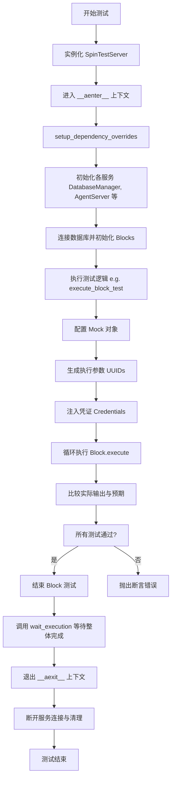
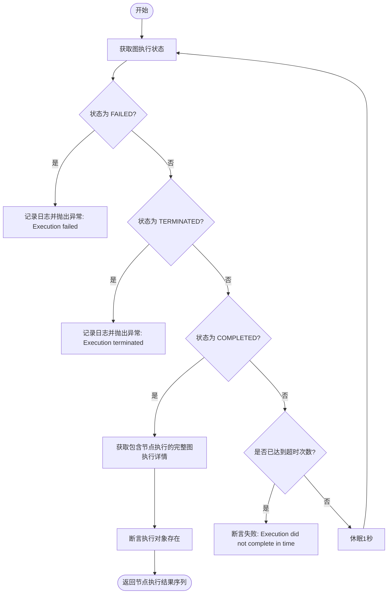
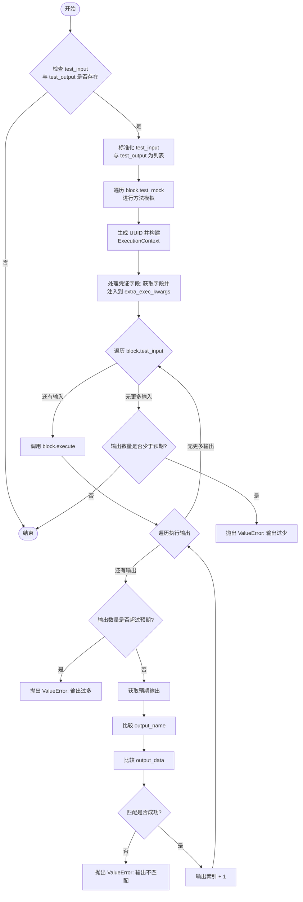
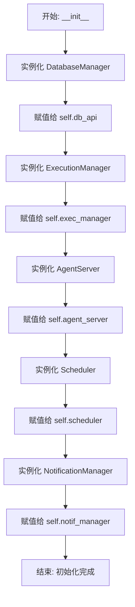
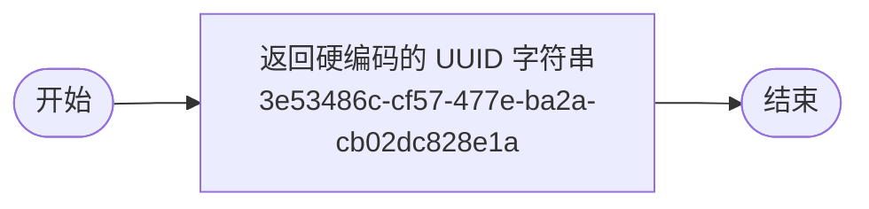
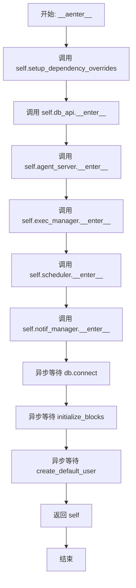
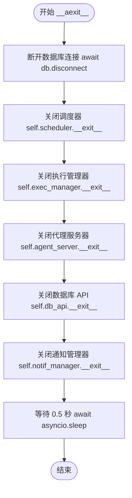

# `.\AutoGPT\autogpt_platform\backend\backend\util\test.py` 详细设计文档

该代码主要用于构建和执行自动化测试环境，提供了一个异步上下文管理器 SpinTestServer 用于初始化和清理数据库、代理服务器及执行器等核心组件，同时包含等待图执行完成的辅助函数 wait_execution 以及针对单个 Block 进行单元测试的执行函数 execute_block_test，后者支持依赖 Mock、凭证注入及输入输出验证。

## 整体流程



## 类结构

```
SpinTestServer
```

## 全局变量及字段


### `log`
    
The logger instance for this module, used for recording execution information and errors.

类型：`logging.Logger`
    


### `SpinTestServer.db_api`
    
Manager component responsible for database connections and operations within the test environment.

类型：`DatabaseManager`
    


### `SpinTestServer.exec_manager`
    
Manager component responsible for handling the execution lifecycle of agents.

类型：`ExecutionManager`
    


### `SpinTestServer.agent_server`
    
Server instance that provides the API interface for the agent system during testing.

类型：`AgentServer`
    


### `SpinTestServer.scheduler`
    
Scheduler component responsible for managing task scheduling, configured not to register system tasks.

类型：`Scheduler`
    


### `SpinTestServer.notif_manager`
    
Manager component responsible for handling notification events during test execution.

类型：`NotificationManager`
    
    

## 全局函数及方法


### `wait_execution`

该函数通过轮询机制等待指定的图执行完成，支持在执行失败、终止或超时时进行相应处理，并最终返回包含各节点执行结果的序列。

参数：

- `user_id`：`str`，执行该图流的用户唯一标识符。
- `graph_exec_id`：`str`，需要等待完成的图执行ID。
- `timeout`：`int`，轮询等待的最长时间（秒），默认为30秒。

返回值：`Sequence[NodeExecutionResult]`，包含图中各节点执行结果的对象序列。

#### 流程图



#### 带注释源码

```python
async def wait_execution(
    user_id: str,
    graph_exec_id: str,
    timeout: int = 30,
) -> Sequence[NodeExecutionResult]:
    # 定义内部辅助函数，用于检查执行是否完成
    async def is_execution_completed():
        # 调用 AgentServer 获取当前图执行的状态
        status = await AgentServer().test_get_graph_run_status(graph_exec_id, user_id)
        log.info(f"Execution status: {status}")
        
        # 如果状态为失败，记录日志并抛出异常
        if status == ExecutionStatus.FAILED:
            log.info("Execution failed")
            raise Exception("Execution failed")
        
        # 如果状态为终止，记录日志并抛出异常
        if status == ExecutionStatus.TERMINATED:
            log.info("Execution terminated")
            raise Exception("Execution terminated")
        
        # 返回状态是否为已完成
        return status == ExecutionStatus.COMPLETED

    # 循环等待执行完成，次数由 timeout 参数决定（每次循环间隔1秒）
    for i in range(timeout):
        # 检查执行是否已完成
        if await is_execution_completed():
            # 获取完整的图执行对象，包含节点执行详情
            graph_exec = await get_graph_execution(
                user_id=user_id,
                execution_id=graph_exec_id,
                include_node_executions=True,
            )
            # 断言图执行对象存在，否则抛出错误
            assert graph_exec, f"Graph execution #{graph_exec_id} not found"
            # 返回节点执行结果列表
            return graph_exec.node_executions
        
        # 如果未完成，等待1秒后继续下一次轮询
        time.sleep(1)

    # 如果循环结束仍未完成，抛出超时断言错误
    assert False, "Execution did not complete in time."
```


### `execute_block_test`

该函数用于对给定的 Block（代码块）执行测试，通过模拟依赖对象、填充凭证和构建执行上下文，依次运行预定义的测试输入，并验证实际输出与预期输出是否一致。

参数：

-  `block`：`Block`，待测试的代码块实例，包含测试所需的输入数据、预期输出、模拟对象及凭证信息。

返回值：`None`，无返回值；若测试通过则函数正常结束，若测试失败（输出不匹配、数量不符等）则抛出异常。

#### 流程图



#### 带注释源码

```python
async def execute_block_test(block: Block):
    prefix = f"[Test-{block.name}]"

    # 检查是否提供了测试数据，如果没有则直接返回
    if not block.test_input or not block.test_output:
        log.info(f"{prefix} No test data provided")
        return
    
    # 确保 test_input 和 test_output 是列表格式，方便统一处理
    if not isinstance(block.test_input, list):
        block.test_input = [block.test_input]
    if not isinstance(block.test_output, list):
        block.test_output = [block.test_output]

    output_index = 0
    log.info(f"{prefix} Executing {len(block.test_input)} tests...")
    prefix = " " * 4 + prefix

    # 1. 设置 Mock 对象
    # 遍历 test_mock 字典，替换 block 中对应的方法为 mock 对象
    for mock_name, mock_obj in (block.test_mock or {}).items():
        log.info(f"{prefix} mocking {mock_name}...")
        # 检查 block 是否有该属性
        if not hasattr(block, mock_name):
            log.info(f"{prefix} mock {mock_name} not found in block")
            continue

        fun = getattr(block, mock_name)
        # 判断原方法是否是异步的
        is_async = inspect.iscoroutinefunction(fun) or inspect.isasyncgenfunction(fun)

        if is_async:
            # 如果是异步，创建一个异步包装函数来调用 mock_obj
            async def async_mock(
                *args, _mock_name=mock_name, _mock_obj=mock_obj, **kwargs
            ):
                return _mock_obj(*args, **kwargs)

            setattr(block, mock_name, async_mock)

        else:
            # 如果是同步，直接替换
            setattr(block, mock_name, mock_obj)

    # 2. 准备执行上下文和凭证参数
    # 为测试生成随机的各类 ID
    graph_id = str(uuid.uuid4())
    node_id = str(uuid.uuid4())
    graph_exec_id = str(uuid.uuid4())
    node_exec_id = str(uuid.uuid4())
    user_id = str(uuid.uuid4())
    graph_version = 1  # Default version for tests

    extra_exec_kwargs: dict = {
        "graph_id": graph_id,
        "node_id": node_id,
        "graph_exec_id": graph_exec_id,
        "node_exec_id": node_exec_id,
        "user_id": user_id,
        "graph_version": graph_version,
        # 构建执行上下文对象
        "execution_context": ExecutionContext(
            user_id=user_id,
            graph_id=graph_id,
            graph_exec_id=graph_exec_id,
            graph_version=graph_version,
            node_id=node_id,
            node_exec_id=node_exec_id,
        ),
    }
    input_model = cast(type[BlockSchema], block.input_schema)

    # 处理常规凭证字段
    credentials_input_fields = input_model.get_credentials_fields()
    if len(credentials_input_fields) == 1 and isinstance(
        block.test_credentials, _BaseCredentials
    ):
        # 如果只有一个凭证字段且提供的是凭证对象，直接赋值
        field_name = next(iter(credentials_input_fields))
        extra_exec_kwargs[field_name] = block.test_credentials
    elif credentials_input_fields and block.test_credentials:
        # 如果有多个凭证字段或提供的是字典，按名称匹配赋值
        if not isinstance(block.test_credentials, dict):
            raise TypeError(f"Block {block.name} has no usable test credentials")
        else:
            for field_name in credentials_input_fields:
                if field_name in block.test_credentials:
                    extra_exec_kwargs[field_name] = block.test_credentials[field_name]

    # 处理自动生成的凭证字段 (例如 GoogleDriveFileInput)
    auto_creds_fields = input_model.get_auto_credentials_fields()
    if auto_creds_fields and block.test_credentials:
        if isinstance(block.test_credentials, _BaseCredentials):
            # 单个凭证对象用于所有自动凭证字段
            for kwarg_name in auto_creds_fields.keys():
                extra_exec_kwargs[kwarg_name] = block.test_credentials
        elif isinstance(block.test_credentials, dict):
            # 字典按名称匹配
            for kwarg_name in auto_creds_fields.keys():
                if kwarg_name in block.test_credentials:
                    extra_exec_kwargs[kwarg_name] = block.test_credentials[kwarg_name]

    # 3. 执行测试用例
    for input_data in block.test_input:
        log.info(f"{prefix} in: {input_data}")

        # 调用 block.execute 执行逻辑，这是一个异步生成器
        async for output_name, output_data in block.execute(
            input_data, **extra_exec_kwargs
        ):
            # 检查输出数量是否超过预期
            if output_index >= len(block.test_output):
                raise ValueError(
                    f"{prefix} produced output more than expected {output_index} >= {len(block.test_output)}:\nOutput Expected:\t\t{block.test_output}\nFailed Output Produced:\t('{output_name}', {output_data})\nNote that this may not be the one that was unexpected, but it is the first that triggered the extra output warning"
                )
            # 获取当前预期的输出
            ex_output_name, ex_output_data = block.test_output[output_index]

            # 定义比较逻辑：支持值相等、类型匹配或自定义 callable 匹配
            def compare(data, expected_data):
                if data == expected_data:
                    is_matching = True
                elif isinstance(expected_data, type):
                    is_matching = isinstance(data, expected_data)
                elif callable(expected_data):
                    is_matching = expected_data(data)
                else:
                    is_matching = False

                mark = "✅" if is_matching else "❌"
                log.info(f"{prefix} {mark} comparing `{data}` vs `{expected_data}`")
                if not is_matching:
                    raise ValueError(
                        f"{prefix}: wrong output {data} vs {expected_data}\n"
                        f"Output Expected:\t\t{block.test_output}\n"
                        f"Failed Output Produced:\t('{output_name}', {output_data})"
                    )

            # 比较输出数据和名称
            compare(output_data, ex_output_data)
            compare(output_name, ex_output_name)
            output_index += 1

    # 检查是否所有预期的输出都已产生
    if output_index < len(block.test_output):
        raise ValueError(
            f"{prefix} produced output less than expected. output_index={output_index}, len(block.test_output)={len(block.test_output)}"
        )
```


### `SpinTestServer.__init__`

该方法用于初始化 `SpinTestServer` 测试服务器实例。它通过实例化并组合关键的管理器和服务组件（如数据库管理器、执行管理器、Agent服务器、调度器和通知管理器），为构建测试环境建立必要的依赖关系和基础设施。

参数：

- `self`：`SpinTestServer`，表示类的实例本身。

返回值：`None`，该方法是构造函数，不返回任何值。

#### 流程图



#### 带注释源码

```python
def __init__(self):
    # 初始化数据库管理器，负责数据库交互
    self.db_api = DatabaseManager()
    # 初始化执行管理器，负责处理执行逻辑
    self.exec_manager = ExecutionManager()
    # 初始化 Agent 服务器实例，提供 API 服务能力
    self.agent_server = AgentServer()
    # 初始化调度器，并设置 register_system_tasks 为 False 以避免注册系统任务
    self.scheduler = Scheduler(register_system_tasks=False)
    # 初始化通知管理器，负责处理通知相关逻辑
    self.notif_manager = NotificationManager()
```


### `SpinTestServer.test_get_user_id`

该方法是 `SpinTestServer` 类中的一个静态辅助方法，专门用于测试环境。它的核心功能是返回一个硬编码的 UUID 字符串，用于模拟或覆盖系统中获取真实用户 ID 的逻辑，以便在测试过程中提供一个确定性的用户身份。

参数：

*   无

返回值：`str`，返回固定的用户 ID 字符串 "3e53486c-cf57-477e-ba2a-cb02dc828e1a"。

#### 流程图



#### 带注释源码

```python
    @staticmethod
    def test_get_user_id():
        # 返回一个固定的 UUID 字符串
        # 此方法用于在测试中覆盖真实的 get_user_id 逻辑
        # 确保测试环境不依赖于真实的认证状态
        return "3e53486c-cf57-477e-ba2a-cb02dc828e1a"
```


### `SpinTestServer.__aenter__`

该方法作为异步上下文管理器的入口点，负责初始化测试环境，包括设置依赖覆盖、启动各个管理器（数据库、代理服务器、执行器等）、建立数据库连接以及初始化基础数据（如默认用户和模块）。

参数：

- `self`：`SpinTestServer`，类的实例本身。

返回值：`SpinTestServer`，返回初始化完成的类实例 `self`，以便在 `async with` 语句中使用。

#### 流程图



#### 带注释源码

```python
async def __aenter__(self):
    # 设置依赖覆盖，通常用于注入测试替身或模拟对象
    self.setup_dependency_overrides()
    
    # 依次初始化各个同步上下文管理器（进入上下文）
    self.db_api.__enter__()
    self.agent_server.__enter__()
    self.exec_manager.__enter__()
    self.scheduler.__enter__()
    self.notif_manager.__enter__()

    # 异步连接数据库
    await db.connect()
    
    # 初始化系统中的 Block 数据
    await initialize_blocks()
    
    # 创建默认用户数据，确保测试环境有基础用户
    await create_default_user()

    # 返回实例自身，使其可以在 as 子句中被引用
    return self
```


### `SpinTestServer.__aexit__`

该方法作为 `SpinTestServer` 类的异步上下文管理器退出方法，负责在测试结束时清理资源。它执行数据库断开连接、按特定顺序关闭各种管理服务组件，并添加短暂延迟以确保所有异步任务完全清理，避免事件循环问题。

参数：

-  `self`：`SpinTestServer`，类的实例引用。
-  `exc_type`：`type[BaseException] | None`，如果上下文退出时发生异常，该参数为异常的类型；否则为 None。
-  `exc_val`：`BaseException | None`，如果上下文退出时发生异常，该参数为异常的实例；否则为 None。
-  `exc_tb`：`TracebackType | None`，如果上下文退出时发生异常，该参数为异常的回溯对象；否则为 None。

返回值：`None`，该方法不返回值（隐式返回 None），意味着如果有异常发生，它将被正常传播，不会在此处被抑制。

#### 流程图



#### 带注释源码

```python
    async def __aexit__(self, exc_type, exc_val, exc_tb):
        # 1. 优先断开数据库连接，停止数据库相关操作
        await db.disconnect()

        # 2. 按照依赖或初始化的相反顺序关闭各个服务组件
        #    关闭调度器
        self.scheduler.__exit__(exc_type, exc_val, exc_tb)
        #    关闭执行管理器
        self.exec_manager.__exit__(exc_type, exc_val, exc_tb)
        #    关闭代理服务器
        self.agent_server.__exit__(exc_type, exc_val, exc_tb)
        #    关闭数据库 API 管理器
        self.db_api.__exit__(exc_type, exc_val, exc_tb)
        #    关闭通知管理器
        self.notif_manager.__exit__(exc_type, exc_val, exc_tb)

        # 3. 给予服务足够的时间完全关闭
        #    这可以防止事件循环出现问题，即服务尚未完全清理之前下一个测试就开始了
        await asyncio.sleep(0.5)
```


### `SpinTestServer.setup_dependency_overrides`

该方法用于配置测试环境下的依赖覆盖，主要将获取用户ID的函数替换为固定的测试ID，以隔离测试环境并确保认证流程的一致性。

参数：

- `self`：`SpinTestServer`，类实例的引用。

返回值：`None`，无返回值。

#### 流程图

```mermaid
graph TD
    A[开始: setup_dependency_overrides] --> B[访问 self.agent_server]
    B --> C[调用 set_test_dependency_overrides]
    C --> D[传入映射 {get_user_id: self.test_get_user_id}]
    D --> E[结束]
```

#### 带注释源码

```python
def setup_dependency_overrides(self):
    # 为测试环境覆盖 get_user_id 依赖
    # 使用预定义的静态 UUID 替代真实的用户 ID 获取逻辑
    self.agent_server.set_test_dependency_overrides(
        {get_user_id: self.test_get_user_id}
    )
```


## 关键组件


### SpinTestServer
测试环境的核心管理器，作为异步上下文管理器，负责初始化数据库、API 服务器、执行管理器、调度器和通知管理器，并设置测试期间的依赖项覆盖。

### execute_block_test
Block 单元测试执行器，负责处理测试输入输出、执行上下文生成、凭证注入以及同步/异步方法的模拟，并验证 Block 执行结果的正确性。

### wait_execution
异步执行状态监控器，通过轮询机制检查图执行的状态（完成、失败或终止），并在超时前返回节点执行结果或抛出异常。

### Method Mocking Logic
动态方法模拟机制，在测试运行时根据测试配置动态替换 Block 类中的方法，支持普通函数、协程和异步生成器的模拟。

### Credential Injection
凭证注入逻辑，用于识别 Block 输入模式中的凭证字段（包括标准凭证和自动生成凭证），并将测试凭证数据正确映射到执行参数中。


## 问题及建议


### 已知问题

-   **异步事件循环阻塞**：`wait_execution` 函数在 `async` 函数中使用了同步的 `time.sleep(1)`，这会阻塞整个事件循环，导致在等待期间无法处理其他并发任务。
-   **不可靠的资源同步机制**：`SpinTestServer.__aexit__` 方法中使用 `await asyncio.sleep(0.5)` 来等待服务清理。这是一种基于时间的“竞态条件”修复方案，如果清理时间超过 0.5 秒，可能会导致下一个测试开始时资源尚未完全释放。
-   **副作用修改输入数据**：`execute_block_test` 函数直接修改了传入的 `block` 对象的 `test_input` 和 `test_output` 属性（例如将其转换为列表）。如果 `block` 对象在多个测试间共享或复用，这种副作用会导致不可预期的行为。
-   **全局状态污染风险**：`execute_block_test` 使用 `setattr` 直接在 `block` 对象上替换方法以实现 Mock。如果 `block` 实例在测试生命周期中是单例或长生命周期的，这种修改可能会污染后续的测试。

### 优化建议

-   **使用异步休眠**：将 `wait_execution` 中的 `time.sleep(1)` 替换为 `await asyncio.sleep(1)`，以确保在等待执行完成时不会阻塞事件循环。
-   **改进资源清理同步**：在 `SpinTestServer` 中移除硬编码的 `sleep(0.5)`。应使用 `asyncio.Event` 或其他同步原语来确保各管理器真正完成清理后再退出；或者将清理操作设计为幂等的，以便即使下一轮测试提前开始也能安全处理。
-   **保护输入数据不变性**：在 `execute_block_test` 中，避免直接修改 `block.test_input` 和 `block.test_output`。应在函数内部创建这些数据的本地副本进行处理，保持原始数据的纯净。
-   **提取复杂的凭证处理逻辑**：`execute_block_test` 中关于凭证（常规凭证和自动生成凭证）的逻辑较为冗长且重复。建议将其提取为独立的辅助函数（如 `prepare_credentials_kwargs`），以提高代码的可读性和可维护性。
-   **增强 Mock 机制的安全性**：考虑使用标准的 Mock 库（如 `unittest.mock.patch`）替代直接 `setattr`，或者确保测试框架在每次测试后都会重置 `block` 对象的状态，防止测试间的状态泄漏。


## 其它


### 设计目标与约束

**设计目标：**
1.  **测试环境隔离与编排：** `SpinTestServer` 旨在为后端服务提供一个独立、可复用的异步测试环境，负责统一管理数据库、执行器、调度器及API服务的生命周期，确保测试之间的隔离性。
2.  **自动化测试执行：** `execute_block_test` 旨在实现对 `Block` 组件的自动化单元测试，通过动态注入依赖和验证输入输出，简化开发者对单个逻辑块的测试编写工作。
3.  **执行状态监控：** `wait_execution` 旨在提供一种同步机制，轮询并等待异步图执行过程的完成，便于集成测试中验证最终结果。

**约束条件：**
1.  **异步上下文依赖：** 整个模块严重依赖 Python 的 `asyncio` 库，必须在异步事件循环中运行，不能在同步上下文中直接调用核心逻辑。
2.  **数据模型强约束：** `execute_block_test` 函数要求传入的 `Block` 对象必须包含特定属性（如 `test_input`, `test_output`, `test_credentials`, `test_mock`），否则测试逻辑将无法执行或报错。
3.  **外部资源依赖：** 运行测试环境需要可用的数据库连接（由 `backend.data.db` 管理），且需要 `autogpt_libs` 提供的基础认证支持。
4.  **清理时间窗口：** `SpinTestServer` 在退出时强制等待 0.5 秒 (`asyncio.sleep(0.5)`)，这是为了防止事件循环过早关闭导致的资源清理竞争，属于硬编码的时间约束。

### 错误处理与异常设计

**1. 超时与状态异常处理 (`wait_execution`)：**
*   **机制：** 采用轮询机制检查执行状态，默认超时时间为 30 秒。
*   **异常抛出：**
    *   当检测到 `ExecutionStatus.FAILED` 或 `ExecutionStatus.TERMINATED` 时，立即抛出 `Exception` 并附带具体状态信息，中断等待。
    *   若在 `timeout` 次数内未检测到完成状态，抛出断言错误 `AssertionError` ("Execution did not complete in time.")。
    *   若执行完成后无法获取图执行数据 (`graph_exec` 为 None)，抛出断言错误。

**2. 数据验证异常处理 (`execute_block_test`)：**
*   **输出数量不匹配：** 若实际产生的输出数量多于预期，抛出 `ValueError`，包含详细的数据对比信息。
*   **输出数据不一致：** 使用内部 `compare` 函数进行比对，若不匹配（值、类型或条件函数校验失败），抛出 `ValueError`，记录预期值与实际值。
*   **输出数量不足：** 循环结束后若输出数量少于预期，抛出 `ValueError`。
*   **凭证类型错误：** 若 Block 定义了多个凭证字段但提供的 `test_credentials` 不是字典类型，抛出 `TypeError`。

**3. 资源清理异常处理 (`SpinTestServer`)：**
*   **上下文管理器保护：** 使用 `try...finally` 语义（通过 `async with`）确保即使测试用例抛出异常，`__aexit__` 也能被调用，从而触发所有子服务（数据库、调度器等）的关闭操作，防止资源泄露。

### 数据流与状态机

**1. `execute_block_test` 数据流：**
*   **阶段一：准备阶段**
    *   输入：`Block` 对象。
    *   流程：检查测试数据存在性 -> 规范化 `test_input`/`test_output` 为列表 -> 应用 Mock 对象（替换 `Block` 方法）。
*   **阶段二：上下文构建**
    *   流程：生成随机的 `graph_id`, `node_id`, `user_id` 等上下文信息 -> 构建 `ExecutionContext` -> 处理凭证注入（普通凭证与自动凭证映射）。
*   **阶段三：执行与验证循环**
    *   流程：遍历 `test_input` -> 调用 `block.execute` (异步生成器) -> 遍历实时输出 -> 与 `test_output[output_index]` 进行比对 -> 更新索引。
    *   状态：正在执行 -> 验证中 -> 成功/抛出异常。

**2. `wait_execution` 状态机：**
*   **初始状态：** 开始轮询。
*   **中间状态：** 等待中。每秒检查一次状态。
    *   若状态为 `FAILED` -> **终止状态** (抛出异常)。
    *   若状态为 `TERMINATED` -> **终止状态** (抛出异常)。
    *   若状态为 `COMPLETED` -> **结束状态** (返回结果)。
    *   否则 -> 继续等待。
*   **超时状态：** 达到最大轮询次数 -> **终止状态** (抛出断言错误)。

### 外部依赖与接口契约

**1. 核心外部依赖：**
*   **`backend.data.db`**：提供数据库连接 (`connect`, `disconnect`) 及图执行数据查询 (`get_graph_execution`)。
*   **`backend.data.block`**：提供 `Block`, `BlockSchema` 类定义及 `initialize_blocks` 初始化逻辑。
*   **`backend.api.rest_api`**：提供 `AgentServer`，用于获取图运行状态 (`test_get_graph_run_status`) 和依赖注入覆盖。
*   **`backend.executor`**：提供 `DatabaseManager`, `ExecutionManager`, `Scheduler`，负责具体的任务调度和执行管理。
*   **`autogpt_libs.auth`**：提供 `get_user_id` 认证获取接口（测试中被 Mock 覆盖）。

**2. 接口契约：**
*   **`Block` 类契约：** 必须实现 `execute(input_data, **kwargs)` 异步生成器方法。必须包含 `input_schema` 属性，该属性需实现 `get_credentials_fields()` 和 `get_auto_credentials_fields()` 方法。
*   **`test_credentials` 契约：** 可以是 `_BaseCredentials` 的实例（用于单一或自动填充场景），也可以是 `dict`（用于多字段凭证填充）。
*   **`test_mock` 契约：** 字典结构，键为 `Block` 的属性名，值为 Mock 对象或函数。
*   **`AgentServer` 依赖注入契约：** 必须提供 `set_test_dependency_overrides` 方法，接受一个字典用于替换运行时的依赖项。

    