# `.\AutoGPT\autogpt_platform\backend\backend\util\test_json.py` 详细设计文档

该代码是一个针对 SafeJson 工具的全面测试套件，旨在验证其处理复杂数据结构（包括 Pydantic 模型、嵌套字典、列表及不可序列化对象）的序列化能力，以及清洗对 PostgreSQL 有害的控制字符同时保留合法转义序列和特定编码（如 Unicode、文件路径）的功能。

## 整体流程

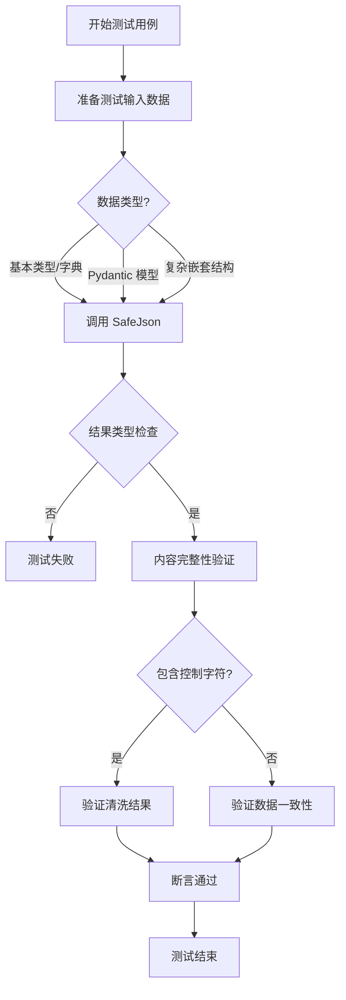

## 类结构

```
BaseModel (pydantic)
├── SamplePydanticModel
└── SampleModelWithNonSerializable
TestSafeJson
```

## 全局变量及字段


### `SamplePydanticModel.name`
    
表示示例 Pydantic 模型的名称字符串。

类型：`str`
    


### `SamplePydanticModel.age`
    
表示示例 Pydantic 模型的年龄，为可选整型。

类型：`Optional[int]`
    


### `SamplePydanticModel.timestamp`
    
表示示例 Pydantic 模型的时间戳，为可选日期时间对象。

类型：`Optional[datetime.datetime]`
    


### `SamplePydanticModel.metadata`
    
表示示例 Pydantic 模型的元数据，为可选字典类型。

类型：`Optional[dict]`
    


### `SampleModelWithNonSerializable.name`
    
表示包含非序列化字段的示例模型的名称。

类型：`str`
    


### `SampleModelWithNonSerializable.func`
    
可能包含非序列化数据的字段，用于测试序列化兼容性。

类型：`Any`
    


### `SampleModelWithNonSerializable.data`
    
表示示例模型的数据字典，为可选类型。

类型：`Optional[dict]`
    
    

## 全局函数及方法


### `TestSafeJson.test_safejson_returns_json_type`

该方法用于验证 `SafeJson` 类在处理简单的字典数据时，能够正确返回 `prisma.Json` 类型的实例。这是对 `SafeJson` 基本类型转换功能的单元测试。

参数：

- `self`：`TestSafeJson`，测试类的实例，隐含参数。

返回值：`None`，该函数没有显式的返回值，主要通过断言来验证行为。

#### 流程图

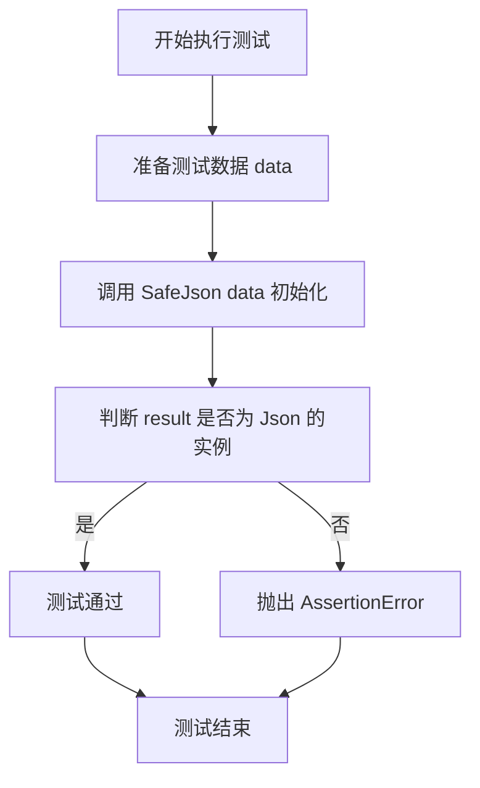

#### 带注释源码

```python
def test_safejson_returns_json_type(self):
    """Test that SafeJson returns a proper Json instance."""
    # 定义一个简单的字典作为测试数据
    data = {"test": "value"}
    # 调用 SafeJson 处理数据，期望返回一个 Json 对象
    result = SafeJson(data)
    # 断言验证返回的 result 确实是 Json 类的实例
    assert isinstance(result, Json)
```


### `TestSafeJson.test_simple_dict_serialization`

测试 SafeJson 工具是否能成功将包含字符串、整数和布尔值等基本数据类型的简单字典序列化为 Json 对象。

参数：

- `self`：`TestSafeJson`，测试类实例，用于访问测试上下文和断言方法。

返回值：`None`，该测试方法不返回值，主要用于验证逻辑是否按预期工作。

#### 流程图

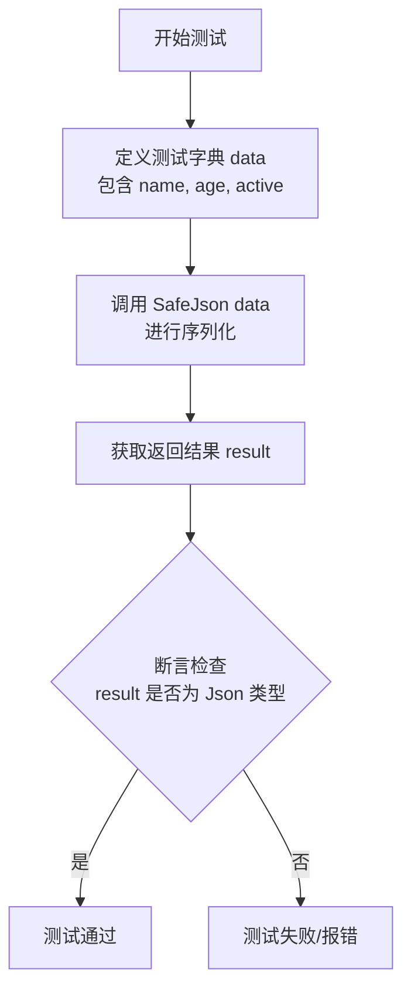

#### 带注释源码

```python
def test_simple_dict_serialization(self):
    """Test basic dictionary serialization."""
    # 定义一个包含基本数据类型（字符串、整数、布尔值）的字典作为测试数据
    data = {"name": "John", "age": 30, "active": True}
    
    # 调用 SafeJson 方法，尝试将字典转换为 Json 类型实例
    result = SafeJson(data)
    
    # 断言验证返回的对象确实是 Json 类型，确保序列化成功
    assert isinstance(result, Json)
```


### `TestSafeJson.test_unicode_handling`

该方法用于测试 `SafeJson` 工具是否能正确处理包含多种不同语言 Unicode 字符（如法语带重音符号、Emoji 表情、中文和阿拉伯语）的字典数据，并验证其返回结果是否为预期的 `Json` 类型实例。

参数：

-   `self`：`TestSafeJson`，测试类的实例，通常由测试框架自动注入。

返回值：`None`，无返回值，主要用于执行断言逻辑。

#### 流程图

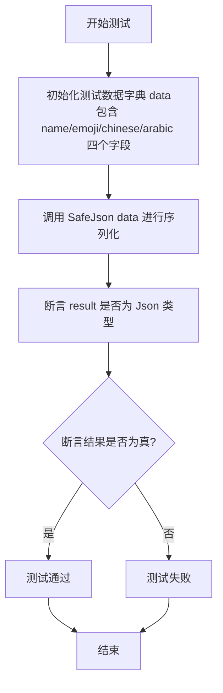

#### 带注释源码

```python
    def test_unicode_handling(self):
        """Test that Unicode characters are handled properly."""
        # 准备包含多种 Unicode 字符的测试数据
        data = {
            "name": "café",        # 法语字符，包含重音符号
            "emoji": "🎉",         # Emoji 表情符号
            "chinese": "你好",     # 中文字符
            "arabic": "مرحبا",     # 阿拉伯语字符
        }
        # 调用 SafeJson 处理数据
        result = SafeJson(data)
        # 验证返回结果是 Json 类型的实例
        assert isinstance(result, Json)
```


### `TestSafeJson.test_nested_data_structures`

测试 SafeJson 处理包含多层嵌套字典和列表的复杂数据结构的能力。

参数：

- `self`：`TestSafeJson`，测试类的实例，用于访问测试上下文。

返回值：`None`，该测试方法主要用于断言验证，无显式返回值。

#### 流程图

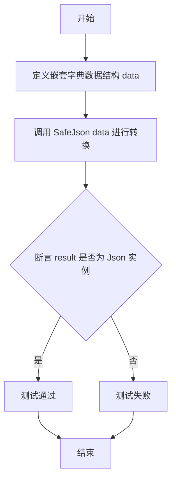

#### 带注释源码

```python
def test_nested_data_structures(self):
    """Test complex nested data structures."""
    # 定义包含多层嵌套的数据结构，包括字典、列表以及它们的组合
    data = {
        "user": {
            "name": "Alice",
            "preferences": {
                "theme": "dark",
                "notifications": ["email", "push"],
            },
        },
        "metadata": {
            "tags": ["important", "urgent"],
            "scores": [8.5, 9.2, 7.8],
        },
    }
    # 使用 SafeJson 处理该复杂数据结构
    result = SafeJson(data)
    # 验证 SafeJson 返回的结果是 prisma.Json 类型的实例
    assert isinstance(result, Json)
```


### `TestSafeJson.test_pydantic_model_basic`

该测试方法用于验证 `SafeJson` 工具类能否正确处理基础的 Pydantic 模型对象，并将其成功封装为 `Json` 类型实例。

参数：

- `self`：`TestSafeJson`，测试类的实例引用。

返回值：`None`，该函数为单元测试方法，无显式返回值，主要通过断言来验证逻辑。

#### 流程图

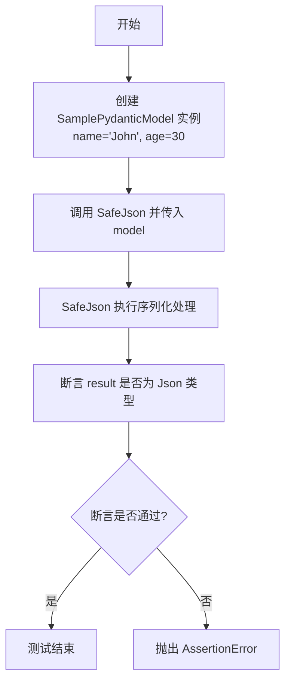

#### 带注释源码

```python
    def test_pydantic_model_basic(self):
        """Test basic Pydantic model serialization."""
        # 实例化 SamplePydanticModel，传入 name 和 age 参数
        model = SamplePydanticModel(name="John", age=30)
        
        # 将 Pydantic 模型对象传入 SafeJson 进行封装/序列化
        result = SafeJson(model)
        
        # 验证返回的结果对象是否为 Json 类型，确保转换成功
        assert isinstance(result, Json)
```


### `TestSafeJson.test_pydantic_model_with_none_values`

该测试方法验证了 `SafeJson` 工具是否能正确处理包含 `None` 值的 Pydantic 模型，确保其返回有效的 `Json` 实例，且期望 `None` 值能被正确处理（通常是排除）。

参数：

-  `self`：`TestSafeJson`，测试类的实例，用于访问测试上下文或断言方法。

返回值：`None`，无返回值（测试方法主要进行断言验证）。

#### 流程图

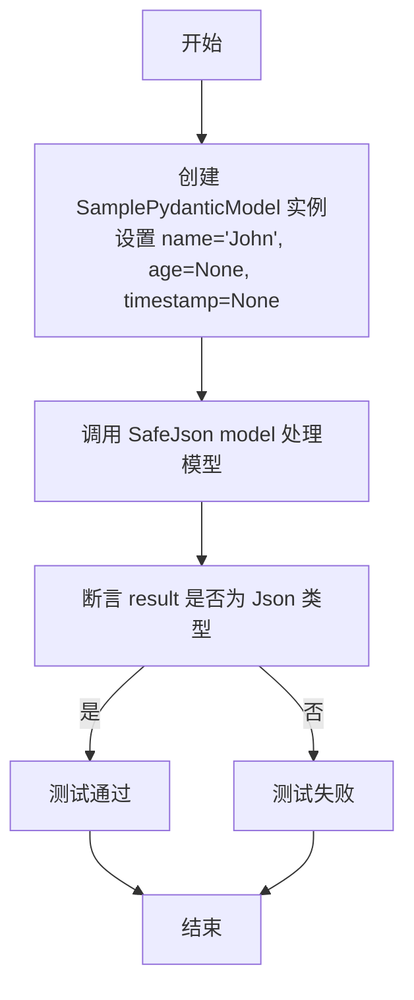

#### 带注释源码

```python
def test_pydantic_model_with_none_values(self):
    """Test Pydantic model with None values (should be excluded)."""
    # 实例化一个 Pydantic 模型，其中包含 None 值的字段
    model = SamplePydanticModel(name="John", age=None, timestamp=None)
    
    # 使用 SafeJson 封装该模型对象
    result = SafeJson(model)
    
    # 验证返回结果是 Json 类型的实例
    assert isinstance(result, Json)
    # 注释说明：由于 exclude_none=True 的配置，实际的 Json 内容应排除 None 值
```


### `TestSafeJson.test_pydantic_model_with_datetime`

该测试方法用于验证 `SafeJson` 工具类能否正确处理包含 `datetime` 类型字段的 Pydantic 模型实例，并确保其能成功序列化为兼容的 `Json` 对象。

参数：

-  `self`：`TestSafeJson`，测试类的实例，提供测试上下文。

返回值：`None`，该函数为测试方法，不直接返回业务数据，通过断言验证处理结果。

#### 流程图

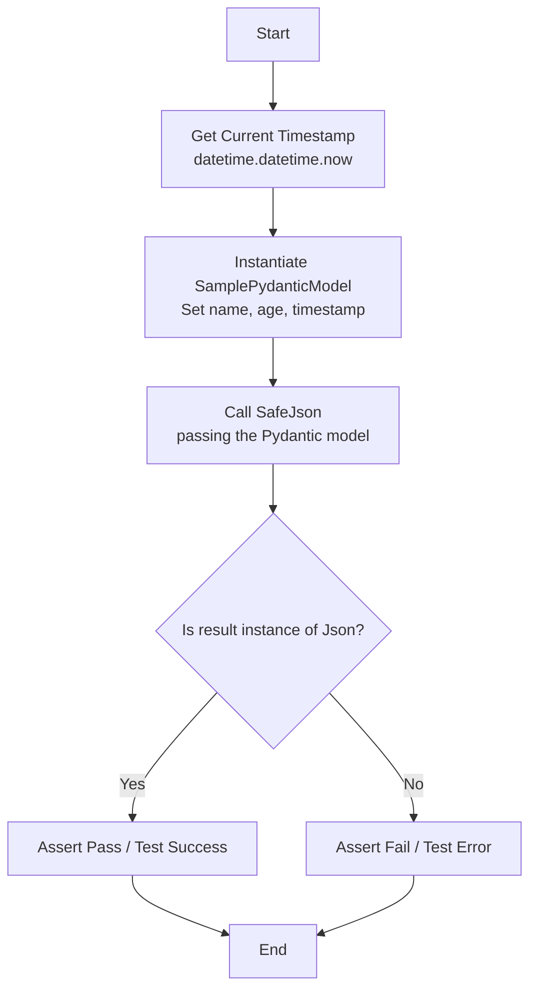

#### 带注释源码

```python
def test_pydantic_model_with_datetime(self):
    """Test Pydantic model with datetime field."""
    # 获取当前的日期和时间对象
    now = datetime.datetime.now()
    
    # 创建一个 SamplePydanticModel 实例，并填入字符串、整数和刚获取的 datetime 对象
    model = SamplePydanticModel(name="John", age=25, timestamp=now)
    
    # 调用 SafeJson 函数处理该 Pydantic 模型
    # SafeJson 需要能够处理 Pydantic 模型并将其内部的 datetime 对象正确序列化
    result = SafeJson(model)
    
    # 验证 SafeJson 的返回结果是 Prisma 库中定义的 Json 类型
    # 这确保了复杂的 datetime 类型已被转换，且整体结构符合 Json 要求
    assert isinstance(result, Json)
```


### `TestSafeJson.test_non_serializable_values_in_dict`

Test that non-serializable values in dict are converted to None.

参数：

-  `self`：`TestSafeJson`，测试类的实例，用于访问测试上下文。

返回值：`None`，无返回值，主要用于断言验证 `SafeJson` 对非序列化值的处理是否符合预期。

#### 流程图

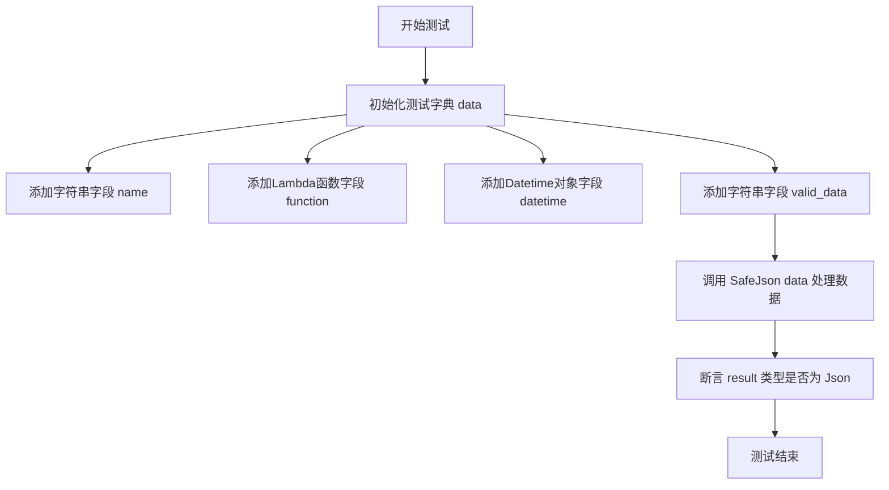

#### 带注释源码

```python
def test_non_serializable_values_in_dict(self):
    """Test that non-serializable values in dict are converted to None."""
    # 准备包含混合类型的测试数据字典
    data = {
        "name": "test",                     # 普通字符串
        "function": lambda x: x,            # Lambda函数，通常无法被JSON直接序列化
        "datetime": datetime.datetime.now(), # Datetime对象，通常无法被JSON直接序列化
        "valid_data": "this should work",  # 普通字符串
    }
    # 调用 SafeJson 封装数据
    # 期望 SafeJson 内部机制能识别并处理不可序列化的值（如转换为 None 或忽略）
    result = SafeJson(data)
    # 验证处理后的结果是一个有效的 Json 类型实例
    assert isinstance(result, Json)
```


### `TestSafeJson.test_pydantic_model_with_non_serializable_fallback`

该函数用于测试 `SafeJson` 处理包含非序列化字段（如 lambda 函数）的 Pydantic 模型时的能力，确保其能通过回退机制成功转换为 `Json` 类型。

参数：

-  `self`：`TestSafeJson`，测试类的实例，用于访问测试上下文和断言方法。

返回值：`None`，无返回值，主要用于执行测试逻辑和断言。

#### 流程图

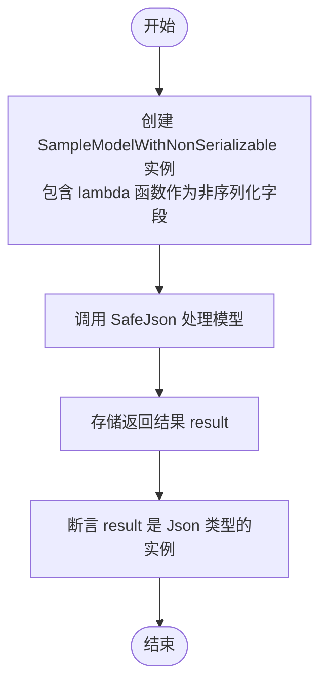

#### 带注释源码

```python
def test_pydantic_model_with_non_serializable_fallback(self):
    """Test Pydantic model with non-serializable field using fallback."""
    # 创建一个 SampleModelWithNonSerializable 实例
    # 该模型包含一个无法直接序列化的 lambda 函数赋值给 func 字段
    model = SampleModelWithNonSerializable(
        name="test",
        func=lambda x: x,  # 这是一个非序列化的对象
        data={"valid": "data"},
    )
    # 调用 SafeJson 处理包含非序列化数据的模型
    # SafeJson 内部应有机制处理这种异常情况（通常是回退策略）
    result = SafeJson(model)
    # 断言返回结果是 Json 类型，证明 SafeJson 成功处理了该模型
    assert isinstance(result, Json)
```


### `TestSafeJson.test_empty_data_structures`

该函数用于测试 `SafeJson` 工具类处理空数据结构的能力。它通过遍历包含空字典、空列表、空字符串和 `None` 值的测试用例列表，验证 `SafeJson` 是否能够将这些边缘情况数据正确序列化并返回有效的 `Json` 实例，而不会抛出异常。

参数：

- `self`：`TestSafeJson`，测试类的实例，用于访问测试上下文和断言方法。

返回值：`None`，该函数为测试方法，主要通过断言验证行为，无显式返回值。

#### 流程图

```mermaid
graph TD
    A[开始: test_empty_data_structures] --> B[初始化测试用例列表<br/>包含 {}, [], "", None]
    B --> C[开始遍历 test_cases]
    C --> D[获取当前测试数据 data]
    D --> E[调用 SafeJson data]
    E --> F[断言结果 isinstance result, Json]
    F --> G{是否还有剩余测试用例?}
    G -- 是 --> C
    G -- 否 --> H[结束: 测试通过]
```

#### 带注释源码

```python
def test_empty_data_structures(self):
    """Test empty data structures."""
    # 定义一个包含各种“空”或“空”类型数据结构的列表
    # 这些是JSON序列化中常见的边缘情况
    test_cases = [
        {},  # 空字典
        [],  # 空列表
        "",  # 空字符串
        None,  # None值
    ]

    # 遍历每一个测试用例
    for data in test_cases:
        # 调用 SafeJson 处理当前数据
        result = SafeJson(data)
        # 断言返回的结果是 Json 类型的实例
        # 这确保了 SafeJson 能够优雅地处理空输入而不崩溃
        assert isinstance(result, Json)
```


### `TestSafeJson.test_complex_mixed_data`

该方法用于验证 `SafeJson` 工具类在处理包含多种基础数据类型（如字符串、整数、浮点数、布尔值）及复杂数据结构（如列表、嵌套字典）时的序列化能力，确保其能正确返回标准的 `Json` 类型实例。

参数：

-  `self`：`TestSafeJson`，测试类的实例，用于访问测试上下文或断言方法。

返回值：`None`，该方法为测试函数，不返回业务数据，仅通过断言验证逻辑。

#### 流程图

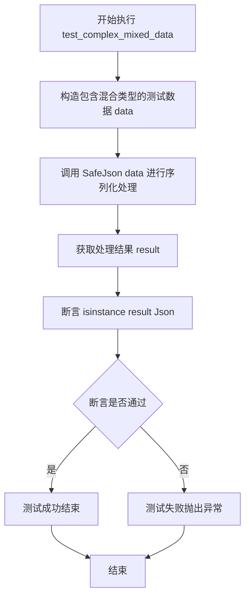

#### 带注释源码

```python
def test_complex_mixed_data(self):
    """Test complex mixed data with various types."""
    # 构造一个复杂的混合数据结构，包含多种基础类型和嵌套结构
    data = {
        "string": "test",        # 字符串
        "integer": 42,           # 整数
        "float": 3.14,           # 浮点数
        "boolean": True,         # 布尔值
        "none_value": None,      # None值
        "list": [1, 2, "three", {"nested": "dict"}],  # 包含字典的列表
        "nested_dict": {         # 多层嵌套字典
            "level2": {
                "level3": ["deep", "nesting", 123],
            }
        },
    }
    # 调用 SafeJson 处理数据，期望得到一个 Json 类型对象
    result = SafeJson(data)
    # 验证返回结果确实是 Json 类型，确保序列化成功
    assert isinstance(result, Json)
```


### `TestSafeJson.test_list_of_pydantic_models`

该测试函数用于验证 `SafeJson` 工具类能够正确处理包含 Pydantic 模型列表的复杂数据结构，确保其能将包含模型列表的字典成功序列化为 `Json` 类型。

参数：

-   `self`：`TestSafeJson`，测试类的实例，用于访问测试上下文。

返回值：`None`，无返回值，主要用于断言验证逻辑。

#### 流程图

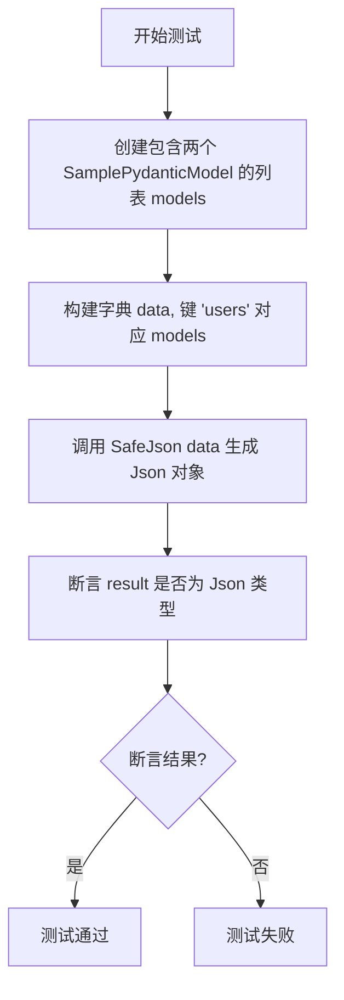

#### 带注释源码

```python
    def test_list_of_pydantic_models(self):
        """Test list containing Pydantic models."""
        # 1. 准备测试数据：创建一个包含 SamplePydanticModel 实例的列表
        models = [
            SamplePydanticModel(name="Alice", age=25),
            SamplePydanticModel(name="Bob", age=30),
        ]
        # 2. 将模型列表放入字典中，模拟实际业务中可能出现的包含对象列表的数据结构
        data = {"users": models}
        # 3. 调用 SafeJson 处理包含 Pydantic 模型列表的字典
        result = SafeJson(data)
        # 4. 验证处理结果是否为 prisma.Json 类型，确保序列化成功
        assert isinstance(result, Json)
```


### `TestSafeJson.test_edge_case_circular_reference_protection`

验证 `SafeJson` 工具在处理包含循环引用的数据结构时的鲁棒性。该测试旨在确保序列化过程不会陷入无限循环，并能够优雅地处理该结构，要么通过内部回退机制成功处理，要么抛出预期的异常（如 ValueError 或 RecursionError）。

参数：

-   `self`：`TestSafeJson`，测试用例实例，由测试框架自动传入。

返回值：`None`，测试方法无返回值，通过断言或异常捕获来验证逻辑正确性。

#### 流程图

```mermaid
graph TD
    A[开始: test_edge_case_circular_reference_protection] --> B[创建空字典 data]
    B --> C[设置 data['self'] = data<br>创建循环引用]
    C --> D[尝试调用 SafeJson(data)]
    D --> E{是否抛出异常?}
    E -- 是 (ValueError 或 RecursionError) --> F[捕获异常并忽略<br>视为可接受行为]
    F --> G[测试通过]
    E -- 否 --> H[断言 result 是 Json 的实例]
    H --> G
```

#### 带注释源码

```python
def test_edge_case_circular_reference_protection(self):
    """Test that circular references don't cause infinite loops."""
    # 注意：此测试假设底层的 json.dumps 通过引发异常来处理循环引用，
    # 而我们的回退机制应该能够处理这种情况。
    data = {}
    data["self"] = data  # 创建循环引用

    # 这应该通过回退机制正常工作，或者抛出一个合理的错误
    try:
        result = SafeJson(data)
        # 如果成功序列化，验证返回类型是否为 Json
        assert isinstance(result, Json)
    except (ValueError, RecursionError):
        # 如果抛出错误，这也是可接受的行为（不抛出 AssertionError 即视为通过）
        pass
```


### `TestSafeJson.test_large_data_structure`

该方法是 `TestSafeJson` 类中的一个测试用例，旨在验证 `SafeJson` 工具处理相对较大数据结构的能力。测试数据构建了一个包含100个条目的列表和元数据字典，以确保序列化过程在数据量增加时仍能正常工作并返回正确的 `Json` 类型实例。

参数：

- `self`：`TestSafeJson`，测试类的实例，用于访问测试上下文。

返回值：`None`，该方法为单元测试，主要通过断言验证行为，不返回具体业务数据。

#### 流程图

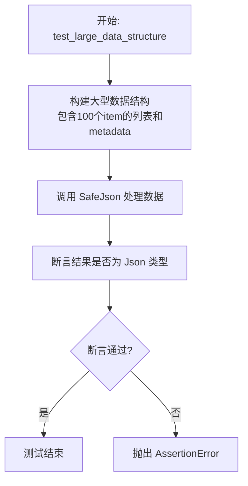

#### 带注释源码

```python
def test_large_data_structure(self):
    """Test with a reasonably large data structure."""
    # 1. 准备测试数据：构建一个包含较大规模数据的字典
    # 包含一个名为"items"的列表，其中有100个字典对象
    # 以及一个名为"metadata"的字典，包含统计信息
    data = {
        "items": [
            {"id": i, "name": f"item_{i}", "active": i % 2 == 0} for i in range(100)
        ],
        "metadata": {
            "total": 100,
            "generated_at": "2024-01-01T00:00:00Z",
            "tags": ["auto", "generated", "test"],
        },
    }
    
    # 2. 调用 SafeJson 处理上述大型数据结构
    result = SafeJson(data)
    
    # 3. 验证处理后的结果确实是 Json 类型
    assert isinstance(result, Json)
```


### `TestSafeJson.test_special_characters_and_encoding`

该测试方法用于验证 `SafeJson` 工具正确处理各种特殊字符和编码场景的能力，包括引号、反斜杠、换行符、制表符、Unicode 转义序列以及混合的 Unicode 字符和表情符号，确保其能返回有效的 Json 实例。

参数：

-   `self`：`TestSafeJson`，测试用例实例，用于访问测试上下文和断言方法。

返回值：`None`，该方法为单元测试函数，无显式返回值，主要通过断言验证行为。

#### 流程图

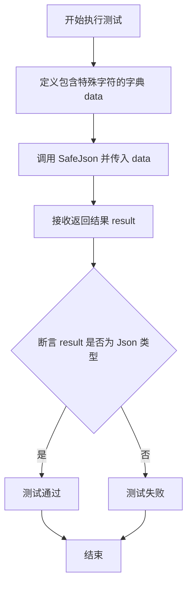

#### 带注释源码

```python
    def test_special_characters_and_encoding(self):
        """Test various special characters and encoding scenarios."""
        # 准备包含各种特殊字符和编码情况的测试数据字典
        data = {
            "quotes": 'He said "Hello world!"',            # 测试双引号字符
            "backslashes": "C:\\Users\\test\\file.txt",   # 测试反斜杠字符（路径场景）
            "newlines": "Line 1\nLine 2\nLine 3",        # 测试换行符
            "tabs": "Column1\tColumn2\tColumn3",          # 测试制表符
            "unicode_escape": "\u0048\u0065\u006c\u006c\u006f",  # 测试 Unicode 转义序列 (Hello)
            "mixed": "Test with émojis 🚀 and ñúméríçs",  # 测试混合的特殊字符和表情符号
        }
        # 调用 SafeJson 处理包含特殊字符的数据
        result = SafeJson(data)
        # 断言返回结果是 Json 类型，确保序列化成功且类型正确
        assert isinstance(result, Json)
```


### `TestSafeJson.test_numeric_edge_cases`

该测试函数用于验证 `SafeJson` 工具对多种数值边界情况的处理能力，包括零值、负数、极大整数、极小浮点数、大浮点数以及无穷大值的序列化行为，确保其能正确返回 `Json` 类型实例。

参数：

- `self`：`TestSafeJson`，测试类的实例对象。

返回值：`None`，无返回值，主要用于断言验证。

#### 流程图

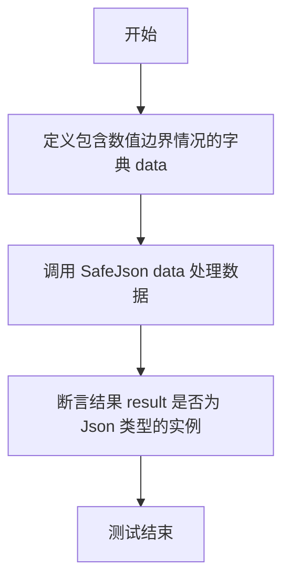

#### 带注释源码

```python
    def test_numeric_edge_cases(self):
        """Test various numeric edge cases."""
        # 定义测试数据字典，包含多种数值边界情况
        # 包含：0、负数、大整数、小浮点数、大浮点数、正无穷、负无穷
        data = {
            "zero": 0,
            "negative": -42,
            "large_int": 999999999999999999,
            "small_float": 0.000001,
            "large_float": 1e10,
            "infinity": float("inf"),  # 可能因 fallback 机制变为 None
            "negative_infinity": float(
                "-inf"
            ),  # 可能因 fallback 机制变为 None
        }
        # 调用 SafeJson 封装数据
        result = SafeJson(data)
        # 验证返回结果确实是 prisma.Json 类型
        assert isinstance(result, Json)
```


### `TestSafeJson.test_boolean_and_null_values`

Test boolean and null value handling.

参数：

-  `self`：`TestSafeJson`，The instance of the test class.

返回值：`None`，No explicit return value.

#### 流程图

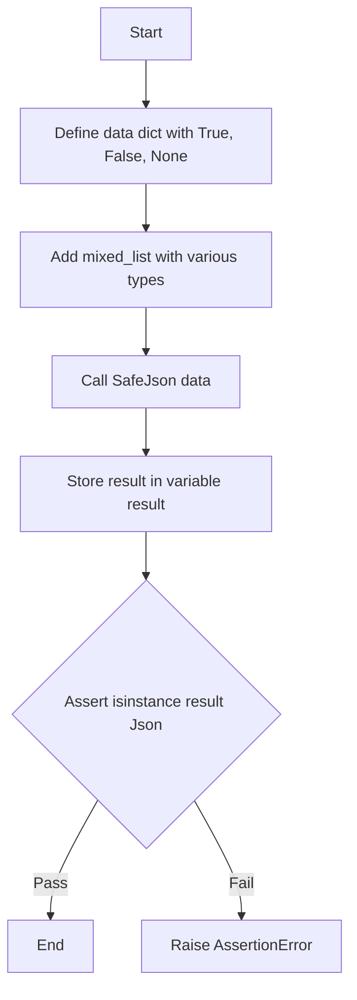

#### 带注释源码

```python
def test_boolean_and_null_values(self):
    """Test boolean and null value handling."""
    # 定义测试数据，包含布尔值、空值以及混合类型的列表
    data = {
        "true_value": True,
        "false_value": False,
        "null_value": None,
        "mixed_list": [True, False, None, "string", 42],
    }
    # 调用 SafeJson 处理数据
    result = SafeJson(data)
    # 断言返回结果是 Json 类型的一个实例
    assert isinstance(result, Json)
```


### `TestSafeJson.test_control_character_sanitization`

测试 `SafeJson` 能够清洗与 PostgreSQL 不兼容的控制字符，同时保留安全的空白字符（如制表符、换行符等）。

参数：

-   `self`：`TestSafeJson`，测试类的实例。

返回值：`None`，无返回值，通过断言验证行为是否符合预期。

#### 流程图

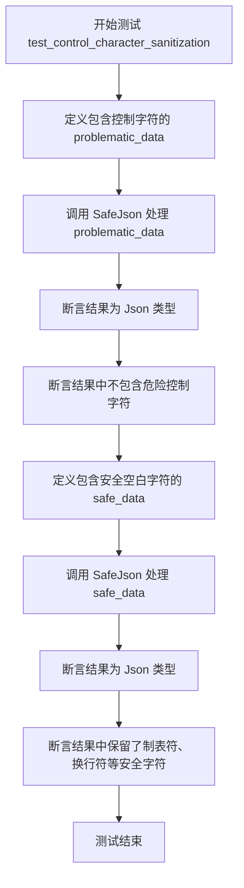

#### 带注释源码

```python
def test_control_character_sanitization(self):
    """Test that PostgreSQL-incompatible control characters are sanitized by SafeJson."""
    # 定义包含 PostgreSQL 不兼容控制字符的测试数据
    # 这些字符通常会导致数据库错误或解析问题
    problematic_data = {
        "null_byte": "data with \x00 null",
        "bell_char": "data with \x07 bell",
        "form_feed": "data with \x0C feed",
        "escape_char": "data with \x1B escape",
        "delete_char": "data with \x7F delete",
    }

    # 使用 SafeJson 处理包含问题的数据
    # SafeJson 应该能够成功处理这些数据而不抛出异常
    result = SafeJson(problematic_data)
    assert isinstance(result, Json)

    # 验证危险的控制字符确实已被移除
    result_data = result.data
    assert "\x00" not in str(result_data)  # null byte removed
    assert "\x07" not in str(result_data)  # bell removed
    assert "\x0C" not in str(result_data)  # form feed removed
    assert "\x1B" not in str(result_data)  # escape removed
    assert "\x7F" not in str(result_data)  # delete removed

    # 定义包含安全空白字符的测试数据
    # 这些字符是文本中常见的格式字符，应该被保留
    safe_data = {
        "with_tab": "text with \t tab",
        "with_newline": "text with \n newline",
        "with_carriage_return": "text with \r carriage return",
        "normal_text": "completely normal text",
    }

    # 使用 SafeJson 处理包含安全字符的数据
    safe_result = SafeJson(safe_data)
    assert isinstance(safe_result, Json)

    # 验证安全的空白字符被正确保留
    safe_result_data = cast(dict[str, Any], safe_result.data)
    assert isinstance(safe_result_data, dict)
    with_tab = safe_result_data.get("with_tab", "")
    with_newline = safe_result_data.get("with_newline", "")
    with_carriage_return = safe_result_data.get("with_carriage_return", "")
    assert "\t" in str(with_tab)  # tab preserved
    assert "\n" in str(with_newline)  # newline preserved
    assert "\r" in str(with_carriage_return)  # carriage return preserved
```


### `TestSafeJson.test_web_scraping_content_sanitization`

该函数用于测试 `SafeJson` 对包含特定控制字符（如空字节等）的网页抓取内容进行清理的能力，确保有害字符被移除且核心文本内容得以保留。

参数：

-  `self`：`TestSafeJson`，测试类的实例。

返回值：`None`，无返回值。

#### 流程图

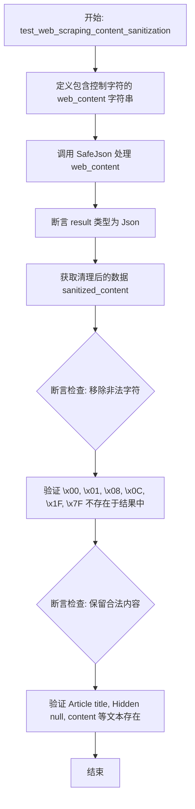

#### 带注释源码

```python
def test_web_scraping_content_sanitization(self):
    """Test sanitization of typical web scraping content with null characters."""
    # 模拟网页抓取内容，包含多种可能导致数据库或解析问题的控制字符
    # \x00: 空字节, \x01: 标题开始, \x08: 退格, \x0C: 换页, \x1F: 单元分隔符, \x7F: 删除字符
    web_content = "Article title\x00Hidden null\x01Start of heading\x08Backspace\x0CForm feed content\x1FUnit separator\x7FDelete char"

    # 调用 SafeJson 处理字符串
    result = SafeJson(web_content)
    # 断言返回结果是 Json 类型实例
    assert isinstance(result, Json)

    # 将结果数据转换为字符串以便检查
    sanitized_content = str(result.data)
    # 断言验证：确保所有有问题的控制字符已被移除
    assert "\x00" not in sanitized_content
    assert "\x01" not in sanitized_content
    assert "\x08" not in sanitized_content
    assert "\x0C" not in sanitized_content
    assert "\x1F" not in sanitized_content
    assert "\x7F" not in sanitized_content

    # 断言验证：确保清理后的内容仍然可读，核心文本未被破坏
    assert "Article title" in sanitized_content
    assert "Hidden null" in sanitized_content
    assert "content" in sanitized_content
```


### `TestSafeJson.test_legitimate_code_preservation`

该测试方法用于验证 `SafeJson` 工具能够正确处理并保留合法代码字符串（特别是包含反斜杠和转义字符的文件路径）中的特殊字符，确保在序列化过程中，这些合法的转义序列不会被错误地清理或修改，从而维持数据的完整性和语义。

参数：

- `self`：`TestSafeJson`，测试类的实例引用。

返回值：`None`，无返回值，方法通过内部的断言（assert）来验证结果的正确性。

#### 流程图

```mermaid
flowchart TD
    A[开始 test_legitimate_code_preservation] --> B[定义 file_paths 测试字典<br>包含 windows_path, network_path, escaped_backslashes]
    B --> C[调用 SafeJson 处理 file_paths 数据]
    C --> D[使用 cast 将 result.data 转换为字典类型]
    D --> E[断言 result_data 是否为 dict 类型]
    E --> F[从 result_data 中提取各路径字符串]
    F --> G{断言检查<br>字符串是否包含预期的反斜杠和路径内容}
    G --> H[测试通过]
    G -- 失败 --> I[测试失败]
```

#### 带注释源码

```python
    def test_legitimate_code_preservation(self):
        """Test that legitimate code with backslashes and escapes is preserved."""
        # 准备包含反斜杠的测试数据，模拟常见的文件路径场景
        # File paths with backslashes should be preserved
        file_paths = {
            "windows_path": "C:\\Users\\test\\file.txt",
            "network_path": "\\\\server\\share\\folder",
            "escaped_backslashes": "String with \\\\ double backslashes",
        }

        # 使用 SafeJson 处理数据
        result = SafeJson(file_paths)
        # 获取处理后的数据并进行类型转换
        result_data = cast(dict[str, Any], result.data)
        assert isinstance(result_data, dict)

        # Verify file paths are preserved correctly (JSON converts \\\\ back to \\)
        # 验证文件路径被正确保留（JSON会将双反斜杠\\\\转换回单反斜杠\\）
        windows_path = result_data.get("windows_path", "")
        network_path = result_data.get("network_path", "")
        escaped_backslashes = result_data.get("escaped_backslashes", "")
        
        # 断言字符串中包含预期的反斜杠和路径信息，确保合法转义未被移除
        assert "C:\\Users\\test\\file.txt" in str(windows_path)
        assert "\\server\\share" in str(network_path)
        assert "\\" in str(escaped_backslashes)
```


### `TestSafeJson.test_legitimate_json_escapes_preservation`

验证 `SafeJson` 工具在序列化过程中能够正确保留合法且有用的 JSON 转义序列（如引号、换行符、制表符和 Unicode 字符），确保这些合法的模式不会被过度清洗而丢失数据。

参数：

- `self`：`TestSafeJson`，测试类实例，用于访问测试上下文和断言方法。

返回值：`None`，无返回值，通过断言验证逻辑正确性。

#### 流程图

```mermaid
flowchart TD
    A[Start] --> B[定义测试数据 legitimate_escapes<br/>包含引号、换行、制表符、Unicode及混合路径]
    B --> C[调用 SafeJson 处理数据]
    C --> D[提取 result.data 并断言为字典类型]
    D --> E[获取各字段值<br/>quotes, newlines, tabs, unicode_chars, mixed_content]
    E --> F[断言: quotes 中包含双引号]
    E --> G[断言: newlines 中包含 Line 1 和 Line 2]
    E --> H[断言: tabs 中包含 Column 1 和 Column 2]
    E --> I[断言: unicode_chars 解码后包含 Hello]
    E --> J[断言: mixed_content 中包含 C: 和 temp]
    F --> K[End]
    G --> K
    H --> K
    I --> K
    J --> K
```

#### 带注释源码

```python
def test_legitimate_json_escapes_preservation(self):
    """Test that legitimate JSON escape sequences are preserved."""
    # 准备测试数据：包含各种合法的转义字符和路径
    legitimate_escapes = {
        "quotes": 'He said "Hello world!"',
        "newlines": "Line 1\\nLine 2\\nLine 3",
        "tabs": "Column1\\tColumn2\\tColumn3",
        "unicode_chars": "Unicode: \u0048\u0065\u006c\u006c\u006f",  # "Hello"
        "mixed_content": "Path: C:\\\\temp\\\\file.txt\\nSize: 1024 bytes",
    }

    # 调用 SafeJson 处理数据
    result = SafeJson(legitimate_escapes)
    # 将结果转换为字典以便验证
    result_data = cast(dict[str, Any], result.data)
    assert isinstance(result_data, dict)

    # 验证所有合法的内容是否被保留
    quotes = result_data.get("quotes", "")
    newlines = result_data.get("newlines", "")
    tabs = result_data.get("tabs", "")
    unicode_chars = result_data.get("unicode_chars", "")
    mixed_content = result_data.get("mixed_content", "")

    # 断言双引号被保留
    assert '"' in str(quotes)
    # 断言换行符相关文本被保留（实际字符可能已被转义处理，但文本内容应在）
    assert "Line 1" in str(newlines) and "Line 2" in str(newlines)
    # 断言制表符相关文本被保留
    assert "Column1" in str(tabs) and "Column2" in str(tabs)
    # 断言 Unicode 被正确解码保留为 "Hello"
    assert "Hello" in str(unicode_chars)
    # 断言混合内容中的路径和文本被保留
    assert "C:" in str(mixed_content) and "temp" in str(mixed_content)
```


### `TestSafeJson.test_regex_patterns_dont_over_match`

该测试方法用于验证 `SafeJson` 在处理数据时，其内部使用的正则表达式清理模式不会因为过度匹配而意外删除看似转义序列但实际上是合法内容的文本（如文件路径、类 JSON 字符串或类 Unicode 文本），确保数据的完整性。

参数：

- `self`：`TestSafeJson`，测试类的实例引用。

返回值：`None`，该方法主要执行断言逻辑，不返回具体数值。

#### 流程图

```mermaid
graph TD
    A[开始] --> B[定义包含边缘情况的 edge_cases 字典]
    B --> C[调用 SafeJson edge_cases 处理数据]
    C --> D[断言 isinstance result Json]
    D --> E[获取 result_data 并提取各字段字符串]
    E --> F{断言检查关键字段内容是否保留}
    F -- 内容保留 --> G[测试通过]
    F -- 内容丢失 --> H[测试失败]
```

#### 带注释源码

```python
def test_regex_patterns_dont_over_match(self):
    """Test that our regex patterns don't accidentally match legitimate sequences."""
    # 定义可能对正则表达式造成干扰的边缘情况测试数据
    # 包含看起来像转义序列但实际是普通文件路径或文本的字符串
    edge_cases = {
        "file_with_b": "C:\\\\mybfile.txt",  # 包含 'bf' 但不是转义序列
        "file_with_f": "C:\\\\folder\\\\file.txt",  # 反斜杠后包含 'f'
        "json_like_string": '{"text": "\\\\bolder text"}',  # 看起来像 JSON 转义但实际不是
        "unicode_like": "Code: \\\\u0040 (not a real escape)",  # 看起来像 Unicode 转义
    }

    # 使用 SafeJson 处理包含边缘情况的数据
    result = SafeJson(edge_cases)
    result_data = cast(dict[str, Any], result.data)
    assert isinstance(result_data, dict)

    # 验证边缘情况处理是否正确 - 不应丢失任何内容
    file_with_b = result_data.get("file_with_b", "")
    file_with_f = result_data.get("file_with_f", "")
    json_like_string = result_data.get("json_like_string", "")
    unicode_like = result_data.get("unicode_like", "")

    # 断言关键子字符串存在，确保它们没有被过度的正则匹配移除
    assert "mybfile.txt" in str(file_with_b)
    assert "folder" in str(file_with_f) and "file.txt" in str(file_with_f)
    assert "bolder text" in str(json_like_string)
    assert "\\u0040" in str(unicode_like)
```


### `TestSafeJson.test_programming_code_preservation`

测试 `SafeJson` 工具是否能正确处理和保留包含各种转义字符的编程代码片段（如 Python 字符串、正则表达式、JSON、SQL 和 JavaScript 代码），确保合法的代码结构和转义序列不会被清理逻辑错误地移除或破坏。

参数：

-   `self`：`TestSafeJson`，测试类实例自身。

返回值：`None`，该函数为测试方法，不返回具体数值，主要通过断言验证逻辑。

#### 流程图

```mermaid
graph TD
    A[开始] --> B[定义包含代码片段的字典 code_samples]
    B --> C[调用 SafeJson code_samples 进行序列化]
    C --> D[断言 result 为 Json 类型]
    D --> E[获取 result.data 并断言为 dict 类型]
    E --> F[从 result_data 中提取各代码字段]
    F --> G[验证 Python 代码: print, Hello]
    F --> H[验证 正则模式: A-Za-z+]
    F --> I[验证 JSON 字符串: name]
    F --> J[验证 SQL 语句: LIKE]
    F --> K[验证 JavaScript 代码: var path]
    G --> L[结束]
    H --> L
    I --> L
    J --> L
    K --> L
```

#### 带注释源码

```python
    def test_programming_code_preservation(self):
        """Test that programming code with various escapes is preserved."""
        # 1. 定义测试数据：包含常见编程模式和转义字符的字典
        code_samples = {
            "python_string": 'print("Hello\\\\nworld")',  # Python 打印语句
            "regex_pattern": "\\\\b[A-Za-z]+\\\\b",       # 单词边界正则表达式
            "json_string": '{"name": "test", "path": "C:\\\\\\\\folder"}', # JSON 格式字符串
            "sql_escape": "WHERE name LIKE '%\\\\%%'",    # SQL LIKE 语句中的转义
            "javascript": 'var path = "C:\\\\\\\\Users\\\\\\\\file.js";', # JS 路径变量
        }

        # 2. 使用 SafeJson 封装数据
        result = SafeJson(code_samples)
        result_data = cast(dict[str, Any], result.data)
        assert isinstance(result_data, dict)

        # 3. 提取结果中的各个字段
        python_string = result_data.get("python_string", "")
        regex_pattern = result_data.get("regex_pattern", "")
        json_string = result_data.get("json_string", "")
        sql_escape = result_data.get("sql_escape", "")
        javascript = result_data.get("javascript", "")

        # 4. 断言验证：确保关键的代码结构和内容被正确保留，未被过度清理
        assert "print(" in str(python_string)
        assert "Hello" in str(python_string)
        assert "[A-Za-z]+" in str(regex_pattern)
        assert "name" in str(json_string)
        assert "LIKE" in str(sql_escape)
        assert "var path" in str(javascript)
```


### `TestSafeJson.test_only_problematic_sequences_removed`

测试仅移除有问题的 PostgreSQL 序列，而保留其他内容（如合法的制表符、换行符等）的功能。

参数：

-  `self`：`TestSafeJson`，测试类的实例，用于访问测试上下文或辅助方法。

返回值：`None`，该方法不返回值，主要通过断言验证逻辑正确性。

#### 流程图

```mermaid
flowchart TD
    A["开始: test_only_problematic_sequences_removed"] --> B["构造测试数据 mixed_content<br/>包含安全字符(\\t, \\n)和非法控制字符(\\x00, \\x08等)"]
    B --> C["调用 SafeJson(mixed_content) 处理数据"]
    C --> D["获取处理后的数据 result.data"]
    D --> E["从结果中提取 safe_and_unsafe 字段"]
    E --> F["从结果中提取 file_path_with_null 字段"]
    F --> G{断言验证: 合法文本 'Good text' 是否存在?}
    G -- 存在 --> H{断言验证: 制表符 '\\t' 是否存在?}
    H -- 存在 --> I{断言验证: 换行符 '\\n' 是否存在?}
    I -- 存在 --> J{断言验证: 空字符 '\\x00' 是否不存在?}
    J -- 不存在 --> K{断言验证: 退格符 '\\x08' 是否不存在?}
    K -- 不存在 --> L{断言验证: 文件路径部分是否保留?}
    L -- 保留 --> M["结束: 测试通过"]
    G -- 不存在 --> N["抛出断言错误"]
    H -- 不存在 --> N
    I -- 不存在 --> N
    J -- 存在 --> N
    K -- 存在 --> N
    L -- 未保留 --> N
```

#### 带注释源码

```python
def test_only_problematic_sequences_removed(self):
    """Test that ONLY PostgreSQL-problematic sequences are removed, nothing else."""
    # 构造包含混合内容的测试字典：
    # 包含合法的制表符(\t)、换行符(\n)，以及非法的控制字符(\x00, \x08)
    mixed_content = {
        "safe_and_unsafe": "Good text\twith tab\x00NULL BYTE\nand newline\x08BACKSPACE",
        "file_path_with_null": "C:\\temp\\file\x00.txt",
        "json_with_controls": '{"text": "data\x01\x0C\x1F"}',
    }

    # 使用 SafeJson 处理混合数据
    result = SafeJson(mixed_content)
    # 获取处理后的实际数据字典
    result_data = cast(dict[str, Any], result.data)
    assert isinstance(result_data, dict)

    # 从结果中提取特定字段以便进行详细验证
    safe_and_unsafe = result_data.get("safe_and_unsafe", "")
    file_path_with_null = result_data.get("file_path_with_null", "")

    # 验证：合法文本内容被保留
    assert "Good text" in str(safe_and_unsafe)
    # 验证：合法的制表符被保留
    assert "\t" in str(safe_and_unsafe)  # Tab preserved
    # 验证：合法的换行符被保留
    assert "\n" in str(safe_and_unsafe)  # Newline preserved
    # 验证：非法的 NULL 字节被移除
    assert "\x00" not in str(safe_and_unsafe)  # Null removed
    # 验证：非法的退格符被移除
    assert "\x08" not in str(safe_and_unsafe)  # Backspace removed

    # 验证：文件路径中的合法部分被保留
    assert "C:\\temp\\file" in str(file_path_with_null)
    assert ".txt" in str(file_path_with_null)
    # 验证：文件路径中的非法 NULL 字节被移除
    assert "\x00" not in str(file_path_with_null)  # Null removed from path
```


### `TestSafeJson.test_invalid_escape_error_prevention`

测试 SafeJson 是否能防止在 `upsert_execution_output` 中出现的 "Invalid \escape" 错误。该方法构造了包含各类控制字符（如空字符、退格符等）和混合内容的复杂数据，验证 SafeJson 能有效移除非法控制字符同时保留合法内容，并确保处理后的数据能够被标准的 `json` 模块正确序列化和反序列化。

参数：

- `self`：`TestSafeJson`，测试类实例。

返回值：`None`，无返回值（通过断言验证逻辑正确性）。

#### 流程图

```mermaid
graph TD
    A[开始] --> B[构造包含控制字符的测试数据 problematic_output_data]
    B --> C[调用 SafeJson problemmatic_output_data]
    C --> D[断言 result 是 Json 类型实例]
    D --> E[获取 result.data 并断言其为字典]
    E --> F[提取字段 web_content, file_path, large_text]
    F --> G[断言各类控制字符 \x00, \x01 等已被移除]
    G --> H[断言合法文本 Article text 等仍保留]
    H --> I[断言 file_path 中的非法字符已移除且路径合法]
    I --> J[断言 large_text 长度合法且包含原始有效内容]
    J --> K[使用 json.dumps 序列化 result.data]
    K --> L[断言 json.dumps 不报错且字符串非空]
    L --> M[使用 json.loads 反序列化 JSON 字符串]
    M --> N[断言反序列化结果为字典]
    N --> O[结束]
```

#### 带注释源码

```python
def test_invalid_escape_error_prevention(self):
    """Test that SafeJson prevents 'Invalid \\escape' errors that occurred in upsert_execution_output."""
    # 这重现了导致错误的确切场景:
    # POST /upsert_execution_output failed: Invalid \escape: line 1 column 36404 (char 36403)

    # 创建包含可能导致 JSON 解析错误的有问题的转义序列数据
    problematic_output_data = {
        "web_content": "Article text\x00with null\x01and control\x08chars\x0C\x1F\x7F",
        "file_path": "C:\\Users\\test\\file\x00.txt",
        "json_like_string": '{"text": "data\x00\x08\x1F"}',
        "escaped_sequences": "Text with \\u0000 and \\u0008 sequences",
        "mixed_content": "Normal text\tproperly\nformatted\rwith\x00invalid\x08chars\x1Fmixed",
        "large_text": "A" * 35000
        + "\x00\x08\x1F"
        + "B" * 5000,  # 模拟错误中的大文本
    }

    # 这应该不会引发任何 JSON 解析错误
    result = SafeJson(problematic_output_data)
    assert isinstance(result, Json)

    # 验证结果是一个可以安全存储在 PostgreSQL 中的有效 Json 对象
    result_data = cast(dict[str, Any], result.data)
    assert isinstance(result_data, dict)

    # 验证有问题的字符被移除但安全的内容被保留
    web_content = result_data.get("web_content", "")
    file_path = result_data.get("file_path", "")
    large_text = result_data.get("large_text", "")

    # 检查控制字符是否被移除
    assert "\x00" not in str(web_content)
    assert "\x01" not in str(web_content)
    assert "\x08" not in str(web_content)
    assert "\x0C" not in str(web_content)
    assert "\x1F" not in str(web_content)
    assert "\x7F" not in str(web_content)

    # 检查合法内容是否被保留
    assert "Article text" in str(web_content)
    assert "with null" in str(web_content)
    assert "and control" in str(web_content)
    assert "chars" in str(web_content)

    # 检查文件路径处理
    assert "C:\\Users\\test\\file" in str(file_path)
    assert ".txt" in str(file_path)
    assert "\x00" not in str(file_path)

    # 检查大文本处理 (错误场景中的 char 36403)
    assert len(str(large_text)) > 35000  # 内容被保留
    assert "A" * 1000 in str(large_text)  # A 被保留
    assert "B" * 1000 in str(large_text)  # B 被保留
    assert "\x00" not in str(large_text)  # 控制字符被移除
    assert "\x08" not in str(large_text)
    assert "\x1F" not in str(large_text)

    # 最重要的是: 确保结果可以被 JSON 序列化而不出错
    # 使用旧方法这会失败
    import json

    json_string = json.dumps(result.data)  # 应该不抛出 "Invalid \escape"
    assert len(json_string) > 0

    # 并且可以被解析回来
    parsed_back = json.loads(json_string)
    assert isinstance(parsed_back, dict)
```


### `TestSafeJson.test_dict_containing_pydantic_models`

该函数测试 `SafeJson` 工具是否能正确处理并序列化包含 Pydantic 模型实例的字典，确保模型数据能被正确转换为 JSON 格式，旨在复现并修复特定场景（PR #11187）下字典内 Pydantic 模型序列化失败的问题。

参数：

-  `self`：`TestSafeJson`，测试类实例，用于访问测试上下文和断言方法。

返回值：`None`，该函数为测试方法，主要用于验证行为，不返回显式值。

#### 流程图

```mermaid
graph TD
    A[Start Test] --> B[Create SamplePydanticModel Instances]
    B --> C[Construct Dict with Models and String]
    C --> D[Call SafeJson with data]
    D --> E[Assert result is instance of Json]
    E --> F[Serialize result.data using json.dumps]
    F --> G[Assert Alice in json_string]
    G --> H[Assert Bob in json_string]
    H --> I[Test Pass]
```

#### 带注释源码

```python
def test_dict_containing_pydantic_models(self):
    """Test that dicts containing Pydantic models are properly serialized."""
    # This reproduces the bug from PR #11187 where credential_inputs failed
    
    # 步骤 1: 创建两个 Pydantic 模型实例用于测试
    model1 = SamplePydanticModel(name="Alice", age=30)
    model2 = SamplePydanticModel(name="Bob", age=25)

    # 步骤 2: 构建一个包含 Pydantic 模型和常规数据的字典
    data = {
        "user1": model1,
        "user2": model2,
        "regular_data": "test",
    }

    # 步骤 3: 调用 SafeJson 处理该字典
    result = SafeJson(data)
    
    # 步骤 4: 验证返回结果是 Json 类型
    assert isinstance(result, Json)

    # Verify it can be JSON serialized (this was the bug)
    # 步骤 5: 导入 json 模块以验证序列化能力
    import json

    # 步骤 6: 尝试将 result.data 序列化为 JSON 字符串
    # 这是为了确认修复了之前的 Bug，即字典中的 Pydantic 模型无法被 json.dumps 正确处理
    json_string = json.dumps(result.data)
    
    # 步骤 7: 断言序列化后的字符串包含预期的模型数据
    assert "Alice" in json_string
    assert "Bob" in json_string
```


### `TestSafeJson.test_nested_pydantic_in_dict`

测试 SafeJson 工具是否能正确序列化深度嵌套在字典数据结构中的 Pydantic 模型，确保嵌套模型的数据能被转换为 JSON 兼容格式。

参数：

-   `self`：`TestSafeJson`，测试类实例。

返回值：`None`，单元测试方法，无返回值。

#### 流程图

```mermaid
graph TD
    A[开始: test_nested_pydantic_in_dict] --> B[创建内部Pydantic模型 inner_model]
    B --> C[创建中间Pydantic模型 middle_model<br/>包含inner_model在metadata中]
    C --> D[构建嵌套字典结构 data<br/>将middle_model置于多层嵌套中]
    D --> E[调用 SafeJson data 处理数据]
    E --> F{断言 result 是否为 Json 类型?}
    F -- 否 --> G[测试失败]
    F -- 是 --> H[使用 json.dumps 序列化 result.data]
    H --> I{检查 JSON字符串是否包含 'Middle'?}
    I -- 否 --> G
    I -- 是 --> J{检查 JSON字符串是否包含 'Inner'?}
    J -- 否 --> G
    J -- 是 --> K[测试通过]
```

#### 带注释源码

```python
    def test_nested_pydantic_in_dict(self):
        """Test deeply nested Pydantic models in dicts."""
        # 1. 创建内层 Pydantic 模型实例
        inner_model = SamplePydanticModel(name="Inner", age=20)
        
        # 2. 创建中间层 Pydantic 模型实例，将内层模型放入 metadata 字段中，形成模型嵌套
        middle_model = SamplePydanticModel(
            name="Middle", age=30, metadata={"inner": inner_model}
        )

        # 3. 构建多层嵌套的字典结构，将 Pydantic 模型放在字典的深层嵌套中
        data = {
            "level1": {
                "level2": {
                    "model": middle_model,
                    "other": "data",
                }
            }
        }

        # 4. 调用 SafeJson 处理嵌套数据
        result = SafeJson(data)
        
        # 5. 断言返回结果为 Json 类型
        assert isinstance(result, Json)

        import json

        # 6. 将处理后的数据序列化为 JSON 字符串
        json_string = json.dumps(result.data)
        
        # 7. 断言序列化后的字符串包含中间层模型的数据，证明模型被正确解析
        assert "Middle" in json_string
        
        # 8. 断言序列化后的字符串包含内层模型的数据，证明深层嵌套也被正确解析
        assert "Inner" in json_string
```


### `TestSafeJson.test_list_containing_pydantic_models_in_dict`

测试包含 Pydantic 模型列表的字典是否能被 SafeJson 正确序列化为兼容 JSON 的格式。

参数：

-  `self`：`TestSafeJson`，测试类的实例。

返回值：`None`，该函数为测试方法，无显式返回值，通过断言验证逻辑正确性。

#### 流程图

```mermaid
graph TD
    A[开始测试] --> B[创建包含5个 SamplePydanticModel 的列表]
    B --> C[构建字典 data 键为 users 和 count]
    C --> D[调用 SafeJson data 处理数据]
    D --> E{result 是否为 Json 实例}
    E -- 否 --> F[抛出断言错误]
    E -- 是 --> G[使用 json.dumps 序列化 result.data]
    G --> H{JSON 字符串是否包含 User0 和 User4}
    H -- 否 --> F
    H -- 是 --> I[测试通过/结束]
```

#### 带注释源码

```python
    def test_list_containing_pydantic_models_in_dict(self):
        """Test list of Pydantic models inside a dict."""
        # 1. 准备测试数据：生成一个包含5个Pydantic模型实例的列表
        models = [SamplePydanticModel(name=f"User{i}", age=20 + i) for i in range(5)]

        # 2. 构建嵌套数据结构：字典中包含上述模型列表和计数
        data = {
            "users": models,
            "count": len(models),
        }

        # 3. 调用 SafeJson 处理包含复杂对象的数据
        result = SafeJson(data)
        # 验证返回结果是否为预期的 Json 类型
        assert isinstance(result, Json)

        # 4. 验证序列化结果：导入标准 json 库进行序列化
        import json

        json_string = json.dumps(result.data)
        # 断言生成的 JSON 字符串中包含了模型转换后的数据，确保模型被正确展开
        assert "User0" in json_string
        assert "User4" in json_string
```


### `TestSafeJson.test_credentials_meta_input_scenario`

该方法用于测试在 `create_graph_execution` 流程中特定的失败场景，即通过 `SafeJson` 处理包含 Pydantic 模型实例（`MockCredentialsMetaInput`）的字典时的序列化行为，确保其能正确返回 Json 类型并生成包含预期数据的 JSON 字符串。

参数：

-  `self`：`TestSafeJson`，测试类的实例，用于访问测试上下文和断言方法。

返回值：`None`，该方法不返回值，主要通过断言来验证序列化结果的正确性。

#### 流程图

```mermaid
flowchart TD
    A[开始: test_credentials_meta_input_scenario] --> B[定义内部类 MockCredentialsMetaInput]
    B --> C[实例化 MockCredentialsMetaInput 创建 cred_input]
    C --> D[构建字典 credential_inputs 包含 cred_input]
    D --> E[调用 SafeJson credential_inputs 进行序列化]
    E --> F[断言 result 是否为 Json 类型]
    F --> G[使用 json.dumps 序列化 result.data]
    G --> H{断言 JSON 字符串内容}
    H -->|包含 test-123| I[通过断言]
    H -->|包含 github| I[通过断言]
    H -->|包含 oauth2| I[通过断言]
    I --> J[测试结束]
```

#### 带注释源码

```python
    def test_credentials_meta_input_scenario(self):
        """Test the exact scenario from create_graph_execution that was failing."""

        # 1. 定义一个模拟的 CredentialsMetaInput 结构类，继承自 Pydantic BaseModel
        class MockCredentialsMetaInput(BaseModel):
            id: str
            title: Optional[str] = None
            provider: str
            type: str

        # 2. 实例化该模型，填充测试数据
        cred_input = MockCredentialsMetaInput(
            id="test-123", title="Test Credentials", provider="github", type="oauth2"
        )

        # 3. 构建字典结构，模拟 create_graph_execution 中的 credential_inputs
        credential_inputs = {"github_creds": cred_input}

        # 4. 调用 SafeJson 处理包含 Pydantic 模型的字典
        #    这一步应该能够正常工作而不会抛出 TypeError
        result = SafeJson(credential_inputs)
        
        # 5. 验证返回结果是否为 prisma.Json 类型
        assert isinstance(result, Json)

        # 6. 进一步验证结果可以被标准的 json 模块序列化为字符串
        import json

        json_string = json.dumps(result.data)
        
        # 7. 断言生成的 JSON 字符串中包含预期的关键字段信息
        assert "test-123" in json_string
        assert "github" in json_string
        assert "oauth2" in json_string
```


### `TestSafeJson.test_mixed_pydantic_and_primitives`

测试 `SafeJson` 工具处理复杂数据结构的能力，该结构包含 Pydantic 模型实例与 Python 原生基本类型（如字典、列表、字符串、整数）的混合嵌套。

参数：

- `self`：`TestSafeJson`，测试类实例，用于访问测试上下文和断言方法。

返回值：`None`，该方法为单元测试，无返回值，主要通过断言验证逻辑正确性。

#### 流程图

```mermaid
graph TD
    A[开始执行测试] --> B[创建 SamplePydanticModel 实例]
    B --> C[构建包含混合类型的字典 data]
    C --> D[调用 SafeJson data 进行序列化处理]
    D --> E{结果是否为 Json 实例?}
    E -- 否 --> F[断言失败, 抛出异常]
    E -- 是 --> G[使用 json.dumps 序列化 result.data]
    G --> H[生成 JSON 字符串]
    H --> I{字符串中是否包含特定关键字?]
    I -- 否 --> F
    I -- 是 --> J[断言成功, 测试通过]
    J --> K[结束]
```

#### 带注释源码

```python
def test_mixed_pydantic_and_primitives(self):
    """Test complex mix of Pydantic models and primitive types."""
    # 1. 初始化一个 Pydantic 模型实例，模拟需要序列化的对象
    model = SamplePydanticModel(name="Test", age=25)

    # 2. 构建复杂的混合数据结构
    # 包含模型、字典、字符串、整数，且包含多层嵌套（列表中包含模型，字典中包含列表等）
    data = {
        "models": [model, {"plain": "dict"}, "string", 123],
        "nested": {
            "model": model,             # 嵌套的 Pydantic 模型
            "list": [1, 2, model, 4],    # 包含 Pydantic 模型的列表
            "plain": "text",
        },
        "plain_list": [1, 2, 3],
    }

    # 3. 调用 SafeJson 处理混合数据
    result = SafeJson(data)
    
    # 4. 验证返回结果的类型是否为 Json
    assert isinstance(result, Json)

    # 5. 导入标准 json 库以验证数据的可序列化性
    import json

    # 6. 尝试将处理后的数据序列化为 JSON 字符串
    # 这是验证 SafeJson 是否成功将不可序列化对象转换为可序列化格式的关键步骤
    json_string = json.dumps(result.data)
    
    # 7. 验证生成的 JSON 字符串中保留了预期的数据内容
    assert "Test" in json_string      # 验证模型数据被正确转换
    assert "plain" in json_string     # 验证普通字典数据被保留
```


### `TestSafeJson.test_pydantic_model_with_control_chars_in_dict`

测试当 Pydantic 模型嵌套在字典中并包含控制字符时，SafeJson 的处理能力。它验证了控制字符被移除，同时模型的有效数据被保留。

参数：

-   `self`：`TestSafeJson`，测试类实例。

返回值：`None`，无返回值。

#### 流程图

```mermaid
graph TD
    A[开始] --> B[创建包含控制字符的 SamplePydanticModel]
    B --> C[将模型封装进字典 data]
    C --> D[调用 SafeJson 处理 data]
    D --> E[断言 结果类型为 Json]
    E --> F[将结果序列化为 JSON 字符串]
    F --> G{断言 JSON 字符串中是否含有特定控制字符}
    G -- 不含 \x00 --> H[通过]
    G -- 不含 \x08 --> I[通过]
    G -- 不含 \x0C --> J[通过]
    H --> K[断言 有效文本 'TestUser' 存在]
    I --> K
    J --> K
    K --> L[结束]
```

#### 带注释源码

```python
def test_pydantic_model_with_control_chars_in_dict(self):
    """Test Pydantic model with control chars when nested in dict."""
    # 创建一个 SamplePydanticModel 实例，其中包含控制字符
    # name 字段包含空字符 \x00
    # metadata 字典的 info 值包含退格符 \x08 和换页符 \x0C
    model = SamplePydanticModel(
        name="Test\x00User",  # Has null byte
        age=30,
        metadata={"info": "data\x08with\x0Ccontrols"},
    )

    # 将该 Pydantic 模型放入字典中，模拟嵌套结构
    data = {"credential": model}

    # 使用 SafeJson 处理包含嵌套模型和控制字符的数据
    result = SafeJson(data)
    # 验证返回结果是 Prisma Json 类型
    assert isinstance(result, Json)

    # 验证控制字符已被移除
    import json

    # 将结果序列化为 JSON 字符串
    json_string = json.dumps(result.data)
    # 断言特定的控制字符不在结果字符串中
    assert "\x00" not in json_string
    assert "\x08" not in json_string
    assert "\x0C" not in json_string
    # 断言去除控制字符后的有效内容 "TestUser" 依然存在
    assert "TestUser" in json_string  # Name preserved minus null byte
```


### `TestSafeJson.test_deeply_nested_pydantic_models_control_char_sanitization`

该测试方法用于验证 `SafeJson` 在处理深度嵌套的 Pydantic 模型时，能否有效地清除字符串中的控制字符，同时保留文本内容和原有的数据结构。

参数：

- `self`：`TestSafeJson`，测试类实例本身。

返回值：`None`，该方法是测试函数，无返回值。

#### 流程图

```mermaid
graph TD
    A[开始] --> B[定义内部 Pydantic 模型]
    B --> C[创建 inner 实例<br>注入深层控制字符]
    C --> D[创建 middle 实例<br>包裹 inner 并注入控制字符]
    D --> E[创建 outer 实例<br>包裹 middle 并注入控制字符]
    E --> F[构造顶层字典 data<br>包含 outer 和列表]
    F --> G[调用 SafeJson data 处理]
    G --> H[断言 result 是 Json 类型]
    H --> I[序列化 result.data 为 JSON 字符串]
    I --> J[遍历所有控制字符列表]
    J --> K{JSON中是否包含<br>该控制字符?}
    K -- 是 --> L[断言失败]
    K -- 否 --> J
    J --> M[断言文本内容保留<br>控制字符已移除]
    M --> N[断言数据结构<br>Dict/List 保留]
    N --> O[断言深层字段<br>访问及清理正确]
    O --> P[结束]
```

#### 带注释源码

```python
    def test_deeply_nested_pydantic_models_control_char_sanitization(self):
        """Test that control characters are sanitized in deeply nested Pydantic models."""

        # 定义内部 Pydantic 模型
        class InnerModel(BaseModel):
            deep_string: str
            value: int = 42
            metadata: dict = {}

        # 定义中间层 Pydantic 模型
        class MiddleModel(BaseModel):
            middle_string: str
            inner: InnerModel
            data: str

        # 定义外部层 Pydantic 模型
        class OuterModel(BaseModel):
            outer_string: str
            middle: MiddleModel

        # 创建测试数据：在最深层注入多种控制字符
        inner = InnerModel(
            deep_string="Deepest\x00Level\x08Control\x0CChars",  # 包含 null, backspace, form feed
            metadata={
                "nested_key": "Nested\x1FValue\x7FDelete"
            },  # 包含 unit separator, delete
        )

        # 创建中间层数据：注入控制字符并引用 inner
        middle = MiddleModel(
            middle_string="Middle\x01StartOfHeading\x1FUnitSeparator",
            inner=inner,
            data="Some\x0BVerticalTab\x0EShiftOut",
        )

        # 创建外部层数据：注入控制字符并引用 middle
        outer = OuterModel(outer_string="Outer\x00Null\x07Bell", middle=middle)

        # 构造包含嵌套模型和列表的顶层字典，并在各层注入控制字符
        data = {
            "top_level": "Top\x00Level\x08Backspace",
            "nested_model": outer,
            "list_with_strings": [
                "List\x00Item1",
                "List\x0CItem2\x1F",
                {"dict_in_list": "Dict\x08Value"},
            ],
        }

        # 调用 SafeJson 处理数据
        result = SafeJson(data)
        assert isinstance(result, Json)

        # 验证所有控制字符已被移除：将结果序列化为 JSON 字符串
        import json

        json_string = json.dumps(result.data)

        # 定义需要检查的控制字符列表
        control_chars = [
            "\x00", "\x01", "\x02", "\x03", "\x04", "\x05", "\x06", "\x07",
            "\x08", "\x0B", "\x0C", "\x0E", "\x0F", "\x10", "\x11", "\x12",
            "\x13", "\x14", "\x15", "\x16", "\x17", "\x18", "\x19", "\x1A",
            "\x1B", "\x1C", "\x1D", "\x1E", "\x1F", "\x7F",
        ]

        # 断言 JSON 字符串中不包含任何控制字符
        for char in control_chars:
            assert (
                char not in json_string
            ), f"Control character {repr(char)} found in result"

        # 验证文本内容在移除控制字符后依然存在（字符串被正确拼接）
        result_data = cast(dict[str, Any], result.data)

        # 检查顶层
        assert "TopLevelBackspace" in json_string

        # 检查外部模型层
        assert "OuterNullBell" in json_string

        # 检查中间模型层
        assert "MiddleStartOfHeadingUnitSeparator" in json_string
        assert "SomeVerticalTabShiftOut" in json_string

        # 检查内部模型层（最深层）
        assert "DeepestLevelControlChars" in json_string

        # 检查模型内的嵌套字典
        assert "NestedValueDelete" in json_string

        # 检查列表项
        assert "ListItem1" in json_string
        assert "ListItem2" in json_string
        assert "DictValue" in json_string

        # 验证数据结构（字典和列表）未被破坏
        assert isinstance(result_data, dict)
        assert isinstance(result_data["nested_model"], dict)
        assert isinstance(result_data["nested_model"]["middle"], dict)
        assert isinstance(result_data["nested_model"]["middle"]["inner"], dict)
        assert isinstance(result_data["list_with_strings"], list)

        # 验证深层特定值的访问和清理情况
        nested_model = cast(dict[str, Any], result_data["nested_model"])
        middle = cast(dict[str, Any], nested_model["middle"])
        inner = cast(dict[str, Any], middle["inner"])

        deep_string = inner["deep_string"]
        assert deep_string == "DeepestLevelControlChars"

        metadata = cast(dict[str, Any], inner["metadata"])
        nested_metadata = metadata["nested_key"]
        assert nested_metadata == "NestedValueDelete"
```


## 关键组件


### SafeJson 序列化工具

代码的核心被测对象，用于将复杂的 Python 数据结构（包括 Pydantic 模型、字典、列表等）转换为 Prisma/PostgreSQL 兼容的 JSON 格式。它具备自动处理非序列化数据类型（如 lambda 函数、复杂对象）和清洗不安全控制字符的能力，确保数据能安全存储到数据库。

### TestSafeJson 测试套件

一个全面的单元测试类，包含针对 `SafeJson` 功能的各种测试用例。该组件覆盖了从基础类型转换、Unicode 处理、嵌套结构到复杂的边界条件（如循环引用、大数据量、混合 Pydantic 模型）的验证逻辑。

### 控制字符清洗机制

通过测试验证的关键逻辑，旨在移除文本中对 PostgreSQL 数据库有破坏性的 ASCII 控制字符（如 `\x00` null byte, `\x07` bell, `\x1b` escape 等），同时保留合法的转义字符和安全的空白符（如 `\t`, `\n`, `\r`），从而防止“Invalid \escape”等解析错误。

### Pydantic 模型适配器

负责处理 Pydantic BaseModel 实例的序列化逻辑，支持将包含 Pydantic 对象的字典、列表或嵌套结构正确转换为标准 JSON 格式，并能处理模型中的可选字段、日期时间对象及元数据。


## 问题及建议


### 已知问题

-   **循环引用处理不完善**：`test_edge_case_circular_reference_protection` 测试显示，当数据存在循环引用时，系统预期会抛出 `ValueError` 或 `RecursionError` 异常，而不是优雅地中断或处理。这表明 `SafeJson` 缺乏稳健的循环引用检测机制，在处理复杂图结构时存在运行时崩溃的风险。
-   **数值数据丢失**：`test_numeric_edge_cases` 测试表明，`float('inf')` 和 `float('-inf')` 等特殊数值会被转换为 `None`。这种静默的数据语义丢失可能会在依赖数值边界进行计算或逻辑判断的下游系统中引入错误。
-   **不可序列化对象的静默转换**：对于字典中的函数对象（如 `lambda`）等非序列化数据，当前逻辑倾向于将其转换为 `None`。这种隐式行为掩盖了数据完整性问题，如果下游逻辑期望的是可调用对象，将导致难以排查的 `TypeError`。
-   **硬编码的字符清洗规则**：测试代码详细验证了特定控制字符（如 `\x00`, `\x08`, `\x7F`）被移除，而 `\t`, `\n`, `\r` 被保留。这种特定的控制字符过滤逻辑是硬编码的，如果数据库迁移（如从 PostgreSQL 迁移到其他对换行符敏感的存储）或需求变更，将导致需要修改测试和实现的深层逻辑，维护成本高。

### 优化建议

-   **采用正则表达式优化清洗性能**：测试覆盖了大量的单个字符检查（如 `\x00` 到 `\x1F` 等）。如果 `SafeJson` 的底层实现是逐个字符或多次替换，建议将其重构为使用正则表达式的字符类（例如 `re.sub(r'[\x00-\x08\x0B\x0C\x0E-\x1F\x7F]', '', text)`），以实现单次遍历清洗，显著提升大数据量文本处理的性能。
-   **实现自定义 JSONEncoder**：不应依赖 `json.dumps` 的默认序列化配合 `try-except` 回退机制。建议实现自定义的 `json.JSONEncoder`，显式处理 `Pydantic` 模型（调用 `.model_dump()` 或 `.dict()`）、`datetime` 对象以及特殊浮点数，从而提高序列化的效率和类型安全。
-   **利用参数化测试简化代码**：测试类中存在大量结构重复的测试方法（例如针对不同控制字符的多个测试）。建议使用 `pytest.mark.parametrize` 将输入数据和期望结果参数化，合并冗余的测试函数，从而减少代码量并提高测试套件的可读性与可维护性。
-   **增加输入不可变性验证**：当前测试未验证 `SafeJson` 函数是否会修改传入的原始字典或 Pydantic 模型。建议在测试中添加断言，确保原始输入对象在调用 `SafeJson` 后保持不变，避免因引用传递导致的副作用和数据污染。


## 其它


### 设计目标与约束

**设计目标：**
提供一个健壮的 JSON 序列化工具，能够将复杂、嵌套的 Python 数据结构（特别是包含 Pydantic 模型和混合类型的数据）安全地转换为 Prisma 的 Json 对象，以确保数据能无缝存储在 PostgreSQL 数据库中。

**设计约束：**
1.  **数据库兼容性**：必须清洗掉 PostgreSQL JSON 类型不支持的控制字符（如 null byte `\x00`、bell `\x07` 等），防止触发 `Invalid \escape` 错误。
2.  **数据完整性**：在清洗非法字符的同时，必须保留合法的格式控制符（如 `\n`, `\t`, `\r`）和 Unicode 字符，确保文件路径、代码片段等特殊内容的可读性。
3.  **类型支持**：必须能够递归处理 Pydantic 模型、字典、列表及其混合嵌套结构，并将其转换为标准的 JSON 可序列化格式。
4.  **容错性**：对于非可序列化对象（如函数、lambda 表达式），应有兜底机制将其转换为 None 或字符串表示，避免序列化过程崩溃。

### 错误处理与异常设计

**非可序列化数据处理：**
在遇到 Python 原生 JSON 序列化器不支持的对象（如 datetime 对象、函数、自定义类实例）时，不直接抛出 `TypeError`，而是通过自定义的编码逻辑或回退机制将其转换为 None 或安全的字符串形式，保证流程继续执行。

**控制字符清洗策略：**
针对可能引发数据库错误的控制字符，采用“先清洗，后序列化”的策略。在数据封装进 `Json` 对象之前，通过正则表达式或字符过滤逻辑移除目标字符集（ASCII 0x00-0x1F 中的特定字符及 0x7F），同时保留合法的空白字符，将潜在的运行时 DB 错误在数据层提前消除。

**循环引用与异常边界：**
对于存在循环引用的数据结构，设计上依赖于底层 `json` 模块的检测或自定义的递归深度限制。如果底层抛出 `ValueError` 或 `RecursionError`，测试用例表明这是可接受的边界行为，目的是防止系统陷入无限循环或栈溢出。

### 数据流与状态机

**输入阶段：**
接收任意 Python 对象，通常为字典、列表、Pydantic BaseModel 实例或其复杂的嵌套组合。

**处理与转换阶段：**
1.  **模型解析**：识别 Pydantic 模型实例，调用其序列化方法（如 `.dict()` 或 `.model_dump()`）将其转换为字典结构。
2.  **递归遍历与清洗**：深度优先遍历数据结构。
    *   **字符串节点**：检查并移除 PostgreSQL 危险字符（如 `\x00`, `\x08` 等），保留 `\n`, `\r`, `\t`。
    *   **非序列化节点**：将无法直接转换的对象置为 `None`。
3.  **标准化**：确保所有数据类型均为 JSON 原生类型支持。

**输出阶段：**
将清洗后的标准字典结构封装到 `prisma.Json` 对象中，并通过 `json.dumps()` 进行最终验证，确保其符合 JSON 规范。

### 外部依赖与接口契约

**外部依赖：**
*   **Prisma (`prisma.Json`)**：核心依赖，定义了输出的数据类型，用于与数据库 ORM 层交互。
*   **Pydantic (`BaseModel`)**：输入数据的常见来源，用于验证数据结构和提供序列化能力。
*   **Python Standard Library (`json`, `datetime`)**：用于基础的序列化操作和类型定义。

**接口契约 (`SafeJson`)：**
*   **输入参数**：`data: Any` - 接受任意类型的 Python 对象。
*   **返回值**：`prisma.Json` - 一个包含可序列化数据的包装对象。
*   **功能契约**：
    *   返回的 `Json` 对象必须保证其 `.data` 属性可以被 Python 标准库 `json.dumps()` 成功序列化。
    *   `.data` 中的所有字符串不得包含 PostgreSQL 报错的控制字符（即 ASCII 范围 0x00-0x1F 内的特定非法字符及 0x7F）。
    *   对于嵌套的 Pydantic 模型，必须将其完全展开为字典。


    