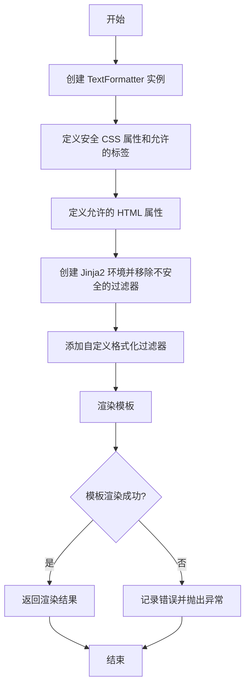
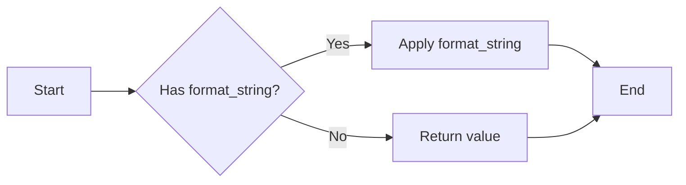
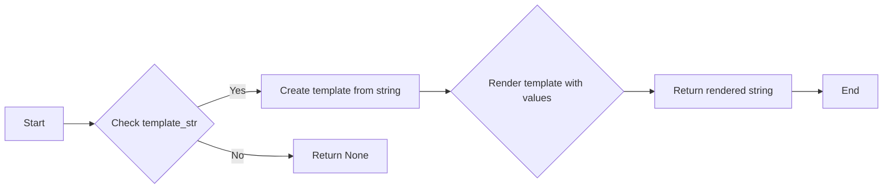
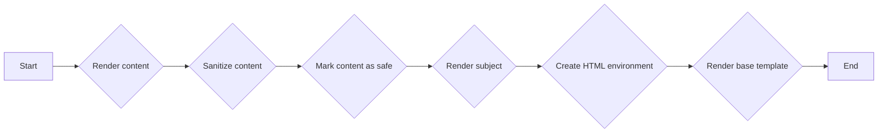

# `.\AutoGPT\autogpt_platform\backend\backend\util\text.py` 详细设计文档

The code provides a TextFormatter class for safely rendering HTML templates with Jinja2, applying CSS and HTML sanitization to prevent XSS attacks.

## 整体流程



## 类结构

```
TextFormatter (类)
```

## 全局变量及字段


### `logger`
    
Logger instance used for logging messages.

类型：`logging.Logger`
    


### `allowed_css_properties`
    
List of allowed CSS properties for sanitization.

类型：`list[str]`
    


### `allowed_tags`
    
List of allowed HTML tags for sanitization.

类型：`list[str]`
    


### `allowed_attributes`
    
Dictionary of allowed attributes for specific HTML tags.

类型：`dict[str, list[str]]`
    


### `TextFormatter.env`
    
Jinja2 environment with restricted access for template rendering.

类型：`SandboxedEnvironment`
    


### `TextFormatter.css_sanitizer`
    
CSS sanitizer to filter out unsafe CSS properties.

类型：`CSSSanitizer`
    


### `TextFormatter.allowed_tags`
    
List of allowed HTML tags for sanitization within the environment.

类型：`list[str]`
    


### `TextFormatter.allowed_attributes`
    
Dictionary of allowed attributes for specific HTML tags within the environment.

类型：`dict[str, list[str]]`
    
    

## 全局函数及方法


### format_filter_for_jinja2

This function is a Jinja2 filter that formats a given value according to a specified format string, if provided. If no format string is given, it returns the value as is.

参数：

- `value`：`float`，The value to be formatted.
- `format_string`：`str`，Optional. The format string to use for formatting the value. If not provided, the value is returned as is.

返回值：`str`，The formatted value or the original value if no format string is provided.

#### 流程图



#### 带注释源码

```python
def format_filter_for_jinja2(value, format_string=None):
    # Check if a format string is provided
    if format_string:
        # Apply the format string to the value
        return format_string % float(value)
    # Return the value as is if no format string is provided
    return value
```


### TextFormatter.__init__

This method initializes the TextFormatter class, setting up the Jinja2 environment, removing unsafe filters, adding a custom filter, and configuring CSS and HTML sanitization.

参数：

- `autoescape`：`bool`，Determines whether the Jinja2 environment should escape all variables by default. Defaults to `True`.

返回值：无

#### 流程图

```mermaid
graph LR
A[Start] --> B{Initialize Jinja2 Environment}
B --> C[Set Loader to BaseLoader]
B --> D[Set Autoescape to autoescape]
B --> E{Clear Global Filters}
E --> F{Remove Unsafe Filters}
F --> G{Add Custom Filter "format"}
G --> H[Define Allowed CSS Properties]
H --> I[Create CSSSanitizer]
I --> J[Define Allowed Tags]
J --> K[Define Allowed Attributes]
K --> L[Initialize Class Variables]
L --> M[End]
```

#### 带注释源码

```python
def __init__(self, autoescape: bool = True):
    self.env = SandboxedEnvironment(loader=BaseLoader(), autoescape=autoescape)
    self.env.globals.clear()

    # Instead of clearing all filters, just remove potentially unsafe ones
    unsafe_filters = ["pprint", "tojson", "urlize", "xmlattr"]
    for f in unsafe_filters:
        if f in self.env.filters:
            del self.env.filters[f]

    self.env.filters["format"] = format_filter_for_jinja2

    # Define allowed CSS properties (sorted alphabetically, if you add more)
    allowed_css_properties = [
        "background-color",
        "border",
        "border-bottom",
        "border-color",
        "border-left",
        "border-radius",
        "border-right",
        "border-style",
        "border-top",
        "border-width",
        "bottom",
        "box-shadow",
        "clear",
        "color",
        "display",
        "float",
        "font-family",
        "font-size",
        "font-weight",
        "height",
        "left",
        "letter-spacing",
        "line-height",
        "margin-bottom",
        "margin-left",
        "margin-right",
        "margin-top",
        "padding",
        "position",
        "right",
        "text-align",
        "text-decoration",
        "text-shadow",
        "text-transform",
        "top",
        "width",
    ]

    self.css_sanitizer = CSSSanitizer(allowed_css_properties=allowed_css_properties)

    # Define allowed tags (sorted alphabetically, if you add more)
    self.allowed_tags = [
        "a",
        "b",
        "br",
        "div",
        "em",
        "h1",
        "h2",
        "h3",
        "h4",
        "h5",
        "i",
        "img",
        "li",
        "p",
        "span",
        "strong",
        "u",
        "ul",
    ]

    # Define allowed attributes to be used on specific tags
    self.allowed_attributes = {
        "*": ["class", "style"],
        "a": ["href"],
        "img": ["src"],
    }
```


### TextFormatter.format_string

This function is responsible for rendering a Jinja2 template with provided values and applying necessary sanitization to the content.

参数：

- `template_str`: `str`，The Jinja2 template string to be rendered.
- `values`: `dict`，Optional dictionary of values to be passed to the template. Defaults to an empty dictionary.
- `**kwargs`: `dict`，Additional keyword arguments that can be passed to the template.

返回值：`str`，The rendered template string with the provided values.

#### 流程图



#### 带注释源码

```python
def format_string(self, template_str: str, values=None, **kwargs) -> str:
    """Regular template rendering with escaping"""
    try:
        template = self.env.from_string(template_str)
        return template.render(values or {}, **kwargs)
    except TemplateError as e:
        raise ValueError(e) from e
```


### `TextFormatter.format_email`

This function is responsible for rendering email templates by combining subject, base, and content templates, and ensuring that the content is sanitized and marked as safe for HTML rendering.

参数：

- `subject_template`：`str`，The template for the email subject.
- `base_template`：`str`，The base template for the email, which includes placeholders for the message, title, and unsubscribe link.
- `content_template`：`str`，The template for the email content.
- `data`：`dict`，Optional data to be passed to the templates.
- `**kwargs`：`dict`，Additional keyword arguments to be passed to the templates.

返回值：`tuple[str, str]`，A tuple containing the rendered subject and base template.

#### 流程图



#### 带注释源码

```python
def format_email(
    self,
    subject_template: str,
    base_template: str,
    content_template: str,
    data=None,
    **kwargs,
) -> tuple[str, str]:
    """
    Special handling for email templates where content needs to be rendered as HTML
    """
    # First render the content template
    content = self.format_string(content_template, data, **kwargs)

    # Clean the HTML + CSS but don't escape it
    clean_content = bleach.clean(
        content,
        tags=self.allowed_tags,
        attributes=self.allowed_attributes,
        css_sanitizer=self.css_sanitizer,
        strip=True,
    )

    # Mark the cleaned HTML as safe using Markup
    safe_content = Markup(clean_content)

    # Render subject
    rendered_subject_template = self.format_string(subject_template, data, **kwargs)

    # Create new env just for HTML template
    html_env = SandboxedEnvironment(loader=BaseLoader(), autoescape=True)
    html_env.filters["safe"] = lambda x: (
        x if isinstance(x, Markup) else Markup(str(x))
    )

    # Render base template with the safe content
    template = html_env.from_string(base_template)
    rendered_base_template = template.render(
        data={
            "message": safe_content,
            "title": rendered_subject_template,
            "unsubscribe_link": kwargs.get("unsubscribe_link", ""),
        }
    )

    return rendered_subject_template, rendered_base_template
```


## 关键组件


### 张量索引与惰性加载

用于在处理大型数据集时，延迟加载和索引数据，以优化内存使用和性能。

### 反量化支持

提供对反量化操作的支持，允许在量化过程中进行逆量化，以便在需要时恢复原始数据。

### 量化策略

定义了量化策略，用于在模型训练和推理过程中将浮点数转换为低精度表示，以减少模型大小和提高推理速度。


## 问题及建议


### 已知问题

-   **全局变量和函数的复用性低**：`TextFormatter` 类中的 `format_string` 和 `format_email` 方法是专门为特定用途设计的，没有提供足够的灵活性来适应不同的场景。这可能导致代码重复和难以维护。
-   **CSS 和 HTML 过滤器配置硬编码**：`allowed_css_properties` 和 `allowed_tags` 以及 `allowed_attributes` 是硬编码在类中的，这限制了配置的灵活性，并且增加了维护成本。
-   **异常处理**：`format_string` 方法中捕获 `TemplateError` 并重新抛出为 `ValueError`，这可能会掩盖其他类型的异常，使得调试更加困难。

### 优化建议

-   **增加配置选项**：允许用户在创建 `TextFormatter` 实例时自定义允许的 CSS 属性、HTML 标签和属性，以提高代码的灵活性和可配置性。
-   **使用工厂模式**：创建一个工厂类来生成 `TextFormatter` 实例，这样可以更容易地定制实例的配置，并且可以复用配置。
-   **改进异常处理**：在捕获异常时，应该记录更多的上下文信息，以便于调试。同时，可以考虑抛出更具体的异常类型，而不是通用的 `ValueError`。
-   **代码重构**：将 `format_string` 和 `format_email` 方法中的重复逻辑提取出来，创建辅助函数或类，以减少代码重复并提高可读性。
-   **性能优化**：如果模板渲染是性能瓶颈，可以考虑缓存模板实例或使用更快的模板引擎。


## 其它


### 设计目标与约束

- 设计目标：
  - 提供一个安全的文本格式化工具，用于生成HTML和电子邮件模板。
  - 确保所有输出都是安全的，防止跨站脚本攻击（XSS）。
  - 提供灵活的配置选项，允许用户自定义允许的CSS属性和HTML标签。
- 约束：
  - 必须使用`bleach`库进行HTML和CSS清理。
  - 必须使用`jinja2`库进行模板渲染。
  - 必须遵守Python 3.x的语法和标准库。

### 错误处理与异常设计

- 错误处理：
  - 使用`try-except`块捕获`TemplateError`异常，并将其转换为`ValueError`。
  - 对于其他潜在的错误，应记录错误信息并抛出异常。
- 异常设计：
  - 定义自定义异常类，以提供更具体的错误信息。
  - 异常类应遵循PEP 8命名约定。

### 数据流与状态机

- 数据流：
  - 输入：模板字符串、数据字典、配置参数。
  - 处理：使用`bleach`清理HTML和CSS，使用`jinja2`渲染模板。
  - 输出：格式化后的字符串。
- 状态机：
  - 初始化：创建`TextFormatter`实例。
  - 格式化字符串：调用`format_string`方法。
  - 格式化电子邮件：调用`format_email`方法。

### 外部依赖与接口契约

- 外部依赖：
  - `bleach`：用于清理HTML和CSS。
  - `jinja2`：用于模板渲染。
  - `logging`：用于记录日志。
- 接口契约：
  - `TextFormatter`类应提供`format_string`和`format_email`方法。
  - `format_string`方法应接受模板字符串和数据字典作为参数。
  - `format_email`方法应接受主题模板、基本模板、内容模板、数据和配置参数作为参数。

    