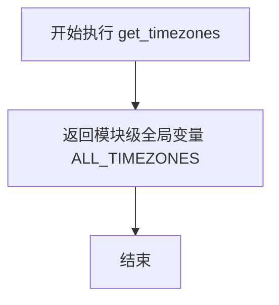
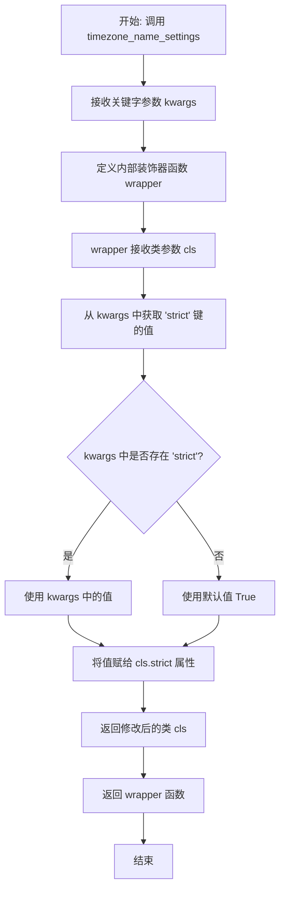
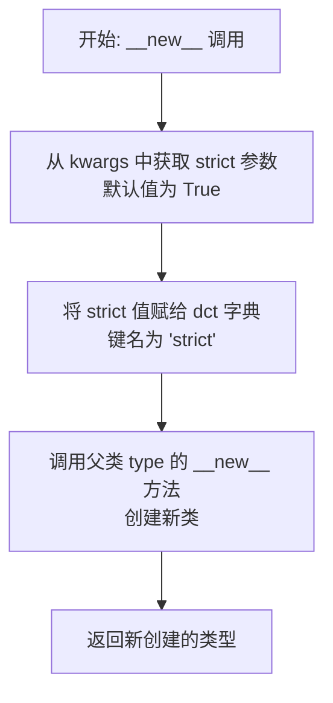
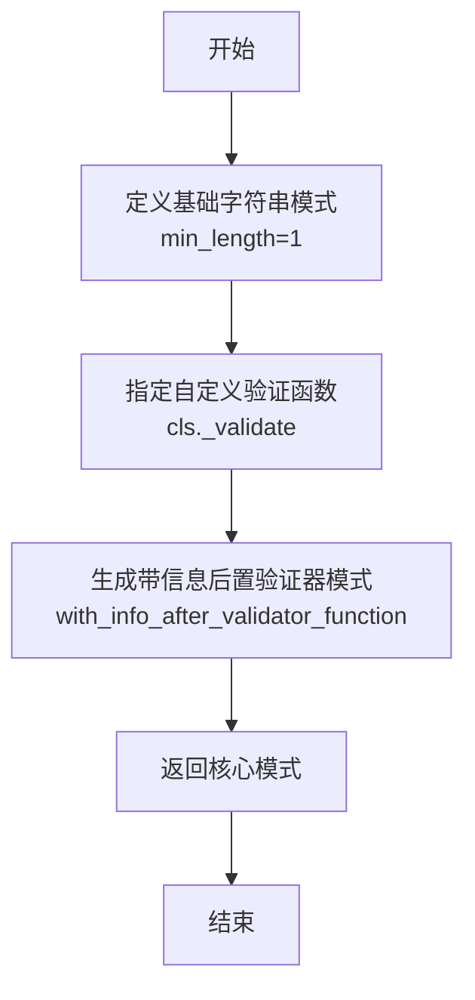
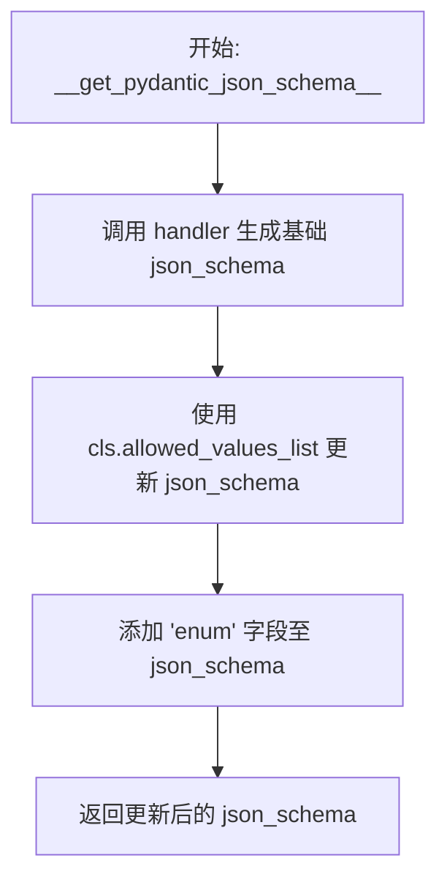

# `.\AutoGPT\autogpt_platform\backend\backend\util\timezone_name.py` 详细设计文档

该代码实现了一个基于 Pydantic 的自定义字符串类型 `TimeZoneName`，利用 pytz 库提供对 IANA 时区名称的验证和序列化功能。它支持严格和非严格（忽略大小写和空格）验证模式，并集成了 Pydantic v2 的核心模式和 JSON Schema 生成机制，以确保时区数据在不同环境下的一致性。

## 整体流程

```mermaid
graph TD
    A[开始: 模块加载] --> B[调用 get_timezones 初始化 ALL_TIMEZONES 缓存]
    B --> C[类初始化 TimeZoneName]
    C --> D[定义 allowed_values 及相关映射]
    D --> E[接收输入验证请求 _validate]
    E --> F{输入值在 allowed_values 中?}
    F -- 是 --> G[返回 TimeZoneName 实例]
    F -- 否 --> H{strict 模式开启?}
    H -- 是 --> I[抛出 PydanticCustomError]
    H -- 否 --> J[处理输入: strip() 并 upper()]
    J --> K{处理后的值在 allowed_values_upper_to_correct 中?}
    K -- 是 --> L[返回规范化的 TimeZoneName 实例]
    K -- 否 --> I
```

## 类结构

```
str
└── TimeZoneName (自定义时区类型)

type (Metaclass)
└── TimeZoneNameSettings (元类, 用于配置 strict 参数)
```

## 全局变量及字段


### `ALL_TIMEZONES`
    
A module-level cache containing all valid timezone strings retrieved from the pytz library to ensure consistency and avoid repeated computation.

类型：`set[str]`
    


### `TimeZoneName.__slots__`
    
An empty list defined to prevent the creation of instance dictionaries, thereby saving memory.

类型：`list[str]`
    


### `TimeZoneName.allowed_values`
    
A set of all valid timezone identifier strings obtained from pytz, used for validation.

类型：`set[str]`
    


### `TimeZoneName.allowed_values_list`
    
A sorted list of valid timezone identifiers, primarily used for generating JSON Schema enums.

类型：`list[str]`
    


### `TimeZoneName.allowed_values_upper_to_correct`
    
A mapping dictionary that associates uppercase versions of timezone names to their correct casing, facilitating case-insensitive validation.

类型：`dict[str, str]`
    


### `TimeZoneName.strict`
    
A boolean flag indicating whether the validation should strictly enforce exact case matching for timezone names.

类型：`bool`
    
    

## 全局函数及方法


### `get_timezones`

从全局缓存中获取所有有效的 IANA 时区名称集合，以确保在不同环境下数据的一致性。

参数：

- 无

返回值：`set[str]`，包含所有有效时区名称（例如 'UTC', 'America/New_York'）的字符串集合。

#### 流程图



#### 带注释源码

```python
def get_timezones() -> set[str]:
    """Get timezones from pytz for consistency across all environments."""
    # Return cached timezone set
    # 返回缓存的时区集合，该集合在模块加载时通过 pytz.all_timezones 初始化
    return ALL_TIMEZONES
```


### `timezone_name_settings`

`timezone_name_settings` 是一个类装饰器工厂函数，用于动态配置 `TimeZoneName` 类的行为。它允许用户在定义类时传入配置参数（如 `strict`），并返回一个装饰器，该装饰器会将这些配置应用到目标类上，从而控制时区名称验证的严格模式。

参数：

-  `**kwargs`：`Any`，用于接收配置参数的可变关键字参数集合。目前主要用于传递 `strict` 布尔值，决定是否进行严格的时区名称匹配（默认为 True）。

返回值：`Callable[[type[TimeZoneName]], type[TimeZoneName]]`，返回一个类装饰器函数（wrapper），该函数接收一个类对象，设置其属性后返回该类对象。

#### 流程图



#### 带注释源码

```python
def timezone_name_settings(
    **kwargs: Any,
) -> Callable[[type[TimeZoneName]], type[TimeZoneName]]:
    # 定义内部装饰器函数 wrapper，它接收一个类作为参数
    def wrapper(cls: type[TimeZoneName]) -> type[TimeZoneName]:
        # 从传入的关键字参数 kwargs 中获取 'strict' 的值
        # 如果未提供 'strict'，则默认设置为 True
        # 将该值赋值给传入类的 strict 类属性
        cls.strict = kwargs.get("strict", True)
        
        # 返回配置后的类
        return cls

    # 返回定义好的装饰器函数
    return wrapper
```


### `TimeZoneNameSettings.__new__`

此方法作为元类的构造函数，用于在创建类实例（如 `TimeZoneName`）时拦截并修改类的属性字典。它主要处理 `strict` 参数，将其从类定义的关键字参数中提取并注入到类的属性字典中，从而控制类的验证行为。

参数：

-  `cls`：`type`，元类本身，通常是 `TimeZoneNameSettings`。
-  `name`：`str`，正在创建的类的名称。
-  `bases`：`tuple[type, ...]`，正在创建的类的基类元组。
-  `dct`：`dict[str, Any]`，类的属性字典，包含类中定义的方法和字段。
-  `**kwargs`：`Any`，类定义时传入的额外关键字参数。

返回值：`type[TimeZoneName]`，新创建的类对象。

#### 流程图



#### 带注释源码

```python
    def __new__(
        cls, name: str, bases: tuple[type, ...], dct: dict[str, Any], **kwargs: Any
    ) -> type[TimeZoneName]:
        # 从 kwargs 中提取 'strict' 参数，如果未提供则默认为 True
        # 将该参数值存入类的属性字典 dct 中，这样创建的类就会拥有 strict 属性
        dct["strict"] = kwargs.pop("strict", True)
        
        # 调用父类（即 type）的 __new__ 方法来实际创建类
        # 使用 cast 进行类型提示转换，表明返回的是 TimeZoneName 类型的类
        return cast("type[TimeZoneName]", super().__new__(cls, name, bases, dct))
```


### `TimeZoneNameSettings.__init__`

该方法是元类 `TimeZoneNameSettings` 的初始化函数，用于在类对象创建后配置其属性。它调用父类的初始化方法，并从传入的关键字参数中获取 `strict` 配置项，将其赋值给类的类属性，以控制后续验证时的严格模式。

参数：

-  `cls`：`type[TimeZoneName]`，当前正在初始化的类对象（即元类的实例）。
-  `name`：`str`，类的名称。
-  `bases`：`tuple[type, ...]`，基类元组。
-  `dct`：`dict[str, Any]`，类的属性和方法字典。
-  `**kwargs`：`Any`，额外的关键字参数，通常包含 `strict` 布尔值配置。

返回值：`None`，无返回值。

#### 流程图

```mermaid
graph TD
    A[Start __init__] --> B[Call super().__init__ name bases dct]
    B --> C[Get value of 'strict' from kwargs]
    C --> D{Does 'strict' exist in kwargs?}
    D -- Yes --> E[Use value from kwargs]
    D -- No --> F[Default to True]
    E --> G[Assign value to cls.strict]
    F --> G
    G --> H[End]
```

#### 带注释源码

```python
def __init__(
    cls, name: str, bases: tuple[type, ...], dct: dict[str, Any], **kwargs: Any
) -> None:
    # 调用父类 type 的 __init__ 方法完成基本的类初始化
    super().__init__(name, bases, dct)
    
    # 从关键字参数中获取 'strict' 键的值，如果不存在则默认为 True
    # 这个值决定了验证时是否区分大小写（即是否严格执行时区名称匹配）
    cls.strict = kwargs.get("strict", True)
```


### `TimeZoneName._validate`

这是一个类方法，用于验证输入的字符串是否为有效的 `pytz` 时区名称。该方法根据类配置的 `strict` 属性执行不同的验证逻辑：如果是严格模式，则要求输入必须完全匹配已知时区列表；如果非严格模式，则允许忽略大小写和首尾空格，并自动修正为标准格式。若验证失败，则抛出 Pydantic 自定义错误。

参数：

- `cls`：`type[TimeZoneName]`，类本身，用于访问类级别的配置属性（如 `allowed_values`、`strict` 等）。
- `__input_value`：`str`，待验证的原始时区字符串输入。
- `_`：`core_schema.ValidationInfo`，Pydantic 核心提供的验证上下文信息（包含字段名等），本方法中未实际使用。

返回值：`TimeZoneName`，验证通过后的 `TimeZoneName` 实例对象，内部存储符合标准的时区名字符串。

#### 流程图

```mermaid
flowchart TD
    A[开始: _validate] --> B{__input_value 是否在 allowed_values 中?}
    B -- 是 (完全匹配) --> C[返回 cls<br/>__input_value]
    B -- 否 (不完全匹配) --> D{是否为严格模式? <br> cls.strict}
    D -- 是 --> E[抛出 PydanticCustomError<br>Invalid timezone name]
    D -- 否 --> F[预处理: 去除首尾空格并转大写 <br> upper_value = __input_value.strip().upper()]
    F --> G{upper_value 是否在 <br> allowed_values_upper_to_correct 映射中?}
    G -- 是 (找到映射) --> H[获取标准格式名称 <br> allowed_values_upper_to_correct[upper_value]]
    H --> I[返回 cls<br>标准格式名称]
    G -- 否 (未找到匹配) --> E
```

#### 带注释源码

```python
    @classmethod
    def _validate(
        cls, __input_value: str, _: core_schema.ValidationInfo
    ) -> TimeZoneName:
        # 步骤 1: 检查输入值是否直接存在于已知的允许值集合中（严格精确匹配）
        if __input_value not in cls.allowed_values:
            # 步骤 2: 如果未找到匹配项，检查当前是否为非严格模式
            if not cls.strict:
                # 步骤 3: 对输入进行预处理：去除首尾空格并转换为大写
                upper_value = __input_value.strip().upper()
                # 步骤 4: 检查处理后的值是否存在于大小写不敏感的映射字典中
                if upper_value in cls.allowed_values_upper_to_correct:
                    # 步骤 5: 如果映射存在，返回使用原始正确大小写实例化的 TimeZoneName 对象
                    return cls(cls.allowed_values_upper_to_correct[upper_value])
            # 步骤 6: 如果是严格模式，或在非严格模式下无法修正输入，则抛出验证错误
            raise PydanticCustomError("TimeZoneName", "Invalid timezone name.")
        # 步骤 7: 如果输入值直接存在于允许值集合中，返回其实例
        return cls(__input_value)
```


### `TimeZoneName.__get_pydantic_core_schema__`

该方法用于生成 Pydantic 的核心模式（Core Schema），定义了 `TimeZoneName` 类型的验证逻辑。它指定输入首先应通过字符串类型及最小长度校验，随后必须通过自定义的 `_validate` 方法进行时区有效性验证。

参数：

- `_`：`type[Any]`，源类型参数，在此实现中未使用。
- `__`：`GetCoreSchemaHandler`，Pydantic 核心模式处理程序，在此实现中未使用。

返回值：`core_schema.AfterValidatorFunctionSchema`，包含验证逻辑的 Pydantic 核心模式对象。

#### 流程图



#### 带注释源码

```python
    @classmethod
    def __get_pydantic_core_schema__(
        cls, _: type[Any], __: GetCoreSchemaHandler
    ) -> core_schema.AfterValidatorFunctionSchema:
        # 使用 core_schema.with_info_after_validator_function 构建验证模式
        # cls._validate: 自定义的验证函数，将在基础验证通过后执行
        # core_schema.str_schema(min_length=1): 基础模式，要求输入必须是字符串且长度至少为1
        return core_schema.with_info_after_validator_function(
            cls._validate,
            core_schema.str_schema(min_length=1),
        )
```


### `TimeZoneName.__get_pydantic_json_schema__`

该方法用于生成 Pydantic 模型的 JSON Schema 定义，它会在基础 schema 上增加一个枚举（enum）约束，将其限制为合法的 IANA 时区名称列表。

参数：

- `schema`：`core_schema.CoreSchema`，Pydantic 的核心 schema 对象，用于描述模型的内部结构。
- `handler`：`GetJsonSchemaHandler`，一个回调处理器，用于递归地生成或获取子 schema 的 JSON Schema 定义。

返回值：`dict[str, Any]`，包含 `enum` 键及其对应的合法时区名称列表的 JSON Schema 字典。

#### 流程图



#### 带注释源码

```python
    @classmethod
    def __get_pydantic_json_schema__(
        cls, schema: core_schema.CoreSchema, handler: GetJsonSchemaHandler
    ) -> dict[str, Any]:
        # 1. 调用处理器生成默认的 JSON Schema
        json_schema = handler(schema)
        
        # 2. 更新 Schema，添加枚举约束，限定值为类中预定义的合法时区列表
        json_schema.update({"enum": cls.allowed_values_list})
        
        # 3. 返回修改后的 JSON Schema
        return json_schema
```


## 关键组件


### 时区数据缓存与管理
利用模块级缓存 `ALL_TIMEZONES` 存储 `pytz` 时区数据，并通过 `get_timezones` 函数访问，以确保在不同环境下的一致性并避免重复计算带来的性能开销。

### 动态配置策略
通过 `TimeZoneNameSettings` 元类和 `timezone_name_settings` 装饰器实现类的动态配置，允许在类创建时注入 `strict` 等验证参数，控制校验的严格程度。

### Pydantic 集成与验证层
`TimeZoneName` 类作为核心组件继承自 `str`，实现了 Pydantic 的核心钩子方法（如 `_validate`、`__get_pydantic_core_schema__`），负责执行时区名称的有效性校验及 JSON Schema 的生成。

### 大小写不敏感映射逻辑
包含 `allowed_values_upper_to_correct` 字典用于非严格模式下的验证，将输入的大写形式映射到标准时区名称，以支持更灵活的数据输入。


## 问题及建议


### 已知问题

-   **未使用的元类定义**: 代码中定义了 `TimeZoneNameSettings` 元类，但在 `TimeZoneName` 类的定义中并未通过 `metaclass` 参数使用它，而是使用了 `timezone_name_settings` 装饰器。这导致 `TimeZoneNameSettings` 成为死代码，且该元类的内部逻辑（如 `__init__` 中对 `kwargs` 的处理）存在潜在的逻辑缺陷（`kwargs` 在 `__new__` 中被修改，导致 `__init__` 获取不到传入的参数）。
-   **JSON Schema 枚举膨胀**: `__get_pydantic_json_schema__` 方法将所有有效的时区名称（通常为数百个）添加到 `enum` 列表中。这会导致生成的 OpenAPI/JSON Schema 文件体积异常巨大，严重影响文档的可读性，并可能导致某些处理 Schema 的前端工具或验证器性能下降。
-   **冗余的数据存储**: 类中同时定义了 `allowed_values` (集合)、`allowed_values_list` (列表) 和 `allowed_values_upper_to_correct` (字典) 来存储同一份数据的不同视图。这虽然优化了查询速度，但在内存中占用了不必要的额外空间。

### 优化建议

-   **清理死代码**: 删除未使用的 `TimeZoneNameSettings` 元类定义，仅保留 `timezone_name_settings` 装饰器逻辑，以简化代码结构并消除混淆。
-   **优化 JSON Schema 生成**: 建议在生成 JSON Schema 时移除 `enum` 字段，或者通过配置项允许用户选择是否包含枚举值。对于像时区这样取值范围较大的字段，通常在 Schema 中使用 `example` 提供示例，或使用 `pattern` 进行格式描述，而不是列出所有可能的值，具体的校验逻辑仍由 Pydantic 的 Core Schema 处理。
-   **采用 Pydantic V2 最佳实践**: 当前代码采用了继承 `str` 的方式，这是 Pydantic V1 时代的常见做法。在 Pydantic V2 中，建议使用 `Annotated` 结合 `BeforeValidator` 或 `AfterValidator` 来定义自定义验证类型，这可以避免继承子类带来的复杂性，并更好地支持类型检查器（如 mypy）。
-   **内存优化**: 考虑到 `allowed_values_upper_to_correct` 字典占用了额外的内存来存储所有大写键，可以评估是否真的需要不区分大小写的严格映射。如果必须支持，可以确认是否仅在需要时（如第一次验证请求时）惰性构建该映射。
-   **依赖迁移评估**: 既然文档中提到为了环境一致性强制使用 `pytz`，建议评估迁移至 Python 标准库 `zoneinfo` 的可行性。`pytz` 已不再积极维护，且在旧版本 Python 中可能存在与 `datetime` 行为不一致的情况，长期依赖可能引入技术债务。


## 其它


### 设计目标与约束

设计目标旨在提供一个可靠、一致且高效的时区名称验证机制，用于 Pydantic 模型中。核心设计目标与约束如下：

1.  **环境一致性**：强制使用 `pytz` 作为时区数据的唯一来源，避免不同操作系统或 Python 版本中 `zoneinfo` 实现的差异导致的数据不一致问题。
2.  **Pydantic V2 集成**：必须完全兼容 Pydantic V2 的核心架构，通过实现 `__get_pydantic_core_schema__` 和 `__get_pydantic_json_schema__` 方法，确保验证逻辑和 JSON Schema 生成的正确性。
3.  **性能优化**：为了防止重复计算和内存浪费，时区数据在模块加载时被缓存到全局变量 `ALL_TIMEZONES` 中。
4.  **灵活性与严格性平衡**：通过 `strict` 参数（默认为 True）控制验证行为。严格模式要求精确匹配；非严格模式允许忽略大小写和前后空格的匹配，以增强用户体验。
5.  **类型兼容**：类继承自 `str`，保证其在代码中可以像普通字符串一样使用，同时携带验证信息。

### 错误处理与异常设计

该模块主要处理验证过程中的错误，具体设计如下：

1.  **异常类型**：使用 Pydantic 的 `PydanticCustomError` 作为唯一的异常抛出类型。这确保了错误能够被 Pydantic 的错误处理机制正确捕获并以标准格式返回给客户端。
2.  **触发条件**：当输入的字符串在 `strict` 模式下不在 `allowed_values` 集合中，或在非 `strict` 模式下经过标准化处理（去空格、转大写）后仍无法匹配 `allowed_values_upper_to_correct` 映射表时，触发异常。
3.  **错误信息**：
    *   **错误类型 (type)**：`"TimeZoneName"`
    *   **错误消息 (msg)**：`"Invalid timezone name."`
4.  **容错机制**：在非严格模式下，代码内部实现了容错逻辑（自动去除首尾空格并转换为大写进行比对），但在最终无法匹配时依然会抛出异常，拒绝非法数据。

### 数据流与状态机

模块的数据处理流程清晰，没有复杂的状态机，但具有明确的验证流水线：

1.  **初始化阶段**：
    *   模块加载时，读取 `pytz.all_timezones` 并存入全局缓存 `ALL_TIMEZONES`。
    *   `TimeZoneName` 类加载时，构建允许值列表、排序列表以及大写键的映射字典 `allowed_values_upper_to_correct`。
2.  **验证阶段**：
    *   **输入**：外部输入一个字符串。
    *   **Schema 路由**：Pydantic 核心调用 `__get_pydantic_core_schema__` 生成的验证器，指向 `_validate` 类方法。
    *   **严格检查**：首先检查输入值是否直接存在于 `allowed_values` 中。如果存在且是严格模式，直接返回 `TimeZoneName` 实例。
    *   **非严格修正**：如果不在允许值中且 `strict=False`，将输入去除空格并转为大写，查询 `allowed_values_upper_to_correct` 映射表。如果找到，返回映射后的标准时区名实例。
    *   **失败**：如果上述步骤均未命中，抛出 `PydanticCustomError`。
3.  **序列化阶段**：
    *   生成 JSON Schema 时，调用 `__get_pydantic_json_schema__`，将 `allowed_values_list` 注入到 JSON Schema 的 `enum` 字段中，供前端或 API 消费者使用。

### 外部依赖与接口契约

该模块依赖于特定的第三方库，并遵守以下接口契约：

1.  **外部依赖**：
    *   **`pytz`**：作为时区数据库的基础依赖。契约要求 `pytz` 必须已安装，并提供 `all_timezones` 属性（返回字符串集合）。
    *   **`pydantic`**：数据验证框架。契约要求实现 `GetCoreSchemaHandler` 和 `GetJsonSchemaHandler` 相关协议。
    *   **`pydantic_core`**：Pydantic 的核心 Rust 实现。契约要求使用 `core_schema` 构建 `str_schema` 和 `with_info_after_validator_function`，以及使用 `PydanticCustomError` 构造错误。

2.  **接口契约**：
    *   **`TimeZoneName._validate(cls, __input_value: str, _: core_schema.ValidationInfo) -> TimeZoneName`**：核心验证契约。输入为待验证字符串和验证上下文，输出为验证通过的实例或抛出异常。
    *   **`TimeZoneName.__get_pydantic_core_schema__(...)`**：Pydantic 契约。必须返回一个符合 Pydantic Core Schema 规范的字典或对象，定义如何将 Python 类型转换为验证逻辑。
    *   **`TimeZoneName.__get_pydantic_json_schema__(...)`**：JSON Schema 契约。必须修改传入的 schema 字典，补充 `enum` 字段以反映所有可能的合法值。

### 扩展性与维护性

1.  **元类配置**：使用 `TimeZoneNameSettings` 元类和 `timezone_name_settings` 装饰器来管理类级别的配置（如 `strict` 模式）。这种设计允许在类定义时灵活配置行为，而不需要修改类内部逻辑。
2.  **静态缓存**：时区列表是静态的，但依赖于 `pytz` 的版本。如果 `pytz` 更新了时区数据库，重新加载 Python 进程会自动更新缓存，无需修改代码。这保证了维护性，但也意味着环境升级会影响行为。

    