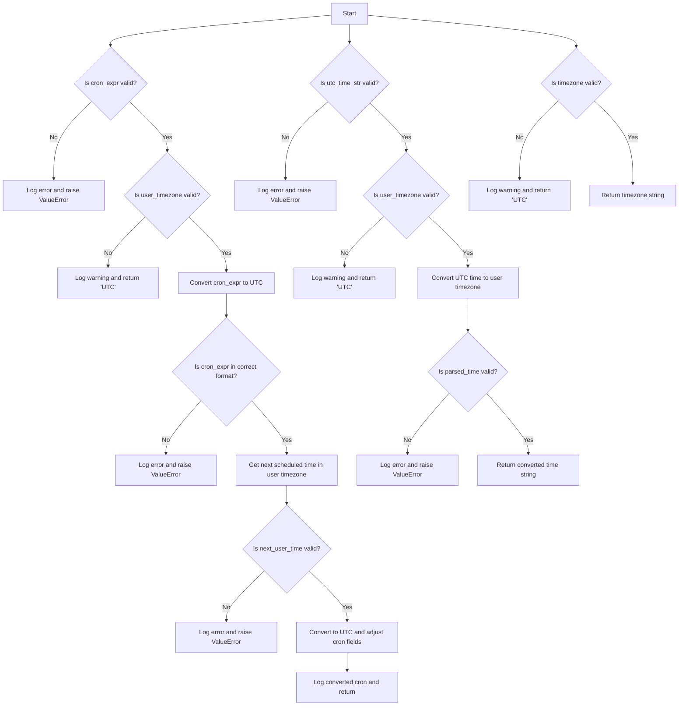
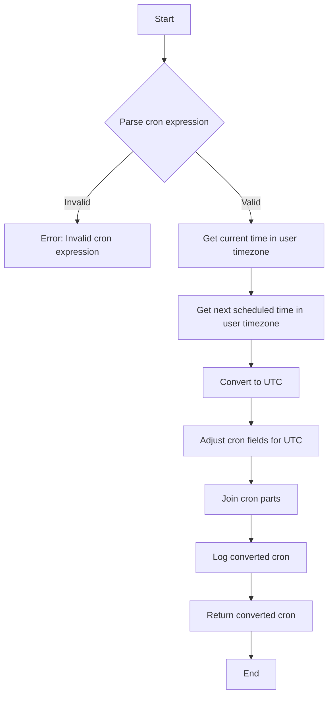
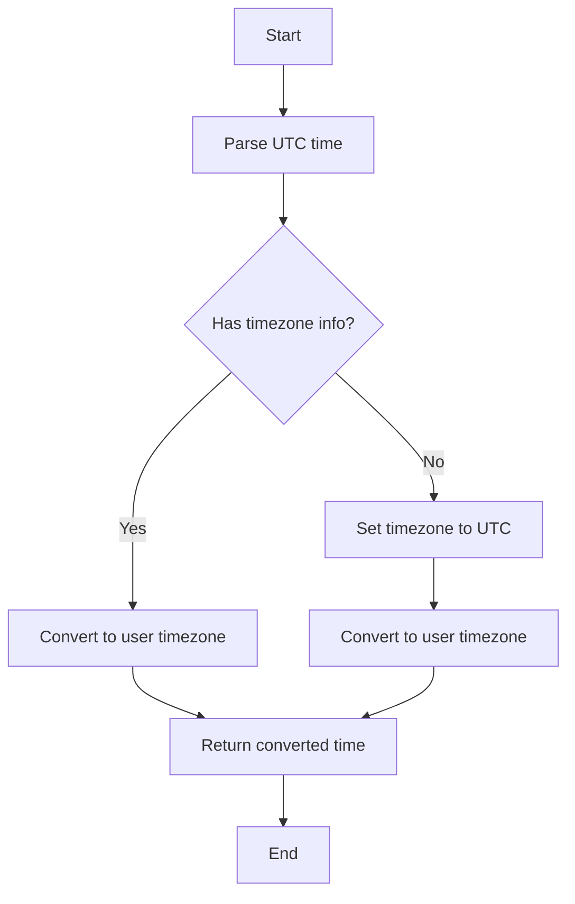
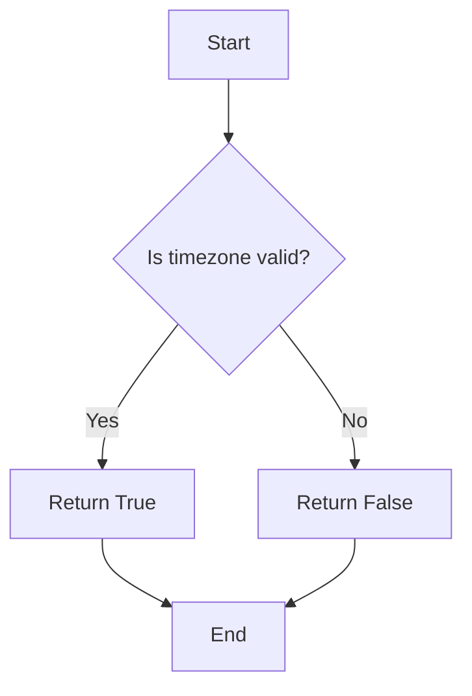
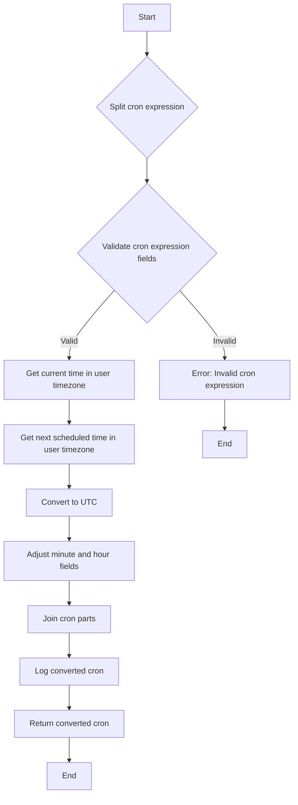
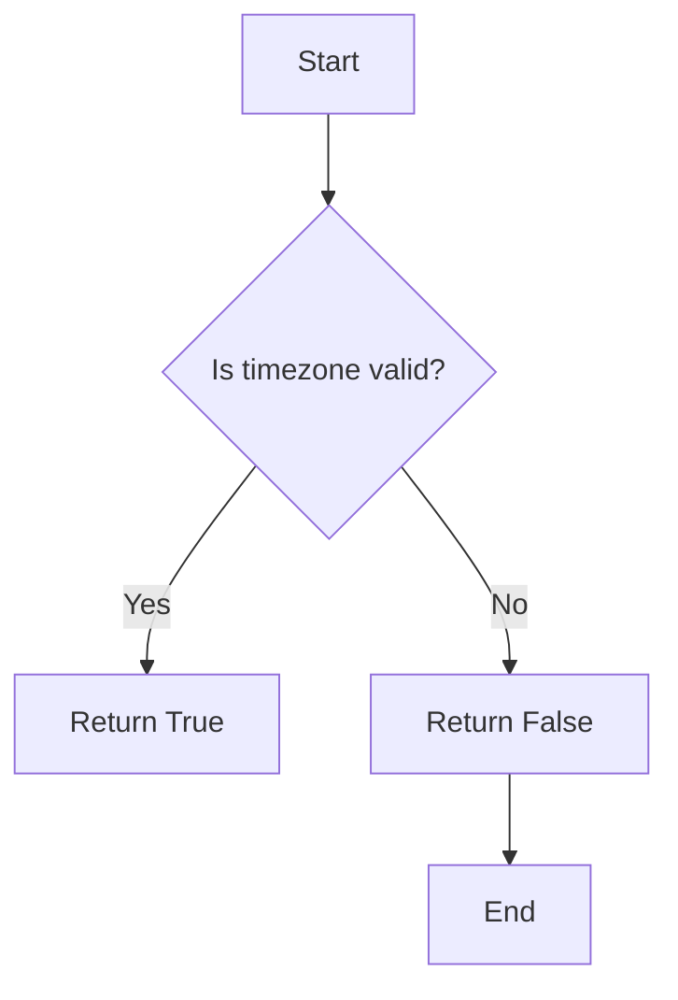

# `.\AutoGPT\autogpt_platform\backend\backend\util\timezone_utils.py` 详细设计文档

This file provides utilities for converting cron expressions and UTC datetime strings between user timezones and UTC.

## 整体流程



## 类结构

```
TimezoneConversion (主类)
├── convert_cron_to_utc
│   ├── cron_expr
│   ├── user_timezone
│   └── utc_cron
├── convert_utc_time_to_user_timezone
│   ├── utc_time_str
│   ├── user_timezone
│   └── user_time_str
├── validate_timezone
│   └── timezone
└── get_user_timezone_or_utc
   └── user_timezone
```

## 全局变量及字段


### `logger`
    
Logger instance for logging messages.

类型：`logging.Logger`
    


### `USER_TIMEZONE_NOT_SET`
    
Default value for user timezone if not set or invalid.

类型：`str`
    


### `TimezoneConversion.cron_expr`
    
Cron expression in user timezone.

类型：`str`
    


### `TimezoneConversion.user_timezone`
    
User's IANA timezone identifier.

类型：`str`
    


### `TimezoneConversion.utc_cron`
    
Cron expression adjusted for UTC execution.

类型：`str`
    


### `TimezoneConversion.utc_time_str`
    
ISO format datetime string in UTC.

类型：`str`
    


### `TimezoneConversion.user_time_str`
    
ISO format datetime string in user timezone.

类型：`str`
    


### `TimezoneConversion.timezone`
    
Timezone string to validate or convert to.

类型：`str`
    
    

## 全局函数及方法


### convert_cron_to_utc

Convert a cron expression from user timezone to UTC.

参数：

- `cron_expr`：`str`，用户时区的cron表达式
- `user_timezone`：`str`，用户的IANA时区标识符

返回值：`str`，调整后的UTC cron表达式

#### 流程图



#### 带注释源码

```python
def convert_cron_to_utc(cron_expr: str, user_timezone: str) -> str:
    """
    Convert a cron expression from user timezone to UTC.

    Args:
        cron_expr: Cron expression in user timezone
        user_timezone: User's IANA timezone identifier

    Returns:
        Cron expression adjusted for UTC execution

    Raises:
        ValueError: If timezone or cron expression is invalid
    """
    try:
        user_tz = ZoneInfo(user_timezone)
        utc_tz = ZoneInfo("UTC")

        # Split the cron expression into its five fields
        cron_fields = cron_expr.strip().split()
        if len(cron_fields) != 5:
            raise ValueError(
                "Cron expression must have 5 fields (minute hour day month weekday)"
            )

        # Get the current time in the user's timezone
        now_user = datetime.now(user_tz)

        # Get the next scheduled time in user timezone
        cron = croniter(cron_expr, now_user)
        next_user_time = cron.get_next(datetime)

        # Convert to UTC
        next_utc_time = next_user_time.astimezone(utc_tz)

        # Adjust minute and hour fields for UTC, keep day/month/weekday as in original
        utc_cron_parts = [
            str(next_utc_time.minute),
            str(next_utc_time.hour),
            cron_fields[2],  # day of month
            cron_fields[3],  # month
            cron_fields[4],  # day of week
        ]

        utc_cron = " ".join(utc_cron_parts)

        logger.debug(
            f"Converted cron '{cron_expr}' from {user_timezone} to UTC: '{utc_cron}'"
        )
        return utc_cron

    except Exception as e:
        logger.error(
            f"Failed to convert cron expression '{cron_expr}' from {user_timezone} to UTC: {e}"
        )
        raise ValueError(f"Invalid cron expression or timezone: {e}")
```


### convert_utc_time_to_user_timezone

Convert a UTC datetime string to user timezone.

参数：

- utc_time_str：`str`，ISO format datetime string in UTC
- user_timezone：`str`，User's IANA timezone identifier

返回值：`str`，ISO format datetime string in user timezone

#### 流程图



#### 带注释源码

```python
def convert_utc_time_to_user_timezone(utc_time_str: str, user_timezone: str) -> str:
    """
    Convert a UTC datetime string to user timezone.

    Args:
        utc_time_str: ISO format datetime string in UTC
        user_timezone: User's IANA timezone identifier

    Returns:
        ISO format datetime string in user timezone
    """
    try:
        # Parse the time string
        parsed_time = datetime.fromisoformat(utc_time_str.replace("Z", "+00:00"))

        user_tz = ZoneInfo(user_timezone)

        # If the time already has timezone info, convert it to user timezone
        if parsed_time.tzinfo is not None:
            # Convert to user timezone regardless of source timezone
            user_time = parsed_time.astimezone(user_tz)
            return user_time.isoformat()

        # If no timezone info, treat as UTC and convert to user timezone
        parsed_time = parsed_time.replace(tzinfo=ZoneInfo("UTC"))
        user_time = parsed_time.astimezone(user_tz)
        return user_time.isoformat()

    except Exception as e:
        logger.error(
            f"Failed to convert UTC time '{utc_time_str}' to {user_timezone}: {e}"
        )
        # Return original time if conversion fails
        return utc_time_str
```


### validate_timezone

Validate if a timezone string is a valid IANA timezone identifier.

参数：

- `timezone`：`str`，Timezone string to validate

返回值：`bool`，True if valid, False otherwise

#### 流程图



#### 带注释源码

```python
def validate_timezone(timezone: str) -> bool:
    """
    Validate if a timezone string is a valid IANA timezone identifier.

    Args:
        timezone: Timezone string to validate

    Returns:
        True if valid, False otherwise
    """
    try:
        ZoneInfo(timezone)
        return True
    except Exception:
        return False
```


### get_user_timezone_or_utc

Get user timezone or default to UTC if invalid/missing.

参数：

- user_timezone：`Optional[str]`，User's timezone preference

返回值：`str`，Valid timezone string (user's preference or UTC fallback)

#### 流程图

```mermaid
graph TD
    A[Input: user_timezone] -->|If not set or invalid| B[Return: "UTC"]
    A -->|Valid| C[Return: user_timezone]
```

#### 带注释源码

```python
def get_user_timezone_or_utc(user_timezone: Optional[str]) -> str:
    """
    Get user timezone or default to UTC if invalid/missing.

    Args:
        user_timezone: User's timezone preference

    Returns:
        Valid timezone string (user's preference or UTC fallback)
    """
    if not user_timezone or user_timezone == USER_TIMEZONE_NOT_SET:
        return "UTC"

    if validate_timezone(user_timezone):
        return user_timezone

    logger.warning(f"Invalid user timezone '{user_timezone}', falling back to UTC")
    return "UTC"
```


### convert_cron_to_utc

Convert a cron expression from user timezone to UTC.

参数：

- `cron_expr`：`str`，Cron表达式在用户时区
- `user_timezone`：`str`，用户的IANA时区标识符

返回值：`str`，调整后的UTC执行Cron表达式

#### 流程图



#### 带注释源码

```python
def convert_cron_to_utc(cron_expr: str, user_timezone: str) -> str:
    """
    Convert a cron expression from user timezone to UTC.

    Args:
        cron_expr: Cron expression in user timezone
        user_timezone: User's IANA timezone identifier

    Returns:
        Cron expression adjusted for UTC execution

    Raises:
        ValueError: If timezone or cron expression is invalid
    """
    try:
        user_tz = ZoneInfo(user_timezone)
        utc_tz = ZoneInfo("UTC")

        # Split the cron expression into its five fields
        cron_fields = cron_expr.strip().split()
        if len(cron_fields) != 5:
            raise ValueError(
                "Cron expression must have 5 fields (minute hour day month weekday)"
            )

        # Get the current time in the user's timezone
        now_user = datetime.now(user_tz)

        # Get the next scheduled time in user timezone
        cron = croniter(cron_expr, now_user)
        next_user_time = cron.get_next(datetime)

        # Convert to UTC
        next_utc_time = next_user_time.astimezone(utc_tz)

        # Adjust minute and hour fields for UTC, keep day/month/weekday as in original
        utc_cron_parts = [
            str(next_utc_time.minute),
            str(next_utc_time.hour),
            cron_fields[2],  # day of month
            cron_fields[3],  # month
            cron_fields[4],  # day of week
        ]

        utc_cron = " ".join(utc_cron_parts)

        logger.debug(
            f"Converted cron '{cron_expr}' from {user_timezone} to UTC: '{utc_cron}'"
        )
        return utc_cron

    except Exception as e:
        logger.error(
            f"Failed to convert cron expression '{cron_expr}' from {user_timezone} to UTC: {e}"
        )
        raise ValueError(f"Invalid cron expression or timezone: {e}")
```


### convert_utc_time_to_user_timezone

Convert a UTC datetime string to user timezone.

参数：

- utc_time_str：`str`，ISO format datetime string in UTC
- user_timezone：`str`，User's IANA timezone identifier

返回值：`str`，ISO format datetime string in user timezone

#### 流程图


#### 带注释源码

```python
def convert_utc_time_to_user_timezone(utc_time_str: str, user_timezone: str) -> str:
    """
    Convert a UTC datetime string to user timezone.

    Args:
        utc_time_str: ISO format datetime string in UTC
        user_timezone: User's IANA timezone identifier

    Returns:
        ISO format datetime string in user timezone
    """
    try:
        # Parse the time string
        parsed_time = datetime.fromisoformat(utc_time_str.replace("Z", "+00:00"))

        user_tz = ZoneInfo(user_timezone)

        # If the time already has timezone info, convert it to user timezone
        if parsed_time.tzinfo is not None:
            # Convert to user timezone regardless of source timezone
            user_time = parsed_time.astimezone(user_tz)
            return user_time.isoformat()

        # If no timezone info, treat as UTC and convert to user timezone
        parsed_time = parsed_time.replace(tzinfo=ZoneInfo("UTC"))
        user_time = parsed_time.astimezone(user_tz)
        return user_time.isoformat()

    except Exception as e:
        logger.error(
            f"Failed to convert UTC time '{utc_time_str}' to {user_timezone}: {e}"
        )
        # Return original time if conversion fails
        return utc_time_str
```


### validate_timezone

Validate if a timezone string is a valid IANA timezone identifier.

参数：

- `timezone`：`str`，Timezone string to validate

返回值：`bool`，True if valid, False otherwise

#### 流程图



#### 带注释源码

```python
def validate_timezone(timezone: str) -> bool:
    """
    Validate if a timezone string is a valid IANA timezone identifier.

    Args:
        timezone: Timezone string to validate

    Returns:
        True if valid, False otherwise
    """
    try:
        ZoneInfo(timezone)
        return True
    except Exception:
        return False
```


### `get_user_timezone_or_utc`

Get user timezone or default to UTC if invalid/missing.

参数：

- `user_timezone`：`Optional[str]`，User's timezone preference

返回值：`str`，Valid timezone string (user's preference or UTC fallback)

#### 流程图

```mermaid
graph TD
    A[Start] --> B{Is user_timezone valid?}
    B -- Yes --> C[Return user_timezone]
    B -- No --> D[Is user_timezone set?]
    D -- Yes --> E[Return "UTC"]
    D -- No --> F[Return "UTC"]
    C --> G[End]
    E --> G
    F --> G
```

#### 带注释源码

```python
def get_user_timezone_or_utc(user_timezone: Optional[str]) -> str:
    """
    Get user timezone or default to UTC if invalid/missing.

    Args:
        user_timezone: User's timezone preference

    Returns:
        Valid timezone string (user's preference or UTC fallback)
    """
    if not user_timezone or user_timezone == USER_TIMEZONE_NOT_SET:
        return "UTC"

    if validate_timezone(user_timezone):
        return user_timezone

    logger.warning(f"Invalid user timezone '{user_timezone}', falling back to UTC")
    return "UTC"
```


## 关键组件


### 张量索引与惰性加载

张量索引与惰性加载是处理数据时的一种优化技术，它允许在需要时才计算或访问数据，从而减少内存消耗和提高性能。

### 反量化支持

反量化支持是指系统对量化操作的反向操作的支持，允许在量化后的模型上进行反向传播，以便在训练过程中调整参数。

### 量化策略

量化策略是指将浮点数数据转换为低精度整数表示的方法，以减少模型大小和提高推理速度。常见的量化策略包括全局量化、通道量化、层量化等。


## 问题及建议


### 已知问题

-   **Cron表达式转换的简化处理**：代码中提到，该转换仅调整分钟和小时字段，对于具有特定日/月/星期模式的高级cron表达式可能不会准确转换。这可能导致在特定日期或月份中，转换的时间可能不准确。
-   **异常处理**：异常处理主要集中在日志记录和抛出`ValueError`，但没有提供用户友好的错误消息或错误恢复机制。
-   **时间戳处理**：在`convert_utc_time_to_user_timezone`函数中，如果传入的时间戳已经包含时区信息，代码会将其转换为用户时区。然而，如果时间戳包含错误的时区信息，这可能导致不正确的结果。

### 优化建议

-   **增强Cron表达式转换的准确性**：考虑实现更复杂的转换逻辑，以处理具有特定日/月/星期模式的高级cron表达式。
-   **改进异常处理**：提供更详细的错误消息，并考虑实现错误恢复机制，例如重试或使用默认值。
-   **处理时间戳中的错误时区信息**：在将时间戳转换为用户时区之前，验证时间戳中的时区信息是否有效，如果无效，则抛出异常或使用默认时区。
-   **代码重用**：考虑将时间转换逻辑封装到单独的类或模块中，以提高代码的可重用性和可维护性。
-   **性能优化**：如果该代码被频繁调用，考虑缓存结果以减少重复计算，特别是对于频繁请求相同的时区转换。


## 其它


### 设计目标与约束

- **设计目标**:
  - 提供时区转换功能，以便在用户时区和UTC之间进行转换。
  - 确保转换的准确性，特别是在处理复杂的cron表达式时。
  - 提供错误处理机制，以便在输入无效时提供有用的反馈。

- **约束**:
  - 代码应尽可能简洁，避免不必要的复杂性。
  - 应遵循Python的PEP 8编码规范。
  - 代码应易于维护和扩展。

### 错误处理与异常设计

- **错误处理**:
  - 使用`try-except`块捕获可能发生的异常。
  - 对于无效的时区和cron表达式，抛出`ValueError`。
  - 记录错误信息到日志中。

- **异常设计**:
  - `ValueError`用于处理无效的输入。
  - `Exception`用于捕获所有未预料到的异常。

### 数据流与状态机

- **数据流**:
  - 输入：用户时区、cron表达式、UTC时间字符串。
  - 处理：根据输入进行时区转换。
  - 输出：转换后的时间字符串。

- **状态机**:
  - 无状态机，因为函数直接处理输入并返回输出。

### 外部依赖与接口契约

- **外部依赖**:
  - `croniter`库用于处理cron表达式。
  - `zoneinfo`库用于处理时区。

- **接口契约**:
  - `convert_cron_to_utc`函数接受cron表达式和用户时区，返回UTC cron表达式。
  - `convert_utc_time_to_user_timezone`函数接受UTC时间字符串和用户时区，返回用户时区的时间字符串。
  - `validate_timezone`函数接受时区字符串，返回布尔值表示是否有效。
  - `get_user_timezone_or_utc`函数接受用户时区偏好，返回有效的时区字符串。


    