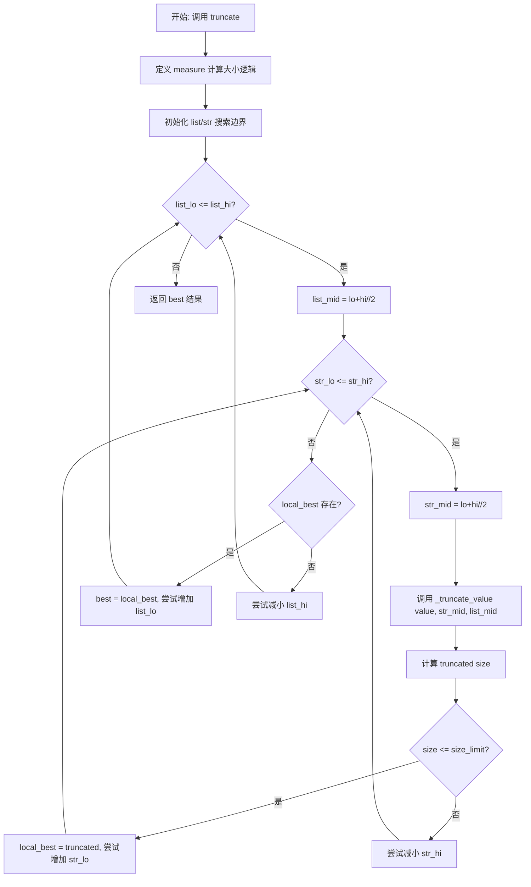
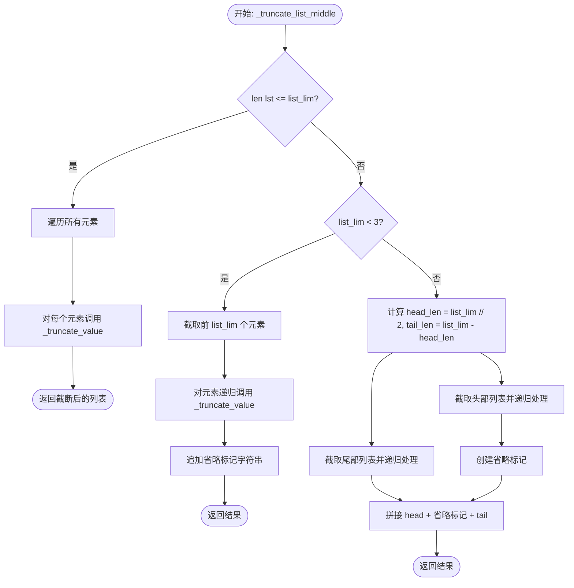
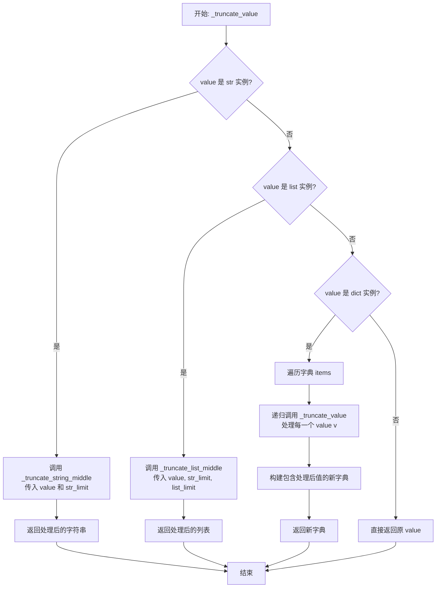
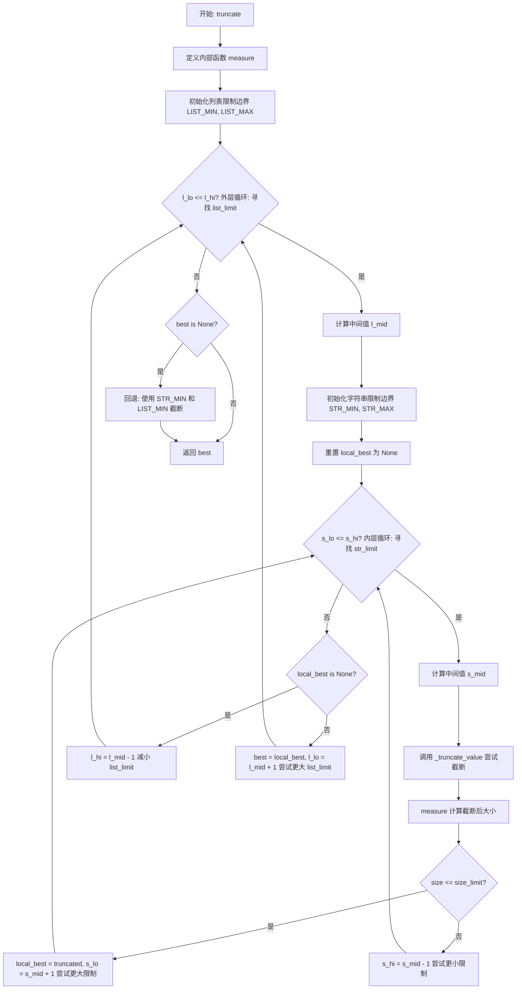

# `.\AutoGPT\autogpt_platform\backend\backend\util\truncate.py` 详细设计文档

该代码是一个Python工具模块，主要提供 `truncate` 函数，用于递归地将复杂的数据结构（如字符串、列表、字典）截断，使其字符串表示的长度不超过指定的 `size_limit`。它使用二元搜索算法来平衡字符串长度限制和列表长度限制，以尽可能保留更多信息。

## 整体流程



## 类结构

```
Global Functions
├── truncate (公共入口与二元搜索逻辑)
│   └── _truncate_value (递归分发器)
│       ├── _truncate_string_middle (字符串截断)
│       └── _truncate_list_middle (列表截断)
│           └── (递归调用) _truncate_value
```

## 全局变量及字段


    

## 全局函数及方法


### `_truncate_string_middle`

通过移除中间部分并根据指定的限制保留首尾字符来缩短字符串，同时在中间插入标记以指示省略的字符数量。

参数：

-  `value`：`str`，需要被截断的原始字符串。
-  `limit`：`int`，从原始字符串头部和尾部保留的总字符数。

返回值：`str`，截断并格式化后的字符串，包含头部、省略说明和尾部。

#### 流程图

```mermaid
flowchart TD
    Start(开始) --> CheckLen{len(value) <= limit?}
    CheckLen -- 是 --> ReturnValue(返回 value)
    CheckLen -- 否 --> CalcHead[计算 head_len = max(1, limit // 2)]
    CalcHead --> CalcTail[计算 tail_len = limit - head_len]
    CalcTail --> CalcOmitted[计算 omitted = len(value) - head_len - tail_len]
    CalcOmitted --> FormatStr[拼接字符串: 头部 + 省略标记 + 尾部]
    FormatStr --> ReturnResult(返回结果字符串)
```

#### 带注释源码

```python
def _truncate_string_middle(value: str, limit: int) -> str:
    """通过移除中间部分将 *value* 缩短至 *limit* 个字符。"""

    # 如果字符串长度小于等于限制，无需截断，直接返回
    if len(value) <= limit:
        return value

    # 计算头部保留长度：限制的一半，至少保留1个字符
    head_len = max(1, limit // 2)
    # 计算尾部保留长度：总限制减去头部保留长度，确保总数等于 limit
    tail_len = limit - head_len
    # 计算被省略掉的中间部分字符数
    omitted = len(value) - (head_len + tail_len)
    # 返回由头部、省略提示信息和尾部组成的新字符串
    return f"{value[:head_len]}… (omitted {omitted} chars)…{value[-tail_len:]}"
```


### `_truncate_list_middle`

该函数用于将输入列表截断为指定的最大长度，通过移除列表中间部分来实现。同时，它会递归地对列表中保留的元素应用截断逻辑（处理嵌套的字符串或列表），以确保不会因为内部元素过长而超出预算。

参数：

-  `lst`：`list[Any]`，待截断的原始列表，包含任意类型的元素。
-  `str_lim`：`int`，字符串截断的限制长度，递归应用于列表中的字符串元素。
-  `list_lim`：`int`，列表保留的最大元素数量限制。

返回值：`list[Any]`，截断后的列表。如果原列表长度超过限制，中间部分会被替换为包含省略信息的字符串。

#### 流程图



#### 带注释源码

```python
def _truncate_list_middle(lst: list[Any], str_lim: int, list_lim: int) -> list[Any]:
    """Return *lst* truncated to *list_lim* items, removing from the middle.

    Each retained element is itself recursively truncated via
    :func:`_truncate_value` so we don’t blow the budget with long strings nested
    inside.
    """

    # 如果列表长度未超过限制，直接处理并返回
    if len(lst) <= list_lim:
        return [_truncate_value(v, str_lim, list_lim) for v in lst]

    # 如果限制非常小（小于3），为了避免退化分割，只保留头部并加上标记
    if list_lim < 3:
        kept = [_truncate_value(v, str_lim, list_lim) for v in lst[:list_lim]]
        kept.append(f"… (omitted {len(lst) - list_lim} items)…")
        return kept

    # 计算头部和尾部保留的长度
    head_len = list_lim // 2
    tail_len = list_lim - head_len

    # 递归处理头部和尾部的元素
    head = [_truncate_value(v, str_lim, list_lim) for v in lst[:head_len]]
    tail = [_truncate_value(v, str_lim, list_lim) for v in lst[-tail_len:]]

    # 计算被省略的元素数量并构建标记
    omitted = len(lst) - (head_len + tail_len)
    sentinel = f"… (omitted {omitted} items)…"
    
    # 返回组合后的新列表
    return head + [sentinel] + tail
```


### `_truncate_value`

递归地对输入值进行截断处理，根据提供的字符串长度限制和列表元素数量限制，分别处理字符串、列表和字典类型的数据，以确保数据在可控范围内显示。

参数：

-   `value`：`Any`，需要被截断的输入值，可以是字符串、列表、字典或其他任意类型。
-   `str_limit`：`int`，字符串类型截断时的最大长度限制。
-   `list_limit`：`int`，列表类型截断时保留的最大元素数量限制。

返回值：`Any`，经过截断处理后的值，其类型取决于输入 `value` 的类型（字符串、列表或字典）。

#### 流程图



#### 带注释源码

```python
def _truncate_value(value: Any, str_limit: int, list_limit: int) -> Any:
    """Recursively truncate *value* using the current per‑type limits."""

    # 如果值是字符串类型，调用字符串截断辅助函数
    # 该函数会移除字符串中间部分以符合 str_limit 长度
    if isinstance(value, str):
        return _truncate_string_middle(value, str_limit)

    # 如果值是列表类型，调用列表截断辅助函数
    # 该函数会限制列表元素数量为 list_limit，并递归地对每个元素调用 _truncate_value
    if isinstance(value, list):
        return _truncate_list_middle(value, str_limit, list_limit)

    # 如果值是字典类型，构建一个新字典
    # 键保持不变，但值会递归地通过 _truncate_value 进行截断处理
    if isinstance(value, dict):
        return {k: _truncate_value(v, str_limit, list_limit) for k, v in value.items()}

    # 对于其他类型（如整数、浮点数、None等），直接返回原值，不做处理
    return value
```


### `truncate`

递归截断给定值，使其字符串表示形式不超过指定的 `size_limit` 字符。该函数通过二分查找算法，寻找在满足总大小限制的前提下，最大的字符串长度限制 (`str_limit`) 和列表长度限制 (`list_limit`)，以保留尽可能多的原始信息。

参数：

-  `value`：`Any`，需要截断的目标值，可以是字符串、列表、字典或其他基本类型。
-  `size_limit`：`int`，截断后结果的字符串表示形式所允许的最大长度（字符数）。

返回值：`Any`，经过递归截断处理后的值，其字符串长度通常小于或等于 `size_limit`（除非在最严格的限制下仍无法满足，则返回最小限制下的截断结果）。

#### 流程图



#### 带注释源码

```python
def truncate(value: Any, size_limit: int) -> Any:
    """
    Truncate the given value (recursively) so that its string representation
    does not exceed size_limit characters. Uses binary search to find the
    largest str_limit and list_limit that fit.
    """

    # 内部辅助函数：计算值的字符串长度
    # 如果转换为字符串失败，则回退到使用内存占用大小
    def measure(val):
        try:
            return len(str(val))
        except Exception:
            return sys.getsizeof(val)

    # 定义字符串和列表限制的搜索边界
    STR_MIN, STR_MAX = 8, 2**16
    LIST_MIN, LIST_MAX = 1, 2**12

    best = None  # 存储当前符合大小限制的最佳截断结果

    # 外层二分查找：搜索最佳的 list_limit (列表长度限制)
    l_lo, l_hi = LIST_MIN, LIST_MAX
    while l_lo <= l_hi:
        l_mid = (l_lo + l_hi) // 2

        # 内层二分查找：针对当前的 list_limit，搜索最佳的 str_limit (字符串长度限制)
        s_lo, s_hi = STR_MIN, STR_MAX
        local_best = None
        while s_lo <= s_hi:
            s_mid = (s_lo + s_hi) // 2
            # 使用当前的组合限制 (s_mid, l_mid) 对值进行递归截断
            truncated = _truncate_value(value, s_mid, l_mid)
            size = measure(truncated)
            
            if size <= size_limit:
                # 如果当前截断结果符合总大小限制，记录并尝试增大 str_limit
                local_best = truncated
                s_lo = s_mid + 1
            else:
                # 如果超过限制，尝试减小 str_limit
                s_hi = s_mid - 1

        if local_best is not None:
            # 如果在当前 list_limit 下找到了有效的 str_limit 组合，记录全局最佳结果
            # 并尝试增大 list_limit 以保留更多列表元素
            best = local_best
            l_lo = l_mid + 1
        else:
            # 如果当前 list_limit 下即使 str_limit 最小也无法满足要求，则减小 list_limit
            l_hi = l_mid - 1

    # 边界情况处理：如果没有任何限制组合能满足 size_limit，回退到最严格的截断策略
    if best is None:
        best = _truncate_value(value, STR_MIN, LIST_MIN)

    return best
```


## 关键组件


### 字符串中间截断
通过移除字符串中间部分来缩短字符串长度的辅助函数 `_truncate_string_middle`。
### 列表中间截断
通过移除列表中间元素并递归处理子元素来限制列表项数量的函数 `_truncate_list_middle`。
### 递归值截断器
函数 `_truncate_value`，根据输入值的类型（字符串、列表、字典）递归地应用相应的截断逻辑。
### 基于二分搜索的自适应截断策略
主函数 `truncate`，利用二分搜索算法寻找最优的字符串长度限制和列表数量限制，以确保截断后的数据总大小不超过指定阈值。


## 问题及建议


### 已知问题

-   **容器类型支持不全**：当前代码仅显式处理 `list` 和 `dict`，对于 `tuple`、`set` 等常见容器类型未做处理，直接返回原对象。若这些容器内包含长字符串或深层嵌套结构，将导致截断失效。
-   **缺乏循环引用保护**：`_truncate_value` 函数是递归调用的，但没有维护已访问对象的集合（如使用 `id` 追踪）。如果输入数据结构包含循环引用（例如 `a = []; a.append(a)`），代码将陷入无限递归直至引发 `RecursionError`。
-   **测量单位不一致**：在 `truncate` 函数的内部 `measure` 函数中，当 `str(val)` 调用失败时，回退使用 `sys.getsizeof(val)` 返回**字节数**。然而，二分查找的判断条件是与 `size_limit`（字符数）进行比较。字节数与字符数的不匹配会导致二分查找逻辑失效，无法找到正确的截断参数。
-   **递归深度风险**：对于极其深层嵌套的数据结构，即使没有循环引用，也可能超过 Python 的默认递归深度限制导致程序崩溃。

### 优化建议

-   **扩展类型支持**：在 `_truncate_value` 中增加对 `tuple`、`set` 以及 `collections.deque` 等类型的支持，可将它们转换为列表或元组后按列表逻辑处理，确保所有容器内的内容都能被截断。
-   **增加循环引用检测**：引入一个 `set` 用于记录正在处理的对象 ID（`id(obj)`），在进入递归前检查对象是否已处理。如果检测到循环，可以替换为一个占位符字符串（如 `"<cyclic>"`）。
-   **优化搜索算法策略**：当前的双重二分查找（网格搜索）虽然准确，但在每次迭代中都调用 `str(truncated)` 来测量长度，对于大型对象开销巨大。建议实现基于启发式的预估算法（例如根据 `size_limit` 和对象初始大小估算限制），或者减少内层循环的 `str()` 调用频率。
-   **统一测量逻辑**：修改 `measure` 函数，确保始终返回字符串长度。对于 `str()` 转换失败的对象，应返回一个固定的、较短的错误提示字符串的长度，而不是使用内存占用字节数，以保证比较维度的统一。
-   **参数配置化**：将硬编码的 `STR_MIN`, `STR_MAX`, `LIST_MIN`, `LIST_MAX` 等常量提取为函数参数或模块级配置常量，提高代码的灵活性和可测试性。


## 其它


### 设计目标与约束

**设计目标**：
该模块的主要目标是提供一个健壮的工具，用于将复杂的 Python 数据结构（如嵌套的列表、字典和长字符串）转换为一个长度受控的字符串表示形式。其核心在于“尽可能保留信息”：在满足总长度限制（`size_limit`）的前提下，通过算法自动寻找最佳的字符串截断长度和列表截断数量组合，而不是简单地截断末尾，从而保留数据的头部和尾部关键信息。

**约束条件**：
1.  **性能约束**：由于使用二分查找来确定最佳截断参数，且在每次检查中都需要递归处理数据结构并生成字符串（调用 `str()`），该算法的时间复杂度较高，不适合在对性能极度敏感或数据量巨大的高频实时处理路径中使用。
2.  **精度约束**：`size_limit` 是基于字符长度（`len(str())`）进行测量的。但在极端情况下（例如对象无法转换为字符串），会回退到使用 `sys.getsizeof`，此时“字符长度”限制将变为“内存大小”估算，可能导致最终输出字符数超过预期限制。
3.  **类型约束**：虽然支持 `typing.Any`，但核心截断逻辑仅针对 `str`、`list` 和 `dict` 类型进行了特殊处理。对于其他自定义对象，直接依赖其原生的 `__str__` 方法，不进行深度内容截断。

### 错误处理与异常设计

**异常捕获策略**：
模块采用“防御性编程”策略，防止因数据内容异常导致程序崩溃。

1.  **字符串转换容错**：
    在 `truncate` 函数内部的 `measure` 闭包中，使用了宽泛的 `try...except Exception` 块。
    *   **场景**：当输入对象包含递归引用（导致 `str()` 递归溢出）或自定义对象的 `__str__` 方法抛出异常时。
    *   **处理方式**：捕获异常后，回退使用 `sys.getsizeof(val)` 作为度量标准。这保证了算法不会崩溃，但也意味着此时的长度限制可能变得不精确。

2.  **边界情况处理**：
    *   当 `list_limit` 极小（小于 3）时，为了避免 `head` 和 `tail` 重叠或分割逻辑失效，代码强制采用仅保留 `head` 并添加省略标记的策略。
    *   如果二分查找无法找到任何满足 `size_limit` 的参数组合（即 `best` 为 `None`），代码会回退到最激进的截断策略（`STR_MIN`, `LIST_MIN`），确保总能返回一个结果，而不是抛出错误。

### 数据流与状态机

**数据流向**：
1.  **输入阶段**：原始数据对象（`value`）和总大小限制（`size_limit`）进入主函数 `truncate`。
2.  **搜索阶段（双二分查找）**：
    *   **外层循环**：遍历可能的列表长度限制（`list_limit`），范围 `[LIST_MIN, LIST_MAX]`。
    *   **内层循环**：在固定 `list_limit` 下，遍历可能的字符串长度限制（`str_limit`），范围 `[STR_MIN, STR_MAX]`。
3.  **转换阶段**：针对每一组 `(str_limit, list_limit)` 参数，调用 `_truncate_value` 对原始数据进行深度优先遍历和递归截断，生成中间结果。
4.  **测量阶段**：计算中间结果的字符串长度或内存大小，并与 `size_limit` 比较。
5.  **输出阶段**：返回满足限制的最大化信息保留结果。

**状态机逻辑（搜索算法）**：
虽然没有显式的状态机类，但算法维护了以下关键状态变量进行转换：
*   **状态变量**：`l_lo`, `l_hi`（列表搜索边界），`s_lo`, `s_hi`（字符串搜索边界），`best`（当前已知的最优解）。
*   **状态转换条件**：
    *   若 `size <= size_limit`：记录为当前最优解（`local_best` 或 `best`），并收缩搜索边界以尝试更大的限制（向右收缩）。
    *   若 `size > size_limit`：丢弃当前解，收缩搜索边界以尝试更小的限制（向左收缩）。
*   **终止态**：当 `l_lo > l_hi` 且内层搜索结束后，输出 `best`。

### 外部依赖与接口契约

**外部依赖**：
1.  **sys**：标准库模块，用于获取对象的内存大小（`sys.getsizeof`），作为字符串长度计算失败时的备选方案。
2.  **typing**：标准库模块，用于类型注解（`Any`），不涉及运行时逻辑依赖。

**接口契约**：
*   **入口函数**：`truncate(value: Any, size_limit: int) -> Any`
    *   **参数契约**：
        *   `value`：接受任意 Python 对象。
        *   `size_limit`：整数，期望的输出字符串最大长度。建议传入正整数。
    *   **返回值契约**：
        *   返回一个新的对象，其结构与输入对象类型一致（如果是字符串、列表或字典），但内容被截断或修改为占位符。
        *   **后置条件**：在正常情况下（无 `__str__` 异常），`len(str(return_value)) <= size_limit`。
*   **内部契约**：
    *   辅助函数（`_truncate_string_middle`, `_truncate_list_middle`, `_truncate_value`）假定输入类型符合预期（如 `isinstance(value, str)`），调用者需保证类型分派的正确性。

### 算法复杂度分析

**时间复杂度**：
*   设 $N$ 为对象的复杂度（节点数）。
*   二分查找的深度为 $O(\log S \times \log L)$，其中 $S$ 是字符串搜索范围大小，$L$ 是列表搜索范围大小。
*   每次查找迭代中，`_truncate_value` 需要遍历整个数据结构进行复制和转换，复杂度为 $O(N)$。
*   `str()` 转换和 `len()` 计算在最坏情况下（字符串拼接）可能接近 $O(N)$ 或 $O(M)$（$M$ 为字符数）。
*   **总体复杂度**：约为 $O(N \cdot \log S \cdot \log L \cdot C)$，其中 $C$ 为字符串生成开销。由于常数因子较大且涉及重复的序列化操作，对于巨型结构性能较慢。

**空间复杂度**：
*   每次迭代都会生成新的截断后的数据结构副本。
*   **总体复杂度**：$O(N)$，主要用于存储临时的截断结果和递归调用的栈空间（取决于数据结构的嵌套深度）。

    