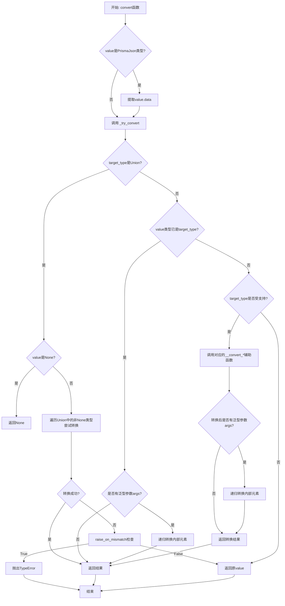
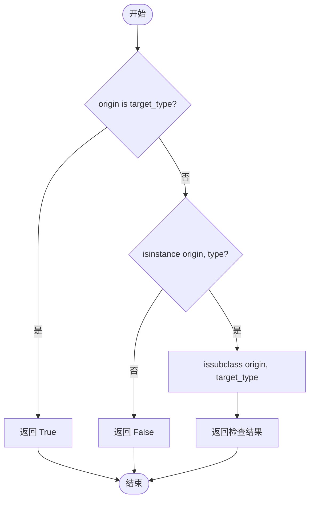
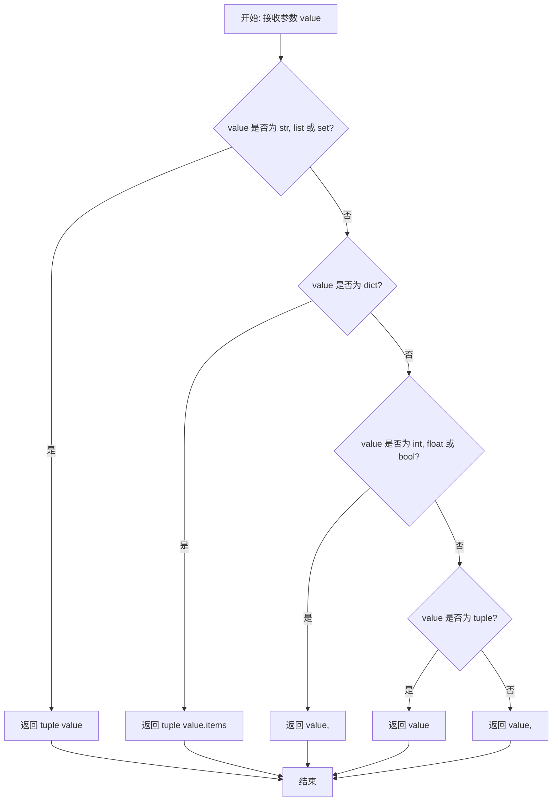
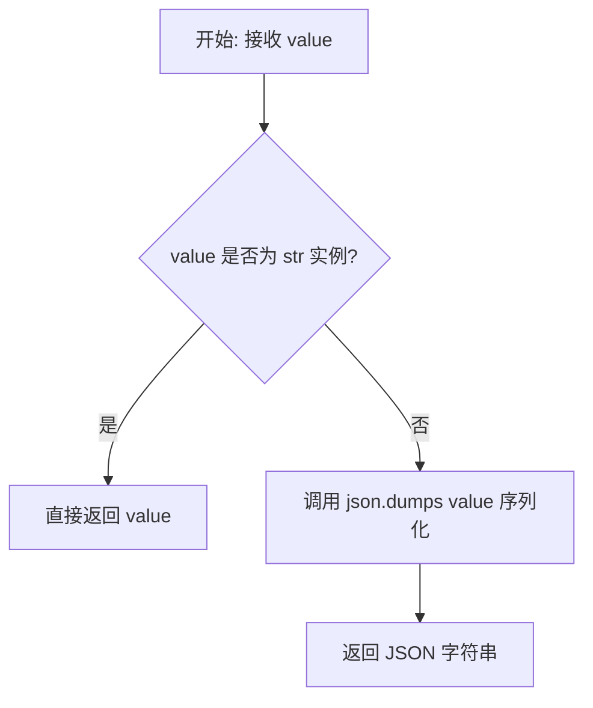
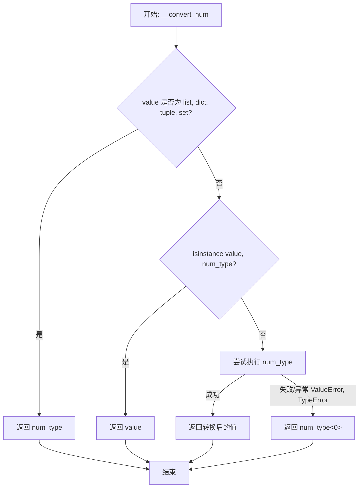
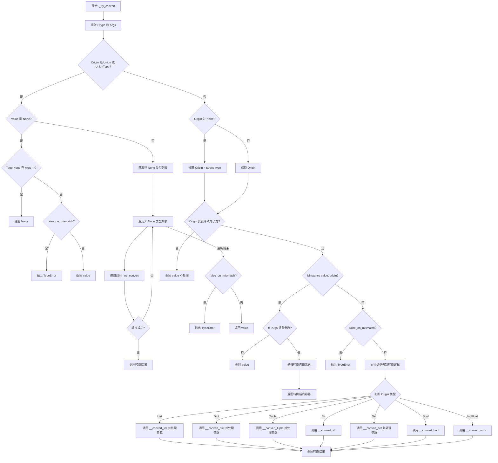
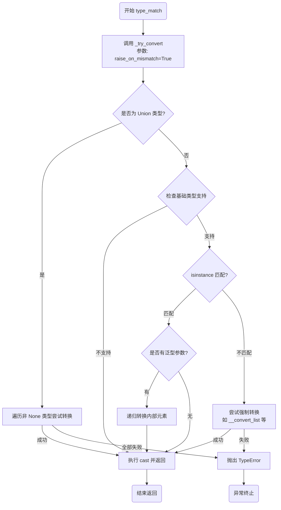
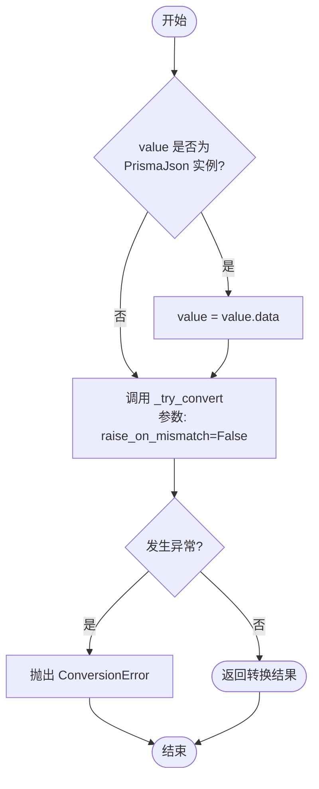
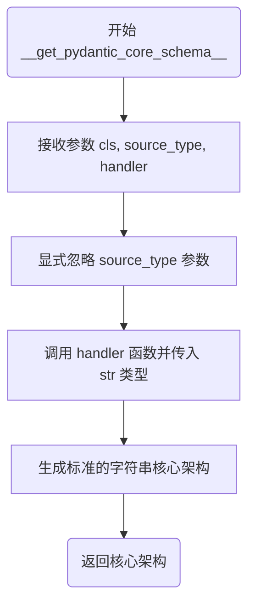
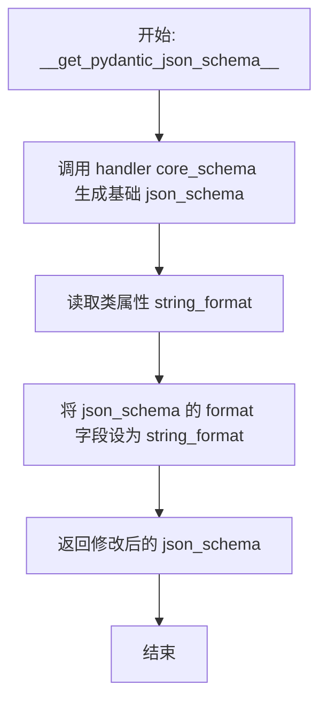

# `.\AutoGPT\autogpt_platform\backend\backend\util\type.py` 详细设计文档

该代码实现了一个健壮的类型转换系统，支持在基本Python类型（如int, str, list, dict等）、泛型类型（如List[int]）、Union类型以及自定义格式化字符串类型之间进行灵活转换。它还集成了对Prisma Json类型的处理，并提供了Pydantic兼容的基类用于特定格式的字符串验证。

## 整体流程



## 类结构

```
ConversionError (Exception)
FormattedStringType (str)
├── MediaFileType
├── LongTextType
└── ShortTextType
```

## 全局变量及字段


### `NUM`
    
一个受限的类型变量，仅限于 int 或 float 类型。

类型：`TypeVar`
    


### `T`
    
一个通用类型变量，用于代表任意类型。

类型：`TypeVar`
    


### `TT`
    
一个通用类型变量，用于代表任意类型。

类型：`TypeVar`
    


### `FormattedStringType.string_format`
    
定义字符串格式标识符的类属性，用于 Pydantic JSON schema 生成。

类型：`str`
    


### `MediaFileType.string_format`
    
字符串格式标识符，值为 'file'，表示该类型代表媒体文件。

类型：`str`
    


### `LongTextType.string_format`
    
字符串格式标识符，值为 'long-text'，表示该类型代表长文本内容。

类型：`str`
    


### `ShortTextType.string_format`
    
字符串格式标识符，值为 'short-text'，表示该类型代表短文本内容。

类型：`str`
    
    

## 全局函数及方法


### `_is_type_or_subclass`

检查给定的源对象是否完全等同于目标类型，或者是目标类型的子类。

参数：

- `origin`：`Any`，待检查的源对象或类型。
- `target_type`：`type`，目标类型，用于判断源对象是否为其子类或自身。

返回值：`bool`，如果源对象是目标类型或其子类，则返回 True，否则返回 False。

#### 流程图



#### 带注释源码

```python
def _is_type_or_subclass(origin: Any, target_type: type) -> bool:
    """Check if origin is exactly the target type or a subclass of it."""
    # 首先检查两者是否是同一个对象（内存地址相同），即是否为完全相同的类型
    # 如果是，直接返回 True
    return origin is target_type or (
        # 如果不是同一个对象，进一步检查 origin 是否本身是一个类型（class）
        # 这一步是为了防止对实例对象调用 issubclass 从而引发 TypeError
        isinstance(origin, type) and issubclass(origin, target_type)
    )
```


### `__convert_list`

该函数负责将任意类型的输入值转换为列表。它通过直接转换列表、元组和集合，将字典转换为键值对列表，解析字符串形式的JSON数组，或将其他任何值包装为单元素列表，从而实现了通用的列表类型转换逻辑。

参数：

-  `value`：`Any`，需要被转换为列表的任意输入值。

返回值：`list`，转换后的 Python 列表对象。

#### 流程图

```mermaid
flowchart TD
    A([开始]) --> B{value是list, tuple或set?}
    B -- 是 --> C[返回 list value]
    B -- 否 --> D{value是dict?}
    D -- 是 --> E[返回 list value.items]
    D -- 否 --> F{value是str?}
    F -- 是 --> G[去除首尾空格]
    G --> H{以'['开头并以']'结尾?}
    H -- 是 --> I[尝试 json.loads value]
    I --> J{解析成功?}
    J -- 是 --> K[返回解析后的列表]
    J -- 否 --> L[返回 [value]]
    H -- 否 --> L
    F -- 否 --> M[返回 [value]]
    C --> N([结束])
    E --> N
    K --> N
    L --> N
    M --> N
```

#### 带注释源码

```python
def __convert_list(value: Any) -> list:
    # 如果输入已经是列表、元组或集合，直接将其转换为列表形式返回
    if isinstance(value, (list, tuple, set)):
        return list(value)
    # 如果输入是字典，则将其键值对视图转换为列表返回
    elif isinstance(value, dict):
        return list(value.items())
    # 如果输入是字符串类型，需要进一步处理以判断是否为JSON格式
    elif isinstance(value, str):
        value = value.strip()
        # 检查字符串是否以 '[' 开头并以 ']' 结尾，暗示它可能是一个 JSON 数组
        if value.startswith("[") and value.endswith("]"):
            try:
                # 尝试将字符串解析为 JSON 对象（即列表）
                return json.loads(value)
            except json.JSONDecodeError:
                # 如果解析失败（格式错误），则将原字符串作为列表的唯一元素返回
                return [value]
        else:
            # 如果不符合 JSON 数组格式，将原字符串作为列表的唯一元素返回
            return [value]
    else:
        # 对于其他任何类型（如 int, float, object 等），将其包装在单元素列表中返回
        return [value]
```


### `__convert_dict`

该函数接收任意类型的输入值，并将其转换为字典格式。它针对不同的输入类型进行了特定处理：如果是字符串，尝试进行 JSON 解析；如果是列表或元组，将其转换为索引到值的映射字典；如果已经是字典则直接返回；对于其他类型或解析失败的情况，则将值包装在键为 'value' 的字典中作为兜底返回。

参数：

- `value`：`Any`，需要被转换为字典的任意类型输入值。

返回值：`dict`，根据输入值转换后得到的字典对象。

#### 流程图

```mermaid
flowchart TD
    Start([开始]) --> CheckStr{value 是 str?}
    
    CheckStr -- 是 --> TryParse[尝试 json.loads]
    TryParse --> IsDictResult{解析结果是 dict?}
    IsDictResult -- 是 --> ReturnResult[返回解析结果]
    IsDictResult -- 否 --> CatchErr[捕获异常或处理非dict结果]
    CatchErr --> ReturnStrDefault[返回 {'value': value}]
    
    CheckStr -- 否 --> CheckList{value 是 list?}
    CheckList -- 是 --> MakeListDict[生成索引映射字典 {i: value[i]}]
    MakeListDict --> ReturnListDict[返回映射后的字典]
    
    CheckList -- 否 --> CheckTuple{value 是 tuple?}
    CheckTuple -- 是 --> MakeTupleDict[生成索引映射字典 {i: value[i]}]
    MakeTupleDict --> ReturnTupleDict[返回映射后的字典]
    
    CheckTuple -- 否 --> CheckDict{value 是 dict?}
    CheckDict -- 是 --> ReturnDict[返回原 value]
    
    CheckDict -- 否 --> ReturnDefault[返回 {'value': value}]
```

#### 带注释源码

```python
def __convert_dict(value: Any) -> dict:
    # 如果输入是字符串，尝试将其解析为 JSON
    if isinstance(value, str):
        try:
            result = json.loads(value)
            # 如果解析结果是字典，直接返回
            if isinstance(result, dict):
                return result
            else:
                # 如果解析结果不是字典（如列表、数字等），将其包装在 {'value': ...} 中
                return {"value": result}
        except json.JSONDecodeError:
            # 如果 JSON 解析失败，进行兜底处理，包装为 {'value': 原始字符串}
            return {"value": value}  # Fallback conversion
    # 如果输入是列表，将其转换为 {索引: 值} 的字典
    elif isinstance(value, list):
        return {i: value[i] for i in range(len(value))}
    # 如果输入是元组，将其转换为 {索引: 值} 的字典
    elif isinstance(value, tuple):
        return {i: value[i] for i in range(len(value))}
    # 如果输入已经是字典，直接返回
    elif isinstance(value, dict):
        return value
    # 对于其他类型（如 int, float, bool 等），包装在 {'value': ...} 中返回
    else:
        return {"value": value}
```


### `__convert_tuple`

该函数用于将任意类型的输入值转换为元组类型，针对字符串、列表、集合、字典、基本数据类型（数字、布尔值）以及已经是元组的情况进行了分别处理。

参数：

-  `value`：`Any`，需要被转换为元组的任意输入值。

返回值：`tuple`，转换后的元组对象。

#### 流程图



#### 带注释源码

```python
def __convert_tuple(value: Any) -> tuple:
    # 如果输入是字符串、列表或集合，直接将其转换为元组
    if isinstance(value, (str, list, set)):
        return tuple(value)
    # 如果输入是字典，将其键值对视图（items）转换为元组
    elif isinstance(value, dict):
        return tuple(value.items())
    # 如果输入是整数、浮点数或布尔值，将其封装为单元素元组
    elif isinstance(value, (int, float, bool)):
        return (value,)
    # 如果输入已经是元组，直接原样返回
    elif isinstance(value, tuple):
        return value
    # 对于其他任何未明确列出的类型，默认将其封装为单元素元组
    else:
        return (value,)
```


### `__convert_set`

该函数用于将任意类型的输入值转换为 Python 的集合（set）类型。它能够处理常见的可迭代对象（如列表、元组、字符串）、字典对象以及已经是集合的对象，对于不可迭代的单一值，则将其包含在一个新的单元素集合中。

参数：

-   `value`：`Any`，需要进行类型转换的任意输入值。

返回值：`set`，转换后的 Python 集合对象。

#### 流程图

```mermaid
flowchart TD
    Start([开始]) --> CheckIterable{value 是 str/list/tuple?}
    CheckIterable -- 是 --> ConvertIterable[return set(value)]
    ConvertIterable --> End([结束])
    
    CheckIterable -- 否 --> CheckDict{value 是 dict?}
    CheckDict -- 是 --> ConvertItems[return set(value.items)]
    ConvertItems --> End
    
    CheckDict -- 否 --> CheckSet{value 是 set?}
    CheckSet -- 是 --> ReturnSelf[return value]
    ReturnSelf --> End
    
    CheckSet -- 否 --> ReturnSingleton[return {value}]
    ReturnSingleton --> End
```

#### 带注释源码

```python
def __convert_set(value: Any) -> set:
    # 检查 value 是否为字符串、列表或元组
    # 如果是，利用 set() 构造函数将其转换为集合
    # 注意：如果是字符串，每个字符都会成为集合中的一个元素
    if isinstance(value, (str, list, tuple)):
        return set(value)
    # 检查 value 是否为字典
    # 如果是，提取字典的所有键值对（items），并将这些元组作为集合的元素
    elif isinstance(value, dict):
        return set(value.items())
    # 检查 value 是否已经是集合
    # 如果是，直接返回原对象，无需转换
    elif isinstance(value, set):
        return value
    # 处理其他任何类型（如 int, float, bool, object 等）
    # 直接将该值作为唯一元素，放入一个新的集合中返回
    else:
        return {value}
```


### `__convert_str`

该函数用于将任意类型的值转换为字符串。如果输入值已经是字符串类型，则直接返回；否则，通过 `json.dumps` 方法将其序列化为 JSON 格式的字符串返回。

参数：

-  `value`：`Any`，需要被转换为字符串的任意输入值。

返回值：`str`，输入值的字符串表示。若输入为字符串则原样返回，否则返回其 JSON 序列化结果。

#### 流程图



#### 带注释源码

```python
def __convert_str(value: Any) -> str:
    # 检查输入值是否已经是字符串类型
    if isinstance(value, str):
        # 如果是字符串，无需转换，直接返回
        return value
    else:
        # 如果不是字符串，使用 json.dumps 将其转换为 JSON 格式的字符串
        return json.dumps(value)
```


### `__convert_num`

该函数负责将任意类型的值转换为目标数字类型（整数或浮点数）。如果输入是容器类型（如列表、字典等），则返回其长度；如果已经是目标类型，则直接返回；否则尝试通过浮点数转换为目标类型，失败时返回0。

参数：

-  `value`：`Any`，需要被转换的任意输入值。
-  `num_type`：`Type[NUM]`，目标数字类型，通常为 `int` 或 `float`。

返回值：`NUM`，转换后的数值（`int` 或 `float`）。

#### 流程图



#### 带注释源码

```python
def __convert_num(value: Any, num_type: Type[NUM]) -> NUM:
    # 如果输入值是集合类型（列表、字典、元组或集合），返回该集合的长度
    if isinstance(value, (list, dict, tuple, set)):
        return num_type(len(value))
    # 如果输入值已经是目标数字类型，直接返回原值
    elif isinstance(value, num_type):
        return value
    else:
        try:
            # 尝试先将值转换为浮点数，再转换为目标数字类型（例如将字符串 "123" 转换为 int 123）
            return num_type(float(value))
        except (ValueError, TypeError):
            # 如果转换失败（例如字符串 "abc"），回退返回目标数字类型的 0
            return num_type(0)  # Fallback conversion
```


### `__convert_bool`

该函数负责将给定的任意类型值转换为布尔类型。它会优先保留原始布尔值，对字符串类型进行特定解析（识别 "true" 和 "1"），对其他类型则使用 Python 标准的真值判断。

参数：

-  `value`：`Any`，需要被转换为布尔类型的任意输入值。

返回值：`bool`，转换后的布尔结果。

#### 流程图

```mermaid
flowchart TD
    Start([开始]) --> CheckBool{value 是 bool 类型?}
    CheckBool -- 是 --> ReturnVal[返回 value]
    CheckBool -- 否 --> CheckStr{value 是 str 类型?}
    CheckStr -- 是 --> CheckLower{value.lower() 在 ['true', '1'] 中?}
    CheckLower -- 是 --> ReturnTrue[返回 True]
    CheckLower -- 否 --> ReturnFalse[返回 False]
    CheckStr -- 否 --> ReturnNative[返回 bool value]
    ReturnVal --> End([结束])
    ReturnTrue --> End
    ReturnFalse --> End
    ReturnNative --> End
```

#### 带注释源码

```python
def __convert_bool(value: Any) -> bool:
    # 1. 检查输入值是否已经是布尔类型，如果是，直接返回原值
    if isinstance(value, bool):
        return value
    # 2. 检查输入值是否为字符串类型
    elif isinstance(value, str):
        # 3. 将字符串转换为小写，并判断是否等于 "true" 或 "1"
        if value.lower() in ["true", "1"]:
            return True
        else:
            return False
    # 4. 对于非布尔且非字符串的类型（如数字、列表、对象等），使用 Python 内置的 bool() 函数进行转换
    else:
        return bool(value)
```


### `_try_convert`

该函数是类型转换系统的核心逻辑，负责尝试将任意给定的值转换为目标类型。它能够处理基础类型、泛型容器（List, Dict, Tuple, Set）、联合类型以及 Optional 类型，并根据配置决定在转换失败时是抛出异常还是返回原值。

参数：

-   `value`：`Any`，待转换的原始输入值，可以是任意类型。
-   `target_type`：`Any`，期望转换到的目标类型注解，例如 `List[int]`、`Union[str, int]` 或简单的 `str`。
-   `raise_on_mismatch`：`bool`，一个标志位，指示当值不符合目标类型且无法转换时，是否抛出 `TypeError` 异常；如果为 `False`，则通常会返回原值或进行静默处理。

返回值：`Any`，转换后的值实例。如果转换成功，返回符合 `target_type` 的对象；如果是 `Optional` 类型的 `None` 值且允许，返回 `None`；若不允许转换且不抛出异常，则返回原值。

#### 流程图



#### 带注释源码

```python
def _try_convert(value: Any, target_type: Any, raise_on_mismatch: bool) -> Any:
    # 提取类型的原始类型（如 list, dict 等）和参数（如 [int], [str, int]）
    origin = get_origin(target_type)
    args = get_args(target_type)

    # 处理 Union 类型（包括 Optional，即 Union[T, None]）
    if origin is Union or origin is types.UnionType:
        # 如果值为 None，检查 None 是否在 Union 的允许类型中
        if value is None:
            if type(None) in args:
                return None
            elif raise_on_mismatch:
                raise TypeError(f"Value {value} is not of expected type {target_type}")
            else:
                return value

        # 获取 Union 中所有非 None 的类型
        non_none_types = [arg for arg in args if arg is not type(None)]

        # 尝试递归地将值转换为 Union 中的每一种类型
        for arg_type in non_none_types:
            try:
                return _try_convert(value, arg_type, raise_on_mismatch)
            except (TypeError, ValueError, ConversionError):
                continue # 捕获异常继续尝试下一个类型

        # 如果所有类型尝试都失败
        if raise_on_mismatch:
            raise TypeError(f"Value {value} is not of expected type {target_type}")
        else:
            return value

    # 如果 origin 为 None，说明是非泛型类型（如 int, str），直接使用 target_type
    if origin is None:
        origin = target_type
        
    # 检查是否支持该类型的转换（仅支持内置容器和基本数值/字符串类型的子类）
    supported_types = [list, dict, tuple, str, set, int, float, bool]
    if origin not in supported_types and not (
        isinstance(origin, type) and any(issubclass(origin, t) for t in supported_types)
    ):
        return value # 不支持的类型直接返回原值

    # 如果值已经是目标类型的实例
    if isinstance(value, origin):
        if not args:
            return value # 如果没有泛型参数（如普通 list），直接返回
        else:
            # 如果有泛型参数（如 List[int]），需要递归转换内部元素
            if origin is list:
                return [convert(v, args[0]) for v in value]
            elif origin is tuple:
                # 元组可以是固定长度多类型的 (int, str)
                if len(args) == 1:
                    return tuple(convert(v, args[0]) for v in value)
                else:
                    return tuple(convert(v, t) for v, t in zip(value, args))
            elif origin is dict:
                key_type, val_type = args
                return {
                    convert(k, key_type): convert(v, val_type) for k, v in value.items()
                }
            elif origin is set:
                return {convert(v, args[0]) for v in value}
            else:
                return value
    # 如果值不是目标类型的实例
    elif raise_on_mismatch:
        # 如果配置为不匹配即报错，则抛出异常
        raise TypeError(f"Value {value} is not of expected type {target_type}")
    else:
        # 尝试将值转换为目标类型
        # 列表转换
        if _is_type_or_subclass(origin, list):
            converted_list = __convert_list(value)
            if args:
                # 递归转换元素
                converted_list = [convert(v, args[0]) for v in converted_list]
            return origin(converted_list) if origin is not list else converted_list
        
        # 字典转换
        elif _is_type_or_subclass(origin, dict):
            converted_dict = __convert_dict(value)
            if args:
                key_type, val_type = args
                # 递归转换键和值
                converted_dict = {
                    convert(k, key_type): convert(v, val_type)
                    for k, v in converted_dict.items()
                }
            return origin(converted_dict) if origin is not dict else converted_dict
        
        # 元组转换
        elif _is_type_or_subclass(origin, tuple):
            converted_tuple = __convert_tuple(value)
            if args:
                if len(args) == 1:
                    converted_tuple = tuple(
                        convert(v, args[0]) for v in converted_tuple
                    )
                else:
                    converted_tuple = tuple(
                        convert(v, t) for v, t in zip(converted_tuple, args)
                    )
            return origin(converted_tuple) if origin is not tuple else converted_tuple
        
        # 字符串转换
        elif _is_type_or_subclass(origin, str):
            converted_str = __convert_str(value)
            return origin(converted_str) if origin is not str else converted_str
        
        # 集合转换
        elif _is_type_or_subclass(origin, set):
            value = __convert_set(value)
            if args:
                return {convert(v, args[0]) for v in value}
            else:
                return value
        
        # 布尔值转换
        elif _is_type_or_subclass(origin, bool):
            return __convert_bool(value)
        
        # 数值转换
        elif _is_type_or_subclass(origin, int):
            return __convert_num(value, int)
        elif _is_type_or_subclass(origin, float):
            return __convert_num(value, float)
        
        # 默认情况
        else:
            return value
```


### `type_match`

一个严格的类型匹配与转换函数。该函数尝试将输入值转换为目标类型，如果值已经是目标类型则直接返回（或处理泛型内部元素），如果转换失败或类型不兼容，则会抛出异常，确保返回值的类型严格符合预期。

参数：

-  `value`：`Any`，需要进行类型匹配或转换的任意输入值。
-  `target_type`：`Type[T]`，期望的目标类型（泛型类型 T）。

返回值：`T`，严格匹配并转换为目标类型 T 的值。

#### 流程图



#### 带注释源码

```python
def type_match(value: Any, target_type: Type[T]) -> T:
    # 调用内部辅助函数 _try_convert 进行核心转换逻辑
    # 参数 raise_on_mismatch 设置为 True，表示如果类型不匹配或转换失败，
    # 将直接抛出 TypeError 异常，而不是返回原值。
    # cast(T, ...) 用于静态类型检查器，告诉编译器返回值确认为类型 T
    return cast(T, _try_convert(value, target_type, raise_on_mismatch=True))
```


### `convert`

一个通用的类型转换函数，旨在将任意输入值转换为目标类型。该函数处理 Prisma 的 Json 类型包装，委托给内部转换逻辑执行具体的类型匹配与转换，并在转换失败时抛出 ConversionError 异常。

参数：

-  `value`：`Any`，待转换的原始值。
-  `target_type`：`Any`，期望转换到的目标类型。

返回值：`Any`，转换后的结果值。

#### 流程图



#### 带注释源码

```python
def convert(value: Any, target_type: Any) -> Any:
    try:
        # 特殊处理：如果输入值是 Prisma 的 Json 类型，则提取其底层数据
        if isinstance(value, PrismaJson):
            value = value.data
        
        # 调用内部核心转换函数 _try_convert
        # raise_on_mismatch=False 表示如果类型不匹配，尝试进行类型转换而不是直接抛出 TypeError
        return _try_convert(value, target_type, raise_on_mismatch=False)
    except Exception as e:
        # 捕获转换过程中发生的任何异常，并包装为自定义的 ConversionError 抛出
        # 使用 from e 保留原始异常堆栈信息
        raise ConversionError(f"Failed to convert {value} to {target_type}") from e
```


### `FormattedStringType.__get_pydantic_core_schema__`

这是一个 Pydantic 的核心架构生成钩子方法，用于定义 `FormattedStringType` 及其子类在 Pydantic 验证系统中的行为。它通过委托给 `str` 类型的处理器，将当前类型本质上视为标准的字符串进行验证，同时保留了通过 `__get_pydantic_json_schema__` 添加额外 JSON Schema 元数据（如 format）的能力。

参数：

- `cls`：`type[FormattedStringType]`，表示当前类本身（作为类方法）。
- `source_type`：`Any`，由 Pydantic 传入的源类型信息，当前实现中未使用。
- `handler`：`pydantic.core.schema.GetCoreSchemaHandler`，Pydantic 提供的回调函数，用于生成指定类型的核心架构。

返回值：`pydantic_core.core_schema.CoreSchema`，返回一个 Pydantic 核心架构对象，该对象定义了如何将输入验证和处理为字符串。

#### 流程图



#### 带注释源码

```python
    @classmethod
    def __get_pydantic_core_schema__(cls, source_type, handler):
        # source_type 参数由 Pydantic 调用约定传入，但在当前逻辑中不需要使用
        _ = source_type  # unused parameter required by pydantic
        
        # 调用 handler 回调函数，传入 Python 内置的 str 类型。
        # 这指示 Pydantic 按照标准字符串的规则来验证和序列化该类型的数据。
        return handler(str)
```


### `FormattedStringType.__get_pydantic_json_schema__`

该方法是 Pydantic 的一个钩子函数，用于生成自定义类的 JSON Schema。它首先调用处理器获取基础字符串类型的 JSON Schema，然后将类变量 `string_format` 的值赋给 Schema 的 `format` 字段，从而在生成的 OpenAPI/JSON Schema 中标明该字符串的具体格式（如 "file", "long-text" 等）。

参数：

- `cls`：`type`，调用该方法的类本身（即 `FormattedStringType` 或其子类）。
- `core_schema`：`Any`，Pydantic 的核心 Schema 对象，描述了类型的内部验证逻辑。
- `handler`：`Any`，Pydantic 的 JSON Schema 生成处理器回调函数。

返回值：`dict`，包含格式化信息的 JSON Schema 字典。

#### 流程图



#### 带注释源码

```python
    @classmethod
    def __get_pydantic_json_schema__(cls, core_schema, handler):
        # 使用处理器生成基础类型的 JSON Schema
        json_schema = handler(core_schema)
        
        # 将类定义的 string_format 赋值给 json_schema 的 'format' 键
        # 这样在导出 OpenAPI 文档时，字符串会带有具体的格式说明
        json_schema["format"] = cls.string_format
        
        # 返回增强后的 JSON Schema
        return json_schema
```


## 关键组件


### 类型转换引擎

负责解析类型提示并递归地将输入值转换为目标类型，包括处理联合类型、可空类型及嵌套容器的复杂逻辑。

### 公共转换接口

提供严格校验和容错转换两种外部函数，用于处理包括 PrismaJson 在内的通用数据类型转换。

### 格式化字符串类型定义

定义了一组继承自字符串的 Pydantic 兼容类型，用于在 JSON Schema 中声明特定的格式约束（如文件路径、长文本等）。


## 问题及建议


### 已知问题

-   **静默转换导致数据丢失风险**：在 `convert` 模式下（`raise_on_mismatch=False`），当数值转换（如字符串 `"abc"` 转 `int`）失败或字典解析失败时，函数会返回默认值（如 `0` 或 `{"value": ...}`）而不是抛出异常。这种“尽力而为”的策略可能在数据处理流程中掩盖输入错误，导致下游逻辑基于错误的数据（如 0）继续执行，产生难以调试的逻辑漏洞。
-   **强依赖 Pydantic v2**：`FormattedStringType` 及其子类硬编码了 Pydantic v2 的核心模式生成方法（`__get_pydantic_core_schema__`）。这导致该类型系统强耦合于特定版本的 Pydantic，降低了代码库的通用性，并在 Pydantic 版本升级或更换验证库时产生维护负担。
-   **集合类型转换的语义歧义**：代码隐含定义了特定的类型转换规则，例如将字典转换为列表时默认返回 `dict.items()`，将列表转换为字典时使用索引作为键。这些“魔法”行为缺乏文档说明且不可配置，容易在开发者不知情的情况下引入非预期的数据结构变更。
-   **异常捕获过于宽泛**：主函数 `convert` 使用了 `try...except Exception`，虽然重新抛出了 `ConversionError`，但这可能掩盖非预期的系统级错误（如内存错误），并且混淆了输入数据错误与代码内部错误的界限。

### 优化建议

-   **解耦 Pydantic 依赖**：建议将 Pydantic 相关的 Schema 生成逻辑从核心类型类中剥离。可以通过适配器模式、独立的 Mixin 类或者在专门的层中处理，使核心 `FormattedStringType` 仅作为数据标识，保持工具库的纯粹性和通用性。
-   **引入转换降级警告**：建议在 `__convert_num`、`__convert_dict` 等执行 Fallback 逻辑的地方引入日志记录或警告机制。当发生无法解析的情况时，输出警告信息，帮助开发者和运维人员及时发现数据质量问题。
-   **实现自定义转换器注册机制**：当前代码通过大量的 `if/elif` 硬编码了内置类型的转换逻辑。建议设计一个基于字典的转换器注册表，允许用户为自定义类型注册特定的转换函数，从而提高系统的扩展性，避免针对不支持类型直接返回原值的不确定行为。
-   **完善类型提示与泛型支持**：虽然代码使用了 `TypeVar`，但在处理复杂泛型（如 `Dict[str, List[int]]`）时的递归转换逻辑较为冗长且容易出错。建议结合更高级的泛型元编程库或优化递归解析逻辑，并补充更详细的单元测试以覆盖边缘情况。


## 其它


### 设计目标与约束

**设计目标：**
该模块旨在提供一个通用的、高鲁棒性的类型转换工具，能够将任意的输入值（通常是来自数据库原始记录、JSON 字符串或用户输入）强制转换为目标 Python 类型。核心功能包括支持 Python 标准泛型（如 `List`, `Dict`, `Tuple`）、联合类型（`Union`/`Optional`）以及与 Prisma 和 Pydantic 生态的无缝集成。

**设计约束：**
1.  **双模式转换**：必须提供严格模式（`type_match`）和宽松模式（`convert`）。严格模式在类型不匹配时必须抛出异常，而宽松模式应尽最大努力进行转换或提供合理的回退值（如转换数字失败返回 0）。
2.  **递归处理**：对于容器类型（如 `List[Dict[str, int]]`），转换逻辑必须能够递归地处理内部元素类型，而不仅仅是外层结构。
3.  **JSON 友好**：必须能够智能处理格式化为 JSON 字符串的输入，自动将其解析为对应的 Python 对象。
4.  **框架兼容性**：自定义的字符串类型必须符合 Pydantic V2 的协议（实现 `__get_pydantic_core_schema__`），以便在数据验证模型中正常工作。

### 错误处理与异常设计

**异常类型：**
*   `ConversionError`：继承自 `ValueError`。这是模块对外暴露的主要异常类，用于封装类型转换过程中发生的所有错误（如 JSON 解析失败、类型强制转换失败等）。

**处理策略：**
1.  **公共 API (`convert`)**：采用“捕获并包装”策略。在顶层捕获 `Exception`，将其作为 `cause` 链式抛出新的 `ConversionError`，防止底层的 `json.JSONDecodeError` 或 `ValueError` 直接泄露给调用者。
2.  **内部辅助函数 (如 `__convert_num`)**：采用“回退”策略。当转换逻辑失败（例如将 "abc" 转为 float）时，不抛出异常，而是返回预定义的默认值（如 `0` 或 `{value: ...}`），以保证流程继续。
3.  **严格 API (`type_match`)**：采用“快速失败”策略。一旦检测到类型不匹配或转换不可行，立即向上层抛出 `TypeError` 或 `ConversionError`。

### 数据流与处理逻辑

数据流从输入值到输出对象的处理过程如下：

1.  **输入清洗**：检查输入值是否为 `PrismaJson` 类型，如果是，则提取其 `.data` 属性作为实际输入。
2.  **类型解析**：使用 `typing.get_origin` 和 `typing.get_args` 解析目标类型的元数据。区分普通类型、泛型容器（`List`, `Dict` 等）和联合类型（`Union`）。
3.  **联合类型分发**：如果目标类型是 `Union`，遍历所有可能的候选类型，递归调用 `_try_convert`，直到有一个转换成功或所有尝试均失败。
4.  **类型匹配与转换**：
    *   **直接匹配**：如果输入值已经是目标类型的实例，且不是泛型容器，直接返回。
    *   **泛型递归**：如果输入值是容器类型（如 List）但内部元素类型不符合，则保持容器结构，递归调用 `convert` 处理每一个子元素（如将 `List[str]` 转为 `List[int]`）。
    *   **底层转换**：如果类型不匹配，根据目标类型分发到私有的 `__convert_*` 函数（如 `__convert_list` 处理将 JSON 字符串转为 List）。
5.  **输出**：返回符合目标类型约束的 Python 对象。

### 外部依赖与接口契约

**外部库依赖：**
1.  **Prisma (`prisma.Json`)**：
    *   **契约**：`convert` 函数依赖于 `PrismaJson` 对象拥有一个 `.data` 属性，该属性存储了实际的 JSON 数据。
2.  **Pydantic (Implicit)**：
    *   **契约**：`FormattedStringType` 及其子类实现了 Pydantic 的 Core Schema 协议。具体来说，它们必须实现 `__get_pydantic_core_schema__(cls, source_type, handler)` 类方法，以便 Pydantic 在模型验证时将其视为 `str` 类型处理，并在 JSON Schema 生成时注入自定义的 `format` 字段（通过 `__get_pydantic_json_schema__`）。
3.  **Python 标准库 (`json`, `types`, `typing`)**：
    *   **契约**：依赖 `json` 库进行字符串反序列化；依赖 `typing` 库的 `get_origin` 和 `get_args` 进行运行时类型内省。

**接口契约：**
*   **`convert(value, target_type)`**：保证返回值要么是 `target_type` 的实例，要么在转换不可行时抛出 `ConversionError`。对于 `Optional` 类型，允许返回 `None`。
*   **`type_match(value, target_type)`**：保证返回值严格符合 `target_type`，否则抛出异常，绝不返回不符合类型的值。

### 扩展性与维护性说明

**扩展点：**
*   **新增基础类型转换**：若需支持新的基础类型（如 `datetime` 或 `Decimal`），只需在 `_try_convert` 的 `supported_types` 中添加类型判断，并实现对应的 `__convert_*` 私有函数。
*   **自定义字符串格式**：通过继承 `FormattedStringType` 并设置 `string_format` 类属性，可以轻松扩展出符合特定语义的字符串类型（如 `UrlType`, `EmailType`），自动获得 Pydantic JSON Schema 支持。

**维护建议：**
*   代码中对 `Union` 类型的处理逻辑较为复杂，涉及到递归尝试，维护时需注意避免无限递归的性能陷阱。
*   `__convert_*` 系列函数包含了一些“最佳猜测”逻辑（如将字符串按逗号分隔转列表），这些隐式规则可能会随业务需求变化，建议在文档中明确这些具体的转换规则。


    