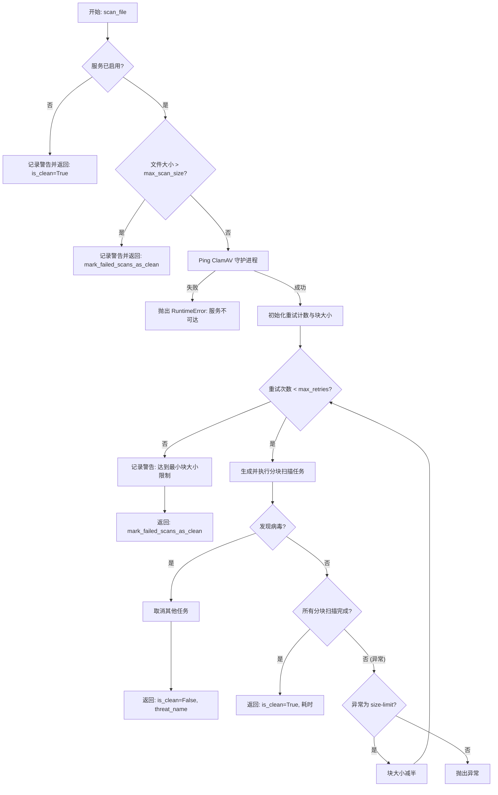
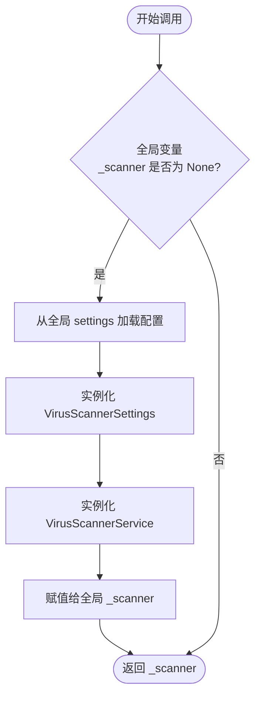
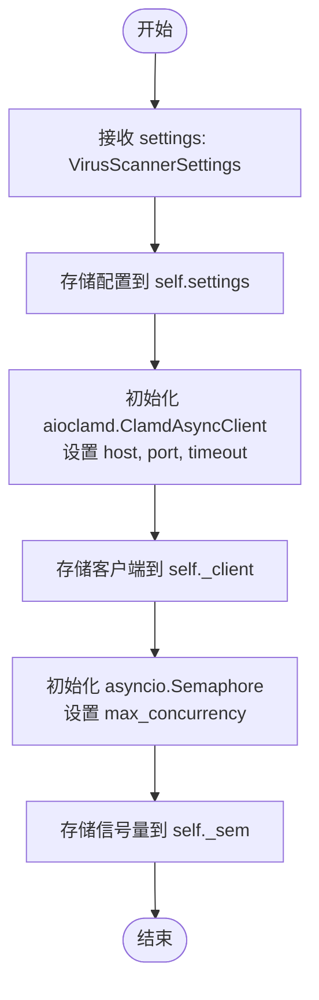
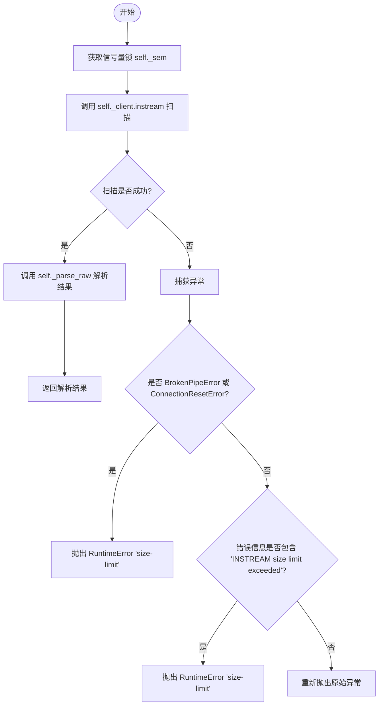
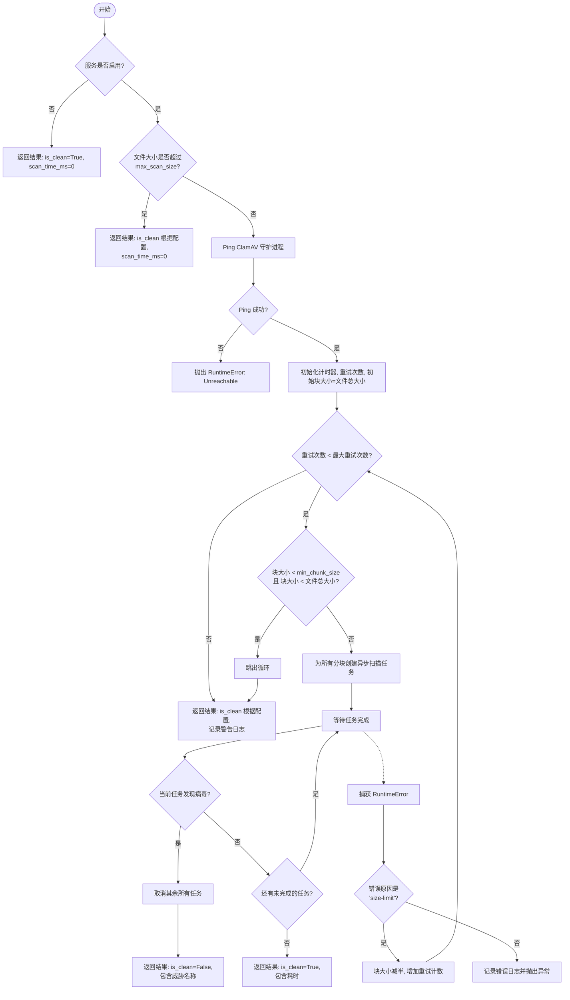

# `.\AutoGPT\autogpt_platform\backend\backend\util\virus_scanner.py` 详细设计文档

该代码实现了一个基于 ClamAV 的异步病毒扫描服务，利用 aioclamd 库与 ClamAV 守护进程通信，具备并发控制、大文件分块重试扫描机制、通过 Pydantic 进行配置和数据模型管理，并提供了全局服务实例获取及安全扫描辅助函数，以确保上传文件的安全性。

## 整体流程



## 类结构

```
BaseModel (Pydantic)
└── VirusScanResult
BaseSettings (Pydantic)
└── VirusScannerSettings
VirusScannerService
```

## 全局变量及字段


### `logger`
    
全局日志记录器实例，用于记录运行日志、警告和错误信息。

类型：`logging.Logger`
    


### `settings`
    
应用程序全局配置实例，用于从环境或配置文件中加载设置。

类型：`Settings`
    


### `_scanner`
    
病毒扫描服务的单例缓存实例，用于延迟初始化和全局复用。

类型：`Optional[VirusScannerService]`
    


### `VirusScanResult.is_clean`
    
指示扫描结果是否为安全（即未检测到病毒）。

类型：`bool`
    


### `VirusScanResult.scan_time_ms`
    
执行扫描操作所花费的总时间，单位为毫秒。

类型：`int`
    


### `VirusScanResult.file_size`
    
被扫描文件的字节大小。

类型：`int`
    


### `VirusScanResult.threat_name`
    
如果检测到病毒，则为威胁名称；否则为 None。

类型：`Optional[str]`
    


### `VirusScannerSettings.clamav_service_host`
    
ClamAV 病毒扫描守护进程服务的主机地址。

类型：`str`
    


### `VirusScannerSettings.clamav_service_port`
    
ClamAV 病毒扫描守护进程服务的端口号。

类型：`int`
    


### `VirusScannerSettings.clamav_service_timeout`
    
连接 ClamAV 服务的超时时间，单位为秒。

类型：`int`
    


### `VirusScannerSettings.clamav_service_enabled`
    
功能开关，决定是否启用病毒扫描服务，禁用时默认所有文件为安全。

类型：`bool`
    


### `VirusScannerSettings.mark_failed_scans_as_clean`
    
容错配置，若为 True，则当扫描失败时将文件标记为安全而非拒绝。

类型：`bool`
    


### `VirusScannerSettings.max_scan_size`
    
客户端允许的最大文件扫描大小限制，超过此大小将停止扫描。

类型：`int`
    


### `VirusScannerSettings.min_chunk_size`
    
分块扫描策略中的最小块大小（字节），防止分块过细。

类型：`int`
    


### `VirusScannerSettings.max_retries`
    
因超出大小限制而尝试减小分块大小进行重试的最大次数。

类型：`int`
    


### `VirusScannerSettings.max_concurrency`
    
允许同时向 ClamAV 守护进程发送的最大并发扫描请求数。

类型：`int`
    


### `VirusScannerService.settings`
    
病毒扫描服务实例的配置对象，包含连接参数和策略限制。

类型：`VirusScannerSettings`
    


### `VirusScannerService._client`
    
用于与 ClamAV 守护进程进行异步通信的客户端连接实例。

类型：`aioclamd.ClamdAsyncClient`
    


### `VirusScannerService._sem`
    
异步信号量，用于限制对 ClamAV 服务的并发扫描数量，防止资源耗尽。

类型：`asyncio.Semaphore`
    
    

## 全局函数及方法


### `get_virus_scanner`

获取 `VirusScannerService` 的全局单例实例。如果实例尚未初始化，则根据全局配置创建该实例，确保在应用程序生命周期内只创建一次服务。

参数：

*   无

返回值：`VirusScannerService`，配置好的病毒扫描服务实例。

#### 流程图



#### 带注释源码

```python
def get_virus_scanner() -> VirusScannerService:
    # 声明使用全局变量 _scanner，以便对其进行修改
    global _scanner
    # 检查单例是否已存在
    if _scanner is None:
        # 如果不存在，从全局 settings 对象中读取 ClamAV 相关配置
        _settings = VirusScannerSettings(
            clamav_service_host=settings.config.clamav_service_host,
            clamav_service_port=settings.config.clamav_service_port,
            clamav_service_enabled=settings.config.clamav_service_enabled,
            max_concurrency=settings.config.clamav_max_concurrency,
            mark_failed_scans_as_clean=settings.config.clamav_mark_failed_scans_as_clean,
        )
        # 使用配置初始化 VirusScannerService 并赋值给全局变量
        _scanner = VirusScannerService(_settings)
    # 返回服务实例（无论是新创建的还是已存在的）
    return _scanner
```


### `scan_content_safe`

这是一个全局辅助函数，用于安全地扫描文件内容。它调用底层的病毒扫描服务，并根据扫描结果引发特定的异常：如果发现病毒则抛出 `VirusDetectedError`，如果扫描过程中发生其他错误则抛出 `VirusScanError`。成功扫描则静默通过。

参数：

-  `content`：`bytes`，待扫描的文件二进制内容
-  `filename`：`str`，待扫描文件的名称，默认为 "unknown"

返回值：`None`，函数不返回值，成功时无异常，失败时抛出特定异常

#### 流程图

```mermaid
flowchart TD
    A([开始]) --> B[调用 get_virus_scanner().scan_file]
    B --> C{扫描是否抛出异常?}
    C -- 是 --> D{异常类型是 VirusDetectedError?}
    D -- 是 --> E[重新抛出 VirusDetectedError]
    D -- 否 --> F[记录错误日志]
    F --> G[抛出 VirusScanError]
    
    C -- 否 --> H[获取扫描结果 result]
    H --> I{result.is_clean 是否为 True?}
    I -- 是 --> J[记录通过日志]
    J --> K([结束])
    I -- 否 --> L[提取威胁名称 threat_name]
    L --> M[记录警告日志]
    M --> N[抛出 VirusDetectedError]
```

#### 带注释源码

```python
async def scan_content_safe(content: bytes, *, filename: str = "unknown") -> None:
    """
    Helper function to scan content and raise appropriate exceptions.

    Raises:
        VirusDetectedError: If virus is found
        VirusScanError: If scanning fails
    """
    # 导入特定的异常类，用于将底层扫描结果转换为业务层的错误处理
    from backend.api.features.store.exceptions import VirusDetectedError, VirusScanError

    try:
        # 获取全局病毒扫描器实例并执行异步扫描
        result = await get_virus_scanner().scan_file(content, filename=filename)
        
        # 检查扫描结果，如果文件不干净（is_clean 为 False）
        if not result.is_clean:
            # 获取威胁名称，如果没有则使用默认值 "Unknown threat"
            threat_name = result.threat_name or "Unknown threat"
            # 记录病毒发现的警告日志
            logger.warning(f"Virus detected in file {filename}: {threat_name}")
            # 抛出病毒检测异常，中断流程并通知上层
            raise VirusDetectedError(
                threat_name, f"File rejected due to virus detection: {threat_name}"
            )

        # 如果文件干净，记录扫描成功的信息日志（包含耗时）
        logger.info(f"File {filename} passed virus scan in {result.scan_time_ms}ms")

    except VirusDetectedError:
        # 如果捕获到的是病毒检测异常，直接重新抛出，保持原异常堆栈
        raise
    except Exception as e:
        # 捕获其他所有异常（如连接错误、超时等基础设施问题）
        # 记录详细的错误日志
        logger.error(f"Virus scanning failed for {filename}: {str(e)}")
        # 将通用异常包装为 VirusScanError 抛出，统一错误处理接口
        raise VirusScanError(f"Virus scanning failed: {str(e)}") from e
```


### `VirusScannerService.__init__`

`VirusScannerService` 类的构造函数，负责根据提供的配置初始化 ClamAV 异步客户端连接，并设置用于控制并发扫描数量的信号量。

参数：

-   `settings`：`VirusScannerSettings`，配置扫描器行为的设置对象，包含 ClamAV 服务的主机、端口、超时时间以及最大并发数等参数。

返回值：`None`，构造函数不返回任何值。

#### 流程图



#### 带注释源码

```python
    def __init__(self, settings: VirusScannerSettings) -> None:
        # 保存传入的配置对象，供类中的其他方法使用
        self.settings = settings
        # 初始化 aioclamd 异步客户端，配置连接 ClamAV 所需的主机、端口和超时时间
        self._client = aioclamd.ClamdAsyncClient(
            host=settings.clamav_service_host,
            port=settings.clamav_service_port,
            timeout=settings.clamav_service_timeout,
        )
        # 初始化一个异步信号量，用于限制同时发起的扫描请求数量（并发控制），
        # 防止因并发过高导致 ClamAV 守护进程资源耗尽
        self._sem = asyncio.Semaphore(settings.max_concurrency)
```


### `VirusScannerService._parse_raw`

将 ClamAV 扫描工具（aioclamd）返回的原始响应字典解析为包含感染状态和威胁名称的元组。

参数：

-  `raw`：`Optional[dict]`，来自 ClamAV 守护进程的原始扫描结果字典，通常包含文件路径和对应的扫描状态元组。

返回值：`Tuple[bool, Optional[str]]`，一个包含两个元素的元组，第一个元素表示是否发现病毒（True为感染，False为干净），第二个元素为威胁名称（如果干净则为None）。

#### 流程图

```mermaid
flowchart TD
    A[开始: _parse_raw] --> B{raw 是否为空?}
    B -- 是 --> C[返回 (False, None)]
    B -- 否 --> D[获取 raw.values() 的第一个值]
    D --> E[将值解包为 status 和 threat]
    E --> F{status == 'FOUND' ?}
    F -- 是 --> G[返回 (True, threat)]
    F -- 否 --> H[返回 (False, threat)]
```

#### 带注释源码

```python
    @staticmethod
    def _parse_raw(raw: Optional[dict]) -> Tuple[bool, Optional[str]]:
        """
        Convert aioclamd output to (infected?, threat_name).
        Returns (False, None) for clean.
        """
        # 检查原始响应是否为空。如果为空，则认为文件是干净的。
        if not raw:
            return False, None
        
        # 从字典的值中提取第一个元素。
        # aioclamd 通常返回格式如 {'stream': ('FOUND', 'Eicar-Test-Signature')} 或 {'stream': ('OK', None)}
        status, threat = next(iter(raw.values()))
        
        # 根据状态判断是否感染，并返回感染状态和威胁名称
        return status == "FOUND", threat
```


### `VirusScannerService._instream`

该方法用于对单个数据块执行并发控制的病毒扫描。它通过信号量限制对 ClamAV 守护进程的并发访问，处理网络扫描请求，并将特定的连接或大小限制错误转换为统一的运行时异常以便上层重试逻辑处理。

参数：

-  `chunk`：`bytes`，需要通过 ClamAV 扫描的二进制数据块。

返回值：`Tuple[bool, Optional[str]]`，包含扫描结果的元组。第一个元素为布尔值，表示是否发现病毒（True 表示发现威胁，False 表示干净）；第二个元素为可选字符串，表示威胁名称，若文件干净则为 None。

#### 流程图



#### 带注释源码

```python
    async def _instream(self, chunk: bytes) -> Tuple[bool, Optional[str]]:
        """Scan **one** chunk with concurrency control."""
        # 使用信号量限制并发扫描数量，防止耗尽 ClamAV 守护进程的工作线程或文件描述符
        async with self._sem:
            try:
                # 将字节块转换为字节流，并通过 aioclamd 客户端发送给 ClamAV 进行扫描
                raw = await self._client.instream(io.BytesIO(chunk))
                # 解析 ClamAV 返回的原始结果，返回 (是否感染, 威胁名称)
                return self._parse_raw(raw)
            # 捕获管道破裂或连接重置错误，通常是因为发送的数据块超过了 ClamAV 的配置限制
            except (BrokenPipeError, ConnectionResetError) as exc:
                # 将特定错误转换为 RuntimeError("size-limit")，以便上层函数识别并减小分块大小重试
                raise RuntimeError("size-limit") from exc
            except Exception as exc:
                # 检查异常信息中是否包含大小限制超出的提示
                if "INSTREAM size limit exceeded" in str(exc):
                    raise RuntimeError("size-limit") from exc
                # 其他未知错误直接抛出
                raise
```


### `VirusScannerService.scan_file`

扫描传入的文件内容字节。该方法首先尝试对整个文件进行扫描，如果 ClamAV 守护进程因为大小限制拒绝，它会回退到更小的分块并行扫描策略，直到成功或达到最小分块限制。返回包含扫描状态、耗时和威胁信息的结果对象；在基础设施不可达等情况下会抛出异常。

参数：

-  `content`：`bytes`，需要扫描的文件的原始字节内容。
-  `filename`：`str`，用于日志记录的文件名称（可选，默认为 "unknown"）。

返回值：`VirusScanResult`，包含扫描结果（是否清洁、扫描耗时、文件大小、威胁名称）的对象。

#### 流程图



#### 带注释源码

```python
    async def scan_file(
        self, content: bytes, *, filename: str = "unknown"
    ) -> VirusScanResult:
        """
        Scan `content`.  Returns a result object or raises on infrastructure
        failure (unreachable daemon, etc.).
        The algorithm always tries whole-file first. If the daemon refuses
        on size grounds, it falls back to chunked parallel scanning.
        """
        # 1. 检查服务是否全局启用
        if not self.settings.clamav_service_enabled:
            logger.warning(f"Virus scanning disabled – accepting {filename}")
            return VirusScanResult(
                is_clean=True, scan_time_ms=0, file_size=len(content)
            )
        
        # 2. 检查文件是否超过客户端允许的最大扫描大小
        if len(content) > self.settings.max_scan_size:
            logger.warning(
                f"File {filename} ({len(content)} bytes) exceeds client max scan size ({self.settings.max_scan_size}); Stopping virus scan"
            )
            return VirusScanResult(
                is_clean=self.settings.mark_failed_scans_as_clean,
                file_size=len(content),
                scan_time_ms=0,
            )

        # 3. 确保 ClamAV 守护进程是可达的
        if not await self._client.ping():
            raise RuntimeError("ClamAV service is unreachable")

        start = time.monotonic()
        chunk_size = len(content)  # 初始尝试一次性扫描整个文件
        
        # 4. 循环尝试扫描，如果遇到大小限制错误则减半重试
        for retry in range(self.settings.max_retries):
            # 如果块大小已经小于最小限制（且文件本身没那么小），则放弃尝试
            if chunk_size < self.settings.min_chunk_size and chunk_size < len(content):
                break
            
            logger.debug(
                f"Scanning {filename} with chunk size: {chunk_size // 1_048_576} MB (retry {retry + 1}/{self.settings.max_retries})"
            )
            try:
                # 创建并发任务，将文件切分为 chunk_size 大小的块
                tasks = [
                    asyncio.create_task(self._instream(content[o : o + chunk_size]))
                    for o in range(0, len(content), chunk_size)
                ]
                
                # 处理完成的任务
                for coro in asyncio.as_completed(tasks):
                    infected, threat = await coro
                    # 如果发现任何块感染病毒，立即取消剩余任务并返回
                    if infected:
                        for t in tasks:
                            if not t.done():
                                t.cancel()
                        return VirusScanResult(
                            is_clean=False,
                            threat_name=threat,
                            file_size=len(content),
                            scan_time_ms=int((time.monotonic() - start) * 1000),
                        )
                
                # 所有块均扫描完毕且未发现病毒
                return VirusScanResult(
                    is_clean=True,
                    file_size=len(content),
                    scan_time_ms=int((time.monotonic() - start) * 1000),
                )
            
            except RuntimeError as exc:
                # 捕获特定的大小限制错误，调整策略后重试
                if str(exc) == "size-limit":
                    chunk_size //= 2
                    continue
                # 其他运行时错误直接抛出
                logger.error(f"Cannot scan {filename}: {exc}")
                raise
        
        # 5. 达到重试次数或块过小仍未成功，根据配置返回结果
        logger.warning(
            f"Unable to virus scan {filename} ({len(content)} bytes) even with minimum chunk size ({self.settings.min_chunk_size} bytes). Recommend manual review."
        )
        return VirusScanResult(
            is_clean=self.settings.mark_failed_scans_as_clean,
            file_size=len(content),
            scan_time_ms=int((time.monotonic() - start) * 1000),
        )
```


## 关键组件


### VirusScannerService
封装 ClamAV 集成的核心服务类，管理异步连接、通过信号量实现并发控制以及用于处理大文件的动态分块逻辑。

### VirusScannerSettings
使用 Pydantic 的配置类，用于封装 ClamAV 守护进程连接参数、文件大小限制、重试逻辑和操作策略。

### VirusScanResult
使用 Pydantic 的数据传输对象，用于标准化扫描输出，包含感染状态、威胁元数据和性能计时。

### scan_content_safe
高级实用函数，用于执行扫描并将基础设施错误映射到领域特定的异常，以便于错误处理。

### get_virus_scanner
一个惰性初始化单例工厂，确保在应用程序生命周期内 VirusScannerService 具有单一且一致的全局实例。


## 问题及建议


### 已知问题

-   **错误处理逻辑混淆**
    在 `_instream` 方法中，将 `BrokenPipeError` 和 `ConnectionResetError` 强制转换为 `RuntimeError("size-limit")`。这种处理方式是不准确的，因为连接中断通常意味着网络问题或 ClamAV 守护进程崩溃，而非单纯的流大小超限。这会导致系统在连接不稳定时错误地进入“减小分块重试”的逻辑，从而加剧问题并掩盖真正的连接故障。
-   **长连接缺乏重连机制**
    `VirusScannerService` 在初始化时创建单一的 `ClamdAsyncClient` 实例并长期持有。如果 ClamAV 守护进程重启、发生超时或防火墙切断空闲连接，该客户端对象将变得不可用。代码仅在 `scan_file` 开始时执行一次 `ping` 检查，若连接在扫描过程中断开或在两次扫描之间失效，没有自动重连或重建客户端的逻辑，会导致后续扫描持续失败。
-   **大文件内存占用过高**
    `scan_file` 方法接收 `bytes` 类型的 `content` 参数，这意味着整个文件内容必须加载到内存中。虽然设置了 `max_scan_size` (2GB) 限制，但在并发扫描（默认 `max_concurrency=5`）场景下，短时间内可能需要占用数 GB 的内存，极易导致 OOM（内存溢出），特别是在资源受限的容器化环境中。
-   **异步任务取消可能导致资源泄漏**
    在检测到病毒时，代码通过 `t.cancel()` 取消挂起的扫描任务。如果 `aioclamd` 库的底层 socket 读取操作没有正确处理 `asyncio.CancelledError`，可能会导致 socket 未被及时关闭，从而造成文件描述符泄漏，最终耗尽系统的可用连接资源。

### 优化建议

-   **引入流式处理降低内存消耗**
    建议修改 `scan_file` 的接口，不再直接接收 `bytes`，而是接收一个文件类对象或异步迭代器。通过流式读取和分块发送数据，避免将整个大文件加载到内存中，显著降低高并发下的内存峰值，并支持超过当前内存限制的超大文件扫描。
-   **改进连接管理与错误分类**
    区分“大小限制”错误和“网络/连接”错误。对于 `BrokenPipeError` 等连接错误，应触发客户端重连逻辑而非减小分块；对于明确的 "INSTREAM size limit exceeded" 错误，才执行分块重试。同时，在 `scan_file` 或 `_instream` 中实现自动重连机制，确保客户端在面对瞬时网络抖动时的鲁棒性。
-   **增强可观测性（Metrics & Tracing）**
    当前仅依赖日志输出。建议引入 Prometheus 指标，记录扫描耗时、排队等待时间（Semaphore 等待时长）、扫描文件大小分布、病毒检出率以及扫描失败率。这些数据对于调整 `max_concurrency` 和 `timeout` 等参数至关重要。
-   **优化分块策略**
    目前的分块策略是简单的指数退避（`chunk_size //= 2`）。如果能获取 ClamAV 服务端的 `StreamMaxLength` 配置，可以直接将初始分块大小设置为略小于该限制的值，以减少因大小限制导致的重试次数。同时，可以限制最小分块大小的重试次数，避免对超大文件进行过多无效的微小分块扫描。
-   **完善资源清理逻辑**
    在取消任务时，确保底层的网络连接被正确关闭。可以考虑使用 `asyncio.shield` 保护清理逻辑，或者确保 `aioclamd` 的上下文管理器被正确使用，以防止资源泄漏。


## 其它


### 设计目标与约束

1.  **设计目标**：
    *   **非阻塞异步处理**：核心目标是提供一个全异步的病毒扫描服务，避免阻塞主事件循环，以适应高并发的 I/O 密集型应用场景。
    *   **大文件自适应处理**：通过分块扫描机制，自动处理超过 ClamAV 守护进程限制的大文件，无需在服务端调整复杂的 ClamAV 配置，提高系统的鲁棒性。
    *   **资源复用与保护**：复用 TCP 连接减少握手开销，并通过信号量机制限制并发扫描数，防止后端 ClamAV 服务过载。

2.  **约束条件**：
    *   **内存限制**：客户端设置了 `max_scan_size` (默认 2GB)，超过此大小的文件将直接根据配置返回结果或拒绝，防止 OOM。
    *   **最小分块约束**：`min_chunk_size` (默认 128KB) 是分块退避的硬底限，低于此大小即使被拒绝也会停止重试。
    *   **网络依赖**：依赖 ClamAV 守护进程的网络可达性，若 `ping` 失败则直接抛出运行时错误。
    *   **超时限制**：所有扫描操作受 `clamav_service_timeout` (默认 60秒) 约束。

### 错误处理与异常设计

1.  **异常分层与转换**：
    *   **基础设施异常**：如 `BrokenPipeError`, `ConnectionResetError` 被捕获并转换为特定的 `RuntimeError("size-limit")`，用于触发内部的分块重试逻辑。
    *   **业务逻辑异常**：在 `scan_content_safe` 层，将通用的扫描结果或基础设施错误转换为领域特定的异常 `VirusDetectedError`（发现病毒）和 `VirusScanError`（扫描失败），供上层业务调用方精确捕获。
    *   **降级策略**：当服务不可用或扫描失败达到重试上限时，根据 `mark_failed_scans_as_clean` 配置决定是放行（标记为干净）还是拒绝（标记为不干净），这是一种容错机制。

2.  **重试机制**：
    *   采用“退避重试”策略。当遇到大小限制错误时，代码不立即失败，而是将 `chunk_size` 减半并重试，最多重试 `max_retries` 次，直到成功或达到最小分块大小。

### 数据流与状态机

1.  **数据流向**：
    *   `Input` (bytes) -> `Size Check` (Gatekeeper) -> `Ping` (Health Check) -> `Chunking` (Split) -> `Semaphore` (Throttle) -> `aioclamd` (External Scan) -> `Result Parsing` -> `Output` (VirusScanResult)。

2.  **扫描状态机**：
    *   **Initial**: 初始状态，接收文件内容。
    *   **Checking**: 检查文件大小限制和服务开关。
    *   **Scanning**: 发起扫描请求。此状态包含一个内部循环：
        *   *Full Scan*: 尝试全量扫描。
        *   *Chunked Scan*: 若全量失败，进入分块扫描模式（逐步减小分块大小）。
    *   **Resolved**: 扫描完成或达到重试上限。
        *   若发现病毒 -> 返回 Infected。
        *   若所有块干净 -> 返回 Clean。
        *   若无法扫描 -> 根据 `mark_failed_scans_as_clean` 返回 Clean 或 Infected。
    *   **Error**: 连接不可达或发生未处理的致命错误。

### 外部依赖与接口契约

1.  **外部依赖**：
    *   **ClamAV Daemon**: 必须运行在指定的 `host` 和 `port`，支持 TCP 协议。
    *   **aioclamd 库**: 用于异步通信的第三方 Python 库。
    *   **配置源**: `backend.util.settings.Settings`，提供全局配置注入。

2.  **接口契约**：
    *   **ClamAV INSTREAM 协议**: 依赖 ClamAV 的 INSTREAM 命令，要求客户端发送数据流。如果数据流过大，守护进程会关闭连接或返回错误，客户端必须能处理这种基于约定的连接重置。
    *   **返回数据格式**: 依赖 `aioclamd` 返回特定的字典结构（如 `{'/flow/stream': ('FOUND', 'Eicar-Test-Signature')}`），若格式变更会导致解析失败。

### 并发控制与性能策略

1.  **连接池化**：
    *   `VirusScannerService` 在初始化时创建单一的 `ClamdAsyncClient` 实例，并在整个生命周期中复用该 socket 连接，避免频繁建立 TCP 连接的开销。

2.  **并发节流**：
    *   使用 `asyncio.Semaphore(max_concurrency)` 限制同时进行的扫描任务数量。这是为了防止并发过高导致 ClamAV 守护进程的线程池耗尽或文件描述符用尽。
    *   `max_concurrency` 的设置建议不超过 `(MaxThreads / pods) - 1`，以在分布式环境下保持健康。

3.  **并行扫描**：
    *   在分块扫描阶段，使用 `asyncio.create_task` 和 `asyncio.as_completed` 并行发送多个分块。一旦某个分块发现病毒，立即取消其余未完成的分块任务 (`t.cancel()`)，以实现“快速失败” (Fail-Fast)，节省 CPU 和网络资源。

    