# `.\AutoGPT\autogpt_platform\backend\backend\util\virus_scanner_test.py` 详细设计文档

该文件使用 pytest 框架对病毒扫描服务及其辅助功能进行单元测试，覆盖了服务初始化、扫描开关控制、大文件处理策略、模拟病毒检测、服务不可用时的异常处理、单例模式验证以及并发扫描等核心场景。

## 整体流程

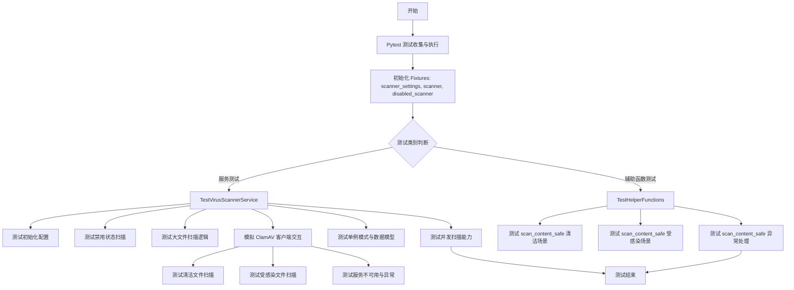

## 类结构

```
TestVirusScannerService (测试类)
├── scanner_settings (Fixture)
├── scanner (Fixture)
├── disabled_scanner (Fixture)
├── test_scanner_initialization
├── test_scan_disabled_returns_clean
├── test_scan_file_too_large
├── test_scan_file_too_large_both_configurations
├── test_scan_clean_file
├── test_scan_infected_file
├── test_scan_clamav_unavailable_fail_safe
├── test_scan_error_fail_safe
├── test_get_virus_scanner_singleton
├── test_scan_result_model
└── test_concurrent_scans

TestHelperFunctions (测试类)
├── test_scan_content_safe_clean
├── test_scan_content_safe_infected
└── test_scan_content_safe_scan_error
```

## 全局变量及字段


    

## 全局函数及方法


### `TestVirusScannerService.scanner_settings`

这是一个 pytest fixture 方法，用于创建并返回一个预配置的 `VirusScannerSettings` 实例，为病毒扫描服务的测试提供标准的配置参数。

参数：

- `self`：`TestVirusScannerService`，测试类的实例引用。

返回值：`VirusScannerSettings`，包含测试用病毒扫描配置的设置对象实例。

#### 流程图

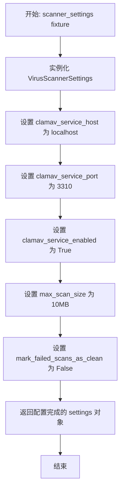

#### 带注释源码

```python
    @pytest.fixture  # 标记为 pytest 的 fixture，用于在测试用例中注入依赖
    def scanner_settings(self):
        # 返回一个配置好的 VirusScannerSettings 对象，模拟 ClamAV 服务的配置
        return VirusScannerSettings(
            clamav_service_host="localhost",        # 定义 ClamAV 服务监听的主机地址
            clamav_service_port=3310,                # 定义 ClamAV 服务监听的端口号
            clamav_service_enabled=True,             # 启用病毒扫描功能标志
            max_scan_size=10 * 1024 * 1024,          # 设置最大可扫描文件大小为 10MB (10485760 字节)
            mark_failed_scans_as_clean=False,        # 设置当扫描失败时，不将文件视为干净（安全策略）
        )
```


### `TestVirusScannerService.scanner`

这是一个 Pytest 测试夹具，用于在测试环境中创建和配置 `VirusScannerService` 实例。它通过依赖注入接收配置对象，并返回一个初始化后的服务对象，以便在测试用例中模拟和验证病毒扫描功能。

参数：

-   `self`：`TestVirusScannerService`，测试类的实例引用。
-   `scanner_settings`：`VirusScannerSettings`，依赖注入的配置对象，包含了 ClamAV 服务的主机、端口、启用状态及最大扫描大小等参数。

返回值：`VirusScannerService`，返回一个根据传入参数初始化完成的病毒扫描服务实例。

#### 流程图

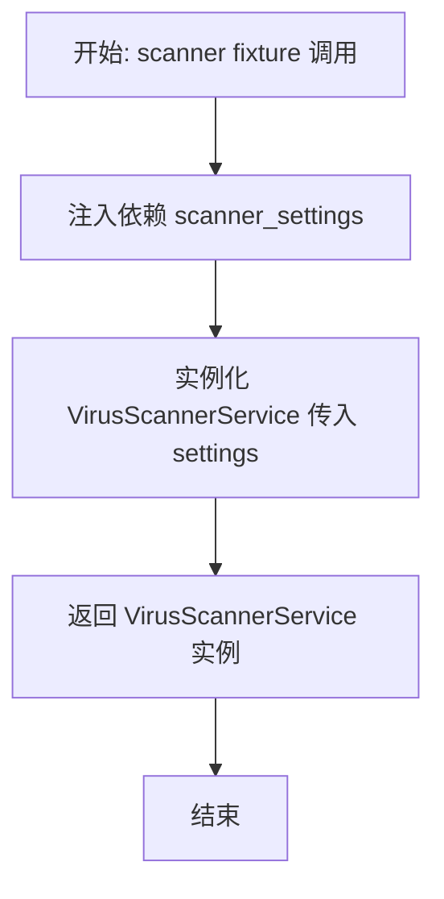

#### 带注释源码

```python
    @pytest.fixture
    def scanner(self, scanner_settings):
        # 使用提供的配置对象实例化病毒扫描器服务
        # 这样可以确保测试使用统一且可控的配置环境
        return VirusScannerService(scanner_settings)
```


### `TestVirusScannerService.disabled_scanner`

这是一个 pytest fixture 方法，用于创建并返回一个禁用了 ClamAV 服务的 `VirusScannerService` 实例。该 fixture 主要用于测试在病毒扫描功能被关闭时，扫描器的行为（例如验证其是否直接跳过扫描并返回干净的结果）。

参数：

-   `self`：`TestVirusScannerService`，测试类的实例引用，用于访问测试上下文。

返回值：`VirusScannerService`，返回一个配置为禁用状态 (`clamav_service_enabled=False`) 的病毒扫描服务实例。

#### 流程图

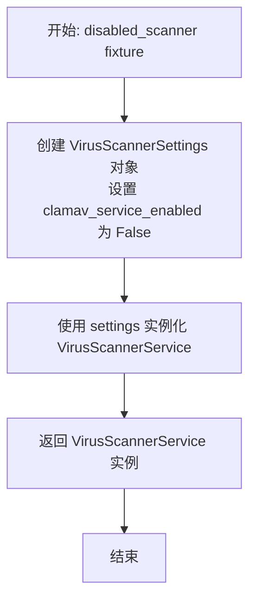

#### 带注释源码

```python
    @pytest.fixture
    def disabled_scanner(self):
        # 1. 创建病毒扫描器配置对象，明确将 ClamAV 服务启用状态设为 False
        settings = VirusScannerSettings(clamav_service_enabled=False)

        # 2. 使用该配置实例化 VirusScannerService 并返回，用于测试环境
        return VirusScannerService(settings)
```


### `TestVirusScannerService.test_scanner_initialization`

验证 `VirusScannerService` 是否能够正确接收并存储初始化期间提供的配置设置（`VirusScannerSettings`），确保主机、端口和服务启用状态等关键参数被正确赋值。

参数：

- `self`：`TestVirusScannerService`，测试类实例的引用。
- `scanner_settings`：`VirusScannerSettings`，由 pytest fixture 提供的配置对象，包含 ClamAV 服务的主机、端口、最大扫描大小等设置。

返回值：`None`，该函数为测试方法，无显式返回值，通过断言判断测试是否通过。

#### 流程图

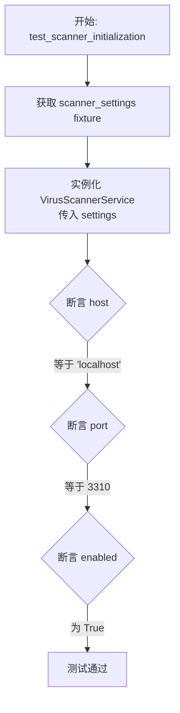

#### 带注释源码

```python
    def test_scanner_initialization(self, scanner_settings):
        # 使用提供的配置实例化病毒扫描服务
        scanner = VirusScannerService(scanner_settings)
        
        # 验证服务内部配置的 Host 是否正确
        assert scanner.settings.clamav_service_host == "localhost"
        
        # 验证服务内部配置的 Port 是否正确
        assert scanner.settings.clamav_service_port == 3310
        
        # 验证服务内部配置的 Enabled 状态是否正确
        assert scanner.settings.clamav_service_enabled is True
```


### `TestVirusScannerService.test_scan_disabled_returns_clean`

验证当病毒扫描服务功能被禁用时，对任意文件内容执行扫描操作将直接返回标记为“干净”的结果对象，且不包含威胁名称、扫描耗时为零以及正确的文件大小，确保禁用状态下的服务行为符合预期。

参数：

-  `self`：`TestVirusScannerService`，测试类实例的引用。
-  `disabled_scanner`：`VirusScannerService`，通过 fixture 注入的已禁用的病毒扫描服务实例（配置项 `clamav_service_enabled=False`）。

返回值：`None`，无返回值，主要通过断言验证逻辑正确性。

#### 流程图

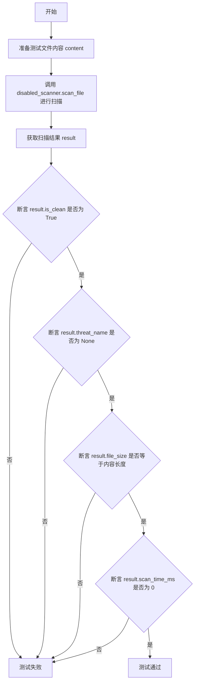

#### 带注释源码

```python
    @pytest.mark.asyncio
    async def test_scan_disabled_returns_clean(self, disabled_scanner):
        # 准备测试用的二进制文件内容
        content = b"test file content"
        # 调用被禁用的扫描器实例的 scan_file 方法，传入内容和文件名
        result = await disabled_scanner.scan_file(content, filename="test.txt")

        # 断言：验证扫描结果是否被标记为干净
        assert result.is_clean is True
        # 断言：验证威胁名称是否为空（即未发现威胁）
        assert result.threat_name is None
        # 断言：验证记录的文件大小是否正确
        assert result.file_size == len(content)
        # 断言：验证扫描耗时是否为 0（因为服务被禁用，未执行实际扫描）
        assert result.scan_time_ms == 0
```


### `TestVirusScannerService.test_scan_file_too_large`

该方法用于测试病毒扫描服务在处理文件大小超过配置的最大扫描限制时的行为，验证结果状态是否遵循 `mark_failed_scans_as_clean` 的配置规则。

参数：

-  `self`：`TestVirusScannerService`，测试类实例。
-  `scanner`：`VirusScannerService`，通过 fixture 注入的病毒扫描服务实例。

返回值：`None`，该方法为测试函数，无返回值。

#### 流程图

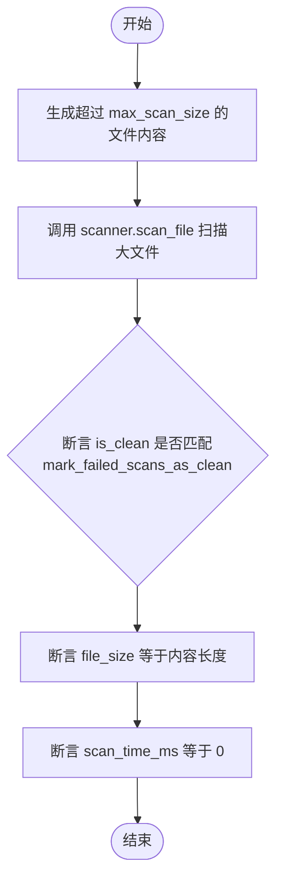

#### 带注释源码

```python
    async def test_scan_file_too_large(self, scanner):
        # 创建比 max_scan_size 大的内容 (超出限制 1 字节)
        large_content = b"x" * (scanner.settings.max_scan_size + 1)

        # 大文件的行为取决于 mark_failed_scans_as_clean 设置
        # 预期：扫描会因文件过大而失败/跳过，但结果取决于配置
        result = await scanner.scan_file(large_content, filename="large_file.txt")

        # 断言：is_clean 状态应等于配置中的 mark_failed_scans_as_clean 值
        assert result.is_clean == scanner.settings.mark_failed_scans_as_clean

        # 断言：记录的文件大小应等于实际内容大小
        assert result.file_size == len(large_content)

        # 断言：由于文件过大跳过扫描，扫描时间应为 0
        assert result.scan_time_ms == 0
```


### `TestVirusScannerService.test_scan_file_too_large_both_configurations`

该方法用于测试病毒扫描服务在处理超大文件（超过配置的最大扫描大小）时的行为，具体验证了当 `mark_failed_scans_as_clean` 配置分别为 `True` 和 `False` 两种情况下，扫描结果的 `is_clean` 属性是否符合预期。

参数：

-  `self`：`TestVirusScannerService`，测试类实例，由 pytest 框架自动注入。

返回值：`None`，该方法是测试用例，无返回值，通过断言验证逻辑。

#### 流程图

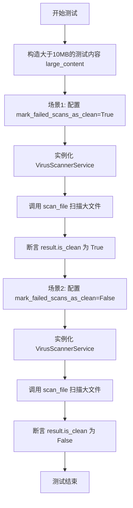

#### 带注释源码

```python
    async def test_scan_file_too_large_both_configurations(self):
        """Test large file handling with both mark_failed_scans_as_clean configurations"""
        # 1. 准备测试数据：生成大小超过 10MB 的字节内容
        large_content = b"x" * (10 * 1024 * 1024 + 1)  # Larger than 10MB

        # 2. 测试第一种配置：mark_failed_scans_as_clean = True
        # 预期行为：对于过大且无法扫描的文件，将其标记为干净（安全）
        settings_clean = VirusScannerSettings(
            max_scan_size=10 * 1024 * 1024, mark_failed_scans_as_clean=True
        )
        scanner_clean = VirusScannerService(settings_clean)
        result_clean = await scanner_clean.scan_file(
            large_content, filename="large_file.txt"
        )
        assert result_clean.is_clean is True

        # 3. 测试第二种配置：mark_failed_scans_as_clean = False
        # 预期行为：对于过大且无法扫描的文件，将其标记为不干净（潜在风险）
        settings_dirty = VirusScannerSettings(
            max_scan_size=10 * 1024 * 1024, mark_failed_scans_as_clean=False
        )
        scanner_dirty = VirusScannerService(settings_dirty)
        result_dirty = await scanner_dirty.scan_file(
            large_content, filename="large_file.txt"
        )
        assert result_dirty.is_clean is False
```


### `TestVirusScannerService.test_scan_clean_file`

该测试方法用于验证 `VirusScannerService` 在扫描未感染病毒的文件时的正确行为。通过模拟 ClamAV 客户端的行为，确保当扫描结果显示无病毒时，服务能返回正确的 `VirusScanResult` 对象，包含干净的标志、空的威胁名称、正确的文件大小以及大于零的扫描耗时。

参数：

- `self`：`TestVirusScannerService`，测试类的实例，用于访问测试上下文和 fixture。
- `scanner`：`VirusScannerService`，通过 fixture 注入的病毒扫描服务实例，已预先配置好相关设置。

返回值：`None`，该方法为单元测试，通过断言验证结果，不返回具体数值。

#### 流程图

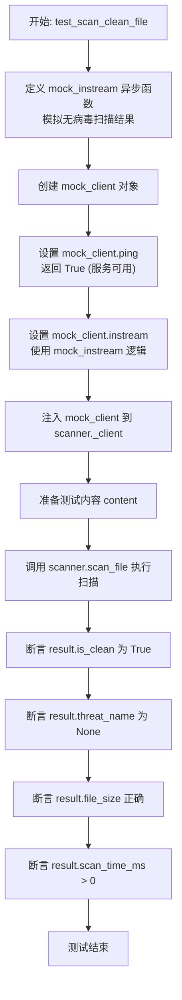

#### 带注释源码

```python
    @pytest.mark.asyncio
    async def test_scan_clean_file(self, scanner):
        # 定义一个异步函数来模拟 ClamAV 的 instream 接口行为
        # 参数 _ 是传入的数据流，在此忽略
        # 返回 None 表示未检测到病毒
        async def mock_instream(_):
            await asyncio.sleep(0.001)  # 模拟极小的网络或处理延迟，确保计时器记录的时间大于0
            return None  # 无病毒检测

        # 创建 Mock 对象模拟 ClamAV 客户端
        mock_client = Mock()
        # 模拟 ping 方法返回 True，表示服务连接正常
        mock_client.ping = AsyncMock(return_value=True)
        # 模拟 instream 方法，使用上面定义的 mock_instream 作为副作用逻辑
        mock_client.instream = AsyncMock(side_effect=mock_instream)

        # 将 scanner 实例内部的 _client 替换为我们的 mock_client
        # 这样在测试运行时，scanner 会使用模拟的客户端而非真实的 ClamAV
        scanner._client = mock_client

        # 准备测试用的二进制数据内容
        content = b"clean file content"
        
        # 调用被测方法 scan_file，传入内容和文件名
        result = await scanner.scan_file(content, filename="clean.txt")

        # --- 断言部分 ---
        # 验证扫描结果标志为 True（干净）
        assert result.is_clean is True
        # 验证威胁名称为 None（无威胁）
        assert result.threat_name is None
        # 验证记录的文件大小与实际内容大小一致
        assert result.file_size == len(content)
        # 验证扫描耗时大于 0（确保扫描逻辑确实执行了）
        assert result.scan_time_ms > 0
```


### `TestVirusScannerService.test_scan_infected_file`

测试病毒扫描服务在扫描包含病毒特征的文件时，能够正确检测到威胁、返回威胁名称并记录扫描时长。

参数：

- `self`：`TestVirusScannerService`，测试类实例
- `scanner`：`VirusScannerService`，通过 fixture 注入的病毒扫描服务实例

返回值：`None`，该方法为单元测试，无返回值

#### 流程图

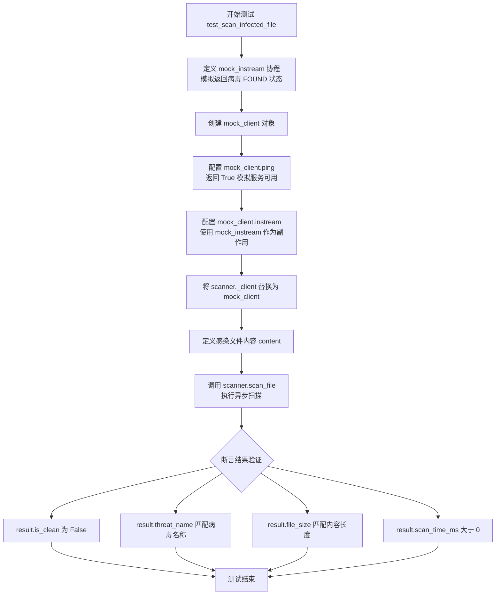

#### 带注释源码

```python
@pytest.mark.asyncio
async def test_scan_infected_file(self, scanner):
    # 定义模拟的 instream 协程，模拟 ClamAV 检测到病毒的行为
    async def mock_instream(_):
        await asyncio.sleep(0.001)  # 模拟微小延迟以确保扫描耗时记录 > 0
        # 返回包含 FOUND 状态和特定病毒名称的字典
        return {"stream": ("FOUND", "Win.Test.EICAR_HDB-1")}

    # 创建 Mock 客户端对象
    mock_client = Mock()
    # 模拟 ping 方法返回 True，表示 ClamAV 服务可达
    mock_client.ping = AsyncMock(return_value=True)
    # 模拟 instream 方法，使用上面定义的 mock_instream 协程
    mock_client.instream = AsyncMock(side_effect=mock_instream)

    # 将 scanner 实例内部的 _client 替换为我们的 mock 客户端，
    # 从而绕过真实的网络连接和 ClamAV 服务
    scanner._client = mock_client

    # 准备测试用的二进制内容（模拟被感染的文件）
    content = b"infected file content"
    # 调用 scan_file 方法进行异步扫描
    result = await scanner.scan_file(content, filename="infected.txt")

    # 验证扫描结果：文件应被标记为不干净
    assert result.is_clean is False
    # 验证扫描结果：威胁名称应与模拟返回的病毒名称一致
    assert result.threat_name == "Win.Test.EICAR_HDB-1"
    # 验证扫描结果：文件大小应正确记录
    assert result.file_size == len(content)
    # 验证扫描结果：扫描耗时应大于 0
    assert result.scan_time_ms > 0
```


### `TestVirusScannerService.test_scan_clamav_unavailable_fail_safe`

该测试方法验证了在 ClamAV 服务不可用（ping 返回 false）的情况下，病毒扫描服务是否能正确触发故障安全机制，抛出带有指定错误信息的 RuntimeError。

参数：

- `self`：`TestVirusScannerService`，测试类的实例。
- `scanner`：`VirusScannerService`，通过 pytest fixture 注入的病毒扫描器实例。

返回值：`None`，该方法为异步测试函数，无返回值，主要验证是否抛出预期的异常。

#### 流程图

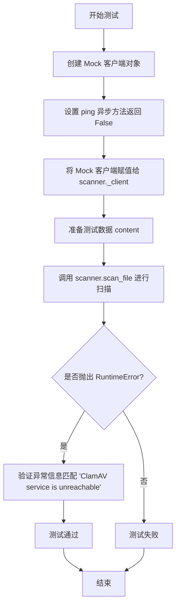

#### 带注释源码

```python
    @pytest.mark.asyncio
    async def test_scan_clamav_unavailable_fail_safe(self, scanner):
        # 创建一个模拟的客户端对象，用于模拟 ClamAV 连接
        mock_client = Mock()
        # 设置模拟客户端的 ping 方法返回 False，模拟服务不可达的场景
        mock_client.ping = AsyncMock(return_value=False)

        # 将 scanner 实例内部的 _client 替换为我们的模拟客户端
        # 这样在调用 scan_file 时就会使用这个模拟对象
        scanner._client = mock_client

        # 准备一段二进制内容作为待扫描的文件内容
        content = b"test content"

        # 使用 pytest.raises 上下文管理器验证代码块是否抛出 RuntimeError
        # 并检查异常消息是否包含 "ClamAV service is unreachable"
        with pytest.raises(RuntimeError, match="ClamAV service is unreachable"):
            await scanner.scan_file(content, filename="test.txt")
```


### `TestVirusScannerService.test_scan_error_fail_safe`

测试 VirusScannerService 在扫描过程中发生底层错误时的异常处理机制，验证服务是否能正确抛出扫描过程中的异常。

参数：

- `self`：`TestVirusScannerService`，测试类的实例，由 pytest 框架自动注入。
- `scanner`：`VirusScannerService`，病毒扫描器服务实例，通过 pytest fixture 注入，用于执行测试。

返回值：`None`，该方法为单元测试，无返回值，主要通过断言验证行为。

#### 流程图

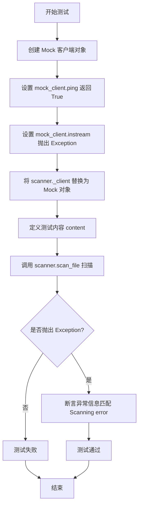

#### 带注释源码

```python
    @pytest.mark.asyncio
    async def test_scan_error_fail_safe(self, scanner):
        # 创建一个 Mock 客户端对象，用于模拟 ClamAV 客户端行为
        mock_client = Mock()
        # 设置 ping 方法返回 True，模拟服务可用
        mock_client.ping = AsyncMock(return_value=True)
        # 设置 instream 方法抛出 Exception，模拟扫描过程中发生错误
        mock_client.instream = AsyncMock(side_effect=Exception("Scanning error"))

        # 将 scanner 实例内部使用的 _client 替换为我们的 mock 对象
        scanner._client = mock_client

        # 定义待扫描的测试内容
        content = b"test content"

        # 使用 pytest.raises 验证调用 scan_file 时确实抛出了异常
        # 并检查异常消息是否包含 "Scanning error"
        with pytest.raises(Exception, match="Scanning error"):
            await scanner.scan_file(content, filename="test.txt")
```


### `TestVirusScannerService.test_get_virus_scanner_singleton`

该测试方法用于验证全局函数 `get_virus_scanner` 是否实现了单例模式，确保多次调用该函数返回的是同一个病毒扫描服务实例。

参数：

-   `self`：`TestVirusScannerService`，测试类的实例，用于访问测试上下文或其他测试 fixtures。

返回值：`None`，这是一个 pytest 测试方法，主要用于断言验证，不返回实际业务数据。

#### 流程图

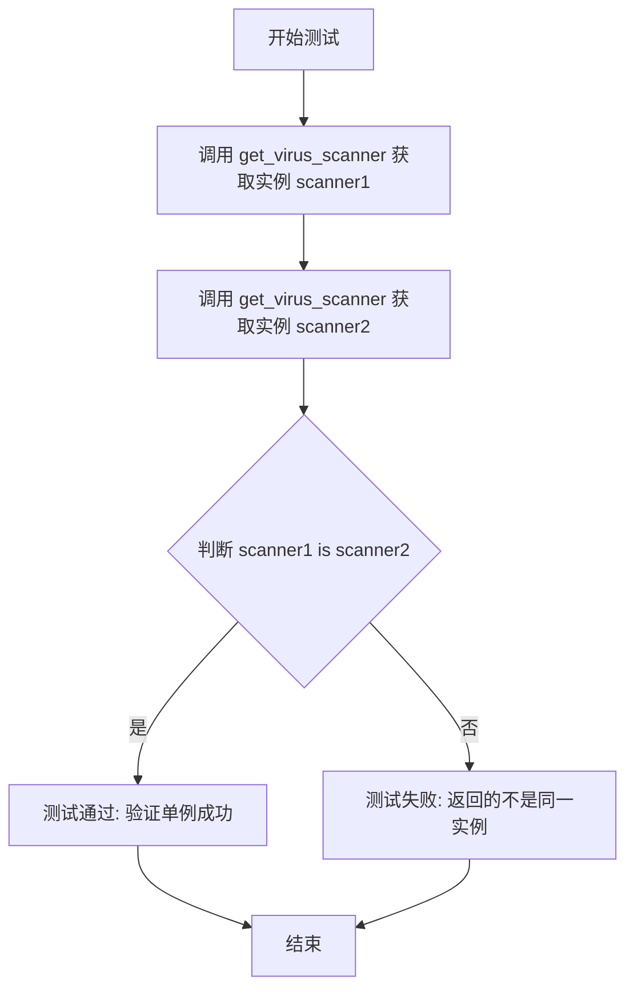

#### 带注释源码

```python
def test_get_virus_scanner_singleton(self):
    # 第一次调用全局函数获取病毒扫描器实例
    scanner1 = get_virus_scanner()
    # 第二次调用全局函数获取病毒扫描器实例
    scanner2 = get_virus_scanner()

    # 断言两个变量引用的是同一个对象，确保单例模式生效
    assert scanner1 is scanner2
```


### `TestVirusScannerService.test_scan_result_model`

该方法用于验证 `VirusScanResult` 数据模型的正确性。它通过创建一个包含特定属性值的实例，并断言这些属性值能够被正确存储和访问，从而确保病毒扫描结果的数据结构符合预期。

参数：

- `self`：`TestVirusScannerService`，测试类的实例，由 pytest 框架自动注入。

返回值：`None`，该方法不返回任何值，主要用于断言验证。

#### 流程图

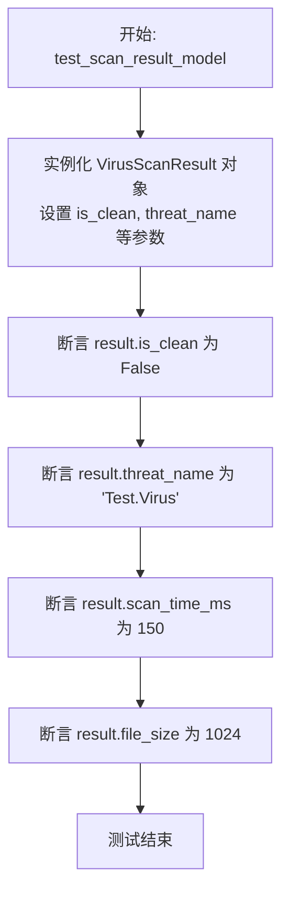

#### 带注释源码

```python
def test_scan_result_model(self):
    # 测试 VirusScanResult 模型
    # 初始化一个扫描结果对象，模拟发现病毒的场景
    result = VirusScanResult(
        is_clean=False,          # 标记文件不干净
        threat_name="Test.Virus",# 指定威胁名称
        scan_time_ms=150,         # 模拟扫描耗时
        file_size=1024            # 模拟文件大小
    )

    # 验证 is_clean 属性是否正确设置为 False
    assert result.is_clean is False
    # 验证 threat_name 属性是否正确记录了病毒名称
    assert result.threat_name == "Test.Virus"
    # 验证 scan_time_ms 属性是否正确记录了扫描时间
    assert result.scan_time_ms == 150
    # 验证 file_size 属性是否正确记录了文件大小
    assert result.file_size == 1024
```


### `TestVirusScannerService.test_concurrent_scans`

该方法用于验证 `VirusScannerService` 在高并发场景下的正确性与稳定性。通过模拟 ClamAV 客户端行为，同时触发对两个不同文件的异步扫描任务，确保服务能够正确处理并发请求，且各自返回独立的、准确的扫描结果，验证其线程安全性和异步处理能力。

参数：

- `self`：`TestVirusScannerService`，测试类的实例，用于访问测试上下文和断言方法。
- `scanner`：`VirusScannerService`，病毒扫描器服务实例，由 pytest fixture 注入，是被测试的核心对象。

返回值：`None`，该方法是单元测试函数，不返回业务数据，通过内部断言来验证逻辑正确性。

#### 流程图

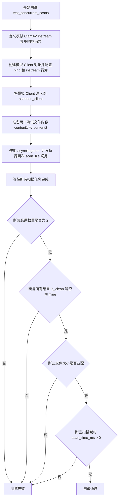

#### 带注释源码

```python
    @pytest.mark.asyncio
    async def test_concurrent_scans(self, scanner):
        # 定义一个模拟的异步扫描函数，模拟 ClamAV 服务端的行为
        # 接收输入流参数，短暂延迟后返回 None，表示未检测到病毒
        async def mock_instream(_):
            await asyncio.sleep(0.001)  # 小延迟以确保计时器记录到非零时间
            return None

        # 创建模拟客户端对象
        mock_client = Mock()
        # 配置 ping 方法为异步 Mock，返回 True 表示服务在线
        mock_client.ping = AsyncMock(return_value=True)
        # 配置 instream 方法为异步 Mock，使用上面定义的 mock_instream 函数作为副作用逻辑
        mock_client.instream = AsyncMock(side_effect=mock_instream)

        # 将测试用 scanner 实例内部的 _client 替换为我们的模拟客户端
        # 从而避免真实连接 ClamAV 服务
        scanner._client = mock_client

        # 准备两份不同的二进制测试内容
        content1 = b"file1 content"
        content2 = b"file2 content"

        # 使用 asyncio.gather 并发启动两个扫描任务
        # 这会同时调用 scanner.scan_file，模拟并发场景
        results = await asyncio.gather(
            scanner.scan_file(content1, filename="file1.txt"),
            scanner.scan_file(content2, filename="file2.txt"),
        )

        # 验证返回的结果列表包含两个结果
        assert len(results) == 2
        # 验证两个扫描结果均显示为干净（无病毒）
        assert all(result.is_clean for result in results)
        # 验证第一个结果的文件大小与输入一致
        assert results[0].file_size == len(content1)
        # 验证第二个结果的文件大小与输入一致
        assert results[1].file_size == len(content2)
        # 验证两个结果都记录了扫描耗时（确保扫描逻辑确实被执行了）
        assert all(result.scan_time_ms > 0 for result in results)
```


### `TestHelperFunctions.test_scan_content_safe_clean`

该方法用于测试 `scan_content_safe` 函数在处理无病毒内容时的行为。它通过 mock (模拟) `get_virus_scanner` 函数，使其返回一个配置好的模拟扫描器，该扫描器返回内容干净的扫描结果，进而验证 `scan_content_safe` 在此场景下能正常执行且不抛出异常。

参数：

-  `self`：`TestHelperFunctions`，测试类的实例。

返回值：`None`，该测试方法无显式返回值。

#### 流程图

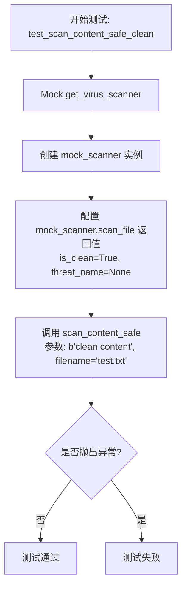

#### 带注释源码

```python
@pytest.mark.asyncio
async def test_scan_content_safe_clean(self):
    """Test scan_content_safe with clean content"""
    # 使用 patch 替换 backend.util.virus_scanner.get_virus_scanner 函数
    with patch("backend.util.virus_scanner.get_virus_scanner") as mock_get_scanner:
        # 创建模拟的扫描器对象
        mock_scanner = Mock()
        # 设置 scan_file 为异步 Mock
        mock_scanner.scan_file = AsyncMock()
        # 配置 scan_file 的返回值为一个干净的扫描结果 Mock 对象
        mock_scanner.scan_file.return_value = Mock(
            is_clean=True, threat_name=None, scan_time_ms=50, file_size=100
        )
        # 设置 get_virus_scanner 的返回值为上面创建的 mock_scanner
        mock_get_scanner.return_value = mock_scanner

        # 调用待测函数，预期不应该抛出任何异常
        await scan_content_safe(b"clean content", filename="test.txt")
```


### `TestHelperFunctions.test_scan_content_safe_infected`

该方法是一个单元测试，用于验证 `scan_content_safe` 辅助函数在处理受感染内容时的行为。它通过模拟病毒扫描服务返回“发现病毒”的结果，确保函数能够正确抛出 `VirusDetectedError` 异常，并验证异常对象中包含正确的威胁名称（threat_name）。

参数：

-  `self`：`TestHelperFunctions`，测试类的实例，由 pytest 框架自动注入，用于访问测试上下文和断言方法。

返回值：`None`，该函数为测试用例，不返回具体数值，通过抛出异常或断言成功来表示测试通过。

#### 流程图

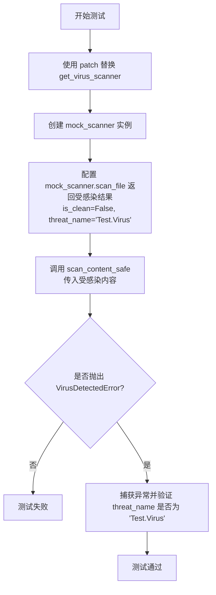

#### 带注释源码

```python
    @pytest.mark.asyncio
    async def test_scan_content_safe_infected(self):
        """Test scan_content_safe with infected content"""
        # 使用 patch 装饰器上下文管理器替换后端的 get_virus_scanner 函数
        # 这样可以在测试中控制扫描器的行为，而不依赖真实的 ClamAV 服务
        with patch("backend.util.virus_scanner.get_virus_scanner") as mock_get_scanner:
            # 创建一个模拟的扫描器对象
            mock_scanner = Mock()
            # 设置模拟扫描器的 scan_file 方法为异步 Mock
            mock_scanner.scan_file = AsyncMock()
            # 配置 scan_file 方法的返回值，模拟检测到病毒的场景
            # is_clean=False 表示文件不干净，threat_name 指定了病毒名称
            mock_scanner.scan_file.return_value = Mock(
                is_clean=False, threat_name="Test.Virus", scan_time_ms=50, file_size=100
            )
            # 设置 get_virus_scanner 的返回值为我们创建的 mock_scanner
            mock_get_scanner.return_value = mock_scanner

            # 验证代码块：预期 scan_content_safe 会抛出 VirusDetectedError 异常
            with pytest.raises(VirusDetectedError) as exc_info:
                # 调用待测函数，传入模拟的受感染内容
                await scan_content_safe(b"infected content", filename="virus.txt")

            # 断言：检查捕获到的异常对象中的 threat_name 属性是否为 "Test.Virus"
            assert exc_info.value.threat_name == "Test.Virus"
```


### `TestHelperFunctions.test_scan_content_safe_scan_error`

该测试方法用于验证当底层病毒扫描服务抛出通用异常导致扫描失败时，`scan_content_safe` 辅助函数是否能正确捕获异常并将其转换为特定的 `VirusScanError` 异常。

参数：

- `self`：`TestHelperFunctions`，测试类实例，用于访问测试上下文和断言方法。

返回值：`None`，该方法为单元测试，无返回值，通过断言检查预期行为。

#### 流程图

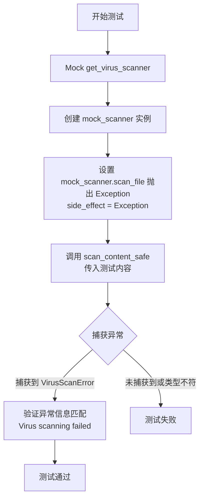

#### 带注释源码

```python
    @pytest.mark.asyncio
    async def test_scan_content_safe_scan_error(self):
        """Test scan_content_safe when scanning fails"""
        # 使用 patch 模拟 get_virus_scanner 函数，避免真实连接扫描服务
        with patch("backend.util.virus_scanner.get_virus_scanner") as mock_get_scanner:
            # 创建一个模拟的扫描器对象
            mock_scanner = Mock()
            # 将 scan_file 方法设置为异步模拟对象
            mock_scanner.scan_file = AsyncMock()
            # 设置 scan_file 被调用时抛出通用异常，模拟扫描过程发生错误
            mock_scanner.scan_file.side_effect = Exception("Scan failed")
            # 设置 get_virus_scanner 返回我们创建的模拟扫描器
            mock_get_scanner.return_value = mock_scanner

            # 断言上下文：预期调用 scan_content_safe 会抛出 VirusScanError
            # 并且错误消息匹配 "Virus scanning failed"
            # 这验证了辅助函数能正确处理底层扫描异常并转换为自定义异常
            with pytest.raises(VirusScanError, match="Virus scanning failed"):
                await scan_content_safe(b"test content", filename="test.txt")
```


## 关键组件


### VirusScannerService

提供与 ClamAV 服务交互的核心功能，包括初始化、连接检查和执行文件扫描。

### VirusScannerSettings

管理病毒扫描服务的配置参数，如服务地址、端口、开关状态以及扫描限制（如最大文件大小）。

### VirusScanResult

封装扫描操作的输出数据，包含文件是否安全的标志、威胁名称、扫描耗时和文件大小。

### Fail-Safe Mechanism

一种容错机制，允许配置当服务不可用或文件过大时的行为（标记为干净或报错）。

### scan_content_safe

辅助函数，用于安全地执行内容扫描，并根据扫描结果抛出特定领域的异常或静默成功。

### get_virus_scanner

单例模式的工厂函数，用于全局获取唯一的病毒扫描服务实例。

### 异常处理机制

定义了特定的业务异常（VirusDetectedError, VirusScanError），用于在发现病毒或扫描失败时向上层传递错误信息。


## 问题及建议


### 已知问题

-   **安全配置风险**：逻辑中存在 `mark_failed_scans_as_clean` 配置项，允许在文件过大或服务不可达等异常情况下将文件标记为“干净”。这种“故障即开放”的策略在生产环境中可能导致恶意文件绕过检查，存在严重的安全隐患。
-   **测试实现侵入性过强**：测试代码通过直接修改私有属性 `scanner._client` 来注入 Mock 对象。这种做法严重依赖于类的内部实现细节（封装被破坏），一旦内部重构（例如变量重命名或初始化逻辑变更），测试将立即失败。
-   **不稳定的时序测试逻辑**：测试中使用 `await asyncio.sleep(0.001)` 来确保 `scan_time_ms > 0`。这种依赖系统调度和实际等待时间的测试方式不仅拖慢测试速度，而且在不同的负载环境下可能导致结果不稳定。
-   **异常处理颗粒度不足**：测试中捕获了通用的 `RuntimeError` 和 `Exception`。缺乏特定的业务异常层级（如连接超时、协议错误等），使得上层调用者难以根据错误类型实施针对性的重试或降级策略。
-   **大文件处理的逻辑陷阱**：当文件超过 `max_scan_size` 时，系统直接跳过扫描。虽然这保护了服务资源，但单纯依赖配置返回“干净”或“受感染”而没有进行任何内容检查，可能被利用为攻击向量（例如通过 padding 绕过检查）。

### 优化建议

-   **采用 Mock 时间代替延时**：建议使用 `unittest.mock.patch` 替换时间获取函数（如 `time.time` 或 `asyncio.get_event_loop().time`），直接控制返回值来计算扫描耗时。这将消除对 `sleep` 的依赖，使测试速度更快且结果绝对确定。
-   **改进 Mock 策略以增强封装**：应 Mock 底层网络库的构造函数或工厂方法（例如 `pyclamd.ClamdUnixSocket`），而不是在对象创建后强行替换私有属性 `_client`。这符合“黑盒测试”原则，提高测试代码的健壮性。
-   **细化异常体系**：定义更具体的异常类，如 `VirusScannerConnectionError`、`VirusScannerTimeoutError` 或 `VirusScannerProtocolError`。上层代码可以根据这些特定异常实现更精细的错误处理（例如仅对连接错误重试）。
-   **引入超时机制测试**：目前的测试未覆盖扫描超时的场景。建议在代码层面增加扫描超时配置，并编写测试用例验证在扫描服务无响应时，系统能否及时中断并抛出超时异常，防止资源耗尽。
-   **提取魔法数字为常量**：将代码中的 `3310` (端口)、`10 * 1024 * 1024` (大小限制)、`0.001` (延迟) 等硬编码值提取为类常量或配置参数，提高代码的可读性和可维护性。
-   **增强并发测试的验证维度**：目前的并发测试仅验证了返回值的正确性。建议增加对连接池状态、资源释放情况或并发锁行为的验证，确保在高并发下不会出现连接泄漏或竞态条件。


## 其它


### 设计目标与约束

1.  **安全性设计目标**：确保系统上传的文件内容经过病毒扫描，防止恶意软件进入系统。支持对检测到的病毒进行识别（返回威胁名称）。
2.  **可用性与性能约束**：
    *   **异步非阻塞**：扫描服务必须基于 `asyncio` 实现，以避免阻塞主事件循环，支持并发文件扫描。
    *   **资源限制**：必须严格限制可扫描文件的最大大小（`max_scan_size`），防止服务因处理超大文件而耗尽内存或超时。
    *   **故障策略**：提供可配置的故障安全机制（`mark_failed_scans_as_clean`），允许在服务不可用或扫描失败时，选择拒绝服务（报错）或放行（标记为干净），以平衡安全性与可用性。
3.  **配置灵活性**：支持动态配置 ClamAV 服务的地址、端口及开关状态，无需修改代码即可适配不同的部署环境（如测试环境禁用扫描）。

### 错误处理与异常设计

1.  **异常层次结构**：
    *   **业务逻辑异常**：
        *   `VirusDetectedError`：当扫描结果显示文件包含病毒时抛出，封装威胁名称（`threat_name`）。
        *   `VirusScanError`：当扫描过程发生通用错误（如扫描器内部错误）时抛出。
    *   **系统级异常**：
        *   `RuntimeError`：当 ClamAV 服务不可达（ping 失败）时抛出，提示 "ClamAV service is unreachable"。
        *   `Exception`：保留对底层未知错误的透传能力。
2.  **错误处理策略**：
    *   **快速失败**：在扫描开始前检查文件大小，如果超过限制直接返回结果（根据配置决定 Clean 或 Dirty），不消耗网络 I/O 资源。
    *   **服务降级**：当 `clamav_service_enabled` 为 `False` 时，系统自动降级，直接返回“干净”结果，且扫描耗时记为 0。
    *   **封装转换**：辅助函数 `scan_content_safe` 负责将底层的 `VirusScanResult` 对象转换为高层异常，简化调用方的错误处理逻辑。

### 数据流与状态机

1.  **数据流向**：
    *   **输入**：原始二进制数据 (`bytes`) 和文件名 (`str`)。
    *   **前置检查**：配置加载 -> 服务启用状态检查 -> 文件大小检查。
    *   **处理**：建立 ClamAV 连接 -> 发送数据流 -> 接收扫描响应。
    *   **输出**：`VirusScanResult` 对象（包含是否干净、威胁名、耗时、文件大小）或抛出异常。
2.  **处理状态机**：
    *   `Idle` (初始态) -> 接收到扫描请求。
    *   `Validating` (校验态) -> 检查配置与大小。若 `disabled` 或 `size > max` -> 跳转至 `Finished`。若服务不可用 -> 跬转至 `Error`。
    *   `Scanning` (扫描态) -> 与 ClamAV 通信。
    *   `Analyzing` (分析态) -> 解析 ClamAV 返回的协议（是否包含 'FOUND' 标记）。
    *   `Finished` (结束态) -> 返回结构化结果。

### 外部依赖与接口契约

1.  **ClamAV 网络服务**：
    *   **依赖描述**：依赖外部的 ClamAV 反病毒守护进程。
    *   **接口契约**：
        *   **协议**：TCP/IP sockets。
        *   **健康检查**：`ping()` 方法必须返回布尔值 `True` 表示服务在线。
        *   **扫描接口**：`instream(data)` 方法接收文件流，返回特定格式的响应。若无病毒返回 `None` 或特定格式；若发现病毒返回类似 `{'stream': ('FOUND', 'VirusName')}` 的结构。
    *   **连接管理**：测试代码暗示了内部持有一个 `_client` 对象，该对象封装了与 ClamAV 的网络交互细节。
2.  **单例管理器**：
    *   `get_virus_scanner()` 函数契约：保证在进程生命周期内返回唯一的 `VirusScannerService` 实例，共享配置和连接状态。

### 并发控制与性能考量

1.  **并发模型**：
    *   服务设计为异步 I/O 模型，利用 `asyncio` 实现高并发处理。
    *   测试用例 `test_concurrent_scans` 验证了多个扫描任务 (`scan_file`) 可以并行执行，且彼此结果互不干扰。
2.  **性能指标**：
    *   **耗时计量**：精确记录每次扫描的毫秒级耗时 (`scan_time_ms`)，用于监控和性能分析。
    *   **大文件优化**：通过 `max_scan_size` 预先拦截超大文件，避免无效的长耗时网络传输和扫描操作。
3.  **资源复用**：
    *   隐含了客户端连接 (`_client`) 的复用机制，避免每次扫描都重新建立 TCP 连接（尽管具体复用逻辑在源码中未完全展示，但测试中替换 `_client` 的做法佐证了其存在）。

### 测试策略与质量保证

1.  **Mock 驱动测试**：
    *   广泛使用 `unittest.mock` (Mock, AsyncMock, patch) 来模拟 ClamAV 客户端的行为，隔离了外部网络依赖，确保单元测试的稳定性和执行速度。
2.  **边界条件覆盖**：
    *   覆盖了文件大小刚好超过限制 (`max_scan_size + 1`) 的场景。
    *   覆盖了配置开关 (`enabled=True/False`) 的二态场景。
3.  **异常路径测试**：
    *   专门验证了服务不可达 (`ping=False`) 和扫描过程抛出异常时的系统行为，确保错误处理的健壮性。
4.  **辅助函数验证**：
    *   对 `scan_content_safe` 进行独立测试，确认其能正确地将结果对象映射为领域异常 (`VirusDetectedError`, `VirusScanError`)。

    