# `.\AutoGPT\autogpt_platform\backend\backend\util\workspace.py` 详细设计文档

该代码定义了一个 WorkspaceManager 类，用于管理用户工作区文件操作，协调存储后端和数据库层。它支持会话作用域的文件虚拟化、安全检查（病毒扫描、大小限制）以及包括读、写、列表和删除在内的各种文件管理方法。

## 整体流程

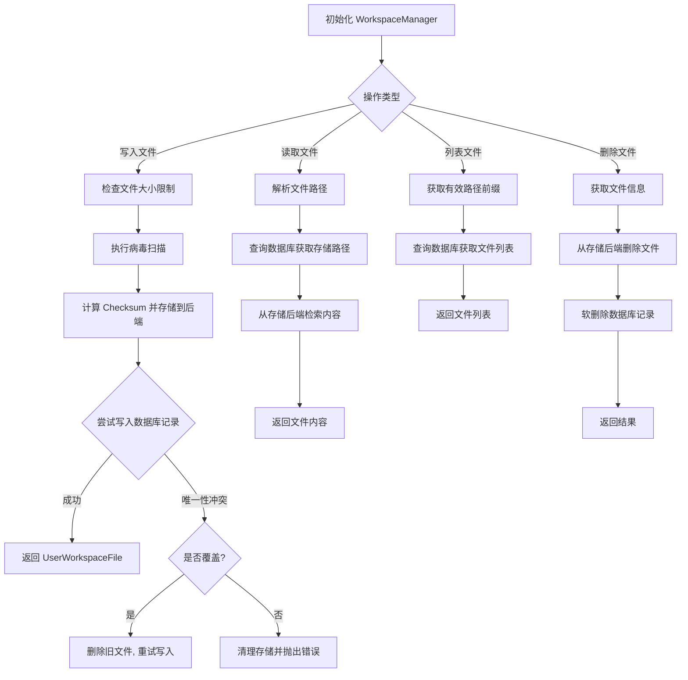

## 类结构

```
WorkspaceManager
```

## 全局变量及字段


### `logger`
    
模块级别的日志记录器，用于记录操作信息与异常。

类型：`logging.Logger`
    


### `WorkspaceManager.user_id`
    
当前用户的唯一标识符。

类型：`str`
    


### `WorkspaceManager.workspace_id`
    
当前操作的工作空间的唯一标识符。

类型：`str`
    


### `WorkspaceManager.session_id`
    
可选的会话ID，用于限定文件操作在特定会话作用域内。

类型：`Optional[str]`
    


### `WorkspaceManager.session_path`
    
基于session_id计算的会话路径前缀，用于文件隔离。

类型：`str`
    
    

## 全局函数及方法


### `WorkspaceManager.__init__`

初始化 WorkspaceManager 实例，设置用户 ID、工作区 ID 以及可选的会话 ID，用于构建基于会话的文件路径隔离机制。

参数：

-   `user_id`：`str`，用户的唯一标识符。
-   `workspace_id`：`str`，工作区的唯一标识符。
-   `session_id`：`Optional[str]`，可选的会话标识符，用于实现基于会话的文件访问隔离。

返回值：`None`，构造函数无返回值。

#### 流程图

```mermaid
flowchart TD
    A([开始 __init__]) --> B[接收 user_id, workspace_id, session_id]
    B --> C[设置 self.user_id = user_id]
    C --> D[设置 self.workspace_id = workspace_id]
    D --> E[设置 self.session_id = session_id]
    E --> F{session_id 是否为 None 或空?}
    F -- 否 --> G[设置 self.session_path = f\"/sessions/{session_id}\"]
    F -- 是 --> H[设置 self.session_path = \"\"]
    G --> I([结束])
    H --> I
```

#### 带注释源码

```python
def __init__(
    self, user_id: str, workspace_id: str, session_id: Optional[str] = None
):
    """
    Initialize WorkspaceManager.

    Args:
        user_id: The user's ID
        workspace_id: The workspace ID
        session_id: Optional session ID for session-scoped file access
    """
    # 初始化用户 ID
    self.user_id = user_id
    # 初始化工作区 ID
    self.workspace_id = workspace_id
    # 初始化会话 ID
    self.session_id = session_id
    # Session path prefix for file isolation
    # 根据是否存在 session_id 计算会话路径前缀，用于后续文件操作的路径隔离
    self.session_path = f"/sessions/{session_id}" if session_id else ""
```


### `WorkspaceManager._resolve_path`

根据当前会话上下文解析给定的虚拟文件路径。如果路径显式以 `/sessions/` 开头，则视为跨会话访问并原样返回；否则，如果当前存在会话上下文，则将会话前缀添加到路径前；如果不存在会话上下文，则仅规范化路径格式（确保以 `/` 开头）。

参数：

- `path`：`str`，待解析的虚拟路径（例如 "/file.txt" 或 "file.txt"）

返回值：`str`，解析后的完整路径字符串

#### 流程图

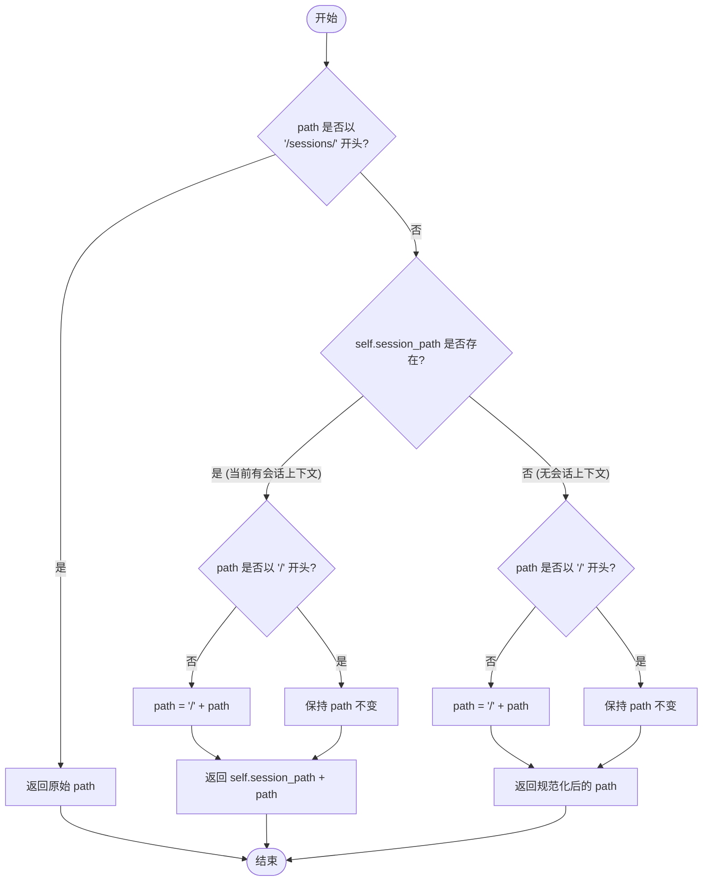

#### 带注释源码

```python
def _resolve_path(self, path: str) -> str:
    """
    Resolve a path, defaulting to session folder if session_id is set.

    Cross-session access is allowed by explicitly using /sessions/other-session-id/...

    Args:
        path: Virtual path (e.g., "/file.txt" or "/sessions/abc123/file.txt")

    Returns:
        Resolved path with session prefix if applicable
    """
    # 1. 如果路径显式引用了某个会话文件夹（跨会话访问），则直接使用原路径
    if path.startswith("/sessions/"):
        return path

    # 2. 如果当前存在会话上下文（即初始化时传入了 session_id）
    if self.session_path:
        # 规范化路径：确保路径以 "/" 开头
        if not path.startswith("/"):
            path = f"/{path}"
        # 拼接当前会话路径前缀和相对路径
        return f"{self.session_path}{path}"

    # 3. 如果没有会话上下文，规范化路径后直接返回
    # 确保根路径级别的文件以 "/" 开头
    return path if path.startswith("/") else f"/{path}"
```


### `WorkspaceManager._get_effective_path`

Get effective path for list/count operations based on session context. This method determines the actual path prefix to be used in database queries, considering session isolation rules and path normalization.

参数：

- `path`：`Optional[str]`，Optional path prefix to filter (可选的路径前缀，用于过滤)
- `include_all_sessions`：`bool`，If True, don't apply session scoping (如果为 True，则不应用会话作用域限制)

返回值：`Optional[str]`，Effective path prefix for database query (用于数据库查询的有效路径前缀)

#### 流程图

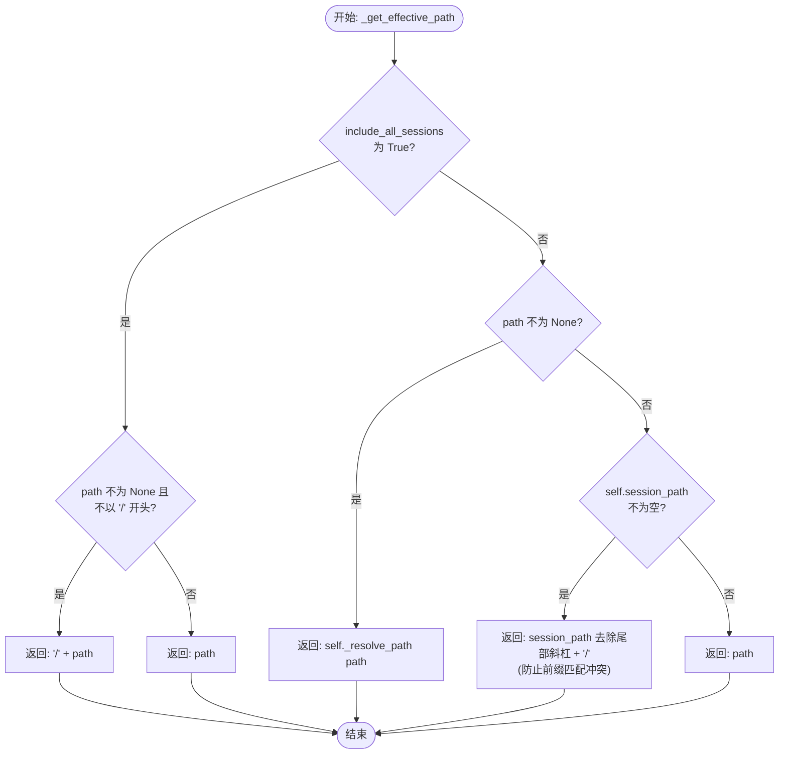

#### 带注释源码

```python
def _get_effective_path(
    self, path: Optional[str], include_all_sessions: bool
) -> Optional[str]:
    """
    Get effective path for list/count operations based on session context.

    Args:
        path: Optional path prefix to filter
        include_all_sessions: If True, don't apply session scoping

    Returns:
        Effective path prefix for database query
    """
    if include_all_sessions:
        # 如果请求包含所有会话，则忽略会话作用域
        # 规范化路径以确保以斜杠开头（存储的路径已规范化）
        if path is not None and not path.startswith("/"):
            return f"/{path}"
        return path
    elif path is not None:
        # 如果指定了特定路径，结合会话作用域进行解析
        return self._resolve_path(path)
    elif self.session_path:
        # 如果没有指定路径但存在会话上下文，
        # 默认为会话文件夹，并添加尾部斜杠以防止前缀冲突
        # 例如，"/sessions/abc" 不应匹配 "/sessions/abc123"
        return self.session_path.rstrip("/") + "/"
    else:
        # 没有会话上下文，按原样使用路径
        return path
```


### `WorkspaceManager.read_file`

根据虚拟路径从工作区读取文件内容。该方法会自动处理路径解析，将其映射到当前会话的作用域（如果已设置），并从数据库中查找对应的文件元数据，最终从存储后端检索文件的二进制数据。

参数：

- `path`：`str`，文件的虚拟路径（例如 "/documents/report.pdf"）。如果设置了 session_id，路径将相对于会话文件夹进行解析。

返回值：`bytes`，文件内容的二进制数据。

#### 流程图

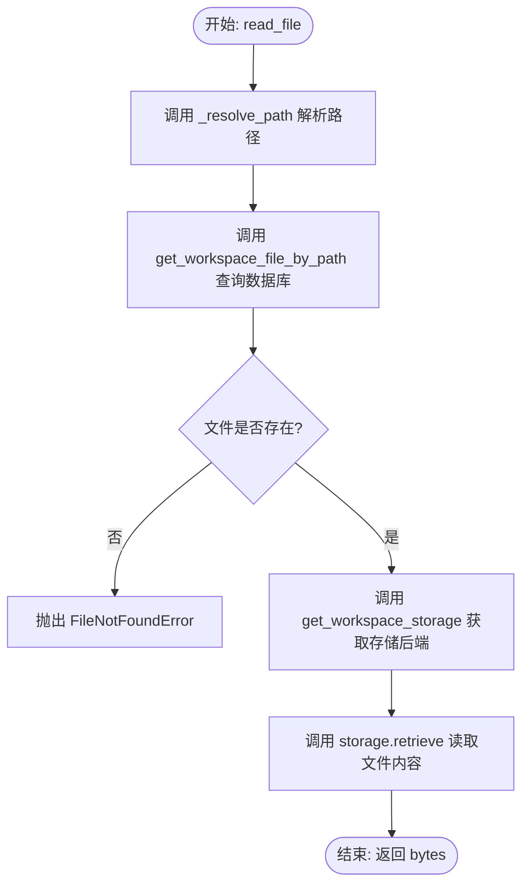

#### 带注释源码

```python
    async def read_file(self, path: str) -> bytes:
        """
        Read file from workspace by virtual path.

        When session_id is set, paths are resolved relative to the session folder
        unless they explicitly reference /sessions/...

        Args:
            path: Virtual path (e.g., "/documents/report.pdf")

        Returns:
            File content as bytes

        Raises:
            FileNotFoundError: If file doesn't exist
        """
        # 1. 解析路径：根据是否设置了 session_id，将相对路径转换为绝对路径或保持不变
        resolved_path = self._resolve_path(path)
        
        # 2. 查询数据库：根据工作区ID和解析后的路径查找文件记录
        file = await get_workspace_file_by_path(self.workspace_id, resolved_path)
        
        # 3. 检查文件是否存在：如果未找到记录，抛出 FileNotFoundError
        if file is None:
            raise FileNotFoundError(f"File not found at path: {resolved_path}")

        # 4. 获取存储后端实例
        storage = await get_workspace_storage()
        
        # 5. 读取内容：使用数据库中记录的 storagePath 从存储后端获取实际文件内容
        return await storage.retrieve(file.storagePath)
```


### `WorkspaceManager.read_file_by_id`

通过文件ID从工作区读取文件内容。

参数：

-  `file_id`：`str`，文件的唯一标识符。

返回值：`bytes`，文件的二进制内容。

#### 流程图

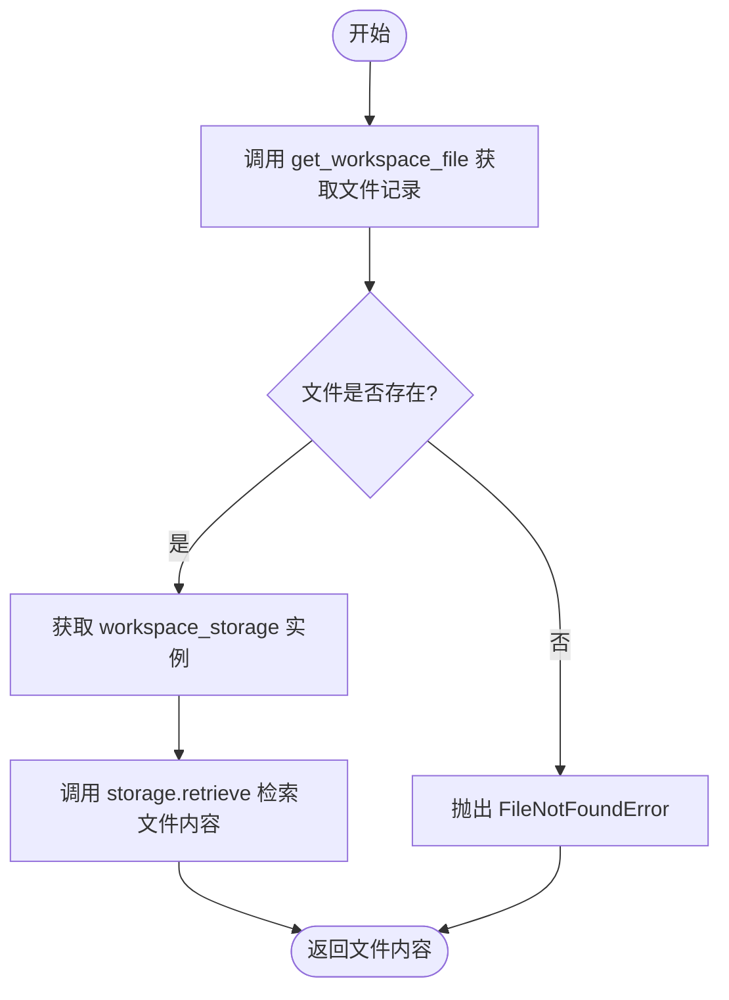

#### 带注释源码

```python
    async def read_file_by_id(self, file_id: str) -> bytes:
        """
        Read file from workspace by file ID.

        Args:
            file_id: The file's ID

        Returns:
            File content as bytes

        Raises:
            FileNotFoundError: If file doesn't exist
        """
        # 根据文件ID和工作区ID从数据库获取文件元数据记录
        file = await get_workspace_file(file_id, self.workspace_id)

        # 如果文件记录不存在，抛出文件未找到异常
        if file is None:
            raise FileNotFoundError(f"File not found: {file_id}")

        # 获取工作区存储后端实例
        storage = await get_workspace_storage()

        # 使用存储后端根据记录中的存储路径（storagePath）检索文件内容并返回
        return await storage.retrieve(file.storagePath)
```


### `WorkspaceManager.write_file`

将文件内容写入工作区，处理存储后端存储、数据库记录创建、路径解析（支持会话作用域）、文件大小限制检查、病毒扫描以及覆盖逻辑。

参数：

- `content`：`bytes`，文件的二进制内容
- `filename`：`str`，文件名
- `path`：`Optional[str]`，虚拟路径（默认为 "/{filename}"，如果设置了 session_id 则默认在会话目录下）
- `mime_type`：`Optional[str]`，MIME 类型（如果未提供则自动检测）
- `overwrite`：`bool`，如果指定路径已存在文件，是否覆盖

返回值：`UserWorkspaceFile`，创建或更新后的 UserWorkspaceFile 数据库模型实例

#### 流程图

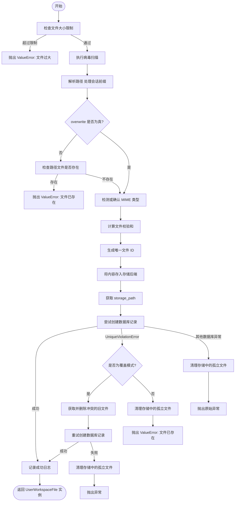

#### 带注释源码

```python
async def write_file(
    self,
    content: bytes,
    filename: str,
    path: Optional[str] = None,
    mime_type: Optional[str] = None,
    overwrite: bool = False,
) -> UserWorkspaceFile:
    """
    Write file to workspace.

    When session_id is set, files are written to /sessions/{session_id}/...
    by default. Use explicit /sessions/... paths for cross-session access.

    Args:
        content: File content as bytes
        filename: Filename for the file
        path: Virtual path (defaults to "/{filename}", session-scoped if session_id set)
        mime_type: MIME type (auto-detected if not provided)
        overwrite: Whether to overwrite existing file at path

    Returns:
        Created UserWorkspaceFile instance

    Raises:
        ValueError: If file exceeds size limit or path already exists
    """
    # 强制执行文件大小限制
    max_file_size = Config().max_file_size_mb * 1024 * 1024
    if len(content) > max_file_size:
        raise ValueError(
            f"File too large: {len(content)} bytes exceeds "
            f"{Config().max_file_size_mb}MB limit"
        )

    # 在持久化之前扫描内容病毒（纵深防御）
    await scan_content_safe(content, filename=filename)

    # 确定路径（包含会话作用域）
    if path is None:
        path = f"/{filename}"
    elif not path.startswith("/"):
        path = f"/{path}"

    # 解析路径（添加会话前缀）
    path = self._resolve_path(path)

    # 检查该路径下是否已存在文件（仅在非覆盖模式下报错）
    # 对于 overwrite=True，我们允许写入继续并通过 UniqueViolationError 处理
    # 这确保新文件在旧文件被删除之前写入存储，
    # 防止因新写入失败而导致数据丢失
    if not overwrite:
        existing = await get_workspace_file_by_path(self.workspace_id, path)
        if existing is not None:
            raise ValueError(f"File already exists at path: {path}")

    # 如果未提供，则自动检测 MIME 类型
    if mime_type is None:
        mime_type, _ = mimetypes.guess_type(filename)
        mime_type = mime_type or "application/octet-stream"

    # 计算校验和
    checksum = compute_file_checksum(content)

    # 为存储生成唯一的文件 ID
    file_id = str(uuid.uuid4())

    # 将文件存入存储后端
    storage = await get_workspace_storage()
    storage_path = await storage.store(
        workspace_id=self.workspace_id,
        file_id=file_id,
        filename=filename,
        content=content,
    )

    # 创建数据库记录 - 处理竞态条件，即另一个请求
    # 在我们的检查和创建之间在同一路径创建了文件
    try:
        file = await create_workspace_file(
            workspace_id=self.workspace_id,
            file_id=file_id,
            name=filename,
            path=path,
            storage_path=storage_path,
            mime_type=mime_type,
            size_bytes=len(content),
            checksum=checksum,
        )
    except UniqueViolationError:
        # 竞态条件：另一个请求在此路径创建了文件
        if overwrite:
            # 重新获取并删除冲突的文件，然后重试
            existing = await get_workspace_file_by_path(self.workspace_id, path)
            if existing:
                await self.delete_file(existing.id)
            # 重试创建 - 如果这也失败，清理存储文件
            try:
                file = await create_workspace_file(
                    workspace_id=self.workspace_id,
                    file_id=file_id,
                    name=filename,
                    path=path,
                    storage_path=storage_path,
                    mime_type=mime_type,
                    size_bytes=len(content),
                    checksum=checksum,
                )
            except Exception:
                # 重试失败时清理孤立的存储文件
                try:
                    await storage.delete(storage_path)
                except Exception as e:
                    logger.warning(f"Failed to clean up orphaned storage file: {e}")
                raise
        else:
            # 在抛出异常前清理孤立的存储文件
            try:
                await storage.delete(storage_path)
            except Exception as e:
                logger.warning(f"Failed to clean up orphaned storage file: {e}")
            raise ValueError(f"File already exists at path: {path}")
    except Exception:
        # 任何其他数据库错误（连接、验证等）- 清理存储
        try:
            await storage.delete(storage_path)
        except Exception as e:
            logger.warning(f"Failed to clean up orphaned storage file: {e}")
        raise

    logger.info(
        f"Wrote file {file.id} ({filename}) to workspace {self.workspace_id} "
        f"at path {path}, size={len(content)} bytes"
    )

    return file
```


### `WorkspaceManager.list_files`

列出工作区中的文件。当设置了 session_id 且 include_all_sessions 为 False（默认）时，仅列出当前会话文件夹中的文件。

参数：

-  `path`：`Optional[str]`，可选路径前缀用于过滤（例如 "/documents/"）
-  `limit`：`Optional[int]`，返回的最大文件数
-  `offset`：`int`，跳过的文件数
-  `include_all_sessions`：`bool`，如果为 True，列出所有会话的文件。如果为 False（默认），仅列出当前会话的文件。

返回值：`list[UserWorkspaceFile]`，UserWorkspaceFile 实例列表

#### 流程图

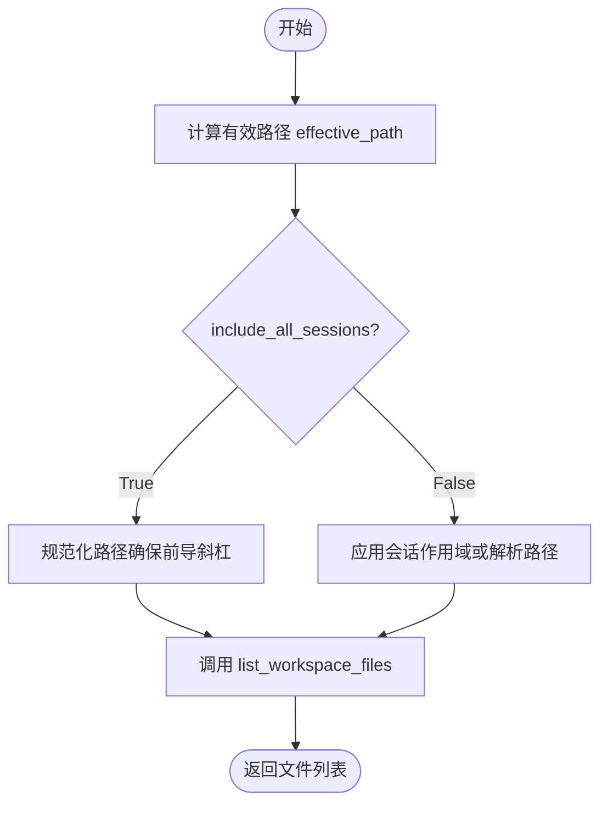

#### 带注释源码

```python
    async def list_files(
        self,
        path: Optional[str] = None,
        limit: Optional[int] = None,
        offset: int = 0,
        include_all_sessions: bool = False,
    ) -> list[UserWorkspaceFile]:
        """
        List files in workspace.

        When session_id is set and include_all_sessions is False (default),
        only files in the current session's folder are listed.

        Args:
            path: Optional path prefix to filter (e.g., "/documents/")
            limit: Maximum number of files to return
            offset: Number of files to skip
            include_all_sessions: If True, list files from all sessions.
                                  If False (default), only list current session's files.

        Returns:
            List of UserWorkspaceFile instances
        """
        # 根据会话上下文和路径参数计算数据库查询使用的有效路径前缀
        effective_path = self._get_effective_path(path, include_all_sessions)

        # 调用数据层方法查询文件列表
        return await list_workspace_files(
            workspace_id=self.workspace_id,
            path_prefix=effective_path,
            limit=limit,
            offset=offset,
        )
```


### `WorkspaceManager.delete_file`

删除工作区中的指定文件。该方法首先在数据库中查找文件记录，若存在则尝试从存储后端物理删除文件，随后对数据库记录执行软删除操作。即使存储删除失败，也会继续执行数据库软删除以保证元数据的一致性。

参数：

-  `file_id`：`str`，要删除的文件的唯一标识符

返回值：`bool`，如果文件被成功删除或已执行软删除操作则为 True，如果文件未找到则为 False。

#### 流程图

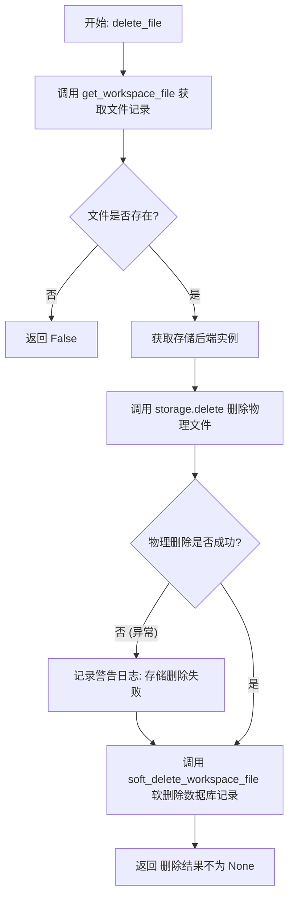

#### 带注释源码

```python
    async def delete_file(self, file_id: str) -> bool:
        """
        Delete a file (soft-delete).

        Args:
            file_id: The file's ID

        Returns:
            True if deleted, False if not found
        """
        # 1. 根据文件ID和工作区ID从数据库获取文件元数据
        file = await get_workspace_file(file_id, self.workspace_id)
        
        # 如果文件不存在，直接返回 False
        if file is None:
            return False

        # 2. 获取存储后端实例
        storage = await get_workspace_storage()
        
        # 3. 尝试从物理存储中删除文件
        try:
            await storage.delete(file.storagePath)
        except Exception as e:
            # 如果物理存储删除失败（例如文件丢失或网络问题），记录警告日志
            # 选择继续执行数据库层面的软删除，以防止元数据与实际状态不一致
            logger.warning(f"Failed to delete file from storage: {e}")
            # Continue with database soft-delete even if storage delete fails

        # 4. 执行数据库记录的软删除操作（标记文件为已删除状态，而非物理移除记录）
        result = await soft_delete_workspace_file(file_id, self.workspace_id)
        
        # 返回操作是否成功（result 不为 None 表示操作成功）
        return result is not None
```


### `WorkspaceManager.get_download_url`

根据给定的文件ID生成一个临时的文件下载URL，支持设置URL的有效期。

参数：

-  `file_id`：`str`，文件的唯一标识符
-  `expires_in`：`int`，URL的有效期时长，单位为秒，默认为3600秒（1小时）

返回值：`str`，生成的下载URL（如果是GCS则为签名URL，本地存储则为API端点）

#### 流程图

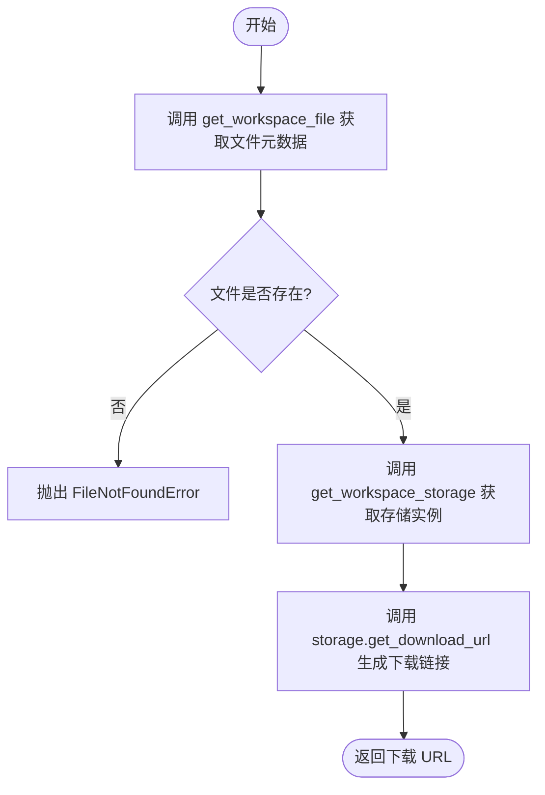

#### 带注释源码

```python
    async def get_download_url(self, file_id: str, expires_in: int = 3600) -> str:
        """
        Get download URL for a file.

        Args:
            file_id: The file's ID
            expires_in: URL expiration in seconds (default 1 hour)

        Returns:
            Download URL (signed URL for GCS, API endpoint for local)

        Raises:
            FileNotFoundError: If file doesn't exist
        """
        # 1. 从数据库获取文件元数据，验证文件是否存在及属于当前工作区
        file = await get_workspace_file(file_id, self.workspace_id)
        if file is None:
            raise FileNotFoundError(f"File not found: {file_id}")

        # 2. 获取存储后端实例
        storage = await get_workspace_storage()
        
        # 3. 委托给存储后端生成具体的下载链接（处理签名或路由逻辑）
        return await storage.get_download_url(file.storagePath, expires_in)
```


### `WorkspaceManager.get_file_info`

通过文件ID获取工作空间文件的元数据信息。

参数：

-  `file_id`：`str`，文件的唯一标识符

返回值：`Optional[UserWorkspaceFile]`，若找到则返回文件元数据对象，否则返回 None

#### 流程图

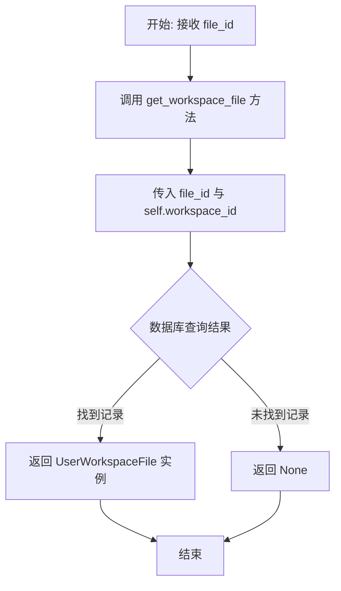

#### 带注释源码

```python
    async def get_file_info(self, file_id: str) -> Optional[UserWorkspaceFile]:
        """
        Get file metadata.

        Args:
            file_id: The file's ID

        Returns:
            UserWorkspaceFile instance or None
        """
        # 直接调用底层数据访问层函数，根据文件ID和当前工作空间ID查询文件元数据
        return await get_workspace_file(file_id, self.workspace_id)
```


### `WorkspaceManager.get_file_info_by_path`

根据路径获取文件元数据。当设置了 session_id 时，路径将相对于会话文件夹进行解析，除非它们显式引用 /sessions/...

参数：

-  `path`：`str`，虚拟路径

返回值：`Optional[UserWorkspaceFile]`，如果找到则返回 UserWorkspaceFile 实例，否则返回 None

#### 流程图

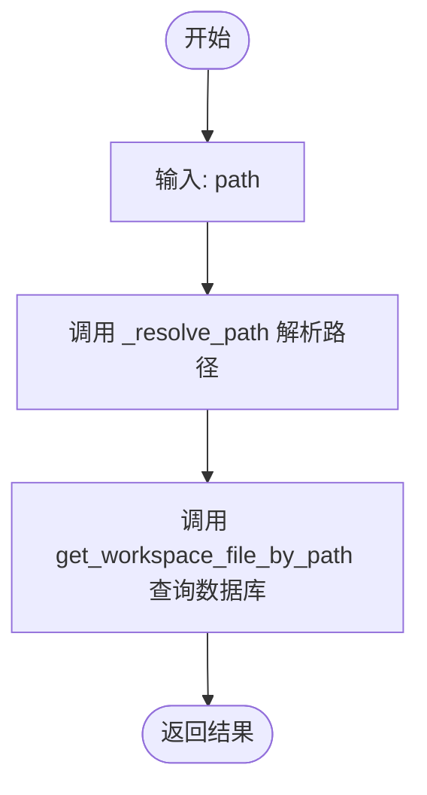

#### 带注释源码

```python
    async def get_file_info_by_path(self, path: str) -> Optional[UserWorkspaceFile]:
        """
        Get file metadata by path.

        When session_id is set, paths are resolved relative to the session folder
        unless they explicitly reference /sessions/...

        Args:
            path: Virtual path

        Returns:
            UserWorkspaceFile instance or None
        """
        # 根据当前的上下文（session_id）解析用户提供的虚拟路径
        resolved_path = self._resolve_path(path)
        # 调用数据层方法，根据工作区ID和解析后的路径查询文件元数据
        return await get_workspace_file_by_path(self.workspace_id, resolved_path)
```


### `WorkspaceManager.get_file_count`

获取工作区内的文件数量，根据会话ID和过滤选项计算文件数。

参数：

-  `path`：`Optional[str]`，用于过滤的可选路径前缀（例如 "/documents/"）。
-  `include_all_sessions`：`bool`，如果为 True，计算工作区中的所有文件；如果为 False（默认），仅计算当前会话文件夹中的文件。

返回值：`int`，文件数量。

#### 流程图

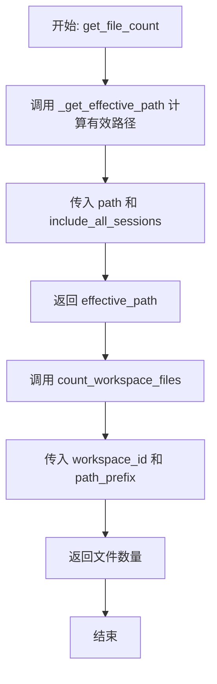

#### 带注释源码

```python
    async def get_file_count(
        self,
        path: Optional[str] = None,
        include_all_sessions: bool = False,
    ) -> int:
        """
        Get number of files in workspace.

        When session_id is set and include_all_sessions is False (default),
        only counts files in the current session's folder.

        Args:
            path: Optional path prefix to filter (e.g., "/documents/")
            include_all_sessions: If True, count all files in workspace.
                                  If False (default), only count current session's files.

        Returns:
            Number of files
        """
        # 获取有效路径，处理会话上下文和路径过滤逻辑
        effective_path = self._get_effective_path(path, include_all_sessions)

        # 调用底层数据库函数统计文件数量
        return await count_workspace_files(
            self.workspace_id, path_prefix=effective_path
        )
```


## 关键组件


### 会话作用域路径解析
通过虚拟路径逻辑（`_resolve_path` 和 `_get_effective_path`）实现文件隔离，默认将文件操作限制在 `/sessions/{session_id}/` 目录下，同时支持显式指定跨会话路径。

### 文件覆盖与竞态条件处理
在 `write_file` 方法中采用“先存储后入库”的策略，并通过捕获 `UniqueViolationError` 处理并发写入冲突，确保在覆盖模式下旧文件仅在新文件成功写入后才被删除，防止数据丢失。

### 存储后端抽象层
利用 `get_workspace_storage` 获取存储接口，将具体的文件存储实现（如本地文件系统或云存储 GCS）与业务逻辑解耦，支持透明切换存储后端。

### 安全扫描集成
在文件内容持久化之前，强制调用 `scan_content_safe` 进行病毒扫描，作为深度防御策略确保存入工作区的文件安全。

### 软删除与存储清理容错
在 `delete_file` 和写入失败时的清理逻辑中，优先保证数据库记录的更新（软删除或回滚），对于存储层的失败操作仅记录警告日志而不中断主流程，确保系统状态最终一致性。

### 文件大小限制校验
在文件写入前根据 `Config().max_file_size_mb` 配置严格校验文件大小，防止上传过大文件导致系统资源耗尽。


## 问题及建议


### 已知问题

-   **内存瓶颈风险**：`read_file` 和 `write_file` 方法通过 `bytes` 类型处理文件内容，这意味着大文件会被完整加载到内存中。在处理接近 `max_file_size` 限制的大文件时，可能导致服务内存溢出（OOM）。
-   **数据一致性与资源泄漏**：在 `delete_file` 方法中，即使物理存储删除失败（`storage.delete` 抛出异常），代码仍会继续执行数据库的软删除。这会导致数据库记录消失但存储文件残留的情况，造成存储空间的“幽灵”泄漏和计费损失。
-   **并发控制逻辑复杂**：`write_file` 方法中通过捕获 `UniqueViolationError` 并手动重试来处理并发写入和覆盖逻辑。这种“乐观锁”式的手动实现代码路径较长，在极端的并发或数据库错误场景下，可能导致存储文件清理不彻底或重试死循环。

### 优化建议

-   **利用数据库 Upsert 特性**：建议利用数据库的 Upsert（如 SQL 的 `ON CONFLICT DO UPDATE`）能力替代现有的“检查-创建-捕获异常-重试”逻辑。这可以原子性地处理“存在则覆盖，不存在则创建”的场景，大幅简化代码并减少并发竞态窗口。
-   **引入流式传输机制**：针对大文件读写，重构接口以支持流式处理（例如接收异步生成器或分块读写），避免将整个文件内容驻留在内存中，从而降低内存峰值并提升系统稳定性。
-   **路径安全性增强**：`_resolve_path` 方法目前仅处理了路径拼接，建议增加对路径遍历攻击（如 `../`）的校验与清洗，在应用层提供额外的安全保障，而不是完全依赖底层存储系统的隔离机制。
-   **存储客户端连接复用**：如果 `get_workspace_storage()` 的调用涉及较重的初始化操作（如建立网络连接），建议在 `WorkspaceManager` 实例内部缓存该客户端实例，而不是在每次方法调用时都重新获取，以减少开销。


## 其它


### 设计目标与约束

本模块旨在提供一个统一的高级接口来管理工作区文件操作，抽象底层的存储后端和数据库层的复杂性。

1.  **设计目标**：
    *   **统一接口**：通过 `WorkspaceManager` 类将文件存储和数据库元数据管理封装在一起，简化上层调用。
    *   **会话隔离**：支持基于 `session_id` 的虚拟路径隔离（`/sessions/{session_id}/...`），实现文件在不同会话间的逻辑隔离，同时允许跨会话显式访问。
    *   **存储解耦**：通过 `get_workspace_storage` 获取存储后端，支持本地存储或云存储（如 GCS）的切换。

2.  **约束**：
    *   **文件大小限制**：所有写入的文件必须遵守 `Config().max_file_size_mb` 定义的最大文件大小限制，否则抛出 `ValueError`。
    *   **安全性强制**：文件在写入存储前必须通过病毒扫描（`scan_content_safe`），这是强制的安全约束。
    *   **原子性保证**：在数据库记录创建失败时，必须清理已上传的存储文件，防止产生“孤儿文件”。

### 错误处理与异常设计

模块采用显式异常抛出和资源清理相结合的策略，确保系统的健壮性和数据一致性。

1.  **异常抛出**：
    *   **`FileNotFoundError`**：当请求读取的文件、通过 ID 查询的文件不存在或获取下载 URL 的文件不存在时抛出。
    *   **`ValueError`**：当业务逻辑校验失败时抛出，例如：文件大小超限、目标路径已存在（非覆盖模式下）、以及数据库唯一性冲突导致的写入失败。

2.  **资源清理与事务一致性**：
    *   **写入失败回滚**：在 `write_file` 方法中，如果文件已成功写入存储后端，但数据库记录创建失败（或发生 `UniqueViolationError`），代码会捕获异常并尝试调用 `storage.delete` 清理已存储的文件，以防止存储空间泄漏。
    *   **软删除容错**：在 `delete_file` 中，即使物理存储删除失败，也会继续执行数据库的软删除操作，并记录警告日志，确保元数据状态的一致性优先于物理文件的清理。

3.  **日志记录**：
    *   使用 `logging` 模块记录关键操作（如文件写入成功）和非致命错误（如清理孤儿文件失败），便于运维排查。

### 数据流

本模块的数据流主要分为“写入文件”和“读取文件”两个核心流程，遵循先校验、后处理、最后落库的顺序。

1.  **写入文件流程**：
    *   **输入**：用户提交文件内容、文件名及路径。
    *   **校验**：
        *   检查文件大小是否超过配置限制。
        *   调用病毒扫描接口检查内容安全性。
    *   **预处理**：
        *   解析路径（应用 Session 前缀）。
        *   自动检测 MIME 类型。
        *   计算文件校验和。
    *   **存储**：生成唯一 File ID，调用存储后端保存二进制内容，获取物理存储路径。
    *   **落库**：
        *   尝试在数据库中创建文件元数据记录。
        *   **并发处理**：若发生唯一性冲突（路径已存在），根据 `overwrite` 参数决定是清理存储并报错，还是删除旧文件后重试创建。
    *   **输出**：返回数据库中的文件记录对象。

2.  **读取文件流程**：
    *   **路径解析**：将虚拟路径解析为实际的存储路径标识。
    *   **元数据查询**：通过路径或 ID 从数据库获取文件元数据（包含 `storagePath`）。
    *   **内容获取**：使用 `storagePath` 从存储后端检索二进制内容并返回。

### 外部依赖与接口契约

模块依赖于多个外部服务和工具库，通过明确的函数调用契约进行交互。

1.  **数据库层 (`backend.data.workspace`)**：
    *   **契约**：提供异步的 CRUD 操作接口。
    *   **依赖函数**：`create_workspace_file`, `get_workspace_file`, `get_workspace_file_by_path`, `list_workspace_files`, `soft_delete_workspace_file`, `count_workspace_files`。
    *   **异常处理**：期望捕获 `prisma.errors.UniqueViolationError` 以处理并发写入冲突。

2.  **存储后端 (`backend.util.workspace_storage`)**：
    *   **契约**：提供抽象的文件存储能力，支持异步操作。
    *   **接口方法**：
        *   `store(workspace_id, file_id, filename, content) -> storage_path`: 存储文件并返回路径。
        *   `retrieve(storage_path) -> bytes`: 读取文件内容。
        *   `delete(storage_path)`: 删除物理文件。
        *   `get_download_url(storage_path, expires_in) -> str`: 生成带签名的访问链接。

3.  **安全工具 (`backend.util.virus_scanner`)**：
    *   **契约**：提供内容安全扫描。
    *   **接口方法**：`scan_content_safe(content, filename)`：阻塞或异步检查内容，若不安全应抛出异常以中断写入流程。

4.  **配置 (`backend.util.settings`)**：
    *   **契约**：提供静态配置访问。
    *   **配置项**：`max_file_size_mb`：用于限制上传文件大小的阈值。

### 并发控制

针对多用户或多请求并发操作同一路径的场景，模块设计了特定的并发控制机制，主要集中在 `write_file` 方法中。

1.  **乐观并发控制 (Optimistic Concurrency Control)**：
    *   代码在写入前检查文件是否存在 (`get_workspace_file_by_path`)，但在创建记录时不使用显式锁。
    *   通过捕获数据库层的 `UniqueViolationError` 来检测竞态条件（即两个请求同时通过了存在性检查，并尝试创建同路径文件）。

2.  **冲突解决策略**：
    *   **非覆盖模式 (`overwrite=False`)**：检测到 `UniqueViolationError` 视为业务错误，清理已上传的存储文件并抛出 `ValueError`。
    *   **覆盖模式 (`overwrite=True`)**：
        *   检测到冲突时，重新获取该路径下的现有文件记录。
        *   先调用 `delete_file` 删除旧文件（包括存储和数据库记录）。
        *   重试创建新文件记录。
        *   此策略确保了“新文件先写成功，旧文件再删除”的原则，最大程度防止覆盖过程中因写入失败导致的数据丢失。

3.  **幂等性与重试**：
    *   在覆盖模式下，冲突后执行一次重试操作。如果重试再次失败（例如极少数情况下又有新冲突），则进行存储清理并抛出异常，避免无限循环。

    