# `.\AutoGPT\autogpt_platform\backend\backend\util\workspace_storage.py` 详细设计文档

该代码定义了一个支持云端和本地部署的工作区存储后端抽象层，提供了统一的接口来管理文件的上传、下载、删除及访问链接生成，并根据配置自动选择 Google Cloud Storage (GCS) 或本地文件系统作为实现。

## 整体流程

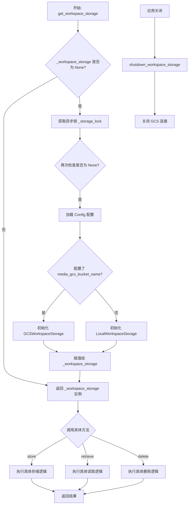

## 类结构

```
WorkspaceStorageBackend (抽象基类)
├── GCSWorkspaceStorage
└── LocalWorkspaceStorage
```

## 全局变量及字段


### `logger`
    
用于记录模块运行日志的日志记录器实例。

类型：`logging.Logger`
    


### `_workspace_storage`
    
全局存储后端实例的单例缓存，根据配置决定是本地还是GCS实现。

类型：`Optional[WorkspaceStorageBackend]`
    


### `_storage_lock`
    
用于确保全局存储实例异步初始化过程的线程安全锁。

类型：`asyncio.Lock`
    


### `GCSWorkspaceStorage.bucket_name`
    
Google Cloud Storage (GCS) 中用于存储工作区文件的存储桶名称。

类型：`str`
    


### `GCSWorkspaceStorage._async_client`
    
用于执行异步 GCS 操作（如上传、下载）的客户端实例。

类型：`Optional[async_gcs_storage.Storage]`
    


### `GCSWorkspaceStorage._sync_client`
    
用于执行同步 GCS 操作（如生成签名 URL）的客户端实例。

类型：`Optional[gcs_storage.Client]`
    


### `GCSWorkspaceStorage._session`
    
由异步客户端使用的 aiohttp 会话对象，用于管理 HTTP 连接。

类型：`Optional[aiohttp.ClientSession]`
    


### `LocalWorkspaceStorage.base_dir`
    
本地文件系统中用于存储工作区文件的基础目录路径。

类型：`pathlib.Path`
    
    

## 全局函数及方法


### `get_workspace_storage`

根据系统配置获取并初始化全局唯一的Workspace存储后端实例（单例），支持在Google Cloud Storage和本地文件系统之间动态选择。

参数：

无

返回值：`WorkspaceStorageBackend`，返回已初始化的存储后端实例（`GCSWorkspaceStorage` 或 `LocalWorkspaceStorage`）。

#### 流程图

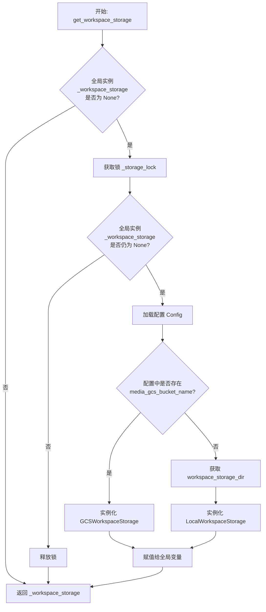

#### 带注释源码

```python
async def get_workspace_storage() -> WorkspaceStorageBackend:
    """
    Get the workspace storage backend instance.

    Uses GCS if media_gcs_bucket_name is configured, otherwise uses local storage.
    """
    global _workspace_storage

    # 检查全局单例实例是否已经存在
    if _workspace_storage is None:
        # 获取异步锁以防止并发初始化
        async with _storage_lock:
            # 双重检查锁定模式（Double-Checked Locking），
            # 确保在锁等待期间没有其他线程已经初始化了实例
            if _workspace_storage is None:
                config = Config()

                # 根据配置判断使用哪种存储后端
                if config.media_gcs_bucket_name:
                    # 如果配置了 GCS Bucket 名称，使用 GCS 存储
                    logger.info(
                        f"Using GCS workspace storage: {config.media_gcs_bucket_name}"
                    )
                    _workspace_storage = GCSWorkspaceStorage(
                        config.media_gcs_bucket_name
                    )
                else:
                    # 否则使用本地文件系统存储
                    storage_dir = (
                        config.workspace_storage_dir
                        if config.workspace_storage_dir
                        else None
                    )
                    logger.info(
                        f"Using local workspace storage: {storage_dir or 'default'}"
                    )
                    _workspace_storage = LocalWorkspaceStorage(storage_dir)

    return _workspace_storage
```


### `shutdown_workspace_storage`

该函数用于在应用程序关闭期间正确清理全局工作区存储后端的资源，特别是处理 GCS 后端中 aiohttp 会话的关闭，以确保资源不泄露。

参数：

无

返回值：`None`，表示关闭流程执行完毕，无具体返回值。

#### 流程图

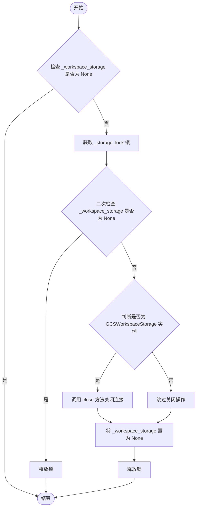

#### 带注释源码

```python
async def shutdown_workspace_storage() -> None:
    """
    Properly shutdown the global workspace storage backend.

    Closes aiohttp sessions and other resources for GCS backend.
    Should be called during application shutdown.
    """
    # 声明引用全局变量，以便修改其引用
    global _workspace_storage

    # 首次检查：如果实例为空，无需执行后续逻辑
    if _workspace_storage is not None:
        # 加锁：防止在关闭过程中有其他协程正在初始化或访问存储实例
        async with _storage_lock:
            # 二次检查：防止在等待锁的过程中，实例已被其他逻辑清理
            if _workspace_storage is not None:
                # 类型检查：仅当使用 GCS 后端时需要执行特定的清理操作（如关闭网络会话）
                if isinstance(_workspace_storage, GCSWorkspaceStorage):
                    await _workspace_storage.close()
                
                # 将全局变量置为 None，彻底释放资源引用
                _workspace_storage = None
```


### `compute_file_checksum`

计算给定文件内容字节流的 SHA-256 哈希值，并返回其十六进制格式的校验和字符串，用于确保文件完整性。

参数：

-  `content`：`bytes`，待计算校验和的文件内容（二进制格式）。

返回值：`str`，文件内容的 SHA-256 哈希值的十六进制字符串表示。

#### 流程图

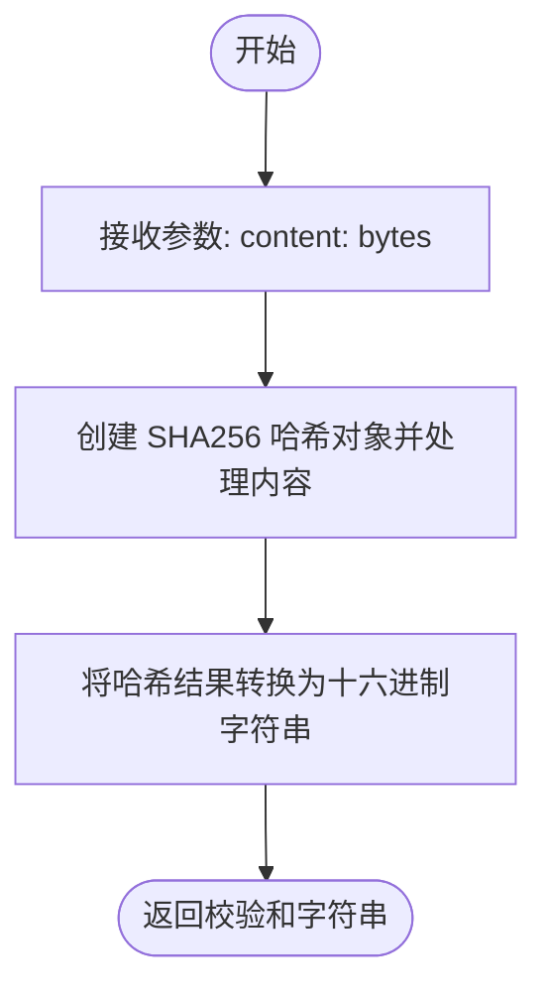

#### 带注释源码

```python
def compute_file_checksum(content: bytes) -> str:
    """
    Compute SHA256 checksum of file content.
    计算文件内容的 SHA256 校验和。
    """
    # 使用 hashlib 库创建 sha256 哈希对象
    # 对传入的字节内容 content 进行哈希运算
    # 通过 hexdigest() 方法获取哈希值的十六进制字符串表示并返回
    return hashlib.sha256(content).hexdigest()
```


### `WorkspaceStorageBackend.store`

定义了工作区文件存储的抽象接口，强制子类实现具体的文件持久化逻辑，并返回该文件在存储后端中的唯一路径。

参数：

- `workspace_id`：`str`，工作区 ID，用于逻辑隔离不同的工作空间。
- `file_id`：`str`，文件 ID，用于在存储系统中唯一标识该文件。
- `filename`：`str`，原始文件名。
- `content`：`bytes`，文件的二进制内容。

返回值：`str`，存储路径字符串（例如云存储路径 `gcs://...` 或本地文件系统路径 `local://...`）。

#### 流程图

```mermaid
flowchart TD
    Start([开始]) --> Input[接收参数: workspace_id, file_id, filename, content]
    Input --> AbstractOp[执行文件存储操作<br/>(抽象逻辑: 需子类实现)]
    AbstractOp --> ReturnPath[返回存储路径字符串]
    ReturnPath --> End([结束])
```

#### 带注释源码

```python
    @abstractmethod
    async def store(
        self,
        workspace_id: str,
        file_id: str,
        filename: str,
        content: bytes,
    ) -> str:
        """
        Store file content, return storage path.

        Args:
            workspace_id: The workspace ID
            file_id: Unique file ID for storage
            filename: Original filename
            content: File content as bytes

        Returns:
            Storage path string (cloud path or local path)
        """
        pass  # 抽象方法，具体逻辑由 GCSWorkspaceStorage 或 LocalWorkspaceStorage 实现
```


### `WorkspaceStorageBackend.retrieve`

Retrieve file content from storage.

参数：

-  `storage_path`：`str`，The storage path returned from store()

返回值：`bytes`，File content as bytes

#### 流程图


#### 带注释源码

```python
    async def retrieve(self, storage_path: str) -> bytes:
        """
        Retrieve file content from storage.

        Args:
            storage_path: The storage path returned from store()

        Returns:
            File content as bytes
        """
        # 抽象方法，具体逻辑由子类（如 GCSWorkspaceStorage 或 LocalWorkspaceStorage）实现
        pass
```


### `WorkspaceStorageBackend.delete`

该方法是一个抽象方法，定义了从存储中删除文件的接口契约，具体的删除逻辑由子类（如 `GCSWorkspaceStorage` 或 `LocalWorkspaceStorage`）实现。

参数：

- `storage_path`：`str`，要删除的文件的存储路径

返回值：`None`，无返回值

#### 流程图

```mermaid
graph TD
    Start([开始]) --> DefineInterface[定义抽象接口 delete]
    DefineInterface --> ArgCheck[接收参数 storage_path]
    ArgCheck --> AbstractMark[标记为 @abstractmethod]
    AbstractMark --> Pass[pass (无具体实现)]
    Pass --> End([结束])
```

#### 带注释源码

```python
    @abstractmethod
    async def delete(self, storage_path: str) -> None:
        """
        Delete file from storage.

        Args:
            storage_path: The storage path to delete
        """
        pass
```


### `WorkspaceStorageBackend.get_download_url`

定义用于获取文件下载链接的抽象接口。该方法强制子类实现具体的 URL 生成逻辑，以支持不同的存储后端（例如，为 Google Cloud Storage 生成签名 URL，或为本地存储返回内部 API 路径）。

参数：

- `storage_path`：`str`，存储路径字符串，通常是 `store` 方法返回的路径。
- `expires_in`：`int`，URL 的有效期，单位为秒（默认为 3600，即 1 小时）。

返回值：`str`，用于下载文件的 URL 字符串。

#### 流程图

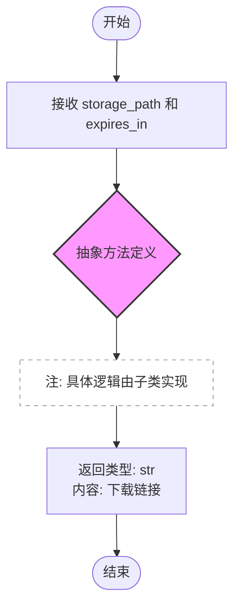

#### 带注释源码

```python
    @abstractmethod
    async def get_download_url(self, storage_path: str, expires_in: int = 3600) -> str:
        """
        Get URL for downloading the file.

        Args:
            storage_path: The storage path
            expires_in: URL expiration time in seconds (default 1 hour)

        Returns:
            Download URL (signed URL for GCS, direct API path for local)
        """
        # 抽象方法不包含具体实现逻辑，仅定义接口契约。
        # 子类（如 GCSWorkspaceStorage 或 LocalWorkspaceStorage）必须重写此方法。
        pass
```


### `GCSWorkspaceStorage.__init__`

Google Cloud Storage (GCS) 工作区存储实现的构造函数。它接收存储桶名称作为参数，并初始化用于存储连接配置和客户端实例的字段。为了资源优化，异步客户端、同步客户端和 HTTP 会话均初始化为 None，采用延迟加载策略在首次使用时创建。

参数：

-  `bucket_name`：`str`，Google Cloud Storage 的存储桶名称

返回值：`None`，构造函数不返回任何值

#### 流程图

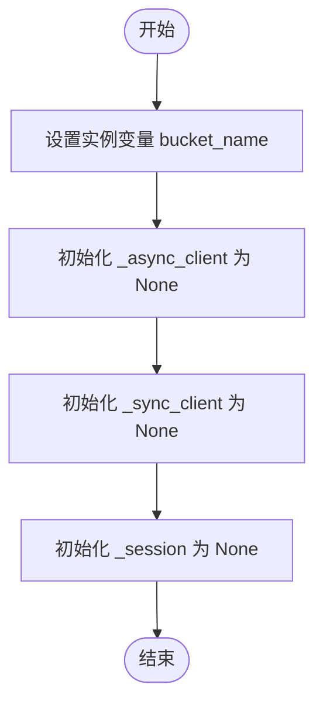

#### 带注释源码

```python
def __init__(self, bucket_name: str):
    # 存储指定的 Google Cloud Storage 存储桶名称
    self.bucket_name = bucket_name
    # 初始化异步 GCS 客户端为 None，将在首次需要时通过 _get_async_client 创建
    self._async_client: Optional[async_gcs_storage.Storage] = None
    # 初始化同步 GCS 客户端为 None，将在首次需要时通过 _get_sync_client 创建（用于签名 URL）
    self._sync_client: Optional[gcs_storage.Client] = None
    # 初始化 aiohttp 会话为 None，将与异步客户端关联
    self._session: Optional[aiohttp.ClientSession] = None
```


### `GCSWorkspaceStorage._get_async_client`

获取或创建异步 Google Cloud Storage (GCS) 客户端。该方法实现了单例模式（延迟初始化），仅在首次调用时创建客户端和底层的 HTTP 会话，后续调用直接返回已存在的实例。

参数：

- 无

返回值：`async_gcs_storage.Storage`，异步 GCS 存储客户端实例，用于执行异步的云存储操作。

#### 流程图

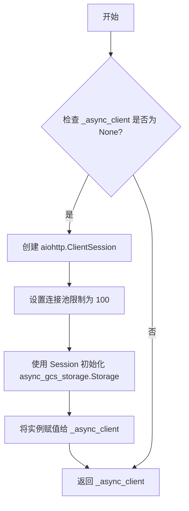

#### 带注释源码

```python
    async def _get_async_client(self) -> async_gcs_storage.Storage:
        """Get or create async GCS client."""
        # 检查异步客户端是否尚未初始化（延迟加载）
        if self._async_client is None:
            # 创建一个 aiohttp 会话，配置连接器限制最大连接数为 100
            # force_close=False 允许连接复用，提高性能
            self._session = aiohttp.ClientSession(
                connector=aiohttp.TCPConnector(limit=100, force_close=False)
            )
            # 使用创建的 session 实例化 GCS 异步存储客户端
            self._async_client = async_gcs_storage.Storage(session=self._session)
        # 返回已初始化的客户端实例
        return self._async_client
```


### `GCSWorkspaceStorage._get_sync_client`

获取或创建同步的 Google Cloud Storage 客户端实例。该方法采用延迟加载（Lazy Loading）策略，仅在首次调用时初始化客户端，并在后续调用中复用该实例，主要用于生成签名 URL。

参数：

- （该方法无显式参数）

返回值：`gcs_storage.Client`，Google Cloud Storage 的同步客户端实例，用于与 GCS 服务进行交互。

#### 流程图

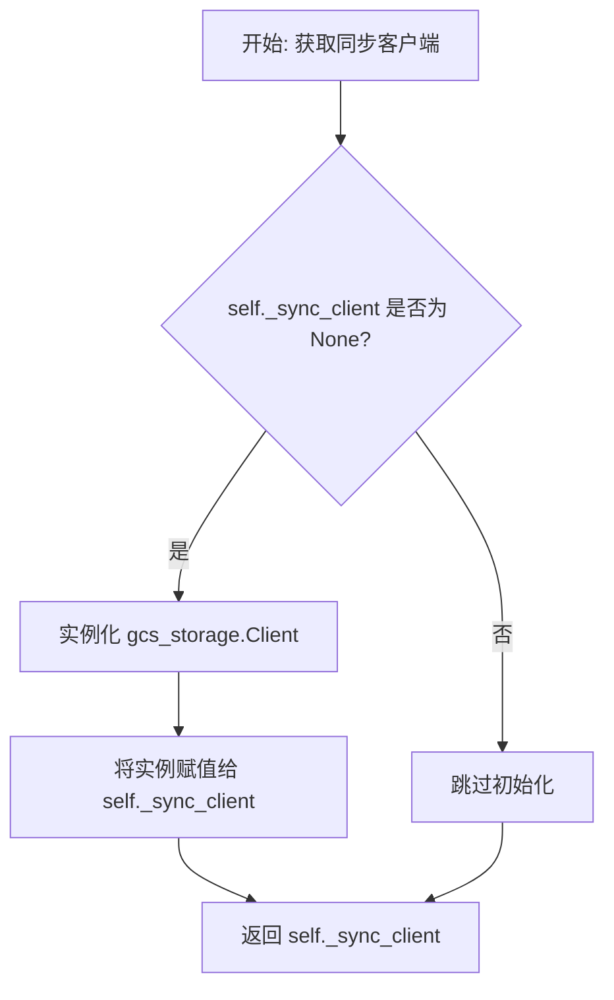

#### 带注释源码

```python
def _get_sync_client(self) -> gcs_storage.Client:
    """Get or create sync GCS client (for signed URLs)."""
    # 检查同步客户端实例是否尚未初始化
    if self._sync_client is None:
        # 如果为空，则创建一个新的 Google Cloud Storage 同步客户端
        self._sync_client = gcs_storage.Client()
    # 返回初始化后的同步客户端实例
    return self._sync_client
```


### `GCSWorkspaceStorage.close`

用于关闭 Google Cloud Storage (GCS) 客户端及其底层的 aiohttp 会话连接，释放网络资源。

参数：

-   `无`

返回值：`None`，无返回值

#### 流程图

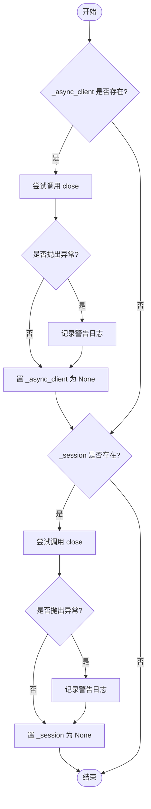

#### 带注释源码

```python
    async def close(self) -> None:
        """Close all client connections."""
        # 检查异步 GCS 客户端是否存在
        if self._async_client is not None:
            try:
                # 尝试关闭 GCS 客户端连接
                await self._async_client.close()
            except Exception as e:
                # 如果关闭过程中发生错误，记录警告日志但不中断程序
                logger.warning(f"Error closing GCS client: {e}")
            # 将客户端引用置为 None，标记为已关闭
            self._async_client = None

        # 检查 aiohttp 会话是否存在
        if self._session is not None:
            try:
                # 尝试关闭 HTTP 会话
                await self._session.close()
            except Exception as e:
                # 如果关闭过程中发生错误，记录警告日志但不中断程序
                logger.warning(f"Error closing session: {e}")
            # 将会话引用置为 None，标记为已关闭
            self._session = None
```


### `GCSWorkspaceStorage._build_blob_name`

该方法用于根据工作区ID、文件ID和文件名构建符合特定层级结构的Google Cloud Storage (GCS) Blob路径字符串。

参数：

-  `workspace_id`：`str`，工作区的唯一标识符。
-  `file_id`：`str`，文件的唯一标识符。
-  `filename`：`str`，文件的原始名称。

返回值：`str`，构建好的GCS Blob对象路径字符串。

#### 流程图

```mermaid
flowchart TD
    A[开始: _build_blob_name] --> B[接收参数 workspace_id, file_id, filename]
    B --> C[执行字符串格式化: f'workspaces/{workspace_id}/{file_id}/{filename}']
    C --> D[返回构建好的 Blob 路径]
    D --> E[结束]
```

#### 带注释源码

```python
def _build_blob_name(self, workspace_id: str, file_id: str, filename: str) -> str:
    """Build the blob path for workspace files."""
    # 使用f-string将提供的参数拼接成GCS的特定路径格式
    # 路径结构为：固定前缀/工作区ID/文件ID/文件名
    return f"workspaces/{workspace_id}/{file_id}/{filename}"
```


### `GCSWorkspaceStorage.store`

将文件内容异步上传到 Google Cloud Storage (GCS) 指定路径，并附加上传时间等元数据，最后返回该文件在 GCS 上的完整 URI。

参数：

-  `workspace_id`：`str`，工作区的唯一标识符，用于构建存储路径。
-  `file_id`：`str`，文件的唯一标识符，用于构建存储路径。
-  `filename`：`str`，文件的原始名称，用于构建存储路径的最后一部分。
-  `content`：`bytes`，文件的二进制内容数据。

返回值：`str`，表示文件存储位置的 GCS URI 字符串，格式为 `gcs://{bucket_name}/{blob_name}`。

#### 流程图

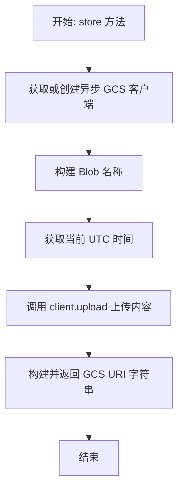

#### 带注释源码

```python
async def store(
    self,
    workspace_id: str,
    file_id: str,
    filename: str,
    content: bytes,
) -> str:
    """Store file in GCS."""
    # 获取异步 GCS 客户端实例，用于执行上传操作
    client = await self._get_async_client()
    
    # 根据工作区ID、文件ID和文件名构建在 GCS 中的 Blob 路径名称
    blob_name = self._build_blob_name(workspace_id, file_id, filename)

    # Upload with metadata
    # 记录上传时间（UTC 时间），用于元数据
    upload_time = datetime.now(timezone.utc)
    
    # 执行异步上传操作
    await client.upload(
        self.bucket_name,  # 目标存储桶名称
        blob_name,         # 目标 Blob 路径
        content,           # 文件二进制内容
        metadata={         # 附加的自定义元数据
            "uploaded_at": upload_time.isoformat(),
            "workspace_id": workspace_id,
            "file_id": file_id,
        },
    )

    # 返回格式化后的 GCS 资源标识符
    return f"gcs://{self.bucket_name}/{blob_name}"
```


### `GCSWorkspaceStorage.retrieve`

该方法用于从 Google Cloud Storage (GCS) 中检索文件内容。它接收一个存储路径字符串，解析出存储桶名称和对象名称，然后通过异步会话下载文件并返回其字节数据。

参数：

-  `storage_path`：`str`，存储路径，通常由 `store` 方法返回，格式为 `gcs://{bucket_name}/{blob_name}`。

返回值：`bytes`，从 GCS 下载的文件内容（二进制数据）。

#### 流程图

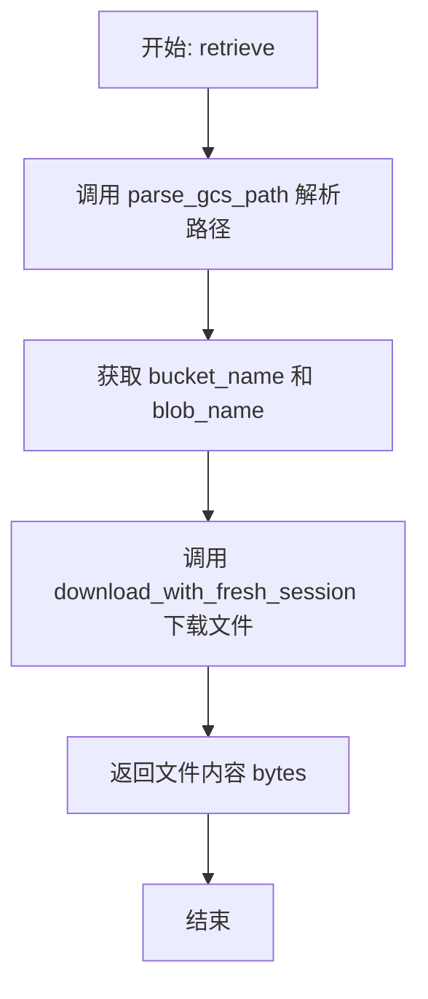

#### 带注释源码

```python
    async def retrieve(self, storage_path: str) -> bytes:
        """Retrieve file from GCS."""
        # 解析 GCS 路径字符串，提取出存储桶名称和 Blob 对象名称
        # 例如: "gcs://my-bucket/workspaces/file.txt" -> ("my-bucket", "workspaces/file.txt")
        bucket_name, blob_name = parse_gcs_path(storage_path)

        # 使用新的会话下载文件内容
        # download_with_fresh_session 是一个辅助函数，用于处理具体的异步下载逻辑
        return await download_with_fresh_session(bucket_name, blob_name)
```


### `GCSWorkspaceStorage.delete`

该函数负责从 Google Cloud Storage (GCS) 中删除指定的文件。它首先解析存储路径以获取 bucket 名称和 blob 名称，然后获取异步 GCS 客户端执行删除操作。函数设计为幂等的，即如果文件已经被删除（返回 404 Not Found），它不会抛出异常，而是静默成功；只有在遇到其他错误时才会抛出异常。

参数：

- `storage_path`：`str`，待删除文件的存储路径，格式通常为 `gcs://{bucket_name}/{blob_name}`。

返回值：`None`，无返回值。

#### 流程图

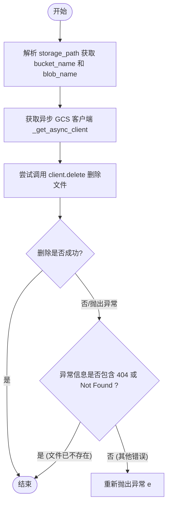

#### 带注释源码

```python
async def delete(self, storage_path: str) -> None:
    """Delete file from GCS."""
    # 从存储路径字符串中解析出 Google Cloud Storage 的 bucket 名称和 blob 名称
    # 例如: "gcs://my-bucket/workspaces/1/2/file.txt" -> ("my-bucket", "workspaces/1/2/file.txt")
    bucket_name, blob_name = parse_gcs_path(storage_path)
    
    # 获取异步的 GCS 客户端实例，用于执行删除操作
    client = await self._get_async_client()

    try:
        # 调用客户端的 delete 方法异步删除指定 bucket 中的 blob
        await client.delete(bucket_name, blob_name)
    except Exception as e:
        # 异常处理逻辑：捕获所有异常
        # 检查异常信息中是否包含 "404" 或 "Not Found"
        # 如果包含，说明文件已被删除或不存在，这是一种可接受的幂等状态，不抛出异常
        if "404" not in str(e) and "Not Found" not in str(e):
            raise  # 如果是其他错误（如权限不足、网络问题），则继续抛出异常
        # File already deleted, that's fine
```


### `GCSWorkspaceStorage.get_download_url`

为 Google Cloud Storage (GCS) 中的文件生成下载 URL。优先尝试使用服务账号凭证生成签名的 GCS URL；如果失败（例如在本地使用用户 OAuth 凭据运行时），则回退到内部的 API 代理端点。

参数：

-  `storage_path`：`str`，文件的存储路径，格式为 `gcs://bucket_name/blob_name`。
-  `expires_in`：`int`，URL 的有效期（单位：秒），默认为 3600（1小时）。

返回值：`str`，文件的下载 URL。成功时返回签名的 GCS URL，失败时返回应用内部 API 路径。

#### 流程图

```mermaid
flowchart TD
    A[开始: get_download_url] --> B[解析 storage_path<br>获取 bucket_name 和 blob_name]
    B --> C[从 blob_name 提取 file_id]
    C --> D{尝试生成签名 URL}
    D --> E[获取同步客户端]
    E --> F[调用 generate_signed_url]
    F --> G{是否成功?}
    G -->|是| H[返回签名 URL]
    G -->|否 (捕获 AttributeError)| I{错误包含 'private key'<br>且 file_id 存在?}
    I -->|是| J[记录 Debug 日志]
    J --> K[返回回退 API 路径<br>/api/workspace/files/{file_id}/download]
    I -->|否| L[重新抛出异常]
```

#### 带注释源码

```python
    async def get_download_url(self, storage_path: str, expires_in: int = 3600) -> str:
        """
        Generate download URL for GCS file.

        Attempts to generate a signed URL if running with service account credentials.
        Falls back to an API proxy endpoint if signed URL generation fails
        (e.g., when running locally with user OAuth credentials).
        """
        # 1. 解析存储路径，提取 GCS bucket 名称和 blob 名称
        bucket_name, blob_name = parse_gcs_path(storage_path)

        # 2. 从 blob 名称中提取 file_id，用于构建回退 URL
        # Blob 格式预期: workspaces/{workspace_id}/{file_id}/{filename}
        blob_parts = blob_name.split("/")
        file_id = blob_parts[2] if len(blob_parts) >= 3 else None

        # 3. 尝试生成签名 URL（需要服务账号凭证）
        try:
            sync_client = self._get_sync_client()
            # 调用辅助函数生成带签名的下载链接
            return await generate_signed_url(
                sync_client, bucket_name, blob_name, expires_in
            )
        except AttributeError as e:
            # 4. 处理异常情况：签名 URL 生成需要带有私钥的服务账号
            # 如果使用用户 OAuth 凭据（本地开发常见情况），会抛出 AttributeError
            if "private key" in str(e) and file_id:
                logger.debug(
                    "Cannot generate signed URL (no service account credentials), "
                    "falling back to API proxy endpoint"
                )
                # 返回内部 API 端点，由后端代理下载文件
                return f"/api/workspace/files/{file_id}/download"
            # 如果不是缺少私钥的问题，或者其他未知错误，抛出原始异常
            raise
```


### `LocalWorkspaceStorage.__init__`

初始化本地存储后端，设置存储工作区文件的基础目录，并确保该目录存在于文件系统中。

参数：

-   `base_dir`：`Optional[str]`，工作区存储的基础目录。如果为 None，则默认为应用数据路径下的 `workspaces` 文件夹。

返回值：`None`，构造函数不返回任何值。

#### 流程图

```mermaid
flowchart TD
    A[开始: __init__] --> B{base_dir 是否为 None?}
    B -- 否 --> C[self.base_dir = Path<br/>(base_dir)]
    B -- 是 --> D[self.base_dir = Path<br/>(get_data_path()) / 'workspaces']
    C --> E[创建基础目录:<br/>mkdir parents=True, exist_ok=True]
    D --> E
    E --> F[结束]
```

#### 带注释源码

```python
def __init__(self, base_dir: Optional[str] = None):
    """
    Initialize local storage backend.

    Args:
        base_dir: Base directory for workspace storage.
                 If None, defaults to {app_data}/workspaces
    """
    if base_dir:
        # 如果显式提供了 base_dir，则将其转换为 Path 对象
        self.base_dir = Path(base_dir)
    else:
        # 否则，获取应用数据路径并拼接 'workspaces' 作为默认目录
        self.base_dir = Path(get_data_path()) / "workspaces"

    # 确保基础目录存在，如果父级目录不存在则一并创建（parents=True）
    # 如果目录已存在则不报错（exist_ok=True）
    self.base_dir.mkdir(parents=True, exist_ok=True)
```


### `LocalWorkspaceStorage._build_file_path`

构建本地文件路径，并包含防止路径遍历的安全保护机制。

参数：

- `workspace_id`：`str`，工作区 ID
- `file_id`：`str`，用于存储的唯一文件 ID
- `filename`：`str`，原始文件名

返回值：`Path`，解析后的绝对本地文件路径对象。

#### 流程图

```mermaid
graph TD
    A[开始: _build_file_path] --> B[从 backend.util.file 导入 sanitize_filename]
    B --> C[调用 sanitize_filename 清理文件名]
    C --> D[拼接路径: base_dir / workspace_id / file_id / safe_filename]
    D --> E[调用 .resolve() 解析为绝对路径]
    E --> F{路径是否在 base_dir 范围内?}
    F -- 否 --> G[抛出 ValueError: 检测到路径遍历攻击]
    F -- 是 --> H[返回 Path 对象]
```

#### 带注释源码

```python
def _build_file_path(self, workspace_id: str, file_id: str, filename: str) -> Path:
    """Build the local file path with path traversal protection."""
    # Import here to avoid circular import
    # (file.py imports workspace.py which imports workspace_storage.py)
    from backend.util.file import sanitize_filename

    # Sanitize filename to prevent path traversal (removes / and \ among others)
    safe_filename = sanitize_filename(filename)
    file_path = (self.base_dir / workspace_id / file_id / safe_filename).resolve()

    # Verify the resolved path is still under base_dir
    if not file_path.is_relative_to(self.base_dir.resolve()):
        raise ValueError("Invalid filename: path traversal detected")

    return file_path
```


### `LocalWorkspaceStorage._parse_storage_path`

将抽象的存储路径字符串转换为本地文件系统上的绝对 `Path` 对象，同时移除 URI 前缀并执行路径遍历安全检查。

参数：

-  `storage_path`：`str`，要解析的存储路径字符串，可能带有 "local://" 前缀。

返回值：`Path`，表示安全、绝对文件系统路径的 Path 对象，确保其在 `base_dir` 之下。

#### 流程图

```mermaid
flowchart TD
    A([开始: _parse_storage_path]) --> B{storage_path 是否以 'local://' 开头?}
    B -- 是 --> C[relative_path = storage_path[8:]]
    B -- 否 --> D[relative_path = storage_path]
    C --> E[full_path = (base_dir / relative_path).resolve()]
    D --> E
    E --> F{full_path 是否在 base_dir 范围内?}
    F -- 否 --> G[抛出 ValueError: path traversal detected]
    F -- 是 --> H([返回 full_path])
```

#### 带注释源码

```python
def _parse_storage_path(self, storage_path: str) -> Path:
    """Parse local storage path to filesystem path."""
    # 检查路径是否包含 "local://" 前缀
    if storage_path.startswith("local://"):
        # 移除前缀，获取相对路径部分
        relative_path = storage_path[8:]  # Remove "local://"
    else:
        # 如果没有前缀，则直接将该字符串视为相对路径
        relative_path = storage_path

    # 将基础目录与相对路径拼接，并解析为绝对路径（处理 '..' 和 '.' 等符号）
    full_path = (self.base_dir / relative_path).resolve()

    # 安全检查：确保解析后的完整路径仍然位于基础目录之下
    # 使用 is_relative_to() 进行健壮的路径包含检查
    # (处理不区分大小写的文件系统和边缘情况)
    if not full_path.is_relative_to(self.base_dir.resolve()):
        # 如果检测到路径遍历攻击（例如 ../../etc/passwd），则抛出异常
        raise ValueError("Invalid storage path: path traversal detected")

    return full_path
```


### `LocalWorkspaceStorage.store`

该方法用于将文件内容异步存储到本地文件系统中。它会根据工作区ID、文件ID和文件名构建安全的本地文件路径（防止路径遍历攻击），创建必要的父目录，并通过异步IO将内容写入磁盘，最后返回格式为 "local://" 的存储路径字符串。

参数：

- `workspace_id`：`str`，工作空间的唯一标识符。
- `file_id`：`str`，文件的唯一标识符，用于存储路径分组。
- `filename`：`str`，文件的原始名称。
- `content`：`bytes`，文件的二进制内容。

返回值：`str`，格式化后的存储路径字符串（例如 "local://workspace_id/file_id/sanitized_filename"）。

#### 流程图

```mermaid
flowchart TD
    A[开始] --> B[调用 _build_file_path 构建安全的本地文件路径]
    B --> C[创建父目录 file_path.parent.mkdir]
    C --> D[异步打开文件 aiofiles.open 模式 wb]
    D --> E[写入文件内容 content]
    E --> F[关闭文件流]
    F --> G[计算相对于 base_dir 的相对路径]
    G --> H[拼接字符串返回 flocal://relative_path]
    H --> I[结束]
```

#### 带注释源码

```python
    async def store(
        self,
        workspace_id: str,
        file_id: str,
        filename: str,
        content: bytes,
    ) -> str:
        """Store file locally."""
        # 构建安全的本地文件路径，内部处理了文件名的清洗和路径遍历检查
        file_path = self._build_file_path(workspace_id, file_id, filename)

        # 创建父目录结构，如果已存在则忽略 (类似于 mkdir -p)
        file_path.parent.mkdir(parents=True, exist_ok=True)

        # 使用 aiofiles 异步写入文件内容，避免阻塞事件循环
        async with aiofiles.open(file_path, "wb") as f:
            await f.write(content)

        # 计算相对于存储根目录 的相对路径
        relative_path = file_path.relative_to(self.base_dir)
        
        # 返回带有 "local://" 前缀的标准化存储路径
        return f"local://{relative_path}"
```


### `LocalWorkspaceStorage.retrieve`

从本地文件存储中检索文件内容。该方法将抽象的存储路径解析为本地绝对路径，执行安全验证，检查文件是否存在，并以异步方式读取文件内容。

参数：

-  `storage_path`：`str`，存储路径字符串（通常由 `store` 方法返回，格式如 "local://..."）

返回值：`bytes`，从本地文件读取的二进制内容

#### 流程图

```mermaid
flowchart TD
    A[开始: retrieve] --> B[调用 _parse_storage_path 解析路径]
    B --> C{文件是否存在?}
    C -- 否 --> D[抛出 FileNotFoundError]
    C -- 是 --> E[使用 aiofiles 异步打开文件]
    E --> F[读取文件内容]
    F --> G[返回 bytes 内容]
```

#### 带注释源码

```python
async def retrieve(self, storage_path: str) -> bytes:
    """Retrieve file from local storage."""
    # 将存储路径解析为本地文件系统的绝对路径
    # 此过程包含路径遍历安全检查
    file_path = self._parse_storage_path(storage_path)

    # 检查文件是否真实存在于文件系统中
    if not file_path.exists():
        raise FileNotFoundError(f"File not found: {storage_path}")

    # 使用 aiofiles 异步打开文件并以二进制模式读取内容
    async with aiofiles.open(file_path, "rb") as f:
        return await f.read()
```


### `LocalWorkspaceStorage.delete`

从本地存储中删除指定的文件，并递归清理因文件删除而产生的空父目录，直至基础目录为止。

参数：

-  `storage_path`：`str`，要删除的文件的存储路径字符串（通常以 "local://" 开头）。

返回值：`None`，无返回值。

#### 流程图

```mermaid
flowchart TD
    A([开始]) --> B[解析存储路径获取绝对文件路径]
    B --> C{文件是否存在?}
    C -- 否 --> Z([结束])
    C -- 是 --> D[调用 unlink 删除文件]
    D --> E[获取当前文件的父目录]
    E --> F{父目录是否等于基础目录?}
    F -- 是 --> Z
    F -- 否 --> G{父目录是否存在且为空?}
    G -- 否 --> Z
    G -- 是 --> H[调用 rmdir 删除空目录]
    H --> I[父目录指向上一级]
    I --> F
```

#### 带注释源码

```python
async def delete(self, storage_path: str) -> None:
    """Delete file from local storage."""
    # 1. 解析存储路径并转换为系统绝对路径，同时进行安全校验防止路径遍历攻击
    file_path = self._parse_storage_path(storage_path)

    # 2. 检查文件实际是否存在，避免因文件不存在而抛出异常
    if file_path.exists():
        # 3. 删除文件
        file_path.unlink()

        # 4. 清理空的父级目录
        parent = file_path.parent
        # 5. 循环向上遍历，直到到达基础存储目录为止
        while parent != self.base_dir:
            try:
                # 6. 检查目录是否存在且为空（不包含任何文件或子目录）
                if parent.exists() and not any(parent.iterdir()):
                    # 7. 删除空目录
                    parent.rmdir()
                else:
                    # 如果目录不为空，停止向上清理
                    break
            except OSError:
                # 捕获潜在的操作系统错误（如并发删除导致的竞争条件），防止程序崩溃
                break
            # 8. 继续处理上一级目录
            parent = parent.parent
```


### `LocalWorkspaceStorage.get_download_url`

获取本地文件的下载 URL。对于本地存储，该方法返回一个 API 端点路径，实际的文件服务由 API 层处理。

参数：

-   `storage_path`：`str`，存储路径字符串（例如 "local://{workspace_id}/{file_id}/{filename}"）。
-   `expires_in`：`int`，URL 过期时间（秒），默认 3600。注意：在本地存储实现中，该参数保留以兼容接口，但在生成 URL 逻辑中未实际使用。

返回值：`str`，用于下载文件的 API 端点路径。

#### 流程图

```mermaid
graph TD
    A[开始: get_download_url] --> B{路径包含 local:// 前缀?}
    B -- 是 --> C[移除前缀 local:// 获取相对路径]
    B -- 否 --> D[直接使用 storage_path 作为相对路径]
    C --> E[按 / 分割路径字符串]
    D --> E
    E --> F{分割后的部分数量 >= 2?}
    F -- 否 --> G[抛出 ValueError 异常]
    F -- 是 --> H[提取 file_id parts[1]]
    H --> I[构建 API 下载路径 /api/workspace/files/file_id/download]
    I --> J[返回路径字符串]
    J --> K[结束]
```

#### 带注释源码

```python
    async def get_download_url(self, storage_path: str, expires_in: int = 3600) -> str:
        """
        Get download URL for local file.

        For local storage, this returns an API endpoint path.
        The actual serving is handled by the API layer.
        """
        # 解析存储路径以获取组件
        # 检查路径是否以 "local://" 开头
        if storage_path.startswith("local://"):
            relative_path = storage_path[8:]  # 移除 "local://" 前缀
        else:
            relative_path = storage_path

        # 返回用于下载的 API 端点
        # 从路径中提取 file_id: {workspace_id}/{file_id}/{filename}
        parts = relative_path.split("/")
        if len(parts) >= 2:
            file_id = parts[1]  # 第二个部分是 file_id
            # 返回内部 API 路由供前端或客户端调用
            return f"/api/workspace/files/{file_id}/download"
        else:
            # 如果路径格式不符合预期，抛出异常
            raise ValueError(f"Invalid storage path format: {storage_path}")
```


## 关键组件


### 抽象存储接口 (WorkspaceStorageBackend)
定义工作区文件存储的统一抽象基类，规定了存储、检索、删除文件及获取下载 URL 的标准接口。

### GCS 云存储实现 (GCSWorkspaceStorage)
基于 Google Cloud Storage 的具体实现，负责异步处理云端文件的上传、下载、删除操作，并管理 GCS 客户端生命周期和签名 URL 生成。

### 本地文件系统实现 (LocalWorkspaceStorage)
基于本地文件系统的具体实现，利用异步 I/O 操作本地文件，并实现了防止路径遍历的安全检查机制。

### 全局存储实例管理 (get_workspace_storage)
负责根据配置（如 GCS Bucket 名称）动态选择并初始化存储后端实例的单例工厂，包含启动时的懒加载和关闭时的资源清理逻辑。


## 问题及建议


### 已知问题

-   **GCS 客户端初始化竞态条件**：在 `GCSWorkspaceStorage._get_async_client` 方法中，客户端和 Session 的创建缺乏锁机制。在高并发场景下，多个协程可能同时通过 `None` 检查，导致创建多个 `aiohttp.ClientSession` 和 `Storage` 实例，引发资源泄漏或连接错误。
-   **脆弱的错误匹配逻辑**：`GCSWorkspaceStorage.get_download_url` 中通过字符串 `if "private key" in str(e)` 来判断是否回退到 API 代理。这种基于异常消息内容的判断方式非常脆弱，一旦底层库的报错文案发生变化，回退逻辑将失效。
-   **本地文件删除的目录清理竞态**：`LocalWorkspaceStorage.delete` 方法在清理空目录时，检查 `not any(parent.iterdir())` 与执行 `parent.rmdir()` 之间存在时间窗口（TOCTOU）。若在此期间其他协程在目录中创建了文件，会导致 `rmdir()` 抛出 `OSError`（尽管被捕获，但会产生错误日志或逻辑混乱）。
-   **全局单例模式影响可测试性**：使用全局变量 `_workspace_storage` 和模块级函数 `get_workspace_storage` 使得依赖该模块的代码难以进行单元测试（Mock 困难），且无法在同一个进程中支持多种存储后端配置。

### 优化建议

-   **引入依赖注入**：移除全局单例模式，改为通过依赖注入的方式将 `WorkspaceStorageBackend` 实例传递给需要的服务类。这样可以提高代码的可测试性，解耦模块间的强依赖。
-   **增加重试机制**：对于 GCS 的网络请求（上传、下载、删除），建议引入重试机制（如 `tenacity` 库），以应对网络抖动或服务暂时不可用的情况，提高系统的鲁棒性。
-   **使用上下文管理器管理生命周期**：建议让 `WorkspaceStorageBackend` 实现异步上下文管理器协议（`__aenter__`, `__aexit__`），或者利用依赖注入框架的生命周期管理，确保 Session 等资源能够被自动、安全地释放，而不是依赖手动调用全局关闭函数。
-   **抽象路径构建逻辑**：`_build_blob_name` (GCS) 和 `_build_file_path` (Local) 逻辑相似，但分散在各自类中。建议在基类中定义统一的路径构建策略或工具函数，避免逻辑不一致，并便于未来扩展新的存储后端。
-   **增强日志记录与监控**：在关键的存储操作（如 `store`, `retrieve`）中增加文件大小、耗时等结构化日志记录，便于排查性能瓶颈和监控存储层健康状况。


## 其它


### 设计目标与约束

1.  **多环境适配性**：设计旨在无缝支持云端（Google Cloud Storage）和本地部署两种环境，通过统一抽象接口屏蔽底层存储差异，实现代码逻辑的复用。
2.  **异步非阻塞 I/O**：所有文件操作（存储、读取、删除）均采用 `async/await` 模式，确保在高并发场景下 I/O 操作不会阻塞事件循环，提升系统吞吐量。
3.  **路径安全约束**：对于本地文件系统存储，严格限制文件操作路径在 `base_dir` 范围内，防止通过恶意文件名进行目录遍历攻击。
4.  **延迟初始化**：全局存储后端实例采用延迟加载模式，仅在首次调用时根据配置初始化，以减少应用启动时间和资源占用。

### 错误处理与异常设计

1.  **幂等性删除**：在 `GCSWorkspaceStorage.delete` 方法中，捕获文件不存在（404 Not Found）的异常，不向上抛出，确保删除操作的幂等性。
2.  **凭证回退机制**：在 `GCSWorkspaceStorage.get_download_url` 中，当服务账号私钥不可用（如本地开发环境使用 OAuth）导致签名 URL 生成失败时，捕获 `AttributeError` 并回退到应用层代理 API 路径，保证服务可用性。
3.  **路径遍历防御**：`LocalWorkspaceStorage` 在构建和解析路径时，若检测到路径不在基目录下，直接抛出 `ValueError`，中断操作并记录安全风险。
4.  **资源清理容错**：在关闭客户端连接时（`close` 方法），捕获并记录所有异常，防止因清理资源失败导致应用主流程崩溃。

### 数据流与状态机

**数据流（以文件存储为例）：**
1.  调用方通过 `get_workspace_storage()` 获取后端实例。
2.  调用 `store(workspace_id, file_id, filename, content)`。
3.  **GCS 模式**：构建 Blob 名称 -> 获取异步客户端 -> 上传字节数据及元数据 -> 返回 `gcs://` 路径。
4.  **Local 模式**：构建安全文件路径 -> 创建父目录 -> 异步写入磁盘 -> 返回 `local://` 路径。

**全局状态机：**
*   **Uninitialized (None)**: 应用启动时，全局变量 `_workspace_storage` 为 `None`。
*   **Initializing**: 首次请求时，获取 `_storage_lock` 锁。
*   **Initialized**: 锁内检查仍为 `None` 后，根据配置实例化 `GCSWorkspaceStorage` 或 `LocalWorkspaceStorage` 并赋值。
*   **Shutdown**: 调用 `shutdown_workspace_storage`，清理 GCS 会话，将全局变量重置为 `None`。

### 外部依赖与接口契约

1.  **`google.cloud.storage`**: 同步 GCS 客户端库，用于生成签名 URL。
    *   *契约*: 需要有效的 Google Cloud 认证凭据（环境变量或服务账号）。
2.  **`gcloud.aio.storage`**: 异步 GCS 客户端库，用于文件上传、下载和删除。
    *   *契约*: 需要有效的 `aiohttp.ClientSession`。
3.  **`aiofiles`**: 异步文件操作库，用于本地文件的读写。
    *   *契约*: 操作系统需支持异步文件 I/O。
4.  **`backend.util.gcs_utils`**: 内部工具模块。
    *   *契约*: `parse_gcs_path` 必须能正确解析 `gs://` 或 `gcs://` 开头的字符串；`generate_signed_url` 需处理认证失败情况。
5.  **`Config`**: 配置管理类。
    *   *契约*: 必须提供 `media_gcs_bucket_name` 和 `workspace_storage_dir` 属性。

### 安全与合规性设计

1.  **输入清洗**：在 `LocalWorkspaceStorage._build_file_path` 中，调用 `sanitize_filename` 移除文件名中的路径分隔符（`/`, `\`）等特殊字符。
2.  **路径规范化检查**：使用 `Path.resolve()` 解析符号链接并获取绝对路径，随后通过 `is_relative_to()` 严格校验最终路径是否仍位于 `base_dir` 之下，防止 `../` 攻击。
3.  **凭证最小权限原则**：GCS 客户端利用应用默认凭据（ADC），建议在生产环境中仅授予存储桶读写权限，而非全项目访问权限。
4.  **元数据隔离**：存储在 GCS 的文件附带 `workspace_id` 和 `file_id` 元数据，便于后续审计和基于元数据的访问控制策略实施。

    