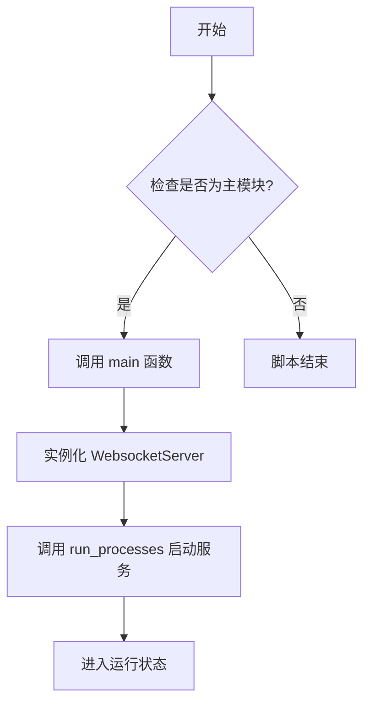
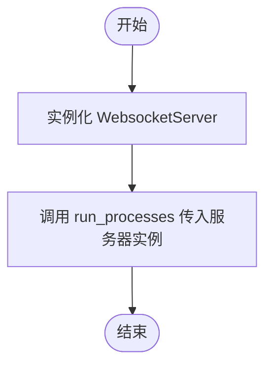

# `AutoGPT\autogpt_platform\backend\backend\ws.py` 详细设计文档

该代码文件作为应用程序的入口点，主要功能是初始化 WebSocketServer 实例，并将其传递给 run_processes 函数以启动 AutoGPT 服务器所需的所有后台进程。

## 整体流程



## 类结构

```
No class definitions found in this file.
```

## 全局变量及字段


    

## 全局函数及方法


### `main`

运行 AutoGPT-server WebSocket API 所需的所有流程。

参数：

- 无

返回值：`None`，无返回值

#### 流程图



#### 带注释源码

```python
def main():
    """
    Run all the processes required for the AutoGPT-server WebSocket API.
    """
    # 实例化 WebsocketServer 对象，该对象负责处理 WebSocket 连接的具体逻辑
    # 调用 run_processes 函数，将服务器实例作为参数传入，以启动并管理相关的后台进程
    run_processes(WebsocketServer())
```


## 关键组件


### WebsocketServer
核心服务端组件，封装了 WebSocket API 的实现，负责处理客户端连接和消息交互。

### run_processes
应用程序进程编排函数，负责启动并管理服务器实例及相关后台进程的生命周期。


## 问题及建议


### 已知问题

-   缺乏异常处理机制：`run_processes` 调用未包含在 `try-except` 块中，若服务启动失败或运行时发生未捕获异常，进程将直接退出且可能缺乏详细的错误上下文。
-   缺乏优雅关闭处理：未实现系统信号（如 SIGINT, SIGTERM）的监听处理，直接终止进程可能导致当前连接强制断开或资源未释放。
-   依赖耦合度高：入口文件直接导入并实例化具体的 `WebsocketServer` 类，导致难以通过配置切换服务实现，也不利于进行单元测试。

### 优化建议

-   增加信号处理机制：引入 `signal` 模块监听中断信号，确保在退出前调用关闭逻辑，实现服务的平滑停止。
-   引入配置管理：建议使用环境变量或配置文件来传递服务器参数（如 host、port），提高部署的灵活性。
-   完善类型注解：为函数和变量添加 Python 类型提示（Type Hints），提升代码的可读性和静态分析能力。
-   增强日志初始化：在 `main` 函数入口处初始化全局日志配置，以便统一控制日志级别和输出格式。


## 其它


### 设计目标与约束

该脚本作为 AutoGPT-server WebSocket API 的启动入口。其核心设计目标是提供最轻量级的引导逻辑，将服务实例化与运行管理委托给底层应用模块。主要约束包括：必须依赖于 `backend.app` 和 `backend.api.ws_api` 模块的可用性；脚本作为主程序入口，遵循 Python 的 `__main__` 执行惯例。

### 错误处理与异常设计

当前实现采用“快速失败”策略，未包含显式的异常捕获逻辑。如果在 `WebsocketServer` 实例化或 `run_processes` 调用过程中发生任何错误（如导入错误、初始化错误等），异常将直接传播至顶层，导致程序终止并输出堆栈跟踪。系统的错误恢复或日志记录依赖于被调用的内部函数或外部进程管理器。

### 外部依赖与接口契约

- **`backend.api.ws_api.WebsocketServer`**:
  - **类型**: 类
  - **契约**: 需支持无参初始化，作为 WebSocket 通信的核心组件实例。
- **`backend.app.run_processes`**:
  - **类型**: 函数
  - **契约**: 接收一个 `WebsocketServer` 实例作为参数，负责启动并维持相关进程的运行。

### 数据流与状态机

- **数据流**: 
  1. 脚本启动，加载必要的模块依赖。
  2. 执行 `main()` 函数，创建 `WebsocketServer` 实例。
  3. 将该实例传递给 `run_processes` 函数，控制权转移至进程管理逻辑。
- **状态机**: 
  1. **Idle (空闲)**: 脚本加载，准备执行。
  2. **Initializing (初始化中)**: 实例化 `WebsocketServer`。
  3. **Running (运行中)**: 调用 `run_processes`，进入阻塞或服务监听状态。
  该脚本不包含复杂的状态转换逻辑，主要作为状态流转的触发器。

### 部署与运行环境

该文件设计为应用程序的顶层入口点。在部署时，通常通过操作系统的服务管理器（如 systemd）、容器编排工具（如 Kubernetes/Docker）或直接由命令行调用 `python <filename>.py` 来启动。运行环境必须预先安装所有依赖的第三方库及本地模块。

    