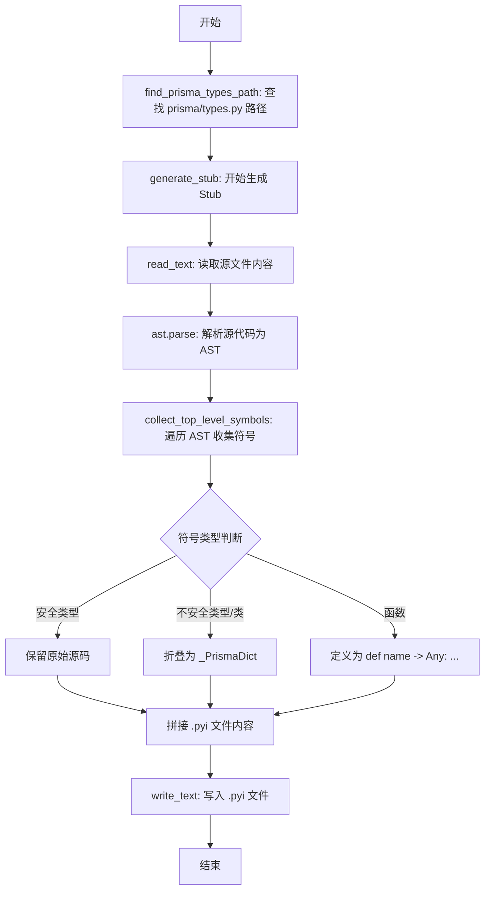
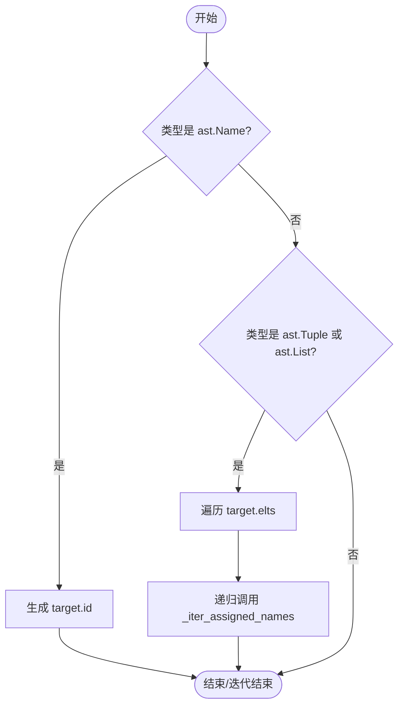
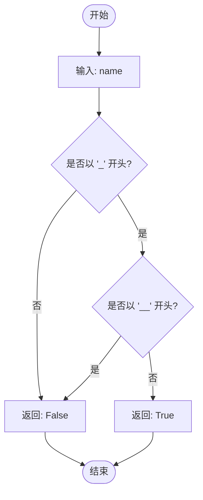
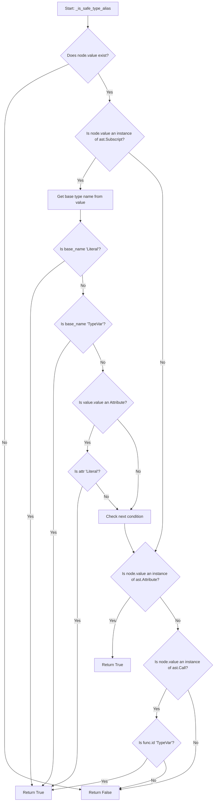
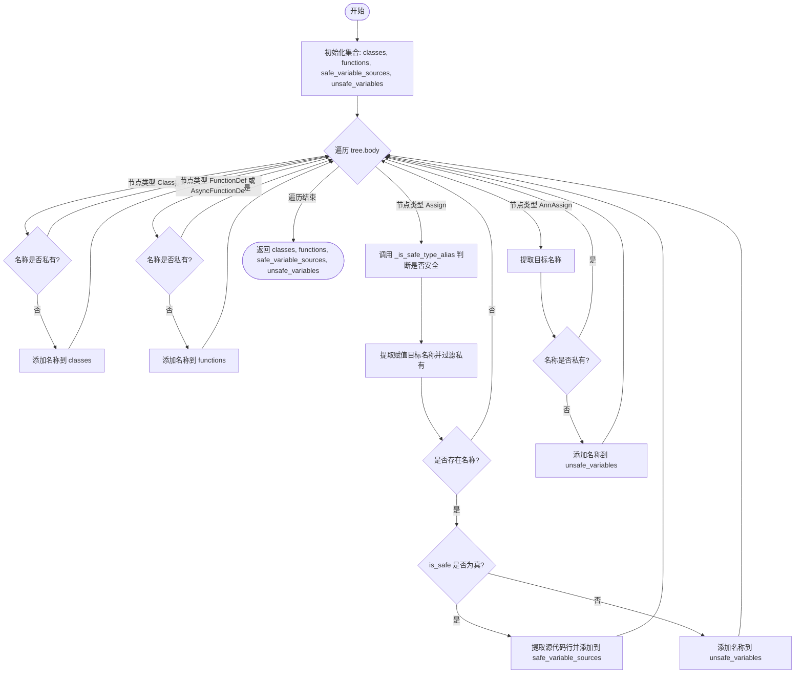
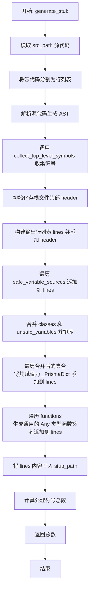
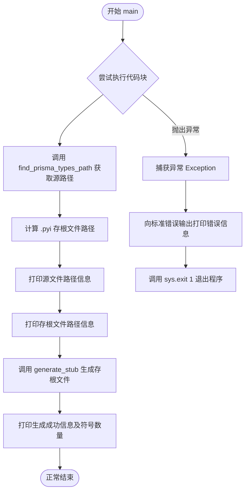

# `AutoGPT\autogpt_platform\backend\gen_prisma_types_stub.py` 详细设计文档

该脚本通过解析 Prisma 生成的 types.py 文件，生成一个轻量级的 .pyi stub 文件，将复杂的类型定义折叠为 Any 以优化 Pyright 的类型检查性能，同时保留 Literal 和 TypeVar 等安全类型定义。

## 整体流程



## 类结构

```
gen-prisma-stub.py (Module)
├── Functions
│   ├── _iter_assigned_names
│   ├── _is_private
│   ├── _is_safe_type_alias
│   ├── collect_top_level_symbols
│   ├── find_prisma_types_path
│   ├── generate_stub
│   └── main
```

## 全局变量及字段


    

## 全局函数及方法


### `_iter_assigned_names`

该函数用于从赋值语句的目标节点（AST表达式）中递归提取变量名称。它能够处理普通的变量赋值，也支持元组和列表形式的解包赋值。

参数：

- `target`：`ast.expr`，表示赋值目标的AST表达式节点，通常为 `ast.Name`、`ast.Tuple` 或 `ast.List`。

返回值：`Iterable[str]`，生成器对象，按顺序产生提取到的变量名字符串。

#### 流程图



#### 带注释源码

```python
def _iter_assigned_names(target: ast.expr) -> Iterable[str]:
    """Extract names from assignment targets (handles tuple unpacking)."""
    # 如果目标是一个简单的变量名（例如 x = 1）
    if isinstance(target, ast.Name):
        # 生成该变量的 ID（即变量名字符串）
        yield target.id
    # 如果目标是元组或列表（例如 a, b = ... 或 [c, d] = ...）
    elif isinstance(target, (ast.Tuple, ast.List)):
        # 遍历元组或列表中的每一个元素
        for elt in target.elts:
            # 递归调用自身以处理嵌套结构或解包，并生成结果
            yield from _iter_assigned_names(elt)
```


### `_is_private`

Check if a name is private (starts with _ but not __).

参数：

-  `name`：`str`，The name to check for privacy status.

返回值：`bool`，True if the name is considered private, False otherwise.

#### 流程图



#### 带注释源码

```python
def _is_private(name: str) -> bool:
    """Check if a name is private (starts with _ but not __)."""
    # 判断逻辑：如果字符串以下划线 "_" 开头，并且不是以双下划线 "__" 开头，
    # 则将其视为私有成员（例如 _private），返回 True。
    # 对于魔术方法或特殊方法（如 __init__）或普通变量，返回 False。
    return name.startswith("_") and not name.startswith("__")
```


### `_is_safe_type_alias`

检查一个AST赋值节点是否代表一个“安全”的类型别名，即该别名不应被存根为`Any`。安全类型通常包括字面量类型、简单类型引用和TypeVar定义，因为这些类型通常不会导致静态类型检查器（如Pyright）超出预算或性能问题。

参数：

- `node`：`ast.Assign`，表示待检查的赋值语句的AST节点。

返回值：`bool`，如果赋值语句是安全的类型别名（如Literal、TypeVar、简单引用）则返回 `True`，否则返回 `False`。

#### 流程图



#### 带注释源码

```python
def _is_safe_type_alias(node: ast.Assign) -> bool:
    """Check if an assignment is a safe type alias that shouldn't be stubbed.

    Safe types are:
    - Literal types (don't cause type budget issues)
    - Simple type references (SortMode, SortOrder, etc.)
    - TypeVar definitions
    """
    # 如果赋值没有值部分，则不安全
    if not node.value:
        return False

    # 检查是否是 Subscript 类型（例如 Literal[...], Union[...], TypeVar[...]）
    if isinstance(node.value, ast.Subscript):
        # 获取基础类型的名称
        if isinstance(node.value.value, ast.Name):
            base_name = node.value.value.id
            # Literal 类型是安全的
            if base_name == "Literal":
                return True
            # TypeVar 是安全的
            if base_name == "TypeVar":
                return True
        elif isinstance(node.value.value, ast.Attribute):
            # 处理 typing_extensions.Literal 等情况
            if node.value.value.attr == "Literal":
                return True

    # 检查是否是简单的 Name 引用（例如 SortMode = _types.SortMode）
    if isinstance(node.value, ast.Attribute):
        return True

    # 检查是否是函数调用（例如 TypeVar(...)）
    if isinstance(node.value, ast.Call):
        if isinstance(node.value.func, ast.Name):
            if node.value.func.id == "TypeVar":
                return True

    return False
```


### `collect_top_level_symbols`

该函数的主要功能是遍历 Python 模块的抽象语法树（AST），收集所有顶层的符号（类、函数、变量）。它将这些符号分类为“安全”的类型别名（如 Literal、TypeVar，需要保留源代码）和“不安全”的复杂类型（将被存根化为 Any），以及普通的类和函数定义。

参数：

-  `tree`：`ast.Module`，表示 Python 文件解析后的抽象语法树根节点。
-  `source_lines`：`list[str]`，源文件按行分割的字符串列表，用于提取安全变量定义的原始源代码。

返回值：`tuple[Set[str], Set[str], list[str], Set[str]]`，包含四个元素的元组：
1. 类名集合
2. 函数名集合
3. 安全变量定义的源代码列表
4. 不安全变量名集合

#### 流程图



#### 带注释源码

```python
def collect_top_level_symbols(
    tree: ast.Module, source_lines: list[str]
) -> tuple[Set[str], Set[str], list[str], Set[str]]:
    """Collect all top-level symbols from an AST module.

    Returns:
        Tuple of (class_names, function_names, safe_variable_sources, unsafe_variable_names)
        safe_variable_sources contains the actual source code lines for safe variables
    """
    # 初始化四个容器，分别用于存储类名、函数名、安全变量的源码、不安全的变量名
    classes: Set[str] = set()
    functions: Set[str] = set()
    safe_variable_sources: list[str] = []
    unsafe_variables: Set[str] = set()

    # 遍历 AST 的顶层节点
    for node in tree.body:
        # 处理类定义节点
        if isinstance(node, ast.ClassDef):
            # 如果类名不是私有的，则加入类集合
            if not _is_private(node.name):
                classes.add(node.name)
        
        # 处理函数定义节点（包括异步函数）
        elif isinstance(node, (ast.FunctionDef, ast.AsyncFunctionDef)):
            # 如果函数名不是私有的，则加入函数集合
            if not _is_private(node.name):
                functions.add(node.name)
        
        # 处理普通赋值节点 (例如: x = 1)
        elif isinstance(node, ast.Assign):
            # 判断该赋值是否为安全的类型别名（如 Literal, TypeVar 等）
            is_safe = _is_safe_type_alias(node)
            names = []
            # 遍历赋值目标（支持 a, b = ... 解构）
            for t in node.targets:
                # 提取目标中的所有变量名
                for n in _iter_assigned_names(t):
                    # 过滤掉私有变量
                    if not _is_private(n):
                        names.append(n)
            
            if names:
                if is_safe:
                    # 如果是安全类型，需要保留原始源代码
                    # 计算源代码的行号范围（转换为 0-indexed）
                    start_line = node.lineno - 1
                    end_line = node.end_lineno if node.end_lineno else node.lineno
                    # 截取源代码并存储
                    source = "\n".join(source_lines[start_line:end_line])
                    safe_variable_sources.append(source)
                else:
                    # 如果是不安全类型，将变量名加入不安全集合
                    unsafe_variables.update(names)
        
        # 处理带类型注解的赋值节点 (例如: x: int = 1)
        elif isinstance(node, ast.AnnAssign) and node.target:
            # 带注解的赋值通常总是被视为需要存根化的对象
            for n in _iter_assigned_names(node.target):
                if not _is_private(n):
                    unsafe_variables.add(n)

    # 返回收集到的四类信息
    return classes, functions, safe_variable_sources, unsafe_variables
```


### `find_prisma_types_path`

在已安装的包中查找 prisma types.py 文件。

参数：

-  无参数

返回值：`Path`，表示 prisma 包中 types.py 文件的绝对路径对象。

#### 流程图

```mermaid
flowchart TD
    A([开始]) --> B[查找 prisma 包规格<br/>importlib.util.find_spec]
    B --> C{规格存在且 origin 有效?}
    C -- 否 --> D[抛出运行时错误<br/>找不到 prisma 包]
    C -- 是 --> E[获取 prisma 目录路径<br/>Path(spec.origin).parent]
    E --> F[构建 types.py 路径<br/>prisma_dir / 'types.py']
    F --> G{文件存在?}
    G -- 否 --> H[抛出运行时错误<br/>prisma/types.py 未找到]
    G -- 是 --> I([返回 types_path])
```

#### 带注释源码

```python
def find_prisma_types_path() -> Path:
    """Find the prisma types.py file in the installed package."""
    # 使用 importlib 查找 'prisma' 包的模块规格
    spec = importlib.util.find_spec("prisma")
    
    # 检查是否找到了包规格以及 origin 属性是否存在
    if spec is None or spec.origin is None:
        raise RuntimeError("Could not find prisma package. Is it installed?")

    # 获取 prisma 包所在目录
    prisma_dir = Path(spec.origin).parent
    # 构建 types.py 的文件路径
    types_path = prisma_dir / "types.py"

    # 验证 types.py 文件是否真实存在
    if not types_path.exists():
        raise RuntimeError(f"prisma/types.py not found at {types_path}")

    # 返回找到的路径对象
    return types_path
```


### `generate_stub`

该函数通过解析 Prisma 的 `types.py` 源文件，生成一个轻量级的 `.pyi` 类型存根文件。它会将复杂的 Prisma 查询 DSL 类型折叠为 `dict[str, Any]`，同时保留字面量和 TypeVar 等安全类型，以防止 Pyright 在进行静态类型检查时耗尽类型推断预算，从而保持运行时行为不变并提升类型检查性能。

参数：

-  `src_path`：`Path`，Prisma 原始类型定义文件 `types.py` 的文件系统路径。
-  `stub_path`：`Path`，将要生成的类型存根文件 `.pyi` 的目标文件系统路径。

返回值：`int`，生成的存根文件中包含的符号总数（包括类、函数、安全变量和不安全变量）。

#### 流程图



#### 带注释源码

```python
def generate_stub(src_path: Path, stub_path: Path) -> int:
    """Generate the .pyi stub file from the source types.py."""
    # 1. 读取源文件内容
    code = src_path.read_text(encoding="utf-8", errors="ignore")
    source_lines = code.splitlines()
    
    # 2. 将源代码解析为抽象语法树 (AST)
    tree = ast.parse(code, filename=str(src_path))
    
    # 3. 从 AST 中收集顶层符号（类、函数、安全变量、不安全变量）
    classes, functions, safe_variable_sources, unsafe_variables = (
        collect_top_level_symbols(tree, source_lines)
    )

    # 4. 定义存根文件的头部，包含必要的导入和说明文档
    header = """\
# -*- coding: utf-8 -*-
# Auto-generated stub file - DO NOT EDIT
# Generated by gen_prisma_types_stub.py
#
# This stub intentionally collapses complex Prisma query DSL types to Any.
# Prisma's generated types can explode Pyright's type inference budgets
# on large schemas. We collapse them to Any so the rest of the codebase
# can remain strongly typed while keeping runtime behavior unchanged.
#
# Safe types (Literal, TypeVar, simple references) are preserved from the
# original types.py to maintain proper type checking where possible.

from __future__ import annotations
from typing import Any
from typing_extensions import Literal

# Re-export commonly used typing constructs that may be imported from this module
from typing import TYPE_CHECKING, TypeVar, Generic, Union, Optional, List, Dict

# Base type alias for stubbed Prisma types - allows any dict structure
_PrismaDict = dict[str, Any]

"""

    lines = [header]

    # 5. 保留原始的“安全”类型定义（如 Literal, TypeVar）
    lines.append("# Safe type definitions preserved from original types.py")
    for source in safe_variable_sources:
        lines.append(source)
    lines.append("")

    # 6. 将所有类和不安全变量存根化为 dict[str, Any]
    # 这样可以支持类型注解、构造函数调用和字典字面量赋值，同时避免复杂的类型检查开销
    lines.append(
        "# Stubbed types (collapsed to dict[str, Any] to prevent type budget exhaustion)"
    )
    all_stubbed = sorted(classes | unsafe_variables)
    for name in all_stubbed:
        lines.append(f"{name} = _PrismaDict")

    lines.append("")

    # 7. 将所有函数存根化为接受任意参数并返回 Any 的形式
    for name in sorted(functions):
        lines.append(f"def {name}(*args: Any, **kwargs: Any) -> Any: ...")

    lines.append("")

    # 8. 将生成的所有行写入目标存根文件
    stub_path.write_text("\n".join(lines), encoding="utf-8")
    
    # 9. 返回处理的符号总数
    return (
        len(classes)
        + len(functions)
        + len(safe_variable_sources)
        + len(unsafe_variables)
    )
```


### `main`

该脚本的程序入口点，负责定位 Prisma 库中的 `types.py` 文件路径，调用存根生成逻辑，并处理执行过程中的错误反馈与程序退出状态。

参数：

（无）

返回值：`None`，无返回值，但在发生错误时会导致进程以状态码 1 退出。

#### 流程图



#### 带注释源码

```python
def main() -> None:
    """Main entry point."""
    try:
        # 1. 定位当前环境中 prisma 包下的 types.py 文件路径
        types_path = find_prisma_types_path()
        
        # 2. 构造生成的存根文件路径，将后缀替换为 .pyi
        stub_path = types_path.with_suffix(".pyi")

        # 3. 输出路径信息，告知用户操作对象
        print(f"Found prisma types.py at: {types_path}")
        print(f"Generating stub at: {stub_path}")

        # 4. 执行核心逻辑：读取源码、解析 AST、生成存根内容并写入文件
        # 返回值为处理的符号总数，用于日志记录
        num_symbols = generate_stub(types_path, stub_path)
        
        # 5. 输出成功结果，包含生成的文件名和符号数量
        print(f"Generated {stub_path.name} with {num_symbols} Any-typed symbols")

    except Exception as e:
        # 6. 异常处理：捕获任何运行时错误，将错误信息输出到标准错误流
        print(f"Error: {e}", file=sys.stderr)
        
        # 7. 以非零状态码退出，表示程序执行失败
        sys.exit(1)
```


## 关键组件


### AST 解析与符号提取

利用 Python `ast` 模块遍历 `prisma/types.py` 的源代码树，提取顶层类、函数及变量定义，并能处理元组解包等复杂的赋值目标结构。

### 安全类型识别策略

通过分析赋值节点的 AST 结构（如识别 `Literal`、`TypeVar` 或简单属性引用），区分安全类型别名与复杂类型。该策略确保简单的类型定义被保留以维持类型检查，而复杂的查询 DSL 类型则被标记为待处理。

### 存根生成与类型折叠机制

生成 `.pyi` 存根文件的核心逻辑，将复杂的 Prisma 类型别名和类统一重写为 `dict[str, Any]` (即 `_PrismaDict`)。这种机制旨在解决 Pyright 对复杂 Prisma Schema 进行类型推断时预算超限的问题，同时保留函数签名和被识别为安全的类型定义。

### 运行时模块定位

使用 `importlib.util` 动态查找已安装的 `prisma` 包路径，确保脚本能够在不同的 Python 环境中准确找到需要处理的 `types.py` 源文件及其对应的存根输出位置。


## 问题及建议


### 已知问题

-   **源代码复制的依赖缺陷**：在处理“安全类型别名”时，脚本直接从源文件复制对应的源代码行。如果源代码中使用了局部导入或别名（例如 `from .lib import Literal`），而存根文件的头部导入的是标准库的 `typing_extensions.Literal`，直接复制的代码行可能导致生成的 `.pyi` 文件出现 `NameError` 或类型定义错误。
-   **类方法的类型信息丢失**：脚本将所有非私有类统一存根为 `dict[str, Any]` 的别名（`ClassName = _PrismaDict`）。这会导致类内部定义的方法签名在静态类型检查时完全丢失，虽然满足了“预算”目标，但牺牲了部分 IDE 自动补全和参数校验的能力。
-   **注解赋值的过度泛化**：对于 `AnnAssign`（带类型注解的赋值，如 `CONST: int = 1`），脚本将其强制视为不安全变量并替换为 `Any`。这破坏了原本精确的常量类型定义，可能导致本应保留的简单类型安全（如整型常量）被意外抹除。
-   **编码错误静默忽略**：读取 `types.py` 时使用了 `errors="ignore"`，虽然防止了程序崩溃，但如果源文件确实存在编码问题，可能导致生成的 AST 不完整或源代码提取乱码，从而产生无效的存根文件。
-   **硬编码的安全类型逻辑**：`_is_safe_type_alias` 函数中对 `Literal`、`TypeVar` 等的判断逻辑是硬编码的。如果 Prisma 未来版本引入了新的类型构造方式（如 `ParamSpec`、`TypeGuard` 等）或使用了别名，脚本需要手动更新才能正确识别。

### 优化建议

-   **增强 AST 导入解析与重写**：改进“安全类型”的处理逻辑，不直接复制源代码行，而是分析 AST 节点，仅提取类型定义的核心结构（如 `Literal` 的参数），并在生成的存根中使用存根头部已导入的标准类型进行重新组装，确保依赖关系的正确性。
-   **引入增量生成机制**：在生成存根前，比较源文件 `types.py` 和现有存根文件 `types.pyi` 的修改时间或哈希值。如果源文件未发生变化，则跳过生成过程，减少不必要的 I/O 和 AST 解析开销。
-   **细化类的存根策略**：对于非私有类，可以判断其是否包含复杂的基类或方法。如果类仅包含简单的 `__init__` 或是数据类，可以考虑保留其基本结构（如 `class ClassName: ...`），而不是完全替换为字典别名，以平衡类型预算和代码提示体验。
-   **标准化日志与错误处理**：使用 Python 标准库 `logging` 替代 `print` 语句，支持不同日志级别（INFO, WARNING, ERROR）。同时，移除或优化 `read_text` 的 `errors="ignore"` 参数，改为在遇到编码错误时抛出明确的警告或异常，避免静默生成损坏文件。
-   **CLI 参数化配置**：增加命令行参数支持，允许用户自定义输入文件路径、输出文件路径以及额外的“安全类型”列表，提高脚本的通用性和灵活性。
-   **存根文件自检**：生成存根文件后，尝试使用 `mypy` 或 `pyright` 对其进行快速的语法检查，确保生成的 `.pyi` 文件本身是有效的 Python 代码，避免将错误的存根文件推送到代码库中。


## 其它


### 设计目标与约束

**设计目标：**
1.  **提升类型检查性能**：核心目标是通过生成轻量级的 `.pyi` 存根文件，将 Prisma 复杂的查询 DSL 类型替换为 `Any` 或 `dict[str, Any]`，从而显著降低 Pyright 等 Python 类型检查器的类型推断预算和检查时间，解决大型项目中类型检查过慢的问题。
2.  **保留运行时行为**：生成的存根文件仅用于静态类型检查，不改变运行时代码逻辑。原始的 `prisma/types.py` 运行时行为保持完全不变。
3.  **平衡类型安全性与性能**：在将大部分类型“抹平”为 `Any` 的同时，智能识别并保留 `Literal`、`TypeVar` 和简单的类型别名等“安全类型”，以在不显著增加检查开销的前提下，保留必要的类型信息。

**约束条件：**
1.  **环境依赖**：必须在安装了 `prisma` 包的 Python 环境中运行，脚本依赖于 `importlib` 动态定位包路径。
2.  **AST 解析限制**：脚本使用 Python 的 `ast` 模块解析源码，假设 `prisma/types.py` 的语法结构符合预期（如标准赋值、类定义等）。如果 Prisma 的类型生成逻辑发生剧烈变化（如使用极其复杂的元编程导致 AST 结构改变），脚本可能需要更新。
3.  **写入权限**：脚本需要向 `prisma` 包的安装目录写入文件，因此运行环境必须对 Python site-packages 或虚拟环境目录具有写权限。

### 数据流与状态机

**数据流：**
1.  **输入阶段**：
    *   通过 `importlib.util.find_spec("prisma")` 动态定位已安装的 `prisma` 包路径。
    *   构建目标源文件路径 `types.py` 和目标存根文件路径 `types.pyi`。
2.  **解析与分析阶段**：
    *   读取 `types.py` 的源代码文本。
    *   使用 `ast.parse()` 将源代码转换为抽象语法树（AST）。
    *   遍历 AST 的顶层节点：
        *   **类定义**：提取非私有类名，标记为“需存根”。
        *   **函数定义**：提取非私有函数名，标记为“需存根”。
        *   **赋值语句**：调用 `_is_safe_type_alias()` 判断是否为字面量或简单类型别名。若是，提取源代码行；若否，将变量名标记为“需存根（不安全）”。
3.  **生成阶段**：
    *   **构建头部**：写入编码声明、自动生成警告注释以及必要的 `typing` 导入。
    *   **写入安全类型**：将原始的 `Literal`、`TypeVar` 定义原样写入存根文件。
    *   **写入存根类型**：将所有“需存根”的类和不安全变量统一声明为 `dict[str, Any]` 的别名（即 `_PrismaDict`）。
    *   **写入存根函数**：将所有“需存根”的函数声明为接受任意参数并返回 `Any` 的函数。
4.  **输出阶段**：
    *   将拼接好的文本内容写入磁盘上的 `types.pyi` 文件。
    *   打印统计信息（处理了多少符号）。

**状态机：**
本脚本为批处理脚本，无复杂的内部状态机。其执行过程是线性的：定位 -> 读取 -> 解析 -> 分类 -> 写入。唯一的逻辑分支在于 AST 节点的类型判断（是类、函数还是赋值，以及赋值是否安全），但这属于数据分类逻辑而非状态流转。

### 外部依赖与接口契约

**外部依赖：**
1.  **运行时库**：
    *   `prisma`：必须已安装。脚本不需要导入其具体模块，但需要其在文件系统中存在以便定位。
2.  **Python 标准库**：
    *   `ast`：用于解析和分析 Python 源代码结构。
    *   `importlib.util`：用于动态查找 `prisma` 包的安装路径。
    *   `pathlib`：用于处理文件路径操作。
    *   `typing`：用于生成存根文件时的类型注解。
    *   `sys`：用于处理程序退出码和标准错误输出。

**接口契约：**
1.  **命令行接口 (CLI)**：
    *   **调用方式**：直接执行脚本（如 `poetry run gen-prisma-stub`）或作为模块运行。
    *   **参数**：不接受任何命令行参数。
    *   **输出**：向标准输出 打印执行状态和结果统计。
    *   **异常处理**：若发生错误，向标准错误 打印错误信息，并以状态码 `1` 退出；成功则以状态码 `0` 退出。
2.  **文件系统接口**：
    *   **输入**：读取 `{prisma_install_location}/types.py`。假定该文件存在且为合法的 Python 源码。
    *   **输出**：写入 `{prisma_install_location}/types.pyi`。若文件已存在，将覆盖原文件。

### 错误处理与异常设计

**设计原则：**
脚本采用“快速失败”原则，遇到环境配置错误或文件系统问题时立即终止并提示用户，避免生成不完整或错误的存根文件导致后续类型检查出现误导性结果。

**具体异常处理策略：**
1.  **环境检查异常 (`RuntimeError`)**：
    *   在 `find_prisma_types_path()` 中抛出。
    *   **场景**：无法通过 `importlib` 找到 `prisma` 包，或者定位到的目录下不存在 `types.py`。
    *   **处理**：在 `main()` 中捕获，打印具体的路径信息或错误提示，并退出程序。
2.  **通用异常捕获 (`Exception`)**：
    *   在 `main()` 的顶层捕获所有未处理的异常。
    *   **场景**：文件读取权限不足、AST 解析失败（代码语法错误）、磁盘写入空间不足等意外情况。
    *   **处理**：捕获异常对象 `e`，将其字符串形式输出到 `stderr`，并调用 `sys.exit(1)` 终止程序。
3.  **静默处理与容错**：
    *   **文件读取**：在 `read_text` 中使用了 `errors="ignore"`，这意味如果源文件包含编码问题，脚本会尝试忽略并继续，而不是直接崩溃。这是一种牺牲部分源码准确性以保证生成过程能完成的策略，适合处理由于注释或字符串中的特殊字符引起的轻微编码问题。

    