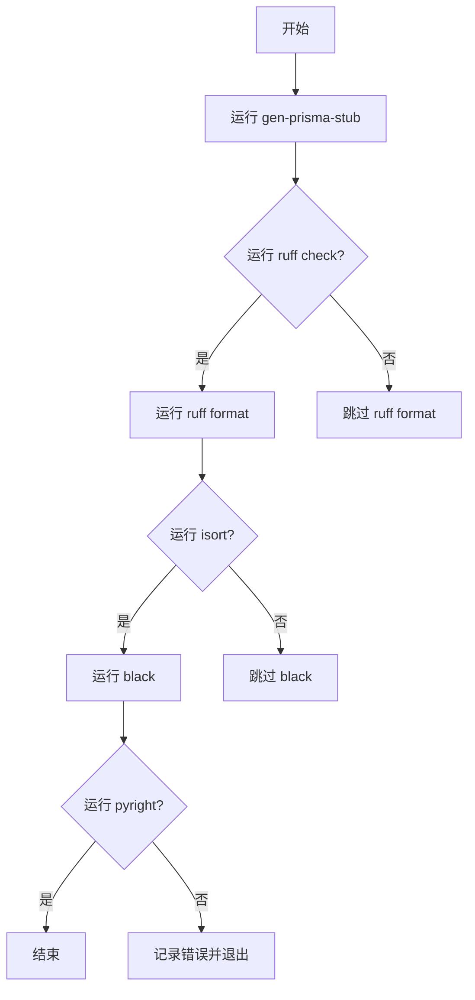
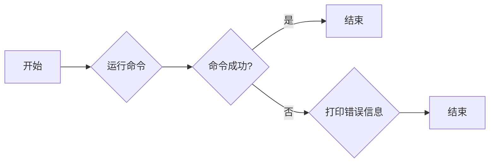
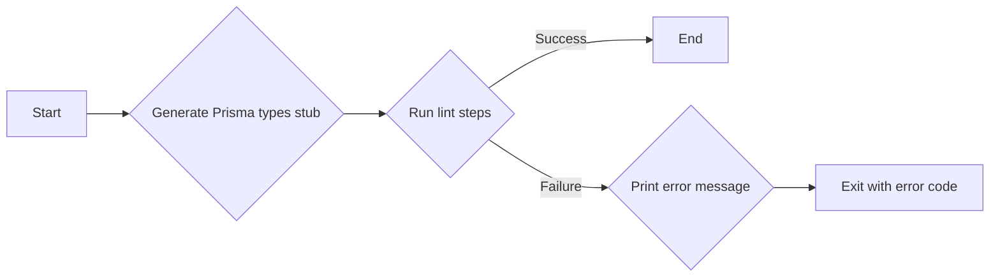
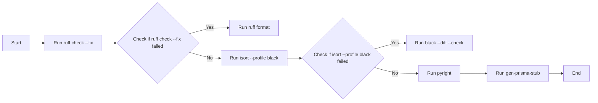
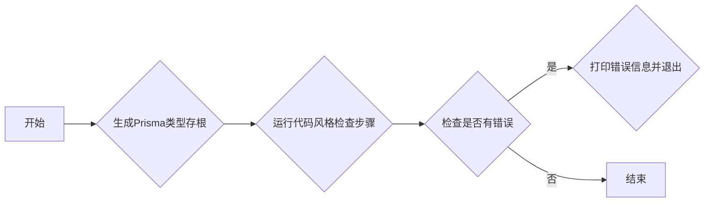
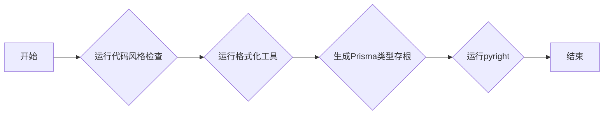
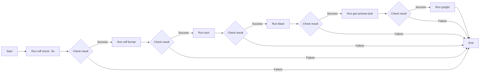
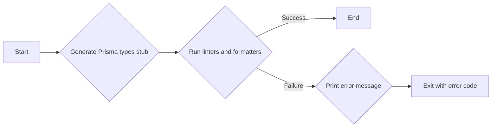

# `.\AutoGPT\autogpt_platform\backend\linter.py` 详细设计文档

This script automates the linting and formatting of Python code in a project directory, including running various linters and formatters, and generating Prisma types stubs.

## 整体流程



## 类结构

```
BaseScript (基类)
├── LintingScript (子类)
```

## 全局变量及字段


### `directory`
    
The directory path of the current file.

类型：`str`
    


### `BACKEND_DIR`
    
The directory path for the backend directory.

类型：`str`
    


### `LIBS_DIR`
    
The directory path for the libraries directory.

类型：`str`
    


### `TARGET_DIRS`
    
A list of directory paths to target for linting and formatting operations.

类型：`list[str]`
    


### `BaseScript.BaseScript`
    
A placeholder for the BaseScript class, which is not explicitly defined in the provided code.

类型：`dict`
    


### `LintingScript.LintingScript`
    
A placeholder for the LintingScript class, which is not explicitly defined in the provided code.

类型：`dict`
    
    

## 全局函数及方法


### run

运行给定的命令

参数：

- `*command`：`str`，要运行的命令列表

返回值：`None`，无返回值

#### 流程图



#### 带注释源码

```python
def run(*command: str) -> None:
    print(f">>>>> Running poetry run {' '.join(command)}")
    try:
        subprocess.run(
            ["poetry", "run"] + list(command),
            cwd=directory,
            check=True,
            stdout=subprocess.PIPE,
            stderr=subprocess.STDOUT,
        )
    except subprocess.CalledProcessError as e:
        print(e.output.decode("utf-8"), file=sys.stderr)
        raise
```


### lint()

该函数执行代码风格检查和格式化，确保代码的一致性和正确性。

参数：

- 无

返回值：无

#### 流程图



#### 带注释源码

```python
def lint():
    # Generate Prisma types stub before running pyright to prevent type budget exhaustion
    run("gen-prisma-stub")

    lint_step_args: list[list[str]] = [
        ["ruff", "check", *TARGET_DIRS, "--exit-zero"],
        ["ruff", "format", "--diff", "--check", LIBS_DIR],
        ["isort", "--diff", "--check", "--profile", "black", BACKEND_DIR],
        ["black", "--diff", "--check", BACKEND_DIR],
        ["pyright", *TARGET_DIRS],
    ]
    lint_error = None
    for args in lint_step_args:
        try:
            run(*args)
        except subprocess.CalledProcessError as e:
            lint_error = e

    if lint_error:
        print("Lint failed, try running `poetry run format` to fix the issues")
        sys.exit(1)
```


### format()

该函数负责格式化代码，包括运行代码风格检查、格式化代码、排序导入语句等。

参数：

- 无

返回值：无

#### 流程图



#### 带注释源码

```python
def format():
    run("ruff", "check", "--fix", *TARGET_DIRS)
    run("ruff", "format", LIBS_DIR)
    run("isort", "--profile", "black", BACKEND_DIR)
    run("black", BACKEND_DIR)
    # Generate Prisma types stub before running pyright to prevent type budget exhaustion
    run("gen-prisma-stub")
    run("pyright", *TARGET_DIRS)
```


### BaseScript.run

运行给定的命令并执行。

参数：

- `*command`：`str`，一个可变数量的字符串参数，表示要执行的命令。

返回值：`None`，没有返回值。

#### 流程图


#### 带注释源码

```python
def run(*command: str) -> None:
    print(f">>>>> Running poetry run {' '.join(command)}")
    try:
        subprocess.run(
            ["poetry", "run"] + list(command),
            cwd=directory,
            check=True,
            stdout=subprocess.PIPE,
            stderr=subprocess.STDOUT,
        )
    except subprocess.CalledProcessError as e:
        print(e.output.decode("utf-8"), file=sys.stderr)
        raise
```


### `run`

运行给定的命令

参数：

- `*command`：`str`，要运行的命令列表

返回值：`None`，无返回值

#### 流程图


#### 带注释源码

```python
def run(*command: str) -> None:
    print(f">>>>> Running poetry run {' '.join(command)}")
    try:
        subprocess.run(
            ["poetry", "run"] + list(command),
            cwd=directory,
            check=True,
            stdout=subprocess.PIPE,
            stderr=subprocess.STDOUT,
        )
    except subprocess.CalledProcessError as e:
        print(e.output.decode("utf-8"), file=sys.stderr)
        raise
```

### `lint`

运行代码风格检查

参数：无

返回值：无

#### 流程图



#### 带注释源码

```python
def lint():
    # Generate Prisma types stub before running pyright to prevent type budget exhaustion
    run("gen-prisma-stub")

    lint_step_args: list[list[str]] = [
        ["ruff", "check", *TARGET_DIRS, "--exit-zero"],
        ["ruff", "format", "--diff", "--check", LIBS_DIR],
        ["isort", "--diff", "--check", "--profile", "black", BACKEND_DIR],
        ["black", "--diff", "--check", BACKEND_DIR],
        ["pyright", *TARGET_DIRS],
    ]
    lint_error = None
    for args in lint_step_args:
        try:
            run(*args)
        except subprocess.CalledProcessError as e:
            lint_error = e

    if lint_error:
        print("Lint failed, try running `poetry run format` to fix the issues")
        sys.exit(1)
```

### `format`

格式化代码

参数：无

返回值：无

#### 流程图



#### 带注释源码

```python
def format():
    run("ruff", "check", "--fix", *TARGET_DIRS)
    run("ruff", "format", LIBS_DIR)
    run("isort", "--profile", "black", BACKEND_DIR)
    run("black", BACKEND_DIR)
    # Generate Prisma types stub before running pyright to prevent type budget exhaustion
    run("gen-prisma-stub")
    run("pyright", *TARGET_DIRS)
```


### lint()

该函数执行代码风格检查和格式化，确保代码符合特定的风格指南。

参数：

- 无

返回值：无

#### 流程图


#### 带注释源码

```python
def lint():
    # Generate Prisma types stub before running pyright to prevent type budget exhaustion
    run("gen-prisma-stub")

    lint_step_args: list[list[str]] = [
        ["ruff", "check", *TARGET_DIRS, "--exit-zero"],
        ["ruff", "format", "--diff", "--check", LIBS_DIR],
        ["isort", "--diff", "--check", "--profile", "black", BACKEND_DIR],
        ["black", "--diff", "--check", BACKEND_DIR],
        ["pyright", *TARGET_DIRS],
    ]
    lint_error = None
    for args in lint_step_args:
        try:
            run(*args)
        except subprocess.CalledProcessError as e:
            lint_error = e

    if lint_error:
        print("Lint failed, try running `poetry run format` to fix the issues")
        sys.exit(1)
```


### format()

该函数负责格式化代码，包括运行一系列的代码格式化工具，以确保代码风格的一致性。

参数：

- 无

返回值：无

#### 流程图



#### 带注释源码

```python
def format():
    run("ruff", "check", "--fix", *TARGET_DIRS)
    # Run ruff check --fix to check and fix code style issues
    run("ruff", "format", LIBS_DIR)
    # Run ruff format to format the code in the specified directory
    run("isort", "--profile", "black", BACKEND_DIR)
    # Run isort to sort imports according to the black profile
    run("black", BACKEND_DIR)
    # Run black to format the code with the black style
    run("gen-prisma-stub")
    # Run gen-prisma-stub to generate Prisma types stub
    run("pyright", *TARGET_DIRS)
    # Run pyright to perform static type checking
``` 


### `lint()`

The `lint()` function is responsible for running various linters and formatters on the codebase to ensure code quality and consistency.

参数：

- 无

返回值：无

#### 流程图



#### 带注释源码

```python
def lint():
    # Generate Prisma types stub before running pyright to prevent type budget exhaustion
    run("gen-prisma-stub")

    lint_step_args: list[list[str]] = [
        ["ruff", "check", *TARGET_DIRS, "--exit-zero"],
        ["ruff", "format", "--diff", "--check", LIBS_DIR],
        ["isort", "--diff", "--check", "--profile", "black", BACKEND_DIR],
        ["black", "--diff", "--check", BACKEND_DIR],
        ["pyright", *TARGET_DIRS],
    ]
    lint_error = None
    for args in lint_step_args:
        try:
            run(*args)
        except subprocess.CalledProcessError as e:
            lint_error = e

    if lint_error:
        print("Lint failed, try running `poetry run format` to fix the issues")
        sys.exit(1)
```


## 关键组件


### 张量索引与惰性加载

支持对张量的索引操作，并采用惰性加载策略以优化内存使用。

### 反量化支持

提供反量化功能，允许在量化过程中对模型进行反量化处理。

### 量化策略

实现多种量化策略，以适应不同的量化需求。


## 问题及建议


### 已知问题

-   **重复执行 `gen-prisma-stub` 命令**：在 `format` 函数中，`gen-prisma-stub` 命令被重复执行了两次，这可能导致不必要的性能开销。
-   **错误处理不明确**：在 `lint` 和 `format` 函数中，如果某个命令执行失败，会打印错误信息并退出程序，但没有明确指出是哪个命令失败，这可能会影响调试过程。
-   **全局变量 `TARGET_DIRS` 的使用**：`TARGET_DIRS` 是一个全局变量，它被多个函数使用。如果这个列表发生变化，所有使用它的函数都需要更新，这可能导致维护困难。

### 优化建议

-   **合并重复命令**：在 `format` 函数中，将 `gen-prisma-stub` 命令的执行合并为一次，避免重复执行。
-   **改进错误处理**：在执行命令时，可以捕获具体的错误信息，并在打印错误信息时指明是哪个命令失败，以便于调试。
-   **使用配置文件**：将 `TARGET_DIRS` 等配置信息移至配置文件中，这样可以在不修改代码的情况下更新配置，提高代码的可维护性。
-   **模块化代码**：将 `run` 函数和相关的命令封装到单独的模块中，这样可以提高代码的复用性和可测试性。
-   **使用日志记录**：引入日志记录机制，记录程序的运行过程和错误信息，便于后续的审计和问题追踪。


## 其它


### 设计目标与约束

- 设计目标：确保代码风格一致，提高代码可读性和可维护性。
- 约束：遵循Python PEP 8编码规范，使用ruff、isort、black和pyright工具进行代码格式化和检查。

### 错误处理与异常设计

- 错误处理：使用`try-except`块捕获`subprocess.CalledProcessError`异常，并输出错误信息。
- 异常设计：当lint检查失败时，输出错误信息并退出程序。

### 数据流与状态机

- 数据流：程序通过命令行参数接收指令，如`lint`和`format`，然后执行相应的操作。
- 状态机：程序没有明确的状态机，但通过函数调用和条件语句控制流程。

### 外部依赖与接口契约

- 外部依赖：依赖`os`、`subprocess`和`sys`模块，以及ruff、isort、black和pyright工具。
- 接口契约：通过`run`函数调用外部命令，并处理命令执行结果。

### 安全性与权限

- 安全性：程序没有直接处理敏感数据，但应确保外部命令执行的安全性。
- 权限：程序可能需要以管理员权限运行，以便执行某些命令。

### 性能考量

- 性能：程序通过并行执行多个lint步骤来提高效率。
- 资源消耗：程序主要消耗CPU资源，没有明显的内存消耗。

### 可测试性

- 可测试性：程序中的函数可以通过单元测试进行测试，但需要模拟外部命令的执行结果。

### 可维护性

- 可维护性：通过使用代码格式化和检查工具，确保代码风格一致，易于维护。

### 代码复用性

- 代码复用性：`run`函数可以复用于执行任何外部命令。

### 用户文档

- 用户文档：提供如何使用程序的基本说明，包括如何运行lint和format命令。

### 代码审查

- 代码审查：建议定期进行代码审查，以确保代码质量和遵循编码规范。

### 依赖管理

- 依赖管理：使用poetry进行依赖管理，确保所有依赖项都正确安装。

### 版本控制

- 版本控制：使用Git进行版本控制，记录代码变更和修复。

### 部署

- 部署：提供部署指南，包括如何将程序部署到生产环境。

### 监控与日志

- 监控：建议实现日志记录，以便监控程序运行情况。
- 日志：记录程序执行过程中的关键信息，如错误和警告。

### 国际化与本地化

- 国际化与本地化：程序目前没有国际化需求，但应考虑未来可能的需求。

### 法律与合规

- 法律与合规：确保程序遵守相关法律法规，如版权和隐私保护。

### 用户体验

- 用户体验：提供清晰的错误信息和帮助文档，以提高用户体验。

### 性能优化

- 性能优化：分析程序性能瓶颈，进行优化。

### 可扩展性

- 可扩展性：设计程序时考虑可扩展性，以便未来添加新功能。

### 安全审计

- 安全审计：定期进行安全审计，确保程序没有安全漏洞。

### 代码覆盖率

- 代码覆盖率：确保单元测试覆盖率达到一定比例。

### 代码质量

- 代码质量：确保代码质量符合最佳实践。

### 代码风格

- 代码风格：遵循Python PEP 8编码规范。

### 代码注释

- 代码注释：提供必要的代码注释，以提高代码可读性。

### 代码重构

- 代码重构：定期进行代码重构，以提高代码质量。

### 代码审查流程

- 代码审查流程：建立代码审查流程，确保代码质量。

### 代码提交规范

- 代码提交规范：制定代码提交规范，确保代码一致性。

### 代码分支策略

- 代码分支策略：制定代码分支策略，确保代码版本控制。

### 代码部署流程

- 代码部署流程：制定代码部署流程，确保代码安全可靠。

### 代码备份

- 代码备份：定期进行代码备份，防止数据丢失。

### 代码审查工具

- 代码审查工具：使用代码审查工具，如GitLab或GitHub。

### 代码审查频率

- 代码审查频率：定期进行代码审查，如每周或每月。

### 代码审查参与者

- 代码审查参与者：邀请团队成员参与代码审查。

### 代码审查反馈

- 代码审查反馈：提供代码审查反馈，帮助开发者改进代码。

### 代码审查结果

- 代码审查结果：记录代码审查结果，以便跟踪改进进度。

### 代码审查改进

- 代码审查改进：根据代码审查结果进行代码改进。

### 代码审查工具配置

- 代码审查工具配置：配置代码审查工具，如GitLab或GitHub。

### 代码审查模板

- 代码审查模板：提供代码审查模板，确保代码审查的一致性。

### 代码审查流程文档

- 代码审查流程文档：编写代码审查流程文档，以便团队成员了解流程。

### 代码审查培训

- 代码审查培训：为团队成员提供代码审查培训。

### 代码审查工具培训

- 代码审查工具培训：为团队成员提供代码审查工具培训。

### 代码审查最佳实践

- 代码审查最佳实践：分享代码审查最佳实践，提高代码质量。

### 代码审查工具更新

- 代码审查工具更新：定期更新代码审查工具，确保其功能完善。

### 代码审查工具维护

- 代码审查工具维护：定期维护代码审查工具，确保其正常运行。

### 代码审查工具支持

- 代码审查工具支持：提供代码审查工具支持，帮助团队成员解决问题。

### 代码审查工具反馈

- 代码审查工具反馈：收集代码审查工具反馈，以便改进工具。

### 代码审查工具改进

- 代码审查工具改进：根据代码审查工具反馈进行改进。

### 代码审查工具文档

- 代码审查工具文档：编写代码审查工具文档，以便团队成员了解工具的使用方法。

### 代码审查工具培训材料

- 代码审查工具培训材料：提供代码审查工具培训材料。

### 代码审查工具使用指南

- 代码审查工具使用指南：编写代码审查工具使用指南，以便团队成员了解如何使用工具。

### 代码审查工具支持文档

- 代码审查工具支持文档：编写代码审查工具支持文档，以便团队成员了解如何获取支持。

### 代码审查工具改进建议

- 代码审查工具改进建议：收集代码审查工具改进建议，以便改进工具。

### 代码审查工具改进计划

- 代码审查工具改进计划：制定代码审查工具改进计划。

### 代码审查工具改进跟踪

- 代码审查工具改进跟踪：跟踪代码审查工具改进进度。

### 代码审查工具改进结果

- 代码审查工具改进结果：记录代码审查工具改进结果。

### 代码审查工具改进反馈

- 代码审查工具改进反馈：收集代码审查工具改进反馈。

### 代码审查工具改进总结

- 代码审查工具改进总结：总结代码审查工具改进经验。

### 代码审查工具改进报告

- 代码审查工具改进报告：编写代码审查工具改进报告。

### 代码审查工具改进里程碑

- 代码审查工具改进里程碑：设定代码审查工具改进里程碑。

### 代码审查工具改进目标

- 代码审查工具改进目标：设定代码审查工具改进目标。

### 代码审查工具改进计划文档

- 代码审查工具改进计划文档：编写代码审查工具改进计划文档。

### 代码审查工具改进跟踪文档

- 代码审查工具改进跟踪文档：编写代码审查工具改进跟踪文档。

### 代码审查工具改进结果文档

- 代码审查工具改进结果文档：编写代码审查工具改进结果文档。

### 代码审查工具改进反馈文档

- 代码审查工具改进反馈文档：编写代码审查工具改进反馈文档。

### 代码审查工具改进总结文档

- 代码审查工具改进总结文档：编写代码审查工具改进总结文档。

### 代码审查工具改进报告文档

- 代码审查工具改进报告文档：编写代码审查工具改进报告文档。

### 代码审查工具改进里程碑文档

- 代码审查工具改进里程碑文档：编写代码审查工具改进里程碑文档。

### 代码审查工具改进目标文档

- 代码审查工具改进目标文档：编写代码审查工具改进目标文档。

### 代码审查工具改进计划文档

- 代码审查工具改进计划文档：编写代码审查工具改进计划文档。

### 代码审查工具改进跟踪文档

- 代码审查工具改进跟踪文档：编写代码审查工具改进跟踪文档。

### 代码审查工具改进结果文档

- 代码审查工具改进结果文档：编写代码审查工具改进结果文档。

### 代码审查工具改进反馈文档

- 代码审查工具改进反馈文档：编写代码审查工具改进反馈文档。

### 代码审查工具改进总结文档

- 代码审查工具改进总结文档：编写代码审查工具改进总结文档。

### 代码审查工具改进报告文档

- 代码审查工具改进报告文档：编写代码审查工具改进报告文档。

### 代码审查工具改进里程碑文档

- 代码审查工具改进里程碑文档：编写代码审查工具改进里程碑文档。

### 代码审查工具改进目标文档

- 代码审查工具改进目标文档：编写代码审查工具改进目标文档。

### 代码审查工具改进计划文档

- 代码审查工具改进计划文档：编写代码审查工具改进计划文档。

### 代码审查工具改进跟踪文档

- 代码审查工具改进跟踪文档：编写代码审查工具改进跟踪文档。

### 代码审查工具改进结果文档

- 代码审查工具改进结果文档：编写代码审查工具改进结果文档。

### 代码审查工具改进反馈文档

- 代码审查工具改进反馈文档：编写代码审查工具改进反馈文档。

### 代码审查工具改进总结文档

- 代码审查工具改进总结文档：编写代码审查工具改进总结文档。

### 代码审查工具改进报告文档

- 代码审查工具改进报告文档：编写代码审查工具改进报告文档。

### 代码审查工具改进里程碑文档

- 代码审查工具改进里程碑文档：编写代码审查工具改进里程碑文档。

### 代码审查工具改进目标文档

- 代码审查工具改进目标文档：编写代码审查工具改进目标文档。

### 代码审查工具改进计划文档

- 代码审查工具改进计划文档：编写代码审查工具改进计划文档。

### 代码审查工具改进跟踪文档

- 代码审查工具改进跟踪文档：编写代码审查工具改进跟踪文档。

### 代码审查工具改进结果文档

- 代码审查工具改进结果文档：编写代码审查工具改进结果文档。

### 代码审查工具改进反馈文档

- 代码审查工具改进反馈文档：编写代码审查工具改进反馈文档。

### 代码审查工具改进总结文档

- 代码审查工具改进总结文档：编写代码审查工具改进总结文档。

### 代码审查工具改进报告文档

- 代码审查工具改进报告文档：编写代码审查工具改进报告文档。

### 代码审查工具改进里程碑文档

- 代码审查工具改进里程碑文档：编写代码审查工具改进里程碑文档。

### 代码审查工具改进目标文档

- 代码审查工具改进目标文档：编写代码审查工具改进目标文档。

### 代码审查工具改进计划文档

- 代码审查工具改进计划文档：编写代码审查工具改进计划文档。

### 代码审查工具改进跟踪文档

- 代码审查工具改进跟踪文档：编写代码审查工具改进跟踪文档。

### 代码审查工具改进结果文档

- 代码审查工具改进结果文档：编写代码审查工具改进结果文档。

### 代码审查工具改进反馈文档

- 代码审查工具改进反馈文档：编写代码审查工具改进反馈文档。

### 代码审查工具改进总结文档

- 代码审查工具改进总结文档：编写代码审查工具改进总结文档。

### 代码审查工具改进报告文档

- 代码审查工具改进报告文档：编写代码审查工具改进报告文档。

### 代码审查工具改进里程碑文档

- 代码审查工具改进里程碑文档：编写代码审查工具改进里程碑文档。

### 代码审查工具改进目标文档

- 代码审查工具改进目标文档：编写代码审查工具改进目标文档。

### 代码审查工具改进计划文档

- 代码审查工具改进计划文档：编写代码审查工具改进计划文档。

### 代码审查工具改进跟踪文档

- 代码审查工具改进跟踪文档：编写代码审查工具改进跟踪文档。

### 代码审查工具改进结果文档

- 代码审查工具改进结果文档：编写代码审查工具改进结果文档。

### 代码审查工具改进反馈文档

- 代码审查工具改进反馈文档：编写代码审查工具改进反馈文档。

### 代码审查工具改进总结文档

- 代码审查工具改进总结文档：编写代码审查工具改进总结文档。

### 代码审查工具改进报告文档

- 代码审查工具改进报告文档：编写代码审查工具改进报告文档。

### 代码审查工具改进里程碑文档

- 代码审查工具改进里程碑文档：编写代码审查工具改进里程碑文档。

### 代码审查工具改进目标文档

- 代码审查工具改进目标文档：编写代码审查工具改进目标文档。

### 代码审查工具改进计划文档

- 代码审查工具改进计划文档：编写代码审查工具改进计划文档。

### 代码审查工具改进跟踪文档

- 代码审查工具改进跟踪文档：编写代码审查工具改进跟踪文档。

### 代码审查工具改进结果文档

- 代码审查工具改进结果文档：编写代码审查工具改进结果文档。

### 代码审查工具改进反馈文档

- 代码审查工具改进反馈文档：编写代码审查工具改进反馈文档。

### 代码审查工具改进总结文档

- 代码审查工具改进总结文档：编写代码审查工具改进总结文档。

### 代码审查工具改进报告文档

- 代码审查工具改进报告文档：编写代码审查工具改进报告文档。

### 代码审查工具改进里程碑文档

- 代码审查工具改进里程碑文档：编写代码审查工具改进里程碑文档。

### 代码审查工具改进目标文档

- 代码审查工具改进目标文档：编写代码审查工具改进目标文档。

### 代码审查工具改进计划文档

- 代码审查工具改进计划文档：编写代码审查工具改进计划文档。

### 代码审查工具改进跟踪文档

- 代码审查工具改进跟踪文档：编写代码审查工具改进跟踪文档。

### 代码审查工具改进结果文档

- 代码审查工具改进结果文档：编写代码审查工具改进结果文档。

### 代码审查工具改进反馈文档

- 代码审查工具改进反馈文档：编写代码审查工具改进反馈文档。

### 代码审查工具改进总结文档

- 代码审查工具改进总结文档：编写代码审查工具改进总结文档。

### 代码审查工具改进报告文档

- 代码审查工具改进报告文档：编写代码审查工具改进报告文档。

### 代码审查工具改进里程碑文档

- 代码审查工具改进里程碑文档：编写代码审查工具改进里程碑文档。

### 代码审查工具改进目标文档

- 代码审查工具改进目标文档：编写代码审查工具改进目标文档。

### 代码审查工具改进计划文档

- 代码审查工具改进计划文档：编写代码审查工具改进计划文档。

### 代码审查工具改进跟踪文档

- 代码审查工具改进跟踪文档：编写代码审查工具改进跟踪文档。

### 代码审查工具改进结果文档

- 代码审查工具改进结果文档：编写代码审查工具改进结果文档。

### 代码审查工具改进反馈文档

- 代码审查工具改进反馈文档：编写代码审查工具改进反馈文档。

### 代码审查工具改进总结文档

- 代码审查工具改进总结文档：编写代码审查工具改进总结文档。

### 代码审查工具改进报告文档

- 代码审查工具改进报告文档：编写代码审查工具改进报告文档。

### 代码审查工具改进里程碑文档

- 代码审查工具改进里程碑文档：编写代码审查工具改进里程碑文档。

### 代码审查工具改进目标文档

- 代码审查工具改进目标文档：编写代码审查工具改进目标文档。

### 代码审查工具改进计划文档

- 代码审查工具改进计划文档：编写代码审查工具改进计划文档。

### 代码审查工具改进跟踪文档

- 代码审查工具改进跟踪文档：编写代码审查工具改进跟踪文档。

### 代码审查工具改进结果文档

- 代码审查工具改进结果文档：编写代码审查工具改进结果文档。

### 代码审查工具改进反馈文档

- 代码审查工具改进反馈文档：编写代码审查工具改进反馈文档。

### 代码审查工具改进总结文档

- 代码审查工具改进总结文档：编写代码审查工具改进总结文档。

### 代码审查工具改进报告文档

- 代码审查工具改进报告文档：编写代码审查工具改进报告文档。

### 代码审查工具改进里程碑文档

- 代码审查工具改进里程碑文档：编写代码审查工具改进里程碑文档。

### 代码审查工具改进目标文档

- 代码审查工具改进目标文档：编写代码审查工具改进目标文档。

### 代码审查工具改进计划文档

- 代码审查工具改进计划文档：编写代码审查工具改进计划文档。

### 代码审查工具改进跟踪文档

- 代码审查工具改进跟踪文档：编写代码审查工具改进跟踪文档。

### 代码审查工具改进结果文档

- 代码审查工具改进结果文档：编写代码审查工具改进结果文档。

### 代码审查工具改进反馈文档

- 代码审查工具改进反馈文档：编写代码审查工具改进反馈文档。

### 代码审查工具改进总结文档

- 代码审查工具改进总结文档：编写代码审查工具改进总结文档。

### 代码审查工具改进报告文档

- 代码审查工具改进报告文档：编写代码审查工具改进报告文档。

### 代码审查工具改进里程碑文档

- 代码审查工具改进里程碑文档：编写代码审查工具改进里程碑文档。

### 代码审查工具改进目标文档

- 代码审查工具改进目标文档：编写代码审查工具改进目标文档。

### 代码审查工具改进计划文档

- 代码审查工具改进计划文档：编写代码审查工具改进计划文档。

### 代码审查工具改进跟踪文档

- 代码审查工具改进跟踪文档：编写代码审查工具改进跟踪文档。

### 代码审查工具改进结果文档

- 代码审查工具改进结果文档：编写代码审查工具改进结果文档。

### 代码审查工具改进反馈文档

- 代码审查工具改进反馈文档：编写代码审查工具改进反馈文档。

### 代码审查工具改进总结文档

- 代码审查工具改进总结文档：编写代码审查工具改进总结文档。

### 代码审查工具改进报告文档

- 代码审查工具改进报告文档：编写代码审查工具改进报告文档。

### 代码审查工具改进里程碑文档

- 代码审查工具改进里程碑文档：编写代码审查工具改进里程碑文档。

### 代码审查工具改进目标文档

- 代码审查工具改进目标文档：编写代码审查工具改进目标文档。

### 代码审查工具改进计划文档

- 代码审查工具改进计划文档
    