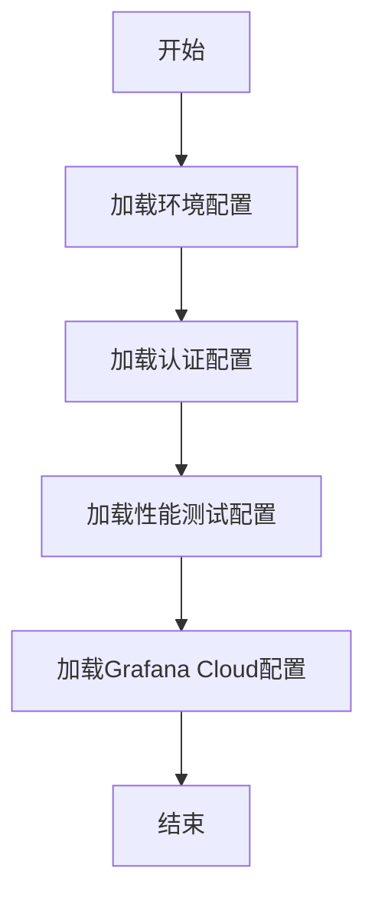

# `.\AutoGPT\autogpt_platform\backend\load-tests\configs\environment.js` 详细设计文档

This file contains environment, authentication, performance, and Grafana Cloud configurations for the AutoGPT Platform, primarily used for load testing and performance monitoring.

## 整体流程



## 类结构

```
ENV_CONFIG (环境配置)
AUTH_CONFIG (认证配置)
PERFORMANCE_CONFIG (性能测试配置)
GRAFANA_CONFIG (Grafana Cloud配置)
getEnvironmentConfig() (获取环境配置)
getLoadTestConfig() (获取负载测试配置)
```

## 全局变量及字段


### `ENV_CONFIG`
    
Contains environment configurations for different environments (DEV, LOCAL, PROD).

类型：`Object`
    


### `AUTH_CONFIG`
    
Contains authentication configurations including test user credentials and JWT token.

类型：`Object`
    


### `PERFORMANCE_CONFIG`
    
Contains performance test configurations including default and specific test parameters.

类型：`Object`
    


### `GRAFANA_CONFIG`
    
Contains Grafana Cloud K6 configuration including project ID, token, and test tags.

类型：`Object`
    


### `__ENV`
    
Contains environment variables used to override default configurations during test execution.

类型：`Object`
    


### `ENV_CONFIG.DEV`
    
Contains development environment configurations.

类型：`Object`
    


### `ENV_CONFIG.LOCAL`
    
Contains local development environment configurations.

类型：`Object`
    


### `ENV_CONFIG.PROD`
    
Contains production environment configurations.

类型：`Object`
    


### `AUTH_CONFIG.TEST_USERS`
    
Contains test user credentials.

类型：`Array`
    


### `AUTH_CONFIG.JWT_TOKEN`
    
Contains JWT token for API access.

类型：`String`
    


### `PERFORMANCE_CONFIG.DEFAULT_VUS`
    
Contains default Virtual Users for load tests.

类型：`Number`
    


### `PERFORMANCE_CONFIG.DEFAULT_DURATION`
    
Contains default duration for load tests.

类型：`String`
    


### `PERFORMANCE_CONFIG.STRESS_VUS`
    
Contains Virtual Users for stress tests.

类型：`Number`
    


### `PERFORMANCE_CONFIG.STRESS_DURATION`
    
Contains duration for stress tests.

类型：`String`
    


### `PERFORMANCE_CONFIG.SPIKE_VUS`
    
Contains Virtual Users for spike tests.

类型：`Number`
    


### `PERFORMANCE_CONFIG.SPIKE_DURATION`
    
Contains duration for spike tests.

类型：`String`
    


### `PERFORMANCE_CONFIG.THRESHOLDS`
    
Contains Service Level Agreement (SLA) thresholds for performance tests.

类型：`Object`
    


### `GRAFANA_CONFIG.PROJECT_ID`
    
Contains project ID for Grafana Cloud K6 configuration.

类型：`String`
    


### `GRAFANA_CONFIG.TOKEN`
    
Contains token for Grafana Cloud K6 configuration.

类型：`String`
    


### `GRAFANA_CONFIG.TEST_TAGS`
    
Contains tags for organizing test results in Grafana Cloud K6 configuration.

类型：`Object`
    
    

## 全局函数及方法


### getEnvironmentConfig()

获取基于环境变量 `K6_ENVIRONMENT` 的环境配置（默认为 `DEV`）。

参数：

- `K6_ENVIRONMENT`：`string`，环境变量 `K6_ENVIRONMENT` 的值，用于确定返回哪个环境配置。

返回值：`object`，包含指定环境的配置对象。

#### 流程图

```mermaid
graph TD
    A[Start] --> B{Check K6_ENVIRONMENT}
    B -- "K6_ENVIRONMENT is defined" --> C[Get config from ENV_CONFIG]
    B -- "K6_ENVIRONMENT is not defined" --> D[Use default "DEV"]
    C --> E[Return config]
    D --> E
```

#### 带注释源码

```javascript
// Get environment config based on K6_ENVIRONMENT variable (default: DEV)
export function getEnvironmentConfig() {
  const env = __ENV.K6_ENVIRONMENT || "DEV"; // Step 1: Get the environment variable or default to "DEV"
  return ENV_CONFIG[env]; // Step 2: Return the corresponding configuration from ENV_CONFIG
}
``` 


### getLoadTestConfig

This function retrieves the load test configuration based on the specified test type.

参数：

- `testType`：`string`，The type of load test to configure. It can be "default", "stress", "spike", or "volume". The default value is "default".

返回值：`object`，An object containing the load test configuration with properties `vus`, `duration`, `rampUp`, and `rampDown`.

#### 流程图

```mermaid
graph TD
    A[Start] --> B{Is testType "default"?}
    B -- Yes --> C[Set vus to DEFAULT_VUS]
    B -- No --> D{Is testType "stress"?}
    D -- Yes --> E[Set vus to STRESS_VUS]
    D -- No --> F{Is testType "spike"?}
    F -- Yes --> G[Set vus to SPIKE_VUS]
    F -- No --> H{Is testType "volume"?}
    H -- Yes --> I[Set vus to VOLUME_VUS]
    C --> J[Set duration to DEFAULT_DURATION]
    E --> J
    G --> J
    I --> J
    J --> K[Set rampUp to DEFAULT_RAMP_UP]
    K --> L[Set rampDown to DEFAULT_RAMP_DOWN]
    L --> M[Return configuration]
    M --> N[End]
```

#### 带注释源码

```javascript
// Helper function to get load test configuration based on test type
export function getLoadTestConfig(testType = "default") {
  const configs = {
    default: {
      vus: PERFORMANCE_CONFIG.DEFAULT_VUS,
      duration: PERFORMANCE_CONFIG.DEFAULT_DURATION,
      rampUp: PERFORMANCE_CONFIG.DEFAULT_RAMP_UP,
      rampDown: PERFORMANCE_CONFIG.DEFAULT_RAMP_DOWN,
    },
    stress: {
      vus: PERFORMANCE_CONFIG.STRESS_VUS,
      duration: PERFORMANCE_CONFIG.STRESS_DURATION,
      rampUp: PERFORMANCE_CONFIG.STRESS_RAMP_UP,
      rampDown: PERFORMANCE_CONFIG.STRESS_RAMP_DOWN,
    },
    spike: {
      vus: PERFORMANCE_CONFIG.SPIKE_VUS,
      duration: PERFORMANCE_CONFIG.SPIKE_DURATION,
      rampUp: PERFORMANCE_CONFIG.SPIKE_RAMP_UP,
      rampDown: PERFORMANCE_CONFIG.SPIKE_RAMP_DOWN,
    },
    volume: {
      vus: PERFORMANCE_CONFIG.VOLUME_VUS,
      duration: PERFORMANCE_CONFIG.VOLUME_DURATION,
      rampUp: PERFORMANCE_CONFIG.VOLUME_RAMP_UP,
      rampDown: PERFORMANCE_CONFIG.VOLUME_RAMP_DOWN,
    },
  };

  return configs[testType] || configs.default;
}
```


## 关键组件


### 环境配置

存储不同环境（开发、本地、生产）的基础URL和密钥。

### 环境配置获取

根据环境变量获取相应的环境配置。

### 认证配置

包含测试用户凭证和JWT令牌配置。

### 性能测试配置

提供默认和特定类型的性能测试参数，如负载测试、压力测试、峰值测试和体积测试。

### 获取负载测试配置

根据测试类型获取相应的负载测试配置。

### Grafana Cloud K6配置

配置Grafana Cloud K6项目ID、令牌和测试标签。


## 问题及建议


### 已知问题

-   **环境配置硬编码**：`ENV_CONFIG` 中的 URL 和密钥是硬编码的，这可能导致维护困难，尤其是在需要更新或更改配置时。
-   **全局变量依赖**：代码中使用了 `__ENV` 全局变量，这可能导致代码的可移植性和可重用性降低，因为 `__ENV` 可能不是所有环境中都有的。
-   **配置复用性差**：`PERFORMANCE_CONFIG` 中的配置是针对不同测试类型硬编码的，这降低了配置的复用性，如果需要添加新的测试类型，可能需要修改多个地方。
-   **安全性问题**：`AUTH_CONFIG` 中的测试用户凭证是硬编码的，这可能导致安全性问题，尤其是在代码被公开或共享时。

### 优化建议

-   **使用配置文件**：将环境配置和敏感信息存储在配置文件中，而不是硬编码在代码中，以提高安全性、可维护性和可移植性。
-   **环境变量优先级**：确保代码能够从环境变量中读取配置，作为配置文件的一个补充，这样可以在不同的环境中灵活配置。
-   **配置模板化**：创建一个配置模板，根据不同的测试类型动态生成配置，这样可以提高配置的复用性。
-   **使用加密存储**：对于敏感信息，如密钥和凭证，使用加密存储，并在需要时解密，以增强安全性。
-   **代码审查和测试**：实施代码审查和自动化测试，以确保配置的正确性和安全性。


## 其它


### 设计目标与约束

- 设计目标：
  - 提供一个灵活的环境配置系统，支持不同环境（开发、本地、生产）的配置。
  - 提供认证配置，包括测试用户凭证和JWT令牌。
  - 提供性能测试配置，包括默认、压力、峰值和体积测试参数。
  - 提供Grafana Cloud K6配置，以便于测试结果的监控和分析。

- 约束：
  - 配置信息应易于管理和更新。
  - 配置信息应支持环境变量覆盖。
  - 配置信息应支持不同测试类型的参数配置。

### 错误处理与异常设计

- 错误处理：
  - 配置信息错误时，应提供明确的错误信息。
  - 环境变量未设置时，应提供默认值。

- 异常设计：
  - 使用try-catch语句捕获潜在的错误。
  - 使用适当的异常类型来表示不同的错误情况。

### 数据流与状态机

- 数据流：
  - 环境配置数据通过环境变量传递。
  - 认证信息通过配置对象传递。
  - 性能测试配置通过配置对象传递。

- 状态机：
  - 系统根据不同的测试类型（默认、压力、峰值、体积）调整性能测试配置。

### 外部依赖与接口契约

- 外部依赖：
  - 环境变量（如K6_ENVIRONMENT、VUS等）。
  - Grafana Cloud API（用于K6配置）。

- 接口契约：
  - 环境配置接口：提供不同环境的配置信息。
  - 认证配置接口：提供用户凭证和JWT令牌。
  - 性能测试配置接口：提供不同测试类型的参数配置。
  - Grafana Cloud K6配置接口：提供K6测试的配置信息。

    