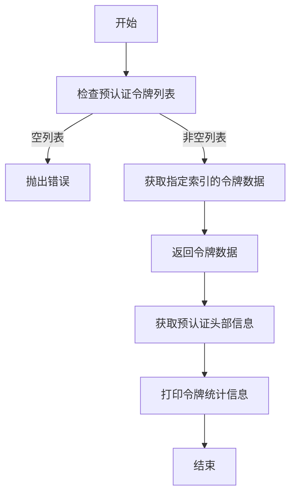
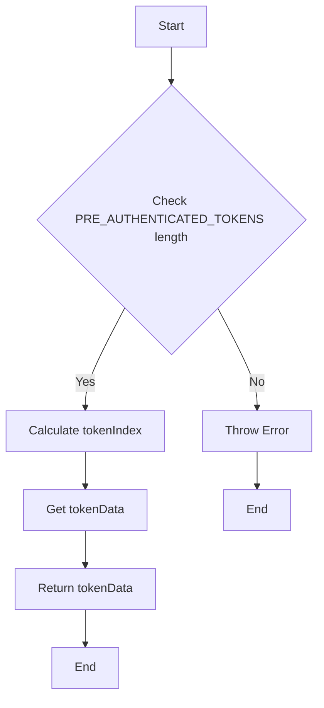
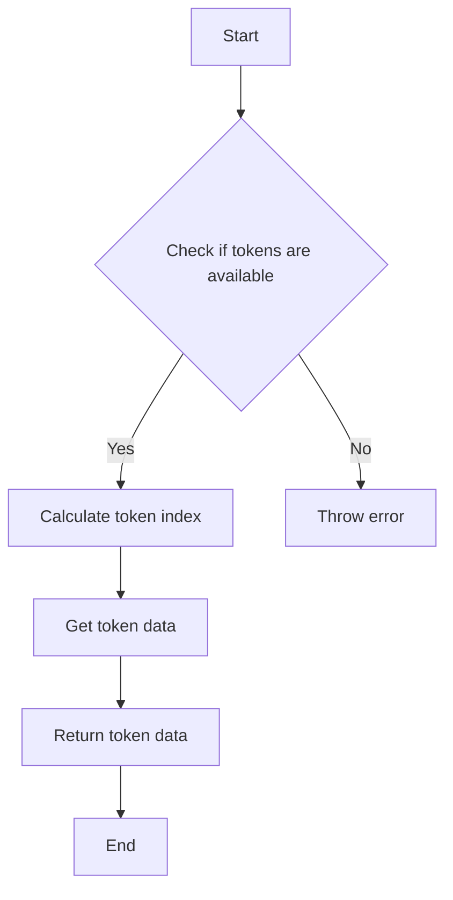
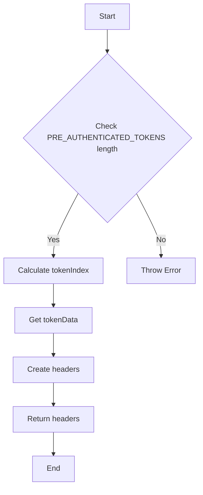

# `.\AutoGPT\autogpt_platform\backend\load-tests\configs\pre-authenticated-tokens.example.js` 详细设计文档

This code provides a mechanism to manage and retrieve pre-authenticated tokens for load testing purposes, including token generation, retrieval, and statistics.

## 整体流程



## 类结构

```
PreAuthenticatedTokens (模块)
```

## 全局变量及字段


### `PRE_AUTHENTICATED_TOKENS`
    
An array of pre-authenticated token objects containing token data.

类型：`Array`
    


### `TOKEN_STATS`
    
An object containing statistics about the pre-authenticated tokens, such as total count, unique users, and the earliest generated date.

类型：`Object`
    


### `global.PRE_AUTHENTICATED_TOKENS`
    
An array of objects, each representing a pre-authenticated token with properties like 'token', 'user', and 'generated'.

类型：`Array<Object>`
    


### `global.TOKEN_STATS`
    
An object with properties 'total', 'users', and 'generated' that provide statistics about the pre-authenticated tokens.

类型：`Object`
    
    

## 全局函数及方法


### `getPreAuthenticatedToken`

获取预认证令牌的数据。

参数：

- `vuId`：`number`，默认值为1，用于确定从预认证令牌数组中获取哪个令牌。

返回值：`{object}`，包含以下字段：
- `access_token`：`string`，访问令牌。
- `user`：`{object}`，用户信息，包含`email`字段。
- `generated`：`string`，令牌生成时间。

#### 流程图



#### 带注释源码

```javascript
export function getPreAuthenticatedToken(vuId = 1) {
  // Check if there are any pre-authenticated tokens available
  if (PRE_AUTHENTICATED_TOKENS.length === 0) {
    throw new Error(
      "No pre-authenticated tokens available. Run: node generate-tokens.js",
    );
  }

  // Calculate the index of the token to be returned
  const tokenIndex = (vuId - 1) % PRE_AUTHENTICATED_TOKENS.length;

  // Get the token data from the array
  const tokenData = PRE_AUTHENTICATED_TOKENS[tokenIndex];

  // Return the token data with the required fields
  return {
    access_token: tokenData.token,
    user: { email: tokenData.user },
    generated: tokenData.generated,
  };
}
```


### `getPreAuthenticatedHeaders`

获取预认证的HTTP头部信息。

参数：

- `vuId`：`number`，默认值为1，用于确定从预认证令牌数组中获取哪个令牌。

返回值：`{Object}`，包含`Content-Type`和`Authorization`头部信息。

#### 流程图

```mermaid
graph TD
    A[Start] --> B{Call getPreAuthenticatedToken(vuId)}
    B -->|Token available| C[Create headers object]
    B -->|No tokens available| D[Throw error]
    C --> E[Return headers object]
    D --> F[End]
    E --> G[End]
```

#### 带注释源码

```javascript
export function getPreAuthenticatedHeaders(vuId = 1) {
  // 获取预认证令牌数据
  const authData = getPreAuthenticatedToken(vuId);
  
  // 创建包含所需头部的对象
  return {
    "Content-Type": "application/json",
    Authorization: `Bearer ${authData.access_token}`,
  };
}
```


### `getPreAuthenticatedToken`

获取预认证令牌的函数。

参数：

- `vuId`：`number`，默认值为1，用于确定从预认证令牌数组中获取哪个令牌。

返回值：`object`，包含访问令牌、用户信息和生成时间。

#### 流程图



#### 带注释源码

```javascript
export function getPreAuthenticatedToken(vuId = 1) {
  // Check if there are any pre-authenticated tokens available
  if (PRE_AUTHENTICATED_TOKENS.length === 0) {
    throw new Error(
      "No pre-authenticated tokens available. Run: node generate-tokens.js",
    );
  }

  // Calculate the index of the token to be returned based on vuId
  const tokenIndex = (vuId - 1) % PRE_AUTHENTICATED_TOKENS.length;

  // Get the token data from the pre-authenticated tokens array
  const tokenData = PRE_AUTHENTICATED_TOKENS[tokenIndex];

  // Return the token data with the required structure
  return {
    access_token: tokenData.token,
    user: { email: tokenData.user },
    generated: tokenData.generated,
  };
}
```


### `getPreAuthenticatedHeaders(vuId = 1)`

获取预认证令牌的HTTP头部信息。

参数：

- `vuId`：`number`，默认值为1，用于确定从预认证令牌数组中获取哪个令牌。

返回值：`Object`，包含HTTP头部信息。

#### 流程图



#### 带注释源码

```javascript
export function getPreAuthenticatedHeaders(vuId = 1) {
  // 获取预认证令牌数据
  const authData = getPreAuthenticatedToken(vuId);
  // 创建HTTP头部信息对象
  return {
    "Content-Type": "application/json",
    Authorization: `Bearer ${authData.access_token}`,
  };
}
``` 


## 关键组件


### 张量索引与惰性加载

张量索引与惰性加载机制，用于高效地访问和操作大型数据集，通过延迟计算和按需加载数据，减少内存消耗和提高性能。

### 反量化支持

反量化支持功能，允许代码在运行时动态调整量化参数，以适应不同的量化需求和优化计算效率。

### 量化策略

量化策略组件，负责将浮点数数据转换为低精度表示（如整数），以减少模型大小和加速推理过程。


## 问题及建议


### 已知问题

-   **硬编码的示例数据**：代码中包含了一个示例数据结构，这可能会误导开发者认为这是一个真实的数据结构。在实际应用中，应该避免硬编码示例数据。
-   **错误处理**：`getPreAuthenticatedToken` 函数在预认证令牌为空时抛出错误，但没有提供任何重试机制或备选方案。
-   **全局变量**：`PRE_AUTHENTICATED_TOKENS` 是一个全局变量，这可能导致代码难以维护和测试。
-   **日志记录**：代码中使用了 `console.log` 来记录加载的令牌数量，但没有提供更详细的日志记录机制。

### 优化建议

-   **移除示例数据**：从代码中移除示例数据，或者将其放在单独的文件中，并明确指出它是一个示例。
-   **提供重试机制**：在 `getPreAuthenticatedToken` 函数中实现重试逻辑，或者在调用该函数的地方处理错误，提供备选方案。
-   **使用模块化**：将 `PRE_AUTHENTICATED_TOKENS` 放在一个模块中，以便更好地管理和测试。
-   **日志记录**：引入日志记录库，如 Winston 或 Bunyan，来提供更灵活和可配置的日志记录功能。
-   **单元测试**：编写单元测试来确保 `getPreAuthenticatedToken` 和 `getPreAuthenticatedHeaders` 函数按预期工作，并处理异常情况。
-   **文档化**：为代码添加详细的文档，包括如何生成令牌、如何使用这些函数以及如何处理错误。
-   **安全性**：确保令牌文件的安全性，不要将其提交到版本控制系统中。


## 其它


### 设计目标与约束

- 设计目标：确保代码能够安全、高效地提供预认证令牌，并支持负载测试。
- 约束条件：令牌文件不应被提交到版本控制系统中，以保护敏感信息。

### 错误处理与异常设计

- 当预认证令牌列表为空时，`getPreAuthenticatedToken` 函数将抛出错误，提示运行 `generate-tokens.js` 命令来生成令牌。
- `getPreAuthenticatedHeaders` 函数依赖于 `getPreAuthenticatedToken` 函数，因此也会在令牌不可用时抛出相同的错误。

### 数据流与状态机

- 数据流：从预认证令牌数组中检索令牌，并将其转换为所需的格式。
- 状态机：没有明确的状态机，但函数调用顺序和依赖关系定义了数据处理流程。

### 外部依赖与接口契约

- 外部依赖：`generate-tokens.js` 脚本用于生成预认证令牌。
- 接口契约：`getPreAuthenticatedToken` 和 `getPreAuthenticatedHeaders` 函数定义了与外部系统交互的接口。

### 安全性与合规性

- 安全性：令牌文件不应被提交到版本控制系统中，以防止敏感信息泄露。
- 合规性：遵守相关数据保护法规，确保敏感信息的安全处理。

### 测试与验证

- 测试策略：应编写单元测试来验证 `getPreAuthenticatedToken` 和 `getPreAuthenticatedHeaders` 函数的正确性。
- 验证方法：通过模拟不同的令牌数量和用户数量来测试函数的行为。

### 维护与扩展性

- 维护策略：定期审查代码以确保其安全性和性能。
- 扩展性：代码结构允许轻松添加新的令牌生成和验证逻辑。


    