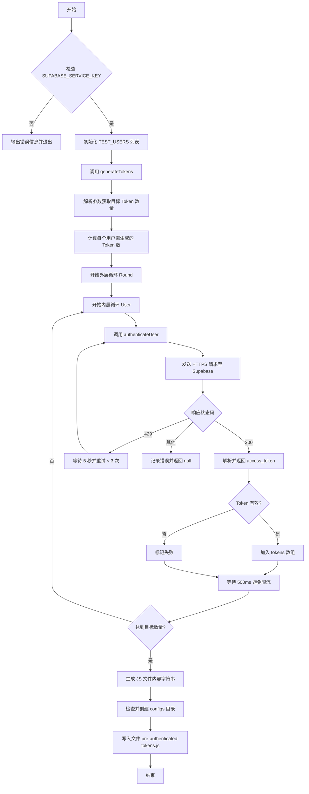
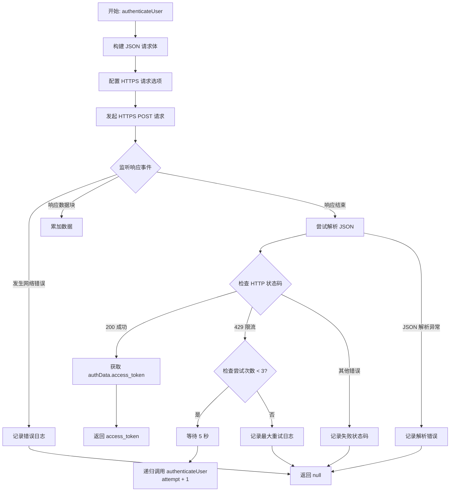
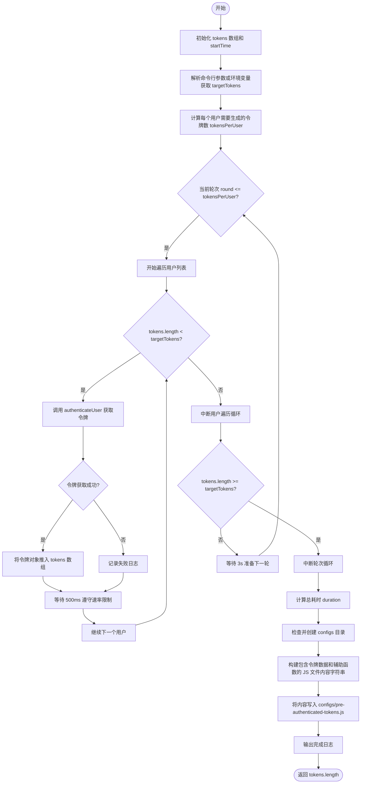

# `.\AutoGPT\autogpt_platform\backend\load-tests\generate-tokens.js` 详细设计文档

该脚本通过模拟多个测试用户向Supabase认证API发起HTTPS请求，批量生成用于负载测试的预认证Token文件。它具备针对API速率限制的自动重试机制，并将生成的Token及相关辅助函数持久化存储到JavaScript配置文件中，以支持高并发负载测试场景。

## 整体流程



## 类结构

```
Global Scope (全局作用域)
├── Constants (常量)
│   ├── SUPABASE_SERVICE_KEY
│   └── TEST_USERS
└── Functions (函数)
    ├── authenticateUser
    └── generateTokens
```

## 全局变量及字段


### `SUPABASE_SERVICE_KEY`
    
从环境变量获取的 Supabase 服务密钥，用于生成 Token 时的授权认证

类型：`string`
    


### `TEST_USERS`
    
用于负载测试的测试用户列表，包含邮箱和密码等凭据信息

类型：`Array<{ email: string, password: string }>`
    


    

## 全局函数及方法


### `authenticateUser`

该函数通过向 Supabase 认证服务端点发送 HTTPS POST 请求来验证用户凭据。它使用服务角色密钥进行授权，包含针对速率限制（HTTP 429）的重试机制，并处理网络错误或认证失败的情况。

参数：

-  `user`：`object`，包含用户认证信息的对象，需包含 `email` 和 `password` 属性。
-  `attempt`：`number`，当前的尝试次数，用于控制重试逻辑，默认值为 1。

返回值：`Promise<string | null>`，如果认证成功则返回访问令牌字符串，如果失败或超过最大重试次数则返回 null。

#### 流程图



#### 带注释源码

```javascript
async function authenticateUser(user, attempt = 1) {
  return new Promise((resolve) => {
    // 1. 准备请求数据
    const postData = JSON.stringify({
      email: user.email,
      password: user.password,
      expires_in: 86400, // 设置过期时间为 24 小时
    });

    // 2. 配置 HTTPS 请求选项
    const options = {
      hostname: "adfjtextkuilwuhzdjpf.supabase.co",
      path: "/auth/v1/token?grant_type=password",
      method: "POST",
      headers: {
        // 使用 Service Key 进行授权
        Authorization: `Bearer ${SUPABASE_SERVICE_KEY}`,
        apikey: SUPABASE_SERVICE_KEY,
        "Content-Type": "application/json",
        "Content-Length": postData.length,
      },
    };

    // 3. 发起 HTTPS 请求
    const req = https.request(options, (res) => {
      let data = "";
      // 接收数据块
      res.on("data", (chunk) => (data += chunk));
      
      // 数据接收完毕处理
      res.on("end", () => {
        try {
          if (res.statusCode === 200) {
            // 认证成功：解析并返回 token
            const authData = JSON.parse(data);
            resolve(authData.access_token);
          } else if (res.statusCode === 429) {
            // 速率限制处理：延迟并重试
            console.log(
              `⏳ Rate limited for ${user.email}, waiting 5s (attempt ${attempt}/3)...`,
            );
            setTimeout(() => {
              if (attempt < 3) {
                // 递归调用自身，增加重试计数
                authenticateUser(user, attempt + 1).then(resolve);
              } else {
                // 达到最大重试次数，放弃
                console.log(`❌ Max retries exceeded for ${user.email}`);
                resolve(null);
              }
            }, 5000);
          } else {
            // 其他 HTTP 错误状态码
            console.log(`❌ Auth failed for ${user.email}: ${res.statusCode}`);
            resolve(null);
          }
        } catch (e) {
          // JSON 解析或其他运行时错误
          console.log(`❌ Parse error for ${user.email}:`, e.message);
          resolve(null);
        }
      });
    });

    // 4. 处理请求层面的网络错误
    req.on("error", (err) => {
      console.log(`❌ Request error for ${user.email}:`, err.message);
      resolve(null);
    });

    // 5. 发送请求体并结束请求
    req.write(postData);
    req.end();
  });
}
```


### `generateTokens`

该函数用于生成负载测试所需的预认证令牌。它通过遍历测试用户列表，循环调用认证接口获取访问令牌，在此过程中通过延时机制规避 API 速率限制，最终将生成的令牌及其元数据写入 `configs/pre-authenticated-tokens.js` 文件中，以便后续测试脚本使用。

参数：

*   无

返回值：`number`，生成的并成功保存到文件中的令牌总数。

#### 流程图



#### 带注释源码

```javascript
async function generateTokens() {
  console.log("🚀 Starting token generation...");
  console.log("Rate limit aware - this will take ~10-15 minutes");
  console.log("===========================================\n");

  const tokens = [];
  const startTime = Date.now();

  // 确定目标令牌数量：优先从命令行参数 --count 获取，其次从环境变量 TOKEN_COUNT 获取，最后默认为 150
  const targetTokens =
    parseInt(
      process.argv.find((arg) => arg.startsWith("--count="))?.split("=")[1],
    ) ||
    parseInt(process.env.TOKEN_COUNT) ||
    150;
  
  // 计算每个用户需要生成多少令牌以达到目标
  const tokensPerUser = Math.ceil(targetTokens / TEST_USERS.length);
  console.log(
    `📊 Generating ${tokensPerUser} tokens per user (${TEST_USERS.length} users) - Target: ${targetTokens}\n`,
  );

  // 外层循环：控制每个用户需要生成的轮次
  for (let round = 1; round <= tokensPerUser; round++) {
    console.log(`🔄 Round ${round}/${tokensPerUser}:`);

    // 内层循环：遍历所有用户进行认证
    for (
      let i = 0;
      i < TEST_USERS.length && tokens.length < targetTokens;
      i++
    ) {
      const user = TEST_USERS[i];

      process.stdout.write(`   ${user.email.padEnd(25)} ... `);

      // 调用认证函数获取 Token
      const token = await authenticateUser(user);

      if (token) {
        // 如果认证成功，保存 Token 信息
        tokens.push({
          token,
          user: user.email,
          generated: new Date().toISOString(),
          round: round,
        });
        console.log(`✅ (${tokens.length}/${targetTokens})`);
      } else {
        console.log(`❌`);
      }

      // 如果未达到目标数量，等待 500ms 以遵守速率限制
      if (tokens.length < targetTokens) {
        await new Promise((resolve) => setTimeout(resolve, 500));
      }
    }

    // 如果已达到目标数量，提前退出
    if (tokens.length >= targetTokens) break;

    // 轮次之间等待更长的时间（3s）
    if (round < tokensPerUser) {
      console.log(`   ⏸️  Waiting 3s before next round...\n`);
      await new Promise((resolve) => setTimeout(resolve, 3000));
    }
  }

  // 计算总耗时
  const duration = Math.round((Date.now() - startTime) / 1000);
  console.log(`\n✅ Generated ${tokens.length} tokens in ${duration}s`);

  // 确保 configs 目录存在
  const configsDir = path.join(process.cwd(), "configs");
  if (!fs.existsSync(configsDir)) {
    fs.mkdirSync(configsDir, { recursive: true });
  }

  // 准备写入文件的内容：包含 Token 数组和辅助获取函数
  const jsContent = `// Pre-authenticated tokens for load testing
// Generated: ${new Date().toISOString()}
// Total tokens: ${tokens.length}
// Generation time: ${duration} seconds
// 
// ⚠️  SECURITY: This file contains real authentication tokens
// ⚠️  DO NOT COMMIT TO GIT - File is gitignored

export const PRE_AUTHENTICATED_TOKENS = ${JSON.stringify(tokens, null, 2)};

export function getPreAuthenticatedToken(vuId = 1) {
  if (PRE_AUTHENTICATED_TOKENS.length === 0) {
    throw new Error('No pre-authenticated tokens available');
  }
  
  const tokenIndex = (vuId - 1) % PRE_AUTHENTICATED_TOKENS.length;
  const tokenData = PRE_AUTHENTICATED_TOKENS[tokenIndex];
  
  return {
    access_token: tokenData.token,
    user: { email: tokenData.user },
    generated: tokenData.generated
  };
}

// Generate single session ID for this test run
const LOAD_TEST_SESSION_ID = '${new Date().toISOString().slice(0, 16).replace(/:/g, "-")}-' + Math.random().toString(36).substr(2, 8);

export function getPreAuthenticatedHeaders(vuId = 1) {
  const authData = getPreAuthenticatedToken(vuId);
  
  return {
    'Content-Type': 'application/json',
    'Authorization': \`Bearer \${authData.access_token}\`,
    'X-Load-Test-Session': LOAD_TEST_SESSION_ID,
    'X-Load-Test-VU': vuId.toString(),
    'X-Load-Test-User': authData.user.email,
  };
}

export const TOKEN_STATS = {
  total: PRE_AUTHENTICATED_TOKENS.length,
  users: [...new Set(PRE_AUTHENTICATED_TOKENS.map(t => t.user))].length,
  generated: PRE_AUTHENTICATED_TOKENS[0]?.generated || 'unknown'
};

console.log(\`🔐 Loaded \${TOKEN_STATS.total} pre-authenticated tokens from \${TOKEN_STATS.users} users\`);
`;

  // 将内容写入文件
  const tokenFile = path.join(configsDir, "pre-authenticated-tokens.js");
  fs.writeFileSync(tokenFile, jsContent);

  console.log(`💾 Saved to configs/pre-authenticated-tokens.js`);
  console.log(`🚀 Ready for ${tokens.length} concurrent VU load testing!`);
  console.log(
    `\n🔒 Security Note: Token file is gitignored and will not be committed`,
  );

  // 返回生成的 Token 数量
  return tokens.length;
}
```


## 关键组件


### 环境配置与密钥管理

负责从环境变量中读取并验证 `SUPABASE_SERVICE_KEY`，这是执行认证请求所需的授权前提。

### 测试用户生成器

初始化一个包含 47 个测试用户（loadtest4-50）的列表，为负载测试场景提供标准化的凭证数据源。

### 认证客户端

通过 HTTPS 执行异步 POST 请求获取访问令牌，内置针对速率限制（HTTP 429）的检测与自动重试机制。

### 令牌编排器

管理多轮令牌生成流程，根据目标数量动态分配任务，并在请求间与轮次间实施延迟策略以规避 API 限制。

### 文件与输出生成器

动态创建配置目录，将获取的令牌数据序列化为 JavaScript 模块文件，并内嵌用于负载测试的辅助函数与元数据统计。


## 问题及建议


### 已知问题

-   **硬编码的配置信息**：Supabase 域名（`adfjtextkuilwuhzdjpf.supabase.co`）和测试用户列表（`loadtest4-50`）直接写在代码中，导致脚本无法灵活适配不同的部署环境（如 Staging, Prod）或更换测试账号，降低了代码的可移植性。
-   **缺乏进度保存与恢复机制**：脚本采用串行方式生成 Token，耗时较长（约 10-15 分钟）。如果在执行过程中因网络波动或进程崩溃而中断，所有生成的进度将丢失，重新运行不仅浪费时间，还可能因为重复请求导致更严重的 API 限流。
-   **代码生成的文件结构脆弱**：使用字符串拼接（`jsContent`）的方式生成包含逻辑和数据的 `.js` 文件。这种方式容易因特殊字符转义问题导致语法错误，且将数据直接嵌入代码逻辑中，不利于后续的数据处理或格式迁移。
-   **串行执行效率低下**：为了规避速率限制，请求之间强制插入了 `500ms` 延迟，且完全串行执行。对于需要生成大量 Token 的场景，这种保守的策略大大增加了脚本的运行时间。

### 优化建议

-   **配置外部化**：将 API Host、用户凭据、Token 目标数量、重试次数和延迟时间等参数提取到配置文件（如 `config.json`）或环境变量中，提高脚本的灵活性和复用性。
-   **数据与逻辑分离**：建议将生成的 Token 仅保存为 JSON 格式数据文件，并提供一个独立的 JS 模块来读取和封装该 JSON 数据。这样既避免了动态生成代码的安全风险，也便于其他工具直接解析数据。
-   **实现断点续传**：在生成过程中，每生成一定数量的 Token 或每个用户处理完成后，将当前状态持久化（如写入临时文件）。如果脚本中断重试，可以读取临时文件跳过已完成的用户或 Token，继续生成剩余部分。
-   **引入并发控制与更智能的限流处理**：使用 Node.js 原生 `fetch`（如果 Node 版本 >= 18）或 `axios` 简化网络请求代码。引入 `p-limit` 等并发控制库，在保证不超过 API 速率限制的前提下，并行发送请求，显著缩短总耗时。
-   **增加预检查机制**：在开始批量生成前，先发送一个测试请求验证 Service Key 的有效性及网络连通性，避免运行中途才发现认证失败导致的时间浪费。


## 其它


### 设计目标与约束

*   **设计目标**：旨在自动化生成用于负载测试的预认证令牌，替代旧的手动生成脚本；生成包含大量（默认 150 个，可配置）JWT 令牌的配置文件，以支持高并发虚拟用户（VU）的测试场景，从而简化测试环境的准备工作。
*   **约束条件**：
    *   **API 限制**：必须严格遵守 Supabase Auth API 的速率限制，通过在请求间（500ms）和轮次间（3s）插入强制延迟来规避 429 错误。
    *   **环境依赖**：必须配置 `SUPABASE_SERVICE_KEY` 环境变量，否则脚本无法启动。
    *   **网络环境**：需要能够访问特定的 Supabase 项目域名（代码中硬编码为 `adfjtextkuilwuhzdjpf.supabase.co`）。
    *   **文件系统**：脚本需要在当前工作目录下具备创建 `configs` 文件夹及写入文件的权限。

### 错误处理与异常设计

*   **启动阶段**：在脚本初始化时严格检查 `SUPABASE_SERVICE_KEY`，若不存在直接调用 `process.exit(1)` 终止程序，防止后续无意义的网络请求消耗资源。
*   **网络请求阶段**：
    *   **异常捕获**：使用 `req.on('error')` 捕获底层网络错误（如 DNS 解析失败、连接重置），记录错误日志并 resolve(null)，确保不中断主流程。
    *   **状态码处理**：
        *   **200 OK**：解析 JSON 响应，提取 `access_token` 并返回。
        *   **429 Too Many Requests**：触发重试机制，固定等待 5 秒，最多重试 3 次。若超过重试次数则放弃该用户。
        *   **其他 4xx/5xx**：记录状态码和用户信息，视为失败，resolve(null)。
    *   **解析异常**：使用 `try-catch` 包裹 `JSON.parse(data)`，防止因非 JSON 响应体导致的程序崩溃。
*   **整体策略**：采用“尽力而为”的容错策略，单个用户或单次请求的失败（无论是网络问题还是限流）仅导致该次生成跳过，不会阻塞其他用户或下一轮次的令牌生成流程。

### 数据流与状态机

*   **数据流**：
    1.  **输入**：环境变量 (`SUPABASE_SERVICE_KEY`)、CLI 参数 (`--count`)、硬编码的用户凭据模板 (`loadtest{i}@example.com`)。
    2.  **处理**：
        *   初始化测试用户列表。
        *   双层循环（外层控制轮次 `round`，内层遍历用户 `user`）调用认证接口。
        *   累积成功的 Token 及其元数据（用户邮箱、生成时间、轮次）到内存数组。
    3.  **输出**：将 Token 数组序列化为 JavaScript 模板字符串，写入磁盘文件 `configs/pre-authenticated-tokens.js`。
*   **状态机**：
    *   **Init**：检查环境变量 -> 失败则 `Exit` / 成功则进入 `Generating`。
    *   **Generating**：
        *   `Idle`：准备发送请求。
        *   `Requesting`：HTTPS 请求发送中。
        *   `HandlingResponse`：
            *   -> `Success`：保存 Token，进入 `Cooldown`（500ms 短暂延迟）。
            *   -> `RateLimited`：进入 `RetryWait`（5s 延迟），若未超限则回退至 `Requesting`，否则标记失败。
            *   -> `Error`：记录日志，标记失败，进入 `Cooldown`。
        *   `RoundGap`：一轮结束后，若未达到目标数量，等待 3s 后继续下一轮；否则进入 `Finalizing`。
    *   **Finalizing`：格式化输出内容，写入文件，打印统计信息，程序结束。

### 外部依赖与接口契约

*   **Node.js 内置模块**：
    *   `https`：用于向 Supabase 发起 POST 请求。
    *   `fs`：用于检查目录存在性及写入生成的令牌文件。
    *   `path`：用于拼接文件路径，确保跨平台兼容性。
*   **Supabase Auth API**：
    *   **端点**：`https://adfjtextkuilwuhzdjpf.supabase.co/auth/v1/token?grant_type=password`
    *   **方法**：POST
    *   **请求头契约**：
        *   `Authorization`: `Bearer <SERVICE_KEY>` (必填)
        *   `apikey`: `<SERVICE_KEY>` (必填)
        *   `Content-Type`: `application/json`
    *   **请求体契约**：JSON 对象，包含 `email` (string), `password` (string), `expires_in` (number, 秒)。
    *   **响应契约**：
        *   成功 (200)：返回 JSON 对象，必须包含 `access_token` 字段。
        *   限流 (429)：触发客户端重试逻辑。
*   **环境变量**：
    *   `SUPABASE_SERVICE_KEY`：必填，用于授权生成令牌。
    *   `TOKEN_COUNT`：可选，通过 `process.env` 指定生成的目标令牌数量。

### 安全性与合规性

*   **敏感数据管理**：生成的 `configs/pre-authenticated-tokens.js` 文件包含具有完全访问权限的 JWT 令牌。代码通过在输出文件中添加显著的头部注释警示（⚠️ SECURITY），并依赖 `.gitignore` 机制防止敏感信息泄露到代码仓库。
*   **硬编码凭证风险**：测试用户的密码 (`password123`) 和 Supabase 项目域名硬编码在脚本中。虽然在测试场景下可接受，但降低了脚本的可移植性，建议在生产级工具中通过配置文件管理。
*   **服务密钥权限**：脚本依赖高权限的 Service Key (`service_role`)，此密钥可以绕过 RLS (Row Level Security)。若该脚本泄露，攻击者可利用此密钥生成任意用户的令牌，因此需严格控制脚本的分发和运行环境权限。

    