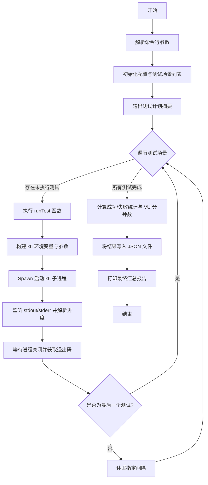
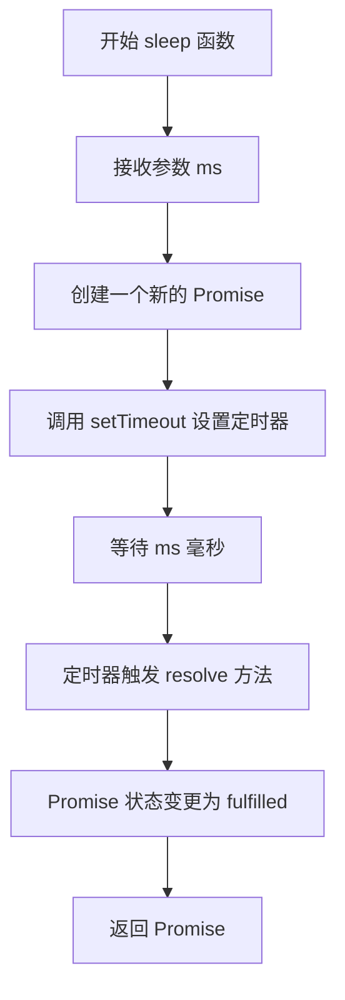
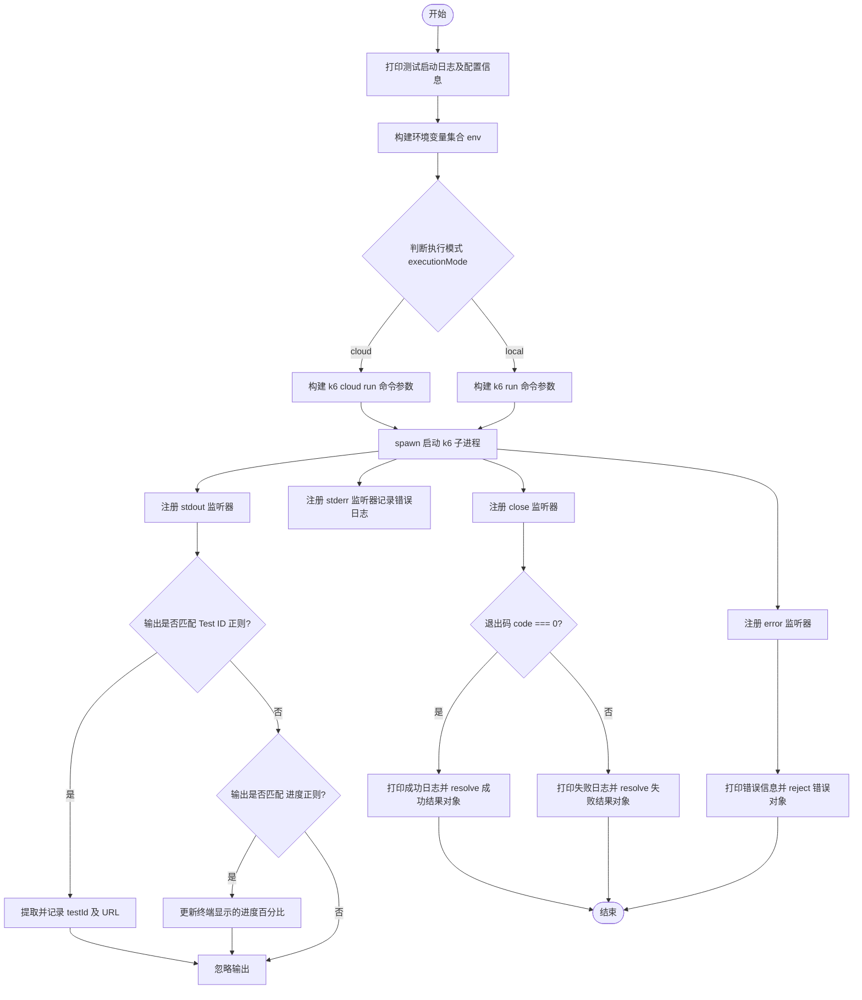
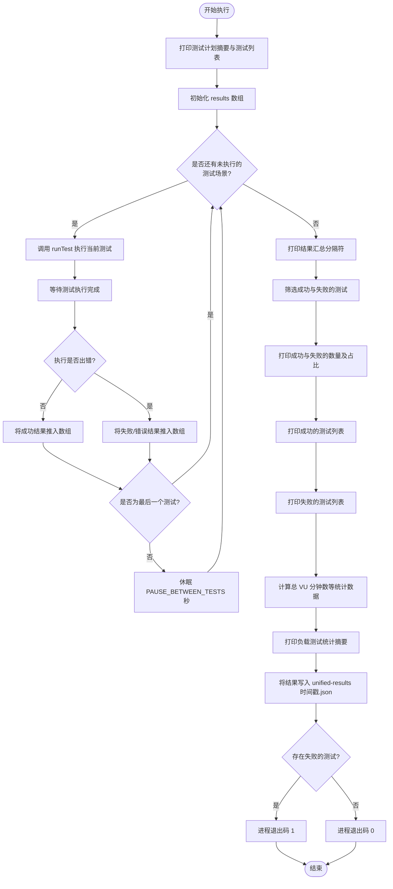

# `.\AutoGPT\autogpt_platform\backend\load-tests\orchestrator\orchestrator.js` 详细设计文档

该代码是一个基于 Node.js 的负载测试编排器，用于自动化管理并执行针对 AutoGPT 平台的一系列高并发测试。它支持本地和云端两种运行模式，按顺序调用 k6 工具执行预设的测试场景（如核心 API、Marketplace 访问等），收集测试结果，计算统计数据，并最终生成 JSON 格式的测试报告。

## 整体流程



## 类结构

```
Global Scope (全局作用域)
├── Constants (常量配置)
├── Variables (变量)
└── Functions (函数定义)
```

## 全局变量及字段


### `args`
    
从 process.argv 中切片获取的命令行参数数组，包含环境配置和执行模式等输入。

类型：`string[]`
    


### `environment`
    
目标运行环境（如 LOCAL, DEV, PROD），默认值为 'DEV'。

类型：`string`
    


### `executionMode`
    
测试执行模式（'local' 或 'cloud'），决定 K6 是在本地运行还是推送到云端，默认值为 'cloud'。

类型：`string`
    


### `unifiedTestScenarios`
    
经过优化的测试场景配置列表，仅包含每种唯一测试类型的最高 VU（虚拟用户）配置。

类型：`Array<Object>`
    


### `K6_CLOUD_TOKEN`
    
用于向 K6 云服务进行身份验证的 API 令牌。

类型：`string`
    


### `K6_CLOUD_PROJECT_ID`
    
K6 云端项目的 ID，用于将测试结果关联到特定的仪表板。

类型：`string`
    


### `PAUSE_BETWEEN_TESTS`
    
在顺序执行不同测试场景之间暂停的时间（秒）。

类型：`number`
    


    

## 全局函数及方法


### `sleep`

一个用于在异步操作中暂停执行指定毫秒数的工具函数。

参数：

-  `ms`：`number`，需要暂停的毫秒数。

返回值：`Promise<void>`，在指定时间过后解析的 Promise 对象。

#### 流程图



#### 带注释源码

```javascript
/**
 * Sleep for specified milliseconds
 * 这是一个辅助函数，用于让当前异步流程等待指定的时间
 */
function sleep(ms) {
  // 返回一个 Promise 对象
  return new Promise(resolve => {
    // 使用 setTimeout 在 ms 毫秒后调用 resolve，从而完成 Promise
    setTimeout(resolve, ms);
  });
}
```


### `runTest`

该函数负责异步执行单个 k6 负载测试脚本，通过生成子进程运行 k6 命令，配置相应的环境变量和参数，实时捕获并解析输出以获取测试 ID 和进度，最终根据进程退出状态返回测试结果对象。

参数：

-  `test`：`object`，测试场景配置对象，包含脚本路径、VU 数量、持续时间、环境变量等测试详情。
-  `index`：`number`，当前测试在统一测试场景数组中的索引，用于日志显示序号。

返回值：`Promise<object>`，返回一个 Promise，解析为包含测试结果的对象，包含成功状态、测试 ID、测试 URL、VU 数量、持续时间及退出码等信息。

#### 流程图



#### 带注释源码

```javascript
/**
 * Run a single k6 test
 */
async function runTest(test, index) {
  return new Promise((resolve, reject) => {
    // 打印测试启动信息，包括序号、名称、配置参数、脚本路径和描述
    console.log(`\n🚀 Test ${index + 1}/${unifiedTestScenarios.length}: ${test.name}`);
    console.log(`📊 Config: ${test.vus} VUs × ${test.duration} (${executionMode} mode)`);
    console.log(`📁 Script: ${test.file}`);
    console.log(`📋 Description: ${test.description}`);
    console.log(`⏱️ Test started: ${new Date().toISOString()}`);

    // 构建传递给 k6 进程的环境变量，包含 Token、Project ID 以及测试特定的 VU、Duration 等
    const env = {
      K6_CLOUD_TOKEN,
      K6_CLOUD_PROJECT_ID,
      K6_ENVIRONMENT: environment,
      VUS: test.vus.toString(),
      DURATION: test.duration,
      RAMP_UP: test.rampUp,
      RAMP_DOWN: test.rampDown,
      ...test.env // 合并测试特定的环境变量
    };

    let args;
    // 根据执行模式（cloud 或 local）确定 k6 的命令行参数
    if (executionMode === 'cloud') {
      args = [
        'cloud', 'run',
        ...Object.entries(env).map(([key, value]) => ['--env', `${key}=${value}`]).flat(), // 展开环境变量为 --env KEY=VAL 格式
        test.file
      ];
    } else {
      args = [
        'run',
        ...Object.entries(env).map(([key, value]) => ['--env', `${key}=${value}`]).flat(),
        test.file
      ];
    }

    // 生成 k6 子进程，配置标准输入输出流
    const k6Process = spawn('k6', args, {
      stdio: ['ignore', 'pipe', 'pipe'],
      env: { ...process.env, ...env } // 继承当前进程环境变量并覆盖测试特定变量
    });

    let output = '';
    let testId = null;

    // 监听标准输出，捕获运行日志
    k6Process.stdout.on('data', (data) => {
      const str = data.toString();
      output += str;
      
      // 尝试从输出中提取 k6 cloud 的测试 ID，用于生成结果链接
      const testIdMatch = str.match(/Test created: .*\/(\d+)/);
      if (testIdMatch) {
        testId = testIdMatch[1];
        console.log(`🔗 Test URL: https://significantgravitas.grafana.net/a/k6-app/runs/${testId}`);
      }

      // 匹配进度百分比并实时显示，覆盖当前行
      const progressMatch = str.match(/(\d+)%/);
      if (progressMatch) {
        process.stdout.write(`\r⏳ Progress: ${progressMatch[1]}%`);
      }
    });

    // 监听标准错误，捕获错误日志
    k6Process.stderr.on('data', (data) => {
      output += data.toString();
    });

    // 监听进程关闭事件（测试结束）
    k6Process.on('close', (code) => {
      process.stdout.write('\n'); // 清除进度显示行
      
      if (code === 0) {
        // 退出码为 0 表示测试成功
        console.log(`✅ ${test.name} SUCCESS`);
        resolve({ 
          success: true, 
          testId, 
          url: testId ? `https://significantgravitas.grafana.net/a/k6-app/runs/${testId}` : 'unknown',
          vus: test.vus,
          duration: test.duration
        });
      } else {
        // 退出码非 0 表示测试失败
        console.log(`❌ ${test.name} FAILED (exit code ${code})`);
        resolve({ 
          success: false, 
          testId, 
          url: testId ? `https://significantgravitas.grafana.net/a/k6-app/runs/${testId}` : 'unknown', 
          exitCode: code,
          vus: test.vus,
          duration: test.duration
        });
      }
    });

    // 监听进程启动错误（如 k6 未安装）
    k6Process.on('error', (error) => {
      console.log(`❌ ${test.name} ERROR: ${error.message}`);
      reject(error);
    });
  });
}
```


### `main`

负载测试编排器的主执行入口函数，负责统筹执行一系列预定义的 K6 负载测试。它依次触发测试场景，处理测试间隔，收集并聚合执行结果，计算负载统计数据，最终生成测试报告及 JSON 结果文件，并根据测试整体成功或失败状态退出进程。

参数：

*   (无参数)

返回值：`Promise<void>`，该函数不直接返回数据，而是根据测试执行情况调用 `process.exit`，成功时返回退出码 0，失败时返回退出码 1。

#### 流程图



#### 带注释源码

```javascript
/**
 * Main execution
 * 主执行函数，负责编排所有负载测试的运行流程
 */
async function main() {
  // 打印统一测试计划的概览信息
  console.log(`\n📋 UNIFIED TEST PLAN`);
  console.log(`📊 Total tests: ${unifiedTestScenarios.length} (reduced from 25 original tests)`);
  console.log(`⏱️ Estimated duration: ~60 minutes\n`);

  // 打印具体包含的测试项列表
  console.log(`📋 Test Summary:`);
  unifiedTestScenarios.forEach((test, i) => {
    console.log(`  ${i + 1}. ${test.name} (${test.vus} VUs × ${test.duration})`);
  });
  console.log('');

  const results = [];

  // 遍历所有定义好的测试场景
  for (let i = 0; i < unifiedTestScenarios.length; i++) {
    const test = unifiedTestScenarios[i];
    
    try {
      // 调用 runTest 执行单个测试，并等待结果
      const result = await runTest(test, i);
      // 将测试配置与结果合并存入 results 数组
      results.push({ ...test, ...result });
      
      // 如果不是最后一个测试，则暂停一段时间，避免瞬间启动过多进程
      if (i < unifiedTestScenarios.length - 1) {
        console.log(`\n⏸️ Pausing ${PAUSE_BETWEEN_TESTS}s before next test...`);
        await sleep(PAUSE_BETWEEN_TESTS * 1000);
      }
    } catch (error) {
      // 捕获运行中的致命错误，记录并标记为失败
      console.error(`💥 Fatal error running ${test.name}:`, error.message);
      results.push({ ...test, success: false, error: error.message });
    }
  }

  // 打印最终结果汇总
  console.log('\n' + '='.repeat(60));
  console.log('🏁 UNIFIED LOAD TEST RESULTS SUMMARY');
  console.log('='.repeat(60));

  const successful = results.filter(r => r.success);
  const failed = results.filter(r => !r.success);

  console.log(`✅ Successful tests: ${successful.length}/${results.length} (${Math.round(successful.length / results.length * 100)}%)`);
  console.log(`❌ Failed tests: ${failed.length}/${results.length}`);

  // 打印成功测试的详情
  if (successful.length > 0) {
    console.log('\n✅ SUCCESSFUL TESTS:');
    successful.forEach(test => {
      console.log(`   • ${test.name} (${test.vus} VUs) - ${test.url}`);
    });
  }

  // 打印失败测试的详情
  if (failed.length > 0) {
    console.log('\n❌ FAILED TESTS:');
    failed.forEach(test => {
      console.log(`   • ${test.name} (${test.vus} VUs) - ${test.url || 'no URL'} (exit: ${test.exitCode || 'unknown'})`);
    });
  }

  // 计算并打印负载统计指标（如总 VU 分钟数）
  const totalVuMinutes = results.reduce((sum, test) => {
    const minutes = parseFloat(test.duration.replace(/[ms]/g, ''));
    const multiplier = test.duration.includes('m') ? 1 : (1/60); // convert seconds to minutes
    return sum + (test.vus * minutes * multiplier);
  }, 0);

  console.log(`\n📊 LOAD TESTING SUMMARY:`);
  console.log(`   • Total VU-minutes tested: ${Math.round(totalVuMinutes)}`);
  console.log(`   • Peak concurrent VUs: ${Math.max(...results.map(r => r.vus))}`);
  console.log(`   • Average test duration: ${(results.reduce((sum, r) => sum + parseFloat(r.duration.replace(/[ms]/g, '')), 0) / results.length).toFixed(1)}${results[0].duration.includes('m') ? 'm' : 's'}`);

  // 将详细的测试结果写入 JSON 文件以便后续分析
  const timestamp = Math.floor(Date.now() / 1000);
  const resultsFile = `unified-results-${timestamp}.json`;
  fs.writeFileSync(resultsFile, JSON.stringify(results, null, 2));
  console.log(`\n📄 Detailed results saved to: ${resultsFile}`);

  console.log(`\n🎉 UNIFIED LOAD TEST ORCHESTRATOR COMPLETE\n`);

  // 如果有失败的测试，退出码为 1，否则为 0
  process.exit(failed.length === 0 ? 0 : 1);
}
```


## 关键组件


### Unified Test Scenarios Configuration
Defines the central data structure for the load testing suite, consolidating parameters for 12 distinct test scenarios—ranging from public marketplace access to core API stress tests—specifying virtual users (VUs), duration, ramp-up/down settings, and target file paths to maximize load coverage without redundancy.

### K6 Subprocess Execution Wrapper
Encapsulates the logic for spawning and managing `k6` child processes within the `runTest` function, handling dynamic argument construction for local versus cloud execution modes, environment variable injection, real-time stdout/stderr capture for progress tracking, and exit code resolution.

### Orchestration and Flow Control
Implements the main control loop in the `main` function that serially executes the defined test scenarios, manages inter-test pauses via the sleep utility, orchestrates the overall runtime sequence, and ensures continuous execution flow even in the event of individual test failures.

### Results Aggregation and Reporting
Handles the post-execution logic for processing test outcomes, parsing K6 cloud URLs from raw output, calculating aggregate metrics such as total VU-minutes and success rates, and persisting detailed execution results to a timestamped JSON file for archival analysis.


## 问题及建议


### 已知问题

-   **硬编码敏感信息风险**：代码中直接硬编码了 `K6_CLOUD_TOKEN` 的默认值，虽然环境变量优先，但将密钥留存在源码中存在严重的安全泄露隐患。
-   **串行执行效率低下**：当前编排逻辑通过 `for` 循环配合 `await` 串行执行测试，导致总耗时极长（约60分钟），无法充分利用机器资源或并行测试环境的能力。
-   **输出解析逻辑脆弱**：依赖正则表达式（如 `str.match(/Test created: .*\/(\d+)/)`）解析子进程的标准输出，一旦 k6 工具升级改变了日志格式，解析逻辑将立即失效。
-   **缺少重试机制**：测试失败后直接记录为失败并继续，没有针对偶发性网络波动或环境抖动的重试策略，可能导致误判。
-   **路径硬编码**：测试脚本路径（如 `tests/marketplace/public-access-test.js`）被硬编码在配置数组中，限制了脚本的移植性和灵活性。

### 优化建议

-   **实现并行测试执行**：利用 `Promise.all` 将互不依赖的测试场景分组并发执行，显著缩短整体测试周期，提高测试效率。
-   **配置外部化**：将 `unifiedTestScenarios` 及相关配置抽取到独立的 JSON 或 YAML 配置文件中，实现测试配置与代码逻辑分离，便于非开发人员调整测试参数。
-   **增强依赖检查与健壮性**：在脚本启动时增加对 `k6` 命令是否存在的检查，并强制要求关键敏感信息（如 Token）必须通过环境变量提供，移除硬编码默认值。
-   **引入重试策略**：为测试函数增加重试逻辑（例如指数退避重试），应对因网络抖动导致的瞬时失败，提高测试结果的可靠性。
-   **丰富结果报告与通知**：除了生成 JSON 文件外，建议集成生成 HTML 可视化报告，或在测试结束时集成 CI/CD 通知（如 Slack、钉钉），以便快速获知测试结果。


## 其它


### 设计目标与约束

设计目标：
1.  **最大负载测试聚焦**：通过筛选每种独特测试类型的最高虚拟用户（VU）计数，消除重复测试，确保资源用于验证系统在峰值负载下的表现。
2.  **全自动化编排**：提供一个统一的入口点，自动管理测试的生命周期，包括环境配置、测试执行、进度监控、结果收集和报告生成。
3.  **多环境支持**：支持通过命令行参数动态切换测试环境（LOCAL, DEV, PROD）和执行模式，无需修改代码即可适应不同的部署场景。
4.  **结果可追溯性**：详细记录每个测试的执行结果、Test ID 及对应的 Grafana URL，并将完整结果导出为 JSON 文件以便后续分析。

约束：
1.  **串行执行**：测试场景被设计为按顺序串行执行，而非并发执行，以避免不同测试类型之间的资源干扰，确保每个测试结果的纯净度。
2.  **强制间隔**：为了给系统留出恢复时间或防止资源积压，测试之间强制设置 30 秒的暂停时间（`PAUSE_BETWEEN_TESTS`）。
3.  **外部依赖强依赖**：脚本强依赖 `k6` 命令行工具已安装在系统 PATH 中，且测试文件路径必须严格符合预定义的文件系统结构。
4.  **环境变量默认值**：为便于执行，代码中包含了硬编码的默认 Token 和 Project ID，这在生产级安全规范中属于弱约束，需在 CI/CD 中被覆盖。

### 错误处理与异常设计

**错误处理策略**：
1.  **子进程级别容错**：
    *   当 `k6` 进程因非零退出码结束时，脚本不会立即终止整个编排流程，而是将状态标记为失败（`success: false`），记录错误信息（`exitCode`），并继续执行下一个测试。这确保了单个测试的失败不会阻断整个测试套件的运行。
    *   通过监听 `error` 事件捕获 `k6` 进程启动失败（如命令不存在、权限不足）等致命错误，此时会通过 Promise reject 抛出异常，中断当前测试并在 `main` 函数中被捕获。
2.  **全局异常捕获**：
    *   `main` 函数通过 `.catch()` 捕获未处理的异常，打印堆栈信息并以状态码 1 退出，防止进程挂起。
3.  **退出状态码约定**：
    *   **Exit Code 0**：所有测试均成功执行。
    *   **Exit Code 1**：至少有一个测试失败，或者在执行过程中发生了未被捕获的系统级错误（如 k6 未安装）。

**异常场景处理**：
*   **缺少测试文件**：`spawn` 可能会启动失败，触发生 `error` 事件，导致脚本终止。
*   **网络中断**：如果 `k6 cloud` 上传过程中断，子进程将返回非零码，脚本记录失败并继续。
*   **环境变量缺失**：使用了逻辑或操作符 `||` 提供后备默认值，避免因变量未定义导致的立即崩溃，但可能导致错误的测试目标环境。

### 数据流与状态机

**数据流**：
1.  **输入阶段**：
    *   **配置输入**：从 `unifiedTestScenarios` 数组读取静态测试定义。
    *   **运行时输入**：从 `process.argv` 获取 Environment 和 Execution Mode；从 `process.env` 获取 K6 Token 和 Project ID。
2.  **处理阶段**：
    *   **环境构建**：将静态配置与运行时输入合并，构建每个测试专属的 `env` 对象。
    *   **进程流数据**：通过 `stdout` 和 `stderr` 管道实时捕获 `k6` 进程的输出。
    *   **解析与提取**：使用正则表达式从 `stdout` 流中提取关键元数据（Test ID、进度百分比）。
3.  **输出阶段**：
    *   **控制台输出**：实时打印测试进度、状态（成功/失败）及汇总信息。
    *   **文件输出**：将汇总后的结果数组序列化为 JSON 字符串，写入时间戳命名的文件（如 `unified-results-{timestamp}.json`）。

**状态机**：
脚本执行遵循一个线性的状态流转模型：

*   **Idle (空闲)**：脚本启动，初始化变量，解析参数。
*   **Initialized (已初始化)**：打印测试计划摘要，准备进入循环。
*   **Spawning (生成中)**：为当前测试创建 `k6` 子进程，设置监听器。
*   **Running (运行中)**：子进程活跃，监听 `data` 事件，更新进度条，解析 Test ID。
*   **Terminating (终止中)**：子进程关闭（`close` 事件），确定退出码，解析 Promise 结果。
*   **Pausing (暂停中)**：若非最后一个测试，进入 `sleep` 等待状态，倒计时结束后跳转回 `Spawning` 执行下一个测试。
*   **Finalizing (结束中)**：所有测试循环结束，计算统计数据（成功率、VU-minutes），生成报告。
*   **Exited (已退出)**：写入文件，根据失败情况调用 `process.exit(0)` 或 `process.exit(1)`。

### 外部依赖与接口契约

**外部依赖**：
1.  **Node.js 环境**：运行脚本的基础运行时，依赖 `child_process` 和 `fs` 内置模块。
2.  **K6 CLI**：核心测试执行引擎。必须作为系统命令可用，支持 `run` (本地) 和 `cloud run` (云端) 两种子命令。
3.  **文件系统**：
    *   **读取依赖**：依赖位于特定路径下的测试脚本文件（例如 `tests/marketplace/public-access-test.js`）。
    *   **写入依赖**：需要对当前目录拥有写入权限，以便生成 JSON 结果文件。

**接口契约**：
1.  **命令行接口 (CLI)**：
    *   **输入**：`node script.js [environment] [executionMode]`
    *   **行为**：未提供参数时，默认 `environment` 为 `DEV`，`executionMode` 为 `cloud`。
2.  **环境变量接口**：
    *   **K6_CLOUD_TOKEN**：用于云执行认证的字符串。如果未设置，使用硬编码的默认值。
    *   **K6_CLOUD_PROJECT_ID**：指定云端的测试项目 ID。
    *   **动态注入**：脚本将测试配置中的 `VUS`, `DURATION`, `RAMP_UP`, `RAMP_DOWN` 等转换为环境变量传递给 `k6` 进程。
3.  **测试脚本契约**：
    *   所有被调用的测试脚本必须能够通过环境变量（`process.env`）接收配置参数，而不是硬编码在测试文件内部。
4.  **进程输出契约**：
    *   **Standard Output**：`k6` 进程的标准输出需包含特定格式的字符串，例如包含 `Test created:` 以正则匹配提取 ID，包含 `%` 以显示进度。
    *   **Exit Code**：`k6` 进程约定返回 `0` 表示成功，非 `0` 表示失败或错误。

    